# Module 04: AI-agenten met Tools

## Inhoudsopgave

- [Video Walkthrough](../../../04-tools)
- [Wat je zult leren](../../../04-tools)
- [Vereisten](../../../04-tools)
- [Begrip van AI-agenten met Tools](../../../04-tools)
- [Hoe Tool-aanroepen werken](../../../04-tools)
  - [Tooldefinities](../../../04-tools)
  - [Besluitvorming](../../../04-tools)
  - [Uitvoering](../../../04-tools)
  - [Antwoordgeneratie](../../../04-tools)
  - [Architectuur: Spring Boot Auto-Wiring](../../../04-tools)
- [Toolketting](../../../04-tools)
- [Start de applicatie](../../../04-tools)
- [Het gebruik van de applicatie](../../../04-tools)
  - [Probeer eenvoudig toolgebruik](../../../04-tools)
  - [Test toolketting](../../../04-tools)
  - [Bekijk het conversatiestroom](../../../04-tools)
  - [Experimenteer met verschillende verzoeken](../../../04-tools)
- [Belangrijke concepten](../../../04-tools)
  - [ReAct-patroon (Redeneren en Handelen)](../../../04-tools)
  - [Toolbeschrijvingen zijn belangrijk](../../../04-tools)
  - [Sessiebeheer](../../../04-tools)
  - [Foutafhandeling](../../../04-tools)
- [Beschikbare tools](../../../04-tools)
- [Wanneer gebruik je tool-gebaseerde agenten](../../../04-tools)
- [Tools versus RAG](../../../04-tools)
- [Volgende stappen](../../../04-tools)

## Video Walkthrough

Bekijk deze live sessie die uitlegt hoe je met deze module aan de slag gaat:

<a href="https://www.youtube.com/watch?v=O_J30kZc0rw"></a>

## Wat je zult leren

Tot nu toe heb je geleerd hoe je gesprekken met AI voert, effectieve prompts structureert en antwoorden baseert op je documenten. Maar er is nog een fundamentele beperking: taalmodellen kunnen alleen tekst genereren. Ze kunnen het weer niet controleren, geen berekeningen uitvoeren, geen databases raadplegen of communiceren met externe systemen.

Tools veranderen dit. Door het model toegang te geven tot functies die het kan aanroepen, transformeer je het van een tekstgenerator naar een agent die acties kan ondernemen. Het model bepaalt wanneer het een tool nodig heeft, welke tool te gebruiken en welke parameters mee te geven. Jouw code voert de functie uit en geeft het resultaat terug. Het model verwerkt dat resultaat in zijn antwoord.

## Vereisten

- Voltooide [Module 01 - Introductie](../01-introduction/README.md) (Azure OpenAI-resources gedeployed)
- Voltooide eerdere modules aanbevolen (deze module verwijst naar [RAG-concepten uit Module 03](../03-rag/README.md) in de Tools vs RAG vergelijking)
- `.env` bestand in de hoofdmap met Azure-gegevens (gemaakt met `azd up` in Module 01)

> **Opmerking:** Als je Module 01 nog niet hebt voltooid, volg dan eerst de implementatie-instructies daar.

## Begrip van AI-agenten met Tools

> **📝 Opmerking:** De term "agenten" in deze module verwijst naar AI-assistenten die zijn uitgebreid met tool-aanroepmogelijkheden. Dit verschilt van de **Agentic AI**-patronen (autonome agenten met planning, geheugen en meervoudige redeneerstappen) die we behandelen in [Module 05: MCP](../05-mcp/README.md).

Zonder tools kan een taalmodel alleen tekst genereren op basis van zijn trainingsdata. Vraag het naar het huidige weer en het moet raden. Geef het tools en het kan een weer-API aanroepen, berekeningen uitvoeren of een database raadplegen — en die echte resultaten verweven in zijn antwoord.

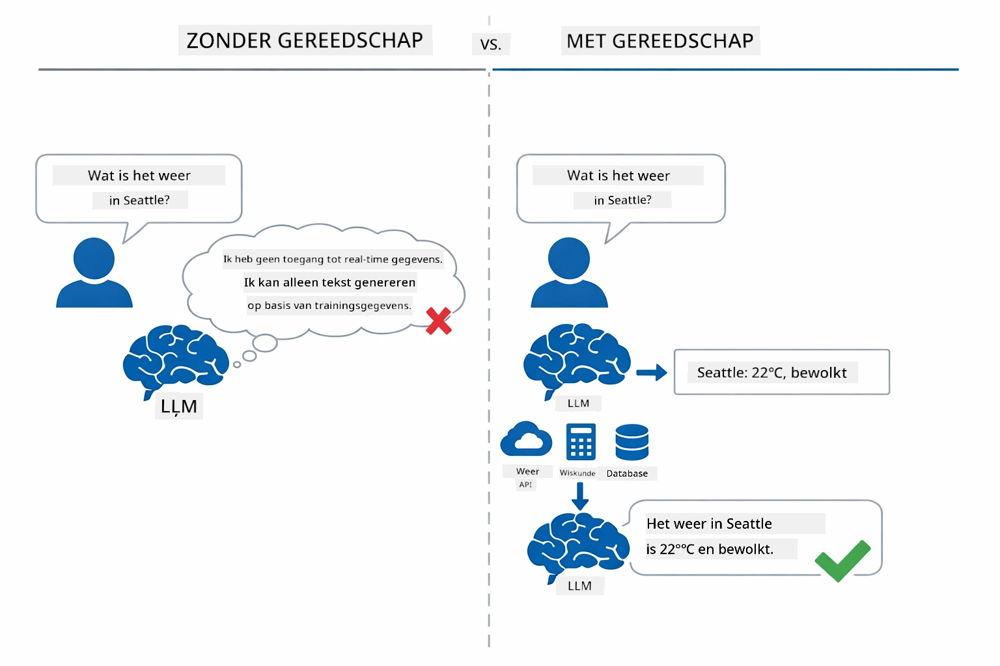

*Zonder tools kan het model alleen raden — met tools kan het API's aanroepen, berekeningen uitvoeren en realtime data teruggeven.*

Een AI-agent met tools volgt een **Reasoning and Acting (ReAct)** patroon. Het model reageert niet alleen — het denkt na over wat het nodig heeft, handelt door een tool aan te roepen, observeert het resultaat, en besluit dan of het opnieuw moet handelen of het eindantwoord moet geven:

1. **Redeneren** — De agent analyseert de vraag van de gebruiker en bepaalt welke informatie nodig is
2. **Handelen** — De agent kiest de juiste tool, genereert de juiste parameters en roept deze aan
3. **Observeren** — De agent ontvangt de output van de tool en evalueert het resultaat
4. **Herhalen of beantwoorden** — Indien meer data nodig is, begint de agent een nieuwe cyclus; anders stelt hij een natuurlijk taalantwoord samen

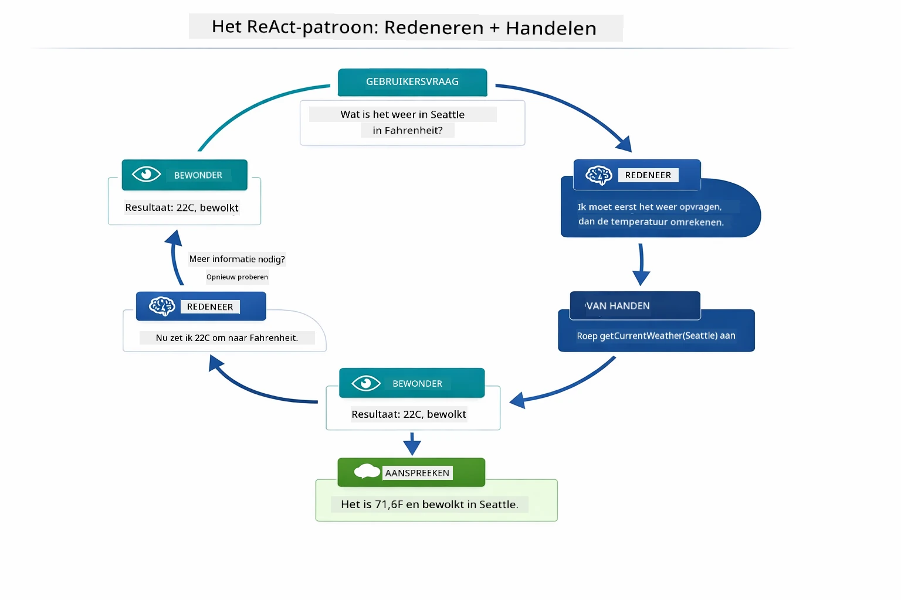

*De ReAct-cyclus — de agent overweegt wat te doen, handelt door een tool aan te roepen, observeert het resultaat en herhaalt tot het een eindantwoord kan geven.*

Dit gebeurt automatisch. Jij definieert de tools en hun beschrijvingen. Het model regelt zelf wanneer en hoe deze te gebruiken.

## Hoe Tool-aanroepen werken

### Tooldefinities

[WeatherTool.java](../../../04-tools/src/main/java/com/example/langchain4j/agents/tools/WeatherTool.java) | [TemperatureTool.java](../../../04-tools/src/main/java/com/example/langchain4j/agents/tools/TemperatureTool.java)

Je definieert functies met duidelijke beschrijvingen en parameter-specificaties. Het model ziet deze beschrijvingen in zijn systeem-prompt en begrijpt wat elke tool doet.

```java
@Component
public class WeatherTool {
    
    @Tool("Get the current weather for a location")
    public String getCurrentWeather(@P("Location name") String location) {
        // Uw logica voor het opzoeken van het weer
        return "Weather in " + location + ": 22°C, cloudy";
    }
}

@AiService
public interface Assistant {
    String chat(@MemoryId String sessionId, @UserMessage String message);
}

// Assistent wordt automatisch verbonden door Spring Boot met:
// - ChatModel bean
// - Alle @Tool-methoden van @Component-klassen
// - ChatMemoryProvider voor sessiebeheer
```

Het onderstaande diagram breekt elke annotatie af en laat zien hoe elk onderdeel de AI helpt te begrijpen wanneer de tool moet worden aangeroepen en welke argumenten meegegeven moeten worden:

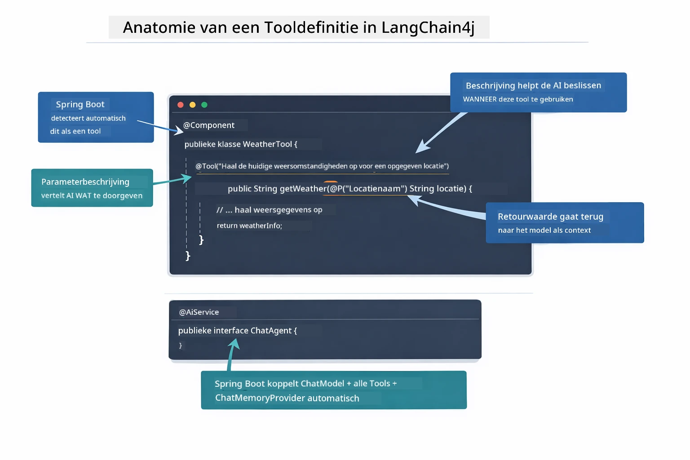

*Anatomie van een tooldefinitie — @Tool vertelt de AI wanneer het te gebruiken, @P beschrijft elke parameter, en @AiService verbindt alles bij de startup.*

> **🤖 Probeer met [GitHub Copilot](https://github.com/features/copilot) Chat:** Open [`WeatherTool.java`](../../../04-tools/src/main/java/com/example/langchain4j/agents/tools/WeatherTool.java) en vraag:
> - "Hoe integreer ik een echte weer-API zoals OpenWeatherMap in plaats van mockdata?"
> - "Wat maakt een goede toolbeschrijving die de AI helpt de tool correct te gebruiken?"
> - "Hoe ga ik om met API-fouten en rate limits in toolimplementaties?"

### Besluitvorming

Wanneer een gebruiker vraagt "Wat is het weer in Seattle?", kiest het model niet willekeurig een tool. Het vergelijkt de bedoeling van de gebruiker met elke beschikbare toolbeschrijving, scoort ze op relevantie en selecteert de beste match. Het genereert dan een gestructureerde functie-aanroep met de juiste parameters – in dit geval `location` ingesteld op `"Seattle"`.

Als geen enkele tool overeenkomt met het verzoek van de gebruiker, valt het model terug op het beantwoorden vanuit zijn eigen kennis. Bij meerdere matches kiest het de meest specifieke.

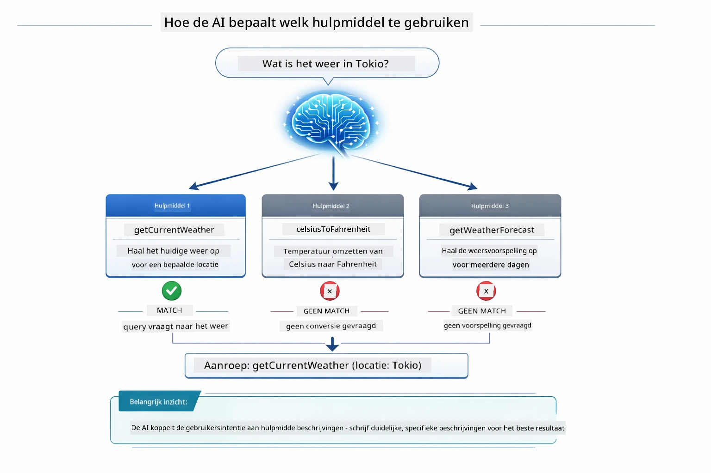

*Het model beoordeelt elke beschikbare tool ten opzichte van de intentie van de gebruiker en selecteert de beste match — daarom zijn duidelijke en specifieke toolbeschrijvingen belangrijk.*

### Uitvoering

[AgentService.java](../../../04-tools/src/main/java/com/example/langchain4j/agents/service/AgentService.java)

Spring Boot auto-wiret de declaratieve `@AiService` interface met alle geregistreerde tools, en LangChain4j voert tool-aanroepen automatisch uit. Achter de schermen doorloopt een volledige tool-aanroep zes fasen — van de natuurlijke taalvraag van de gebruiker tot een natuurlijk taalantwoord terug:

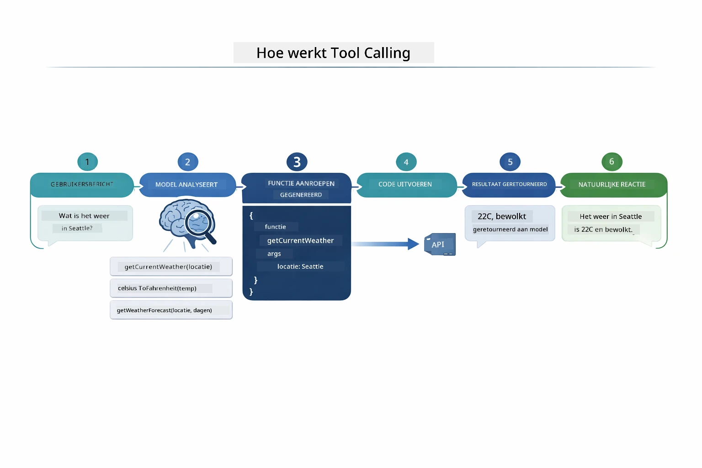

*De end-to-end flow — de gebruiker stelt een vraag, het model selecteert een tool, LangChain4j voert deze uit, en het model verwerkt het resultaat in een natuurlijk antwoord.*

Als je de [ToolIntegrationDemo](../../../00-quick-start/src/main/java/com/example/langchain4j/quickstart/ToolIntegrationDemo.java) in Module 00 hebt uitgevoerd, heb je dit patroon al gezien — de `Calculator` tools werden op dezelfde manier aangeroepen. Het onderstaande sequentiediagram toont precies wat er achter de schermen gebeurde tijdens die demo:

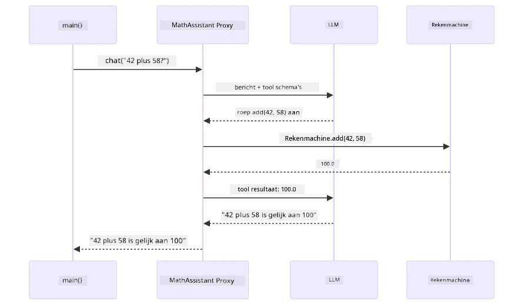

*De tool-aanroeplus uit de Quick Start demo — `AiServices` stuurt je bericht en toolschemas naar de LLM, de LLM antwoordt met een functie-aanroep zoals `add(42, 58)`, LangChain4j voert de `Calculator` methode lokaal uit en geeft het resultaat terug voor het eindantwoord.*

> **🤖 Probeer met [GitHub Copilot](https://github.com/features/copilot) Chat:** Open [`AgentService.java`](../../../04-tools/src/main/java/com/example/langchain4j/agents/service/AgentService.java) en vraag:
> - "Hoe werkt het ReAct-patroon en waarom is het effectief voor AI-agenten?"
> - "Hoe besluit de agent welke tool te gebruiken en in welke volgorde?"
> - "Wat gebeurt er als een tool-executie mislukt – hoe kan ik fouten robuust afhandelen?"

### Antwoordgeneratie

Het model ontvangt de weersgegevens en formatteert deze in een natuurlijk taalantwoord voor de gebruiker.

### Architectuur: Spring Boot Auto-Wiring

Deze module gebruikt LangChain4j's Spring Boot-integratie met declaratieve `@AiService` interfaces. Bij het opstarten ontdekt Spring Boot elke `@Component` die `@Tool` methoden bevat, je `ChatModel` bean en de `ChatMemoryProvider` — en verbindt ze allemaal in één `Assistant` interface zonder enige overhead.

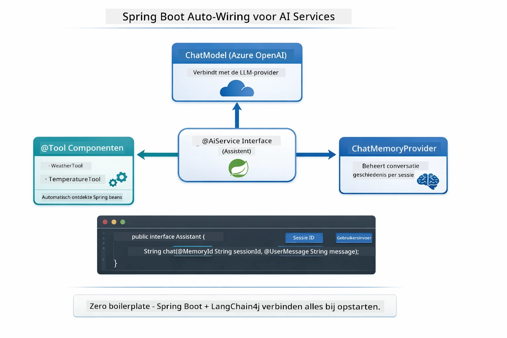

*De @AiService interface koppelt ChatModel, toolcomponenten en geheugenprovider — Spring Boot regelt alle koppelingen automatisch.*

Hier is de volledige levenscyclus van een verzoek als sequentiediagram — van het HTTP-verzoek via controller, service en automatisch gekoppelde proxy, helemaal tot de tool-uitvoering en terug:

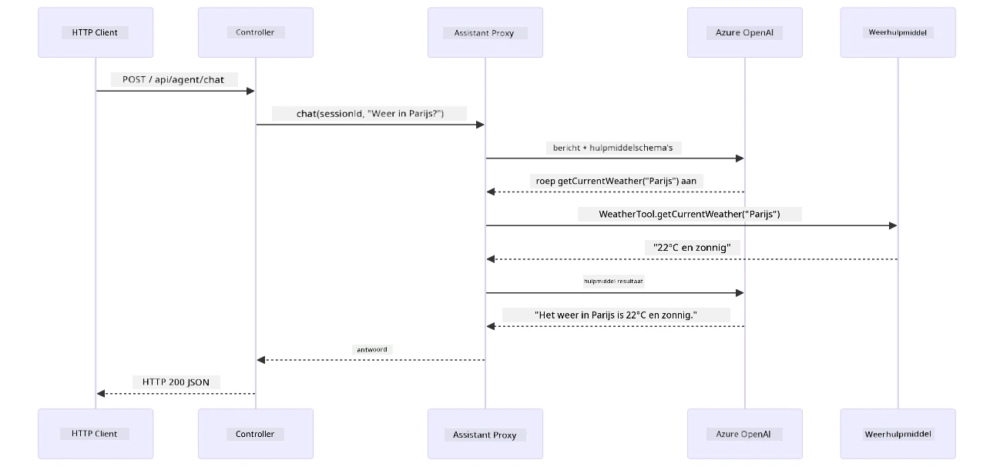

*De complete Spring Boot request levenscyclus — HTTP-verzoek stroomt via controller en service naar de automatisch gekoppelde Assistant proxy, die LLM en tool-aanroepen automatisch orkestreert.*

Belangrijke voordelen van deze aanpak:

- **Spring Boot auto-wiring** — ChatModel en tools worden automatisch geïnjecteerd
- **@MemoryId patroon** — Automatisch sessiegebaseerd geheugenbeheer
- **Een enkele instantie** — Assistant wordt één keer gecreëerd en hergebruikt voor betere prestaties
- **Typesafe uitvoering** — Java-methoden worden direct aangeroepen met typeconversie
- **Multi-turn orkestratie** — Behandelt toolketting automatisch
- **Geen boilerplate** — Geen handmatige `AiServices.builder()` oproepen of geheugen-HashMap nodig

Alternatieve benaderingen (handmatige `AiServices.builder()`) vereisen meer code en missen de voordelen van Spring Boot-integratie.

## Toolketting

**Toolketting** — De werkelijke kracht van tool-gebaseerde agenten blijkt als een enkele vraag meerdere tools vereist. Vraag "Wat is het weer in Seattle in Fahrenheit?" en de agent koppelt automatisch twee tools: eerst roept hij `getCurrentWeather` aan voor de temperatuur in Celsius, vervolgens geeft hij die waarde door aan `celsiusToFahrenheit` voor conversie — allemaal in één gespreksronde.

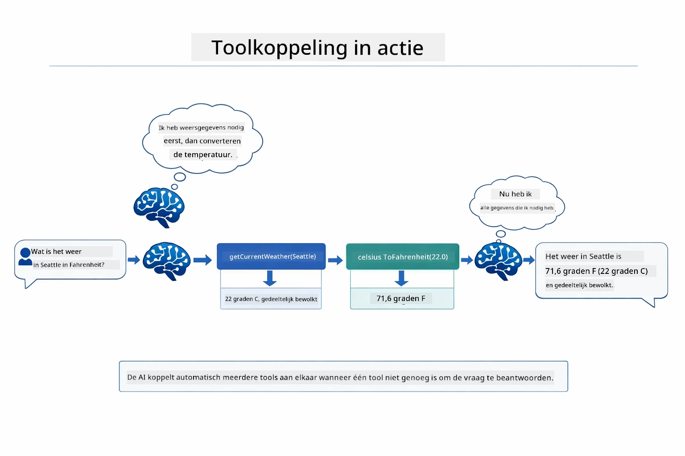

*Toolketting in actie — de agent roept eerst getCurrentWeather aan, pipeert het Celsius-resultaat door naar celsiusToFahrenheit en levert een gecombineerd antwoord.*

**Gracieus Falen** — Vraag naar het weer in een stad die niet in de mockdata zit. De tool retourneert een foutmelding, en de AI legt uit dat het niet kan helpen in plaats van te crashen. Tools falen veilig. Het onderstaande diagram vergelijkt de twee benaderingen — met correcte foutafhandeling vangt de agent de uitzondering op en reageert behulpzaam, zonder dat de hele applicatie crasht:

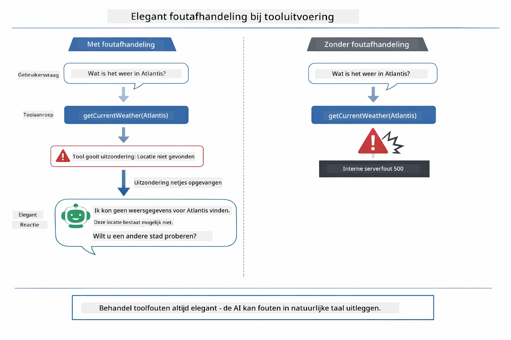

*Wanneer een tool faalt, vangt de agent de fout op en reageert met een behulpzame uitleg in plaats van te crashen.*

Dit gebeurt in één gespreksronde. De agent orkestreert meerdere tool-aanroepen autonoom.

## Start de applicatie

**Controleer deployment:**

Zorg dat het `.env` bestand bestaat in de hoofdmap met Azure-gegevens (aangemaakt tijdens Module 01). Voer dit uit vanuit de module-map (`04-tools/`):

**Bash:**
```bash
cat ../.env  # Moet AZURE_OPENAI_ENDPOINT, API_KEY, DEPLOYMENT weergeven
```

**PowerShell:**
```powershell
Get-Content ..\.env  # Moet AZURE_OPENAI_ENDPOINT, API_KEY, DEPLOYMENT tonen
```

**Start de applicatie:**

> **Opmerking:** Als je al alle applicaties hebt gestart met `./start-all.sh` vanuit de hoofdmap (zoals beschreven in Module 01), dan draait deze module al op poort 8084. Je kunt de startcommando's hieronder dan overslaan en direct naar http://localhost:8084 gaan.

**Optie 1: Gebruik van Spring Boot Dashboard (aanbevolen voor VS Code gebruikers)**

De dev container bevat de Spring Boot Dashboard-extensie, die een visuele interface biedt om alle Spring Boot-applicaties te beheren. Je vindt deze in de Activiteitenbalk aan de linkerkant van VS Code (zoek naar het Spring Boot-pictogram).

In het Spring Boot Dashboard kun je:
- Alle beschikbare Spring Boot-applicaties in de workspace zien
- Applicaties starten/stoppen met één klik
- Applicatielogs real-time bekijken
- Applicatiestatus monitoren
Klik gewoon op de afspeelknop naast "tools" om dit module te starten, of start alle modules tegelijk.

Dit is hoe het Spring Boot Dashboard eruitziet in VS Code:


*Het Spring Boot Dashboard in VS Code — start, stop en monitor alle modules vanaf één plek*

**Optie 2: Gebruik maken van shell scripts**

Start alle webapplicaties (modules 01-04):

**Bash:**
```bash
cd ..  # Vanuit de hoofdmap
./start-all.sh
```

**PowerShell:**
```powershell
cd ..  # Vanuit de hoofdmap
.\start-all.ps1
```

Of start alleen deze module:

**Bash:**
```bash
cd 04-tools
./start.sh
```

**PowerShell:**
```powershell
cd 04-tools
.\start.ps1
```

Beide scripts laden automatisch omgevingsvariabelen uit het root `.env` bestand en bouwen de JARs als deze niet bestaan.

> **Opmerking:** Als je alle modules liever handmatig bouwt vóór het starten:
>
> **Bash:**
> ```bash
> cd ..  # Go to root directory
> mvn clean package -DskipTests
> ```
>
> **PowerShell:**
> ```powershell
> cd ..  # Go to root directory
> mvn clean package -DskipTests
> ```

Open http://localhost:8084 in je browser.

**Om te stoppen:**

**Bash:**
```bash
./stop.sh  # Alleen deze module
# Of
cd .. && ./stop-all.sh  # Alle modules
```

**PowerShell:**
```powershell
.\stop.ps1  # Alleen deze module
# Of
cd ..; .\stop-all.ps1  # Alle modules
```

## De Applicatie Gebruiken

De applicatie biedt een webinterface waarmee je kunt communiceren met een AI-agent die toegang heeft tot weer- en temperatuurconversietools. Dit is hoe de interface eruitziet — het bevat snelstartvoorbeelden en een chatpaneel voor het versturen van verzoeken:

<a href="images/tools-homepage.png"></a>

*De AI Agent Tools-interface - snelle voorbeelden en chatinterface om met tools te communiceren*

### Probeer Eenvoudig Tool Gebruik

Begin met een eenvoudige opdracht: "Zet 100 graden Fahrenheit om naar Celsius". De agent herkent dat hij de temperatuurconversietool moet gebruiken, roept deze aan met de juiste parameters en geeft het resultaat terug. Merk op hoe natuurlijk dit aanvoelt - je hoefde niet aan te geven welke tool te gebruiken of hoe deze aan te roepen.

### Test Tool Koppeling

Probeer nu iets complexers: "Wat is het weer in Seattle en zet het om naar Fahrenheit?" Kijk hoe de agent dit in stappen afhandelt. Eerst haalt hij het weer op (in Celsius), herkent dat omrekenen naar Fahrenheit nodig is, roept de conversietool aan en combineert beide resultaten in één antwoord.

### Zie het Gespreksverloop

De chatinterface bewaart de gespreksgeschiedenis, zodat je een dialoog met meerdere beurten kunt voeren. Je kunt alle eerdere vragen en antwoorden zien, waardoor je het gesprek gemakkelijk kunt volgen en begrijpen hoe de agent context opbouwt over meerdere uitwisselingen.

<a href="images/tools-conversation-demo.png"></a>

*Een meerturn-gesprek dat eenvoudige conversies, weeropvragingen en toolkoppelingen laat zien*

### Experimenteer met Verschillende Verzoeken

Probeer verschillende combinaties:
- Weeropvragingen: "Wat is het weer in Tokio?"
- Temperatuurconversies: "Wat is 25°C in Kelvin?"
- Gecombineerde vragen: "Controleer het weer in Parijs en vertel me of het boven de 20°C is"

Let erop hoe de agent natuurlijke taal interpreteert en vertaalt naar passende tool-aanroepen.

## Belangrijke Concepten

### ReAct Patroon (Redeneren en Handelen)

De agent wisselt af tussen redeneren (beslissen wat te doen) en handelen (tools gebruiken). Dit patroon maakt autonome probleemoplossing mogelijk in plaats van alleen maar reageren op instructies.

### Tool Beschrijvingen Zijn Belangrijk

De kwaliteit van je toolbeschrijvingen beïnvloedt direct hoe goed de agent ze gebruikt. Duidelijke, specifieke beschrijvingen helpen het model te begrijpen wanneer en hoe elke tool aangeroepen moet worden.

### Sessiebeheer

De `@MemoryId` annotatie maakt automatisch sessie-gebaseerd geheugenbeheer mogelijk. Elke sessie-ID krijgt een eigen `ChatMemory` instantie die door de `ChatMemoryProvider` bean wordt beheerd, zodat meerdere gebruikers gelijktijdig met de agent kunnen communiceren zonder dat hun gesprekken door elkaar lopen. In het volgende diagram zie je hoe meerdere gebruikers worden gekoppeld aan geïsoleerde geheugenopslag op basis van hun sessie-IDs:

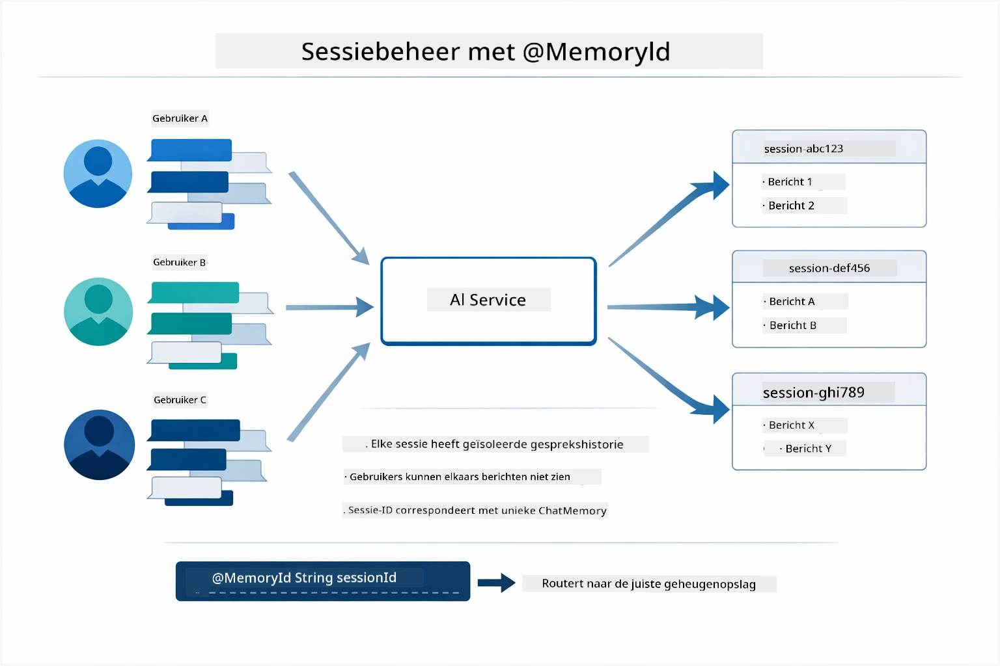

*Elke sessie-ID wordt gekoppeld aan een geïsoleerde gespreksgeschiedenis — gebruikers zien nooit elkaars berichten.*

### Foutafhandeling

Tools kunnen falen — API's kunnen time-outs geven, parameters kunnen ongeldig zijn, externe diensten kunnen uitvallen. Productie-agents hebben foutafhandeling nodig zodat het model problemen kan uitleggen of alternatieven kan proberen in plaats van de hele applicatie te laten crashen. Wanneer een tool een uitzondering gooit, vangt LangChain4j die op en geeft de foutmelding terug aan het model, dat het probleem dan in natuurlijke taal kan uitleggen.

## Beschikbare Tools

Het onderstaande diagram toont het brede ecosysteem van tools die je kunt bouwen. Dit module demonstreert weer- en temperatuurtools, maar hetzelfde `@Tool` patroon werkt voor elke Java-methode — van databasequery's tot betalingsverwerking.

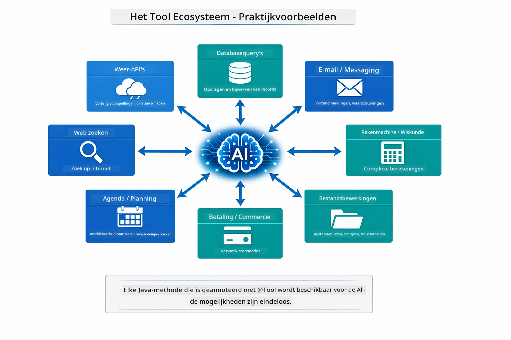

*Elke Java-methode die met @Tool is geannoteerd wordt beschikbaar voor de AI — het patroon breidt zich uit naar databases, API's, e-mail, bestandsbewerkingen en meer.*

## Wanneer Tool-Gebaseerde Agents Te Gebruiken

Niet elk verzoek heeft tools nodig. De keuze hangt af van of de AI met externe systemen moet communiceren of kan antwoorden uit eigen kennis. De onderstaande gids geeft aan wanneer tools waarde toevoegen en wanneer ze onnodig zijn:

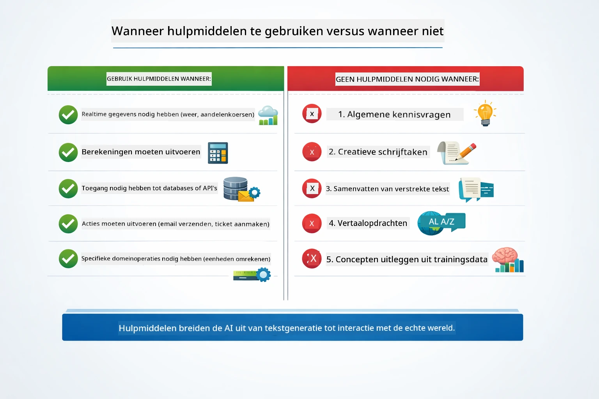

*Een snelle beslisgids — tools zijn voor realtime data, berekeningen en acties; algemene kennis en creatieve taken niet.*

## Tools vs RAG

Modules 03 en 04 breiden beide uit wat de AI kan doen, maar op fundamenteel verschillende manieren. RAG geeft het model toegang tot **kennis** door documenten op te halen. Tools geven het model de mogelijkheid om **acties** uit te voeren door functies aan te roepen. Het onderstaande diagram vergelijkt deze twee benaderingen naast elkaar — van hoe elke workflow werkt tot de afwegingen ertussen:

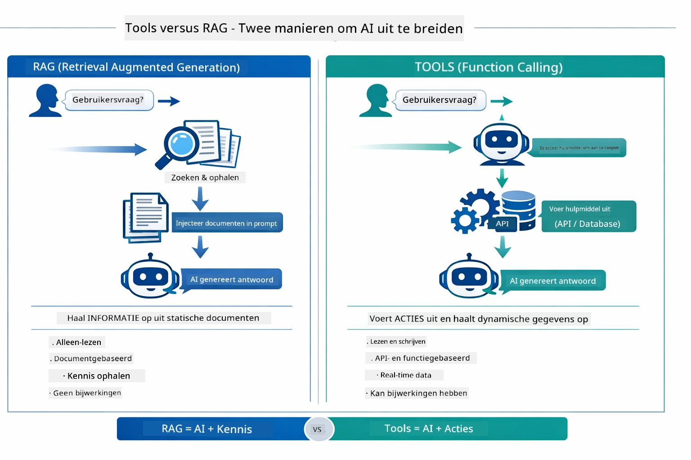

*RAG haalt informatie op uit statische documenten — Tools voeren acties uit en halen dynamische, realtime data op. Veel productiesystemen combineren beide.*

In de praktijk combineren veel productiesystemen beide benaderingen: RAG om antwoorden te funderen op je documentatie en Tools om live data op te halen of bewerkingen uit te voeren.

## Volgende Stappen

**Volgende Module:** [05-mcp - Model Context Protocol (MCP)](../05-mcp/README.md)

---

**Navigatie:** [← Vorige: Module 03 - RAG](../03-rag/README.md) | [Terug naar Begin](../README.md) | [Volgende: Module 05 - MCP →](../05-mcp/README.md)

---

<!-- CO-OP TRANSLATOR DISCLAIMER START -->
**Disclaimer**:  
Dit document is vertaald met behulp van de AI-vertalingsdienst [Co-op Translator](https://github.com/Azure/co-op-translator). Hoewel wij streven naar nauwkeurigheid, dient u er rekening mee te houden dat geautomatiseerde vertalingen fouten of onnauwkeurigheden kunnen bevatten. Het originele document in de oorspronkelijke taal moet als de gezaghebbende bron worden beschouwd. Voor kritieke informatie wordt een professionele menselijke vertaling aanbevolen. Wij zijn niet aansprakelijk voor eventuele misverstanden of verkeerde interpretaties die voortvloeien uit het gebruik van deze vertaling.
<!-- CO-OP TRANSLATOR DISCLAIMER END -->