# Module 05: Model Context Protocol (MCP)

## Inhoudsopgave

- [Video Walkthrough](../../../05-mcp)
- [Wat Je Zal Leren](../../../05-mcp)
- [Wat is MCP?](../../../05-mcp)
- [Hoe MCP Werkt](../../../05-mcp)
- [De Agentische Module](../../../05-mcp)
- [De Voorbeelden Uitvoeren](../../../05-mcp)
  - [Vereisten](../../../05-mcp)
- [Snel Beginnen](../../../05-mcp)
  - [Bestandsoperaties (Stdio)](../../../05-mcp)
  - [Supervisor Agent](../../../05-mcp)
    - [Demo Uitvoeren](../../../05-mcp)
    - [Hoe de Supervisor Werkt](../../../05-mcp)
    - [Hoe FileAgent MCP Tools Runtime ontdekt](../../../05-mcp)
    - [Responsstrategieën](../../../05-mcp)
    - [Begrijpen van de Output](../../../05-mcp)
    - [Uitleg van Agentische Module Functies](../../../05-mcp)
- [Kernbegrippen](../../../05-mcp)
- [Gefeliciteerd!](../../../05-mcp)
  - [Wat Nu?](../../../05-mcp)

## Video Walkthrough

Bekijk deze live sessie die uitlegt hoe je met deze module aan de slag gaat:

<a href="https://www.youtube.com/watch?v=O_J30kZc0rw"></a>

## Wat Je Zal Leren

Je hebt conversatie-AI gebouwd, prompts beheerst, reacties gebaseerd op documenten gemaakt en agenten met tools ontwikkeld. Maar al die tools waren op maat gemaakt voor jouw specifieke toepassing. Wat als je je AI toegang kon geven tot een gestandaardiseerd ecosysteem van tools die iedereen kan maken en delen? In deze module leer je precies dat met het Model Context Protocol (MCP) en LangChain4j's agentische module. We laten eerst een eenvoudige MCP-bestandslezer zien en daarna hoe deze gemakkelijk integreert in geavanceerde agentische workflows met het Supervisor Agent patroon.

## Wat is MCP?

Het Model Context Protocol (MCP) biedt precies dat - een standaard manier voor AI-toepassingen om externe tools te ontdekken en te gebruiken. In plaats van op maat gemaakte integraties voor elke databron of dienst te schrijven, verbind je met MCP-servers die hun mogelijkheden in een consistent formaat beschikbaar stellen. Jouw AI-agent kan deze tools daarna automatisch ontdekken en gebruiken.

Het onderstaande diagram toont het verschil — zonder MCP vereist elke integratie een aangepaste punt-tot-punt verbinding; met MCP verbindt één protocol jouw app met elke tool:


*Voor MCP: Complexe punt-tot-punt integraties. Na MCP: Eén protocol, eindeloze mogelijkheden.*

MCP lost een fundamenteel probleem op in AI-ontwikkeling: elke integratie is maatwerk. Wil je GitHub benaderen? Maatwerk code. Wil je bestanden lezen? Maatwerk code. Wil je een database bevragen? Maatwerk code. En geen van deze integraties werken met andere AI-toepassingen.

MCP standaardiseert dit. Een MCP-server stelt tools beschikbaar met duidelijke beschrijvingen en schema’s. Elke MCP-client kan verbinding maken, beschikbare tools ontdekken en gebruiken. Een keer bouwen, overal gebruiken.

Het volgende diagram illustreert deze architectuur — een enkele MCP-client (jouw AI-toepassing) verbindt met meerdere MCP-servers, elk die hun eigen set tools via het standaard protocol beschikbaar stellen:


*Model Context Protocol architectuur - gestandaardiseerde toolontdekking en uitvoering*

## Hoe MCP Werkt

Onder de motorkap gebruikt MCP een gelaagde architectuur. Je Java-applicatie (de MCP-client) ontdekt beschikbare tools, verstuurt JSON-RPC verzoeken via een transportlaag (Stdio of HTTP), en de MCP-server voert operaties uit en geeft resultaten terug. Het volgende diagram verdeelt elke laag van dit protocol:

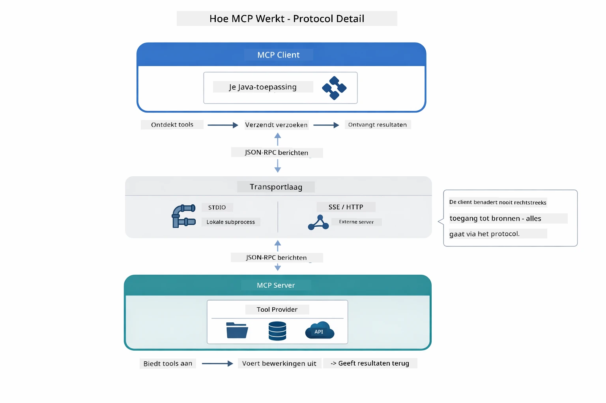

*Hoe MCP onder de motorkap werkt — clients ontdekken tools, wisselen JSON-RPC-berichten uit en voeren operaties uit via een transportlaag.*

**Server-Client Architectuur**

MCP gebruikt een client-server model. Servers leveren tools - bestanden lezen, databases bevragen, API’s aanroepen. Clients (jouw AI-toepassing) verbinden met servers en gebruiken hun tools.

Om MCP met LangChain4j te gebruiken, voeg je deze Maven-afhankelijkheid toe:

```xml
<dependency>
    <groupId>dev.langchain4j</groupId>
    <artifactId>langchain4j-mcp</artifactId>
    <version>${langchain4j.version}</version>
</dependency>
```

**Tool Ontdekking**

Wanneer jouw client verbinding maakt met een MCP-server, vraagt die: "Welke tools heb je?" De server antwoordt met een lijst van beschikbare tools, elk met beschrijvingen en parameterschema's. Je AI-agent kan dan bepalen welke tools hij gebruikt op basis van gebruikersverzoeken. Het diagram hieronder toont deze handdruk — de client stuurt een `tools/list` verzoek en de server stuurt zijn beschikbare tools terug met beschrijvingen en parameterschema's:

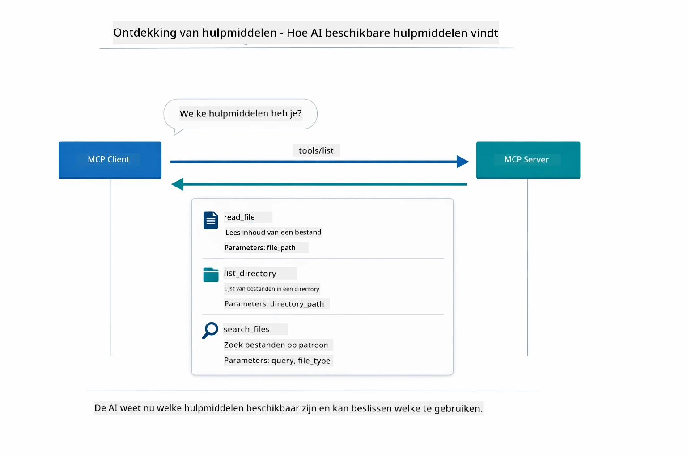

*De AI ontdekt beschikbare tools bij opstarten — het weet nu welke mogelijkheden er zijn en kan bepalen welke te gebruiken.*

**Transport Mechanismen**

MCP ondersteunt verschillende transportmechanismen. De twee opties zijn Stdio (voor lokale subprocesscommunicatie) en Streamable HTTP (voor externe servers). Deze module demonstreert de Stdio-transport:


*MCP transportmechanismen: HTTP voor externe servers, Stdio voor lokale processen*

**Stdio** - [StdioTransportDemo.java](../../../05-mcp/src/main/java/com/example/langchain4j/mcp/StdioTransportDemo.java)

Voor lokale processen. Je applicatie start een server als subprocess en communiceert via standaardinvoer/-uitvoer. Handig voor toegang tot het bestandssysteem of command-line tools.

```java
McpTransport stdioTransport = new StdioMcpTransport.Builder()
    .command(List.of(
        npmCmd, "exec",
        "@modelcontextprotocol/server-filesystem@2025.12.18",
        resourcesDir
    ))
    .logEvents(false)
    .build();
```

De `@modelcontextprotocol/server-filesystem` server stelt de volgende tools beschikbaar, allemaal geïsoleerd tot de mappen die je opgeeft:

| Tool | Beschrijving |
|------|--------------|
| `read_file` | Lees de inhoud van een enkel bestand |
| `read_multiple_files` | Lees meerdere bestanden in één oproep |
| `write_file` | Maak of overschrijf een bestand |
| `edit_file` | Voer gerichte zoek-en-vervang bewerkingen uit |
| `list_directory` | Toon bestanden en mappen in een pad |
| `search_files` | Recursief zoeken naar bestanden die voldoen aan een patroon |
| `get_file_info` | Verkrijg metadata van bestanden (grootte, tijdstempels, permissies) |
| `create_directory` | Maak een map aan (inclusief bovenliggende mappen) |
| `move_file` | Verplaats of hernoem een bestand of map |

Het volgende diagram toont hoe Stdio-transport werkt tijdens runtime — je Java-applicatie start de MCP-server als een child proces en ze communiceren via stdin/stdout-pipes, zonder netwerk of HTTP:

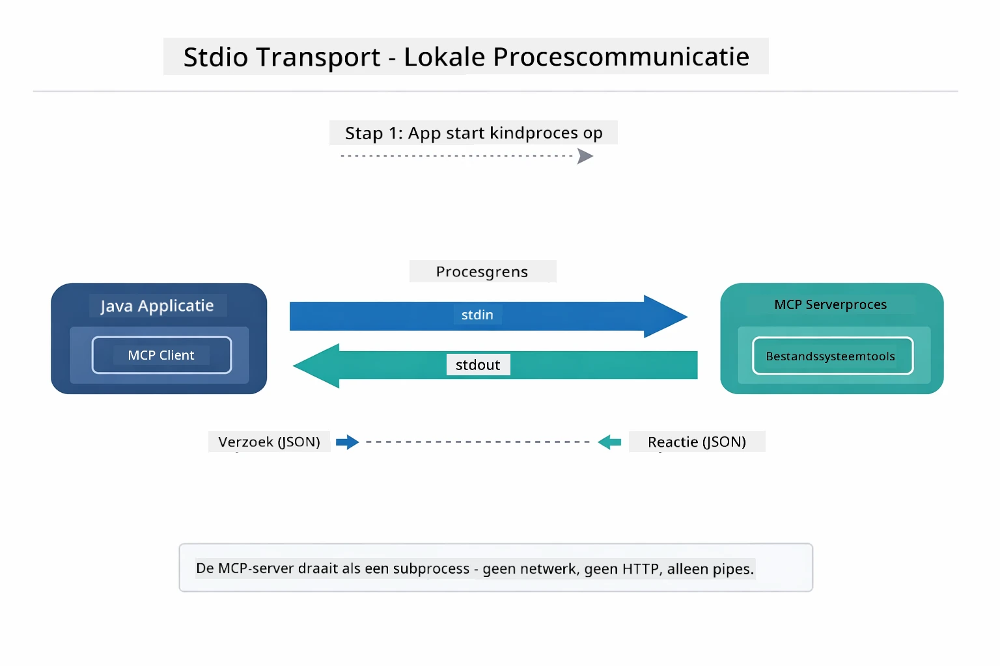

*Stdio-transport in actie — je applicatie start de MCP-server als een child proces en communiceert via stdin/stdout-pipes.*

> **🤖 Probeer met [GitHub Copilot](https://github.com/features/copilot) Chat:** Open [`StdioTransportDemo.java`](../../../05-mcp/src/main/java/com/example/langchain4j/mcp/StdioTransportDemo.java) en vraag:
> - "Hoe werkt Stdio-transport en wanneer moet ik het gebruiken versus HTTP?"
> - "Hoe beheert LangChain4j de levenscyclus van opgestarte MCP-serverprocessen?"
> - "Wat zijn de beveiligingsimplicaties van het geven van AI-toegang tot het bestandssysteem?"

## De Agentische Module

Hoewel MCP gestandaardiseerde tools levert, biedt LangChain4j's **agentische module** een declaratieve manier om agenten te bouwen die deze tools orkestreren. De `@Agent` annotatie en `AgenticServices` laten je agentgedrag definiëren via interfaces in plaats van imperatieve code.

In deze module verken je het **Supervisor Agent** patroon — een geavanceerde agentische AI-benadering waarbij een “supervisor” agent dynamisch beslist welke subagenten worden aangeroepen op basis van gebruikersverzoeken. We combineren beide concepten door één van onze subagenten MCP-gestuurde bestandsaccess te geven.

Om de agentische module te gebruiken, voeg je deze Maven-afhankelijkheid toe:

```xml
<dependency>
    <groupId>dev.langchain4j</groupId>
    <artifactId>langchain4j-agentic</artifactId>
    <version>${langchain4j.mcp.version}</version>
</dependency>
```
> **Opmerking:** De `langchain4j-agentic` module gebruikt een aparte versie-eigenschap (`langchain4j.mcp.version`) omdat deze op een ander schema wordt uitgegeven dan de kernbibliotheken van LangChain4j.

> **⚠️ Experimenteel:** De `langchain4j-agentic` module is **experimenteel** en kan veranderen. De stabiele manier om AI-assistenten te bouwen blijft `langchain4j-core` met maatwerk tools (Module 04).

## De Voorbeelden Uitvoeren

### Vereisten

- Voltooide [Module 04 - Tools](../04-tools/README.md) (deze module bouwt verder op maatwerk tool concepten en vergelijkt ze met MCP tools)
- `.env` bestand in de hoofdmap met Azure-gegevens (gemaakt door `azd up` in Module 01)
- Java 21+, Maven 3.9+
- Node.js 16+ en npm (voor MCP servers)

> **Opmerking:** Als je je omgevingsvariabelen nog niet hebt ingesteld, zie [Module 01 - Introductie](../01-introduction/README.md) voor instructies voor deployment (`azd up` maakt het `.env` bestand automatisch aan), of kopieer `.env.example` naar `.env` in de hoofdmap en vul je waarden in.

## Snel Beginnen

**Met VS Code:** Klik met de rechtermuisknop op een demo bestand in de Verkenner en selecteer **"Run Java"**, of gebruik de launch-configuraties in het 'Run and Debug' paneel (zorg dat je `.env` bestand met Azure-gegevens eerst is geconfigureerd).

**Met Maven:** Je kunt ook via de commandoregel draaien met de onderstaande voorbeelden.

### Bestandsoperaties (Stdio)

Dit demonstreert lokale subprocess-gebaseerde tools.

**✅ Geen vereisten nodig** - de MCP-server wordt automatisch opgestart.

**Gebruik van de Startscripts (Aanbevolen):**

De startscripts laden automatisch omgevingsvariabelen uit het hoofdbestand `.env`:

**Bash:**
```bash
cd 05-mcp
chmod +x start-stdio.sh
./start-stdio.sh
```

**PowerShell:**
```powershell
cd 05-mcp
.\start-stdio.ps1
```

**Met VS Code:** Klik met de rechtermuisknop op `StdioTransportDemo.java` en selecteer **"Run Java"** (zorg dat je `.env` bestand geconfigureerd is).

De applicatie start automatisch een MCP-bestandssysteemserver en leest een lokaal bestand. Merk op hoe subprocessbeheer voor je wordt afgehandeld.

**Verwachte output:**
```
Assistant response: The file provides an overview of LangChain4j, an open-source Java library
for integrating Large Language Models (LLMs) into Java applications...
```

### Supervisor Agent

Het **Supervisor Agent patroon** is een **flexibele** vorm van agentische AI. Een Supervisor gebruikt een LLM om autonoom te bepalen welke agenten worden aangeroepen op basis van het gebruikersverzoek. In het volgende voorbeeld combineren we MCP-gestuurde bestandsaccess met een LLM-agent om een gecontroleerde bestandslees → rapport workflow te creëren.

In de demo leest `FileAgent` een bestand met MCP-bestandssysteemtools, en genereert `ReportAgent` een gestructureerd rapport met een samenvatting (1 zin), 3 kernpunten, en aanbevelingen. De Supervisor orkestreert deze stroom automatisch:

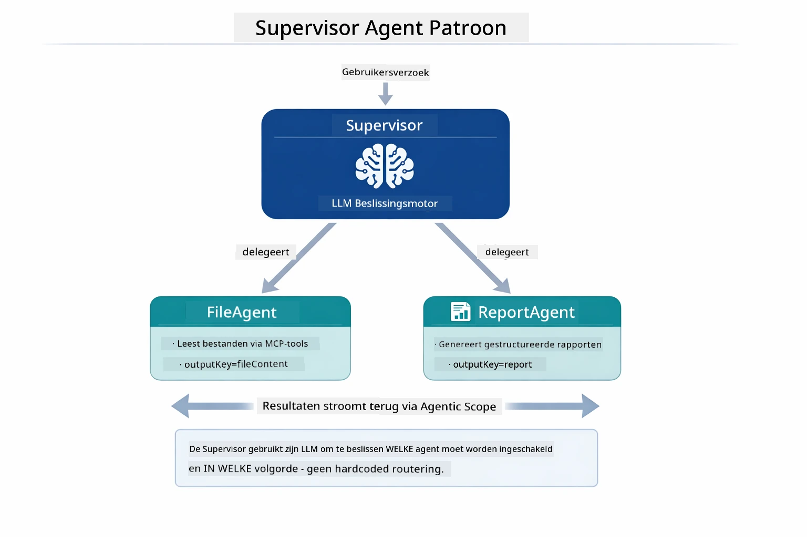

*De Supervisor gebruikt zijn LLM om te bepalen welke agenten worden aangeroepen en in welke volgorde — geen hardcoded routing nodig.*

Dit is de concrete workflow voor onze bestand-naar-rapport pijplijn:

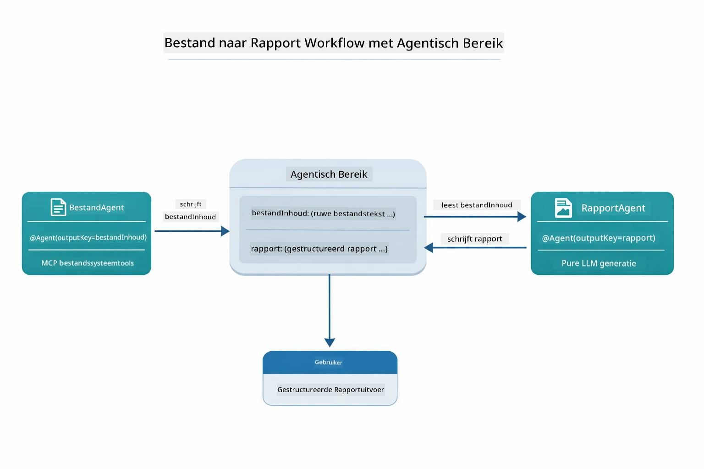

*FileAgent leest het bestand via MCP-tools, daarna transformeert ReportAgent de ruwe inhoud naar een gestructureerd rapport.*

Het volgende sequentiediagram volgt de volledige Supervisor orkestratie — van het starten van de MCP-server, via de autonome agentkeuze van de Supervisor, tot aan de tool-aanroepen over stdio en het eindrapport:

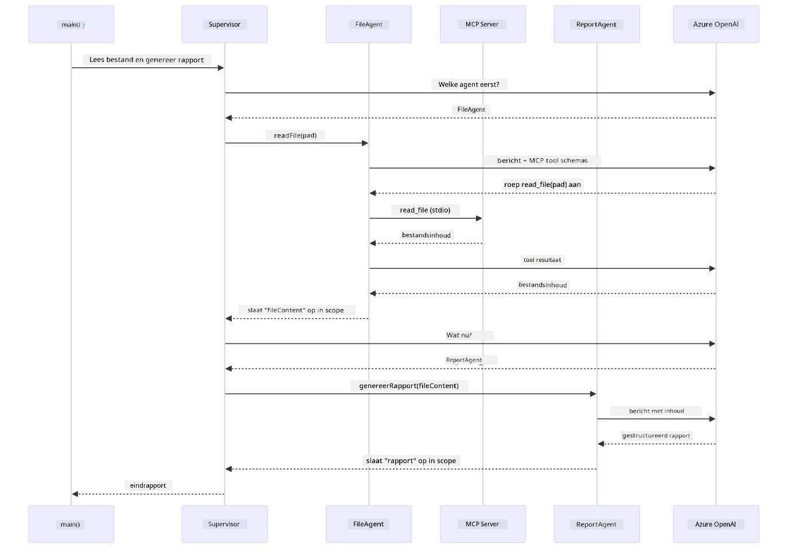

*De Supervisor roept autonoom FileAgent aan (die de MCP-server via stdio aanroept om het bestand te lezen), daarna roept hij ReportAgent aan om een gestructureerd rapport te genereren — elke agent slaat zijn output op in de gedeelde Agentic Scope.*

Elke agent slaat zijn output op in de **Agentic Scope** (gedeeld geheugen), waardoor downstream agenten toegang hebben tot eerdere resultaten. Dit toont aan hoe MCP-tools naadloos integreren in agentische workflows — de Supervisor hoeft niet te weten *hoe* bestanden worden gelezen, alleen dat `FileAgent` dat kan.

#### Demo Uitvoeren

De startscripts laden automatisch omgevingsvariabelen uit het hoofdbestand `.env`:

**Bash:**
```bash
cd 05-mcp
chmod +x start-supervisor.sh
./start-supervisor.sh
```

**PowerShell:**
```powershell
cd 05-mcp
.\start-supervisor.ps1
```

**Met VS Code:** Klik met de rechtermuisknop op `SupervisorAgentDemo.java` en selecteer **"Run Java"** (zorg dat je `.env` bestand is geconfigureerd).

#### Hoe de Supervisor Werkt

Voor je agenten bouwt, moet je de MCP-transport verbinden met een client en het als een `ToolProvider` wikkelen. Zo worden de tools van de MCP-server beschikbaar voor je agenten:

```java
// Maak een MCP-client aan vanuit de transportlaag
McpClient mcpClient = new DefaultMcpClient.Builder()
        .transport(stdioTransport)
        .build();

// Wikkel de client in als een ToolProvider — dit maakt MCP-tools bruikbaar in LangChain4j
ToolProvider mcpToolProvider = McpToolProvider.builder()
        .mcpClients(List.of(mcpClient))
        .build();
```

Nu kan je `mcpToolProvider` injecteren in elke agent die MCP-tools nodig heeft:

```java
// Stap 1: FileAgent leest bestanden met behulp van MCP-tools
FileAgent fileAgent = AgenticServices.agentBuilder(FileAgent.class)
        .chatModel(model)
        .toolProvider(mcpToolProvider)  // Heeft MCP-tools voor bestandbewerkingen
        .build();

// Stap 2: ReportAgent genereert gestructureerde rapporten
ReportAgent reportAgent = AgenticServices.agentBuilder(ReportAgent.class)
        .chatModel(model)
        .build();

// Supervisor orkestreert de workflow van bestand → rapport
SupervisorAgent supervisor = AgenticServices.supervisorBuilder()
        .chatModel(model)
        .subAgents(fileAgent, reportAgent)
        .responseStrategy(SupervisorResponseStrategy.LAST)  // Retourneer het definitieve rapport
        .build();

// De Supervisor beslist welke agenten worden aangeroepen op basis van het verzoek
String response = supervisor.invoke("Read the file at /path/file.txt and generate a report");
```

#### Hoe FileAgent MCP Tools Runtime ontdekt

Je vraagt je misschien af: **hoe weet `FileAgent` hoe de npm filesystem tools te gebruiken?** Het antwoord is dat die dat niet weet — de **LLM** bepaalt dit tijdens runtime aan de hand van tool schema’s.
De `FileAgent` interface is slechts een **promptdefinitie**. Het heeft geen ingebouwde kennis van `read_file`, `list_directory` of andere MCP-tools. Dit gebeurt er end-to-end:

1. **Server start op:** `StdioMcpTransport` start het `@modelcontextprotocol/server-filesystem` npm-pakket als een child process
2. **Tool ontdekking:** De `McpClient` stuurt een `tools/list` JSON-RPC-verzoek naar de server, die reageert met toolnamen, beschrijvingen en parameterschema's (bijv. `read_file` — *"Lees de volledige inhoud van een bestand"* — `{ path: string }`)
3. **Schema-injectie:** `McpToolProvider` wikkelt deze ontdekte schema's in en maakt ze beschikbaar voor LangChain4j
4. **LLM besluit:** Wanneer `FileAgent.readFile(path)` wordt aangeroepen, stuurt LangChain4j het systeembericht, gebruikersbericht, **en de lijst met tool-schema's** naar de LLM. De LLM leest de toolbeschrijvingen en genereert een tool-aanroep (bijv. `read_file(path="/some/file.txt")`)
5. **Uitvoering:** LangChain4j onderschept de tool-aanroep, routert deze via de MCP-client terug naar het Node.js subprocess, ontvangt het resultaat en voert het terug aan de LLM

Dit is hetzelfde [Tool Discovery](../../../05-mcp) mechanisme dat hierboven is beschreven, maar dan specifiek toegepast op de agent workflow. De `@SystemMessage` en `@UserMessage` annotaties sturen het gedrag van de LLM, terwijl de geïnjecteerde `ToolProvider` de **mogelijkheden** biedt — de LLM slaat de brug tussen de twee tijdens runtime.

> **🤖 Probeer met [GitHub Copilot](https://github.com/features/copilot) Chat:** Open [`FileAgent.java`](../../../05-mcp/src/main/java/com/example/langchain4j/mcp/agents/FileAgent.java) en vraag:
> - "Hoe weet deze agent welke MCP-tool aan te roepen?"
> - "Wat zou er gebeuren als ik de ToolProvider uit de agent builder verwijder?"
> - "Hoe worden tool-schema's aan de LLM doorgegeven?"

#### Response Strategieën

Wanneer je een `SupervisorAgent` configureert, geef je aan hoe deze zijn uiteindelijke antwoord aan de gebruiker formuleert nadat de sub-agenten hun taken hebben voltooid. De onderstaande diagram toont de drie beschikbare strategieën — LAST geeft direct de output van de laatste agent terug, SUMMARY synthetiseert alle outputs via een LLM, en SCORED kiest degene met de hoogste score ten opzichte van het originele verzoek:

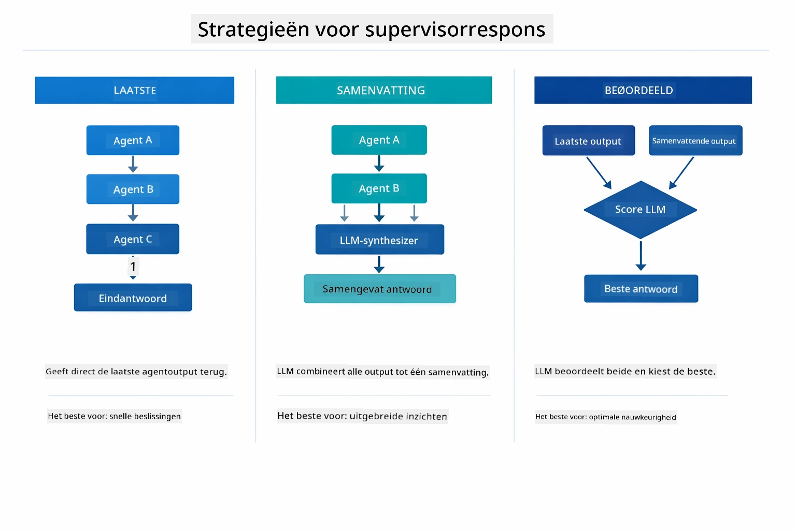

*Drie strategieën voor hoe de Supervisor zijn eindantwoord formuleert — kies op basis van of je de output van de laatste agent, een gesynthetiseerde samenvatting, of het best scorende resultaat wilt.*

De beschikbare strategieën zijn:

| Strategie | Beschrijving |
|----------|-------------|
| **LAST** | De supervisor retourneert de output van de laatst aangeroepen sub-agent of tool. Dit is handig wanneer de laatste agent in de workflow specifiek is ontworpen om het volledige, definitieve antwoord te produceren (bijv. een "Summary Agent" in een onderzoeksproces). |
| **SUMMARY** | De supervisor gebruikt zijn eigen interne Language Model (LLM) om een samenvatting te maken van de volledige interactie en alle sub-agent outputs, en retourneert die samenvatting als het uiteindelijke antwoord. Dit levert een helder, geaggregeerd antwoord aan de gebruiker. |
| **SCORED** | Het systeem gebruikt een intern LLM om zowel de LAST-respons als de SUMMARY van de interactie te scoren tegen het oorspronkelijke gebruikersverzoek, daarbij terugkerend welke output de hoogste score krijgt. |

Zie [SupervisorAgentDemo.java](../../../05-mcp/src/main/java/com/example/langchain4j/mcp/SupervisorAgentDemo.java) voor de volledige implementatie.

> **🤖 Probeer met [GitHub Copilot](https://github.com/features/copilot) Chat:** Open [`SupervisorAgentDemo.java`](../../../05-mcp/src/main/java/com/example/langchain4j/mcp/SupervisorAgentDemo.java) en vraag:
> - "Hoe bepaalt de Supervisor welke agenten worden aangeroepen?"
> - "Wat is het verschil tussen de Supervisor- en Sequential workflowpatronen?"
> - "Hoe kan ik het planningsgedrag van de Supervisor aanpassen?"

#### Het Uitvoerbegrip

Wanneer je de demo uitvoert, zie je een gestructureerde walkthrough van hoe de Supervisor meerdere agenten orkestreert. Dit betekent elke sectie:

```
======================================================================
  FILE → REPORT WORKFLOW DEMO
======================================================================

This demo shows a clear 2-step workflow: read a file, then generate a report.
The Supervisor orchestrates the agents automatically based on the request.
```

**De kop** introduceert het workflowconcept: een gerichte pijplijn van bestandslezing naar rapportage.

```
--- WORKFLOW ---------------------------------------------------------
  ┌─────────────┐      ┌──────────────┐
  │  FileAgent  │ ───▶ │ ReportAgent  │
  │ (MCP tools) │      │  (pure LLM)  │
  └─────────────┘      └──────────────┘
   outputKey:           outputKey:
   'fileContent'        'report'

--- AVAILABLE AGENTS -------------------------------------------------
  [FILE]   FileAgent   - Reads files via MCP → stores in 'fileContent'
  [REPORT] ReportAgent - Generates structured report → stores in 'report'
```

**Workflowdiagram** toont de gegevensstroom tussen agents. Elke agent heeft een specifieke rol:
- **FileAgent** leest bestanden met MCP-tools en slaat ruwe inhoud op in `fileContent`
- **ReportAgent** gebruikt die inhoud en maakt een gestructureerd rapport in `report`

```
--- USER REQUEST -----------------------------------------------------
  "Read the file at .../file.txt and generate a report on its contents"
```

**Gebruikersverzoek** toont de taak. De Supervisor analyseert dit en besluit FileAgent → ReportAgent aan te roepen.

```
--- SUPERVISOR ORCHESTRATION -----------------------------------------
  The Supervisor decides which agents to invoke and passes data between them...

  +-- STEP 1: Supervisor chose -> FileAgent (reading file via MCP)
  |
  |   Input: .../file.txt
  |
  |   Result: LangChain4j is an open-source, provider-agnostic Java framework for building LLM...
  +-- [OK] FileAgent (reading file via MCP) completed

  +-- STEP 2: Supervisor chose -> ReportAgent (generating structured report)
  |
  |   Input: LangChain4j is an open-source, provider-agnostic Java framew...
  |
  |   Result: Executive Summary...
  +-- [OK] ReportAgent (generating structured report) completed
```

**Supervisor Orkestratie** toont de 2-stapsstroom in actie:
1. **FileAgent** leest het bestand via MCP en slaat de inhoud op
2. **ReportAgent** ontvangt de inhoud en genereert een gestructureerd rapport

De Supervisor nam deze beslissingen **autonoom** op basis van het gebruikersverzoek.

```
--- FINAL RESPONSE ---------------------------------------------------
Executive Summary
...

Key Points
...

Recommendations
...

--- AGENTIC SCOPE (Data Flow) ----------------------------------------
  Each agent stores its output for downstream agents to consume:
  * fileContent: LangChain4j is an open-source, provider-agnostic Java framework...
  * report: Executive Summary...
```

#### Uitleg van Agentic Module Kenmerken

Het voorbeeld toont verschillende geavanceerde functies van de agentic module. Laten we Agentic Scope en Agent Listeners nader bekijken.

**Agentic Scope** toont het gedeelde geheugen waar agents hun resultaten opslaan met `@Agent(outputKey="...")`. Dit maakt mogelijk:
- Latere agents kunnen outputs van eerdere agents benaderen
- De Supervisor kan een eindantwoord synthesizen
- Jij kunt inspecteren wat elke agent heeft geproduceerd

Het diagram hieronder toont hoe Agentic Scope werkt als gedeeld geheugen in de file-to-report workflow — FileAgent schrijft zijn output onder de sleutel `fileContent`, ReportAgent leest die en schrijft zijn eigen output onder `report`:

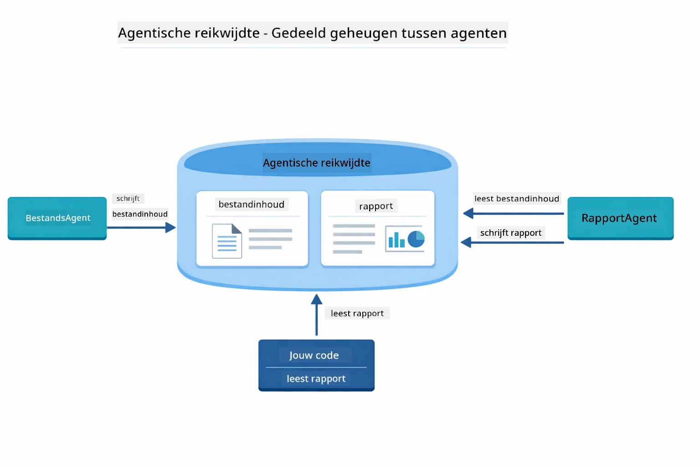

*Agentic Scope fungeert als gedeeld geheugen — FileAgent schrijft `fileContent`, ReportAgent leest het en schrijft `report`, en jouw code leest het eindresultaat.*

```java
ResultWithAgenticScope<String> result = supervisor.invokeWithAgenticScope(request);
AgenticScope scope = result.agenticScope();
String fileContent = scope.readState("fileContent");  // Ruwe bestandsgegevens van FileAgent
String report = scope.readState("report");            // Gestructureerd rapport van ReportAgent
```

**Agent Listeners** maken monitoring en debugging van agentuitvoering mogelijk. De stapsgewijze output die je in de demo ziet komt van een AgentListener die op elke agent-oproep 'hookt':
- **beforeAgentInvocation** - Wordt aangeroepen wanneer de Supervisor een agent selecteert, zodat je kunt zien welke agent is gekozen en waarom
- **afterAgentInvocation** - Wordt aangeroepen wanneer een agent klaar is, toont het resultaat
- **inheritedBySubagents** - Wanneer true, monitort de listener alle agenten in de hiërarchie

De onderstaande diagram toont de volledige Agent Listener levenscyclus, inclusief hoe `onError` omgaat met fouten tijdens agentuitvoering:

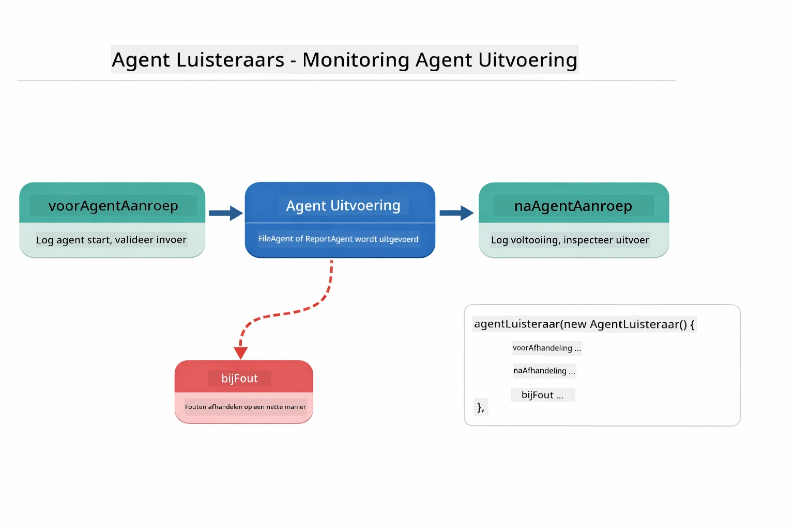

*Agent Listeners verbinden zich met de uitvoeringslevenscyclus — monitor wanneer agents starten, klaar zijn of fouten tegenkomen.*

```java
AgentListener monitor = new AgentListener() {
    private int step = 0;
    
    @Override
    public void beforeAgentInvocation(AgentRequest request) {
        step++;
        System.out.println("  +-- STEP " + step + ": " + request.agentName());
    }
    
    @Override
    public void afterAgentInvocation(AgentResponse response) {
        System.out.println("  +-- [OK] " + response.agentName() + " completed");
    }
    
    @Override
    public boolean inheritedBySubagents() {
        return true; // Propageren naar alle subagenten
    }
};
```

Naast het Supervisor-patroon biedt de `langchain4j-agentic` module enkele krachtige workflowpatronen. De onderstaande diagram toont alle vijf — van eenvoudige sequentiële pijplijnen tot human-in-the-loop goedkeuringsworkflows:

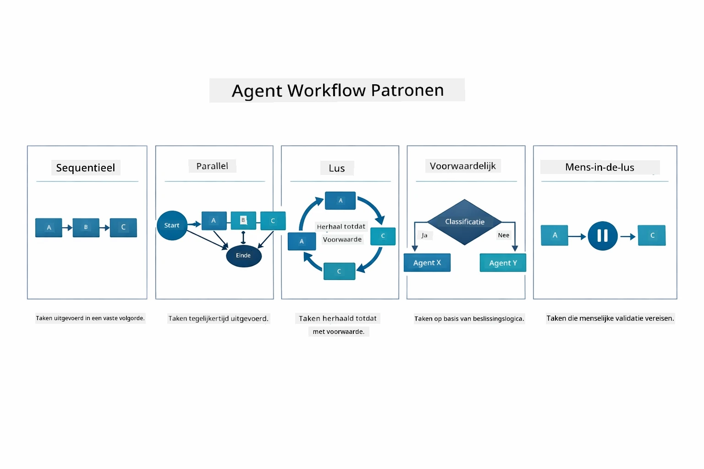

*Vijf workflowpatronen voor het orkestreren van agents — van eenvoudige sequentiële pijplijnen tot human-in-the-loop goedkeuringsworkflows.*

| Patroon | Beschrijving | Gebruik |
|---------|-------------|---------|
| **Sequential** | Voer agents op volgorde uit, output stroomt door naar de volgende | Pijplijnen: onderzoek → analyse → rapport |
| **Parallel** | Voer agents gelijktijdig uit | Onafhankelijke taken: weer + nieuws + aandelen |
| **Loop** | Herhaal totdat een voorwaarde is voldaan | Kwaliteitsscore: verfijn totdat score ≥ 0.8 |
| **Conditional** | Routeer op basis van voorwaarden | Classificeer → routeer naar specialistische agent |
| **Human-in-the-Loop** | Voeg menselijke controles toe | Goedkeuringsworkflows, inhoudsbeoordeling |

## Belangrijke Concepten

Nu je MCP en de agentic module in actie hebt verkend, vatten we samen wanneer je elke aanpak gebruikt.

Een van MCP's grootste voordelen is het groeiende ecosysteem. De onderstaande diagram toont hoe een universeel protocol je AI-applicatie verbindt met een breed scala aan MCP-servers — van bestandssysteem- en database-toegang tot GitHub, e-mail, web scraping en meer:

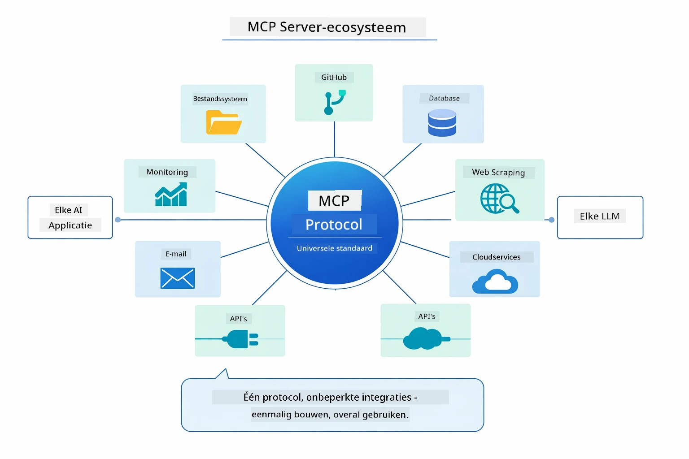

*MCP creëert een universeel protocolecosysteem — elke MCP-compatibele server werkt met elke MCP-compatibele client, waardoor tool delen tussen applicaties mogelijk is.*

**MCP** is ideaal wanneer je bestaande toolecosystemen wilt benutten, tools wilt bouwen die door meerdere applicaties gedeeld kunnen worden, derdepartij-services wilt integreren via standaardprotocollen, of toolimplementaties wilt wisselen zonder code aan te passen.

**De Agentic Module** werkt het beste wanneer je declaratieve agentdefinities wilt met `@Agent` annotaties, workfloworkestratie nodig hebt (sequentieel, loop, parallel), interface-gebaseerd agentontwerp prefereert boven imperatieve code, of meerdere agents wilt combineren die outputs delen via `outputKey`.

**Het Supervisor Agent patroon** blinkt uit wanneer de workflow vooraf niet voorspelbaar is en je wilt dat de LLM beslist, wanneer je meerdere gespecialiseerde agents hebt die dynamische orkestratie vereisen, bij het bouwen van conversatiesystemen die naar verschillende capaciteiten routeren, of wanneer je het meest flexibele, adaptieve agentgedrag wilt.

Om je te helpen kiezen tussen de custom `@Tool` methoden uit Module 04 en MCP-tools uit deze module, toont de volgende vergelijking de belangrijkste afwegingen — custom tools geven je strakke koppeling en volledige typesafety voor appspecifieke logica, terwijl MCP-tools gestandaardiseerde, herbruikbare integraties bieden:

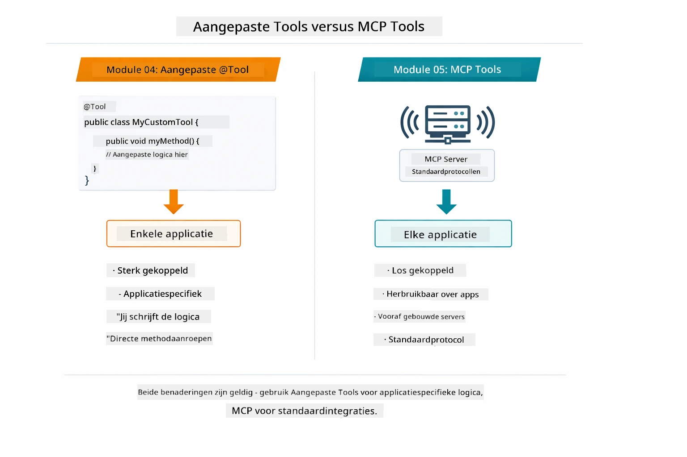

*Wanneer gebruik je custom @Tool-methoden versus MCP-tools — custom tools voor appspecifieke logica met volledige typesafety, MCP-tools voor gestandaardiseerde integraties die over applicaties heen werken.*

## Gefeliciteerd!

Je bent door alle vijf modules van de LangChain4j for Beginners cursus heen! Hier is een overzicht van je volledige leertraject — van basis chat tot MCP-aangedreven agentische systemen:

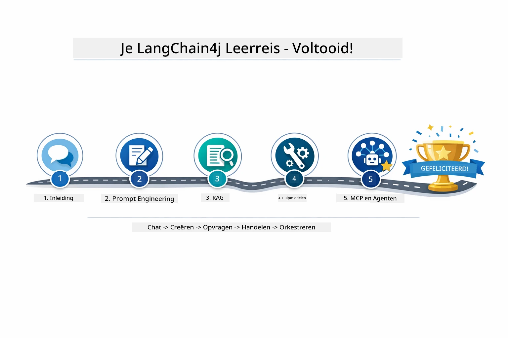

*Je leertraject door alle vijf modules — van basis chat tot MCP-aangedreven agentische systemen.*

Je hebt de LangChain4j for Beginners cursus afgerond. Je hebt geleerd:

- Hoe je conversatie-AI bouwt met geheugen (Module 01)
- Prompt engineering patronen voor verschillende taken (Module 02)
- Antwoorden baseert op je documenten met RAG (Module 03)
- Basis AI agents (assistenten) maakt met custom tools (Module 04)
- Gestandaardiseerde tools integreert met de LangChain4j MCP en Agentic modules (Module 05)

### Wat nu?

Na het voltooien van de modules kun je de [Testing Guide](../docs/TESTING.md) bekijken om LangChain4j testconcepten in actie te zien.

**Officiële bronnen:**
- [LangChain4j Documentatie](https://docs.langchain4j.dev/) - Uitgebreide handleidingen en API-referentie
- [LangChain4j GitHub](https://github.com/langchain4j/langchain4j) - Broncode en voorbeelden
- [LangChain4j Tutorials](https://docs.langchain4j.dev/tutorials/) - Stapsgewijze tutorials voor diverse use cases

Bedankt voor het volgen van deze cursus!

---

**Navigatie:** [← Vorige: Module 04 - Tools](../04-tools/README.md) | [Terug naar Hoofdmenu](../README.md)

---

<!-- CO-OP TRANSLATOR DISCLAIMER START -->
**Disclaimer**:  
Dit document is vertaald met behulp van de AI-vertalingsdienst [Co-op Translator](https://github.com/Azure/co-op-translator). Hoewel we streven naar nauwkeurigheid, dient u er rekening mee te houden dat automatische vertalingen fouten of onjuistheden kunnen bevatten. Het originele document in de oorspronkelijke taal wordt als de gezaghebbende bron beschouwd. Voor belangrijke informatie wordt professionele menselijke vertaling aanbevolen. Wij zijn niet aansprakelijk voor eventuele misverstanden of verkeerde interpretaties die voortvloeien uit het gebruik van deze vertaling.
<!-- CO-OP TRANSLATOR DISCLAIMER END -->