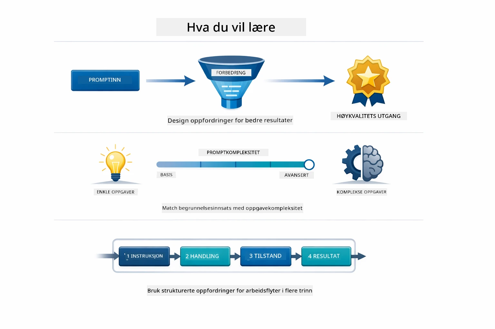
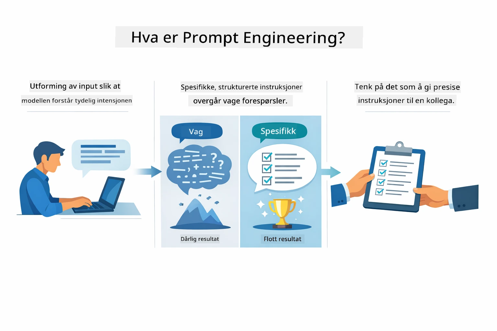
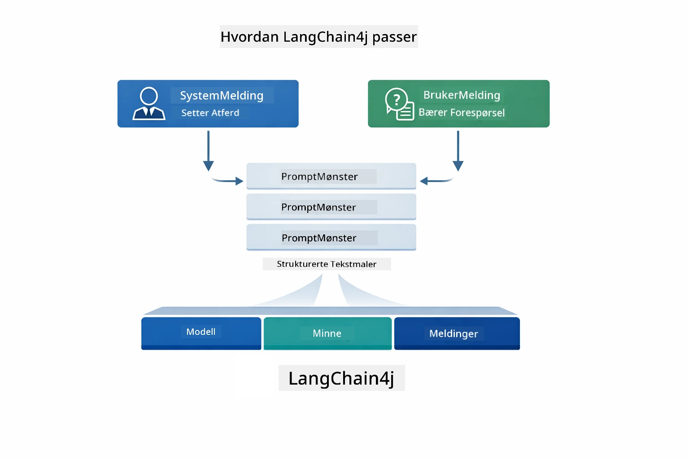
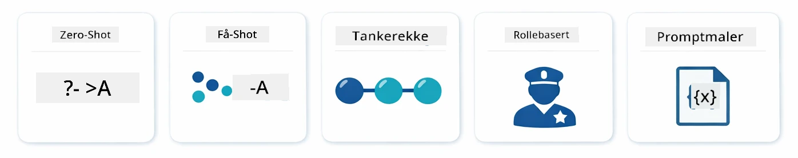
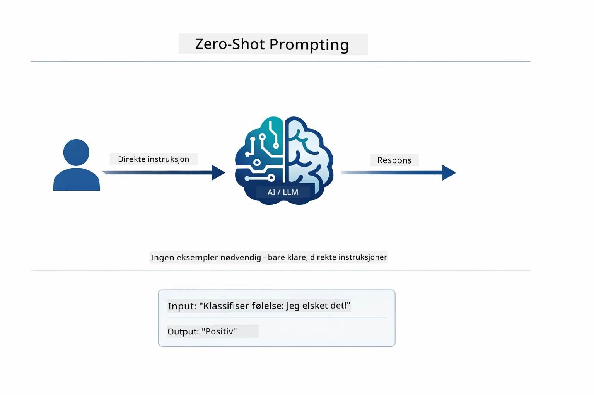
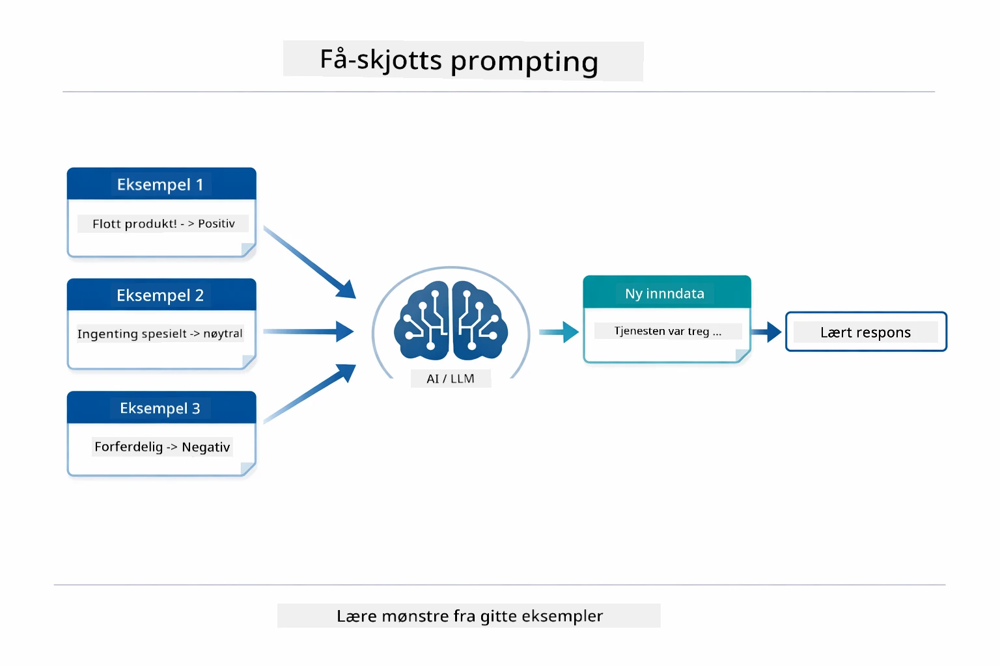
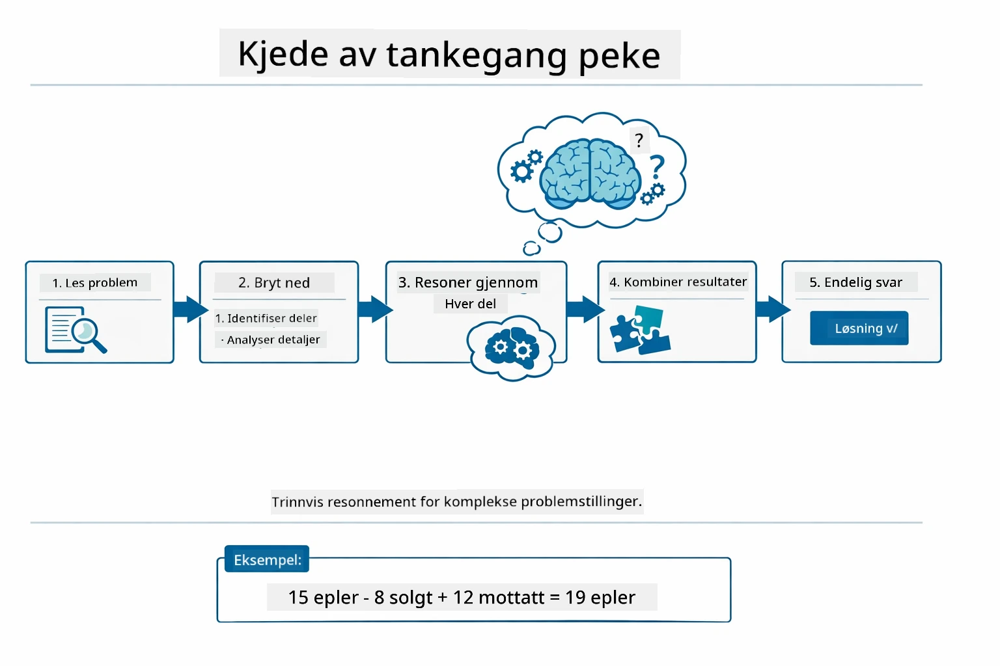
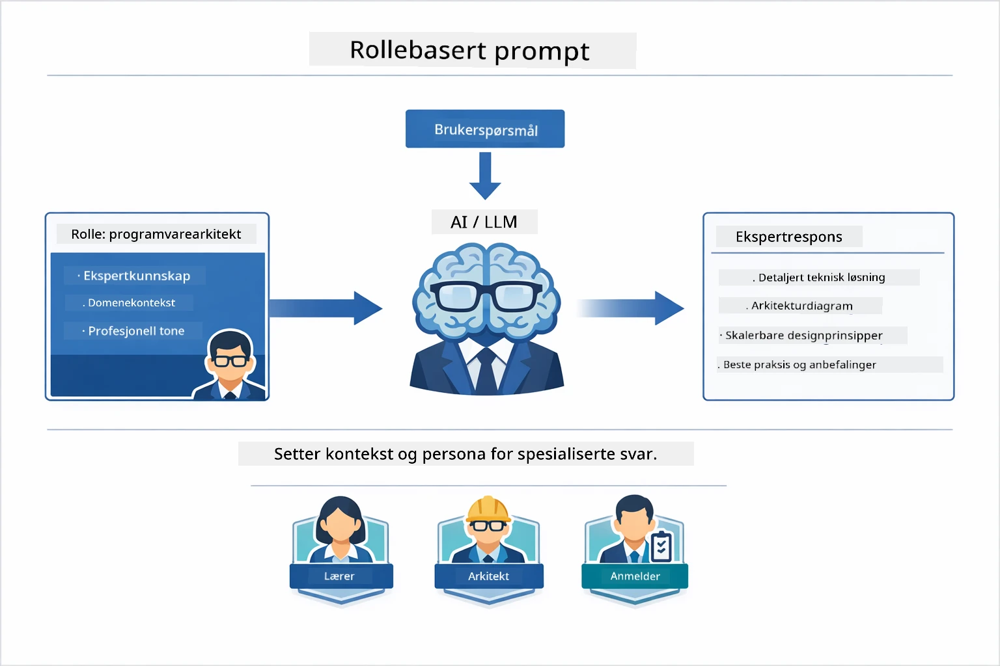
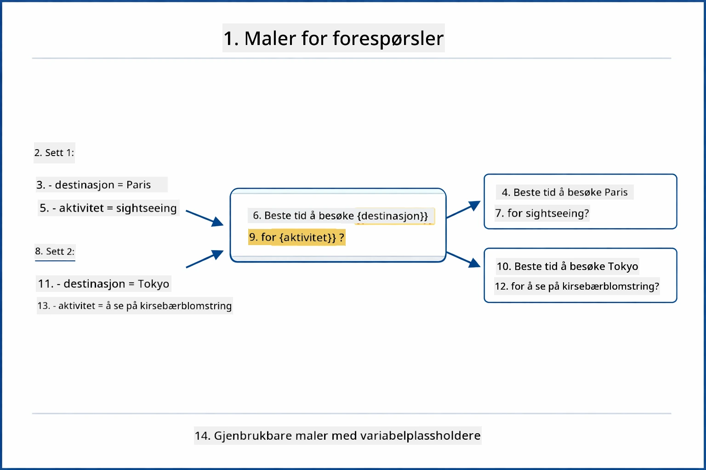
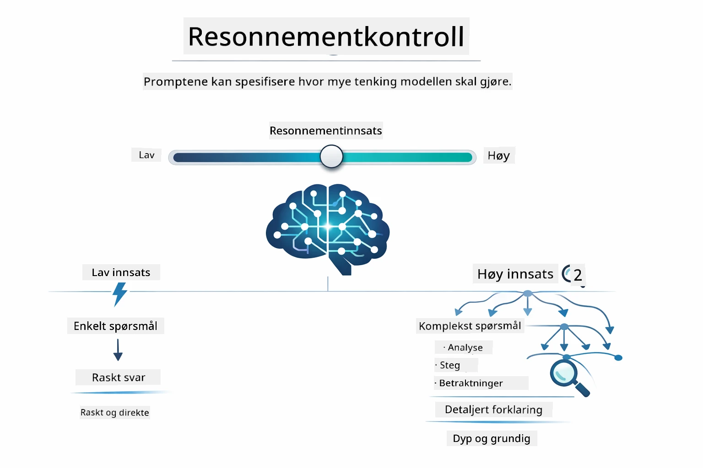

# Modul 02: Prompt Engineering med GPT-5.2

## Innholdsfortegnelse

- [Hva du vil lære](../../../02-prompt-engineering)
- [Forutsetninger](../../../02-prompt-engineering)
- [Forstå prompt engineering](../../../02-prompt-engineering)
- [Grunnleggende prompt engineering](../../../02-prompt-engineering)
  - [Zero-Shot Prompting](../../../02-prompt-engineering)
  - [Few-Shot Prompting](../../../02-prompt-engineering)
  - [Chain of Thought](../../../02-prompt-engineering)
  - [Role-Based Prompting](../../../02-prompt-engineering)
  - [Prompt Templates](../../../02-prompt-engineering)
- [Avanserte mønstre](../../../02-prompt-engineering)
- [Bruke eksisterende Azure-ressurser](../../../02-prompt-engineering)
- [Skjermbilder av applikasjonen](../../../02-prompt-engineering)
- [Utforske mønstrene](../../../02-prompt-engineering)
  - [Lav vs høy iver](../../../02-prompt-engineering)
  - [Oppgaveutførelse (verktøypreambler)](../../../02-prompt-engineering)
  - [Selvreflekterende kode](../../../02-prompt-engineering)
  - [Strukturert analyse](../../../02-prompt-engineering)
  - [Multi-turn chat](../../../02-prompt-engineering)
  - [Trinnvis resonnering](../../../02-prompt-engineering)
  - [Begrenset utdata](../../../02-prompt-engineering)
- [Hva du egentlig lærer](../../../02-prompt-engineering)
- [Neste steg](../../../02-prompt-engineering)

## Hva du vil lære



I forrige modul så du hvordan minne muliggjør konversasjons-AI og brukte GitHub-modeller for grunnleggende interaksjoner. Nå skal vi fokusere på hvordan du stiller spørsmål — selve promptene — ved hjelp av Azure OpenAI sin GPT-5.2. Måten du strukturerer promptene dine på påvirker dramatisk kvaliteten på svarene du får. Vi starter med en gjennomgang av grunnleggende promptteknikker, og beveger oss deretter inn i åtte avanserte mønstre som utnytter GPT-5.2 sine muligheter fullt ut.

Vi bruker GPT-5.2 fordi den introduserer resonneringskontroll – du kan fortelle modellen hvor mye tenking den skal gjøre før den svarer. Dette gjør ulike prompting-strategier tydeligere og hjelper deg å forstå når du skal bruke hver tilnærming. Vi drar også nytte av Azures færre ratebegrensninger for GPT-5.2 sammenlignet med GitHub-modellene.

## Forutsetninger

- Fullført Modul 01 (Azure OpenAI-ressurser distribuert)
- `.env`-fil i rotkatalog med Azure-legitimasjon (opprettet ved `azd up` i Modul 01)

> **Merk:** Hvis du ikke har fullført Modul 01, følg distribusjonsinstruksjonene der først.

## Forstå prompt engineering



Prompt engineering handler om å designe tekstinput som konsekvent gir deg de resultatene du trenger. Det handler ikke bare om å stille spørsmål – det handler om å strukturere forespørsler slik at modellen forstår nøyaktig hva du vil ha og hvordan det skal leveres.

Tenk på det som å gi instruksjoner til en kollega. "Fiks feilen" er vag. "Fiks null pointer exception i UserService.java linje 45 ved å legge til en null-sjekk" er spesifikt. Språkmodeller fungerer på samme måte – spesifisitet og struktur teller.



LangChain4j tilbyr infrastrukturen — modelltilkoblinger, minne og meldingstyper — mens promptmønstre bare er nøye strukturerte tekster du sender gjennom den infrastrukturen. De viktigste byggesteinene er `SystemMessage` (som setter AIens oppførsel og rolle) og `UserMessage` (som bærer din faktiske forespørsel).

## Grunnleggende prompt engineering



Før vi går inn i de avanserte mønstrene i denne modulen, la oss gå gjennom fem grunnleggende prompting-teknikker. Disse er byggesteiner som alle promptingeniører bør kjenne til. Hvis du allerede har jobbet deg gjennom [Quick Start-modulen](../00-quick-start/README.md#2-prompt-patterns), har du sett disse i bruk – her er den konseptuelle rammen bak dem.

### Zero-Shot Prompting

Den enkleste tilnærmingen: gi modellen en direkte instruksjon uten eksempler. Modellen baserer seg helt på opplæringen for å forstå og utføre oppgaven. Dette fungerer godt for enkle forespørsler hvor forventet oppførsel er åpenbar.



*Direkte instruksjon uten eksempler — modellen utleder oppgaven kun ut fra instruksjonen*

```java
String prompt = "Classify this sentiment: 'I absolutely loved the movie!'";
String response = model.chat(prompt);
// Respons: "Positiv"
```

**Når bruke:** Enkle klassifiseringer, direkte spørsmål, oversettelser eller andre oppgaver modellen kan håndtere uten ekstra veiledning.

### Few-Shot Prompting

Gi eksempler som viser mønsteret du ønsker at modellen skal følge. Modellen lærer forventet input-output-format fra eksemplene dine og anvender det på nye inputs. Dette forbedrer konsistensen dramatisk for oppgaver hvor ønsket format eller oppførsel ikke er åpenbar.



*Læring fra eksempler — modellen identifiserer mønsteret og anvender det på nye inputs*

```java
String prompt = """
    Classify the sentiment as positive, negative, or neutral.
    
    Examples:
    Text: "This product exceeded my expectations!" → Positive
    Text: "It's okay, nothing special." → Neutral
    Text: "Waste of money, very disappointed." → Negative
    
    Now classify this:
    Text: "Best purchase I've made all year!"
    """;
String response = model.chat(prompt);
```

**Når bruke:** Tilpassede klassifiseringer, konsekvent formatering, domene-spesifikke oppgaver, eller når zero-shot-resultater er inkonsistente.

### Chain of Thought

Be modellen vise sin resonnering steg for steg. I stedet for å hoppe rett til svaret, deler modellen opp problemet og jobber gjennom hver del eksplisitt. Dette forbedrer nøyaktigheten på matte, logikk og flertrinnsresonnering.



*Trinnvis resonnering — bryte komplekse problemer ned i eksplisitte logiske steg*

```java
String prompt = """
    Problem: A store has 15 apples. They sell 8 apples and then 
    receive a shipment of 12 more apples. How many apples do they have now?
    
    Let's solve this step-by-step:
    """;
String response = model.chat(prompt);
// Modellen viser: 15 - 8 = 7, deretter 7 + 12 = 19 epler
```

**Når bruke:** Matematikkoppgaver, logikkpuslespill, debugging eller andre oppgaver hvor det å vise resonneringsprosessen øker nøyaktighet og tillit.

### Role-Based Prompting

Sett en persona eller rolle for AI før du stiller spørsmålet. Dette gir kontekst som former tonen, dybden og fokuset i responsen. En "software architect" gir andre råd enn en "junior developer" eller en "security auditor".



*Sette kontekst og persona — samme spørsmål får ulikt svar basert på tildelt rolle*

```java
String prompt = """
    You are an experienced software architect reviewing code.
    Provide a brief code review for this function:
    
    def calculate_total(items):
        total = 0
        for item in items:
            total = total + item['price']
        return total
    """;
String response = model.chat(prompt);
```

**Når bruke:** Kodegjennomganger, veiledning, domene-spesifikke analyser, eller når du trenger svar tilpasset et bestemt ekspertisenivå eller perspektiv.

### Prompt Templates

Lag gjenbrukbare prompts med variabelplassholdere. I stedet for å skrive en ny prompt hver gang, definer en mal én gang og fyll inn ulike verdier. LangChain4j sin `PromptTemplate`-klasse gjør dette enkelt med `{{variable}}`-syntaks.



*Gjenbrukbare prompts med variabelplassholdere — én mal, mange bruksområder*

```java
PromptTemplate template = PromptTemplate.from(
    "What's the best time to visit {{destination}} for {{activity}}?"
);

Prompt prompt = template.apply(Map.of(
    "destination", "Paris",
    "activity", "sightseeing"
));

String response = model.chat(prompt.text());
```

**Når bruke:** Gjentatte spørringer med ulike inputs, batchprosessering, bygge gjenbrukbare AI-arbeidsflyter, eller situasjoner hvor promptstrukturen er konstant men data endrer seg.

---

Disse fem grunnprinsippene gir deg en solid verktøykasse for de fleste prompting-oppgaver. Resten av denne modulen bygger på dem med **åtte avanserte mønstre** som utnytter GPT-5.2 sin resonneringskontroll, selvevaluering og strukturerte utdata.

## Avanserte mønstre

Med det grunnleggende dekket, la oss gå videre til de åtte avanserte mønstrene som gjør denne modulen unik. Ikke alle problemer trenger samme tilnærming. Noen spørsmål trenger raske svar, andre krever dyptgående tenking. Noen trenger synlig resonnering, andre kun resultater. Hvert mønster nedenfor er optimalisert for et forskjellig scenario — og GPT-5.2 sin resonneringskontroll gjør forskjellene enda mer tydelige.


*Oversikt over de åtte prompt engineering-mønstrene og deres bruksområder*



*GPT-5.2 sin resonneringskontroll lar deg spesifisere hvor mye tenking modellen skal gjøre — fra raske direkte svar til dyp utforskning*

**Lav iver (Rask og fokusert)** - For enkle spørsmål hvor du ønsker raske, direkte svar. Modellen gjør minimal resonnering - maks 2 steg. Bruk dette for beregninger, oppslag eller enkle spørsmål.

```java
String prompt = """
    <context_gathering>
    - Search depth: very low
    - Bias strongly towards providing a correct answer as quickly as possible
    - Usually, this means an absolute maximum of 2 reasoning steps
    - If you think you need more time, state what you know and what's uncertain
    </context_gathering>
    
    Problem: What is 15% of 200?
    
    Provide your answer:
    """;

String response = chatModel.chat(prompt);
```

> 💡 **Utforsk med GitHub Copilot:** Åpne [`Gpt5PromptService.java`](../../../02-prompt-engineering/src/main/java/com/example/langchain4j/prompts/service/Gpt5PromptService.java) og spør:
> - "Hva er forskjellen på lav iver og høy iver i promptmønstre?"
> - "Hvordan hjelper XML-taggene i promptene å strukturere AIens svar?"
> - "Når bør jeg bruke selvrefleksjonsmønstre kontra direkte instruksjoner?"

**Høy iver (Dyp og grundig)** - For komplekse problemer hvor du ønsker omfattende analyse. Modellen utforsker grundig og viser detaljert resonnering. Bruk dette for systemdesign, arkitekturvalg eller kompleks forskning.

```java
String prompt = """
    Analyze this problem thoroughly and provide a comprehensive solution.
    Consider multiple approaches, trade-offs, and important details.
    Show your analysis and reasoning in your response.
    
    Problem: Design a caching strategy for a high-traffic REST API.
    """;

String response = chatModel.chat(prompt);
```

**Oppgaveutførelse (Trinnvis fremdrift)** - For flertrinns arbeidsflyter. Modellen gir en overordnet plan, forteller om hvert steg mens den jobber, og oppsummerer til slutt. Bruk dette for migrasjoner, implementasjoner eller andre flertrinnsprosesser.

```java
String prompt = """
    <task_execution>
    1. First, briefly restate the user's goal in a friendly way
    
    2. Create a step-by-step plan:
       - List all steps needed
       - Identify potential challenges
       - Outline success criteria
    
    3. Execute each step:
       - Narrate what you're doing
       - Show progress clearly
       - Handle any issues that arise
    
    4. Summarize:
       - What was completed
       - Any important notes
       - Next steps if applicable
    </task_execution>
    
    <tool_preambles>
    - Always begin by rephrasing the user's goal clearly
    - Outline your plan before executing
    - Narrate each step as you go
    - Finish with a distinct summary
    </tool_preambles>
    
    Task: Create a REST endpoint for user registration
    
    Begin execution:
    """;

String response = chatModel.chat(prompt);
```

Chain-of-Thought prompting ber modellen eksplisitt vise resonneringsprosessen, noe som forbedrer nøyaktighet for komplekse oppgaver. Den trinnvise nedbrytningen hjelper både mennesker og AI å forstå logikken.

> **🤖 Prøv med [GitHub Copilot](https://github.com/features/copilot) Chat:** Spør om dette mønsteret:
> - "Hvordan kan jeg tilpasse oppgaveutførelsesmønsteret for langvarige operasjoner?"
> - "Hva er beste praksis for strukturering av verktøypreambler i produksjonsapplikasjoner?"
> - "Hvordan kan jeg fange og vise mellomliggende fremdriftsoppdateringer i et brukergrensesnitt?"


*Plan → Utfør → Oppsummer arbeidsflyt for flertrinns oppgaver*

**Selvreflekterende kode** - For generering av produksjonsklar kode. Modellen genererer kode etter produksjonsstandarder med riktig feilhåndtering. Bruk dette når du bygger nye funksjoner eller tjenester.

```java
String prompt = """
    Generate Java code with production-quality standards: Create an email validation service
    Keep it simple and include basic error handling.
    """;

String response = chatModel.chat(prompt);
```


*Iterativ forbedringssløyfe - generer, vurder, identifiser problemer, forbedre, gjenta*

**Strukturert analyse** - For konsistent evaluering. Modellen gjennomgår kode ved hjelp av et fast rammeverk (korrekthet, praksis, ytelse, sikkerhet, vedlikeholdbarhet). Bruk dette for kodegjennomganger eller kvalitetsvurderinger.

```java
String prompt = """
    <analysis_framework>
    You are an expert code reviewer. Analyze the code for:
    
    1. Correctness
       - Does it work as intended?
       - Are there logical errors?
    
    2. Best Practices
       - Follows language conventions?
       - Appropriate design patterns?
    
    3. Performance
       - Any inefficiencies?
       - Scalability concerns?
    
    4. Security
       - Potential vulnerabilities?
       - Input validation?
    
    5. Maintainability
       - Code clarity?
       - Documentation?
    
    <output_format>
    Provide your analysis in this structure:
    - Summary: One-sentence overall assessment
    - Strengths: 2-3 positive points
    - Issues: List any problems found with severity (High/Medium/Low)
    - Recommendations: Specific improvements
    </output_format>
    </analysis_framework>
    
    Code to analyze:
    ```
    public List getUsers() {
        return database.query("SELECT * FROM users");
    }
    ```
    Provide your structured analysis:
    """;

String response = chatModel.chat(prompt);
```

> **🤖 Prøv med [GitHub Copilot](https://github.com/features/copilot) Chat:** Spør om strukturert analyse:
> - "Hvordan kan jeg tilpasse analyse-rammeverket for ulike typer kodegjennomganger?"
> - "Hva er beste måte å parse og handle på strukturert utdata programmatisk?"
> - "Hvordan sikrer jeg konsistente alvorlighetsnivåer på tvers av ulike gjennomgangssessioner?"


*Rammeverk for konsistente kodegjennomganger med alvorlighetsnivåer*

**Multi-Turn Chat** - For samtaler som trenger kontekst. Modellen husker tidligere meldinger og bygger videre på dem. Bruk dette for interaktive hjelpesesjoner eller komplekse spørsmål og svar.

```java
ChatMemory memory = MessageWindowChatMemory.withMaxMessages(10);

memory.add(UserMessage.from("What is Spring Boot?"));
AiMessage aiMessage1 = chatModel.chat(memory.messages()).aiMessage();
memory.add(aiMessage1);

memory.add(UserMessage.from("Show me an example"));
AiMessage aiMessage2 = chatModel.chat(memory.messages()).aiMessage();
memory.add(aiMessage2);
```


*Hvordan samtalekontekst akkumuleres over flere runder inntil token-grensen nås*

**Trinnvis resonnering** - For problemer som krever synlig logikk. Modellen viser eksplisitt resonnering for hvert steg. Bruk dette for matteoppgaver, logikkpuslespill, eller når du trenger å forstå tenkeprosessen.

```java
String prompt = """
    <instruction>Show your reasoning step-by-step</instruction>
    
    If a train travels 120 km in 2 hours, then stops for 30 minutes,
    then travels another 90 km in 1.5 hours, what is the average speed
    for the entire journey including the stop?
    """;

String response = chatModel.chat(prompt);
```


*Nedbryting av problemer i eksplisitte logiske steg*

**Begrenset utdata** - For svar med spesifikke formatkrav. Modellen følger strengt formaterings- og lengderegler. Bruk dette for oppsummeringer eller når du trenger presis utdatastruktur.

```java
String prompt = """
    <constraints>
    - Exactly 100 words
    - Bullet point format
    - Technical terms only
    </constraints>
    
    Summarize the key concepts of machine learning.
    """;

String response = chatModel.chat(prompt);
```


*Håndheving av spesifikke format-, lengde- og strukturkrav*

## Bruke eksisterende Azure-ressurser

**Verifiser distribusjon:**

Sørg for at `.env`-filen finnes i rotkatalog med Azure-legitimasjon (opprettet i Modul 01):
```bash
cat ../.env  # Skal vise AZURE_OPENAI_ENDPOINT, API_KEY, DEPLOYMENT
```

**Start applikasjonen:**

> **Merk:** Hvis du allerede startet alle applikasjoner med `./start-all.sh` fra Modul 01, kjører denne modulen allerede på port 8083. Du kan hoppe over startkommandoene nedenfor og gå direkte til http://localhost:8083.

**Alternativ 1: Bruke Spring Boot Dashboard (Anbefalt for VS Code-brukere)**

Utviklingscontaineren inkluderer Spring Boot Dashboard-utvidelsen, som gir et visuelt grensesnitt for å administrere alle Spring Boot-applikasjoner. Du finner den i aktivitetslinjen på venstre side av VS Code (se etter Spring Boot-ikonet).

Fra Spring Boot Dashboard kan du:
- Se alle tilgjengelige Spring Boot-applikasjoner i arbeidsområdet
- Starte/stoppe applikasjoner med ett klikk
- Se applikasjonslogger i sanntid
- Overvåke applikasjonsstatus
Klikk enkelt på avspillingsknappen ved siden av "prompt-engineering" for å starte denne modulen, eller start alle modulene samtidig.


**Alternativ 2: Bruke shell-skript**

Start alle webapplikasjoner (moduler 01-04):

**Bash:**
```bash
cd ..  # Fra rotkatalogen
./start-all.sh
```

**PowerShell:**
```powershell
cd ..  # Fra rotkatalogen
.\start-all.ps1
```

Eller start bare denne modulen:

**Bash:**
```bash
cd 02-prompt-engineering
./start.sh
```

**PowerShell:**
```powershell
cd 02-prompt-engineering
.\start.ps1
```

Begge skriptene laster automatisk miljøvariabler fra rot `.env`-filen og bygger JAR-filene dersom de ikke finnes.

> **Merk:** Hvis du foretrekker å bygge alle moduler manuelt før oppstart:
>
> **Bash:**
> ```bash
> cd ..  # Go to root directory
> mvn clean package -DskipTests
> ```
>
> **PowerShell:**
> ```powershell
> cd ..  # Go to root directory
> mvn clean package -DskipTests
> ```

Åpne http://localhost:8083 i nettleseren din.

**For å stoppe:**

**Bash:**
```bash
./stop.sh  # Kun denne modulen
# Eller
cd .. && ./stop-all.sh  # Alle moduler
```

**PowerShell:**
```powershell
.\stop.ps1  # Kun denne modulen
# Eller
cd ..; .\stop-all.ps1  # Alle moduler
```

## Applikasjonsskjermbilder


*Hoveddashbordet som viser alle 8 prompt-engineering mønstrene med deres egenskaper og bruksområder*

## Utforske Mønstrene

Webgrensesnittet lar deg eksperimentere med forskjellige promptstrategier. Hvert mønster løser ulike problemer – prøv dem for å se når hver tilnærming skinner.

> **Merk: Streaming vs Ikke-streaming** — Hver mønsterside tilbyr to knapper: **🔴 Stream Response (Live)** og et **Ikke-streaming** alternativ. Streaming bruker Server-Sent Events (SSE) for å vise tokens i sanntid etter hvert som modellen genererer dem, så du ser fremgangen umiddelbart. Ikke-streaming venter på hele svaret før det vises. For prompts som utløser dyp resonnering (f.eks. High Eagerness, Self-Reflecting Code), kan ikke-streaming kallet ta veldig lang tid – noen ganger minutter – uten synlig tilbakemelding. **Bruk streaming når du eksperimenterer med komplekse prompts** slik at du kan se modellen arbeide og unngå inntrykket av at forespørselen har tidsavbrudd.
>
> **Merk: Nettleserkrav** — Streamingfunksjonen bruker Fetch Streams API (`response.body.getReader()`) som krever en fullverdig nettleser (Chrome, Edge, Firefox, Safari). Den fungerer **ikke** i VS Codes innebygde Simple Browser, da dens webview ikke støtter ReadableStream API. Hvis du bruker Simple Browser, vil ikke-streaming knappene fortsatt fungere normalt – kun streamingknappene påvirkes. Åpne `http://localhost:8083` i en ekstern nettleser for full opplevelse.

### Lav vs Høy Engasjement

Still et enkelt spørsmål som "Hva er 15 % av 200?" med Lav Engasjement. Du får et øyeblikkelig, direkte svar. Nå still et komplekst spørsmål som "Design en cachingstrategi for en høytrafikkert API" med Høy Engasjement. Klikk **🔴 Stream Response (Live)** og se modellens detaljerte resonnering komme token-for-token. Samme modell, samme spørsmålstruktur – men prompten forteller den hvor mye tenking som skal gjøres.

### Oppgaveutførelse (Verktøypreambler)

Flerstegs arbeidsflyter drar nytte av forhåndsplanlegging og løpende forklaringer. Modellen skisserer hva den vil gjøre, forklarer hvert steg, og oppsummerer deretter resultatene.

### Selvransakende Kode

Prøv "Lag en e-postvalideringstjeneste". I stedet for bare å generere kode og stoppe, genererer modellen, evaluerer mot kvalitetskriterier, identifiserer svakheter og forbedrer. Du vil se at den itererer til koden møter produksjonsstandarder.

### Strukturert Analyse

Kodegjennomganger trenger konsistente evalueringsrammer. Modellen analyserer kode ved bruk av faste kategorier (korrekthet, praksis, ytelse, sikkerhet) med alvorlighetsnivåer.

### Flerstegs Chat

Spør "Hva er Spring Boot?" og følg umiddelbart opp med "Vis meg et eksempel". Modellen husker ditt første spørsmål og gir deg et spesifikt Spring Boot-eksempel. Uten minne ville det andre spørsmålet vært for vagt.

### Trinnvis Resonnering

Velg et mattespørsmål og prøv det med både Trinnvis Resonnering og Lav Engasjement. Lavt engasjement gir deg bare svaret – raskt men uklart. Trinnvis viser deg alle kalkulasjoner og beslutninger.

### Begrenset Utdata

Når du trenger spesifikke formater eller ordtellinger, håndhever dette mønsteret streng overholdelse. Prøv å generere et sammendrag med nøyaktig 100 ord i punktlisteformat.

## Hva Du Egentlig Lærer

**Resonneringsinnsats Endrer Alt**

GPT-5.2 lar deg kontrollere beregningsinnsats gjennom dine prompts. Lav innsats betyr raske svar med minimal utforskning. Høy innsats betyr at modellen bruker tid på å tenke dypt. Du lærer å matche innsats til oppgavens kompleksitet – ikke kast bort tid på enkle spørsmål, men ikke hastverk med komplekse avgjørelser heller.

**Struktur Leder Atferd**

Har du lagt merke til XML-tagene i promptene? De er ikke dekorative. Modeller følger strukturerte instruksjoner mer pålitelig enn fri tekst. Når du trenger flertrinns prosesser eller kompleks logikk, hjelper struktur modellen med å holde styr på hvor den er og hva som kommer neste.


*Anatomi av en godt strukturert prompt med klare seksjoner og XML-lignende organisering*

**Kvalitet Gjennom Selvevaluering**

De selvransakende mønstrene fungerer ved å gjøre kvalitetskriterier eksplisitte. I stedet for å håpe at modellen "gjør det riktig", forteller du den nøyaktig hva "riktig" betyr: korrekt logikk, feilhåndtering, ytelse, sikkerhet. Modellen kan deretter evaluere egen utdata og forbedre seg. Dette gjør kodegenerering fra et lotteri til en prosess.

**Kontekst Er Begrenset**

Flertrinnssamtaler fungerer ved å inkludere meldingshistorikk med hver forespørsel. Men det finnes en grense – hver modell har maksimalt antall tokens. Etter hvert som samtaler vokser, trenger du strategier for å beholde relevant kontekst uten å nå taket. Denne modulen viser hvordan minne fungerer; senere lærer du når du skal oppsummere, når du skal glemme, og når du skal hente.

## Neste Steg

**Neste Modul:** [03-rag - RAG (Retrieval-Augmented Generation)](../03-rag/README.md)

---

**Navigasjon:** [← Forrige: Modul 01 - Introduksjon](../01-introduction/README.md) | [Tilbake til Hovedmeny](../README.md) | [Neste: Modul 03 - RAG →](../03-rag/README.md)

---

<!-- CO-OP TRANSLATOR DISCLAIMER START -->
**Ansvarsfraskrivelse**:
Dette dokumentet er oversatt ved hjelp av AI-oversettelsestjenesten [Co-op Translator](https://github.com/Azure/co-op-translator). Selv om vi streber etter nøyaktighet, vennligst vær oppmerksom på at automatiserte oversettelser kan inneholde feil eller unøyaktigheter. Det opprinnelige dokumentet på originalspråket bør anses som den autoritative kilden. For kritisk informasjon anbefales profesjonell menneskelig oversettelse. Vi påtar oss ikke ansvar for eventuelle misforståelser eller feiltolkninger som oppstår fra bruk av denne oversettelsen.
<!-- CO-OP TRANSLATOR DISCLAIMER END -->