# Modul 03: RAG (Retrieval-Augmented Generation)

## Innholdsfortegnelse

- [Video gjennomgang](../../../03-rag)
- [Hva du vil lære](../../../03-rag)
- [Forutsetninger](../../../03-rag)
- [Forstå RAG](../../../03-rag)
  - [Hvilken RAG-tilnærming bruker denne opplæringen?](../../../03-rag)
- [Hvordan det fungerer](../../../03-rag)
  - [Dokumentbehandling](../../../03-rag)
  - [Opprette embeddings](../../../03-rag)
  - [Semantisk søk](../../../03-rag)
  - [Svargenerering](../../../03-rag)
- [Kjør applikasjonen](../../../03-rag)
- [Bruke applikasjonen](../../../03-rag)
  - [Last opp et dokument](../../../03-rag)
  - [Still spørsmål](../../../03-rag)
  - [Sjekk kildehenvisninger](../../../03-rag)
  - [Eksperimenter med spørsmål](../../../03-rag)
- [Nøkkelbegreper](../../../03-rag)
  - [Chunking-strategi](../../../03-rag)
  - [Likhetspoeng](../../../03-rag)
  - [Mellomlager i minnet](../../../03-rag)
  - [Håndtering av kontekstvindu](../../../03-rag)
- [Når RAG er viktig](../../../03-rag)
- [Neste steg](../../../03-rag)

## Video gjennomgang

Se denne livesesjonen som forklarer hvordan du kommer i gang med denne modulen:

<a href="https://www.youtube.com/watch?v=_olq75ZH_eY"></a>

## Hva du vil lære

I de forrige modulene lærte du hvordan du kan ha samtaler med AI og strukturere promptene dine effektivt. Men det finnes en grunnleggende begrensning: språkmodeller vet bare det de lærte under treningen. De kan ikke svare på spørsmål om firmaets retningslinjer, prosjektets dokumentasjon eller annen informasjon de ikke ble trent på.

RAG (Retrieval-Augmented Generation) løser dette problemet. I stedet for å prøve å lære modellen informasjonen din (noe som er dyrt og upraktisk), gir du den muligheten til å søke i dokumentene dine. Når noen stiller et spørsmål, finner systemet relevant informasjon og inkluderer det i prompten. Modellen svarer da basert på denne innhentede konteksten.

Tenk på RAG som å gi modellen et referansebibliotek. Når du stiller et spørsmål, gjør systemet følgende:

1. **Brukerspørsmål** – Du stiller et spørsmål  
2. **Embedding** – Konverterer spørsmålet til en vektor  
3. **Vektorsøk** – Finner lignende dokumentbiter  
4. **Kontekstsammensetning** – Legger relevante biter til prompten  
5. **Svar** – LLM genererer et svar basert på konteksten  

Dette forankrer modellens svar i dine faktiske data i stedet for å stole på treningsdata eller å finne på svar.

## Forutsetninger

- Fullført [Modul 00 - Rask start](../00-quick-start/README.md) (for Eksempel på Easy RAG som refereres til senere i denne modulen)  
- Fullført [Modul 01 - Introduksjon](../01-introduction/README.md) (Azure OpenAI-ressurser distribuert, inkludert `text-embedding-3-small` embedding-modellen)  
- `.env`-fil i rotkatalogen med Azure-legitimasjon (opprettet via `azd up` i Modul 01)  

> **Merk:** Hvis du ikke har fullført Modul 01, følg distribusjonsinstruksjonene der først. Kommandoen `azd up` distribuerer både GPT-chat-modellen og embedding-modellen som denne modulen bruker.

## Forstå RAG

Diagrammet under illustrerer kjernen: i stedet for å bare stole på modellens treningsdata, gir RAG den et referansebibliotek med dokumentene dine som den kan konsultere før den genererer hvert svar.

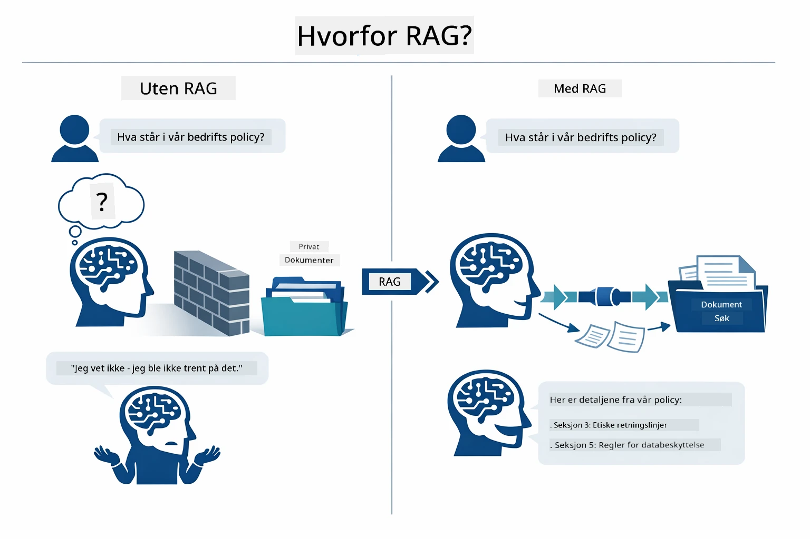

*Dette diagrammet viser forskjellen mellom en standard LLM (som gjetter basert på treningsdata) og en RAG-forbedret LLM (som først konsulterer dokumentene dine).*

Slik kobler delene sammen hele veien. Et brukerspørsmål går gjennom fire trinn — embedding, vektorsøk, kontekstsammensetning og svargenerering — der hvert trinn bygger på det forrige:


*Dette diagrammet viser hele RAG-pipelinen — et brukerspørsmål går gjennom embedding, vektorsøk, kontekstsammensetning og svargenerering.*

Resten av denne modulen går gjennom hvert trinn i detalj, med kode du kan kjøre og endre.

### Hvilken RAG-tilnærming bruker denne opplæringen?

LangChain4j tilbyr tre måter å implementere RAG på, hver med et ulikt abstraksjonsnivå. Diagrammet under sammenligner disse side om side:

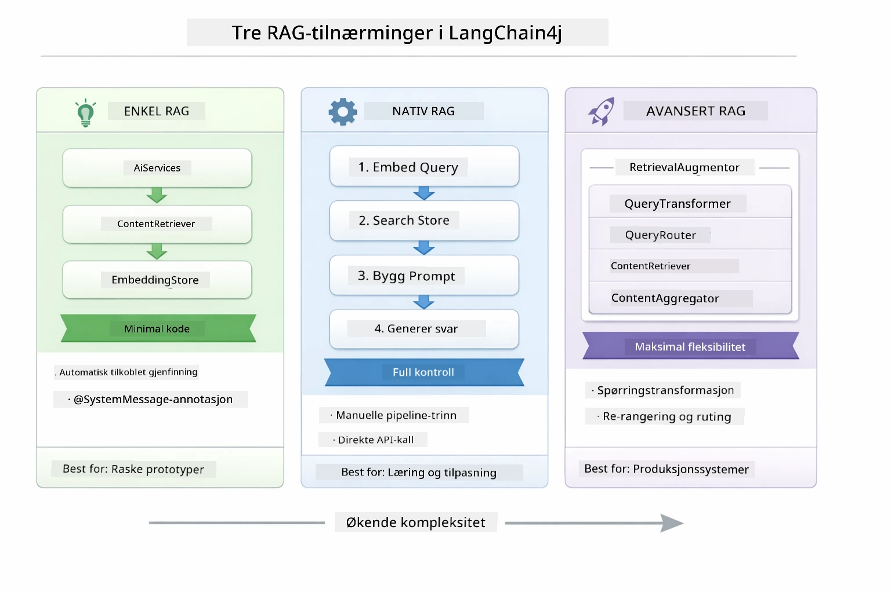

*Dette diagrammet sammenligner de tre LangChain4j RAG-tilnærmingene — Easy, Native og Advanced — og viser nøkkelkomponentene deres, samt når man bør bruke hver.*

| Tilnærming | Hva den gjør | Avveining |
|---|---|---|
| **Easy RAG** | Kobler alt automatisk gjennom `AiServices` og `ContentRetriever`. Du merker et grensesnitt, kobler til en retriever, og LangChain4j håndterer embedding, søk og promptsamling i bakgrunnen. | Minimalt med kode, men du ser ikke hva som skjer i hvert trinn. |
| **Native RAG** | Du kaller embedding-modellen, søker i lagringen, bygger prompten og genererer svaret selv — ett eksplisitt trinn av gangen. | Mer kode, men hvert steg er synlig og kan endres. |
| **Advanced RAG** | Bruker `RetrievalAugmentor` med pluggbare spørringstransformatorer, rutere, rangering og innholdsinnsprøytning for produksjons-grade pipelines. | Maksimal fleksibilitet, men betydelig mer kompleksitet. |

**Denne opplæringen bruker Native-tilnærmingen.** Hvert steg i RAG-pipelinen — embedding av spørsmålet, søk i vektorlageret, sammensetning av konteksten og generering av svaret — er skrevet eksplisitt i [`RagService.java`](../../../03-rag/src/main/java/com/example/langchain4j/rag/service/RagService.java). Dette er bevisst: som læringsressurs er det viktigere at du ser og forstår hvert trinn enn at koden er minimalisert. Når du er komfortabel med hvordan delene henger sammen, kan du gå videre til Easy RAG for raske prototyper eller Advanced RAG for produksjonssystemer.

> **💡 Har du allerede sett Easy RAG i praksis?** [Rask Start-modulen](../00-quick-start/README.md) inkluderer et Dokument Q&A-eksempel ([`SimpleReaderDemo.java`](../../../00-quick-start/src/main/java/com/example/langchain4j/quickstart/SimpleReaderDemo.java)) som bruker Easy RAG-tilnærmingen — LangChain4j håndterer embedding, søk og promptsamling automatisk. Denne modulen tar neste steg ved å åpne denne pipelinen så du kan se og kontrollere hvert trinn selv.

Diagrammet under viser Easy RAG-pipelinen fra det eksemplet for rask start. Legg merke til hvordan `AiServices` og `EmbeddingStoreContentRetriever` skjuler all kompleksitet — du laster inn et dokument, kobler til en retriever, og får svar. Native-tilnærmingen i denne modulen åpner opp hvert av de skjulte trinnene:

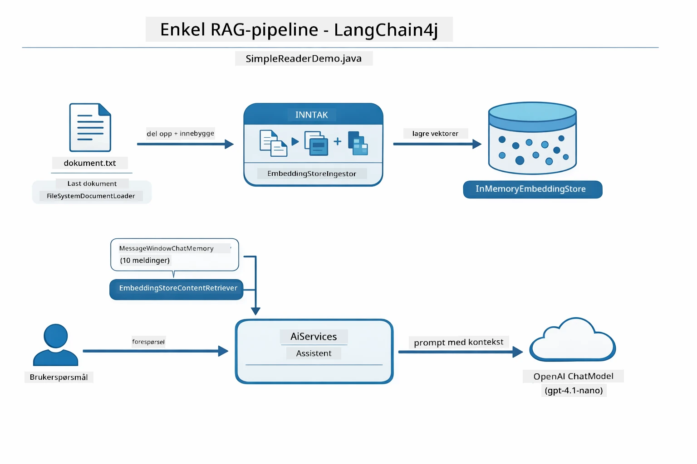

*Dette diagrammet viser Easy RAG-pipelinen fra `SimpleReaderDemo.java`. Sammenlign med Native-tilnærmingen brukt i denne modulen: Easy RAG skjuler embedding, innhenting og promptsamling bak `AiServices` og `ContentRetriever` — du laster inn et dokument, kobler til en retriever og får svar. Native-tilnærmingen i denne modulen åpner opp den pipelinen slik at du kaller hvert trinn (embed, søk, samle kontekst, generer) selv, og får full oversikt og kontroll.*

## Hvordan det fungerer

RAG-pipelinen i denne modulen deles opp i fire trinn som kjører sekvensielt hver gang en bruker stiller et spørsmål. Først **parses og deles det opplastede dokumentet opp** i håndterbare biter. Disse bitene konverteres deretter til **vektor-embeddings** og lagres slik at de kan sammenlignes matematisk. Når en forespørsel kommer, utfører systemet et **semantisk søk** for å finne de mest relevante bitene, og til sist sender dem som kontekst til LLM-en for **svargenerering**. Avsnittene under går gjennom hvert trinn med faktisk kode og diagrammer. La oss se på første steg.

### Dokumentbehandling

[DocumentService.java](../../../03-rag/src/main/java/com/example/langchain4j/rag/service/DocumentService.java)

Når du laster opp et dokument, parses det (PDF eller ren tekst), metadata som filnavn knyttes til, og det deles opp i biter — mindre deler som passer komfortabelt i modellens kontekstvindu. Disse bitene overlapper litt slik at du ikke mister kontekst ved grenseflatene.

```java
// Analyser den opplastede filen og pakk den inn i et LangChain4j-dokument
Document document = Document.from(content, metadata);

// Del opp i 300-token biter med 30-token overlapping
DocumentSplitter splitter = DocumentSplitters
    .recursive(300, 30);

List<TextSegment> segments = splitter.split(document);
```
  
Diagrammet under viser hvordan dette fungerer visuelt. Legg merke til hvordan hver bit deler noen få tokens med naboene — 30-token overlapp sikrer at ingen viktig kontekst faller mellom sprekkene:

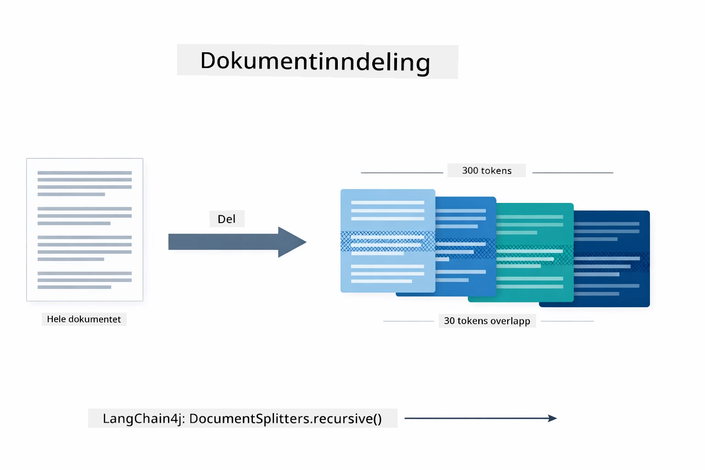

*Dette diagrammet viser et dokument som deles i 300-token biter med 30-token overlapp, som bevarer kontekst ved bit-grensene.*

> **🤖 Prøv med [GitHub Copilot](https://github.com/features/copilot) Chat:** Åpne [`DocumentService.java`](../../../03-rag/src/main/java/com/example/langchain4j/rag/service/DocumentService.java) og spør:  
> - "Hvordan deler LangChain4j dokumenter i biter og hvorfor er overlapp viktig?"  
> - "Hva er optimal biter-størrelse for ulike dokumenttyper og hvorfor?"  
> - "Hvordan håndterer jeg dokumenter på flere språk eller med spesiell formatering?"

### Opprette embeddings

[LangChainRagConfig.java](../../../03-rag/src/main/java/com/example/langchain4j/rag/config/LangChainRagConfig.java)

Hver bit konverteres til en numerisk representasjon kalt embedding — i praksis en betydning-til-tall-omformer. Embedding-modellen er ikke «intelligent» slik en chatmodell er; den kan ikke følge instruksjoner, resonnere eller svare på spørsmål. Det den kan gjøre, er å kartlegge tekst i et matematisk rom hvor like betydninger havner nær hverandre — «bil» nær «automobil», «refusjonspolitikk» nær «få pengene tilbake». Tenk på chatmodellen som en person du kan snakke med; embedding-modellen er et svært godt arkivsystem.

Diagrammet under visualiserer dette konseptet — tekst går inn, numeriske vektorer kommer ut, og like betydninger gir nærliggende vektorer:

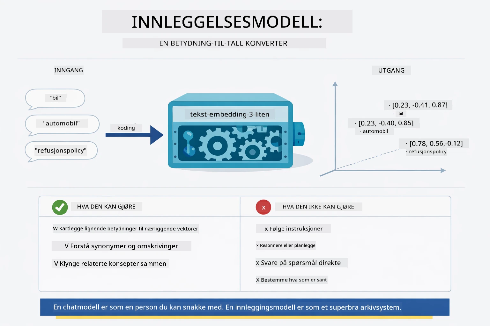

*Dette diagrammet viser hvordan en embedding-modell konverterer tekst til numeriske vektorer, og plasserer like betydninger — som «bil» og «automobil» — nær hverandre i vektorrommet.*

```java
@Bean
public EmbeddingModel embeddingModel() {
    return OpenAiOfficialEmbeddingModel.builder()
        .baseUrl(azureOpenAiEndpoint)
        .apiKey(azureOpenAiKey)
        .modelName(azureEmbeddingDeploymentName)
        .build();
}

EmbeddingStore<TextSegment> embeddingStore = 
    new InMemoryEmbeddingStore<>();
```
  
Klassediagrammet under viser de to separate flytene i en RAG-pipeline og LangChain4j-klassene som implementerer dem. **Inntaksflyten** (kjører én gang ved opplasting) deler dokumentet, embedder bitene og lagrer dem via `.addAll()`. **Spørringsflyten** (kjører hver gang en bruker spør) embedder spørsmålet, søker i lagringen via `.search()` og sender den matchede konteksten til chatmodellen. Begge flytene møtes i det delte `EmbeddingStore<TextSegment>`-grensesnittet:

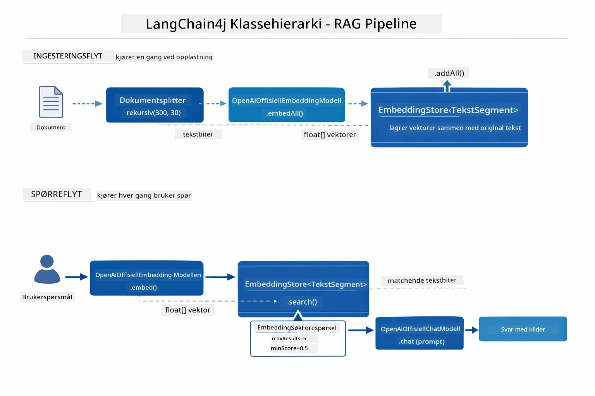

*Dette diagrammet viser de to flytene i en RAG-pipeline — inntak og spørring — og hvordan de kobles via et delt EmbeddingStore.*

Når embeddings er lagret, klustrer lignende innhold naturlig sammen i vektorrommet. Visualiseringen under viser hvordan dokumenter om relaterte temaer ender som nærliggende punkter, noe som gjør semantisk søk mulig:


*Denne visualiseringen viser hvordan relaterte dokumenter klustrer sammen i 3D vektorrom, med tema som Tekniske Dokumenter, Forretningsregler og FAQ som separate grupper.*

Når en bruker søker, følger systemet fire trinn: embed dokumentene en gang, embed spørsmålet ved hvert søk, sammenligne spørsmålsvektoren mot alle lagrede vektorer med cosinuslikhet, og returnere topp-K høyest scorende biter. Diagrammet under viser hvert trinn og involverte LangChain4j-klasser:

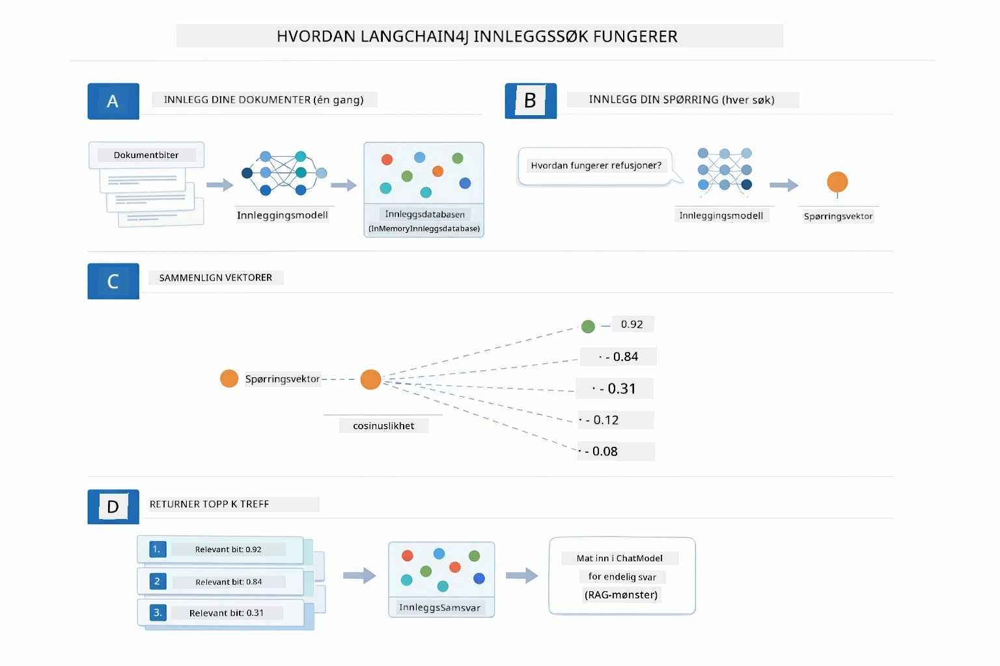

*Dette diagrammet viser fire-trinns embed-søkeprosess: embed dokumenter, embed spørring, sammenlign vektorer med cosinuslikhet, og returner topp-K resultater.*

### Semantisk søk

[RagService.java](../../../03-rag/src/main/java/com/example/langchain4j/rag/service/RagService.java)

Når du stiller et spørsmål, blir også spørsmålet ditt konvertert til en embedding. Systemet sammenligner embedding av spørsmålet ditt med embeddings av alle dokumentbitene. Det finner bitene med mest lignende betydninger — ikke bare samsvarende nøkkelord, men faktisk semantisk likhet.

```java
Embedding queryEmbedding = embeddingModel.embed(question).content();

EmbeddingSearchRequest searchRequest = EmbeddingSearchRequest.builder()
    .queryEmbedding(queryEmbedding)
    .maxResults(5)
    .minScore(0.5)
    .build();

EmbeddingSearchResult<TextSegment> searchResult = embeddingStore.search(searchRequest);
List<EmbeddingMatch<TextSegment>> matches = searchResult.matches();

for (EmbeddingMatch<TextSegment> match : matches) {
    String relevantText = match.embedded().text();
    double score = match.score();
}
```
  
Diagrammet under sammenligner semantisk søk med tradisjonelt nøkkelordssøk. Et nøkkelordssøk på "kjøretøy" overser en bit om "biler og lastebiler", men semantisk søk forstår at de betyr det samme og returnerer det med høyt resultat:

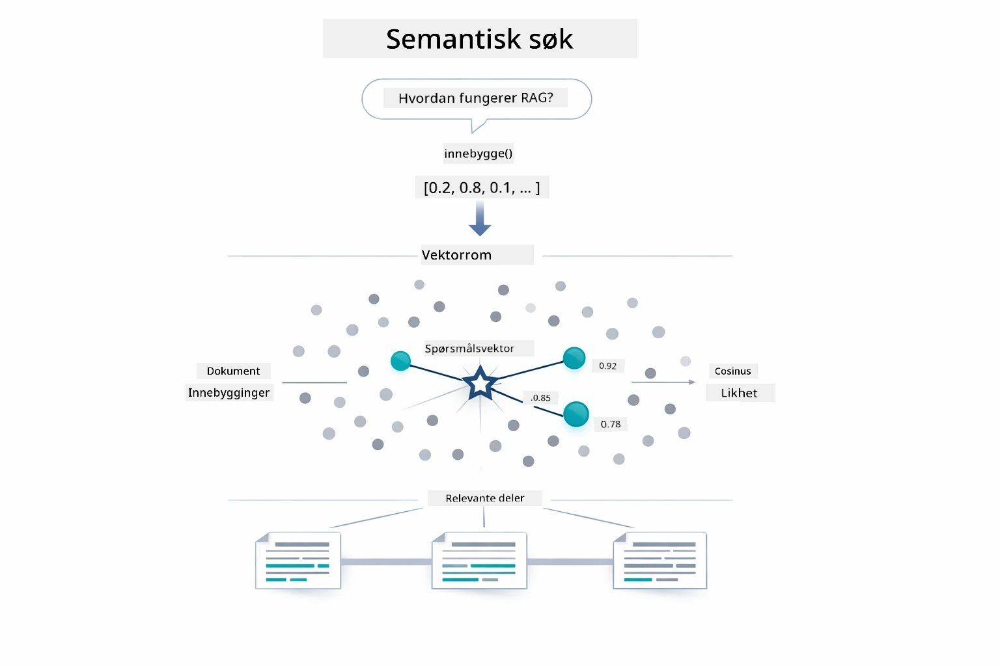

*Dette diagrammet sammenligner nøkkelordsøk med semantisk søk, og viser hvordan semantisk søk henter fram konseptuelt relatert innhold selv når eksakte nøkkelord er forskjellige.*
Under panseret blir likhet målt ved hjelp av cosinuslikhet — i hovedsak spørres det "peker disse to pilene i samme retning?" To biter kan bruke helt forskjellige ord, men hvis de betyr det samme, peker vektorene deres i samme retning og får en poengsum nær 1.0:

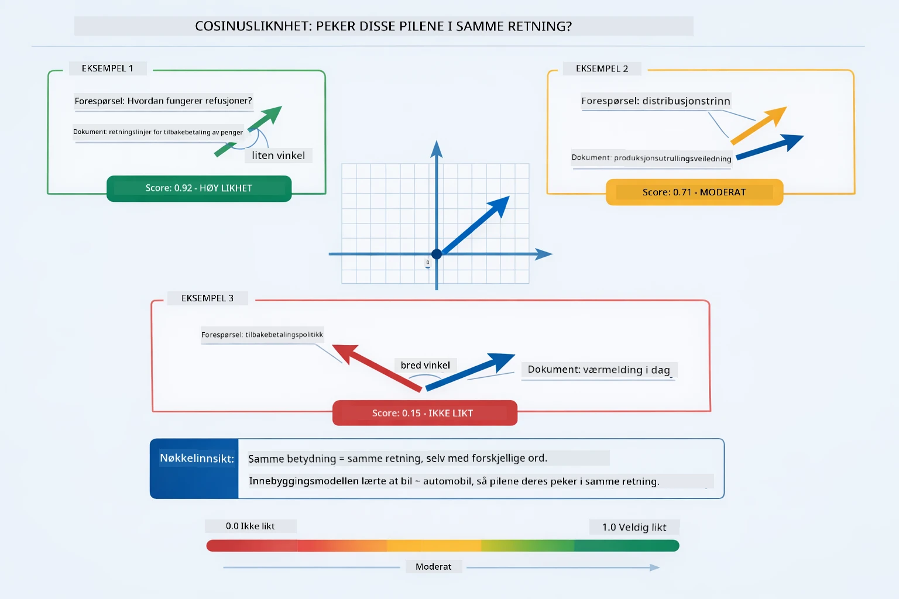

*Dette diagrammet illustrerer cosinuslikhet som vinkelen mellom innebygde vektorer — mer justerte vektorer får en poengsum nærmere 1.0, noe som indikerer høyere semantisk likhet.*

> **🤖 Prøv med [GitHub Copilot](https://github.com/features/copilot) Chat:** Åpne [`RagService.java`](../../../03-rag/src/main/java/com/example/langchain4j/rag/service/RagService.java) og spør:
> - "Hvordan fungerer søk etter likhet med innebygde representasjoner og hva bestemmer poengsummen?"
> - "Hvilken terskel for likhet bør jeg bruke og hvordan påvirker det resultatene?"
> - "Hvordan håndterer jeg tilfeller der ingen relevante dokumenter blir funnet?"

### Svargenerering

[RagService.java](../../../03-rag/src/main/java/com/example/langchain4j/rag/service/RagService.java)

De mest relevante bitene settes sammen til en strukturert prompt som inkluderer eksplisitte instruksjoner, den hentede konteksten og brukerens spørsmål. Modellen leser disse spesifikke bitene og svarer basert på denne informasjonen — den kan bare bruke det som er foran den, noe som forhindrer hallusinasjoner.

```java
String context = matches.stream()
    .map(match -> match.embedded().text())
    .collect(Collectors.joining("\n\n"));

String prompt = String.format("""
    Answer the question based on the following context.
    If the answer cannot be found in the context, say so.

    Context:
    %s

    Question: %s

    Answer:""", context, request.question());

String answer = chatModel.chat(prompt);
```

Diagrammet under viser denne sammensetningen i praksis — de høyest rangerte bitene fra søketrinnet settes inn i prompt-malen, og `OpenAiOfficialChatModel` genererer et forankret svar:

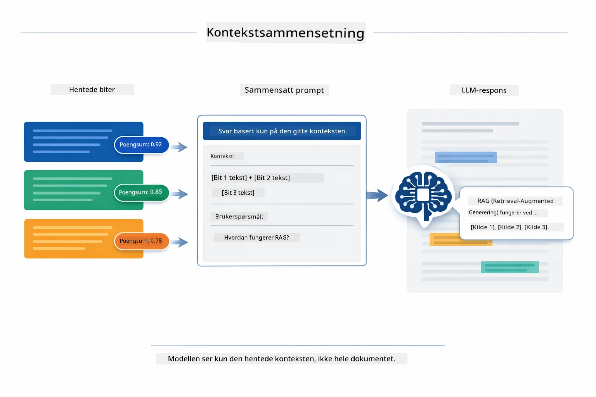

*Dette diagrammet viser hvordan de høyest rangerte bitene settes sammen til en strukturert prompt, slik at modellen kan generere et forankret svar basert på dataene dine.*

## Kjør applikasjonen

**Verifiser distribusjon:**

Sørg for at `.env`-filen finnes i rotmappen med Azure-legitimasjon (opprettet under Modul 01). Kjør dette fra modulkatalogen (`03-rag/`):

**Bash:**
```bash
cat ../.env  # Bør vise AZURE_OPENAI_ENDPOINT, API_KEY, DEPLOYMENT
```

**PowerShell:**
```powershell
Get-Content ..\.env  # Skal vise AZURE_OPENAI_ENDPOINT, API_KEY, DEPLOYMENT
```

**Start applikasjonen:**

> **Merk:** Hvis du allerede har startet alle applikasjonene ved bruk av `./start-all.sh` fra rotmappen (som beskrevet i Modul 01), kjører denne modulen allerede på port 8081. Du kan hoppe over startkommandoene under og gå direkte til http://localhost:8081.

**Alternativ 1: Bruke Spring Boot Dashboard (Anbefalt for VS Code-brukere)**

Dev-containeren inkluderer Spring Boot Dashboard-utvidelsen, som gir et visuelt grensesnitt for å administrere alle Spring Boot-applikasjoner. Du finner den i aktivitetslinjen til venstre i VS Code (se etter Spring Boot-ikonet).

Fra Spring Boot Dashboard kan du:
- Se alle tilgjengelige Spring Boot-applikasjoner i arbeidsområdet
- Starte/stoppe applikasjoner med ett klikk
- Se applikasjonslogger i sanntid
- Overvåke applikasjonsstatus

Klikk på avspillingsknappen ved siden av "rag" for å starte denne modulen, eller start alle moduler samtidig.


*Dette skjermbildet viser Spring Boot Dashboard i VS Code, hvor du visuelt kan starte, stoppe og overvåke applikasjoner.*

**Alternativ 2: Bruke shell-skript**

Start alle webapplikasjoner (moduler 01-04):

**Bash:**
```bash
cd ..  # Fra rotkatalogen
./start-all.sh
```

**PowerShell:**
```powershell
cd ..  # Fra rotdirektoriet
.\start-all.ps1
```

Eller start bare denne modulen:

**Bash:**
```bash
cd 03-rag
./start.sh
```

**PowerShell:**
```powershell
cd 03-rag
.\start.ps1
```

Begge skriptene laster automatisk miljøvariabler fra rotens `.env`-fil og vil bygge JAR-filer om de ikke allerede finnes.

> **Merk:** Hvis du heller vil bygge alle moduler manuelt før oppstart:
>
> **Bash:**
> ```bash
> cd ..  # Go to root directory
> mvn clean package -DskipTests
> ```
>
> **PowerShell:**
> ```powershell
> cd ..  # Go to root directory
> mvn clean package -DskipTests
> ```

Åpne http://localhost:8081 i nettleseren din.

**For å stoppe:**

**Bash:**
```bash
./stop.sh  # Kun denne modulen
# Eller
cd .. && ./stop-all.sh  # Alle moduler
```

**PowerShell:**
```powershell
.\stop.ps1  # Kun denne modulen
# Eller
cd ..; .\stop-all.ps1  # Alle moduler
```

## Bruke applikasjonen

Applikasjonen tilbyr et webgrensesnitt for dokumentopplasting og spørsmål.

<a href="images/rag-homepage.png"></a>

*Dette skjermbildet viser RAG-applikasjonens grensesnitt hvor du laster opp dokumenter og stiller spørsmål.*

### Last opp et dokument

Start med å laste opp et dokument - TXT-filer fungerer best for testing. En `sample-document.txt` er inkludert i denne katalogen som inneholder informasjon om LangChain4j-funksjoner, RAG-implementering og beste praksis - perfekt for systemtesting.

Systemet behandler dokumentet ditt, deler det opp i biter og lager innebygde representasjoner for hver bit. Dette skjer automatisk ved opplasting.

### Still spørsmål

Still nå spesifikke spørsmål om dokumentinnholdet. Prøv noe faktabasert som tydelig står i dokumentet. Systemet søker etter relevante biter, inkluderer dem i prompten, og genererer et svar.

### Sjekk kildereferanser

Merk at hvert svar inkluderer kildehenvisninger med likhetspoeng. Disse poengene (0 til 1) viser hvor relevante hver bit var for spørsmålet ditt. Høyere poeng betyr bedre treff. Dette lar deg verifisere svaret mot kildematerialet.

<a href="images/rag-query-results.png"></a>

*Dette skjermbildet viser resultater for spørring med generert svar, kildereferanser og relevanspoeng for hver hentede bit.*

### Eksperimenter med spørsmål

Prøv ulike typer spørsmål:
- Spesifikke fakta: "Hva er hovedtemaet?"
- Sammenligninger: "Hva er forskjellen mellom X og Y?"
- Oppsummeringer: "Oppsummer hovedpunktene om Z"

Se hvordan relevanspoengene endrer seg basert på hvor bra spørsmålet ditt matcher dokumentets innhold.

## Nøkkelkonsepter

### Chunking-strategi

Dokumenter deles opp i 300-token biter med 30 tokens overlapp. Denne balansen sikrer at hver bit har nok kontekst til å være meningsfull samtidig som de er små nok til at flere biter kan inkluderes i en prompt.

### Likhetspoeng

Hver hentet bit kommer med en likhetspoengsum mellom 0 og 1 som angir hvor nært den matcher brukerens spørsmål. Diagrammet nedenfor visualiserer poengområdene og hvordan systemet bruker dem til å filtrere resultater:

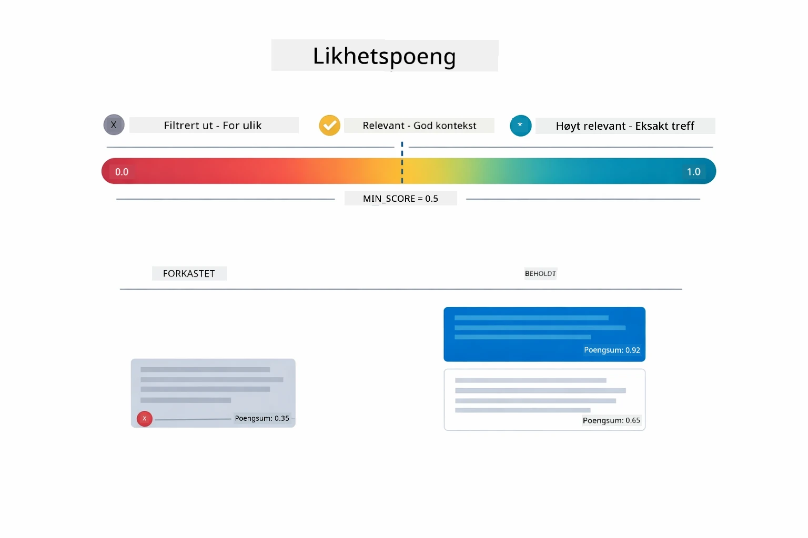

*Dette diagrammet viser poengområder fra 0 til 1, med en minimumsterskel på 0.5 som filtrerer bort irrelevante biter.*

Poeng varierer fra 0 til 1:
- 0.7-1.0: Svært relevante, eksakt treff
- 0.5-0.7: Relevante, god kontekst
- Under 0.5: Filtrert bort, for ulik

Systemet henter kun biter over minimumsterskelen for å sikre kvalitet.

Innebygde representasjoner fungerer godt når mening samler seg klart, men har blinde soner. Diagrammet under viser vanlige feilmåter — biter som er for store gir uklare vektorer, biter som er for små mangler kontekst, tvetydige begreper peker til flere klynger, og eksakte oppslag (IDer, delenummer) fungerer ikke med innebygde representasjoner i det hele tatt:

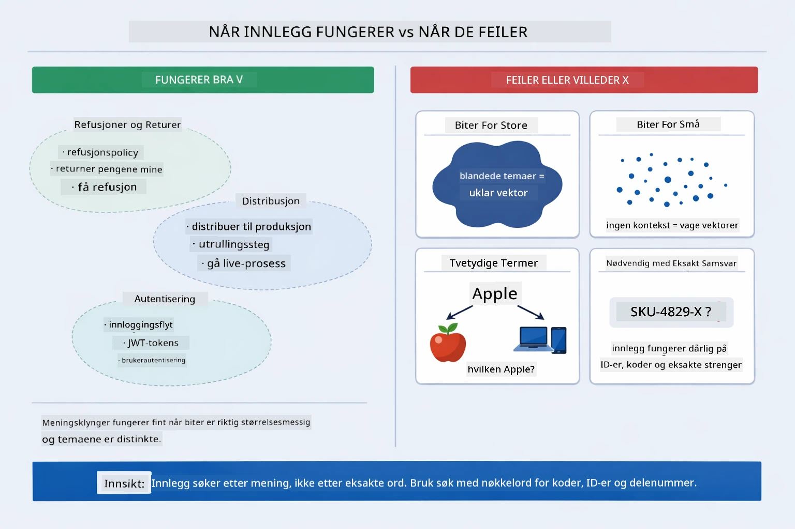

*Dette diagrammet viser vanlige feilmoduser for innebygde representasjoner: biter som er for store, biter som er for små, tvetydige begreper som peker til flere klynger og eksakte oppslag som IDer.*

### Lagring i minnet

Denne modulen bruker lagring i minnet for enkelhetens skyld. Når du starter applikasjonen på nytt, går opplastede dokumenter tapt. Produksjonssystemer bruker persistente vektor-databaser som Qdrant eller Azure AI Search.

### Håndtering av kontekstvindu

Hver modell har et maksimalt kontekstvindu. Du kan ikke inkludere alle biter fra et stort dokument. Systemet henter de N mest relevante bitene (standard 5) for å holde seg innenfor grenser samtidig som det gir nok kontekst for korrekte svar.

## Når RAG er viktig

RAG er ikke alltid riktig tilnærming. Beslutningsguiden under hjelper deg å avgjøre når RAG tilfører verdi versus når enklere tilnærminger — som å inkludere innhold direkte i prompten eller stole på modellens innebygde kunnskap — er tilstrekkelige:

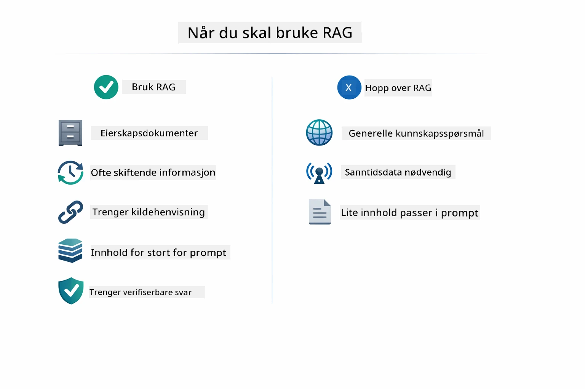

*Dette diagrammet viser en beslutningsguide for når RAG tilfører verdi versus når enklere metoder er tilstrekkelige.*

## Neste steg

**Neste modul:** [04-tools - AI Agents med verktøy](../04-tools/README.md)

---

**Navigasjon:** [← Forrige: Modul 02 - Prompt Engineering](../02-prompt-engineering/README.md) | [Tilbake til hoved](../README.md) | [Neste: Modul 04 - Verktøy →](../04-tools/README.md)

---

<!-- CO-OP TRANSLATOR DISCLAIMER START -->
**Ansvarsfraskrivelse**:
Dette dokumentet er oversatt ved hjelp av AI-oversettelsestjenesten [Co-op Translator](https://github.com/Azure/co-op-translator). Selv om vi streber etter nøyaktighet, vennligst vær oppmerksom på at automatiske oversettelser kan inneholde feil eller unøyaktigheter. Det originale dokumentet på det opprinnelige språket skal betraktes som den autoritative kilden. For viktig informasjon anbefales profesjonell menneskelig oversettelse. Vi er ikke ansvarlige for misforståelser eller feiltolkninger som oppstår ved bruk av denne oversettelsen.
<!-- CO-OP TRANSLATOR DISCLAIMER END -->