# Modul 04: AI-agenter med verktøy

## Innholdsfortegnelse

- [Hva du vil lære](../../../04-tools)
- [Forutsetninger](../../../04-tools)
- [Forstå AI-agenter med verktøy](../../../04-tools)
- [Hvordan verktøykall fungerer](../../../04-tools)
  - [Verktøydefinisjoner](../../../04-tools)
  - [Beslutningstaking](../../../04-tools)
  - [Utførelse](../../../04-tools)
  - [Responsgenerering](../../../04-tools)
  - [Arkitektur: Spring Boot automatisk kobling](../../../04-tools)
- [Verktøykjedning](../../../04-tools)
- [Kjør applikasjonen](../../../04-tools)
- [Bruke applikasjonen](../../../04-tools)
  - [Prøv enkel verktøybruk](../../../04-tools)
  - [Test verktøykjedning](../../../04-tools)
  - [Se samtaleflyt](../../../04-tools)
  - [Eksperimenter med forskjellige forespørsler](../../../04-tools)
- [Nøkkelkonsepter](../../../04-tools)
  - [ReAct-mønsteret (resonnering og handling)](../../../04-tools)
  - [Verktøybeskrivelser er viktige](../../../04-tools)
  - [Øktstyring](../../../04-tools)
  - [Feilhåndtering](../../../04-tools)
- [Tilgjengelige verktøy](../../../04-tools)
- [Når man bør bruke verktøybaserte agenter](../../../04-tools)
- [Verktøy vs RAG](../../../04-tools)
- [Neste steg](../../../04-tools)

## Hva du vil lære

Så langt har du lært hvordan du kan ha samtaler med AI, strukturere prompts effektivt og forankre svar i dokumentene dine. Men det finnes fortsatt en grunnleggende begrensning: språkmodeller kan bare generere tekst. De kan ikke sjekke været, utføre beregninger, spørre databaser eller samhandle med eksterne systemer.

Verktøy endrer dette. Ved å gi modellen tilgang til funksjoner den kan kalle, forvandler du den fra en tekstgenerator til en agent som kan utføre handlinger. Modellen avgjør når den trenger et verktøy, hvilket verktøy den skal bruke og hvilke parametere den skal sende. Koden din utfører funksjonen og returnerer resultatet. Modellen inkorporerer så dette resultatet i svaret sitt.

## Forutsetninger

- Fullført Modul 01 (Azure OpenAI-ressurser distribuert)
- `.env`-fil i rotkatalogen med Azure-legitimasjon (opprettet av `azd up` i Modul 01)

> **Merk:** Hvis du ikke har fullført Modul 01, følg utplasseringsinstruksjonene der først.

## Forstå AI-agenter med verktøy

> **📝 Merk:** Begrepet "agenter" i denne modulen refererer til AI-assistenter utvidet med verktøykall-funksjonalitet. Dette er forskjellig fra **Agentic AI**-mønstrene (autonome agenter med planlegging, minne og flerstegs resonnering) som vi vil dekke i [Modul 05: MCP](../05-mcp/README.md).

Uten verktøy kan en språkmodell bare generere tekst basert på treningsdataene sine. Spør den om dagens vær, og den må gjette. Gi den verktøy, og den kan kalle en vær-API, utføre beregninger eller spørre en database — for så å flette disse virkelige resultatene inn i svaret sitt.

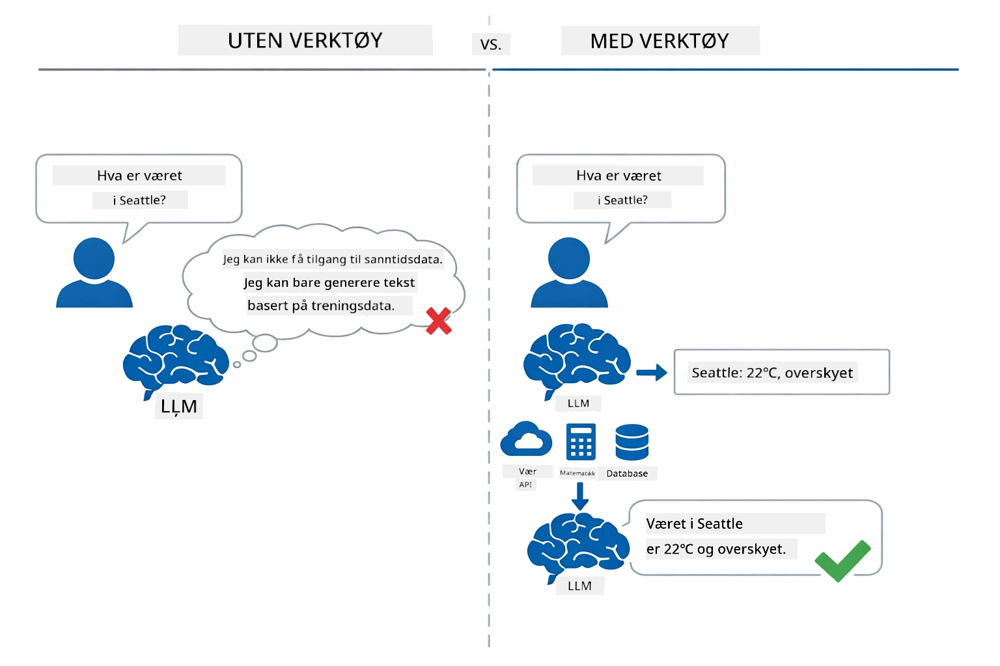

*Uten verktøy kan modellen bare gjette — med verktøy kan den kalle APIer, kjøre beregninger og returnere sanntidsdata.*

En AI-agent med verktøy følger et **Reasoning and Acting (ReAct)**-mønster. Modellen svarer ikke bare — den tenker på hva den trenger, handler ved å kalle et verktøy, observerer resultatet og avgjør deretter om den skal handle igjen eller levere det endelige svaret:

1. **Resonner** — Agenten analyserer brukerens spørsmål og avgjør hvilken informasjon den trenger
2. **Handling** — Agenten velger riktig verktøy, genererer riktige parametere og kaller det
3. **Observer** — Agenten mottar verktøyets utdata og vurderer resultatet
4. **Gjenta eller svar** — Hvis mer data trengs, går agenten tilbake til starten; ellers komponerer den et naturlig språk-svar

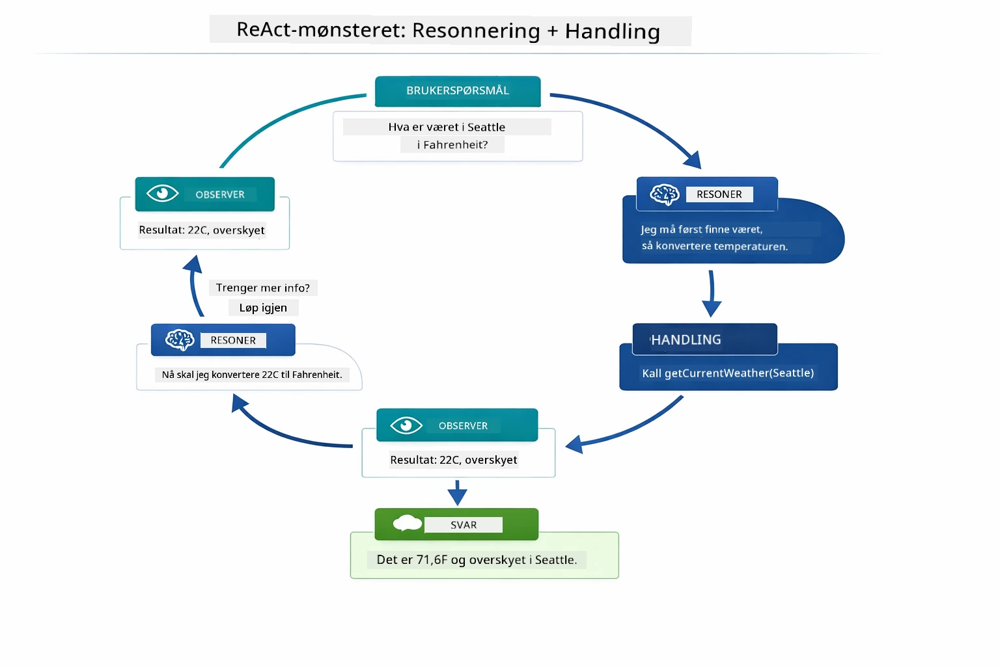

*ReAct-syklusen — agenten resonerer om hva den skal gjøre, handler ved å kalle et verktøy, observerer resultatet og gjentar til den kan gi det endelige svaret.*

Dette skjer automatisk. Du definerer verktøyene og deres beskrivelser. Modellen håndterer beslutningstaking om når og hvordan verktøyene skal brukes.

## Hvordan verktøykall fungerer

### Verktøydefinisjoner

[WeatherTool.java](../../../04-tools/src/main/java/com/example/langchain4j/agents/tools/WeatherTool.java) | [TemperatureTool.java](../../../04-tools/src/main/java/com/example/langchain4j/agents/tools/TemperatureTool.java)

Du definerer funksjoner med klare beskrivelser og spesifikasjoner av parametere. Modellen ser disse beskrivelsene i systemprompten sin og forstår hva hvert verktøy gjør.

```java
@Component
public class WeatherTool {
    
    @Tool("Get the current weather for a location")
    public String getCurrentWeather(@P("Location name") String location) {
        // Logikken din for væroppslag
        return "Weather in " + location + ": 22°C, cloudy";
    }
}

@AiService
public interface Assistant {
    String chat(@MemoryId String sessionId, @UserMessage String message);
}

// Assistenten kobles automatisk av Spring Boot med:
// - ChatModel bean
// - Alle @Tool-metoder fra @Component-klasser
// - ChatMemoryProvider for øktstyring
```

Diagrammet nedenfor bryter ned hver annotasjon og viser hvordan hver del hjelper AI med å forstå når verktøyet skal kalles og hvilke argumenter som skal sendes:

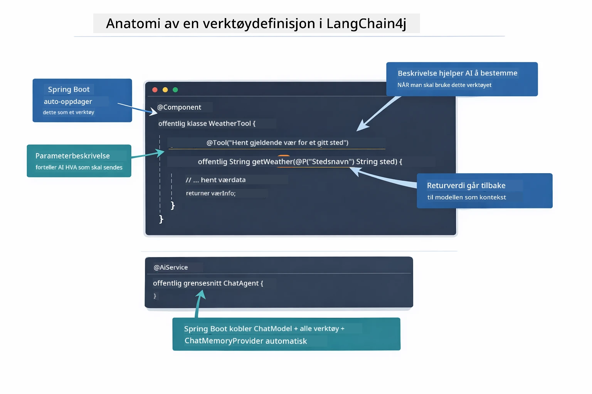

*Anatomi av en verktøydefinisjon — @Tool forteller AI når den skal bruke det, @P beskriver hver parameter, og @AiService kobler alt sammen ved oppstart.*

> **🤖 Prøv med [GitHub Copilot](https://github.com/features/copilot) Chat:** Åpne [`WeatherTool.java`](../../../04-tools/src/main/java/com/example/langchain4j/agents/tools/WeatherTool.java) og spør:
> - "Hvordan kan jeg integrere en ekte vær-API som OpenWeatherMap i stedet for mock-data?"
> - "Hva gjør en god verktøybeskrivelse som hjelper AI med å bruke det korrekt?"
> - "Hvordan håndterer jeg API-feil og hastighetsbegrensninger i verktøyimplementasjoner?"

### Beslutningstaking

Når en bruker spør "Hvordan er været i Seattle?", velger ikke modellen tilfeldig et verktøy. Den sammenligner brukerens intensjon med alle verktøybeskrivelser den har tilgang til, gir hver relevans-score og velger det beste. Den genererer deretter et strukturert funksjonskall med riktige parametere — i dette tilfellet setter den `location` til `"Seattle"`.

Hvis ingen verktøy matcher brukerens forespørsel, går modellen tilbake til å svare ut fra sin egen kunnskap. Hvis flere verktøy matcher, velger den det mest spesifikke.

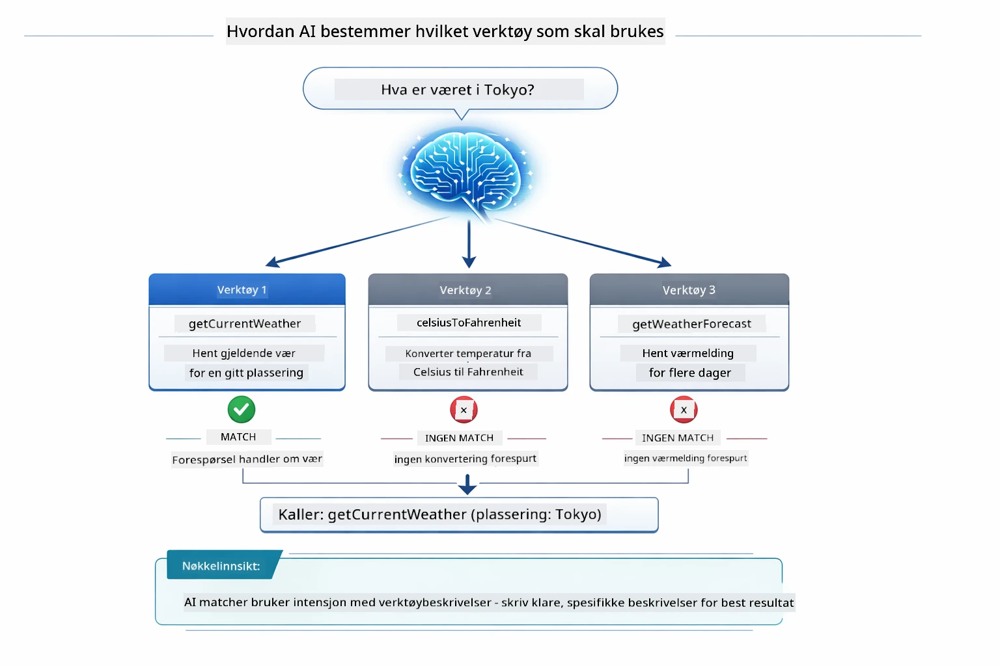

*Modellen vurderer hvert tilgjengelig verktøy mot brukerens intensjon og velger det beste treffet — derfor er det viktig å skrive klare og spesifikke verktøybeskrivelser.*

### Utførelse

[AgentService.java](../../../04-tools/src/main/java/com/example/langchain4j/agents/service/AgentService.java)

Spring Boot kobler automatisk det deklarative `@AiService`-grensesnittet med alle registrerte verktøy, og LangChain4j utfører verktøykall automatisk. Bak kulissene følger et komplett verktøykall seks faser — fra brukerens naturlige språk-spørsmål helt tilbake til et svar på naturlig språk:

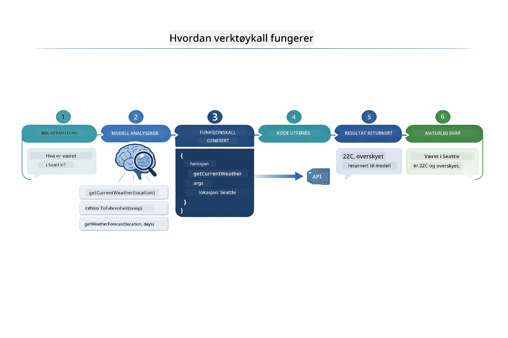

*Helhetlig flyt — brukeren stiller et spørsmål, modellen velger et verktøy, LangChain4j utfører det, og modellen vever resultatet inn i et naturlig svar.*

> **🤖 Prøv med [GitHub Copilot](https://github.com/features/copilot) Chat:** Åpne [`AgentService.java`](../../../04-tools/src/main/java/com/example/langchain4j/agents/service/AgentService.java) og spør:
> - "Hvordan fungerer ReAct-mønsteret og hvorfor er det effektivt for AI-agenter?"
> - "Hvordan bestemmer agenten hvilket verktøy den skal bruke og i hvilken rekkefølge?"
> - "Hva skjer hvis et verktøykall feiler – hvordan bør jeg håndtere feil robust?"

### Responsgenerering

Modellen mottar værdataene og formaterer det til et naturlig språk-svar til brukeren.

### Arkitektur: Spring Boot automatisk kobling

Denne modulen bruker LangChain4js Spring Boot-integrasjon med deklarative `@AiService`-grensesnitt. Ved oppstart oppdager Spring Boot alle `@Component` som inneholder `@Tool`-metoder, din `ChatModel`-bean og `ChatMemoryProvider` — og kobler alt sammen i et enkelt `Assistant`-grensesnitt uten boilerplate.

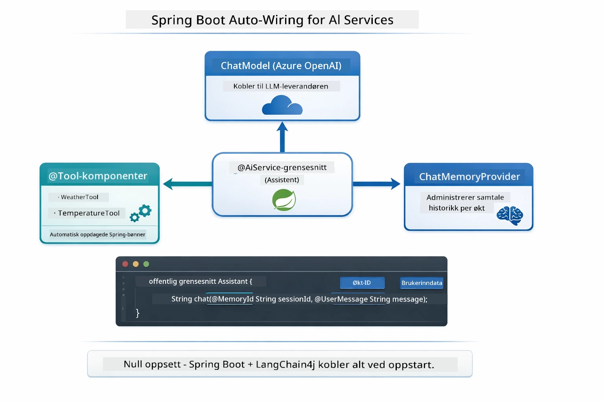

*`@AiService`-grensesnittet binder sammen ChatModel, verktøykomponentene og minneleverandøren — Spring Boot håndterer all kobling automatisk.*

Viktige fordeler med denne tilnærmingen:

- **Spring Boot automatisk kobling** — ChatModel og verktøy injiseres automatisk
- **@MemoryId-mønster** — Automatisk øktbasert minnehåndtering
- **Enkelt forekomst** — Assistant opprettes én gang og gjenbrukes for bedre ytelse
- **Typesikker utførelse** — Java-metoder kalles direkte med typekonvertering
- **Multistegs orkestrering** — Håndterer verktøykjedning automatisk
- **Null boilerplate** — Ingen manuelle `AiServices.builder()`-kall eller minne-HashMap

Alternative tilnærminger (manuell `AiServices.builder()`) krever mer kode og mangler Spring Boot-integrasjonens fordeler.

## Verktøykjedning

**Verktøykjedning** — Den virkelige kraften til verktøybaserte agenter viser seg når ett enkelt spørsmål krever flere verktøy. Spør "Hva er været i Seattle i Fahrenheit?" og agenten kjeder automatisk sammen to verktøy: først kaller den `getCurrentWeather` for å hente temperaturen i Celsius, så sender den den verdien til `celsiusToFahrenheit` for konvertering — alt i en enkelt samtalerunde.

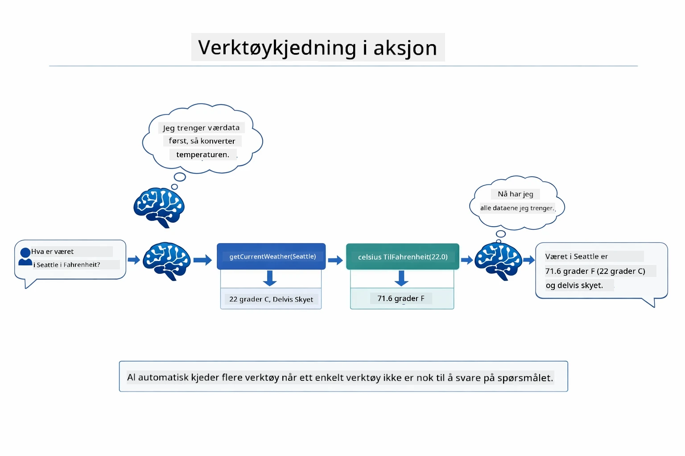

*Verktøykjedning i praksis — agenten kaller først getCurrentWeather, deretter sender den Celsius-resultatet til celsiusToFahrenheit, og leverer et kombinert svar.*

Slik ser dette ut i den kjørende applikasjonen — agenten kjeder sammen to verktøykall i én samtalerunde:

<a href="images/tool-chaining.png"></a>

*Faktisk applikasjonsutdata — agenten kjeder automatisk sammen getCurrentWeather → celsiusToFahrenheit i én runde.*

**Graceful Failures** — Spør etter vær i en by som ikke finnes i mock-dataene. Verktøyet returnerer en feilmelding, og AI forklarer at den ikke kan hjelpe i stedet for å krasje. Verktøy feiler trygt.

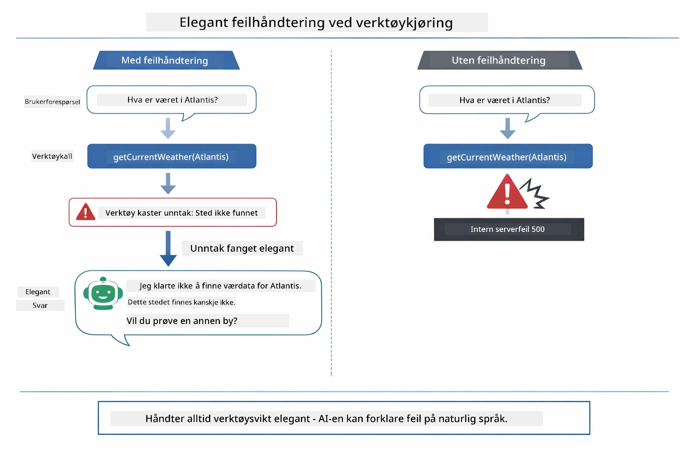

*Når et verktøy feiler, fanger agenten feilen og svarer med en hjelpsom forklaring i stedet for å krasje.*

Dette skjer i én enkelt samtalerunde. Agenten orkestrerer flere verktøykall autonomt.

## Kjør applikasjonen

**Verifiser distribusjon:**

Sørg for at `.env`-filen finnes i rotkatalogen med Azure-legitimasjon (opprettet under Modul 01):
```bash
cat ../.env  # Bør vise AZURE_OPENAI_ENDPOINT, API_KEY, DEPLOYMENT
```

**Start applikasjonen:**

> **Merk:** Hvis du allerede startet alle applikasjoner med `./start-all.sh` fra Modul 01, kjører denne modulen allerede på port 8084. Du kan hoppe over startkommandoene nedenfor og gå direkte til http://localhost:8084.

**Alternativ 1: Bruke Spring Boot Dashboard (Anbefalt for VS Code-brukere)**

Dev-containeren inkluderer Spring Boot Dashboard-utvidelsen, som gir et visuelt grensesnitt for å administrere alle Spring Boot-applikasjoner. Du finner den i aktivitetslinjen på venstre side i VS Code (se etter Spring Boot-ikonet).

Fra Spring Boot Dashboard kan du:
- Se alle tilgjengelige Spring Boot-applikasjoner i arbeidsområdet
- Starte/stopp applikasjoner med ett klikk
- Se applikasjonslogger i sanntid
- Overvåke applikasjonsstatus

Klikk på avspillingsknappen ved siden av "tools" for å starte denne modulen, eller start alle moduler samtidig.


**Alternativ 2: Bruke shell-skript**

Start alle webapplikasjoner (moduler 01-04):

**Bash:**
```bash
cd ..  # Fra rotkatalogen
./start-all.sh
```

**PowerShell:**
```powershell
cd ..  # Fra rotkatalogen
.\start-all.ps1
```

Eller start bare denne modulen:

**Bash:**
```bash
cd 04-tools
./start.sh
```

**PowerShell:**
```powershell
cd 04-tools
.\start.ps1
```

Begge skriptene laster automatisk miljøvariabler fra rotens `.env`-fil og bygger JAR-filene om de ikke eksisterer.

> **Merk:** Hvis du ønsker å bygge alle moduler manuelt før oppstart:
>
> **Bash:**
> ```bash
> cd ..  # Go to root directory
> mvn clean package -DskipTests
> ```
>
> **PowerShell:**
> ```powershell
> cd ..  # Go to root directory
> mvn clean package -DskipTests
> ```

Åpne http://localhost:8084 i nettleseren din.

**For å stoppe:**

**Bash:**
```bash
./stop.sh  # Kun denne modulen
# Eller
cd .. && ./stop-all.sh  # Alle moduler
```

**PowerShell:**
```powershell
.\stop.ps1  # Kun denne modulen
# Eller
cd ..; .\stop-all.ps1  # Alle moduler
```

## Bruke applikasjonen

Applikasjonen tilbyr et webgrensesnitt hvor du kan interagere med en AI-agent som har tilgang til vær- og temperaturkonverteringsverktøy.

<a href="images/tools-homepage.png"></a>

*AI Agent Tools-grensesnittet - raske eksempler og en chattegrensesnitt for å samhandle med verktøy*

### Prøv enkel verktøybruk
Start med en enkel forespørsel: "Konverter 100 grader Fahrenheit til Celsius". Agenten gjenkjenner at den trenger temperaturkonverteringsverktøyet, kaller det med riktige parametere, og returnerer resultatet. Legg merke til hvor naturlig dette føles - du spesifiserte ikke hvilket verktøy som skal brukes eller hvordan det skulle kalles.

### Test verktøykobling

Prøv nå noe mer komplekst: "Hvordan er været i Seattle og konverter det til Fahrenheit?" Se hvordan agenten jobber gjennom dette i trinn. Den henter først været (som returnerer Celsius), gjenkjenner at den må konvertere til Fahrenheit, kaller konverteringsverktøyet, og kombinerer begge resultatene til ett svar.

### Se samtaleforløpet

Chat-grensesnittet opprettholder samtalehistorikk, slik at du kan ha samtaler som går over flere runder. Du kan se alle tidligere spørsmål og svar, noe som gjør det enkelt å følge samtalen og forstå hvordan agenten bygger kontekst over flere utvekslinger.

<a href="images/tools-conversation-demo.png"></a>

*Fler-runde samtale som viser enkle konverteringer, væroppslag og verktøykoblinger*

### Eksperimenter med ulike forespørsler

Prøv forskjellige kombinasjoner:
- Væroppslag: "Hvordan er været i Tokyo?"
- Temperaturkonverteringer: "Hva er 25°C i Kelvin?"
- Kombinerte spørsmål: "Sjekk været i Paris og fortell om det er over 20°C"

Legg merke til hvordan agenten tolker naturlig språk og kartlegger det til passende verktøykall.

## Nøkkelkonsepter

### ReAct-mønster (Resonnering og Handling)

Agenten veksler mellom resonnering (å bestemme hva som skal gjøres) og handling (bruk av verktøy). Dette mønsteret muliggjør autonom problemløsning i stedet for bare å svare etter instruksjoner.

### Verktøybeskrivelser er viktige

Kvaliteten på verktøybeskrivelsene dine påvirker direkte hvor godt agenten bruker dem. Klare, spesifikke beskrivelser hjelper modellen å forstå når og hvordan hvert verktøy skal kalles.

### Sesjonshåndtering

`@MemoryId`-annotasjonen muliggjør automatisk sesjonsbasert minnehåndtering. Hver sesjons-ID får sin egen `ChatMemory`-instans som styres av `ChatMemoryProvider`-beanen, slik at flere brukere kan interagere med agenten samtidig uten at samtalene deres blandes.

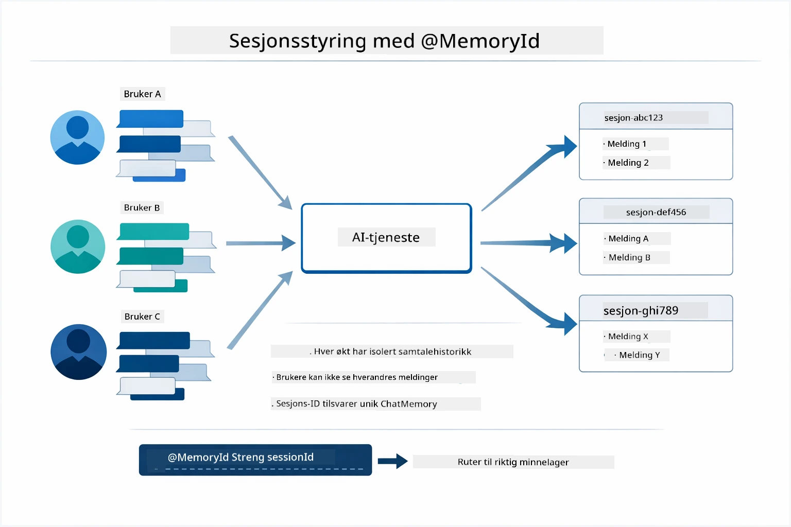

*Hver sesjons-ID kobles til en isolert samtalehistorikk — brukere ser aldri hverandres meldinger.*

### Feilhåndtering

Verktøy kan feile — API-er kan tidsavbrytes, parametere kan være ugyldige, eksterne tjenester kan gå ned. Produksjonsagenter trenger feilhåndtering slik at modellen kan forklare problemer eller prøve alternativer i stedet for å krasje hele applikasjonen. Når et verktøy kaster en unntak, fanger LangChain4j det og sender feilmeldingen tilbake til modellen, som deretter kan forklare problemet på naturlig språk.

## Tilgjengelige verktøy

Diagrammet nedenfor viser det brede økosystemet av verktøy du kan bygge. Denne modulen demonstrerer vær- og temperaturverktøy, men det samme `@Tool`-mønsteret fungerer for alle Java-metoder — fra databaseforespørsler til betalingsbehandling.

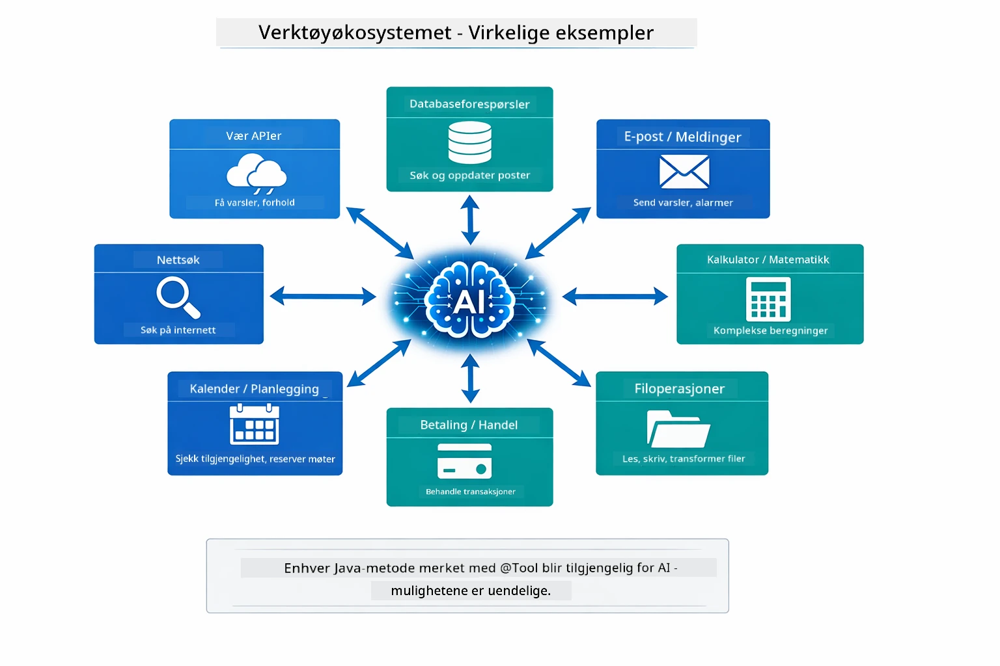

*Enhver Java-metode annotert med @Tool blir tilgjengelig for AI — mønsteret utvides til databaser, API-er, e-post, filoperasjoner og mer.*

## Når bruke verktøybaserte agenter

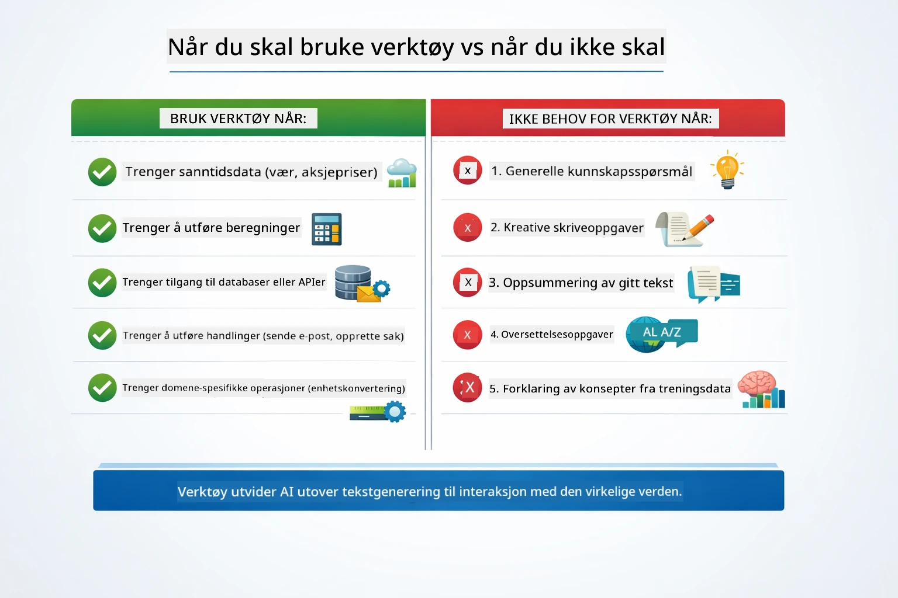

*En rask beslutningsguide — verktøy er for sanntidsdata, beregninger og handlinger; generell kunnskap og kreative oppgaver trenger dem ikke.*

**Bruk verktøy når:**
- Svaret krever sanntidsdata (vær, aksjekurser, lagerbeholdning)
- Du må utføre beregninger utover enkel matematikk
- Tilgang til databaser eller API-er
- Utføre handlinger (sende e-poster, opprette saker, oppdatere poster)
- Kombinere flere datakilder

**Ikke bruk verktøy når:**
- Spørsmål kan besvares med generell kunnskap
- Svaret er rent samtalemessig
- Verktøyets latenstid vil gjøre opplevelsen for treg

## Verktøy vs RAG

Modulene 03 og 04 utvider begge hva AI kan gjøre, men på fundamentalt forskjellige måter. RAG gir modellen tilgang til **kunnskap** ved å hente dokumenter. Verktøy gir modellen muligheten til å ta **handlinger** ved å kalle funksjoner.

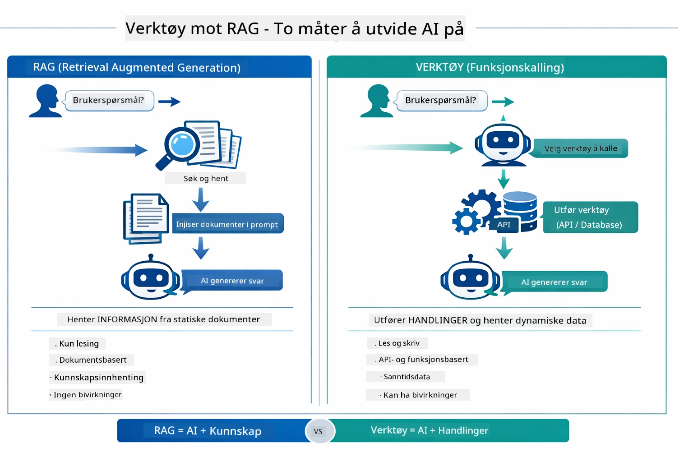

*RAG henter informasjon fra statiske dokumenter — Verktøy utfører handlinger og henter dynamiske sanntidsdata. Mange produksjonssystemer kombinerer begge.*

I praksis kombinerer mange produksjonssystemer begge tilnærmingene: RAG for å forankre svar i dokumentasjonen din, og Verktøy for å hente live-data eller utføre operasjoner.

## Neste steg

**Neste modul:** [05-mcp - Model Context Protocol (MCP)](../05-mcp/README.md)

---

**Navigasjon:** [← Forrige: Modul 03 - RAG](../03-rag/README.md) | [Tilbake til hovedmeny](../README.md) | [Neste: Modul 05 - MCP →](../05-mcp/README.md)

---

<!-- CO-OP TRANSLATOR DISCLAIMER START -->
**Ansvarsfraskrivelse**:
Dette dokumentet er oversatt ved hjelp av AI-oversettelsestjenesten [Co-op Translator](https://github.com/Azure/co-op-translator). Selv om vi streber etter nøyaktighet, vennligst vær oppmerksom på at automatiske oversettelser kan inneholde feil eller unøyaktigheter. Det opprinnelige dokumentet på dets opprinnelige språk bør anses som den autoritative kilden. For kritisk informasjon anbefales profesjonell menneskelig oversettelse. Vi er ikke ansvarlige for eventuelle misforståelser eller feiltolkninger som oppstår fra bruken av denne oversettelsen.
<!-- CO-OP TRANSLATOR DISCLAIMER END -->