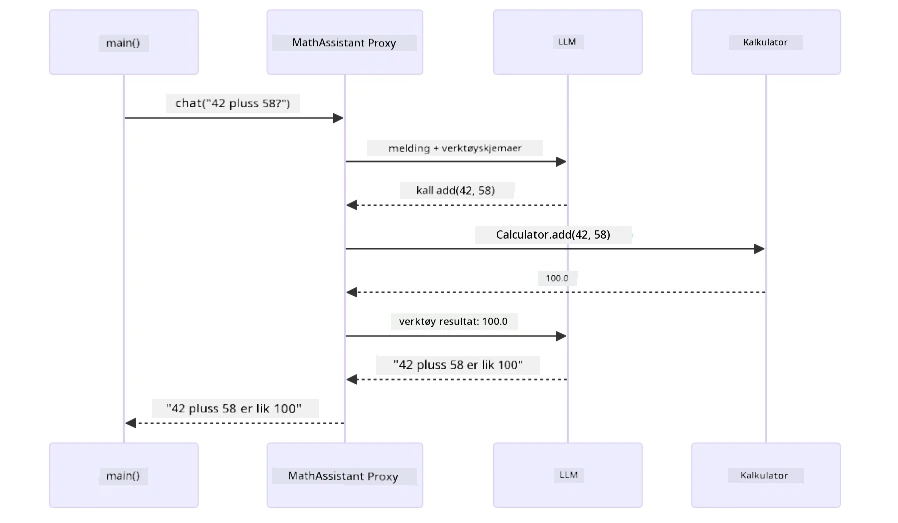
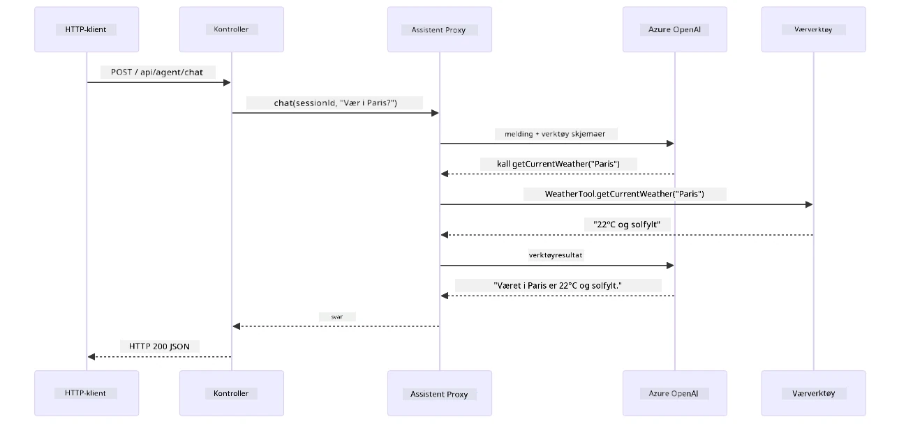

# Modul 04: AI-agenter med verktøy

## Innholdsfortegnelse

- [Video Gjennomgang](../../../04-tools)
- [Hva du vil lære](../../../04-tools)
- [Forutsetninger](../../../04-tools)
- [Forstå AI-agenter med verktøy](../../../04-tools)
- [Hvordan verktøyring fungerer](../../../04-tools)
  - [Verktøydefinisjoner](../../../04-tools)
  - [Beslutningstaking](../../../04-tools)
  - [Utførelse](../../../04-tools)
  - [Responsgenerering](../../../04-tools)
  - [Arkitektur: Spring Boot Auto-Wiring](../../../04-tools)
- [Verktøykjeding](../../../04-tools)
- [Kjør applikasjonen](../../../04-tools)
- [Bruk applikasjonen](../../../04-tools)
  - [Prøv enkel bruk av verktøy](../../../04-tools)
  - [Test verktøykjeding](../../../04-tools)
  - [Se samtaleflyt](../../../04-tools)
  - [Eksperimenter med ulike forespørsler](../../../04-tools)
- [Viktige konsepter](../../../04-tools)
  - [ReAct-mønsteret (resonnering og handling)](../../../04-tools)
  - [Verktøybeskrivelser betyr noe](../../../04-tools)
  - [Sesjonshåndtering](../../../04-tools)
  - [Feilhåndtering](../../../04-tools)
- [Tilgjengelige verktøy](../../../04-tools)
- [Når bruke verktøybaserte agenter](../../../04-tools)
- [Verktøy vs RAG](../../../04-tools)
- [Neste steg](../../../04-tools)

## Video Gjennomgang

Se denne live-økten som forklarer hvordan du kommer i gang med denne modulen:

<a href="https://www.youtube.com/watch?v=O_J30kZc0rw"></a>

## Hva du vil lære

Så langt har du lært hvordan du har samtaler med AI, strukturerer prompts effektivt, og kobler svar til dokumentene dine. Men det er fortsatt en grunnleggende begrensning: språkmodeller kan kun generere tekst. De kan ikke sjekke været, utføre beregninger, spørre databaser eller samhandle med eksterne systemer.

Verktøy endrer dette. Ved å gi modellen tilgang til funksjoner den kan kalle, forvandler du den fra en tekstgenerator til en agent som kan utføre handlinger. Modellen bestemmer når den trenger et verktøy, hvilket verktøy den skal bruke, og hvilke parametere den skal sende med. Koden din utfører funksjonen og returnerer resultatet. Modellen inkorporerer deretter resultatet i sitt svar.

## Forutsetninger

- Fullført [Modul 01 - Introduksjon](../01-introduction/README.md) (Azure OpenAI-ressurser distribuert)
- Anbefalt å ha fullført tidligere moduler (denne modulen refererer til [RAG-konsepter fra Modul 03](../03-rag/README.md) i sammenligningen Verktøy vs RAG)
- `.env`-fil i rotkatalogen med Azure-legitimasjon (opprettet via `azd up` i Modul 01)

> **Merk:** Hvis du ikke har fullført Modul 01, følg distribusjonsinstruksjonene der først.

## Forstå AI-agenter med verktøy

> **📝 Merk:** Begrepet "agenter" i denne modulen refererer til AI-assistenter med forbedret funksjonalitet for å kalle verktøy. Dette er forskjellig fra **Agentic AI**-mønstrene (autonome agenter med planlegging, hukommelse og flerstegs resonnering) som vi skal dekke i [Modul 05: MCP](../05-mcp/README.md).

Uten verktøy kan en språkmodell bare generere tekst basert på treningsdataene sine. Spør om været i dag, og den må gjette. Gi den verktøy, og den kan kalle en vær-API, utføre beregninger eller spørre en database — og deretter flette de reelle resultatene inn i svaret sitt.


*Uten verktøy kan modellen bare gjette — med verktøy kan den kalle APIer, kjøre beregninger og returnere sanntidsdata.*

En AI-agent med verktøy følger et **Reasoning and Acting (ReAct)**-mønster. Modellen svarer ikke bare — den tenker på hva den trenger, handler ved å kalle et verktøy, observerer resultatet, og bestemmer så om den skal handle igjen eller levere det endelige svaret:

1. **Resonner** — Agenten analyserer brukerens spørsmål og bestemmer hvilken informasjon den trenger
2. **Handle** — Agenten velger riktig verktøy, genererer riktige parametere og kaller det
3. **Observer** — Agenten mottar verktøyets output og evaluerer resultatet
4. **Gjenta eller Svar** — Om mer data trengs, gjentas prosessen; ellers komponerer den et svar på naturlig språk


*ReAct-syklusen — agenten resonnerer over hva den skal gjøre, handler ved å kalle et verktøy, observerer resultatet og gjentar til den kan levere et endelig svar.*

Dette skjer automatisk. Du definerer verktøyene og beskrivelsene deres. Modellen håndterer beslutningene om når og hvordan de skal brukes.

## Hvordan verktøyring fungerer

### Verktøydefinisjoner

[WeatherTool.java](../../../04-tools/src/main/java/com/example/langchain4j/agents/tools/WeatherTool.java) | [TemperatureTool.java](../../../04-tools/src/main/java/com/example/langchain4j/agents/tools/TemperatureTool.java)

Du definerer funksjoner med klare beskrivelser og parametere. Modellen ser disse beskrivelsene i systemprompten sin og forstår hva hvert verktøy gjør.

```java
@Component
public class WeatherTool {
    
    @Tool("Get the current weather for a location")
    public String getCurrentWeather(@P("Location name") String location) {
        // Logikken for væroppslag
        return "Weather in " + location + ": 22°C, cloudy";
    }
}

@AiService
public interface Assistant {
    String chat(@MemoryId String sessionId, @UserMessage String message);
}

// Assistenten kobles automatisk av Spring Boot med:
// - ChatModel bean
// - Alle @Tool-metoder fra @Component-klasser
// - ChatMemoryProvider for øktadministrasjon
```

Diagrammet under forklarer hver annotasjon og viser hvordan hver del hjelper AI til å forstå når den skal kalle verktøyet og hvilke argumenter den skal sende:


*Anatomi av en verktøydefinisjon — @Tool forteller AI når verktøyet brukes, @P beskriver hver parameter, og @AiService kobler alt sammen ved oppstart.*

> **🤖 Prøv med [GitHub Copilot](https://github.com/features/copilot) Chat:** Åpne [`WeatherTool.java`](../../../04-tools/src/main/java/com/example/langchain4j/agents/tools/WeatherTool.java) og spør:
> - "Hvordan integrerer jeg en ekte vær-API som OpenWeatherMap i stedet for mock-data?"
> - "Hva gjør en god verktøybeskrivelse som hjelper AI å bruke det korrekt?"
> - "Hvordan håndterer jeg API-feil og rate limits i verktøyimplementasjoner?"

### Beslutningstaking

Når en bruker spør "Hva er været i Seattle?", velger ikke modellen et verktøy tilfeldig. Den sammenligner brukerens intensjon med alle verktøybeskrivelser den har tilgang til, scorer relevansen for hver, og velger det beste treffet. Den genererer så et strukturert funksjonskall med riktige parametere — i dette tilfellet setter den `location` til `"Seattle"`.

Hvis ingen verktøy passer brukerens forespørsel, svarer modellen basert på egen kunnskap. Hvis flere verktøy matcher, velger den det mest spesifikke.


*Modellen evaluerer hvert tilgjengelige verktøy mot brukerens intensjon og velger den beste matchen — derfor er klare, spesifikke verktøybeskrivelser viktige.*

### Utførelse

[AgentService.java](../../../04-tools/src/main/java/com/example/langchain4j/agents/service/AgentService.java)

Spring Boot autoinjiserer det deklarative `@AiService`-grensesnittet med alle registrerte verktøy, og LangChain4j utfører verktøykall automatisk. Bak kulissene går et fullstendig verktøykall gjennom seks stadier — fra brukerens spørsmål på naturlig språk helt tilbake til et svar på naturlig språk:


*Hele flyten — brukeren stiller et spørsmål, modellen velger et verktøy, LangChain4j utfører det, og modellen fletter resultatet inn i et naturlig svar.*

Hvis du kjørte [ToolIntegrationDemo](../../../00-quick-start/src/main/java/com/example/langchain4j/quickstart/ToolIntegrationDemo.java) i Modul 00, har du allerede sett dette mønsteret i aksjon — `Calculator`-verktøyene ble kalt på samme måte. Sekvensdiagrammet under viser nøyaktig hva som skjedde under demoen:



*Verktøykallsløyfen fra Quick Start-demoen — `AiServices` sender meldingen og verktøyskjemaene til LLM-en, LLM-en svarer med et funksjonskall som `add(42, 58)`, LangChain4j kjører `Calculator`-metoden lokalt og sender resultatet tilbake for det endelige svaret.*

> **🤖 Prøv med [GitHub Copilot](https://github.com/features/copilot) Chat:** Åpne [`AgentService.java`](../../../04-tools/src/main/java/com/example/langchain4j/agents/service/AgentService.java) og spør:
> - "Hvordan fungerer ReAct-mønsteret og hvorfor er det effektivt for AI-agenter?"
> - "Hvordan bestemmer agenten hvilket verktøy som skal brukes og i hvilken rekkefølge?"
> - "Hva skjer hvis utførelsen av et verktøy feiler – hvordan håndterer jeg feil på en robust måte?"

### Responsgenerering

Modellen mottar værdataene og formaterer dem til et svar på naturlig språk til brukeren.

### Arkitektur: Spring Boot Auto-Wiring

Denne modulen bruker LangChain4j sin Spring Boot-integrasjon med deklarative `@AiService` grensesnitt. Ved oppstart oppdager Spring Boot alle `@Component` som inneholder `@Tool`-metoder, din `ChatModel` bean, og `ChatMemoryProvider` — og kobler dem sammen i et enkelt `Assistant`-grensesnitt med null boilerplate.


*@AiService-grensesnittet binder sammen ChatModel, verktøyskomponenter og minneprovider — Spring Boot håndterer all kobling automatisk.*

Her er hele forespørselslivssyklusen som sekvensdiagram — fra HTTP-forespørselen gjennom controller, service og autoinjisert proxy, hele veien til verktøyutførelse og tilbake:



*Hele Spring Boot forespørselslivssyklusen — HTTP-forespørselen går gjennom controller og service til den autoinjiserte Assistant-proxyen som orkestrerer LLM og verktøykall automatisk.*

Viktige fordeler med denne tilnærmingen:

- **Spring Boot auto-wiring** — ChatModel og verktøy injiseres automatisk
- **@MemoryId-mønster** — Automatisk sesjonsbasert minnehåndtering
- **Enkelt instans** — Assistant opprettes én gang og gjenbrukes for bedre ytelse
- **Typesikker utførelse** — Java-metoder kalles direkte med typekonvertering
- **Orkestrering med flere steg** — Håndterer verktøykjeding automatisk
- **Null boilerplate** — Ingen manuelle `AiServices.builder()`-kall eller minne-HashMap

Alternative tilnærminger (manuell `AiServices.builder()`) krever mer kode og mangler Spring Boot-integrasjonens fordeler.

## Verktøykjeding

**Verktøykjeding** — Den virkelige styrken med verktøybaserte agenter viser seg når ett enkelt spørsmål krever flere verktøy. Spør "Hva er været i Seattle i Fahrenheit?" og agenten kjeder automatisk to verktøy: først kaller den `getCurrentWeather` for å få temperaturen i Celsius, deretter sender den den verdien til `celsiusToFahrenheit` for konvertering — alt i en enkelt samtalerunde.


*Verktøykjeding i aksjon — agenten kaller getCurrentWeather først, pipeliner Celsius-resultatet inn i celsiusToFahrenheit, og gir et kombinert svar.*

**Graceful Failures** — Spør etter været i en by som ikke finnes i mock-data. Verktøyet returnerer en feilmelding, og AI forklarer at det ikke kan hjelpe i stedet for å krasje. Verktøy feiler trygt. Diagrammet under sammenligner de to tilnærmingene — med riktig feilhåndtering fanger agenten opp unntaket og svarer hjelpsomt, uten det krasjer hele applikasjonen:


*Når et verktøy feiler, fanger agenten opp feilen og svarer med en hjelpsom forklaring i stedet for å krasje.*

Dette skjer i en enkelt samtalerunde. Agenten orkestrerer flere verktøykall autonomt.

## Kjør applikasjonen

**Bekreft distribusjon:**

Sørg for at `.env`-filen finnes i rotkatalogen med Azure-legitimasjon (opprettet i Modul 01). Kjør dette fra modulmappen (`04-tools/`):

**Bash:**
```bash
cat ../.env  # Skal vise AZURE_OPENAI_ENDPOINT, API_KEY, DEPLOYMENT
```

**PowerShell:**
```powershell
Get-Content ..\.env  # Skal vise AZURE_OPENAI_ENDPOINT, API_KEY, DEPLOYMENT
```

**Start applikasjonen:**

> **Merk:** Hvis du allerede startet alle applikasjoner med `./start-all.sh` fra rotkatalogen (som beskrevet i Modul 01), kjører denne modulen allerede på port 8084. Du kan hoppe over startkommandoene under og gå direkte til http://localhost:8084.

**Alternativ 1: Bruke Spring Boot Dashboard (Anbefalt for VS Code-brukere)**

Dev-containeren inkluderer Spring Boot Dashboard-utvidelsen, som gir et visuelt grensesnitt for å administrere alle Spring Boot-applikasjoner. Du finner det i Aktivitetsfeltet til venstre i VS Code (se etter Spring Boot-ikonet).

Fra Spring Boot Dashboard kan du:
- Se alle tilgjengelige Spring Boot-applikasjoner i arbeidsområdet
- Starte/stoppe applikasjoner med ett klikk
- Se applikasjonslogger i sanntid
- Overvåke applikasjonsstatus
Klikk ganske enkelt på avspillingsknappen ved siden av "tools" for å starte denne modulen, eller start alle moduler på en gang.

Slik ser Spring Boot Dashboard ut i VS Code:


*Spring Boot Dashboard i VS Code — start, stopp og overvåk alle moduler fra ett sted*

**Alternativ 2: Bruke shell-skript**

Start alle webapplikasjoner (moduler 01-04):

**Bash:**
```bash
cd ..  # Fra rotkatalogen
./start-all.sh
```

**PowerShell:**
```powershell
cd ..  # Fra rotkatalogen
.\start-all.ps1
```

Eller start bare denne modulen:

**Bash:**
```bash
cd 04-tools
./start.sh
```

**PowerShell:**
```powershell
cd 04-tools
.\start.ps1
```

Begge skriptene laster automatisk miljøvariabler fra rotens `.env`-fil og bygger JAR-filene hvis de ikke finnes.

> **Merk:** Hvis du foretrekker å bygge alle moduler manuelt før oppstart:
>
> **Bash:**
> ```bash
> cd ..  # Go to root directory
> mvn clean package -DskipTests
> ```
>
> **PowerShell:**
> ```powershell
> cd ..  # Go to root directory
> mvn clean package -DskipTests
> ```

Åpne http://localhost:8084 i nettleseren din.

**For å stoppe:**

**Bash:**
```bash
./stop.sh  # Kun denne modulen
# Eller
cd .. && ./stop-all.sh  # Alle moduler
```

**PowerShell:**
```powershell
.\stop.ps1  # Kun denne modulen
# Eller
cd ..; .\stop-all.ps1  # Alle moduler
```

## Bruke applikasjonen

Applikasjonen gir et nettgrensesnitt der du kan samhandle med en AI-agent som har tilgang til vær- og temperaturkonverteringsverktøy. Slik ser grensesnittet ut — det inkluderer raske start-eksempler og et chattepanel for å sende forespørsler:

<a href="images/tools-homepage.png"></a>

*AI Agent Tools-grensesnittet - raske eksempler og chattegrensesnitt for samhandling med verktøy*

### Prøv enkel bruk av verktøy

Start med en enkel forespørsel: "Konverter 100 grader Fahrenheit til Celsius". Agenten forstår at den trenger temperaturkonverteringsverktøyet, kaller det med riktige parametere og returnerer resultatet. Legg merke til hvor naturlig dette føles – du spesifiserte ikke hvilket verktøy som skulle brukes eller hvordan det skulle kalles.

### Test verktøykjededannelse

Prøv nå noe mer komplekst: "Hvordan er været i Seattle, og konverter det til Fahrenheit?" Se agenten jobbe gjennom dette i steg. Den henter først været (som returnerer Celsius), skjønner at den må konvertere til Fahrenheit, kaller konverteringsverktøyet, og kombinerer begge resultater til ett svar.

### Se samtaleflyt

Chattegrensesnittet opprettholder samtalehistorikk, slik at du kan ha interaksjoner over flere turer. Du kan se alle tidligere spørsmål og svar, noe som gjør det enkelt å følge samtalen og forstå hvordan agenten bygger kontekst over flere utvekslinger.

<a href="images/tools-conversation-demo.png"></a>

*Fleromgangssamtale som viser enkle konverteringer, væroppslag og verktøykjededannelse*

### Eksperimenter med forskjellige forespørsler

Prøv ulike kombinasjoner:
- Væroppslag: "Hvordan er været i Tokyo?"
- Temperaturkonverteringer: "Hva er 25°C i Kelvin?"
- Kombinerte spørringer: "Sjekk været i Paris og fortell meg om det er over 20°C"

Legg merke til hvordan agenten tolker vanlig språk og mapper det til passende verktøykall.

## Nøkkelkonsepter

### ReAct-mønsteret (Resonnering og Handling)

Agenten veksler mellom å resonnere (bestemme hva som skal gjøres) og å handle (bruke verktøy). Dette mønsteret muliggjør autonom problemløsning i stedet for bare å svare på instruksjoner.

### Verktøybeskrivelser betyr noe

Kvaliteten på dine verktøybeskrivelser påvirker direkte hvor godt agenten bruker dem. Klare, spesifikke beskrivelser hjelper modellen med å forstå når og hvordan hvert verktøy skal kalles.

### Sesjonshåndtering

`@MemoryId`-annotasjonen muliggjør automatisk minnehåndtering basert på økter. Hver sesjons-ID får sin egen `ChatMemory`-instans som håndteres av `ChatMemoryProvider`-beanen, slik at flere brukere kan samhandle med agenten samtidig uten at samtalene blander seg. Følgende diagram viser hvordan flere brukere rutes til isolerte minnelagre basert på deres sesjons-IDer:


*Hver sesjons-ID kobles til en isolert samtalehistorikk — brukere ser aldri hverandres meldinger.*

### Feilhåndtering

Verktøy kan feile — APIer kan tidsavslutte, parametere kan være ugyldige, eksterne tjenester kan gå ned. Produksjonsagenter trenger feilhåndtering slik at modellen kan forklare problemer eller prøve alternativer i stedet for å krasje hele applikasjonen. Når et verktøy kaster en unntak, fanger LangChain4j det og sender feilmeldingen tilbake til modellen, som deretter kan forklare problemet på naturlig språk.

## Tilgjengelige verktøy

Diagrammet nedenfor viser det brede økosystemet av verktøy du kan bygge. Denne modulen demonstrerer vær- og temperaturverktøy, men samme `@Tool`-mønster fungerer for alle Java-metoder — fra databaseforespørsler til betalingsbehandling.


*Enhver Java-metode merket med @Tool blir tilgjengelig for AI — mønsteret strekker seg til databaser, APIer, e-post, filoperasjoner og mer.*

## Når bruke verktøybaserte agenter

Ikke alle forespørsler trenger verktøy. Beslutningen handler om AI-en må samhandle med eksterne systemer eller kan svare basert på egen kunnskap. Følgende guide oppsummerer når verktøy tilfører verdi og når de er unødvendige:


*En rask beslutningsguide — verktøy brukes for sanntidsdata, beregninger og handlinger; generell kunnskap og kreative oppgaver trenger ikke dem.*

## Verktøy vs RAG

Modulene 03 og 04 utvider begge hva AI kan gjøre, men på fundamentalt forskjellige måter. RAG gir modellen tilgang til **kunnskap** ved å hente dokumenter. Verktøy gir modellen mulighet til å utføre **handlinger** ved å kalle funksjoner. Diagrammet nedenfor sammenligner disse to tilnærmingene side om side — fra hvordan hver arbeidsflyt opererer til kompromisene mellom dem:


*RAG henter informasjon fra statiske dokumenter — verktøy utfører handlinger og henter dynamiske, sanntidsdata. Mange produksjonssystemer kombinerer begge.*

I praksis kombinerer mange produksjonssystemer begge tilnærminger: RAG for å forankre svar i dokumentasjonen din, og verktøy for å hente live data eller utføre operasjoner.

## Neste steg

**Neste modul:** [05-mcp - Model Context Protocol (MCP)](../05-mcp/README.md)

---

**Navigasjon:** [← Forrige: Modul 03 - RAG](../03-rag/README.md) | [Tilbake til hovedmenyen](../README.md) | [Neste: Modul 05 - MCP →](../05-mcp/README.md)

---

<!-- CO-OP TRANSLATOR DISCLAIMER START -->
**Ansvarsfraskrivelse**:
Dette dokumentet er oversatt ved hjelp av AI-oversettelsestjenesten [Co-op Translator](https://github.com/Azure/co-op-translator). Selv om vi streber etter nøyaktighet, vennligst vær klar over at automatiserte oversettelser kan inneholde feil eller unøyaktigheter. Det opprinnelige dokumentet på dets morsmål bør betraktes som den autoritative kilden. For kritisk informasjon anbefales profesjonell menneskelig oversettelse. Vi er ikke ansvarlige for eventuelle misforståelser eller feiltolkninger som oppstår ved bruk av denne oversettelsen.
<!-- CO-OP TRANSLATOR DISCLAIMER END -->