# Module 05: Modellkontekstprotokoll (MCP)

## Innholdsfortegnelse

- [Hva du vil lære](../../../05-mcp)
- [Hva er MCP?](../../../05-mcp)
- [Hvordan MCP fungerer](../../../05-mcp)
- [Den agentiske modulen](../../../05-mcp)
- [Kjøre eksemplene](../../../05-mcp)
  - [Forutsetninger](../../../05-mcp)
- [Rask start](../../../05-mcp)
  - [Filoperasjoner (Stdio)](../../../05-mcp)
  - [Veileder-agent](../../../05-mcp)
    - [Kjøre demoen](../../../05-mcp)
    - [Hvordan veilederen fungerer](../../../05-mcp)
    - [Hvordan FileAgent oppdager MCP-verktøy ved kjøring](../../../05-mcp)
    - [Responsstrategier](../../../05-mcp)
    - [Forstå utskriften](../../../05-mcp)
    - [Forklaring av funksjoner i den agentiske modulen](../../../05-mcp)
- [Nøkkelkonsepter](../../../05-mcp)
- [Gratulerer!](../../../05-mcp)
  - [Hva nå?](../../../05-mcp)

## Hva du vil lære

Du har bygget konversasjons-AI, mestret prompts, forankret svar i dokumenter, og laget agenter med verktøy. Men alle disse verktøyene var tilpasset for din spesifikke applikasjon. Hva om du kunne gi AI-en din tilgang til et standardisert økosystem av verktøy som hvem som helst kan lage og dele? I denne modulen lærer du akkurat det med Model Context Protocol (MCP) og LangChain4j sin agentiske modul. Vi viser først en enkel MCP fil-leser og deretter hvordan den enkelt integreres i avanserte agentiske arbeidsflyter med Supervisor Agent-mønsteret.

## Hva er MCP?

Model Context Protocol (MCP) gir nettopp det – en standard måte for AI-applikasjoner å oppdage og bruke eksterne verktøy. Istedenfor å skrive egendefinerte integrasjoner for hver datakilde eller tjeneste, kobler du til MCP-servere som eksponerer sine kapabiliteter i et konsistent format. Din AI-agent kan så automatisk oppdage og bruke disse verktøyene.

Diagrammet under viser forskjellen — uten MCP krever hver integrasjon spesialtilpasset punkt-til-punkt kobling; med MCP knytter ett enkelt protokoll appen din til hvilket som helst verktøy:


*Før MCP: Komplekse punkt-til-punkt integrasjoner. Etter MCP: Ett protokoll, uendelige muligheter.*

MCP løser et grunnleggende problem i AI-utvikling: hver integrasjon er skreddersydd. Vil du ha tilgang til GitHub? Egendefinert kode. Vil du lese filer? Egendefinert kode. Vil du spørrre en database? Egendefinert kode. Og ingen av disse integrasjonene fungerer for andre AI-applikasjoner.

MCP standardiserer dette. En MCP-server eksponerer verktøy med klare beskrivelser og skjemaer. Enhver MCP-klient kan koble til, oppdage tilgjengelige verktøy, og bruke dem. Bygg én gang, bruk overalt.

Diagrammet under illustrerer denne arkitekturen — en enkelt MCP-klient (din AI-applikasjon) kobler til flere MCP-servere, hver med sine egne verktøy via den standardiserte protokollen:


*Model Context Protocol-arkitektur – standardisert verktøyoppdagelse og utførelse*

## Hvordan MCP fungerer

Under panseret benytter MCP en lagdelt arkitektur. Din Java-applikasjon (MCP-klient) oppdager tilgjengelige verktøy, sender JSON-RPC-forespørsler gjennom et transportlag (Stdio eller HTTP), og MCP-serveren utfører operasjoner og returnerer resultater. Følgende diagram bryter ned hvert lag av denne protokollen:

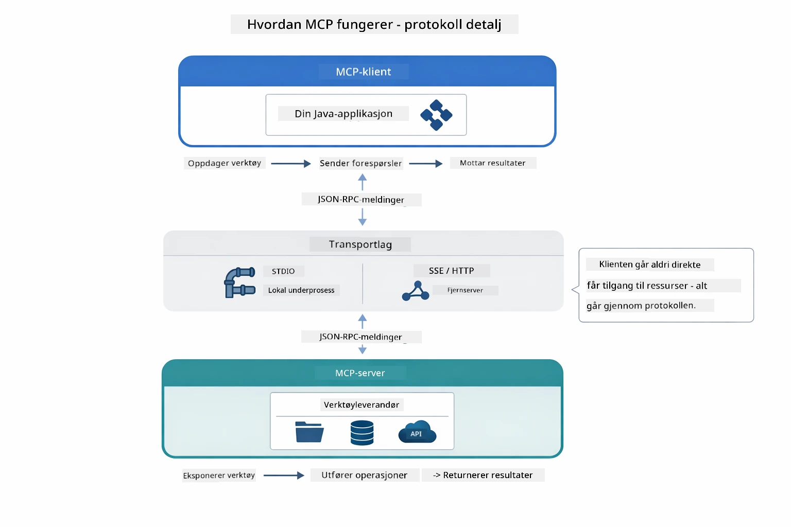

*Hvordan MCP fungerer under panseret — klienter oppdager verktøy, utveksler JSON-RPC-meldinger, og utfører operasjoner gjennom et transportlag.*

**Server-klient arkitektur**

MCP benytter en klient-server modell. Servere tilbyr verktøy - lese filer, spørrre databaser, kalle API-er. Klienter (din AI-applikasjon) kobler til servere og bruker verktøyene deres.

For å bruke MCP med LangChain4j, legg til denne Maven-avhengigheten:

```xml
<dependency>
    <groupId>dev.langchain4j</groupId>
    <artifactId>langchain4j-mcp</artifactId>
    <version>${langchain4j.version}</version>
</dependency>
```

**Verktøyoppdagelse**

Når klienten din kobler til en MCP-server, spør den "Hvilke verktøy har dere?" Serveren svarer med en liste over tilgjengelige verktøy, hver med beskrivelser og parameterskjemaer. Din AI-agent kan så bestemme hvilke verktøy som skal brukes basert på brukerforespørsler. Diagrammet under viser denne håndtrykk-kommunikasjonen — klienten sender en `tools/list` forespørsel og serveren returnerer sine tilgjengelige verktøy med beskrivelser og parameterskjemaer:

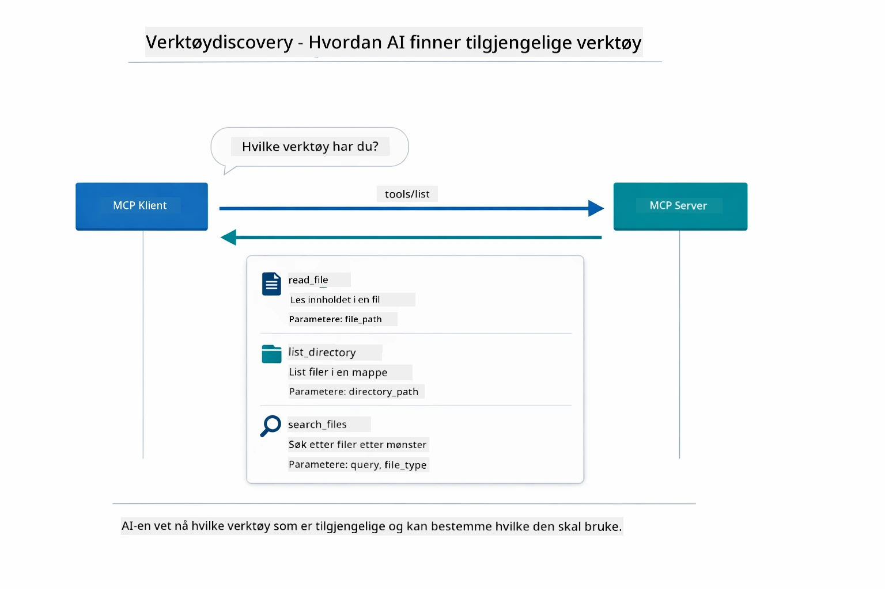

*AI-en oppdager tilgjengelige verktøy ved oppstart — den vet nå hvilke muligheter som finnes og kan bestemme hvilke som skal brukes.*

**Transportmekanismer**

MCP støtter ulike transportmekanismer. De to alternativene er Stdio (for lokal underprosess-kommunikasjon) og Streamable HTTP (for eksterne servere). Denne modulen demonstrerer Stdio transport:


*MCP transportmekanismer: HTTP for eksterne servere, Stdio for lokale prosesser*

**Stdio** - [StdioTransportDemo.java](../../../05-mcp/src/main/java/com/example/langchain4j/mcp/StdioTransportDemo.java)

For lokale prosesser. Applikasjonen din starter en server som en underprosess og kommuniserer via standard input/output. Nyttig for tilgang til filsystem eller kommandolinjeverktøy.

```java
McpTransport stdioTransport = new StdioMcpTransport.Builder()
    .command(List.of(
        npmCmd, "exec",
        "@modelcontextprotocol/server-filesystem@2025.12.18",
        resourcesDir
    ))
    .logEvents(false)
    .build();
```

`@modelcontextprotocol/server-filesystem` serveren eksponerer følgende verktøy, alle sandkassebegrenset til de katalogene du spesifiserer:

| Verktøy | Beskrivelse |
|---------|-------------|
| `read_file` | Leser innholdet i en enkelt fil |
| `read_multiple_files` | Leser flere filer i ett kall |
| `write_file` | Lager eller overskriver en fil |
| `edit_file` | Gjør målrettede finn-og-erstatt-redigeringer |
| `list_directory` | Lister filer og kataloger på en sti |
| `search_files` | Søker rekursivt etter filer som matcher et mønster |
| `get_file_info` | Henter filmetadata (størrelse, tidsstempler, rettigheter) |
| `create_directory` | Oppretter en katalog (inkludert overordnede kataloger) |
| `move_file` | Flytter eller gir nytt navn til en fil eller katalog |

Følgende diagram viser hvordan Stdio-transport fungerer ved kjøring — Java-applikasjonen starter MCP-serveren som en barneprosess og de kommuniserer via stdin/stdout-pipes, uten nettverk eller HTTP involvert:

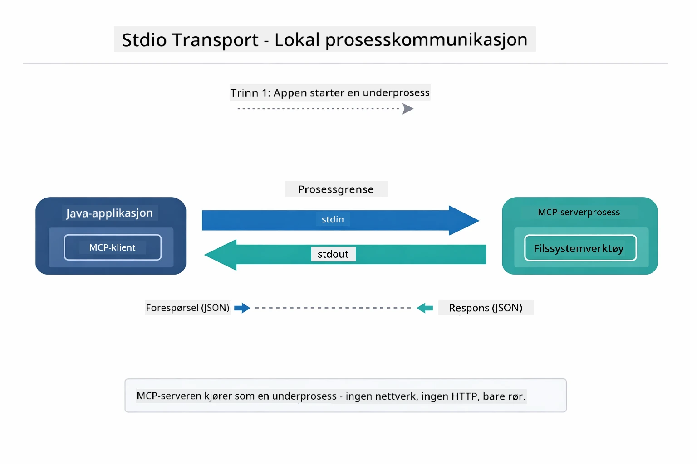

*Stdio-transport i aksjon — applikasjonen din starter MCP-serveren som en barneprosess og kommuniserer via stdin/stdout-pipes.*

> **🤖 Prøv med [GitHub Copilot](https://github.com/features/copilot) Chat:** Åpne [`StdioTransportDemo.java`](../../../05-mcp/src/main/java/com/example/langchain4j/mcp/StdioTransportDemo.java) og spør:
> - "Hvordan fungerer Stdio-transport og når bør jeg bruke den kontra HTTP?"
> - "Hvordan håndterer LangChain4j livssyklusen til spawnede MCP-serverprosesser?"
> - "Hva er sikkerhetsimplikasjonene av å gi AI tilgang til filsystemet?"

## Den agentiske modulen

Mens MCP gir standardiserte verktøy, tilbyr LangChain4j sin **agentiske modul** en deklarativ måte å bygge agenter som orkestrerer disse verktøyene. `@Agent`-annotasjonen og `AgenticServices` lar deg definere agentadferd via grensesnitt i stedet for imperativ kode.

I denne modulen undersøker du **Supervisor Agent**-mønsteret — en avansert agentisk AI-tilnærming hvor en "veileder"-agent dynamisk avgjør hvilke under-agenter som skal kalles basert på brukerens forespørsel. Vi kombinerer begge konsepter ved å gi en av våre under-agenter MCP-drevne filtilgangsevner.

For å bruke den agentiske modulen, legg til denne Maven-avhengigheten:

```xml
<dependency>
    <groupId>dev.langchain4j</groupId>
    <artifactId>langchain4j-agentic</artifactId>
    <version>${langchain4j.mcp.version}</version>
</dependency>
```
> **Merk:** `langchain4j-agentic`-modulen bruker en egen versjonsegenskap (`langchain4j.mcp.version`) fordi den utgis på en annen tidsplan enn kjernebibliotekene i LangChain4j.

> **⚠️ Eksperimentell:** `langchain4j-agentic`-modulen er **eksperimentell** og kan endres. Den stabile måten å bygge AI-assistenter på forblir `langchain4j-core` med egendefinerte verktøy (Modul 04).

## Kjøre eksemplene

### Forutsetninger

- Fullført [Modul 04 - Verktøy](../04-tools/README.md) (denne modulen bygger på konseptene for egendefinerte verktøy og sammenligner med MCP-verktøy)
- `.env` fil i rotkatalog med Azure-legitimasjon (laget av `azd up` i Modul 01)
- Java 21+, Maven 3.9+
- Node.js 16+ og npm (for MCP-servere)

> **Merk:** Hvis du ikke har satt opp miljøvariablene dine ennå, se [Modul 01 - Introduksjon](../01-introduction/README.md) for distribusjonsinstruksjoner (`azd up` lager `.env` filen automatisk), eller kopier `.env.example` til `.env` i rotkatalogen og fyll inn verdiene dine.

## Rask start

**Bruke VS Code:** Høyreklikk på en demo-fil i Explorer og velg **"Run Java"**, eller bruk oppstartskonfigurasjonene i Run and Debug-panelet (sørg for at `.env` filen er konfigurert med Azure-legitimasjon først).

**Bruke Maven:** Alternativt kan du kjøre eksemplene fra kommandolinjen som vist under.

### Filoperasjoner (Stdio)

Dette demonstrerer verktøy basert på lokale underprosesser.

**✅ Ingen forutsetninger nødvendig** – MCP-serveren spawn'es automatisk.

**Bruke startskriptene (anbefalt):**

Startskriptene laster automatisk miljøvariabler fra rotens `.env` fil:

**Bash:**
```bash
cd 05-mcp
chmod +x start-stdio.sh
./start-stdio.sh
```

**PowerShell:**
```powershell
cd 05-mcp
.\start-stdio.ps1
```

**Bruke VS Code:** Høyreklikk `StdioTransportDemo.java` og velg **"Run Java"** (sørg for at `.env` filen er konfigurert).

Applikasjonen starter automatisk en MCP-server for filsystem og leser en lokal fil. Merk hvordan håndteringen av underprosessen skjer for deg.

**Forventet utdata:**
```
Assistant response: The file provides an overview of LangChain4j, an open-source Java library
for integrating Large Language Models (LLMs) into Java applications...
```

### Veileder-agent

**Veileder-agent mønsteret** er en **fleksibel** form for agentisk AI. En Veileder bruker en LLM til å autonomt avgjøre hvilke agenter som skal kalles basert på brukerens forespørsel. I neste eksempel kombinerer vi MCP-drevet filtilgang med en LLM-agent for å lage en kontrollert les→rapport arbeidsflyt.

I demoen leser `FileAgent` en fil med MCP-filsystemverktøy, og `ReportAgent` genererer en strukturert rapport med et sammendrag (1 setning), 3 hovedpunkter og anbefalinger. Veilederen orkestrerer denne flyten automatisk:

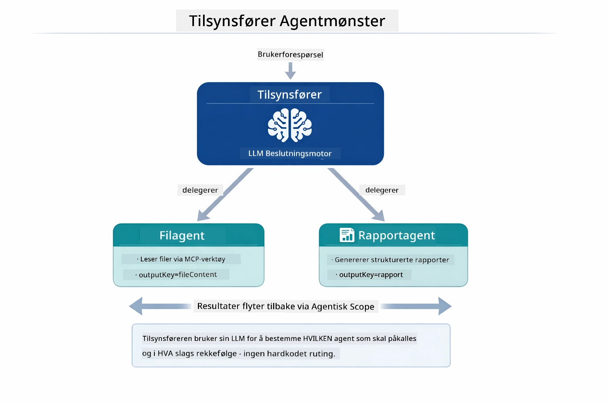

*Veilederen bruker sin LLM til å avgjøre hvilke agenter som skal kalles og i hvilken rekkefølge — ingen hardkodet ruting nødvendig.*

Slik ser den konkrete arbeidsflyten ut for vår fil-til-rapport pipeline:

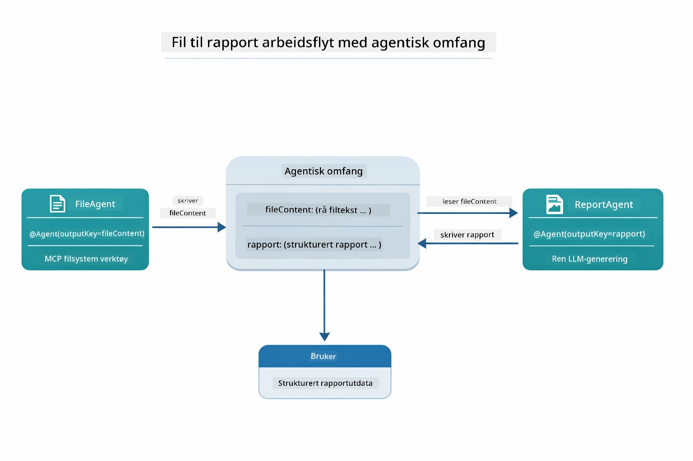

*FileAgent leser filen via MCP-verktøy, deretter omformer ReportAgent det rå innholdet til en strukturert rapport.*

Følgende sekvensdiagram sporer hele veilederens orkestrering — fra spawn av MCP-server, gjennom veilederens autonome agentutvelgelse, til verktøykall over stdio og til slutt rapporten:

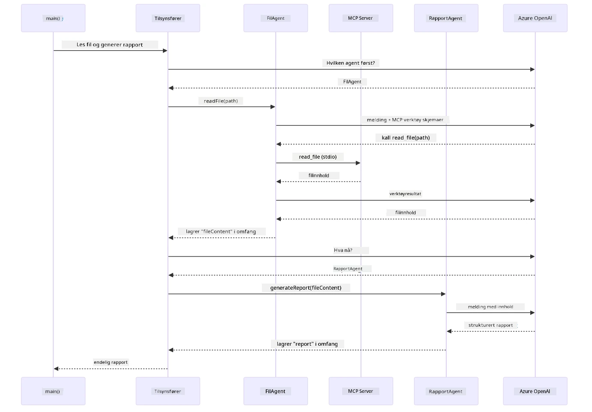

*Veilederen kaller autonomt FileAgent (som kaller MCP-serveren over stdio for å lese filen), deretter ReportAgent for å generere en strukturert rapport — hver agent lagrer sin utdata i delt Agentic Scope.*

Hver agent lagrer sitt resultat i **Agentic Scope** (delt minne), som lar påfølgende agenter få tilgang til tidligere resultater. Dette demonstrerer hvordan MCP-verktøy sømløst integreres i agentiske arbeidsflyter — veilederen trenger ikke vite *hvordan* filer leses, bare at `FileAgent` kan gjøre det.

#### Kjøre demoen

Startskriptene laster automatisk miljøvariabler fra rotens `.env` fil:

**Bash:**
```bash
cd 05-mcp
chmod +x start-supervisor.sh
./start-supervisor.sh
```

**PowerShell:**
```powershell
cd 05-mcp
.\start-supervisor.ps1
```

**Bruke VS Code:** Høyreklikk `SupervisorAgentDemo.java` og velg **"Run Java"** (sørg for at `.env` filen er konfigurert).

#### Hvordan veilederen fungerer

Før du bygger agenter, må du koble MCP-transporten til en klient og pakke den som en `ToolProvider`. Slik blir MCP-serverens verktøy tilgjengelige for agentene dine:

```java
// Opprett en MCP-klient fra transporten
McpClient mcpClient = new DefaultMcpClient.Builder()
        .transport(stdioTransport)
        .build();

// Pakk klienten som en ToolProvider — dette kobler MCP-verktøy til LangChain4j
ToolProvider mcpToolProvider = McpToolProvider.builder()
        .mcpClients(List.of(mcpClient))
        .build();
```

Nå kan du injisere `mcpToolProvider` i hvilken som helst agent som trenger MCP-verktøy:

```java
// Trinn 1: FileAgent leser filer ved bruk av MCP-verktøy
FileAgent fileAgent = AgenticServices.agentBuilder(FileAgent.class)
        .chatModel(model)
        .toolProvider(mcpToolProvider)  // Har MCP-verktøy for filoperasjoner
        .build();

// Trinn 2: ReportAgent genererer strukturerte rapporter
ReportAgent reportAgent = AgenticServices.agentBuilder(ReportAgent.class)
        .chatModel(model)
        .build();

// Veileder koordinerer arbeidsflyten fra fil til rapport
SupervisorAgent supervisor = AgenticServices.supervisorBuilder()
        .chatModel(model)
        .subAgents(fileAgent, reportAgent)
        .responseStrategy(SupervisorResponseStrategy.LAST)  // Returner den endelige rapporten
        .build();

// Veilederen bestemmer hvilke agenter som skal kalles opp basert på forespørselen
String response = supervisor.invoke("Read the file at /path/file.txt and generate a report");
```

#### Hvordan FileAgent oppdager MCP-verktøy ved kjøring

Du lurer kanskje på: **hvordan vet `FileAgent` hvordan man bruker npm-filsystemverktøyene?** Svaret er at det vet den ikke — det er **LLM** som finner det ut under kjøring gjennom verktøyskjemaer.

`FileAgent`-grensesnittet er bare en **prompt-definisjon**. Det har ingen hardkodet kunnskap om `read_file`, `list_directory` eller andre MCP-verktøy. Slik skjer det fra ende til ende:
1. **Server starter:** `StdioMcpTransport` starter npm-pakken `@modelcontextprotocol/server-filesystem` som en underprosess  
2. **Verktøyoppdagelse:** `McpClient` sender en `tools/list` JSON-RPC-forespørsel til serveren, som svarer med verktøynavn, beskrivelser og parameterskjemaer (f.eks. `read_file` — *"Les hele innholdet i en fil"* — `{ path: string }`)  
3. **Skjema injeksjon:** `McpToolProvider` pakker inn disse oppdagede skjemaene og gjør dem tilgjengelige for LangChain4j  
4. **LLM beslutning:** Når `FileAgent.readFile(path)` kalles, sender LangChain4j systemmeldingen, brukermeldingen, **og listen over verktøyskjemaer** til LLM. LLM leser verktøybeskrivelsene og genererer et verktøykall (f.eks. `read_file(path="/some/file.txt")`)  
5. **Utførelse:** LangChain4j fanger verktøykallet, dirigerer det gjennom MCP-klienten tilbake til Node.js-underprosessen, får resultatet og sender det tilbake til LLM  

Dette er den samme [Tool Discovery](../../../05-mcp)-mekanismen som beskrevet over, men anvendt spesifikt på agent-arbeidsflyten. `@SystemMessage` og `@UserMessage` annotasjonene styrer LLMs oppførsel, mens den injiserte `ToolProvider` gir den **kapabilitetene** — LLM-en forbinder de to under kjøring.  

> **🤖 Prøv med [GitHub Copilot](https://github.com/features/copilot) Chat:** Åpne [`FileAgent.java`](../../../05-mcp/src/main/java/com/example/langchain4j/mcp/agents/FileAgent.java) og spør:  
> - "Hvordan vet denne agenten hvilket MCP-verktøy den skal kalle?"  
> - "Hva skjer hvis jeg fjerner ToolProvider fra agent-oppbyggeren?"  
> - "Hvordan blir verktøyskjemaene sendt til LLM?"  

#### Responsstrategier

Når du konfigurerer en `SupervisorAgent`, spesifiserer du hvordan den skal formulere sitt endelige svar til brukeren etter at underagentene har fullført sine oppgaver. Diagrammet nedenfor viser de tre tilgjengelige strategiene — LAST returnerer det siste agentens utdata direkte, SUMMARY syntetiserer alle utdata gjennom en LLM, og SCORED velger det som scorer høyest mot den opprinnelige forespørselen:

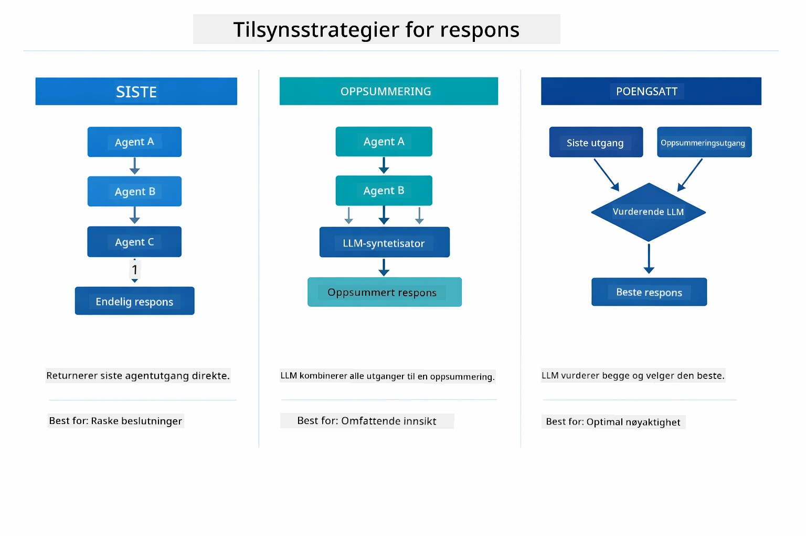

*Tre strategier for hvordan Supervisor formulerer sitt endelige svar — velg basert på om du vil ha siste agents utdata, en syntetisert oppsummering, eller den best scorende løsningen.*  

De tilgjengelige strategiene er:  

| Strategi | Beskrivelse |  
|----------|-------------|  
| **LAST** | Supervisor returnerer utdataene fra den siste underagenten eller verktøyet som ble kalt. Dette er nyttig når den siste agenten i arbeidsflyten er spesielt designet for å produsere det komplette, endelige svaret (f.eks. en "Summary Agent" i en forskningspipeline). |  
| **SUMMARY** | Supervisor bruker sin egen interne språkmodell (LLM) til å syntetisere en oppsummering av hele interaksjonen og alle underagents utdata, og returnerer så denne oppsummeringen som endelig svar. Dette gir brukeren et rent, aggregert svar. |  
| **SCORED** | Systemet bruker en intern LLM til å score både LAST-svaret og SUMMARY av interaksjonen mot den opprinnelige brukerforespørselen, og returnerer det svaret som får høyest score. |  

Se [SupervisorAgentDemo.java](../../../05-mcp/src/main/java/com/example/langchain4j/mcp/SupervisorAgentDemo.java) for full implementasjon.  

> **🤖 Prøv med [GitHub Copilot](https://github.com/features/copilot) Chat:** Åpne [`SupervisorAgentDemo.java`](../../../05-mcp/src/main/java/com/example/langchain4j/mcp/SupervisorAgentDemo.java) og spør:  
> - "Hvordan bestemmer Supervisor hvilke agenter som skal kalles?"  
> - "Hva er forskjellen mellom Supervisor og Sekvensielle arbeidsflytmønstre?"  
> - "Hvordan kan jeg tilpasse Supervisors planleggingsatferd?"  

#### Forstå Utdataene

Når du kjører demoen, vil du se en strukturert gjennomgang av hvordan Supervisor orkestrerer flere agenter. Her er hva hver seksjon betyr:  

```
======================================================================
  FILE → REPORT WORKFLOW DEMO
======================================================================

This demo shows a clear 2-step workflow: read a file, then generate a report.
The Supervisor orchestrates the agents automatically based on the request.
```
  
**Overskriften** introduserer arbeidsflytkonseptet: en fokusert pipeline fra fillesing til rapportgenerering.  

```
--- WORKFLOW ---------------------------------------------------------
  ┌─────────────┐      ┌──────────────┐
  │  FileAgent  │ ───▶ │ ReportAgent  │
  │ (MCP tools) │      │  (pure LLM)  │
  └─────────────┘      └──────────────┘
   outputKey:           outputKey:
   'fileContent'        'report'

--- AVAILABLE AGENTS -------------------------------------------------
  [FILE]   FileAgent   - Reads files via MCP → stores in 'fileContent'
  [REPORT] ReportAgent - Generates structured report → stores in 'report'
```
  
**Arbeidsflytdiagram** viser dataflyten mellom agenter. Hver agent har en spesifikk rolle:  
- **FileAgent** leser filer med MCP-verktøy og lagrer råinnhold i `fileContent`  
- **ReportAgent** bruker dette innholdet og produserer en strukturert rapport i `report`  

```
--- USER REQUEST -----------------------------------------------------
  "Read the file at .../file.txt and generate a report on its contents"
```
  
**Brukerforespørsel** viser oppgaven. Supervisor tolker dette og bestemmer å kalle FileAgent → ReportAgent.  

```
--- SUPERVISOR ORCHESTRATION -----------------------------------------
  The Supervisor decides which agents to invoke and passes data between them...

  +-- STEP 1: Supervisor chose -> FileAgent (reading file via MCP)
  |
  |   Input: .../file.txt
  |
  |   Result: LangChain4j is an open-source, provider-agnostic Java framework for building LLM...
  +-- [OK] FileAgent (reading file via MCP) completed

  +-- STEP 2: Supervisor chose -> ReportAgent (generating structured report)
  |
  |   Input: LangChain4j is an open-source, provider-agnostic Java framew...
  |
  |   Result: Executive Summary...
  +-- [OK] ReportAgent (generating structured report) completed
```
  
**Supervisor Orkestrering** viser 2-trinnsflyten i praksis:  
1. **FileAgent** leser filen via MCP og lagrer innholdet  
2. **ReportAgent** mottar innholdet og genererer en strukturert rapport  

Supervisor tok disse beslutningene **autonomt** basert på brukerens forespørsel.  

```
--- FINAL RESPONSE ---------------------------------------------------
Executive Summary
...

Key Points
...

Recommendations
...

--- AGENTIC SCOPE (Data Flow) ----------------------------------------
  Each agent stores its output for downstream agents to consume:
  * fileContent: LangChain4j is an open-source, provider-agnostic Java framework...
  * report: Executive Summary...
```
  
#### Forklaring av Agentisk Modul Funksjoner  

Eksemplet demonstrerer flere avanserte funksjoner i den agentiske modulen. La oss se nærmere på Agentic Scope og Agent Lyttere.  

**Agentic Scope** viser det delte minnet hvor agenter lagret sine resultater med `@Agent(outputKey="...")`. Dette lar:  
- Senere agenter få tilgang til tidligere agenters utdata  
- Supervisor syntetisere et endelig svar  
- Deg inspisere hva hver agent produserte  

Diagrammet nedenfor viser hvordan Agentic Scope fungerer som delt minne i fil-til-rapport arbeidsflyten — FileAgent skriver utdataene under nøkkelen `fileContent`, ReportAgent leser dette og skriver ut sine egne utdata under `report`:  

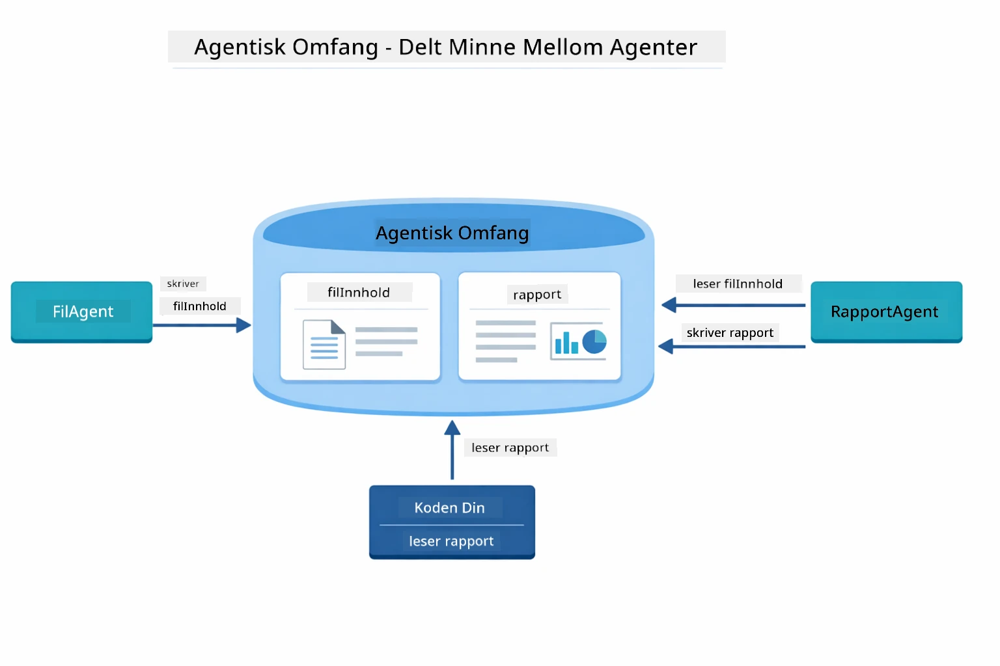  

*Agentic Scope fungerer som delt minne — FileAgent skriver `fileContent`, ReportAgent leser dette og skriver `report`, og din kode leser det endelige resultatet.*  

```java
ResultWithAgenticScope<String> result = supervisor.invokeWithAgenticScope(request);
AgenticScope scope = result.agenticScope();
String fileContent = scope.readState("fileContent");  // Rå fildata fra FileAgent
String report = scope.readState("report");            // Strukturert rapport fra ReportAgent
```
  
**Agent Lyttere** gjør det mulig å overvåke og feilsøke agentkjøringer. Det trinnvise utdataet du ser i demoen kommer fra en AgentListener som kobler seg til hver agentkall:  
- **beforeAgentInvocation** - Kalles når Supervisor velger en agent, lar deg se hvilken agent som ble valgt og hvorfor  
- **afterAgentInvocation** - Kalles når en agent fullfører, viser resultatet  
- **inheritedBySubagents** - Når sann, overvåker lytteren alle agenter i hierarkiet  

Følgende diagram viser full Agent Listener livssyklus, inkludert hvordan `onError` håndterer feil under agentkjøring:  

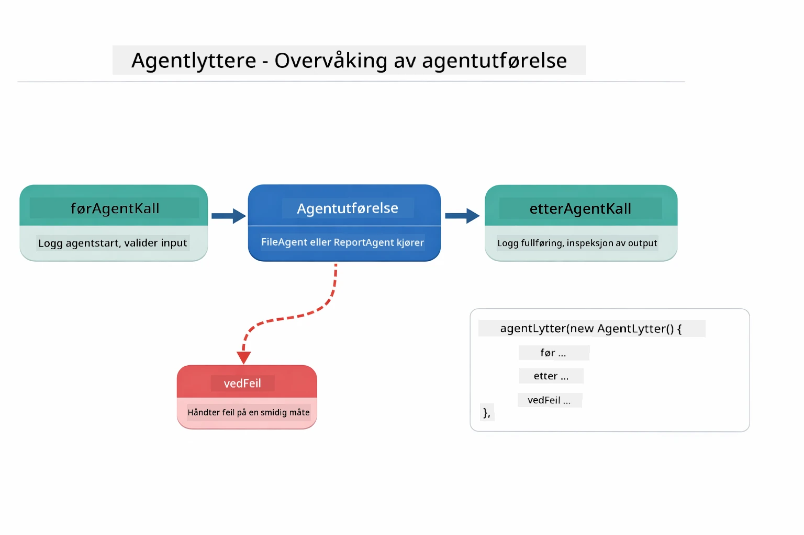  

*Agent Lyttere kobler seg på utførelseslivssyklusen — overvåk når agenter starter, fullfører eller møter feil.*  

```java
AgentListener monitor = new AgentListener() {
    private int step = 0;
    
    @Override
    public void beforeAgentInvocation(AgentRequest request) {
        step++;
        System.out.println("  +-- STEP " + step + ": " + request.agentName());
    }
    
    @Override
    public void afterAgentInvocation(AgentResponse response) {
        System.out.println("  +-- [OK] " + response.agentName() + " completed");
    }
    
    @Override
    public boolean inheritedBySubagents() {
        return true; // Propager til alle underagenter
    }
};
```
  
Utover Supervisor-mønsteret tilbyr `langchain4j-agentic` modulen flere kraftige arbeidsflytmønstre. Diagrammet nedenfor viser alle fem — fra enkle sekvensielle pipelines til human-in-the-loop godkjenningsarbeidsflyter:  

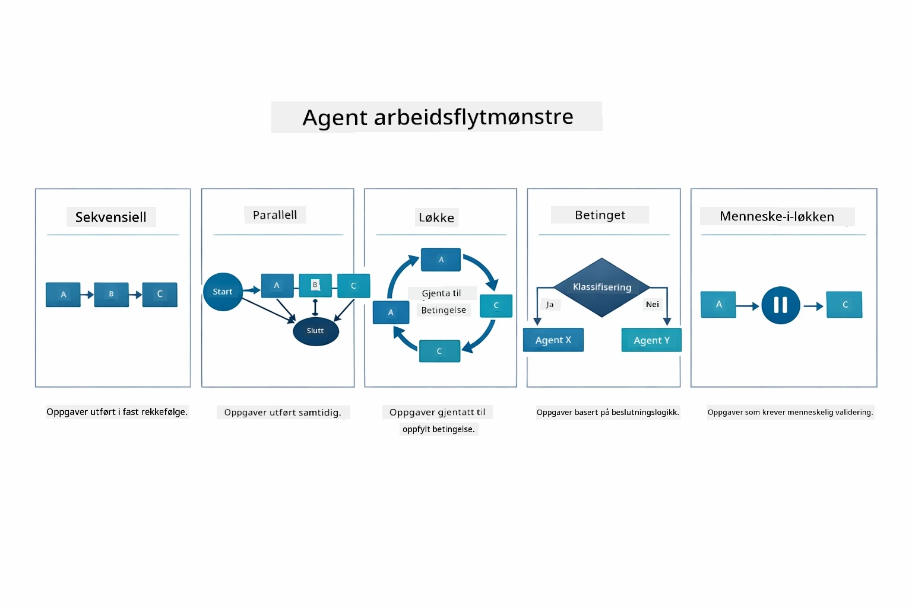  

*Fem arbeidsflytmønstre for å orkestrere agenter — fra enkle sekvensielle pipelines til human-in-the-loop godkjenningsarbeidsflyter.*  

| Mønster | Beskrivelse | Bruksområde |  
|---------|-------------|-------------|  
| **Sequential** | Utfør agenter i rekkefølge, utdata flyter til neste | Pipelines: forskning → analyse → rapport |  
| **Parallel** | Kjør agenter samtidig | Uavhengige oppgaver: vær + nyheter + aksjer |  
| **Loop** | Gjenta til betingelse er oppfylt | Kvalitetsvurdering: finjuster til score ≥ 0.8 |  
| **Conditional** | Rut basert på betingelser | Klassifiser → rute til spesialistagent |  
| **Human-in-the-Loop** | Legg til menneskelige sjekkpunkter | Godkjenningsarbeidsflyter, innholdsgransking |  

## Viktige Konsepter  

Nå som du har utforsket MCP og den agentiske modulen i praksis, la oss oppsummere når du bør bruke hver tilnærming.  

En av MCPs største fordeler er det voksende økosystemet. Diagrammet nedenfor viser hvordan en enkelt universell protokoll kobler din AI-applikasjon til et bredt utvalg av MCP-servere — fra filsystem- og databaseservere til GitHub, e-post, nettskraping og mer:  

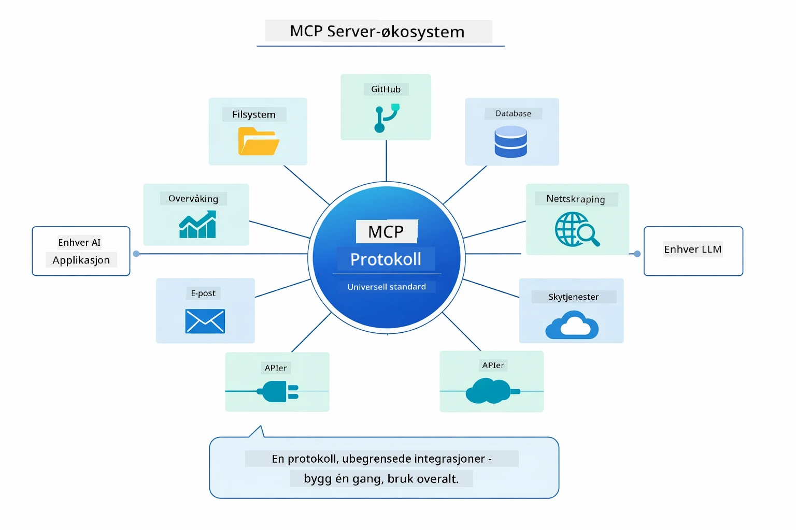  

*MCP skaper et universelt protokolløkosystem — enhver MCP-kompatibel server fungerer med enhver MCP-kompatibel klient, og muliggjør verktøydeling på tvers av applikasjoner.*  

**MCP** er ideelt når du vil utnytte eksisterende verktøyøkosystemer, bygge verktøy som flere applikasjoner kan dele, integrere tredjepartstjenester med standardprotokoller, eller bytte ut verktøyimplementasjoner uten å endre kode.  

**Den Agentiske Modulen** fungerer best når du ønsker deklarative agentdefinisjoner med `@Agent` annotasjoner, trenger arbeidsflytorkestrering (sekvensiell, løkke, parallell), foretrekker grensesnittbasert agentdesign fremfor imperativ kode, eller kombinerer flere agenter som deler utdata via `outputKey`.  

**Supervisor Agent-mønsteret** skinner når arbeidsflyten ikke er forutsigbar på forhånd og du ønsker at LLM skal bestemme, når du har flere spesialiserte agenter som trenger dynamisk orkestrering, når du bygger konversasjonelle systemer som ruter til ulike kapabiliteter, eller når du ønsker den mest fleksible, adaptive agentatferden.  

For å hjelpe deg å velge mellom tilpassede `@Tool`-metoder fra Modul 04 og MCP-verktøy fra denne modulen, fremhever følgende sammenligning nøkkelavveiningene — tilpassede verktøy gir tett kobling og full typesikkerhet for app-spesifikk logikk, mens MCP-verktøy tilbyr standardiserte, gjenbrukbare integrasjoner:  

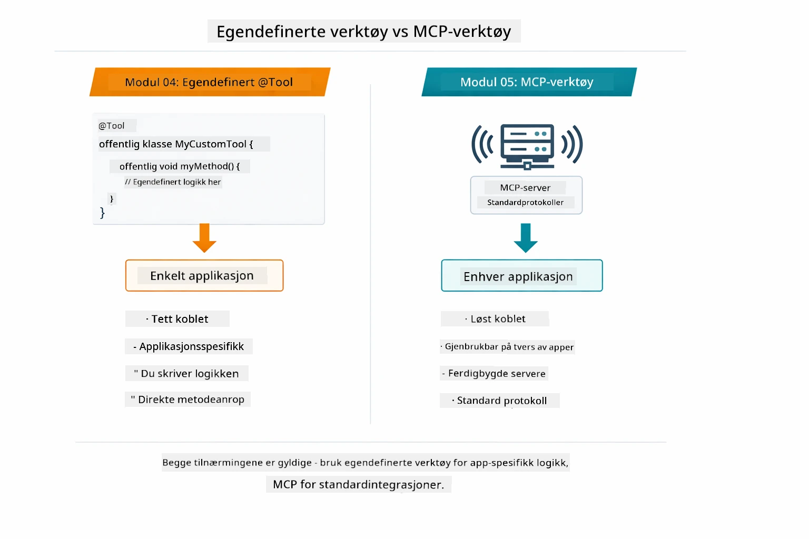  

*Når du skal bruke tilpassede @Tool-metoder kontra MCP-verktøy — tilpassede verktøy for app-spesifikk logikk med full typesikkerhet, MCP-verktøy for standardiserte integrasjoner som fungerer på tvers av applikasjoner.*  

## Gratulerer!  

Du har fullført alle fem modulene i LangChain4j for Beginners-kurset! Her er en oversikt over hele læringsreisen du har gjennomført — fra grunnleggende chat til MCP-drevne agentiske systemer:  

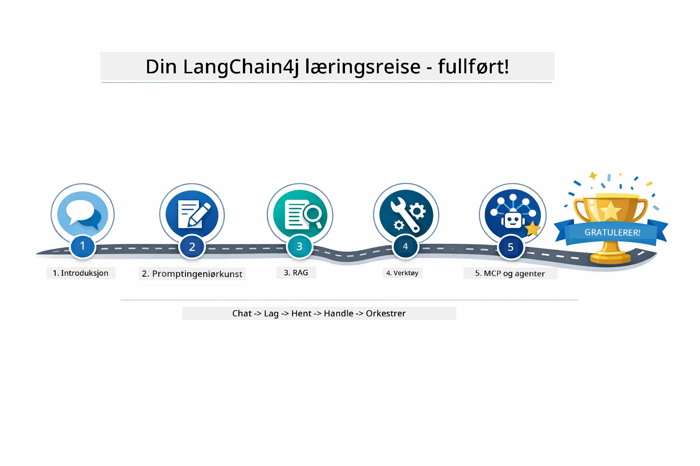  

*Din læringsreise gjennom alle fem modulene — fra grunnleggende chat til MCP-drevne agentiske systemer.*  

Du har fullført LangChain4j for Beginners-kurset. Du har lært:  

- Hvordan bygge konversasjonell AI med minne (Modul 01)  
- Prompt engineering-mønstre for ulike oppgaver (Modul 02)  
- Å forankre svar i dine dokumenter med RAG (Modul 03)  
- Lage grunnleggende AI-agenter (assistenter) med tilpassede verktøy (Modul 04)  
- Integrere standardiserte verktøy med LangChain4j MCP og Agentic moduler (Modul 05)  

### Hva nå?  

Etter å ha fullført modulene, utforsk [Testing Guide](../docs/TESTING.md) for å se LangChain4j testkonsepter i praksis.  

**Offisielle Ressurser:**  
- [LangChain4j Dokumentasjon](https://docs.langchain4j.dev/) - Omfattende guider og API-referanse  
- [LangChain4j GitHub](https://github.com/langchain4j/langchain4j) - Kildekode og eksempler  
- [LangChain4j Tutorials](https://docs.langchain4j.dev/tutorials/) - Steg-for-steg veiledninger for ulike brukstilfeller  

Takk for at du fullførte dette kurset!  

---  

**Navigasjon:** [← Forrige: Modul 04 - Verktøy](../04-tools/README.md) | [Tilbake til Hovedside](../README.md)

---

<!-- CO-OP TRANSLATOR DISCLAIMER START -->
**Ansvarsfraskrivelse**:  
Dette dokumentet er oversatt ved hjelp av AI-oversettelsestjenesten [Co-op Translator](https://github.com/Azure/co-op-translator). Selv om vi streber etter nøyaktighet, vennligst vær oppmerksom på at automatiske oversettelser kan inneholde feil eller unøyaktigheter. Det originale dokumentet på dets opprinnelige språk skal anses som den autoritative kilden. For kritisk informasjon anbefales profesjonell menneskelig oversettelse. Vi påtar oss ikke ansvar for eventuelle misforståelser eller feiltolkninger som følge av bruk av denne oversettelsen.
<!-- CO-OP TRANSLATOR DISCLAIMER END -->