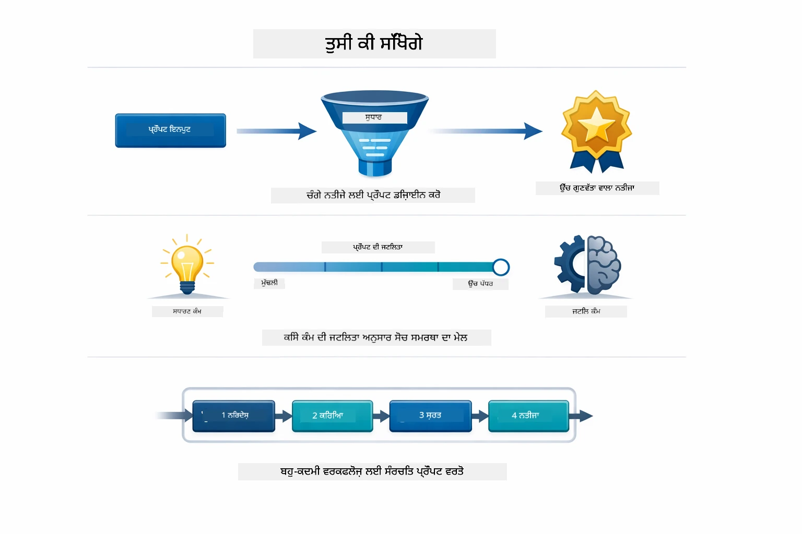
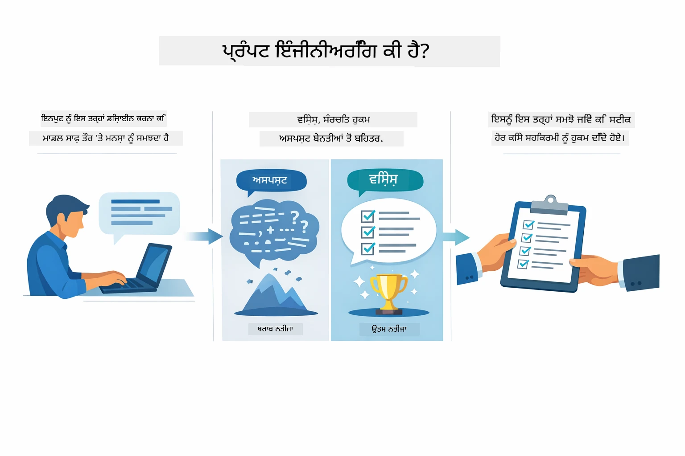
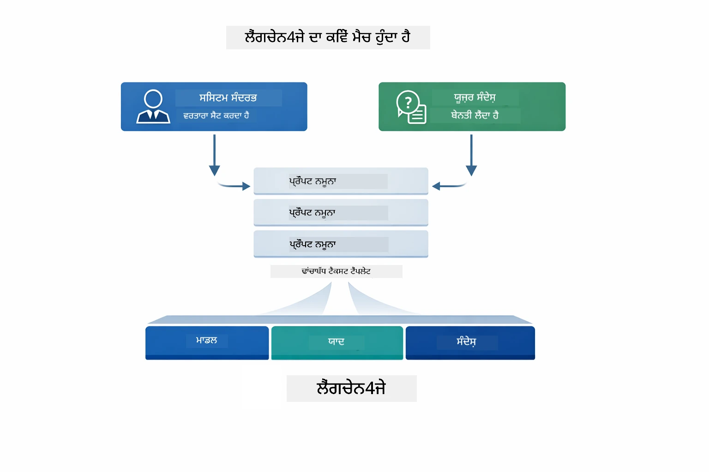
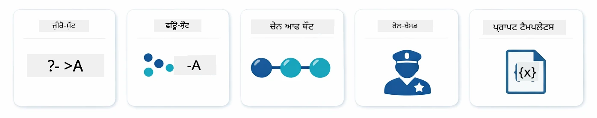
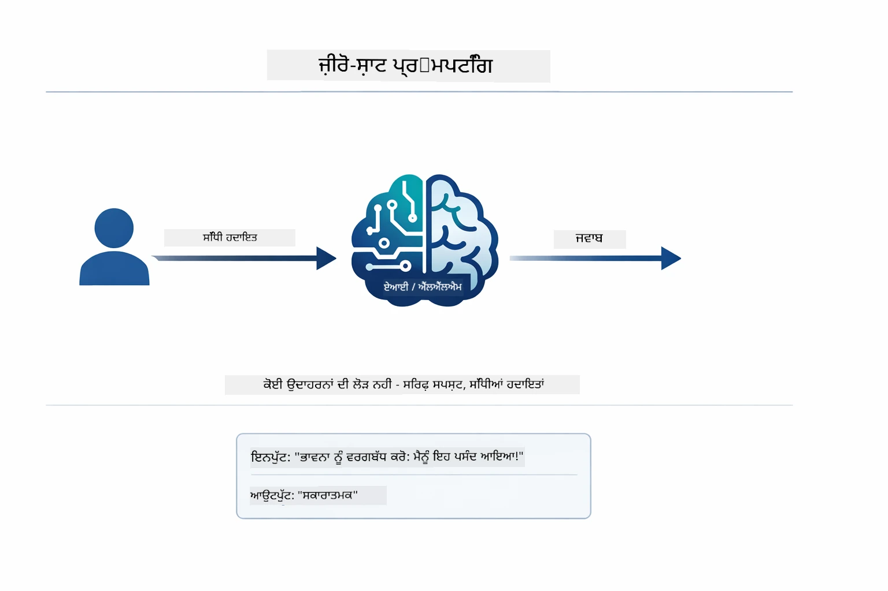
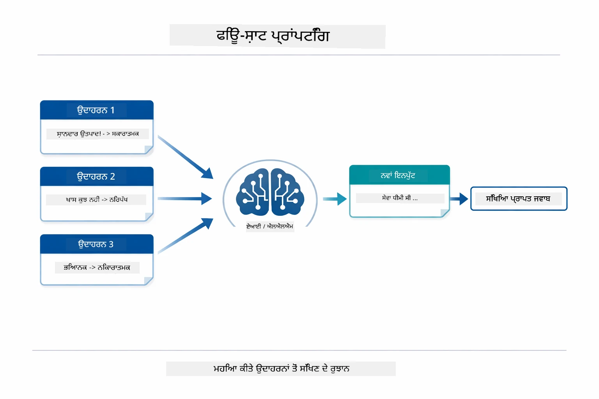
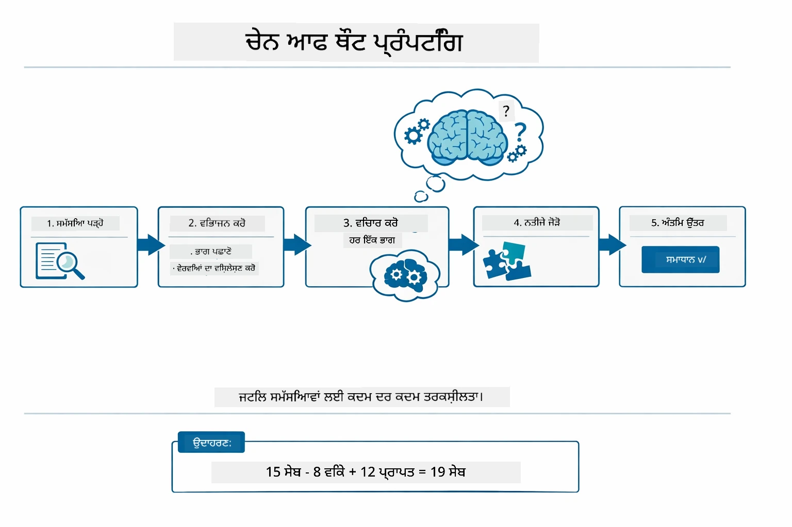
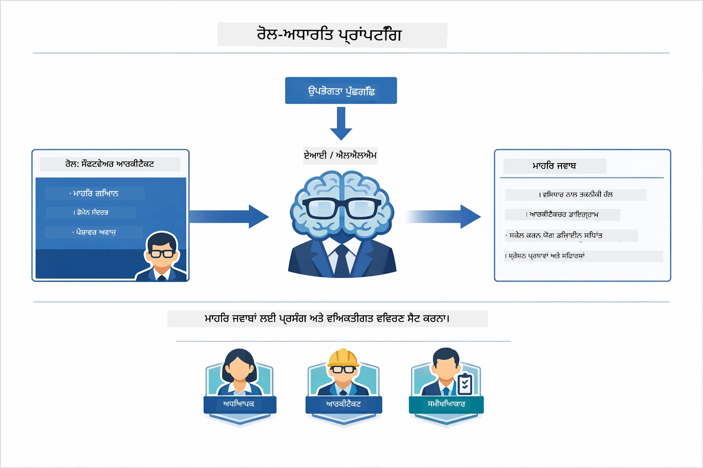
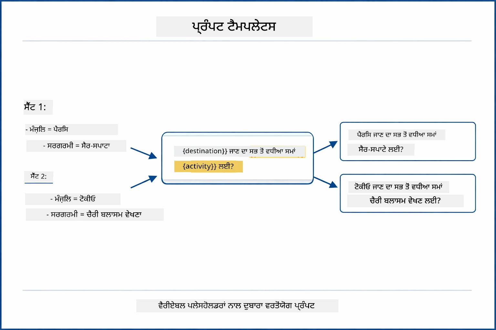
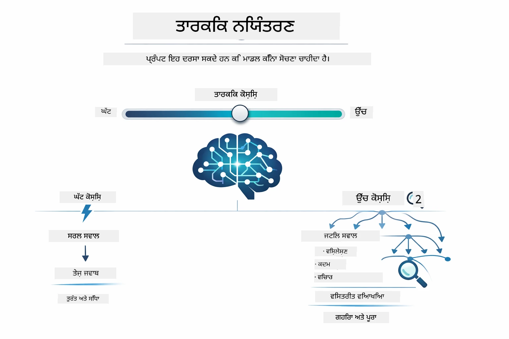

# Module 02: GPT-5.2 ਨਾਲ ਪ੍ਰੌਂਪਟ ਇੰਜੀਨੀਅਰਿੰਗ

## ਸਾਰਣੀ

- [ਵੀਡੀਓ ਵਾਕਥਰੂ](../../../02-prompt-engineering)
- [ਤੁਸੀਂ ਕੀ ਸਿੱਖੋਗੇ](../../../02-prompt-engineering)
- [ਪੂਰਵ-ਸ਼ਰਤਾਂ](../../../02-prompt-engineering)
- [ਪ੍ਰੌਂਪਟ ਇੰਜੀਨੀਅਰਿੰਗ ਦੀ ਸਮਝ](../../../02-prompt-engineering)
- [ਪ੍ਰੌਂਪਟ ਇੰਜੀਨੀਅਰਿੰਗ ਦੇ ਮੂਲ ਸਿਧਾਂਤ](../../../02-prompt-engineering)
  - [ਜ਼ੀਰੋ-ਸ਼ਾਟ ਪ੍ਰੌਂਪਟਿੰਗ](../../../02-prompt-engineering)
  - [ਫਿਊ-ਸ਼ਾਟ ਪ੍ਰੌਂਪਟਿੰਗ](../../../02-prompt-engineering)
  - [ਚੇਨ ਆਫ਼ ਥੌਟ](../../../02-prompt-engineering)
  - [ਰੋਲ-ਆਧਾਰਿਤ ਪ੍ਰੌਂਪਟਿੰਗ](../../../02-prompt-engineering)
  - [ਪ੍ਰੌਂਪਟ ਟੈਂਪਲੇਟ](../../../02-prompt-engineering)
- [ਉੱਨਤ ਪੈਟਰਨ](../../../02-prompt-engineering)
- [ਮੌਜੂਦਾ ਅਜ਼ੂਰ ਸਾਧਨਾਂ ਦਾ ਉਪਯੋਗ](../../../02-prompt-engineering)
- [ਐਪਲੀਕੇਸ਼ਨ ਸਕ੍ਰੀਨਸ਼ਾਟ](../../../02-prompt-engineering)
- [ਪੈਟਰਨ ਦੀ ਜਾਂਚ](../../../02-prompt-engineering)
  - [ਘੱਟ ਤੇਜ਼ੀ ਵਨਾਮ਼ ਵੱਧ ਤੇਜ਼ੀ](../../../02-prompt-engineering)
  - [ਟਾਸਕ ਰਣਨੀਤੀ (ਟੂਲ ਪ੍ਰੀਐම්බਲ)](../../../02-prompt-engineering)
  - [ਸਵੈ-ਮੁਲਾਂਕਣ ਕੋਡ](../../../02-prompt-engineering)
  - [ਸੰਰਚਨਾਤਮਕ ਵਿਸ਼ਲੇਸ਼ਣ](../../../02-prompt-engineering)
  - [ਮਲਟੀ-ਟਰਨ ਚੈਟ](../../../02-prompt-engineering)
  - [ਕਦਮ-ਦਰ-ਕਦਮ ਤਾਰਕਿਕਤਾ](../../../02-prompt-engineering)
  - [ਸੀਮਿਤ ਆਉਟਪੁੱਟ](../../../02-prompt-engineering)
- [ਤੁਸੀਂ ਅਸਲ ਵਿੱਚ ਕੀ ਸਿੱਖ ਰਹੇ ਹੋ](../../../02-prompt-engineering)
- [ਅਗਲੇ ਕਦਮ](../../../02-prompt-engineering)

## ਵੀਡੀਓ ਵਾਕਥਰੂ

ਇਸ ਲਾਈਵ ਸੈਸ਼ਨ ਨੂੰ ਦੇਖੋ ਜੋ ਦਿਖਾਉਂਦਾ ਹੈ ਕਿ ਇਸ ਮੋਡੀਊਲ ਨਾਲ ਕਿਵੇਂ ਸ਼ੁਰੂਆਤ ਕਰਨੀ ਹੈ: [Prompt Engineering with LangChain4j - Live Session](https://www.youtube.com/live/PJ6aBaE6bog?si=LDshyBrTRodP-wke)

## ਤੁਸੀਂ ਕੀ ਸਿੱਖੋਗੇ



ਪਿਛਲੇ ਮੋਡੀਊਲ ਵਿੱਚ ਤੁਸੀਂ ਦੇਖਿਆ ਕਿ ਮੈਮੋਰੀ ਸੰਵਾਦਾਤਮਕ AI ਨੂੰ ਕਿਵੇਂ ਯੋਗ ਬਣਾਉਂਦੀ ਹੈ ਅਤੇ ਮੂਲ ਸੰਵਾਦ ਲਈ GitHub ਮਾਡਲਾਂ ਦੀ ਵਰਤੋਂ ਕੀਤੀ। ਹੁਣ ਅਸੀਂ ਇਸ ਗੱਲ 'ਤੇ ਧਿਆਨ ਦੇਵਾਂਗੇ ਕਿ ਤੁਸੀਂ ਪੁੱਛੇ ਗਏ ਸਵਾਲਾਂ — ਪ੍ਰੌਂਪਟ ਖੁਦ — Azure OpenAI ਦੇ GPT-5.2 ਦੀ ਵਰਤੋਂ ਕਰਦੇ ਹੋਏ ਕਿਵੇਂ ਬਣਾਉਂਦੇ ਹੋ। ਜਿਵੇਂ ਤੁਸੀਂ ਆਪਣੇ ਪ੍ਰੌਂਪਟਾਂ ਨੂੰ ਬਣਾਉਂਦੇ ਹੋ, ਇਹ ਤੁਹਾਡੇ ਪ੍ਰਾਪਤ ਕੀਤੇ ਜਵਾਬਾਂ ਦੀ ਗੁਣਵੱਤਾ ਤੇ ਬਹੁਤ ਪ੍ਰਭਾਵ ਪਾਉਂਦਾ ਹੈ। ਅਸੀਂ ਪਹਿਲਾਂ ਮੂਲ ਪ੍ਰੌਂਪਟਿੰਗ ਤਕਨੀਕਾਂ ਦੀ ਸਮੀਖਿਆ ਕਰਾਂਗੇ, ਫਿਰ ਜਿੱਥੇ GPT-5.2 ਦੀਆਂ ਯੋਗਤਾਵਾਂ ਪੂਰੀ ਤਰ੍ਹਾਂ ਫਾਇਦਾ ਲੈਣ ਵਾਲੇ 8 ਉੱਨਤ ਪੈਟਰਨਾਂ ਵਿੱਚ ਜਾਵਾਂਗੇ।

ਅਸੀਂ GPT-5.2 ਦੀ ਵਰਤੋਂ ਕਰਾਂਗੇ ਕਿਉਂਕਿ ਇਹ ਤર્ક ਨਿਯੰਤਰਣ ਲਿਆਉਂਦਾ ਹੈ - ਤੁਸੀਂ ਮਾਡਲ ਨੂੰ ਦੱਸ ਸਕਦੇ ਹੋ ਕਿ ਜਵਾਬ ਦੇਣ ਤੋਂ ਪਹਿਲਾਂ ਕਿੰਨੀ ਸੋਚ ਕਰਨੀਆਂ ਹਨ। ਇਹ ਵੱਖ-ਵੱਖ ਪ੍ਰੌਂਪਟਿੰਗ ਰਣਨੀਤੀਆਂ ਨੂੰ ਹੋਰ ਸਪਸ਼ਟ ਕਰਦਾ ਹੈ ਅਤੇ ਤੁਹਾਨੂੰ ਸਮਝਣ ਵਿੱਚ ਮਦਦ ਕਰਦਾ ਹੈ ਕਿ ਕਦੋਂ ਕਿਸ ਤਰੀਕੇ ਦੀ ਵਰਤੋਂ ਕਰਨੀ ਹੈ। ਅਸੀਂ ਅਜੂਰ ਦੇ ਘੱਟ ਰੇਟ ਸੀਮਾ ਵਾਲੇ GPT-5.2 ਦੇ ਫਾਇਦੇ ਵੀ ਲਵਾਂਗੇ ਜਿਵੇਂ ਕਿ GitHub ਮਾਡਲਾਂ ਦੇ ਮੁਕਾਬਲੇ ਵਿੱਚ।

## ਪੂਰਵ-ਸ਼ਰਤਾਂ

- ਮੋਡੀਊਲ 01 ਪੂਰਾ ਕੀਤਾ ਹੋਇਆ (Azure OpenAI ਸਾਧਨ ਤਿਆਰ ਕੀਤੇ ਹੋਏ)
- ਰੂਟ ਡਾਇਰੈਕਟਰੀ ਵਿੱਚ `.env` ਫਾਇਲ ਜਿਸ ਵਿੱਚ ਅਜ਼ੂਰ ਪ੍ਰਮਾਣਪੱਤਰ ਹਨ (`azd up` ਨਾਲ ਮੋਡੀਊਲ 01 ਵਿੱਚ ਬਣਾਈ ਗਈ)

> **ਟਿਪ:** ਜੇ ਤੁਸੀਂ ਮੋਡੀਊਲ 01 ਨਹੀਂ ਕੀਤਾ, ਤਾਂ ਪਹਿਲਾਂ ਉੱਥੇ ਦਿੱਤੀਆਂ ਡਿਪਲੋਇਮੈਂਟ ਹੁਕਮਾਂ ਦੀ ਪਾਲਣਾ ਕਰੋ।

## ਪ੍ਰੌਂਪਟ ਇੰਜੀਨੀਅਰਿੰਗ ਦੀ ਸਮਝ



ਪ੍ਰੌਂਪਟ ਇੰਜੀਨੀਅਰਿੰਗ ਉਹ ਹੈ ਜੋ ਇਨਪੁੱਟ ਟੈਕਸਟ ਨੂੰ ਇੰਝ ਡਿਜ਼ਾਇਨ ਕਰਦਾ ਹੈ ਕਿ ਇਹ ਹਮੇਸ਼ਾ ਤੁਹਾਨੂੰ ਚਾਹੀਦੇ ਨਤੀਜੇ ਦਿੰਦਾ ਰਹੇ। ਇਹ ਸਿਰਫ਼ ਸਵਾਲ ਪੁੱਛਣ ਬਾਰੇ ਨਹੀਂ ਹੈ — ਸਗੋਂ ਇਹ ਬਾਰੇ ਹੈ ਕਿ ਕਿਵੇਂ ਬੇਨਤੀ ਬਣਾ ਕੇ ਮਾਡਲ ਨੂੰ ਵਜਾਇਬ ਤਰੀਕੇ ਨਾਲ ਸਮਝਾਇਆ ਜਾਵੇ ਕਿ ਤੁਸੀਂ ਕੀ ਚਾਹੁੰਦੇ ਹੋ ਅਤੇ ਕਿਵੇਂ ਉਹ ਪ੍ਰਦਾਨ ਕਰੇ।

ਇਸਨੂੰ ਆਪਣੇ ਸਾਥੀ ਕੰਮ ਵਾਲੇ ਨੂੰ ਹਦਾਇਤਾਂ ਦੇਣ ਵਾਂਗ ਸੋਚੋ। "ਬੱਗ ਠੀਕ ਕਰ" ਧੁੰਦਲਾ ਹੈ। "UserService.java ਦੀ ਲਾਈਨ 45 ਵਿੱਚ ਨੱਲ ਪੁਆਇੰਟਰ ਐਕਸਪਸ਼ਨ ਨੂੰ ਨੱਲ ਚੈੱਕ ਲਾਓ" ਵਿਸ਼ੇਸ਼ ਹੈ। ਭਾਸ਼ਾ ਮਾਡਲ ਵੀ ਇਸੇ ਤਰ੍ਹਾਂ ਕੰਮ ਕਰਦੇ ਹਨ — ਵਿਸ਼ੇਸ਼ਤਾ ਅਤੇ ਸੰਰਚਨਾ ਮਹੱਤਵਪੂਰਣ ਹਨ।



LangChain4j ਢਾਂਚਾ ਮੁਹੱਈਆ ਕਰਵਾਉਂਦਾ ਹੈ — ਮਾਡਲ ਕਨੈਕਸ਼ਨ, ਮੈਮੋਰੀ, ਅਤੇ ਸੁਨੇਹਾ ਕਿਸਮਾਂ — ਜਦਕਿ ਪ੍ਰੌਂਪਟ ਪੈਟਰਨ ਸਿਰਫ਼ ਧਿਆਨ ਨਾਲ ਬਣਾਈ ਗਈ ਟੈਕਸਟ ਹੁੰਦੇ ਹਨ ਜੋ ਉਸ ਢਾਂਚੇ ਰਾਹੀਂ ਭੇਜੇ ਜਾਂਦੇ ਹਨ। ਮੁੱਖ ਇਮਾਰਤੀ ਪੱਥਰ ਹਨ `SystemMessage` (ਜੋ AI ਦਾ ਵਰਤਾਰਾ ਅਤੇ ਭੂਮਿਕਾ ਸੈੱਟ ਕਰਦਾ ਹੈ) ਅਤੇ `UserMessage` (ਜੋ ਤੁਹਾਡੀ ਅਸਲੀ ਬੇਨਤੀ ਲੈ ਕੇ ਆਉਂਦਾ ਹੈ)।

## ਪ੍ਰੌਂਪਟ ਇੰਜੀਨੀਅਰਿੰਗ ਦੇ ਮੂਲ ਸਿਧਾਂਤ



ਇਸ ਮੋਡੀਊਲ ਵਿੱਚ ਉੱਨਤ ਪੈਟਰਨਾਂ ਵਿੱਚ ਡੁੱਬਕੀ ਮਾਰਨ ਤੋਂ ਪਹਿਲਾਂ, ਆਓ ਪੰਜ ਮੂਲ ਪ੍ਰੌਂਪਟਿੰਗ ਤਕਨੀਕਾਂ ਦੀ ਸਮੀਖਿਆ ਕਰੀਏ। ਇਹ ਉਹ ਨਿਰਮਾਣ ਪੱਥਰ ਹਨ ਜੋ ਹਰ ਪ੍ਰੌਂਪਟ ਇੰਜੀਨੀਅਰ ਨੂੰ ਜਾਣਣੇ ਚਾਹੀਦੇ ਹਨ। ਜੇ ਤਸੀਂ ਪਹਿਲਾਂ ਹੀ [ਕੁਇਕ ਸਟਾਰਟ ਮੋਡੀਊਲ](../00-quick-start/README.md#2-prompt-patterns) ਚ ਕੀਤੇ ਹੋ ਤਾਂ ਤੁਹਾਡੇ ਲਈ ਇਹ ਪਰੇਪਟਭੂਮੀ ਹੈ — ਇਹ ਰਹੀ ਇਹਨਾਂ ਦੇ ਸੰਕਲਪਿਕ ਫਰੇਮਵਰਕ ਦੀ ਝਲਕ।

### ਜ਼ੀਰੋ-ਸ਼ਾਟ ਪ੍ਰੌਂਪਟਿੰਗ

ਸਭ ਤੋਂ ਸਧਾਰਣ ਤਰੀਕਾ: ਮਾਡਲ ਨੂੰ ਬਿਨਾਂ ਕਿਸੇ ਉਦਾਹਰਨ ਦੇ ਸਿੱਧਾ ਨਿਰਦੇਸ਼ ਦਿਓ। ਮਾਡਲ ਪੂਰੀ ਤਰ੍ਹਾਂ ਆਪਣੇ ਟ੍ਰੇਨਿੰਗ 'ਤੇ ਨਿਰਭਰ ਕਰਦਾ ਹੈ ਕਿ ਟਾਸਕ ਨੂੰ ਸਮਝਣ ਅਤੇ ਲਾਗੂ ਕਰਨ ਲਈ। ਇਹ ਸਾਧਾਰਣ ਬੇਨਤੀਆਂ ਲਈ ਚੰਗਾ ਕੰਮ ਕਰਦਾ ਹੈ ਜਿੱਥੇ ਉਮੀਦ ਕੀਤੀ ਚਾਲ-ਚਲਣ ਸਪੱਠ ਹੈ।



*ਉਦਾਹਰਨਾਂ ਬਿਨਾਂ ਸਿੱਧਾ ਨਿਰਦੇਸ਼ — ਮਾਡਲ ਸਿਰਫ ਨਿਰਦੇਸ਼ ਤੋਂ ਟਾਸਕ ਲਈ ਅਨੁਮਾਨ ਲਗਾਉਂਦਾ ਹੈ*

```java
String prompt = "Classify this sentiment: 'I absolutely loved the movie!'";
String response = model.chat(prompt);
// ਜਵਾਬ: "ਸਕਾਰਾਤਮਕ"
```

**ਕਦੋਂ ਵਰਤਣਾ:** ਸਧਾਰਨ ਵਰਗੀਕਰਨ, ਸਿੱਧੇ ਸਵਾਲ, ਅਨੁਵਾਦ, ਜਾਂ ਕਿਸੇ ਵੀ ਐਸੇ ਟਾਸਕ ਲਈ ਜੋ ਮਾਡਲ ਵੱਲੋਂ ਵਾਧੂ ਦਿਸ਼ਾ-ਨਿਰਦੇਸ਼ ਤੋਂ ਬਿਨਾਂ ਕੀਤੇ ਜਾ ਸਕਦੇ ਹਨ।

### ਫਿਊ-ਸ਼ਾਟ ਪ੍ਰੌਂਪਟਿੰਗ

ਉਦਾਹਰਨਾਂ ਦੇ ਕੇ ਮਾਡਲ ਨੂੰ ਉਹ ਪੈਟਰਨ ਦਿਖਾਓ ਜੋ ਤੁਸੀਂ ਚਾਹੁੰਦੇ ਹੋ ਕਿ ਮਾਡਲ ਅਪਣਾਏ। ਮਾਡਲ ਤੁਹਾਡੇ ਉਦਾਹਰਨਾਂ ਤੋਂ ਉਮੀਦ ਕੀਤੀ ਇਨਪੁੱਟ-ਆਉਟਪੁੱਟ ਫਾਰਮੈਟ ਸਿੱਖਦਾ ਹੈ ਤੇ ਨਵੇਂ ਇਨਪੁੱਟਾਂ 'ਤੇ ਲਾਗੂ ਕਰਦਾ ਹੈ। ਇਹ ਹੋਰ ਜ਼ਿਆਦਾ ਲਾਗੂਯੋਗਤਾ ਲਈ ਬਹੁਤ ਹੀ ਫਾਇਦੇਮੰਦ ਹੈ ਜਿੱਥੇ ਚਾਹੁੰਦਾ ਫਾਰਮੈਟ ਜਾਂ ਚਾਲ-ਚਲਣ ਸਪਸ਼ਟ ਨਹੀਂ ਹੁੰਦੀ।



*ਉਦਾਹਰਨਾਂ ਤੋਂ ਸਿੱਖ ਕੇ — ਮਾਡਲ ਪੈਟਰਨ ਨੂੰ ਪਛਾਣਦਾ ਹੈ ਅਤੇ ਨਵੇਂ ਇਨਪੁੱਟਾਂ 'ਤੇ ਲਾਗੂ ਕਰਦਾ ਹੈ*

```java
String prompt = """
    Classify the sentiment as positive, negative, or neutral.
    
    Examples:
    Text: "This product exceeded my expectations!" → Positive
    Text: "It's okay, nothing special." → Neutral
    Text: "Waste of money, very disappointed." → Negative
    
    Now classify this:
    Text: "Best purchase I've made all year!"
    """;
String response = model.chat(prompt);
```

**ਕਦੋਂ ਵਰਤਣਾ:** ਖਾਸ ਵਰਗੀਕਰਨ, ਲਗਾਤਾਰ ਫਾਰਮੈਟਿੰਗ, ਖੇਤਰ-ਵਿਸ਼ੇਸ਼ ਟਾਸਕ, ਜਾਂ ਜਦੋਂ ਜ਼ੀਰੋ-ਸ਼ਾਟ ਨਤੀਜੇ ਅਸਥਿਰ ਹੁੰਦੇ ਹਨ।

### ਚੇਨ ਆਫ਼ ਥੌਟ

ਮਾਡਲ ਨੂੰ ਕਦਮ-ਦਰ-ਕਦਮ ਆਪਣੀ ਤਰਕ ਦਿਖਾਉਣ ਲਈ ਕਿਹਾ ਜਾਵੇ। ਬਿਨਾਂ ਸਿੱਧਾ ਜਵਾਬ ਦੇਣ ਤੋਂ, ਮਾਡਲ ਮੁਸ਼ਕਲਾਂ ਨੂੰ ਟੁਕੜਿਆਂ ਵਿੱਚ ਵੰਡ ਕੇ ਹਰੇਕ ਹਿੱਸਾ ਸਪਸ਼ਟ ਤੌਰ 'ਤੇ ਸਮਝਾਉਂਦਾ ਹੈ। ਇਹ ਗਣਿਤ, ਤਰਕ, ਅਤੇ ਕਈ ਕਦਮਾਂ ਵਾਲੇ ਟਾਸਕਾਂ ਲਈ ਸਹੀ ਹੱਲ ਲਈ ਵਰਤਿਆ ਜਾਂਦਾ ਹੈ।



*ਕਦਮ-ਦਰ-ਕਦਮ ਤਰਕ - ਮੁਸ਼ਕਲ ਸਮੱਸਿਆਵਾਂ ਨੂੰ ਸਪਸ਼ਟ ਤਰਕ ਨਾਲ ਹਿੱਸਿਆਂ ਵਿੱਚ ਵੰਡਣਾ*

```java
String prompt = """
    Problem: A store has 15 apples. They sell 8 apples and then 
    receive a shipment of 12 more apples. How many apples do they have now?
    
    Let's solve this step-by-step:
    """;
String response = model.chat(prompt);
// ਮਾਡਲ ਦਿਖਾਉਂਦਾ ਹੈ: 15 - 8 = 7, ਫਿਰ 7 + 12 = 19 ਸੇਬ
```

**ਕਦੋਂ ਵਰਤਣਾ:** ਗਣਿਤ ਸਮੱਸਿਆਵਾਂ, ਤਰਕ ਪਜ਼ਲ, ਡਿਬੱਗਿੰਗ, ਜਾਂ ਕਿਸੇ ਵੀ ਟਾਸਕ ਲਈ ਜਿੱਥੇ ਤਰਕ ਪ੍ਰਕਿਰਿਆ ਦੇਖਾਉਣ ਨਾਲ ਸਹੀ ਹੱਲ ਅਤੇ ਭਰੋਸਾ ਵੱਧਦਾ ਹੈ।

### ਰੋਲ-ਆਧਾਰਿਤ ਪ੍ਰੌਂਪਟਿੰਗ

AI ਲਈ ਪੇਰਸੋਨਾ ਜਾਂ ਭੂਮਿਕਾ ਸੈੱਟ ਕਰੋ ਪਹਿਲਾਂ, پھر آپنا سوال پوچھو। ਇਹ ਸੰਦਰਭ ਮੁਹੱਈਆ ਕਰਵਾਉਂਦਾ ਹੈ ਜੋ ਜਵਾਬ ਦਾ ਟੋਨ, ਗਹਿਰਾਈ ਅਤੇ ਧਿਆਨ ਨਿਰਧਾਰਤ ਕਰਦਾ ਹੈ। "ਸਾਫਟਵੇਅਰ ਆਰਕੀਟੈਕਟ" ਵੱਖਰਾ ਸਲਾਹ ਦਿੰਦਾ ਹੈ ਬਜਾਏ ਇਕ "ਜੂਨੀਅਰ ਡਿਵੈਲਪਰ" ਜਾਂ "ਸੁਰੱਖਿਆ ਆਡੀਟਰ" ਦੇ।



*ਸੰਦਰਭ ਅਤੇ ਭੂਮਿਕਾ ਸੈੱਟ ਕਰਨਾ — ਇੱਕੋ ਸਵਾਲ ਨੂੰ ਸੌਂਪੀਆ ਗਈ ਭੂਮਿਕਾ ਦੇ ਅਨੁਸਾਰ ਵੱਖਰਾ ਜਵਾਬ ਮਿਲਦਾ ਹੈ*

```java
String prompt = """
    You are an experienced software architect reviewing code.
    Provide a brief code review for this function:
    
    def calculate_total(items):
        total = 0
        for item in items:
            total = total + item['price']
        return total
    """;
String response = model.chat(prompt);
```

**ਕਦੋਂ ਵਰਤਣਾ:** ਕੋਡ ਸਮੀਖਿਆ, ਪਾਠ ਵਿਦਿਆ, ਖੇਤਰ-ਵਿਸ਼ੇਸ਼ ਵਿਸ਼ਲੇਸ਼ਣ, ਜਾਂ ਜਦੋਂ ਤੁਹਾਨੂੰ ਕਿਸੇ ਖਾਸ ਮਾਹਰਤਾ ਪੱਧਰ ਜਾਂ ਨਜ਼ਰੀਏ ਲਈ ਜਵਾਬ ਚਾਹੀਦਾ ਹੋਵੇ।

### ਪ੍ਰੌਂਪਟ ਟੈਂਪਲੇਟ

ਬਦਲਦੇ ਮੁੱਲਾਂ ਵਾਲੇ ਫਿਰ ਵਰਤੇ ਜਾ ਸਕਣ ਵਾਲੇ ਪ੍ਰੌਂਪਟ ਬਣਾਓ। ਹਰ ਵਾਰੀ ਨਵਾਂ ਪ੍ਰੌਂਪਟ ਲਿਖਣ ਦੀ ਬਜਾਏ ਇਕ ਵਾਰੀ ਟੈਂਪਲੇਟ ਤਿਆਰ ਕਰੋ ਅਤੇ ਵੱਖ-ਵੱਖ ਮੁੱਲ ਭਰੋ। LangChain4j ਦਾ `PromptTemplate` ਕਲਾਸ ਇਸਨੂੰ ਆਸਾਨ ਬਣਾਉਂਦਾ ਹੈ ਜੀਹਨੂੰ `{{variable}}` ਵਾਂਗ ਸਿੰਟੈਕਸ ਵਰਤਦਾ ਹੈ।



*ਫਿਰ ਵਰਤਣ ਯੋਗ ਪ੍ਰੌਂਪਟ ਵੱਲੇ ਬਦਲਵਾਏ ਜਾਣ ਵਾਲੇ ਜਗਾ — ਇੱਕ ਟੈਂਪਲੇਟ, ਬਹੁਤ ਸਾਰੇ ਉਪਯੋਗ*

```java
PromptTemplate template = PromptTemplate.from(
    "What's the best time to visit {{destination}} for {{activity}}?"
);

Prompt prompt = template.apply(Map.of(
    "destination", "Paris",
    "activity", "sightseeing"
));

String response = model.chat(prompt.text());
```

**ਕਦੋਂ ਵਰਤਣਾ:** ਵੱਖ-ਵੱਖ ਇਨਪੁੱਟਾਂ ਨਾਲ ਵਾਰ-ਵਾਰ ਪੁੱਛੇ ਜਾਣ ਵਾਲੇ ਪ੍ਰਸ਼ਨ, ਬੈਚ ਪ੍ਰੋਸੈਸਿੰਗ, ਫਿਰ ਵਰਤਣ ਯੋਗ AI ਵਰਕਫਲੋ, ਜਾਂ ਕਿਸੇ ਵੀ ਸਥਿਤੀ ਗੀ ਵਿਚ ਪ੍ਰੌਂਪਟ ਦੀ ਸੰਰਚਨਾ ਇੱਕੋ ਰਹਿੰਦੀ ਹੈ ਪਰ ਡੇਟਾ ਬਦਲਦਾ ਹੈ।

---

ਇਹ ਪੰਜ ਮੂਲ ਸਿਧਾਂਤ ਤੁਹਾਨੂੰ ਬਹੁਤ ਸਾਰੇ ਪ੍ਰੌਂਪਟਿੰਗ ਟਾਸਕਾਂ ਲਈ ਮਜ਼ਬੂਤ ਸੰਦ-ਸਮੱਗਰੀ ਦਿੰਦੇ ਹਨ। ਇਸ ਮੋਡੀਊਲ ਦੀ ਬਾਕੀ ਰਚਨਾ ਇਨ੍ਹਾਂ ਉੱਤੇ ਆਧਾਰਿਤ ਹੈ ਨਾਲ ਹੀ **ਆਠ ਉੱਨਤ ਪੈਟਰਨਾਂ** ਜੋ GPT-5.2 ਦੇ ਤਰਕ ਨਿਯੰਤਰਣ, ਸੁਆ-ਮੁਲਾਂਕਣ ਅਤੇ ਸੰਰਚਨਾਤਮਕ ਆਉਟਪੁੱਟ ਸਮਰੱਥਾਵਾਂ ਦਾ ਲਾਭ ਉਠਾਉਂਦੇ ਹਨ।

## ਉੱਨਤ ਪੈਟਰਨ

ਮੂਲ ਸਿਧਾਂਤ ਸਮਝਣ ਤੋਂ ਬਾਅਦ, ਆਓ ਉਹ ਆਠ ਉੱਨਤ ਪੈਟਰਨ ਦੇਖੀਏ ਜੋ ਇਸ ਮੋਡੀਊਲ ਨੂੰ ਅਲੱਗ ਬਣਾਉਂਦੇ ਹਨ। ਸਾਰੇ ਸਮੱਸਿਆਵਾਂ ਲਈ ਇੱਕੋ ਜਿਹਾ ਤਰੀਕਾ ਨਹੀਂ ਹੈ। ਕੁਝ ਸਵਾਲਾਂ ਨੂੰ ਤੇਜ਼ ਜਵਾਬਾਂ ਦੀ ਲੋੜ ਹੁੰਦੀ ਹੈ, ਕੁਝ ਨੂੰ ਡੂੰਘੀ ਸੋਚ ਦੀ। ਕੁਝ ਨੂੰ ਦਿਖਾਈ ਦੇਣ ਵਾਲੀ ਤਰਕ ਕਿਹੜੀ ਹੈ, ਕੁਝ ਨੂੰ ਸਿਰਫ ਨਤੀਜੇ ਲੋੜੀਂਦੇ ਹਨ। ਹਰੇਕ ਪੈਟਰਨ ਇੱਕ ਵੱਖਰੀ ਸਥਿਤੀ ਲਈ ਬਿਹਤਰ ਢੰਗ ਨਾਲ ਸੋਚਿਆ ਗਿਆ ਹੈ — ਅਤੇ GPT-5.2 ਦਾ ਤਰਕ ਨਿਯੰਤਰਣ ਇਹ ਫਰਕ ਹੋਰ ਵੀ ਸਪਸ਼ਟ ਕਰਦਾ ਹੈ।


*ਆਠ ਪ੍ਰੌਂਪਟ ਇੰਜੀਨੀਅਰਿੰਗ ਪੈਟਰਨਾਂ ਅਤੇ ਉਨ੍ਹਾਂ ਦੇ ਉਪਯੋਗ ਮਾਮਲੇ ਦਾ ਓਵਰਵਿਊ*



*GPT-5.2 ਦਾ ਤਰਕ ਨਿਯੰਤਰਣ ਤੁਹਾਨੂੰ ਦੱਸਦਾ ਹੈ ਕਿ ਮਾਡਲ ਨੂੰ ਕਿੰਨੀ ਸੋਚ ਕਰਨੀਆਂ ਹਨ — ਤੇਜ਼ ਅਤੇ ਸਿੱਧੀਆਂ ਜਵਾਬਾਂ ਤੋਂ ਡੂੰਘੇ ਖੋਜ ਤੱਕ*

**ਘੱਟ ਤੇਜ਼ੀ (ਤੇਜ਼ ਅਤੇ ਫੋਕਸਡ)** - ਸਧਾਰਨ ਸਵਾਲਾਂ ਲਈ ਜਿੱਥੇ ਤੁਸੀਂ ਤੇਜ਼ ਅਤੇ ਸਿੱਧੇ ਜਵਾਬ ਚਾਹੁੰਦੇ ਹੋ। ਮਾਡਲ ਘੱਟ ਤੋਂ ਘੱਟ 2 ਕਦਮ ਤਰਕ ਕਰਦਾ ਹੈ। ਇਹ ਗਣਨਾ, ਲੁੱਕਅਪ ਜਾਂ ਸਿੱਧਾ ਸਵਾਲਾਂ ਲਈ ਵਰਤੋਂ।

```java
String prompt = """
    <context_gathering>
    - Search depth: very low
    - Bias strongly towards providing a correct answer as quickly as possible
    - Usually, this means an absolute maximum of 2 reasoning steps
    - If you think you need more time, state what you know and what's uncertain
    </context_gathering>
    
    Problem: What is 15% of 200?
    
    Provide your answer:
    """;

String response = chatModel.chat(prompt);
```

> 💡 **GitHub Copilot ਨਾਲ ਅਨੁਸੰਧਾਨ ਕਰੋ:** [`Gpt5PromptService.java`](../../../02-prompt-engineering/src/main/java/com/example/langchain4j/prompts/service/Gpt5PromptService.java) ਖੋਲ੍ਹੋ ਅਤੇ ਪੁੱਛੋ:
> - "ਘੱਟ ਤੇਜ਼ੀ ਅਤੇ ਵੱਧ ਤੇਜ਼ੀ ਪ੍ਰੌਂਪਟਿੰਗ ਪੈਟਰਨਾਂ ਵਿੱਚ ਕੀ ਫਰਕ ਹੈ?"
> - "XML ਟੈਗਜ਼ ਕਿਵੇਂ ਪ੍ਰੌਂਪਟਾਂ ਵਿੱਚ AI ਦੇ ਜਵਾਬ ਨੂੰ ਸੰਗਠਿਤ ਕਰਨ ਵਿੱਚ ਮਦਦ ਕਰਦੇ ਹਨ?"
> - "ਮੈਂ ਕਦੋਂ ਸਵੈ-ਮੁਲਾਂਕਣ ਪੈਟਰਨ ਵਰਤਾਂ ਅਤੇ ਕਦੋਂ ਸਿੱਧਾ ਨਿਰਦੇਸ਼ ਦੇਵਾਂ?"

**ਵੱਧ ਤੇਜ਼ੀ (ਗਹਿਰਾਈ ਅਤੇ ਵਿਸਥਾਰ)** - ਜਟਿਲ ਸਮੱਸਿਆਵਾਂ ਲਈ ਜਿੱਥੇ ਤੁਸੀਂ ਵਿਸਥਾਰ ਨਾਲ ਵਿਸ਼ਲੇਸ਼ਣ ਚਾਹੁੰਦੇ ਹੋ। ਮਾਡਲ ਧੀਰੇ-ਧੀਰੇ ਹਰ ਪਾਸੇ ਚੰਗੀ ਤਰ੍ਹਾਂ ਵਿਚਾਰ ਕਰਦਾ ਹੈ ਅਤੇ ਤਰਕ ਸਪਸ਼ਟ ਦਿਖਾਉਂਦਾ ਹੈ। ਇਹ ਸਿਸਟਮ ਡਿਜ਼ਾਈਨ, ਆਰਕੀਟੈਕਚਰ ਫੈਸਲੇ ਜਾਂ ਗਹਿਰੇ ਖੋਜ ਕਾਰਜ ਲਈ ਵਰਤੋਂ।

```java
String prompt = """
    Analyze this problem thoroughly and provide a comprehensive solution.
    Consider multiple approaches, trade-offs, and important details.
    Show your analysis and reasoning in your response.
    
    Problem: Design a caching strategy for a high-traffic REST API.
    """;

String response = chatModel.chat(prompt);
```

**ਟਾਸਕ ਰਣਨੀਤੀ (ਕਦਮ-ਦਰ-ਕਦਮ ਪ੍ਰਗਟਿਆ)** - ਕਈ ਕਦਮਾਂ ਵਾਲੇ ਵਰਕਫਲੋ ਲਈ। ਮਾਡਲ ਪਹਿਲਾਂ ਯੋਜਨਾ ਦਿੰਦਾ ਹੈ, ਕੰਮ ਕਰਂਦਾ ਹੈ ਹਰ ਕਦਮ ਦੀ ਵਰਣਨਾ ਕਰਦਾ ਹੈ, ਤੇ ਆਖਿਰ ਵਿੱਚ ਸੰਖੇਪ ਦਿੰਦਾ ਹੈ। ਅਨੁਵਾਦ, ਲਾਗੂ ਕਰਨ ਜਾਂ ਕਿਸੇ ਵੀ ਕਈ ਕਦਮਾਂ ਵਾਲੀ ਪ੍ਰਕਿਰਿਆ ਲਈ ਵਰਤੋਂ।

```java
String prompt = """
    <task_execution>
    1. First, briefly restate the user's goal in a friendly way
    
    2. Create a step-by-step plan:
       - List all steps needed
       - Identify potential challenges
       - Outline success criteria
    
    3. Execute each step:
       - Narrate what you're doing
       - Show progress clearly
       - Handle any issues that arise
    
    4. Summarize:
       - What was completed
       - Any important notes
       - Next steps if applicable
    </task_execution>
    
    <tool_preambles>
    - Always begin by rephrasing the user's goal clearly
    - Outline your plan before executing
    - Narrate each step as you go
    - Finish with a distinct summary
    </tool_preambles>
    
    Task: Create a REST endpoint for user registration
    
    Begin execution:
    """;

String response = chatModel.chat(prompt);
```

ਚੇਨ-ਆਫ-ਥੌਟ ਪ੍ਰੌਂਪਟਿੰਗ ਸਪਸ਼ਟ ਤੌਰ 'ਤੇ ਮਾਡਲ ਨੂੰ ਆਪਣਾ ਤਰਕ ਦਿਖਾਉਣ ਲਈ ਕਹਿੰਦੀ ਹੈ, ਜਿਸ ਨਾਲ ਗਣਿਤੀ, ਤਰਕ ਅਤੇ ਕਈ ਕਦਮਾਂ ਵਾਲੀਆਂ ਸਮੱਸਿਆਵਾਂ 'ਤੇ ਸਹੀ ਹੱਲ ਵੱਧਦਾ ਹੈ। ਕਦਮ-ਦਰ-ਕਦਮ ਟੁੱਟਣਾ ਮਨੁੱਖਾਂ ਅਤੇ AI ਦੋਹਾਂ ਲਈ ਲਾਜ਼ਮ ਤਰਕ ਨੂੰ ਸਮਝਣਾ ਆਸਾਨ ਬਣਾਉਂਦਾ ਹੈ।

> **🤖 GitHub Copilot Chat ਨਾਲ ਕੋਸ਼ਿਸ਼ ਕਰੋ:** ਇਸ ਪੈਟਰਨ ਬਾਰੇ ਪੁੱਛੋ:
> - "ਲੰਬੇ ਸਮੇਂ ਵਾਲੇ ਕਾਰਜਾਂ ਲਈ ਟਾਸਕ ਐਕਸਿਕਿਫ਼ਿਊਸ਼ਨ ਪੈਟਰਨ ਨੂੰ ਮੈਂ ਕਿਵੇਂ ਅਨੁਕੂਲ ਕਰਾਂ?"
> - "ਉਤਪਾਦਨ ਐਪਲੀਕੇਸ਼ਨਾਂ ਵਿੱਚ ਟੂਲ ਪ੍ਰੀਐම්බਲਾਂ ਨੂੰ ਕਿਵੇਂ ਚੰਗੀ ਤਰ੍ਹਾਂ ਬਣਾਇਆ ਜਾਵੇ?"
> - "UI ਵਿੱਚ ਦਰਮਿਆਨੇ ਦੌਰਾਨ ਪ੍ਰਗਟੀ ਅਪਡੇਟ ਕੈਸੇ ਪ੍ਰਾਪਤ ਅਤੇ ਦਿਖਾਈ ਜਾਣ?"


*ਯੋਜਨਾ → ਕਾਰਜ → ਸੰਖੇਪ ਕਰਨਾ ਮਲਟੀ-ਸਟੈੱਪ ਟਾਸਕਾਂ ਲਈ*

**ਸਵੈ-ਮੁਲਾਂਕਣ ਕੋਡ** - ਉਤਪਾਦਨ-ਗੁਣਵੱਤਾ ਵਾਲਾ ਕੋਡ ਬਣਾਉਣ ਲਈ। ਮਾਡਲ ਅਜਿਹਾ ਕੋਡ ਜਨਰੇਟ ਕਰਦਾ ਹੈ ਜੋ ਉਤਪਾਦਨ ਮਿਆਰਾਂ ਦੀ ਪਾਲਣਾ ਕਰਦਾ ਹੈ ਅਤੇ ਗਲਤੀਆਂ ਸੰਭਾਲਦਾ ਹੈ। ਜਦੋਂ ਤੁਸੀਂ ਨਵੇਂ ਫੀਚਰ ਜਾਂ ਸੇਵਾਵਾਂ ਬਣਾਉਂਦੇ ਹੋ ਤਾਂ ਵਰਤੋਂ।

```java
String prompt = """
    Generate Java code with production-quality standards: Create an email validation service
    Keep it simple and include basic error handling.
    """;

String response = chatModel.chat(prompt);
```


*ਦੋਹਰਾਈ ਵਿੱਚ ਸੁਧਾਰ - ਜਨਰੇਟ ਕਰੋ, ਮੁਲਾਂਕਣ ਕਰੋ, ਸਮੱਸਿਆਵਾਂ ਪਛਾਣੋ, ਸੁਧਾਰ ਕਰੋ, ਫੇਰ ਦੋਹਰਾਓ*

**ਸੰਰਚਨਾਤਮਕ ਵਿਸ਼ਲੇਸ਼ਣ** - ਲਗਾਤਾਰ ਮੁਲਾਂਕਣ ਲਈ। ਮਾਡਲ ਕੋਡ ਦੀ ਸਮੀਖਿਆ ਕਰਦਾ ਹੈ ਨਿਸ਼ਚਿਤ ਫਰੇਮਵਰਕ ਦੇ ਤਹਿਤ (ਸਹੀਤਾ, ਅਮਲ, ਕੰਮਦਾਰੀ, ਸੁਰੱਖਿਆ, ਸੰਭਾਲਯੋਗਤਾ)। ਕੋਡ ਸਮੀਖਿਆ ਜਾਂ ਗੁਣਵੱਤਾ ਮੁਲਾਂਕਣ ਲਈ ਵਰਤੋਂ।

```java
String prompt = """
    <analysis_framework>
    You are an expert code reviewer. Analyze the code for:
    
    1. Correctness
       - Does it work as intended?
       - Are there logical errors?
    
    2. Best Practices
       - Follows language conventions?
       - Appropriate design patterns?
    
    3. Performance
       - Any inefficiencies?
       - Scalability concerns?
    
    4. Security
       - Potential vulnerabilities?
       - Input validation?
    
    5. Maintainability
       - Code clarity?
       - Documentation?
    
    <output_format>
    Provide your analysis in this structure:
    - Summary: One-sentence overall assessment
    - Strengths: 2-3 positive points
    - Issues: List any problems found with severity (High/Medium/Low)
    - Recommendations: Specific improvements
    </output_format>
    </analysis_framework>
    
    Code to analyze:
    ```
    public List getUsers() {
        return database.query("SELECT * FROM users");
    }
    ```
    Provide your structured analysis:
    """;

String response = chatModel.chat(prompt);
```

> **🤖 GitHub Copilot Chat ਨਾਲ ਕੋਸ਼ਿਸ਼ ਕਰੋ:** ਸੰਰਚਨਾਤਮਕ ਵਿਸ਼ਲੇਸ਼ਣ ਬਾਰੇ ਪੁੱਛੋ:
> - "ਮੈਂ ਵੱਖ-ਵੱਖ ਕਿਸਮਾਂ ਦੇ ਕੋਡ ਸਮੀਖਿਆ ਲਈ ਵਿਸ਼ਲੇਸ਼ਣ ਫਰੇਮਵਰਕ ਨੂੰ ਕਿਵੇਂ ਕਸਟਮ ਕਰ ਸਕਦਾ ਹਾਂ?"
> - "ਸੰਰਚਨਾਤਮਕ ਆਉਟਪੁੱਟ ਨੂੰ ਪ੍ਰੋਗ੍ਰਾਮੈਟਿਕ ਤੌਰ 'ਤੇ ਕਿਵੇਂ ਪਾਰਸ ਅਤੇ ਕਾਰਵਾਈ ਕਰਾਂ?"
> - "ਵੱਖ-ਵੱਖ ਸਮੀਖਿਆ ਸੈਸ਼ਨਾਂ ਵਿੱਚ ਸੰਘਣਾਪਣ ਦਰਜਾ ਨੂੰ ਲਗਾਤਾਰ ਕਿਵੇਂ ਯਕੀਨੀ ਬਣਾਇਆ ਜਾਵੇ?"


*ਸੱਤਰ ਲੈਵਲਾਂ ਨਾਲ ਲਗਾਤਾਰ ਕੋਡ ਸਮੀਖਿਆ ਲਈ ਫਰੇਮਵਰਕ*

**ਮਲਟੀ-ਟਰਨ ਚੈਟ** - ਗੱਲਬਾਤਾਂ ਲਈ ਜਿਨ੍ਹਾਂ ਨੂੰ ਸੰਦਰਭ ਦੀ ਲੋੜ ਹੁੰਦੀ ਹੈ। ਮਾਡਲ ਪਹਿਲਾਂ ਦਿੱਤੇ ਸੁਨੇਹਿਆਂ ਨੂੰ ਯਾਦ ਕਰਦਾ ਹੈ ਅਤੇ ਉਨ੍ਹਾਂ 'ਤੇ ਅੱਗੇ ਵਧਦਾ ਹੈ। ਇੰਟਰੈਕਟਿਵ ਮਦਦ ਸੈਸ਼ਨ ਜਾਂ ਗਹਿਰੇ ਸਵਾਲ-ਜਵਾਬ ਲਈ ਵਰਤੋਂ।

```java
ChatMemory memory = MessageWindowChatMemory.withMaxMessages(10);

memory.add(UserMessage.from("What is Spring Boot?"));
AiMessage aiMessage1 = chatModel.chat(memory.messages()).aiMessage();
memory.add(aiMessage1);

memory.add(UserMessage.from("Show me an example"));
AiMessage aiMessage2 = chatModel.chat(memory.messages()).aiMessage();
memory.add(aiMessage2);
```


*ਬਹੁਤ ਸਾਰੇ ਟਰਨਾਂ ਵਿੱਚ ਗੱਲਬਾਤ ਸੰਦਰਭ ਦਾ ਇਕੱਤਰ ਹੁੰਨਾ ਜਦ ਤੱਕ ਟੋਕਨ ਸੀਮਾ ਪਹੁੰਚਦੀ ਹੈ*

**ਕਦਮ-ਦਰ-ਕਦਮ ਤਾਰਕਿਕਤਾ** - ਉਹ ਸਮੱਸਿਆਵਾਂ ਜਿਨ੍ਹਾਂ ਲਈ ਤਰਕ ਵੇਖਾਉਣ ਦੀ ਲੋੜ ਹੈ। ਮਾਡਲ ਹਰ ਕਦਮ ਲਈ ਸਪਸ਼ਟ ਤਰਕ ਦਿਖਾਉਂਦਾ ਹੈ। ਚੰਗਾ ਗਣਿਤ, ਤਰਕ ਅਤੇ ਸੋਚ ਪ੍ਰਕਿਰਿਆ ਸਮਝਣ ਲਈ ਵਰਤੋਂ।

```java
String prompt = """
    <instruction>Show your reasoning step-by-step</instruction>
    
    If a train travels 120 km in 2 hours, then stops for 30 minutes,
    then travels another 90 km in 1.5 hours, what is the average speed
    for the entire journey including the stop?
    """;

String response = chatModel.chat(prompt);
```


*ਮੁਸ਼ਕਲਾਂ ਨੂੰ ਸਪਸ਼ਟ ਤਰਕ ਦੇ ਕਦਮਾਂ ਵਿੱਚ ਵਾਂਡਣਾ*

**ਸੀਮਿਤ ਆਉਟਪੁੱਟ** - ਜਵਾਬਾਂ ਲਈ ਜਿਨ੍ਹਾਂ ਨੂੰ ਖਾਸ ਫਾਰਮੈਟ ਦੀ ਲੋੜ ਹੈ। ਮਾਡਲ ਕੜੀ ਤਰ੍ਹਾਂ ਫਾਰਮੈਟ ਅਤੇ ਲੰਬਾਈ ਨਿਯਮਾਂ ਦੀ ਪਾਲਣਾ ਕਰਦਾ ਹੈ। ਸੰਖੇਪਾਂ ਲਈ ਜਾਂ ਜਦੋਂ ਤੁਹਾਨੂੰ ਠੀਕ ਟਾਂਕੜੀ ਅਤੇ ਸੰਰਚਨਾ ਚਾਹੀਦੀ ਹੋਵੇ।

```java
String prompt = """
    <constraints>
    - Exactly 100 words
    - Bullet point format
    - Technical terms only
    </constraints>
    
    Summarize the key concepts of machine learning.
    """;

String response = chatModel.chat(prompt);
```


*ਖਾਸ ਫਾਰਮੈਟ, ਲੰਬਾਈ, ਅਤੇ ਸੰਰਚਨਾ ਦੀ ਪਾਬੰਦੀ*

## ਮੌਜੂਦਾ ਅਜ਼ੂਰ ਸਾਧਨਾਂ ਦਾ ਉਪਯੋਗ

**ਡਿਪਲੋਇਮੈਂਟ ਦੀ ਜਾਂਚ ਕਰੋ:**

ਪੱਕਾ ਕਰੋ ਕਿ `.env` ਫਾਇਲ ਰੂਟ ਡਾਇਰੈਕਟਰੀ ਵਿੱਚ ਮੌਜੂਦ ਹੈ ਜਿਸ ਵਿੱਚ ਅਜ਼ੂਰ ਪ੍ਰਮਾਣਪੱਤਰ ਹਨ (ਮੋਡੀਊਲ 01 ਦੇ ਦੌਰਾਨ ਬਣਾਈ ਗਈ):
```bash
cat ../.env  # AZURE_OPENAI_ENDPOINT, API_KEY, DEPLOYMENT ਦਿਖਾਉਣੇ ਚਾਹੀਦੇ ਹਨ
```

**ਐਪਲੀਕੇਸ਼ਨ ਸ਼ੁਰੂ ਕਰੋ:**

> **ਟਿਪ:** ਜੇ ਤੁਸੀਂ ਮੋਡੀਊਲ 01 ਤੋਂ ਪਹਿਲਾਂ ਹੀ ਸਾਰੇ ਐਪਲੀਕੇਸ਼ਨ `./start-all.sh` ਨਾਲ ਚਲਾ ਰਹੇ ਹੋ, ਤਾਂ ਇਹ ਮੋਡੀਊਲ ਪਹਿਲਾਂ ਹੀ ਪੋਰਟ 8083 'ਤੇ ਚੱਲ ਰਿਹਾ ਹੈ। ਤੁਸੀਂ ਹੇਠਾਂ ਦਿੱਤੇ ਸ਼ੁਰੂਆਤੀ ਹੁਕਮਾਂ ਨੂੰ ਛੱਡ ਕੇ ਸਿੱਧਾ http://localhost:8083 'ਤੇ ਜਾ ਸਕਦੇ ਹੋ।

**ਵਿਕਲਪ 1: Spring Boot ਡੈਸ਼ਬੋਰਡ ਦੀ ਵਰਤੋਂ (VS Code ਉਪਭੋਗਤਾਵਾਂ ਲਈ ਸਿਫਾਰਸ਼ੀ)**
ਡੈਵ ਕੰਟੇਨਰ ਵਿੱਚ ਸਪ੍ਰਿੰਗ ਬੂਟ ਡੈਸ਼ਬੋਰਡ ਐਕਸਟੈਂਸ਼ਨ ਸ਼ਾਮਲ ਹੈ, ਜੋ ਸਾਰੇ ਸਪ੍ਰਿੰਗ ਬੂਟ ਐਪਲੀਕੇਸ਼ਨਾਂ ਨੂੰ ਪ੍ਰਬੰਧਿਤ ਕਰਨ ਲਈ ਵਿਜ਼ੂਅਲ ਇੰਟਰਫੇਸ ਪ੍ਰਦਾਨ ਕਰਦਾ ਹੈ। ਤੁਸੀਂ ਇਸਨੂੰ VS ਕੋਡ ਦੀ ਖੱਬੇ ਪਾਸੇ ਐਕਟਿਵਿਟੀ ਬਾਰ ਵਿੱਚ ਲੱਭ ਸਕਦੇ ਹੋ (ਸਪ੍ਰਿੰਗ ਬੂਟ ਆਈਕਨ ਵੇਖੋ)।

ਸਪ੍ਰਿੰਗ ਬੂਟ ਡੈਸ਼ਬੋਰਡ ਤੋਂ, ਤੁਸੀਂ ਕਰ ਸਕਦੇ ਹੋ:
- ਵਰਕਸਪੇਸ ਵਿੱਚ ਸਾਰੇ ਉਪਲਬਧ ਸਪ੍ਰਿੰਗ ਬੂਟ ਐਪਲੀਕੇਸ਼ਨਾਂ ਨੂੰ ਵੇਖੋ
- ਇਕ ਕਲਿੱਕ ਨਾਲ ਐਪਲੀਕੇਸ਼ਨਾਂ ਨੂੰ ਸ਼ੁਰੂ/ਰੋਕੋ
- ਐਪਲੀਕੇਸ਼ਨ ਲੌਗਸ ਨੂੰ ਅੱਧੁਨਿਕ ਸਮੇਂ ਵਿੱਚ ਵੇਖੋ
- ਐਪਲੀਕੇਸ਼ਨ ਦੀ ਸਥਿਤੀ ਦੀ ਨਿਗਰਾਨੀ ਕਰੋ

ਸਿੱਧੇ "prompt-engineering" ਨਾਲ ਖੇਡ ਬਟਨ 'ਤੇ ਕਲਿੱਕ ਕਰੋ ਇਸ ਮਾਡੀਅਲ ਨੂੰ ਸ਼ੁਰੂ ਕਰਨ ਲਈ, ਜਾਂ ਸਾਰੇ ਮਾਡੀਅਲ ਇਕੱਠੇ ਸ਼ੁਰੂ ਕਰੋ।


**ਚੋਣ 2: ਸ਼ੈੱਲ ਸਕ੍ਰਿਪਟਾਂ ਦੀ ਵਰਤੋਂ ਕਰਨਾ**

ਸਾਰੇ ਵੈੱਬ ਐਪਲੀਕੇਸ਼ਨ ਸ਼ੁਰੂ ਕਰੋ (ਮਾਡਿਊਲ 01-04):

**ਬੈਸ਼:**
```bash
cd ..  # ਰੂਟ ਡਾਇਰੈਕਟਰੀ ਤੋਂ
./start-all.sh
```

**ਪਾਵਰਸ਼ੈੱਲ:**
```powershell
cd ..  # ਰੂਟ ਡਾਇਰੈਕਟਰੀ ਤੋਂ
.\start-all.ps1
```

ਜਾਂ ਸਿਰਫ ਇਹ ਮਾਡਿਊਲ ਸ਼ੁਰੂ ਕਰੋ:

**ਬੈਸ਼:**
```bash
cd 02-prompt-engineering
./start.sh
```

**ਪਾਵਰਸ਼ੈੱਲ:**
```powershell
cd 02-prompt-engineering
.\start.ps1
```

ਦੋਵੇਂ ਸਕ੍ਰਿਪਟਾਂ ਸਵੈਚਾਲਿਤ ਤੌਰ 'ਤੇ ਰੂਟ `.env` ਫਾਇਲ ਤੋਂ ਵਾਤਾਵਰਨ ਚਲਾਣ ਵਾਲੀਆਂ ਵੈਰੀਏਬਲ ਲੋਡ ਕਰਦੀਆਂ ਹਨ ਅਤੇ ਜੇ ਜਾਰ ਮੌਜੂਦ ਨਹੀਂ ਹਨ ਤਾਂ ਉਹ ਬਣਾਉਂਦੀਆਂ ਹਨ।

> **ਨੋਟ:** ਜੇ ਤੁਸੀਂ ਸਾਰੇ ਮਾਡਿਊਲ ਆਪਣੇ ਆਪ ਬਣਾਉਣੇ ਪਸੰਦ ਕਰੋ ਤਦ:
>
> **ਬੈਸ਼:**
> ```bash
> cd ..  # Go to root directory
> mvn clean package -DskipTests
> ```
>
> **ਪਾਵਰਸ਼ੈੱਲ:**
> ```powershell
> cd ..  # Go to root directory
> mvn clean package -DskipTests
> ```

ਆਪਨੇ ਬ੍ਰਾਉਜ਼ਰ ਵਿੱਚ http://localhost:8083 ਖੋਲ੍ਹੋ।

**ਰੋਕਣ ਲਈ:**

**ਬੈਸ਼:**
```bash
./stop.sh  # ਸਿਰਫ ਇਹ ਮੋਡੀਊਲ
# ਜਾਂ
cd .. && ./stop-all.sh  # ਸਾਰੇ ਮੋਡੀਊਲ
```

**ਪਾਵਰਸ਼ੈੱਲ:**
```powershell
.\stop.ps1  # ਇਹ ਮਾਡਿਊਲ ਸਿਰਫ
# ਜਾਂ
cd ..; .\stop-all.ps1  # ਸਾਰੇ ਮਾਡਿਊਲ
```

## ਐਪਲੀਕੇਸ਼ਨ ਸਕ੍ਰੀਨਸ਼ਾਟ


*ਮੁੱਖ ਡੈਸ਼ਬੋਰਡ ਜੋ ਸਾਰੇ 8 ਪ੍ਰੋਮਪਟ ਇੰਜੀਨੀਅਰਿੰਗ ਪੈਟਰਨਾਂ ਨੂੰ ਉਹਨਾਂ ਦੀਆਂ ਖਾਸੀਅਤਾਂ ਅਤੇ ਵਰਤੋਂ ਕੇਸਾਂ ਸਮੇਤ ਦਿਖਾ ਰਿਹਾ ਹੈ*

## ਪੈਟਰਨਾਂ ਦੀ ਖੋਜ

ਵੈੱਬ ਇੰਟਰਫੇਸ ਤੁਹਾਨੂੰ ਵੱਖ-ਵੱਖ ਪ੍ਰੋਮਪਟ ਕਰਨ ਵਾਲੀਆਂ ਰਣਨੀਤੀਆਂ ਨਾਲ ਪ੍ਰਯੋਗ ਕਰਨ ਦਿੰਦਾ ਹੈ। ਹਰ ਪੈਟਰਨ ਵੱਖ-ਵੱਖ ਸਮੱਸਿਆਵਾਂ ਹੱਲ ਕਰਦਾ ਹੈ - ਉਨ੍ਹਾਂ ਨੂੰ ਅਜ਼ਮਾਓ ਤਾਂ ਕਿ ਵੇਖ ਸਕੋ ਕਿ ਹਰੇਕ ਦਿਸ਼ਾ ਕਿਵੇਂ ਚਮਕਦੀ ਹੈ।

> **ਨੋਟ: ਸਟਰੀਮਿੰਗ ਵਿਰੁੱਧ ਨਾਨ-ਸਟਰੀਮਿੰਗ** — ਹਰ ਪੈਟਰਨ ਪੇਜ 'ਤੇ ਦੋ ਬਟਨ ਹੁੰਦੇ ਹਨ: **🔴 ਸਟਰੀਮ ਰਿਸਪਾਂਸ (ਲਾਈਵ)** ਅਤੇ ਇੱਕ **ਨਾਨ-ਸਟਰੀਮਿੰਗ** ਵਿਕਲਪ। ਸਟਰੀਮਿੰਗ ਸਰਵਰ-ਸੈਂਟ ਈਵੈਂਟਸ (SSE) ਦੀ ਵਰਤੋਂ ਕਰਦਾ ਹੈ ਤਾਂ ਜੋ ਮਾਡਲ ਜੁੜੇ ਹੀ ਟੋਕਨਾਂ ਨੂੰ ਅਸਲ ਸਮੇਂ ਵਿੱਚ ਦਿਖਾ ਸਕੇ। ਨਾਨ-ਸਟਰੀਮਿੰਗ ਵਿਕਲਪ ਪੂਰਾ ਜਵਾਬ ਮਿਲਣ ਦਾ ਇੰਤਜ਼ਾਰ ਕਰਦਾ ਹੈ। ਜਿਹੜੇ ਪ੍ਰੋਮਪਟ ਡੂੰਘੀ ਸੋਚ-ਵਿਚਾਰ ਨੂੰ ਪ੍ਰੇਰਿਤ ਕਰਦੇ ਹਨ (ਜਿਵੇਂ ਉੱਚ ਉਤਸ਼ਾਹ, ਸਵੈ-ਅਧਿਐਨਕ ਕੋਡ), ਨਾਨ-ਸਟਰੀਮਿੰਗ ਕਾਲ ਕਈ ਵਾਰੀ ਬਹੁਤ ਲੰਮੀ ਚੱਲ ਸਕਦੀ ਹੈ — ਕਈ ਮਿੰਟਾਂ ਤੱਕ — ਬਿਨਾਂ ਕੋਈ ਦ੍ਰਸ਼ਯ ਫੀਡਬੈਕ ਦੇ। **ਪ੍ਰਯੋਗ ਕਰਦੇ ਸਮੇਂ ਸਟਰੀਮਿੰਗ ਦੀ ਵਰਤੋਂ ਕਰੋ** ਤਾਂ ਜੋ ਤੁਸੀਂ ਮਾਡਲ ਨੂੰ ਕੰਮ ਕਰਦੇ ਵੇਖ ਸਕੋ ਤੇ ਸਮਝ ਸਕੋ ਕਿ ਬੇਨਤੀ ਦਾ ਸਮਾਂ-ਸੀਮਾ ਮੁਕਿ ਗਈ ਹੈ ਜਾਂ ਨਹੀਂ।
>
> **ਨੋਟ: ਬ੍ਰਾਉਜ਼ਰ ਦੀ ਲੋੜ** — ਸਟਰੀਮਿੰਗ ਫੀਚਰ ਫੈਚ ਸਟਰੀਮਜ਼ API (`response.body.getReader()`) ਦੀ ਵਰਤੋਂ ਕਰਦਾ ਹੈ ਜੋ ਪੂਰੇ ਬ੍ਰਾਉਜ਼ਰ (ਕ੍ਰੋਮ, ਐਜ, ਫਾਇਰਫੌਕਸ, ਸਫਾਰੀ) ਦੀ ਲੋੜ ਹੁੰਦੀ ਹੈ। ਇਹ VS ਕੋਡ ਦੇ ਇੰਬਿਲਟ ਸਿੰਪਲ ਬ੍ਰਾਉਜ਼ਰ ਵਿੱਚ ਕੰਮ ਨਹੀਂ ਕਰਦਾ ਕਿਉਂਕਿ ਉਸਦਾ ਵੈੱਬਵਿਊ ਰਿਡੇਬਲਸਟਰੀਮ API ਨੂੰ ਸਹਿਯੋਗ ਨਹੀਂ ਦਿੰਦਾ। ਜੇ ਤੁਸੀਂ ਸਿੰਪਲ ਬ੍ਰਾਉਜ਼ਰ ਦੀ ਵਰਤੋਂ ਕਰਦੇ ਹੋ, ਤਾਂ ਨਾਨ-ਸਟਰੀਮਿੰਗ ਬਟਨ ਸਮਾਨ ਤੌਰ 'ਤੇ ਕੰਮ ਕਰਨਗੇ — ਸਿਰਫ ਸਟਰੀਮਿੰਗ ਬਟਨਾਂ 'ਤੇ ਅਸਰ ਪਏਗਾ। ਪੂਰਾ ਅਨੁਭਵ ਲਈ `http://localhost:8083` ਨੂੰ ਕਿਸੇ ਬਾਹਰੀ ਬ੍ਰਾਉਜ਼ਰ 'ਚ ਖੋਲ੍ਹੋ।

### ਘੱਟ ਵਿਰੁੱਧ ਉੱਚ ਉਤਸ਼ਾਹ

ਘੱਟ ਉਤਸ਼ਾਹ ਨਾਲ ਸਧਾਰਣ ਸਵਾਲ ਪੁੱਛੋ, ਜਿਵੇਂ "200 ਦਾ 15% ਕੀ ਹੈ?" ਤੁਸੀਂ ਫੌਰ ਤੁਰੰਤ, ਸਿੱਧਾ ਜਵਾਬ ਮਿਲੇਗਾ। ਹੁਣ ਕੁਝ ਕੁਝ ਮੁਸ਼ਕਲ ਪੁੱਛੋ ਜਿਵੇਂ "ਉੱਚ-ਟ੍ਰੈਫਿਕ API ਲਈ ਕੈਸ਼ਿੰਗ ਰਣਨੀਤੀ ਬਣਾਓ" ਉੱਚ ਉਤਸ਼ਾਹ ਨਾਲ। ਕਲਿੱਕ ਕਰੋ **🔴 ਸਟਰੀਮ ਰਿਸਪਾਂਸ (ਲਾਈਵ)** ਤੇ ਮਾਡਲ ਦੀ ਵਿਸਥਾਰਿਤ ਸੋਚ-ਵਿਚਾਰ ਟੋਕਨ-ਬਾਈ-ਟੋਕਨ ਵੇਖੋ। ਇੱਕੋ ਮਾਡਲ, ਇੱਕੋ ਪ੍ਰਸ਼ਨ ਲੜੀ - ਪਰ ਪ੍ਰੋਮਪਟ ਦੱਸਦਾ ਹੈ ਕਿੰਨੀ ਸੋਚ-ਵਿਚਾਰ ਕਰਨੀ ਹੈ।

### ਟਾਸਕ ਐਕਜ਼ਿਕਿਊਸ਼ਨ (ਟੂਲ ਪਰੀਅਮਬਲਸ)

ਬਹੁ-ਕਦਮੀ ਕਾਰਜ ਪ੍ਰਵਾਹ ਪਹਿਲਾਂ ਦੀ ਯੋਜਨਾ ਅਤੇ ਪ੍ਰਗਤੀ ਦਾ ਵੇਰਵਾ ਲੈ ਕੇ ਲਾਭਦਾਇਕ ਹੁੰਦੇ ਹਨ। ਮਾਡਲ ਦੱਸਦਾ ਹੈ ਕਿ ਕੀ ਕਰੇਗਾ, ਹਰ ਕਦਮ ਦੀ ਵਿਆਖਿਆ ਕਰਦਾ ਹੈ, ਫਿਰ ਨਤੀਜੇ ਸੰਖੇਪ ਕਰਦਾ ਹੈ।

### ਸਵੈ-ਅਧਿਐਨਕ ਕੋਡ

"ਇੱਕ ਈਮੇਲ ਪ੍ਰਮਾਣਿਕਤਾ ਸਰਵਿਸ ਬਣਾਓ" ਆਜ਼ਮਾਓ। ਸਿਰਫ ਕੋਡ ਬਣਾਉਣ ਅਤੇ ਰੁੱਖਣ ਦੀ ਥਾਂ, ਮਾਡਲ ਬਣਾਉਂਦਾ ਹੈ, ਗੁਣਵੱਤਾ ਮਾਪਦੰਡਾਂ ਨਾਲ ਜਾਂਚਦਾ ਹੈ, ਕਮੀਆਂ ਪਛਾਣਦਾ ਹੈ, ਅਤੇ ਸੁਧਾਰ ਕਰਦਾ ਹੈ। ਤੁਸੀਂ ਦੇਖੋਗੇ ਕਿ ਇਹ ਆਉਟਪੁੱਟ ਤਕਨੀਕੀ ਮਿਆਰ ਨੂੰ ਪੂਰਾ ਕਰਨ ਤੱਕ ਕਈ ਵਾਰੀ ਦੁਹਰਾਉਂਦਾ ਹੈ।

### ਸੰਰਚਿਤ ਵਿਸ਼ਲੇਸ਼ਣ

ਕੋਡ ਸਮੀਖਿਆ ਲਈ ਇਕਰੂਪ ਮੁਲਾਂਕਣ ਢਾਂਚਾ ਜਰੂਰੀ ਹੁੰਦਾ ਹੈ। ਮਾਡਲ ਸਥਿਰ ਵਰਗ (ਸਹੀ-ਸਮਝ, ਪੱਧਰ, ਕਾਰਗੁਜ਼ਾਰੀ, ਸੁਰੱਖਿਆ) ਨਾਲ ਕੋਡ ਦਾ ਵਿਸ਼ਲੇਸ਼ਣ ਕਰਦਾ ਹੈ ਅਤੇ ਗੰਭੀਰਤਾ ਦੇ ਪੱਧਰ ਵਿਕਸਿਤ ਕਰਦਾ ਹੈ।

### ਬਹੁ-ਚਰਚਾ

ਪਹਿਲਾਂ "ਸਪ੍ਰਿੰਗ ਬੂਟ ਕੀ ਹੈ?" ਪੁੱਛੋ ਫਿਰ ਜਲਦੀ ਨਾਲ "ਮੇਨੂ ਇਕ ਉਦਾਹਰਣ ਦਿਖਾਓ" ਪੁੱਛੋ। ਮਾਡਲ ਪਹਿਲਾ ਸਵਾਲ ਯਾਦ ਰੱਖਦਾ ਹੈ ਅਤੇ ਤੁਹਾਨੂੰ ਵਿਸ਼ੇਸ਼ ਤੌਰ 'ਤੇ ਸਪ੍ਰਿੰਗ ਬੂਟ ਦਾ ਉਦਾਹਰਣ ਦਿੰਦਾ ਹੈ। ਯਾਦਾਸ਼ਤ ਨਾ ਹੋਵੇ ਤਾਂ ਦੂਜਾ ਸਵਾਲ ਬਹੁਤ ਅਸਪਸ਼ਟ ਰਹੇਗਾ।

### ਕਦਮ-ਦਰ-ਕਦਮ ਤਰਕ

ਕੋਈ ਗਣਿਤ ਦਾ ਸਮੱਸਿਆ ਚੁਣੋ ਅਤੇ ਦੋਹਾਂ ਕਦਮ-ਦਰ-ਕਦਮ ਤਰਕ ਅਤੇ ਘੱਟ ਉਤਸ਼ਾਹ ਨਾਲ ਕੋਸ਼ਿਸ਼ ਕਰੋ। ਘੱਟ ਉਤਸ਼ਾਹ ਸਿਰਫ ਜਵਾਬ ਦੇਦਾ ਹੈ - ਤੇਜ਼ ਪਰ ਅਸਪਸ਼ਟ। ਕਦਮ-ਦਰ-ਕਦਮ ਹਰ ਗਣਨਾ ਅਤੇ ਫੈਸਲੇ ਨੂੰ ਦਰਸਾਉਂਦਾ ਹੈ।

### ਸੀਮਿਤ ਆਉਟਪੁੱਟ

ਜਦੋਂ ਤੁਹਾਨੂੰ ਕਿਸੇ ਖਾਸ ਫਾਰਮੈਟ ਜਾਂ ਸ਼ਬਦ ਗਿਣਤੀ ਦੀ ਲੋੜ ਹੋਵੇ, ਇਹ ਪੈਟਰਨ ਕੜੀ ਪਾਲਣਾ ਕਰਦਾ ਹੈ। 100 ਸ਼ਬਦਾਂ ਵਿੱਚ ਬਿਲਕੁਲ ਬਿੰਦੂਵਾਰ ਸਾਰ ਬਣਾਉਂਦੇ ਹੋਏ ਕੋਸ਼ਿਸ਼ ਕਰੋ।

## ਤੁਸੀਂ ਅਸਲ ਵਿੱਚ ਕੀ ਸਿੱਖ ਰਹੇ ਹੋ

**ਤਰਕ ਕਰਨ ਦੀ ਕੋਸ਼ਿਸ਼ ਸਭ ਕੁਝ ਬਦਲ ਦਿੰਦੀ ਹੈ**

GPT-5.2 ਤੁਹਾਨੂੰ ਆਪਣੇ ਪ੍ਰੋਮਪਟਾਂ ਰਾਹੀਂ ਗਣਨਾਤਮਕ ਕੋਸ਼ਿਸ਼ ਕੰਟਰੋਲ ਕਰਨ ਦਿੰਦਾ ਹੈ। ਘੱਟ ਕੋਸ਼ਿਸ਼ ਦਾ ਅਰਥ ਤੇਜ਼ ਜਵਾਬ ਹੈ ਘੱਟ ਖੋਜ ਨਾਲ। ਵੱਧ ਕੋਸ਼ਿਸ਼ ਦਾ ਮਤਲਬ ਹੈ ਮਾਡਲ ਨੂੰ ਡੂੰਘੀ ਸੋਚ ਲਈ ਸਮਾਂ ਮਿਲਦਾ ਹੈ। ਤੁਸੀਂ ਸਿੱਖ ਰਹੇ ਹੋ ਕਿ ਕੰਮ ਦੀ ਜਟਿਲਤਾ ਦੇ ਨੁਕਸਾਨ ਤੋਂ ਬਿਨਾਂ ਕੋਸ਼ਿਸ਼ ਨੂੰ ਮੇਲ ਬਠਾ ਕੇ ਵਰਤਣਾ - ਸਧਾਰਣ ਸਵਾਲਾਂ 'ਤੇ ਸਮਾਂ ਖਰਚ ਨਾ ਕਰੋ ਅਤੇ ਮੁਸ਼ਕਲ ਫੈਸਲਿਆਂ ਲਈ ਜਲਦਬਾਜੀ ਨਾ ਕਰੋ।

**ਸੰਰਚਨਾ ਵਿਹਾਰ ਨੂੰ ਰਾਹ ਦਿੰਦੀ ਹੈ**

ਕੀ ਤੁਸੀਂ ਪ੍ਰੋਮਪਟਾਂ ਵਿੱਚ XML ਟੈਗਜ਼ ਨੂੰ ਵੇਖਿਆ? ਉਹ ਸਿਰਫ਼ ਸਜਾਵਟ ਨਹੀਂ ਹਨ। ਮਾਡਲ ਸਧਾਰਨ ਲਿਖਤ ਨਾਲੋਂ ਢਾਂਚਾ ਬੱਧ ਹੁਕਮਾਂ ਨੂੰ ਜ਼ਿਆਦਾ ਭਰੋਸੇਯੋਗ ਤਰੀਕੇ ਨਾਲ ਫਾਲੋ ਕਰਦੇ ਹਨ। ਜਦੋਂ ਤੁਹਾਨੂੰ ਬਹੁ-ਕਦਮੀ ਪ੍ਰਕਿਰਿਆਵਾਂ ਜਾਂ ਜਟਿਲ ਲਾਜ਼ਿਕ ਦੀ ਲੋੜ ਹੁੰਦੀ ਹੈ, ਤਾਂ ਸੰਰਚਨਾ ਮਾਡਲ ਨੂੰ ਪਤਾ ਕਰਨ ਵਿੱਚ ਮਦਦ ਕਰਦੀ ਹੈ ਕਿ ਇਹ ਕਿੱਥੇ ਹੈ ਅਤੇ ਅੱਗੇ ਕੀ ਕਰਨ ਵਾਲਾ ਹੈ।


*ਇੱਕ ਚੰਗੀ ਤਰ੍ਹਾਂ ਸੰਰਚਿਤ ਪ੍ਰੋਮਪਟ ਦੀ ਬਣਤਰ ਜਿਸ ਵਿੱਚ ਸਪੱਸ਼ਟ ਖੰਡ ਅਤੇ XML-ਸ਼ੈਲੀ ਵਿਆਵਸਥਾ ਹੈ*

**ਸਵੈ-ਮੁਲਾਂਕਣ ਰਾਹੀਂ ਗੁਣਵੱਤਾ**

ਸਵੈ-ਅਧਿਐਨਕ ਪੈਟਰਨ ਗੁਣਵੱਤਾ ਮਾਪਦੰਡਾਂ ਨੂੰ ਸਪੱਸ਼ਟ ਬਣਾਕੇ ਕੰਮ ਕਰਦੇ ਹਨ। ਮਾਡਲ ਤੋਂ ਉਮੀਦ ਕਰਨ ਦੀ ਥਾਂ ਕਿ "ਉਹ ਸਹੀ ਕੰਮ ਕਰੇ", ਤੁਸੀਂ ਇਸਦਾ ਸਹੀ ਮਤਲਬ ਦੱਸਦੇ ਹੋ: ਗਲਤੀ ਨੁਮਾਇੰਦਗੀ, ਪ੍ਰਦਰਸ਼ਨ, ਸੁਰੱਖਿਆ। ਫਿਰ ਮਾਡਲ ਆਪਣੇ ਨਤੀਜੇ ਦਾ ਮੁਲਾਂਕਣ ਕਰਦਾ ਹੈ ਅਤੇ ਸੁਧਾਰ ਕਰਦਾ ਹੈ। ਇਹ ਕੋਡ ਤਿਆਰ ਕਰਨ ਨੂੰ ਲਾਟਰੀ ਤੋਂ ਇੱਕ ਪ੍ਰਕਿਰਿਆ ਵਿੱਚ ਬਦਲ ਦਿੰਦਾ ਹੈ।

**ਸੰਦਰਭ ਸੀਮਿਤ ਹੈ**

ਬਹੁ-ਚਰਚਾ ਸੰਵਾਦ ਹਰ ਬੇਨਤੀ ਨਾਲ ਸੁਨੇਹਾ ਇਤਿਹਾਸ ਸ਼ਾਮਲ ਕਰਨ ਨਾਲ ਕੰਮ ਕਰਦਾ ਹੈ। ਪਰ ਇੱਕ ਸੀਮਾ ਹੈ - ਹਰ ਮਾਡਲ ਦਾ ਟੋਕਨ ਗਿਣਤੀ ਦੀ ਇੱਕ ਵੱਧ ਤੋਂ ਵੱਧ ਮਿਆਦ ਹੁੰਦੀ ਹੈ। ਜਿਵੇਂ ਗੱਲਬਾਤ ਵਧਦੀ ਹੈ, ਤੁਸੀਂ ਸਬੰਧਤ ਸੰਦਰਭ ਨੂੰ ਰੱਖਣ ਲਈ ਰਣਨੀਤੀਆਂ ਦੀ ਲੋੜ ਹੋਵੇਗੀ ਬਿਨਾਂ ਇਹ ਸੀਮਾ ਪਾਰ ਕੀਤੇ। ਇਹ ਮਾਡਿਊਲ ਤੁਹਾਨੂੰ ਦਿਖਾਉਂਦਾ ਹੈ ਕਿ ਯਾਦਾਸ਼ਤ ਕਿਵੇਂ ਕੰਮ ਕਰਦੀ ਹੈ; ਬਾਅਦ ਵਿੱਚ ਤੁਸੀਂ ਸਿੱਖੋਗੇ ਕਿ ਕਦੋਂ ਸੰਖੇਪ ਕਰਨਾ ਹੈ, ਕਦੋਂ ਭੁੱਲਣਾ ਹੈ ਅਤੇ ਕਦੋਂ ਪ੍ਰਾਪਤ ਕਰਨਾ ਹੈ।

## ਅਗਲੇ ਕਦਮ

**ਅਗਲਾ ਮਾਡਿਊਲ:** [03-rag - RAG (Retrieval-Augmented Generation)](../03-rag/README.md)

---

**ਨੈਵੀਗੇਸ਼ਨ:** [← ਪਿਛਲਾ: ਮਾਡਿਊਲ 01 - ਪਰਿਚਯ](../01-introduction/README.md) | [ਮੁੱਖ ਪੰਨਾ](../README.md) | [ਅਗਲਾ: ਮਾਡਿਊਲ 03 - RAG →](../03-rag/README.md)

---

<!-- CO-OP TRANSLATOR DISCLAIMER START -->
**ਅਸਵੀਕਾਰੋक्ति**:  
ਇਹ ਦਸਤਾਵੇਜ਼ ਏਆਈ ਅਨੁਵਾਦ ਸੇਵਾ [Co-op Translator](https://github.com/Azure/co-op-translator) ਦੀ ਵਰਤੋਂ ਕਰਕੇ ਅਨੁਵਾਦਿਤ ਕੀਤਾ ਗਿਆ ਹੈ। ਜਦੋਂ ਕਿ ਅਸੀਂ ਸਹੀਅਤ ਲਈ ਕੋਸ਼ਿਸ਼ ਕਰਦੇ ਹਾਂ, ਕਿਰਪਾ ਕਰਕੇ ਸੂਚਿਤ ਰਹੋ ਕਿ ਸਵੈਚਾਲਿਤ ਅਨੁਵਾਦਾਂ ਵਿੱਚ ਤ੍ਰੁੱਟੀਆਂ ਜਾਂ ਅਣਧਿਆਨਤਾ ਹੋ ਸਕਦੀ ਹੈ। ਮੂਲ ਦਸਤਾਵੇਜ਼ ਆਪਣੀ ਮੂਲ ਭਾਸ਼ਾ ਵਿੱਚ ਹੀ ਪ੍ਰਮਾਣਿਕ ਸੰਦਰਭ ਮੰਨਿਆ ਜਾਣਾ ਚਾਹੀਦਾ ਹੈ। ਜਰੂਰੀ ਜਾਣਕਾਰੀ ਲਈ, ਪੇਸ਼ੇਵਰ ਮਨੁੱਖੀ ਅਨੁਵਾਦ ਦੀ ਸਿਫਾਰਿਸ਼ ਕੀਤੀ ਜਾਂਦੀ ਹੈ। ਇਸ ਅਨੁਵਾਦ ਦੀ ਵਰਤੋਂ ਤੋਂ ਪੈਦਾ ਹੋਣ ਵਾਲੀਆਂ ਕੋਈ ਵੀ ਗਲਤਫਹਿਮੀਆਂ ਜਾਂ ਗਲਤ ਅਰਥਾਂ ਲਈ ਅਸੀਂ ਜ਼ਿੰਮੇਵਾਰ ਨਹੀਂ ਹਾਂ।
<!-- CO-OP TRANSLATOR DISCLAIMER END -->