# ਮੋਡੀਊਲ 03: RAG (ਰਿਟਰੀਵਲ-ਆਗਮੈਂਟਡ ਜਨਰੇਸ਼ਨ)

## ਸੂਚੀ

- [ਵੀਡੀਓ ਵਾਕਥਰੂ](../../../03-rag)
- [ਤੁਸੀਂ ਕੀ ਸਿੱਖੋਗੇ](../../../03-rag)
- [ਪੂਰਵ-ਆਵਸ਼ਕਤਾ](../../../03-rag)
- [RAG ਨੂੰ ਸਮਝਣਾ](../../../03-rag)
  - [ਇਸ ਟਿਊਟੋਰਿਅਲ ਵਿੱਚ ਕਿਹੜਾ RAG ਪਹੁੰਚ ਵਰਤੀ ਜਾਂਦੀ ਹੈ?](../../../03-rag)
- [ਇਹ ਕਿਵੇਂ ਕੰਮ ਕਰਦਾ ਹੈ](../../../03-rag)
  - [ਦਸਤਾਵੇਜ਼ ਪ੍ਰਕਿਰਿਆ](../../../03-rag)
  - [ਐਮਬੈੱਡਿੰਗ ਬਣਾਉਣਾ](../../../03-rag)
  - [ਸੇਮੈਂਟਿਕ ਖੋਜ](../../../03-rag)
  - [ਜਵਾਬ ਤਿਆਰ ਕਰਨਾ](../../../03-rag)
- [ਐਪਲੀਕੇਸ਼ਨ ਚਲਾਓ](../../../03-rag)
- [ਐਪਲੀਕੇਸ਼ਨ ਦੀ ਵਰਤੋਂ](../../../03-rag)
  - [ਦਸਤਾਵੇਜ਼ ਅਪਲੋਡ ਕਰੋ](../../../03-rag)
  - [ਸਵਾਲ ਪੁੱਛੋ](../../../03-rag)
  - [ਸਰੋਤ ਸੰਦਰਭ ਜਾਂਚੋ](../../../03-rag)
  - [ਸਵਾਲਾਂ ਨਾਲ ਪ੍ਰਯੋਗ ਕਰੋ](../../../03-rag)
- [ਮੁੱਖ ਵਿਸ਼ੇਸ਼ਤਾਵਾਂ](../../../03-rag)
  - [ਚੰਕਿੰਗ ਰਣਨੀਤੀ](../../../03-rag)
  - [ਸਪਸ਼ਟਤਾ ਸਕੋਰ](../../../03-rag)
  - [ਇਨ-ਮੇਮੋਰੀ ਸਟੋਰੇਜ](../../../03-rag)
  - [ਸੰਦਰਭ ਵਿੰਡੋ ਪ੍ਰਬੰਧਨ](../../../03-rag)
- [ਕਦੋਂ RAG ਮਹੱਤਵਪੂਰਨ ਹੁੰਦਾ ਹੈ](../../../03-rag)
- [ਅਗਲੇ ਕਦਮ](../../../03-rag)

## ਵੀਡੀਓ ਵਾਕਥਰੂ

ਇਸ ਲਾਈਵ ਸੈਸ਼ਨ ਨੂੰ ਦੇਖੋ ਜੋ ਇਸ ਮੋਡੀਊਲ ਨਾਲ ਸ਼ੁਰੂਆਤ ਕਰਨ ਦਾ ਤਰੀਕਾ ਸਮਝਾਂਦਾ ਹੈ:

<a href="https://www.youtube.com/watch?v=_olq75ZH_eY"></a>

## ਤੁਸੀਂ ਕੀ ਸਿੱਖੋਗੇ

ਪਿਛਲੇ ਮੋਡੀਊਲਾਂ ਵਿੱਚ, ਤੁਸੀਂ AI ਨਾਲ ਗੱਲਬਾਤ ਕਰਨਾ ਅਤੇ ਆਪਣੇ ਪ੍ਰਾਂਪਟਸ ਨੂੰ ਪ੍ਰਭਾਵਸ਼ਾਲੀ ਢੰਗ ਨਾਲ ਢਾਂਚਾ ਕਰਨਾ ਸਿੱਖਿਆ ਸੀ। ਪਰ ਇੱਕ ਬੁਨਿਆਦੀ ਸੀਮਾ ਹੈ: ਭਾਸ਼ਾ ਮਾਡਲ ਸਿਰਫ ਉਹੀ ਜਾਣਦੇ ਹਨ ਜੋ ਉਹਨਾਂ ਨੇ ਟ੍ਰੇਨਿੰਗ ਦੌਰਾਨ ਸਿੱਖਿਆ। ਉਹ ਤੁਹਾਡੀ ਕੰਪਨੀ ਦੀਆਂ ਨੀਤੀਆਂ, ਪ੍ਰੋਜੈਕਟ ਡੌਕੂਮੈਂਟੇਸ਼ਨ ਜਾਂ ਕਿਸੇ ਐਸੀ ਜਾਣਕਾਰੀ ਬਾਰੇ ਸਵਾਲ ਦੇ ਜਵਾਬ ਨਹੀਂ ਦੇ ਸਕਦੇ ਜੋ ਉਹਨਾਂ ਨੂੰ ਟ੍ਰੇਨਿੰਗ ਨਹੀਂ ਮਿਲੀ।

RAG (ਰਿਟਰੀਵਲ-ਆਗਮੈਂਟਡ ਜਨਰੇਸ਼ਨ) ਇਸ ਸਮੱਸਿਆ ਨੂੰ ਹੱਲ ਕਰਦਾ ਹੈ। ਮਾਡਲ ਨੂੰ ਤੁਹਾਡੀ ਜਾਣਕਾਰੀ ਸਿਖਾਉਣ ਦੀ ਕੋਸ਼ਿਸ਼ ਕਰਨ ਦੀ ਬਜਾਏ (ਜੋ ਮਹਿੰਗਾ ਅਤੇ ਅਪਰਭਾਵੀ ਹੈ), ਤੁਸੀਂ ਇਸਨੂੰ ਤੁਹਾਡੇ ਦਸਤਾਵੇਜ਼ਾਂ ਵਿੱਚ ਖੋਜ ਕਰਨ ਦੀ ਸਮਰੱਥਾ ਦਿੰਦੇ ਹੋ। ਜਦੋਂ ਕੋਈ ਸਵਾਲ ਪੁੱਛਦਾ ਹੈ, ਸਿਸਟਮ ਸੰਬੰਧਿਤ ਜਾਣਕਾਰੀ ਲੱਭਦਾ ਹੈ ਅਤੇ ਉਸ ਨੂੰ ਪ੍ਰਾਂਪਟ ਵਿੱਚ ਸ਼ਾਮਲ ਕਰਦਾ ਹੈ। ਫਿਰ ਮਾਡਲ ਉਸ ਪ੍ਰਾਪਤ ਸੰਦਰਭ ਦੇ ਅਧਾਰ 'ਤੇ ਜਵਾਬ ਦਿੰਦਾ ਹੈ।

RAG ਨੂੰ ਮਾਡਲ ਨੂੰ ਇੱਕ ਸੰਦਰਭ ਲਾਇਬ੍ਰੇਰੀ ਦੇਣ ਵਾਂਗੋਂ ਸੋਚੋ। ਜਦੋਂ ਤੁਸੀਂ ਸਵਾਲ ਪੁੱਛਦੇ ਹੋ, ਸਿਸਟਮ:

1. **ਉਪਭੋਗਤਾ ਕਵੇਰੀ** - ਤੁਸੀਂ ਸਵਾਲ ਪੁੱਛਦੇ ਹੋ  
2. **ਐਮਬੈੱਡਿੰਗ** - ਤੁਹਾਡਾ ਸਵਾਲ ਵੈਕਟਰ ਵਿੱਚ ਬਦਲਦਾ ਹੈ  
3. **ਵੈਕਟਰ ਖੋਜ** - ਮਿਲਦੇ ਜੁਲਦੇ ਦਸਤਾਵੇਜ਼ਾਂ ਦੇ ਟੁਕੜੇ ਲੱਭਦਾ ਹੈ  
4. **ਸੰਦਰਭ ਇਕੱਠਾ ਕਰਨਾ** - ਸੰਬੰਧਿਤ ਟੁਕੜੇ ਪ੍ਰਾਂਪਟ ਵਿੱਚ ਸ਼ਾਮਲ ਕਰਦਾ ਹੈ  
5. **ਜਵਾਬ** - LLM ਉਸ ਸੰਦਰਭ ਦੇ ਅਧਾਰ 'ਤੇ ਜਵਾਬ ਤਿਆਰ ਕਰਦਾ ਹੈ  

ਇਸ ਨਾਲ ਮਾਡਲ ਦੇ ਜਵਾਬ ਤੁਹਾਡੇ ਅਸਲੀ ਡੇਟਾ 'ਤੇ ਅਧਾਰਿਤ ਹੁੰਦੇ ਹਨ ਨਾ ਕਿ ਉਸ ਦੀ ਟ੍ਰੇਨਿੰਗ ਜਾਣਕਾਰੀ ਜਾਂ ਜਵਾਬ ਬਣਾਉਣ 'ਤੇ।

## ਪੂਰਵ-ਆਵਸ਼ਕਤਾ

- ਪੂਰਾ ਕੀਤਾ [ਮੋਡੀਊਲ 00 - ਤੇਜ਼ ਸ਼ੁਰੂਆਤ](../00-quick-start/README.md) (ਇਸ ਮੋਡੀਊਲ ਵਿੱਚ ਬਾਅਦ ਵਿੱਚ ਹਵਾਲਾ ਦਿੱਤਾ ਗਿਆ ਆਸਾਨ RAG ਉਦਾਹਰਨ ਲਈ)  
- ਪੂਰਾ ਕੀਤਾ [ਮੋਡੀਊਲ 01 - ਜਾਣ-ਪਛਾਣ](../01-introduction/README.md) (Azure OpenAI ਸਰੋਤ ਤੈਅ ਹੋਏ, ਜਿਸ ਵਿੱਚ `text-embedding-3-small` ਐਮਬੈੱਡਿੰਗ ਮਾਡਲ ਸ਼ਾਮਲ ਹੈ)  
- ਰੂਟ ਡਾਇਰੈਕਟਰੀ ਵਿੱਚ `.env` ਫਾਇਲ Azure ਪ੍ਰਮਾਣ ਪੱਤਰਾਂ ਨਾਲ (ਮੋਡੀਊਲ 01 ਵਿੱਚ `azd up` ਦੁਆਰਾ ਬਣਾਈ ਗਈ)  

> **ਨੋਟ:** ਜੇ ਤੁਸੀਂ ਮੋਡੀਊਲ 01 ਪੂਰਾ ਨਹੀਂ ਕੀਤਾ, ਤਾਂ ਪਹਿਲਾਂ ਉਥੇ ਦਿੱਤੇ ਡਿਪਲੋਇਮੈਂਟ ਹਦਾਇਤਾਂ ਦੀ ਪਾਲਣਾ ਕਰੋ। `azd up` ਕਮਾਂਡ GPT ਚੈਟ ਮਾਡਲ ਅਤੇ ਐਮਬੈੱਡਿੰਗ ਮਾਡਲ ਦੋਹਾਂ ਨੂੰ ਡਿਪਲੋਇ ਕਰਦਾ ਹੈ ਜੋ ਇਸ ਮੋਡੀਊਲ ਵਿੱਚ ਵਰਤੇ ਜਾਂਦੇ ਹਨ।

## RAG ਨੂੰ ਸਮਝਣਾ

ਹੇਠਾਂ ਦਿੱਤਾ ਡਾਯਾਗ੍ਰਾਮ ਮੁੱਖ ਧਾਰਨਾ ਦਿਖਾਉਂਦਾ ਹੈ: ਸਿਰਫ ਮਾਡਲ ਦੀ ਟ੍ਰੇਨਿੰਗ ਡੇਟਾ 'ਤੇ ਨਿਰਭਰ ਕਰਨ ਦੀ ਬਜਾਏ, RAG ਇਸਨੂੰ ਤੁਹਾਡੇ ਦਸਤਾਵੇਜ਼ਾਂ ਦੀ ਇੱਕ ਸੰਦਰਭ ਲਾਇਬ੍ਰੇਰੀ ਦਿੰਦਾ ਹੈ ਜੋ ਹਰ ਜਵਾਬ ਪੈਦਾ ਕਰਨ ਤੋਂ ਪਹਿਲਾਂ ਸਲਾਹ ਲਈ ਜਾਂਦੀ ਹੈ।

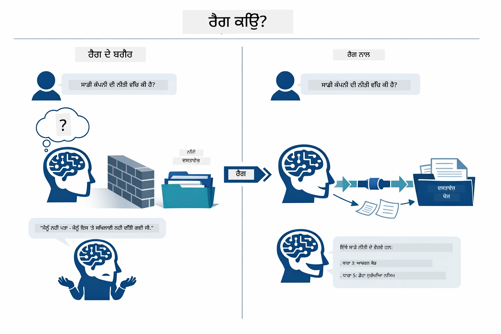

*ਇਹ ਡਾਯਾਗ੍ਰਾਮ ਇੱਕ ਸਧਾਰਣ LLM (ਜੋ ਟ੍ਰੇਨਿੰਗ ਡੇਟਾ ਵਿੱਚੋਂ ਅਨੁਮਾਨ ਲਗਾਉਂਦਾ ਹੈ) ਅਤੇ RAG-ਵਧੀਤ LLM (ਜੋ ਪਹਿਲਾਂ ਤੁਹਾਡੇ ਦਸਤਾਵੇਜ਼ਾਂ ਨੂੰ ਸਲਾਹ ਦਿੰਦਾ ਹੈ) ਵਿੱਚ ਫਰਕ ਦਿਖਾਉਂਦਾ ਹੈ।*

ਇੱਥੇ ਦੇਖੋ ਕਿ ਕਿਵੇਂ ਟੁਕੜੇ ਅੰਤ-ਅੰਤ ਕਨੈਕਟ ਹੁੰਦੇ ਹਨ। ਇੱਕ ਉਪਭੋਗਤਾ ਦਾ ਸਵਾਲ ਚਾਰ ਕਦਮਾਂ ਰਾਹੀਂ ਜਾਂਦਾ ਹੈ — ਐਮਬੈੱਡਿੰਗ, ਵੈਕਟਰ ਖੋਜ, ਸੰਦਰਭ ਇਕੱਠਾ ਕਰਨਾ, ਅਤੇ ਜਵਾਬ ਤਿਆਰ ਕਰਨਾ — ਜੋ ਹਰੇਕ ਪਿਛਲੇ 'ਤੇ ਨਿਰਭਰ ਹੁੰਦੇ ਹਨ:


*ਇਹ ਡਾਯਾਗ੍ਰਾਮ ਸੰਪੂਰਨ RAG ਪਾਈਪਲਾਈਨ ਦਿਖਾਉਂਦਾ ਹੈ — ਇੱਕ ਉਪਭੋਗਤਾ ਕਵੇਰੀ ਐਮਬੈੱਡਿੰਗ, ਵੈਕਟਰ ਖੋਜ, ਸੰਦਰਭ ਇਕੱਠਾ ਕਰਨ ਅਤੇ ਜਵಾಬ ਤਿਆਰ ਕਰਨ ਰਾਹੀਂ ਜਾਂਦਾ ਹੈ।*

ਬਾਕੀ ਇਸ ਮੋਡੀਊਲ ਵਿੱਚ ਹਰ ਕਦਮ ਦਾ ਵਿਸਥਾਰ ਨਾਲ ਵਰਣਨ ਕੀਤਾ ਗਿਆ ਹੈ, ਜਿਸ ਵਿੱਚ ਤੁਹਾਡੇ ਲਈ ਕੋਡ ਦਿੱਤਾ ਗਿਆ ਹੈ ਜੋ ਤੁਸੀਂ ਚਲਾ ਸਕਦੇ ਹੋ ਅਤੇ ਸੋਧ ਸਕਦੇ ਹੋ।

### ਇਸ ਟਿਊਟੋਰਿਅਲ ਵਿੱਚ ਕਿਹੜਾ RAG ਪਹੁੰਚ ਵਰਤੀ ਜਾਂਦੀ ਹੈ?

LangChain4j RAG ਨੂੰ ਲਾਗੂ ਕਰਨ ਲਈ ਤਿੰਨ ਢੰਗ ਦਿੰਦਾ ਹੈ, ਹਰ ਇੱਕ ਵੱਖਰੇ ਮੈਪਿੰਗ ਪੱਧਰ ਨਾਲ। ਹੇਠਾਂ ਦਿੱਤਾ ਡਾਯਾਗ੍ਰਾਮ ਉਹਨਾਂ ਦੀ ਤੁਲਨਾ ਕਰਦਾ ਹੈ:

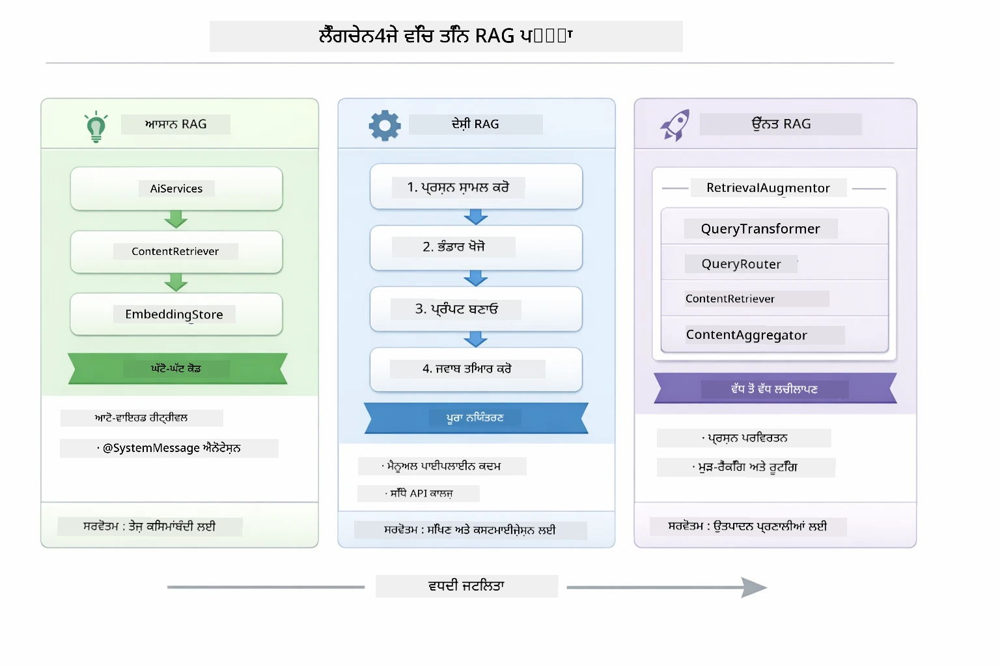

*ਇਹ ਡਾਯਾਗ੍ਰਾਮ ਤਿੰਨ LangChain4j RAG ਪਹੁੰਚਾਂ — ਆਸਾਨ, ਘਰੇਲੂ, ਅਤੇ ਉੱਚ ਪੱਧਰੀ — ਦੀ ਤੁਲਨਾ ਕਰਦਾ ਹੈ, ਉਹਨਾਂ ਦੇ ਮੁੱਖ ਹਿੱਸਿਆਂ ਅਤੇ ਵਰਤੋਂ ਲਈ ਪ੍ਰਸੰਗ ਦਿਖਾਉਂਦਾ ਹੈ।*

| ਪਹੁੰਚ | ਕੀ ਕਰਦੀ ਹੈ | ਤਜਰਬਾ |
|---|---|---|
| **ਆਸਾਨ RAG** | ਸਾਰਾ ਕੰਮ `AiServices` ਅਤੇ `ContentRetriever` ਰਾਹੀਂ ਆਪਣੇ ਆਪ ਕनेकਟ ਕਰਦਾ ਹੈ। ਤੁਸੀਂ ਇੰਟਰਫੇਸ ਨੂੰ ਐਨੋਟੇਟ ਕਰਦੇ ਹੋ, ਇੱਕ ਰਿਟਰੀਵਰ ਲਗਾਉਂਦੇ ਹੋ, ਤੇ LangChain4j ਐਮਬੈੱਡਿੰਗ, ਖੋਜ ਅਤੇ ਪ੍ਰਾਂਪਟ ਇਕੱਠਾ ਕਰਨ ਦਾ ਕੰਮ ਪਿੱਛੇ ਕਰਦਾ ਹੈ। | ਘੱਟ ਕੋਡ, ਪਰ ਹਰ ਕਦਮ ਤੇ ਕੀ ਕਿੰਝ ਹੋ ਰਿਹਾ ਹੈ ਇਹ ਨਹੀਂ ਵੇਖਦੇ। |
| **ਘਰੇਲੂ RAG** | ਤੁਸੀਂ ਆਪਣੇ ਆਪ ਐਮਬੈੱਡਿੰਗ ਮਾਡਲ ਨੂੰ ਕਾਲ ਕਰਦੇ ਹੋ, ਸਟੋਰ ਵਿੱਚ ਖੋਜ ਕਰਦੇ ਹੋ, ਪ੍ਰਾਂਪਟ ਤਿਆਰ ਕਰਦੇ ਹੋ, ਅਤੇ ਜਵਾਬ ਉਤਪੰਨ ਕਰਦੇ ਹੋ — ਹਰ ਇਕ ਕਦਮ ਵਿਸਥਾਰ ਨਾਲ। | ਵੱਧ ਕੋਡ, ਪਰ ਹਰ ਪੜਾਅ ਨੂੰ ਵੇਖਣਾ ਅਤੇ ਸੋਧਣਾ ਮੁਮਕਿਨ। |
| **ਉੱਚ ਪੱਧਰੀ RAG** | `RetrievalAugmentor` ਫਰੇਮਵਰਕ ਵਰਤਦਾ ਹੈ ਜਿਸ ਵਿੱਚ ਕਵੈਰੀ ਟ੍ਰਾਂਸਫਾਰਮਰ, ਰਾਉਟਰ, ਰੀ-ਰੈਂਕਰ, ਅਤੇ ਸਮੱਗਰੀ ਇੰਜੈਕਟਰ ਸ਼ਾਮਲ ਹਨ ਪ੍ਰੋਡਕਸ਼ਨ-ਗਰੇਡ ਪਾਈਪਲਾਈਨਾਂ ਲਈ। | ਬਹੁਤ ਲਚਕੀਲਾ, ਪਰ ਕਾਫੀ ਜਟਿਲ। |

**ਇਹ ਟਿਊਟੋਰਿਅਲ ਘਰੇਲੂ ਪਹੁੰਚ ਵਰਤਦਾ ਹੈ।** RAG ਪਾਈਪਲਾਈਨ ਦਾ ਹਰ ਕਦਮ — ਕਵੇਰੀ ਨੂੰ ਐਮਬੈੱਡ ਕਰਨਾ, ਵੈਕਟਰ ਸਟੋਰ ਖੋਜਣਾ, ਸੰਦਰਭ ਇਕੱਠਾ ਕਰਨਾ, ਅਤੇ ਜਵਾਬ ਬਣਾਉਣਾ — ਸਪੱਸ਼ਟ ਤੌਰ 'ਤੇ [`RagService.java`](../../../03-rag/src/main/java/com/example/langchain4j/rag/service/RagService.java) ਵਿੱਚ ਲਿਖਿਆ ਗਿਆ ਹੈ। ਇਹ ਜਾਣ-ਪਹਿਚਾਣ ਵਾਲਾ ਕੰਮ ਹੈ: ਇੱਕ ਸਿੱਖਣ ਵਾਲਾ ਸਰੋਤ ਹੋਣ ਕਰਕੇ, ਇਹ ਜ਼ਿਆਦਾ ਜਰੂਰੀ ਹੈ ਕਿ ਤੁਸੀਂ ਹਰ ਪੜਾਅ ਨੂੰ ਵੇਖੋ ਅਤੇ ਸਮਝੋ, ਨਾ ਕਿ ਕੋਡ ਘੱਟ ਕਰਨਾ। ਜਦੋਂ ਤੁਸੀਂ ਸਮਝ ਜਾਂਦੇ ਹੋ ਕਿ ਸਾਰੇ ਹਿੱਸੇ ਕਿਵੇਂ ਜੁੜਦੇ ਹਨ, ਤਾਂ ਤੁਸੀਂ ਤੇਜ਼ ਮਿਸ਼ਾਲਾਂ ਲਈ ਆਸਾਨ RAG ਜਾਂ ਪ੍ਰੋਡਕਸ਼ਨ ਸਿਸਟਮ ਲਈ ਉੱਚ ਪੱਧਰੀ RAG ਵਰਤ ਸਕਦੇ ਹੋ।

> **💡 ਪਹਿਲਾਂ ਹੀ ਆਸਾਨ RAG ਵੇਖਿਆ ਹੈ?** [ਤੀਜ਼ ਸ਼ੁਰੂਆਤ ਮੋਡੀਊਲ](../00-quick-start/README.md) ਵਿੱਚ ਇੱਕ ਦਸਤਾਵੇਜ਼ Q&A ਉਦਾਹਰਨ ([`SimpleReaderDemo.java`](../../../00-quick-start/src/main/java/com/example/langchain4j/quickstart/SimpleReaderDemo.java)) ਹੈ ਜੋ ਆਸਾਨ RAG ਪਹੁੰਚ ਵਰਤਦਾ ਹੈ — LangChain4j ਆਪਣੇ ਆਪ ਐਮਬੈੱਡਿੰਗ, ਖੋਜ, ਅਤੇ ਪ੍ਰਾਂਪਟ ਇਕੱਠਾ ਕਰਦਾ ਹੈ। ਇਹ ਮੋਡੀਊਲ ਉਸ ਪਾਈਪਲਾਈਨ ਨੂੰ ਖੋਲ੍ਹ ਕੇ ਦਿਖਾਉਂਦਾ ਹੈ ਤਾਂ ਜੋ ਤੁਸੀਂ ਹਰ ਪੜਾਅ ਨੂੰ ਦੇਖ ਸਕੋ ਅਤੇ ਕਾਬੂ ਕਰ ਸਕੋ।

ਹੇਠਾਂ ਦਿੱਤਾ ਡਾਇਗ੍ਰਾਮ ਉਸ ਆਸਾਨ RAG ਪਾਈਪਲਾਈਨ ਨੂੰ ਦਿਖਾਉਂਦਾ ਜੋ ਤੇਜ਼ ਸ਼ੁਰੂਆਤ ਦੇ ਉਦਾਹਰਨ ਵਿਚ ਵਰਤਿਆ ਗਿਆ ਸੀ। ਧਿਆਨ ਦਿਓ ਕਿ `AiServices` ਅਤੇ `EmbeddingStoreContentRetriever` ਸਾਰੀ ਜਟਿਲਤਾ ਲੁਕਾਉਂਦੇ ਹਨ — ਤੁਸੀਂ ਦਸਤਾਵੇਜ਼ ਲੋਡ ਕਰਦੇ ਹੋ, ਰਿਟਰੀਵਰ ਲਗਾਉਂਦੇ ਹੋ, ਅਤੇ ਜਵਾਬ ਪ੍ਰਾਪਤ ਕਰਦੇ ਹੋ। ਇਸ ਮੋਡੀਊਲ ਵਿੱਚ ਘਰੇਲੂ ਪਹੁੰਚ ਉਹਨਾਂ ਲੁਕੇ ਹੋਏ ਕਦਮਾਂ ਨੂੰ ਖੋਲ੍ਹਦਾ ਹੈ:

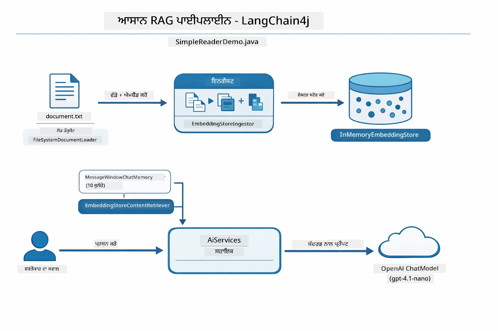

*ਇਹ ਡਾਇਗ੍ਰਾਮ `SimpleReaderDemo.java` ਤੋਂ ਆਸਾਨ RAG ਪਾਈਪਲਾਈਨ ਦਿਖਾਉਂਦਾ ਹੈ। ਇਸ ਨੂੰ ਘਰੇਲੂ ਪਹੁੰਚ ਨਾਲ ਤੁਲਨਾ ਕਰੋ ਜੋ ਇਸ ਮੋਡੀਊਲ ਵਿੱਚ ਵਰਤੀ ਜਾਂਦੀ ਹੈ: ਆਸਾਨ RAG ਐਮਬੈੱਡਿੰਗ, ਰਿਟਰੀਵਲ, ਅਤੇ ਪ੍ਰਾਂਪਟ ਇਕੱਠਾ ਕਰਨ ਨੂੰ `AiServices` ਅਤੇ `ContentRetriever` ਦੇ ਪਿੱਛੇ ਲੁਕਾ ਦਿੰਦਾ ਹੈ — ਤੁਸੀਂ ਦਸਤਾਵੇਜ਼ ਲੋਡ ਕਰਦੇ ਹੋ, ਰਿਟਰੀਵਰ ਲਗਾਉਂਦੇ ਹੋ, ਅਤੇ ਜਵਾਬ ਲੈਂਦੇ ਹੋ। ਘਰੇਲੂ ਪਹੁੰਚ ਉਹ ਪਾਈਪਲਾਈਨ ਖੋਲ੍ਹ ਕੇ ਹਰ ਕਦਮ (ਐਮਬੈੱਡ ਕਰਨ, ਖੋਜ ਕਰਨ, ਸੰਦਰਭ ਇਕੱਠਾ ਕਰਨ, ਜਨਰੇਟ ਕਰਨ) ਨੂੰ ਆਪਣੇ ਆਪ ਕਾਲ ਕਰਦਾ ਹੈ, ਤੁਹਾਨੂੰ ਪੂਰੀ ਨਜ਼ਰ ਅਤੇ ਕਾਬੂ ਦਿੰਦਾ ਹੈ।*

## ਇਹ ਕਿਵੇਂ ਕੰਮ ਕਰਦਾ ਹੈ

ਇਸ ਮੋਡੀਊਲ ਵਿੱਚ RAG ਪਾਈਪਲਾਈਨ ਚਾਰ ਕਦਮਾਂ ਵਿੱਚ ਵੰਡਿਆ ਗਿਆ ਹੈ ਜੋ ਹਰ ਵਾਰੀ ਉਪਭੋਗਤਾ ਸਵਾਲ ਪੁੱਛਣ ਤੇ ਇਕ-ਇਕ ਕਰਕੇ ਚੱਲਦੇ ਹਨ। ਪਹਿਲਾਂ, ਅਪਲੋਡ ਕੀਤਾ ਦਸਤਾਵੇਜ਼ **ਪਾਰਸ ਅਤੇ ਚੰਕ ਕੀਤਾ** ਜਾਂਦਾ ਹੈ ਜੋ ਸੰਭਾਲਣ ਯੋਗ ਹਿੱਸਿਆਂ ਵਿੱਚ ਵੰਡਦਾ ਹੈ। ਫਿਰ ਉਹ ਟੁਕੜੇ **ਵੈਕਟਰ ਐਮਬੈੱਡਿੰਗ** ਵਿੱਚ ਬਦਲ ਕੇ ਸਟੋਰ ਕੀਤੇ ਜਾਂਦੇ ਹਨ ਤਾਂ ਜੋ ਉਹਨਾਂ ਦੀ ਗਣਿਤੀਕ ਤੁਲਨਾ ਕੀਤੀ ਜਾ ਸਕੇ। ਜਦੋਂ ਕੋਈ ਕਵੇਰੀ ਆਉਂਦੀ ਹੈ, ਸਿਸਟਮ ਸਭ ਤੋਂ ਸੰਬੰਧਿਤ ਟੁਕੜੇ ਲੱਭਣ ਲਈ **ਸੇਮੈਂਟਿਕ ਖੋਜ** ਕਰਦਾ ਹੈ, ਅਤੇ ਆਖਰ ਵਿੱਚ ਉਹਨਾਂ ਨੂੰ ਸੰਦਰਭ ਵਜੋਂ LLM ਨੂੰ **ਜਵਾਬ ਤਿਆਰ ਕਰਨ** ਲਈ ਦੇ ਦਿੰਦਾ ਹੈ। ਹੇਠਾਂ ਦਿੱਤੇ ਅਧਿਆਇ ਵਿੱਚ ਹਰ ਕਦਮ ਦੀ ਵਿਆਖਿਆ ਹੈ, ਕੋਡ ਅਤੇ ਡਾਇਗ੍ਰਾਮ ਸਮੇਤ। ਆਓ ਪਹਿਲਾ ਕਦਮ ਵੇਖੀਏ।

### ਦਸਤਾਵੇਜ਼ ਪ੍ਰਕਿਰਿਆ

[DocumentService.java](../../../03-rag/src/main/java/com/example/langchain4j/rag/service/DocumentService.java)

ਜਦੋਂ ਤੁਸੀਂ ਦਸਤਾਵੇਜ਼ ਅਪਲੋਡ ਕਰਦੇ ਹੋ, ਸਿਸਟਮ ਇਸਨੂੰ ਪਾਰਸ ਕਰਦਾ ਹੈ (PDF ਜਾਂ ਸਧਾਰਣ ਟੈਕਸਟ), ਫਾਇਲ ਨਾਂ ਵਰਗਾ ਮੈਟਾਡੇਟਾ ਜੋੜਦਾ ਹੈ, ਅਤੇ ਫਿਰ ਇਸਨੂੰ ਛੋਟੇ-ਛੋਟੇ ਟੁਕੜਿਆਂ ਵਿੱਚ ਵੰਡਦਾ ਹੈ — ਉਹ ਟੁਕੜੇ ਮਾਡਲ ਦੀ ਸੰਦਰਭ ਵਿੰਡੋ ਵਿੱਚ ਆਰਾਮਦਾਇਕ ਬੈਠਦੇ ਹਨ। ਇਹ ਟੁਕੜੇ ਹਲਕੇ ਨਾਲ ਆਪਸੀ ਓਵਰਲੈਪ ਕਰਦੇ ਹਨ ਤਾਂ ਜੋ ਸੰਦਰਭ ਬਾਊਂਡਰੀ ਤੇ ਨਾ ਗੁੰਮ ਹੋਵੇ।

```java
// ਅਪਲੋਡ ਕੀਤੀ ਫਾਇਲ ਨੂੰ ਪਾਰਸ ਕਰੋ ਅਤੇ ਇਸ ਨੂੰ ਇਕ LangChain4j ਡੌਕਯੂਮੈਂਟ ਵਿੱਚ ਲਪੇਟੋ
Document document = Document.from(content, metadata);

// 300-ਟੋਕਨ ਹਿੱਸਿਆਂ ਵਿੱਚ ਵੰਡੋ ਜਿਸ ਵਿੱਚ 30-ਟੋਕਨ ਦਾ ਓਵਰਲੈਪ ਹੋਵੇ
DocumentSplitter splitter = DocumentSplitters
    .recursive(300, 30);

List<TextSegment> segments = splitter.split(document);
```
  
ਹੇਠਾਂ ਦਿੱਤਾ ਡਾਇਗ੍ਰਾਮ ਇਹ ਵਿਜ਼ੂਅਲ ਤੌਰ ਤੇ ਦਿਖਾਉਂਦਾ ਹੈ ਕਿ ਜਿਵੇਂ ਹਰ ਟੁਕੜਾ ਆਪਣੇ ਗੁਆਂਢੀਆਂ ਨਾਲ ਕੁਝ ਟੋਕਨ ਸਾਂਝੇ ਕਰਦਾ ਹੈ - 30-ਟੋਕਨ ਓਵਰਲੈਪ ਇਹ ਯਕੀਨੀ ਬਣਾਉਂਦਾ ਹੈ ਕਿ ਕੋਈ ਮਹੱਤਵਪੂਰਕ ਸੰਦਰਭ ਦਰਾਰ ਵਿੱਚ ਨਾ ਜਾਵੇ:

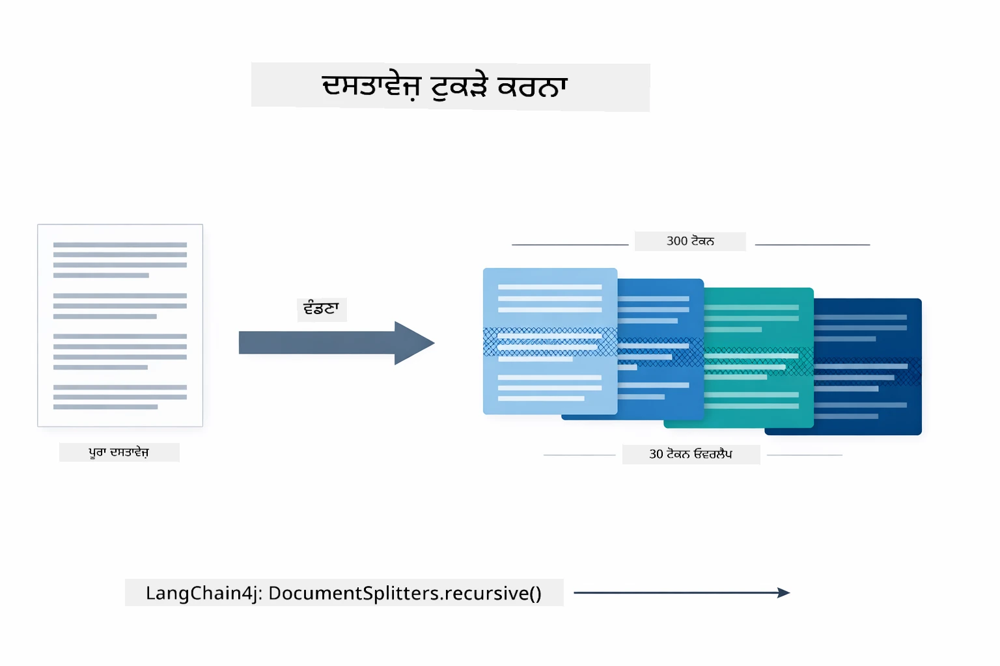

*ਇਹ ਡਾਇਗ੍ਰਾਮ ਇੱਕ ਦਸਤਾਵੇਜ਼ ਨੂੰ 300-ਟੋਕਨ ਚੰਕਾਂ ਵਿੱਚ ਵੰਡਦਾ ਹੈ ਜਿਸ ਵਿੱਚ 30-ਟੋਕਨ ਓਵਰਲੈਪ ਹੁੰਦਾ ਹੈ, ਚੰਕ ਬਾਊਂਡਰੀ ਦੇ ਨੇੜੇ ਸੰਦਰਭ ਨੂੰ ਸੁਰੱਖਿਅਤ ਕਰਦਾ ਹੈ।*

> **🤖 [GitHub Copilot](https://github.com/features/copilot) ਚੈਟ ਨਾਲ ਕੋਸ਼ਿਸ਼ ਕਰੋ:** [`DocumentService.java`](../../../03-rag/src/main/java/com/example/langchain4j/rag/service/DocumentService.java) ਖੋਲ੍ਹੋ ਅਤੇ ਪੁੱਛੋ:  
> - "LangChain4j ਦਸਤਾਵੇਜ਼ਾਂ ਨੂੰ ਕਿਵੇਂ ਚੰਕ ਕਰਦਾ ਹੈ ਅਤੇ ਓਵਰਲੈਪ ਕਿਉਂ ਮਹੱਤਵਪੂਰਕ ਹੈ?"  
> - "ਵੱਖ-ਵੱਖ ਦਸਤਾਵੇਜ਼ ਕਿਸਮਾਂ ਲਈ ਸਭ ਤੋਂ ਵਧੀਆ ਚੰਕ ਸਾਈਜ਼ ਕੀ ਹੈ ਅਤੇ ਕਿਉਂ?"  
> - "ਮੈਂ ਕਈ ਭਾਸ਼ਾਵਾਂ ਜਾਂ ਖਾਸ ਫਾਰਮੈਟਿੰਗ ਵਾਲੇ ਦਸਤਾਵੇਜ਼ਾਂ ਨੂੰ ਕਿਵੇਂ ਸੰਭਾਲਾਂ?"

### ਐਮਬੈੱਡਿੰਗ ਬਣਾਉਣਾ

[LangChainRagConfig.java](../../../03-rag/src/main/java/com/example/langchain4j/rag/config/LangChainRagConfig.java)

ਹਰ ਚੰਕ ਨੂੰ ਇੱਕ ਗਿਣਤੀਮਾਤਰ ਪ੍ਰਤੀਨਿਧিত্ব ਵਿੱਚ ਬਦਲਿਆ ਜਾਂਦਾ ਹੈ ਜਿਸਨੂੰ ਐਮਬੈੱਡਿੰਗ ਕਹਿੰਦੇ ਹਨ — ਅਰਥਾਤ ਅਰਥ ਤੋਂ ਗਿਣਤੀ 'ਚ ਬਦਲਣ ਵਾਲਾ। ਐਮਬੈੱਡਿੰਗ ਮਾਡਲ "ਸਮਝਦਾਰ" (ਚੈਟ ਮਾਡਲ ਵਰਗਾ) ਨਹੀਂ ਹੁੰਦਾ; ਇਹ ਹਦਾਇਤਾਂ ਦਾ ਪਾਲਣ ਨਹੀਂ ਕਰਦਾ, ਸੂਝ-ਬੂਝ ਨਹੀਂ ਕਰਦਾ, ਨਾ ਸਵਾਲਾਂ ਦੇ ਜਵਾਬ ਦਿੰਦਾ ਹੈ। ਇਹ ਸਿਰਫ ਲਿਖਤ ਨੂੰ ਇੱਕ ਗਣਿਤੀਈ ਸਪੇਸ ਵਿੱਚ ਨਕਸ਼ਾ ਬਣਾਉਂਦਾ ਹੈ ਜਿੱਥੇ ਮਿਲਦੇ-ਜੁਲਦੇ ਅਰਥ ਨੇੜੇ-ਨੇੜੇ ਪੈਂਦੇ ਹਨ — "ਕਾਰ" "ਆਟੋਮੋਬਾਈਲ" ਕੋਲ, "ਵਾਪਸੀ ਨੀਤੀ" "ਮੇਰੇ ਪੈਸੇ ਵਾਪਸ" ਕੋਲ। ਟਿੱਪਣੀ ਮਾਡਲ ਇੱਕ ਬੰਦੇ ਵਾਂਗ ਹੈ ਜਿਸ ਨਾਲ ਤੁਸੀਂ ਗੱਲਬਾਤ ਕਰ ਸਕਦੇ ਹੋ; ਐਮਬੈੱਡਿੰਗ ਮਾਡਲ ਵਧੀਆ ਫਾਇਲਿੰਗ ਸਿਸਟਮ ਹੈ।

ਹੇਠਾਂ ਦਿੱਤਾ ਡਾਇਗ੍ਰਾਮ ਇਹ ਧਾਰਨਾ ਵਿਜ਼ੂਅਲਾਈਜ਼ ਕਰਦਾ ਹੈ — ਟੈਕਸਟ ਇੱਜ਼ਤ ਕੀਤਾ ਜਾਂਦਾ ਹੈ, ਗਿਣਤੀਮਾਤਰ ਵੈਕਟਰ ਵੱਢੇ ਜਾਂਦੇ ਹਨ, ਅਤੇ ਵਧਦੇ ਅਰਥ ਨੇੜਲੇ ਵੈਕਟਰ ਬਣਾਉਂਦੇ ਹਨ:

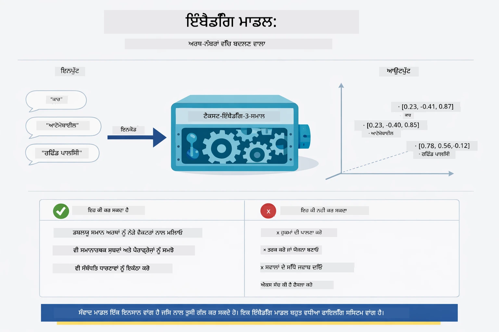

*ਇਹ ਡਾਇਗ੍ਰਾਮ ਦਿਖਾਉਂਦਾ ਹੈ ਕਿ ਇੱਕ ਐਮਬੈੱਡਿੰਗ ਮਾਡਲ ਕਿਵੇਂ ਟੈਕਸਟ ਨੂੰ ਗਿਣਤੀਮਾਤਰ ਵੈਕਟਰਾਂ ਵਿੱਚ ਬਦਲਦਾ ਹੈ, ਜਿੱਥੇ ਮਿਲਦੇ-ਜੁਲਦੇ ਅਰਥ — ਜਿਵੇਂ "ਕਾਰ" ਅਤੇ "ਆਟੋਮੋਬਾਈਲ" — ਨੇੜਲੇ ਰਹਿੰਦੇ ਹਨ।*

```java
@Bean
public EmbeddingModel embeddingModel() {
    return OpenAiOfficialEmbeddingModel.builder()
        .baseUrl(azureOpenAiEndpoint)
        .apiKey(azureOpenAiKey)
        .modelName(azureEmbeddingDeploymentName)
        .build();
}

EmbeddingStore<TextSegment> embeddingStore = 
    new InMemoryEmbeddingStore<>();
```
  
ਹੇਠਾਂ ਦਿੱਤੇ ਕਲਾਸ ਡਾਇਗ੍ਰਾਮ ਵਿੱਚ RAG ਪਾਈਪਲਾਈਨ ਦੇ ਦੋ ਵੱਖਰੇ ਪ੍ਰਵਾਹਾਂ ਅਤੇ LangChain4j ਕਲਾਸਾਂ ਨੂੰ ਦਿਖਾਇਆ ਗਿਆ ਹੈ ਜੋ ਉਹਨਾਂ ਨੂੰ ਲਾਗੂ ਕਰਦੀਆਂ ਹਨ। **ਇੰਗੈਸ਼ਨ ਪ੍ਰਵਾਹ** (ਅਪਲੋਡ ਵੇਲੇ ਇੱਕ ਵਾਰੀ ਚੱਲਦਾ ਹੈ) ਦਸਤਾਵੇਜ਼ ਨੂੰ ਵੰਡਦਾ ਹੈ, ਚੰਕਾਂ ਨੂੰ ਐਮਬੈੱਡ ਕਰਦਾ ਹੈ ਅਤੇ `.addAll()` ਰਾਹੀਂ ਸਟੋਰ ਕਰਦਾ ਹੈ। **ਕਵੇਰੀ ਪ੍ਰਵਾਹ** (ਹਰ ਵਾਰੀ ਉਪਭੋਗਤਾ ਪੁੱਛਦਾ ਹੈ) ਸਵਾਲ ਨੂੰ ਐਮਬੈੱਡ ਕਰਦਾ ਹੈ, `.search()` ਰਾਹੀਂ ਸਟੋਰ ਵਿੱਚ ਖੋਜ ਕਰਦਾ ਹੈ, ਅਤੇ ਮਿਲਦੇ ਸੰਦਰਭ ਨੂੰ ਚੈਟ ਮਾਡਲ ਨੂੰ ਪਾਸ ਕਰਦਾ ਹੈ। ਦੋਹਾਂ ਪ੍ਰਵਾਹਾਂ ਦਾ ਮਿਲਣ ਬਿੰਦੂ ਸਾਂਝਾ `EmbeddingStore<TextSegment>` ਇੰਟਰਫੇਸ ਹੈ:

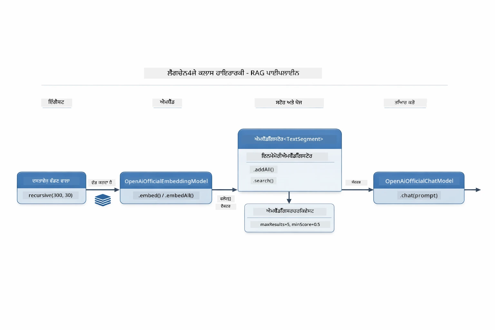

*ਇਹ ਡਾਇਗ੍ਰਾਮ RAG ਪਾਈਪਲਾਈਨ ਦੇ ਦੋ ਪ੍ਰਵਾਹ — ਇੰਗੈਸ਼ਨ ਅਤੇ ਕਵੇਰੀ — ਅਤੇ ਉਹਨਾਂ ਦੇ ਮਿਲਣ ਬਿੰਦੂ EmbeddingStore ਨੂੰ ਦਿਖਾਉਂਦਾ ਹੈ।*

ਜਦੋਂ ਐਮਬੈੱਡਿੰਗ ਸਟੋਰ ਕੀਤੇ ਜਾਂਦੇ ਹਨ, ਤਾਂ ਮਿਲਦੇ ਸੰਦਰਭ ਆਟੋਮੈਟਿਕ ਤੌਰ 'ਤੇ ਵੈਕਟਰ ਸਪੇਸ ਵਿੱਚ ਇਕੱਠੇ ਹੋ ਜਾਂਦੇ ਹਨ। ਹੇਠਾਂ ਦਿੱਤੀ ਵਿਜ਼ੂਅਲਾਈਜ਼ੇਸ਼ਨ ਦਿਖਾਉਂਦੀ ਹੈ ਕਿ ਵੱਖ-ਵੱਖ ਵਿਸ਼ਿਆਂ ਦੇ ਦਸਤਾਵੇਜ਼ ਨੇੜਲੇ ਬਿੰਦੂਆਂ ਵਾਂਗ ਬਣਦੇ ਹਨ, ਜੋ ਸੇਮੈਂਟਿਕ ਖੋਜ ਨੂੰ ਸੰਭਵ ਬਣਾਉਂਦਾ ਹੈ:


*ਇਹ ਵਿਜ਼ੂਅਲੀਜ਼ੇਸ਼ਨ ਦਿਖਾਉਂਦਾ ਹੈ ਕਿ ਸੰਬੰਧਿਤ ਦਸਤਾਵੇਜ਼ 3D ਵੈਕਟਰ ਸਪੇਸ ਵਿੱਚ ਇੱਕੱਠੇ ਕਿਵੇਂ ਕਲੱਸਟਰ ਕਰਦੇ ਹਨ, ਅਤੇ ਤਕਨੀਕੀ ਡੌਕਸ, ਵਪਾਰ ਨਿਯਮ, ਅਤੇ FAQ ਵਾਂਗ ਵਿਸ਼ਿਆਂ ਦੇ ਵੱਖਰੇ ਗਰੁੱਪ ਬਣਦੇ ਹਨ।*

ਜਦੋਂ ਉਪਭੋਗਤਾ ਖੋਜ ਕਰਦਾ ਹੈ, ਸਿਸਟਮ ਚਾਰ ਕਦਮ ਲੈਂਦਾ ਹੈ: ਦਸਤਾਵੇਜ਼ਾਂ ਨੂੰ ਇੱਕ ਵਾਰੀ ਐਮਬੈੱਡ ਕਰਨਾ, ਹਰ ਖੋਜ ਤੇ ਕਵੇਰੀ ਨੂੰ ਐਮਬੈੱਡ ਕਰਨਾ, ਸਾਰੇ ਸਟੋਰ ਕੀਤੇ ਵੈਕਟਰਾਂ ਨਾਲ ਕਵੇਰੀ ਵੈਕਟਰ ਦੀ ਕੋਸਾਈਨ ਸਮਾਨਤਾ ਨਾਲ ਤੁਲਨਾ ਕਰਨਾ, ਅਤੇ ਸਭ ਤੋਂ ਉੱਚੇ ਸਕੋਰ ਵਾਲੇ ਕ-ਟੁਕੜੇ ਵਾਪਸ ਕਰਨਾ। ਹੇਠਾਂ ਦਿੱਤਾ ਡਾਇਗ੍ਰਾਮ ਹਰ ਕਦਮ ਅਤੇ ਜੁੜੀਆਂ LangChain4j ਕਲਾਸਾਂ ਨੂੰ ਵਿਸਥਾਰ ਨਾਲ ਦਿਖਾਉਂਦਾ ਹੈ:

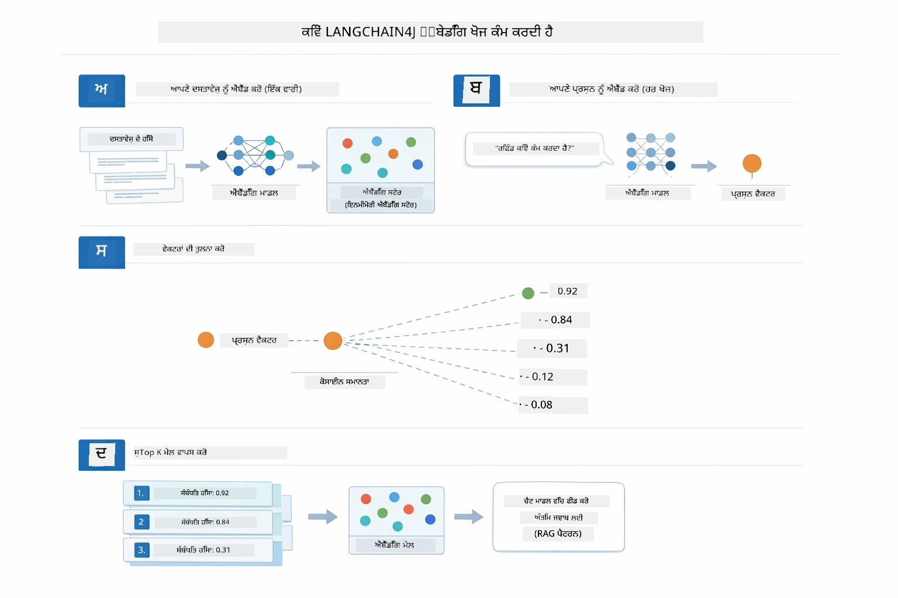

*ਇਹ ਡਾਇਗ੍ਰਾਮ ਚਾਰ ਕਦਮਾਂ ਵਾਲੀ ਐਮਬੈੱਡਿੰਗ ਖੋਜ ਪ੍ਰਕਿਰਿਆ ਦਿਖਾਉਂਦਾ ਹੈ: ਦਸਤਾਵੇਜ਼ ਐਮਬੈੱਡ ਕਰੋ, ਕਵੇਰੀ ਐਮਬੈੱਡ ਕਰੋ, ਵੈਕਟਰਾਂ ਦੀ ਕੋਸਾਈਨ ਸਮਾਨਤਾ ਨਾਲ ਤੁਲਨਾ ਕਰੋ, ਅਤੇ ਊਪਰੀ K ਨਤੀਜਿਆਂ ਨੂੰ ਵਾਪਸ ਕਰੋ।*

### ਸੇਮੈਂਟਿਕ ਖੋਜ

[RagService.java](../../../03-rag/src/main/java/com/example/langchain4j/rag/service/RagService.java)

ਜਦੋਂ ਤੁਸੀਂ ਸਵਾਲ ਪੁੱਛਦੇ ਹੋ, ਤੁਹਾਡਾ ਸਵਾਲ ਵੀ ਐਮਬੈੱਡਿੰਗ ਵਿੱਚ ਬਦਲ ਜਾਂਦਾ ਹੈ। ਸਿਸਟਮ ਤੁਹਾਡੇ ਸਵਾਲ ਦੀ ਐਮਬੈੱਡਿੰਗ ਨੂੰ ਸਾਰੇ ਦਸਤਾਵੇਜ਼ ਚੰਕਾਂ ਦੀਆਂ ਐਮਬੈੱਡਿੰਗ ਨਾਲ ਤੁਲਨਾ ਕਰਦਾ ਹੈ। ਇਹ ਚੰਕ ਲੱਭਦਾ ਹੈ ਜਿੰਨ੍ਹਾਂ ਦੇ ਅਰਥ ਸਭ ਤੋਂ ਵੱਧ ਮਿਲਦੇ ਹਨ - ਸਿਰਫ਼ ਕੀਵਰਡ ਮੇਲ ਰਾਖਣ ਜਾਂ ਇੱਕੋ ਸ਼ਬਦਾਂ ਤੇ ਅਧਾਰਿਤ ਨਹੀਂ, ਪਰ ਅਸਲ ਸੇਮੈਂਟਿਕ ਸਮਾਨਤਾ ਨਾਲ।  

```java
Embedding queryEmbedding = embeddingModel.embed(question).content();

EmbeddingSearchRequest searchRequest = EmbeddingSearchRequest.builder()
    .queryEmbedding(queryEmbedding)
    .maxResults(5)
    .minScore(0.5)
    .build();

EmbeddingSearchResult<TextSegment> searchResult = embeddingStore.search(searchRequest);
List<EmbeddingMatch<TextSegment>> matches = searchResult.matches();

for (EmbeddingMatch<TextSegment> match : matches) {
    String relevantText = match.embedded().text();
    double score = match.score();
}
```
  
ਹੇਠਾਂ ਦਿੱਤਾ ਡਾਇਗ੍ਰਾਮ ਸੇਮੈਂਟਿਕ ਖੋਜ ਨੂੰ ਰਵਾਇਤੀ ਕੀਵਰਡ ਖੋਜ ਨਾਲ ਤੁਲਨਾ ਕਰਦਾ ਹੈ। "ਵਾਹਨ" ਲਈ ਕੀਵਰਡ ਖੋਜ "ਕਾਰਾਂ ਅਤੇ ਟਰੱਕਾਂ" ਬਾਰੇ ਚੰਕ ਨਹੀਂ ਲੱਭਦੀ, ਪਰ ਸੇਮੈਂਟਿਕ ਖੋਜ ਸਮਝਦੀ ਹੈ ਕਿ ਦੋਵਾਂ ਦਾ ਅਰਥ ਇੱਕੋ ਹੈ ਅਤੇ ਇਸਨੂੰ ਉੱਚ ਸਕੋਰ ਵਾਲਾ ਮਿਲਦੇ ਜੁਲਦੇ ਕੇਸ ਵਜੋਂ ਦਿਖਾਉਂਦੀ ਹੈ:

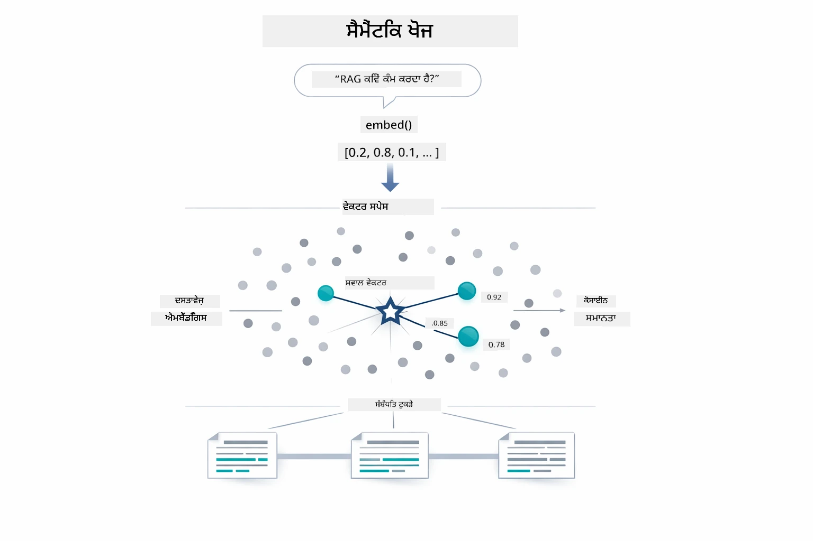

*ਇਹ ਡਾਇਗ੍ਰਾਮ ਕੀਵਰਡ-ਆਧਾਰਿਤ ਖੋਜ ਅਤੇ ਸੇਮੈਂਟਿਕ ਖੋਜ ਦੀ ਤੁਲਨਾ ਕਰਦਾ ਹੈ, ਦਿਖਾਉਂਦਾ ਹੈ ਕਿ ਸੇਮੈਂਟਿਕ ਖੋਜ ਕਿਵੇਂ ਖ਼ਾਸ ਸ਼ਬਦਾਂ ਤੋਂ ਬਿਨਾਂ ਸੰਕਲਪਕ ਮੁਆਫਿਖ ਸਮੱਗਰੀ ਪ੍ਰਦਾਨ ਕਰਦਾ ਹੈ।*
ਹੇਠਾਂ, ਸਮਾਨਤਾ ਦਾ ਮਾਪਣ ਕੋਸਾਈਨ ਸਮਾਨਤਾ (cosine similarity) ਦੀ ਵਰਤੋਂ ਕਰਕੇ ਕੀਤਾ ਜਾਂਦਾ ਹੈ — ਮੁੱਖ ਰੂਪ ਵਿੱਚ ਇਹ ਪੁੱਛਦਾ ਹੈ "ਕੀ ਇਹ ਦੋ ਤੀਰ ਇੱਕੋ ਦਿਸ਼ਾ ਵੱਲ ਇشارة ਕਰ ਰਹੇ ਹਨ?" ਦੋ ਟੁਕੜੇ ਬਿਲਕੁਲ ਵੱਖ-ਵੱਖ ਸ਼ਬਦ ਵਰਤ ਸਕਦੇ ਹਨ, ਪਰ ਜੇ ਉਹਨਾਂ ਦਾ ਅਰਥ ਇੱਕੋ ਹੈ ਤਾਂ ਉਹਨਾਂ ਦੇ ਵੇਕਟਰ ਇੱਕੋ ਤਰ੍ਹਾਂ ਇشارة ਕਰਦੇ ਹਨ ਅਤੇ ਸਕੋਰ 1.0 ਦੇ ਨੇੜੇ ਹੁੰਦਾ ਹੈ:

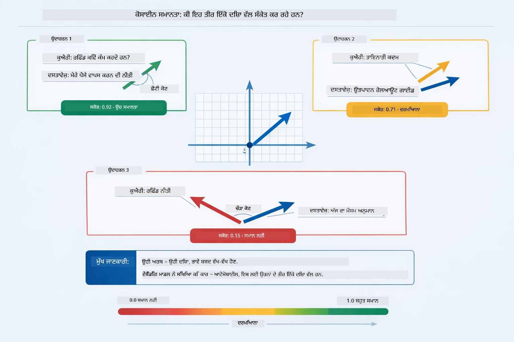

*ਇਹ ਆਕਰਸ਼ਣ ਵੇਕਟਰਾਂ ਦਰਮਿਆਨ ਕੋਸਾਈਨ ਸਮਾਨਤਾ ਨੂੰ ਦਰਸਾਉਂਦਾ ਹੈ — ਜਿੰਨੇ ਜ਼ਿਆਦਾ ਕਨੈਕਟਡ ਵੇਕਟਰ ਹੋਣਗੇ ਉਨ੍ਹਾਂ ਦਾ ਸਕੋਰ 1.0 ਦੇ ਨੇੜੇ ਹੋਵੇਗਾ, ਜੋ ਵੱਧ ਸੰਵੇਦਨਾਤਮਕ ਸਮਾਨਤਾ ਦਰਸਾਉਂਦਾ ਹੈ।*

> **🤖 [GitHub Copilot](https://github.com/features/copilot) ਚੈਟ ਨਾਲ ਕੋਸ਼ਿਸ਼ ਕਰੋ:** ਖੋਲ੍ਹੋ [`RagService.java`](../../../03-rag/src/main/java/com/example/langchain4j/rag/service/RagService.java) ਅਤੇ ਪੁੱਛੋ:
> - "ਐਮਬੈਡਿੰਗਜ਼ ਨਾਲ ਸਮਾਨਤਾ ਖੋਜ ਕਿਵੇਂ ਕੰਮ ਕਰਦੀ ਹੈ ਅਤੇ ਕੀ ਤੈਅ ਕਰਦਾ ਹੈ ਸਕੋਰ?"
> - "ਕਿਹੜਾ ਸਮਾਨਤਾ ਸੀਮਾ ਮੈਂ ਵਰਤਾਂ ਅਤੇ ਇਹ ਨਤੀਜੇ ਨੂੰ ਕਿਵੇਂ ਪ੍ਰਭਾਵਿਤ ਕਰਦੀ ਹੈ?"
> - "ਜਦੋਂ ਕੋਈ ਸੰਬੰਧਿਤ ਦਸਤਾਵੇਜ਼ ਨਹੀਂ ਮਿਲਦਾ ਤਾਂ ਮੈਂ ਕਿਵੇਂ ਨਿਪਟਾਰਾ ਕਰਾਂ?"

### ਜਵਾਬ ਜਨਰੇਸ਼ਨ

[RagService.java](../../../03-rag/src/main/java/com/example/langchain4j/rag/service/RagService.java)

ਸਭ ਤੋਂ ਸੰਬੰਧਿਤ ਟੁਕੜੇ ਇੱਕ ਸੰਰਚਿਤ ਪ੍ਰਾਂਪਟ ਵਿੱਚ ਜੋੜੇ ਜਾਂਦੇ ਹਨ ਜਿਸ ਵਿੱਚ ਸਪਸ਼ਟ ਹੁਕਮ, ਪ੍ਰਾਪਤ ਸੰਦਰਭ, ਅਤੇ ਯੂਜ਼ਰ ਦਾ ਸਵਾਲ ਸ਼ਾਮਲ ਹੁੰਦਾ ਹੈ। ਮਾਡਲ ਉਹ ਖਾਸ ਟੁਕੜੇ ਪੜ੍ਹਦਾ ਹੈ ਅਤੇ ਉਸ ਜਾਣਕਾਰੀ ਦੇ ਅਧਾਰ 'ਤੇ ਜਵਾਬ ਦਿੰਦਾ ਹੈ — ਇਹ ਸਿਰਫ਼ ਉਸ ਆਗੇ ਮੌਜੂਦ ਚੀਜ਼ਾਂ ਦੀ ਵਰਤੋਂ ਕਰ ਸਕਦਾ ਹੈ, ਜੋ ਹਲੂਸੀਨੇਸ਼ਨ ਨੂੰ ਰੋਕਦਾ ਹੈ।

```java
String context = matches.stream()
    .map(match -> match.embedded().text())
    .collect(Collectors.joining("\n\n"));

String prompt = String.format("""
    Answer the question based on the following context.
    If the answer cannot be found in the context, say so.

    Context:
    %s

    Question: %s

    Answer:""", context, request.question());

String answer = chatModel.chat(prompt);
```

ਹੇਠਾਂ ਦਿੱਤੀ ਆਕਰਸ਼ਣ ਇਹ ਕਾਰਜ ਦਰਸਾਉਂਦੀ ਹੈ — ਖੋਜ ਕਦਮ ਤੋਂ ਸਭ ਤੋਂ ਉੱਚਾ ਸਕੋਰ ਪ੍ਰਾਪਤ ਟੁਕੜੇ ਪ੍ਰਾਂਪਟ ਟੈਮਪਲੇਟ ਵਿੱਚ ਡਾਲੇ ਜਾਂਦੇ ਹਨ, ਅਤੇ `OpenAiOfficialChatModel` ਮੂਲ ਸਟੇਟ ਵਾਲਾ ਜਵਾਬ ਤਿਆਰ ਕਰਦਾ ਹੈ:

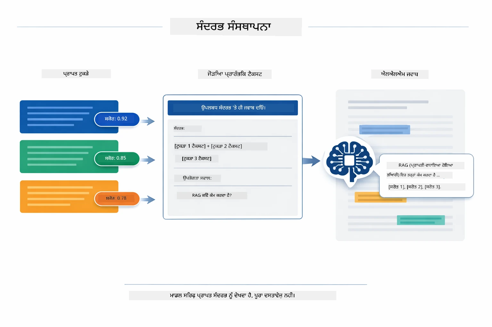

*ਇਹ ਆਕਰਸ਼ਣ ਦਿਖਾਉਂਦੀ ਹੈ ਕਿ ਕਿਵੇਂ ਸਭ ਤੋਂ ਉੱਚੇ ਸਕੋਰ ਵਾਲੇ ਟੁਕੜੇ ਇੱਕ ਸੰਰਚਿਤ ਪ੍ਰਾਂਪਟ ਵਿੱਚ ਜੋੜੇ ਜਾਂਦੇ ਹਨ, ਜਿਸ ਨਾਲ ਮਾਡਲ ਤੁਹਾਡੇ ਡੇਟਾ ਤੋਂ ਇੱਕ ਮੂਲ ਸਟੇਟ ਵਾਲਾ ਜਵਾਬ ਤਿਆਰ ਕਰ ਸਕਦਾ ਹੈ।*

## ਐਪਲੀਕੇਸ਼ਨ ਚਲਾਓ

**ਡਿਪਲੋਇਮੈਂਟ ਦੀ ਪੁਸ਼ਟੀ ਕਰੋ:**

ਸੁਨਿਸ਼ਚਿਤ ਕਰੋ ਕਿ `.env` ਫਾਇਲ ਰੂਟ ਡਾਇਰੈਕਟਰੀ ਵਿੱਚ ਹੈ ਜਿਸ ਵਿੱਚ ਐਜ਼ਯੂਰ ਪ੍ਰਮਾਣਪੱਤਰ (Module 01 ਦੌਰਾਨ ਬਣਾਈ ਗਈ) ਹਨ। ਇਹ ਮੋਡੀਊਲ ਡਾਇਰੈਕਟਰੀ (`03-rag/`) ਤੋਂ ਚਲਾਓ:

**ਬੈਸ਼:**
```bash
cat ../.env  # AZURE_OPENAI_ENDPOINT, API_KEY, DEPLOYMENT ਦਿਖਾਣਾ ਚਾਹੀਦਾ ਹੈ
```

**ਪਾਵਰਸ਼ੈੱਲ:**
```powershell
Get-Content ..\.env  # AZURE_OPENAI_ENDPOINT, API_KEY, DEPLOYMENT ਨੂੰ ਦਿਖਾਇਆ ਜਾਣਾ ਚਾਹੀਦਾ ਹੈ
```

**ਐਪਲੀਕੇਸ਼ਨ ਚਾਲੂ ਕਰੋ:**

> **ਧਿਆਨ:** ਜੇ ਤੁਸੀਂ ਪਹਿਲਾਂ ਤੋਂ ਹੀ ਸਾਰੇ ਐਪਲੀਕੇਸ਼ਨ `./start-all.sh` ਰੂਟ ਡਾਇਰੈਕਟਰੀ ਤੋਂ ਚਲਾ ਚੁੱਕੇ ਹੋ (ਜਿਵੇਂ Module 01 ਵਿੱਚ ਵਰਨਿਤ ਹੈ), ਇਹ ਮੋਡੀਊਲ ਪਹਿਲਾਂ ਹੀ ਪੋਰਟ 8081 'ਤੇ ਚੱਲ ਰਿਹਾ ਹੈ। ਤੁਸੀਂ ਹੇਠਾਂ ਦਿੱਤੇ ਸ਼ੁਰੂਆਤੀ ਕਮਾਂਡਾਂ ਨੂੰ ਛੱਡ ਕੇ ਸਿੱਧਾ http://localhost:8081 'ਤੇ ਜਾ ਸਕਦੇ ਹੋ।

**ਵਿਕਲਪ 1: ਸਪ੍ਰਿੰਗ ਬੂਟ ਡੈਸ਼ਬੋਰਡ ਦੀ ਵਰਤੋਂ (VS Code ਯੂਜ਼ਰਾਂ ਲਈ ਸਿਫਾਰਸ਼ੀ)**

ਡੈਵ ਕਂਟੇਨਰ ਵਿੱਚ ਸਪ੍ਰਿੰਗ ਬੂਟ ਡੈਸ਼ਬੋਰਡ ਐਕਸਟੇੰਸ਼ਨ ਸ਼ਾਮਲ ਹੈ, ਜੋ ਕਿ ਸਾਰੇ ਸਪ੍ਰਿੰਗ ਬੂਟ ਐਪਲੀਕੇਸ਼ਨਜ਼ ਦੀ ਪ੍ਰਬੰਧਕੀ ਲਈ ਇੱਕ ਵਿਜ਼ੂਅਲ ਇੰਟਰਫੇਸ ਪ੍ਰਦਾਨ ਕਰਦਾ ਹੈ। ਤੁਸੀਂ ਇਹ VS Code ਦੀ ਬਾਈਆਂ ਪਾਸੇ ਐਕਟਿਵਿਟੀ ਬਾਰ ਵਿੱਚ ਸਪ੍ਰਿੰਗ ਬੂਟ ਆਈਕਨ 'ਤੇ ਕਲਿੱਕ ਕਰਕੇ ਫੜ ਸਕਦੇ ਹੋ।

ਸਪ੍ਰਿੰਗ ਬੂਟ ਡੈਸ਼ਬੋਰਡ ਵਿੱਚੋਂ, ਤੁਸੀਂ:
- ਵਰਕਸਪੇਸ ਵਿੱਚ ਸਾਰੇ ਉਪਲੱਬਧ ਸਪ੍ਰਿੰਗ ਬੂਟ ਐਪਲੀਕੇਸ਼ਨਜ਼ ਦੇਖ ਸਕਦੇ ਹੋ
- ਇੱਕ ਕਲਿੱਕ ਨਾਲ ਐਪਲੀਕੇਸ਼ਨ ਸ਼ੁਰੂ/ਰੋਕ ਸਕਦੇ ਹੋ
- ਐਪਲੀਕੇਸ਼ਨ ਲਾਗਜ਼ ਨੂੰ ਤੁਰੰਤ ਦੇਖ ਸਕਦੇ ਹੋ
- ਐਪਲੀਕੇਸ਼ਨ ਦੀ ਸਥਿਤੀ ਦੀ ਨਿਗਰਾਨੀ ਕਰ ਸਕਦੇ ਹੋ

ਸਿਰਫ "rag" ਦੇ ਨਾਲ ਪਲੇ ਬਟਨ 'ਤੇ ਕਲਿੱਕ ਕਰੋ ਇਸ ਮੋਡੀਊਲ ਨੂੰ ਚਾਲੂ ਕਰਨ ਲਈ, ਜਾਂ ਸਾਰੇ ਮੋਡੀਊਲ ਇੱਕ ਵਾਰੀ ਚਾਲੂ ਕਰੋ।


*ਇਹ ਸਕਰੀਨਸ਼ਾਟ VS Code ਵਿੱਚ ਸਪ੍ਰਿੰਗ ਬੂਟ ਡੈਸ਼ਬੋਰਡ ਦਿਖਾਉਂਦਾ ਹੈ, ਜਿੱਥੇ ਤੁਸੀਂ ਐਪਲੀਕੇਸ਼ਨਜ਼ ਨੂੰ ਵਿਜ਼ੂਅਲੀ ਤੌਰ 'ਤੇ ਚਾਲੂ, ਰੋਕ, ਅਤੇ ਨਿਗਰਾਨੀ ਕਰ ਸਕਦੇ ਹੋ।*

**ਵਿਕਲਪ 2: ਸ਼ੈੱਲ ਸਕ੍ਰਿਪਟਸ ਦੀ ਵਰਤੋਂ**

ਸਾਰੇ ਵੈਬ ਐਪਲੀਕੇਸ਼ਨ (ਮੋਡੀਊਲ 01-04) ਸ਼ੁਰੂ ਕਰੋ:

**ਬੈਸ਼:**
```bash
cd ..  # ਰੂਟ ਡਾਇਰੈਕਟਰੀ ਤੋਂ
./start-all.sh
```

**ਪਾਵਰਸ਼ੈੱਲ:**
```powershell
cd ..  # ਰੂਟ ਡਾਇਰੈਕਟਰੀ ਤੋਂ
.\start-all.ps1
```

ਜਾਂ ਸਿਰਫ ਇਸ ਮੋਡੀਊਲ ਨੂੰ ਚਾਲੂ ਕਰੋ:

**ਬੈਸ਼:**
```bash
cd 03-rag
./start.sh
```

**ਪਾਵਰਸ਼ੈੱਲ:**
```powershell
cd 03-rag
.\start.ps1
```

ਦੋਹਾਂ ਸਕ੍ਰਿਪਟਾਂ ਆਪਣੇ ਆਪ ਮੂਲ `.env` ਫਾਇਲ ਤੋਂ ਵਾਤਾਵਰਣ ਚਰ (environment variables) ਲੋਡ ਕਰਦੀਆਂ ਹਨ ਅਤੇ ਜੇ JAR ਫਾਇਲਾਂ ਮੌਜੂਦ ਨਹੀਂ ਹਨ ਤਾਂ ਉਸ ਨੂੰ ਬਣਾ ਲੈਂਦੀਆਂ ਹਨ।

> **ਧਿਆਨ:** ਜੇ ਤੁਸੀਂ ਸਾਰੇ ਮੋਡੀਊਲਾਂ ਨੂੰ ਹੱਥੋਂ ਹੱਥ ਬਣਾਉਣਾ ਚਾਹੁੰਦੇ ਹੋ ਪਹਿਲਾਂ:
>
> **ਬੈਸ਼:**
> ```bash
> cd ..  # Go to root directory
> mvn clean package -DskipTests
> ```
>
> **ਪਾਵਰਸ਼ੈੱਲ:**
> ```powershell
> cd ..  # Go to root directory
> mvn clean package -DskipTests
> ```

ਆਪਣੇ ਬਰਾਊਜ਼ਰ ਵਿੱਚ http://localhost:8081 ਖੋਲ੍ਹੋ।

**ਰੋਕਣ ਲਈ:**

**ਬੈਸ਼:**
```bash
./stop.sh  # ਇਹ ਮਾਡਯੂਲ ਸਿਰਫ
# ਜਾਂ
cd .. && ./stop-all.sh  # ਸਾਰੇ ਮਾਡਯੂਲ
```

**ਪਾਵਰਸ਼ੈੱਲ:**
```powershell
.\stop.ps1  # ਇਹ ਸਿਰਫ ਮੋਡੀਊਲ
# ਜਾਂ
cd ..; .\stop-all.ps1  # ਸਾਰੇ ਮੋਡੀਊਲ
```

## ਐਪਲੀਕੇਸ਼ਨ ਦੀ ਵਰਤੋਂ

ਐਪਲੀਕੇਸ਼ਨ ਦਸਤਾਵੇਜ਼ ਅੱਪਲੋਡ ਅਤੇ ਸਵਾਲ ਪੁੱਛਣ ਲਈ ਵੈੱਬ ਇੰਟਰਫੇਸ ਪ੍ਰਦਾਨ ਕਰਦਾ ਹੈ।

<a href="images/rag-homepage.png"></a>

*ਇਹ ਸਕਰੀਨਸ਼ਾਟ RAG ਐਪਲੀਕੇਸ਼ਨ ਇੰਟਰਫੇਸ ਦਿਖਾਉਂਦਾ ਹੈ ਜਿੱਥੇ ਤੁਸੀਂ ਦਸਤਾਵੇਜ਼ ਅੱਪਲੋਡ ਕਰਦੇ ਹੋ ਅਤੇ ਸਵਾਲ ਪੁੱਛਦੇ ਹੋ।*

### ਦਸਤਾਵੇਜ਼ ਅੱਪਲੋਡ ਕਰੋ

ਸ਼ੁਰੂਆਤ ਦਸਤਾਵੇਜ਼ ਅੱਪਲੋਡ ਕਰਕੇ ਕਰੋ - TXT ਫਾਇਲਾਂ ਟੈਸਟਿੰਗ ਲਈ ਸਭ ਤੋਂ ਵਧੀਆ ਹਨ। ਇਸ ਡਾਇਰੈਕਟਰੀ ਵਿੱਚ ਇਕ `sample-document.txt` ਪ੍ਰਦਾਨ ਕੀਤੀ ਗਈ ਹੈ ਜਿਸ ਵਿੱਚ LangChain4j ਦੀਆਂ ਵਿਸ਼ੇਸ਼ਤਾਵਾਂ, RAG ਇੰਪਲੀਮੈਂਟੇਸ਼ਨ ਅਤੇ ਸਭ ਤੋਂ ਵਧੀਆ ਅਭਿਆਸਾਂ ਬਾਰੇ ਜਾਣਕਾਰੀ ਹੈ - ਸਿਸਟਮ ਦੀ ਟੈਸਟਿੰਗ ਲਈ ਵਿਖੇ ਸਦਨ ਹੈ।

ਸਿਸਟਮ ਤੁਹਾਡੇ ਦਸਤਾਵੇਜ਼ ਨੂੰ ਪ੍ਰਕਿਰਿਆ ਕਰਦਾ ਹੈ, ਇਸਨੂੰ ਟੁਕੜਿਆਂ ਵਿੱਚ ਵੰਡਦਾ ਹੈ, ਅਤੇ ਹਰ ਟੁਕੜੇ ਲਈ ਐਮਬੈਡਿੰਗਸ ਬਣਾਉਂਦਾ ਹੈ। ਇਹ ਸਾਰਾ ਕੰਮ ਤੁਹਾਡੇ ਅੱਪਲੋਡ ਕਰਨ ਤੇ ਸਵੈਚਾਲਿਤ ਤੌਰ 'ਤੇ ਹੁੰਦਾ ਹੈ।

### ਸਵਾਲ ਪੁੱਛੋ

ਹੁਣ ਦਸਤਾਵੇਜ਼ ਸਮੱਗਰੀ ਬਾਰੇ ਵਿਸ਼ੇਸ਼ ਸਵਾਲ ਪੁੱਛੋ। ਕੁਝ ਐਸਾ ਕੋਸ਼ਿਸ਼ ਕਰੋ ਜੋ ਦਸਤਾਵੇਜ਼ ਵਿੱਚ ਸਪਸ਼ਟ ਤੌਰ 'ਤੇ ਦਰਸਾਇਆ ਹੋਵੇ। ਸਿਸਟਮ ਸੰਬੰਧਿਤ ਟੁਕੜਿਆਂ ਦੀ ਖੋਜ ਕਰਦਾ ਹੈ, ਉਹਨਾਂ ਨੂੰ ਪ੍ਰਾਂਪਟ ਵਿੱਚ ਸ਼ਾਮਲ ਕਰਦਾ ਹੈ ਅਤੇ ਜਵਾਬ ਤਿਆਰ ਕਰਦਾ ਹੈ।

### ਸਰੋਤ ਸੰਦਰਭ ਜਾਂਚੋ

ਹਰ ਜਵਾਬ ਵਿੱਚ ਸਰੋਤ ਸੰਦਰਭ ਅਤੇ ਸਮਾਨਤਾ ਸਕੋਰ ਸ਼ਾਮਲ ਹੁੰਦੇ ਹਨ। ਇਹ ਸਕੋਰ (0 ਤੋਂ 1 ਤੱਕ) ਦਰਸਾਉਂਦੇ ਹਨ ਕਿ ਹਰ ਟੁਕੜਾ ਤੁਹਾਡੇ ਸਵਾਲ ਲਈ ਕਿੰਨਾ ਸਬੰਧਿਤ ਸੀ। ਉੱਚ ਸਕੋਰ ਬਿਹਤਰ ਮੇਲ ਦੇ ਹਨ। ਇਸ ਨਾਲ ਤੁਸੀਂ ਜਵਾਬ ਨੂੰ ਸਰੋਤ ਸਮੱਗਰੀ ਨਾਲ ਮਤਾਬਕ ਜਾਂਚ ਸਕਦੇ ਹੋ।

<a href="images/rag-query-results.png"></a>

*ਇਹ ਸਕਰੀਨਸ਼ਾਟ ਵਿਖਾਉਂਦਾ ਹੈ ਕਿ ਪੁੱਛੜੀ ਨਤੀਜੇ ਵਿੱਚ ਜਨਰੇਟ ਕੀਤਾ ਜਵਾਬ, ਸਰੋਤ ਸੰਦਰਭ ਅਤੇ ਪ੍ਰਾਪਤ ਹਰ ਟੁਕੜੇ ਲਈ ਸਬੰਧਿਤਤਾ ਸਕੋਰ ਕਿਵੇਂ ਹਨ।*

### ਸਵਾਲਾਂ ਨਾਲ ਪਰਖੋ

ਵੱਖ-ਵੱਖ ਕਿਸਮਾਂ ਦੇ ਸਵਾਲਾਂ ਨਾਲ ਕੋਸ਼ਿਸ਼ ਕਰੋ:
- ਖਾਸ ਤੱਥ: "ਮੁੱਖ ਵਿਸ਼ਾ ਕੀ ਹੈ?"
- ਤੁਲਨਾ: "X ਅਤੇ Y ਵਿੱਚ ਕੀ ਫਰਕ ਹੈ?"
- ਸਾਰ: "Z ਬਾਰੇ ਮੁੱਖ ਬਿੰਦੂ ਸਾਰਾਂਸ਼ ਕਰੋ"

ਦੇਖੋ ਕਿ ਸਬੰਧਿਤਤਾ ਸਕੋਰ ਕਿਵੇਂ ਬਦਲਦੇ ਹਨ ਇਹ ਨਿਰਭਰ ਕਰਦਾ ਹੈ ਕਿ ਤੁਹਾਡਾ ਸਵਾਲ ਦਸਤਾਵੇਜ਼ ਦੀ ਸਮੱਗਰੀ ਨਾਲ ਕਿੰਨਾ ਮੇਲ ਖਾਂਦਾ ਹੈ।

## ਮੁੱਖ ਧਾਰਨਾ

### ਟੁਕੜੇ ਬਣਾਉਣ ਦੀ ਰਣਨੀਤੀ

ਦਸਤਾਵੇਜ਼ਾਂ ਨੂੰ 300-ਟੋਕਨ ਵਾਲੇ ਟੁਕੜਿਆਂ ਵਿੱਚ ਵੰਡਿਆ ਜਾਂਦਾ ਹੈ ਜਿਸ ਵਿੱਚ 30 ਟੋਕਨਾਂ ਦੀ ਅਤਿਰਿਕਤ ਓਵਰਲੈਪ ਹੁੰਦੀ ਹੈ। ਇਹ ਸੰਤੁਲਨ ਇਹ ਸੁਨਿਸ਼ਚਿਤ ਕਰਦਾ ਹੈ ਕਿ ਹਰ ਟੁਕੜਾ ਕਾਫ਼ੀ ਸੰਦਰਭ ਰੱਖਦਾ ਹੈ ਪਰ ਛੋਟਾ ਰੱਖਿਣ ਲਈ ਕਈ ਟੁਕੜੇ ਪ੍ਰਾਂਪਟ ਵਿੱਚ ਸ਼ਾਮਲ ਕੀਤੇ ਜਾ ਸਕਦੇ ਹਨ।

### ਸਮਾਨਤਾ ਸਕੋਰ

ਹਰ ਪ੍ਰਾਪਤ ਟੁਕੜਾ 0 ਤੋਂ 1 ਦੇ ਦਰਮਿਆਨ ਸਮਾਨਤਾ ਸਕੋਰ ਨਾਲ ਹੁੰਦਾ ਹੈ ਜੋ ਦਰਸਾਉਂਦਾ ਹੈ ਕਿ ਇਹ ਯੂਜ਼ਰ ਦੇ ਸਵਾਲ ਨਾਲ ਕਿੰਨਾ ਮੇਲ ਖਾਂਦਾ ਹੈ। ਹੇਠਾਂ ਦਿੱਤਾ ਆਕਰਸ਼ਣ ਸਕੋਰ ਦੀਆਂ ਸੀਮਾਵਾਂ ਦਿਖਾਉਂਦਾ ਹੈ ਅਤੇ ਸਿਸਟਮ ਇਨ੍ਹਾਂ ਨੂੰ ਨਤੀਜਿਆਂ ਨੂੰ ਛਾਂਟਣ ਲਈ ਕਿਵੇਂ ਵਰਤਦਾ ਹੈ:

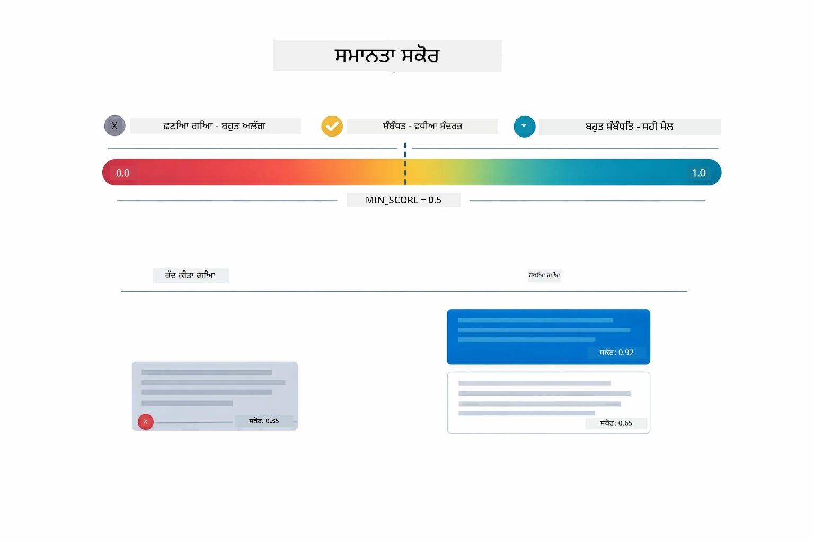

*ਇਹ ਆਕਰਸ਼ਣ ਦਰਸਾਉਂਦਾ ਹੈ ਕਿ 0 ਤੋਂ 1 ਤੱਕ ਕੀ ਸਕੋਰ ਸੀਮਾ ਹੈ, ਜਿਸ ਵਿੱਚ ਘੱਟੋ-ਘੱਟ ਸੀਮਾ 0.5 ਹੈ ਜੋ අਸੰਬੰਧਿਤ ਟੁਕੜਿਆਂ ਨੂੰ ਬਾਹਰ ਕਰਦਾ ਹੈ।*

ਸਕੋਰਾਂ ਦੀ ਸੀਮਾ 0 ਤੋਂ 1 ਤੱਕ:
- 0.7-1.0: ਬਹੁਤ ਸੰਬੰਧਿਤ, ਸਹੀ ਮੇਲ
- 0.5-0.7: ਸੰਬੰਧਿਤ, ਵਧੀਆ ਸੰਦਰਭ
- 0.5 ਤੋਂ ਘੱਟ: ਛਾਨਿਆ ਹੋਇਆ, ਬਹੁਤ ਵੱਖਰਾ

ਸਿਸਟਮ ਸਿਰਫ ਘੱਟੋ-ਘੱਟ ਮਿਆਰ ਤੋਂ ਉੱਪਰ ਵਾਲੇ ਟੁਕੜਿਆਂ ਨੂੰ ਪ੍ਰਾਪਤ ਕਰਦਾ ਹੈ ਜਿਸ ਨਾਲ ਗੁਣਵੱਤਾ ਯਕੀਨੀ ਬਣਾਈ ਜਾਂਦੀ ਹੈ।

ਐਮਬੈਡਿੰਗਸ ਵਧੀਆ ਕੰਮ ਕਰਦੇ ਹਨ ਜਦੋਂ ਅਰਥ ਸਾਫ਼-ਸੁਥਰਾ ਕਲੱਸਟਰ ਬਣਾਉਂਦਾ ਹੈ, ਪਰ ਉਹ ਅੰਧੇਰਾ ਸਥਾਨ ਵੀ ਹੁੰਦੇ ਹਨ। ਹੇਠਾਂ ਦਿੱਤੀ ਆਕਰਸ਼ਣ ਆਮ ਅਸਫਲਤਾ ਮੋਡ ਦਰਸਾਉਂਦਾ ਹੈ — ਬਹੁਤ ਵੱਡੇ ਟੁਕੜੇ ਬਦਤਰੇ ਵੇਕਟਰ ਬਣਾਉਂਦੇ ਹਨ, ਬਹੁਤ ਛੋਟੇ ਟੁਕੜੇ ਸੰਦਰਭ ਘੱਟ ਹੁੰਦੇ ਹਨ, ਅਸਪਸ਼ਟ ਸ਼ਬਦ ਕਈ ਕਲੱਸਟਰਾਂ ਵੱਲ ਇਸ਼ਾਰਾ ਕਰਦੇ ਹਨ, ਅਤੇ ਸਹੀ ਮੇਲ ਲੁਕਅਪ (IDs, ਹਿੱਸਾ ਨੰਬਰ) ਐਮਬੈਡਿੰਗਸ ਨਾਲ ਬਿਲਕੁਲ ਕੰਮ ਨਹੀਂ ਕਰਦੇ:

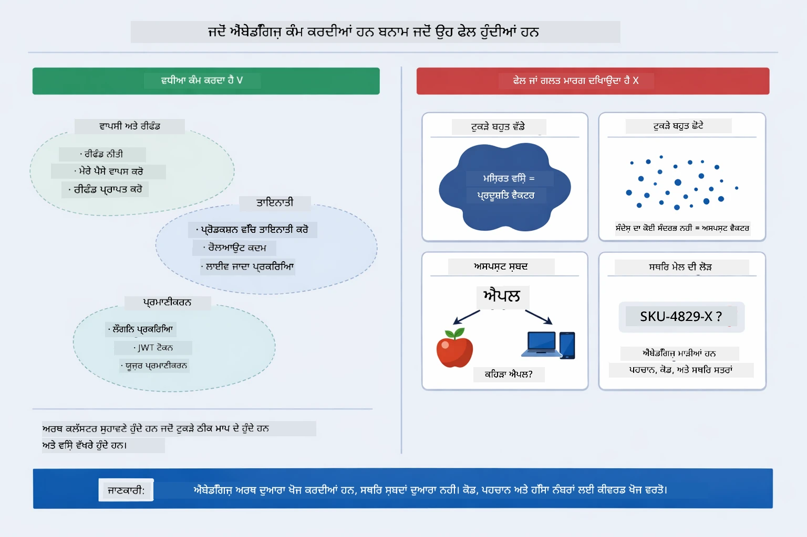

*ਇਹ ਆਕਰਸ਼ਣ ਆਮ ਐਮਬੈਡਿੰਗ ਅਸਫਲਤਾ ਮੋਡ ਦਿਖਾਉਂਦਾ ਹੈ: ਬਹੁਤ ਵੱਡੇ ਟੁਕੜੇ, ਬਹੁਤ ਛੋਟੇ ਟੁਕੜੇ, ਅਸਪਸ਼ਟ ਟਰਮ ਜੋ ਕਈ ਕਲੱਸਟਰਾਂ ਵੱਲ ਇਸ਼ਾਰਾ ਕਰਦੇ ਹਨ, ਅਤੇ ਸਹੀ ਮੇਲ ਲੁਕਅਪ ਜਿਵੇਂ IDs।*

### ਇਨ-ਮੇਮੋਰੀ ਸਟੋਰੇਜ

ਇਹ ਮੋਡੀਊਲ ਸਾਦਗੀ ਲਈ ਇਨ-ਮੇਮੋਰੀ ਸਟੋਰੇਜ ਦੀ ਵਰਤੋਂ ਕਰਦਾ ਹੈ। ਜਦੋਂ ਤੁਸੀਂ ਐਪਲੀਕੇਸ਼ਨ ਨੂੰ ਦੁਬਾਰਾ ਚਾਲੂ ਕਰਦੇ ਹੋ, ਅੱਪਲੋਡ ਕੀਤੇ ਦਸਤਾਵੇਜ਼ ਖੋ ਜਾਂਦੇ ਹਨ। ਪ੍ਰੋਡਕਸ਼ਨ ਸਿਸਟਮ ਕਾਇਮ ਰੱਖਣ ਵਾਲੇ ਵੈਕਟਰ ਡਾਟਾਬੇਸ ਜਿਵੇਂ Qdrant ਜਾਂ Azure AI Search ਦੀ ਵਰਤੋਂ ਕਰਦੇ ਹਨ।

### ਸੰਦਰਭ ਵਿੰਡੋ ਪ੍ਰਬੰਧਨ

ਹਰ ਮਾਡਲ ਦੀ ਆਪਣੇ ਤੱਕਸਾਲੀ ਸੰਦਰਭ ਵਿੰਡੋ ਹੁੰਦੀ ਹੈ। ਤੁਸੀਂ ਵੱਡੇ ਦਸਤਾਵੇਜ਼ ਦੇ ਹਰ ਟੁਕੜੇ ਸ਼ਾਮਲ ਨਹੀਂ ਕਰ ਸਕਦੇ। ਸਿਸਟਮ ਸਭ ਤੋਂ ਸੰਬੰਧਿਤ 5 (ਡਿਫਾਲਟ) ਟੁਕੜੇ ਪ੍ਰਾਪਤ ਕਰਦਾ ਹੈ ਤਾਂ ਜੋ ਸੀਮਾਵਾਂ ਦੇ ਅੰਦਰ ਰਹਿੰਦਾ ਹੋਵੇ ਅਤੇ ਸਹੀ ਜਵਾਬ ਦੇਣ ਲਈ ਕਾਫ਼ੀ ਸੰਦਰਭ ਪ੍ਰਦਾਨ ਕਰਦਾ ਹੋਵੇ।

## ਜਦ RAG ਮਹੱਤਵਪੂਰਣ ਹੈ

RAG ਹਮੇਸ਼ਾ ਸਹੀ ਤਰੀਕਾ ਨਹੀਂ ਹੁੰਦਾ। ਹੇਠਾਂ ਦਿੱਤਾ ਫੈਸਲਾ ਗਾਈਡ ਤੁਹਾਡੇ ਲਈ ਇਹ ਤੈਅ ਕਰਦਾ ਹੈ ਕਿ ਕਦੋਂ RAG ਵਧੀਆ ਹੈ ਅਤੇ ਕਦੋਂ ਸਿੱਧੇ ਤੌਰ 'ਤੇ ਸਮੱਗਰੀ ਨੂੰ ਪ੍ਰਾਂਪਟ ਵਿਚ ਸ਼ਾਮਲ ਕਰਨਾ ਜਾਂ ਮਾਡਲ ਦੇ ਅੰਦਰੂਨੀ ਗਿਆਨ 'ਤੇ اعتماد ਕਰਨਾ ਕਾਫ਼ੀ ਹੈ:

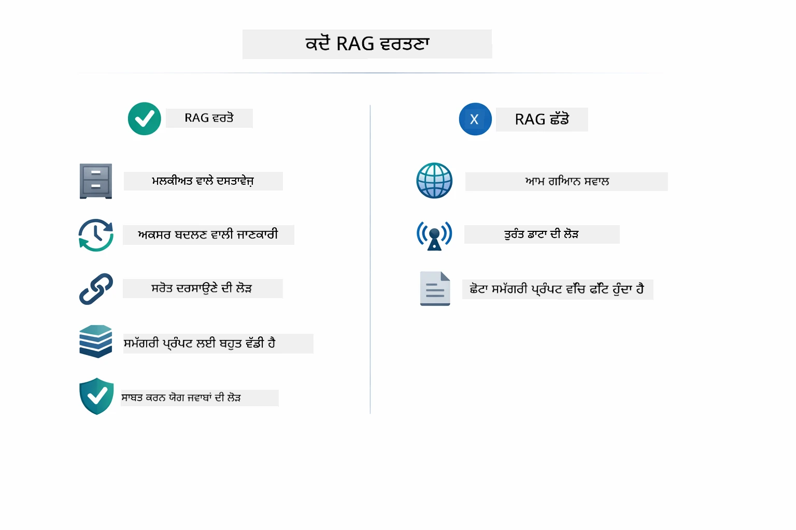

*ਇਹ ਆਕਰਸ਼ਣ ਇੱਕ ਫੈਸਲਾ ਗਾਈਡ ਦਿਖਾਉਂਦਾ ਹੈ ਕਿ ਕਦੋਂ RAG ਮੁੱਲ ਵਧਾਉਂਦਾ ਹੈ ਅਤੇ ਕਦੋਂ ਸਧਾਰਨ ਤਰੀਕੇ ਕਾਫ਼ੀ ਹੁੰਦੇ ਹਨ।*

## ਅਗਲੇ ਕਦਮ

**ਅਗਲਾ ਮੋਡੀਊਲ:** [04-tools - ਟੂਲਜ਼ ਨਾਲ AI ਏਜੰਟ](../04-tools/README.md)

---

**ਨੈਵੀਗੇਸ਼ਨ:** [← ਪਹਿਲਾ: ਮੋਡੀਊਲ 02 - ਪ੍ਰਾਂਪਟ ਇੰਜੀਨੀਅਰਿੰਗ](../02-prompt-engineering/README.md) | [ਮੁੱਖ ਵਾਪਸ](../README.md) | [ਅਗਲਾ: ਮੋਡੀਊਲ 04 - ਟੂਲਜ਼ →](../04-tools/README.md)

---

<!-- CO-OP TRANSLATOR DISCLAIMER START -->
**ਅਸਪਸ਼ਟੀਕਰਨ**:  
ਇਹ ਦਸਤਾਵੇਜ਼ AI ਅਨੁਵਾਦ ਸੇਵਾ [Co-op Translator](https://github.com/Azure/co-op-translator) ਦੀ ਵਰਤੋਂ ਕਰਕੇ ਅਨੁਵਾਦ ਕੀਤਾ ਗਿਆ ਹੈ। ਜਦੋਂ ਕਿ ਅਸੀਂ ਸਹੀਤਾ ਲਈ ਯਤਨਸ਼ੀਲ ਹਾਂ, ਕਿਰਪਾ ਕਰਕੇ ਯਾਦ ਰੱਖੋ ਕਿ ਸੁਚਾਰੂ ਤੌਰ ‘ਤੇ ਬਣਾਈ ਗਈਆਂ ਅਨੁਵਾਦਾਂ ਵਿੱਚ ਵੀ ਗਲਤੀਆਂ ਜਾਂ ਅਸਪਸ਼ਟਤਾਵਾਂ ਹੋ ਸਕਦੀਆਂ ਹਨ। ਮੂਲ ਦਸਤਾਵੇਜ਼ ਨੂੰ ਇਸਦੀ ਮੂਲ ਭਾਸ਼ਾ ਵਿੱਚ ਹੀ ਅਧਿਕਾਰਕ ਸਰੋਤ ਮੰਨਿਆ ਜਾਣਾ ਚਾਹੀਦਾ ਹੈ। ਮਹੱਤਵਪੂਰਨ ਜਾਣਕਾਰੀ ਲਈ, ਵਿਸ਼ੇਸ਼ਜ ਢੰਗ ਨਾਲ ਮਨੁੱਖੀ ਅਨੁਵਾਦ ਦੀ ਸਿਫਾਰਿਸ਼ ਕੀਤੀ ਜਾਂਦੀ ਹੈ। ਅਸੀਂ ਇਸ ਅਨੁਵਾਦ ਦੇ ਉਪਯੋਗ ਨਾਲ ਪੈਦਾਵਾਰ ਹੋਣ ਵਾਲੀਆਂ ਕਿਸੇ ਵੀ ਗਲਤਫਹਿਮੀਆਂ ਜਾਂ ਭ੍ਰਮਾਂ ਲਈ ਜ਼ਿੰਮੇਵਾਰ ਨਹੀਂ ਹਾਂ।
<!-- CO-OP TRANSLATOR DISCLAIMER END -->