# Module 04: AI Agents with Tools

## Table of Contents

- [Video Walkthrough](../../../04-tools)
- [What You'll Learn](../../../04-tools)
- [Prerequisites](../../../04-tools)
- [Understanding AI Agents with Tools](../../../04-tools)
- [How Tool Calling Works](../../../04-tools)
  - [Tool Definitions](../../../04-tools)
  - [Decision Making](../../../04-tools)
  - [Execution](../../../04-tools)
  - [Response Generation](../../../04-tools)
  - [Architecture: Spring Boot Auto-Wiring](../../../04-tools)
- [Tool Chaining](../../../04-tools)
- [Run the Application](../../../04-tools)
- [Using the Application](../../../04-tools)
  - [Try Simple Tool Usage](../../../04-tools)
  - [Test Tool Chaining](../../../04-tools)
  - [See Conversation Flow](../../../04-tools)
  - [Experiment with Different Requests](../../../04-tools)
- [Key Concepts](../../../04-tools)
  - [ReAct Pattern (Reasoning and Acting)](../../../04-tools)
  - [Tool Descriptions Matter](../../../04-tools)
  - [Session Management](../../../04-tools)
  - [Error Handling](../../../04-tools)
- [Available Tools](../../../04-tools)
- [When to Use Tool-Based Agents](../../../04-tools)
- [Tools vs RAG](../../../04-tools)
- [Next Steps](../../../04-tools)

## Video Walkthrough

ਇਸ ਜੀਵੰਤ ਸੈਸ਼ਨ ਨੂੰ ਦੇਖੋ ਜੋ ਦੱਸਦਾ ਹੈ ਕਿ ਇਸ ਮੋਡੀਊਲ ਨਾਲ ਕਿਵੇਂ ਸ਼ੁਰੂਆਤ ਕਰਨੀ ਹੈ:

<a href="https://www.youtube.com/watch?v=O_J30kZc0rw"></a>

## What You'll Learn

ਹੁਣ ਤੱਕ, ਤੁਸੀਂ ਸਿੱਖਿਆ ਹੈ ਕਿ ਕਿਵੇਂ ਏਆਈ ਨਾਲ ਗੱਲਬਾਤ ਕਰਨੀ ਹੈ, ਪ੍ਰਭਾਵਸ਼ਾਲੀ ਤਰੀਕੇ ਨਾਲ ਪ੍ਰਾਂਪਟ ਤਿਆਰ ਕਰਨੇ ਹਨ, ਅਤੇ ਆਪਣੇ ਦਸਤਾਵੇਜ਼ਾਂ ਵਿੱਚ ਜਵਾਬਾਂ ਨੂੰ ਅਧਾਰਿਤ ਕਰਨਾ ਹੈ। ਪਰ ਇੱਕ ਬੁਨਿਆਦੀ ਸੀਮਾ ਹੈ: ਭਾਸ਼ਾ ਮਾਡਲ ਸਿਰਫ ਟੈਕਸਟ ਹੀ ਬਣਾ ਸਕਦੇ ਹਨ। ਉਹ ਮੌਸਮ ਜਾਂਚ ਨਹੀਂ ਕਰ ਸਕਦੇ, ਗਣਨਾ ਨਹੀਂ ਕਰ ਸਕਦੇ, ਡੇਟਾਬੇਸਾਂ ਨੂੰ ਕਵੈਰੀ ਨਹੀਂ ਕਰ ਸਕਦੇ, ਜਾਂ ਬਾਹਰੀ ਸਿਸਟਮਾਂ ਨਾਲ ਵਪਾਰ ਨਹੀਂ ਕਰ ਸਕਦੇ।

ਓਜ਼ਾਰ ਇਸਨੂੰ ਬਦਲ ਦਿੰਦੇ ਹਨ। ਮਾਡਲ ਨੂੰ ਫੰਕਸ਼ਨਾਂ ਤੱਕ ਪਹੁੰਚ ਦੇ ਕੇ ਜਿਸਨੂੰ ਇਹ ਕਾਲ ਕਰ ਸਕਦਾ ਹੈ, ਤੁਸੀਂ ਇਸਨੂੰ ਇੱਕ ਟੈਕਸਟ ਜਨਰੇਟਰ ਤੋਂ ਇੱਕ ਐਜੈਂਟ ਵਿੱਚ ਬਦਲ ਦਿੰਦੇ ਹੋ ਜੋ ਕਾਰਵਾਈ ਕਰ ਸਕਦਾ ਹੈ। ਮਾਡਲ ਫੈਸਲਾ ਕਰਦਾ ਹੈ ਕਿ ਕਦੋਂ ਇਸਨੂੰ ਔਜ਼ਾਰ ਦੀ ਲੋੜ ਹੈ, ਕਿਹੜਾ ਟੂਲ ਵਰਤਣਾ ਹੈ, ਅਤੇ ਕਿਹੜੇ ਪੈਰਾਮੀਟਰ ਭੇਜਣੇ ਹਨ। ਤੁਹਾਡਾ ਕੋਡ ਉਸ ਫੰਕਸ਼ਨ ਨੂੰ ਚਲਾਉਂਦਾ ਹੈ ਅਤੇ ਨਤੀਜਾ ਵਾਪਸ ਕਰਦਾ ਹੈ। ਮਾਡਲ ਉਸ ਨਤੀਜੇ ਨੂੰ ਆਪਣੇ ਜਵਾਬ ਵਿੱਚ ਸ਼ਾਮਲ ਕਰ ਲੈਂਦਾ ਹੈ।

## Prerequisites

- ਮੁਕੰਮਲ ਕੀਤਾ [Module 01 - Introduction](../01-introduction/README.md) (Azure OpenAI ਸਰੋਤ ਤਿਆਰ ਹੋਏ)
- ਪਿਛਲੇ ਮੋਡੀਊਲ ਦੀ ਸਿਫਾਰਸ਼ ਕੀਤੀ ਗਈ ਹੈ (ਇਸ ਮੋਡੀਊਲ ਵਿੱਚ ਟੂਲਜ਼ ਵਿਰੁੱਧ RAG ਮੁਕਾਬਲੇ ਵਿੱਚ [Module 03 ਦੇ RAG ਔਰ ਸਿਧਾਂਤ](../03-rag/README.md) ਦਾ ਹਵਾਲਾ ਹੈ)
- ਰੂਟ ਡਾਇਰੈਕਟਰੀ ਵਿੱਚ `.env` ਫਾਈਲ Azure ਪ੍ਰਮਾਣਿਕਤਾ ਨਾਲ (Module 01 ਵਿੱਚ `azd up` ਦੁਆਰਾ ਬਣਾਈ ਗਈ)

> **ਨੋਟ:** ਜੇ ਤੁਸੀਂ Module 01 ਮੁਕੰਮਲ ਨਹੀਂ ਕੀਤਾ, ਪਹਿਲਾਂ ਉਥੇ ਦਿੱਤੇ ਡਿਪਲੋਇਮੈਂਟ ਦਿਸ਼ਾ-ਨਿਰਦੇਸ਼ਾਂ ਦੇ ਪਾਲਣ ਕਰੋ।

## Understanding AI Agents with Tools

> **📝 ਨੋਟ:** ਇਸ ਮੋਡੀਊਲ ਵਿੱਚ "ਏਜੈਂਟ" ਸ਼ਬਦ ਦਾ ਅਰਥ ਹੈ ਉਹ AI ਸਹਾਇਕ ਜੋ ਟੂਲ ਕਾਲ ਕਰਨ ਵਾਲੀਆਂ ਯੋਗਤਾਵਾਂ ਨਾਲ ਵਧਾਏ ਗਏ ਹਨ। ਇਹ ਭਿੰਨ ਹੈ ਉਹਨਾਂ **Agentic AI** ਪੈਟਰਨਾਂ ਤੋਂ (ਆਟੋਨੋਮਸ ਏਜੈਂਟ, ਜੋ ਯੋਜਨਾ, ਯਾਦ, ਅਤੇ ਕਈ ਕਦਮ ਵਾਲੀ ਸੋਚ ਸਮੇਤ ਹਨ) ਜੋ ਅਸੀਂ [Module 05: MCP](../05-mcp/README.md) ਵਿੱਚ ਕਵਰ ਕਰਾਂਗੇ।

ਬਿਨਾਂ ਔਜ਼ਾਰਾਂ ਦੇ, ਇੱਕ ਭਾਸ਼ਾ ਮਾਡਲ ਸਿਰਫ ਆਪਣੇ ਟ੍ਰੇਨਿੰਗ ਡੇਟਾ ਤੋਂ ਟੈਕਸਟ ਤਿਆਰ ਕਰ ਸਕਦਾ ਹੈ। ਮੌਜੂਦਾ ਮੌਸਮ ਬਾਰੇ ਪੁੱਛੋ, ਤਾਂ ਇਹ ਅਨੁਮਾਨ ਲਗਾਉਂਦਾ ਹੈ। ਇਸਨੂੰ ਟੂਲ ਤੇ ਦਿਓ, ਤਾਂ ਇਹ ਮੌਸਮ API ਕਾਲ ਕਰ ਸਕਦਾ ਹੈ, ਗਣਨਾ ਕਰ ਸਕਦਾ ਹੈ, ਜਾਂ ਡੇਟਾਬੇਸ ਕਵੈਰੀ ਕਰ ਸਕਦਾ ਹੈ — ਅਤੇ ਫਿਰ ਉਹ ਅਸਲੀ ਨਤੀਜੇ ਆਪਣੇ ਜਵਾਬ ਵਿੱਚ ਜੋੜਦਾ ਹੈ।

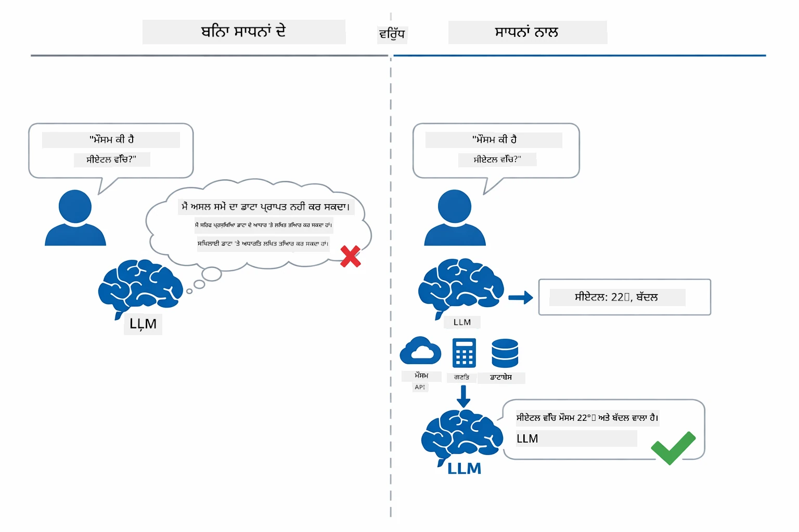

*ਬਿਨਾਂ ਟੂਲਾਂ ਦੇ ਮਾਡਲ ਸਿਰਫ ਅਨੁਮਾਨ ਲਗਾ ਸਕਦਾ ਹੈ — ਟੂਲਾਂ ਨਾਲ ਇਹ API ਕਾਲ ਕਰਦਾ ਹੈ, ਗਣਨਾ ਕਰਦਾ ਹੈ, ਅਤੇ ਤਾਜ਼ਾ ਡਾਟਾ ਵਾਪਸ ਦਿੰਦਾ ਹੈ।*

ਟੂਲਜ਼ ਵਾਲਾ ਏਆਈ ਏਜੈਂਟ ਇੱਕ **Reasoning and Acting (ReAct)** ਪੈਟਰਨ ਨੂੰ ਫਾਲੋ ਕਰਦਾ ਹੈ। ਮਾਡਲ ਸਿਰਫ ਜਵਾਬ ਨਹੀਂ ਦਿੰਦਾ — ਇਹ ਸੋਚਦਾ ਹੈ ਕਿ ਉਸਨੂੰ ਕੀ ਚਾਹੀਦਾ ਹੈ, ਟੂਲ ਕਾਲ ਕਰਕੇ ਕਾਰਵਾਈ ਕਰਦਾ ਹੈ, ਨਤੀਜੇ ਦਾ ਨਿਰੀਖਣ ਕਰਦਾ ਹੈ, ਅਤੇ ਫਿਰ ਇਹ ਫੈਸਲਾ ਕਰਦਾ ਹੈ ਕਿ ਦੁਬਾਰਾ ਕਾਰਵਾਈ ਕਰਨੀ ਹੈ ਜਾਂ ਅਸਲ ਜਵਾਬ ਦੇਣਾ ਹੈ:

1. **Reason** — ਏਜੈਂਟ ਉਪਭੋਗਤਾ ਦੇ ਸਵਾਲ ਨੂੰ ਵਿਸ਼ਲੇਸ਼ਣ ਕਰਦਾ ਹੈ ਅਤੇ ਫੈਸਲਾ ਕਰਦਾ ਹੈ ਕਿ ਇਸਨੂੰ ਕਿਹੜੀ ਜਾਣਕਾਰੀ ਦੀ ਲੋੜ ਹੈ
2. **Act** — ਏਜੈਂਟ ਸਹੀ ਟੂਲ ਚੁਣਦਾ ਹੈ, ਸਹੀ ਪੈਰਾਮੀਟਰ ਤਿਆਰ ਕਰਦਾ ਹੈ, ਅਤੇ ਉਸਨੂੰ ਕਾਲ ਕਰਦਾ ਹੈ
3. **Observe** — ਏਜੈਂਟ ਟੂਲ ਦੇ ਨਤੀਜੇ ਨੂੰ ਪ੍ਰਾਪਤ ਕਰਦਾ ਹੈ ਅਤੇ ਉਸਦਾ ਮੁਲਾਂਕਣ ਕਰਦਾ ਹੈ
4. **Repeat or Respond** — ਜੇ ਹੋਰ ਡਾਟਾ ਦੀ ਲੋੜ ਹੈ, ਤਾਂ ਏਜੈਂਟ ਵਾਪਸ ਚੱਕਰ ਲਾਉਂਦਾ ਹੈ; ਨਹੀਂ ਤਾਂ ਇਕ ਕੁਦਰਤੀ ਭਾਸ਼ਾ ਵਿਚ ਜਵਾਬ ਦਿੰਦਾ ਹੈ

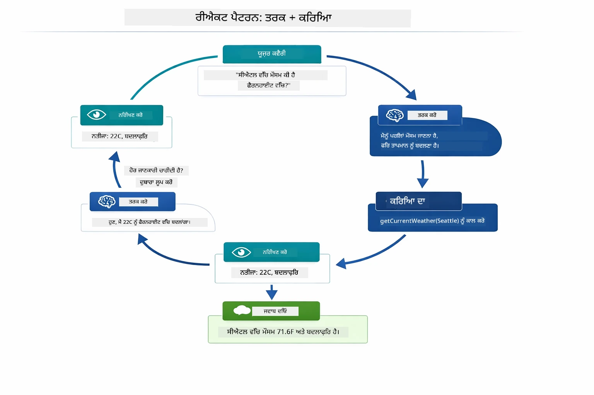

*ReAct ਚੱਕਰ — ਏਜੈਂਟ ਸੋਚਦਾ ਹੈ ਕਿ ਕੀ ਕਰਨਾ ਹੈ, ਟੂਲ ਕਾਲ ਕਰਕੇ ਅਮਲ ਕਰਦਾ ਹੈ, ਨਤੀਜਾ ਵੇਖਦਾ ਹੈ, ਅਤੇ ਆਖਰੀ ਜਵਾਬ ਦੇਣ ਤੱਕ ਚੱਕਰ ਲਾਉਂਦਾ ਹੈ।*

ਇਹ ਸਾਰਾ ਪ੍ਰਕਿਰਿਆ ਖੁਦਕਾਰ ਹੈ। ਤੁਸੀਂ ਟੂਲਜ਼ ਅਤੇ ਉਹਨਾਂ ਦੀ ਵਿਆਖਿਆ ਨੂੰ ਪਰਿਭਾਸ਼ਿਤ ਕਰਦੇ ਹੋ। ਮਾਡਲ ਫੈਸਲਾ ਕਰਦਾ ਹੈ ਕਿ ਟੂਲ ਕਿਸ ਤਰ੍ਹਾਂ ਤੇ ਕਦੋਂ ਵਰਤਣਾ ਹੈ।

## How Tool Calling Works

### Tool Definitions

[WeatherTool.java](../../../04-tools/src/main/java/com/example/langchain4j/agents/tools/WeatherTool.java) | [TemperatureTool.java](../../../04-tools/src/main/java/com/example/langchain4j/agents/tools/TemperatureTool.java)

ਤੁਸੀਂ ਫੰਕਸ਼ਨਾਂ ਨੂੰ ਸਾਫ ਵਿਆਖਿਆਵਾਂ ਅਤੇ ਪੈਰਾਮੀਟਰ ਸਪੈਕਿਫਿਕੇਸ਼ਨ ਨਾਲ ਪਰਿਭਾਸ਼ਿਤ ਕਰਦੇ ਹੋ। ਮਾਡਲ ਆਪਣੀ ਸਿਸਟਮ ਪ੍ਰਾਂਪਟ ਵਿੱਚ ਇਹ ਵਿਆਖਿਆਵਾਂ ਵੇਖਦਾ ਹੈ ਅਤੇ ਸਮਝਦਾ ਹੈ ਕਿ ਹਰ ਟੂਲ ਕੀ ਕਰਦਾ ਹੈ।

```java
@Component
public class WeatherTool {
    
    @Tool("Get the current weather for a location")
    public String getCurrentWeather(@P("Location name") String location) {
        // ਤੁਹਾਡੀ ਮੌਸਮ ਲੁੱਕਅੱਪ ਲੋਜਿਕ
        return "Weather in " + location + ": 22°C, cloudy";
    }
}

@AiService
public interface Assistant {
    String chat(@MemoryId String sessionId, @UserMessage String message);
}

// ਸਹਾਇਕ ਸਵੈਚਲਿਤ ਤੌਰ 'ਤੇ Spring Boot ਨਾਲ ਵਾਇਰ ਕੀਤਾ ਜਾਂਦਾ ਹੈ:
// - ChatModel ਬੀਨ
// - ਸਾਰੇ @Tool ਮੇਥਡ @Component ਕਲਾਸਾਂ ਤੋਂ
// - ਸੈਸ਼ਨ ਪ੍ਰਬੰਧਨ ਲਈ ChatMemoryProvider
```

ਹੇਠਾਂ ਦਿੱਤਾ ਡਾਯਾਗ੍ਰਾਮ ਹਰ ਐਨੋਟੇਸ਼ਨ ਨੂੰ ਵੇਖਾਉਂਦਾ ਹੈ ਅਤੇ ਦਿਖਾਉਂਦਾ ਹੈ ਕਿ ਹਰ ਹਿੱਸਾ AI ਨੂੰ ਟੂਲ ਕਦੋਂ ਕਾਲ ਕਰਨਾ ਹੈ ਅਤੇ ਕਿਹੜੇ ਤਰਕ ਭੇਜਣੇ ਹਨ ਇਹ ਸਮਝਣ ਵਿੱਚ ਕਿਵੇਂ ਮਦਦ ਕਰਦਾ ਹੈ:

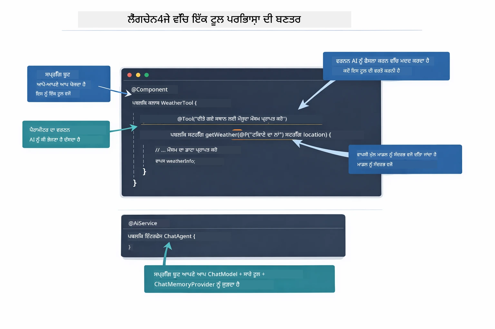

*ਟੂਲ ਡਿਫਿਨੀਸ਼ਨ ਦੀ ਬਣਤਰ — @Tool AI ਨੂੰ ਦੱਸਦਾ ਹੈ ਕਿ ਕਦੋਂ ਇਸਨੂੰ ਵਰਤਣਾ ਹੈ, @P ਹਰ ਪੈਰਾਮੀਟਰ ਨੂੰ ਵੇਖਾਉਂਦਾ ਹੈ, ਅਤੇ @AiService ਸ਼ੁਰੂਆਤੀ ਸਮੇਂ ਸਾਰਾ ਕੁਝ ਜੋੜਦਾ ਹੈ।*

> **🤖 [GitHub Copilot](https://github.com/features/copilot) ਚੈਟ ਨਾਲ ਕੋਸ਼ਿਸ਼ ਕਰੋ:** [`WeatherTool.java`](../../../04-tools/src/main/java/com/example/langchain4j/agents/tools/WeatherTool.java) ਖੋਲ੍ਹੋ ਅਤੇ ਪੁੱਛੋ:
> - "ਮੈਂ ਮૉਕ ਡੇਟਾ ਦੀ ਜਗ੍ਹਾ ਕਿਸ ਤਰ੍ਹਾਂ ਅਸਲ ਵੇਦਰ API ਜਿਵੇਂ OpenWeatherMap ਨੂੰ ਜੋੜਾਂ?"
> - "ਇੱਕ ਚੰਗੀ ਟੂਲ ਵੇਰਵਾ ਕੀ ਹੈ ਜੋ AI ਨੂੰ ਇਸਦੀ ਸਹੀ ਵਰਤੋਂ ਵਿੱਚ ਮਦਦ ਕਰਦਾ ਹੈ?"
> - "ਟੂਲ ਤੇ ਛੁੱਟਣ ਵਾਲੀਆਂ API ਗਲਤੀਆਂ ਅਤੇ ਰੇਟ ਲਿਮਿਟਾਂ ਦਾ ਸਹੀ ਤਰੀਕੇ ਨਾਲ ਸੰਭਾਲ ਕਿਵੇਂ ਕਰੀਏ?"

### Decision Making

ਜਦੋਂ ਯੂਜ਼ਰ ਪੁੱਛਦਾ ਹੈ "ਸੀਅਟਲ ਵਿੱਚ ਮੌਸਮ ਕਿਵੇਂ ਹੈ?", ਮਾਡਲ ਬੇਤਰਤੀਬੀ ਨਾਲ ਕੋਈ ਟੂਲ ਨਹੀਂ ਚੁਣਦਾ। ਇਹ ਯੂਜ਼ਰ ਦੀ ਇरਾਦਾ ਦੀ ਤੁਲਨਾ ਸਭ ਟੂਲ ਦੀਆਂ ਵਿਆਖਿਆਵਾਂ ਨਾਲ ਕਰਦਾ ਹੈ ਜੋ ਇਸਨੂੰ ਉਪਲਬਧ ਹਨ, ਹਰ ਇੱਕ ਲਈ ਲਾਗੂਪਨ ਦੇ ਅੰਕ ਮਪਦਾ ਹੈ, ਅਤੇ ਵਧੀਆ ਮੇਲ ਚੁਣਦਾ ਹੈ। ਫਿਰ ਇਹ ਸਹੀ ਪੈਰਾਮੀਟਰਾਂ ਨਾਲ ਸਰਚਿੰਨ ਫੰਕਸ਼ਨ ਕਾਲ ਬਣਾਉਂਦਾ ਹੈ — ਇਸ ਮਾਮਲੇ ਵਿੱਚ `location` ਨੂੰ `"Seattle"` ਸੈਟ ਕਰਦਾ ਹੈ।

ਜੇ ਕਿਸੇ ਵੀ ਟੂਲ ਦਾ ਯੂਜ਼ਰ ਦੀ ਲੋੜ ਨਾਲ ਮੇਲ ਨਹੀਂ ਬਠਦਾ, ਤਾਂ ਮਾਡਲ ਆਪਣੀ ਜਾਣਕਾਰੀ ਤੋਂ ਜਵਾਬ ਦੇਦਾ ਹੈ। ਜੇ ਕਈ ਟੂਲ ਮੇਲ ਖਾਂਦੇ ਹਨ, ਤਾਂ ਸਭ ਤੋਂ ਵਿਸ਼ੇਸ਼ ਟੂਲ ਚੁਣਦਾ ਹੈ।

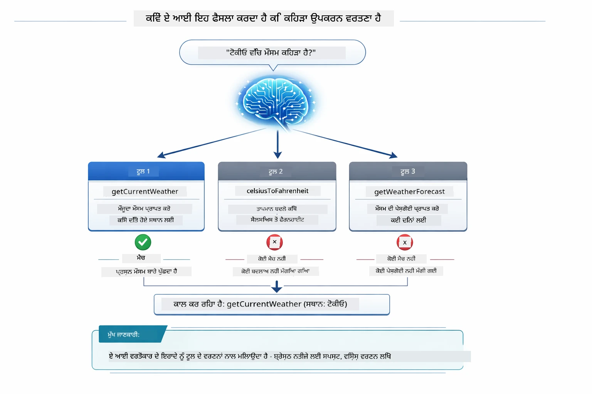

*ਮਾਡਲ ਹਰ ਉਪਲਬਧ ਟੂਲ ਨੂੰ ਯੂਜ਼ਰ ਦੀ ਇਰਾਦੇ ਨਾਲ ਤੁਲਨਾ ਕਰਦਾ ਹੈ ਅਤੇ ਵਧੀਆ ਮੇਲ ਚੁਣਦਾ ਹੈ — ਇਸ ਲਈ ਸਾਫ਼, ਵਿਸ਼ੇਸ਼ ਟੂਲ ਵੇਰਵਿਆਂ ਦੀ ਲਿਖਾਈ ਮਹੱਤਵਪੂਰਨ ਹੈ।*

### Execution

[AgentService.java](../../../04-tools/src/main/java/com/example/langchain4j/agents/service/AgentService.java)

Spring Boot ਘੋਸ਼ਣਾਤਮਕ `@AiService` ਇੰਟਰਫੇਸ ਨੂੰ ਸਾਰੇ ਦਰਜ ਟੂਲਾਂ ਨਾਲ ਆਪਣੇ ਆਪ ਜ਼ੁੜਦਾ ਹੈ, ਅਤੇ LangChain4j ਅਟੋਮੈਟਿਕ ਟੂਲ ਕਾਲਾਂ ਚਲਾਉਂਦਾ ਹੈ। ਪਿਛੇ ਦ੍ਰਿਸ਼ ਵਿੱਚ, ਇੱਕ ਪੂਰੀ ਟੂਲ ਕਾਲ ਛੇ ਪੜਾਵਾਂ ਵਿੱਚ ਹੁੰਦੀ ਹੈ — ਉਪਭੋਗਤਾ ਦੇ ਕੁਦਰਤੀ ਭਾਸ਼ਾ ਸਵਾਲ ਤੋਂ ਲੈ ਕੇ ਮੁੜ ਕੁਦਰਤੀ ਭਾਸ਼ਾ ਜਵਾਬ ਤੱਕ:

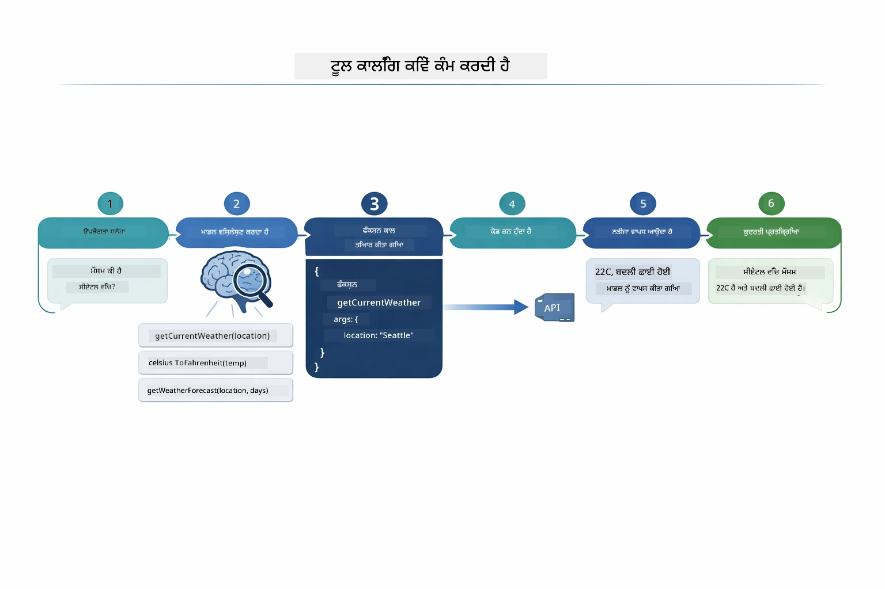

*ਪੀੜ੍ਹੀ ਦਰ ਪੀੜ੍ਹੀ ਪ੍ਰਕਿਰਿਆ — ਉਪਭੋਗਤਾ ਸਵਾਲ ਪੁੱਛਦਾ ਹੈ, ਮਾਡਲ ਟੂਲ ਚੁਣਦਾ ਹੈ, LangChain4j ਉਸਨੂੰ ਚਲਾਉਂਦਾ ਹੈ, ਅਤੇ ਮਾਡਲ ਨਤੀਜੇ ਨੂੰ ਜਵਾਬ ਵਿੱਚ ਜੋੜਦਾ ਹੈ।*

ਜੇ ਤੁਸੀਂ Module 00 ਵਿੱਚ [ToolIntegrationDemo](../../../00-quick-start/src/main/java/com/example/langchain4j/quickstart/ToolIntegrationDemo.java) ਚਲਾਇਆ ਸੀ, ਤਾਂ ਤੁਸੀਂ ਇਸ ਪੈਟਰਨ ਨੂੰ ਪਹਿਲਾਂ ਹੀ ਦੇਖਿਆ — `Calculator` ਟੂਲਾਂ ਇਹੀ ਤਰੀਕੇ ਨਾਲ ਕਾਲ ਕੀਤੇ ਗਏ। ਹੇਠਾਂ ਦਿੱਤਾ ਸੀਕੈਂਸ ਡਾਇਗ੍ਰਾਮ ਦਿਖਾਉਂਦਾ ਹੈ ਕਿ ਉਸ ਡੈਮੋ ਵਿੱਚ ਕੀ ਹੋਇਆ:

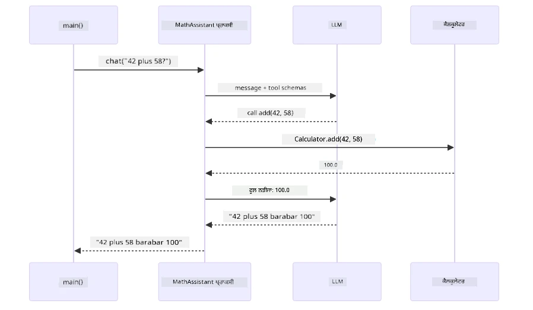

*Quick Start ਡੈਮੋ ਤੋਂ ਟੂਲ ਕਾਲ ਲੂਪ — `AiServices` ਤੁਹਾਡਾ ਸੁਨੇਹਾ ਅਤੇ ਟੂਲ ਸਕੀਮਾਂ LLM ਨੂੰ ਭੇਜਦਾ ਹੈ, LLM ਇੱਕ ਫੰਕਸ਼ਨ ਕਾਲ ਜਿਵੇਂ `add(42, 58)` ਨਾਲ ਜਵਾਬ ਦਿੰਦਾ ਹੈ, LangChain4j `Calculator` ਮੈਥਡ ਸਥਾਨਕ ਤੌਰ ਤੇ ਚਲਾਉਂਦਾ ਹੈ, ਅਤੇ ਨਤੀਜਾ ਮੁੜ ਅਖੀਰਲੇ ਜਵਾਬ ਲਈ ਭੇਜਦਾ ਹੈ।*

> **🤖 [GitHub Copilot](https://github.com/features/copilot) ਚੈਟ ਨਾਲ ਕੋਸ਼ਿਸ਼ ਕਰੋ:** [`AgentService.java`](../../../04-tools/src/main/java/com/example/langchain4j/agents/service/AgentService.java) ਖੋਲ੍ਹੋ ਅਤੇ ਪੁੱਛੋ:
> - "ReAct ਪੈਟਰਨ ਕਿਵੇਂ ਕੰਮ ਕਰਦਾ ਹੈ ਅਤੇ ਇਹ AI ਏਜੈਂਟਾਂ ਲਈ ਪ੍ਰਭਾਵਸ਼ਾਲੀ ਕਿਵੇਂ ਹੈ?"
> - "ਏਜੈਂਟ ਕਿਵੇਂ ਫੈਸਲਾ ਕਰਦਾ ਹੈ ਕਿ ਕਿਹੜਾ ਟੂਲ ਵਰਤਣਾ ਹੈ ਅਤੇ ਕਿਸ ਕ੍ਰਮ ਵਿੱਚ?"
> - "ਜੇ ਟੂਲ ਚਲਾਉਣ ਸਮੇਂ ਗਲਤੀ ਆਉਂਦੀ ਹੈ - ਮੈਨੂੰ ਅਮਲ ਵਿੱਚ ਗਲਤੀਆਂ ਨੂੰ ਕਿਵੇਂ ਮਜ਼ਬੂਤੀ ਨਾਲ ਸੰਭਾਲਣਾ ਚਾਹੀਦਾ ਹੈ?"

### Response Generation

ਮਾਡਲ ਮੌਸਮ ਡੇਟਾ ਪ੍ਰਾਪਤ ਕਰਦਾ ਹੈ ਅਤੇ ਉਪਭੋਗਤਾ ਲਈ ਕੁਦਰਤੀ ਭਾਸ਼ਾ ਵਿੱਚ ਜਵਾਬ ਤਿਆਰ ਕਰਦਾ ਹੈ।

### Architecture: Spring Boot Auto-Wiring

ਇਹ ਮੋਡੀਊਲ LangChain4j ਦੀ Spring Boot ਇੰਟੀਗ੍ਰੇਸ਼ਨ ਵਰਤਦਾ ਹੈ ਜਿਸ ਵਿੱਚ ਘੋਸ਼ਣਾਤਮਕ `@AiService` ਇੰਟਰਫੇਸ ਹਨ। ਸ਼ੁਰੂਆਤ ਸਮੇਂ Spring Boot ਹਰ ਉਸ `@Component` ਨੂੰ ਲੱਭਦਾ ਹੈ ਜਿਸਦਾ `@Tool` ਮੈਥਡ ਹੁੰਦਾ ਹੈ, ਤੁਹਾਡਾ `ChatModel` ਬੀਨ, ਅਤੇ `ChatMemoryProvider` — ਫਿਰ ਸਾਰਿਆਂ ਨੂੰ ਇੱਕ ਇਕੱਲੇ `Assistant` ਇੰਟਰਫੇਸ ਵਿੱਚ ਜੋੜਦਾ ਹੈ ਬਿਨਾਂ ਕਿਸੇ ਬੋਇਲਰਪਲੇਟ ਕੋਡ ਦੇ।

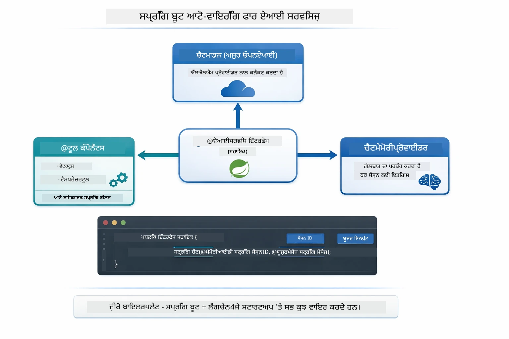

*@AiService ਇੰਟਰਫੇਸ ChatModel, ਟੂਲ ਕੰਪੋਨੈਂਟ ਅਤੇ ਮੈਮੋਰੀ ਪ੍ਰੋਵਾਈਡਰ ਨੂੰ ਜੋੜਦਾ ਹੈ — Spring Boot ਸਾਰਾ ਵਾਇਰਿੰਗ ਆਪਣੇ ਆਪ ਕਰਦਾ ਹੈ।*

ਹੇਠਾਂ HTTP ਅਰਜ਼ੀ ਤੋਂ ਲੈ ਕੇ ਕੰਟਰੋਲਰ, ਸਰਵਿਸ, ਅਤੇ ਆਟੋ-ਵਾਇਰਡ ਪ੍ਰੋਕਸੀ ਤੱਕ, ਫਿਰ ਟੂਲ ਟ_rੂ_ਤਰੱਕੀ ਅਤੇ ਵਾਪਸੀ ਦਾ ਪੂਰਾ ਜੀਵਨ ਚੱਕਰ ਹੈ:

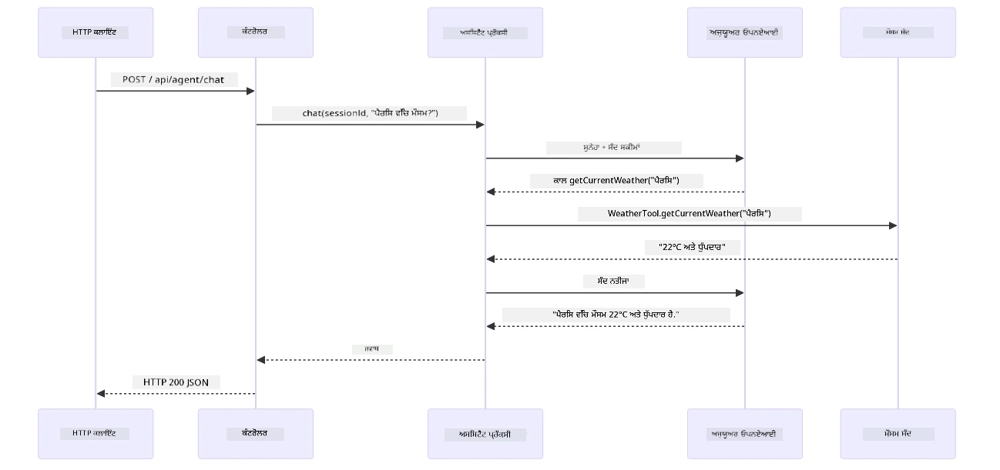

*ਪੂਰਾ Spring Boot ਅਰਜ਼ੀ ਜੀਵਨ ਚੱਕਰ — HTTP ਅਰਜ਼ੀ ਕੰਟਰੋਲਰ ਤੇ ਸਰਵਿਸ ਰਾਹੀਂ ਆਟੋ-ਵਾਇਰਡ Assistant ਪ੍ਰਾਕਸੀ ਤੱਕ ਜਾਂਦੀ ਹੈ ਜੋ LLM ਅਤੇ ਟੂਲ ਕਾਲਾਂ ਨੂੰ ਆਪਣੇ ਆਪ ਸੰਚਾਲਿਤ ਕਰਦਾ ਹੈ।*

ਇਸ ਤਰੀਕੇ ਦੇ ਮੁੱਖ ਫਾਇਦੇ:

- **Spring Boot auto-wiring** — ChatModel ਅਤੇ ਟੂਲ ਆਪ ਹੀ ਜੁੜ ਜਾਂਦੇ ਹਨ
- **@MemoryId ਪੈਟਰਨ** — ਆਪਣੇ ਆਪ ਸੈਸ਼ਨ-ਆਧਾਰਿਤ ਮੈਮੋਰੀ ਪ੍ਰਬੰਧ
- **ਇੱਕੋ ਉਮੀਦ** — Assistant ਇਕ ਵਾਰੀ ਬਣਾਇਆ ਜਾਂਦਾ ਹੈ ਅਤੇ ਵਧੀਆ ਪ੍ਰਦਰਸ਼ਨ ਲਈ ਦੁਬਾਰਾ ਵਰਤਿਆ ਜਾਂਦਾ ਹੈ
- **ਟਾਈਪ-ਸੁਰੱਖਿਅਤ ਅਮਲ** — ਜਾਵਾ ਮੈਥਡ ਸਿੱਧਾ ਟਾਈਪ ਕੁਨਵਰਜ਼ਨ ਨਾਲ ਕਾਲ ਹੁੰਦੇ ਹਨ
- **ਬਹੁ-ਚੱਕਰ ਸੰਚਾਲਨ** — ਆਟੋਮੈਟਿਕ ਟੂਲ ਚੈਨਿੰਗ ਨਿਭਾਈ ਜਾਂਦੀ ਹੈ
- **ਜ਼ੀਰੋ ਬੋਇਲਰਪਲੇਟ** — ਕੋਈ ਮੈਨੁਅਲ `AiServices.builder()` ਕਾਲ ਨਹੀਂ ਜਾਂ ਮੈਮੋਰੀ HashMap ਨਹੀਂ

ਵਿਕਲਪਕ ਤਰੀਕੇ (ਮੈਨੂਅਲ `AiServices.builder()`) ਵੱਧ ਕੋਡ ਦੀ ਮੰਗ ਕਰਦੇ ਹਨ ਅਤੇ Spring Boot ਇੰਟੀਗ੍ਰੇਸ਼ਨ ਦੇ ਫਾਇਦੇ ਨਹੀਂ ਦਿੰਦੇ।

## Tool Chaining

**Tool Chaining** — ਟੂਲ-ਆਧਾਰਤ ਏਜੈਂਟਾਂ ਦੀ ਅਸਲ ਤਾਕਤ ਉਸ ਵੇਲੇ ਵੇਖਣ ਨੂੰ ਮਿਲਦੀ ਹੈ ਜਦੋਂ ਇਕ ਸਵਾਲ ਲਈ ਕਈ ਟੂਲ ਚਾਹੀਦੇ ਹੋਣ। ਪੁੱਛੋ "ਸੀਅਟਲ ਵਿੱਚ ਮੌਸਮ ਫੈਰਨਹਾਈਟ ਵਿੱਚ ਕਿਵੇਂ ਹੈ?" ਅਤੇ ਏਜੈਂਟ ਆਪ-ਆਪ ਨੂੰ ਦੋ ਟੂਲ ਜੁੜਦੇ ਦੇਖਾਵੇਗਾ: ਪਹਿਲਾਂ ਇਹ `getCurrentWeather` ਕਾਲ ਕਰਦਾ ਹੈ, ਜਿਹੜਾ ਸੈਲਸੀਅਸ ਵਿੱਚ ਤਾਪਮਾਨ ਲਿਆਉਂਦਾ ਹੈ, ਫਿਰ ਇਸ ਮੁੱਲ ਨੂੰ `celsiusToFahrenheit` ਨੂੰ ਪਾਸ ਕਰਦਾ ਹੈ ਤਬਦੀਲੀ ਲਈ — ਸਾਰੇ ਇੱਕ ਗੱਲਬਾਤੇ ਕਦਮ ਵਿੱਚ।

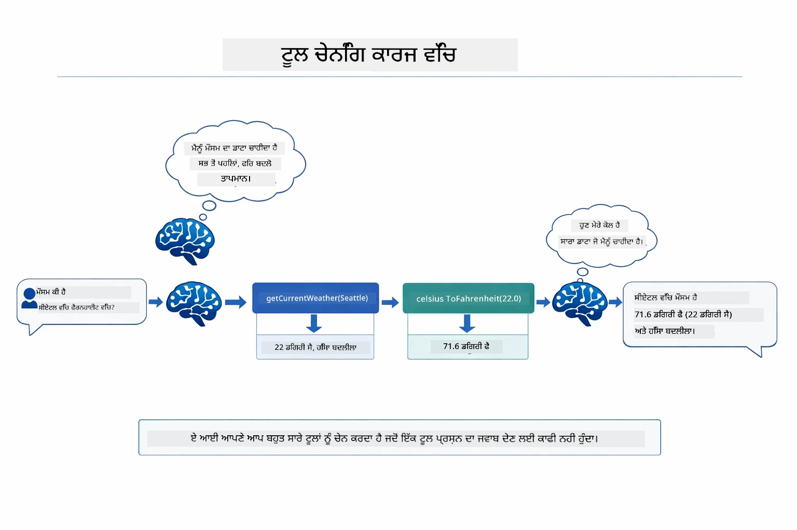

*ਟੂਲ ਚੈਨਿੰਗ ਕਾਰਜ ਵਿੱਚ — ਏਜੈਂਟ ਪਹਿਲਾਂ getCurrentWeather ਕਾਲ ਕਰਦਾ ਹੈ, ਫਿਰ ਸੈਲਸੀਅਸ ਨਤੀਜੇ ਨੂੰ celsiusToFahrenheit ਵਿੱਚ ਪਾਸ ਕਰਦਾ ਹੈ, ਅਤੇ ਮਿਲੀ-ਝੁਲੀ ਜਵਾਬ ਦਿੰਦਾ ਹੈ।*

**ਸੌਖੇ ਅਸਫਲਤਾ (Graceful Failures)** — ਕਿਸੇ ਐਸੇ ਸ਼ਹਿਰ ਦਾ ਮੌਸਮ ਪੁੱਛੋ ਜੋ ਮੌਕ ਡਾਟਾ ਵਿੱਚ ਨਹੀਂ ਹੈ। ਟੂਲ ਇੱਕ ਤਰੁਟ 메시ਜ ਵਾਪਸ ਕਰਦਾ ਹੈ, ਅਤੇ AI ਦੱਸਦਾ ਹੈ ਕਿ ਉਹ ਮਦਦ ਨਹੀਂ ਕਰ ਸਕਦਾ ਬਜਾਏ ਪਲੱਟਣ ਦੇ। ਟੂਲ ਸੁਰੱਖਿਅਤ ਤਰੀਕੇ ਨਾਲ ਅਸਫਲ ਹੁੰਦੇ ਹਨ। ਹੇਠਾਂ ਦਿੱਤਾ ਡਾਯਾਗ੍ਰਾਮ ਦੋ ਤਰੀਕਿਆਂ ਨੂੰ ਵੇਖਾਉਂਦਾ ਹੈ — ਠੀਕ ਤਰਤੀਬ ਨਾਲ ਗਲਤੀ ਸੰਭਾਲਣ ਨਾਲ, ਏਜੈਂਟ ਐਕਸਪਸ਼ਨ ਫੜ ਕੇ ਮਦਦਗਾਰ ਜਵਾਬ ਦਿੰਦਾ ਹੈ, ਪਰ ਬਿਨਾਂ ਇਸਦੇ ਪੂਰਾ ਐਪੜੀਕੇਸ਼ਨ ਕਰੈਸ਼ ਕਰ ਜਾਂਦਾ ਹੈ:

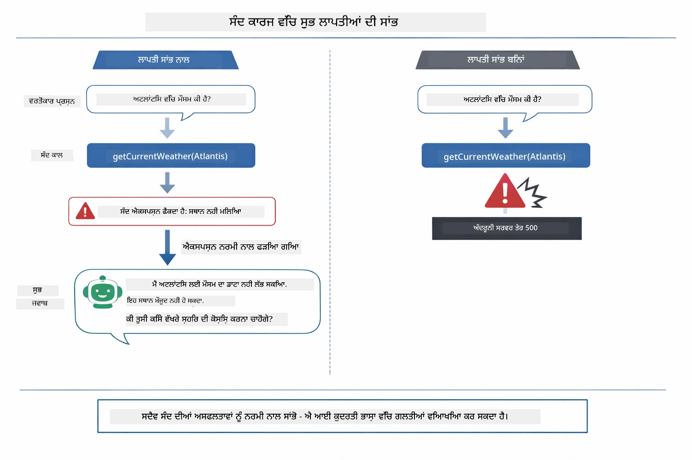

*ਜਦੋਂ ਟੂਲ ਅਸਫਲ ਹੁੰਦਾ ਹੈ, ਏਜੈਂਟ ਗਲਤੀ ਫੜਦਾ ਹੈ ਅਤੇ ਟੁੱਟਣ ਬਜਾਏ ਮਦਦਗਾਰ ਵਿਆਖਿਆ ਦੇਦਾ ਹੈ।*

ਇਹ ਸਾਰੇ ਇੱਕ ਹੀ ਗੱਲਬਾਤੇ ਕਦਮ ਵਿੱਚ ਹੁੰਦਾ ਹੈ। ਏਜੈਂਟ ਕਈ ਟੂਲ ਕਾਲਾਂ ਨੂੰ ਖੁਦ ਚਲਾਉਂਦਾ ਹੈ।

## Run the Application

**ਡਿਪਲੋਇਮੈਂਟ ਦੀ ਪੁਸ਼ਟੀ ਕਰੋ:**

ਪੱਕਾ ਕਰੋ ਕਿ `.env` ਫਾਈਲ ਰੂਟ ਡਾਇਰੈਕਟਰੀ ਵਿੱਚ Azure ਪ੍ਰਮਾਣਿਕਤਾ ਨਾਲ ਮੌਜੂਦ ਹੈ (Module 01 ਦੌਰਾਨ ਬਣਾਈ ਗਈ)। ਇਸਨੂੰ ਮੋਡੀਊਲ ਡਾਇਰੈਕਟਰੀ (`04-tools/`) ਤੋਂ ਚਲਾਓ:

**Bash:**
```bash
cat ../.env  # AZURE_OPENAI_ENDPOINT, API_KEY, DEPLOYMENT ਦਿਖਾਉਣਾ ਚਾਹੀਦਾ ਹੈ
```

**PowerShell:**
```powershell
Get-Content ..\.env  # AZURE_OPENAI_ENDPOINT, API_KEY, DEPLOYMENT ਦਿਖਾਉਣਾ ਚਾਹੀਦਾ ਹੈ
```

**ਐਪਲੀਕੇਸ਼ਨ ਸ਼ੁਰੂ ਕਰੋ:**

> **ਨੋਟ:** ਜੇ ਤੁਸੀਂ ਪਹਿਲਾਂ ਹੀ ਸਾਰੇ ਐਪਲੀਕੇਸ਼ਨਾਂ ਨੂੰ ਰੂਟ ਡਾਇਰੈਕਟਰੀ ਤੋਂ `./start-all.sh` ਨਾਲ ਚਾਲੂ ਕੀਤਾ ਹੈ (ਜਿਵੇਂ Module 01 ਵਿੱਚ ਵਰਨਿਤ ਹੈ), ਤਾਂ ਇਹ ਮੋਡੀਊਲ ਪਹਿਲਾਂ ਹੀ ਪੋਰਟ 8084 'ਤੇ ਚਲ ਰਿਹਾ ਹੈ। ਤੁਸੀਂ ਹੇਠਾਂ ਦਿੱਤੇ ਸਟਾਰਟ ਕਮਾਂਡਾਂ ਨੂੰ ਛੱਡ ਕੇ ਸਿੱਧਾ http://localhost:8084 ਤੇ ਜਾ ਸਕਦੇ ਹੋ।

**ਵਿਕਲਪ 1: Spring Boot ਡੈਸ਼ਬੋਰਡ ਵਰਤਣਾ (VS Code ਉਪਭੋਗਤਿਆਂ ਲਈ ਸੁਝਾਅ)**

ਡਿਵ контейਨਰ ਵਿੱਚ Spring Boot Dashboard ਐਕਸਟੇੰਸ਼ਨ ਸ਼ਾਮਿਲ ਹੈ, ਜੋ ਸਾਰੇ Spring Boot ਐਪਲੀਕੇਸ਼ਨਾਂ ਨੂੰ ਮੈਨੇਜ਼ ਕਰਨ ਲਈ ਇੱਕ ਦ੍ਰਿਸ਼ਯ ਇੰਟਰਫੇਸ ਦਿੰਦਾ ਹੈ। ਤੁਸੀਂ ਇਸਨੂੰ VS Code ਦੇ ਖੱਬੇ ਪਾਸੇ ਐਕਟਿਵਿਟੀ ਬਾਰ ਵਿਚ ਲੱਭ ਸਕਦੇ ਹੋ (Spring Boot ਆਈਕਨ ਵੇਖੋ)।

Spring Boot ਡੈਸ਼ਬੋਰਡ ਤੋਂ, ਤੁਸੀਂ:
- ਕਾਰਜ ਸਥਾਨ ਵਿੱਚ ਸਾਰੇ ਉਪਲਬਧ Spring Boot ਐਪਲੀਕੇਸ਼ਨ ਵੇਖ ਸਕਦੇ ਹੋ
- ਸਿੰਗਲ ਕਲਿੱਕ ਨਾਲ ਐਪਲੀਕੇਸ਼ਨਾਂ ਨੂੰ ਸ਼ੁਰੂ/ਰੋਕ ਸਕਦੇ ਹੋ
- ਰੀਅਲ-ਟਾਈਮ ਐਪਲੀਕੇਸ਼ਨ ਲੌਗਸ ਵੇਖ ਸਕਦੇ ਹੋ
- ਐਪਲੀਕੇਸ਼ਨ ਸਥਿਤੀ ਦੀ ਮਾਨੀਟਰਿੰਗ ਕਰ ਸਕਦੇ ਹੋ
ਸਿਰਫ "tools" ਕੋਲ ਖੇਡਣ ਦਾ ਬਟਨ ਕਲਿੱਕ ਕਰੋ ਇਸ ਮੋਡੀਊਲ ਨੂੰ ਸ਼ੁਰੂ ਕਰਨ ਲਈ, ਜਾਂ ਸਾਰੇ ਮੋਡੀਊਲ ਇਕੱਠੇ ਸ਼ੁਰੂ ਕਰੋ।

ਇੱਥੇ VS ਕੋਡ ਵਿੱਚ Spring Boot ਡੈਸ਼ਬੋਰਡ ਕਿਵੇਂ ਲੱਗਦਾ ਹੈ:


*VS ਕੋਡ ਵਿੱਚ Spring Boot ਡੈਸ਼ਬੋਰਡ — ਸਾਰੇ ਮੋਡੀਊਲ ਇੱਕ ਥਾਂ ਤੋਂ ਸ਼ੁਰੂ, ਰੋਕੋ, ਅਤੇ ਮਾਨੀਟਰ ਕਰੋ*

**ਵਿਕਲਪ 2: shell ਸਕ੍ਰਿਪਟਾਂ ਦੀ ਵਰਤੋਂ**

ਸਭ ਵੈੱਬ ਐਪਲੀਕੇਸ਼ਨਾਂ (ਮੋਡੀਊਲ 01-04) ਸ਼ੁਰੂ ਕਰੋ:

**Bash:**
```bash
cd ..  # ਰੂਟ ਡਾਇਰੈਕਟਰੀ ਤੋਂ
./start-all.sh
```

**PowerShell:**
```powershell
cd ..  # ਰੂਟ ਡਾਇਰੈਕਟਰੀ ਤੋਂ
.\start-all.ps1
```

ਜਾਂ ਸਿਰਫ ਇਸ ਮੋਡੀਊਲ ਨੂੰ ਸ਼ੁਰੂ ਕਰੋ:

**Bash:**
```bash
cd 04-tools
./start.sh
```

**PowerShell:**
```powershell
cd 04-tools
.\start.ps1
```

ਦੋਹਾਂ ਸਕ੍ਰਿਪਟ ਸਵੈਚਾਲਿਤ ਤੌਰ 'ਤੇ ਰੂਟ `.env` ਫਾਇਲ ਤੋਂ ਵਾਤਾਵਰਨ ਵੈਰੀਏਬਲ ਲੋਡ ਕਰਦੇ ਹਨ ਅਤੇ ਜੇ JAR ਫਾਇਲ ਮੌਜੂਦ ਨਹੀਂ ਹੋਂਦੀਆਂ ਤਾਂ ਉਹਨਾਂ ਨੂੰ ਬਣਾਉਂਦੇ ਹਨ।

> **ਨੋਟ:** ਜੇ ਤੁਸੀਂ ਸਾਰੇ ਮੋਡੀਊਲ ਮੈਨੂਅਲ ਤੌਰ 'ਤੇ ਬਣਾਉਣਾ ਚਾਹੁੰਦੇ ਹੋ ਸ਼ੁਰੂ ਕਰਨ ਤੋਂ ਪਹਿਲਾਂ:
>
> **Bash:**
> ```bash
> cd ..  # Go to root directory
> mvn clean package -DskipTests
> ```
>
> **PowerShell:**
> ```powershell
> cd ..  # Go to root directory
> mvn clean package -DskipTests
> ```

ਆਪਣੇ ਬ੍ਰਾਊਜ਼ਰ ਵਿੱਚ http://localhost:8084 ਖੋਲ੍ਹੋ।

**ਰੋਕਣ ਲਈ:**

**Bash:**
```bash
./stop.sh  # ਸਿਰਫ ਇਹ ਮੋਡੀਊਲ
# ਜਾਂ
cd .. && ./stop-all.sh  # ਸਾਰੇ ਮੋਡੀਊਲ
```

**PowerShell:**
```powershell
.\stop.ps1  # ਇਹ ਮਾਡਿਊਲ ਸਿਰਫ
# ਜਾਂ
cd ..; .\stop-all.ps1  # ਸਾਰੇ ਮਾਡਿਊਲ
```

## ਐਪਲੀਕੇਸ਼ਨ ਦੀ ਵਰਤੋਂ

ਐਪਲੀਕੇਸ਼ਨ ਇੱਕ ਵੈੱਬ ਇੰਟਰਫੇਸ ਮੁਹੱਈਆ ਕਰਵਾਉਂਦਾ ਹੈ ਜਿੱਥੇ ਤੁਸੀਂ ਇੱਕ AI ਏਜੰਟ ਨਾਲ ਗੱਲਬਾਤ ਕਰ ਸਕਦੇ ਹੋ ਜਿਸ ਨੂੰ ਮੌਸਮ ਅਤੇ ਤਾਪਮਾਨ ਰੂਪਾਂਤਰਨ ਟੂਲਾਂ ਤੱਕ ਪਹੁੰਚ ਹੈ। ਇੱਥੇ ਇੰਟਰਫੇਸ ਕਿਵੇਂ ਲੱਗਦਾ ਹੈ — ਇਸ ਵਿੱਚ ਤੁਰੰਤ ਸ਼ੁਰੂਆਤ ਲਈ ਉਦਾਹਰਣਾਂ ਅਤੇ ਬੇਨਤੀ ਭੇਜਣ ਲਈ ਚੈਟ ਪੈਨਲ ਸ਼ਾਮਿਲ ਹੈ:

<a href="images/tools-homepage.png"></a>

*AI ਏਜੰਟ ਟੂਲ ਇੰਟਰਫੇਸ - ਤੁਰੰਤ ਉਦਾਹਰਣਾਂ ਅਤੇ ਟੂਲਾਂ ਨਾਲ ਗੱਲਬਾਤ ਲਈ ਚੈਟ ਇੰਟਰਫੇਸ*

### ਸਧਾਰਣ ਟੂਲ ਵਰਤੋਂ ਦੀ ਕੋਸ਼ਿਸ਼ ਕਰੋ

ਇੱਕ ਸਿੱਧਾ ਬੇਨਤੀ ਨਾਲ ਸ਼ੁਰੂ ਕਰੋ: "100 ਡਿਗਰੀ ਫੈਰਨਹਾਈਟ ਨੂੰ ਸੈਲਸੀਅਸ ਵਿੱਚ ਬਦਲੋ"। ਏਜੰਟ ਸਮਝਦਾ ਹੈ ਕਿ ਇਸ ਨੂੰ ਤਾਪਮਾਨ ਰੂਪਾਂਤਰਨ ਟੂਲ ਦੀ ਲੋੜ ਹੈ, ਸਹੀ ਪੈਰਾਮੀਟਰਾਂ ਨਾਲ ਇਸਨੂੰ ਕਾਲ ਕਰਦਾ ਹੈ ਅਤੇ ਨਤੀਜਾ ਵਾਪਸ ਕਰਦਾ ਹੈ। ਧਿਆਨ ਦਿਓ ਕਿ ਇਹ ਪ੍ਰਕਿਰਿਆ ਕਿੰਨੀ ਕੁ ਕੁਦਰਤੀ ਮਹਿਸੂਸ ਹੁੰਦੀ ਹੈ - ਤੁਸੀਂ ਨਹੀਂ ਦੱਸਿਆ ਕਿ ਕਿਹੜਾ ਟੂਲ ਵਰਤਣਾ ਹੈ ਜਾਂ ਕਿਵੇਂ ਕਾਲ ਕਰਨਾ ਹੈ।

### ਟੂਲ ਚੇਨਿੰਗ ਦੀ ਜਾਂਚ ਕਰੋ

ਹੁਣ ਕੁਝ ਹੋਰ ਜਟਿਲ ਕੋਸ਼ਿਸ਼ ਕਰੋ: "ਸੀਏਟਲ ਵਿੱਚ ਮੌਸਮ ਕੀ ਹੈ ਅਤੇ ਇਸਨੂੰ ਫੈਰਨਹਾਈਟ ਵਿੱਚ ਬਦਲੋ?" ਵੇਖੋ ਕਿ ਏਜੰਟ ਕਿਵੇਂ ਕਦਮ ਬਦਲ ਕੇ ਕੰਮ ਕਰਦਾ ਹੈ। ਪਹਿਲਾਂ ਇਹ ਮੌਸਮ ਲੈਂਦਾ ਹੈ (ਜੋ ਸੈਲਸੀਅਸ ਵਿੱਚ ਹੁੰਦਾ ਹੈ), ਫਿਰ ਸਮਝਦਾ ਹੈ ਕਿ ਫੈਰਨਹਾਈਟ ਵਿੱਚ ਬਦਲਣਾ ਪਵੇਗਾ, ਰੂਪਾਂਤਰਨ ਟੂਲ ਕਾਲ ਕਰਦਾ ਹੈ, ਅਤੇ ਦੋਹਾਂ ਨਤੀਜਿਆਂ ਨੂੰ ਇਕੱਠਾ ਕਰਕੇ ਇਕ ਜਵਾਬ ਦਿੰਦਾ ਹੈ।

### ਗੱਲਬਾਤ ਦਾ ਪ੍ਰਵੇਹ ਦੇਖੋ

ਚੈਟ ਇੰਟਰਫੇਸ ਗੱਲਬਾਤ ਦਾ ਇਤਿਹਾਸ ਸਾਂਭਦਾ ਹੈ, ਜਿਸ ਨਾਲ ਤੁਸੀਂ ਕਈ ਮੋਰਚਿਆਂ ਦੀ ਗੱਲਬਾਤ ਕਰ ਸਕਦੇ ਹੋ। ਤੁਸੀਂ ਸਾਰੇ ਪਿਛਲੇ ਸਵਾਲ ਅਤੇ ਜਵਾਬ ਵੇਖ ਸਕਦੇ ਹੋ, ਜੋ ਗੱਲਬਾਤ ਨੂੰ ਟ੍ਰੈਕ ਕਰਨ ਅਤੇ ਸਮਝਣ ਵਿੱਚ ਅਸਾਨੀ ਹੁੰਦੀ ਹੈ ਕਿ ਏਜੰਟ ਕਿਵੇਂ ਵੱਖ-ਵੱਖ ਮੋੜਾਂ 'ਤੇ ਸੰਦਰਭ ਬਣਾ ਰਿਹਾ ਹੈ।

<a href="images/tools-conversation-demo.png"></a>

*ਕਈ ਮੋੜਾਂ ਦੀ ਗੱਲਬਾਤ ਜਿਸ ਵਿੱਚ ਸਧਾਰਣ ਰੂਪਾਂਤਰਨ, ਮੌਸਮ ਦੀ ਜਾਂਚ ਅਤੇ ਟੂਲ ਚੇਨਿੰਗ ਦਰਸਾਈ ਗਈ ਹੈ*

### ਵੱਖ-ਵੱਖ ਬੇਨਤੀਆਂ ਨਾਲ ਅਜ਼ਮਾਇਸ਼ ਕਰੋ

ਕਈ ਕਿਸਮਾਂ ਦੀਆਂ ਬੇਨਤੀਆਂ ਕੋਸ਼ਿਸ਼ ਕਰੋ:  
- ਮੌਸਮ ਦੀ ਜਾਂਚ: "ਟੋਕੀਓ ਵਿੱਚ ਮੌਸਮ ਕੀ ਹੈ?"  
- ਤਾਪਮਾਨ ਰੂਪਾਂਤਰਨ: "25°C ਕਿਵਲਿਨ ਵਿੱਚ ਕਿੰਨਾ ਹੈ?"  
- ਮਿਲੀਆਂ ਜੁਲੀਆਂ ਬੇਨਤੀਆਂ: "ਪੈਰਿਸ ਵਿੱਚ ਮੌਸਮ ਦੀ ਜਾਂਚ ਕਰੋ ਅਤੇ ਦੱਸੋ ਕਿ ਕੀ ਇਹ 20°C ਤੋਂ ਉੱਪਰ ਹੈ"

ਧਿਆਨ ਦਿਓ ਕਿ ਏਜੰਟ ਕੁਦਰਤੀ ਭਾਸ਼ਾ ਨੂੰ ਕਿਵੇਂ ਸਮਝਦਾ ਹੈ ਅਤੇ ਸਹੀ ਟੂਲ ਕਾਲਾਂ ਨਾਲ ਜੋੜਦਾ ਹੈ।

## ਮੁੱਖ ਧਾਰਣਾਵਾਂ

### ReAct ਪੈਟਰਨ (ਸੋਚਣ ਅਤੇ ਕਰਵਾਈ)

ਏਜੰਟ ਸੋਚ-ਵਿਚਾਰ (ਕੀ ਕਰਨਾ ਹੈ) ਅਤੇ ਕਾਰਵਾਈ (ਟੂਲਾਂ ਦੀ ਵਰਤੋਂ) ਵਿਚਕਾਰ ਪਰਿਵਰਤਨ ਕਰਦਾ ਹੈ। ਇਹ ਡਿੱਗਰੀਆ-ਸਮੱਸਿਆ ਹੱਲ ਕਰਨ ਸਮਰੱਥਾ ਪ੍ਰਦਾਨ ਕਰਦਾ ਹੈ ਨਾ ਕਿ ਸਿਰਫ ਹੁਕਮਾਂ 'ਤੇ ਜਵਾਬ ਦੇਣਾ।

### ਟੂਲ ਵਰਣਨਾਂ ਮਹੱਤਵਪੂਰਨ ਹੁੰਦੀਆਂ ਹਨ

ਟੂਲ ਦੀਆਂ ਵਰਣਨਾਂ ਦੀ ਗੁਣਵੱਤਾ ਇਹ ਦਰਸਾਉਂਦੀ ਹੈ ਕਿ ਏਜੰਟ ਕਿਵੇਂ ਬਿਹਤਰ ਇਸਨੂੰ ਵਰਤਦਾ ਹੈ। ਸਾਫ਼ ਅਤੇ ਵਿਸ਼ੇਸ਼ ਵਰਣਨਾਂ ਮਾਡਲ ਨੂੰ ਸਮਝਾਉਂਦੀਆਂ ਹਨ ਕਿ ਕਦੋਂ ਤੇ ਕਿਵੇਂ ਹਰ ਟੂਲ ਕਾਲ ਕਰਨੀ ਹੈ।

### ਸੈਸ਼ਨ ਪ੍ਰਬੰਧਨ

`@MemoryId` ਐਨੋਟੇਸ਼ਨ ਆਟੋਮੈਟਿਕ ਸੈਸ਼ਨ-ਅਧਾਰਿਤ ਯਾਦਦਾਸ਼ਤ ਪ੍ਰਬੰਧਨ ਯੋਗ ਬਣਾਉਂਦਾ ਹੈ। ਪ੍ਰਤੀਕ ਸੈਸ਼ਨ ID ਦਾ ਇੱਕ ਵਿਲੱਖਣ `ChatMemory` ਇਨਸਟੈਂਸ ਹੁੰਦਾ ਹੈ ਜੋ `ChatMemoryProvider` ਬੀਨ ਵੱਲੋਂ ਪ੍ਰਬੰਧਿਤ ਹੁੰਦਾ ਹੈ, ਜਿਸ ਨਾਲ ਕਈ ਯੂਜ਼ਰ ਇਕੱਠੇ ਏਜੰਟ ਨਾਲ ਗੱਲਬਾਤ ਕਰ ਸਕਦੇ ਹਨ ਬਿਨਾਂ ਇੱਕ ਦੂਜੇ ਦੀ ਗੱਲਬਾਤ ਮਿਲੇ। ਹੇਠਾਂ ਦਿੱਤੀ ਚਿੱਤਰਕਲਾ ਦਿਖਾਉਂਦੀ ਹੈ ਕਿ ਕਿਵੇਂ ਕਈ ਯੂਜ਼ਰਾਂ ਨੂੰ ਵੱਖ-ਵੱਖ ਯਾਦਦਾਸ਼ਤ ਸਟੋਰਾਂ 'ਚ ਭੇਜਿਆ ਜਾਂਦਾ ਹੈ ਉਹਨਾਂ ਦੇ ਸੈਸ਼ਨ ID ਦੇ ਅਧਾਰ 'ਤੇ:

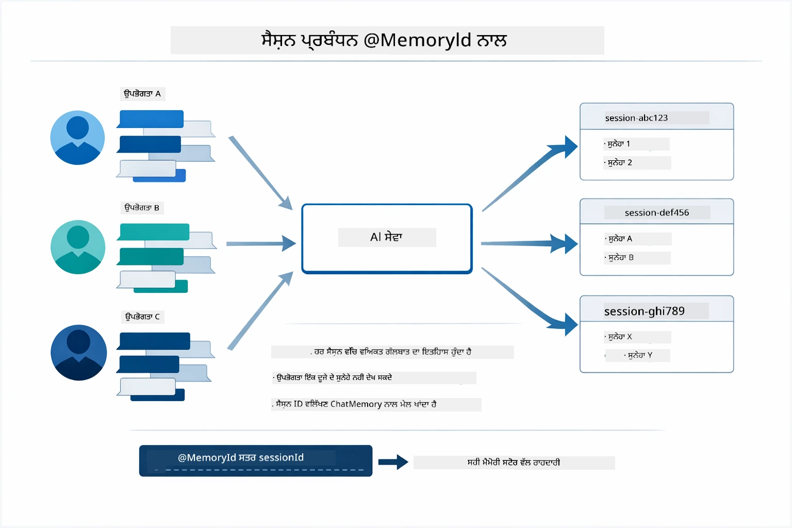

*ਹਰ ਸੈਸ਼ਨ ID ਇੱਕ ਵੱਖਰੀ ਗੱਲਬਾਤ ਇਤਿਹਾਸ ਨਾਲ ਜੋੜੀ ਜਾਂਦੀ ਹੈ — ਯੂਜ਼ਰ ਕਦੇ ਇੱਕ ਦੂਜੇ ਦੇ ਸੁਨੇਹੇ ਨਹੀਂ ਵੇਖਦੇ।*

### ਗਲਤੀ ਸੰਭਾਲਣਾ

ਟੂਲ ਫੇਲ ਹੋ ਸਕਦੇ ਹਨ — API ਸਮੇਂ ਤੋਂ ਬਾਅਦ ਬੰਦ ਹੋ ਸਕਦੇ ਹਨ, ਪੈਰਾਮੀਟਰ ਗਲਤ ਹੋ ਸਕਦੇ ਹਨ, ਬਾਹਰੀ ਸੇਵਾਵਾਂ ਡਾਊਨ ਹੋ ਸਕਦੀਆਂ ਹਨ। ਪ੍ਰੋਡਕਸ਼ਨ ਏਜੰਟਾਂ ਲਈ ਗਲਤੀ ਸੰਭਾਲਣ ਦੀ ਲੋੜ ਹੁੰਦੀ ਹੈ ਤਾਂ ਜੋ ਮਾਡਲ ਸਮੱਸਿਆ ਨੂੰ ਸਮਝਾ ਸਕੇ ਜਾਂ ਵਿਕਲਪਾਂ ਦੀ ਕੋਸ਼ਿਸ਼ ਕਰ ਸਕੇ ਨਾ ਕਿ ਸਾਰੇ ਐਪਲੀਕੇਸ਼ਨ ਨੂੰ ਬੰਧ ਕਰ ਦੇਵੇ। ਜਦੋਂ ਕੋਈ ਟੂਲ(exception) ਛੱਡਦਾ ਹੈ, LangChain4j ਉਸ ਨੂੰ ਫੜਦਾ ਹੈ ਅਤੇ ਗਲਤੀ ਦਾ ਸੁਨੇਹਾ ਮਾਡਲ ਨੂੰ ਦੇ ਦਿੰਦਾ ਹੈ, ਜੋ ਫਿਰ ਕੁਦਰਤੀ ਭਾਸ਼ਾ ਵਿੱਚ ਸਮੱਸਿਆ ਦਰਸਾ ਸਕਦਾ ਹੈ।

## ਉਪਲਬਧ ਟੂਲ

ਹੇਠਾਂ ਦਿੱਤੀ ਚਿੱਤਰਕਲਾ ਤੁਹਾਨੂੰ ਇਮਕਾਨ ਦਿੱਤੀ ਟੂਲਾਂ ਦਾ ਵਿਆਪਕ ਪਰਿਚਯ ਦਿੰਦੀ ਹੈ। ਇਹ ਮੋਡੀਊਲ ਮੌਸਮ ਅਤੇ ਤਾਪਮਾਨ ਟੂਲਾਂ ਨੂੰ ਦਰਸਾਉਂਦਾ ਹੈ, ਪਰ ਉਹੀ `@Tool` ਪੈਟਰਨ ਕਿਸੇ ਵੀ ਜਾਵਾ ਵਿਧੀ ਲਈ ਕੰਮ ਕਰਦਾ ਹੈ — ਡੇਟਾਬੇਸ ਕੁਐਰੀ ਤੋਂ लेकर ਭੁਗਤਾਨ ਪ੍ਰਕਿਰਿਆ ਤੱਕ।

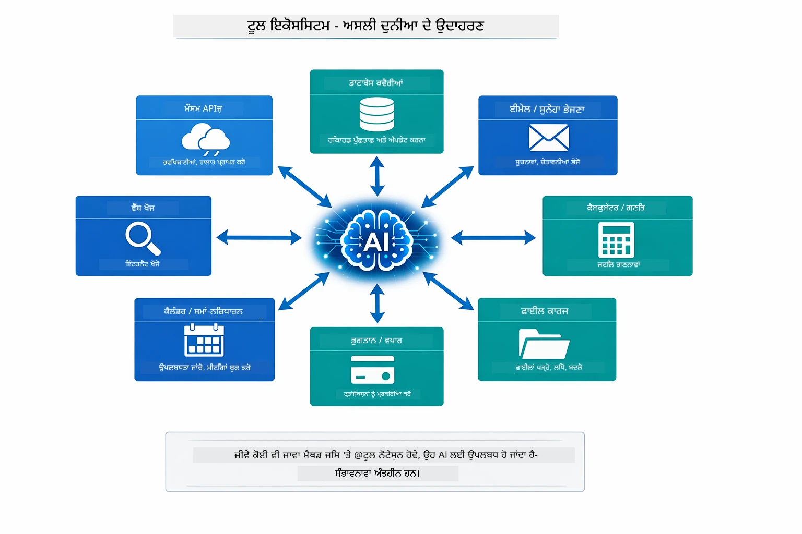

*ਕੋਈ ਵੀ ਜਾਵਾ ਵਿਧੀ ਜਿਸ ਨਾਲ @Tool ਐਨੋਟੇਟ ਕੀਤੀ ਗਈ ਹੋਏ, AI ਲਈ ਉਪਲਬਧ ਹੋ ਜਾਂਦੀ ਹੈ — ਪੈਟਰਨ ਡੇਟਾਬੇਸ, API, ਈਮੇਲ, ਫਾਇਲ ਆਪਰੇਸ਼ਨਜ਼ ਅਤੇ ਹੋਰ ਲਈ ਵਧਦਾ ਹੈ।*

## ਟੂਲ-ਅਧਾਰਿਤ ਏਜੰਟ ਕਦੋਂ ਵਰਤਣੇ

ਹਰ ਬੇਨਤੀ ਨੂੰ ਟੂਲਾਂ ਦੀ ਲੋੜ ਨਹੀਂ ਹੁੰਦੀ। ਫੈਸਲਾ ਇਹ ਹੋਦਾ ਹੈ ਕਿ ਕਿ AI ਨੂੰ ਬਾਹਰੀ ਪ੍ਰਣਾਲੀਆਂ ਨਾਲ ਗੱਲ ਕਰਨੀ ਹੈ ਜਾਂ ਆਪਣੀ ਜਾਣਕਾਰੀ ਤੋਂ ਜਵਾਬ ਦੇ ਸਕਦਾ ਹੈ। ਹੇਠਾਂ ਦਿੱਤਾ ਗਾਈਡ ਸਾਰ ਕਰਦਾ ਹੈ ਕਿ ਕਦੋਂ ਟੂਲ ਮਹੱਤਵਪੂਰਨ ਹੁੰਦੇ ਹਨ ਅਤੇ ਕਦੋਂ ਉਹਨਾਂ ਦੀ ਲੋੜ ਨਹੀਂ:

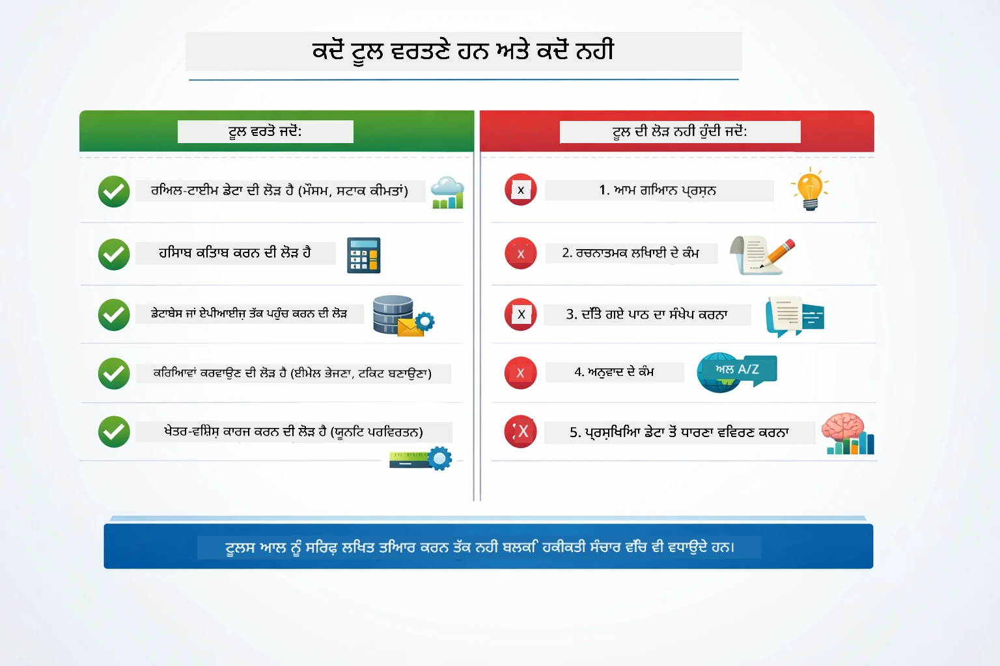

*ਇੱਕ ਤੇਜ਼ ਫੈਸਲਾ ਗਾਈਡ — ਟੂਲ ਤੁਰੰਤ ਡਾਟਾ, ਗਣਨਾ, ਅਤੇ ਕਾਰਵਾਈ ਲਈ; ਆਮ ਗਿਆਨ ਅਤੇ ਰਚਨਾਤਮਕ ਕੰਮਾਂ ਲਈ ਲੋੜ ਨਹੀਂ।*

## ਟੂਲਜ਼ ਵੱਲੋਂ RAG ਨਾਲ ਤੁਲਨਾ

ਮੋਡੀਊਲ 03 ਅਤੇ 04 ਦੋਹਾਂ AI ਦੀ ਯੋਗਤਾ ਵਧਾਉਂਦੇ ਹਨ, ਪਰ ਬੁਨਿਆਦੀ ਤੌਰ 'ਤੇ ਵੱਖਰੇ ਤਰੀਕੇ ਨਾਲ। RAG ਮਾਡਲ ਨੂੰ **ਗਿਆਨ** ਦਸਤਾਵੇਜ਼ ਪਰਾਪਤ ਕਰਕੇ ਪ੍ਰਦਾਨ ਕਰਦਾ ਹੈ। ਟੂਲ ਮਾਡਲ ਨੂੰ ਕਾਰਵਾਈਆਂ ਕਰਨ ਦੀ ਸਮਰੱਥਾ ਦਿੰਦੇ ਹਨ ਫੰਕਸ਼ਨ ਕਾਲ ਕਰਕੇ। ਹੇਠਾਂ ਦਿੱਤੀ ਚਿੱਤਰਕਲਾ ਇਹ ਦੋਹਾਂ ਪদ্ধਤੀਆਂ ਦੇ ਸਾਈਡ-ਬਾਈ-ਸਾਈਡ ਤੁਲਨਾ ਕਰਦੀ ਹੈ — ਕਿ ਹਰ ਵਰਕਫਲੋ ਕਿਵੇਂ ਕੰਮ ਕਰਦਾ ਹੈ ਅਤੇ ਇਹਨਾਂ ਦੇ ਵਿਚਕਾਰ ਕਿਹੜੇ ਫਾਇਦੇ ਅਤੇ ਘਾਟ ਹਨ:

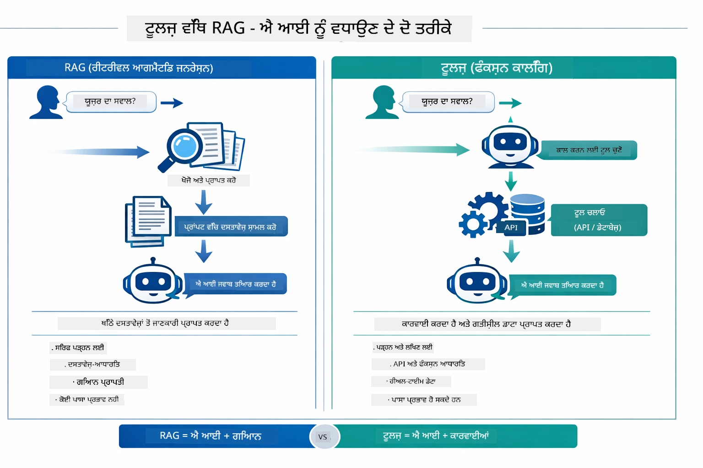

*RAG ਸਥਿਰ ਦਸਤਾਵੇਜ਼ਾਂ ਤੋਂ ਜਾਣਕਾਰੀ ਲੈਂਦਾ ਹੈ — ਟੂਲ ਕਾਰਵਾਈ ਕੱਢਦੇ ਹਨ ਅਤੇ ਗਤੀਸ਼ੀਲ, ਤੁਰੰਤ ਡਾਟਾ ਪ੍ਰਾਪਤ ਕਰਦੇ ਹਨ। ਬਹੁਤ ਸਾਰੇ ਪ੍ਰੋਡਕਸ਼ਨ ਸਿਸਟਮ ਦੋਹਾਂ ਜੋੜਦੇ ਹਨ।*

ਅਮਲੀ ਜੀਵਨ ਵਿੱਚ, ਬਹੁਤੇ ਪ੍ਰੋਡਕਸ਼ਨ ਸਿਸਟਮ ਦੋਹਾਂ ਤਰੀਕਿਆਂ ਨੂੰ ਜੋੜਦੇ ਹਨ: RAG ਤੁਹਾਡੇ ਦਸਤਾਵੇਜ਼ਾਂ ਵਿੱਚ ਜਵਾਬਾਂ ਦਾ ਮੂਲ ਦਿੰਦਾ ਹੈ, ਅਤੇ ਟੂਲ ਲਾਈਵ ਡਾਟਾ ਪ੍ਰਾਪਤ ਕਰਨ ਜਾਂ ਕਾਰਵਾਈ ਕਰਨ ਲਈ।

## ਅਗਲੇ ਕਦਮ

**ਅਗਲਾ ਮੋਡੀਊਲ:** [05-mcp - ਮਾਡਲ ਸੰਦਰਭ ਪ੍ਰੋਟੋਕੋਲ (MCP)](../05-mcp/README.md)

---

**ਨੈਵੀਗੇਸ਼ਨ:** [← ਪਹਿਲਾਂ: ਮੋਡੀਊਲ 03 - RAG](../03-rag/README.md) | [ਮੁੱਖ ਪੰਨੇ ਤੇ ਵਾਪਸ](../README.md) | [ਅਗਲਾ: ਮੋਡੀਊਲ 05 - MCP →](../05-mcp/README.md)

---

<!-- CO-OP TRANSLATOR DISCLAIMER START -->
**ਰਾਖੀ**
ਇਸ ਦਸਤਾਵੇਜ਼ ਦਾ ਅਨੁਵਾਦ ਏਆਈ ਅਨੁਵਾਦ ਸੇਵਾ [Co-op Translator](https://github.com/Azure/co-op-translator) ਦੀ ਵਰਤੋਂ ਕਰਕੇ ਕੀਤਾ ਗਿਆ ਹੈ। ਜਦੋਂ ਕਿ ਅਸੀਂ ਸਹੀਤਾ ਲਈ ਯਤਨਸ਼ੀਲ ਹਾਂ, ਕਿਰਪਾ ਕਰਕੇ ਧਿਆਨ ਵਿੱਚ ਰੱਖੋ ਕਿ ਸਵੈਚਾਲਿਤ ਅਨੁਵਾਦਾਂ ਵਿੱਚ ਗਲਤੀਆਂ ਜਾਂ ਅਸਮਰੱਥਤਾਵਾਂ ਹੋ ਸਕਦੀਆਂ ਹਨ। ਮੂਲ ਦਸਤਾਵੇਜ਼ ਨੂੰ ਇਸ ਦੀ ਮੂਲ ਭਾਸ਼ਾ ਵਿੱਚ ਹੀ ਅਧਿਕਾਰਕ ਸਰੋਤ ਮੰਨਿਆ ਜਾਣਾ ਚਾਹੀਦਾ ਹੈ। ਜਰੂਰੀ ਜਾਣਕਾਰੀ ਲਈ, ਵਿਸ਼ੇਸ਼ਗਿਆਨ ਵਾਲੇ ਮਨੁੱਖੀ ਅਨੁਵਾਦ ਦੀ ਸਿਫ਼ਾਰਸ਼ ਕੀਤੀ ਜਾਂਦੀ ਹੈ। ਅਸੀਂ ਇਸ ਅਨੁਵਾਦ ਦੀ ਵਰਤੋਂ ਤੋਂ ਪੈਦਾ ਹੋਣ ਵਾਲੇ ਕਿਸੇ ਵੀ ਗਲਤਫਹਿਮੀ ਜਾਂ ਗਲਤ ਸਮਝ ਲਈ ਜ਼ਿੰਮੇਵਾਰ ਨਹੀਂ ਹਾਂ।
<!-- CO-OP TRANSLATOR DISCLAIMER END -->