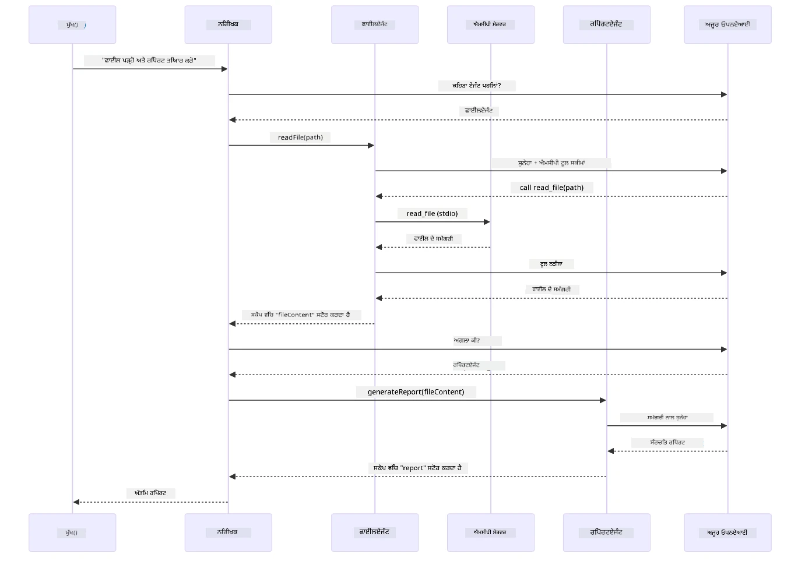

# ਮੌਡਿਊਲ 05: ਮਾਡਲ ਸੰਦੇਸ਼ ਪ੍ਰੋਟੋਕਾਲ (MCP)

## ਸਮੱਗਰੀ ਸੂਚੀ

- [ਵੀਡੀਓ ਵਾਕਥਰੂ](../../../05-mcp)
- [ਤੁਸੀਂ ਕੀ ਸਿੱਖੋਗੇ](../../../05-mcp)
- [MCP ਕੀ ਹੈ?](../../../05-mcp)
- [MCP ਕਿਵੇਂ ਕੰਮ ਕਰਦਾ ਹੈ](../../../05-mcp)
- [ਏਜੇਂਟਿਕ ਮੌਡਿਊਲ](../../../05-mcp)
- [ਉਦਾਹਰਨਾਂ ਚਲਾਉਣਾ](../../../05-mcp)
  - [ਪੂਰਵ-ਆਵਸ਼ਯਕਤਾ](../../../05-mcp)
- [ਤੁਰੰਤ ਸ਼ੁਰੂਆਤ](../../../05-mcp)
  - [ਫਾਇਲ ਕੰਮ (ਸਟਡੀਓ)](../../../05-mcp)
  - [ਸੁਪਰਵਾਈਜ਼ਰ ਏਜੇਂਟ](../../../05-mcp)
    - [ਡੈਮੋ ਚਲਾਉਣਾ](../../../05-mcp)
    - [ਸੁਪਰਵਾਈਜ਼ਰ ਕਿਵੇਂ ਕੰਮ ਕਰਦਾ ਹੈ](../../../05-mcp)
    - [ਫਾਇਲਏਜੇਂਟ ਕੀਮਤੇ ਸਮੇਂ 'ਤੇ MCP ਟੂਲ ਕਿਵੇਂ ਖੋਜਦਾ ਹੈ](../../../05-mcp)
    - [ਪ੍ਰਤੀਕਿਰਿਆ ਰਣਨੀਤੀਆਂ](../../../05-mcp)
    - [ਆਉਟਪੁੱਟ ਨੂੰ ਸਮਝਣਾ](../../../05-mcp)
    - [ਏਜੇਂਟਿਕ ਮੌਡਿਊਲ ਫੀਚਰਾਂ ਦੀ ਵਿਆਖਿਆ](../../../05-mcp)
- [ਮੁੱਖ ਧਾਰਨਾਵਾਂ](../../../05-mcp)
- [ਵਧਾਈ ਹੋਵੇ!](../../../05-mcp)
  - [ਅੱਗੇ ਕੀ?](../../../05-mcp)

## ਵੀਡੀਓ ਵਾਕਥਰੂ

ਇਸ ਲਾਈਵ ਸੈਸ਼ਨ ਨੂੰ ਦੇਖੋ ਜੋ ਦੱਸਦਾ ਹੈ ਕਿ ਇਸ ਮੌਡਿਊਲ ਨਾਲ ਕਿਵੇਂ ਸ਼ੁਰੂਆਤ ਕਰਨੀ ਹੈ:

<a href="https://www.youtube.com/watch?v=O_J30kZc0rw"></a>

## ਤੁਸੀਂ ਕੀ ਸਿੱਖੋਗੇ

ਤੁਸੀਂ ਸੰਵਾਦਾਤਮਕ ਏਆਈ ਬਣਾਈ ਹੈ, ਪ੍ਰੋਂਪਟਾਂ ‘ਤੇ ਮਾਹਿਰ ਹੋ ਚੁੱਕੇ ਹੋ, ਦਸਤਾਵੇਜ਼ਾਂ ਵਿੱਚ ਅਧਾਰਿਤ ਜਵਾਬ ਦਿੱਤੇ ਹਨ ਅਤੇ ਹਥਿਆਰਾਂ ਵਾਲੇ ਏਜੇਂਟ ਬਣਾਏ ਹਨ। ਪਰ ਉਹ ਸਾਰੇ ਹਥਿਆਰ ਤੁਹਾਡੇ ਖ਼ਾਸ ਐਪਲੀਕੇਸ਼ਨ ਲਈ ਤਿਆਰ ਕੀਤੇ ਗਏ ਸਨ। ਜੇ ਤੁਸੀਂ ਆਪਣੇ ਏਆਈ ਨੂੰ ਹਥਿਆਰਾਂ ਦੇ ਇਕ ਮਿਆਰੀ ਇਕੋਸਿਸਟਮ ਤੱਕ ਪਹੁੰਚ ਦੇ ਸਕਦੇ ਹੋ ਜੋ ਕੋਈ ਵੀ ਬਣਾਉਂਦਾ ਤੇ ਸਾਂਝਾ ਕਰ ਸਕਦਾ ਹੈ? ਇਸ ਮੌਡਿਊਲ ਵਿੱਚ, ਤੁਸੀਂ ਮਾਡਲ ਸੰਦੇਸ਼ ਪ੍ਰੋਟੋਕਾਲ (MCP) ਅਤੇ LangChain4j ਦੇ ਏਜੇਂਟਿਕ ਮੌਡਿਊਲ ਨਾਲ ਇਹ ਕਿਵੇਂ ਕਰਨਾ ਹੈ, ਸਿੱਖੋਗੇ। ਅਸੀਂ ਪਹਿਲਾਂ ਇੱਕ ਸਧਾਰਣ MCP ਫਾਇਲ ਰੀਡਰ ਦਿਖਾਈਏਗਾ ਅਤੇ ਫਿਰ ਦਿਖਾਵਾਂਗੇ ਕਿ ਇਹ ਸੌਖੇ ਤਰੀਕੇ ਨਾਲ ਸੁਪਰਵਾਈਜ਼ਰ ਏਜੇਂਟ ਨਮੂਨਾ ਵਰਤਕੇ ਉੱਨਤ ਏਜੇਂਟਿਕ ਵਰਕਫਲੋ ਵਿੱਚ ਕਿਵੇਂ ਇੰਟੀਗਰੇਟ ਹੁੰਦਾ ਹੈ।

## MCP ਕੀ ਹੈ?

ਮਾਡਲ ਸੰਦੇਸ਼ ਪ੍ਰੋਟੋਕਾਲ (MCP) ਇਹ ਦਿੰਦਾ ਹੈ - ਇਕ ਮਿਆਰੀ ਤਰੀਕਾ ਜਿਸ ਨਾਲ ਏਆਈ ਐਪਲੀਕੇਸ਼ਨਾਂ ਨੂੰ ਬਾਹਰੀ ਹਥਿਆਰ ਖੋਜਣ ਅਤੇ ਵਰਤਣ ਲਈ। ਹਰ ਇੱਕ ਡਾਟਾ ਸਰੋਤ ਜਾਂ ਸੇਵਾ ਲਈ ਕਸਟਮ ਇੰਟੀਗਰੇਸ਼ਨ ਲਿਖਣ ਦੀ ਬਜਾਏ, ਤੁਸੀਂ MCP ਸਰਵਰਾਂ ਨਾਲ ਜੁੜਦੇ ਹੋ ਜੋ ਆਪਣੇ ਸਮਰੱਥਾਵਾਂ ਨੂੰ ਇੱਕ ਮਿਆਰੀ ਫਾਰਮੈਟ ਵਿੱਚ ਪ੍ਰਗਟ ਕਰਦੇ ਹਨ। ਤੁਹਾਡਾ ਏਆਈ ਏਜੇਂਟ ਫਿਰ ਇਹ ਹਥਿਆਰ ਆਪਣੇ ਆਪ ਖੋਜ ਕੇ ਵਰਤ ਸਕਦਾ ਹੈ।

ਹੇਠਾਂ ਦਿੱਤਾ ਚਿੱਤਰ ਫਰਕ ਦਿਖਾਉਂਦਾ ਹੈ — ਬਿਨਾ MCP ਦੇ, ਹਰ ਇਕ ਇੰਟੀਗਰੇਸ਼ਨ ਲਈ ਕਸਟਮ ਪਾਇੰਟ-ਟੂ-ਪਾਇੰਟ ਵਾਇਰਿੰਗ ਵੱਖਰੀ ਲੋੜ ਹੁੰਦੀ ਹੈ; MCP ਨਾਲ, ਇੱਕ ਪਤਾ protocol ਤੁਹਾਡੇ ਐਪ ਨੂੰ ਕਿਸੇ ਵੀ ਟੂਲ ਨਾਲ ਜੋੜਦਾ ਹੈ:


*MCP ਤੋਂ ਪਹਿਲਾਂ: ਅਜੀਬ-ਪੁਆਇੰਟ-ਟੂ-ਪੁਆਇੰਟ ਇੰਟੀਗਰੇਸ਼ਨ। MCP ਤੋਂ ਬਾਅਦ: ਇੱਕ ਪ੍ਰੋਟੋਕਾਲ, ਅੰਤਹੀਨ ਸੰਭਾਵਨਾਵਾਂ।*

MCP AI ਵਿਕਾਸ ਵਿੱਚ ਇੱਕ ਬੁਨਿਆਦੀ ਸਮੱਸਿਆ ਹੱਲ ਕਰਦਾ ਹੈ: ਹਰ ਇਕ ਇੰਟੀਗਰੇਸ਼ਨ ਕਸਟਮ ਹੁੰਦਾ ਹੈ। ਗਿਟਹੱਬ ਤੱਕ ਪਹੁੰਚੀਣਾ ਹੈ? ਕਸਟਮ ਕੋਡ। ਫਾਇਲਾਂ ਪੜ੍ਹਣੀਆਂ ਹਨ? ਕਸਟਮ ਕੋਡ। ਡਾਟਾਬੇਸ ਨੂੰ ਪੁੱਛਗਿੱਛ ਕਰਨੀ ਹੈ? ਕਸਟਮ ਕੋਡ। ਅਤੇ ਇਹਨਾਂ ਵਿੱਚੋਂ ਕੋਈ ਵੀ ਇੰٽيਗਰੇਸ਼ਨ ਹੋਰ ਏਆਈ ਐਪਲੀਕੇਸ਼ਨਾਂ ਨਾਲ ਕੰਮ ਨਹੀਂ ਕਰਦਾ।

MCP ਇਸ ਨੂੰ ਮਿਆਰੀ ਬਣਾਉਂਦਾ ਹੈ। ਇਕ MCP ਸਰਵਰ ਹਥਿਆਰਾਂ ਨੂੰ ਸਾਫ਼ ਵੇਰਵਿਆਂ ਅਤੇ ਸਕੀਮਾਂ ਨਾਲ ਪ੍ਰਗਟ ਕਰਦਾ ਹੈ। ਕੋਈ ਵੀ MCP ਕਲਾਇਂਟ ਜੁੜ ਕੇ ਉਪਲਬਧ ਹਥਿਆਰਾਂ ਨੂੰ ਖੋਜ ਸਕਦਾ ਹੈ ਅਤੇ ਉਹਨਾਂ ਨੂੰ ਵਰਤ ਸਕਦਾ ਹੈ। ਇੱਕ ਵਾਰੀ ਬਣਾਓ, ਹਰ ਥਾਂ ਵਰਤੋਂ।

ਹੇਠਾਂ ਦਿੱਤਾ ਚਿੱਤਰ ਇਸ ਵਿਸ਼ੇਸ਼ ਢਾਂਚੇ ਨੂੰ ਦਰਸਾਉਂਦਾ ਹੈ — ਇੱਕ MCP ਕਲਾਇਂਟ (ਤੁਹਾਡੀ AI ਐਪਲੀਕੇਸ਼ਨ) ਅਨੇਕ MCP ਸਰਵਰਾਂ ਨਾਲ ਜੁੜਦਾ ਹੈ, ਜਿਹੜੇ ਸਾਰੇ ਆਪਣੇ ਹਥਿਆਰ ਗੁੜਵੱਤਾ ਵਾਲੀ ਮਿਆਰੀ ਪ੍ਰੋਟੋਕਾਲ ਰਾਹੀਂ ਖੋਲ੍ਹਦੇ ਹਨ:


*ਮਾਡਲ ਸੰਦੇਸ਼ ਪ੍ਰੋਟੋਕਾਲ ਢਾਂਚਾ - ਮਿਆਰੀ ਹਥਿਆਰ ਖੋਜ ਅਤੇ ਕਾਰਜਨਵਾਈ*

## MCP ਕਿਵੇਂ ਕੰਮ ਕਰਦਾ ਹੈ

ਹੇਠਾਂ MCP ਇਕ ਪਰਤਦਾਰ ਢਾਂਚਾ ਵਰਤਦਾ ਹੈ। ਤੁਹਾਡੀ ਜਾਵਾ ਐਪਲੀਕੇਸ਼ਨ (MCP ਕਲਾਇਂਟ) ਉਪਲਬਧ ਟੂਲ ਖੋਜਦੀ ਹੈ, JSON-RPC ਬੇਨਤੀਆਂ ਇੱਕ ਟ੍ਰਾਂਸਪੋਰਟ ਪਰਤ (ਸਟਡੀਓ ਜਾਂ HTTP) ਰਾਹੀਂ ਭੇਜਦੀ ਹੈ, ਅਤੇ MCP ਸਰਵਰ ਓਪਰੇਸ਼ਨ ਚਲਾਂਦਾ ਹੈ ਅਤੇ ਨਤੀਜੇ ਵਾਪਸ ਕਰਦਾ ਹੈ। ਹੇਠਾਂ ਦਿੱਤਾ ਚਿੱਤਰ ਇਸ ਪ੍ਰੋਟੋਕਾਲ ਦੇ ਹਰ ਇਕ ਪਰਤ ਨੂੰ ਵੱਖ ਕਰਕੇ ਦਿਖਾਉਂਦਾ ਹੈ:


*MCP ਕਿਵੇਂ ਕੰਮ ਕਰਦਾ ਹੈ — ਕਲਾਇੰਟ ਟੂਲ ਖੋਜਦੇ ਹਨ, JSON-RPC ਸੁਨੇਹੇ ਬਦਲਦੇ ਹਨ, ਅਤੇ ਟ੍ਰਾਂਸਪੋਰਟ ਪਰਤ ਰਾਹੀਂ ਓਪਰੇਸ਼ਨ ਚਲਾਉਂਦੇ ਹਨ।*

**ਸਰਵਰ-ਕਾਰਜਕਲਾਪ ਢਾਂਚਾ**

MCP ਇੱਕ ਕਲਾਇੰਟ-ਸਰਵਰ ਮਾਡਲ ਵਰਤਦਾ ਹੈ। ਸਰਵਰ ਹਥਿਆਰ ਦਿੰਦੇ ਹਨ - ਫਾਇਲਾਂ ਪੜ੍ਹਨਾ, ਡਾਟਾਬੇਸ ਪੁੱਛਗਿੱਛ, API ਕਾਲ ਕਰਨਾ। ਕਲਾਇੰਟ (ਤੁਹਾਡੀ ਏਆਈ ਐਪਲੀਕੇਸ਼ਨ) ਸਰਵਰਾਂ ਨਾਲ ਜੁੜ ਕੇ ਉਹਨਾਂ ਦੇ ਹਥਿਆਰ ਵਰਤਦੇ ਹਨ।

LangChain4j ਨਾਲ MCP ਵਰਤਣ ਲਈ, ਇਹ Maven ਆਧਾਰਿਕਤਾ ਸ਼ਾਮਲ ਕਰੋ:

```xml
<dependency>
    <groupId>dev.langchain4j</groupId>
    <artifactId>langchain4j-mcp</artifactId>
    <version>${langchain4j.version}</version>
</dependency>
```

**ਹਥਿਆਰ ਖੋਜ**

ਜਦੋਂ ਤੁਹਾਡਾ ਕਲਾਇੰਟ MCP ਸਰਵਰ ਨਾਲ ਜੁੜਦਾ ਹੈ, ਉਹ ਪੁੱਛਦਾ ਹੈ "ਤੁਹਾਡੇ ਕੋਲ ਕਿਹੜੇ ਹਥਿਆਰ ਹਨ?" ਸਰਵਰ ਉਪਲਬਧ ਹਥਿਆਰਾਂ ਦੀ ਸੂਚੀ ਭੇਜਦਾ ਹੈ, ਹਰ ਇੱਕ ਨਾਲ ਵੇਰਵਾ ਅਤੇ ਪੈਰਾਮੀਟਰ ਸਕੀਮਾ। ਫਿਰ ਤੁਹਾਡਾ ਏਆਈ ਏਜੇਂਟ ਉਪਭੋਗਤਾ ਦੀ ਮੰਗ ਦੇ ਆਧਾਰ ‘ਤੇ ਉਹ ਹਥਿਆਰ ਵਰਤਣ ਦਾ ਫੈਸਲਾ ਕਰ ਸਕਦਾ ਹੈ। ਹੇਠਾਂ ਦਿੱਤਾ ਚਿੱਤਰ ਇਸ ਮਦਦ-ਹੱਥ ਮਿਲਾਓਣ ਨੂੰ ਦਿਖਾਉਂਦਾ ਹੈ — ਕਲਾਇੰਟ `tools/list` ਬੇਨਤੀ ਭੇਜਦਾ ਹੈ ਅਤੇ ਸਰਵਰ ਆਪਣੇ ਉਪਲਬਧ ਹਥਿਆਰ ਵੇਰਵਿਆਂ ਅਤੇ ਸਕੀਮਾ ਨਾਲ ਵਾਪਸ ਕਰਦਾ ਹੈ:


*ਏਆਈ ਸ਼ੁਰੂਆਤ ’ਤੇ ਉਪਲਬਧ ਹਥਿਆਰਾਂ ਨੂੰ ਖੋਜਦਾ ਹੈ — ਹੁਣ ਇਹ ਜਾਣਦਾ ਹੈ ਕਿ ਕਿਹੜੀਆਂ ਸਮਰੱਥਾਵਾਂ ਉਪਲਬਧ ਹਨ ਅਤੇ ਫੈਸਲਾ ਕਰ ਸਕਦਾ ਹੈ ਕਿ ਕਿਹੜੇ ਹਥਿਆਰ ਵਰਤਣੇ ਹਨ।*

**ਟ੍ਰਾਂਸਪੋਰਟ ਤਰੀਕੇ**

MCP ਵੱਖ-ਵੱਖ ਟ੍ਰਾਂਸਪੋਰਟ ਤਰੀਕਿਆਂ ਦਾ ਸਮਰਥਨ ਕਰਦਾ ਹੈ। ਦੋ ਵਿਕਲਪ ਹਨ: ਸਟਡੀਓ (ਸਥਾਨਕ ਸਬਪ੍ਰੋਸੈਸ ਕਮਿਊਨੀਕੇਸ਼ਨ ਲਈ) ਅਤੇ ਸਟਰੀਮੇਬਲ HTTP (ਦੂਰੇ ਸਰਵਰਾਂ ਲਈ)। ਇਹ ਮੌਡਿਊਲ ਸਟਡੀਓ ਟ੍ਰਾਂਸਪੋਰਟ ਨੂੰ ਦਿਖਾਉਂਦਾ ਹੈ:


*MCP ਟ੍ਰਾਂਸਪੋਰਟ ਤਰੀਕੇ: ਦੂਰ ਸਰਵਰਾਂ ਲਈ HTTP, ਸਥਾਨਕ ਪ੍ਰਕਿਰਿਆਵਾਂ ਲਈ ਸਟਡੀਓ*

**ਸਟਡੀਓ** - [StdioTransportDemo.java](../../../05-mcp/src/main/java/com/example/langchain4j/mcp/StdioTransportDemo.java)

ਸਥਾਨਕ ਪ੍ਰਕਿਰਿਆਵਾਂ ਲਈ। ਤੁਹਾਡੀ ਐਪਲੀਕੇਸ਼ਨ ਸਬਪ੍ਰੋਸੈਸ ਵਜੋਂ ਇੱਕ MCP ਸਰਵਰ ਚਲਾਉਂਦੀ ਹੈ ਅਤੇ ਮਿਆਰੀ ਇਨਪੁੱਟ/ਆਉਟਪੁੱਟ ਰਾਹੀਂ ਸੰਚਾਰ ਕਰਦੀ ਹੈ। ਫਾਇਲ ਸਿਸਟਮ ਪਹੁੰਚ ਜਾਂ ਕਮਾਂਡ ਲਾਈਨ ਹਥਿਆਰਾਂ ਲਈ ਲਾਭਕਾਰੀ।

```java
McpTransport stdioTransport = new StdioMcpTransport.Builder()
    .command(List.of(
        npmCmd, "exec",
        "@modelcontextprotocol/server-filesystem@2025.12.18",
        resourcesDir
    ))
    .logEvents(false)
    .build();
```

`@modelcontextprotocol/server-filesystem` ਸਰਵਰ ਹੇਠ ਲਿਖੇ ਹਥਿਆਰ ਪ੍ਰਗਟ ਕਰਦਾ ਹੈ, ਸਾਰੇ ਤੁਹਾਡੇ ਵੱਲੋਂ ਦਿੱਤੀਆਂ ਡਾਇਰੈਕਟਰੀਆਂ ਤੱਕ ਸੀਮਿਤ:

| ਹਥਿਆਰ | ਵੇਰਵਾ |
|--------|--------|
| `read_file` | ਇੱਕ ਫਾਇਲ ਦੀ ਸਮੱਗਰੀ ਪੜ੍ਹੋ |
| `read_multiple_files` | ਇੱਕ ਵਾਰ ਵਿੱਚ ਬਹੁਤ ਸਾਰੀਆਂ ਫਾਇਲਾਂ ਪੜ੍ਹੋ |
| `write_file` | ਇੱਕ ਫਾਇਲ ਬਣਾਓ ਜਾਂ ਉਸ ਨੂੰ ਲਿਖੋ |
| `edit_file` | ਲੱਭਣ ਅਤੇ ਬਦਲਣ ਦੇ ਨਿਸ਼ਾਨਾਜਾਤ ਕਰਨ ਵਾਲੇ ਸੋਧ |
| `list_directory` | ਕਿਸੇ ਪਥ ਉੱਤੇ ਫਾਇਲਾਂ ਅਤੇ ਡਾਇਰੈਕਟਰੀਆਂ ਦੀ ਸੂਚੀ ਦਿਖਾਓ |
| `search_files` | ਕਿਸੇ ਨਮੂਨੇ ਨਾਲ ਮੈਚ ਕਰਨ ਵਾਲੀਆਂ ਫਾਇਲਾਂ ਨੂੰ ਦੁਹਰਾਉਂਦੇ ਹੋਏ ਖੋਜੋ |
| `get_file_info` | ਫਾਇਲ ਮੈਟਾਡੇਟਾ ਪ੍ਰਾਪਤ ਕਰੋ (ਆਕਾਰ, ਸਮੇਂ ਦੀਆਂ ਮੋਹਰੀਆਂ, ਅਨੁਮਤੀਆਂ) |
| `create_directory` | ਡਾਇਰੈਕਟਰੀ ਬਣਾਓ (ਮਾਪੇ ਡਾਇਰੈਕਟਰੀ ਸਮੇਤ) |
| `move_file` | ਫਾਇਲ ਜਾਂ ਡਾਇਰੈਕਟਰੀ ਨੂੰ ਮੋੜੋ ਜਾਂ ਨਾਮ ਬਦਲੋ |

ਹੇਠਾਂ ਦਿੱਤਾ ਚਿੱਤਰ ਦਿੱਖਾਉਂਦਾ ਹੈ ਕਿ ਸਟਡੀਓ ਟ੍ਰਾਂਸਪੋਰਟ ਕਿਵੇਂ ਦੌਰਾਨ ਕੰਮ ਕਰਦਾ ਹੈ—ਤੁਹਾਡੇ ਜਾਵਾ ਐਪ MCP ਸਰਵਰ ਨੂੰ ਇੱਕ ਬੱਚੇ ਦੀ ਪ੍ਰਕਿਰਿਆ ਵਜੋਂ ਚਲਾਉਂਦਾ ਹੈ ਅਤੇ ਉਹ stdin/stdout ਨਲੀ ਰਾਹੀਂ ਸੰਚਾਰ ਕਰਦੇ ਹਨ, ਕਿਸੇ ਨੈੱਟਵਰਕ ਜਾਂ HTTP ਦਾ ਇਸਤੇਮਾਲ ਨਹੀਂ:


*ਸਟਡੀਓ ਟ੍ਰਾਂਸਪੋਰਟ ਕਾਰਜ ਵਿੱਚ — ਤੁਹਾਡੀ ਐਪ MCP ਸਰਵਰ ਨੂੰ ਬੱਚੇ ਦੀ ਪ੍ਰਕਿਰਿਆ ਵਜੋਂ ਚਲਾਉਂਦੀ ਹੈ ਅਤੇ stdin/stdout ਨਲੀਆਂ ਰਾਹੀਂ ਸੰਚਾਰ ਕਰਦੀ ਹੈ।*

> **🤖 [GitHub Copilot](https://github.com/features/copilot) ਚੈਟ ਨਾਲ ਕੋਸ਼ਿਸ਼ ਕਰੋ:** [`StdioTransportDemo.java`](../../../05-mcp/src/main/java/com/example/langchain4j/mcp/StdioTransportDemo.java) ਖੋਲ੍ਹੋ ਅਤੇ ਪੁੱਛੋ:
> - "ਸਟਡੀਓ ਟ੍ਰਾਂਸਪੋਰਟ ਕਿਵੇਂ ਕੰਮ ਕਰਦਾ ਹੈ ਅਤੇ ਮੈਂ ਇਸਨੂੰ HTTP ਦੀ ਬਜਾਏ ਕਦੋਂ ਵਰਤਾਂ?"
> - "LangChain4j spawn ਕੀਤੇ MCP ਸਰਵਰ ਪ੍ਰਕਿਰਿਆਵਾਂ ਦੀ ਜੀਵਨ ਚੱਕਰ ਕਿਵੇਂ ਪ੍ਰਬੰਧਿਤ ਕਰਦਾ ਹੈ?"
> - "ਫਾਇਲ ਸਿਸਟਮ ਨੂੰ AI ਪਹੁੰਚ ਦੇਣ ਨਾਲ ਸੁਰੱਖਿਆ ਦੇ ਕੀ ਨਤੀਜੇ ਹਨ?"

## ਏਜੇਂਟਿਕ ਮੌਡਿਊਲ

ਜਦੋਂ ਕਿ MCP ਮਿਆਰੀ ਹਥਿਆਰਾਂ ਦਿੰਦਾ ਹੈ, LangChain4j ਦਾ **ਏਜੇਂਟਿਕ ਮੌਡਿਊਲ** ਇਹ ਤਰੀਕਾ ਦਿੰਦਾ ਹੈ ਕਿ ਇਨ੍ਹਾਂ ਹਥਿਆਰਾਂ ਵਾਲੇ ਏਜੇਂਟ ਬਣਾਏ ਜਾਣ ਜੋ ਉਹਨਾਂ ਨੂੰ ਸਮਰੱਥਾ ਨਾਲ ਵਿਚਾਰ ਕਰਕੇ ਚਲਾਉਂਦੇ ਹਨ। `@Agent` ਐਨੋਟੇਸ਼ਨ ਅਤੇ `AgenticServices` ਤੁਹਾਨੂੰ ਇੰਟਰਫੇਸਾਂ ਰਾਹੀਂ ਏਜੇਂਟ ਚਲਣ-ਫਿਰਣ ਵਿਹਾਰ ਤੈਅ ਕਰਨ ਦਿੰਦੇ ਹਨ ਬਜਾਏ ਕਮਾਂਡਾਂ ਦੇ।

ਇਸ ਮੌਡਿਊਲ ਵਿੱਚ, ਤੁਸੀਂ **ਸੁਪਰਵਾਈਜ਼ਰ ਏਜੇਂਟ** ਪੈਟਰਨ ਨੂੰ ਖੋਜੋਗੇ — ਇੱਕ ਉੱਨਤ ਏਜੇਂਟਿਕ ਏਆਈ ਤਰੀਕਾ ਜਿੱਥੇ "ਸੁਪਰਵਾਈਜ਼ਰ" ਏਜੇਂਟ ਡਾਇਨਾਮਿਕ ਤਰੀਕੇ ਨਾਲ ਤੈਅ ਕਰਦਾ ਹੈ ਕਿ ਕਿਹੜੇ ਸਬ-ਏਜੇਂਟ ਵਰਤੇ ਜਾਣੇ ਹਨ ਉਪਭੋਗਤਾ ਦੀ ਬੇਨਤੀ ਦੇ ਅਧਾਰ 'ਤੇ। ਅਸੀਂ ਦੋਨਾਂ ਸੰਕਲਪਾਂ ਨੂੰ ਮਿਲਾਵਾਂਗੇ ਜਿੱਥੇ ਸਾਡੇ ਇੱਕ ਸਬ-ਏਜੇਂਟ ਨੂੰ MCP ਸੰਚਾਲਿਤ ਫਾਇਲ ਪਹੁੰਚ ਵਾਲੀਆਂ ਸਮਰੱਥਾਵਾਂ ਮਿਲਦੀਆਂ ਹਨ।

ਏਜੇਂਟਿਕ ਮੌਡਿਊਲ ਵਰਤਣ ਲਈ निम্ন Maven ਨਿਰਭਰਤਾ ਸ਼ਾਮਲ ਕਰੋ:

```xml
<dependency>
    <groupId>dev.langchain4j</groupId>
    <artifactId>langchain4j-agentic</artifactId>
    <version>${langchain4j.mcp.version}</version>
</dependency>
```
> **ਨੋਟ:** `langchain4j-agentic` ਮੌਡਿਊਲ ਵੱਖਰੇ ਸੰਸਕਰਣ ਪਰਾਪਟੀ (`langchain4j.mcp.version`) ਦਾ ਇਸਤੇਮਾਲ ਕਰਦਾ ਹੈ ਕਿਉਂਕਿ ਇਹ ਕੋਰ LangChain4j ਲਾਇਬ੍ਰੇਰੀਆਂ ਨਾਲ ਵੱਖਰੇ ਸਮੇਂ ਤੇ ਜਾਰੀ ਹੁੰਦਾ ਹੈ।

> **⚠️ ਪ੍ਰਯੋਗਾਤਮਕ:** `langchain4j-agentic` ਮੌਡਿਊਲ **ਪ੍ਰਯੋਗਾਤਮਕ ਹੈ** ਅਤੇ ਬਦਲਾਅ ਦੇ ਅਧੀਨ ਹੈ। ਐਆਈ ਸਹਾਇਕ ਬਣਾਉਣ ਦਾ ਸਥਿਰ ਤਰੀਕਾ ਹਾਲੇ ਵੀ `langchain4j-core` ਹੈ ਕਸਟਮ ਟੂਲਾਂ ਨਾਲ (ਮੌਡਿਊਲ 04).

## ਉਦਾਹਰਨਾਂ ਚਲਾਉਣਾ

### ਪੂਰਵ-ਆਵਸ਼ਯਕਤਾ

- [ਮੌਡਿਊਲ 04 - ਟੂਲਾਂ](../04-tools/README.md) ਪੂਰਾ ਕੀਤਾ ਹੋਇਆ (ਇਹ ਮੌਡਿਊਲ ਕਸਟਮ ਟੂਲ ਸੰਕਲਪਾਂ 'ਤੇ ਆਧਾਰਿਤ ਹੈ ਅਤੇ ਉਨ੍ਹਾਂ ਦੀ MCP ਟੂਲਾਂ ਨਾਲ ਤੁਲਨਾ ਕਰਦਾ ਹੈ)
- ਰੂਟ ਡਾਇਰੈਕਟਰੀ ਵਿੱਚ `.env` ਫਾਇਲ ਐਜ਼ੂਰ ਪ੍ਰਮਾਣ-ਪੱਤਰਾਂ ਨਾਲ (ਮੌਡਿਊਲ 01 ਵਿੱਚ `azd up` ਦੁਆਰਾ ਬਣਾਈ ਗਈ)
- ਜਾਵਾ 21+, Maven 3.9+
- Node.js 16+ ਅਤੇ npm (MCP ਸਰਵਰਾਂ ਲਈ)

> **ਨੋਟ:** ਜੇ ਤੁਸੀਂ ਆਪਣੇ ਵਾਤਾਵਰਣ ਚਲ (ਇੰਵਾਇਰਨਮੈਂਟ ਵੈਰੀਏਬਲ) ਅਜੇ ਤੱਕ ਸੈੱਟ ਨਹੀਂ ਕੀਤੇ, ਤਾਂ [ਮੌਡਿਊਲ 01 - ਜਾਣ-ਪਛਾਣ](../01-introduction/README.md) ਵਿਚ ਪਰਿਚਾਲਨਾ ਦਿਖੋ (`azd up` ਆਪਣੇ ਆਪ `.env` ਫਾਇਲ ਬਣਾਉਂਦਾ ਹੈ), ਜਾਂ `.env.example` ਨੂੰ `.env` ਵਿੱਚ ਕਾਪੀ ਕਰੋ ਅਤੇ ਆਪਣੀਆਂ ਮੁੱਲਾਂ ਭਰੋ।

## ਤੁਰੰਤ ਸ਼ੁਰੂਆਤ

**VS ਕੋਡ ਵਰਤਦੇ ਸਮੇਂ:** ਇਸਟਰੇਕਟਰ ਵਿੱਚ ਕਿਸੇ ਵੀ ਡੈਮੋ ਫਾਇਲ ’ਤੇ ਰਾਈਟ-ਕਲਿੱਕ ਕਰੋ ਅਤੇ **"ਜਾਵਾ ਚਲਾਓ"** ਚੁਣੋ, ਜਾਂ Run and Debug ਪੈਨਲ ਤੋਂ ਲਾਂਚ ਕਾਨਫਿਗਰੇਸ਼ਨਾਂ ਵਰਤੋ (ਪਹਿਲਾਂ ਆਪਣੀ `.env` ਫਾਇਲ ਵਿੱਚ ਐਜ਼ੂਰ ਪ੍ਰਮਾਣ-ਪੱਤਰ ਸੈੱਟ ਕਰੋ ਯਕੀਨੀ ਬਣਾਓ)।

**Maven ਵਰਤਦੇ ਸਮੇਂ:** ਵਿਕਲਪ ਦੇ ਤੌਰ ’ਤੇ, ਤੁਸੀਂ ਹੇਠਾਂ ਦਿੱਤੀਆਂ ਉਦਾਹਰਨਾਂ ਨਾਲ ਕਮਾਂਡ ਲਾਈਨ ਤੋਂ ਵੀ ਚਲਾ ਸਕਦੇ ਹੋ।

### ਫਾਇਲ ਕੰਮ (ਸਟਡੀਓ)

ਇਹ ਸਥਾਨਕ ਸਬਪ੍ਰੋਸੈਸ ਆਧਾਰਿਤ ਹਥਿਆਰ ਵੇਖਾਉਂਦਾ ਹੈ।

**✅ ਕੋਈ ਪੂਰਵ-ਆਵਸ਼ਯਕਤਾ ਨਹੀਂ - MCP ਸਰਵਰ ਆਪਣੇ ਆਪ ਚਲਦਾ ਹੈ।**

**ਸ਼ੁਰੂ ਸਕ੍ਰਿਪਟ (ਸਿਫਾਰਸ਼ੀ) ਵਰਤੋ:**

ਸ਼ੁਰੂ ਸਕ੍ਰਿਪਟ ਆਪਣੇ ਆਪ ਰੂਟ `.env` ਫਾਇਲ ਤੋਂ ਵਾਤਾਵਰਣ ਮੁਲਾਂ ਲੋਡ ਕਰਦੇ ਹਨ:

**Bash:**
```bash
cd 05-mcp
chmod +x start-stdio.sh
./start-stdio.sh
```

**PowerShell:**
```powershell
cd 05-mcp
.\start-stdio.ps1
```

**VS ਕੋਡ ਵਰਤਦੇ ਸਮੇਂ:** `StdioTransportDemo.java` ’ਤੇ ਰਾਈਟ-ਕਲਿੱਕ ਕਰਕੇ **"ਜਾਵਾ ਚਲਾਓ"** ਚੁਣੋ (ਯਕੀਨੀ ਬਣਾਓ ਕਿ ਤੇਹੜ੍ਹੀ `.env` ਸੈੱਟ ਹੈ)।

ਐਪਲੀਕੇਸ਼ਨ ਆਪਣੇ ਆਪ ਫਾਇਲ ਸਿਸਟਮ MCP ਸਰਵਰ ਚਲਾਉਂਦੀ ਹੈ ਅਤੇ ਇੱਕ ਸਥਾਨਕ ਫਾਇਲ ਪੜ੍ਹਦੀ ਹੈ। ਨੋਟ ਕਰੋ ਕਿ ਸਬਪ੍ਰੋਸੈਸ ਪ੍ਰਬੰਧਨ ਤੁਹਾਡੇ ਲਈ ਕਿਵੇਂ ਸੰਭਾਲਿਆ ਜਾ ਰਿਹਾ ਹੈ।

**ਉਮੀਦ ਕੀਤੀ ਆਉਟਪੁੱਟ:**
```
Assistant response: The file provides an overview of LangChain4j, an open-source Java library
for integrating Large Language Models (LLMs) into Java applications...
```

### ਸੁਪਰਵਾਈਜ਼ਰ ਏਜੇਂਟ

**ਸੁਪਰਵਾਈਜ਼ਰ ਏਜੇਂਟ ਪੈਟਰਨ** ਏਜੇਂਟਿਕ ਏਆਈ ਦਾ ਇਕ **ਲਚਕੀਲਾ** ਰੂਪ ਹੈ। ਇੱਕ ਸੁਪਰਵਾਈਜ਼ਰ LLM ਵਰਤ ਕੇ ਖੁਦਮੁਖਤਿਆਰ ਤੌਰ ‘ਤੇ ਤੈਅ ਕਰਦਾ ਹੈ ਕਿ ਕਿਸੇ ਉਪਭੋਗਤਾ ਦੀ ਬੇਨਤੀ ਅਨੁਸਾਰ ਕਿਹੜੇ ਏਜੇਂਟ ਚਲਾਏ ਜਾਣ। ਅਗਲੇ ਉਦਾਹਰਨ ਵਿੱਚ, ਅਸੀਂ MCP ਨਾਲ ਸੰਚਾਲਿਤ ਫਾਇਲ ਪਹੁੰਚ ਨੂੰ LLM ਏਜੇਂਟ ਨਾਲ ਜੋੜ ਕੇ ਇੱਕ ਸੁਪਰਵਾਈਜ਼ ਕੀਤੀ ਫਾਇਲ ਪੜ੍ਹਨ → ਰਿਪੋਰਟ ਬਣਾਉਣ ਦਾ ਵਰਕਫਲੋ ਬਣਾਵਾਂਗੇ।

ਡੈਮੋ ਵਿੱਚ, `FileAgent` MCP ਫਾਇਲ ਸਿਸਟਮ ਹਥਿਆਰਾਂ ਦੀ ਵਰਤੋਂ ਕਰਕੇ ਇੱਕ ਫਾਇਲ ਪੜ੍ਹਦਾ ਹੈ, ਅਤੇ `ReportAgent` ਇਕ ਸੰਰਚਿਤ ਰਿਪੋਰਟ ਤਿਆਰ ਕਰਦਾ ਹੈ ਜਿਸ ਵਿੱਚ ਪ੍ਰਹੇਲਿਕ ਸਮਰੀ (1 ਵਾਕ), 3 ਮੁੱਖ ਬਿੰਦੂ ਅਤੇ ਸਿਫਾਰਸ਼ਾਂ ਹੁੰਦੀਆਂ ਹਨ। ਸੁਪਰਵਾਈਜ਼ਰ ਇਹ ਲਹਿਰ ਆਪਣੇ ਆਪ ਸੁਚਾਲਿਤ ਕਰਦਾ ਹੈ:


*ਸੁਪਰਵਾਈਜ਼ਰ ਆਪਣੇ LLM ਨਾਲ ਤੈਅ ਕਰਦਾ ਹੈ ਕਿ ਕਿਹੜੇ ਏਜੇਂਟ ਕਿਵੇਂ ਅਤੇ ਕਿੱਥੇ ਚਲਾਏ ਜਾਣ — ਕੋਈ ਹਾਰਡਕੋਡਡ ਰੂਟਿੰਗ ਨਹੀਂ।*

ਸਾਡੇ ਫਾਇਲ-ਟੂ-ਰਿਪੋਰਟ ਵਰਕਫਲੋ ਦਾ ٹھوس ਰੂਪ ਇਸ ਤਰ੍ਹਾਂ ਦਿਸਦਾ ਹੈ:


*FileAgent ਫਾਇਲ MCP ਟੂਲਾਂ ਰਾਹੀਂ ਪੜ੍ਹਦਾ ਹੈ, ਫਿਰ ReportAgent ਕੱਚੀ ਸਮੱਗਰੀ ਨੂੰ ਸੰਰਚਿਤ ਰਿਪੋਰਟ ਵਿੱਚ ਬਦਲਦਾ ਹੈ।*

ਹੇਠਾਂ ਦਿੱਤਾ ਕ੍ਰਮਿਕ ਚਿੱਤਰ ਪੂਰੀ ਸੁਪਰਵਾਈਜ਼ਰ ਕਾਰਜਸੰਚਾਰ ਨੂੰ ਦਿਖਾਉਂਦਾ ਹੈ — MCP ਸਰਵਰ ਚਲਾਉਣਾ, ਸੁਪਰਵਾਈਜ਼ਰ ਦੀ ਖੁਦਮੁਖਤਿਆਰ ਏਜੰਟ ਚੋਣ, ਸਟਡੀਓ ਰਾਹੀਂ ਟੂਲ ਕਾਲ ਅਤੇ ਆਖਰੀ ਰਿਪੋਰਟ ਤਿਆਰ ਕਰਨਾ:



*ਸੁਪਰਵਾਈਜ਼ਰ ਖੁਦਮੁਖਤਿਆਰ ਤੌਰ ’ਤੇ FileAgent ਨੂੰ ਕਾਲ ਕਰਦਾ ਹੈ (ਜੋ MCP ਸਰਵਰ ਨਾਲ ਸਟਡੀਓ ਰਾਹੀਂ ਗੱਲ ਕਰਦੈ ਸੰਭਵ ਬਣਾਉਂਦਾ ਹੈ), ਫਿਰ ReportAgent ਨੂੰ ਰਿਪੋਰਟ ਬਣਾਉਣ ਲਈ ਕਾਲ ਕਰਦਾ ਹੈ — ਹਰ ਏਜੇਂਟ ਆਪਣਾ ਨਤੀਜਾ ਸਾਂਝੀ ਕੀਤੀ Agentic ਸਮੱਗਰੀ ਵਿੱਚ ਰੱਖਦਾ ਹੈ।*

ਹਰ ਏਜੇਂਟ ਆਪਣਾ ਨਤੀਜਾ **Agentic ਸਕੋਪ** (ਸਾਂਝੀ ਸਿੰਮੇਰੀ) ਵਿੱਚ ਰੱਖਦਾ ਹੈ, ਜੋ ਕਿ ਹੇਠਾਂ ਆਉਣ ਵਾਲੇ ਏਜੇਂਟਾਂ ਨੂੰ ਪਹਿਲਾਂ ਦੇ ਨਤੀਜੇ ਦਿਖਾਉਂਦਾ ਹੈ। ਇਹ ਦਿਖਾਉਂਦਾ ਹੈ ਕਿ MCP ਹਥਿਆਰ ਏਜੇਂਟਿਕ ਵਰਕਫਲੋ ਵਿੱਚ ਕਿਵੇਂ ਸਹਿਜ ਮਿਲਦੀਆਂ ਹਨ — ਸੁਪਰਵਾਈਜ਼ਰ ਨੂੰ ਇਹ ਜਾਣਨ ਦੀ ਲੋੜ ਨਹੀਂ ਕਿ ਫਾਇਲਾਂ ਕਿਵੇਂ ਪੜ੍ਹੀਆਂ ਜਾਂਦੀਆਂ ਹਨ, ਸਿਰਫ ਇਹ ਜਾਣਦਾ ਹੈ ਕਿ `FileAgent` ਇਹ ਕਰ ਸਕਦਾ ਹੈ।

#### ਡੈਮੋ ਚਲਾਉਣਾ

ਸ਼ੁਰੂ ਸਕ੍ਰਿਪਟ ਆਪਣੇ ਆਪ ਰੂਟ `.env` ਫਾਇਲ ਤੋਂ ਵਾਤਾਵਰਣ ਮੁਲਾਂ ਲੋਡ ਕਰਦੇ ਹਨ:

**Bash:**
```bash
cd 05-mcp
chmod +x start-supervisor.sh
./start-supervisor.sh
```

**PowerShell:**
```powershell
cd 05-mcp
.\start-supervisor.ps1
```

**VS ਕੋਡ ਵਰਤਦੇ ਸਮੇਂ:** `SupervisorAgentDemo.java` ’ਤੇ ਰਾਈਟ-ਕਲਿੱਕ ਕਰਕੇ **"ਜਾਵਾ ਚਲਾਓ"** ਚੁਣੋ (ਯਕੀਨੀ ਬਣਾਓ ਕਿ `.env` ਸੈੱਟ ਹੈ)।

#### ਸੁਪਰਵਾਈਜ਼ਰ ਕਿਵੇਂ ਕੰਮ ਕਰਦਾ ਹੈ

ਏਜੇਂਟ ਬਣਾਉਣ ਤੋਂ ਪਹਿਲਾਂ, ਤੁਹਾਨੂੰ MCP ਟ੍ਰਾਂਸਪੋਰਟ ਨੂੰ ਕਲਾਇੰਟ ਨਾਲ ਜੋੜਨਾ ਅਤੇ ਇਸਨੂੰ `ToolProvider` ਵਜੋਂ ਲਪੇਟਣਾ ਪੈਂਦਾ ਹੈ। ਇਸ ਤਰ੍ਹਾਂ MCP ਸਰਵਰ ਦੇ ਹਥਿਆਰ ਤੁਹਾਡੇ ਏਜੇਂਟਾਂ ਲਈ ਉਪਲਬਧ ਹੁੰਦੇ ਹਨ:

```java
// ਟ੍ਰਾਂਸਪੋਰਟ ਤੋਂ ਇੱਕ MCP ਕਲਾਇਂਟ ਬਣਾਓ
McpClient mcpClient = new DefaultMcpClient.Builder()
        .transport(stdioTransport)
        .build();

// ਕਲਾਇਂਟ ਨੂੰ ਇੱਕ ਟੂਲਪ੍ਰੋਵਾਈਡਰ ਵਜੋਂ ਲਪੇਟੋ — ਇਹ MCP ਟੂਲਜ਼ ਨੂੰ LangChain4j ਵਿਚ ਜੋੜਦਾ ਹੈ
ToolProvider mcpToolProvider = McpToolProvider.builder()
        .mcpClients(List.of(mcpClient))
        .build();
```

ਹੁਣ ਤੁਸੀਂ `mcpToolProvider` ਨੂੰ ਕਿਸੇ ਵੀ ਏਜੇਂਟ ਵਿੱਚ ਇੰਜੇਕਟ ਕਰ ਸਕਦੇ ਹੋ ਜਿਸਨੂੰ MCP ਟੂਲਾਂ ਦੀ ਲੋੜ ਹੈ:

```java
// ਕਦਮ 1: ਫਾਇਲਏਜੰਟ MCP ਟੂਲਾਂ ਦੀ ਵਰਤੋਂ ਕਰਕੇ ਫਾਇਲਾਂ ਪੜ੍ਹਦਾ ਹੈ
FileAgent fileAgent = AgenticServices.agentBuilder(FileAgent.class)
        .chatModel(model)
        .toolProvider(mcpToolProvider)  // ਫਾਇਲ ਓਪਰੇਸ਼ਨਾਂ ਲਈ MCP ਟੂਲਾਂ ਹਨ
        .build();

// ਕਦਮ 2: ਰਿਪੋਰਟਏਜੰਟ ਸਰਚਿਤ ਰਿਪੋਰਟਾਂ ਤਿਆਰ ਕਰਦਾ ਹੈ
ReportAgent reportAgent = AgenticServices.agentBuilder(ReportAgent.class)
        .chatModel(model)
        .build();

// ਸੁਪਰਵਾਈਜ਼ਰ ਫਾਇਲ → ਰਿਪੋਰਟ ਵਰਕਫ਼ਲੋਅ ਨੂੰ ਸੀਤਬੱਧ ਕਰਦਾ ਹੈ
SupervisorAgent supervisor = AgenticServices.supervisorBuilder()
        .chatModel(model)
        .subAgents(fileAgent, reportAgent)
        .responseStrategy(SupervisorResponseStrategy.LAST)  // ਅੰਤਿਮ ਰਿਪੋਰਟ ਵਾਪਸ ਕਰੋ
        .build();

// ਸੁਪਰਵਾਈਜ਼ਰ ਬੇਨਤੀ ਅਨੁਸਾਰ ਕਿਹੜੇ ਏਜੰਟਾਂ ਨੂੰ ਕਾਲ ਕਰਨਾ ਹੈ ਫੈਸਲਾ ਕਰਦਾ ਹੈ
String response = supervisor.invoke("Read the file at /path/file.txt and generate a report");
```

#### ਫਾਇਲ ਏਜੇਂਟ ਕੀਮਤੇ ਸਮੇਂ MCP ਟੂਲ ਕਿਵੇਂ ਖੋਜਦਾ ਹੈ

ਤੁਸੀਂ ਸੋਚ ਰਹੇ ਹੋਵੋਗੇ: **`FileAgent` ਨੂੰ npm ਫਾਇਲ ਸਿਸਟਮ ਟੂਲ ਵਰਤਣ ਦਾ ਕਿਵੇਂ ਪਤਾ ਲੱਗਦਾ ਹੈ?** ਜਵਾਬ ਇਹ ਹੈ ਕਿ ਉਨ੍ਹਾਂ ਨੂੰ ਨਹੀਂ — **LLM** ਟੂਲ ਸਕੀਮਾ ਰਾਹੀਂ ਇਹ ਸਮੇਂ ਦੇ ਦੌਰਾਨ ਪਤਾ ਲਗਾਉਂਦਾ ਹੈ।
`FileAgent` ਇੰਟਰਫੇਸ ਸਿਰਫ਼ ਇੱਕ **prompt definition** ਹੈ। ਇਸ ਨੂੰ `read_file`, `list_directory`, ਜਾਂ ਕਿਸੇ ਹੋਰ MCP ਟੂਲ ਦੀ ਕਿਸੇ ਵੀ ਹੋਰ ਹਾਰਡਕੋਡ ਕੀਤੀ ਸੂਚਨਾ ਨਹੀਂ ਹੈ। ਇਹ ਰਹੇ ਐਂਡ-ਟੂ-ਐਂਡ ਪ੍ਰਕਿਰਿਆ ਦੇ ਕਦਮ:

1. **ਸਰਵਰ ਚਾਲੂ ਹੁੰਦਾ ਹੈ:** `StdioMcpTransport` `@modelcontextprotocol/server-filesystem` npm ਪੈਕੇਜ ਨੂੰ ਇੱਕ ਚਾਈਲਡ ਪ੍ਰੋਸੈਸ ਵਜੋਂ ਚਲਾਉਂਦਾ ਹੈ
2. **ਟੂਲ ਖੋਜ:** `McpClient` ਸਰਵਰ ਨੂੰ `tools/list` JSON-RPC ਬੇਨਤੀ ਭੇਜਦਾ ਹੈ, ਜੋ ਟੂਲਾਂ ਦੇ ਨਾਮ, ਵੇਰਵੇ, ਅਤੇ ਪੈਰਾਮੀਟਰ ਸਕੀਮਾ (ਜਿਵੇਂ ਕਿ `read_file` — *"ਇੱਕ ਫਾਈਲ ਦੀ ਪੂਰੀ ਸਮੱਗਰੀ ਪੜ੍ਹੋ"* — `{ path: string }`) ਨਾਲ ਜਵਾਬ ਦਿੰਦਾ ਹੈ
3. **ਸਕੀਮਾ ਇੰਝੈਕਸ਼ਨ:** `McpToolProvider` ਇਹ ਖੋਜੇ ਗਏ ਸਕੀਮਿਆਂ ਨੂੰ ਲੈ ਕੇ उन्हे LangChain4j ਲਈ ਉਪਲਬਧ ਕਰਵਾਉਂਦਾ ਹੈ
4. **LLM ਫੈਸਲਾ ਲੈਂਦਾ ਹੈ:** ਜਦ `FileAgent.readFile(path)` ਕਾਲ ਹੁੰਦਾ ਹੈ, ਤਾਂ LangChain4j ਸਿਸਟਮ ਸੁਨੇਹਾ, ਯੂਜ਼ਰ ਸੁਨੇਹਾ, **ਅਤੇ ਟੂਲ ਸਕੀਮਿਆਂ ਦੀ ਸੂਚੀ** LLM ਨੂੰ ਭੇਜਦਾ ਹੈ। LLM ਟੂਲ ਵਰਣਨ ਪੜ੍ਹਦਾ ਹੈ ਅਤੇ ਇੱਕ ਟੂਲ ਕਾਲ ਬਣਾਉਂਦਾ ਹੈ (ਜਿਵੇਂ, `read_file(path="/some/file.txt")`)
5. **ਕਾਰਜਵਾਈ:** LangChain4j ਟੂਲ ਕਾਲ ਨੂੰ ਫੜਦਾ ਹੈ, ਇਸਨੂੰ MCP ਕਲਾਇਟ ਰਾਹੀਂ Node.js ਸਬ-ਪ੍ਰੋਸੈਸ ਵਿੱਚ ਭੇਜਦਾ ਹੈ, ਨਤੀਜਾ ਪ੍ਰਾਪਤ ਕਰਦਾ ਹੈ, ਅਤੇ ਇਸ ਨੂੰ ਵਾਪਸ LLM ਨੂੰ ਦਿੰਦਾ ਹੈ

ਇਹੀ [Tool Discovery](../../../05-mcp) ਮਕੈਨਿਜ਼ਮ ਹੈ ਜੋ ਉੱਪਰ ਵਰਨਿਤ ਕੀਤਾ ਗਿਆ ਸੀ, ਪਰ ਇਹ ਖ਼ਾਸ ਤੌਰ ਤੇ ਏਜੰਟ ਵਰਕਫਲੋ ਲਈ ਲਾਗੂ ਹੁੰਦਾ ਹੈ। `@SystemMessage` ਅਤੇ `@UserMessage` ਐਨੋਟੇਸ਼ਨ LLM ਦੇ ਵਿਹਾਰ ਨੂੰ ਗਾਈਡ ਕਰਦੀਆਂ ਹਨ, ਜਦਕਿ injected `ToolProvider` ਇਸਨੂੰ **ਸਮਰੱਥਾਵਾਂ** ਦਿੰਦਾ ਹੈ — LLM ਰਨਟਾਈਮ 'ਤੇ ਦੋਹਾਂ ਵਿਚਕਾਰ ਪੁਲ ਬਣਾਉਂਦਾ ਹੈ।

> **🤖 [GitHub Copilot](https://github.com/features/copilot) ਚੈਟ ਨਾਲ ਕੋਸ਼ਿਸ਼ ਕਰੋ:** [`FileAgent.java`](../../../05-mcp/src/main/java/com/example/langchain4j/mcp/agents/FileAgent.java) ਖੋਲ੍ਹੋ ਅਤੇ ਪੁੱਛੋ:
> - "ਇਹ ਏਜੰਟ ਕਿਸ MCP ਟੂਲ ਨੂੰ ਕਾਲ ਕਰਨਾ ਜਾਣਦਾ ਹੈ?"
> - "ਜੇ ਮੈਂ ਏਜੰਟ ਬਿਲਡਰ ਤੋਂ ToolProvider ਨੂੰ ਹਟਾ ਦਿਆਂ ਤਾਂ ਕੀ ਹੋਵੇਗਾ?"
> - "ਟੂਲ ਸਕੀਮਿਆਂ ਨੂੰ LLM ਦੇ ਵੱਲ ਕਿਵੇਂ ਭੇਜਿਆ ਜਾਂਦਾ ਹੈ?"

#### ਜਵਾਬ ਦੇਣ ਦੀਆਂ ਰਣਨੀਤੀਆਂ

ਜਦ ਤੁਸੀਂ ਇੱਕ `SupervisorAgent` ਨੂੰ ਕਨਫਿਗਰ ਕਰਦੇ ਹੋ, ਤਾਂ ਤੁਸੀਂ ਦਰਸਾਉਂਦੇ ਹੋ ਕਿ ਜਦ ਉਪ-ਏਜੰਟਾਂ ਆਪਣੇ ਕਾਰਜ ਪੂਰੇ ਕਰ ਲੈਂਦੇ ਹਨ, ਤਾਂ ਇਹ ਉਸ ਤੋਂ ਬਾਅਦ ਯੂਜ਼ਰ ਨੂੰ ਆਪਣਾ ਆਖਰੀ ਜਵਾਬ ਕਿਵੇਂ ਦੇਵੇ। ਹੇਠਾਂ ਦਿੱਤਾ ਚਿੱਤਰ ਤਿੰਨ ਉਪਲਬਧ ਰਣਨੀਤੀਆਂ ਦਿਖਾਉਂਦਾ ਹੈ — LAST ਆਖਰੀ ਏਜੰਟ ਦੀ ਆਉਟਪੁੱਟ ਸਿੱਧੀ ਵਾਪਸ ਦਿੰਦਾ ਹੈ, SUMMARY ਸਾਰੇ ਆਉਟਪੁੱਟ ਨੂੰ ਇਕੱਠਾ ਕਰ ਕੇ LLM ਰਾਹੀਂ ਸਿੰਥੇਸਾਈਜ਼ ਕਰਦਾ ਹੈ, ਅਤੇ SCORED ਉਹੀ ਚੁਣਦਾ ਹੈ ਜਿਸਦੀ ਅਸਲ ਬੇਨਤੀ ਨਾਲ ਤੁਲਨਾ ਵਿੱਚ ਸਕੋਰ ਵੱਧ ਹੁੰਦਾ ਹੈ:


*ਸੂਪਰਵਾਈਜ਼ਰ ਕਿਸ ਤਰ੍ਹਾਂ ਆਖਰੀ ਜਵਾਬ ਨੂੰ ਤਿਆਰ ਕਰਦਾ ਹੈ ਇਸਦੇ ਤਿੰਨ ਢੰਗ — ਆਖਰੀ ਆਉਟਪੁੱਟ, ਇਕੱਠਾ ਸਾਰ, ਜਾਂ ਸਭ ਤੋਂ ਵਧੀਆ ਸਕੋਰ ਵਾਲੀ ਚੋਣ।*

ਉਪਲਬਧ ਰਣਨੀਤੀਆਂ ਹਨ:

| ਰਣਨੀਤੀ | ਵਰਣਨ |
|----------|-------------|
| **LAST** | ਸੂਪਰਵਾਈਜ਼ਰ ਆਖਰੀ ਉਪ-ਏਜੰਟ ਜਾਂ ਕਾਲ ਕੀਤੇ ਗਏ ਟੂਲ ਦੀ ਆਉਟਪੁੱਟ ਵਾਪਸ ਕਰਦਾ ਹੈ। ਇਹ ਉਸ ਵੇਲੇ ਲਾਹੇਵੰਦ ਹੁੰਦੀ ਹੈ ਜਦ ਸੂਪਰਵਾਈਜ਼ਰ ਵਰਕਫਲੋ ਵਿੱਚ ਆਖਰੀ ਏਜੰਟ ਖਾਸ ਤੌਰ ਤੇ ਪੂਰਾ ਅਤੇ ਆਖਰੀ ਜਵਾਬ ਤਿਆਰ ਕਰਨ ਲਈ ਬਣਾਇਆ ਗਿਆ ਹੋਵੇ (ਜਿਵੇਂ, ਖੋਜ ਲਈ "ਸਮਰੀ ਏਜੰਟ")। |
| **SUMMARY** | ਸੂਪਰਵਾਈਜ਼ਰ ਆਪਣਾ ਅੰਦਰੂਨੀ ਲੈਂਗਵੇਜ ਮਾਡਲ (LLM) ਵਰਤਦਾ ਹੈ, ਸਾਰੇ ਇੰਟਰਐਕਸ਼ਨ ਅਤੇ ਉਪ-ਏਜੰਟ ਆਉਟਪੁੱਟ ਦਾ ਸਾਰ ਤਿਆਰ ਕਰਦਾ ਹੈ, ਅਤੇ ਉਸ ਸਾਰ ਨੂੰ ਆਖਰੀ ਜਵਾਬ ਵਜੋਂ ਵਾਪਸ ਕਰਦਾ ਹੈ। ਇਸ ਨਾਲ ਯੂਜ਼ਰ ਨੂੰ ਸਾਫ਼ ਅਤੇ ਇਕੱਤਰ ਜਵਾਬ ਮਿਲਦਾ ਹੈ। |
| **SCORED** | ਸਿਸਟਮ ਇੱਕ ਅੰਦਰੂਨੀ LLM ਵਰਤ ਕੇ LAST ਜਵਾਬ ਅਤੇ ਸਾਰ ਦੀ ਤੁਲਨਾ ਮੂਲ ਯੂਜ਼ਰ ਬੇਨਤੀ ਨਾਲ ਕਰਦਾ ਹੈ ਅਤੇ ਜੋ ਵਿੱਚੋਂ ਵਧੀਆ ਸਕੋਰ ਮਿਲਦਾ ਹੈ, ਉਹ ਆਉਟਪੁੱਟ ਵਾਪਸ ਕਰਦਾ ਹੈ। |

ਪੂਰੀ ਕਾਰਜਵਾਹੀ ਲਈ [SupervisorAgentDemo.java](../../../05-mcp/src/main/java/com/example/langchain4j/mcp/SupervisorAgentDemo.java) ਵੇਖੋ।

> **🤖 [GitHub Copilot](https://github.com/features/copilot) ਚੈਟ ਨਾਲ ਕੋਸ਼ਿਸ਼ ਕਰੋ:** [`SupervisorAgentDemo.java`](../../../05-mcp/src/main/java/com/example/langchain4j/mcp/SupervisorAgentDemo.java) ਖੋਲ੍ਹੋ ਅਤੇ ਪੁੱਛੋ:
> - "ਸੂਪਰਵਾਈਜ਼ਰ ਕਿਵੇਂ ਫੈਸਲਾ ਕਰਦਾ ਹੈ ਕਿ ਕਿਹੜੇ ਏਜੰਟ ਕਾਲ ਕਰਨੇ ਹਨ?"
> - "ਸੂਪਰਵਾਈਜ਼ਰ ਅਤੇ ਸਿੱਕਵੇਂਸ਼ਲ ਵਰਕਫਲੋ ਪੈਟਰਨ ਵਿੱਚ ਕੀ ਫਰਕ ਹੈ?"
> - "ਮੈਂ ਸੂਪਰਵਾਈਜ਼ਰ ਦੀ ਯੋਜਨਾ ਬਣਾਉਣ ਵਾਲੀ ਵਿਹਾਰ ਕਿਵੇਂ ਅਨੁਕੂਲਿਤ ਕਰ ਸਕਦਾ ਹਾਂ?"

#### ਆਉਟਪੁੱਟ ਸਮਝਣਾ

ਜਦ ਤੁਸੀਂ ਡੈਮੋ ਚਲਾਓਗੇ, ਤਾਂ ਤੁਸੀਂ ਵੇਖੋਗੇ ਕਿ ਸੂਪਰਵਾਈਜ਼ਰ ਕਿਵੇਂ ਕਈ ਏਜੰਟਾਂ ਨੂੰ ਇੱਕਠੇ ਕੰਮ ਕਰਨ ਲਈ ਸੰਚਾਲਿਤ ਕਰਦਾ ਹੈ। ਹਰੇਕ ਹਿੱਸਾ ਦੱਸਦਾ ਹੈ ਕਿ ਇਹ ਕੀ ਕਰਦਾ ਹੈ:

```
======================================================================
  FILE → REPORT WORKFLOW DEMO
======================================================================

This demo shows a clear 2-step workflow: read a file, then generate a report.
The Supervisor orchestrates the agents automatically based on the request.
```

**ਹੈਡਰ** ਵਰਕਫਲੋ ਧਾਰਣਾ ਨੂੰ ਪੇਸ਼ ਕਰਦਾ ਹੈ: ਇੱਕ ਕੇਂਦਰਿਤ ਪਾਈਪਲਾਈਨ ਜੋ ਫਾਇਲ ਪੜ੍ਹਨ ਤੋਂ ਰਿਪੋਰਟ ਤਿਆਰ ਕਰਨ ਤੱਕ ਹੈ।

```
--- WORKFLOW ---------------------------------------------------------
  ┌─────────────┐      ┌──────────────┐
  │  FileAgent  │ ───▶ │ ReportAgent  │
  │ (MCP tools) │      │  (pure LLM)  │
  └─────────────┘      └──────────────┘
   outputKey:           outputKey:
   'fileContent'        'report'

--- AVAILABLE AGENTS -------------------------------------------------
  [FILE]   FileAgent   - Reads files via MCP → stores in 'fileContent'
  [REPORT] ReportAgent - Generates structured report → stores in 'report'
```

**ਵਰਕਫਲੋ ਡਾਇਗ੍ਰਾਮ** ਏਜੰਟਾਂ ਵਿਚਕਾਰ ਡੇਟਾ ਫਲੋ ਦਿਖਾਉਂਦਾ ਹੈ। ਹਰ ਏਜੰਟ ਦੀ ਇੱਕ ਖਾਸ ਭੂਮਿਕਾ ਹੈ:
- **FileAgent** MCP ਟੂਲਾਂ ਦੀ ਵਰਤੋਂ ਕਰਕੇ ਫਾਇਲਾਂ ਪੜ੍ਹਦਾ ਹੈ ਅਤੇ ਕੱਚਾ ਡਾਟਾ `fileContent` ਵਿੱਚ ਸਟੋਰ ਕਰਦਾ ਹੈ
- **ReportAgent** ਉਸ ਸਮੱਗਰੀ ਨੂੰ ਲੈ ਕੇ ਇੱਕ ਸੰਰਚਿਤ ਰਿਪੋਰਟ `report` ਤਿਆਰ ਕਰਦਾ ਹੈ

```
--- USER REQUEST -----------------------------------------------------
  "Read the file at .../file.txt and generate a report on its contents"
```

**ਯੂਜ਼ਰ ਬੇਨਤੀ** ਕਾਰਜ ਨੂੰ ਦਿਖਾਉਂਦਾ ਹੈ। ਸੂਪਰਵਾਈਜ਼ਰ ਇਸਨੂੰ ਪੜ੍ਹਦਾ ਹੈ ਅਤੇ ਫੈਸਲਾ ਕਰਦਾ ਹੈ ਕਿ ਪਹਿਲਾਂ FileAgent → ਫਿਰ ReportAgent ਨੂੰ ਕਾਲ ਕਰਨਾ ਹੈ।

```
--- SUPERVISOR ORCHESTRATION -----------------------------------------
  The Supervisor decides which agents to invoke and passes data between them...

  +-- STEP 1: Supervisor chose -> FileAgent (reading file via MCP)
  |
  |   Input: .../file.txt
  |
  |   Result: LangChain4j is an open-source, provider-agnostic Java framework for building LLM...
  +-- [OK] FileAgent (reading file via MCP) completed

  +-- STEP 2: Supervisor chose -> ReportAgent (generating structured report)
  |
  |   Input: LangChain4j is an open-source, provider-agnostic Java framew...
  |
  |   Result: Executive Summary...
  +-- [OK] ReportAgent (generating structured report) completed
```

**ਸੂਪਰਵਾਈਜ਼ਰ ਸੰਚਾਲਨ** ਕਾਰਜ ਦੇ ਦੋ ਕਦਮ ਦਿਖਾਉਂਦਾ ਹੈ:
1. **FileAgent** MCP ਰਾਹੀਂ ਫਾਇਲ ਪੜ੍ਹਦਾ ਹੈ ਅਤੇ ਸਮੱਗਰੀ ਸਟੋਰ ਕਰਦਾ ਹੈ
2. **ReportAgent** ਸਮੱਗਰੀ ਪ੍ਰਾਪਤ ਕਰਦਾ ਹੈ ਅਤੇ ਰਿਪੋਰਟ ਤਿਆਰ ਕਰਦਾ ਹੈ

ਸੂਪਰਵਾਈਜ਼ਰ ਨੇ ਇਹ ਫੈਸਲੇ **ਸਵੈ-ਚਾਲਤ** ਤੌਰ 'ਤੇ ਕੀਤੇ, ਯੂਜ਼ਰ ਦੀ ਬੇਨਤੀ ਦੇ ਆਧਾਰ 'ਤੇ।

```
--- FINAL RESPONSE ---------------------------------------------------
Executive Summary
...

Key Points
...

Recommendations
...

--- AGENTIC SCOPE (Data Flow) ----------------------------------------
  Each agent stores its output for downstream agents to consume:
  * fileContent: LangChain4j is an open-source, provider-agnostic Java framework...
  * report: Executive Summary...
```

#### ਏਜੰਟਿਕ ਮੋਡਿਊਲ ਫੀਚਰਾਂ ਦੀ ਵਿਸਥਾਰ ਨਾਲ ਸਮਝਿਆਈ

ਉਦਾਹਰਨ ਵਿੱਚ ਏਜੰਟਿਕ ਮੋਡਿਊਲ ਦੇ ਕਈ ਅਗਲੇ ਪੱਧਰ ਦੇ ਫੀਚਰ ਵੀ ਦਿਖਾਏ ਗਏ ਹਨ। ਆਓ Agentic Scope ਅਤੇ Agent Listeners ਨੂੰ ਧਿਆਨ ਨਾਲ ਵੇਖੀਏ।

**Agentic Scope** ਸਾਂਝੀ ਮੇਮੋਰੀ ਦਿਖਾਉਂਦਾ ਹੈ ਜਿੱਥੇ ਏਜੰਟਾਂ ਨੇ `@Agent(outputKey="...")` ਦੀ ਵਰਤੋਂ ਕਰਕੇ ਆਪਣੇ ਨਤੀਜੇ ਸਟੋਰ ਕੀਤੇ ਹਨ। ਇਹ ਸਹੂਲਤ ਦਿੰਦਾ ਹੈ:
- ਬਾਅਦ ਵਾਲੇ ਏਜੰਟ ਪਿਛਲੇ ਏਜੰਟਾਂ ਦੇ ਨਤੀਜੇ ਵੇਖ ਸਕਦੇ ਹਨ
- ਸੂਪਰਵਾਈਜ਼ਰ ਇੱਕ ਆਖਰੀ ਸਾਰ ਬਣਾਉਂਦਾ ਹੈ
- ਤੁਸੀਂ ਇਹ ਵੀ ਜਾਂਚ ਸਕਦੇ ਹੋ ਕਿ ਹਰ ਏਜੰਟ ਨੇ ਕੀ ਬਣਾਇਆ

ਹੇਠਾਂ ਡਾਇਗ੍ਰਾਮ Agentic Scope ਨੂੰ ਫਾਇਲ ਤੋਂ ਰਿਪੋਰਟ ਵਰਕਫਲੋ ਵਿੱਚ ਸਾਂਝੀ ਮੇਮੋਰੀ ਵਜੋਂ ਦਿਖਾਉਂਦਾ ਹੈ — FileAgent ਆਪਣਾ ਨਤੀਜਾ `fileContent` ਕੁੰਜੀ ਹੇਠਾਂ ਲਿਖਦਾ ਹੈ, ReportAgent ਉਸਨੂੰ ਪੜ੍ਹਦਾ ਹੈ ਅਤੇ `report` ਕੁੰਜੀ ਹੇਠਾਂ ਆਪਣਾ ਨਤੀਜਾ ਲਿਖਦਾ ਹੈ:


*Agentic Scope ਸਾਂਝੀ ਮੇਮੋਰੀ ਵਜੋਂ ਕੰਮ ਕਰਦਾ ਹੈ — FileAgent `fileContent` ਲਿਖਦਾ ਹੈ, ReportAgent ਇਸਨੂੰ ਪੜ੍ਹਦਾ ਹੈ ਅਤੇ `report` ਲਿਖਦਾ ਹੈ, ਅਤੇ ਤੁਹਾਡਾ ਕੋਡ ਆਖਰੀ ਨਤੀਜੇ ਨੂੰ ਪੜ੍ਹਦਾ ਹੈ।*

```java
ResultWithAgenticScope<String> result = supervisor.invokeWithAgenticScope(request);
AgenticScope scope = result.agenticScope();
String fileContent = scope.readState("fileContent");  // ਫਾਇਲਏਜੰਟ ਤੋਂ ਕাঁচਾ ਫਾਇਲ ਡੇਟਾ
String report = scope.readState("report");            // ਰਿਪੋਰਟਏਜੰਟ ਤੋਂ ਸੰਰਚਿਤ ਰਿਪੋਰਟ
```

**Agent Listeners** ਏਜੰਟ ਦੇ ਕਾਰਜ ਨੂੰ ਮਾਨੀਟਰ ਕਰਨ ਅਤੇ ਡਿਬੱਗ ਕਰਨ ਲਈ ਸਹੂਲਤ ਦਿੰਦੇ ਹਨ। ਡੈਮੋ ਵਿੱਚ ਤੁਸੀਂ ਜੋ ਕਦਮ-ਦਰ-ਕਦਮ ਆਉਟਪੁੱਟ ਵੇਖਦੇ ਹੋ, ਉਹ ਇੱਕ AgentListener ਤੋਂ ਆਉਂਦਾ ਹੈ ਜੋ ਹਰ ਏਜੰਟ ਕਾਲ ਵਿੱਚ ਹੁੱਕ ਕਰਦਾ ਹੈ:
- **beforeAgentInvocation** - ਜਦ ਸੂਪਰਵਾਈਜ਼ਰ ਇੱਕ ਏਜੰਟ ਚੁਣਦਾ ਹੈ, ਤੁਹਾਨੂੰ ਦੱਸਦਾ ਹੈ ਕਿ ਕਿਹੜਾ ਏਜੰਟ ਕਿਉਂ ਚੁਣਿਆ ਗਿਆ
- **afterAgentInvocation** - ਜਦ ਕੋਈ ਏਜੰਟ ਆਪਣੇ ਕੰਮ ਨੂੰ ਪੂਰਾ ਕਰਦਾ ਹੈ, ਇਸਦਾ ਨਤੀਜਾ ਦਿਖਾਉਂਦਾ ਹੈ
- **inheritedBySubagents** - ਜਦ ਸੱਚਾ ਹੁੰਦਾ ਹੈ, ਤਾਂ ਇਹ ਸਾਰੀਆਂ ਐਜੰਟਾਂ ਨੂੰ ਮਾਨੀਟਰ ਕਰਦਾ ਹੈ ਜੋ ਹੇਰਾਰਕੀ ਵਿੱਚ ਹਨ

ਹੇਠਾਂ ਡਾਇਗ੍ਰਾਮ ਪੂਰੇ ਏਜੰਟ ਲਿਸਨਰ ਲਾਈਫਸਾਇਕਲ ਨੂੰ ਦਿਖਾਉਂਦਾ ਹੈ, ਜਿਸ ਵਿੱਚ `onError` ਵੀ ਸ਼ਾਮਲ ਹੈ ਜੋ ਏਜੰਟ ਕਾਰਜ ਦੌਰਾਨ ਖਾਮੀਆਂ ਨੂੰ ਸੰਭਾਲਦਾ ਹੈ:


*Agent Listeners ਕਾਰਜ ਲਾਈਫਸਾਇਕਲ ਵਿੱਚ ਜੁੜ ਜਾਂਦੇ ਹਨ — ਜਦ ਏਜੰਟ ਸ਼ੁਰੂ ਹੁੰਦੇ ਹਨ, ਪੂਰੇ ਹੁੰਦੇ ਹਨ ਜਾਂ ਗਲਤੀਆਂ ਆਉਂਦੀਆਂ ਹਨ ਤਾਂ ਮਾਨੀਟਰ ਕਰਦੇ ਹਨ।*

```java
AgentListener monitor = new AgentListener() {
    private int step = 0;
    
    @Override
    public void beforeAgentInvocation(AgentRequest request) {
        step++;
        System.out.println("  +-- STEP " + step + ": " + request.agentName());
    }
    
    @Override
    public void afterAgentInvocation(AgentResponse response) {
        System.out.println("  +-- [OK] " + response.agentName() + " completed");
    }
    
    @Override
    public boolean inheritedBySubagents() {
        return true; // ਸਾਰੇ ਸਬ-ਏਜੈਂਟਾਂ ਨੂੰ ਪ੍ਰਸਾਰਿਤ ਕਰੋ
    }
};
```

ਸੂਪਰਵਾਈਜ਼ਰ ਪੈਟਰਨ ਤੋਂ ਬਿਨਾਂ, `langchain4j-agentic` ਮੋਡਿਊਲ ਕਈ ਤਾਕਤਵਰ ਵਰਕਫਲੋ ਪੈਟਰਨ ਪ੍ਰਦਾਨ ਕਰਦਾ ਹੈ। ਹੇਠਾਂ ਡਾਇਗ੍ਰਾਮ ਪੰਜ ਪੈਟਰਨ ਦਿਖਾਂਦਾ ਹੈ — ਸਧਾਰਨ ਕ੍ਰਮਿਕ ਪਾਈਪਲਾਈਨਾਂ ਤੋਂ ਲੈ ਕੇ ਮਾਨਵ-ਇਨ-ਦ-ਲੂਪ ਮਨਜ਼ੂਰੀ ਵਰਕਫਲੋ ਤੱਕ:


*ਏਜੰਟਾਂ ਨੂੰ ਸੰਚਾਲਿਤ ਕਰਨ ਲਈ ਪੰਜ ਵਰਕਫਲੋ ਪੈਟਰਨ — ਸਧਾਰਨ ਕ੍ਰਮਿਕ ਤੋਂ ਮਨੁੱਖ-ਇਨ-ਦ-ਲੂਪ ਤੱਕ।*

| ਪੈਟਰਨ | ਵਰਣਨ | ਉਪਯੋਗ ਮਾਮਲਾ |
|---------|-------------|----------|
| **Sequential** | ਏਜੰਟਾਂ ਨੂੰ ਕ੍ਰਮ ਵਿੱਚ ਚਲਾਉਣਾ, ਆਉਟਪੁੱਟ ਅਗਲੇ ਨੂੰ ਮਿਲਦੀ ਹੈ | ਪਾਈਪਲਾਈਨ: ਖੋਜ → ਵਿਸ਼ਲੇਸ਼ਣ → ਰਿਪੋਰਟ |
| **Parallel** | ਏਜੰਟਾਂ ਨੂੰ ਇੱਕਸਾਰ ਚਲਾਉਣਾ | ਸੁਤੰਤਰ ਕੰਮ: ਮੌਸਮ + ਖ਼ਬਰਾਂ + ਸਟਾਕ |
| **Loop** | ਜਦ ਤੱਕ ਸ਼ਰਤ ਪੂਰੀ ਨਾ ਹੋਵੇ ਤਦ ਤਕ ਦੁਹਰਾਓ | ਗੁਣਵੱਤਾ ਸਕੋਰਿੰਗ: ਜਦ ਤੱਕ ਸਕੋਰ ≥ 0.8 ਨਾ ਹੋ ਜਾਵੇ |
| **Conditional** | ਸ਼ਰਤਾਂ ਦੇ ਆਧਾਰ 'ਤੇ ਰੂਟਿੰਗ | ਵਰਗੀਕਰਨ → ਵਿਸ਼ੇਸ਼ਗਿਆ ਏਜੰਟ ਨੂੰ ਭੇਜੋ |
| **Human-in-the-Loop** | ਮਾਨਵ ਚੈੱਕਪੌਇੰਟ ਸ਼ਾਮਲ ਕਰੋ | ਮਨਜ਼ੂਰੀ ਵਰਕਫਲੋ, ਸਮੱਗਰੀ ਸਮੀਖਿਆ |

## ਮੁੱਖ ਧਾਰਨਾਵਾਂ

ਹੁਣ ਜਦ ਤुਸੀਂ MCP ਅਤੇ ਏਜੰਟਿਕ ਮੋਡਿਊਲ ਕਾਰਜ ਵਿੱਚ ਦੇਖ ਲਿਆ ਹੈ, ਆਓ ਸੰਖੇਪ ਵਿੱਚ ਵੇਖੀਏ ਕਿ ਕਿਸ ਤਰੀਕੇ ਨੂੰ ਕਦੋਂ ਵਰਤਣਾ ਹੈ।

MCP ਦਾ ਸਭ ਤੋਂ ਵੱਡਾ ਫਾਇਦਾ ਇਸਦਾ ਵੱਡਾ ਇਕੋਸਿਸਟਮ ਹੈ। ਹੇਠਾਂ ਡਾਇਗ੍ਰਾਮ ਦਿਖਾਉਂਦਾ ਹੈ ਕਿ ਕਿਸ ਤਰ੍ਹਾਂ ਇੱਕ ਇਕਾਈ ਯੂਨੀਵਰਸਲ ਪ੍ਰੋਟੋਕੋਲ ਤੁਹਾਡੀ AI ਐਪਲੀਕੇਸ਼ਨ ਨੂੰ ਵੱਖ-ਵੱਖ MCP ਸਰਵਰਾਂ ਨਾਲ ਜੋੜਦਾ ਹੈ — ਫਾਈਲਸਿਸਟਮ ਅਤੇ ਡੇਟਾਬੇਸ ਐਕਸੈੱਸ ਤੋਂ GitHub, ਈਮੇਲ, ਵੈੱਬ ਸਕ੍ਰੈਪਿੰਗ ਆਦਿ ਤੱਕ:


*MCP ਇੱਕ ਯੂਨੀਵਰਸਲ ਪ੍ਰੋਟੋਕੋਲ ਇਕੋਸਿਸਟਮ ਬਣਾਉਂਦਾ ਹੈ — ਕੋਈ ਵੀ MCP-ਸੰਗਤ ਸਰਵਰ ਕਿਸੇ ਵੀ MCP-ਸੰਗਤ ਕਲਾਇਟ ਨਾਲ ਕੰਮ ਕਰਦਾ ਹੈ, ਐਪਲੀਕੇਸ਼ਨਾਂ ਵਿਚ ਟੂਲਾਂ ਨੂੰ ਸਾਂਝਾ ਕਰਨਾ ਸੌਖਾ ਕਰਦਾ ਹੈ।*

**MCP** ਮੁੱਖ ਤੌਰ 'ਤੇ ਉਦੋਂ ਵਰਤੋਂ ਲਈ ਹੈ ਜਦ ਤੁਸੀਂ ਮੌਜੂਦਾ ਟੂਲਾਂ ਦੇ ਇਕੋਸਿਸਟਮ ਦੀ ਵਰਤੋਂ ਕਰਨੀ ਹੈ, ਅਜਿਹੇ ਟੂਲ ਬਣਾਉਣੇ ਹਨ ਜੋ ਕਈ ਐਪਲੀਕੇਸ਼ਨਾਂ ਵਿਚ ਸਾਂਝੇ ਕੀਤੇ ਜਾ ਸਕਣ, ਤੀਜੇ ਪੱਖ ਦੀਆਂ ਸੇਵਾਵਾਂ ਨੂੰ ਮਿਆਰੀ ਪ੍ਰੋਟੋਕੋਲ ਰਾਹੀਂ ਜੋੜਨਾ ਹੈ, ਜਾਂ ਟੂਲਾਂ ਨੂੰ ਬਗੈਰ ਕੋਡ ਬਦਲੇ ਆਸਾਨੀ ਨਾਲ ਬਦਲਣਾ ਹੈ।

**Agentic Module** ਸਰਵੋਤਮ ਹੈ ਜਦ ਤੁਸੀਂ `@Agent` ਐਨੋਟੇਸ਼ਨਵਾਲੇ ਘੋਸ਼ਿਤ ਏਜੰਟ ਡਿਫਾਈਨੇਸ਼ਨ ਚਾਹੁੰਦੇ ਹੋ, ਵਰਕਫਲੋ ਸੰਚਾਲਨ (ਕ੍ਰਮਬੱਧ, ਲੂਪ, ਪੈਰਲੇਲ) ਲੋੜੀਂਦਾ ਹੈ, ਇੰਪੇਰਟਿਵ ਕੋਡ ਨਾਲੋਂ ਇੰਟਰਫੇਸ-ਅਧਾਰਿਤ ਏਜੰਟ ਡਿਜ਼ਾਇਨ ਚਾਹੁੰਦੇ ਹੋ, ਜਾਂ ਕਈ ਏਜੰਟਾਂ ਨੂੰ `outputKey` ਰਾਹੀਂ ਸਾਂਝੇ ਨਤੀਜੇ ਸਾਂਭਣੇ ਹਨ।

**Supervisor Agent ਪੈਟਰਨ** ਉਜਾਗਰ ਹੁੰਦਾ ਹੈ ਜਦ ਵਰਕਫਲੋ ਪਹਿਲਾਂ ਤੋਂ ਪੂਰੀ ਤਰ੍ਹਾਂ ਪਤਾ ਨਹੀਂ ਹੁੰਦਾ ਜਾਂ LLM ਨੂੰ ਫੈਸਲਾ ਕਰਨਾ ਹੁੰਦਾ ਹੈ, ਜਦ ਤੁਹਾਡੇ ਕੋਲ ਕਈ ਵਿਸ਼ੇਸ਼ਕ ਢੰਗ ਨਾਲ ਏਜੰਟ ਹਨ ਜਿਨ੍ਹਾਂ ਨੂੰ ਚਲਾਉਣਾ ਹੈ, ਜਦ ਵਾਰਤਾਲਾਪੀ ਸਿਸਟਮ ਬਣਾਉਣੇ ਹੋ ਜੋ ਵੱਖ-ਵੱਖ ਸਮਰੱਥਾਵਾਂ ਵੱਲ ਰੂਟ ਕਰਦੇ ਹਨ, ਜਾਂ ਜਦ ਤੁਹਾਨੂੰ ਸਭ ਤੋਂ ਲਚਕੀਲਾ ਅਤੇ ਰੁਝਾਨਸ਼ੀਲ ਏਜੰਟ ਵਿਹਾਰ ਚਾਹੀਦਾ ਹੈ।

ਮੋਡਿਊਲ 04 ਦੇ ਕਸਟਮ `@Tool` 메ਤੋਂ ਅਤੇ ਇਸ ਮੋਡਿਊਲ ਦੇ MCP ਟੂਲਾਂ ਵਿਚਕਾਰ ਤੁਲਨਾ ਕਰਨ ਵਿੱਚ ਮਦਦ ਲਈ, ਹੇਠਾਂ ਮੁੱਖ ਤਰ੍ਹਾਂ ਦੇ ਫਾਇਦੇ ਤੇ ਨੁਕਸਾਨ ਦਿਖਾਏ ਗਏ ਹਨ — ਕਸਟਮ ਟੂਲ ਤੁਹਾਡੇ ਐਪ ਲਈ ਕਸੇ ਹੋਏ ਅਤੇ ਪੂਰੇ ਟਾਈਪ ਸੁਰੱਖਿਅਤ ਹੁੰਦੇ ਹਨ, ਜਦ MCP ਟੂਲ ਮਿਆਰੀ ਅਤੇ ਦੁਬਾਰਾ ਵਰਤੋਂ ਯੋਗ ਇੰਟੀਗਰੇਸ਼ਨ ਪ੍ਰਦਾਨ ਕਰਦੇ ਹਨ:


*ਕਦੋਂ ਕਸਟਮ @Tool ਢੰਗ ਵਰਤਣੇ ਹਨ ਤੇ ਕਦੋਂ MCP ਟੂਲ — ਕਸਟਮ ਟੂਲ ਐਪ-ਵਿਸ਼ੇਸ਼ ਲੋਜਿਕ ਵਾਸਤੇ ਪੂਰੀ ਟਾਈਪ ਸੁਰੱਖਿਆ ਨਾਲ, MCP ਟੂਲ ਮਿਆਰੀ ਆਮ ਇੰਟੀਗਰੇਸ਼ਨਾਂ ਵਾਸਤੇ ਜੋ ਕਈ ਐਪ ਤੇ ਕੰਮ ਕਰਦੇ ਹਨ।*

## ਮੁਬਾਰਕਾਂ!

ਤੁਸੀਂ LangChain4j for Beginners ਕੋਰਸ ਦੇ ਸਾਰੇ ਪੰਜ ਮੋਡਿਊਲ ਪੂਰੇ ਕਰ ਲਏ ਹਨ! ਹੇਠਾਂ ਤੁਹਾਡੀ ਪੂਰੀ ਸਿੱਖਣ ਯਾਤਰਾ ਹੈ — ਸਾਦਾ ਚੈਟ ਤੋਂ ਲੈ ਕੇ MCP-ਚਾਲਤ ਏਜੰਟਿਕ ਸਿਸਟਮ ਤੱਕ:


*ਤੁਹਾਡੀ ਸਿੱਖਣ ਯਾਤਰਾ ਪੰਜ ਮੋਡਿਊਲਾਂ ਰਾਹੀਂ — ਸਾਦਾ ਚੈਟ ਤੋਂ MCP-ਚਾਲਤ ਏਜੰਟਿਕ ਸਿਸਟਮ ਤੱਕ।*

ਤੁਸੀਂ LangChain4j for Beginners ਕੋਰਸ ਪੂਰਾ ਕੀਤਾ ਹੈ। ਤੁਸੀਂ ਸਿੱਖਿਆ:

- ਯਾਦਦਾਸ਼ਤ ਨਾਲ ਗੱਲਬਾਤੀ AI ਬਣਾਉਣਾ (ਮੋਡਿਊਲ 01)
- ਵੱਖ-ਵੱਖ ਕਾਰਜਾਂ ਲਈ ਪ੍ਰੰਪਟ ਇੰਜੀਨੀਅਰਿੰਗ ਦੇ ਢੰਗ (ਮੋਡਿਊਲ 02)
- ਤੁਹਾਡੇ ਦਸਤਾਵੇਜ਼ਾਂ ਅੰਦਰ ਜਵਾਬਾਂ ਨੂੰ ਗਾਹਰਲਗਾਉਣਾ RAG ਨਾਲ (ਮੋਡਿਊਲ 03)
- ਕਸਟਮ ਟੂਲਾਂ ਨਾਲ ਬੁਨਿਆਦੀ AI ਏਜੰਟ ਬਣਾਉਣਾ (ਮੋਡਿਊਲ 04)
- LangChain4j MCP ਅਤੇ Agentic ਮੋਡਿਊਲਾਂ ਨਾਲ ਮਿਆਰੀ ਟੂਲ ਇੰਟੀਗ੍ਰੇਸ਼ਨ (ਮੋਡਿਊਲ 05)

### ਅਗਲਾ ਕੀ?

ਮੋਡਿਊਲ ਪੂਰੇ ਕਰਕੇ, [Testing Guide](../docs/TESTING.md) ਨੂੰ ਵੇਖੋ ਤਾਂ ਜੋ LangChain4j ਟੇਸਟਿੰਗ ਧਾਰਣਾਵਾਂ ਨੂੰ ਕੰਮ ਕਰਦਿਆਂ ਦੇਖ ਸਕੋ।

**ਸਰਕਾਰੀ ਸਰੋਤ:**
- [LangChain4j ਡੌਕਯੂਮੈਂਟੇਸ਼ਨ](https://docs.langchain4j.dev/) - ਵਿਸਤ੍ਰਿਤ ਗਾਈਡ ਅਤੇ API ਸੰਦਰਭ
- [LangChain4j GitHub](https://github.com/langchain4j/langchain4j) - ਸੂਤਰ ਕੋਡ ਅਤੇ ਉਦਾਹਰਣ
- [LangChain4j ਟਿਊਟੋਰਿਅਲ](https://docs.langchain4j.dev/tutorials/) - ਵੱਖ-ਵੱਖ ਵਰਤੋਂ ਲਈ ਕਦਮ-ਦਰ-ਕਦਮ ਟਿਊਟੋਰਿਅਲ

ਇਸ ਕੋਰਸ ਨੂੰ ਪੂਰਾ ਕਰਨ ਲਈ ਤੁਹਾਡਾ ਧੰਨਵਾਦ!

---

**ਨੇਵੀਗੇਸ਼ਨ:** [← ਪਿਛਲਾ: ਮੋਡਿਊਲ 04 - ਟੂਲ](../04-tools/README.md) | [ਮੁੱਖ 'ਤੇ ਵਾਪਸ](../README.md)

---

<!-- CO-OP TRANSLATOR DISCLAIMER START -->
**ਅਸਵੀਕਾਰਦਾ**:  
ਇਹ ਦਸਤਾਵੇਜ਼ ਏਆਈ ਅਨੁਵਾਦ ਸੇਵਾ [Co-op Translator](https://github.com/Azure/co-op-translator) ਦੀ ਵਰਤੋਂ ਕਰਕੇ ਅਨੁਵਾਦ ਕੀਤਾ ਗਿਆ ਹੈ। ਜਦੋਂ ਕਿ ਅਸੀਂ ਸਹੀਅਤ ਲਈ ਯਤਨਸ਼ੀਲ ਹਾਂ, ਕਿਰਪਾ ਕਰਕੇ ਧਿਆਨ ਵਿੱਚ ਰੱਖੋ ਕਿ ਆਟੋਮੈਟਿਕ ਅਨੁਵਾਦਾਂ ਵਿੱਚ ਗਲਤੀਆਂ ਜਾਂ ਭੁੱਲਾਂ ਹੋ ਸਕਦੀਆਂ ਹਨ। ਮੂਲ ਦਸਤਾਵੇਜ਼ ਆਪਣੀ ਮੂਲ ਭਾਸ਼ਾ ਵਿੱਚ ਪ੍ਰਮਾਣਿਕ ਸਰੋਤ ਮਾਣਿਆ ਜਾਣਾ ਚਾਹੀਦਾ ਹੈ। ਜਰੂਰੀ ਜਾਣਕਾਰੀ ਲਈ, ਪੇਸ਼ੇਵਰ ਮਨੁੱਖੀ ਅਨੁਵਾਦ ਦੀ ਸਿਫਾਰਸ਼ ਕੀਤੀ ਜਾਂਦੀ ਹੈ। ਅਸੀਂ ਇਸ ਅਨੁਵਾਦ ਦੀ ਵਰਤੋਂ ਨਾਲ ਹੋਣ ਵਾਲੀਆਂ ਕਿਸੇ ਵੀ ਗਲਤਫਹਿਮੀਆਂ ਜਾਂ ਭੇਟ ਭਾਲ ਲਈ ਜਵਾਬਦੇਹ ਨਹੀਂ ਹਾਂ।
<!-- CO-OP TRANSLATOR DISCLAIMER END -->