# Module 05: ਮਾਡਲ ਸੰਦਰਭ ਪਰੋਟੋਕੋਲ (MCP)

## Table of Contents

- [ਤੁਸੀਂ ਕੀ ਸਿੱਖੋਗੇ](../../../05-mcp)
- [MCP ਕੀ ਹੈ?](../../../05-mcp)
- [MCP ਕਿਵੇਂ ਕੰਮ ਕਰਦਾ ਹੈ](../../../05-mcp)
- [ਏਜੈਂਟਿਕ ਮੋਡਿਊਲ](../../../05-mcp)
- [ਉਦਾਹਰਣਾਂ ਚਲਾਉਣਾ](../../../05-mcp)
  - [ਪੂਰਵ-ਆਵਸ਼ਕਤਾਵਾਂ](../../../05-mcp)
- [ਤੁਰੰਤ ਸ਼ੁਰੂਆਤ](../../../05-mcp)
  - [ਫਾਈਲ ਆਪਰੇਸ਼ਨ (Stdio)](../../../05-mcp)
  - [ਸੁਪਰਵਾਇਜ਼ਰ ਏਜੈਂਟ](../../../05-mcp)
    - [ਡੀਮੋ ਚਲਾਉਣਾ](../../../05-mcp)
    - [ਸੁਪਰਵਾਇਜ਼ਰ ਕਿਵੇਂ ਕੰਮ ਕਰਦਾ ਹੈ](../../../05-mcp)
    - [ਜਵਾਬ ਦੇਣ ਦੀਆਂ ਰਣਨੀਤੀਆਂ](../../../05-mcp)
    - [ਆਉਟਪੁੱਟ ਨੂੰ ਸਮਝਣਾ](../../../05-mcp)
    - [ਏਜੈਂਟਿਕ ਮੋਡਿਊਲ ਦੀਆਂ ਵਿਸ਼ੇਸ਼ਤਾਵਾਂ ਦਾ ਵਿਵਰਨ](../../../05-mcp)
- [ਮੁੱਖ ਸੰਕਲਪ](../../../05-mcp)
- [ਵਧਾਈਆਂ!](../../../05-mcp)
  - [ਅੱਗੇ ਕੀ?](../../../05-mcp)

## ਤੁਸੀਂ ਕੀ ਸਿੱਖੋਗੇ

ਤੁਸੀਂ ਸੰਵਾਦਾਤਮਕ AI ਬਣਾਇਆ ਹੈ, ਪ੍ਰੰਪਟ ਮਾਹਰ ਹੋ ਗਏ ਹੋ, ਦਸਤਾਵੇਜ਼ਾਂ ਵਿੱਚ ਜਵਾਬਾਂ ਨੂੰ ਮੂਲ ਤੌਰ 'ਤੇ ਸਥਾਪਿਤ ਕੀਤਾ ਹੈ, ਅਤੇ ਟੂਲਾਂ ਨਾਲ ਏਜੈਂਟ ਤਿਆਰ ਕੀਤੇ ਹਨ। ਪਰ ਇਹ ਸਾਰੇ ਟੂਲ ਤੁਹਾਡੇ ਵਿਸ਼ੇਸ਼ ਐਪਲੀਕੇਸ਼ਨ ਲਈ ਕਸਟਮ ਬਣਾਏ ਗਏ ਸਨ। ਜੇ ਤੁਸੀਂ ਆਪਣੀ AI ਨੂੰ ਇੱਕ ਮਿਆਰੀਕ੍ਰਿਤ ਟੂਲਈਕੋਸਿਸਟਮ ਤੱਕ ਪਹੁੰਚ ਦੇ ਸਕਦੇ ਜੋ ਕੋਈ ਵੀ ਬਣਾਉਂ ਅਤੇ ਸਾਂਝਾ ਕਰ ਸਕਦਾ ਹੈ ਤਾਂ? ਇਸ ਮੋਡਿਊਲ ਵਿੱਚ, ਤੁਸੀਂ ਇਹ ਸਿੱਖੋਗੇ ਕਿ ਕਿਵੇਂ ਮਾਡਲ ਸੰਦਰਭ ਪਰੋਟੋਕੋਲ (MCP) ਅਤੇ LangChain4j ਦੇ ਏਜੈਂਟਿਕ ਮੋਡਿਊਲ ਨਾਲ ਇਹ ਕੀਤਾ ਜਾ ਸਕਦਾ ਹੈ। ਸਭ ਤੋਂ ਪਹਿਲਾਂ ਅਸੀਂ ਸਧਾਰਣ MCP ਫਾਈਲ ਰੀਡਰ ਦਿਖਾਈਏਗਾ ਅਤੇ ਫਿਰ ਦਿਖਾਵਾਂਗੇ ਕਿ ਇਹ ਮੌਜੂਦਾ ਉੱਨਤ ਏਜੈਂਟਿਕ ਵਰਕਫ਼ਲੋਜ਼ ਵਿੱਚ ਕਿੱਤੇ ਕਿਵੇਂ ਸਹਿਜੀ ਨਾਲ ਸ਼ਾਮਲ ਹੁੰਦਾ ਹੈ, ਸੁਪਰਵਾਇਜ਼ਰ ਏਜੈਂਟ ਪੈਟਰਨ ਦੀ ਵਰਤੋਂ ਕਰਦੇ ਹੋਏ।

## MCP ਕੀ ਹੈ?

ਮਾਡਲ ਸੰਦਰਭ ਪਰੋਟੋਕੋਲ (MCP) ਬਿਲਕੁਲ ਇਹੀ ਪ੍ਰਦਾਨ ਕਰਦਾ ਹੈ - AI ਐਪਲੀਕੇਸ਼ਨਾਂ ਲਈ ਬਾਹਰੀ ਟੂਲਾਂ ਦੀ ਖੋਜ ਅਤੇ ਇਸਤੇਮਾਲ ਕਰਨ ਦਾ ਇੱਕ ਮਿਆਰੀ ਤਰੀਕਾ। ਹਰ ਡੇਟਾ ਸੋਤਰ ਜਾਂ ਸਰਵਿਸ ਲਈ ਵਰਕ ਰਚਾਉਣ ਦੀ ਬਜਾਏ, ਤੁਸੀਂ MCP ਸਰਵਰਾਂ ਨਾਲ ਜੁੜਦੇ ਹੋ ਜੋ ਆਪਣੇ ਕਾਬਿਲੀਅਤਾਂ ਨੂੰ ਇੱਕ ਲਗਾਤਾਰ ਫਾਰਮੈਟ ਵਿੱਚ ਪ੍ਰਗਟਾਉਂਦੇ ਹਨ। ਤੁਹਾਡਾ AI ਏਜੈਂਟ ਆਪਣਾ ਆਪ ਹੀ ਇਹ ਟੂਲਾਂ ਖੋਜ ਅਤੇ ਵਰਤ ਸਕਦਾ ਹੈ।


*ਮੁੱਢਲੀ MCP ਦੇ ਪਹਿਲਾਂ: ਜਟਿਲ ਪੁਆਇੰਟ-ਟੂ-ਪੁਆਇੰਟ ਇੰਟੀਗ੍ਰੇਸ਼ਨ। ਬਾਅਦ MCP: ਇੱਕ ਪਰੋਟੋਕੋਲ, ਬੇਅੰਤ ਮੌਕਿਆਂ।*

MCP AI ਵਿਕਾਸ ਵਿੱਚ ਇੱਕ ਮੂਲ ਸਮੱਸਿਆ ਦਾ ਹੱਲ ਹੈ: ਹਰ ਇੰਟੀਗ੍ਰੇਸ਼ਨ ਕਸਟਮ ਹੁੰਦੀ ਹੈ। GitHub ਨੂੰ ਪਹੁੰਚਣਾ ਹੈ? ਕਸਟਮ ਕੋਡ। ਫਾਈਲਾਂ ਪੜ੍ਹਣੀਆਂ ਹਨ? ਕਸਟਮ ਕੋਡ। ਡੇਟਾਬੇਸ ਨੂੰ ਕੁਏਰੀ ਕਰਨਾ ਹੈ? ਕਸਟਮ ਕੋਡ। ਅਤੇ ਇਹ ਕੋਈ ਵੀ ਇੰਟੀਗ੍ਰੇਸ਼ਨ ਹੋਰ AI ਐਪਲੀਕੇਸ਼ਨਾਂ ਨਾਲ ਕੰਮ ਨਹੀਂ ਕਰਦੀ।

MCP ਇਸ ਨੂੰ ਮਿਆਰੀਕ੍ਰਿਤ ਕਰਦਾ ਹੈ। ਇੱਕ MCP ਸਰਵਰ ਟੂਲਾਂ ਨੂੰ ਸਾਫ਼ ਹੁਕਮਾਂ ਅਤੇ ਸਕੀਮਾਂ ਨਾਲ ਪ੍ਰਗਟਾਉਂਦਾ ਹੈ। ਕੋਈ ਵੀ MCP ਕਲਾਇੰਟ ਜੁੜ ਸਕਦਾ ਹੈ, ਉਪਲਬਧ ਟੂਲਾਂ ਨੂੰ ਖੋਜ ਸਕਦਾ ਹੈ ਅਤੇ ਵਰਤ ਸਕਦਾ ਹੈ। ਇੱਕ ਵਾਰੀ ਬਣਾਓ, ਹਰ ਜਗ੍ਹਾ ਵਰਤੋ।


*ਮਾਡਲ ਸੰਦਰਭ ਪਰੋਟੋਕੋਲ ਵਾਸਤੁਕਲਾ - ਮਿਆਰੀਕ੍ਰਿਤ ਟੂਲ ਖੋਜ ਅਤੇ ਕਾਰਜਨਵੀਤੀ*

## MCP ਕਿਵੇਂ ਕੰਮ ਕਰਦਾ ਹੈ

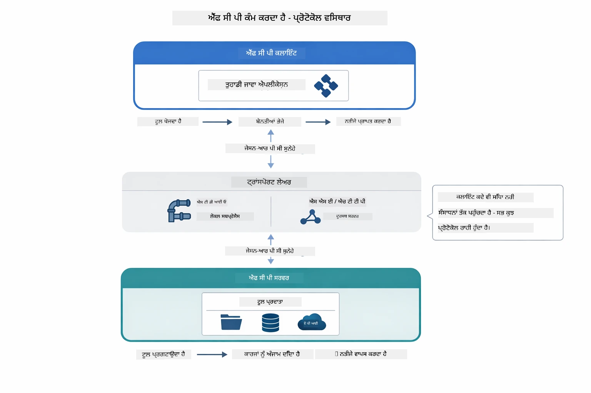

*MCP ਅੰਦਰ ਕਿਵੇਂ ਕੰਮ ਕਰਦਾ ਹੈ — ਕਲਾਇੰਟ ਟੂਲ ਖੋਜਦੇ ਹਨ, JSON-RPC ਸੁਨੇਹੇ ਬਦਲਦੇ ਹਨ, ਅਤੇ ਟ੍ਰਾਂਸਪੋਰਟ ਲੇਅਰ ਰਾਹੀਂ ਕਾਰਜ ਕਰਵਾਉਂਦੇ ਹਨ।*

**ਸਰਵਰ-ਕਲਾਇੰਟ ਆਰਕੀਟੈਕਚਰ**

MCP ਇੱਕ ਕਲਾਇੰਟ-ਸਰਵਰ ਮਾਡਲ ਵਰਤਦਾ ਹੈ। ਸਰਵਰ ਟੂਲ ਮੁਹੱਈਆ ਕਰਵਾਉਂਦੇ ਹਨ - ਫਾਈਲਾਂ ਪੜ੍ਹਨਾ, ਡੇਟਾਬੇਸ ਕੁਏਰੀ ਕਰਨਾ, ਏਪੀਆਈ ਕਾਲ ਕਰਨਾ। ਕਲਾਇੰਟ (ਤੁਹਾਡਾ AI ਐਪਲੀਕੇਸ਼ਨ) ਸਰਵਰਾਂ ਨਾਲ ਜੁੜਦੇ ਹਨ ਅਤੇ ਉਨ੍ਹਾਂ ਦੇ ਟੂਲ ਵਰਤਦੇ ਹਨ।

LangChain4j ਦੇ ਨਾਲ MCP ਵਰਤਣ ਲਈ, ਇਹ Maven ਡੀਪੈਂਡੇਸੀ ਸ਼ਾਮਲ ਕਰੋ:

```xml
<dependency>
    <groupId>dev.langchain4j</groupId>
    <artifactId>langchain4j-mcp</artifactId>
    <version>${langchain4j.version}</version>
</dependency>
```

**ਟੂਲ ਖੋਜ**

ਜਦੋਂ ਤੁਹਾਡਾ ਕਲਾਇੰਟ MCP ਸਰਵਰ ਨਾਲ ਜੁੜਦਾ ਹੈ, ਇਹ ਪੁੱਛਦਾ ਹੈ "ਤੁਹਾਡੇ ਕੋਲ ਕਿਹੜੇ ਟੂਲ ਹਨ?" ਸਰਵਰ ਉਪਲਬਧ ਟੂਲਾਂ ਦੀ ਸੂਚੀ ਦੇਵੇਗਾ, ਹਰ ਇੱਕ ਨਾਲ ਵਰਣਨ ਅਤੇ ਪੈਰਾਮੀਟਰ ਸਕੀਮਾਂ। ਤੁਹਾਡਾ AI ਏਜੈਂਟ ਉਸ ਤੋਂ ਬਾਅਦ ਯੂਜ਼ਰ ਦੀ ਮੰਗਾਂ ਅਨੁਸਾਰ ਫੈਸਲਾ ਕਰ ਸਕਦਾ ਹੈ ਕਿ ਕਿਹੜੇ ਟੂਲਾਂ ਨੂੰ ਵਰਤਣਾ ਹੈ।

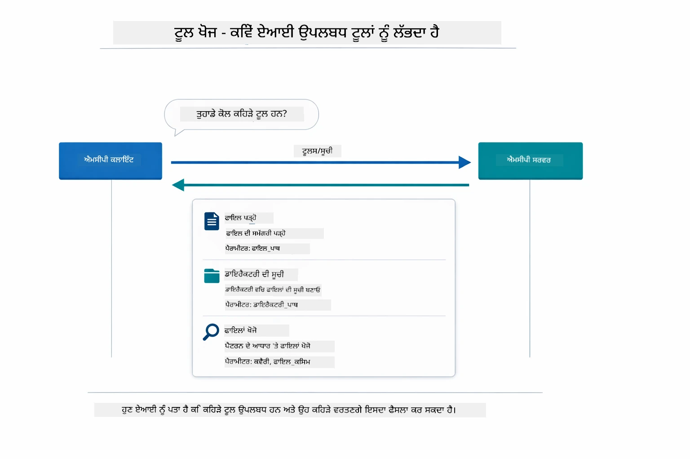

*AI ਸ਼ੁਰੂਆਤ ਵਿੱਚ ਉਪਲਬਧ ਟੂਲਾਂ ਦੀ ਖੋਜ ਕਰਦਾ ਹੈ — ਹੁਣ ਇਹ ਜਾਣਦਾ ਹੈ ਕਿ ਕੀ ਸਮਰੱਥਾਵਾਂ ਹਨ ਅਤੇ ਕਿਹੜੇ ਵਰਤਣੇ ਹਨ।*

**ਟ੍ਰਾਂਸਪੋਰਟ ਮੇਕੈਨਿਜ਼ਮ**

MCP ਵੱਖ-ਵੱਖ ਟ੍ਰਾਂਸਪੋਰਟ ਮੇਕੈਨਿਜ਼ਮਾਂ ਨੂੰ ਸਮਰਥਨ ਕਰਦਾ ਹੈ। ਇਹ ਮੋਡਿਊਲ ਸਥਾਨਕ ਪ੍ਰਕਿਰਿਆਵਾਂ ਲਈ Stdio ਟ੍ਰਾਂਸਪੋਰਟ ਦਿਖਾਉਂਦਾ ਹੈ:


*MCP ਟ੍ਰਾਂਸਪੋਰਟ ਮੇਕੈਨਿਜ਼ਮ: ਦੂਰ ਸਰਵਰਾਂ ਲਈ HTTP, ਸਥਾਨਕ ਪ੍ਰਕਿਰਿਆਵਾਂ ਲਈ Stdio*

**Stdio** - [StdioTransportDemo.java](../../../05-mcp/src/main/java/com/example/langchain4j/mcp/StdioTransportDemo.java)

ਸਥਾਨਕ ਪ੍ਰਕਿਰਿਆਵਾਂ ਲਈ। ਤੁਹਾਡੀ ਐਪਲੀਕੇਸ਼ਨ ਇੱਕ ਸਰਵਰ ਨੂੰ ਸਬਪ੍ਰੋਸੈਸ ਵਜੋਂ ਚਲਾਉਂਦੀ ਹੈ ਅਤੇ ਮਿਆਰੀ ਇਨਪੁਟ/ਆਉਟਪੁਟ ਰਾਹੀਂ ਗੱਲਬਾਤ ਕਰਦੀ ਹੈ। ਫਾਈਲਸਿਸਟਮ ਪਹੁੰਚ ਜਾਂ ਕਮਾਂਡ ਲਾਈਨ ਟੂਲਜ਼ ਲਈ ਲਾਭਦਾਇਕ।

```java
McpTransport stdioTransport = new StdioMcpTransport.Builder()
    .command(List.of(
        npmCmd, "exec",
        "@modelcontextprotocol/server-filesystem@2025.12.18",
        resourcesDir
    ))
    .logEvents(false)
    .build();
```

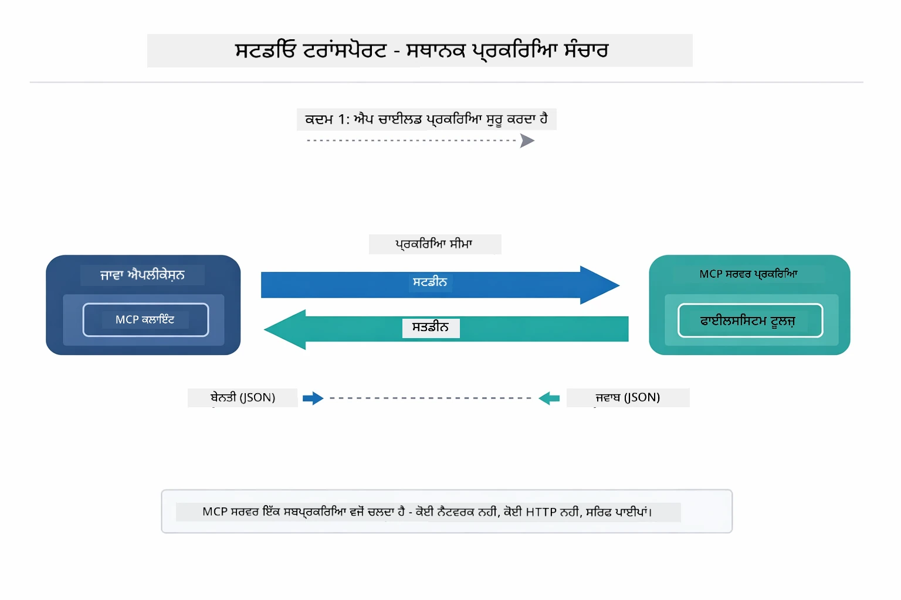

*Stdio ਟ੍ਰਾਂਸਪੋਰਟ ਦਿਸ਼ਾ ਦਿਖਾ ਰਿਹਾ ਹੈ — ਤੁਸੀਂ ਐਪਲੀਕੇਸ਼ਨ MCP ਸਰਵਰ ਨੂੰ ਇੱਕ ਚਾਈਲਡ ਪ੍ਰਕਿਰਿਆ ਵਜੋਂ ਚਲਾਉਂਦੇ ਹੋ ਅਤੇ stdin/stdout ਪਾਈਪਾਂ ਰਾਹੀਂ ਸੰਚਾਰ ਕਰਦੇ ਹੋ।*

> **🤖 GitHub Copilot ਚੈਟ ਨਾਲ ਕੋਸ਼ਿਸ਼ ਕਰੋ:** ਖੋਲ੍ਹੋ [`StdioTransportDemo.java`](../../../05-mcp/src/main/java/com/example/langchain4j/mcp/StdioTransportDemo.java) ਅਤੇ ਪੁੱਛੋ:
> - "Stdio ਟ੍ਰਾਂਸਪੋਰਟ ਕਿਵੇਂ ਕੰਮ ਕਰਦਾ ਹੈ ਅਤੇ ਕਦੋਂ ਮੈਂ ਇਸਨੂੰ HTTP ਨਾਲੋਂ ਵਰਤਾਂ?"
> - "LangChain4j MCP ਸਰਵਰ ਪ੍ਰਕਿਰਿਆਵਾਂ ਦੇ ਜੀਵਨਚੱਕਰ ਨੂੰ ਕਿਵੇਂ ਪ੍ਰਬੰਧਿਤ ਕਰਦਾ ਹੈ?"
> - "AI ਨੂੰ ਫਾਈਲ ਸਿਸਟਮ ਦੀ ਪਹੁੰਚ ਦੇਣ ਦੇ ਸੁਰੱਖਿਆ ਨਤੀਜੇ ਕੀ ਹਨ?"

## ਏਜੈਂਟਿਕ ਮੋਡਿਊਲ

ਜਦੋਂ ਕਿ MCP ਮਿਆਰੀਕ੍ਰਿਤ ਟੂਲ ਪ੍ਰਦਾਨ ਕਰਦਾ ਹੈ, LangChain4j ਦਾ **ਏਜੈਂਟਿਕ ਮੋਡਿਊਲ** ਉਹ ਏਜੈਂਟ ਬਨਾਉਣ ਦਾ ਘੋਸ਼ਣਾਤਮਕ ਤਰੀਕਾ ਦਿੰਦਾ ਹੈ ਜੋ ਉਹਨਾਂ ਟੂਲਾਂ ਦਾ ਸੁਚੱਜਾ ਸੁਤੰਤਰ ਪੱਧਰ ਤੇ ਸੁਚਾਲਕਤਾ ਕਰਦਾ ਹੈ। `@Agent` ਅਨੋਟੇਸ਼ਨ ਅਤੇ `AgenticServices` ਤੁਹਾਨੂੰ ਇੰਟਰਫੇਸਾਂ ਰਾਹੀਂ ਏਜੈਂਟ ਦੇ ਵਿਹਾਰ ਨੂੰ ਪਰਿਭਾਸ਼ਿਤ ਕਰਨ ਦਿੰਦੇ ਹਨ ਬਜਾਏ ਜਮਯਕ ਕੋਡ ਦੇ।

ਇਸ ਮੋਡਿਊਲ ਵਿੱਚ, ਤੁਸੀਂ **ਸੁਪਰਵਾਇਜ਼ਰ ਏਜੈਂਟ** ਪੈਟਰਨ ਦਾ ਅਧਿਐਨ ਕਰੋਗੇ — ਇੱਕ ਵਿਕਸਿਤ ਏਜੈਂਟਿਕ AI ਪਹੁੰਚ ਜਿੱਥੇ "ਸੁਪਰਵਾਇਜ਼ਰ" ਏਜੈਂਟ ਯੂਜ਼ਰ ਦੀ ਮੰਗ ਦੇ ਅਧਾਰ 'ਤੇ ਗਤੀਸ਼ੀਲ ਤੌਰ 'ਤੇ ਕਿਹੜੇ ਸਬ-ਏਜੈਂਟਾਂ ਨੂੰ ਚਲਾਉਣਾ ਹੈ ਦਾ ਫੈਸਲਾ ਕਰਦਾ ਹੈ। ਅਸੀਂ ਦੋਹਾਂ ਸੰਕਲਪਾਂ ਨੂੰ ਜੋੜਾਂਗੇ ਜਿਸ ਵਿੱਚ ਸਾਡੇ ਇੱਕ ਸਬ-ਏਜੈਂਟ ਨੂੰ MCP-ਸਮਰਥਿਤ ਫਾਈਲ ਪਹੁੰਚ ਦੀ ਸਮਰੱਥਾ ਦੇ ਰਹੇ ਹਾਂ।

ਏਜੈਂਟਿਕ ਮੋਡਿਊਲ ਵਰਤਣ ਲਈ, ਇਹ Maven ਡੀਪੈਂਡੇਸੀ ਸ਼ਾਮਲ ਕਰੋ:

```xml
<dependency>
    <groupId>dev.langchain4j</groupId>
    <artifactId>langchain4j-agentic</artifactId>
    <version>${langchain4j.mcp.version}</version>
</dependency>
```

> **⚠️ ਪ੍ਰਯੋਗਸ਼ਾਲਾ:** `langchain4j-agentic` ਮੋਡਿਊਲ **ਪ੍ਰਯੋਗਸ਼ਾਲਾ** ਹੈ ਅਤੇ ਬਦਲਾਅ ਦੇ ਅਧੀਨ ਹੈ। AI ਸਹਾਇਕ ਬਣਾਉਣ ਲਈ ਸਥਿਰ ਤਰੀਕਾ `langchain4j-core` ਹੈ ਜੋ ਕਸਟਮ ਟੂਲਵਰਗ ਤਿਆਰ ਕਰਦਾ ਹੈ (Module 04)।

## ਉਦਾਹਰਣਾਂ ਚਲਾਉਣਾ

### ਪੂਰਵ-ਆਵਸ਼ਕਤਾਵਾਂ

- Java 21+, Maven 3.9+
- Node.js 16+ ਅਤੇ npm (MCP ਸਰਵਰਾਂ ਲਈ)
- `.env` ਫਾਈਲ ਵਿੱਚ ਵਾਤਾਵਰਣ ਚਲਾਕੀਆਂ ਸੈਟ ਕੀਤੀਆਂ ਹੋਣ (ਰੂਟ ਡਾਇਰੈਕਟਰੀ ਤੋਂ):
  - `AZURE_OPENAI_ENDPOINT`, `AZURE_OPENAI_API_KEY`, `AZURE_OPENAI_DEPLOYMENT` (ਮੋਡਿਊਲ 01-04 ਵਾਂਗ)

> **ਨੋਟ:** ਜੇ ਤੁਸੀਂ ਅਜੇ ਤੱਕ ਵਾਤਾਵਰਣ ਚਲਾਕੀਆਂ ਸੈਟ ਨਹੀਂ ਕੀਤੀਆਂ, ਤਾਂ [Module 00 - Quick Start](../00-quick-start/README.md) ਵੇਖੋ ਜਾਂ `.env.example` ਨੂੰ `.env` ਵਿੱਚ ਰੂਟ ਡਾਇਰੈਕਟਰੀ ਵਿਚ ਕਾਪੀ ਕਰਕੇ ਆਪਣੀਆਂ ਕੀਮਤਾਂ ਭਰੋ।

## ਤੁਰੰਤ ਸ਼ੁਰੂਆਤ

**VS ਕੋਡ ਵਰਤ ਰਹੇ ਹੋ:** ਖੁੱਲ੍ਹਾ ਕਿਸੇ ਵੀ ਡੈਮੋ ਫਾਈਲ 'ਤੇ Right-click ਕਰਕੇ **"Run Java"** ਚੁਣੋ ਜਾਂ ਰਨ ਐਂਡ ਡੀਬੱਗ ਪੈਨਲ ਤੋਂ ਲਾਂਚ ਸੰਰਚਨਾਵਾਂ ਦੀ ਵਰਤੋਂ ਕਰੋ (ਪਹਿਲਾਂ `.env` ਫਾਈਲ ਵਿੱਚ ਆਪਣਾ ਟੋਕਨ ਸ਼ਾਮਲ ਕਰੋ)।

**Maven ਵਰਤ ਰਹੇ ਹੋ:** ਬਦਲੋਂ ਕਮਾਂਡ ਲਾਈਨ ਤੋਂ ਹੇਠਾਂ ਦਿੱਤੇ ਉਦਾਹਰਣਾਂ ਨਾਲ ਚਲਾ ਸਕਦੇ ਹੋ।

### ਫਾਈਲ ਆਪਰੇਸ਼ਨ (Stdio)

ਇਹ ਸਥਾਨਕ ਸਬਪ੍ਰੋਸੈਸ-ਆਧਾਰਤ ਟੂਲ ਦਿਖਾਉਂਦਾ ਹੈ।

**✅ ਕੋਈ ਪੂਰਵ-ਆਵਸ਼ਕਤਾ ਨਹੀਂ** - MCP ਸਰਵਰ ਆਪਮਾਤਰ ਸਪਾਨ ਕੀਤਾ ਜਾਂਦਾ ਹੈ।

**ਸ਼ੁਰੂਆਤੀ ਸਕ੍ਰਿਪਟਾਂ ਦੀ ਵਰਤੋਂ (ਸਿਫ਼ਾਰਸ਼ ਕੀਤੀ):**

ਸ਼ੁਰੂਆਤੀ ਸਕ੍ਰਿਪਟਾਂ ਆਪਮਾਤਰ `.env` ਫਾਈਲ ਤੋਂ ਵਾਤਾਵਰਣ ਚਲਾਕੀਆਂ ਲੋਡ ਕਰਦੀਆਂ ਹਨ:

**Bash:**
```bash
cd 05-mcp
chmod +x start-stdio.sh
./start-stdio.sh
```

**PowerShell:**
```powershell
cd 05-mcp
.\start-stdio.ps1
```

**VS ਕੋਡ ਵਰਤ ਰਹੇ ਹੋ:** `StdioTransportDemo.java` 'ਤੇ Right-click ਕਰੋ ਅਤੇ **"Run Java"** ਚੁਣੋ (ਇਹ ਯਕੀਨੀ ਬਣਾਓ ਕਿ ਤੁਹਾਡੀ `.env` ਫਾਈਲ ਸਹੀ ਹੈ)।

ਐਪਲੀਕੇਸ਼ਨ ਆਪਣੇ ਆਪ ਇੱਕ ਫਾਈਲਸਿਸਟਮ MCP ਸਰਵਰ ਸਪਾਨ ਕਰਦਾ ਹੈ ਅਤੇ ਇੱਕ ਸਥਾਨਕ ਫਾਈਲ ਪੜ੍ਹਦਾ ਹੈ। ਧਿਆਨ ਦਿਓ ਕਿ ਸਬਪ੍ਰੋਸੈਸ ਨਿਯੰਤਰਣ ਤੁਹਾਡੇ ਲਈ ਕਿਵੇਂ ਸੰਭਾਲਿਆ ਜਾਂਦਾ ਹੈ।

**ਉਮੀਦਵਾਰ ਆਉਟਪੁੱਟ:**
```
Assistant response: The file provides an overview of LangChain4j, an open-source Java library
for integrating Large Language Models (LLMs) into Java applications...
```

### ਸੁਪਰਵਾਇਜ਼ਰ ਏਜੈਂਟ

**ਸੁਪਰਵਾਇਜ਼ਰ ਏਜੈਂਟ ਪੈਟਰਨ** ਇੱਕ **ਲਚਕੀਲਾ** ਏਜੈਂਟਿਕ AI ਰੂਪ ਹੈ। ਇਕ ਸੁਪਰਵਾਇਜ਼ਰ LLM ਦੀ ਵਰਤੋਂ ਕਰਦਾ ਹੈ ਜੋ ਯੂਜ਼ਰ ਦੀ ਮੰਗ ਦੇ ਅਧਾਰ 'ਤੇ ਸੁਤੰਤਰ ਤੌਰ 'ਤੇ ਫੈਸਲਾ ਕਰਦਾ ਹੈ ਕਿ ਕਿਹੜੇ ਏਜੈਂਟਾਂ ਨੂੰ ਕਾਲ ਕਰਨਾ ਹੈ। ਅਗਲੇ ਉਦਾਹਰਣ ਵਿਚ, ਅਸੀਂ MCP-ਸਮਰਥਿਤ ਫਾਈਲ ਪਹੁੰਚ ਨੂੰ LLM ਏਜੈਂਟ ਨਾਲ ਜੋੜ ਕੇ ਇੱਕ ਸੁਪਰਵਾਇਜ਼ਡ ਫਾਈਲ ਪੜ੍ਹਨ → ਰਿਪੋਰਟ ਵਰਕਫਲੋ ਬਣਾਉਂਦੇ ਹਾਂ।

ਡੀਮੋ ਵਿੱਚ, `FileAgent` MCP ਫਾਈਲਸਿਸਟਮ ਟੂਲਾਂ ਨਾਲ ਫਾਈਲ ਪੜ੍ਹਦਾ ਹੈ, ਅਤੇ `ReportAgent` ਪ੍ਰਬੰਧਤ ਰਿਪੋਰਟ ਤਿਆਰ ਕਰਦਾ ਹੈ ਜਿਸ ਵਿੱਚ ਇੱਕ ਕਾਰਜਕਾਰੀ ਸਾਰ (1 ਵਾਕ), 3 ਮੁੱਖ ਪੁਆਇੰਟਾਂ ਅਤੇ ਸਿਫਾਰਿਸ਼ਾਂ ਹਨ। ਸੁਪਰਵਾਇਜ਼ਰ ਇਸ ਪ੍ਰਵਾਹ ਨੂੰ ਆਪਣੇ ਆਪ ਸੁਤੰਤਰ ਤੌਰ 'ਤੇ ਸੁਚਾਲਿਤ ਕਰਦਾ ਹੈ:

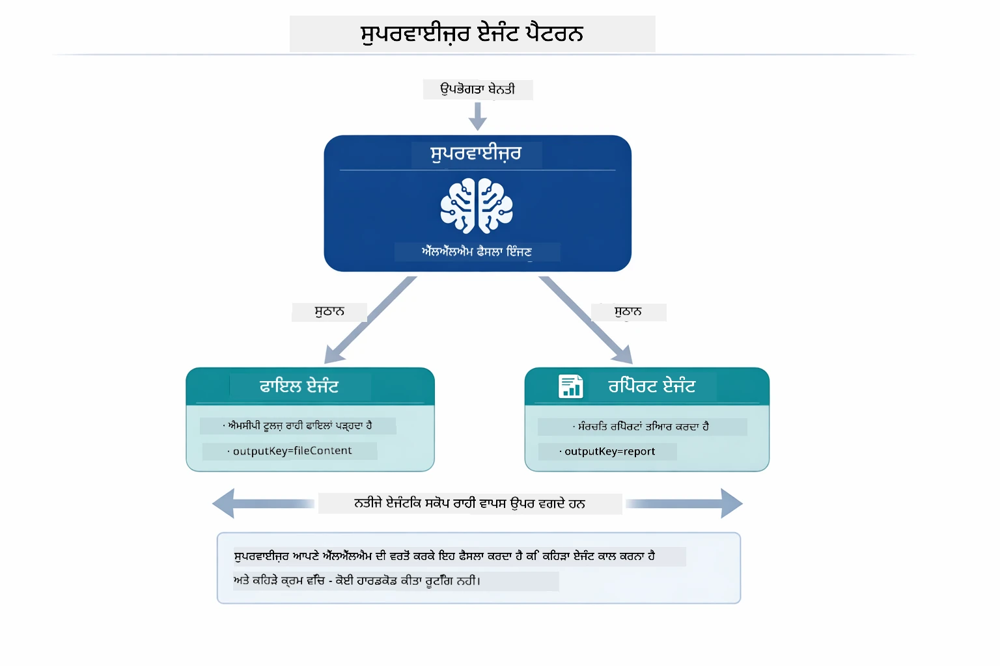

*ਸੁਪਰਵਾਇਜ਼ਰ ਆਪਣੀ LLM ਦੀ ਵਰਤੋਂ ਕਰਕੇ ਫੈਸਲਾ ਕਰਦਾ ਹੈ ਕਿ ਕਿਹੜੇ ਏਜੈਂਟਾਂ ਨੂੰ ਕਾਲ ਕਰਨਾ ਹੈ ਅਤੇ ਕਿਹੜੀ ਕ੍ਰਮ ਵਿੱਚ — ਕੋਈ ਸਖਤ ਕੋਡ ਨਿਰਦੇਸ਼ਕ ਲੋੜੀਂਦਾ ਨਹੀਂ।*

ਸਾਡੇ ਫਾਈਲ ਤੋਂ ਰਿਪੋਰਟ ਪਾਈਪਲਾਈਨ ਲਈ ਇਸ ਠੋਸ ਵਰਕਫਲੋ ਦਾ ਨਕਸ਼ਾ:

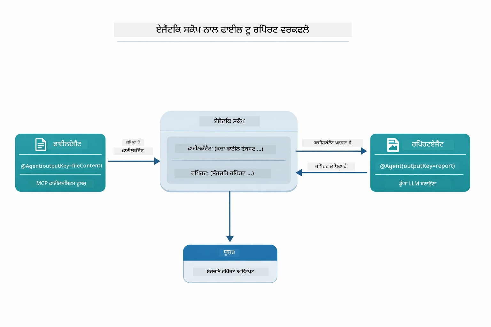

*FileAgent MCP ਟੂਲਾਂ ਰਾਹੀਂ ਫਾਈਲ ਪੜ੍ਹਦਾ ਹੈ, ਫਿਰ ReportAgent ਕੱਚਾ ਸਮੱਗਰੀ ਨੂੰ ਇੱਕ ਬਨਾਵਟੀ ਰਿਪੋਰਟ ਵਿੱਚ ਬਦਲਦਾ ਹੈ।*

ਹਰ ਏਜੈਂਟ ਆਪਣਾ ਆਉਟਪੁੱਟ **ਏਜੈਂਟਿਕ ਸਕੋਪ** (ਸਾਂਝੀ ਮੇਮੋਰੀ) ਵਿੱਚ ਸਟੋਰ ਕਰਦਾ ਹੈ, ਜੋ ਕਿਸੇ ਵੀ ਅਗਲੇ ਐਜੈਂਟ ਨੂੰ ਪਿਛਲੇ ਨਤੀਜਿਆਂ ਤੱਕ ਪਹੁੰਚ ਦੇਂਦਾ ਹੈ। ਇਹ ਦਿਖਾਉਂਦਾ ਹੈ ਕਿ MCP ਟੂਲ ਕਿਵੇਂ ਸੁਤੰਤਰਿਤ ਤੌਰ ਤੇ ਏਜੈਂਟਿਕ ਵਰਕਫਲੋਜ਼ ਵਿੱਚ ਸ਼ਾਮਲ ਹੋ ਸਕਦੇ ਹਨ — ਸੁਪਰਵਾਇਜ਼ਰ ਨੂੰ ਇਹ ਜਾਣਨ ਦੀ ਲੋੜ ਨਹੀਂ ਕਿ ਫਾਈਲ ਕਿਸ ਤਰ੍ਹਾਂ ਪੜ੍ਹੀ ਜਾਂਦੀ ਹੈ, ਸਿਰਫ਼ ਇਹ ਜਾਣਨਾ ਲੋੜੀਂਦਾ ਹੈ ਕਿ FileAgent ਇਸ ਨੂੰ ਕਰ ਸਕਦਾ ਹੈ।

#### ਡੈਮੋ ਚਲਾਉਣਾ

ਸ਼ੁਰੂਆਤੀ ਸਕ੍ਰਿਪਟਾਂ ਆਪਮਾਤਰ `.env` ਫਾਈਲ ਤੋਂ ਵਾਤਾਵਰਣ ਚਲਾਕੀਆਂ ਲੋਡ ਕਰਦੀਆਂ ਹਨ:

**Bash:**
```bash
cd 05-mcp
chmod +x start-supervisor.sh
./start-supervisor.sh
```

**PowerShell:**
```powershell
cd 05-mcp
.\start-supervisor.ps1
```

**VS ਕੋਡ ਵਰਤ ਰਹੇ ਹੋ:** `SupervisorAgentDemo.java` 'ਤੇ Right-click ਕਰੋ ਅਤੇ **"Run Java"** ਚੁਣੋ (ਪੱਕਾ ਕਰੋ ਕਿ `.env` ਸੈਟ ਹੈ)।

#### ਸੁਪਰਵਾਇਜ਼ਰ ਕਿਵੇਂ ਕੰਮ ਕਰਦਾ ਹੈ

```java
// ਕਦਮ 1: ਫਾਇਲਏਜੰਟ MCP ਟੂਲਜ਼ ਦੀ ਵਰਤੋਂ ਕਰਕੇ ਫਾਇਲਾਂ ਨੂੰ ਪੜ੍ਹਦਾ ਹੈ
FileAgent fileAgent = AgenticServices.agentBuilder(FileAgent.class)
        .chatModel(model)
        .toolProvider(mcpToolProvider)  // ਫਾਇਲ ਆਪਰੇਸ਼ਨਾਂ ਲਈ MCP ਟੂਲਜ਼ ਹਨ
        .build();

// ਕਦਮ 2: ਰਿਪੋਰਟਏਜੰਟ ਸਾਂਚਾਬੱਧ ਰਿਪੋਰਟਾਂ ਬਣਾਉਂਦਾ ਹੈ
ReportAgent reportAgent = AgenticServices.agentBuilder(ReportAgent.class)
        .chatModel(model)
        .build();

// ਸੂਪਰਵਾਈਜ਼ਰ ਫਾਇਲ → ਰਿਪੋਰਟ ਵਰਕਫਲੋ ਨੂੰ ਸਮਨਵਿਤ ਕਰਦਾ ਹੈ
SupervisorAgent supervisor = AgenticServices.supervisorBuilder()
        .chatModel(model)
        .subAgents(fileAgent, reportAgent)
        .responseStrategy(SupervisorResponseStrategy.LAST)  // ਅੰਤਿਮ ਰਿਪੋਰਟ ਵਾਪਸ ਕਰੋ
        .build();

// ਸੂਪਰਵਾਈਜ਼ਰ ਬੇਨਤੀ ਦੇ ਆਧਾਰ 'ਤੇ ਕਿਹੜੇ ਏਜੰਟ ਨੂੰ ਕਾਲ ਕਰਨਾ ਹੈ ਫੈਸਲਾ ਕਰਦਾ ਹੈ
String response = supervisor.invoke("Read the file at /path/file.txt and generate a report");
```

#### ਜਵਾਬ ਦੇਣ ਦੀਆਂ ਰਣਨੀਤੀਆਂ

ਜਦੋਂ ਤੁਸੀਂ `SupervisorAgent` ਨੂੰ ਸੰਰਚਿਤ ਕਰਦੇ ਹੋ, ਤਾਂ ਤੁਸੀਂ ਇਹ ਨਿਰਧਾਰਿਤ ਕਰਦੇ ਹੋ ਕਿ ਇਹ ਯੂਜ਼ਰ ਨੂੰ ਅੰਤਿਮ ਜਵਾਬ ਕਿਵੇਂ ਦੇਵੇਗਾ ਜਦੋਂ ਸਬ-ਏਜੈਂਟਾਂ ਨੇ ਆਪਣੇ ਕੰਮ ਮੁਕੰਮਲ ਕਰ ਲਏ ਹਨ।

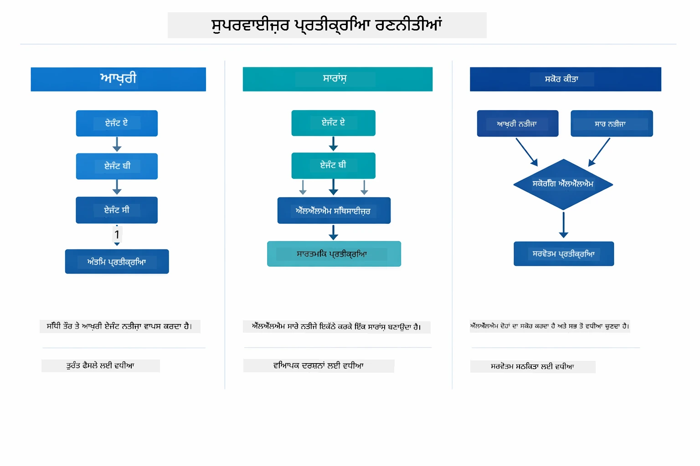

*ਤਿੰਨ ਰਣਨੀਤੀਆਂ ਜਿਹੜੀਆਂ ਸੁਪਰਵਾਇਜ਼ਰ ਆਪਣੇ ਅੰਤਿਮ ਜਵਾਬ ਲਈ ਵਰਤ ਸਕਦਾ ਹੈ—ਚੁਣੋ ਕਿ ਤੁਸੀਂ ਆਖਰੀ ਏਜੈਂਟ ਦਾ ਆਉਟਪੁੱਟ ਚਾਹੁੰਦੇ ਹੋ, ਜਾਂ ਸੰਖੇਪ ਸਿੰਥੈਸਿਸ, ਜਾਂ ਸਭ ਤੋਂ ਵਧੀਆ ਸਕੋਰ ਵਾਲਾ ਵਿਕਲਪ।*

ਉਪਲਬਧ ਰਣਨੀਤੀਆਂ ਹਨ:

| ਰਣਨੀਤੀ | ਵਰਣਨ |
|----------|-------------|
| **LAST** | ਸੁਪਰਵਾਇਜ਼ਰ ਆਖਰੀ ਸਬ-ਏਜੈਂਟ ਜਾਂ ਟੂਲ ਦੇ ਆਉਟਪੁੱਟ ਨੂੰ ਵਾਪਸ ਕਰਦਾ ਹੈ। ਇਹ ਉਹਨਾਂ ਹਾਲਾਤਾਂ ਵਿੱਚ ਲਾਭਦਾਇਕ ਹੈ ਜਦੋਂ ਵਰਕਫਲੋ ਵਿੱਚ ਆਖਰੀ ਏਜੈਂਟ ਖਾਸ ਤੌਰ 'ਤੇ ਪੂਰਾ, ਅੰਤਿਮ ਜਵਾਬ ਤਿਆਰ ਕਰਨ ਲਈ ਬਣਾਇਆ ਗਿਆ ਹੋਵੇ (ਉਦਾਹਰਣ ਵਜੋਂ, ਖੋਜ ਪਾਈਪਲਾਈਨ ਵਿੱਚ "ਸੰਖੇਪ ਏਜੈਂਟ"). |
| **SUMMARY** | ਸੁਪਰਵਾਇਜ਼ਰ ਆਪਣੀ ਸੰਦਰਭ LLM ਦੀ ਵਰਤੋਂ ਕਰਦਾ ਹੈ ਸਾਰੇ ਲੈਣ-ਦੇਣ ਅਤੇ ਸਬ-ਏਜੈਂਟ ਆਉਟਪੁੱਟਾਂ ਦਾ ਸੰਖੇਪ ਬਣਾਉਣ ਲਈ, ਫਿਰ ਉਸ ਸੰਖੇਪ ਨੂੰ ਅੰਤਿਮ ਜਵਾਬ ਵਜੋਂ ਵਾਪਸ ਕਰਦਾ ਹੈ। ਇਹ ਯੂਜ਼ਰ ਲਈ ਇੱਕ ਸਾਫ਼, ਸਮੂਹਿਕ ਜਵਾਬ ਮੁਹੱਈਆ ਕਰਦਾ ਹੈ। |
| **SCORED** | ਸਿਸਟਮ ਇੱਕ ਸੰਦਰਭ LLM ਦੀ ਵਰਤੋਂ ਕਰਕੇ ਦੋਹਾਂ LAST ਜਵਾਬ ਅਤੇ SUMMARY ਨੂੰ ਮੁਲਾਂਕਣ ਕਰਦਾ ਹੈ ਯੂਜ਼ਰ ਦੀ ਮੰਗ ਦੇ ਮੁਕਾਬਲੇ, ਫਿਰ ਉਚਿਤ ਸਕੋਰ ਵਾਲਾ ਆਉਟਪੁੱਟ ਵਾਪਸ ਕਰਦਾ ਹੈ। |

ਪੂਰਨ ਕਿਰਿਆਨਵੀਤੀ ਲਈ [SupervisorAgentDemo.java](../../../05-mcp/src/main/java/com/example/langchain4j/mcp/SupervisorAgentDemo.java) ਵੇਖੋ।

> **🤖 GitHub Copilot ਚੈਟ ਨਾਲ ਕੋਸ਼ਿਸ਼ ਕਰੋ:** ਖੋਲ੍ਹੋ [`SupervisorAgentDemo.java`](../../../05-mcp/src/main/java/com/example/langchain4j/mcp/SupervisorAgentDemo.java) ਅਤੇ ਪੁੱਛੋ:
> - "ਸੁਪਰਵਾਇਜ਼ਰ ਕਿਵੇਂ ਫੈਸਲਾ ਕਰਦਾ ਹੈ ਕਿ ਕਿਹੜੇ ਏਜੈਂਟ ਕਾਲ ਕਰਨੇ ਨੇ?"
> - "ਸੁਪਰਵਾਇਜ਼ਰ ਅਤੇ ਸਿੱਕਵੈਂਸ਼ਲ ਵਰਕਫਲੋ ਪੈਟਰਨ ਵਿੱਚ ਕੀ ਅੰਤਰ ਹੈ?"
> - "ਮੈਂ ਸੁਪਰਵਾਇਜ਼ਰ ਦੀ ਯੋਜਨਾ ਬਣਾਉਣ ਦੀ ਵਿਵਰਤੀ ਨੂੰ ਕਿਵੇਂ ਕਸਟਮਾਈਜ਼ ਕਰ ਸਕਦਾ ਹਾਂ?"

#### ਆਉਟਪੁੱਟ ਨੂੰ ਸਮਝਣਾ

ਜਦੋਂ ਤੁਸੀਂ ਡੈਮੋ ਚਲਾਓਗੇ, ਤੁਸੀਂ ਵੇਖੋਗੇ ਕਿ ਸੁਪਰਵਾਇਜ਼ਰ ਕਿਵੇਂ ਕਈ ਏਜੈਂਟਾਂ ਨੂੰ ਆਯੋਜਿਤ ਕਰਦਾ ਹੈ ਦਾ ਸੰਰਚਿਤ ਦਰਸ਼ਨ। ਹਰ ਹਿੱਸਾ ਕੀ ਮਤਲਬ ਹੈ:

```
======================================================================
  FILE → REPORT WORKFLOW DEMO
======================================================================

This demo shows a clear 2-step workflow: read a file, then generate a report.
The Supervisor orchestrates the agents automatically based on the request.
```

**ਸਿਰਲੇਖ** ਵਰਕਫਲੋ ਸੰਕਲਪ ਦਾ ਪਰਚਾਰ ਕਰਦਾ ਹੈ: ਫਾਈਲ ਪੜ੍ਹਨ ਤੋਂ ਰਿਪੋਰਟ ਤਿਆਰ ਕਰਨ ਦਾ ਕੇਂਦਰਿਤ ਪ੍ਰਵਾਹ।

```
--- WORKFLOW ---------------------------------------------------------
  ┌─────────────┐      ┌──────────────┐
  │  FileAgent  │ ───▶ │ ReportAgent  │
  │ (MCP tools) │      │  (pure LLM)  │
  └─────────────┘      └──────────────┘
   outputKey:           outputKey:
   'fileContent'        'report'

--- AVAILABLE AGENTS -------------------------------------------------
  [FILE]   FileAgent   - Reads files via MCP → stores in 'fileContent'
  [REPORT] ReportAgent - Generates structured report → stores in 'report'
```

**ਵਰਕਫਲੋ ਡਾਇਗ੍ਰਾਮ** ਏਜੈਂਟਾਂ ਵਿਚਕਾਰ ਡੇਟਾ ਪ੍ਰਵਾਹ ਦਿਖਾਉਂਦਾ ਹੈ। ਹਰ ਏਜੈਂਟ ਦਾ ਖਾਸ ਕੰਮ ਹੈ:
- **FileAgent** MCP ਟੂਲਾਂ ਦੀ ਵਰਤੋਂ ਕਰ ਕੇ ਫਾਈਲਾਂ ਪੜ੍ਹਦਾ ਹੈ ਅਤੇ ਕੱਚਾ ਸਮੱਗਰੀ `fileContent` ਵਿੱਚ ਸਟੋਰ ਕਰਦਾ ਹੈ
- **ReportAgent** ਉਸ ਸਮੱਗਰੀ ਨੂੰ ਵਰਤਦਾ ਹੈ ਅਤੇ `report` ਵਿੱਚ ਇੱਕ ਬਨਾਵਟੀ ਰਿਪੋਰਟ ਤਿਆਰ ਕਰਦਾ ਹੈ

```
--- USER REQUEST -----------------------------------------------------
  "Read the file at .../file.txt and generate a report on its contents"
```

**ਯੂਜ਼ਰ ਅਰਜ਼ੀ** ਕਾਰਜ ਦਿਖਾਉਂਦੀ ਹੈ। ਸੁਪਰਵਾਇਜ਼ਰ ਇਸ ਨੂੰ ਪੜ੍ਹਦਾ ਹੈ ਅਤੇ ਫੈਸਲਾ ਕਰਦਾ ਹੈ ਕਿ FileAgent → ReportAgent ਕਾਲ ਕਰਨ।

```
--- SUPERVISOR ORCHESTRATION -----------------------------------------
  The Supervisor decides which agents to invoke and passes data between them...

  +-- STEP 1: Supervisor chose -> FileAgent (reading file via MCP)
  |
  |   Input: .../file.txt
  |
  |   Result: LangChain4j is an open-source, provider-agnostic Java framework for building LLM...
  +-- [OK] FileAgent (reading file via MCP) completed

  +-- STEP 2: Supervisor chose -> ReportAgent (generating structured report)
  |
  |   Input: LangChain4j is an open-source, provider-agnostic Java framew...
  |
  |   Result: Executive Summary...
  +-- [OK] ReportAgent (generating structured report) completed
```

**ਸੁਪਰਵਾਇਜ਼ਰ ਆਯੋਜਨ** ਕਾਰਜ ਵਿੱਚ ਦੋ ਕਦਮੀ ਪ੍ਰਵਾਹ ਦਿਖਾਉਂਦਾ ਹੈ:
1. **FileAgent** MCP ਰਾਹੀਂ ਫਾਈਲ ਪੜ੍ਹਦਾ ਹੈ ਅਤੇ ਕੀਤੀ ਸਮੱਗਰੀ ਸਟੋਰ ਕਰਦਾ ਹੈ
2. **ReportAgent** ਸਮੱਗਰੀ ਪ੍ਰਾਪਤ ਕਰਦਾ ਹੈ ਅਤੇ ਬਨਾਵਟੀ ਰਿਪੋਰਟ ਬਣਾਉਂਦਾ ਹੈ

ਸੁਪਰਵਾਇਜ਼ਰ ਨੇ ਇਹ ਫੈਸਲੇ ਯੂਜ਼ਰ ਦੀ ਮੰਗ ਅਨੁਸਾਰ ਸੁਤੰਤਰ ਤੌਰ ਤੇ ਕੀਤੇ ਹਨ।

```
--- FINAL RESPONSE ---------------------------------------------------
Executive Summary
...

Key Points
...

Recommendations
...

--- AGENTIC SCOPE (Data Flow) ----------------------------------------
  Each agent stores its output for downstream agents to consume:
  * fileContent: LangChain4j is an open-source, provider-agnostic Java framework...
  * report: Executive Summary...
```

#### ਏਜੈਂਟਿਕ ਮੋਡਿਊਲ ਦੀਆਂ ਵਿਸ਼ੇਸ਼ਤਾਵਾਂ ਦਾ ਵਿਵਰਨ

ਉਦਾਹਰਣ ਏਜੈਂਟਿਕ ਮੋਡਿਊਲ ਦੀਆਂ ਕਈ ਉੱਨਤ ਵਿਸ਼ੇਸ਼ਤਾਵਾਂ ਦਿਖਾਉਂਦਾ ਹੈ। ਚਲੋ ਏਜੈਂਟਿਕ ਸਕੋਪ ਅਤੇ ਏਜੈਂਟ ਲਿਸਨਰਜ਼ ਦੀ ਨੇੜੀਕ ਤੋਂ ਸਮੀਖਿਆ ਕਰੀਏ।

**ਏਜੈਂਟਿਕ ਸਕੋਪ** ਸਾਂਝੀ ਯਾਦਾਸ਼ਤ ਦਿਖਾਉਂਦਾ ਹੈ ਜਿੱਥੇ ਏਜੈਂਟ `@Agent(outputKey="...")` ਦੀ ਵਰਤੋਂ ਕਰਕੇ ਆਪਣੇ ਨਤੀਜੇ ਸਟੋਰ ਕਰਦੇ ਹਨ। ਇਹ ਇਸ ਤਰ੍ਹਾਂ ਕਰਦਾ ਹੈ:
- ਬਾਅਦ ਦੇ ਏਜੈਂਟ ਪਹਿਲਾਂ ਵਾਲੇ ਨਤੀਜਿਆਂ ਤੱਕ ਪਹੁੰਚ ਸਕਦੇ ਹਨ
- ਸੁਪਰਵਾਇਜ਼ਰ ਅੰਤਿਮ ਜਵਾਬ ਬਨਾਉਂਦਾ ਹੈ
- ਤੁਸੀਂ ਜਾਂਚ ਕਰ ਸਕਦੇ ਹੋ ਕਿ ਹਰੇਕ ਏਜੈਂਟ ਨੇ ਕੀ ਤਿਆਰ ਕੀਤਾ

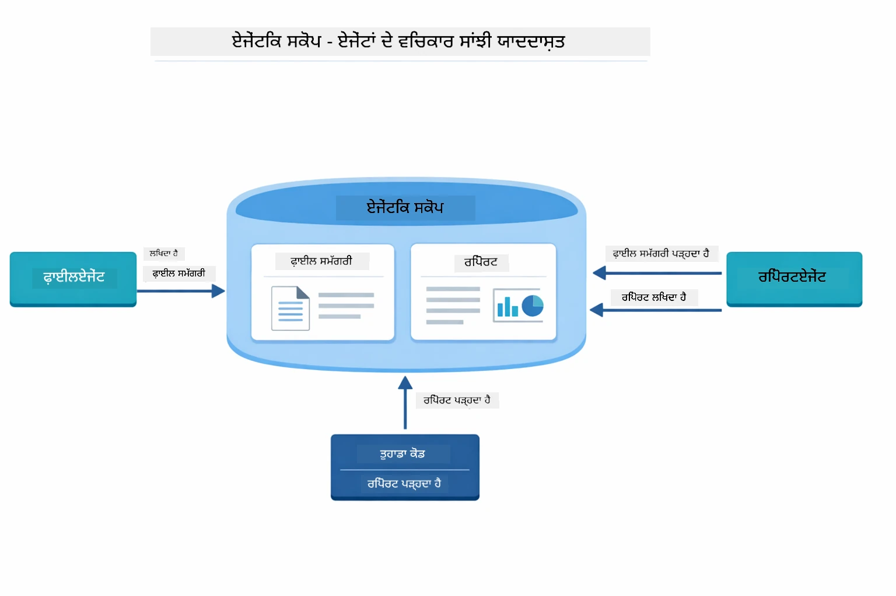

*ਏਜੈਂਟਿਕ ਸਕੋਪ ਸਾਂਝੀ ਯਾਦਾਸ਼ਤ ਵਜੋਂ ਕੰਮ ਕਰਦਾ ਹੈ — FileAgent `fileContent` ਲਿਖਦਾ ਹੈ, ReportAgent ਇਸਨੂੰ ਪੜ੍ਹਦਾ ਅਤੇ `report` ਲਿਖਦਾ ਹੈ, ਅਤੇ ਤੁਹਾਡਾ ਕੋਡ ਅੰਤਿਮ ਨਤੀਜਾ ਪੜ੍ਹਦਾ ਹੈ।*

```java
ResultWithAgenticScope<String> result = supervisor.invokeWithAgenticScope(request);
AgenticScope scope = result.agenticScope();
String fileContent = scope.readState("fileContent");  // ਫਾਇਲਏਜੰਟ ਤੋਂ ਕੱਚਾ ਫਾਈਲ ਡਾਟਾ
String report = scope.readState("report");            // ਰਿਪੋਰਟਏਜੰਟ ਤੋਂ ਬਣੇ ਸਾਂਚਬੱਧ ਰਿਪੋਰਟ
```

**ਏਜੈਂਟ ਲਿਸਨਰ** ਏਜੈਂਟ ਕਾਰਜਨਵਤੀ ਦੀ ਨਿਗਰਾਨੀ ਅਤੇ ਡੀਬੱਗਿੰਗ ਯੋਗ banaunde han। ਡੈਮੋ ਵਿੱਚ ਤੁਸੀਂ ਦੇਖਣ ਵਾਲਾ ਕਦਮ-ਦਰ-ਕਦਮ ਆਉਟਪੁੱਟ ਇੱਕ AgentListener ਤੋਂ ਆ ਰਿਹਾ ਹੈ ਜੋ ਹਰ ਏਜੈਂਟ ਕਾਲ ਵਿੱਚ ਸ਼ਾਮਲ ਹੁੰਦਾ ਹੈ:
- **beforeAgentInvocation** - ਜਦੋਂ Supervisor ਇੱਕ ਏਜੰਟ ਚੁਣਦਾ ਹੈ, ਇਸ ਸਮੇਂ ਕਾਲ ਹੁੰਦੀ ਹੈ, ਤਾਂ ਤੁਹਾਨੂੰ ਦੇਖਣ ਦਾ ਮੌਕਾ ਮਿਲਦਾ ਹੈ ਕਿ ਕਿਹੜਾ ਏਜੰਟ ਚੁਣਿਆ ਗਿਆ ਅਤੇ ਕਿਉਂ
- **afterAgentInvocation** - ਜਦੋਂ ਇੱਕ ਏਜੰਟ ਮੁਕੰਮਲ ਕਰਦਾ ਹੈ, ਇਸ ਸਮੇਂ ਕਾਲ ਹੁੰਦੀ ਹੈ, ਇਸਦਾ ਨਤੀਜਾ ਦਿਖਾਉਂਦਾ ਹੈ
- **inheritedBySubagents** - ਜਦੋਂ ਸੱਚ ਹੈ, ਸੁਣਨ ਵਾਲਾ ਸਾਰੀਆਂ ਏਜੰਟਾਂ ਦੀ ਹਾਇਰਾਰਕੀ ਵਿੱਚ ਨਿਗਰਾਨੀ ਕਰਦਾ ਹੈ

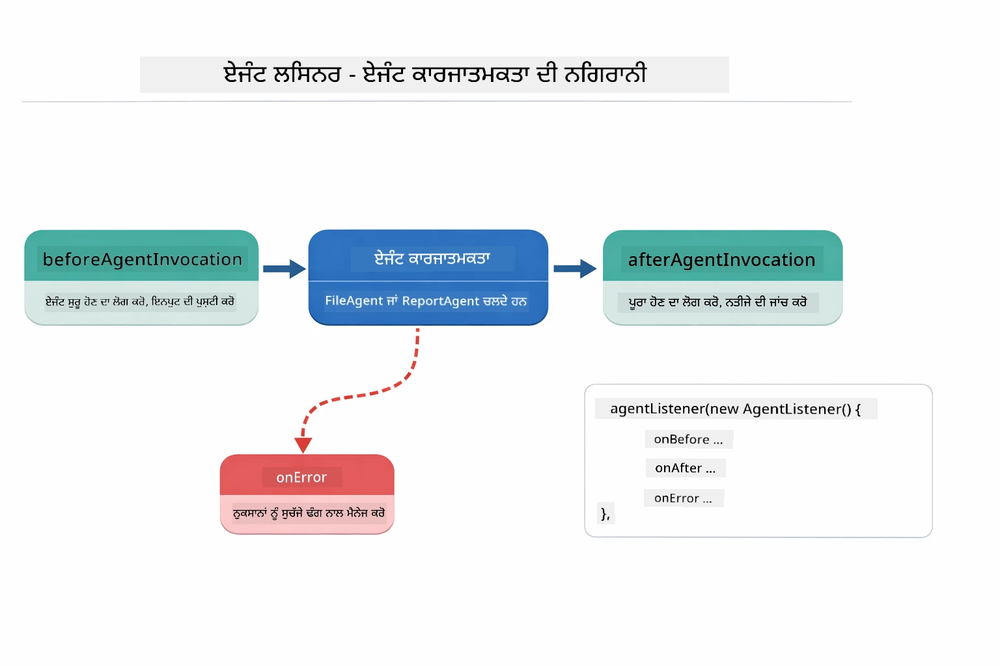

*ਏਜੰਟ ਸੁਣਨ ਵਾਲੇ ਕਾਰਜਕਾਰੀ ਜੀਵਨਚੱਕਰ ਨਾਲ ਜੁੜਦੇ ਹਨ — ਜਦੋਂ ਏਜੰਟ ਸ਼ੁਰੂ ਹੁੰਦੇ ਹਨ, ਮੁਕੰਮਲ ਹੁੰਦੇ ਹਨ ਜਾਂ ਗਲਤੀਆਂ ਦਾ ਸਾਹਮਣਾ ਕਰਦੇ ਹਨ, ਤਦੋਂ ਨਿਗਰਾਨੀ ਕਰਦੇ ਹਨ।*

```java
AgentListener monitor = new AgentListener() {
    private int step = 0;
    
    @Override
    public void beforeAgentInvocation(AgentRequest request) {
        step++;
        System.out.println("  +-- STEP " + step + ": " + request.agentName());
    }
    
    @Override
    public void afterAgentInvocation(AgentResponse response) {
        System.out.println("  +-- [OK] " + response.agentName() + " completed");
    }
    
    @Override
    public boolean inheritedBySubagents() {
        return true; // ਸਾਰੇ ਸਬ-ਏਜੰਟਾਂ ਤੱਕ ਫੈਲਾਓ
    }
};
```

Supervisor ਪੈਟਰਨ ਤੋਂ ਇਲਾਵਾ, `langchain4j-agentic` ਮੋਡੀਊਲ ਕਈ ਤਾਕਤਵਰ ਵਰਕਫਲੋ ਪੈਟਰਨ ਅਤੇ ਵਿਸ਼ੇਸ਼ਤਾਵਾਂ ਮੁਹੱਈਆ ਕਰਵਾਂਦਾ ਹੈ:

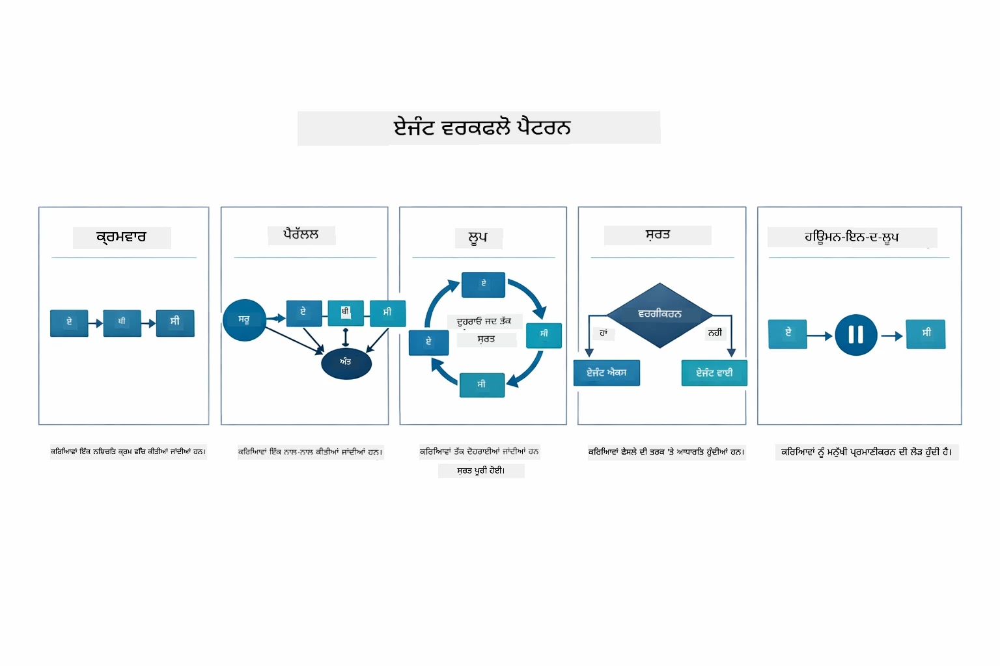

*ਏਜੰਟਾਂ ਦੇ ਕਿਰਿਆਨਵयन ਲਈ ਪੰਜ ਵਰਕਫਲੋ ਪੈਟਰਨ — ਸਧਾਰਣ ਕ੍ਰਮਬੱਧ ਪਾਈਪਲਾਈਨ ਤੋਂ ਲੈ ਕੇ ਮਨੁੱਖ-ਦੇ-ਇੰਜਣ ਦੀ ਮਨਜ਼ੂਰੀ ਵਾਲੇ ਵਰਕਫਲੋ ਤੱਕ।*

| ਪੈਟਰਨ | ਵੇਰਵਾ | ਉਪਯੋਗ ਲਈ ਮਾਮਲਾ |
|---------|-------------|----------|
| **ਕ੍ਰਮਬੱਧ** | ਏਜੰਟਾਂ ਨੂੰ ਕ੍ਰਮ ਵਿੱਚ ਚਲਾਓ, ਆਉਟਪੁੱਟ ਅੱਗੇ ਵਗਦੀ ਹੈ | ਪਾਈਪਲਾਈਨ: ਖੋਜ → ਵਿਸ਼ਲੇਸ਼ਣ → ਰਿਪੋਰਟ |
| **ਸਮਾਂਤਰ** | ਏਜੰਟਾਂ ਨੂੰ ਇਕੱਠੇ ਚਲਾਓ | ਸੁਤੰਤਰ ਕੰਮ: ਮੌਸਮ + ਖਬਰਾਂ + ਸਟਾਕ |
| **ਲੂਪ** | ਜਦ ਤੱਕ ਸ਼ਰਤ ਪੂਰੀ ਨਹੀਂ ਹੁੰਦੀ ਤਕ ਵਾਰੰ ਵਾਰ ਚਲਾਉ | ਗੁਣਵੱਤਾ ਸਕੋਰਿੰਗ: ਰਿਫ਼ਾਈਨ ਕਰਦੇ ਰਹੋ ਜਦ ਤੱਕ ਸਕੋਰ ≥ 0.8 ਨਾ ਹੋ ਜਾਵੇ |
| **ਸ਼ਰਤੀ** | ਸ਼ਰਤਾਂ ਅਨੁਸਾਰ ਦਿਸ਼ਾ ਦਿਓ | ਵਰਗੀਕਰਨ → ਵਿਸ਼ੇਸ਼ਗਿਆ ਏਜੰਟ ਨੂੰ ਰਾਹ ਦਿਓ |
| **ਮਨੁੱਖ-ਦੇ-ਇੰਜਣ** | ਮਨੁੱਖੀ ਚੈੱਕਪੁਆਇੰਟ ਸ਼ਾਮਲ ਕਰੋ | ਮਨਜ਼ੂਰੀ ਵਰਕਫਲੋ, ਸਮੱਗਰੀ ਸਮੀਖਿਆ |

## ਮੁੱਖ ਧਾਰਣਾਵਾਂ

ਹੁਣ ਜਦੋਂ ਤੁਸੀਂ MCP ਅਤੇ agentic ਮੋਡੀਊਲ ਨੂੰ ਕਾਰਜ ਵਿੱਚ ਵੇਖ ਚੁੱਕੇ ਹੋ, ਆਓ ਸੰਖੇਪ ਕਰੀਏ ਕਿ ਕਦੋਂ ਕਿਸ ਤਰੀਕੇ ਦਾ ਉਪਯੋਗ ਕਰਨਾ ਹੈ।

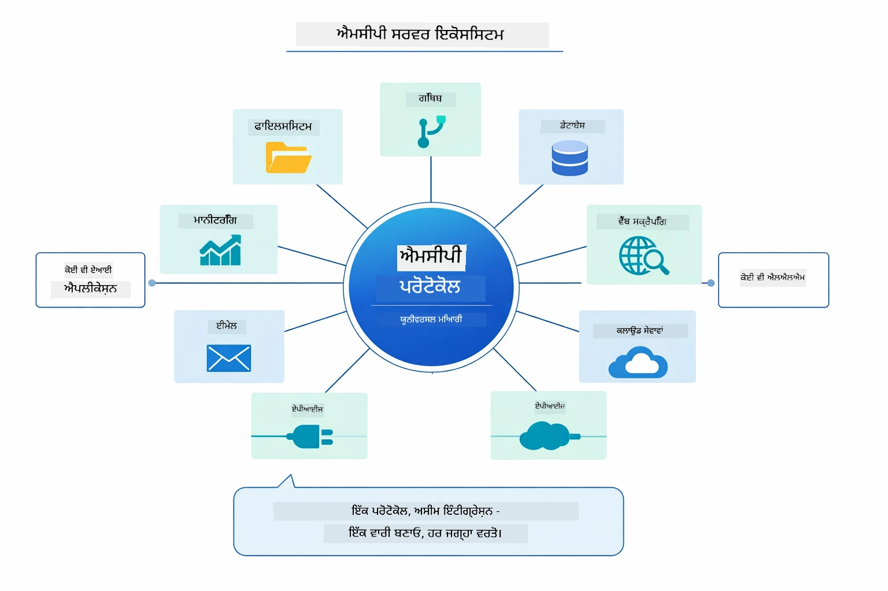

*MCP ਇੱਕ ਵਿਸ਼ਵ ਵਿਆਪੀ ਪ੍ਰੋਟੋਕੋਲ ਪਰਿਵਾਰ ਬਣਾਉਂਦਾ ਹੈ — ਕੋਈ ਵੀ MCP-ਦੇਅਨੁਕੂਲ ਸਰਵਰ MCP-ਦੇਅਨੁਕੂਲ کلਾਇੰਟ ਨਾਲ ਕੰਮ ਕਰਦਾ ਹੈ, ਜਿਸ ਨਾਲ ਐਪਲੀਕੇਸ਼ਨਾਂ ਵਿਚ ਔਜ਼ਾਰ ਸਾਂਝੇ ਕੀਤੇ ਜਾ ਸਕਦੇ ਹਨ।*

**MCP** ਤਦ ਵਧੀਆ ਹੈ ਜਦ ਤੁਸੀਂ ਮੌਜੂਦਾ ਔਜ਼ਾਰ ਪਰਿਵਾਰ ਦਾ ਲਾਭ ਲੈਣਾ ਚਾਹੁੰਦੇ ਹੋ, ਉਹ ਔਜ਼ਾਰ ਬਣਾਉਣਾ ਚਾਹੁੰਦੇ ਹੋ ਜੋ ਕਈ ਐਪਲੀਕੇਸ਼ਨਾਂ ਵੱਲੋਂ ਵਰਤੇ ਜਾ ਸਕਦੇ ਹਨ, ਤੀਸਰੇ ਪੱਖੀ ਸੇਵਾਵਾਂ ਨੂੰ ਮਿਆਰੀ ਪ੍ਰੋਟੋਕੋਲ ਨਾਲ ਇੰਟਿਗ੍ਰੇਟ ਕਰਨਾ ਚਾਹੁੰਦੇ ਹੋ, ਜਾਂ ਬਿਨਾ ਕੋਡ ਬਦਲੇ ਔਜ਼ਾਰ ਦੀ ਅਤੇਆਂ ਬਦਲਣਾ ਚਾਹੁੰਦੇ ਹੋ।

**Agentic ਮੋਡੀਊਲ** ਸਭ ਤੋਂ ਵਧੀਆ ਹੈ ਜਦ ਤੁਸੀਂ ਗਿਆਤਮਕ agent визначения `@Agent` ਐਨੋਟੇਸ਼ਨਾਂ ਨਾਲ ਬਣਾਉਣਾ ਚਾਹੁੰਦੇ ਹੋ, ਵਰਕਫਲੋ ਅਸਤੀਕਰਨ ਕਰਨਾ ਚਾਹੁੰਦੇ ਹੋ (ਕ੍ਰਮਵਾਰ, ਲੂਪ, ਸਮਾਂਤਰੀ), ਇੰਟਰਫੇਸ-ਆਧਾਰਿਤ ਏਜੰਟ ਡਿਜ਼ਾਇਨ ਨੂੰ ਕਮਾਂਡਰ ਕੋਡ ਤੋਂ ਪ੍ਰਧਾਨਤਾ ਦੇਣਾ ਚਾਹੁੰਦੇ ਹੋ, ਜਾਂ ਕਈ ਏਜੰਟ ਜਿਨ੍ਹਾਂ ਦਾ ਆਉਟਪੁੱਟ `outputKey` ਰਾਹੀਂ ਸਾਂਝਾ ਹੁੰਦਾ ਹੈ, ਨੂੰ ਮਿਲਾ ਕੇ ਵਰਤਣਾ ਚਾਹੁੰਦੇ ਹੋ।

**Supervisor Agent ਪੈਟਰਨ** ਤਦ ਚਮਕਦਾ ਹੈ ਜਦ ਵਰਕਫਲੋ ਪਹਿਲਾਂ ਤੋਂ ਭਵਿੱਖਵਾਣੀਯੋਗ ਨਹੀਂ ਹੁੰਦਾ ਅਤੇ ਤੁਸੀਂ LLM ਨੂੰ ਫੈਸਲਾ ਕਰਨ ਦੇਣਾ ਚਾਹੁੰਦੇ ਹੋ, ਜਦ ਤੁਹਾਡੇ ਕੋਲ ਕਈ ਵਿਸ਼ੇਸ਼ਗਿਆ ਏਜੰਟ ਹਨ ਜਿਨ੍ਹਾਂ ਨੂੰ ਗਤੀਸ਼ੀਲ ਅਸਟੀਕਰਨ ਦੀ ਲੋੜ ਹੈ, ਜਦ ਗੱਲਬਾਤੀ ਪ੍ਰਣਾਲੀਆਂ ਨਿਰਮਾਣ ਕਰ ਰਹੇ ਹੋ ਜੋ ਵੱਖ-ਵੱਖ ਸਮਰੱਥਾਵਾਂ ਲਈ ਰਾਹ ਦਿੰਦੇ ਹਨ, ਜਾਂ ਜਦ ਤੁਸੀਂ ਸਭ ਤੋਂ ਲਚਕੀਲਾ, ਅਨੁਕੂਲ ਈਜੰਟ ਵਰਤਾਰਾ ਚਾਹੁੰਦੇ ਹੋ।

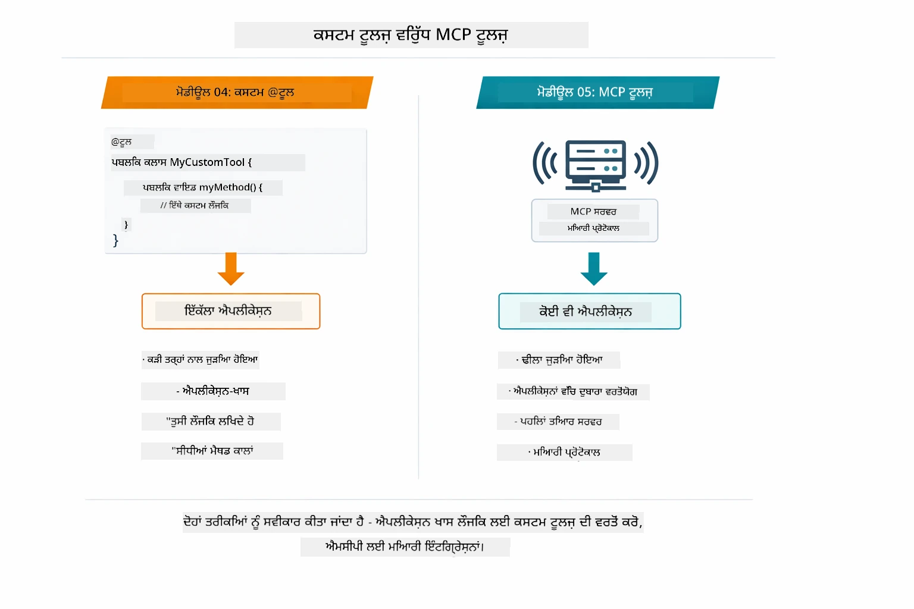

*ਕਦੋਂ ਕਸਟਮ @Tool ਮੈਥਡ ਦੀ ਵਰਤੋਂ ਕਰਨੀ ਹੈ ਅਤੇ ਕਦੋਂ MCP ਔਜ਼ਾਰਾਂ ਦੀ — ਐਪ-ਨਿਰਧਾਰਿਤ ਤਰਕ ਲਈ ਕਸਟਮ ਔਜ਼ਾਰ ਪੂਰੀ ਕਿਸਮ ਦੀ ਸੁਰੱਖਿਆ ਨਾਲ, MCP ਔਜ਼ਾਰ ਮਿਆਰੀਕ੍ਰਿਤ ਇੰਟਿਗ੍ਰੇਸ਼ਨਾਂ ਲਈ ਜੋ ਕਈ ਐਪਲੀਕੇਸ਼ਨਾਂ ਵਿਚ ਕੰਮ ਕਰਦੇ ਹਨ।*

## ਵਧਾਈਆਂ!

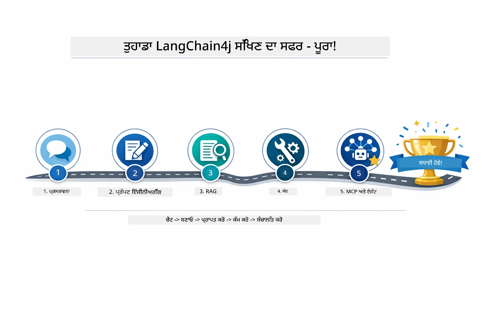

*ਤੁਹਾਡਾ ਸਿਖਲਾਈ ਯਾਤਰਾ ਸਾਰਿਆਂ ਪੰਜ ਮੋਡੀਊਲਾਂ ਰਾਹੀਂ — ਮੂਲ ਚੈਟ ਤੋਂ ਲੈ ਕੇ MCP-ਚਾਲਿਤ agentic ਪ੍ਰਣਾਲੀਆਂ ਤੱਕ।*

ਤੁਸੀਂ LangChain4j ਲਈ ਬਿਗਿਨਰਜ਼ ਕੋਰਸ ਮੁਕੰਮਲ ਕਰ ਲਿਆ ਹੈ। ਤੁਸੀਂ ਸਿੱਖਿਆ:

- ਯਾਦਦਾਸ਼ਤ ਸਮੇਤ ਗੱਲਬਾਤੀ AI ਬਣਾਉਣੀ (ਮੋਡੀਊਲ 01)
- ਵੱਖ-ਵੱਖ ਕੰਮਾਂ ਲਈ ਪ੍ਰੌਂਪਟ ਇੰਜੀਨੀਅਰਿੰਗ ਪੈਟਰਨ (ਮੋਡੀਊਲ 02)
- ਆਪਣੇ ਦਸਤਾਵੇਜ਼ਾਂ ਵਿੱਚ ਜਵਾਬਾਂ ਨੂੰ ਰੈਗ ਦੇ ਨਾਲ ਮੂਲ ਨਿਧਾਰਿਤ ਕਰਨਾ (ਮੋਡੀਊਲ 03)
- ਮੂਲ AI ਏਜੰਟ (ਸਹਾਇਕ) ਬਣਾਉਣਾ ਕਸਟਮ ਔਜ਼ਾਰਾਂ ਨਾਲ (ਮੋਡੀਊਲ 04)
- LangChain4j MCP ਅਤੇ Agentic ਮੋਡੀਊਲ ਨਾਲ ਮਿਆਰੀਕ੍ਰਿਤ ਔਜ਼ਾਰ ਇੰਟਿਗ੍ਰੇਟ ਕਰਨਾ (ਮੋਡੀਊਲ 05)

### ਅਗਲਾ ਕੀ ਹੈ?

ਮੋਡੀਊਲਾਂ ਮੁਕੰਮਲ ਕਰਨ ਤੋਂ ਬਾਦ, [Testing Guide](../docs/TESTING.md) ਦਾ ਪਤਾ ਲਗਾਓ ਤਾਂ ਜੋ LangChain4j ਟੈਸਟਿੰਗ ਧਾਰਣਾਵਾਂ ਕਾਰਜ ਵਿੱਚ ਵੇਖ ਸਕੋ।

**ਅਧਿਕਾਰਿਕ ਸਰੋਤ:**
- [LangChain4j ਦਸਤਾਵੇਜ਼](https://docs.langchain4j.dev/) - ਵਿਆਪਕ ਮਾਰਗਦਰਸ਼ਿਕ ਅਤੇ API ਸੰਦਰਭ
- [LangChain4j GitHub](https://github.com/langchain4j/langchain4j) - ਸਰੋਤ ਕੋਡ ਅਤੇ ਉਦਾਹਰਣ
- [LangChain4j ਟਿਊਟੋਰਿਯਲ](https://docs.langchain4j.dev/tutorials/) - ਵੱਖ-ਵੱਖ ਵਰਤੋਂਮਾਮਲਿਆਂ ਲਈ ਕਦਮ-ਦਰ-ਕਦਮ ਟਿਊਟੋਰਿਯਲ

ਇਸ ਕੋਰਸ ਨੂੰ ਮੁਕੰਮਲ ਕਰਨ ਲਈ ਧੰਨਵਾਦ!

---

**ਨੈਵੀਗੇਸ਼ਨ:** [← ਪਹਿਲਾਂ: ਮੋਡੀਊਲ 04 - ਔਜ਼ਾਰ](../04-tools/README.md) | [ਮੁੱਖ ਨੂੰ ਵਾਪਸ](../README.md)

---

<!-- CO-OP TRANSLATOR DISCLAIMER START -->
**ਇਸਤੇਮਾਲ ਕਰਨ ਵਾਲੀ ਸੂਚਨਾ**:  
ਇਹ ਦਸਤਾਵੇਜ਼ AI ਅਨੁਵਾਦ ਸੇਵਾ [Co-op Translator](https://github.com/Azure/co-op-translator) ਦੀ ਵਰਤੋਂ ਕਰਕੇ ਅਨੁਵਾਦਿਤ ਕੀਤਾ ਗਿਆ ਹੈ। ਜਦੋਂ ਕਿ ਅਸੀਂ ਸ਼ੁੱਧਤਾ ਲਈ ਕੋਸ਼ਿਸ਼ ਕਰਦੇ ਹਾਂ, ਕਿਰਪਾ ਕਰਕੇ ਜਾਣੋ ਕਿ ਸਵੈਚਾਲਿਤ ਅਨੁਵਾਦਾਂ ਵਿੱਚ ਗਲਤੀਆਂ ਜਾਂ ਅਸਤੀਕਿਤਾ ਹੋ ਸਕਦੀ ਹੈ। ਮੂਲ ਦਸਤਾਵੇਜ਼ ਆਪਣੀ ਮੂਲ ਭਾਸ਼ਾ ਵਿੱਚ ਪ੍ਰਮਾਣਿਕ ਸਰੋਤ ਮੰਨਿਆ ਜਾਣਾ ਚਾਹੀਦਾ ਹੈ। ਮਹੱਤਵਪੂਰਨ ਜਾਣਕਾਰੀ ਲਈ, ਪੇਸ਼ੇਵਰ ਮਾਨਵ ਅਨੁਵਾਦ ਦੀ ਸਿਫਾਰਿਸ਼ ਕੀਤੀ ਜਾਂਦੀ ਹੈ। ਅਸੀਂ ਇਸ ਅਨੁਵਾਦ ਦੇ ਇਸਤੇਮਾਲ ਤੋਂ ਪੈਦਾ ਹੋਣ ਵਾਲੀਆਂ ਕਿਸੇ ਵੀ ਗਲਤਫਹਿਮੀਆਂ ਜਾਂ ਗਲਤ ਵਿਵਰਣਾਂ ਲਈ ਜਵਾਬਦੇਹ ਨਹੀਂ ਹਾਂ।
<!-- CO-OP TRANSLATOR DISCLAIMER END -->