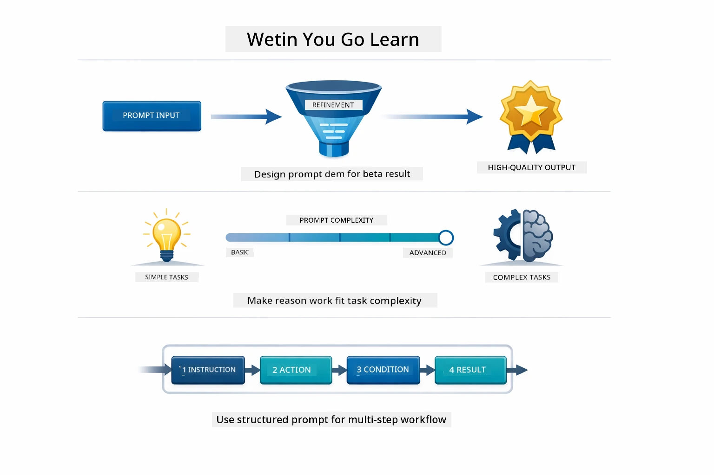
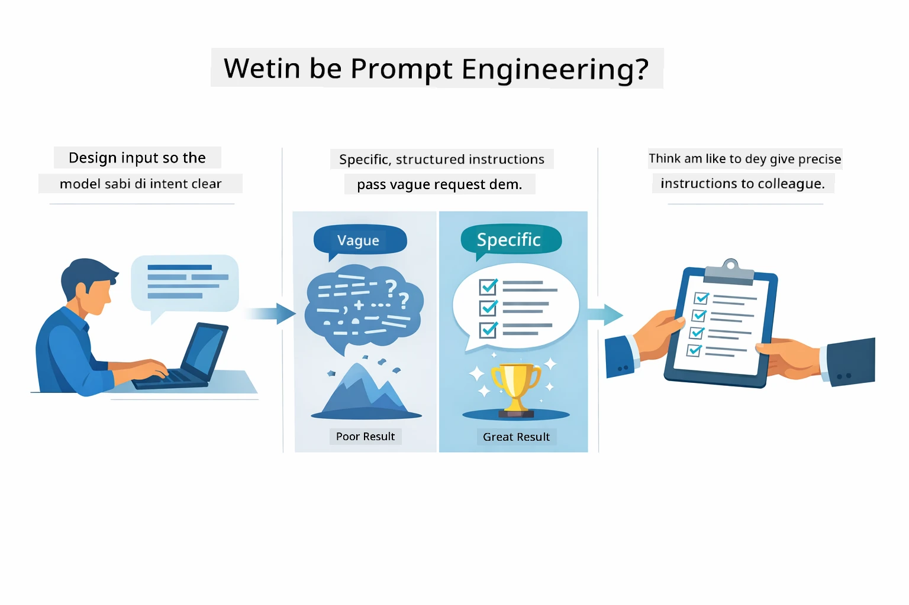
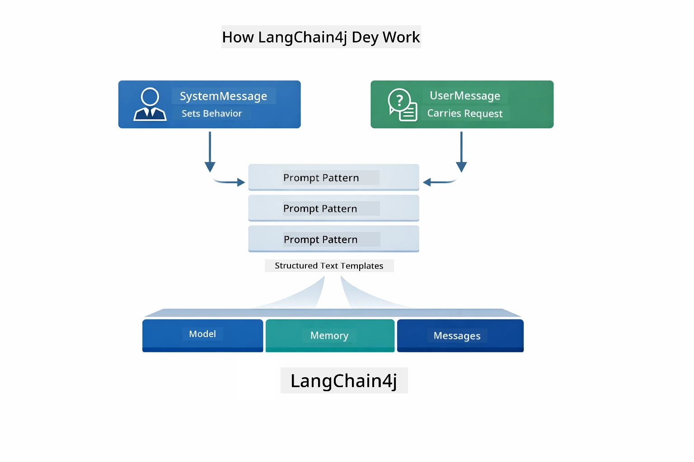
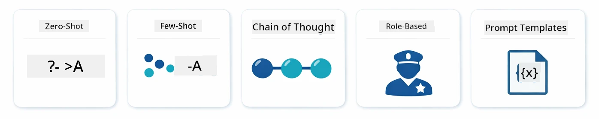
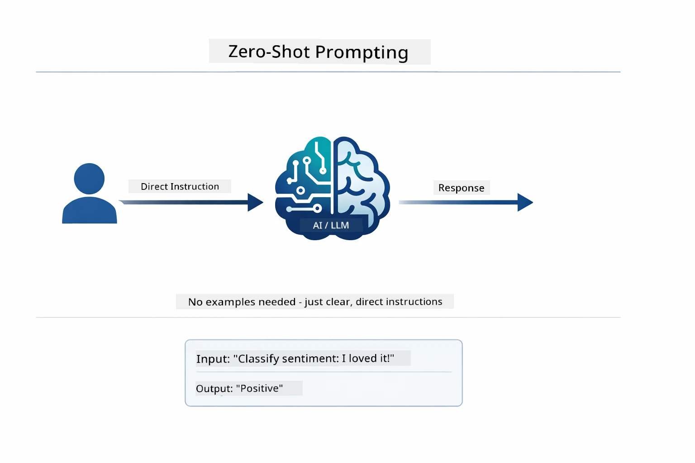
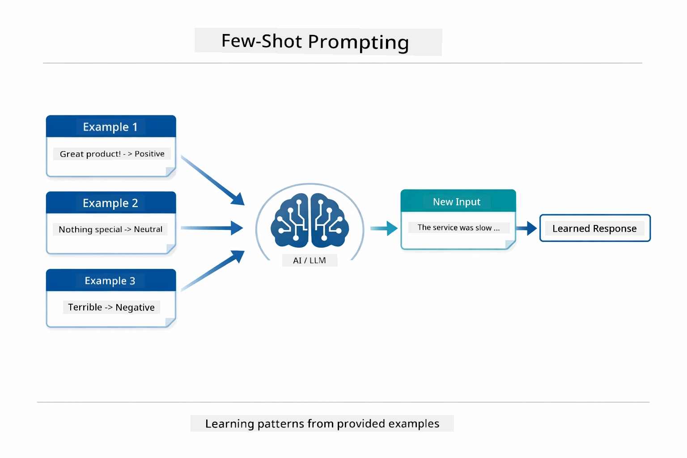
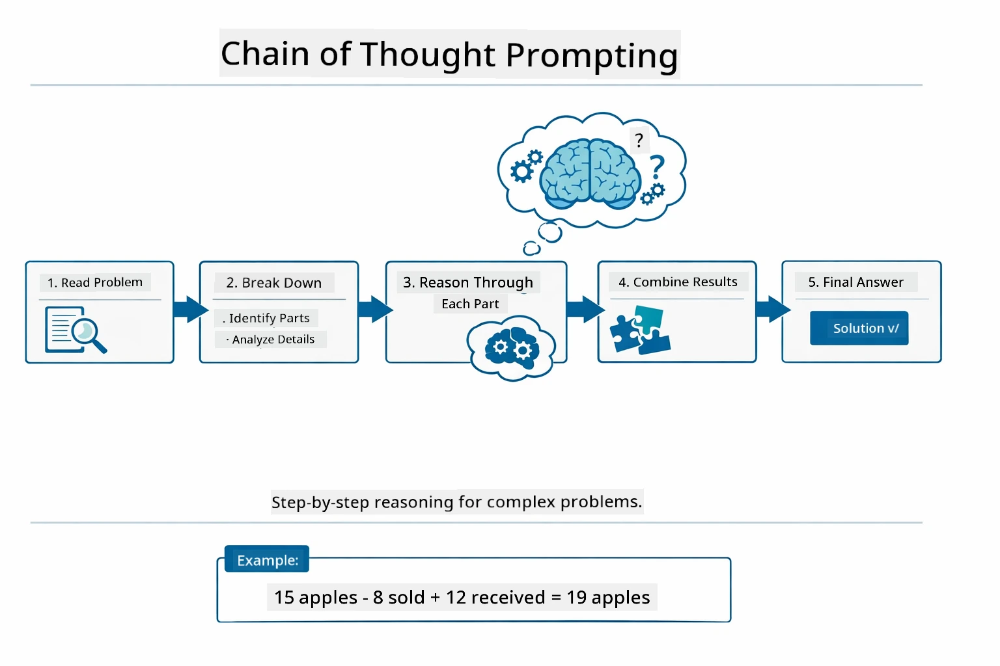
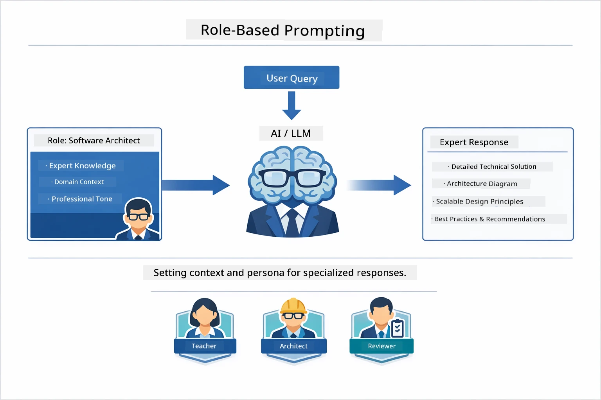
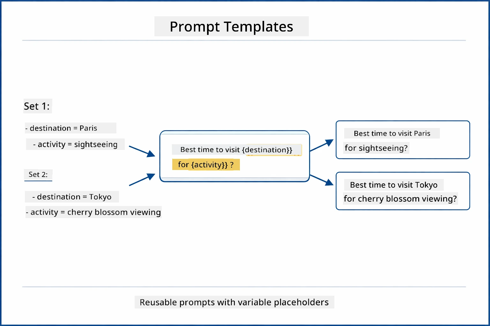
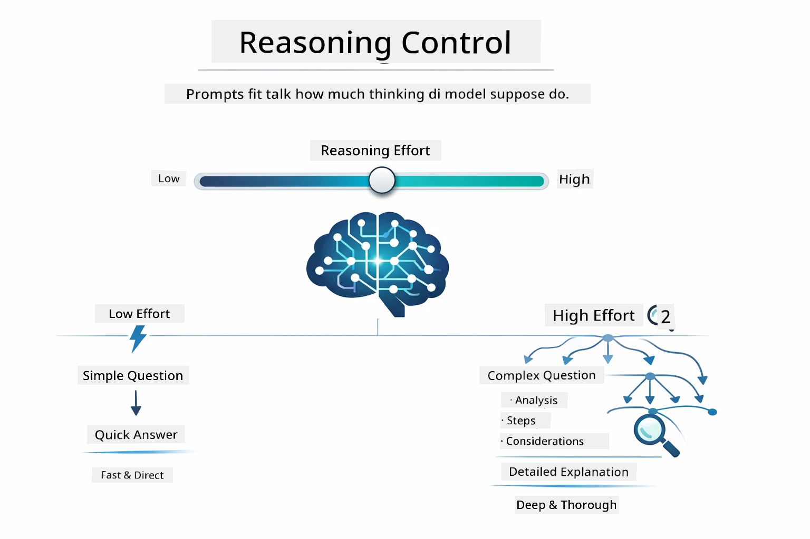

# Module 02: Prompt Engineering wit GPT-5.2

## Table of Contents

- [Wetin You Go Learn](../../../02-prompt-engineering)
- [Wetin Dey Required First](../../../02-prompt-engineering)
- [Understanding Prompt Engineering](../../../02-prompt-engineering)
- [Prompt Engineering Fundamentals](../../../02-prompt-engineering)
  - [Zero-Shot Prompting](../../../02-prompt-engineering)
  - [Few-Shot Prompting](../../../02-prompt-engineering)
  - [Chain of Thought](../../../02-prompt-engineering)
  - [Role-Based Prompting](../../../02-prompt-engineering)
  - [Prompt Templates](../../../02-prompt-engineering)
- [Advanced Patterns](../../../02-prompt-engineering)
- [Using Existing Azure Resources](../../../02-prompt-engineering)
- [Application Screenshots](../../../02-prompt-engineering)
- [Exploring the Patterns](../../../02-prompt-engineering)
  - [Low vs High Eagerness](../../../02-prompt-engineering)
  - [Task Execution (Tool Preambles)](../../../02-prompt-engineering)
  - [Self-Reflecting Code](../../../02-prompt-engineering)
  - [Structured Analysis](../../../02-prompt-engineering)
  - [Multi-Turn Chat](../../../02-prompt-engineering)
  - [Step-by-Step Reasoning](../../../02-prompt-engineering)
  - [Constrained Output](../../../02-prompt-engineering)
- [Wetin You Dey Really Learn](../../../02-prompt-engineering)
- [Next Steps](../../../02-prompt-engineering)

## Wetin You Go Learn



For di previous module, you don see how memory dey enable conversational AI and how you take use GitHub Models for simple talk dem. Now, we go focus on how you dey ask question - di prompts dem sef - with Azure OpenAI GPT-5.2. How you take arrange your prompts fit seriously affect di quality of di answers wey you go get. We go start with review of di basic prompting techniques, den we go go inside eight advanced patterns wey fit use GPT-5.2 well well.

We go use GPT-5.2 because e get reasoning control - you fit talk how much thinking di model suppose do before e give answer. This one go make di different prompting strategies clear well and e go help you understand when to use each way. We also go benefit from Azure rates wey low pass GitHub Models for GPT-5.2.

## Wetin Dey Required First

- Complete Module 01 (Azure OpenAI resources don setup)
- `.env` file dey root directory with Azure credentials (wey `azd up` for Module 01 create)

> **Note:** If you never complete Module 01, abeg follow di deployment instructions for there first.

## Understanding Prompt Engineering



Prompt engineering na how to design input text wey go always give you di results wey you want. E no just dey about how to ask question - e dey about how to arrange request make di model understand exactly wetin you want and how e go deliver am.

Make you think am like how you go give instruction to your colleague. "Fix di bug" no clear. "Fix di null pointer exception for UserService.java line 45 by adding null check" na specific talk. Language models dey work di same way - specificity and structure dey important.



LangChain4j na di infrastructure — e provide model connections, memory, and message types — but prompt patterns na just well arrange text wey you send through dat infrastructure. Di main building blocks na `SystemMessage` (wey set di AI behavior and role) and `UserMessage` (wey carry your real request).

## Prompt Engineering Fundamentals



Before we begin di advanced patterns for dis module, make we review five basic prompting techniques. Dem be di building blocks every prompt engineer suppose sabi. If you don already work through di [Quick Start module](../00-quick-start/README.md#2-prompt-patterns), you don see dis ones for action — na di conceptual framework behind dem.

### Zero-Shot Prompting

Na di simplest way be this: give di model direct instruction with no example. Di model go rely only on di training to understand and do di work. E dey work well for straightforward requests wey di expected behavior obvious.



*Direct instruction without examples — di model go infer di task from instruction alone*

```java
String prompt = "Classify this sentiment: 'I absolutely loved the movie!'";
String response = model.chat(prompt);
// Response: "Positiv"
```

**When to use:** Simple classification, direct questions, translations, or any task di model fit handle without extra guidance.

### Few-Shot Prompting

You go give examples wey show di pattern you want make di model follow. Di model go learn how di input-output suppose be from your examples and apply am to new inputs. Dis one dey improve consistency well well for tasks wey di format or behavior no too obvious.



*Learning from examples — model go identify di pattern and use am for new inputs*

```java
String prompt = """
    Classify the sentiment as positive, negative, or neutral.
    
    Examples:
    Text: "This product exceeded my expectations!" → Positive
    Text: "It's okay, nothing special." → Neutral
    Text: "Waste of money, very disappointed." → Negative
    
    Now classify this:
    Text: "Best purchase I've made all year!"
    """;
String response = model.chat(prompt);
```

**When to use:** Custom classifications, consistent formatting, domain-specific tasks, or when zero-shot results no consistent.

### Chain of Thought

You go ask di model make e show how e reason step-by-step. Instead of to just give answer sharp sharp, di model go break down di problem and work through each part clearly. Dis one dey help improve accuracy for math, logic, and multi-step reasoning tasks.



*Step-by-step reasoning — breaking complex problems into clear logical steps*

```java
String prompt = """
    Problem: A store has 15 apples. They sell 8 apples and then 
    receive a shipment of 12 more apples. How many apples do they have now?
    
    Let's solve this step-by-step:
    """;
String response = model.chat(prompt);
// Di model dey show: 15 - 8 = 7, den 7 + 12 = 19 apples
```

**When to use:** Math problems, logic puzzles, debugging, or any task wey showing reasoning process go improve accuracy and trust.

### Role-Based Prompting

You go set persona or role for di AI before you ask your question. Dis one dey give context wey shape di tone, depth, and focus of di answer. "Software architect" go talk different from "junior developer" or "security auditor".



*Setting context and persona — di same question fit get different answer depending on di role assigned*

```java
String prompt = """
    You are an experienced software architect reviewing code.
    Provide a brief code review for this function:
    
    def calculate_total(items):
        total = 0
        for item in items:
            total = total + item['price']
        return total
    """;
String response = model.chat(prompt);
```

**When to use:** Code reviews, tutoring, domain-specific analysis, or anytime you need answers wey fit particular expertise level or perspective.

### Prompt Templates

You fit create prompts wey you fit use again with variable placeholders. Instead of to write prompt every time, define one template once and fill different values. LangChain4j `PromptTemplate` class dey make am easy with `{{variable}}` syntax.



*Reusable prompts with variable placeholders — one template, many uses*

```java
PromptTemplate template = PromptTemplate.from(
    "What's the best time to visit {{destination}} for {{activity}}?"
);

Prompt prompt = template.apply(Map.of(
    "destination", "Paris",
    "activity", "sightseeing"
));

String response = model.chat(prompt.text());
```

**When to use:** Repeated queries with different inputs, batch processing, building reusable AI workflows, or anytime prompt structure dey the same but data dey change.

---

These five basics go give you solid toolkit for most prompting work. Di rest of dis module go build on top dem with **eight advanced patterns** wey use GPT-5.2 reasoning control, self-evaluation, and structured output well well.

## Advanced Patterns

As we don cover basics, make we enter di eight advanced patterns wey make dis module special. No all problem need same way. Some questions need quick answers, others need deep thinking. Some need to show reasoning, others just want result. Each pattern below na for different scenario — and GPT-5.2 reasoning control make di difference dem clear well well.


*Overview of di eight prompt engineering patterns and how to use dem*



*GPT-5.2 reasoning control let you talk how much thinking di model go do — from fast direct answers to deep exploration*

**Low Eagerness (Quick & Focused)** - For simple questions wey you want fast and direct answers. Di model go do minimal reasoning - maximum 2 steps. Use am for calculations, lookups, or straightforward questions.

```java
String prompt = """
    <context_gathering>
    - Search depth: very low
    - Bias strongly towards providing a correct answer as quickly as possible
    - Usually, this means an absolute maximum of 2 reasoning steps
    - If you think you need more time, state what you know and what's uncertain
    </context_gathering>
    
    Problem: What is 15% of 200?
    
    Provide your answer:
    """;

String response = chatModel.chat(prompt);
```

> 💡 **Explore with GitHub Copilot:** Open [`Gpt5PromptService.java`](../../../02-prompt-engineering/src/main/java/com/example/langchain4j/prompts/service/Gpt5PromptService.java) and ask:
> - "Wetin dey different between low eagerness and high eagerness prompting patterns?"
> - "How XML tags for prompts dey help arrange AI response?"
> - "When I suppose use self-reflection patterns and when to use direct instruction?"

**High Eagerness (Deep & Thorough)** - For complex wahala wey you want thorough analysis. Di model go explore well and show detailed reasoning. Use am for system design, architecture decisions, or complex research.

```java
String prompt = """
    Analyze this problem thoroughly and provide a comprehensive solution.
    Consider multiple approaches, trade-offs, and important details.
    Show your analysis and reasoning in your response.
    
    Problem: Design a caching strategy for a high-traffic REST API.
    """;

String response = chatModel.chat(prompt);
```

**Task Execution (Step-by-Step Progress)** - For workflows wey get many steps. Di model go give plan first, talk each step as e dey do am, then give summary. Use am for migrations, implementations, or any multi-step process.

```java
String prompt = """
    <task_execution>
    1. First, briefly restate the user's goal in a friendly way
    
    2. Create a step-by-step plan:
       - List all steps needed
       - Identify potential challenges
       - Outline success criteria
    
    3. Execute each step:
       - Narrate what you're doing
       - Show progress clearly
       - Handle any issues that arise
    
    4. Summarize:
       - What was completed
       - Any important notes
       - Next steps if applicable
    </task_execution>
    
    <tool_preambles>
    - Always begin by rephrasing the user's goal clearly
    - Outline your plan before executing
    - Narrate each step as you go
    - Finish with a distinct summary
    </tool_preambles>
    
    Task: Create a REST endpoint for user registration
    
    Begin execution:
    """;

String response = chatModel.chat(prompt);
```

Chain-of-Thought prompting dey make model show im reasoning process, e dey help improve accuracy for complex tasks. Di step-by-step breakdown dey help human and AI understand di logic.

> **🤖 Try with [GitHub Copilot](https://github.com/features/copilot) Chat:** Ask about dis pattern:
> - "How I go fit adapt task execution pattern for long-running operations?"
> - "Wetin be best practices to arrange tool preambles for production applications?"
> - "How I fit capture and show intermediate progress updates for UI?"


*Plan → Execute → Summarize workflow for multi-step tasks*

**Self-Reflecting Code** - For to generate production-quality code. Di model go generate code wey follow production standards with correct error handling. Use am when you dey build new features or services.

```java
String prompt = """
    Generate Java code with production-quality standards: Create an email validation service
    Keep it simple and include basic error handling.
    """;

String response = chatModel.chat(prompt);
```


*Loop of iterative improvement - generate, evaluate, find problems, improve, repeat*

**Structured Analysis** - For consistent evaluation. Di model go review code using fixed framework (correctness, practices, performance, security, maintainability). Use am for code reviews or quality checks.

```java
String prompt = """
    <analysis_framework>
    You are an expert code reviewer. Analyze the code for:
    
    1. Correctness
       - Does it work as intended?
       - Are there logical errors?
    
    2. Best Practices
       - Follows language conventions?
       - Appropriate design patterns?
    
    3. Performance
       - Any inefficiencies?
       - Scalability concerns?
    
    4. Security
       - Potential vulnerabilities?
       - Input validation?
    
    5. Maintainability
       - Code clarity?
       - Documentation?
    
    <output_format>
    Provide your analysis in this structure:
    - Summary: One-sentence overall assessment
    - Strengths: 2-3 positive points
    - Issues: List any problems found with severity (High/Medium/Low)
    - Recommendations: Specific improvements
    </output_format>
    </analysis_framework>
    
    Code to analyze:
    ```
    public List getUsers() {
        return database.query("SELECT * FROM users");
    }
    ```
    Provide your structured analysis:
    """;

String response = chatModel.chat(prompt);
```

> **🤖 Try with [GitHub Copilot](https://github.com/features/copilot) Chat:** Ask about structured analysis:
> - "How I fit customize di analysis framework for different types of code reviews?"
> - "Wetin be di best way to parse and act on structured output programmatically?"
> - "How I go fit ensure consistent severity levels across different review sessions?"


*Framework for consistent code reviews with severity levels*

**Multi-Turn Chat** - For conversations wey need context. Di model go remember previous messages and build on top. Use am for interactive help session or complex Q&A.

```java
ChatMemory memory = MessageWindowChatMemory.withMaxMessages(10);

memory.add(UserMessage.from("What is Spring Boot?"));
AiMessage aiMessage1 = chatModel.chat(memory.messages()).aiMessage();
memory.add(aiMessage1);

memory.add(UserMessage.from("Show me an example"));
AiMessage aiMessage2 = chatModel.chat(memory.messages()).aiMessage();
memory.add(aiMessage2);
```


*How conversation context dey accumulate over multiple turns until e reach token limit*

**Step-by-Step Reasoning** - For problems wey need visible logic. Di model go show clear reasoning for each step. Use am for math problems, logic puzzles, or when you want understand di thinking process.

```java
String prompt = """
    <instruction>Show your reasoning step-by-step</instruction>
    
    If a train travels 120 km in 2 hours, then stops for 30 minutes,
    then travels another 90 km in 1.5 hours, what is the average speed
    for the entire journey including the stop?
    """;

String response = chatModel.chat(prompt);
```


*Break down problems into explicit logical steps*

**Constrained Output** - For answers wey get specific format requirements. Di model go strictly follow di format and length rules. Use am for summaries or when you want precise output structure.

```java
String prompt = """
    <constraints>
    - Exactly 100 words
    - Bullet point format
    - Technical terms only
    </constraints>
    
    Summarize the key concepts of machine learning.
    """;

String response = chatModel.chat(prompt);
```


*Enforce specific format, length, and structure requirements*

## Using Existing Azure Resources

**Verify deployment:**

Make sure say `.env` file dey root directory wit Azure credentials (wey get created for Module 01):
```bash
cat ../.env  # E suppose show AZURE_OPENAI_ENDPOINT, API_KEY, DEPLOYMENT
```

**Start the application:**

> **Note:** If you don already start all applications using `./start-all.sh` from Module 01, dis module don dey run for port 8083. You fit skip di start commands below and go directly to http://localhost:8083.

**Option 1: Use Spring Boot Dashboard (Recommended for VS Code users)**

Di dev container get Spring Boot Dashboard extension, wey dey give visual interface to manage all Spring Boot applications. You fit find am for Activity Bar for left side of VS Code (look for di Spring Boot icon).

From Spring Boot Dashboard, you fit:
- See all di Spring Boot applications wey dey workspace
- Start/stop applications wit one click
- See application logs for real-time
- Monitor application status
Just click di play button wey dey beside "prompt-engineering" to start dis module, or start all modules for once.


**Option 2: Using shell scripts**

Start all web applications (modules 01-04):

**Bash:**
```bash
cd ..  # From root directory
./start-all.sh
```

**PowerShell:**
```powershell
cd ..  # From root directory
.\start-all.ps1
```

Or start just dis one module:

**Bash:**
```bash
cd 02-prompt-engineering
./start.sh
```

**PowerShell:**
```powershell
cd 02-prompt-engineering
.\start.ps1
```

Both scripts go automatically load environment variables from root `.env` file and go build di JARs if dem no dey.

> **Note:** If you want build all modules manually before you start:
>
> **Bash:**
> ```bash
> cd ..  # Go to root directory
> mvn clean package -DskipTests
> ```
>
> **PowerShell:**
> ```powershell
> cd ..  # Go to root directory
> mvn clean package -DskipTests
> ```

Open http://localhost:8083 for your browser.

**To stop:**

**Bash:**
```bash
./stop.sh  # Dis module only
# Or
cd .. && ./stop-all.sh  # All di modules
```

**PowerShell:**
```powershell
.\stop.ps1  # Dis module only
# Or
cd ..; .\stop-all.ps1  # All modules
```

## Application Screenshots


*Di main dashboard wey show all 8 prompt engineering patterns with their characteristics and how pipo dey use am*

## Exploring the Patterns

Di web interface make you fit experiment wit different prompting strategies. Each pattern dey solve different palava - try dem to see wen each approach dey shine.

> **Note: Streaming vs Non-Streaming** — Every pattern page get two buttons: **🔴 Stream Response (Live)** and **Non-streaming** option. Streaming dey use Server-Sent Events (SSE) to show tokens as e de happen live as di model dey generate dem, so you fit see progress quick-quick. Non-streaming option go wait for all di response finish before e show am. For prompts wey go deep dey reason (like High Eagerness, Self-Reflecting Code), di non-streaming call fit take plenty time — sometimes minutes — with no feedback wey you fit see. **Use streaming when you dey try complex prompts** so you fit see di model dey work and no go think say di request don timeout.
>
> **Note: Browser Requirement** — Di streaming feature dey use Fetch Streams API (`response.body.getReader()`) wey need full browser (Chrome, Edge, Firefox, Safari). E no dey work for VS Code simple browser wey dey inside, because dat one no support ReadableStream API. If you use Simple Browser, di non-streaming buttons go still work normal — na only di streaming buttons dem go affect. Open `http://localhost:8083` for external browser to get full experience.

### Low vs High Eagerness

Ask simple question like "Wetin be 15% of 200?" using Low Eagerness. E go give you quick, direct answer. Now ask something wey hard like "Design caching strategy for high-traffic API" using High Eagerness. Click **🔴 Stream Response (Live)** and watch how di model dey reason detailed token-by-token. Same model, same question structure - but di prompt dey tell am how much to think.

### Task Execution (Tool Preambles)

Multi-step workflows dey benefit from planning before and progress narration. Di model go talk wetin e go do, talk each step, then summarize result.

### Self-Reflecting Code

Try "Create email validation service". Instead of just generate code and stop, di model go generate, check am against quality criteria, find where e dey weak, then improve. You go see am dey repeat until di code sharp reach production standard.

### Structured Analysis

Code reviews need consistent evaluation frameworks. Di model go analyze code using fixed categories (correctness, practices, performance, security) with severity levels.

### Multi-Turn Chat

Ask "Wetin be Spring Boot?" then follow quickly with "Show me example". Di model go remember your first question and give you Spring Boot example just for you. Without memory, second question go too vague.

### Step-by-Step Reasoning

Pick math palava and try am with both Step-by-Step Reasoning and Low Eagerness. Low eagerness go just give you answer - fast but e no clear. Step-by-step go show you every calculation and decision.

### Constrained Output

When you need specific formats or word counts, dis pattern go force strict adherence. Try generate summary wit exactly 100 words for bullet point format.

## Wetin You Really Dey Learn

**Reasoning Effort Changes Everything**

GPT-5.2 let you control how much brain power you wan put inside your prompts. Low effort mean quick responses with small tinkering. High effort mean di model go take time to reason well well. You dey learn how to match effort to task wahala - no waste time on easy questions, but no rush serious decisions too.

**Structure Guides Behavior**

You see di XML tags for the prompts? Dem no dey only dey look nice. Models dey follow structured instructions better pass freeform text. When you need multi-step process or complex logic, structure dey help di model sabi where e dey and wetin e go do next.


*How well-structured prompt be, wit clear sections and XML-style organization*

**Quality Through Self-Evaluation**

Di self-reflecting patterns dey work by making quality criteria clear. Instead of hoping say di model "go do am correct", you go tell am exactly wetin "correct" mean: correct logic, error handling, performance, security. Di model fit then check di output for itself and improve am. Dis one change code generation from lottery to proper process.

**Context Is Finite**

Multi-turn conversations dey work by including message history with each request. But e get limit - every model get max tokens wey e fit carry. As conversation dey grow, you go need strategy to keep only relevant context without reach di limit. Dis module go show you how memory dey work; later you go learn wen to summarize, wen to forget, and wen to recall.

## Next Steps

**Next Module:** [03-rag - RAG (Retrieval-Augmented Generation)](../03-rag/README.md)

---

**Navigation:** [← Previous: Module 01 - Introduction](../01-introduction/README.md) | [Back to Main](../README.md) | [Next: Module 03 - RAG →](../03-rag/README.md)

---

<!-- CO-OP TRANSLATOR DISCLAIMER START -->
**Disclaimer**:
Dis document don translate with AI translation service wey dem call [Co-op Translator](https://github.com/Azure/co-op-translator). Even though we dey try make am correct, make you sabi say automatic translation fit get mistakes or no too correct. Di original document for im own language na di main correct source. If na serious information, na human professional translation you suppose make use. We no dey responsible for any misunderstanding or wrong meaning wey fit come from this translation.
<!-- CO-OP TRANSLATOR DISCLAIMER END -->