# Module 03: RAG (Retrieval-Augmented Generation)

## Table of Contents

- [Video Walkthrough](../../../03-rag)
- [Wetyn You Go Learn](../../../03-rag)
- [Wetyn You Must Know Before](../../../03-rag)
- [How You Go Understand RAG](../../../03-rag)
  - [Which RAG Way Dis Tutorial Dey Use?](../../../03-rag)
- [How E Dey Work](../../../03-rag)
  - [Document Processing](../../../03-rag)
  - [Creating Embeddings](../../../03-rag)
  - [Semantic Search](../../../03-rag)
  - [Answer Generation](../../../03-rag)
- [Run The Application](../../../03-rag)
- [How You Go Take Use The Application](../../../03-rag)
  - [Upload Document](../../../03-rag)
  - [Ask Questions](../../../03-rag)
  - [Check Source References](../../../03-rag)
  - [Try Questions](../../../03-rag)
- [Key Concepts](../../../03-rag)
  - [Chunking Strategy](../../../03-rag)
  - [Similarity Scores](../../../03-rag)
  - [In-Memory Storage](../../../03-rag)
  - [Context Window Management](../../../03-rag)
- [When RAG Dey Important](../../../03-rag)
- [Next Steps](../../../03-rag)

## Video Walkthrough

Watch dis live session wey explain how to start with dis module:

<a href="https://www.youtube.com/watch?v=_olq75ZH_eY"></a>

## Wetyn You Go Learn

For previous modules, you don learn how to talk with AI and how to structure your prompts well well. But e get one big gbege: language models only sabi wetin dem learn during training. Dem no fit answer questions about your company policies, your project documentation, or any other info wey dem never train on.

RAG (Retrieval-Augmented Generation) solve dis gbege. Instead make you try teach the model your info (wey dey expensive and no too easy), you give am power to search through your documents. When person ask question, the system go find correct info and put am inside the prompt. The model go then answer based on that one wey e find.

Think say RAG be like when you give the model library wey get reference. When you ask question, the system:

1. **User Query** - You ask question
2. **Embedding** - Dem convert your question to vector
3. **Vector Search** - Dem find document chunks wey resemble
4. **Context Assembly** - Dem add relevant chunks inside prompt
5. **Response** - LLM generate answer based on the context

This one make the model answer based on your actual data instead to only rely on wetin e learn during training or to just dey guess answer.

## Wetyn You Must Know Before

- You don finish [Module 00 - Quick Start](../00-quick-start/README.md) (wey shows how to do the Easy RAG example wey dem talk about)
- You don finish [Module 01 - Introduction](../01-introduction/README.md) (Azure OpenAI resources don deploy, including the `text-embedding-3-small` embedding model)
- `.env` file dey the root directory with Azure credentials (wey `azd up` create for Module 01)

> **Note:** If you never finish Module 01, make you follow the deployment instructions there first. The `azd up` command go deploy both GPT chat model and the embedding model wey dis module use.

## How You Go Understand RAG

Dis diagram below show the basic idea: instead make you rely only on the model's training data, RAG go give am library of your documents to check before e generate each answer.

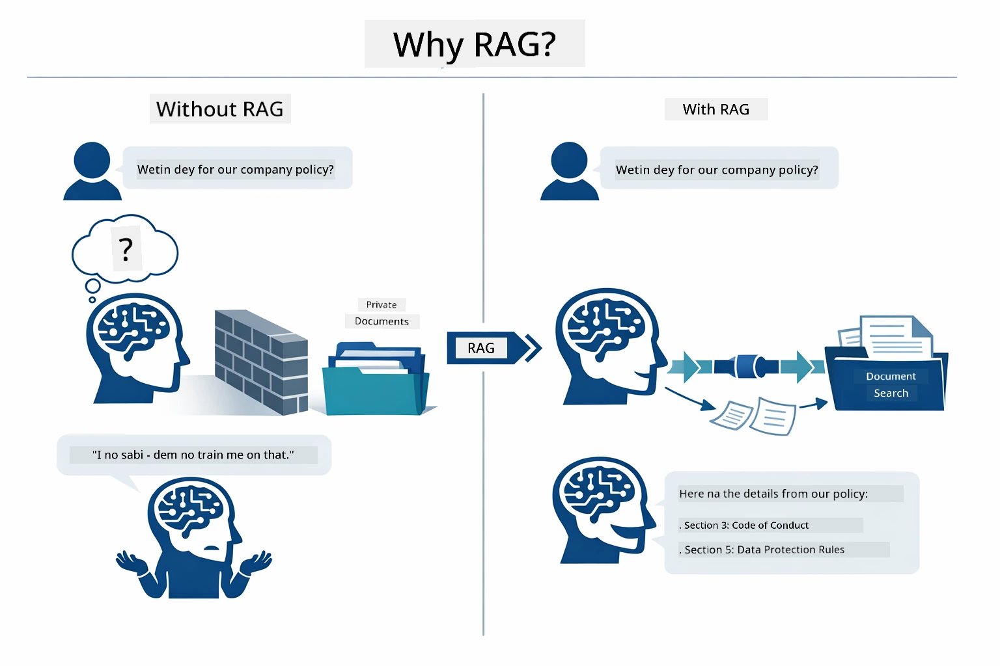

*Dis diagram show the difference between normal LLM (wey dey guess from training data) and RAG-enhanced LLM (wey first dey check your documents).*

See how everything join from start to finish. User question go pass through four stages — embedding, vector search, context assembly, and answer generation — each one build on top last one:


*Dis diagram show the full RAG pipeline — user question dey pass through embedding, vector search, context assembly, and answer generation.*

Rest of dis module go explain each stage well well, with code you fit run and change.

### Which RAG Way Dis Tutorial Dey Use?

LangChain4j get three ways to do RAG, each one with different level of abstraction. Dis diagram below show dem side by side:

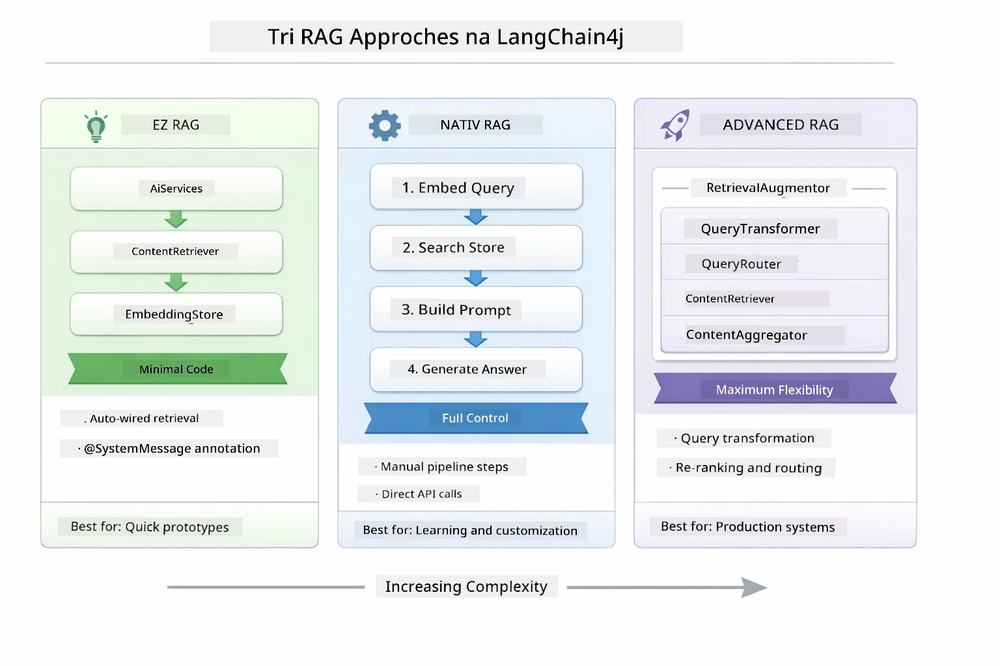

*Dis diagram compare the three LangChain4j RAG ways — Easy, Native, and Advanced — show their main parts and when you suppose use each one.*

| Approach | Wetyn E Dey Do | Trade-off |
|---|---|---|
| **Easy RAG** | E dey arrange everything automatically through `AiServices` and `ContentRetriever`. You just put annotation for interface, attach retriever, LangChain4j go handle embedding, searching, and prompt assembly by itself. | Small code, but you no dey see wetin dey happen for each step. |
| **Native RAG** | You yourself go call the embedding model, search the store, build the prompt, and generate answer — one clear step at a time. | More code, but you fit see and change every stage. |
| **Advanced RAG** | E dey use `RetrievalAugmentor` framework wey get plug-in query transformers, routers, re-rankers, and content injectors wey fit for production pipelines. | Maximum flexibility, but e dey more complex well. |

**Dis tutorial na Native approach e dey use.** Every step for RAG pipeline — embed the query, search vector store, assemble context, and generate answer — dem write am clear for [`RagService.java`](../../../03-rag/src/main/java/com/example/langchain4j/rag/service/RagService.java). E dey intentional: as na learning resource, e better make you see and understand every stage well pass to just quick quick write short code. When you don gain confidence for how all the parts join, you fit move go Easy RAG for quick prototypes or Advanced RAG for production systems.

> **💡 You don already see Easy RAG for waka?** The [Quick Start module](../00-quick-start/README.md) get Document Q&A example ([`SimpleReaderDemo.java`](../../../00-quick-start/src/main/java/com/example/langchain4j/quickstart/SimpleReaderDemo.java)) wey use Easy RAG approach — LangChain4j dey handle embedding, searching, and prompt assembly automatically. Dis module na the next level — e break open the pipeline so you fit see and control each stage.

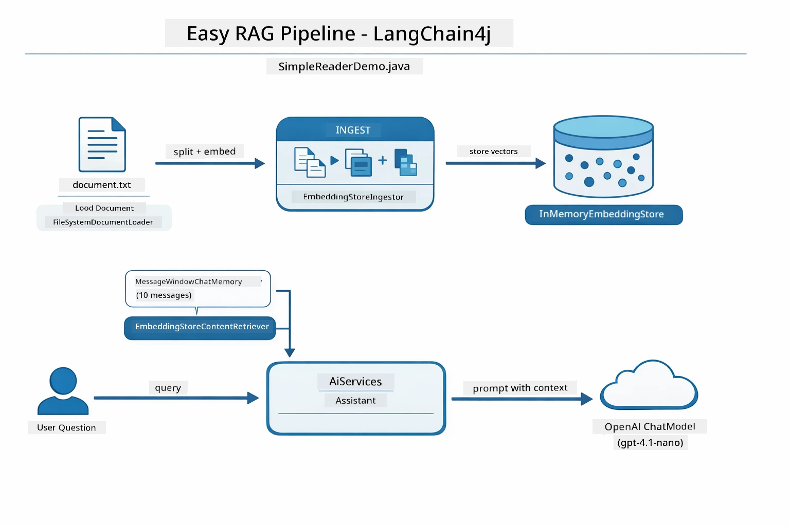

*Dis diagram show the Easy RAG pipeline from `SimpleReaderDemo.java`. Make you compare am with the Native approach wey dis module dey use: Easy RAG dey hide embedding, retrieval, and prompt assembly behind `AiServices` and `ContentRetriever` — you just load document, attach retriever, and get answers. Native approach for dis module dey open that pipeline so you call each stage (embed, search, assemble context, generate) yourself, to get full control and clear view.*

## How E Dey Work

RAG pipeline for dis module get four stages wey dey run one after another anytime user ask question. First, you upload document, system go **parse and split am into chunks** wey small for better handling. Those chunks go convert to **vector embeddings** and dem store dem so e go fit dey compared by math. When query show, system go do **semantic search** to find the correct chunks, then use dem chunks for context to get LLM to **generate answer**. Sections down here go take you through each stage with real code and pictures. Make we first look how e start.

### Document Processing

[DocumentService.java](../../../03-rag/src/main/java/com/example/langchain4j/rag/service/DocumentService.java)

When you upload document, system go parse am (fit be PDF or plain text), add metadata like file name, then break am into chunks — smaller pieces wey fit inside model's context window. Dem chunks get small overlaps to make sure say no context lost for boundary areas.

```java
// Parse di file wey dem upload an wrap am insay LangChain4j Document
Document document = Document.from(content, metadata);

// Chop am into 300-token part dem wit 30-token overlap
DocumentSplitter splitter = DocumentSplitters
    .recursive(300, 30);

List<TextSegment> segments = splitter.split(document);
```

Diagram below show how e work visually. See how each chunk share some tokens with the one near am — the 30-token overlap make sure no important context go lost:

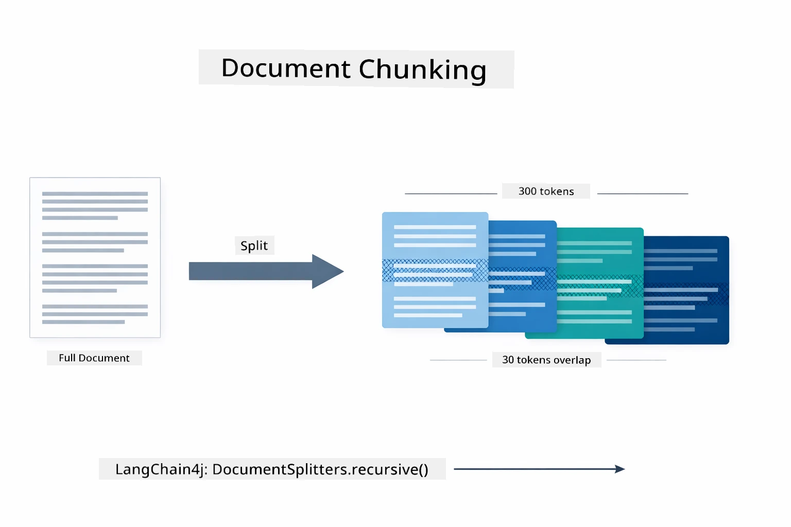

*Dis diagram show document dey split into 300-token chunks with 30-token overlap, to keep context for chunk boundaries.*

> **🤖 Try with [GitHub Copilot](https://github.com/features/copilot) Chat:** Open [`DocumentService.java`](../../../03-rag/src/main/java/com/example/langchain4j/rag/service/DocumentService.java) and ask:
> - "How LangChain4j dey split documents into chunks and why overlap important?"
> - "Wetyn be best chunk size for different document types and why?"
> - "How I fit take handle documents wey get multiple languages or special formatting?"

### Creating Embeddings

[LangChainRagConfig.java](../../../03-rag/src/main/java/com/example/langchain4j/rag/config/LangChainRagConfig.java)

Each chunk dem go convert am into numerical form wey e mean — na embedding be dat. The embedding model no be "smart" like chat model; e no fit follow instructions, reason or answer questions. But e fit map text into math space where similar meanings dey near each other — like "car" near "automobile," "refund policy" near "return my money." Think chat model na person you fit yarn with; embedding model na better filing system.

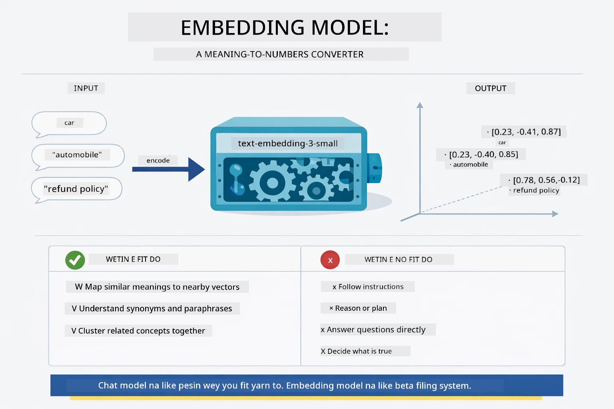

*Dis diagram show how embedding model dey convert text to numerical vectors, put similar meanings — like "car" and "automobile" — close for vector space.*

```java
@Bean
public EmbeddingModel embeddingModel() {
    return OpenAiOfficialEmbeddingModel.builder()
        .baseUrl(azureOpenAiEndpoint)
        .apiKey(azureOpenAiKey)
        .modelName(azureEmbeddingDeploymentName)
        .build();
}

EmbeddingStore<TextSegment> embeddingStore = 
    new InMemoryEmbeddingStore<>();
```

Class diagram below show two different flows for RAG pipeline and LangChain4j classes wey implement dem. The **ingestion flow** (wey run once when document upload) dey split document, embed chunks and store am via `.addAll()`. The **query flow** (wey run anytime user ask question) embed the question, search store via `.search()`, then pass correct context to chat model. Both flows dey meet for shared `EmbeddingStore<TextSegment>` interface:

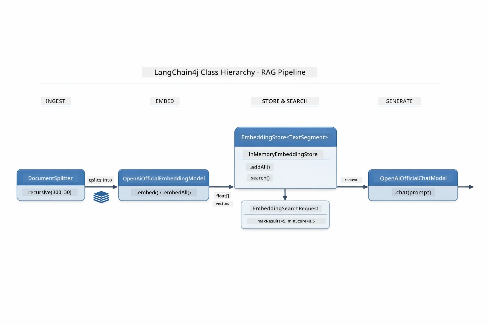

*Dis diagram show the two flows for RAG pipeline — ingestion and query — and how dem dey connect through shared EmbeddingStore.*

Once embeddings don store, similar content go naturally group together for vector space. Visualization below show how related documents concerning same topics dey cluster for near points, and dis na wetin make semantic search possible:


*Dis visualization show how related documents group for 3D vector space, with topics like Technical Docs, Business Rules, and FAQs forming separate clusters.*

When user search, system dey do four steps: embed documents once, embed the query anytime dem search, compare query vector to all stored vectors using cosine similarity, then return top-K best matched chunks. Diagram below show each step and LangChain4j classes wey dey involved:

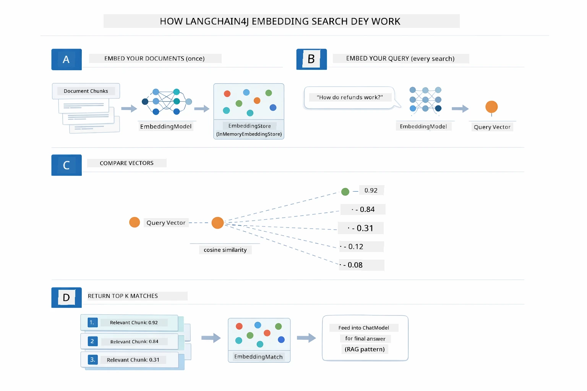

*Dis diagram show four-step embedding search process: embed documents, embed query, compare vectors with cosine similarity, then return top-K results.*

### Semantic Search

[RagService.java](../../../03-rag/src/main/java/com/example/langchain4j/rag/service/RagService.java)

When you ask question, your question itself go also become embedding. The system go compare your question embedding to all document chunks embeddings. E go find chunks wey get correct similar meaning - no be only matching keywords, but actual semantic similarity.

```java
Embedding queryEmbedding = embeddingModel.embed(question).content();

EmbeddingSearchRequest searchRequest = EmbeddingSearchRequest.builder()
    .queryEmbedding(queryEmbedding)
    .maxResults(5)
    .minScore(0.5)
    .build();

EmbeddingSearchResult<TextSegment> searchResult = embeddingStore.search(searchRequest);
List<EmbeddingMatch<TextSegment>> matches = searchResult.matches();

for (EmbeddingMatch<TextSegment> match : matches) {
    String relevantText = match.embedded().text();
    double score = match.score();
}
```

Diagram below compare semantic search with normal keyword search. Keyword search for "vehicle" no go find chunk about "cars and trucks," but semantic search understand say dem mean the same thing and go return am as high-scoring match:

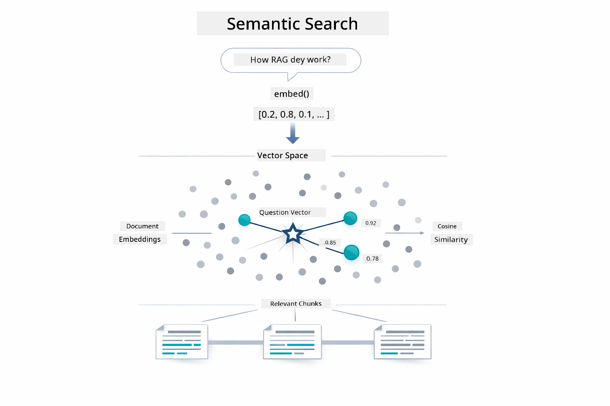

*Dis diagram compare keyword search with semantic search, show how semantic search fit bring related content even if exact keywords no match.*

Under the hood, similarity dey measure with cosine similarity — na like you dey ask "these two arrows dey point for same direction?" Two chunks fit use different words, but if dem mean same thing their vectors go point same direction and score close to 1.0:

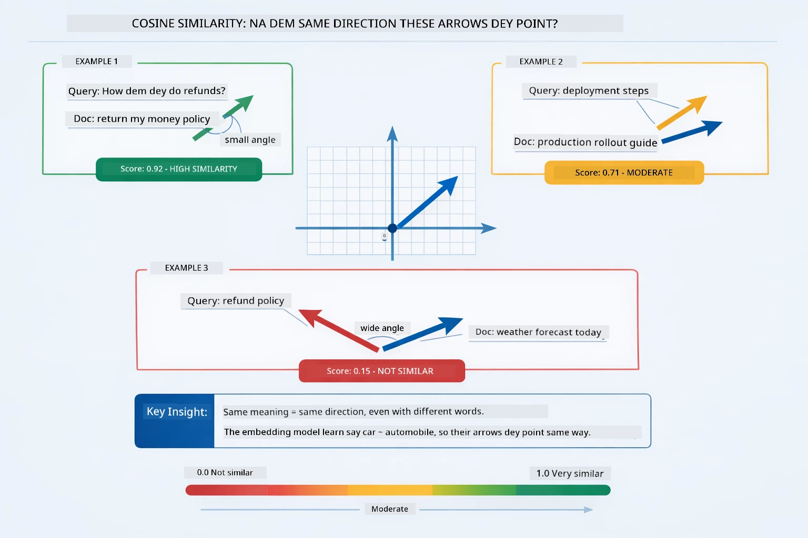
*Dis diagram dey show how cosine similarity be as di angle between embedding vectors — di more di vectors dey aligned, di score dey close to 1.0, wey mean say di semantic similarity better.*

> **🤖 Try with [GitHub Copilot](https://github.com/features/copilot) Chat:** Open [`RagService.java`](../../../03-rag/src/main/java/com/example/langchain4j/rag/service/RagService.java) and ask:
> - "How di similarity search dey work with embeddings and wetin dey determine di score?"
> - "Wetin be di similarity threshold wey I suppose use and how e dey affect results?"
> - "How I go handle cases wey no relevant documents dey found?"

### Answer Generation

[RagService.java](../../../03-rag/src/main/java/com/example/langchain4j/rag/service/RagService.java)

Di most relevant chunks dey join together inside structured prompt wey get explicit instructions, di retrieved context, and di user's question. Di model go read those specific chunks and answer based on dat information — e fit only use wetin dey front of am, wey go prevent hallucination.

```java
String context = matches.stream()
    .map(match -> match.embedded().text())
    .collect(Collectors.joining("\n\n"));

String prompt = String.format("""
    Answer the question based on the following context.
    If the answer cannot be found in the context, say so.

    Context:
    %s

    Question: %s

    Answer:""", context, request.question());

String answer = chatModel.chat(prompt);
```

Di diagram below dey show dis assembly as e dey happen — di top-scoring chunks from di search step dem dey put inside di prompt template, and di `OpenAiOfficialChatModel` go generate grounded answer:

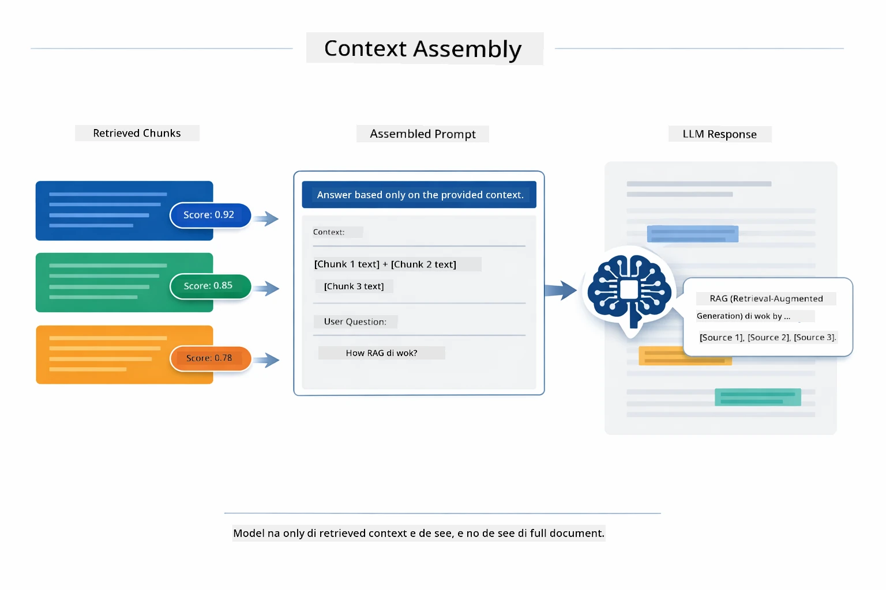

*Dis diagram dey show how di top-scoring chunks dem come join together inside structured prompt, wey allow di model generate grounded answer from your data.*

## Run the Application

**Make sure say di deployment dey for ground:**

Confirm say `.env` file dey inside root directory with Azure credentials (wey dem create during Module 01):

**Bash:**
```bash
cat ../.env  # I suppose make e show AZURE_OPENAI_ENDPOINT, API_KEY, DEPLOYMENT
```

**PowerShell:**
```powershell
Get-Content ..\.env  # E suppose show AZURE_OPENAI_ENDPOINT, API_KEY, DEPLOYMENT
```

**Start di application:**

> **Note:** If you don start all applications before with `./start-all.sh` from Module 01, dis module dey already run for port 8081. You fit skip di start commands below and go directly to http://localhost:8081.

**Option 1: Using Spring Boot Dashboard (Recommended for VS Code users)**

Di dev container include Spring Boot Dashboard extension, wey dey provide visual interface to manage all Spring Boot applications. You fit find am for di Activity Bar for left side of VS Code (look for di Spring Boot icon).

From di Spring Boot Dashboard, you fit:
- See all di available Spring Boot applications for di workspace
- Start/stop applications with one click
- View application logs in real-time
- Monitor application status

Just click di play button wey dey beside "rag" to start dis module, or start all modules at once.


*Dis screenshot dey show di Spring Boot Dashboard for VS Code, wey you fit start, stop, and monitor applications visually.*

**Option 2: Using shell scripts**

Start all web applications (modules 01-04):

**Bash:**
```bash
cd ..  # From root directory
./start-all.sh
```

**PowerShell:**
```powershell
cd ..  # From root directory
.\start-all.ps1
```

Or start only dis module:

**Bash:**
```bash
cd 03-rag
./start.sh
```

**PowerShell:**
```powershell
cd 03-rag
.\start.ps1
```

Both scripts go automatically load environment variables from di root `.env` file and go build di JARs if dem no dey.

> **Note:** If you prefer build all modules manually before you start:
>
> **Bash:**
> ```bash
> cd ..  # Go to root directory
> mvn clean package -DskipTests
> ```
>
> **PowerShell:**
> ```powershell
> cd ..  # Go to root directory
> mvn clean package -DskipTests
> ```

Open http://localhost:8081 for your browser.

**To stop:**

**Bash:**
```bash
./stop.sh  # Dis module only
# Or
cd .. && ./stop-all.sh  # All di modules
```

**PowerShell:**
```powershell
.\stop.ps1  # Dis module only
# Or
cd ..; .\stop-all.ps1  # All di modules
```

## Using the Application

Di application provide web interface to upload document and ask question.

<a href="images/rag-homepage.png"></a>

*Dis screenshot dey show di RAG application interface wey you fit upload documents and ask questions.*

### Upload a Document

Start by uploading document - TXT files dey work best for testing. One `sample-document.txt` dey inside dis directory wey get information about LangChain4j features, RAG implementation, and best practices - perfect for testing di system.

Di system go process your document, cut am into chunks, and create embeddings for each chunk. Dis one dey happen automatically once you upload.

### Ask Questions

Now ask specific questions about di document content. Try something factual wey clearly dey inside di document. Di system go search for relevant chunks, include dem for di prompt, and generate correct answer.

### Check Source References

You go see say each answer get source references with similarity scores. These scores (0 to 1) dey show how relevant each chunk be to your question. Higher scores mean better match. Dis one go help you check di answer against di source material.

<a href="images/rag-query-results.png"></a>

*Dis screenshot dey show query results with generated answer, source references, and relevance scores for each retrieved chunk.*

### Experiment with Questions

Try different types of questions:
- Specific facts: "Wetin be di main topic?"
- Comparisons: "Wetin be di difference between X and Y?"
- Summaries: "Summarize di key points about Z"

See how di relevance scores dey change based on how well your question dey match di document content.

## Key Concepts

### Chunking Strategy

Documents dem dey split into 300-token chunks with 30 tokens overlap. Dis combination make sure each chunk get enough context to make sense but still small enough to fit many chunks inside one prompt.

### Similarity Scores

Every retrieved chunk come with similarity score between 0 and 1 wey show how close e match di user's question. Di diagram below dey show di score ranges and how di system dey use dem to filter results:

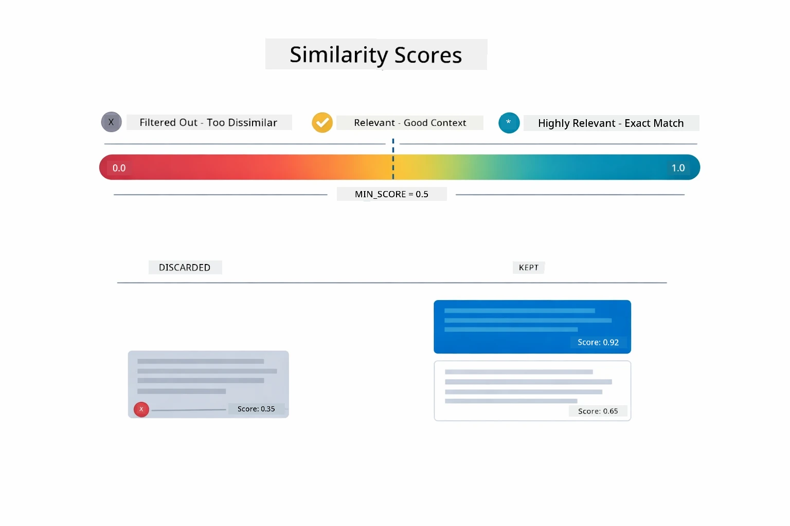

*Dis diagram dey show di score ranges from 0 to 1, with minimum threshold of 0.5 wey dey filter out irrelevant chunks.*

Scores dey range from 0 to 1:
- 0.7-1.0: Very relevant, exact match
- 0.5-0.7: Relevant, good context
- Below 0.5: No gree, filtered out

Di system only go retrieve chunks wey pass di minimum threshold to ensure quality.

Embeddings work well when meaning clusters clear, but dem get blind spots. Di diagram below dey show common failure modes — chunks wey too big go produce muddy vectors, chunks wey too small no get context, ambiguous terms dey point to many clusters, and exact-match lookups (IDs, part numbers) no fit work with embeddings at all:

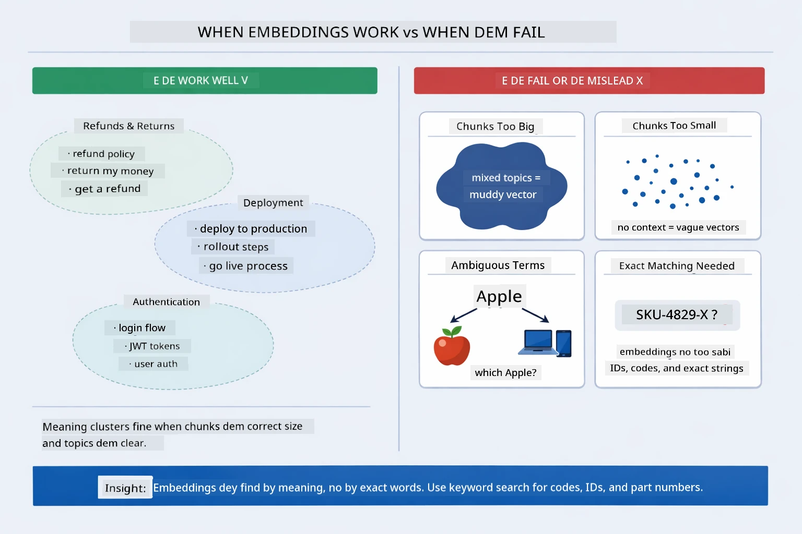

*Dis diagram dey show common embedding failure modes: chunks way too big, too small, ambiguous terms way dey point to many clusters, and exact-match lookups like IDs.*

### In-Memory Storage

Dis module dey use in-memory storage for simplicity. If you restart di application, uploaded documents go lost. Production systems dey use persistent vector databases like Qdrant or Azure AI Search.

### Context Window Management

Each model get maximum context window. You no fit put every chunk from big document. Di system go retrieve top N most relevant chunks (default 5) to stay within limit and give enough context for correct answers.

## When RAG Matter

RAG no be always di correct approach. Di decision guide below help you know when RAG go add value compared to simpler approach dem — like put content directly for prompt or rely on di model's built-in knowledge:

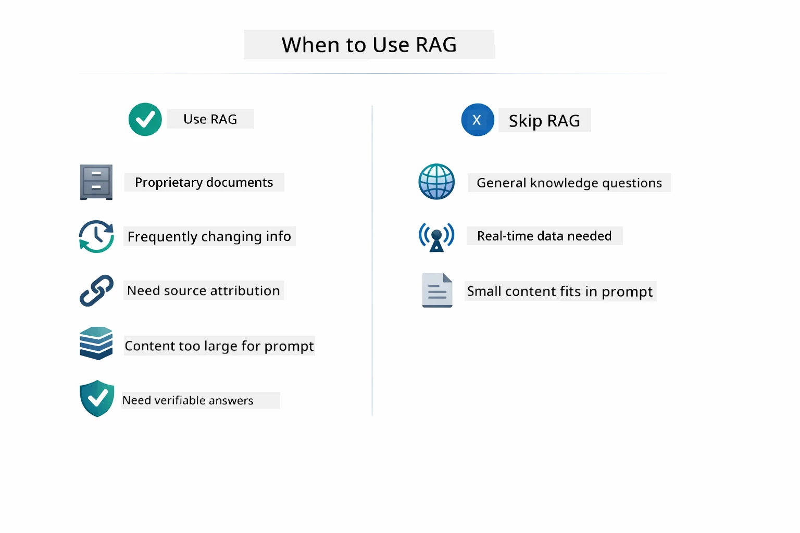

*Dis diagram dey show decision guide of when RAG go add value versus when simpler approaches fit do.*

**Use RAG when:**
- You dey answer questions about proprietary documents
- Information dey change well well (like policies, prices, specs)
- Accuracy need source attribution
- Content too big to fit inside one prompt
- You want verifiable, grounded responses

**No use RAG when:**
- Questions dey require general knowledge wey di model don already get
- Real-time data dey needed (RAG dey work on uploaded documents)
- Content small well well to fit directly inside prompts

## Next Steps

**Next Module:** [04-tools - AI Agents with Tools](../04-tools/README.md)

---

**Navigation:** [← Previous: Module 02 - Prompt Engineering](../02-prompt-engineering/README.md) | [Back to Main](../README.md) | [Next: Module 04 - Tools →](../04-tools/README.md)

---

<!-- CO-OP TRANSLATOR DISCLAIMER START -->
**Talk wey dey clear**:
Dis document na translation wey AI translation service [Co-op Translator](https://github.com/Azure/co-op-translator) help do. Even though we try make am correct, make you sabi say automated translation fit get some mistake or wrong kain. Di original document wey dey im own language na di real correct one. If na serious information, make person wey sabi human translation translate am. We no go responsible for any wahala wey fit happen because of dis translation.
<!-- CO-OP TRANSLATOR DISCLAIMER END -->