# Module 04: AI Agents wit Tools

## Table of Contents

- [Wetin You Go Learn](../../../04-tools)
- [Prerequisites](../../../04-tools)
- [Understanding AI Agents wit Tools](../../../04-tools)
- [How Tool Calling Dey Work](../../../04-tools)
  - [Tool Definitions](../../../04-tools)
  - [Decision Making](../../../04-tools)
  - [Execution](../../../04-tools)
  - [Response Generation](../../../04-tools)
  - [Architecture: Spring Boot Auto-Wiring](../../../04-tools)
- [Tool Chaining](../../../04-tools)
- [Run the Application](../../../04-tools)
- [Using the Application](../../../04-tools)
  - [Try Simple Tool Usage](../../../04-tools)
  - [Test Tool Chaining](../../../04-tools)
  - [See Conversation Flow](../../../04-tools)
  - [Experiment wit Different Requests](../../../04-tools)
- [Key Concepts](../../../04-tools)
  - [ReAct Pattern (Reasoning and Acting)](../../../04-tools)
  - [Tool Descriptions Matter](../../../04-tools)
  - [Session Management](../../../04-tools)
  - [Error Handling](../../../04-tools)
- [Available Tools](../../../04-tools)
- [When to Use Tool-Based Agents](../../../04-tools)
- [Tools vs RAG](../../../04-tools)
- [Next Steps](../../../04-tools)

## Wetin You Go Learn

So far, you don learn how to yarn wit AI, structure prompts well well, and base responses for your documents. But some wahala still dey: language models fit only generate text. Dem no fit check weather, do calculations, query databases, or join outside systems.

Tools dey change dis mata. By givin the model access to functions wey e fit call, you go konvert am from text generator to agent wey fit do things. The model go decide wen e need tool, which tool to use, and wetin e go pass as parameters. Your code go run the function and return result. The model go join dat result for e response.

## Prerequisites

- You don finish [Module 01 - Introduction](../01-introduction/README.md) (Azure OpenAI resources deployed)
- You don finish previous modules wen dem recommend (dis module dey refer to [RAG concepts from Module 03](../03-rag/README.md) for Tools vs RAG comparison)
- `.env` file dey root directory wit Azure credentials (wey `azd up` create for Module 01)

> **Note:** If you never finish Module 01, abeg follow deployment instructions wey dey there first.

## Understanding AI Agents wit Tools

> **📝 Note:** The word "agents" for dis module mean AI assistants wey get tool-calling ability. Dis no be the same as **Agentic AI** patterns (wey be autonomous agents get planning, memory, and multi-step reasoning) wey we go talk about for [Module 05: MCP](../05-mcp/README.md).

Without tools, language model fit only generate text from e training data. If you ask am about current weather, e go just guess. But if you give am tools, e fit call weather API, do calculations, or query database — then fit join those real results inside e response.

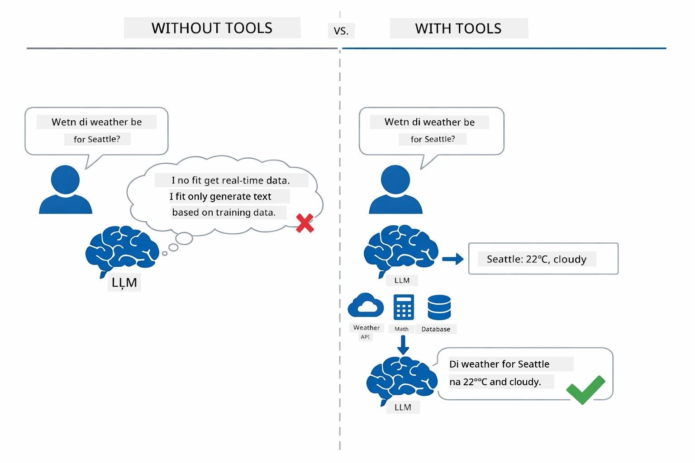

*Without tools, model fit only guess — but with tools e fit call APIs, run calculations, and return real-time data.*

AI agent wey get tools dey follow **Reasoning and Acting (ReAct)** pattern. The model no just reply — e reason wetin e need, e act by calling tool, e watch results, then e decide to act again or give final answer:

1. **Reason** — Agent dey analyze user question and know which information e need
2. **Act** — Agent go choose correct tool, generate correct parameters, then call am
3. **Observe** — Agent go receive tool output and check the result
4. **Repeat or Respond** — If more info dey needed, agent go continue; else e go give answer for natural language

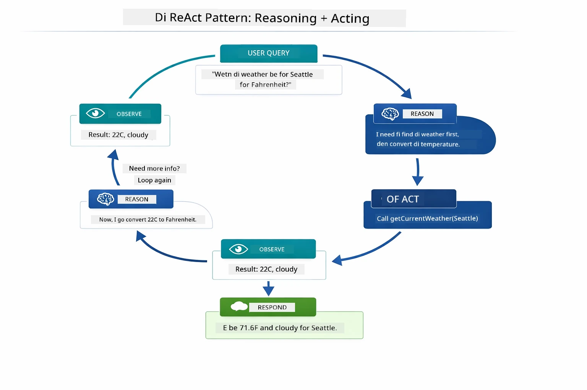

*The ReAct cycle — agent dey reason wetin to do, act by calling tool, observe result, and keep going till e fit give final answer.*

Dis one dey happen automatically. You go just define tools and their descriptions. The model go handle decision making wen and how e go use dem.

## How Tool Calling Dey Work

### Tool Definitions

[WeatherTool.java](../../../04-tools/src/main/java/com/example/langchain4j/agents/tools/WeatherTool.java) | [TemperatureTool.java](../../../04-tools/src/main/java/com/example/langchain4j/agents/tools/TemperatureTool.java)

You go define functions wit clear descriptions and parameter specs. The model dey see these descriptions for e system prompt and e sabi wetin each tool dey do.

```java
@Component
public class WeatherTool {
    
    @Tool("Get the current weather for a location")
    public String getCurrentWeather(@P("Location name") String location) {
        // Yur weza lookup logic
        return "Weather in " + location + ": 22°C, cloudy";
    }
}

@AiService
public interface Assistant {
    String chat(@MemoryId String sessionId, @UserMessage String message);
}

// Assistant na automatically connect by Spring Boot wit:
// - ChatModel bean
// - All @Tool methods from @Component classes
// - ChatMemoryProvider for session management
```

Diagram below break down every annotation and show how each part help AI understand wen to call tool and which arguments to pass:

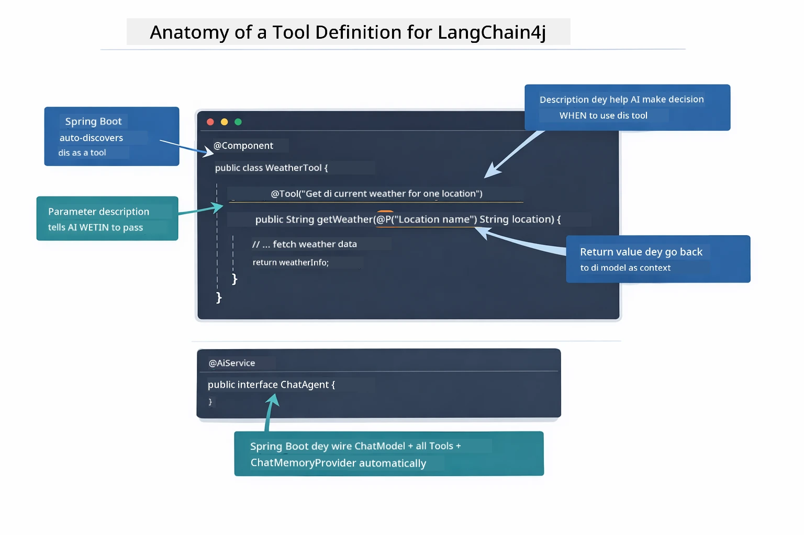

*Anatomy of tool definition — @Tool dey talk to AI wen to use am, @P dey describe every parameter, and @AiService dey wire everything together for startup.*

> **🤖 Try wit [GitHub Copilot](https://github.com/features/copilot) Chat:** Open [`WeatherTool.java`](../../../04-tools/src/main/java/com/example/langchain4j/agents/tools/WeatherTool.java) and ask:
> - "How I go fit integrate real weather API like OpenWeatherMap instead of mock data?"
> - "Wetin make good tool description wey fit help AI use am correct?"
> - "How I go handle API errors and rate limits for tool implementations?"

### Decision Making

If user ask "Wetin be weather for Seattle?", model no just pick tool anyhow. E go check user intent against all tool descriptions wey e sabi, give score for each, then pick the best. E go then generate structured function call wit correct parameters — for this case, e go set `location` to `"Seattle"`.

If no tool match user request, model go answer from e own knowledge. If multiple tools match, e go pick the most specific one.

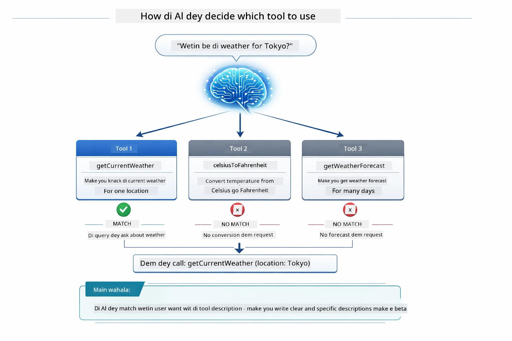

*Model dey check all tools against user intent and select best one — na why e important to write clear and specific tool descriptions.*

### Execution

[AgentService.java](../../../04-tools/src/main/java/com/example/langchain4j/agents/service/AgentService.java)

Spring Boot dey auto-wire declarative `@AiService` interface wit all registered tools, and LangChain4j dey run tool calls automatically. For backend, complete tool call dey do six stages — from user natural language question reach back to natural language answer:

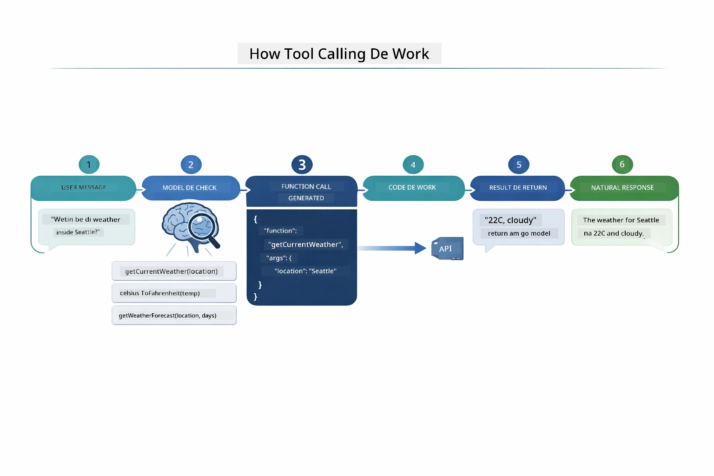

*From beginning to end — user ask question, model select tool, LangChain4j run am, model join result for natural response.*

If you run [ToolIntegrationDemo](../../../00-quick-start/src/main/java/com/example/langchain4j/quickstart/ToolIntegrationDemo.java) for Module 00, you don see this pattern for work — `Calculator` tools dem na same way dem call am. Sequence diagram below show wetin happen under the hood for dat demo:

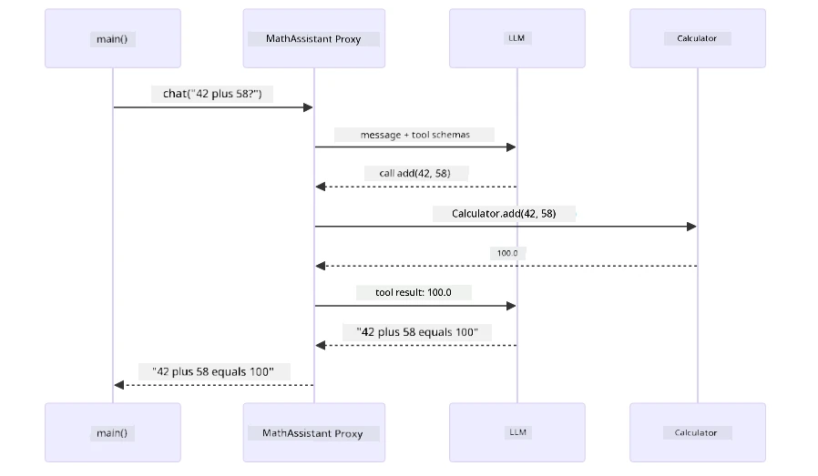

*Tool-calling loop from Quick Start demo — `AiServices` send your message and tool schemas go LLM, LLM reply with function call like `add(42, 58)`, LangChain4j run the `Calculator` method locally, then give result back for final answer.*

> **🤖 Try wit [GitHub Copilot](https://github.com/features/copilot) Chat:** Open [`AgentService.java`](../../../04-tools/src/main/java/com/example/langchain4j/agents/service/AgentService.java) and ask:
> - "How ReAct pattern dey work and why e dey effective for AI agents?"
> - "How agent dey decide which tool to use and the order?"
> - "Wetin go happen if tool execution fail - how I go fit handle errors well?"

### Response Generation

Model go receive weather data and format am into natural language response for user.

### Architecture: Spring Boot Auto-Wiring

Dis module dey use LangChain4j Spring Boot integration wit declarative `@AiService` interfaces. For startup, Spring Boot go find every `@Component` wey get `@Tool` methods, your `ChatModel` bean, and `ChatMemoryProvider` — then wire dem all to one `Assistant` interface wit zero boilerplate.

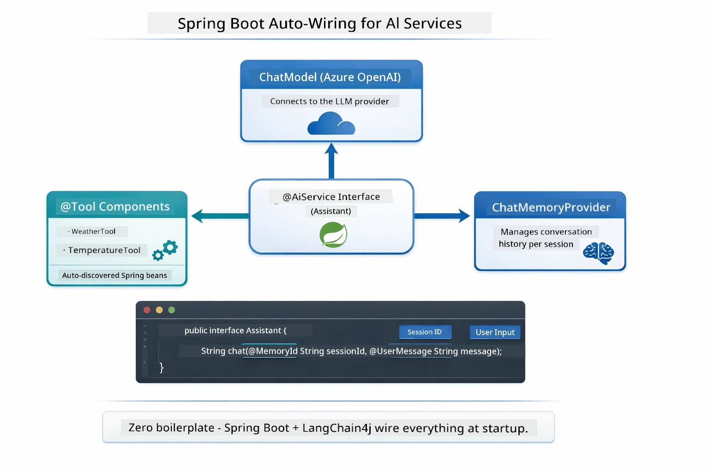

*@AiService interface dey join ChatModel, tool components, and memory provider — Spring Boot dey handle all wiring automatically.*

See full request lifecycle as sequence diagram — from HTTP request go controller, service, auto-wired proxy, till tool execution and back:

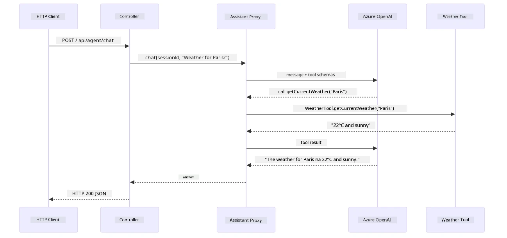

*Complete Spring Boot request lifecycle — HTTP request flow thru controller and service go auto-wired Assistant proxy, wen dey arrange LLM and tool calls automatically.*

Key benefits of dis approach:

- **Spring Boot auto-wiring** — ChatModel and tools inject automatically
- **@MemoryId pattern** — Automatic session memory management
- **Single instance** — Assistant create once, dey reusable for better performance
- **Type-safe execution** — Java methods run direct with proper type conversion
- **Multi-turn orchestration** — Handles tool chaining automatically
- **Zero boilerplate** — No manual `AiServices.builder()` calls and no memory HashMap

Other approach (manual `AiServices.builder()`) need more code and no get Spring Boot integration benefits.

## Tool Chaining

**Tool Chaining** — Real power of tool-based agents dey show wen single question need many tools. If you ask "Wetin be weather for Seattle in Fahrenheit?" agent go chain two tools automatically: first e go call `getCurrentWeather` to get temperature for Celsius, then e pass dat value go `celsiusToFahrenheit` to convert — all this na for one conversation turn.

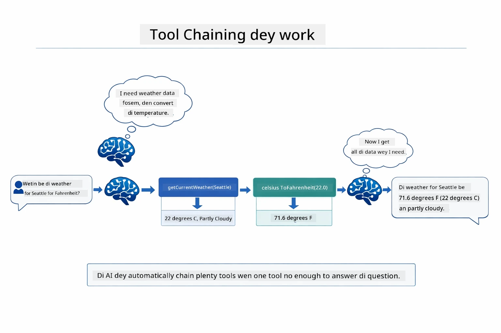

*Tool chaining for work — agent first call getCurrentWeather, then pipe Celsius result into celsiusToFahrenheit, then deliver combined answer.*

**Graceful Failures** — If you ask for weather for city wey no dey mock data, tool go return error message, and AI go explain say e no fit help instead make app crash. Tools dey fail safely. Diagram below compare two ways — with error handling, agent go catch exception and respond well; without am, app go crash:

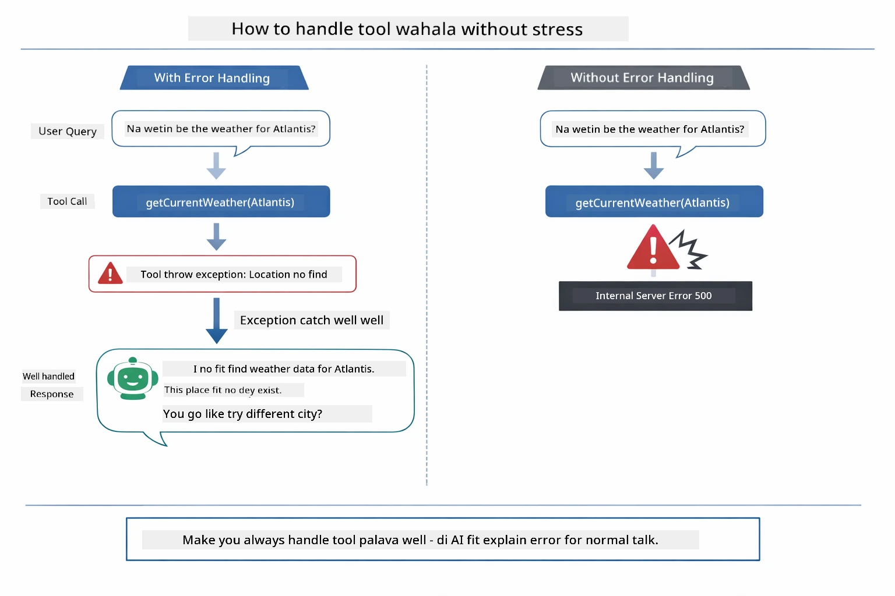

*If tool fail, agent go catch error and respond wit correct explanation instead of crash.*

Dis one dey happen for one conversation turn. Agent dey arrange multiple tool calls by itself.

## Run the Application

**Make sure deployment dey correct:**

Check say `.env` file dey root directory wit Azure credentials (wey Module 01 create). Run this command from module directory (`04-tools/`):

**Bash:**
```bash
cat ../.env  # Suppose show AZURE_OPENAI_ENDPOINT, API_KEY, DEPLOYMENT
```

**PowerShell:**
```powershell
Get-Content ..\.env  # E suppose show AZURE_OPENAI_ENDPOINT, API_KEY, DEPLOYMENT
```

**Start the application:**

> **Note:** If you don start all apps wit `./start-all.sh` from root directory (like Module 01 talk), dis module don dey run for port 8084. You fit skip start commands below and just open http://localhost:8084.

**Option 1: Use Spring Boot Dashboard (Better for VS Code users)**

The dev container get Spring Boot Dashboard extension, wey dey give visual interface to manage all Spring Boot apps. You fit find am for Activity Bar for left side of VS Code (look for Spring Boot icon).

From Spring Boot Dashboard, you fit:
- See all Spring Boot apps wey dey workspace
- Start/stop apps wit just one click
- Check app logs in real-time
- Monitor app status

Just click play button wey dey near "tools" to start this module, or start all modules once.

See how Spring Boot Dashboard look inside VS Code:


*Spring Boot Dashboard for VS Code — start, stop, monitor all modules from one place*

**Option 2: Use shell scripts**

Start all web apps (modules 01-04):

**Bash:**
```bash
cd ..  # From root directory
./start-all.sh
```

**PowerShell:**
```powershell
cd ..  # From root directory
.\start-all.ps1
```

Or start just dis module:

**Bash:**
```bash
cd 04-tools
./start.sh
```

**PowerShell:**
```powershell
cd 04-tools
.\start.ps1
```

Both scripts go automatically load environment variables from root `.env` file and dem go build di JARs if dem no dey.

> **Note:** If you prefer to build all modules manually before you start:
>
> **Bash:**
> ```bash
> cd ..  # Go to root directory
> mvn clean package -DskipTests
> ```
>
> **PowerShell:**
> ```powershell
> cd ..  # Go to root directory
> mvn clean package -DskipTests
> ```

Open http://localhost:8084 for your browser.

**To stop:**

**Bash:**
```bash
./stop.sh  # Dis module only
# Or
cd .. && ./stop-all.sh  # All modules
```

**PowerShell:**
```powershell
.\stop.ps1  # Dis module only
# Or
cd ..; .\stop-all.ps1  # All di modules
```

## How to Use Di Application

Di application get web interface weh you fit use interact with AI agent wey get access to weather and temperature conversion tools. Dis be how di interface be — e get quick-start examples and chat panel to send requests:

<a href="images/tools-homepage.png"></a>

*Di AI Agent Tools interface - quick examples and chat interface wey you fit use interact with tools*

### Try Simple Tool Usage

Start with simple request: "Convert 100 degrees Fahrenheit to Celsius". Di agent sabi say e go need temperature conversion tool, e call am with correct parameters, then e bring result come. You go notice say e feel natural - you no specify which tool to use or how to call am.

### Test Tool Chaining

Now try something wey get small complexity: "Wetin be di weather for Seattle and convert am to Fahrenheit?" Watch as di agent dey work this one step by step. E first get di weather (wey go bring Celsius), e sabi say e go need convert am to Fahrenheit, e call di conversion tool, then e join both results together give one answer.

### See Conversation Flow

Di chat interface dey keep conversation history, e allow you do multi-turn interactions. You fit see all previous questions and answers, e make am easy to follow di conversation and understand how di agent dey build context over many exchanges.

<a href="images/tools-conversation-demo.png"></a>

*Multi-turn conversation wey dey show simple conversions, weather lookups, and tool chaining*

### Experiment with Different Requests

Try different combinations:
- Weather lookups: "Wetin be di weather for Tokyo?"
- Temperature conversions: "Wetin be 25°C for Kelvin?"
- Combined queries: "Check di weather for Paris and tell me if e dey above 20°C"

You go notice how di agent dey understand natural language and how e map am to correct tool calls.

## Key Concepts

### ReAct Pattern (Reasoning and Acting)

Di agent dey alternate between reasoning (to decide wetin e go do) and acting (to use tools). This pattern dey enable am to solve problems by itself instead of just obey instructions.

### Tool Descriptions Matter

How you take describe your tools matter well-well to how di agent go take use dem. Clear, specific descriptions go help di model understand when and how to call each tool.

### Session Management

Di `@MemoryId` annotation dey enable automatic session-based memory management. Each session ID get im own `ChatMemory` instance wey `ChatMemoryProvider` bean dey manage, so many users fit interact with di agent at the same time without their conversations mix together. Di diagram below show how many users dey routed go separate memory stores based on dia session IDs:

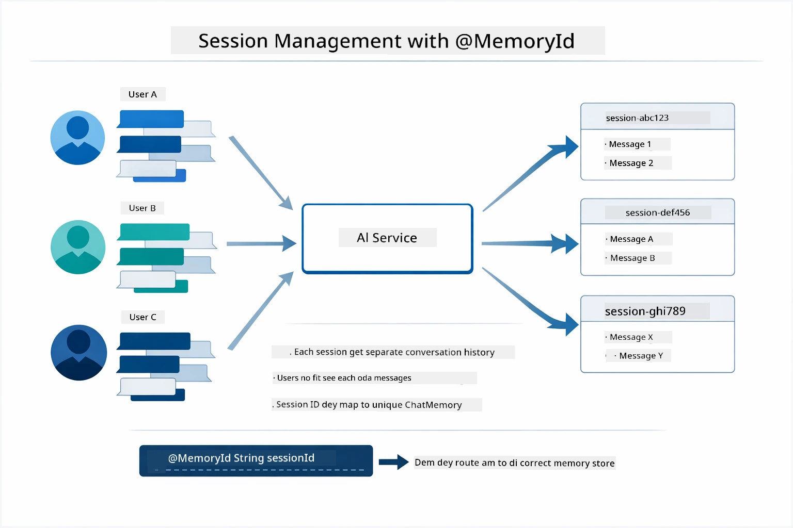

*Each session ID dey map to separate conversation history — users no go ever see each other messages.*

### Error Handling

Tools fit fail — APIs fit timeout, parameters fit no correct, external services fit go down. For production, agents need error handling so dat model fit explain wahala or try alternative solutions instead of make di whole application crash. When tool throw exception, LangChain4j go catch am and pass the error message back to di model, wey fit then explain di problem in natural language.

## Available Tools

Di diagram below show di big ecosystem of tools wey you fit build. Dis module show weather and temperature tools, but di same `@Tool` pattern fit work for any Java method — from database queries to payment processing.

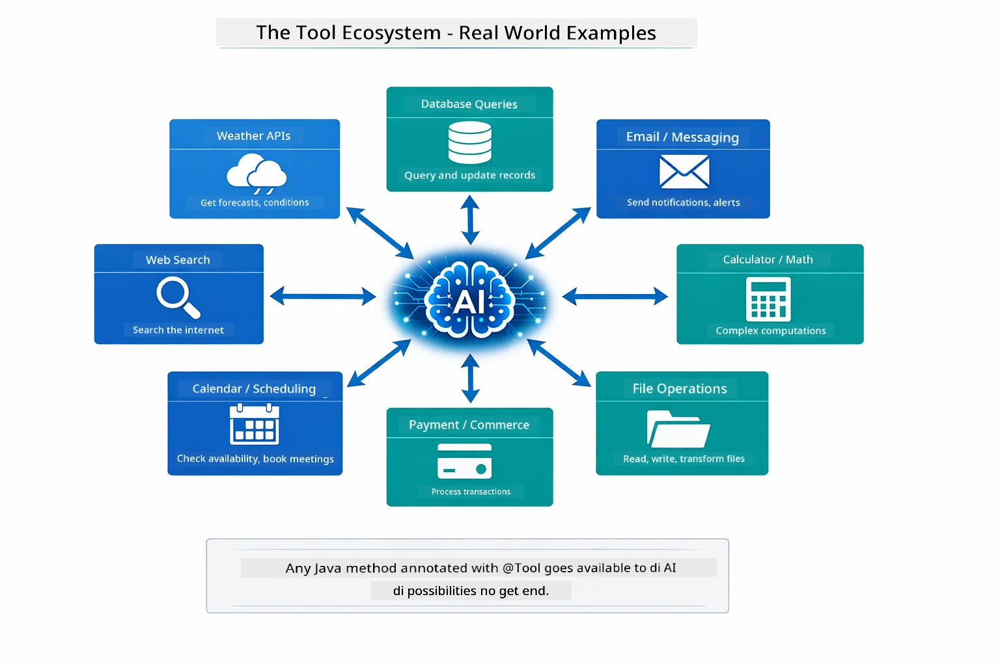

*Any Java method wey get annotation @Tool go become available to di AI — di pattern extend reach databases, APIs, email, file operations, and more.*

## When to Use Tool-Based Agents

Not every request need tools. Di decision depend on whether AI need to interact with external systems or fit answer using only im own knowledge. Di guide below summarize when tools go add value and when dem no need:

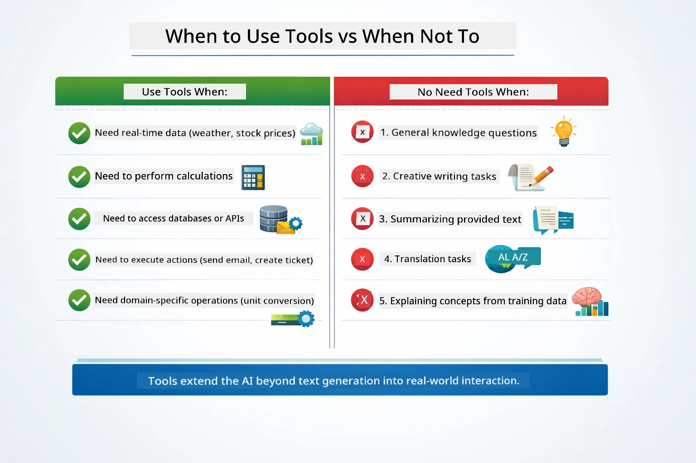

*Quick decision guide — tools dey for real-time data, calculations, and actions; general knowledge and creative tasks no need dem.*

## Tools vs RAG

Modules 03 and 04 both dey extend wetin AI fit do, but dem dey different fundamentally. RAG dey give model access to **knowledge** by retrieving documents. Tools dey give model di ability to take **actions** by calling functions. Di diagram below show comparison between these two methods side by side — from how each workflow dey operate to di trade-offs between dem:

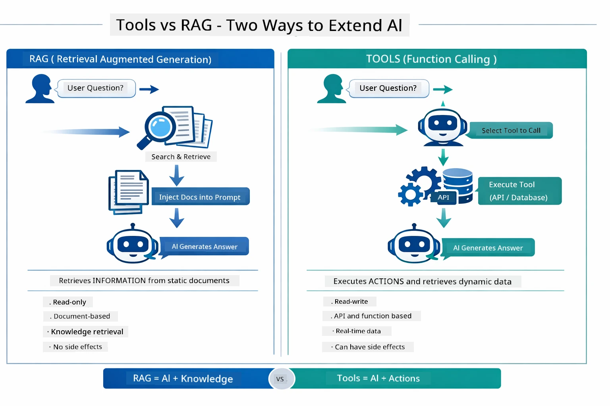

*RAG dey retrieve information from static documents — Tools dey execute actions and fetch dynamic, real-time data. Plenty production systems dey combine both.*

For practice, many production systems dey use both approaches: RAG dey ground answers inside your documentation, and Tools dey fetch live data or do operations.

## Next Steps

**Next Module:** [05-mcp - Model Context Protocol (MCP)](../05-mcp/README.md)

---

**Navigation:** [← Previous: Module 03 - RAG](../03-rag/README.md) | [Back to Main](../README.md) | [Next: Module 05 - MCP →](../05-mcp/README.md)

---

<!-- CO-OP TRANSLATOR DISCLAIMER START -->
**Disclaimer**:
Dis document na e get translated wit AI translation service wey dem call [Co-op Translator](https://github.com/Azure/co-op-translator). Even though we dey try make am correct, abeg make you sabi say automated translation fit get some mistakes or no dey too accurate. Di original document wey dem write for di main language na di correct one. If na important tori, e better make human professional translate am. We no go take blame for any yawa or wrong understanding wey fit come because of dis translation.
<!-- CO-OP TRANSLATOR DISCLAIMER END -->