# Module 05: Model Context Protocol (MCP)

## Table of Contents

- [Video Walkthrough](../../../05-mcp)
- [Wetyn You Go Learn](../../../05-mcp)
- [Wetyn Be MCP?](../../../05-mcp)
- [How MCP Dey Work](../../../05-mcp)
- [The Agentic Module](../../../05-mcp)
- [How To Run The Examples](../../../05-mcp)
  - [Wetyn You Supposed Get Before](../../../05-mcp)
- [Quick Start](../../../05-mcp)
  - [File Operations (Stdio)](../../../05-mcp)
  - [Supervisor Agent](../../../05-mcp)
    - [How To Run The Demo](../../../05-mcp)
    - [How Supervisor Dey Work](../../../05-mcp)
    - [How FileAgent Dey Find MCP Tools for Runtime](../../../05-mcp)
    - [Response Strategies](../../../05-mcp)
    - [How To Understand The Output](../../../05-mcp)
    - [Explanation of Agentic Module Features](../../../05-mcp)
- [Key Concepts](../../../05-mcp)
- [Congrats!](../../../05-mcp)
  - [Wetyn Next?](../../../05-mcp)

## Video Walkthrough

Watch dis live session wey explain how to start with dis module:

<a href="https://www.youtube.com/watch?v=O_J30kZc0rw"></a>

## Wetyn You Go Learn

You don build conversational AI, sabi prompts well, make responses base on documents, and create agents wey get tools. But all those tools na custom-build for your own app. How if you fit give your AI access to one kain standardized system of tools wey anybody fit create and share? For dis module, you go learn how to do am with Model Context Protocol (MCP) and LangChain4j’s agentic module. First, we go show simple MCP file reader then show how e fit easily join inside advanced agentic workflows using Supervisor Agent pattern.

## Wetyn Be MCP?

Model Context Protocol (MCP) na exactly dat — na standard way for AI app them to find and use external tools. Instead make you write custom code for every data source or service, you just connect to MCP servers wey show wetin dem fit do in consistent format. Your AI agent fit then find and use those tools automatically.

Di picture down show di difference — without MCP, every integration na custom point-to-point wiring; with MCP, just one protocol dey connect your app to any tool:


*Before MCP: Complex point-to-point integrations. After MCP: One protocol, endless possibilities.*

MCP dey solve one big gbege for AI development: every integration na custom. You want access GitHub? Custom code. You want read files? Custom code. You want query database? Custom code. And none of dis integrations no work with other AI apps.

MCP standardize am. One MCP server go show tools with clear descriptions and schemas. Any MCP client fit connect, find tools wey dey, and use dem. Build once, use anywhere.

Di picture down show dis architecture — one MCP client (your AI app) dey connect to many MCP servers, each dey expose their own set of tools through standard protocol:


*Model Context Protocol architecture - standardized tool discovery and execution*

## How MCP Dey Work

For the back, MCP use layered architecture. Your Java app (MCP client) dey find tools wey dey, send JSON-RPC requests through transport (Stdio or HTTP), the MCP server go run operations then give you results back. Di picture down break down each layer for dis protocol:

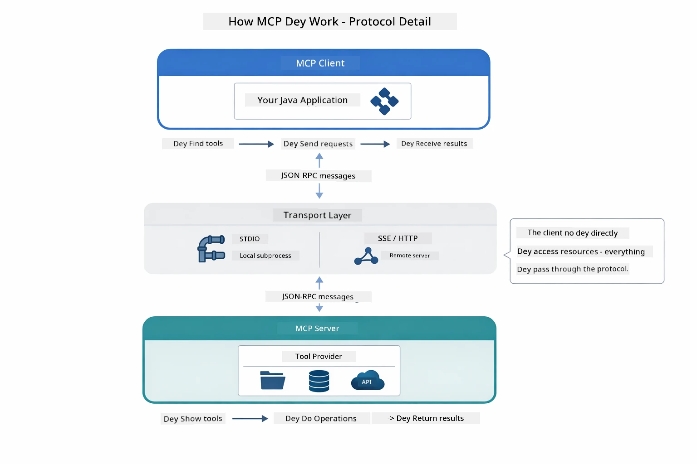

*How MCP dey work for the back — clients dey find tools, exchange JSON-RPC messages, and run operations through transport layer.*

**Server-Client Architecture**

MCP use client-server model. Servers dey provide tools - read files, query databases, call APIs. Clients (your AI app) dey connect to servers then use their tools.

To use MCP with LangChain4j, add dis Maven dependency:

```xml
<dependency>
    <groupId>dev.langchain4j</groupId>
    <artifactId>langchain4j-mcp</artifactId>
    <version>${langchain4j.version}</version>
</dependency>
```

**Tool Discovery**

When your client connect MCP server, e go ask "Which tools you get?" Di server go reply with list of tools wey dey available, each get description and parameter schemas. Your AI agent fit decide which tools e go use based on user request. Di picture down show how di handshake dey — client send `tools/list` request and server return them tools with description plus parameter schemas:

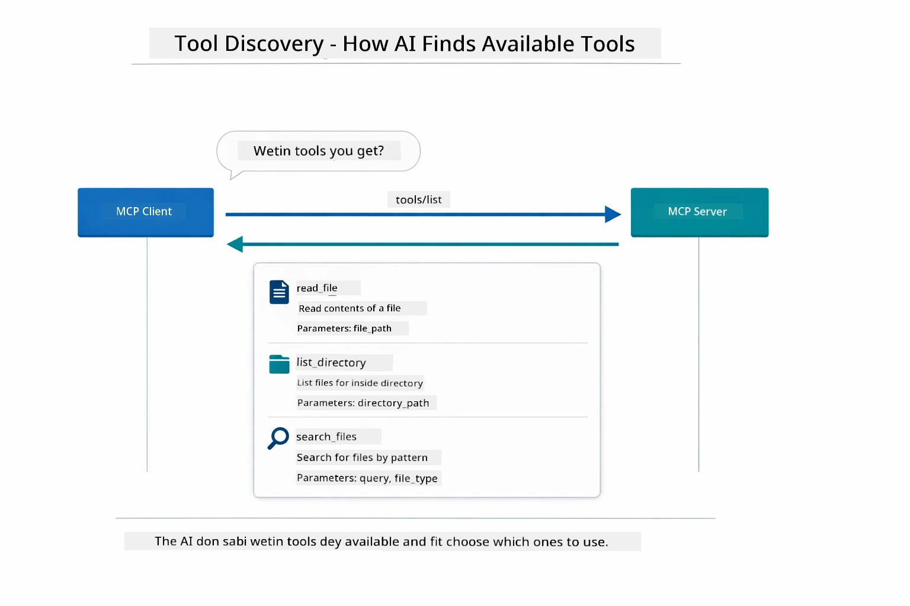

*AI dey find available tools when e start – e sabi which capabilities dey and fit choose which ones to use.*

**Transport Mechanisms**

MCP get different transport mechanisms. Di two options na Stdio (for local subprocess communication) and Streamable HTTP (for remote servers). Dis module dey show Stdio transport:


*MCP transport mechanisms: HTTP for remote servers, Stdio for local processes*

**Stdio** - [StdioTransportDemo.java](../../../05-mcp/src/main/java/com/example/langchain4j/mcp/StdioTransportDemo.java)

For local processes. Your app go spawn server as subprocess then dem go communicate through standard input/output. E good for filesystem access or command line tools.

```java
McpTransport stdioTransport = new StdioMcpTransport.Builder()
    .command(List.of(
        npmCmd, "exec",
        "@modelcontextprotocol/server-filesystem@2025.12.18",
        resourcesDir
    ))
    .logEvents(false)
    .build();
```

The `@modelcontextprotocol/server-filesystem` server expose dis tools, all dem dey sandbox to the directories wey you specify:

| Tool | Description |
|------|-------------|
| `read_file` | Read contents of one single file |
| `read_multiple_files` | Read many files inside one call |
| `write_file` | Create or overwrite file |
| `edit_file` | Make targeted find-and-replace edits |
| `list_directory` | List files and directories for one path |
| `search_files` | Search recursively for files wey match pattern |
| `get_file_info` | Get file metadata (size, timestamps, permissions) |
| `create_directory` | Create directory (with parent directories) |
| `move_file` | Move or rename file or directory |

Di picture down show how Stdio transport dey work as e dey run — your Java app go spawn MCP server as child process and dem go communicate through stdin/stdout pipes, no network or HTTP involved:

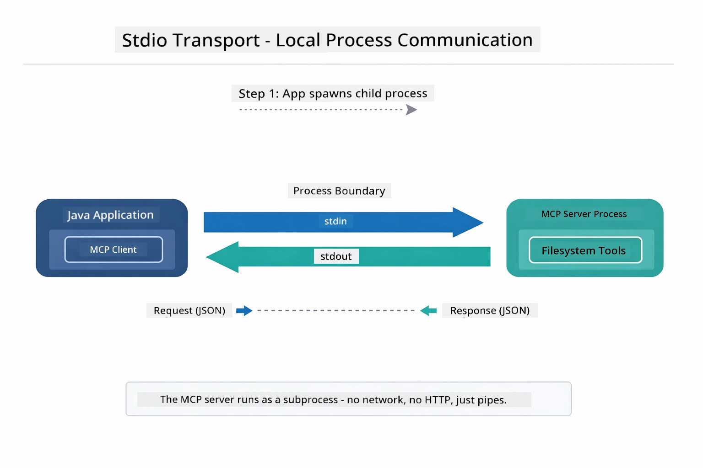

*Stdio transport dey work — your app spawn MCP server as child process and dem communicate through stdin/stdout pipes.*

> **🤖 Try am with [GitHub Copilot](https://github.com/features/copilot) Chat:** Open [`StdioTransportDemo.java`](../../../05-mcp/src/main/java/com/example/langchain4j/mcp/StdioTransportDemo.java) and ask:
> - "How Stdio transport dey work and when I suppose use am instead of HTTP?"
> - "How LangChain4j dey manage lifecycle of spawned MCP server processes?"
> - "Which security wahala dey if AI get access to file system?"

## The Agentic Module

As MCP provide standardized tools, LangChain4j's **agentic module** dey provide declarative way to build agents wey go orchestrate those tools. Di `@Agent` annotation and `AgenticServices` make you fit define agent behavior using interfaces instead of imperative code.

For dis module, you go look into **Supervisor Agent** pattern — advanced agentic AI wey "supervisor" agent dey dynamically decide which sub-agents to call based on user request. We go join both ideas by making one of our sub-agents get MCP-powered file access.

To use this agentic module, add dis Maven dependency:

```xml
<dependency>
    <groupId>dev.langchain4j</groupId>
    <artifactId>langchain4j-agentic</artifactId>
    <version>${langchain4j.mcp.version}</version>
</dependency>
```
> **Note:** The `langchain4j-agentic` module get separate version property (`langchain4j.mcp.version`) because e dey released on different schedule than core LangChain4j libraries.

> **⚠️ Experimental:** The `langchain4j-agentic` module still **experimental** and fit change. Stable way to build AI assistants still na `langchain4j-core` with custom tools (Module 04).

## How To Run The Examples

### Wetyn You Supposed Get Before

- You don finish [Module 04 - Tools](../04-tools/README.md) (dis module build on custom tool concepts and compare dem with MCP tools)
- `.env` file dey root directory with Azure credentials (created by `azd up` for Module 01)
- Java 21+, Maven 3.9+
- Node.js 16+ and npm (for MCP servers)

> **Note:** If you never set your environment variables yet, see [Module 01 - Introduction](../01-introduction/README.md) for deployment instructions (`azd up` go create `.env` file automatically), or copy `.env.example` to `.env` for root directory and fill your values.

## Quick Start

**Using VS Code:** Just right-click any demo file for Explorer and select **"Run Java"**, or use launch configurations from Run and Debug panel (make sure your `.env` file don set with Azure credentials first).

**Using Maven:** Alternatively, you fit run am from command line with examples below.

### File Operations (Stdio)

Dis one dey show local subprocess-based tools.

**✅ No prerequisites needed** - MCP server go spawn automatically.

**Using the Start Scripts (Recommended):**

Start scripts dey load environment variables automatically from root `.env` file:

**Bash:**
```bash
cd 05-mcp
chmod +x start-stdio.sh
./start-stdio.sh
```

**PowerShell:**
```powershell
cd 05-mcp
.\start-stdio.ps1
```

**Using VS Code:** Right-click `StdioTransportDemo.java` and select **"Run Java"** (make sure your `.env` file set).

App go spawn MCP filesystem server automatically and read local file. Notice how subprocess management dey handled for you.

**Expected output:**
```
Assistant response: The file provides an overview of LangChain4j, an open-source Java library
for integrating Large Language Models (LLMs) into Java applications...
```

### Supervisor Agent

**Supervisor Agent pattern** na **flexible** type of agentic AI. Supervisor dey use LLM to decide for themself which agents to call based on user request. For di next example, we go join MCP-powered file access with LLM agent to create supervised file read → report workflow.

For the demo, `FileAgent` go read file through MCP filesystem tools, then `ReportAgent` go generate structured report with executive summary (1 sentence), 3 key points, and recommendations. Supervisor dey manage this flow automatically:

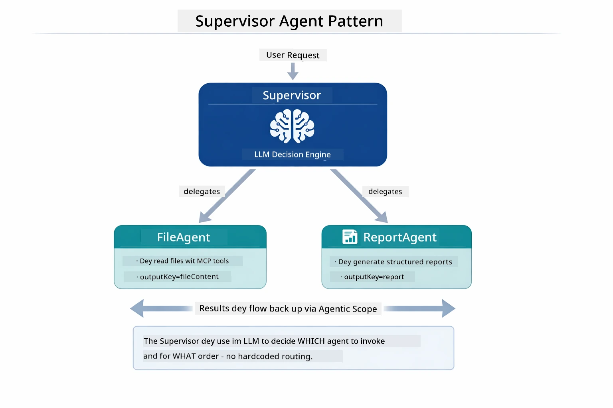

*Supervisor dey use e LLM to decide which agents to call and wetin order — no hardcoded route needed.*

Here be how the workflow go be for our file-to-report pipeline:

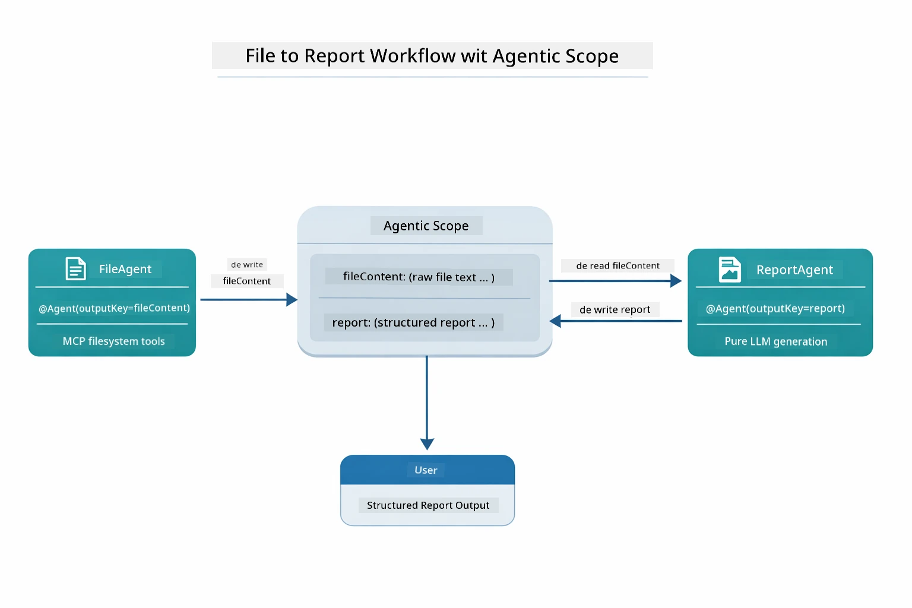

*FileAgent go read file using MCP tools, then ReportAgent go transform raw content to structured report.*

Sequence diagram below show full Supervisor orchestration — from spawning MCP server, to Supervisor autonomous agent selection, tool calls over stdio, and final report:

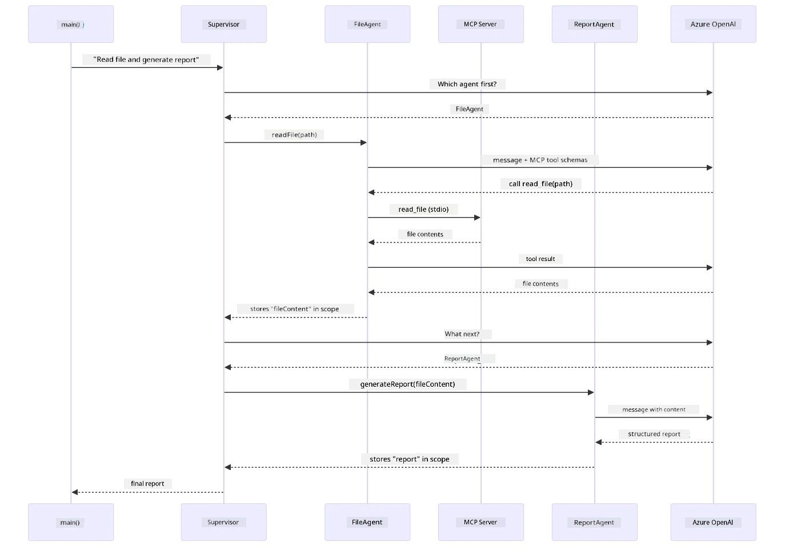

*Supervisor dey call FileAgent (wey call MCP server over stdio to read file), then call ReportAgent to generate structured report — each agent dey store output inside shared Agentic Scope.*

Every agent dey store output inside **Agentic Scope** (shared memory), so downstream agents fit access previous results. This one show how MCP tools fit smoothly join agentic workflows — Supervisor no need sabi *how* files dey read, just know say `FileAgent` fit do am.

#### How To Run The Demo

Start scripts dey load environment variables automatically from root `.env` file:

**Bash:**
```bash
cd 05-mcp
chmod +x start-supervisor.sh
./start-supervisor.sh
```

**PowerShell:**
```powershell
cd 05-mcp
.\start-supervisor.ps1
```

**Using VS Code:** Right-click `SupervisorAgentDemo.java` and select **"Run Java"** (make sure your `.env` file set).

#### How Supervisor Dey Work

Before you build agents, you need connect MCP transport to client and wrap am as `ToolProvider`. Na so MCP server tools go become available for your agents:

```java
// Make one MCP client from di transport
McpClient mcpClient = new DefaultMcpClient.Builder()
        .transport(stdioTransport)
        .build();

// Wrap di client as ToolProvider — dis one go join MCP tools inside LangChain4j
ToolProvider mcpToolProvider = McpToolProvider.builder()
        .mcpClients(List.of(mcpClient))
        .build();
```

Now you fit inject `mcpToolProvider` inside any agent wey need MCP tools:

```java
// Step 1: FileAgent dey read files wit MCP tools
FileAgent fileAgent = AgenticServices.agentBuilder(FileAgent.class)
        .chatModel(model)
        .toolProvider(mcpToolProvider)  // Get MCP tools for file operations
        .build();

// Step 2: ReportAgent dey produce structured reports
ReportAgent reportAgent = AgenticServices.agentBuilder(ReportAgent.class)
        .chatModel(model)
        .build();

// Supervisor dey run di file → report work
SupervisorAgent supervisor = AgenticServices.supervisorBuilder()
        .chatModel(model)
        .subAgents(fileAgent, reportAgent)
        .responseStrategy(SupervisorResponseStrategy.LAST)  // Return di final report
        .build();

// Supervisor na e dey decide which agents to call based on di request
String response = supervisor.invoke("Read the file at /path/file.txt and generate a report");
```

#### How FileAgent Dey Find MCP Tools for Runtime

You fit dey ask yourself: **how `FileAgent` sabi how to use npm filesystem tools?** Di true be say e no sabi — di **LLM** dey figure am out at runtime using tool schemas.
The `FileAgent` interface na just **prompt definition**. E get no hardcoded sabi about `read_file`, `list_directory`, or any oda MCP tool. Dis na wetin dey happen end-to-end:

1. **Server spawns:** `StdioMcpTransport` go run the `@modelcontextprotocol/server-filesystem` npm package as a child process
2. **Tool discovery:** The `McpClient` send `tools/list` JSON-RPC request go the server, wey go respond with tool names, descriptions, and parameter schemas (e.g., `read_file` — *"Read the complete contents of a file"* — `{ path: string }`)
3. **Schema injection:** `McpToolProvider` wrap these discovered schemas and make dem available to LangChain4j
4. **LLM decides:** When `FileAgent.readFile(path)` get call, LangChain4j go send system message, user message, **and the list of tool schemas** go the LLM. The LLM go read the tool descriptions and generate a tool call (e.g., `read_file(path="/some/file.txt")`)
5. **Execution:** LangChain4j go intercept the tool call, make e pass through the MCP client back to the Node.js subprocess, fetch the result, and give am back to the LLM

Dis na the same [Tool Discovery](../../../05-mcp) mechanism wey dem describe above, but e apply specially to the agent workflow. The `@SystemMessage` and `@UserMessage` annotations dey guide the LLM behavior, while the injected `ToolProvider` dey give am the **capabilities** — the LLM na the bridge wey connect the two at runtime.

> **🤖 Try with [GitHub Copilot](https://github.com/features/copilot) Chat:** Open [`FileAgent.java`](../../../05-mcp/src/main/java/com/example/langchain4j/mcp/agents/FileAgent.java) and ask:
> - "How does this agent know which MCP tool to call?"
> - "What would happen if I removed the ToolProvider from the agent builder?"
> - "How do tool schemas get passed to the LLM?"

#### Response Strategies

When you configure `SupervisorAgent`, na you dey specify how e go give final answer to the user after the sub-agents don finish their tasks. The diagram below dey show the three strategies wey dey available — LAST go give the final agent output direct, SUMMARY go mix all outputs through LLM, and SCORED go pick the one wey get higher score against the original request:

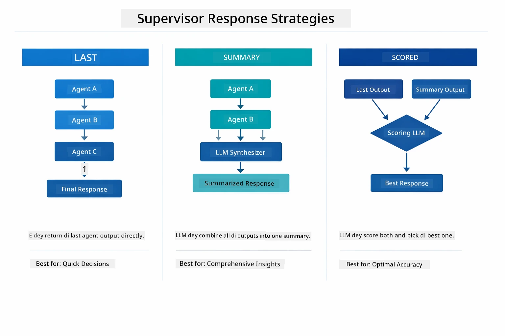

*Three ways Supervisor fit take formulate its final response — choose based on whether you want the last agent output, synthesized summary, or best scoring option.*

The strategies wey dey available na:

| Strategy | Description |
|----------|-------------|
| **LAST** | Supervisor go return the output of the last sub-agent or tool wey e call. Dis dey useful when the final agent for the workflow na the one specially design to produce the complete, correct final answer (e.g., "Summary Agent" for research pipeline). |
| **SUMMARY** | Supervisor go use e own internal Language Model (LLM) take synthesize a summary of the whole interaction and all sub-agent outputs, then e go return that summary as the final response. Dis dey provide clean, combined answer to the user. |
| **SCORED** | The system dey use internal LLM to score both the LAST response and the SUMMARY of the interaction against the original user request, then e go return the output wey get the higher score. |

See [SupervisorAgentDemo.java](../../../05-mcp/src/main/java/com/example/langchain4j/mcp/SupervisorAgentDemo.java) for the full implementation.

> **🤖 Try with [GitHub Copilot](https://github.com/features/copilot) Chat:** Open [`SupervisorAgentDemo.java`](../../../05-mcp/src/main/java/com/example/langchain4j/mcp/SupervisorAgentDemo.java) and ask:
> - "How does the Supervisor decide which agents to invoke?"
> - "What's the difference between Supervisor and Sequential workflow patterns?"
> - "How can I customize the Supervisor's planning behavior?"

#### Understanding the Output

When you run the demo, you go see structured walkthrough wey show how the Supervisor dey organize many agents together. Here na wetin each section mean:

```
======================================================================
  FILE → REPORT WORKFLOW DEMO
======================================================================

This demo shows a clear 2-step workflow: read a file, then generate a report.
The Supervisor orchestrates the agents automatically based on the request.
```

**The header** dey introduce the workflow idea: a focused pipeline from file reading to report generation.

```
--- WORKFLOW ---------------------------------------------------------
  ┌─────────────┐      ┌──────────────┐
  │  FileAgent  │ ───▶ │ ReportAgent  │
  │ (MCP tools) │      │  (pure LLM)  │
  └─────────────┘      └──────────────┘
   outputKey:           outputKey:
   'fileContent'        'report'

--- AVAILABLE AGENTS -------------------------------------------------
  [FILE]   FileAgent   - Reads files via MCP → stores in 'fileContent'
  [REPORT] ReportAgent - Generates structured report → stores in 'report'
```

**Workflow Diagram** dey show how data flow between agents. Each agent get specific role:
- **FileAgent** dey read files using MCP tools and dey store raw content for `fileContent`
- **ReportAgent** dey consume that content and dey produce structured report for `report`

```
--- USER REQUEST -----------------------------------------------------
  "Read the file at .../file.txt and generate a report on its contents"
```

**User Request** dey show the task. Supervisor go parse am and decide to call FileAgent → ReportAgent.

```
--- SUPERVISOR ORCHESTRATION -----------------------------------------
  The Supervisor decides which agents to invoke and passes data between them...

  +-- STEP 1: Supervisor chose -> FileAgent (reading file via MCP)
  |
  |   Input: .../file.txt
  |
  |   Result: LangChain4j is an open-source, provider-agnostic Java framework for building LLM...
  +-- [OK] FileAgent (reading file via MCP) completed

  +-- STEP 2: Supervisor chose -> ReportAgent (generating structured report)
  |
  |   Input: LangChain4j is an open-source, provider-agnostic Java framew...
  |
  |   Result: Executive Summary...
  +-- [OK] ReportAgent (generating structured report) completed
```

**Supervisor Orchestration** dey show the 2-step flow:  
1. **FileAgent** dey read the file via MCP and store the content  
2. **ReportAgent** go receive the content and generate the structured report

The Supervisor make all these decisions **autonomously** based on the user request.

```
--- FINAL RESPONSE ---------------------------------------------------
Executive Summary
...

Key Points
...

Recommendations
...

--- AGENTIC SCOPE (Data Flow) ----------------------------------------
  Each agent stores its output for downstream agents to consume:
  * fileContent: LangChain4j is an open-source, provider-agnostic Java framework...
  * report: Executive Summary...
```

#### Explanation of Agentic Module Features

The example show many advanced features of the agentic module. Make we check Agentic Scope and Agent Listeners more closely.

**Agentic Scope** na shared memory where agents go store their results using `@Agent(outputKey="...")`. Dis one allow:  
- Later agents access earlier agents' outputs  
- Supervisor fit synthesize final response  
- You fit inspect wetin each agent produce

The diagram below show how Agentic Scope dey work as shared memory for the file-to-report workflow — FileAgent dey write output under the key `fileContent`, ReportAgent dey read am and write im own output under `report`:

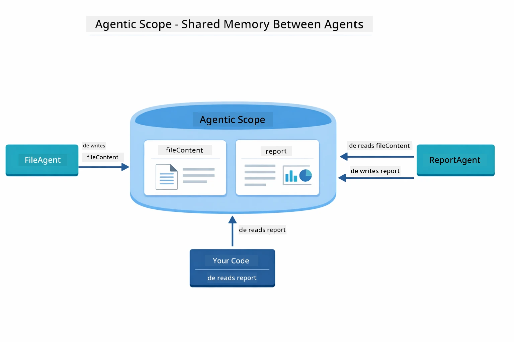

*Agentic Scope na shared memory — FileAgent dey write `fileContent`, ReportAgent dey read am and write `report`, and your code fit read the final result.*

```java
ResultWithAgenticScope<String> result = supervisor.invokeWithAgenticScope(request);
AgenticScope scope = result.agenticScope();
String fileContent = scope.readState("fileContent");  // Raw file data from FileAgent
String report = scope.readState("report");            // Structured report from ReportAgent
```

**Agent Listeners** dey allow monitoring and debugging for agent execution. The step-by-step output wey you dey see for demo na from AgentListener wey dey hook into every agent invocation:  
- **beforeAgentInvocation** - E dey call when Supervisor select agent, so you fit see which agent e choose and why  
- **afterAgentInvocation** - E dey call when agent finish, e go show the result  
- **inheritedBySubagents** - When true, the listener go monitor all agents inside the hierarchy  

The diagram below dey show full Agent Listener lifecycle, including how `onError` dey handle failures during agent execution:

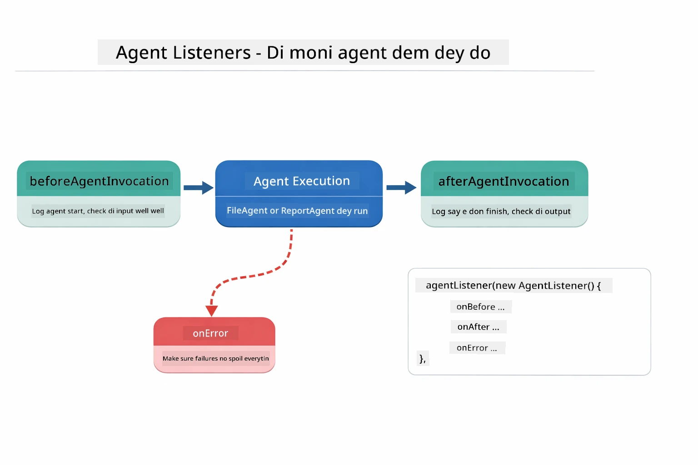

*Agent Listeners dey hook into the execution lifecycle — dem go monitor when agents start, finish, or get error.*

```java
AgentListener monitor = new AgentListener() {
    private int step = 0;
    
    @Override
    public void beforeAgentInvocation(AgentRequest request) {
        step++;
        System.out.println("  +-- STEP " + step + ": " + request.agentName());
    }
    
    @Override
    public void afterAgentInvocation(AgentResponse response) {
        System.out.println("  +-- [OK] " + response.agentName() + " completed");
    }
    
    @Override
    public boolean inheritedBySubagents() {
        return true; // Spread am go all sub-agents
    }
};
```

Beyond Supervisor pattern, the `langchain4j-agentic` module dey provide many powerful workflow patterns. Diagram below dey show the five — from simple sequential pipelines to human-in-the-loop approval workflows:

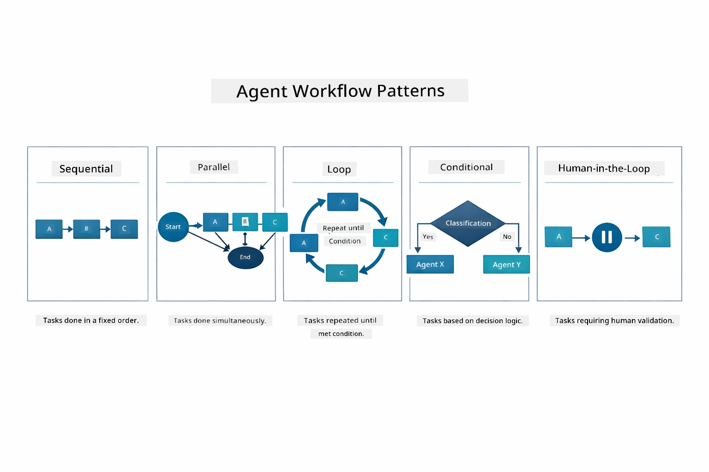

*Five workflow patterns for controlling agents — from simple sequential pipelines to human-in-the-loop approval workflows.*

| Pattern | Description | Use Case |
|---------|-------------|----------|
| **Sequential** | Run agents one by one, output flows to the next | Pipelines: research → analyze → report |
| **Parallel** | Run agents at the same time | Independent tasks: weather + news + stocks |
| **Loop** | Continue until condition meet | Quality scoring: refine until score ≥ 0.8 |
| **Conditional** | Route based on condition | Classify → send go specialist agent |
| **Human-in-the-Loop** | Add human checkpoints | Approval workflows, content review |

## Key Concepts

Now wey you don explore MCP and the agentic module for action, make we summarize when you suppose use each approach.

One of MCP big advantage na e get growing ecosystem. Diagram below show how one universal protocol connect your AI app to many MCP servers — from filesystem and database access to GitHub, email, web scraping, and more:

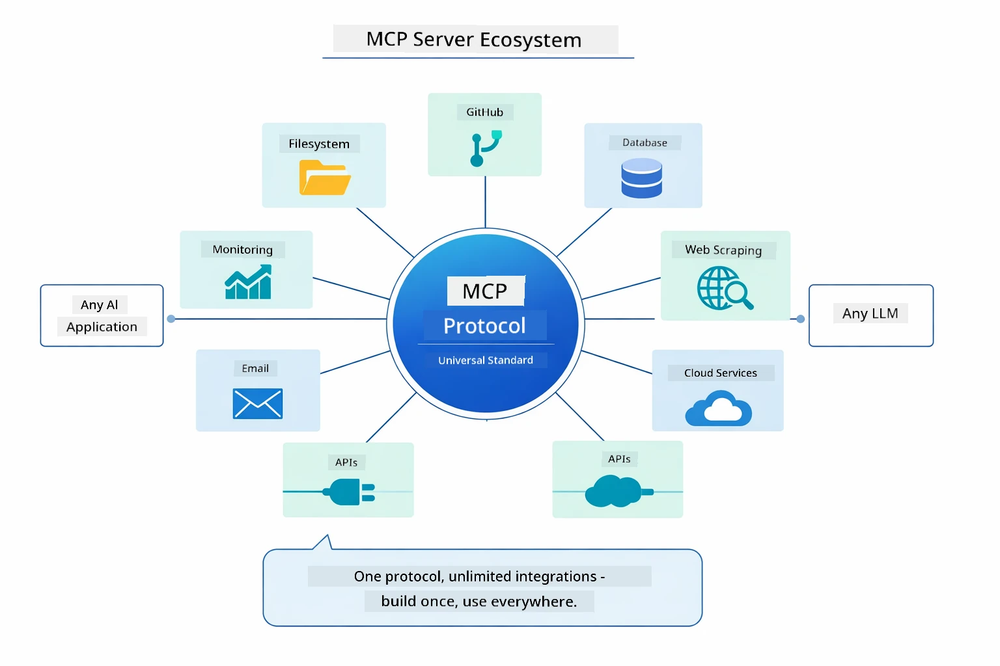

*MCP dey create universal protocol ecosystem — any MCP-compatible server fit work with any MCP-compatible client, to enable tool sharing between applications.*

**MCP** good when you want use existing tool ecosystem, build tools wey many apps fit share, connect third-party services with standard protocols, or change tool implementations without changing code.

**The Agentic Module** best when you want declarative agent definitions with `@Agent` annotations, need workflow orchestration (sequential, loop, parallel), prefer interface-based agent design instead of imperative code, or you dey combine multiple agents wey dey share outputs via `outputKey`.

**The Supervisor Agent pattern** dey shine when the workflow no fit predict in advance and you want LLM make decision, when you get many specialized agents wey need dynamic orchestration, when you dey build conversational systems wey go different capabilities, or when you want very flexible, adaptive agent behaviour.

To help decide between custom `@Tool` methods from Module 04 and MCP tools from this module, the comparison below show the main trade-offs — custom tools dey give tight coupling and full type safety for app logic, while MCP tools give standardized, reusable integrations:

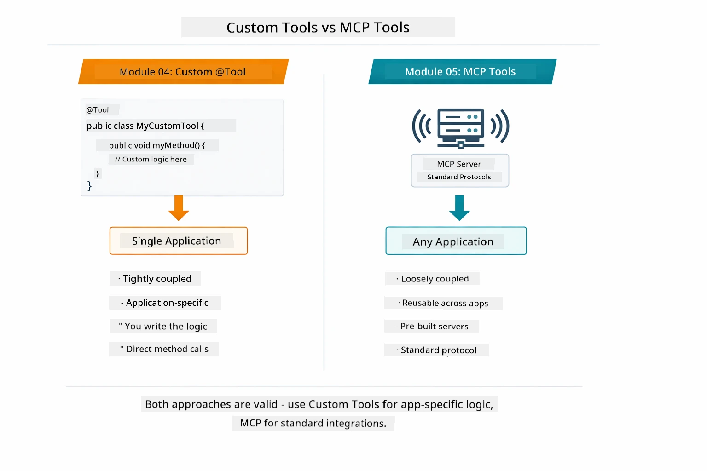

*When to use custom @Tool methods vs MCP tools — custom tools for app-specific logic with full type safety, MCP tools for standardized integrations across applications.*

## Congratulations!

You don finish all five modules of LangChain4j for Beginners course! Here na the full learning journey wey you don finish — from basic chat all the way to MCP-powered agentic systems:

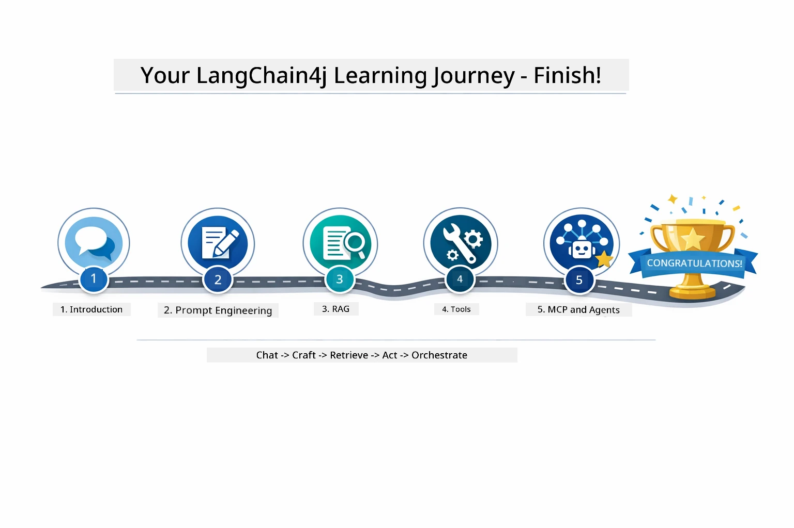

*Your learning journey through all five modules — from basic chat to MCP-powered agentic systems.*

You don complete LangChain4j for Beginners course. You don learn:

- How to build conversational AI with memory (Module 01)
- Prompt engineering patterns for different tasks (Module 02)
- Grounding responses in your documents with RAG (Module 03)
- Creating basic AI agents (assistants) with custom tools (Module 04)
- Integrating standardized tools with the LangChain4j MCP and Agentic modules (Module 05)

### What's Next?

After you complete the modules, check the [Testing Guide](../docs/TESTING.md) to see LangChain4j testing concepts for action.

**Official Resources:**
- [LangChain4j Documentation](https://docs.langchain4j.dev/) - Complete guides and API reference
- [LangChain4j GitHub](https://github.com/langchain4j/langchain4j) - Source code and examples
- [LangChain4j Tutorials](https://docs.langchain4j.dev/tutorials/) - Step-by-step tutorials for various use cases

Thank you for finishing this course!

---

**Navigation:** [← Previous: Module 04 - Tools](../04-tools/README.md) | [Back to Main](../README.md)

---

<!-- CO-OP TRANSLATOR DISCLAIMER START -->
**Disclaimer**:
Dis document na translation wey AI translation service [Co-op Translator](https://github.com/Azure/co-op-translator) do. Even tho we dey try make am correct, abeg sabi say automated translation fit get some errors or mistakes. The original document for e own language na the correct correct version. For important information, better make person wey sabi do human translation help you. We no go responsible for any wahala or wrong understanding wey fit happen because of this translation.
<!-- CO-OP TRANSLATOR DISCLAIMER END -->