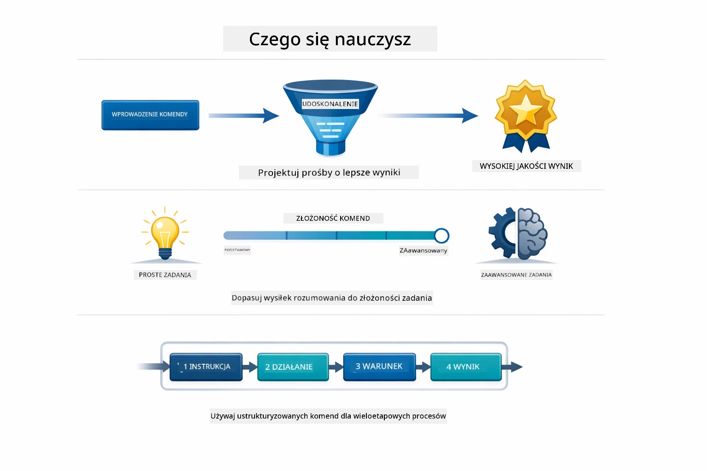
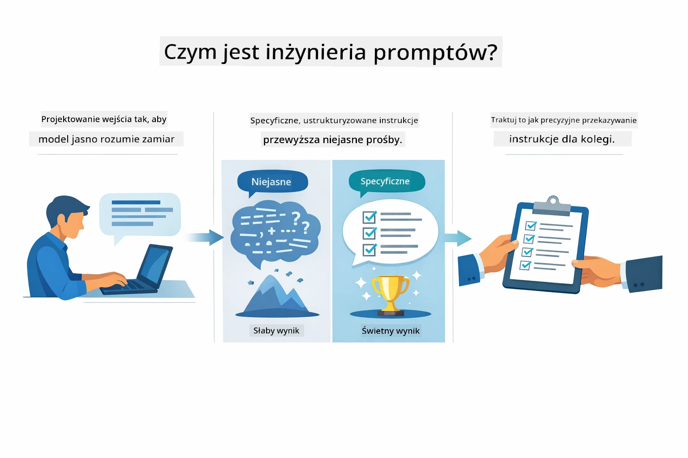
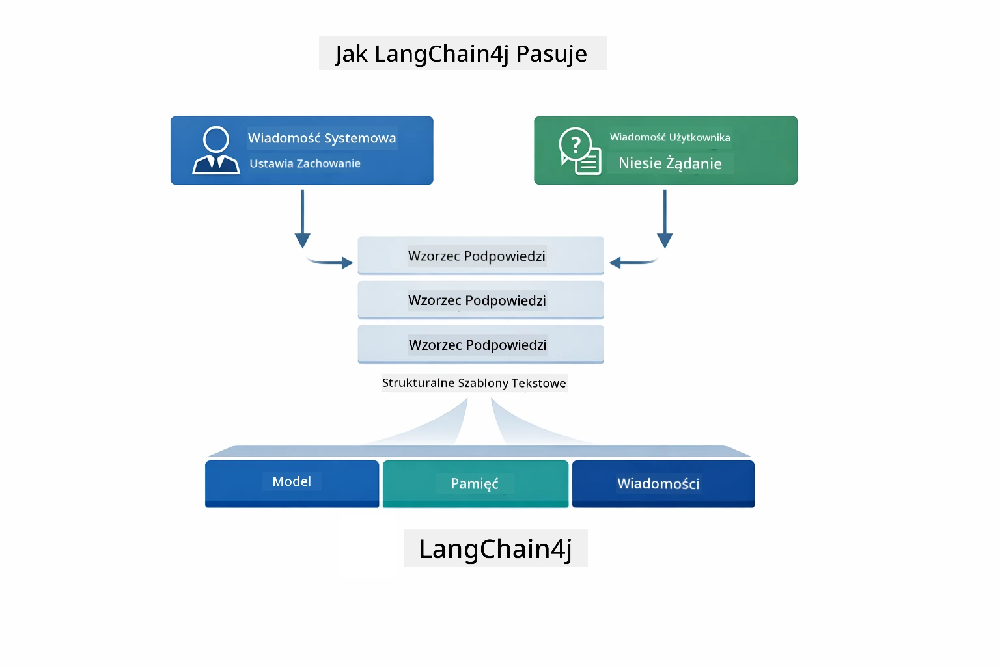
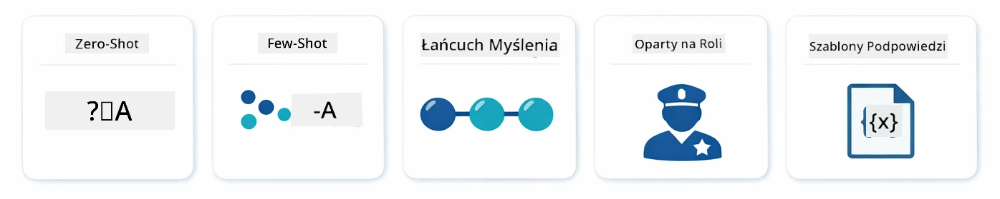
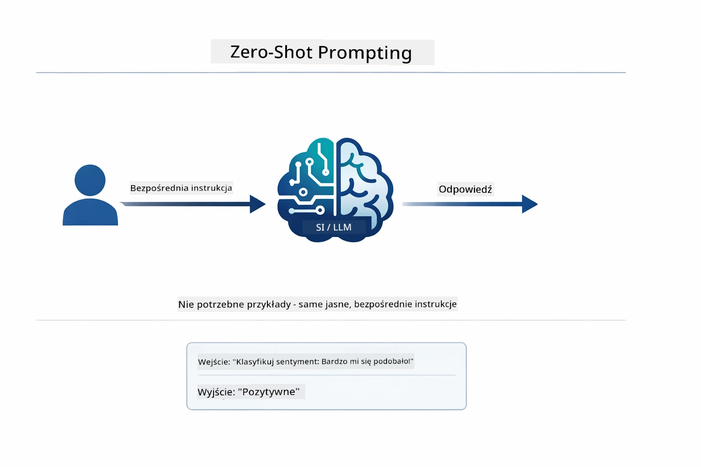
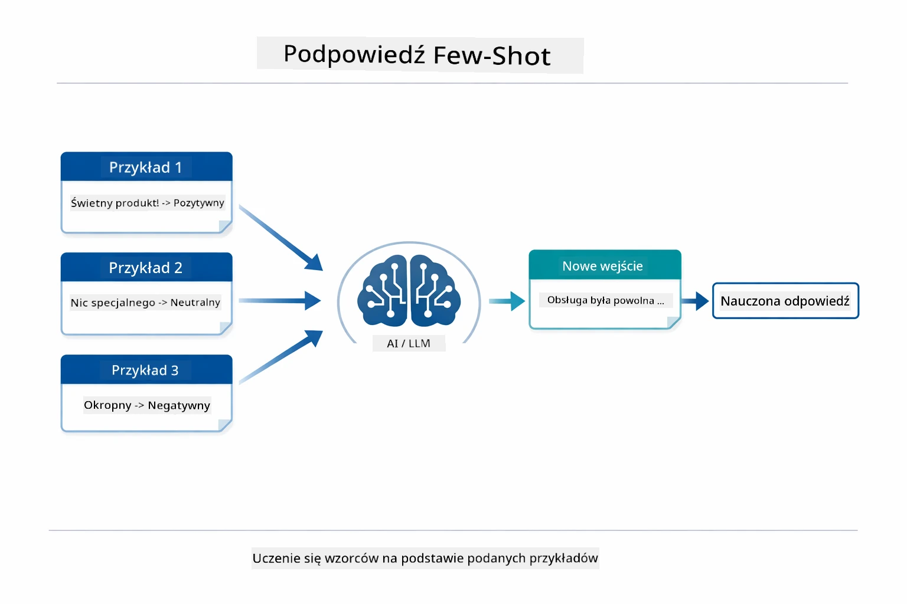
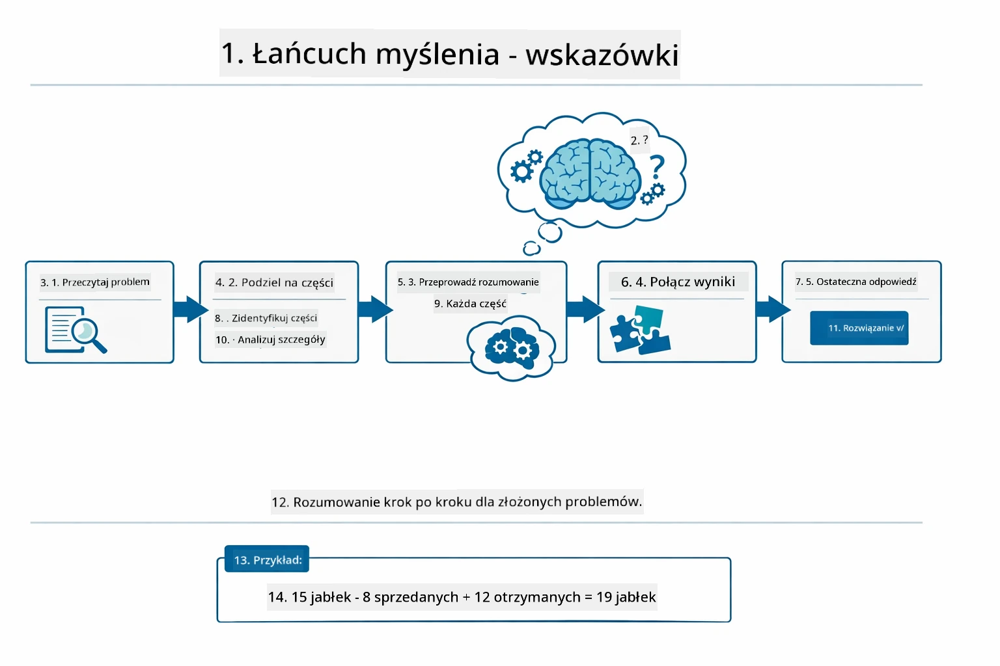
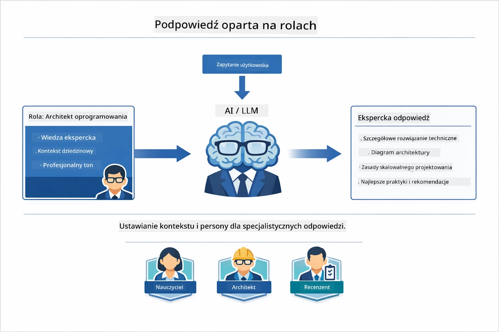
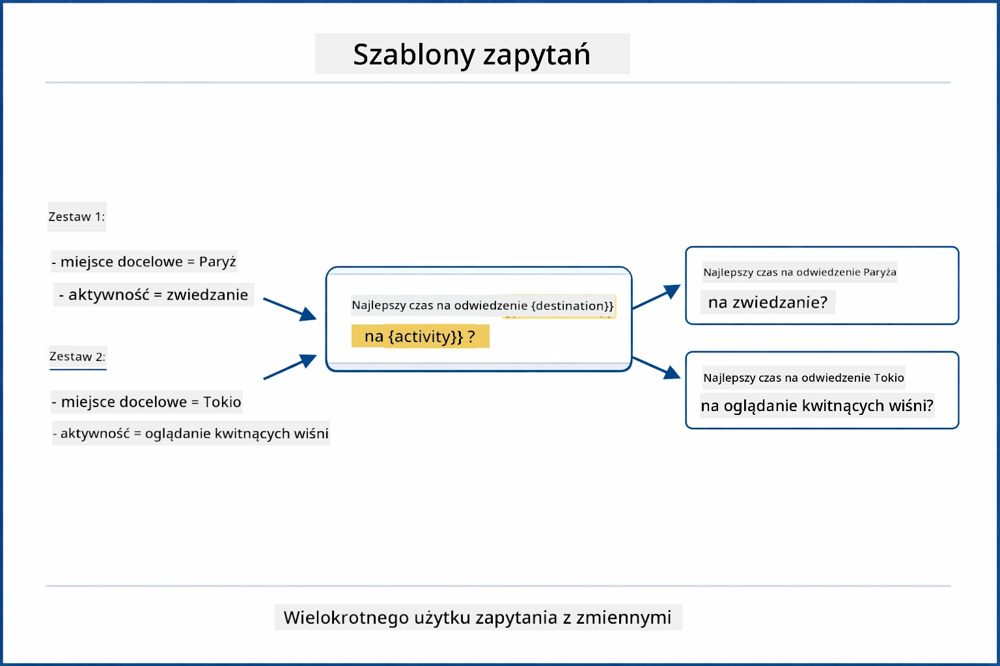
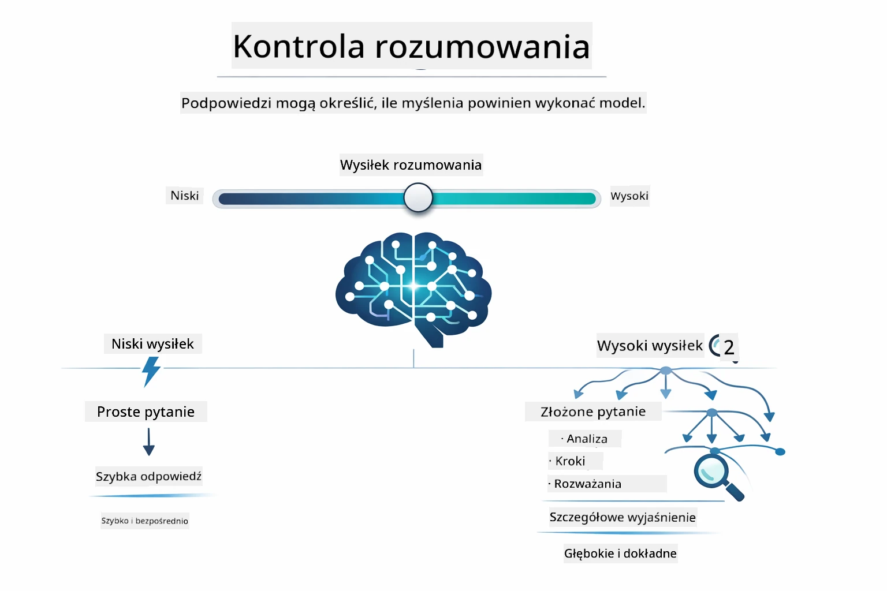

# Moduł 02: Inżynieria promptów z GPT-5.2

## Spis treści

- [Przegląd wideo](../../../02-prompt-engineering)
- [Czego się nauczysz](../../../02-prompt-engineering)
- [Wymagania wstępne](../../../02-prompt-engineering)
- [Zrozumienie inżynierii promptów](../../../02-prompt-engineering)
- [Podstawy inżynierii promptów](../../../02-prompt-engineering)
  - [Prompting zero-shot](../../../02-prompt-engineering)
  - [Prompting few-shot](../../../02-prompt-engineering)
  - [Chain of Thought](../../../02-prompt-engineering)
  - [Prompting oparty na roli](../../../02-prompt-engineering)
  - [Szablony promptów](../../../02-prompt-engineering)
- [Zaawansowane wzorce](../../../02-prompt-engineering)
- [Korzystanie z istniejących zasobów Azure](../../../02-prompt-engineering)
- [Zrzuty ekranu aplikacji](../../../02-prompt-engineering)
- [Eksploracja wzorców](../../../02-prompt-engineering)
  - [Niska vs wysoka chęć](../../../02-prompt-engineering)
  - [Wykonanie zadania (wprowadzenia narzędzi)](../../../02-prompt-engineering)
  - [Kod autorefleksyjny](../../../02-prompt-engineering)
  - [Analiza strukturalna](../../../02-prompt-engineering)
  - [Wieloturnowa rozmowa](../../../02-prompt-engineering)
  - [Rozumowanie krok po kroku](../../../02-prompt-engineering)
  - [Ograniczona odpowiedź](../../../02-prompt-engineering)
- [Czego naprawdę się uczysz](../../../02-prompt-engineering)
- [Kolejne kroki](../../../02-prompt-engineering)

## Przegląd wideo

Obejrzyj tę sesję na żywo, która wyjaśnia, jak rozpocząć pracę z tym modułem:

<a href="https://www.youtube.com/live/PJ6aBaE6bog?si=LDshyBrTRodP-wke"></a>

## Czego się nauczysz



W poprzednim module zobaczyłeś, jak pamięć umożliwia konwersacyjną AI i korzystałeś z modeli GitHub do podstawowych interakcji. Teraz skupimy się na tym, jak formułujesz pytania — czyli samych promptach — używając GPT-5.2 z Azure OpenAI. Sposób, w jaki strukturyzujesz prompt, znacząco wpływa na jakość otrzymywanych odpowiedzi. Zaczniemy od przeglądu podstawowych technik promptowania, a następnie przejdziemy do ośmiu zaawansowanych wzorców, które w pełni wykorzystują możliwości GPT-5.2.

Używamy GPT-5.2, ponieważ wprowadza kontrolę rozumowania — możesz powiedzieć modelowi, ile ma myśleć przed odpowiedzią. To sprawia, że różne strategie promptowania stają się bardziej widoczne i pomaga zrozumieć, kiedy użyć której z nich. Skorzystamy także z mniejszych limitów na GPT-5.2 w Azure w porównaniu do modeli GitHub.

## Wymagania wstępne

- Ukończony Moduł 01 (zasoby Azure OpenAI wdrożone)
- Plik `.env` w katalogu głównym z danymi logowania Azure (utworzony przez `azd up` w Module 01)

> **Uwaga:** Jeśli nie ukończyłeś Modułu 01, najpierw postępuj zgodnie z instrukcjami wdrożenia w nim.

## Zrozumienie inżynierii promptów



Inżynieria promptów polega na projektowaniu tekstu wejściowego, który konsekwentnie daje oczekiwane wyniki. To nie tylko zadawanie pytań — to budowanie zapytań tak, aby model dokładnie zrozumiał, czego chcesz i jak to dostarczyć.

Pomyśl o tym jak o dawaniu instrukcji koledze z pracy. „Napraw błąd” jest niejasne. „Napraw wyjątek null pointer w UserService.java na linii 45, dodając sprawdzenie null” to konkret. Modele językowe działają podobnie — ważna jest precyzja i struktura.



LangChain4j zapewnia infrastrukturę — połączenia z modelem, pamięć i typy wiadomości — podczas gdy wzorce promptów to po prostu starannie ustrukturyzowany tekst przesyłany przez tę infrastrukturę. Kluczowymi elementami są `SystemMessage` (ustawia zachowanie i rolę AI) oraz `UserMessage` (zawiera faktyczne zapytanie).

## Podstawy inżynierii promptów



Zanim zagłębimy się w zaawansowane wzorce w tym module, przejrzyjmy pięć podstawowych technik promptowania. To są budulce, które każdy inżynier promptów powinien znać. Jeśli już pracowałeś z [modułem szybkiego startu](../00-quick-start/README.md#2-prompt-patterns), widziałeś je w praktyce — oto koncepcyjna baza.

### Prompting zero-shot

Najprostsze podejście: daj modelowi bezpośrednią instrukcję bez przykładów. Model opiera się całkowicie na treningu, by zrozumieć i wykonać zadanie. Działa dobrze przy prostych zapytaniach, gdzie oczekiwane zachowanie jest oczywiste.



*Bezpośrednia instrukcja bez przykładów — model wnioskuje zadanie tylko z instrukcji*

```java
String prompt = "Classify this sentiment: 'I absolutely loved the movie!'";
String response = model.chat(prompt);
// Odpowiedź: "Pozytywny"
```

**Kiedy używać:** Proste klasyfikacje, pytania bezpośrednie, tłumaczenia lub każde zadanie, które model może wykonać bez dodatkowych wskazówek.

### Prompting few-shot

Podaj przykłady pokazujące wzorzec, który model ma naśladować. Model uczy się oczekiwanego formatu wejście-wyjście z przykładów i stosuje go do nowych danych. To znacznie poprawia spójność tam, gdzie pożądany format lub zachowanie nie są oczywiste.



*Nauka na podstawie przykładów — model rozpoznaje wzorzec i stosuje do nowych danych*

```java
String prompt = """
    Classify the sentiment as positive, negative, or neutral.
    
    Examples:
    Text: "This product exceeded my expectations!" → Positive
    Text: "It's okay, nothing special." → Neutral
    Text: "Waste of money, very disappointed." → Negative
    
    Now classify this:
    Text: "Best purchase I've made all year!"
    """;
String response = model.chat(prompt);
```

**Kiedy używać:** Własne klasyfikacje, spójne formatowanie, zadania specyficzne dla domeny lub gdy wyniki zero-shot są niestabilne.

### Chain of Thought

Poproś model o pokazanie rozumowania krok po kroku. Zamiast przechodzić od razu do odpowiedzi, model rozbija problem i pracuje nad każdą częścią jawnie. To poprawia dokładność w zadaniach matematycznych, logicznych i wymagających kilku kroków.



*Rozumowanie krok po kroku — rozbijanie złożonych problemów na jawne kroki logiczne*

```java
String prompt = """
    Problem: A store has 15 apples. They sell 8 apples and then 
    receive a shipment of 12 more apples. How many apples do they have now?
    
    Let's solve this step-by-step:
    """;
String response = model.chat(prompt);
// Model pokazuje: 15 - 8 = 7, następnie 7 + 12 = 19 jabłek
```

**Kiedy używać:** Zadania matematyczne, łamigłówki logiczne, debugowanie lub każde zadanie, gdzie pokazanie procesu rozumowania zwiększa dokładność i zaufanie.

### Prompting oparty na roli

Ustaw personę lub rolę AI zanim zadasz pytanie. To dostarcza kontekst, który wpływa na ton, głębokość i ukierunkowanie odpowiedzi. „Architekt oprogramowania” daje inne rady niż „młodszy programista” czy „audytor bezpieczeństwa”.



*Ustawianie kontekstu i persony — to samo pytanie otrzymuje różną odpowiedź zależnie od przypisanej roli*

```java
String prompt = """
    You are an experienced software architect reviewing code.
    Provide a brief code review for this function:
    
    def calculate_total(items):
        total = 0
        for item in items:
            total = total + item['price']
        return total
    """;
String response = model.chat(prompt);
```

**Kiedy używać:** Przeglądy kodu, tutoring, analiza specyficzna dla domeny lub gdy potrzebujesz odpowiedzi dostosowanych do konkretnego poziomu wiedzy lub perspektywy.

### Szablony promptów

Twórz wielokrotnego użytku prompt z zmiennymi zastępczymi. Zamiast pisać nowy prompt za każdym razem, zdefiniuj szablon raz i wypełnij różne wartości. Klasa `PromptTemplate` LangChain4j umożliwia to łatwo dzięki składni `{{variable}}`.



*Wielokrotnego użytku prompt z zmiennymi zastępczymi — jeden szablon, wiele zastosowań*

```java
PromptTemplate template = PromptTemplate.from(
    "What's the best time to visit {{destination}} for {{activity}}?"
);

Prompt prompt = template.apply(Map.of(
    "destination", "Paris",
    "activity", "sightseeing"
));

String response = model.chat(prompt.text());
```

**Kiedy używać:** Powtarzające się zapytania z różnymi danymi, przetwarzanie wsadowe, budowanie wielokrotnego użytku przepływów AI lub każdy scenariusz, gdzie struktura promptu pozostaje taka sama, ale dane się zmieniają.

---

Te pięć fundamentów daje solidne narzędzia do większości zadań z promptami. Reszta tego modułu opiera się na nich, prezentując **osiem zaawansowanych wzorców** wykorzystujących kontrolę rozumowania GPT-5.2, samoocenę i możliwości ustrukturyzowanego wyjścia.

## Zaawansowane wzorce

Mając omówione podstawy, przejdźmy do ośmiu zaawansowanych wzorców, które czynią ten moduł wyjątkowym. Nie wszystkie problemy wymagają tego samego podejścia. Niektóre pytania potrzebują szybkich odpowiedzi, inne głębokiego myślenia. Niektóre wymagają widocznego rozumowania, inne tylko wyników. Każdy wzorzec jest zoptymalizowany do innego scenariusza — a kontrola rozumowania GPT-5.2 wyraźnie podkreśla te różnice.


*Przegląd ośmiu wzorców inżynierii promptów i ich zastosowań*



*Kontrola rozumowania GPT-5.2 pozwala określić, ile ma myśleć model — od szybkich, bezpośrednich odpowiedzi po dogłębne eksploracje*

**Niska chęć (Szybkie i skupione)** - Dla prostych pytań, gdzie chcesz szybkich, bezpośrednich odpowiedzi. Model wykonuje minimalne rozumowanie - maksymalnie 2 kroki. Używaj do obliczeń, wyszukiwań lub prostych pytań.

```java
String prompt = """
    <context_gathering>
    - Search depth: very low
    - Bias strongly towards providing a correct answer as quickly as possible
    - Usually, this means an absolute maximum of 2 reasoning steps
    - If you think you need more time, state what you know and what's uncertain
    </context_gathering>
    
    Problem: What is 15% of 200?
    
    Provide your answer:
    """;

String response = chatModel.chat(prompt);
```

> 💡 **Eksperymentuj z GitHub Copilot:** Otwórz [`Gpt5PromptService.java`](../../../02-prompt-engineering/src/main/java/com/example/langchain4j/prompts/service/Gpt5PromptService.java) i zapytaj:
> - "Jaka jest różnica między wzorcami niskiej a wysokiej chęci promptowania?"
> - "Jak tagi XML w promptach pomagają w strukturze odpowiedzi AI?"
> - "Kiedy stosować wzorce autorefleksji, a kiedy bezpośrednią instrukcję?"

**Wysoka chęć (Głębokie i dokładne)** - Dla złożonych problemów wymagających wszechstronnej analizy. Model eksploruje dokładnie i pokazuje szczegółowe rozumowanie. Używaj do projektowania systemów, decyzji architektonicznych lub złożonych badań.

```java
String prompt = """
    Analyze this problem thoroughly and provide a comprehensive solution.
    Consider multiple approaches, trade-offs, and important details.
    Show your analysis and reasoning in your response.
    
    Problem: Design a caching strategy for a high-traffic REST API.
    """;

String response = chatModel.chat(prompt);
```

**Wykonanie zadania (Postęp krok po kroku)** - Dla wieloetapowych przepływów pracy. Model podaje plan na początku, opowiada o każdym kroku w trakcie pracy, a potem daje podsumowanie. Używaj do migracji, implementacji lub dowolnego procesu wieloetapowego.

```java
String prompt = """
    <task_execution>
    1. First, briefly restate the user's goal in a friendly way
    
    2. Create a step-by-step plan:
       - List all steps needed
       - Identify potential challenges
       - Outline success criteria
    
    3. Execute each step:
       - Narrate what you're doing
       - Show progress clearly
       - Handle any issues that arise
    
    4. Summarize:
       - What was completed
       - Any important notes
       - Next steps if applicable
    </task_execution>
    
    <tool_preambles>
    - Always begin by rephrasing the user's goal clearly
    - Outline your plan before executing
    - Narrate each step as you go
    - Finish with a distinct summary
    </tool_preambles>
    
    Task: Create a REST endpoint for user registration
    
    Begin execution:
    """;

String response = chatModel.chat(prompt);
```

Prompting Chain-of-Thought wyraźnie prosi model o pokazanie procesu rozumowania, poprawiając dokładność przy złożonych zadaniach. Podział krok po kroku pomaga zarówno ludziom, jak i AI zrozumieć logikę.

> **🤖 Wypróbuj z czatem [GitHub Copilot](https://github.com/features/copilot):** Zapytaj o ten wzorzec:
> - "Jak dostosować wzorzec wykonania zadania do długotrwałych operacji?"
> - "Jakie są najlepsze praktyki organizowania wprowadzeń narzędzi w aplikacjach produkcyjnych?"
> - "Jak można przechwytywać i wyświetlać pośrednie aktualizacje postępu w UI?"


*Planowanie → Wykonywanie → Podsumowanie dla zadań wieloetapowych*

**Kod autorefleksyjny** - Do generowania kodu produkcyjnej jakości. Model generuje kod zgodnie ze standardami produkcyjnymi z odpowiednim obsługiwaniem błędów. Używaj do tworzenia nowych funkcji lub usług.

```java
String prompt = """
    Generate Java code with production-quality standards: Create an email validation service
    Keep it simple and include basic error handling.
    """;

String response = chatModel.chat(prompt);
```


*Iteracyjna pętla ulepszeń — generuj, oceniaj, identyfikuj problemy, poprawiaj, powtarzaj*

**Analiza strukturalna** - Do spójnej oceny. Model przegląda kod używając określonego frameworku (poprawność, praktyki, wydajność, bezpieczeństwo, utrzymywalność). Używaj do przeglądów kodu lub ocen jakości.

```java
String prompt = """
    <analysis_framework>
    You are an expert code reviewer. Analyze the code for:
    
    1. Correctness
       - Does it work as intended?
       - Are there logical errors?
    
    2. Best Practices
       - Follows language conventions?
       - Appropriate design patterns?
    
    3. Performance
       - Any inefficiencies?
       - Scalability concerns?
    
    4. Security
       - Potential vulnerabilities?
       - Input validation?
    
    5. Maintainability
       - Code clarity?
       - Documentation?
    
    <output_format>
    Provide your analysis in this structure:
    - Summary: One-sentence overall assessment
    - Strengths: 2-3 positive points
    - Issues: List any problems found with severity (High/Medium/Low)
    - Recommendations: Specific improvements
    </output_format>
    </analysis_framework>
    
    Code to analyze:
    ```
    public List getUsers() {
        return database.query("SELECT * FROM users");
    }
    ```
    Provide your structured analysis:
    """;

String response = chatModel.chat(prompt);
```

> **🤖 Wypróbuj z czatem [GitHub Copilot](https://github.com/features/copilot):** Zapytaj o analizę strukturalną:
> - "Jak dostosować ramy analiz do różnych rodzajów przeglądów kodu?"
> - "Jaki jest najlepszy sposób na programowe przetwarzanie i wykorzystanie ustrukturyzowanego wyjścia?"
> - "Jak zapewnić spójność poziomów istotności w różnych sesjach przeglądu?"


*Ramowy system dla spójnych przeglądów kodu z poziomami istotności*

**Wieloturnowa rozmowa** - Do konwersacji wymagających kontekstu. Model zapamiętuje poprzednie wiadomości i rozbudowuje odpowiedzi. Używaj do interaktywnych sesji pomocy lub złożonych Q&A.

```java
ChatMemory memory = MessageWindowChatMemory.withMaxMessages(10);

memory.add(UserMessage.from("What is Spring Boot?"));
AiMessage aiMessage1 = chatModel.chat(memory.messages()).aiMessage();
memory.add(aiMessage1);

memory.add(UserMessage.from("Show me an example"));
AiMessage aiMessage2 = chatModel.chat(memory.messages()).aiMessage();
memory.add(aiMessage2);
```


*Jak kontekst rozmowy kumuluje się na przestrzeni wielu tur aż do limitu tokenów*

**Rozumowanie krok po kroku** - Do problemów wymagających widocznej logiki. Model pokazuje jawne rozumowanie dla każdego kroku. Używaj do zadań matematycznych, łamigłówek lub gdy chcesz zrozumieć proces myślowy.

```java
String prompt = """
    <instruction>Show your reasoning step-by-step</instruction>
    
    If a train travels 120 km in 2 hours, then stops for 30 minutes,
    then travels another 90 km in 1.5 hours, what is the average speed
    for the entire journey including the stop?
    """;

String response = chatModel.chat(prompt);
```


*Rozbijanie problemów na jawne kroki logiczne*

**Ograniczona odpowiedź** - Do odpowiedzi o konkretnych wymaganiach formatu. Model ściśle przestrzega reguł formatu i długości. Używaj do streszczeń lub gdy potrzebujesz precyzyjnej struktury wyjścia.

```java
String prompt = """
    <constraints>
    - Exactly 100 words
    - Bullet point format
    - Technical terms only
    </constraints>
    
    Summarize the key concepts of machine learning.
    """;

String response = chatModel.chat(prompt);
```


*Egzekwowanie konkretnych wymagań formatu, długości i struktury*

## Korzystanie z istniejących zasobów Azure

**Weryfikacja wdrożenia:**

Upewnij się, że plik `.env` istnieje w katalogu głównym z danymi uwierzytelniającymi Azure (utworzonym podczas Modułu 01):
```bash
cat ../.env  # Powinno pokazywać AZURE_OPENAI_ENDPOINT, API_KEY, DEPLOYMENT
```

**Uruchom aplikację:**

> **Uwaga:** Jeśli już uruchomiłeś wszystkie aplikacje używając `./start-all.sh` z Modułu 01, ten moduł działa już na porcie 8083. Możesz pominąć poniższe polecenia uruchomienia i przejść bezpośrednio do http://localhost:8083.
**Opcja 1: Korzystanie z Spring Boot Dashboard (zalecane dla użytkowników VS Code)**

Kontener deweloperski zawiera rozszerzenie Spring Boot Dashboard, które zapewnia wizualny interfejs do zarządzania wszystkimi aplikacjami Spring Boot. Znajdziesz je na pasku aktywności po lewej stronie VS Code (szukaj ikony Spring Boot).

Z poziomu Spring Boot Dashboard możesz:
- Zobaczyć wszystkie dostępne aplikacje Spring Boot w przestrzeni roboczej
- Uruchamiać/zatrzymywać aplikacje jednym kliknięciem
- Przeglądać logi aplikacji w czasie rzeczywistym
- Monitorować status aplikacji

Po prostu kliknij przycisk odtwarzania obok "prompt-engineering", aby uruchomić ten moduł lub uruchom wszystkie moduły naraz.


**Opcja 2: Korzystanie ze skryptów powłoki**

Uruchom wszystkie aplikacje internetowe (moduły 01-04):

**Bash:**
```bash
cd ..  # Z katalogu głównego
./start-all.sh
```

**PowerShell:**
```powershell
cd ..  # Z katalogu głównego
.\start-all.ps1
```

Lub uruchom tylko ten moduł:

**Bash:**
```bash
cd 02-prompt-engineering
./start.sh
```

**PowerShell:**
```powershell
cd 02-prompt-engineering
.\start.ps1
```

Oba skrypty automatycznie ładują zmienne środowiskowe z pliku `.env` w katalogu głównym i zbudują pliki JAR, jeśli jeszcze nie istnieją.

> **Uwaga:** Jeśli wolisz ręcznie zbudować wszystkie moduły przed uruchomieniem:
>
> **Bash:**
> ```bash
> cd ..  # Go to root directory
> mvn clean package -DskipTests
> ```
>
> **PowerShell:**
> ```powershell
> cd ..  # Go to root directory
> mvn clean package -DskipTests
> ```

Otwórz http://localhost:8083 w swojej przeglądarce.

**Aby zatrzymać:**

**Bash:**
```bash
./stop.sh  # Tylko ten moduł
# Lub
cd .. && ./stop-all.sh  # Wszystkie moduły
```

**PowerShell:**
```powershell
.\stop.ps1  # Tylko ten moduł
# Lub
cd ..; .\stop-all.ps1  # Wszystkie moduły
```

## Zrzuty ekranu aplikacji


*Główny pulpit pokazujący wszystkie 8 wzorców prompt engineering wraz z ich cechami i przypadkami użycia*

## Eksploracja wzorców

Interfejs webowy pozwala eksperymentować z różnymi strategiami promptowania. Każdy wzorzec rozwiązuje inne problemy – wypróbuj je, aby zobaczyć, kiedy sprawdzi się każde podejście.

> **Uwaga: Streaming vs Brak streamingu** — Każda strona wzorca oferuje dwa przyciski: **🔴 Stream Response (na żywo)** oraz opcję **Bez streamingu**. Streaming wykorzystuje Server-Sent Events (SSE) do wyświetlania tokenów na bieżąco, gdy model je generuje, co pozwala natychmiast obserwować postępy. Opcja bez streamingu czeka na całą odpowiedź, zanim ją wyświetli. Dla promptów wymagających głębokiego rozumowania (np. High Eagerness, Self-Reflecting Code) wywołanie bez streamingu może trwać bardzo długo — czasem kilka minut — bez widocznej informacji zwrotnej. **Używaj streamingu przy eksperymentach z złożonymi promptami**, aby zobaczyć działanie modelu i uniknąć wrażenia, że zapytanie wygasło.
>
> **Uwaga: Wymagania dotyczące przeglądarki** — Funkcja streamingu korzysta z Fetch Streams API (`response.body.getReader()`), które wymaga pełnej przeglądarki (Chrome, Edge, Firefox, Safari). Nie działa w wbudowanej w VS Code przeglądarce Simple Browser, ponieważ jej webview nie obsługuje API ReadableStream. Jeśli używasz Simple Browser, przyciski bez streamingu działają normalnie — dotyczy to jedynie przycisków streamingu. Otwórz `http://localhost:8083` w zewnętrznej przeglądarce, aby uzyskać pełne możliwości.

### Niskie vs wysokie zaangażowanie (Low vs High Eagerness)

Zadaj proste pytanie, np. "Jakie jest 15% z 200?" używając niskiego zaangażowania. Otrzymasz natychmiastową, bezpośrednią odpowiedź. Teraz zadaj coś bardziej złożonego, np. "Zaprojektuj strategię cache’owania dla API o dużym natężeniu ruchu", używając wysokiego zaangażowania. Kliknij **🔴 Stream Response (na żywo)** i obserwuj, jak model token po tokenie prezentuje szczegółowe rozumowanie. Ten sam model, ta sama struktura pytania – lecz prompt mówi mu, ile myślenia ma wykonać.

### Realizacja zadań (wstępne komunikaty narzędziowe)

Wieloetapowe procesy korzystają na wcześniejszym planowaniu i narracji postępów. Model opisuje, co zrobi, zamienia każde działanie na narrację, a potem podsumowuje wyniki.

### Samorefleksyjny kod (Self-Reflecting Code)

Wypróbuj "Stwórz serwis walidacji emaili". Zamiast tylko wygenerować kod i przerwać, model generuje kod, ocenia go według kryteriów jakości, wskazuje słabości i poprawia. Zobaczysz kolejne iteracje, aż kod spełni standardy produkcyjne.

### Analiza strukturalna

Przeglądy kodu wymagają spójnych ram oceny. Model analizuje kod według ustalonych kategorii (poprawność, praktyki, wydajność, bezpieczeństwo) i poziomów ważności.

### Czaty wielokrokowe (Multi-Turn Chat)

Zadaj pytanie "Co to jest Spring Boot?", a potem od razu "Pokaż mi przykład". Model pamięta twoje pierwsze pytanie i poda specyficzny przykład Spring Boot. Bez pamięci drugie pytanie byłoby zbyt niejasne.

### Rozumowanie krok po kroku

Wybierz problem matematyczny i spróbuj go rozwiązać zarówno przy użyciu rozumowania krok po kroku, jak i niskiego zaangażowania. Niskie zaangażowanie daje tylko odpowiedź – szybko, ale nieprzejrzyście. Rozumowanie krok po kroku pokazuje każdy obliczony krok i decyzję.

### Ograniczona odpowiedź

Gdy potrzebujesz konkretnych formatów lub liczby słów, ten wzorzec zapewnia ścisłe przestrzeganie wymagań. Spróbuj wygenerować podsumowanie z dokładnie 100 słowami w formie punktów.

## Czego naprawdę się uczysz

**Wysiłek rozumowania zmienia wszystko**

GPT-5.2 pozwala kontrolować nakład obliczeniowy przez prompty. Niski wysiłek oznacza szybkie odpowiedzi z minimalną eksploracją. Wysoki wysiłek oznacza, że model poświęca czas na głębokie myślenie. Uczysz się dopasowywać wysiłek do złożoności zadania – nie marnuj czasu na proste pytania, ale też nie spiesz się z złożonymi decyzjami.

**Struktura kieruje zachowaniem**

Zauważasz tagi XML w promptach? Nie są dekoracją. Modele chętniej i pewniej realizują instrukcje oparte na strukturze niż swobodny tekst. Gdy potrzebujesz procesów wieloetapowych lub skomplikowanej logiki, struktura pomaga modelowi śledzić, na jakim etapie jest i co następuje dalej.


*Anatomia dobrze zorganizowanego promptu z wyraźnymi sekcjami i organizacją w stylu XML*

**Jakość przez samoocenę**

Wzorce samorefleksyjne działają poprzez jawne określanie kryteriów jakości. Zamiast liczyć, że model "zrobi to dobrze", mówisz mu dokładnie, co znaczy „dobrze”: poprawna logika, obsługa błędów, wydajność, bezpieczeństwo. Model może ocenić własny rezultat i go poprawić. To zmienia generowanie kodu z loterii w proces.

**Kontekst jest ograniczony**

Konwersacje wielokrokowe działają przez dołączanie historii wiadomości do każdego zapytania. Ale istnieje limit – każdy model ma maksymalną liczbę tokenów. W miarę rozrostu rozmów musisz stosować strategie utrzymywania istotnego kontekstu bez przekraczania limitu. Ten moduł pokazuje, jak działa pamięć; później nauczysz się, kiedy podsumowywać, kiedy zapominać, a kiedy przywoływać.

## Kolejne kroki

**Następny moduł:** [03-rag - RAG (Retrieval-Augmented Generation)](../03-rag/README.md)

---

**Nawigacja:** [← Poprzedni: Moduł 01 - Wprowadzenie](../01-introduction/README.md) | [Powrót do głównej](../README.md) | [Następny: Moduł 03 - RAG →](../03-rag/README.md)

---

<!-- CO-OP TRANSLATOR DISCLAIMER START -->
**Zastrzeżenie**:  
Ten dokument został przetłumaczony za pomocą usługi tłumaczenia AI [Co-op Translator](https://github.com/Azure/co-op-translator). Mimo że dążymy do dokładności, prosimy mieć na uwadze, że tłumaczenia automatyczne mogą zawierać błędy lub nieścisłości. Oryginalny dokument w języku źródłowym należy traktować jako źródło wiarygodne. W przypadku ważnych informacji zaleca się skorzystanie z profesjonalnego tłumaczenia wykonanego przez człowieka. Nie ponosimy odpowiedzialności za jakiekolwiek nieporozumienia lub błędne interpretacje wynikające z korzystania z tego tłumaczenia.
<!-- CO-OP TRANSLATOR DISCLAIMER END -->