# Moduł 03: RAG (Retrieval-Augmented Generation)

## Spis treści

- [Omówienie wideo](../../../03-rag)
- [Czego się nauczysz](../../../03-rag)
- [Wymagania wstępne](../../../03-rag)
- [Zrozumienie RAG](../../../03-rag)
  - [Które podejście RAG używa tego samouczka?](../../../03-rag)
- [Jak to działa](../../../03-rag)
  - [Przetwarzanie dokumentów](../../../03-rag)
  - [Tworzenie embeddingów](../../../03-rag)
  - [Wyszukiwanie semantyczne](../../../03-rag)
  - [Generowanie odpowiedzi](../../../03-rag)
- [Uruchom aplikację](../../../03-rag)
- [Korzystanie z aplikacji](../../../03-rag)
  - [Prześlij dokument](../../../03-rag)
  - [Zadaj pytania](../../../03-rag)
  - [Sprawdź źródła](../../../03-rag)
  - [Eksperymentuj z pytaniami](../../../03-rag)
- [Kluczowe pojęcia](../../../03-rag)
  - [Strategia dzielenia na fragmenty](../../../03-rag)
  - [Wskaźniki podobieństwa](../../../03-rag)
  - [Przechowywanie w pamięci](../../../03-rag)
  - [Zarządzanie kontekstem w oknie](../../../03-rag)
- [Kiedy RAG ma znaczenie](../../../03-rag)
- [Kolejne kroki](../../../03-rag)

## Omówienie wideo

Obejrzyj tę sesję na żywo, która wyjaśnia, jak rozpocząć z tym modułem:

<a href="https://www.youtube.com/watch?v=_olq75ZH_eY"></a>

## Czego się nauczysz

W poprzednich modułach nauczyłeś się, jak prowadzić rozmowy z AI i jak efektywnie strukturyzować swoje prompt’y. Ale jest jedna podstawowa ograniczenie: modele językowe znają tylko to, czego nauczyły się podczas treningu. Nie są w stanie odpowiadać na pytania dotyczące wewnętrznych polityk firmy, dokumentacji projektu ani informacji, na których nie były trenowane.

RAG (Retrieval-Augmented Generation) rozwiązuje ten problem. Zamiast próbować uczyć model twoich informacji (co jest kosztowne i niepraktyczne), dajesz mu możliwość przeszukiwania twoich dokumentów. Kiedy ktoś zada pytanie, system znajduje odpowiednie informacje i dołącza je do promptu. Następnie model odpowiada na podstawie tego pobranego kontekstu.

Pomyśl o RAG jak o bibliotece referencyjnej dla modelu. Gdy zadasz pytanie, system:

1. **Zapytanie użytkownika** – zadasz pytanie  
2. **Embedding** – zamienia pytanie na wektor  
3. **Wyszukiwanie wektorowe** – znajduje podobne fragmenty dokumentów  
4. **Tworzenie kontekstu** – dodaje odpowiednie fragmenty do promptu  
5. **Odpowiedź** – model generuje odpowiedź na podstawie tego kontekstu  

Dzięki temu odpowiedzi modelu są osadzone w twoich rzeczywistych danych, zamiast polegać wyłącznie na wiedzy treningowej lub wymyślaniu odpowiedzi.

## Wymagania wstępne

- Ukończony [Moduł 00 - Szybki start](../00-quick-start/README.md) (dla przykładu Easy RAG, o którym mowa powyżej)  
- Ukończony [Moduł 01 - Wprowadzenie](../01-introduction/README.md) (deployed zasoby Azure OpenAI, w tym model embeddingowy `text-embedding-3-small`)  
- Plik `.env` w katalogu głównym z poświadczeniami Azure (utworzony przez `azd up` w Module 01)  

> **Uwaga:** Jeśli nie ukończyłeś Modułu 01, wykonaj tamte instrukcje wdrożenia najpierw. Polecenie `azd up` wdraża zarówno model czatu GPT, jak i model embeddingowy używany w tym module.

## Zrozumienie RAG

Poniższy diagram ilustruje podstawową koncepcję: zamiast polegać tylko na danych treningowych modelu, RAG daje mu bibliotekę twoich dokumentów do konsultacji przed wygenerowaniem każdej odpowiedzi.

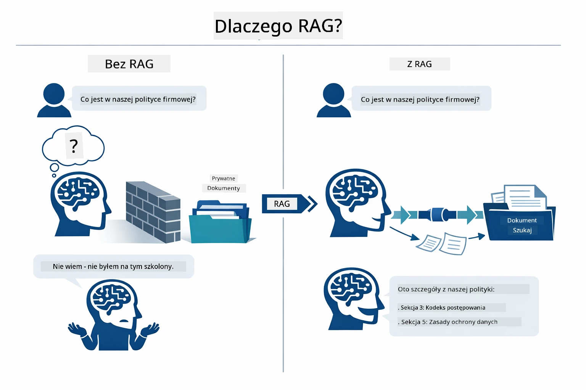

*Ten diagram pokazuje różnicę między standardowym LLM (który zgaduje na podstawie danych treningowych), a modelem RAG (który najpierw konsultuje twoje dokumenty).*

Tak wyglądają poszczególne etapy końcowego procesu. Pytanie użytkownika przechodzi przez cztery fazy — embedding, wyszukiwanie wektorowe, składanie kontekstu oraz generowanie odpowiedzi — każda budując na poprzedniej:


*Ten diagram pokazuje pełny pipeline RAG — pytanie użytkownika przechodzi przez embedding, wyszukiwanie wektorowe, składanie kontekstu i generowanie odpowiedzi.*

Reszta tego modułu dokładnie omawia każdy etap, z kodem, który możesz uruchomić i modyfikować.

### Które podejście RAG używa tego samouczka?

LangChain4j oferuje trzy sposoby implementacji RAG, każdy na innym poziomie abstrakcji. Poniższy diagram porównuje je obok siebie:

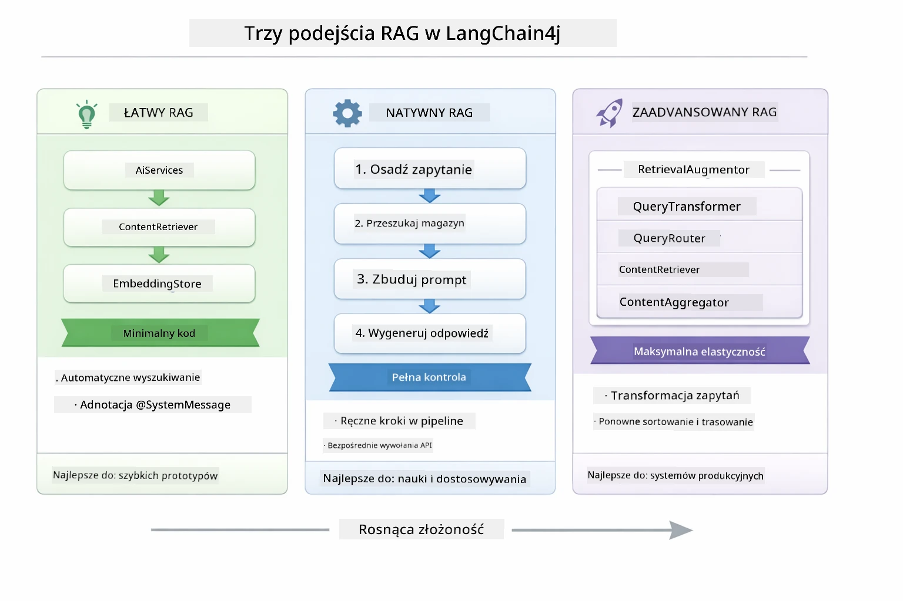

*Ten diagram porównuje trzy podejścia RAG w LangChain4j — Easy, Native oraz Advanced — pokazując ich kluczowe komponenty i sytuacje, w których się je stosuje.*

| Podejście | Co robi | Kompromis |
|---|---|---|
| **Easy RAG** | Automatycznie łączy wszystko przez `AiServices` i `ContentRetriever`. Adnotujesz interfejs, przypisujesz retriever, a LangChain4j zajmuje się embeddingiem, wyszukiwaniem i składaniem promptów w tle. | Minimalny kod, ale nie widzisz, co dzieje się na każdym etapie. |
| **Native RAG** | Sam wywołujesz model embeddingowy, przeszukujesz repozytorium, tworzysz prompt i generujesz odpowiedź — krok po kroku. | Więcej kodu, ale każdy etap jest widoczny i modyfikowalny. |
| **Advanced RAG** | Używa frameworka `RetrievalAugmentor` z wymiennymi przekształcaczami zapytań, routerami, re-rankerami i wstrzykiwaczami treści do produkcyjnych pipeline’ów. | Maksymalna elastyczność, ale znacznie większa złożoność. |

**Ten samouczek używa podejścia Native.** Każdy etap pipeline’u RAG — tworzenie embeddingu zapytania, wyszukiwanie w sklepie wektorów, składanie kontekstu i generowanie odpowiedzi — jest jawnie zapisany w [`RagService.java`](../../../03-rag/src/main/java/com/example/langchain4j/rag/service/RagService.java). To celowe: jako materiał edukacyjny ważniejsze jest, abyś zobaczył i zrozumiał każdy etap, niż by kod był minimalistyczny. Gdy poczujesz się komfortowo z układem, możesz przejść do Easy RAG dla szybkich prototypów lub Advanced RAG dla systemów produkcyjnych.

> **💡 Już widziałeś Easy RAG w działaniu?** Moduł [Szybki start](../00-quick-start/README.md) zawiera przykład Q&A na dokumentach ([`SimpleReaderDemo.java`](../../../00-quick-start/src/main/java/com/example/langchain4j/quickstart/SimpleReaderDemo.java)), który używa Easy RAG — LangChain4j automatycznie zajmuje się embeddingiem, wyszukiwaniem i składaniem promptu. Ten moduł idzie krok dalej, rozkrywając ten pipeline, abyś mógł zobaczyć i kontrolować każdy etap samodzielnie.

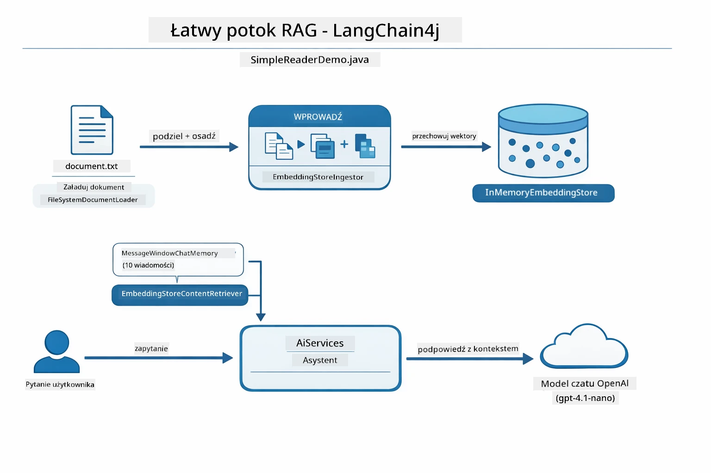

*Ten diagram pokazuje pipeline Easy RAG z `SimpleReaderDemo.java`. Porównaj to z podejściem Native z tego modułu: Easy RAG ukrywa embedding, wyszukiwanie i składanie promptu za `AiServices` i `ContentRetriever` — ładujesz dokument, dołączasz retriver i dostajesz odpowiedzi. Podejście Native rozbija ten pipeline tak, że sam wywołujesz każdy etap (embedding, wyszukiwanie, składanie kontekstu, generowanie), z pełną widocznością i kontrolą.*

## Jak to działa

Pipeline RAG w tym module dzieli się na cztery etapy, które są wykonywane kolejno za każdym razem, gdy użytkownik zadaje pytanie. Najpierw przesłany dokument jest **parsowany i dzielony na fragmenty**. Fragmenty te są następnie konwertowane na **embeddingi wektorowe** i przechowywane, aby można było je matematycznie porównać. Gdy nadejdzie zapytanie, system wykonuje **wyszukiwanie semantyczne**, by znaleźć najbardziej relewantne fragmenty, a na końcu przekazuje je jako kontekst do LLM w celu **generowania odpowiedzi**. Poniższe sekcje omawiają każdy etap z kodem i diagramami. Zaczynamy od pierwszego kroku.

### Przetwarzanie dokumentów

[DocumentService.java](../../../03-rag/src/main/java/com/example/langchain4j/rag/service/DocumentService.java)

Gdy przesyłasz dokument, system go parsuje (PDF lub zwykły tekst), dołącza metadane takie jak nazwa pliku, a następnie dzieli dokument na fragmenty — mniejsze części, które mieszczą się komfortowo w oknie kontekstu modelu. Te fragmenty są nieznacznie na siebie nachodzą, aby nie utracić kontekstu na granicach.

```java
// Przetwórz przesłany plik i opakuj go w dokument LangChain4j
Document document = Document.from(content, metadata);

// Podziel na fragmenty po 300 tokenów z 30-tokenowym nakładaniem się
DocumentSplitter splitter = DocumentSplitters
    .recursive(300, 30);

List<TextSegment> segments = splitter.split(document);
```
  
Poniższy diagram pokazuje to wizualnie. Zauważ, jak każdy fragment dzieli niektóre tokeny z sąsiadami — 30-tokenowe nachodzenie zapewnia, że żaden ważny kontekst nie zostanie utracony:

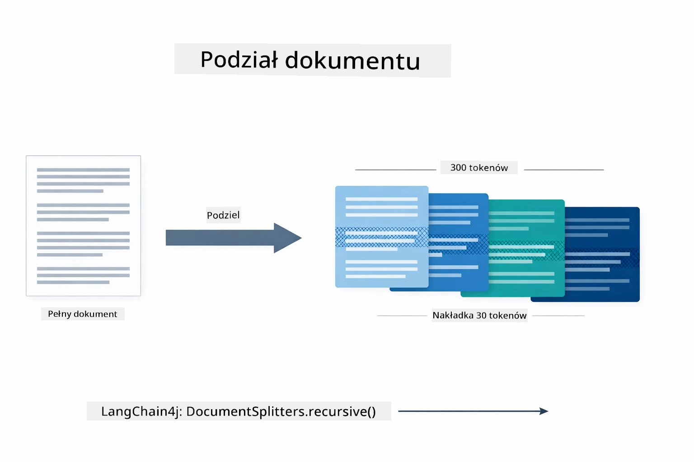

*Ten diagram pokazuje dokument dzielony na fragmenty po 300 tokenów z 30-tokenowym nachodzeniem, co zachowuje kontekst na granicach fragmentów.*

> **🤖 Wypróbuj z [GitHub Copilot](https://github.com/features/copilot) Chat:** Otwórz [`DocumentService.java`](../../../03-rag/src/main/java/com/example/langchain4j/rag/service/DocumentService.java) i zapytaj:  
> - "Jak LangChain4j dzieli dokumenty na fragmenty i dlaczego nachodzenie jest ważne?"  
> - "Jaki jest optymalny rozmiar fragmentu dla różnych typów dokumentów i dlaczego?"  
> - "Jak obsłużyć dokumenty w wielu językach lub ze specjalnym formatowaniem?"

### Tworzenie embeddingów

[LangChainRagConfig.java](../../../03-rag/src/main/java/com/example/langchain4j/rag/config/LangChainRagConfig.java)

Każdy fragment jest konwertowany na reprezentację numeryczną zwaną embeddingiem — w zasadzie to konwerter znaczenia na liczby. Model embeddingowy nie jest „inteligentny” tak jak model czatu; nie potrafi przestrzegać instrukcji, wnioskować ani odpowiadać na pytania. Potrafi jednak mapować tekst w przestrzeń matematyczną, w której podobne znaczenia są blisko siebie — „samochód” blisko „auto”, „polityka zwrotów” blisko „zwrot pieniędzy”. Pomyśl o modelu czatu jak o osobie, z którą rozmawiasz; a o modelu embeddingowym jak o świetnym systemie archiwizacji.

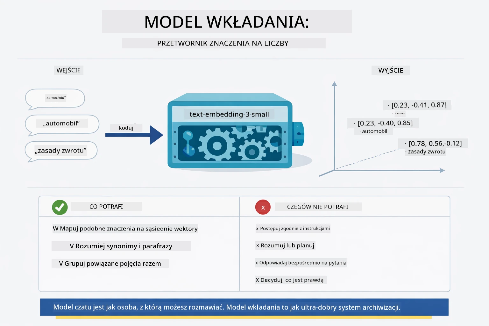

*Ten diagram pokazuje, jak model embeddingowy zamienia tekst na wektory liczbowe, umieszczając podobne znaczenia — jak „samochód” i „auto” — blisko siebie w przestrzeni wektorowej.*

```java
@Bean
public EmbeddingModel embeddingModel() {
    return OpenAiOfficialEmbeddingModel.builder()
        .baseUrl(azureOpenAiEndpoint)
        .apiKey(azureOpenAiKey)
        .modelName(azureEmbeddingDeploymentName)
        .build();
}

EmbeddingStore<TextSegment> embeddingStore = 
    new InMemoryEmbeddingStore<>();
```
  
Poniższy diagram klas pokazuje dwa odrębne przepływy w pipeline RAG i klasy LangChain4j, które je implementują. **Przepływ wczytywania** (wykonywany raz przy przesyłaniu) dzieli dokument, tworzy embeddingi fragmentów i zapisuje je przez `.addAll()`. **Przepływ zapytania** (wykonywany przy każdym pytaniu użytkownika) tworzy embedding zapytania, przeszukuje repozytorium przez `.search()` i przekazuje dopasowany kontekst do modelu czatu. Oba przepływy spotykają się na wspólnym interfejsie `EmbeddingStore<TextSegment>`:

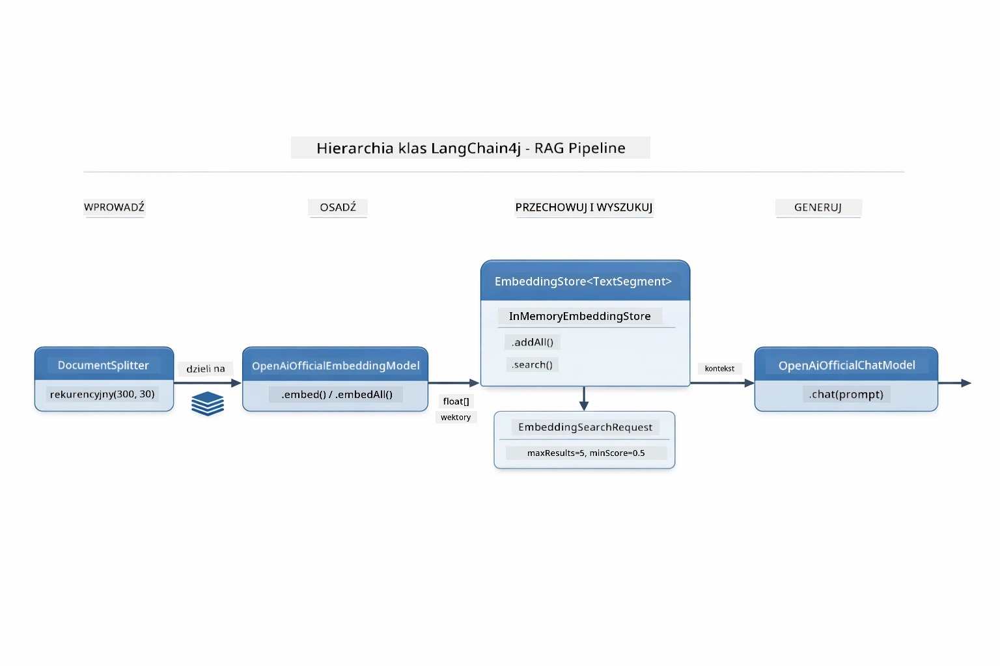

*Ten diagram pokazuje dwa przepływy w pipeline RAG — wczytywanie i zapytanie — oraz ich połączenie poprzez wspólny EmbeddingStore.*

Gdy embeddingi są zapisane, podobne treści naturalnie grupują się w przestrzeni wektorowej. Poniższa wizualizacja pokazuje, jak dokumenty o powiązanych tematach tworzą bliskie punkty, co umożliwia wyszukiwanie semantyczne:


*Ta wizualizacja pokazuje, jak powiązane dokumenty grupują się w 3D przestrzeni wektorowej, z tematycznymi grupami takimi jak Dokumentacja techniczna, Zasady biznesowe i FAQ.*

Gdy użytkownik wyszukuje, system wykonuje cztery kroki: tworzy embeddingi dokumentów raz, embedding zapytania za każdym razem, porównuje wektor zapytania ze wszystkimi wektorami przy użyciu podobieństwa kosinusowego i zwraca top-K najwyżej ocenianych fragmentów. Poniższy diagram opisuje każdy krok i odpowiednie klasy LangChain4j:

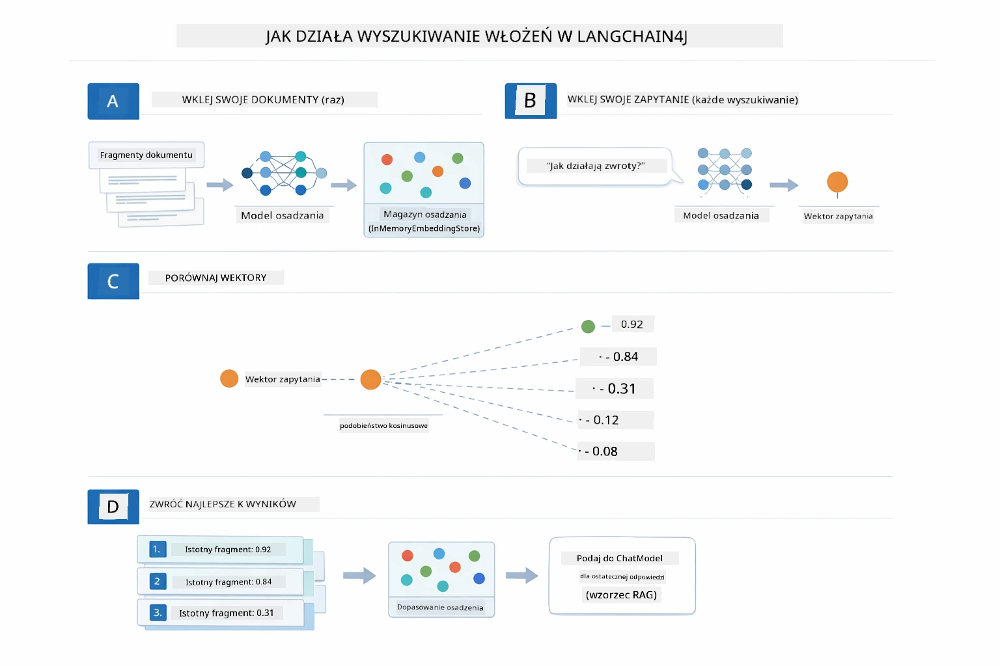

*Ten diagram pokazuje proces wyszukiwania embeddingów w czterech krokach: embedowanie dokumentów, embedowanie zapytania, porównanie wektorów z podobieństwem kosinusowym i zwrócenie najlepszych wyników.*

### Wyszukiwanie semantyczne

[RagService.java](../../../03-rag/src/main/java/com/example/langchain4j/rag/service/RagService.java)

Gdy zadasz pytanie, ono także zostaje zamienione na embedding. System porównuje embedding twojego pytania z embeddingami wszystkich fragmentów dokumentów. Znajduje te fragmenty, które mają najbardziej podobne znaczenie — nie tylko pasujące słowa kluczowe, ale faktyczne podobieństwo semantyczne.

```java
Embedding queryEmbedding = embeddingModel.embed(question).content();

EmbeddingSearchRequest searchRequest = EmbeddingSearchRequest.builder()
    .queryEmbedding(queryEmbedding)
    .maxResults(5)
    .minScore(0.5)
    .build();

EmbeddingSearchResult<TextSegment> searchResult = embeddingStore.search(searchRequest);
List<EmbeddingMatch<TextSegment>> matches = searchResult.matches();

for (EmbeddingMatch<TextSegment> match : matches) {
    String relevantText = match.embedded().text();
    double score = match.score();
}
```
  
Poniższy diagram pokazuje kontrast między wyszukiwaniem semantycznym a tradycyjnym wyszukiwaniem słów kluczowych. Wyszukiwanie słowa kluczowego „pojazd” pomija fragment o „samochodach i ciężarówkach”, ale wyszukiwanie semantyczne rozumie, że to to samo i zwraca ten fragment jako wysoko oceniany:

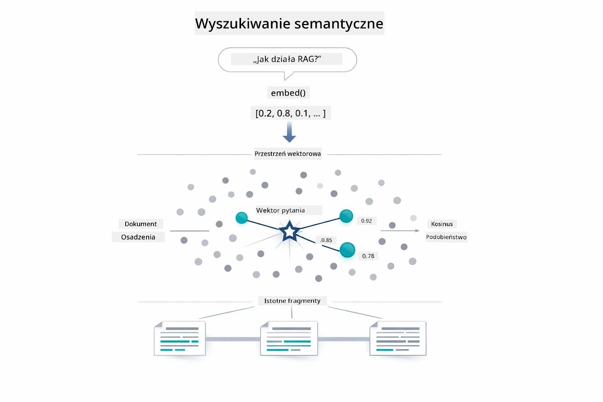

*Ten diagram porównuje wyszukiwanie słów kluczowych z wyszukiwaniem semantycznym, pokazując, jak wyszukiwanie semantyczne zwraca treści powiązane koncepcyjnie, nawet gdy słowa kluczowe się różnią.*

Pod spodem podobieństwo mierzone jest za pomocą podobieństwa kosinusowego — w praktyce pytając „czy te dwie strzałki wskazują w tym samym kierunku?” Dwa fragmenty mogą używać całkiem innych słów, ale jeśli znaczą to samo, ich wektory wskazują podobnie i ocena jest bliska 1.0:

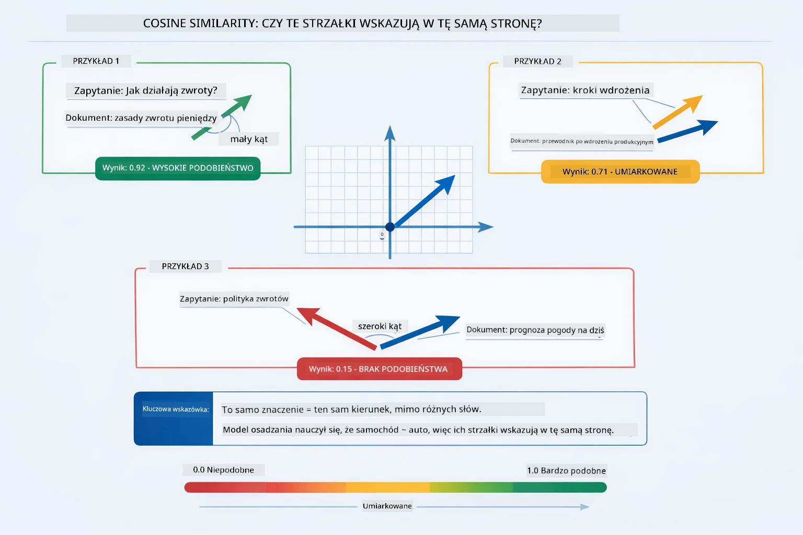
*Ten diagram ilustruje podobieństwo cosinusowe jako kąt pomiędzy wektorami osadzeń — bardziej wyrównane wektory uzyskują wynik bliższy 1.0, co wskazuje na wyższe podobieństwo semantyczne.*

> **🤖 Wypróbuj z [GitHub Copilot](https://github.com/features/copilot) Chat:** Otwórz [`RagService.java`](../../../03-rag/src/main/java/com/example/langchain4j/rag/service/RagService.java) i zapytaj:
> - "Jak działa wyszukiwanie podobieństwa z użyciem osadzeń i co determinuje wynik?"
> - "Jaki próg podobieństwa powinienem ustawić i jak wpływa to na wyniki?"
> - "Jak radzić sobie w przypadkach, gdy nie znaleziono odpowiednich dokumentów?"

### Generowanie Odpowiedzi

[RagService.java](../../../03-rag/src/main/java/com/example/langchain4j/rag/service/RagService.java)

Najbardziej istotne fragmenty są zestawiane w ustrukturyzowaną podpowiedź, która zawiera wyraźne instrukcje, pobrany kontekst oraz pytanie użytkownika. Model czyta te konkretne fragmenty i odpowiada na ich podstawie — może używać tylko tego, co ma bezpośrednio przed sobą, co zapobiega halucynacjom.

```java
String context = matches.stream()
    .map(match -> match.embedded().text())
    .collect(Collectors.joining("\n\n"));

String prompt = String.format("""
    Answer the question based on the following context.
    If the answer cannot be found in the context, say so.

    Context:
    %s

    Question: %s

    Answer:""", context, request.question());

String answer = chatModel.chat(prompt);
```

Poniższy diagram pokazuje tę operację — fragmenty o najwyższej punktacji z kroku wyszukiwania są wstrzykiwane do szablonu podpowiedzi, a `OpenAiOfficialChatModel` generuje ugruntowaną odpowiedź:

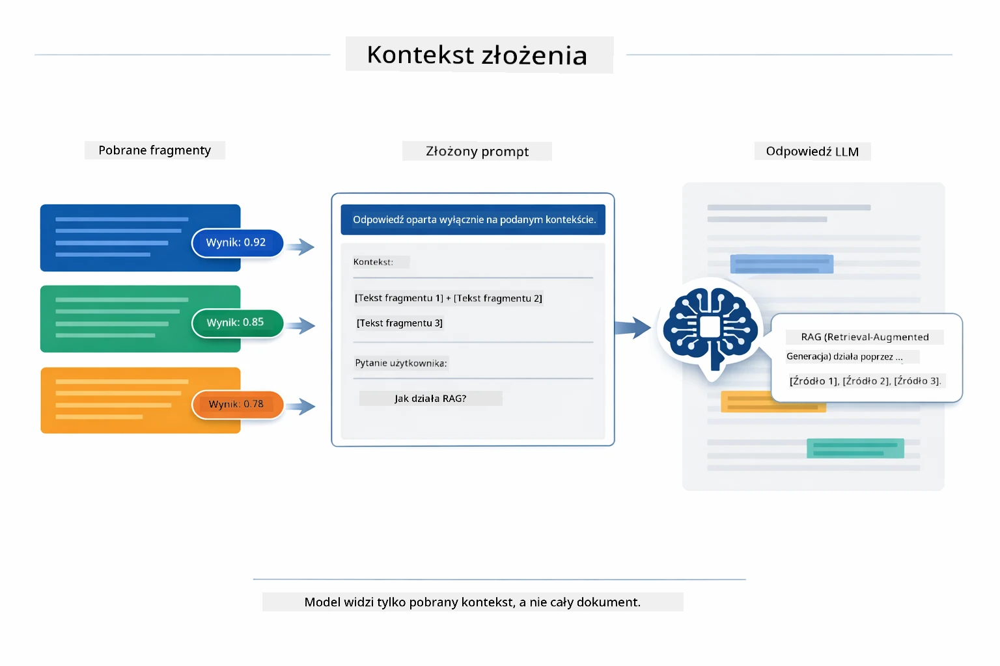

*Ten diagram pokazuje, jak fragmenty o najwyższej punktacji są zestawiane w ustrukturyzowaną podpowiedź, pozwalając modelowi generować ugruntowaną odpowiedź na podstawie Twoich danych.*

## Uruchomienie Aplikacji

**Zweryfikuj wdrożenie:**

Upewnij się, że plik `.env` istnieje w katalogu głównym z poświadczeniami Azure (utworzony podczas Modułu 01):

**Bash:**
```bash
cat ../.env  # Powinno wyświetlać AZURE_OPENAI_ENDPOINT, API_KEY, DEPLOYMENT
```

**PowerShell:**
```powershell
Get-Content ..\.env  # Powinno wyświetlać AZURE_OPENAI_ENDPOINT, API_KEY, DEPLOYMENT
```

**Uruchom aplikację:**

> **Uwaga:** Jeśli uruchomiłeś już wszystkie aplikacje za pomocą `./start-all.sh` z Modułu 01, ten moduł działa już na porcie 8081. Możesz pominąć poniższe polecenia uruchomienia i przejść bezpośrednio do http://localhost:8081.

**Opcja 1: Korzystanie z Spring Boot Dashboard (zalecane dla użytkowników VS Code)**

Kontener deweloperski zawiera rozszerzenie Spring Boot Dashboard, które zapewnia graficzny interfejs do zarządzania wszystkimi aplikacjami Spring Boot. Znajdziesz je na pasku aktywności po lewej stronie VS Code (szukaj ikony Spring Boot).

W Spring Boot Dashboard możesz:
- Zobaczyć wszystkie dostępne aplikacje Spring Boot w obszarze roboczym
- Uruchamiać/wyłączać aplikacje jednym kliknięciem
- Podglądać logi aplikacji w czasie rzeczywistym
- Monitorować status aplikacji

Wystarczy kliknąć przycisk odtwarzania obok "rag", aby uruchomić ten moduł lub uruchomić wszystkie moduły naraz.


*Ten zrzut ekranu pokazuje Spring Boot Dashboard w VS Code, gdzie możesz wizualnie uruchamiać, wyłączać i monitorować aplikacje.*

**Opcja 2: Korzystanie ze skryptów powłoki**

Uruchom wszystkie aplikacje webowe (moduły 01-04):

**Bash:**
```bash
cd ..  # Z katalogu głównego
./start-all.sh
```

**PowerShell:**
```powershell
cd ..  # Z katalogu głównego
.\start-all.ps1
```

Lub uruchom tylko ten moduł:

**Bash:**
```bash
cd 03-rag
./start.sh
```

**PowerShell:**
```powershell
cd 03-rag
.\start.ps1
```

Oba skrypty automatycznie ładują zmienne środowiskowe z pliku `.env` w katalogu głównym i zbudują pliki JAR, jeśli jeszcze nie istnieją.

> **Uwaga:** Jeśli wolisz zbudować wszystkie moduły ręcznie przed uruchomieniem:
>
> **Bash:**
> ```bash
> cd ..  # Go to root directory
> mvn clean package -DskipTests
> ```
>
> **PowerShell:**
> ```powershell
> cd ..  # Go to root directory
> mvn clean package -DskipTests
> ```

Otwórz http://localhost:8081 w przeglądarce.

**Aby zatrzymać:**

**Bash:**
```bash
./stop.sh  # Tylko ten moduł
# Lub
cd .. && ./stop-all.sh  # Wszystkie moduły
```

**PowerShell:**
```powershell
.\stop.ps1  # Tylko ten moduł
# Lub
cd ..; .\stop-all.ps1  # Wszystkie moduły
```

## Korzystanie z Aplikacji

Aplikacja oferuje interfejs internetowy do przesyłania dokumentów i zadawania pytań.

<a href="images/rag-homepage.png"></a>

*Ten zrzut ekranu pokazuje interfejs aplikacji RAG, gdzie przesyłasz dokumenty i zadajesz pytania.*

### Prześlij Dokument

Zacznij od przesłania dokumentu — pliki TXT działają najlepiej do testów. W tym katalogu znajduje się plik `sample-document.txt`, który zawiera informacje o funkcjach LangChain4j, implementacji RAG i najlepszych praktykach — idealny do testowania systemu.

System przetwarza Twój dokument, dzieli go na fragmenty i tworzy osadzenia dla każdego fragmentu. Dzieje się to automatycznie po przesłaniu.

### Zadawaj Pytania

Teraz zadawaj konkretne pytania dotyczące zawartości dokumentu. Wypróbuj coś faktograficznego, co jest jasno powiedziane w dokumencie. System wyszukuje odpowiednie fragmenty, dołącza je do podpowiedzi i generuje odpowiedź.

### Sprawdź Źródła

Zauważ, że każda odpowiedź zawiera odniesienia do źródeł z wynikami podobieństwa. Te wyniki (od 0 do 1) pokazują, jak bardzo każdy fragment był powiązany z pytaniem. Wyższe wyniki oznaczają lepsze dopasowania. To pozwala Ci zweryfikować odpowiedź w odniesieniu do materiału źródłowego.

<a href="images/rag-query-results.png"></a>

*Ten zrzut ekranu pokazuje wyniki zapytania z wygenerowaną odpowiedzią, odniesieniami źródeł i wynikami trafności dla każdego pobranego fragmentu.*

### Eksperymentuj z Pytaniami

Wypróbuj różne typy pytań:
- Konkretne fakty: "Jaki jest główny temat?"
- Porównania: "Jaka jest różnica między X a Y?"
- Podsumowania: "Podsumuj kluczowe punkty dotyczące Z"

Obserwuj, jak zmieniają się wyniki trafności w zależności od zgodności pytania z zawartością dokumentu.

## Kluczowe Pojęcia

### Strategia Dzielenia na Fragmenty

Dokumenty dzieli się na fragmenty po 300 tokenów z nakładką 30 tokenów. Ten balans zapewnia, że każdy fragment ma wystarczający kontekst, by być znaczący, a jednocześnie pozostaje na tyle mały, by można było zmieścić wiele fragmentów w podpowiedzi.

### Wyniki Podobieństwa

Każdy pobrany fragment ma wynik podobieństwa w zakresie od 0 do 1, który wskazuje, jak ściśle odpowiada pytaniu użytkownika. Poniższy diagram wizualizuje zakresy wyników i sposób, w jaki system je wykorzystuje do filtrowania wyników:

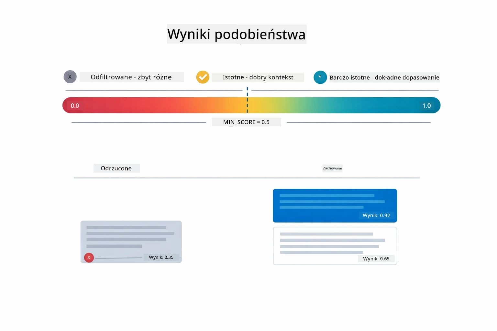

*Ten diagram pokazuje zakresy wyników od 0 do 1, z minimalnym progiem 0.5, który filtruje nieistotne fragmenty.*

Wyniki mieszczą się w zakresie 0 do 1:
- 0.7-1.0: Bardzo istotne, dokładne dopasowanie
- 0.5-0.7: Istotne, dobry kontekst
- Poniżej 0.5: Odfiltrowane, zbyt różne

System pobiera tylko fragmenty powyżej minimalnego progu, aby zapewnić jakość.

Osadzenia dobrze działają, gdy znaczenie jest wyraźnie zgrupowane, ale mają swoje ograniczenia. Poniższy diagram prezentuje typowe tryby niepowodzeń — zbyt duże fragmenty dają niejasne wektory, zbyt małe fragmenty nie mają kontekstu, niejednoznaczne terminy wskazują na wiele grup, a wyszukiwania wg dokładnego dopasowania (ID, numery części) nie działają wcale z osadzeniami:

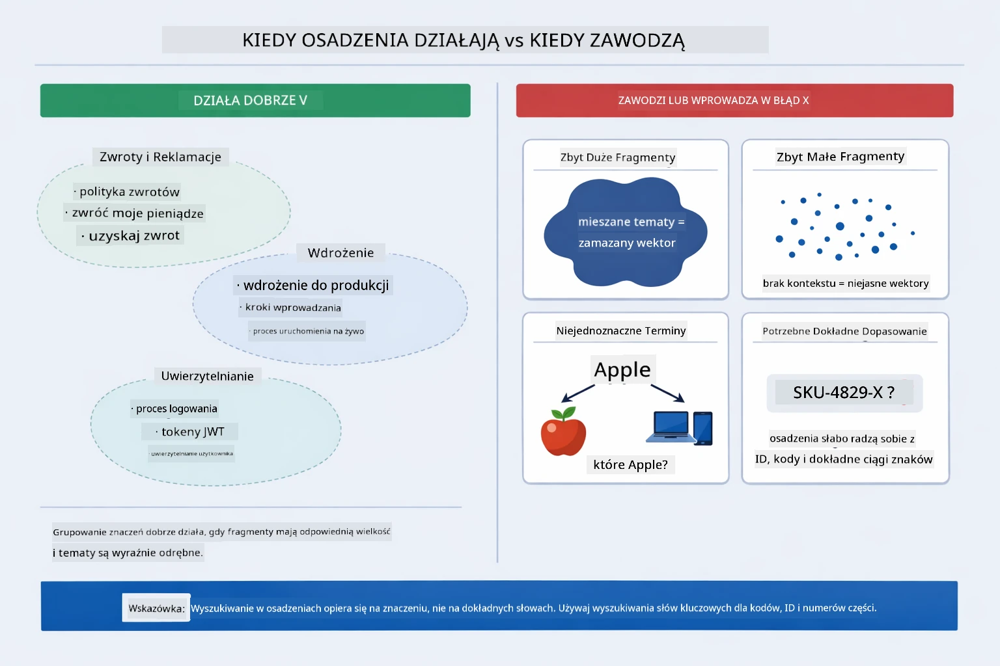

*Ten diagram pokazuje typowe tryby niepowodzeń osadzeń: zbyt duże fragmenty, zbyt małe fragmenty, niejednoznaczne terminy wskazujące na wiele grup oraz wyszukiwania oparte na dokładnym dopasowaniu, takie jak ID.*

### Pamięć w RAM

Ten moduł używa pamięci operacyjnej do przechowywania danych dla uproszczenia. Po restarcie aplikacji przesłane dokumenty są tracone. Systemy produkcyjne korzystają z trwałych baz danych wektorowych, takich jak Qdrant lub Azure AI Search.

### Zarządzanie Okienkiem Kontekstu

Każdy model ma maksymalną wielkość okienka kontekstu. Nie można do podpowiedzi dołączyć wszystkich fragmentów dużego dokumentu. System pobiera N najistotniejszych fragmentów (domyślnie 5), żeby zmieścić się w limitach, zapewniając jednocześnie wystarczający kontekst do precyzyjnych odpowiedzi.

## Kiedy RAG Ma Znaczenie

RAG nie zawsze jest właściwym podejściem. Poniższy przewodnik pomoże zdecydować, kiedy RAG dodaje wartość, a kiedy wystarczą prostsze metody — na przykład dołączanie treści bezpośrednio do podpowiedzi lub opieranie się na wbudowanej wiedzy modelu:

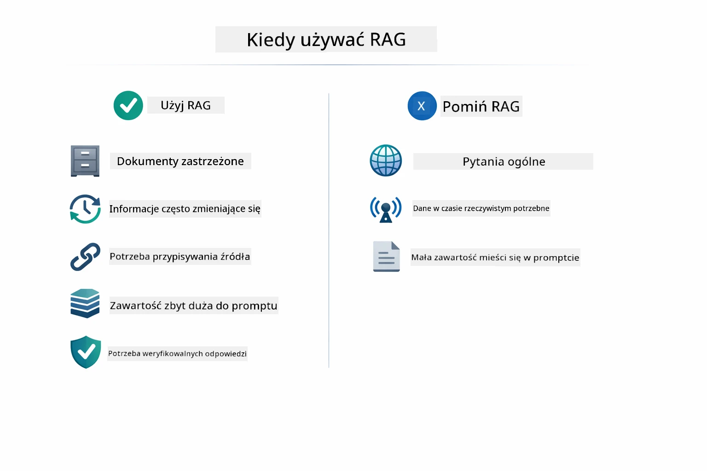

*Ten diagram pokazuje przewodnik decyzyjny, kiedy RAG dodaje wartość, a kiedy wystarczą prostsze metody.*

**Używaj RAG, gdy:**
- Odpowiadasz na pytania o dokumenty zastrzeżone
- Informacje często się zmieniają (polityki, ceny, specyfikacje)
- Dokładność wymaga podania źródła
- Treść jest zbyt duża, by zmieścić się w jednej podpowiedzi
- Potrzebujesz weryfikowalnych, ugruntowanych odpowiedzi

**Nie używaj RAG, gdy:**
- Pytania wymagają ogólnej wiedzy, którą model już posiada
- Potrzebne są dane w czasie rzeczywistym (RAG działa na przesłanych dokumentach)
- Treść jest na tyle mała, by można ją było bezpośrednio dołączyć do podpowiedzi

## Kolejne Kroki

**Następny Moduł:** [04-tools - Agenci AI z narzędziami](../04-tools/README.md)

---

**Nawigacja:** [← Poprzedni: Moduł 02 - Inżynieria Podpowiedzi](../02-prompt-engineering/README.md) | [Powrót do głównego](../README.md) | [Następny: Moduł 04 - Narzędzia →](../04-tools/README.md)

---

<!-- CO-OP TRANSLATOR DISCLAIMER START -->
**Zastrzeżenie**:  
Dokument ten został przetłumaczony za pomocą usługi tłumaczeń AI [Co-op Translator](https://github.com/Azure/co-op-translator). Choć dążymy do dokładności, prosimy pamiętać, że automatyczne tłumaczenia mogą zawierać błędy lub niedokładności. Oryginalny dokument w języku źródłowym należy uważać za wiążące źródło informacji. W przypadku istotnych informacji zaleca się skorzystanie z profesjonalnego tłumaczenia wykonanego przez człowieka. Nie ponosimy odpowiedzialności za jakiekolwiek nieporozumienia lub błędne interpretacje wynikające z korzystania z tego tłumaczenia.
<!-- CO-OP TRANSLATOR DISCLAIMER END -->