# Moduł 04: Agent AI z narzędziami

## Spis treści

- [Czego się nauczysz](../../../04-tools)
- [Wymagania wstępne](../../../04-tools)
- [Zrozumienie agentów AI z narzędziami](../../../04-tools)
- [Jak działa wywoływanie narzędzi](../../../04-tools)
  - [Definicje narzędzi](../../../04-tools)
  - [Podejmowanie decyzji](../../../04-tools)
  - [Wykonanie](../../../04-tools)
  - [Generowanie odpowiedzi](../../../04-tools)
  - [Architektura: Spring Boot Auto-Wiring](../../../04-tools)
- [Łańcuchowanie narzędzi](../../../04-tools)
- [Uruchom aplikację](../../../04-tools)
- [Korzystanie z aplikacji](../../../04-tools)
  - [Wypróbuj proste użycie narzędzia](../../../04-tools)
  - [Przetestuj łańcuchowanie narzędzi](../../../04-tools)
  - [Zobacz przepływ rozmowy](../../../04-tools)
  - [Eksperymentuj z różnymi zapytaniami](../../../04-tools)
- [Kluczowe koncepcje](../../../04-tools)
  - [Wzorzec ReAct (Reasoning and Acting)](../../../04-tools)
  - [Znaczenie opisów narzędzi](../../../04-tools)
  - [Zarządzanie sesjami](../../../04-tools)
  - [Obsługa błędów](../../../04-tools)
- [Dostępne narzędzia](../../../04-tools)
- [Kiedy używać agentów opartych na narzędziach](../../../04-tools)
- [Narzędzia a RAG](../../../04-tools)
- [Kolejne kroki](../../../04-tools)

## Czego się nauczysz

Do tej pory nauczyłeś się prowadzić rozmowy z AI, skutecznie strukturyzować prompt oraz opierać odpowiedzi na Twoich dokumentach. Wciąż jednak istnieje fundamentalne ograniczenie: modele językowe mogą generować tylko tekst. Nie mogą sprawdzać pogody, wykonywać obliczeń, zapytywać baz danych ani komunikować się z systemami zewnętrznymi.

Narzędzia to zmieniają. Dając modelowi dostęp do funkcji, które może wywoływać, przekształcasz go z generatora tekstu w agenta zdolnego do działania. Model decyduje, kiedy potrzebuje narzędzia, którego narzędzia użyć i jakie parametry przekazać. Twój kod wykonuje funkcję i zwraca wynik. Model włącza ten wynik do swojej odpowiedzi.

## Wymagania wstępne

- Ukończony [Moduł 01 - Wprowadzenie](../01-introduction/README.md) (wdrożone zasoby Azure OpenAI)
- Zaleca się ukończenie poprzednich modułów (ten moduł odwołuje się do [koncepcji RAG z Modułu 03](../03-rag/README.md) w porównaniu Narzędzia vs RAG)
- Plik `.env` w katalogu głównym z danymi dostępowymi Azure (utworzony przez `azd up` w Moduł 01)

> **Uwaga:** Jeśli nie ukończyłeś Modułu 01, najpierw wykonaj tam instrukcje wdrożeniowe.

## Zrozumienie agentów AI z narzędziami

> **📝 Uwaga:** Termin "agenci" w tym module odnosi się do asystentów AI rozszerzonych o możliwość wywoływania narzędzi. Różni się to od wzorców **Agentic AI** (agentów autonomicznych z planowaniem, pamięcią i rozumowaniem wieloetapowym), które omówimy w [Moduł 05: MCP](../05-mcp/README.md).

Bez narzędzi model językowy może generować tylko tekst na podstawie danych treningowych. Zapytaj o aktualną pogodę, a będzie musiał zgadywać. Daj mu narzędzia, a będzie wywoływał API pogodowe, wykonywał obliczenia lub zapytywał bazę danych — a następnie wplata te prawdziwe wyniki w odpowiedź.

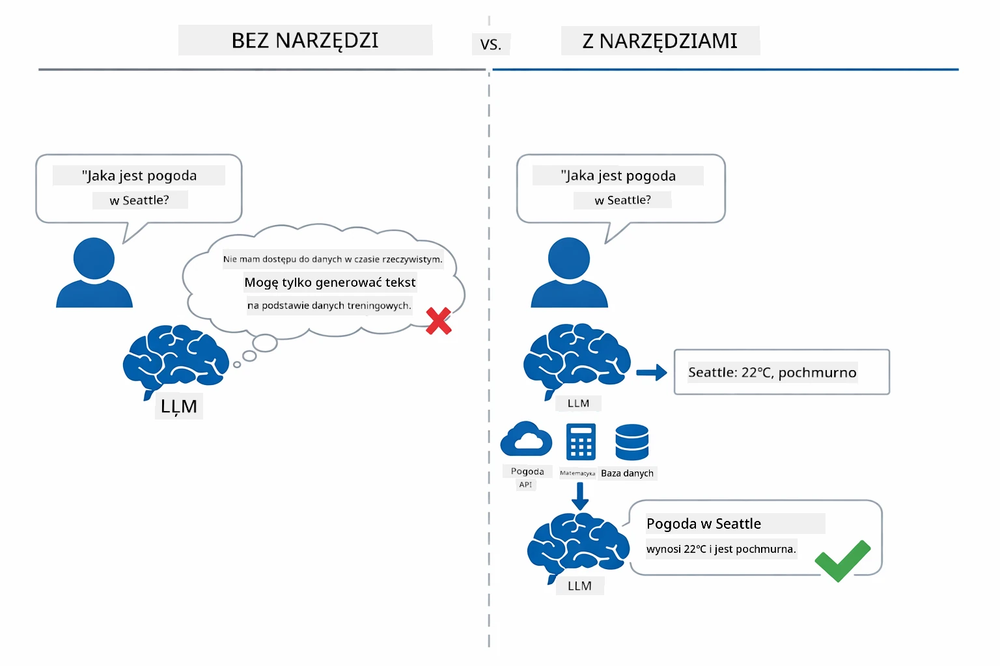

*Bez narzędzi model tylko zgaduje — z narzędziami może wywoływać API, wykonywać obliczenia i zwracać dane w czasie rzeczywistym.*

Agent AI z narzędziami stosuje wzorzec **Reasoning and Acting (ReAct)**. Model nie tylko odpowiada — zastanawia się, czego potrzebuje, działa wywołując narzędzie, obserwuje wynik, a następnie decyduje, czy działać dalej, czy dostarczyć ostateczną odpowiedź:

1. **Reason (Rozumowanie)** — Agent analizuje pytanie użytkownika i określa, jakich informacji potrzebuje
2. **Act (Działanie)** — Agent wybiera odpowiednie narzędzie, generuje właściwe parametry i wywołuje je
3. **Observe (Obserwacja)** — Agent otrzymuje wynik narzędzia i ocenia rezultat
4. **Repeat or Respond (Powtórz lub odpowiedz)** — Jeśli potrzeba więcej danych, powraca do kroku 1; w przeciwnym razie tworzy odpowiedź w języku naturalnym

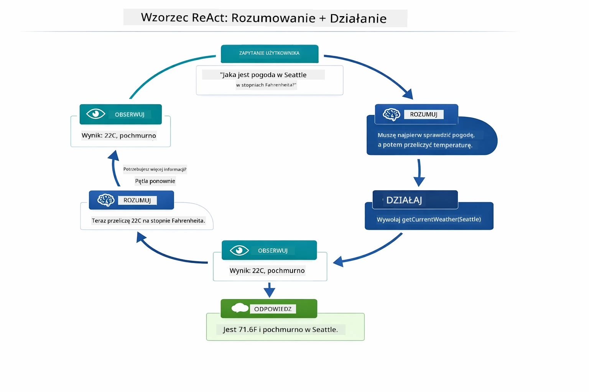

*Cykl ReAct — agent rozumuje, co zrobić, działa poprzez wywołanie narzędzia, obserwuje wynik i powtarza, aż może dostarczyć odpowiedź.*

Dzieje się to automatycznie. Definiujesz narzędzia i ich opisy. Model sam podejmuje decyzje, kiedy i jak ich użyć.

## Jak działa wywoływanie narzędzi

### Definicje narzędzi

[WeatherTool.java](../../../04-tools/src/main/java/com/example/langchain4j/agents/tools/WeatherTool.java) | [TemperatureTool.java](../../../04-tools/src/main/java/com/example/langchain4j/agents/tools/TemperatureTool.java)

Definiujesz funkcje z jasnymi opisami i specyfikacją parametrów. Model widzi te opisy w systemowym prompt i rozumie, co robi każde narzędzie.

```java
@Component
public class WeatherTool {
    
    @Tool("Get the current weather for a location")
    public String getCurrentWeather(@P("Location name") String location) {
        // Twoja logika wyszukiwania pogody
        return "Weather in " + location + ": 22°C, cloudy";
    }
}

@AiService
public interface Assistant {
    String chat(@MemoryId String sessionId, @UserMessage String message);
}

// Asystent jest automatycznie podłączany przez Spring Boot do:
// - beana ChatModel
// - Wszystkich metod @Tool z klas oznaczonych @Component
// - ChatMemoryProvider do zarządzania sesją
```

Poniższy diagram rozbija każdą adnotację i pokazuje, jak każdy element pomaga AI zrozumieć, kiedy wywołać narzędzie i jakie argumenty przekazać:

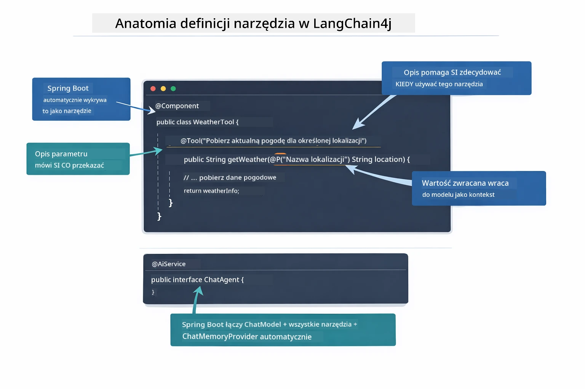

*Budowa definicji narzędzia — @Tool mówi AI, kiedy go użyć, @P opisuje każdy parametr, a @AiService łączy wszystko razem przy starcie.*

> **🤖 Wypróbuj z [GitHub Copilot](https://github.com/features/copilot) Chat:** Otwórz [`WeatherTool.java`](../../../04-tools/src/main/java/com/example/langchain4j/agents/tools/WeatherTool.java) i zapytaj:
> - "Jak zintegrować prawdziwe API pogodowe, np. OpenWeatherMap, zamiast danych demo?"
> - "Co sprawia, że dobry opis narzędzia pomaga AI prawidłowo je używać?"
> - "Jak obsługiwać błędy API i limity zapytań w implementacji narzędzi?"

### Podejmowanie decyzji

Kiedy użytkownik pyta „Jaka jest pogoda w Seattle?”, model nie losowo wybiera narzędzie. Porównuje intencję użytkownika z opisami wszystkich dostępnych narzędzi, ocenia ich trafność i wybiera najlepsze dopasowanie. Następnie generuje ustrukturyzowane wywołanie funkcji z właściwymi parametrami — w tym przypadku ustawia `location` na `"Seattle"`.

Jeśli żadne narzędzie nie pasuje do zapytania użytkownika, model odpowiada na podstawie własnej wiedzy. Jeśli pasuje kilka narzędzi, wybiera to najbardziej specyficzne.

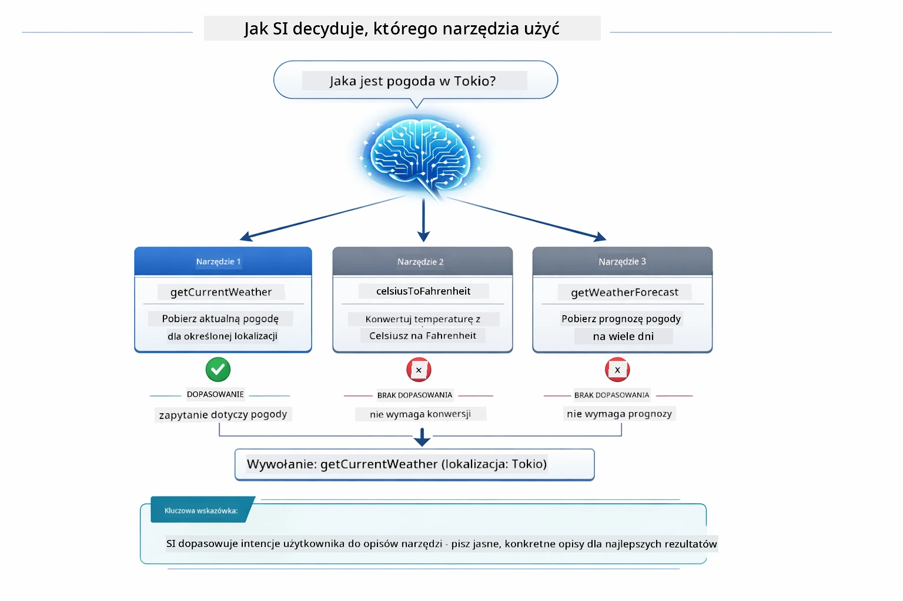

*Model ocenia każde dostępne narzędzie pod kątem intencji użytkownika i wybiera najlepsze dopasowanie — dlatego ważne jest pisanie jasnych, precyzyjnych opisów narzędzi.*

### Wykonanie

[AgentService.java](../../../04-tools/src/main/java/com/example/langchain4j/agents/service/AgentService.java)

Spring Boot automatycznie łączy deklaratywny interfejs `@AiService` ze wszystkimi zarejestrowanymi narzędziami, a LangChain4j wykonuje wywołania narzędzi automatycznie. W tle pełne wywołanie narzędzia przechodzi przez sześć etapów — od pytania użytkownika w języku naturalnym po odpowiedź naturalną:

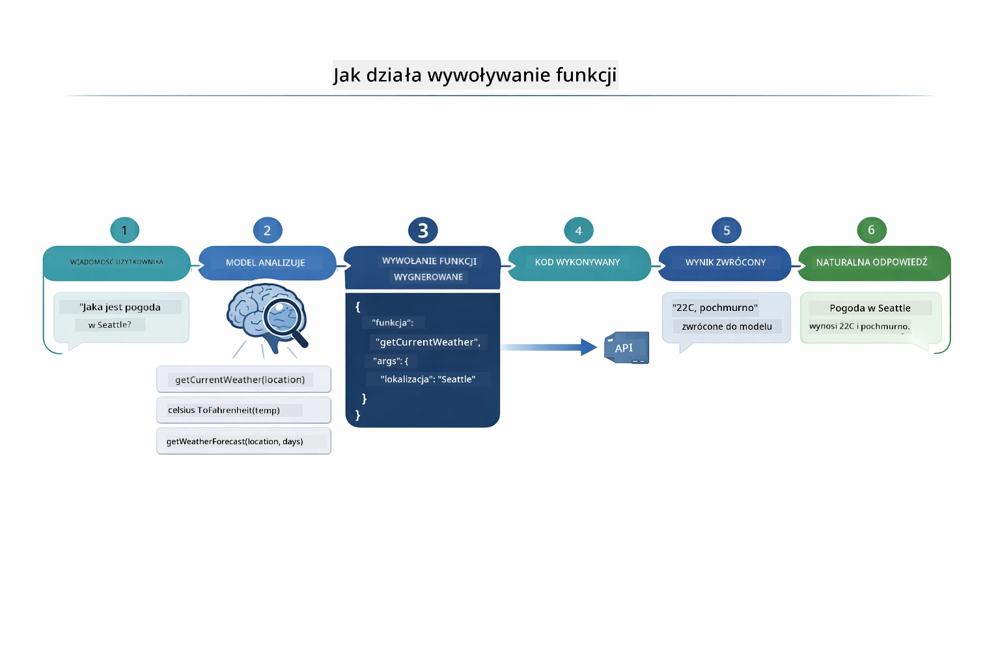

*Pełny przebieg — użytkownik zadaje pytanie, model wybiera narzędzie, LangChain4j je wykonuje, a model wplata wynik w naturalną odpowiedź.*

Jeżeli uruchomiłeś [ToolIntegrationDemo](../../../00-quick-start/src/main/java/com/example/langchain4j/quickstart/ToolIntegrationDemo.java) w Moduł 00, już widziałeś ten wzorzec w działaniu — narzędzia `Calculator` były wywoływane w ten sam sposób. Poniższy diagram sekwencji pokazuje dokładnie, co się działo pod spodem podczas tego demo:

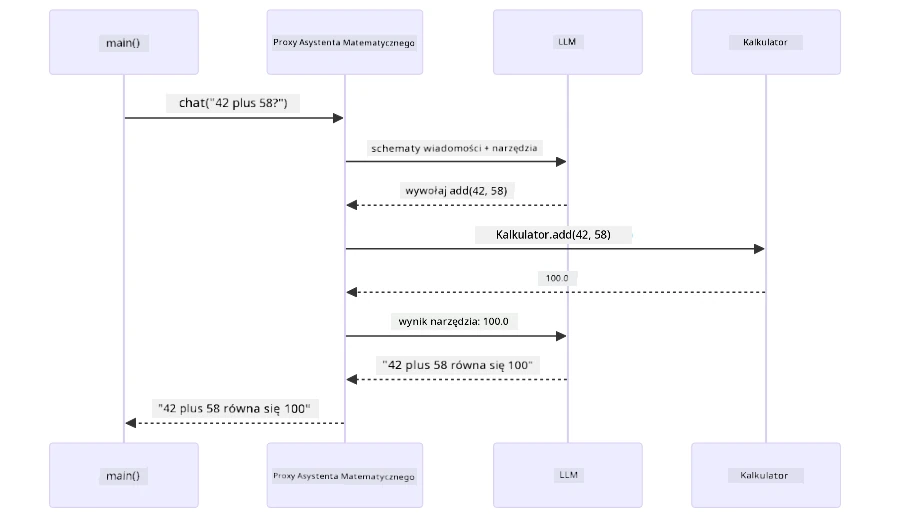

*Pętla wywoływania narzędzi z demo Quick Start — `AiServices` wysyła wiadomość i schematy narzędzi do LLM, LLM odpowiada wywołaniem funkcji np. `add(42, 58)`, LangChain4j wykonuje lokalnie metodę `Calculator`, a wynik trafia z powrotem jako ostateczna odpowiedź.*

> **🤖 Wypróbuj z [GitHub Copilot](https://github.com/features/copilot) Chat:** Otwórz [`AgentService.java`](../../../04-tools/src/main/java/com/example/langchain4j/agents/service/AgentService.java) i zapytaj:
> - "Jak działa wzorzec ReAct i dlaczego jest skuteczny dla agentów AI?"
> - "Jak agent decyduje, którego narzędzia użyć i w jakiej kolejności?"
> - "Co się dzieje, gdy wywołanie narzędzia zawiedzie — jak solidnie obsługiwać błędy?"

### Generowanie odpowiedzi

Model otrzymuje dane pogodowe i formatuje je do naturalnej odpowiedzi dla użytkownika.

### Architektura: Spring Boot Auto-Wiring

Ten moduł używa integracji LangChain4j ze Spring Boot za pomocą deklaratywnych interfejsów `@AiService`. Przy starcie Spring Boot wykrywa każdy `@Component`, który zawiera metody `@Tool`, Twój bean `ChatModel` i `ChatMemoryProvider` — po czym łączy je w pojedynczy interfejs `Assistant` bez zbędnego kodu.

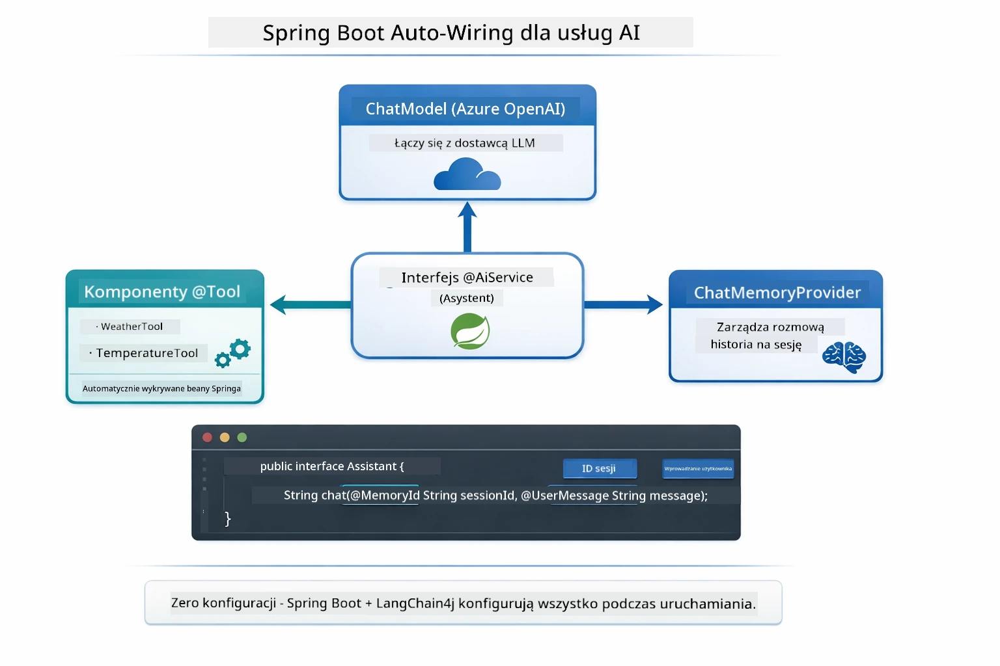

*Interfejs @AiService łączy ChatModel, komponenty narzędzi i dostawcę pamięci — Spring Boot automatycznie zajmuje się wszystkim okablowaniem.*

Oto pełna ścieżka realizacji żądania jako diagram sekwencji — od żądania HTTP przez kontroler, serwis i auto-wired proxy aż do wykonania narzędzia i z powrotem:

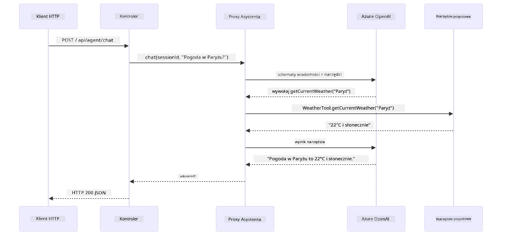

*Pełny przebieg żądania Spring Boot — HTTP przechodzi przez kontroler i serwis do auto-wired proxy Asystenta, który automatycznie orkiestruje LLM i wywołania narzędzi.*

Kluczowe zalety tego podejścia:

- **Spring Boot auto-wiring** — automatyczne wstrzykiwanie ChatModel i narzędzi
- **Wzorzec @MemoryId** — automatyczne zarządzanie pamięcią sesji
- **Pojedyncza instancja** — Asystent tworzony jednokrotnie i ponownie używany dla lepszej wydajności
- **Wykonanie bezpieczne typowo** — metody Javy wywoływane bezpośrednio z konwersją typów
- **Orkiestracja wieloetapowa** — automatyczne obsługiwanie łańcuchowania narzędzi
- **Zero boilerplate** — brak ręcznych wywołań `AiServices.builder()` czy HashMap pamięci

Alternatywne podejścia (ręczny `AiServices.builder()`) wymagają więcej kodu i nie korzystają z zalet integracji Spring Boot.

## Łańcuchowanie narzędzi

**Łańcuchowanie narzędzi** — Prawdziwa moc agentów opartych na narzędziach ujawnia się, gdy pojedyncze pytanie wymaga wielu narzędzi. Zapytaj „Jaka jest pogoda w Seattle w stopniach Fahrenheita?” i agent automatycznie łączy dwa narzędzia: najpierw wywołuje `getCurrentWeather` aby uzyskać temperaturę w stopniach Celsjusza, potem przekazuje tę wartość do `celsiusToFahrenheit` w celu konwersji — wszystko w jednym przebiegu rozmowy.

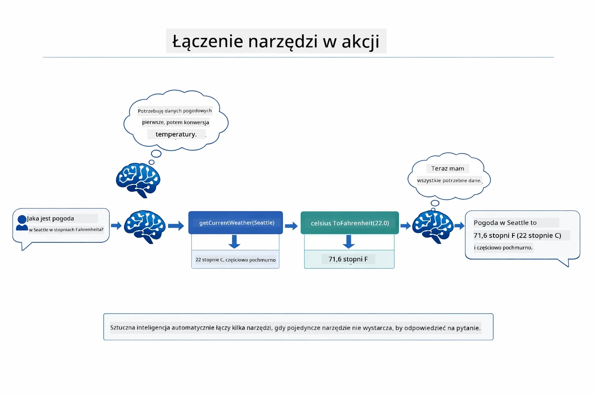

*Łańcuchowanie narzędzi w akcji — agent najpierw wywołuje getCurrentWeather, potem przekazuje wynik w Celsjuszach do celsiusToFahrenheit i dostarcza łączną odpowiedź.*

**Łagodne błędy** — Zapytaj o pogodę w mieście, którego nie ma w danych demo. Narzędzie zwraca komunikat o błędzie, a AI wyjaśnia, że nie może pomóc, zamiast zawieszać się. Narzędzia awariają bezpiecznie. Poniższy diagram kontrastuje dwa podejścia — przy poprawnej obsłudze błędów agent łapie wyjątek i odpowiada pomocnie, bez niej cała aplikacja się wyłącza:

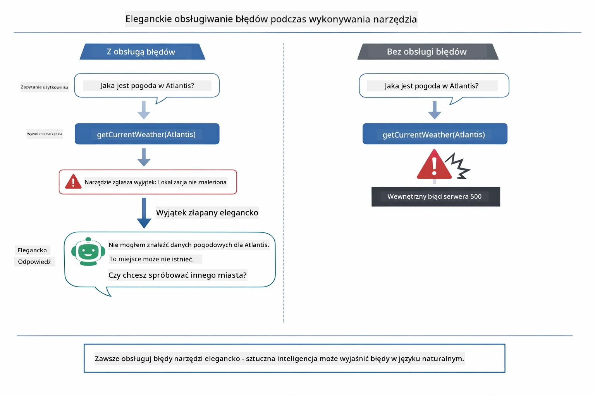

*Gdy narzędzie zawiedzie, agent łapie błąd i odpowiada pomocą zamiast wywalać aplikację.*

Dzieje się to w jednym przebiegu rozmowy. Agent samodzielnie orkiestruje wiele wywołań narzędzi.

## Uruchom aplikację

**Sprawdź wdrożenie:**

Upewnij się, że plik `.env` istnieje w katalogu głównym z danymi Azure (utworzony podczas Modułu 01). Uruchom poniższe z katalogu modułu (`04-tools/`):

**Bash:**
```bash
cat ../.env  # Powinno wyświetlać AZURE_OPENAI_ENDPOINT, API_KEY, DEPLOYMENT
```

**PowerShell:**
```powershell
Get-Content ..\.env  # Powinno pokazywać AZURE_OPENAI_ENDPOINT, API_KEY, DEPLOYMENT
```

**Uruchom aplikację:**

> **Uwaga:** Jeśli już uruchomiłeś wszystkie aplikacje poleceniem `./start-all.sh` z katalogu głównego (zgodnie z Modułem 01), ten moduł działa na porcie 8084. Możesz pominąć poniższe polecenia startowe i przejść bezpośrednio na http://localhost:8084.

**Opcja 1: Korzystanie z Spring Boot Dashboard (zalecane dla użytkowników VS Code)**

Dev container zawiera rozszerzenie Spring Boot Dashboard, które zapewnia wizualny interfejs do zarządzania wszystkimi aplikacjami Spring Boot. Znajdziesz je w pasku aktywności po lewej stronie VS Code (ikona Spring Boot).

Z poziomu Spring Boot Dashboard możesz:
- Zobaczyć wszystkie dostępne aplikacje Spring Boot w workspace
- Uruchamiać/zatrzymywać aplikacje jednym kliknięciem
- Podglądać logi aplikacji w czasie rzeczywistym
- Monitorować status aplikacji

Wystarczy kliknąć przycisk uruchomienia obok „tools” aby uruchomić ten moduł lub uruchomić wszystkie moduły naraz.

Tak wygląda Spring Boot Dashboard w VS Code:


*Spring Boot Dashboard w VS Code — uruchamiaj, zatrzymuj i monitoruj wszystkie moduły z jednego miejsca*

**Opcja 2: Korzystanie z skryptów shell**

Uruchom wszystkie aplikacje webowe (moduły 01-04):

**Bash:**
```bash
cd ..  # Z katalogu głównego
./start-all.sh
```

**PowerShell:**
```powershell
cd ..  # Z katalogu głównego
.\start-all.ps1
```

Lub uruchom tylko ten moduł:

**Bash:**
```bash
cd 04-tools
./start.sh
```

**PowerShell:**
```powershell
cd 04-tools
.\start.ps1
```

Oba skrypty automatycznie ładują zmienne środowiskowe z głównego pliku `.env` i zbudują pliki JAR, jeśli ich nie ma.

> **Uwaga:** Jeśli wolisz zbudować wszystkie moduły ręcznie przed uruchomieniem:
>
> **Bash:**
> ```bash
> cd ..  # Go to root directory
> mvn clean package -DskipTests
> ```
>
> **PowerShell:**
> ```powershell
> cd ..  # Go to root directory
> mvn clean package -DskipTests
> ```

Otwórz w przeglądarce http://localhost:8084.

**Aby zatrzymać:**

**Bash:**
```bash
./stop.sh  # Tylko ten moduł
# Lub
cd .. && ./stop-all.sh  # Wszystkie moduły
```

**PowerShell:**
```powershell
.\stop.ps1  # Tylko ten moduł
# Lub
cd ..; .\stop-all.ps1  # Wszystkie moduły
```

## Korzystanie z aplikacji

Aplikacja udostępnia interfejs internetowy, gdzie możesz rozmawiać z agentem AI, który ma dostęp do narzędzi pogodowych i do konwersji temperatur. Tak wygląda interfejs — zawiera przykłady szybkiego startu oraz panel czatu do wysyłania zapytań:

<a href="images/tools-homepage.png"></a>

*Interfejs narzędzi AI - szybkie przykłady i panel czatu do interakcji z narzędziami*

### Wypróbuj proste użycie narzędzi

Zacznij od prostego zapytania: "Przelicz 100 stopni Fahrenheita na Celsjusza". Agent rozpoznaje, że potrzebuje narzędzia do konwersji temperatury, wywołuje je z odpowiednimi parametrami i zwraca wynik. Zauważ, jak naturalne to się wydaje - nie określałeś, którego narzędzia użyć ani jak je wywołać.

### Przetestuj łączenie narzędzi

Teraz spróbuj czegoś bardziej skomplikowanego: "Jaka jest pogoda w Seattle i przelicz ją na Fahrenheita?" Obserwuj, jak agent działa krok po kroku. Najpierw pobiera pogodę (która zwraca stopnie Celsjusza), rozpoznaje potrzebę konwersji na Fahrenheita, wywołuje narzędzie konwersji i łączy oba wyniki w jedną odpowiedź.

### Zobacz przepływ rozmowy

Panel czatu przechowuje historię konwersacji, pozwalając na wielokrotne wymiany. Możesz zobaczyć wszystkie wcześniejsze zapytania i odpowiedzi, co ułatwia śledzenie rozmowy i rozumienie, jak agent buduje kontekst na podstawie wielu wymian.

<a href="images/tools-conversation-demo.png"></a>

*Wielokrotna rozmowa pokazująca proste konwersje, sprawdzanie pogody i łączenie narzędzi*

### Eksperymentuj z różnymi zapytaniami

Wypróbuj różne kombinacje:
- Sprawdzanie pogody: "Jaka jest pogoda w Tokio?"
- Konwersje temperatur: "Ile to 25°C w kelwinach?"
- Zapytania łączone: "Sprawdź pogodę w Paryżu i powiedz, czy jest powyżej 20°C"

Zauważ, jak agent interpretuje język naturalny i mapuje go na odpowiednie wywołania narzędzi.

## Kluczowe koncepcje

### Wzorzec ReAct (Rozumowanie i Działanie)

Agent na przemian rozważa (decyduje, co zrobić) i działa (używa narzędzi). Ten wzorzec pozwala na autonomiczne rozwiązywanie problemów zamiast tylko reagowania na polecenia.

### Opisy narzędzi mają znaczenie

Jakość opisów narzędzi wpływa bezpośrednio na to, jak dobrze agent je wykorzystuje. Jasne, konkretne opisy pomagają modelowi zrozumieć, kiedy i jak wywołać każde narzędzie.

### Zarządzanie sesją

Adnotacja `@MemoryId` umożliwia automatyczne zarządzanie pamięcią opartą na sesji. Każdy identyfikator sesji ma swoją własną instancję `ChatMemory` zarządzaną przez bean `ChatMemoryProvider`, więc wielu użytkowników może jednocześnie rozmawiać z agentem bez mieszania rozmów. Poniższy diagram pokazuje, jak wielu użytkowników jest kierowanych do izolowanych magazynów pamięci na podstawie ich identyfikatorów sesji:

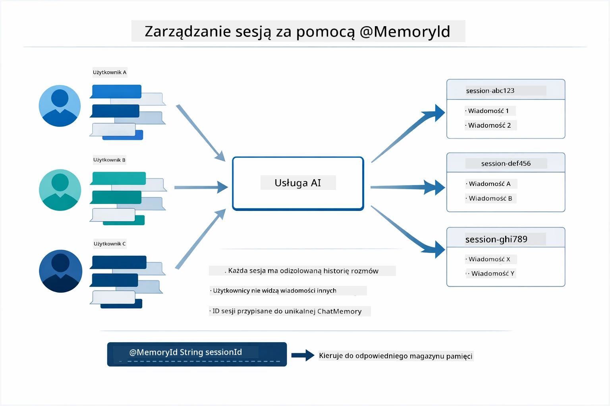

*Każdy identyfikator sesji mapowany jest na izolowaną historię rozmów — użytkownicy nigdy nie widzą wiadomości innych.*

### Obsługa błędów

Narzędzia mogą zawieść — API może przestać odpowiadać, parametry mogą być niewłaściwe, usługi zewnętrzne mogą nie działać. Agenci produkcyjni potrzebują obsługi błędów, by model mógł wyjaśnić problemy lub spróbować innych rozwiązań zamiast crashować całą aplikację. Gdy narzędzie rzuca wyjątek, LangChain4j go przechwytuje i zwraca komunikat o błędzie do modelu, który może potem wyjaśnić problem w języku naturalnym.

## Dostępne narzędzia

Poniższy diagram pokazuje szeroki ekosystem narzędzi, które możesz zbudować. Ten moduł demonstruje narzędzia do pogody i temperatury, ale ten sam wzorzec `@Tool` działa dla dowolnej metody Java — od zapytań do bazy danych po przetwarzanie płatności.

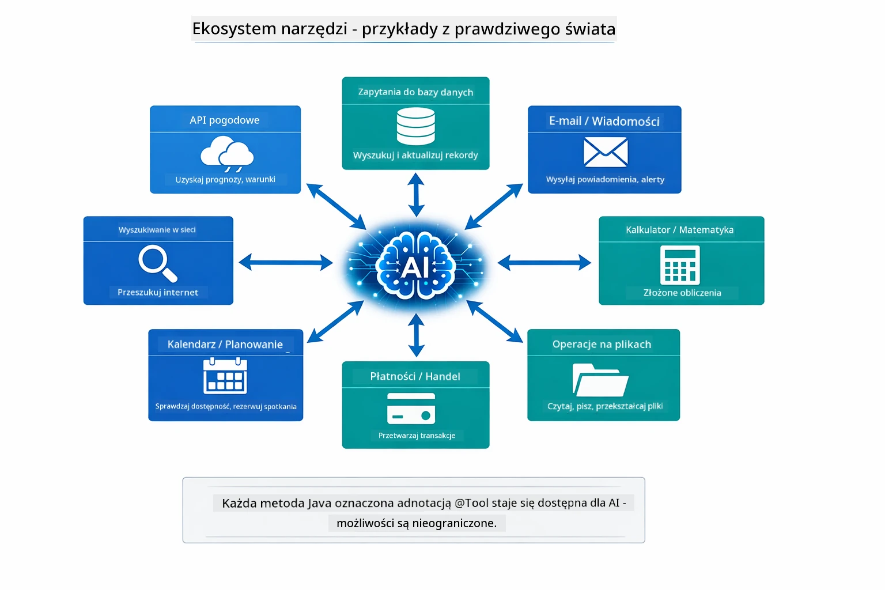

*Każda metoda Java oznaczona @Tool staje się dostępna dla AI — wzorzec rozszerza się na bazy danych, API, e-maile, operacje na plikach i więcej.*

## Kiedy używać agentów opartych na narzędziach

Nie każde zapytanie wymaga narzędzi. Decyzja zależy od tego, czy AI musi współdziałać z systemami zewnętrznymi, czy może odpowiedzieć na podstawie własnej wiedzy. Poniższy przewodnik podsumowuje, kiedy narzędzia są przydatne, a kiedy nie są potrzebne:

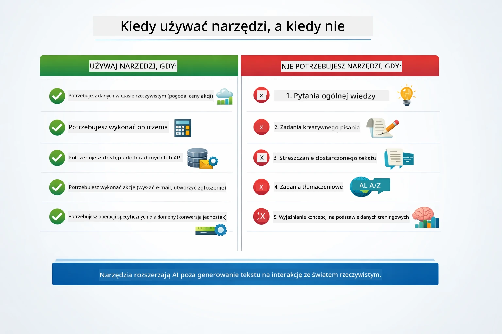

*Szybki przewodnik decyzyjny — narzędzia służą do danych w czasie rzeczywistym, obliczeń i działań; ogólna wiedza i zadania twórcze ich nie potrzebują.*

## Narzędzia a RAG

Moduły 03 i 04 rozszerzają możliwości AI, ale w zasadniczo różny sposób. RAG daje modelowi dostęp do **wiedzy** przez pobieranie dokumentów. Narzędzia umożliwiają modelowi wykonywanie **akcji** przez wywoływanie funkcji. Poniższy diagram porównuje te dwa podejścia, od sposobu działania do kompromisów między nimi:

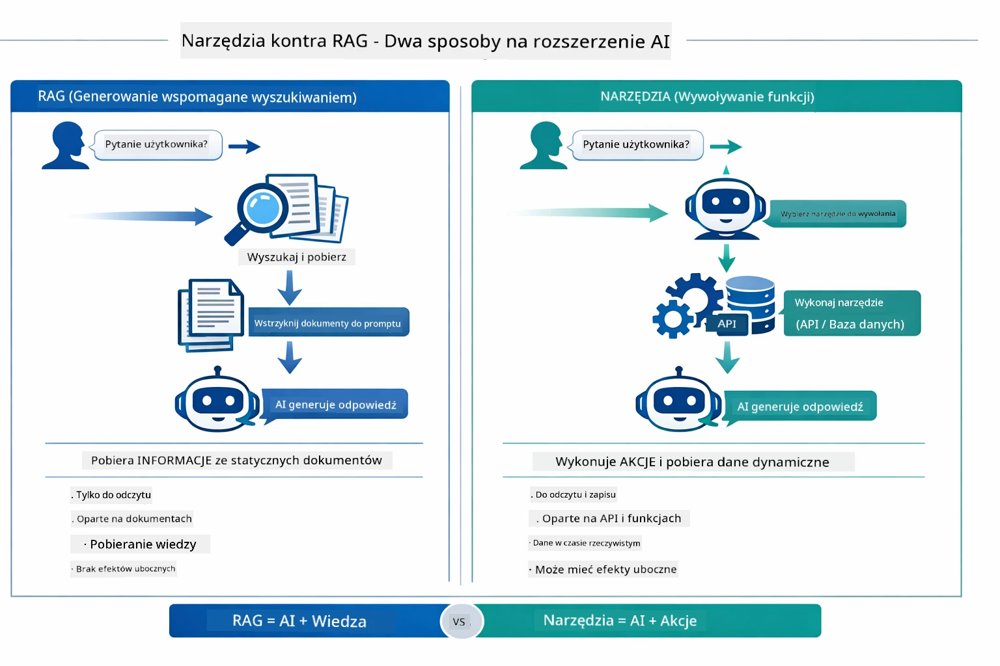

*RAG pobiera informacje z dokumentów statycznych — Narzędzia wykonują akcje i pobierają dane dynamiczne, w czasie rzeczywistym. Wiele systemów produkcyjnych łączy oba podejścia.*

W praktyce wiele systemów produkcyjnych łączy oba podejścia: RAG dla solidnej podstawy odpowiedzi w dokumentacji, oraz Narzędzia dla pobierania danych na żywo lub wykonywania operacji.

## Kolejne kroki

**Następny moduł:** [05-mcp - Model Context Protocol (MCP)](../05-mcp/README.md)

---

**Nawigacja:** [← Poprzedni: Moduł 03 - RAG](../03-rag/README.md) | [Powrót do głównego](../README.md) | [Następny: Moduł 05 - MCP →](../05-mcp/README.md)

---

<!-- CO-OP TRANSLATOR DISCLAIMER START -->
**Zastrzeżenie**:
Niniejszy dokument został przetłumaczony za pomocą usługi tłumaczenia AI [Co-op Translator](https://github.com/Azure/co-op-translator). Chociaż staramy się zapewnić dokładność, prosimy pamiętać, że tłumaczenia automatyczne mogą zawierać błędy lub nieścisłości. Oryginalny dokument w języku źródłowym powinien być uznawany za wiarygodne źródło. W przypadku informacji krytycznych zalecane jest skorzystanie z profesjonalnego tłumaczenia wykonywanego przez człowieka. Nie ponosimy odpowiedzialności za jakiekolwiek nieporozumienia lub błędne interpretacje wynikające z korzystania z tego tłumaczenia.
<!-- CO-OP TRANSLATOR DISCLAIMER END -->