# Moduł 05: Protokół Kontekstu Modelu (MCP)

## Spis treści

- [Przegląd wideo](../../../05-mcp)
- [Czego się nauczysz](../../../05-mcp)
- [Co to jest MCP?](../../../05-mcp)
- [Jak działa MCP](../../../05-mcp)
- [Moduł agentowy](../../../05-mcp)
- [Uruchamianie przykładów](../../../05-mcp)
  - [Wymagania wstępne](../../../05-mcp)
- [Szybki start](../../../05-mcp)
  - [Operacje na plikach (Stdio)](../../../05-mcp)
  - [Agent nadzorczy](../../../05-mcp)
    - [Uruchamianie demonstracji](../../../05-mcp)
    - [Jak działa agent nadzorczy](../../../05-mcp)
    - [Jak FileAgent odkrywa narzędzia MCP w czasie działania](../../../05-mcp)
    - [Strategie odpowiedzi](../../../05-mcp)
    - [Zrozumienie wyniku](../../../05-mcp)
    - [Wyjaśnienie funkcji modułu agentowego](../../../05-mcp)
- [Kluczowe pojęcia](../../../05-mcp)
- [Gratulacje!](../../../05-mcp)
  - [Co dalej?](../../../05-mcp)

## Przegląd wideo

Obejrzyj sesję na żywo wyjaśniającą, jak rozpocząć pracę z tym modułem:

<a href="https://www.youtube.com/watch?v=O_J30kZc0rw"></a>

## Czego się nauczysz

Zbudowałeś konwersacyjne AI, opanowałeś tworzenie promptów, oparłeś odpowiedzi na dokumentach oraz stworzyłeś agentów z narzędziami. Jednak wszystkie te narzędzia były niestandardowo tworzone dla konkretnej aplikacji. A co, jeśli mógłbyś dać swojemu AI dostęp do ustandaryzowanego ekosystemu narzędzi, które każdy może tworzyć i udostępniać? W tym module nauczysz się właśnie tego dzięki Protokółowi Kontekstu Modelu (MCP) oraz modułowi agentowemu LangChain4j. Najpierw pokażemy prostego czytnika plików MCP, a następnie zobaczymy, jak łatwo integruje się on z zaawansowanymi przepływami pracy agentów korzystających ze wzorca Agenta Nadzorczego.

## Co to jest MCP?

Protokół Kontekstu Modelu (MCP) zapewnia dokładnie to — standardowy sposób, aby aplikacje AI mogły odnajdywać i korzystać z zewnętrznych narzędzi. Zamiast pisać niestandardowe integracje dla każdego źródła danych czy usługi, łączysz się z serwerami MCP, które udostępniają swoje funkcje w spójnym formacie. Twój agent AI może wtedy automatycznie odnajdywać i korzystać z tych narzędzi.

Poniższy diagram pokazuje różnicę — bez MCP każda integracja wymaga niestandardowego połączenia punkt do punktu; z MCP pojedynczy protokół łączy twoją aplikację z dowolnym narzędziem:


*Przed MCP: złożone integracje punkt-punkt. Po MCP: jeden protokół, nieograniczone możliwości.*

MCP rozwiązuje zasadniczy problem w rozwoju AI: każda integracja jest niestandardowa. Chcesz uzyskać dostęp do GitHub? Niestandardowy kod. Chcesz czytać pliki? Niestandardowy kod. Chcesz zapytania do bazy danych? Niestandardowy kod. I żadna z tych integracji nie działa z innymi aplikacjami AI.

MCP standaryzuje to. Serwer MCP udostępnia narzędzia z jasnymi opisami i schematami. Każdy klient MCP może się połączyć, odnaleźć dostępne narzędzia i ich używać. Zbuduj raz, używaj wszędzie.

Poniższy diagram ilustruje tę architekturę — jeden klient MCP (twoja aplikacja AI) łączy się z wieloma serwerami MCP, z których każdy udostępnia własny zestaw narzędzi poprzez standardowy protokół:


*Architektura Protokółu Kontekstu Modelu — ustandaryzowane odnajdywanie i wykonywanie narzędzi*

## Jak działa MCP

Pod maską MCP używa warstwowej architektury. Twoja aplikacja Java (klient MCP) odnajduje dostępne narzędzia, wysyła żądania JSON-RPC przez warstwę transportową (Stdio lub HTTP), a serwer MCP wykonuje operacje i zwraca wyniki. Następujący diagram rozkłada każdą warstwę tego protokołu:

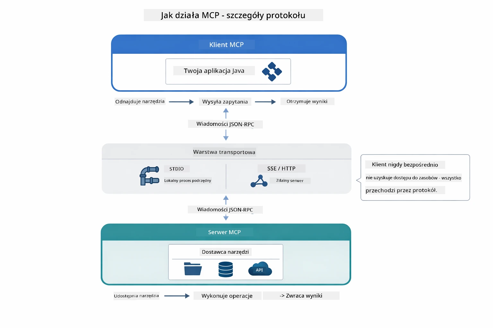

*Jak działa MCP pod maską — klienci odnajdują narzędzia, wymieniają wiadomości JSON-RPC i wykonują operacje poprzez warstwę transportową.*

**Architektura klient-serwer**

MCP używa modelu klient-serwer. Serwery dostarczają narzędzi — czytanie plików, zapytania do baz danych, wywołania API. Klienci (twoja aplikacja AI) łączą się z serwerami i korzystają z ich narzędzi.

Aby korzystać z MCP z LangChain4j, dodaj tę zależność Maven:

```xml
<dependency>
    <groupId>dev.langchain4j</groupId>
    <artifactId>langchain4j-mcp</artifactId>
    <version>${langchain4j.version}</version>
</dependency>
```

**Odnajdywanie narzędzi**

Gdy klient łączy się z serwerem MCP, pyta "Jakie masz narzędzia?" Serwer odpowiada listą dostępnych narzędzi, każde z opisami i schematami parametrów. Twój agent AI może następnie zdecydować, które narzędzia użyć na podstawie zapytań użytkownika. Poniższy diagram pokazuje ten uścisk dłoni — klient wysyła żądanie `tools/list`, a serwer zwraca swoje dostępne narzędzia z opisami i schematami parametrów:

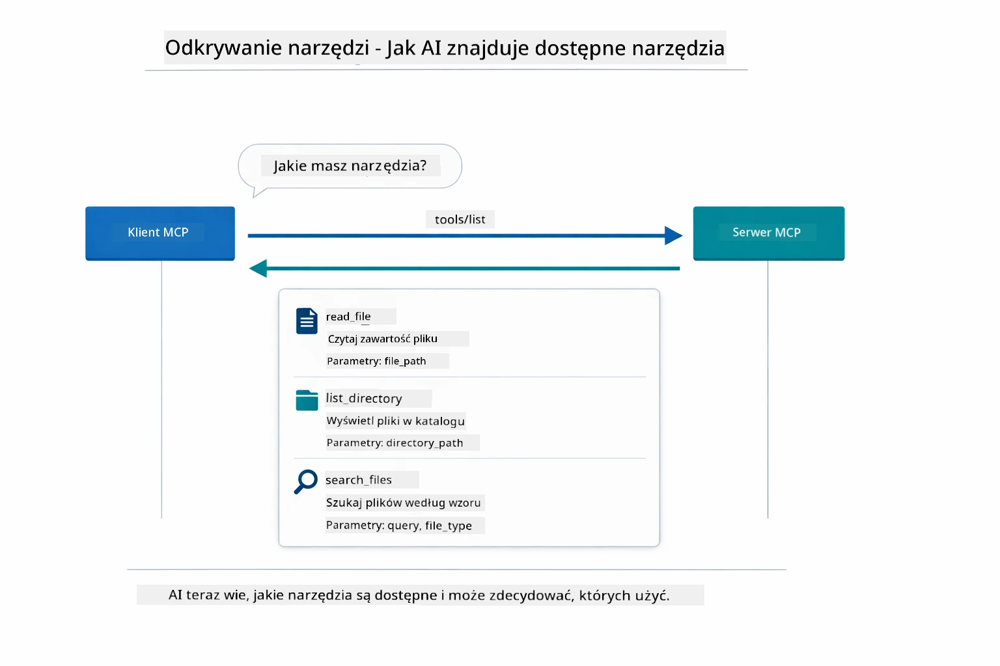

*AI odnajduje dostępne narzędzia podczas uruchamiania — teraz wie, jakie funkcje są dostępne i może zdecydować, które wykorzystać.*

**Mechanizmy transportu**

MCP wspiera różne mechanizmy transportu. Dwa opcje to Stdio (do lokalnej komunikacji z podprocesami) oraz HTTP strumieniowe (dla serwerów zdalnych). Ten moduł demonstruje transport Stdio:


*Mechanizmy transportu MCP: HTTP dla serwerów zdalnych, Stdio dla procesów lokalnych*

**Stdio** - [StdioTransportDemo.java](../../../05-mcp/src/main/java/com/example/langchain4j/mcp/StdioTransportDemo.java)

Dla procesów lokalnych. Twoja aplikacja uruchamia serwer jako podproces i komunikuje się przez standardowe wejście/wyjście. Przydatne do dostępu do systemu plików lub narzędzi wiersza poleceń.

```java
McpTransport stdioTransport = new StdioMcpTransport.Builder()
    .command(List.of(
        npmCmd, "exec",
        "@modelcontextprotocol/server-filesystem@2025.12.18",
        resourcesDir
    ))
    .logEvents(false)
    .build();
```

Serwer `@modelcontextprotocol/server-filesystem` udostępnia następujące narzędzia, wszystkie ograniczone do katalogów, które określisz:

| Narzędzie | Opis |
|-----------|-------|
| `read_file` | Odczytuje zawartość pojedynczego pliku |
| `read_multiple_files` | Odczytuje wiele plików jednym wywołaniem |
| `write_file` | Tworzy lub nadpisuje plik |
| `edit_file` | Wykonuje celowane zamiany "znajdź i zamień" |
| `list_directory` | Wypisuje pliki i katalogi pod wskazaną ścieżką |
| `search_files` | Rekurencyjnie wyszukuje pliki pasujące do wzorca |
| `get_file_info` | Pobiera metadane plików (rozmiar, znaczniki czasu, uprawnienia) |
| `create_directory` | Tworzy katalog (wraz z nadrzędnymi katalogami) |
| `move_file` | Przenosi lub zmienia nazwę pliku lub katalogu |

Poniższy diagram pokazuje, jak transport Stdio działa podczas uruchomienia — twoja aplikacja Java uruchamia serwer MCP jako proces podrzędny i komunikują się przez potoki stdin/stdout, bez sieci czy HTTP:

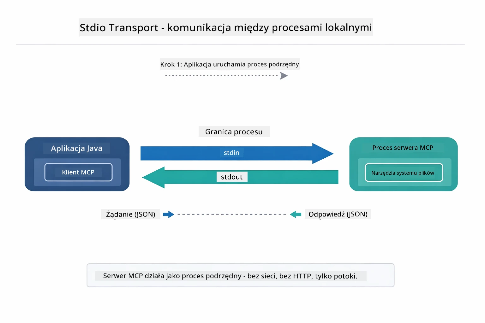

*Transport Stdio w akcji — twoja aplikacja uruchamia serwer MCP jako proces potomny i komunikuje się przez potoki stdin/stdout.*

> **🤖 Wypróbuj z [GitHub Copilot](https://github.com/features/copilot) Chat:** Otwórz [`StdioTransportDemo.java`](../../../05-mcp/src/main/java/com/example/langchain4j/mcp/StdioTransportDemo.java) i zapytaj:
> - "Jak działa transport Stdio i kiedy powinienem go używać zamiast HTTP?"
> - "Jak LangChain4j zarządza cyklem życia uruchamianych procesów serwera MCP?"
> - "Jakie są implikacje bezpieczeństwa przy udzielaniu AI dostępu do systemu plików?"

## Moduł agentowy

Chociaż MCP dostarcza ustandaryzowane narzędzia, moduł **agentowy** LangChain4j oferuje deklaratywny sposób budowania agentów orkiestrujących te narzędzia. Adnotacja `@Agent` oraz `AgenticServices` pozwalają definiować zachowanie agenta poprzez interfejsy zamiast kodu imperatywnego.

W tym module poznasz wzorzec **Agenta Nadzorczego** — zaawansowane podejście agentowego AI, w którym "nadzorca" dynamicznie decyduje, których podagentów wywołać na podstawie zapytań użytkownika. Połączymy oba koncepty, dając jednemu z naszych podagentów możliwości dostępu do plików zasilane przez MCP.

Aby używać modułu agentowego, dodaj tę zależność Maven:

```xml
<dependency>
    <groupId>dev.langchain4j</groupId>
    <artifactId>langchain4j-agentic</artifactId>
    <version>${langchain4j.mcp.version}</version>
</dependency>
```
> **Uwaga:** Moduł `langchain4j-agentic` używa osobnej właściwości wersji (`langchain4j.mcp.version`), ponieważ jest wydawany według innego harmonogramu niż biblioteki LangChain4j core.

> **⚠️ Eksperymentalne:** Moduł `langchain4j-agentic` jest **eksperymentalny** i może ulec zmianom. Stabilnym sposobem budowy asystentów AI pozostaje `langchain4j-core` z własnymi narzędziami (Moduł 04).

## Uruchamianie przykładów

### Wymagania wstępne

- Ukończony [Moduł 04 - Narzędzia](../04-tools/README.md) (ten moduł opiera się na koncepcjach narzędzi niestandardowych i porównuje je z narzędziami MCP)
- Plik `.env` w katalogu głównym z poświadczeniami Azure (utworzony przez `azd up` w Module 01)
- Java 21+, Maven 3.9+
- Node.js 16+ oraz npm (dla serwerów MCP)

> **Uwaga:** Jeśli nie skonfigurowałeś jeszcze zmiennych środowiskowych, zobacz [Moduł 01 - Wprowadzenie](../01-introduction/README.md) w celu instrukcji wdrożenia (`azd up` automatycznie tworzy plik `.env`), lub skopiuj `.env.example` do `.env` w katalogu głównym i uzupełnij wartości.

## Szybki start

**Korzystając z VS Code:** Kliknij prawym przyciskiem na dowolny plik demonstracyjny w Eksploratorze i wybierz **"Uruchom Java"**, lub użyj konfiguracji uruchamiania z panelu Uruchom i Debuguj (upewnij się, że plik `.env` zawiera poświadczenia Azure).

**Korzystając z Maven:** Alternatywnie możesz uruchomić z linii poleceń przy użyciu poniższych przykładów.

### Operacje na plikach (Stdio)

Demonstruje narzędzia oparte na lokalnych podprocesach.

**✅ Brak wymagań wstępnych** - serwer MCP jest uruchamiany automatycznie.

**Korzystając ze skryptów startowych (zalecane):**

Skrypty startowe automatycznie ładują zmienne środowiskowe z pliku `.env` w katalogu głównym:

**Bash:**
```bash
cd 05-mcp
chmod +x start-stdio.sh
./start-stdio.sh
```

**PowerShell:**
```powershell
cd 05-mcp
.\start-stdio.ps1
```

**Korzystając z VS Code:** Kliknij prawym na `StdioTransportDemo.java` i wybierz **"Uruchom Java"** (upewnij się, że plik `.env` jest skonfigurowany).

Aplikacja automatycznie uruchamia serwer MCP obsługujący system plików i odczytuje lokalny plik. Zwróć uwagę, jak zarządzanie podprocesem jest realizowane za ciebie.

**Oczekiwany wynik:**
```
Assistant response: The file provides an overview of LangChain4j, an open-source Java library
for integrating Large Language Models (LLMs) into Java applications...
```

### Agent nadzorczy

Wzorzec **Agenta Nadzorczego** to **elastyczna** forma agentowego AI. Nadzorca wykorzystuje LLM do autonomicznego decydowania, których agentów wywołać na podstawie żądania użytkownika. W następnym przykładzie połączymy dostęp do plików za pomocą MCP z agentem LLM, tworząc nadzorowany przepływ pracy: odczyt pliku → raport.

W demonstracji `FileAgent` odczytuje plik używając narzędzi systemu plików MCP, a `ReportAgent` generuje ustrukturyzowany raport z podsumowaniem wykonawczym (1 zdanie), 3 kluczowymi punktami oraz rekomendacjami. Nadzorca automatycznie orkiestruje ten proces:

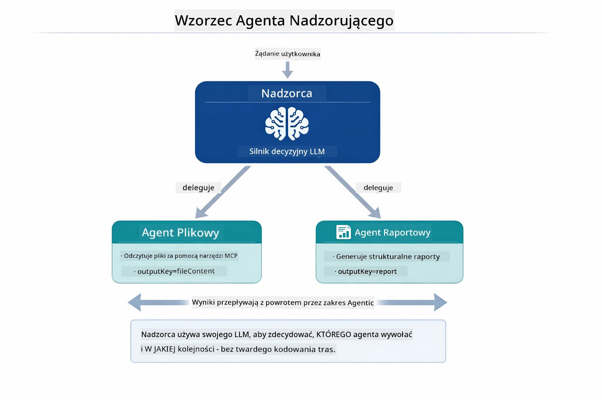

*Nadzorca wykorzystuje LLM do decydowania, których agentów wywołać i w jakiej kolejności — brak potrzeby twardo zakodowanego wywoływania.*

Tak wygląda konkretny przepływ pracy w naszej potokowej funkcji plik → raport:

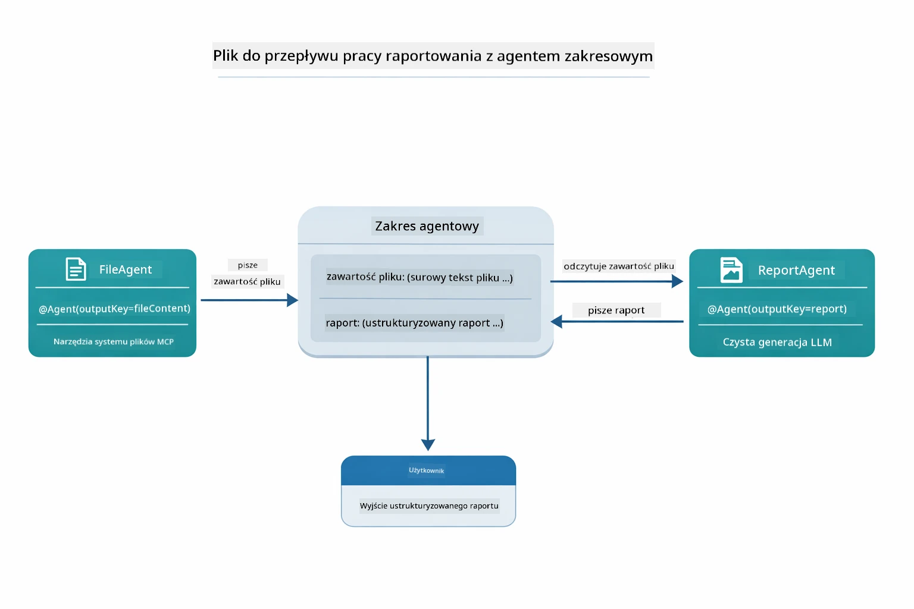

*FileAgent odczytuje plik za pomocą narzędzi MCP, następnie ReportAgent przekształca surową zawartość w ustrukturyzowany raport.*

Poniższy diagram sekwencji wyświetla pełną orkiestrację Nadzorcy — od uruchomienia serwera MCP, przez autonomiczny wybór agentów przez Nadzorcę, do wywołań narzędzi przez stdio i finalnego raportu:

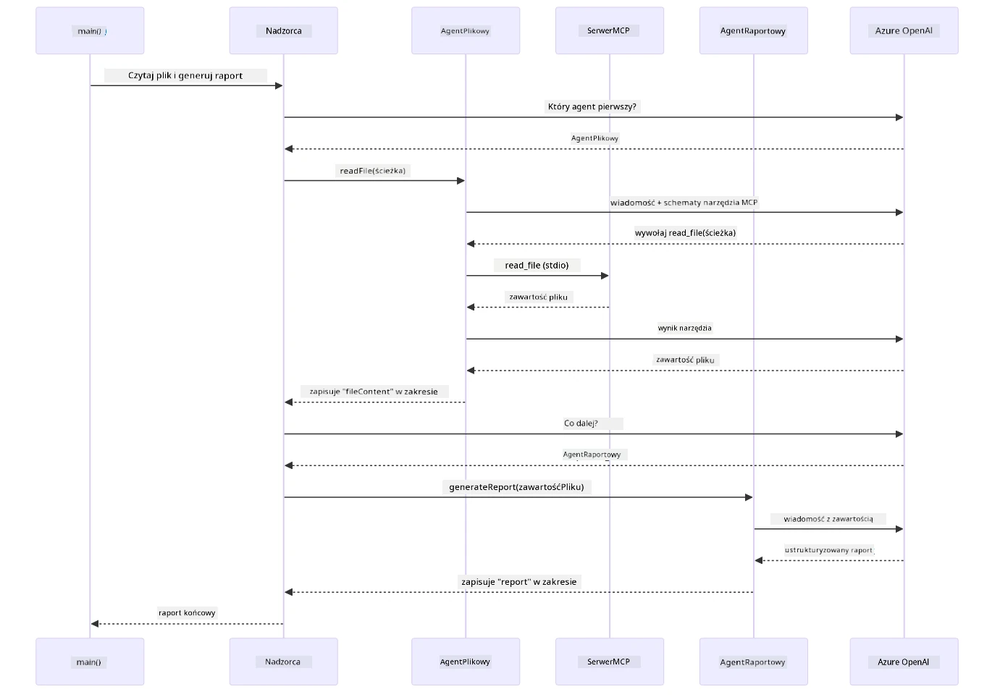

*Nadzorca autonomicznie wywołuje FileAgent (który wywołuje serwer MCP przez stdio, aby odczytać plik), potem wywołuje ReportAgent by wygenerować ustrukturyzowany raport — każdy agent zapisuje wyniki w współdzielonym zakresie Agentic Scope.*

Każdy agent zapisuje swoje wyniki w **Agentic Scope** (wspólnej pamięci), umożliwiając agentom następnego etapu dostęp do wcześniejszych rezultatów. Pokazuje to, jak narzędzia MCP płynnie integrują się z przepływami agentów — Nadzorca nie musi wiedzieć *jak* pliki są czytane, tylko że `FileAgent` potrafi to zrobić.

#### Uruchamianie demonstracji

Skrypty startowe automatycznie ładują zmienne środowiskowe z pliku `.env` w katalogu głównym:

**Bash:**
```bash
cd 05-mcp
chmod +x start-supervisor.sh
./start-supervisor.sh
```

**PowerShell:**
```powershell
cd 05-mcp
.\start-supervisor.ps1
```

**Korzystając z VS Code:** Kliknij prawym na `SupervisorAgentDemo.java` i wybierz **"Uruchom Java"** (upewnij się, że plik `.env` jest skonfigurowany).

#### Jak działa agent nadzorczy

Przed tworzeniem agentów musisz połączyć transport MCP z klientem i opakować go jako `ToolProvider`. W ten sposób narzędzia serwera MCP stają się dostępne dla twoich agentów:

```java
// Utwórz klienta MCP z transportu
McpClient mcpClient = new DefaultMcpClient.Builder()
        .transport(stdioTransport)
        .build();

// Owiń klienta jako ToolProvider — to łączy narzędzia MCP z LangChain4j
ToolProvider mcpToolProvider = McpToolProvider.builder()
        .mcpClients(List.of(mcpClient))
        .build();
```

Teraz możesz wstrzykiwać `mcpToolProvider` do dowolnego agenta, który potrzebuje narzędzi MCP:

```java
// Krok 1: FileAgent czyta pliki używając narzędzi MCP
FileAgent fileAgent = AgenticServices.agentBuilder(FileAgent.class)
        .chatModel(model)
        .toolProvider(mcpToolProvider)  // Posiada narzędzia MCP do operacji na plikach
        .build();

// Krok 2: ReportAgent generuje zorganizowane raporty
ReportAgent reportAgent = AgenticServices.agentBuilder(ReportAgent.class)
        .chatModel(model)
        .build();

// Supervisor koordynuje przepływ plik → raport
SupervisorAgent supervisor = AgenticServices.supervisorBuilder()
        .chatModel(model)
        .subAgents(fileAgent, reportAgent)
        .responseStrategy(SupervisorResponseStrategy.LAST)  // Zwróć końcowy raport
        .build();

// Supervisor decyduje, których agentów wywołać na podstawie żądania
String response = supervisor.invoke("Read the file at /path/file.txt and generate a report");
```

#### Jak FileAgent odkrywa narzędzia MCP w czasie działania

Możesz się zastanawiać: **jak `FileAgent` wie, jak używać narzędzi systemu plików npm?** Odpowiedź jest taka, że nie wie — **LLM** dowiaduje się tego w czasie działania poprzez schematy narzędzi.
Interfejs `FileAgent` to tylko **definicja promptu**. Nie posiada wbudowanej wiedzy o `read_file`, `list_directory` ani żadnym innym narzędziu MCP. Oto jak przebiega cały proces end-to-end:

1. **Uruchomienie serwera:** `StdioMcpTransport` uruchamia pakiet npm `@modelcontextprotocol/server-filesystem` jako proces potomny
2. **Odkrywanie narzędzi:** `McpClient` wysyła do serwera żądanie JSON-RPC `tools/list`, na które serwer odpowiada nazwami narzędzi, opisami i schematami parametrów (np. `read_file` — *"Odczytaj pełną zawartość pliku"* — `{ path: string }`)
3. **Wstrzykiwanie schematów:** `McpToolProvider` otacza odkryte schematy i udostępnia je LangChain4j
4. **Decyzja LLM:** Gdy wywoływana jest metoda `FileAgent.readFile(path)`, LangChain4j wysyła do LLM komunikat systemowy, komunikat użytkownika oraz **listę schematów narzędzi**. LLM czyta opisy narzędzi i generuje wywołanie narzędzia (np. `read_file(path="/some/file.txt")`)
5. **Wykonanie:** LangChain4j przechwytuje wywołanie narzędzia, kieruje je przez klienta MCP z powrotem do procesu Node.js, otrzymuje wynik i przekazuje go z powrotem do LLM

To jest ten sam mechanizm [Odkrywania Narzędzi](../../../05-mcp) opisany powyżej, ale zastosowany konkretnie w przepływie pracy agenta. Adnotacje `@SystemMessage` i `@UserMessage` kierują zachowaniem LLM, podczas gdy wstrzyknięty `ToolProvider` zapewnia mu **możliwości** — LLM łączy oba elementy w czasie działania.

> **🤖 Wypróbuj z [GitHub Copilot](https://github.com/features/copilot) Chat:** Otwórz [`FileAgent.java`](../../../05-mcp/src/main/java/com/example/langchain4j/mcp/agents/FileAgent.java) i zapytaj:
> - „Skąd ten agent wie, które narzędzie MCP wywołać?”
> - „Co się stanie, jeśli usunę ToolProvider z budowniczego agenta?”
> - „Jak schematy narzędzi trafiają do LLM?”

#### Strategie Odpowiedzi

Konfigurując `SupervisorAgent`, określasz, jak powinno wyglądać jego ostateczne sformułowanie odpowiedzi dla użytkownika po wykonaniu zadań przez podagentów. Poniższy diagram pokazuje trzy dostępne strategie — LAST zwraca bezpośrednio finalną odpowiedź ostatniego agenta, SUMMARY syntetyzuje wszystkie odpowiedzi przy pomocy LLM, a SCORED wybiera tę, która otrzyma wyższą ocenę względem oryginalnego zapytania:

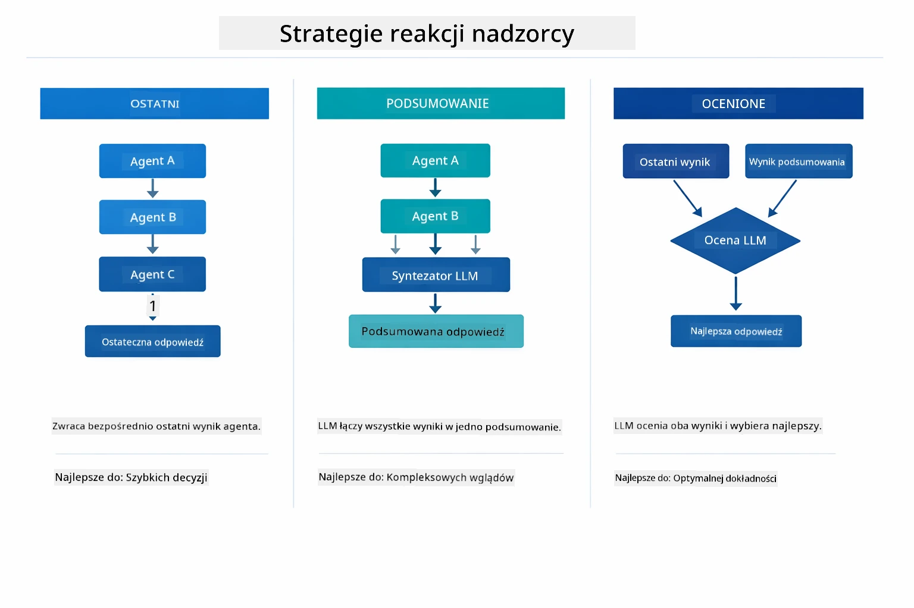

*Trzy strategie formułowania końcowej odpowiedzi przez Supervisor — wybierz, czy chcesz uzyskać wynik ostatniego agenta, podsumowanie, czy najlepszą ocenę.*

Dostępne strategie to:

| Strategia | Opis |
|----------|-------------|
| **LAST** | Supervisor zwraca wynik ostatniego wywołanego pod-agenta lub narzędzia. Przydatne, gdy końcowy agent w przepływie jest zaprojektowany specjalnie do wygenerowania kompletnej, ostatecznej odpowiedzi (np. „Agent Podsumowujący” w procesie badawczym). |
| **SUMMARY** | Supervisor używa własnego, wbudowanego modelu językowego (LLM), aby zsyntetyzować podsumowanie całej interakcji oraz wyników pod-agentów, a następnie zwraca to podsumowanie jako odpowiedź końcową. Zapewnia to przejrzystą, zagregowaną odpowiedź dla użytkownika. |
| **SCORED** | System używa wbudowanego LLM do ocenienia zarówno odpowiedzi uzyskanej w trybie LAST, jak i podsumowania SUMMARY względem oryginalnego zapytania użytkownika, zwracając tę odpowiedź, która otrzymała wyższą ocenę. |

Zobacz [SupervisorAgentDemo.java](../../../05-mcp/src/main/java/com/example/langchain4j/mcp/SupervisorAgentDemo.java) dla kompletnej implementacji.

> **🤖 Wypróbuj z [GitHub Copilot](https://github.com/features/copilot) Chat:** Otwórz [`SupervisorAgentDemo.java`](../../../05-mcp/src/main/java/com/example/langchain4j/mcp/SupervisorAgentDemo.java) i zapytaj:
> - „Jak Supervisor decyduje, których agentów wywołać?”
> - „Jaka jest różnica między wzorcami Supervisor i Sequential?”
> - „Jak mogę dostosować zachowanie planowania Supervisor?”

#### Zrozumienie Wyniku

Po uruchomieniu dema zobaczysz szczegółowy opis, jak Supervisor orkiestruje wieloma agentami. Oto co oznacza każda sekcja:

```
======================================================================
  FILE → REPORT WORKFLOW DEMO
======================================================================

This demo shows a clear 2-step workflow: read a file, then generate a report.
The Supervisor orchestrates the agents automatically based on the request.
```

**Nagłówek** wprowadza koncepcję workflow: ukierunkowany proces od odczytu pliku do wygenerowania raportu.

```
--- WORKFLOW ---------------------------------------------------------
  ┌─────────────┐      ┌──────────────┐
  │  FileAgent  │ ───▶ │ ReportAgent  │
  │ (MCP tools) │      │  (pure LLM)  │
  └─────────────┘      └──────────────┘
   outputKey:           outputKey:
   'fileContent'        'report'

--- AVAILABLE AGENTS -------------------------------------------------
  [FILE]   FileAgent   - Reads files via MCP → stores in 'fileContent'
  [REPORT] ReportAgent - Generates structured report → stores in 'report'
```

**Diagram workflow** pokazuje przepływ danych pomiędzy agentami. Każdy agent ma określoną rolę:
- **FileAgent** czyta pliki za pomocą narzędzi MCP i zapisuje surową zawartość w `fileContent`
- **ReportAgent** przetwarza tę zawartość i tworzy usystematyzowany raport w `report`

```
--- USER REQUEST -----------------------------------------------------
  "Read the file at .../file.txt and generate a report on its contents"
```

**Zapytanie użytkownika** pokazuje zadanie. Supervisor analizuje je i decyduje o wywołaniu FileAgent → ReportAgent.

```
--- SUPERVISOR ORCHESTRATION -----------------------------------------
  The Supervisor decides which agents to invoke and passes data between them...

  +-- STEP 1: Supervisor chose -> FileAgent (reading file via MCP)
  |
  |   Input: .../file.txt
  |
  |   Result: LangChain4j is an open-source, provider-agnostic Java framework for building LLM...
  +-- [OK] FileAgent (reading file via MCP) completed

  +-- STEP 2: Supervisor chose -> ReportAgent (generating structured report)
  |
  |   Input: LangChain4j is an open-source, provider-agnostic Java framew...
  |
  |   Result: Executive Summary...
  +-- [OK] ReportAgent (generating structured report) completed
```

**Orkiestracja Supervisor** pokazuje w akcji dwustopniowy przepływ:
1. **FileAgent** czyta plik przez MCP i zapisuje zawartość
2. **ReportAgent** odbiera zawartość i generuje strukturalny raport

Supervisor podjął te decyzje **autonomicznie** na podstawie zapytania użytkownika.

```
--- FINAL RESPONSE ---------------------------------------------------
Executive Summary
...

Key Points
...

Recommendations
...

--- AGENTIC SCOPE (Data Flow) ----------------------------------------
  Each agent stores its output for downstream agents to consume:
  * fileContent: LangChain4j is an open-source, provider-agnostic Java framework...
  * report: Executive Summary...
```

#### Wyjaśnienie cech modułu agentic

Przykład demonstruje kilka zaawansowanych cech modułu agentic. Przyjrzyjmy się bliżej Agentic Scope i Agent Listenerom.

**Agentic Scope** to wspólna pamięć, gdzie agenci zapisują swoje wyniki za pomocą `@Agent(outputKey="...")`. Pozwala to na:
- Dostęp do wyników wcześniejszych agentów przez agentów kolejnych
- Supervisorowi na syntezę końcowej odpowiedzi
- Ci na sprawdzenie, co każdy agent wygenerował

Poniższy diagram pokazuje, jak Agentic Scope działa jako współdzielona pamięć w przepływie od pliku do raportu — FileAgent zapisuje wynik pod kluczem `fileContent`, ReportAgent odczytuje go i zapisuje swój wynik pod `report`:

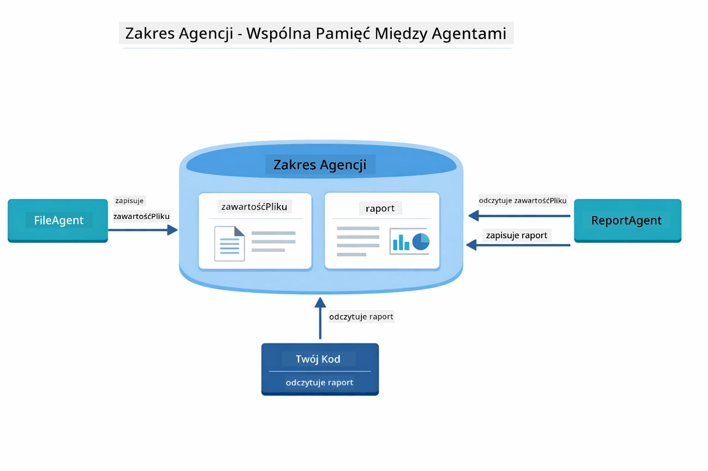

*Agentic Scope działa jako współdzielona pamięć — FileAgent zapisuje `fileContent`, ReportAgent go czyta i zapisuje `report`, a twój kod odczytuje wynik końcowy.*

```java
ResultWithAgenticScope<String> result = supervisor.invokeWithAgenticScope(request);
AgenticScope scope = result.agenticScope();
String fileContent = scope.readState("fileContent");  // Surowe dane pliku z FileAgent
String report = scope.readState("report");            // Zorganizowany raport z ReportAgent
```

**Agent Listeners** umożliwiają monitorowanie i debugowanie wykonania agentów. Wyjście krok po kroku, które widzisz w demie pochodzi z AgentListenera, który podłącza się do każdego wywołania agenta:
- **beforeAgentInvocation** – wywoływane, gdy Supervisor wybiera agenta, pozwalając zobaczyć, który agent i dlaczego został wybrany
- **afterAgentInvocation** – wywoływane po zakończeniu agenta, prezentując jego wynik
- **inheritedBySubagents** – gdy ustawione na true, listener monitoruje wszystkich agentów w hierarchii

Poniższy diagram pokazuje pełen cykl życia Agent Listener, włączając w to obsługę błędów za pomocą `onError` podczas wykonania agenta:

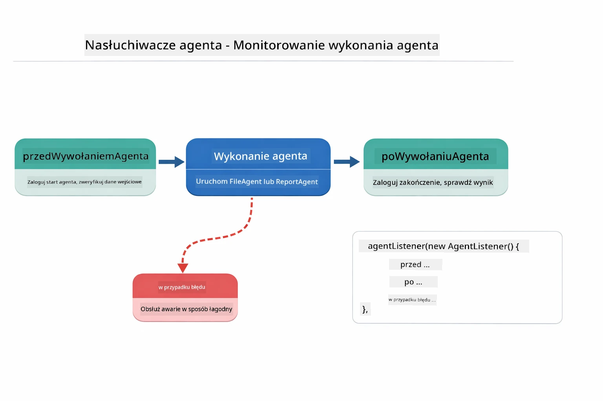

*Agent Listeners integrują się z cyklem życia wykonania — monitorują start, zakończenie i błędy agentów.*

```java
AgentListener monitor = new AgentListener() {
    private int step = 0;
    
    @Override
    public void beforeAgentInvocation(AgentRequest request) {
        step++;
        System.out.println("  +-- STEP " + step + ": " + request.agentName());
    }
    
    @Override
    public void afterAgentInvocation(AgentResponse response) {
        System.out.println("  +-- [OK] " + response.agentName() + " completed");
    }
    
    @Override
    public boolean inheritedBySubagents() {
        return true; // Rozprzestrzenić na wszystkich podagentów
    }
};
```

Poza wzorcem Supervisor moduł `langchain4j-agentic` oferuje kilka potężnych wzorców workflow. Poniższy diagram ukazuje wszystkie pięć — od prostych sekwencyjnych potoków do workflow zezwalających na zatwierdzenia przez człowieka:

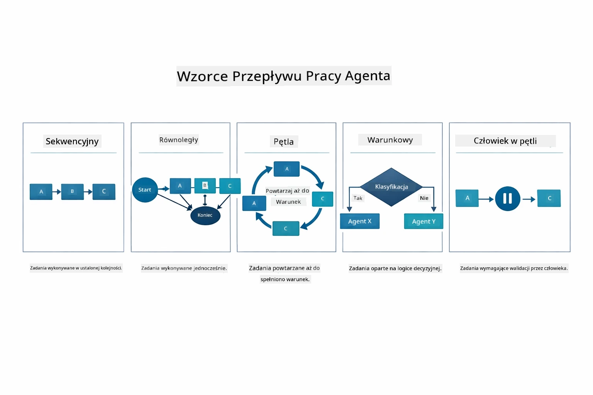

*Pięć wzorców orkiestracji agentów — od prostych sekwencyjnych potoków po workflow zezwalające na zatwierdzenia człowieka.*

| Wzorzec | Opis | Zastosowanie |
|---------|-------------|--------------|
| **Sequential** | Wykonuje agentów po kolei, wynik trafia do kolejnego | Potoki: badanie → analiza → raport |
| **Parallel** | Uruchamia agentów równolegle | Niezależne zadania: pogoda + wiadomości + akcje |
| **Loop** | Iteruje aż spełniony warunek | Ocena jakości: dopracowywanie aż do wyniku ≥ 0.8 |
| **Conditional** | Kieruje na podstawie warunków | Klasyfikacja → kierowanie do specjalistycznego agenta |
| **Human-in-the-Loop** | Dodaje punkty kontrolne dla człowieka | Workflow zatwierdzania, przegląd treści |

## Kluczowe Koncepcje

Po zapoznaniu się z MCP i modułem agentic w akcji, podsumujmy, kiedy korzystać z każdego podejścia.

Jedną z największych zalet MCP jest rozwijający się ekosystem. Poniższy diagram pokazuje, jak jeden uniwersalny protokół łączy twoją aplikację AI z różnorodnymi serwerami MCP — od dostępu do systemu plików i bazy danych, przez GitHub, e-maile, web scraping i nie tylko:

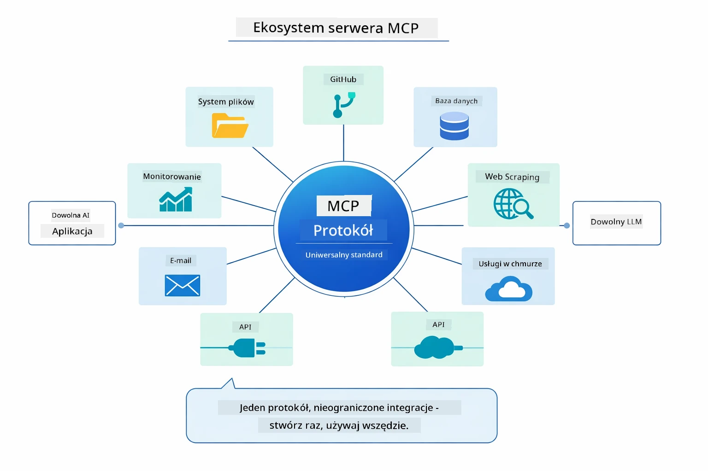

*MCP tworzy uniwersalny ekosystem protokołu — każdy serwer kompatybilny z MCP współpracuje z dowolnym klientem MCP, umożliwiając współdzielenie narzędzi między aplikacjami.*

**MCP** jest idealne, gdy chcesz wykorzystać istniejące ekosystemy narzędzi, stworzyć narzędzia współdzielone przez wiele aplikacji, integrować usługi firm trzecich za pomocą standardowych protokołów lub wymieniać implementacje narzędzi bez zmiany kodu.

**Moduł Agentic** sprawdza się najlepiej, gdy chcesz deklaratywne definicje agentów z adnotacjami `@Agent`, potrzebujesz orkiestracji workflow (sekwencyjnej, pętli, równoległej), preferujesz projektowanie agentów oparte na interfejsach zamiast kodu imperatywnego lub łączysz wielu agentów korzystających ze wspólnych wyników poprzez `outputKey`.

**Wzorzec Supervisor Agent** błyszczy, gdy workflow nie jest przewidywalny z góry i chcesz, aby LLM decydował, gdy masz wielu wyspecjalizowanych agentów wymagających dynamicznej orkiestracji, gdy budujesz systemy konwersacyjne kierujące do różnych funkcji lub gdy chcesz najbardziej elastyczne, adaptacyjne zachowanie agenta.

Aby pomóc zdecydować między niestandardowymi metodami `@Tool` z Modułu 04 a narzędziami MCP z tego modułu, poniższe porównanie podkreśla kluczowe kompromisy — narzędzia niestandardowe oferują ścisłe powiązanie i pełne bezpieczeństwo typów dla logiki specyficznej dla aplikacji, a narzędzia MCP zapewniają standaryzowane, wielokrotnego użytku integracje:

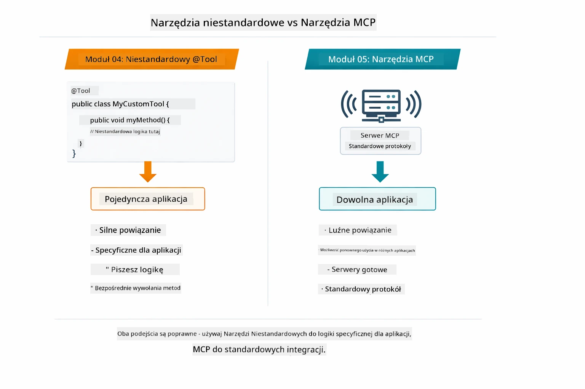

*Kiedy używać niestandardowych metod @Tool, a kiedy narzędzi MCP — niestandardowe narzędzia dla specyficznej logiki aplikacji z pełnym bezpieczeństwem typów, narzędzia MCP dla standaryzowanych integracji działających w wielu aplikacjach.*

## Gratulacje!

Przeszedłeś przez wszystkie pięć modułów kursu LangChain4j dla początkujących! Oto pełna ścieżka nauki, którą ukończyłeś — od podstawowego chatu aż po systemy agentic zasilane MCP:

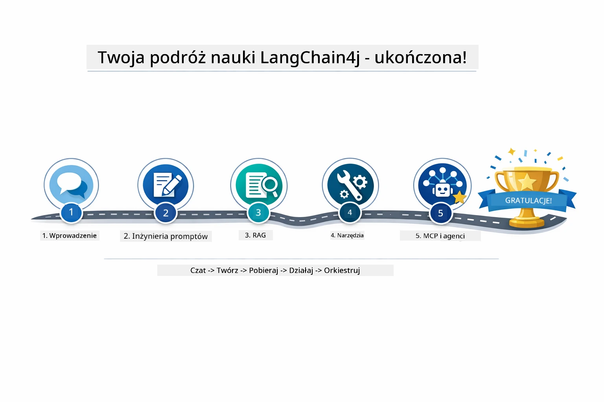

*Twoja ścieżka nauki przez wszystkie pięć modułów — od podstawowego chatu do agenticznych systemów zasilanych MCP.*

Ukończyłeś kurs LangChain4j dla początkujących. Nauczyłeś się:

- Jak budować konwersacyjne AI z pamięcią (Moduł 01)
- Wzorców inżynierii promptów dla różnych zadań (Moduł 02)
- Ugruntowywania odpowiedzi na własnych dokumentach z użyciem RAG (Moduł 03)
- Tworzenia podstawowych agentów AI (asystentów) z niestandardowymi narzędziami (Moduł 04)
- Integracji standaryzowanych narzędzi za pomocą LangChain4j MCP i modułu Agentic (Moduł 05)

### Co dalej?

Po ukończeniu modułów, zapoznaj się z [Przewodnikiem Testowania](../docs/TESTING.md), by zobaczyć koncepcje testowania LangChain4j w praktyce.

**Oficjalne zasoby:**
- [Dokumentacja LangChain4j](https://docs.langchain4j.dev/) – Kompleksowe przewodniki i odniesienia API
- [LangChain4j GitHub](https://github.com/langchain4j/langchain4j) – Kod źródłowy i przykłady
- [Samouczki LangChain4j](https://docs.langchain4j.dev/tutorials/) – Samouczki krok po kroku dla różnych zastosowań

Dziękujemy za ukończenie tego kursu!

---

**Nawigacja:** [← Poprzedni: Moduł 04 - Narzędzia](../04-tools/README.md) | [Powrót do głównej](../README.md)

---

<!-- CO-OP TRANSLATOR DISCLAIMER START -->
**Zastrzeżenie**:
Niniejszy dokument został przetłumaczony za pomocą automatycznej usługi tłumaczeniowej AI [Co-op Translator](https://github.com/Azure/co-op-translator). Mimo że dążymy do jak największej dokładności, prosimy pamiętać, że tłumaczenia automatyczne mogą zawierać błędy lub nieścisłości. Oryginalny dokument w języku źródłowym powinien być traktowany jako źródło wiążące. W przypadku istotnych informacji zalecane jest skorzystanie z profesjonalnego tłumaczenia wykonanego przez człowieka. Nie ponosimy odpowiedzialności za jakiekolwiek nieporozumienia lub błędne interpretacje wynikające z korzystania z tego tłumaczenia.
<!-- CO-OP TRANSLATOR DISCLAIMER END -->