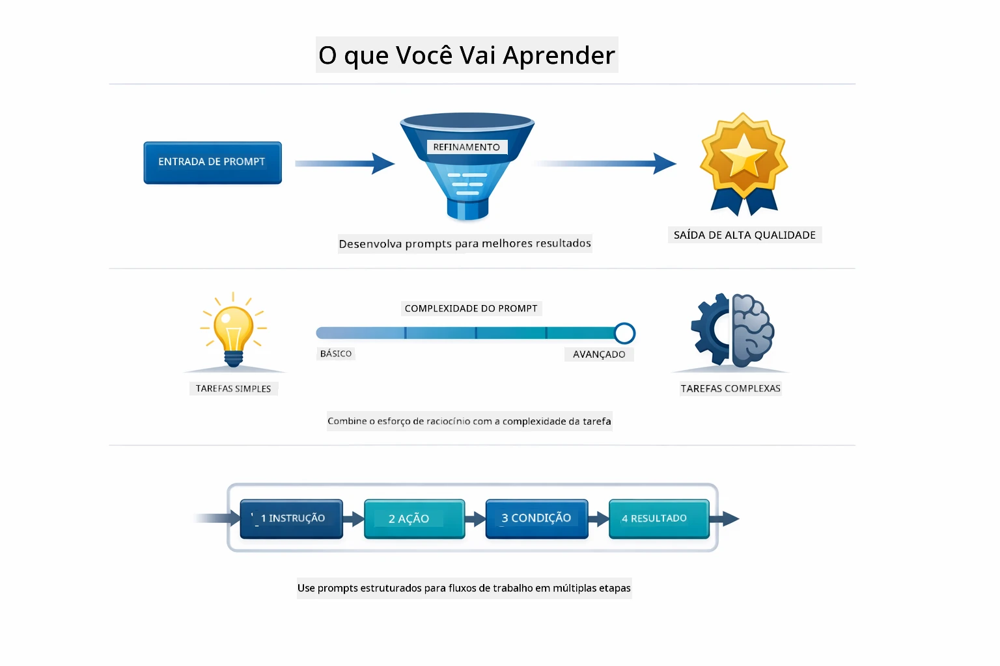
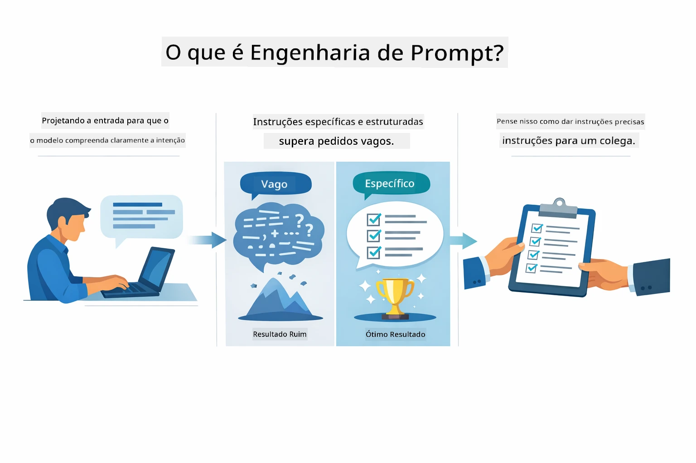
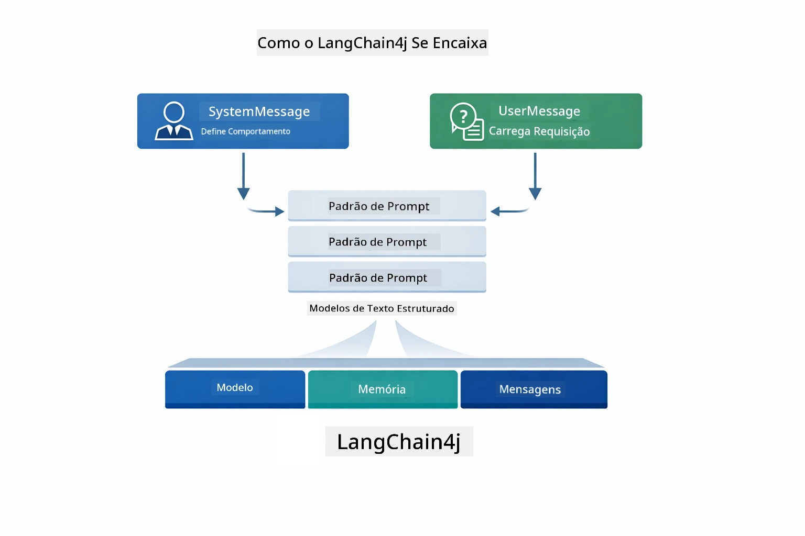
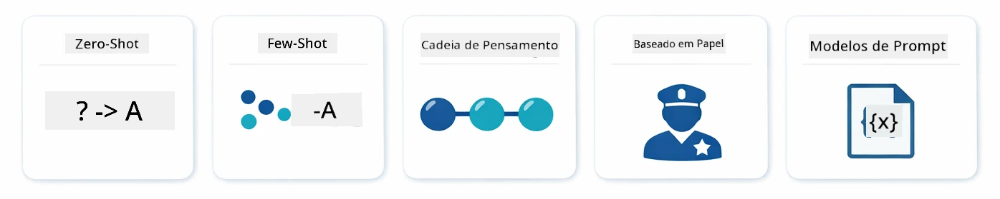
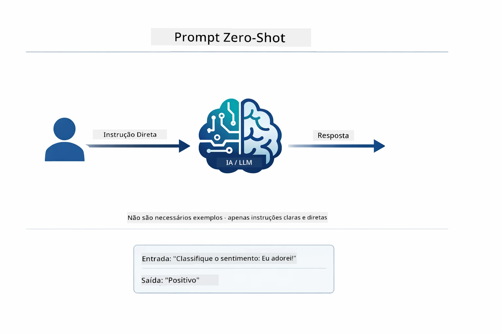
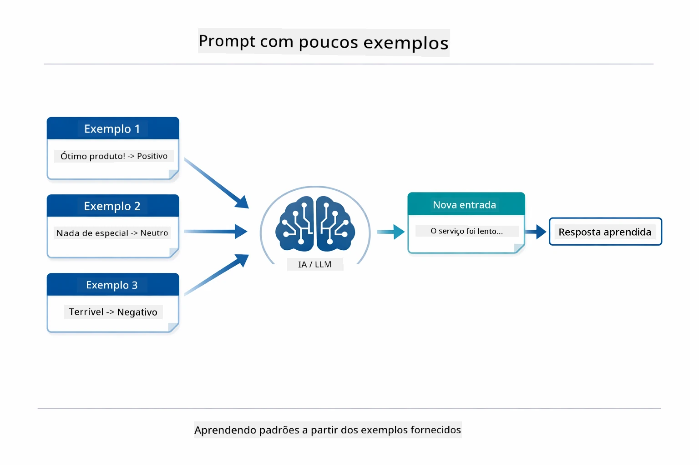
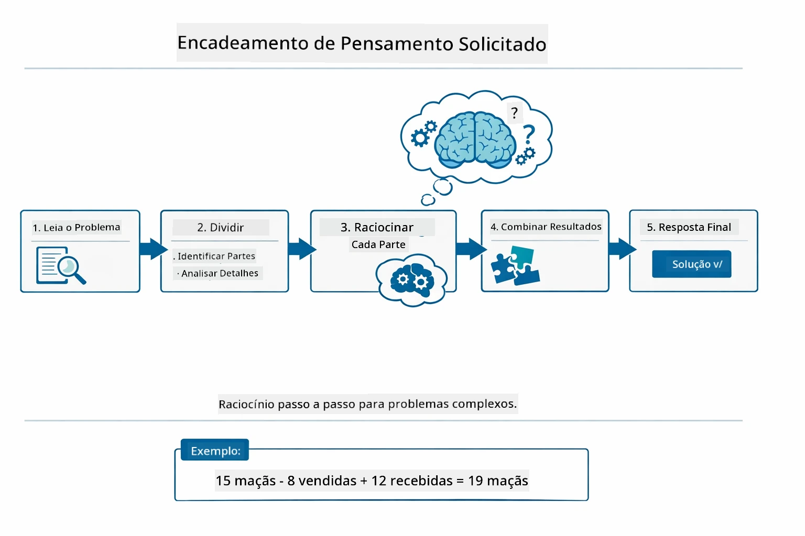
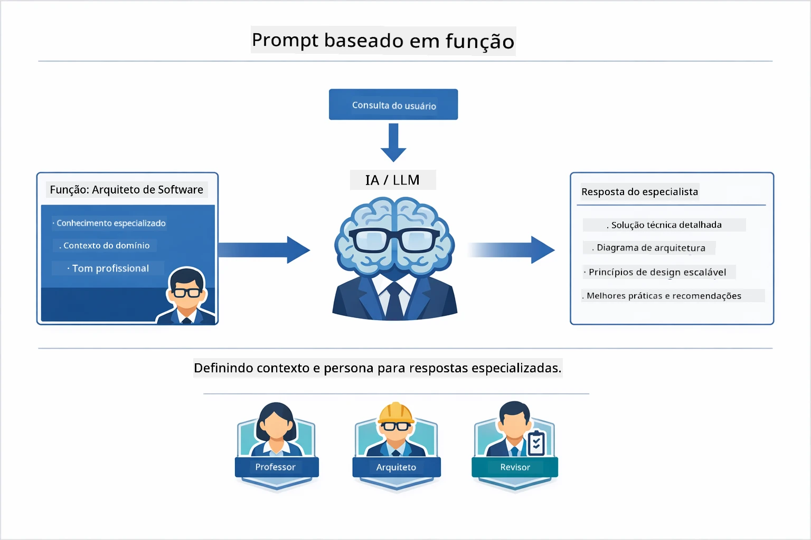
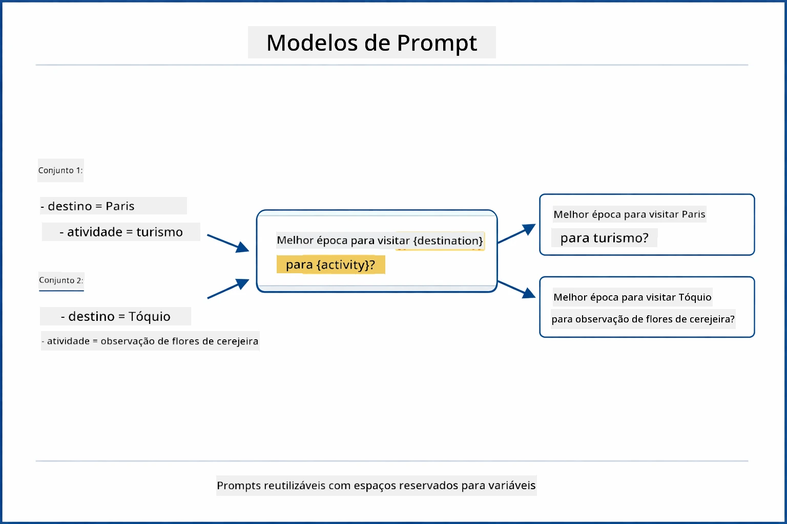
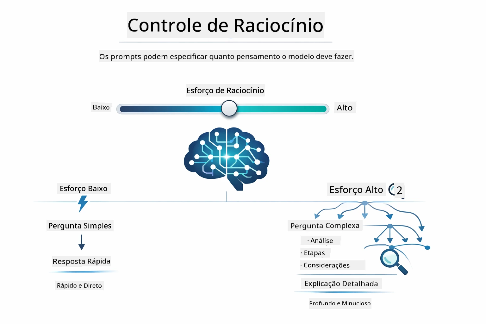

# Módulo 02: Engenharia de Prompt com GPT-5.2

## Índice

- [Vídeo Demonstrativo](../../../02-prompt-engineering)
- [O que Você Vai Aprender](../../../02-prompt-engineering)
- [Pré-requisitos](../../../02-prompt-engineering)
- [Entendendo Engenharia de Prompt](../../../02-prompt-engineering)
- [Fundamentos da Engenharia de Prompt](../../../02-prompt-engineering)
  - [Prompting Zero-Shot](../../../02-prompt-engineering)
  - [Prompting Few-Shot](../../../02-prompt-engineering)
  - [Cadeia de Pensamento](../../../02-prompt-engineering)
  - [Prompting Baseado em Papel](../../../02-prompt-engineering)
  - [Templates de Prompt](../../../02-prompt-engineering)
- [Padrões Avançados](../../../02-prompt-engineering)
- [Usando Recursos Azure Existentes](../../../02-prompt-engineering)
- [Capturas de Tela da Aplicação](../../../02-prompt-engineering)
- [Explorando os Padrões](../../../02-prompt-engineering)
  - [Baixa vs Alta Disposição](../../../02-prompt-engineering)
  - [Execução de Tarefa (Preâmbulos de Ferramentas)](../../../02-prompt-engineering)
  - [Código Auto-Reflexivo](../../../02-prompt-engineering)
  - [Análise Estruturada](../../../02-prompt-engineering)
  - [Chat com Múltiplas Rodadas](../../../02-prompt-engineering)
  - [Raciocínio Passo a Passo](../../../02-prompt-engineering)
  - [Saída Constrainada](../../../02-prompt-engineering)
- [O Que Você Está Realmente Aprendendo](../../../02-prompt-engineering)
- [Próximos Passos](../../../02-prompt-engineering)

## Vídeo Demonstrativo

Assista a esta sessão ao vivo que explica como começar com este módulo: [Engenharia de Prompt com LangChain4j - Sessão Ao Vivo](https://www.youtube.com/live/PJ6aBaE6bog?si=LDshyBrTRodP-wke)

## O que Você Vai Aprender



No módulo anterior, você viu como a memória permite IA conversacional e usou Modelos GitHub para interações básicas. Agora vamos focar em como você faz perguntas — os próprios prompts — usando o GPT-5.2 do Azure OpenAI. A forma como você estrutura seus prompts afeta drasticamente a qualidade das respostas que recebe. Começamos com uma revisão das técnicas fundamentais de prompting, depois avançamos para oito padrões avançados que exploram totalmente as capacidades do GPT-5.2.

Usaremos o GPT-5.2 porque ele introduz controle de raciocínio — você pode dizer ao modelo quanto pensar antes de responder. Isso torna as diferentes estratégias de prompting mais evidentes e ajuda você a entender quando usar cada abordagem. Também aproveitaremos os menores limites de taxa do Azure para GPT-5.2 em comparação com os Modelos do GitHub.

## Pré-requisitos

- Módulo 01 concluído (recursos Azure OpenAI implantados)
- Arquivo `.env` no diretório raiz com credenciais Azure (criado pelo `azd up` no Módulo 01)

> **Nota:** Se você não completou o Módulo 01, siga primeiro as instruções de implantação lá.

## Entendendo Engenharia de Prompt



Engenharia de prompt é sobre projetar texto de entrada que consistentemente te dá os resultados que você precisa. Não é apenas fazer perguntas — é estruturar requisições para que o modelo entenda exatamente o que você quer e como entregar.

Pense nisso como dar instruções a um colega. "Conserte o bug" é vago. "Conserte a exceção de ponteiro nulo em UserService.java linha 45 adicionando uma verificação de nulidade" é específico. Modelos de linguagem funcionam da mesma forma — especificidade e estrutura importam.



LangChain4j fornece a infraestrutura — conexões do modelo, memória, e tipos de mensagem — enquanto padrões de prompt são apenas textos cuidadosamente estruturados que você envia por essa infraestrutura. Os blocos chave são `SystemMessage` (que define o comportamento e papel da IA) e `UserMessage` (que carrega sua solicitação real).

## Fundamentos da Engenharia de Prompt



Antes de mergulhar nos padrões avançados deste módulo, vamos revisar cinco técnicas fundamentais de prompting. Esses são os blocos de construção que todo engenheiro de prompt deve conhecer. Se você já trabalhou com o [módulo Quick Start](../00-quick-start/README.md#2-prompt-patterns), já viu esses em ação — aqui está a estrutura conceitual por trás deles.

### Prompting Zero-Shot

A abordagem mais simples: dê uma instrução direta ao modelo sem exemplos. O modelo depende inteiramente do seu treinamento para entender e executar a tarefa. Isso funciona bem para requisições diretas onde o comportamento esperado é óbvio.



*Instrução direta sem exemplos — o modelo deduz a tarefa apenas da instrução*

```java
String prompt = "Classify this sentiment: 'I absolutely loved the movie!'";
String response = model.chat(prompt);
// Resposta: "Positivo"
```

**Quando usar:** Classificações simples, perguntas diretas, traduções, ou qualquer tarefa que o modelo possa manejar sem orientação adicional.

### Prompting Few-Shot

Forneça exemplos que demonstram o padrão que você quer que o modelo siga. O modelo aprende o formato esperado de entrada-saída pelos seus exemplos e o aplica a novas entradas. Isso melhora dramaticamente a consistência para tarefas em que o formato ou comportamento desejado não é óbvio.



*Aprendendo com exemplos — o modelo identifica o padrão e o aplica a novas entradas*

```java
String prompt = """
    Classify the sentiment as positive, negative, or neutral.
    
    Examples:
    Text: "This product exceeded my expectations!" → Positive
    Text: "It's okay, nothing special." → Neutral
    Text: "Waste of money, very disappointed." → Negative
    
    Now classify this:
    Text: "Best purchase I've made all year!"
    """;
String response = model.chat(prompt);
```

**Quando usar:** Classificações personalizadas, formatações consistentes, tarefas específicas do domínio, ou quando resultados zero-shot são inconsistentes.

### Cadeia de Pensamento

Peça ao modelo que mostre seu raciocínio passo a passo. Em vez de saltar direto para uma resposta, o modelo divide o problema e explica cada parte explicitamente. Isso melhora a precisão em matemática, lógica e tarefas de raciocínio em múltiplos passos.



*Raciocínio passo a passo — dividindo problemas complexos em etapas lógicas explícitas*

```java
String prompt = """
    Problem: A store has 15 apples. They sell 8 apples and then 
    receive a shipment of 12 more apples. How many apples do they have now?
    
    Let's solve this step-by-step:
    """;
String response = model.chat(prompt);
// O modelo mostra: 15 - 8 = 7, então 7 + 12 = 19 maçãs
```

**Quando usar:** Problemas matemáticos, quebra-cabeças lógicos, depuração, ou qualquer tarefa onde mostrar o processo de raciocínio melhora a precisão e confiança.

### Prompting Baseado em Papel

Defina uma persona ou papel para a IA antes de fazer sua pergunta. Isso fornece contexto que molda o tom, profundidade e foco da resposta. Um "arquiteto de software" dá conselhos diferentes de um "desenvolvedor júnior" ou um "auditor de segurança".



*Definindo contexto e persona — a mesma pergunta recebe respostas diferentes dependendo do papel atribuído*

```java
String prompt = """
    You are an experienced software architect reviewing code.
    Provide a brief code review for this function:
    
    def calculate_total(items):
        total = 0
        for item in items:
            total = total + item['price']
        return total
    """;
String response = model.chat(prompt);
```

**Quando usar:** Revisões de código, tutoria, análises específicas de domínio, ou quando precisa de respostas adaptadas a um nível de especialização ou perspectiva particular.

### Templates de Prompt

Crie prompts reutilizáveis com espaços variáveis (placeholders). Em vez de escrever um prompt novo a cada vez, defina um template uma vez e preencha diferentes valores. A classe `PromptTemplate` do LangChain4j facilita isso com a sintaxe `{{variável}}`.



*Prompts reutilizáveis com placeholders — um template, muitos usos*

```java
PromptTemplate template = PromptTemplate.from(
    "What's the best time to visit {{destination}} for {{activity}}?"
);

Prompt prompt = template.apply(Map.of(
    "destination", "Paris",
    "activity", "sightseeing"
));

String response = model.chat(prompt.text());
```

**Quando usar:** Consultas repetidas com diferentes entradas, processamento em lote, construção de fluxos de trabalho IA reutilizáveis, ou qualquer cenário onde a estrutura do prompt permanece a mesma mas os dados mudam.

---

Esses cinco fundamentos oferecem uma caixa de ferramentas sólida para a maioria das tarefas de prompting. O restante deste módulo se baseia neles com **oito padrões avançados** que aproveitam o controle de raciocínio, autoavaliação, e capacidades de saída estruturada do GPT-5.2.

## Padrões Avançados

Com os fundamentos cobertos, vamos aos oito padrões avançados que tornam este módulo único. Nem todos os problemas precisam da mesma abordagem. Algumas perguntas precisam de respostas rápidas, outras precisam de pensamento profundo. Algumas precisam de raciocínio visível, outras só de resultados. Cada padrão abaixo é otimizado para um cenário diferente — e o controle de raciocínio do GPT-5.2 torna as diferenças ainda mais evidentes.


*Visão geral dos oito padrões de engenharia de prompt e seus casos de uso*



*O controle de raciocínio do GPT-5.2 permite especificar quanto o modelo deve pensar — de respostas rápidas e diretas a explorações profundas*

**Baixa Disposição (Rápido & Focado)** - Para perguntas simples onde você quer respostas rápidas e diretas. O modelo faz raciocínio mínimo — no máximo 2 passos. Use para cálculos, consultas ou perguntas diretas.

```java
String prompt = """
    <context_gathering>
    - Search depth: very low
    - Bias strongly towards providing a correct answer as quickly as possible
    - Usually, this means an absolute maximum of 2 reasoning steps
    - If you think you need more time, state what you know and what's uncertain
    </context_gathering>
    
    Problem: What is 15% of 200?
    
    Provide your answer:
    """;

String response = chatModel.chat(prompt);
```

> 💡 **Explore com GitHub Copilot:** Abra [`Gpt5PromptService.java`](../../../02-prompt-engineering/src/main/java/com/example/langchain4j/prompts/service/Gpt5PromptService.java) e pergunte:
> - "Qual a diferença entre os padrões de prompting de baixa e alta disposição?"
> - "Como as tags XML nos prompts ajudam a estruturar a resposta da IA?"
> - "Quando eu devo usar padrões de auto-reflexão em vez de instrução direta?"

**Alta Disposição (Profundo & Completo)** - Para problemas complexos onde você quer análise abrangente. O modelo explora detalhadamente e mostra raciocínio detalhado. Use para design de sistemas, decisões arquitetônicas, ou pesquisa complexa.

```java
String prompt = """
    Analyze this problem thoroughly and provide a comprehensive solution.
    Consider multiple approaches, trade-offs, and important details.
    Show your analysis and reasoning in your response.
    
    Problem: Design a caching strategy for a high-traffic REST API.
    """;

String response = chatModel.chat(prompt);
```

**Execução de Tarefa (Progresso Passo a Passo)** - Para fluxos de trabalho com múltiplas etapas. O modelo fornece um plano inicial, descreve cada passo enquanto executa e depois dá um resumo. Use para migrações, implementações, ou qualquer processo multi-etapas.

```java
String prompt = """
    <task_execution>
    1. First, briefly restate the user's goal in a friendly way
    
    2. Create a step-by-step plan:
       - List all steps needed
       - Identify potential challenges
       - Outline success criteria
    
    3. Execute each step:
       - Narrate what you're doing
       - Show progress clearly
       - Handle any issues that arise
    
    4. Summarize:
       - What was completed
       - Any important notes
       - Next steps if applicable
    </task_execution>
    
    <tool_preambles>
    - Always begin by rephrasing the user's goal clearly
    - Outline your plan before executing
    - Narrate each step as you go
    - Finish with a distinct summary
    </tool_preambles>
    
    Task: Create a REST endpoint for user registration
    
    Begin execution:
    """;

String response = chatModel.chat(prompt);
```

Prompting cadeia de pensamento pede explicitamente que o modelo mostre seu processo de raciocínio, melhorando a acurácia em tarefas complexas. A divisão passo a passo ajuda humanos e IA a entenderem a lógica.

> **🤖 Experimente com [GitHub Copilot](https://github.com/features/copilot) Chat:** Pergunte sobre este padrão:
> - "Como eu adaptaria o padrão de execução de tarefa para operações de longa duração?"
> - "Quais são as melhores práticas para estruturar preâmbulos de ferramenta em apps de produção?"
> - "Como capturar e exibir atualizações intermediárias de progresso numa interface?"


*Fluxo de trabalho Planejar → Executar → Resumir para tarefas multi-etapas*

**Código Auto-Reflexivo** - Para gerar código com qualidade de produção. O modelo cria código seguindo padrões de produção com tratamento apropriado de erros. Use ao construir novas funcionalidades ou serviços.

```java
String prompt = """
    Generate Java code with production-quality standards: Create an email validation service
    Keep it simple and include basic error handling.
    """;

String response = chatModel.chat(prompt);
```


*Loop de melhoria iterativa - gerar, avaliar, identificar problemas, melhorar, repetir*

**Análise Estruturada** - Para avaliações consistentes. O modelo revisa código usando uma estrutura fixa (correção, práticas, desempenho, segurança, mantenabilidade). Use para revisões de código ou avaliações de qualidade.

```java
String prompt = """
    <analysis_framework>
    You are an expert code reviewer. Analyze the code for:
    
    1. Correctness
       - Does it work as intended?
       - Are there logical errors?
    
    2. Best Practices
       - Follows language conventions?
       - Appropriate design patterns?
    
    3. Performance
       - Any inefficiencies?
       - Scalability concerns?
    
    4. Security
       - Potential vulnerabilities?
       - Input validation?
    
    5. Maintainability
       - Code clarity?
       - Documentation?
    
    <output_format>
    Provide your analysis in this structure:
    - Summary: One-sentence overall assessment
    - Strengths: 2-3 positive points
    - Issues: List any problems found with severity (High/Medium/Low)
    - Recommendations: Specific improvements
    </output_format>
    </analysis_framework>
    
    Code to analyze:
    ```
    public List getUsers() {
        return database.query("SELECT * FROM users");
    }
    ```
    Provide your structured analysis:
    """;

String response = chatModel.chat(prompt);
```

> **🤖 Experimente com [GitHub Copilot](https://github.com/features/copilot) Chat:** Pergunte sobre análise estruturada:
> - "Como personalizar a estrutura de análise para diferentes tipos de revisão de código?"
> - "Qual a melhor forma de interpretar e agir programaticamente sobre saída estruturada?"
> - "Como garantir níveis de severidade consistentes em diferentes sessões de revisão?"


*Estrutura para revisões de código consistentes com níveis de severidade*

**Chat com Múltiplas Rodadas** - Para conversas que precisam de contexto. O modelo lembra mensagens anteriores e constrói sobre elas. Use para sessões de ajuda interativas ou Q&A complexas.

```java
ChatMemory memory = MessageWindowChatMemory.withMaxMessages(10);

memory.add(UserMessage.from("What is Spring Boot?"));
AiMessage aiMessage1 = chatModel.chat(memory.messages()).aiMessage();
memory.add(aiMessage1);

memory.add(UserMessage.from("Show me an example"));
AiMessage aiMessage2 = chatModel.chat(memory.messages()).aiMessage();
memory.add(aiMessage2);
```


*Como o contexto da conversa se acumula em múltiplas rodadas até alcançar o limite de tokens*

**Raciocínio Passo a Passo** - Para problemas que exigem lógica visível. O modelo mostra raciocínio explícito para cada etapa. Use para problemas matemáticos, quebra-cabeças lógicos ou quando precisar entender o processo de pensamento.

```java
String prompt = """
    <instruction>Show your reasoning step-by-step</instruction>
    
    If a train travels 120 km in 2 hours, then stops for 30 minutes,
    then travels another 90 km in 1.5 hours, what is the average speed
    for the entire journey including the stop?
    """;

String response = chatModel.chat(prompt);
```


*Dividindo problemas em etapas lógicas explícitas*

**Saída Constrainada** - Para respostas com requisitos específicos de formato. O modelo segue estritamente regras de formato e comprimento. Use para resumos ou quando precisar de estrutura de saída precisa.

```java
String prompt = """
    <constraints>
    - Exactly 100 words
    - Bullet point format
    - Technical terms only
    </constraints>
    
    Summarize the key concepts of machine learning.
    """;

String response = chatModel.chat(prompt);
```


*Impondo requisitos específicos de formato, comprimento e estrutura*

## Usando Recursos Azure Existentes

**Verifique a implantação:**

Certifique-se que o arquivo `.env` existe no diretório raiz com credenciais Azure (criado durante o Módulo 01):
```bash
cat ../.env  # Deve mostrar AZURE_OPENAI_ENDPOINT, API_KEY, DEPLOYMENT
```

**Inicie a aplicação:**

> **Nota:** Se você já iniciou todas as aplicações usando `./start-all.sh` do Módulo 01, este módulo já está rodando na porta 8083. Você pode pular os comandos de start abaixo e ir direto para http://localhost:8083.

**Opção 1: Usando o Painel Spring Boot (Recomendado para usuários VS Code)**
O container de desenvolvimento inclui a extensão Spring Boot Dashboard, que fornece uma interface visual para gerenciar todas as aplicações Spring Boot. Você pode encontrá-la na Barra de Atividades no lado esquerdo do VS Code (procure pelo ícone do Spring Boot).

A partir do Spring Boot Dashboard, você pode:
- Ver todas as aplicações Spring Boot disponíveis no espaço de trabalho
- Iniciar/parar aplicações com um único clique
- Visualizar logs das aplicações em tempo real
- Monitorar o status das aplicações

Basta clicar no botão de play ao lado de "prompt-engineering" para iniciar este módulo, ou iniciar todos os módulos de uma vez.


**Opção 2: Usando scripts shell**

Iniciar todas as aplicações web (módulos 01-04):

**Bash:**
```bash
cd ..  # Do diretório raiz
./start-all.sh
```

**PowerShell:**
```powershell
cd ..  # Do diretório raiz
.\start-all.ps1
```

Ou iniciar apenas este módulo:

**Bash:**
```bash
cd 02-prompt-engineering
./start.sh
```

**PowerShell:**
```powershell
cd 02-prompt-engineering
.\start.ps1
```

Ambos os scripts carregam automaticamente as variáveis de ambiente do arquivo `.env` raiz e irão construir os JARs caso eles não existam.

> **Nota:** Se preferir construir todos os módulos manualmente antes de iniciar:
>
> **Bash:**
> ```bash
> cd ..  # Go to root directory
> mvn clean package -DskipTests
> ```
>
> **PowerShell:**
> ```powershell
> cd ..  # Go to root directory
> mvn clean package -DskipTests
> ```

Abra http://localhost:8083 no seu navegador.

**Para parar:**

**Bash:**
```bash
./stop.sh  # Apenas este módulo
# Ou
cd .. && ./stop-all.sh  # Todos os módulos
```

**PowerShell:**
```powershell
.\stop.ps1  # Apenas este módulo
# Ou
cd ..; .\stop-all.ps1  # Todos os módulos
```

## Capturas de Tela da Aplicação


*O painel principal mostrando todos os 8 padrões de engenharia de prompts com suas características e casos de uso*

## Explorando os Padrões

A interface web permite que você experimente diferentes estratégias de prompting. Cada padrão resolve problemas distintos - experimente para ver quando cada abordagem se destaca.

> **Nota: Streaming vs Não-Streaming** — Cada página de padrão oferece dois botões: **🔴 Stream Response (Live)** e a opção **Non-streaming**. O streaming usa Server-Sent Events (SSE) para exibir tokens em tempo real conforme o modelo os gera, assim você vê o progresso imediatamente. A opção non-streaming espera pela resposta completa antes de mostrá-la. Para prompts que desencadeiam raciocínio profundo (ex: High Eagerness, Self-Reflecting Code), a chamada non-streaming pode demorar muito — às vezes minutos — sem feedback visível. **Use streaming ao experimentar prompts complexos** para ver o modelo trabalhando e evitar a impressão de que a solicitação expirou.
>
> **Nota: Requisito do Navegador** — O recurso de streaming usa a Fetch Streams API (`response.body.getReader()`) que requer um navegador completo (Chrome, Edge, Firefox, Safari). Ele **não** funciona no Simple Browser integrado do VS Code, pois seu webview não suporta a API ReadableStream. Se você usar o Simple Browser, os botões non-streaming continuam funcionando normalmente — apenas os botões de streaming são afetados. Abra `http://localhost:8083` em um navegador externo para a experiência completa.

### Baixa vs Alta Intensidade (Eagerness)

Faça uma pergunta simples como "Qual é 15% de 200?" usando Baixa Intensidade. Você receberá uma resposta instantânea e direta. Agora faça algo complexo como "Desenhe uma estratégia de cache para uma API de alto tráfego" usando Alta Intensidade. Clique em **🔴 Stream Response (Live)** e veja o raciocínio detalhado do modelo aparecer token por token. Mesmo modelo, mesma estrutura de pergunta - mas o prompt indica quanto raciocínio deve ser feito.

### Execução de Tarefas (Preâmbulos de Ferramentas)

Fluxos de trabalho multi-etapas se beneficiam de planejamento prévio e narração do progresso. O modelo descreve o que vai fazer, narra cada passo e depois resume os resultados.

### Código Auto-Reflexivo

Tente "Crie um serviço de validação de e-mail". Em vez de apenas gerar código e parar, o modelo gera, avalia contra critérios de qualidade, identifica fraquezas e melhora. Você verá ele iterar até que o código atenda aos padrões de produção.

### Análise Estruturada

Revisões de código precisam de frameworks de avaliação consistentes. O modelo analisa código usando categorias fixas (correção, práticas, desempenho, segurança) com níveis de severidade.

### Chat de Múltiplas Interações

Pergunte "O que é Spring Boot?" e logo em seguida complemente com "Mostre um exemplo". O modelo lembra sua primeira questão e oferece um exemplo específico de Spring Boot. Sem memória, a segunda pergunta seria vaga demais.

### Raciocínio Passo a Passo

Escolha um problema de matemática e tente tanto com Raciocínio Passo-a-Passo quanto com Baixa Intensidade. A baixa intensidade só dá a resposta - rápido, mas opaco. O passo-a-passo mostra cada cálculo e decisão.

### Saída Constrainada

Quando você precisar de formatos específicos ou contagem exata de palavras, esse padrão impõe aderência rigorosa. Experimente gerar um resumo com exatamente 100 palavras em formato de tópicos.

## O Que Você Está Realmente Aprendendo

**O Esforço de Raciocínio Muda Tudo**

O GPT-5.2 permite controlar o esforço computacional através dos seus prompts. Baixo esforço significa respostas rápidas com exploração mínima. Alto esforço significa que o modelo demora para pensar profundamente. Você está aprendendo a adaptar o esforço à complexidade da tarefa - não perca tempo com perguntas simples, mas também não se apresse em decisões complexas.

**Estrutura Guia Comportamentos**

Percebe as tags XML nos prompts? Elas não são decorativas. Modelos seguem instruções estruturadas com mais confiabilidade do que texto livre. Quando precisar de processos multi-etapas ou lógica complexa, a estrutura ajuda o modelo a rastrear onde está e o que vem a seguir.


*Anatomia de um prompt bem estruturado com seções claras e organização estilo XML*

**Qualidade Através da Autoavaliação**

Os padrões auto-reflexivos funcionam tornando explícitos os critérios de qualidade. Em vez de esperar que o modelo "faça certo", você diz exatamente o que "certo" significa: lógica correta, tratamento de erros, desempenho, segurança. O modelo então pode avaliar sua própria saída e melhorar. Isso transforma a geração de código de uma loteria em um processo.

**Contexto é Finito**

Conversas de múltiplas etapas funcionam incluindo o histórico de mensagens em cada solicitação. Mas há um limite - todo modelo tem um máximo de tokens. Conforme as conversas crescem, você precisará de estratégias para manter o contexto relevante sem atingir esse limite. Este módulo mostra como a memória funciona; depois você aprenderá quando resumir, quando esquecer e quando recuperar.

## Próximos Passos

**Próximo Módulo:** [03-rag - RAG (Retrieval-Augmented Generation)](../03-rag/README.md)

---

**Navegação:** [← Anterior: Módulo 01 - Introdução](../01-introduction/README.md) | [Voltar ao Início](../README.md) | [Próximo: Módulo 03 - RAG →](../03-rag/README.md)

---

<!-- CO-OP TRANSLATOR DISCLAIMER START -->
**Aviso Legal**:  
Este documento foi traduzido utilizando o serviço de tradução por IA [Co-op Translator](https://github.com/Azure/co-op-translator). Embora nos esforcemos para garantir a precisão, esteja ciente de que traduções automáticas podem conter erros ou imprecisões. O documento original em seu idioma nativo deve ser considerado a fonte autorizada. Para informações críticas, recomenda-se tradução profissional realizada por humanos. Não nos responsabilizamos por quaisquer mal-entendidos ou interpretações incorretas decorrentes do uso desta tradução.
<!-- CO-OP TRANSLATOR DISCLAIMER END -->