# Módulo 03: RAG (Geração Aumentada por Recuperação)

## Índice

- [Vídeo Tutorial](../../../03-rag)
- [O Que Você Vai Aprender](../../../03-rag)
- [Pré-requisitos](../../../03-rag)
- [Entendendo o RAG](../../../03-rag)
  - [Qual abordagem RAG este tutorial usa?](../../../03-rag)
- [Como Funciona](../../../03-rag)
  - [Processamento de Documento](../../../03-rag)
  - [Criando Embeddings](../../../03-rag)
  - [Busca Semântica](../../../03-rag)
  - [Geração de Resposta](../../../03-rag)
- [Executar a Aplicação](../../../03-rag)
- [Usando a Aplicação](../../../03-rag)
  - [Enviar um Documento](../../../03-rag)
  - [Fazer Perguntas](../../../03-rag)
  - [Verificar Referências de Fonte](../../../03-rag)
  - [Experimentar com Perguntas](../../../03-rag)
- [Conceitos Chave](../../../03-rag)
  - [Estratégia de Chunking](../../../03-rag)
  - [Pontuações de Similaridade](../../../03-rag)
  - [Armazenamento em Memória](../../../03-rag)
  - [Gerenciamento da Janela de Contexto](../../../03-rag)
- [Quando o RAG é Importante](../../../03-rag)
- [Próximos Passos](../../../03-rag)

## Vídeo Tutorial

Assista a esta sessão ao vivo que explica como começar com este módulo:

<a href="https://www.youtube.com/watch?v=_olq75ZH_eY"></a>

## O Que Você Vai Aprender

Nos módulos anteriores, você aprendeu como conversar com IA e estruturar seus prompts de forma eficaz. Mas existe uma limitação fundamental: modelos de linguagem só sabem o que aprenderam durante o treinamento. Eles não podem responder a perguntas sobre as políticas da sua empresa, sua documentação de projeto, ou qualquer informação na qual não foram treinados.

RAG (Geração Aumentada por Recuperação) resolve esse problema. Em vez de tentar ensinar o modelo com suas informações (o que é caro e impraticável), você lhe dá a capacidade de pesquisar seus documentos. Quando alguém faz uma pergunta, o sistema encontra informações relevantes e as inclui no prompt. O modelo então responde com base nesse contexto recuperado.

Pense no RAG como dar ao modelo uma biblioteca de referência. Quando você faz uma pergunta, o sistema:

1. **Consulta do Usuário** - Você faz uma pergunta
2. **Embedding** - Converte sua pergunta em um vetor
3. **Busca Vetorial** - Encontra pedaços de documentos semelhantes
4. **Montagem do Contexto** - Adiciona os pedaços relevantes ao prompt
5. **Resposta** - O LLM gera uma resposta com base no contexto

Isso fundamenta as respostas do modelo nos seus dados reais, ao invés de depender apenas do conhecimento de treinamento ou inventar respostas.

## Pré-requisitos

- Concluído o [Módulo 00 - Início Rápido](../00-quick-start/README.md) (para o exemplo Easy RAG mencionado acima)
- Concluído o [Módulo 01 - Introdução](../01-introduction/README.md) (recursos Azure OpenAI implantados, incluindo o modelo de embedding `text-embedding-3-small`)
- Arquivo `.env` no diretório raiz com as credenciais do Azure (criado pelo comando `azd up` no Módulo 01)

> **Nota:** Se você não concluiu o Módulo 01, siga primeiro as instruções de implantação lá. O comando `azd up` implanta tanto o modelo de chat GPT quanto o modelo de embedding usado neste módulo.

## Entendendo o RAG

O diagrama abaixo ilustra o conceito central: em vez de depender apenas dos dados do treinamento do modelo, o RAG oferece uma biblioteca de referência dos seus documentos para consultar antes de gerar cada resposta.

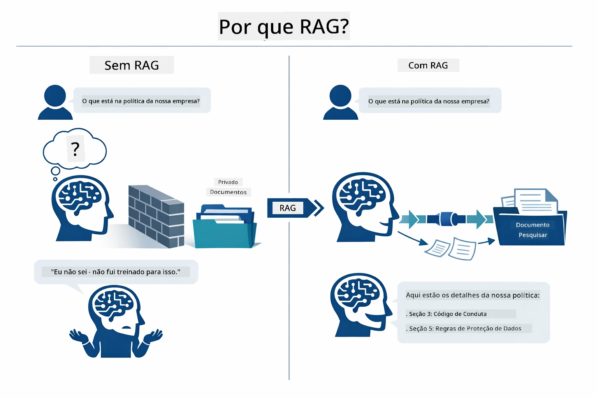

*Este diagrama mostra a diferença entre um LLM padrão (que adivinha a partir dos dados de treinamento) e um LLM melhorado com RAG (que consulta seus documentos primeiro).*

Veja como as partes se conectam de ponta a ponta. A pergunta do usuário passa por quatro etapas — embedding, busca vetorial, montagem do contexto e geração da resposta — cada uma construindo sobre a anterior:


*Este diagrama mostra o pipeline RAG de ponta a ponta — a consulta do usuário passa por embedding, busca vetorial, montagem do contexto e geração da resposta.*

O resto deste módulo detalha cada etapa, com código que você pode executar e modificar.

### Qual abordagem RAG este tutorial usa?

LangChain4j oferece três formas de implementar RAG, cada uma com um nível diferente de abstração. O diagrama abaixo as compara lado a lado:

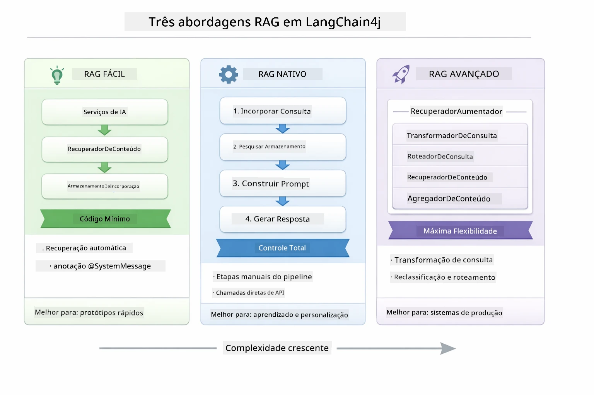

*Este diagrama compara as três abordagens RAG LangChain4j — Easy, Native e Advanced — mostrando seus componentes principais e quando usar cada uma.*

| Abordagem | O que faz | Compromisso |
|---|---|---|
| **Easy RAG** | Conecta tudo automaticamente via `AiServices` e `ContentRetriever`. Você anota uma interface, conecta um recuperador, e o LangChain4j cuida de embedding, busca e montagem do prompt nos bastidores. | Código mínimo, mas você não vê o que acontece em cada etapa. |
| **Native RAG** | Você chama o modelo de embedding, busca na loja, monta o prompt e gera a resposta — um passo explícito por vez. | Mais código, mas cada etapa é visível e modificável. |
| **Advanced RAG** | Usa o framework `RetrievalAugmentor` com transformadores de consulta plugáveis, roteadores, reclassificadores e injetores de conteúdo para pipelines de nível de produção. | Máxima flexibilidade, mas com complexidade significativamente maior. |

**Este tutorial usa a abordagem Native.** Cada etapa do pipeline RAG — embedding da consulta, busca na loja vetorial, montagem do contexto e geração da resposta — está explicitamente escrita em [`RagService.java`](../../../03-rag/src/main/java/com/example/langchain4j/rag/service/RagService.java). Isso é intencional: como recurso de aprendizado, é mais importante que você veja e entenda todas as etapas do que minimizar o código. Quando estiver confortável com a montagem das partes, pode avançar para Easy RAG para protótipos rápidos ou Advanced RAG para sistemas de produção.

> **💡 Já viu Easy RAG em ação?** O [módulo Início Rápido](../00-quick-start/README.md) inclui um exemplo de Perguntas e Respostas com Documentos ([`SimpleReaderDemo.java`](../../../00-quick-start/src/main/java/com/example/langchain4j/quickstart/SimpleReaderDemo.java)) que usa a abordagem Easy RAG — o LangChain4j trata embedding, busca e montagem do prompt automaticamente. Este módulo avança ao abrir esse pipeline para que você veja e controle cada etapa.

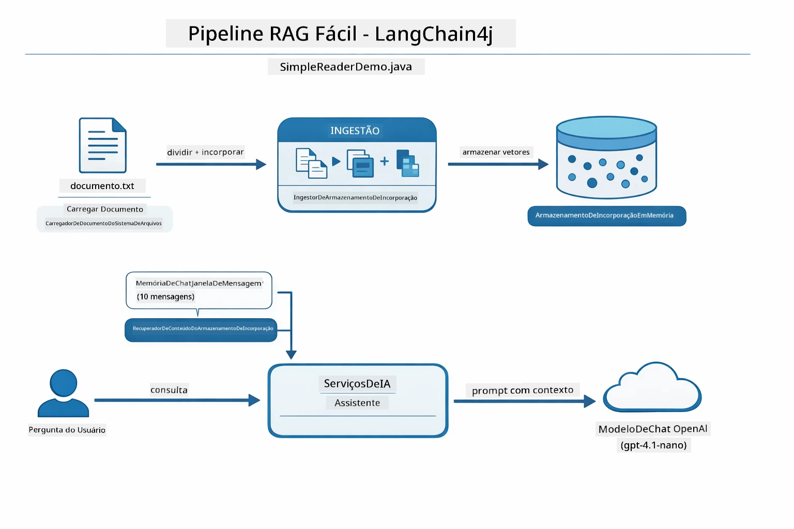

*Este diagrama mostra o pipeline Easy RAG do `SimpleReaderDemo.java`. Compare com a abordagem Native usada neste módulo: Easy RAG oculta embedding, recuperação e montagem do prompt atrás do `AiServices` e `ContentRetriever` — você carrega um documento, conecta um recuperador e obtém respostas. A abordagem Native neste módulo abre esse pipeline para que você chame cada etapa (embedar, buscar, montar contexto, gerar) manualmente, dando total visibilidade e controle.*

## Como Funciona

O pipeline RAG neste módulo divide-se em quatro etapas sequenciais que rodamse toda vez que um usuário faz uma pergunta. Primeiro, um documento enviado é **analisado e dividido em pedaços** gerenciáveis. Esses pedaços são convertidos em **embeddings vetoriais** e armazenados para comparação matemática. Quando uma consulta chega, o sistema executa uma **busca semântica** para encontrar os pedaços mais relevantes, e finalmente os passa como contexto ao LLM para **geração da resposta**. As seções abaixo detalham cada etapa com código e diagramas. Vamos olhar o primeiro passo.

### Processamento de Documento

[DocumentService.java](../../../03-rag/src/main/java/com/example/langchain4j/rag/service/DocumentService.java)

Quando você envia um documento, o sistema o analisa (PDF ou texto simples), anexa metadados como o nome do arquivo, e então o divide em pedaços — partes menores que cabem confortavelmente na janela de contexto do modelo. Esses pedaços se sobrepõem um pouco para que não se perca contexto nas bordas.

```java
// Analise o arquivo enviado e embrulhe-o em um Documento LangChain4j
Document document = Document.from(content, metadata);

// Divida em pedaços de 300 tokens com sobreposição de 30 tokens
DocumentSplitter splitter = DocumentSplitters
    .recursive(300, 30);

List<TextSegment> segments = splitter.split(document);
```

O diagrama abaixo mostra como isso funciona visualmente. Observe como cada pedaço compartilha alguns tokens com seus vizinhos — a sobreposição de 30 tokens garante que nenhum contexto importante se perca:

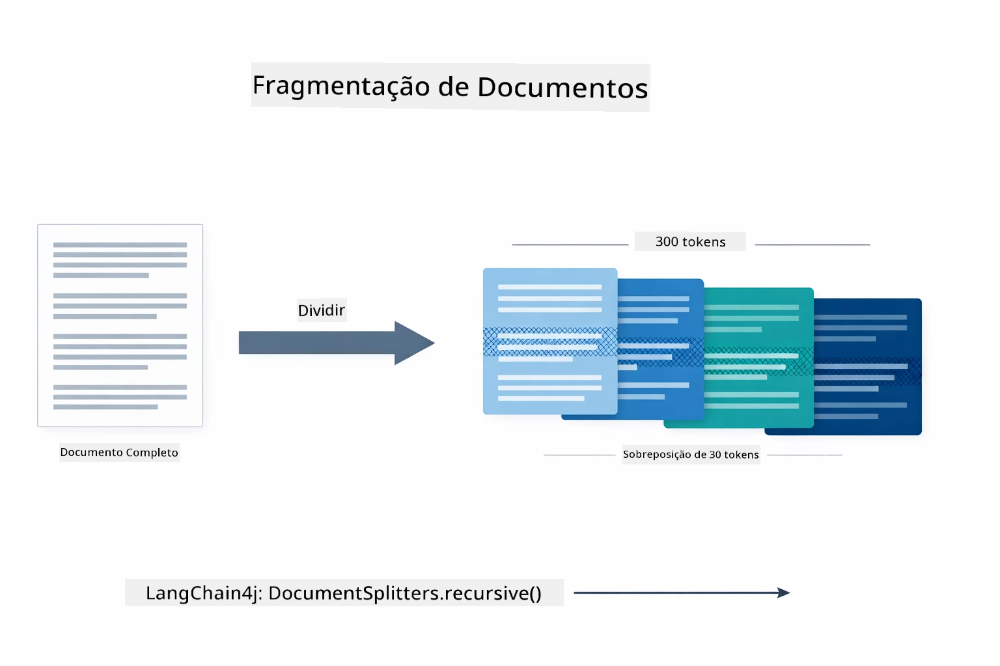

*Este diagrama mostra um documento sendo dividido em pedaços de 300 tokens com uma sobreposição de 30 tokens, preservando o contexto nas bordas dos pedaços.*

> **🤖 Experimente com o [GitHub Copilot](https://github.com/features/copilot) Chat:** Abra [`DocumentService.java`](../../../03-rag/src/main/java/com/example/langchain4j/rag/service/DocumentService.java) e pergunte:
> - "Como o LangChain4j divide documentos em pedaços e por que a sobreposição é importante?"
> - "Qual o tamanho ideal dos pedaços para diferentes tipos de documentos e por quê?"
> - "Como lidar com documentos em vários idiomas ou com formatações especiais?"

### Criando Embeddings

[LangChainRagConfig.java](../../../03-rag/src/main/java/com/example/langchain4j/rag/config/LangChainRagConfig.java)

Cada pedaço é convertido em uma representação numérica chamada embedding — essencialmente um conversor de significado para números. O modelo de embedding não é "inteligente" como um modelo de chat; não pode seguir instruções, raciocinar ou responder perguntas. O que ele faz é mapear texto em um espaço matemático onde significados semelhantes ficam próximos — "carro" perto de "automóvel", "política de reembolso" perto de "devolver meu dinheiro". Pense no modelo de chat como uma pessoa para conversar; o modelo de embedding é um sistema de arquivamento ultra eficiente.

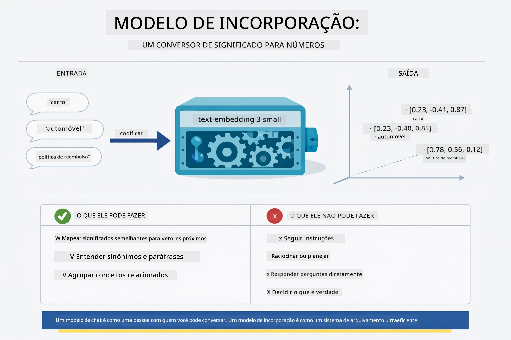

*Este diagrama mostra como um modelo de embedding converte texto em vetores numéricos, colocando significados semelhantes — como "carro" e "automóvel" — próximos no espaço vetorial.*

```java
@Bean
public EmbeddingModel embeddingModel() {
    return OpenAiOfficialEmbeddingModel.builder()
        .baseUrl(azureOpenAiEndpoint)
        .apiKey(azureOpenAiKey)
        .modelName(azureEmbeddingDeploymentName)
        .build();
}

EmbeddingStore<TextSegment> embeddingStore = 
    new InMemoryEmbeddingStore<>();
```

O diagrama de classes abaixo mostra os dois fluxos separados no pipeline RAG e as classes LangChain4j que os implementam. O **fluxo de ingestão** (executado uma vez no envio) divide o documento, embeda os pedaços e os armazena via `.addAll()`. O **fluxo de consulta** (executado a cada pergunta) embeda a questão, busca na loja via `.search()`, e passa o contexto correspondente ao modelo de chat. Ambos os fluxos se encontram na interface compartilhada `EmbeddingStore<TextSegment>`:

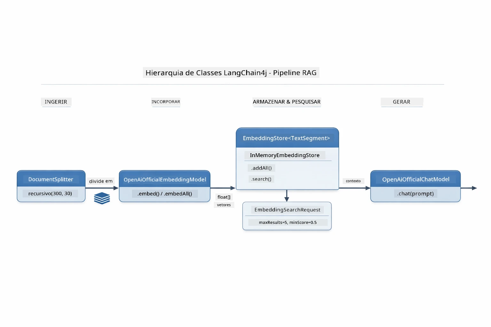

*Este diagrama mostra os dois fluxos no pipeline RAG — ingestão e consulta — e como eles se conectam através de um EmbeddingStore compartilhado.*

Uma vez armazenados os embeddings, conteúdos similares naturalmente se agrupam no espaço vetorial. A visualização abaixo mostra como documentos sobre tópicos relacionados ficam próximos, o que torna possível a busca semântica:


*Esta visualização mostra como documentos relacionados se agrupam no espaço vetorial 3D, com tópicos como Documentação Técnica, Regras de Negócio e FAQs formando grupos distintos.*

Quando um usuário busca, o sistema segue quatro passos: embeda os documentos uma vez, embeda a consulta a cada busca, compara o vetor da consulta contra todos os vetores armazenados usando similaridade cosseno, e retorna os top-K pedaços com maiores pontuações. O diagrama abaixo explica cada etapa e as classes LangChain4j envolvidas:

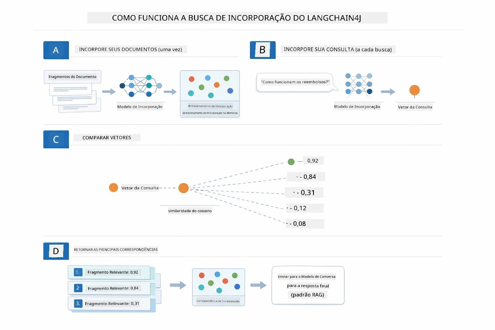

*Este diagrama mostra o processo de busca por embedding em quatro passos: embedar documentos, embedar a consulta, comparar vetores com similaridade cosseno e retornar os top-K resultados.*

### Busca Semântica

[RagService.java](../../../03-rag/src/main/java/com/example/langchain4j/rag/service/RagService.java)

Quando você faz uma pergunta, ela também vira um embedding. O sistema compara o embedding da sua pergunta com os embeddings de todos os pedaços do documento. Ele encontra os pedaços com significados mais similares — não apenas palavras-chave iguais, mas similaridade semântica real.

```java
Embedding queryEmbedding = embeddingModel.embed(question).content();

EmbeddingSearchRequest searchRequest = EmbeddingSearchRequest.builder()
    .queryEmbedding(queryEmbedding)
    .maxResults(5)
    .minScore(0.5)
    .build();

EmbeddingSearchResult<TextSegment> searchResult = embeddingStore.search(searchRequest);
List<EmbeddingMatch<TextSegment>> matches = searchResult.matches();

for (EmbeddingMatch<TextSegment> match : matches) {
    String relevantText = match.embedded().text();
    double score = match.score();
}
```

O diagrama abaixo contrasta busca semântica com busca tradicional por palavra-chave. Uma busca por palavra-chave por "veículo" perde um trecho sobre "carros e caminhões", mas a busca semântica entende que eles significam o mesmo e o retorna como correspondência de alta pontuação:

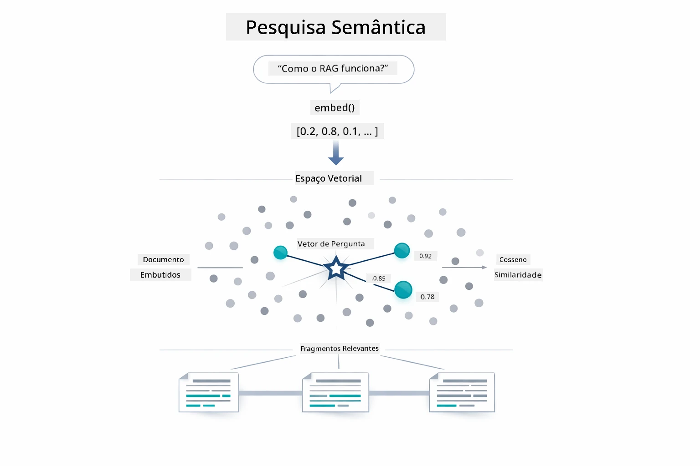

*Este diagrama compara a busca por palavras-chave com a busca semântica, mostrando como a busca semântica recupera conteúdos conceitualmente relacionados mesmo quando as palavras exatas diferem.*

Por trás, a similaridade é medida usando similaridade cosseno — basicamente perguntando "esses dois vetores apontam para a mesma direção?" Dois pedaços podem usar palavras completamente diferentes, mas se significarem a mesma coisa seus vetores apontam na mesma direção e pontuam perto de 1.0:

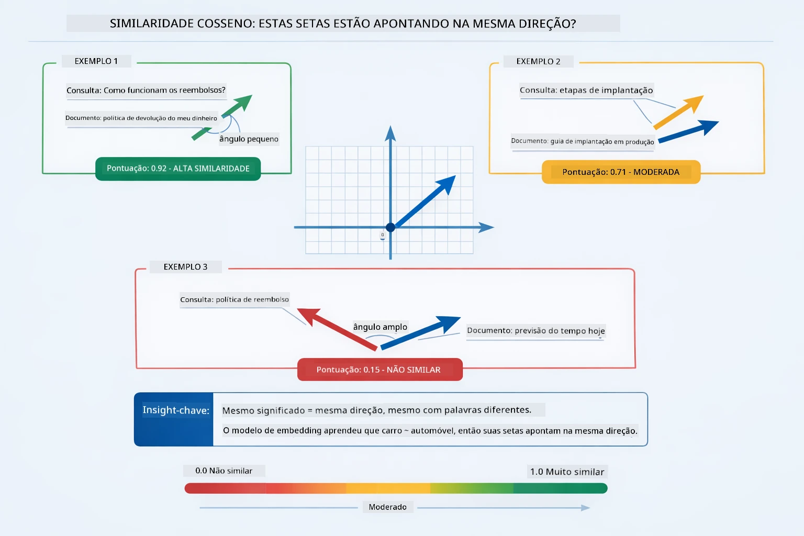
*Este diagrama ilustra a similaridade de cosseno como o ângulo entre vetores de embedding — vetores mais alinhados pontuam mais próximos de 1.0, indicando maior similaridade semântica.*

> **🤖 Experimente com [GitHub Copilot](https://github.com/features/copilot) Chat:** Abra [`RagService.java`](../../../03-rag/src/main/java/com/example/langchain4j/rag/service/RagService.java) e pergunte:
> - "Como funciona a busca por similaridade com embeddings e o que determina a pontuação?"
> - "Qual limiar de similaridade devo usar e como isso afeta os resultados?"
> - "Como lidar com casos onde nenhum documento relevante é encontrado?"

### Geração de Resposta

[RagService.java](../../../03-rag/src/main/java/com/example/langchain4j/rag/service/RagService.java)

Os pedaços mais relevantes são reunidos em um prompt estruturado que inclui instruções explícitas, o contexto recuperado e a pergunta do usuário. O modelo lê esses pedaços específicos e responde com base nessas informações — ele só pode usar o que está à sua frente, o que previne alucinações.

```java
String context = matches.stream()
    .map(match -> match.embedded().text())
    .collect(Collectors.joining("\n\n"));

String prompt = String.format("""
    Answer the question based on the following context.
    If the answer cannot be found in the context, say so.

    Context:
    %s

    Question: %s

    Answer:""", context, request.question());

String answer = chatModel.chat(prompt);
```

O diagrama abaixo mostra essa montagem em ação — os pedaços com maior pontuação da etapa de busca são inseridos no template do prompt, e o `OpenAiOfficialChatModel` gera uma resposta fundamentada:

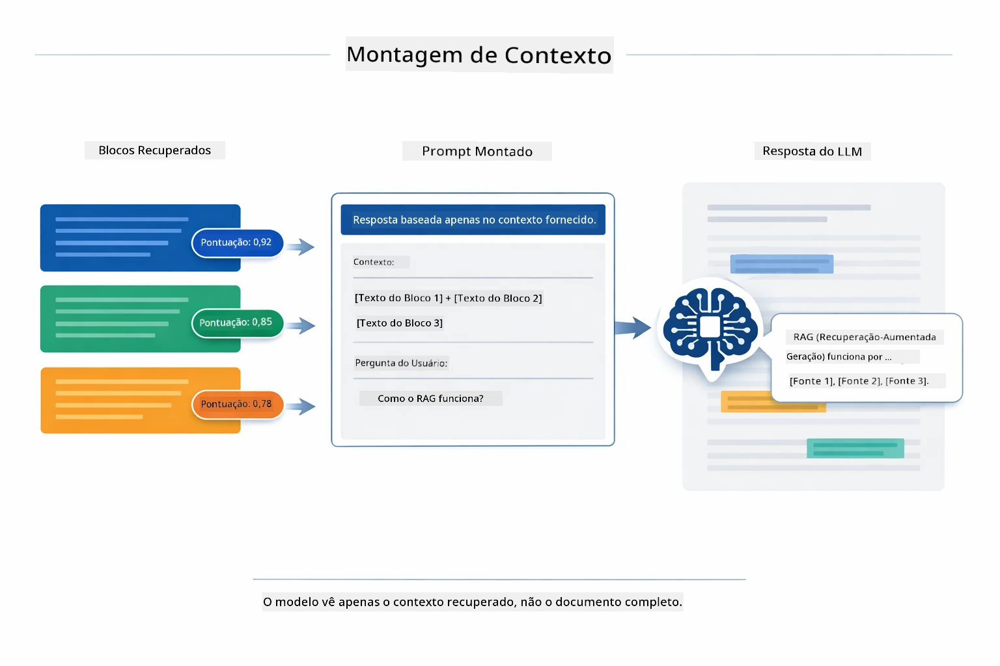

*Este diagrama mostra como os pedaços com maior pontuação são montados em um prompt estruturado, permitindo que o modelo gere uma resposta fundamentada a partir dos seus dados.*

## Executar a Aplicação

**Verifique a implantação:**

Certifique-se de que o arquivo `.env` existe no diretório raiz com as credenciais do Azure (criado durante o Módulo 01):

**Bash:**
```bash
cat ../.env  # Deve mostrar AZURE_OPENAI_ENDPOINT, API_KEY, DEPLOYMENT
```

**PowerShell:**
```powershell
Get-Content ..\.env  # Deve mostrar AZURE_OPENAI_ENDPOINT, API_KEY, DEPLOYMENT
```

**Inicie a aplicação:**

> **Nota:** Se você já iniciou todas as aplicações usando `./start-all.sh` do Módulo 01, este módulo já está rodando na porta 8081. Você pode pular os comandos de inicialização abaixo e ir diretamente para http://localhost:8081.

**Opção 1: Usando o Spring Boot Dashboard (Recomendado para usuários do VS Code)**

O dev container inclui a extensão Spring Boot Dashboard, que fornece uma interface visual para gerenciar todas as aplicações Spring Boot. Você pode encontrá-la na Barra de Atividades do lado esquerdo do VS Code (procure o ícone Spring Boot).

No Spring Boot Dashboard, você pode:
- Ver todas as aplicações Spring Boot disponíveis no workspace
- Iniciar/parar aplicações com um clique
- Visualizar logs da aplicação em tempo real
- Monitorar o status da aplicação

Basta clicar no botão de play ao lado de "rag" para iniciar este módulo, ou iniciar todos os módulos de uma vez.


*Esta captura de tela mostra o Spring Boot Dashboard no VS Code, onde você pode iniciar, parar e monitorar aplicações visualmente.*

**Opção 2: Usando scripts shell**

Inicie todas as aplicações web (módulos 01-04):

**Bash:**
```bash
cd ..  # Do diretório raiz
./start-all.sh
```

**PowerShell:**
```powershell
cd ..  # A partir do diretório raiz
.\start-all.ps1
```

Ou inicie apenas este módulo:

**Bash:**
```bash
cd 03-rag
./start.sh
```

**PowerShell:**
```powershell
cd 03-rag
.\start.ps1
```

Ambos os scripts carregam automaticamente as variáveis de ambiente do arquivo `.env` na raiz e irão compilar os JARs se eles não existirem.

> **Nota:** Se preferir compilar todos os módulos manualmente antes de iniciar:
>
> **Bash:**
> ```bash
> cd ..  # Go to root directory
> mvn clean package -DskipTests
> ```
>
> **PowerShell:**
> ```powershell
> cd ..  # Go to root directory
> mvn clean package -DskipTests
> ```

Abra http://localhost:8081 no seu navegador.

**Para parar:**

**Bash:**
```bash
./stop.sh  # Apenas este módulo
# Ou
cd .. && ./stop-all.sh  # Todos os módulos
```

**PowerShell:**
```powershell
.\stop.ps1  # Apenas este módulo
# Ou
cd ..; .\stop-all.ps1  # Todos os módulos
```

## Usando a Aplicação

A aplicação fornece uma interface web para upload de documentos e questionamentos.

<a href="images/rag-homepage.png"></a>

*Esta captura de tela mostra a interface da aplicação RAG onde você faz upload de documentos e faz perguntas.*

### Fazer Upload de um Documento

Comece fazendo upload de um documento — arquivos TXT funcionam melhor para testes. Um arquivo `sample-document.txt` está disponível neste diretório e contém informações sobre recursos do LangChain4j, implementação RAG, e melhores práticas — perfeito para testar o sistema.

O sistema processa seu documento, divide em pedaços e cria embeddings para cada pedaço. Isso acontece automaticamente ao fazer upload.

### Fazer Perguntas

Agora faça perguntas específicas sobre o conteúdo do documento. Tente algo factual que esteja claramente declarado no documento. O sistema busca pedaços relevantes, os inclui no prompt e gera uma resposta.

### Verificar Referências de Fonte

Observe que cada resposta inclui referências de fontes com pontuações de similaridade. Essas pontuações (de 0 a 1) mostram o quão relevante cada pedaço foi para sua pergunta. Pontuações mais altas significam melhores correspondências. Isso permite verificar a resposta com o material original.

<a href="images/rag-query-results.png"></a>

*Esta captura de tela mostra resultados da consulta com a resposta gerada, referências de fonte e pontuações de relevância para cada pedaço recuperado.*

### Experimente Perguntas

Experimente diferentes tipos de perguntas:
- Fatos específicos: "Qual é o tema principal?"
- Comparações: "Qual a diferença entre X e Y?"
- Resumos: "Resuma os pontos chave sobre Z"

Observe como as pontuações de relevância mudam conforme sua pergunta combina com o conteúdo do documento.

## Conceitos-Chave

### Estratégia de Chunking

Documentos são divididos em pedaços de 300 tokens com 30 tokens de sobreposição. Esse equilíbrio garante que cada pedaço tenha contexto suficiente para ser significativo, enquanto permanece pequeno o bastante para incluir múltiplos pedaços no prompt.

### Pontuações de Similaridade

Cada pedaço recuperado vem com uma pontuação de similaridade entre 0 e 1 que indica o quão próximo ele combina com a pergunta do usuário. O diagrama abaixo visualiza as faixas de pontuação e como o sistema as usa para filtrar resultados:

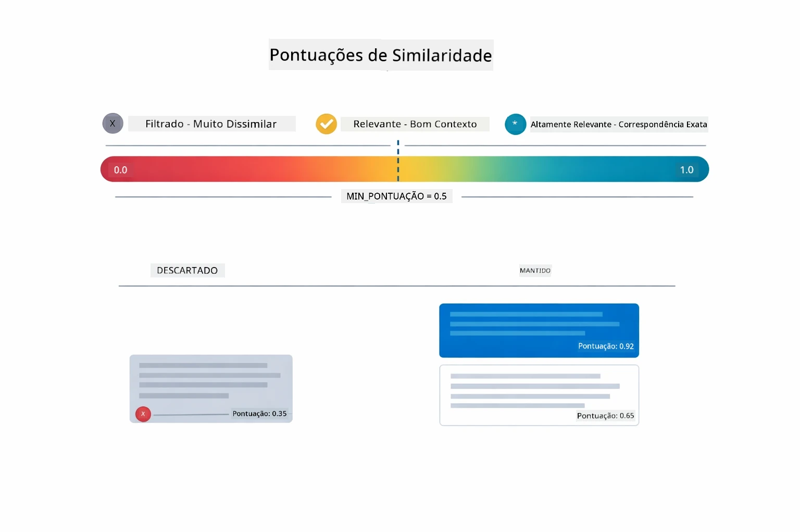

*Este diagrama mostra faixas de pontuação de 0 a 1, com um limiar mínimo de 0.5 que filtra pedaços irrelevantes.*

As pontuações variam de 0 a 1:
- 0.7-1.0: Altamente relevante, correspondência exata
- 0.5-0.7: Relevante, bom contexto
- Abaixo de 0.5: Filtrado, muito diferente

O sistema recupera apenas pedaços acima do limiar mínimo para assegurar qualidade.

Embeddings funcionam bem quando o significado forma agrupamentos claros, mas possuem pontos cegos. O diagrama abaixo mostra os modos comuns de falha — pedaços muito grandes produzem vetores confusos, pedaços muito pequenos carecem de contexto, termos ambíguos apontam para múltiplos agrupamentos, e buscas por correspondência exata (IDs, números de parte) não funcionam com embeddings:

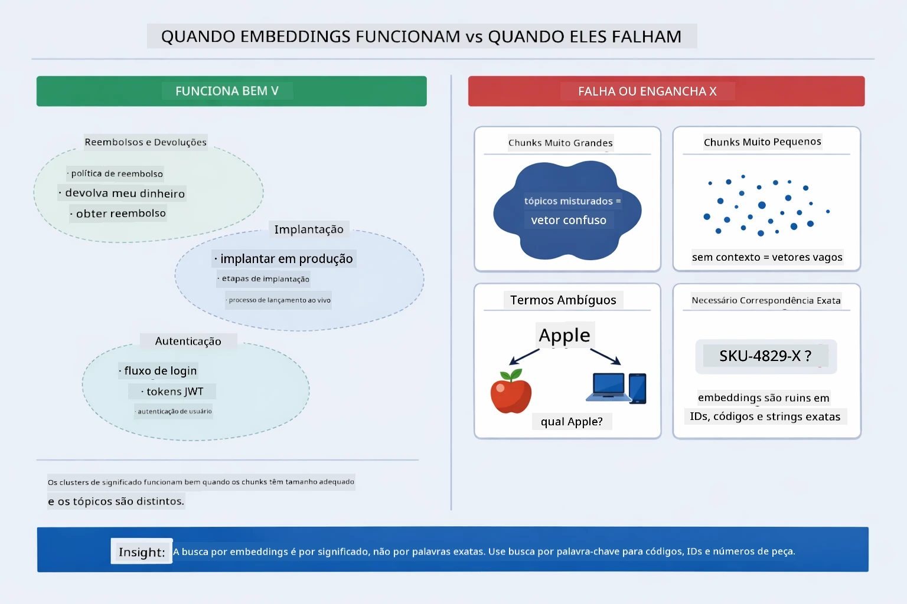

*Este diagrama mostra modos comuns de falha de embedding: pedaços muito grandes, pedaços muito pequenos, termos ambíguos que apontam para múltiplos agrupamentos, e buscas por correspondência exata como IDs.*

### Armazenamento em Memória

Este módulo usa armazenamento em memória para simplicidade. Quando você reinicia a aplicação, os documentos carregados são perdidos. Sistemas de produção usam bancos de dados vetoriais persistentes como Qdrant ou Azure AI Search.

### Gerenciamento da Janela de Contexto

Cada modelo tem uma janela de contexto máxima. Você não pode incluir todo pedaço de um documento grande. O sistema recupera os top N pedaços mais relevantes (padrão 5) para respeitar os limites e fornecer contexto suficiente para respostas precisas.

## Quando o RAG Importa

RAG nem sempre é a abordagem certa. O guia de decisão abaixo ajuda a determinar quando RAG agrega valor versus quando abordagens mais simples — como incluir conteúdo diretamente no prompt ou confiar no conhecimento embutido do modelo — são suficientes:

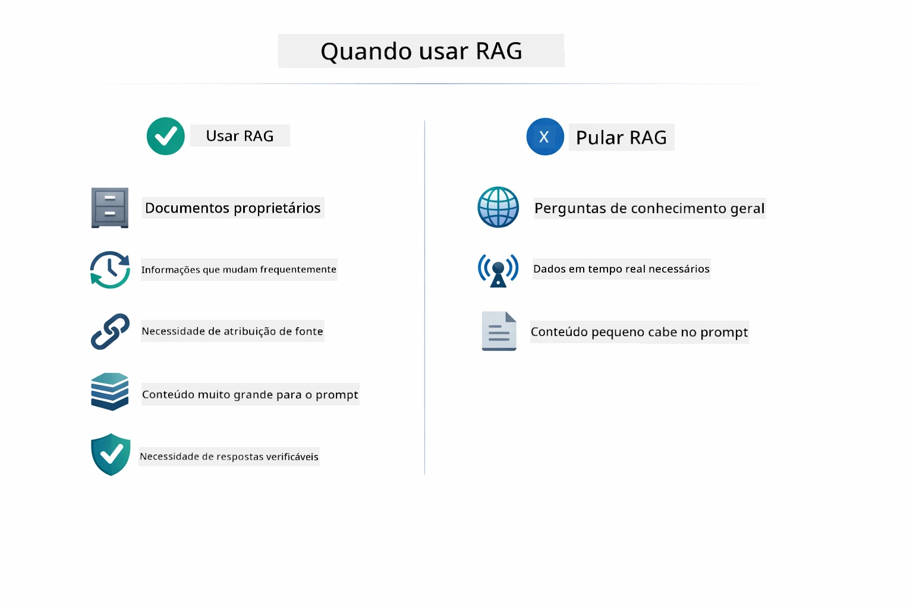

*Este diagrama mostra um guia de decisão para quando RAG agrega valor versus quando abordagens mais simples são suficientes.*

**Use RAG quando:**
- Responder perguntas sobre documentos proprietários
- Informações mudam frequentemente (políticas, preços, especificações)
- Precisão exige atribuição da fonte
- Conteúdo é grande demais para caber em um único prompt
- Você precisa de respostas verificáveis e fundamentadas

**Não use RAG quando:**
- Perguntas exigem conhecimento geral que o modelo já possui
- Dados em tempo real são necessários (RAG trabalha com documentos carregados)
- Conteúdo é pequeno o suficiente para incluir diretamente nos prompts

## Próximos Passos

**Próximo Módulo:** [04-tools - Agentes de IA com Ferramentas](../04-tools/README.md)

---

**Navegação:** [← Anterior: Módulo 02 - Engenharia de Prompt](../02-prompt-engineering/README.md) | [Voltar ao Início](../README.md) | [Próximo: Módulo 04 - Ferramentas →](../04-tools/README.md)

---

<!-- CO-OP TRANSLATOR DISCLAIMER START -->
**Aviso Legal**:  
Este documento foi traduzido utilizando o serviço de tradução por IA [Co-op Translator](https://github.com/Azure/co-op-translator). Embora nos esforcemos para garantir a precisão, esteja ciente de que traduções automáticas podem conter erros ou imprecisões. O documento original em seu idioma nativo deve ser considerado a fonte autorizada. Para informações críticas, recomenda-se tradução profissional humana. Não nos responsabilizamos por quaisquer mal-entendidos ou interpretações equivocadas decorrentes do uso desta tradução.
<!-- CO-OP TRANSLATOR DISCLAIMER END -->