# Módulo 04: Agentes de IA com Ferramentas

## Índice

- [O que você vai aprender](../../../04-tools)
- [Pré-requisitos](../../../04-tools)
- [Entendendo Agentes de IA com Ferramentas](../../../04-tools)
- [Como funciona a Chamada de Ferramentas](../../../04-tools)
  - [Definições de Ferramentas](../../../04-tools)
  - [Tomada de Decisão](../../../04-tools)
  - [Execução](../../../04-tools)
  - [Geração de Resposta](../../../04-tools)
  - [Arquitetura: Auto-Fiação Spring Boot](../../../04-tools)
- [Encadeamento de Ferramentas](../../../04-tools)
- [Executar a Aplicação](../../../04-tools)
- [Usando a Aplicação](../../../04-tools)
  - [Teste o Uso Simples de Ferramentas](../../../04-tools)
  - [Teste o Encadeamento de Ferramentas](../../../04-tools)
  - [Veja o Fluxo da Conversa](../../../04-tools)
  - [Experimente com Pedidos Diferentes](../../../04-tools)
- [Conceitos Chave](../../../04-tools)
  - [Padrão ReAct (Raciocínio e Ação)](../../../04-tools)
  - [A Descrição das Ferramentas é Importante](../../../04-tools)
  - [Gerenciamento de Sessão](../../../04-tools)
  - [Tratamento de Erros](../../../04-tools)
- [Ferramentas Disponíveis](../../../04-tools)
- [Quando Usar Agentes Baseados em Ferramentas](../../../04-tools)
- [Ferramentas vs RAG](../../../04-tools)
- [Próximos Passos](../../../04-tools)

## O que você vai aprender

Até agora, você aprendeu como ter conversas com IA, estruturar prompts de forma eficaz e fundamentar respostas em seus documentos. Mas ainda existe uma limitação fundamental: modelos de linguagem só podem gerar texto. Eles não podem verificar o clima, realizar cálculos, consultar bancos de dados ou interagir com sistemas externos.

Ferramentas mudam isso. Ao dar ao modelo acesso a funções que ele pode chamar, você o transforma de um gerador de texto em um agente capaz de tomar ações. O modelo decide quando precisa de uma ferramenta, qual usar e quais parâmetros passar. Seu código executa a função e retorna o resultado. O modelo incorpora esse resultado em sua resposta.

## Pré-requisitos

- Completar o [Módulo 01 - Introdução](../01-introduction/README.md) (recursos Azure OpenAI implantados)
- Recomenda-se ter concluído os módulos anteriores (este módulo faz referência aos [conceitos RAG do Módulo 03](../03-rag/README.md) na comparação Ferramentas vs RAG)
- Arquivo `.env` no diretório raiz com credenciais Azure (criado pelo `azd up` no Módulo 01)

> **Nota:** Se você ainda não completou o Módulo 01, siga primeiro as instruções de implantação lá.

## Entendendo Agentes de IA com Ferramentas

> **📝 Nota:** O termo "agentes" neste módulo refere-se a assistentes de IA aprimorados com capacidades de chamada de ferramentas. Isso é diferente dos padrões **Agentic AI** (agentes autônomos com planejamento, memória e raciocínio em múltiplas etapas) que veremos no [Módulo 05: MCP](../05-mcp/README.md).

Sem ferramentas, um modelo de linguagem só pode gerar texto a partir de seus dados de treinamento. Pergunte sobre o clima atual, ele terá que adivinhar. Dê-lhe ferramentas, e ele pode chamar uma API de clima, fazer cálculos ou consultar um banco de dados — e então tecer esses resultados reais em sua resposta.

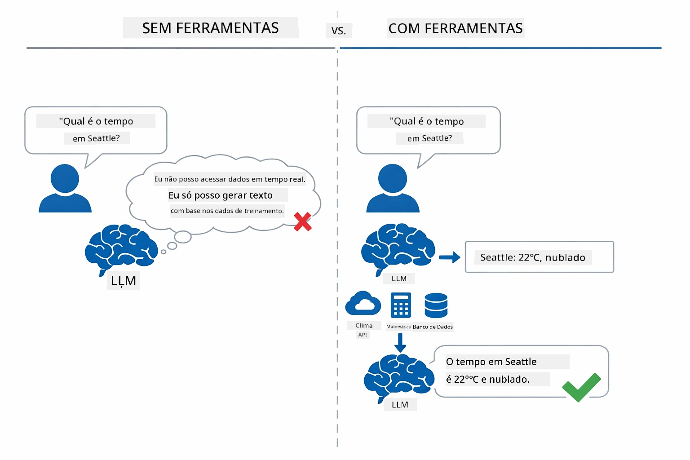

*Sem ferramentas o modelo só pode adivinhar — com ferramentas ele pode chamar APIs, executar cálculos e retornar dados em tempo real.*

Um agente de IA com ferramentas segue um padrão de **Raciocínio e Ação (ReAct)**. O modelo não apenas responde — ele pensa no que precisa, age chamando uma ferramenta, observa o resultado e então decide se age novamente ou entrega a resposta final:

1. **Raciocina** — O agente analisa a pergunta do usuário e determina qual informação ele precisa
2. **Age** — O agente seleciona a ferramenta correta, gera os parâmetros adequados e a chama
3. **Observa** — O agente recebe a saída da ferramenta e avalia o resultado
4. **Repete ou Responde** — Se mais dados forem necessários, o agente volta; caso contrário, compõe a resposta em linguagem natural

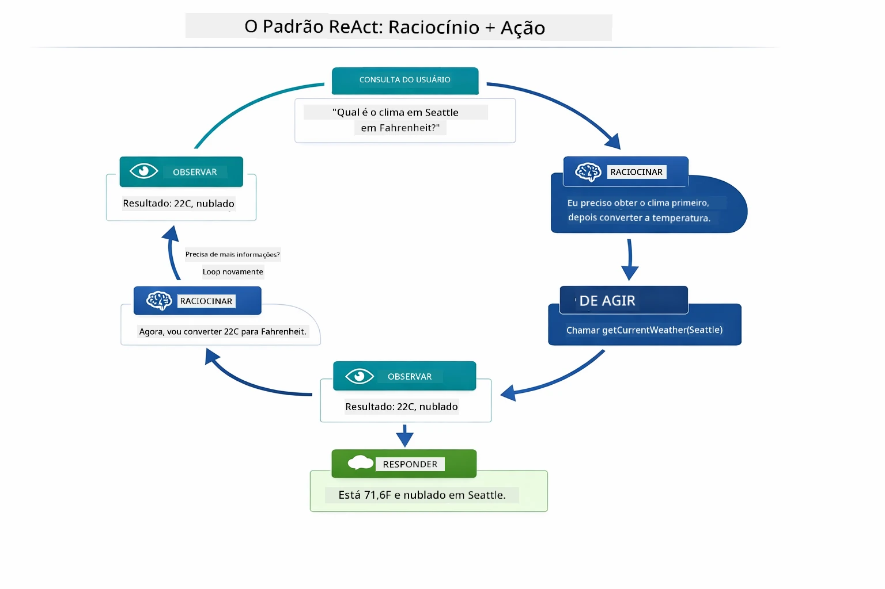

*O ciclo ReAct — o agente raciocina sobre o que fazer, age chamando uma ferramenta, observa o resultado e repete até poder entregar a resposta final.*

Isso acontece automaticamente. Você define as ferramentas e suas descrições. O modelo cuida da tomada de decisão sobre quando e como usá-las.

## Como funciona a Chamada de Ferramentas

### Definições de Ferramentas

[WeatherTool.java](../../../04-tools/src/main/java/com/example/langchain4j/agents/tools/WeatherTool.java) | [TemperatureTool.java](../../../04-tools/src/main/java/com/example/langchain4j/agents/tools/TemperatureTool.java)

Você define funções com descrições claras e especificações de parâmetros. O modelo vê essas descrições no seu prompt de sistema e entende o que cada ferramenta faz.

```java
@Component
public class WeatherTool {
    
    @Tool("Get the current weather for a location")
    public String getCurrentWeather(@P("Location name") String location) {
        // Sua lógica de consulta do clima
        return "Weather in " + location + ": 22°C, cloudy";
    }
}

@AiService
public interface Assistant {
    String chat(@MemoryId String sessionId, @UserMessage String message);
}

// Assistente é automaticamente configurado pelo Spring Boot com:
// - Bean ChatModel
// - Todos os métodos @Tool das classes @Component
// - ChatMemoryProvider para gerenciamento de sessão
```

O diagrama abaixo detalha cada anotação e mostra como cada parte ajuda a IA a entender quando chamar a ferramenta e quais argumentos passar:

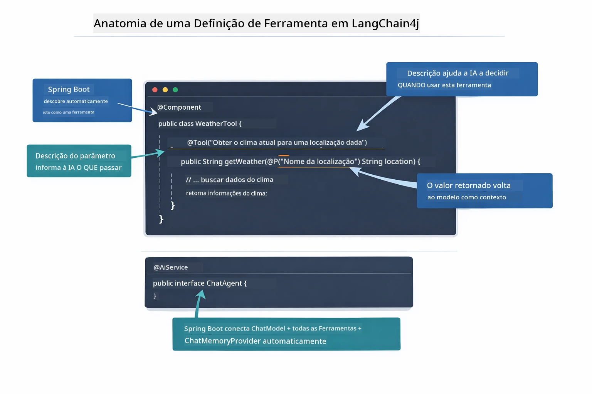

*Anatomia de uma definição de ferramenta — @Tool informa à IA quando usá-la, @P descreve cada parâmetro, e @AiService conecta tudo na inicialização.*

> **🤖 Experimente com o Chat [GitHub Copilot](https://github.com/features/copilot):** Abra [`WeatherTool.java`](../../../04-tools/src/main/java/com/example/langchain4j/agents/tools/WeatherTool.java) e pergunte:
> - "Como eu integraria uma API real de clima como OpenWeatherMap ao invés de dados simulados?"
> - "O que torna uma descrição de ferramenta boa para ajudar a IA a usá-la corretamente?"
> - "Como devo tratar erros de API e limites de taxa nas implementações de ferramentas?"

### Tomada de Decisão

Quando um usuário pergunta "Como está o tempo em Seattle?", o modelo não escolhe uma ferramenta aleatoriamente. Ele compara a intenção do usuário com cada descrição de ferramenta que tem acesso, pontua a relevância de cada uma e seleciona a melhor. Então gera uma chamada estruturada para a função com os parâmetros corretos — neste caso, definindo `location` para `"Seattle"`.

Se nenhuma ferramenta corresponder ao pedido do usuário, o modelo responde a partir de seu próprio conhecimento. Se múltiplas ferramentas corresponderem, escolhe a mais específica.

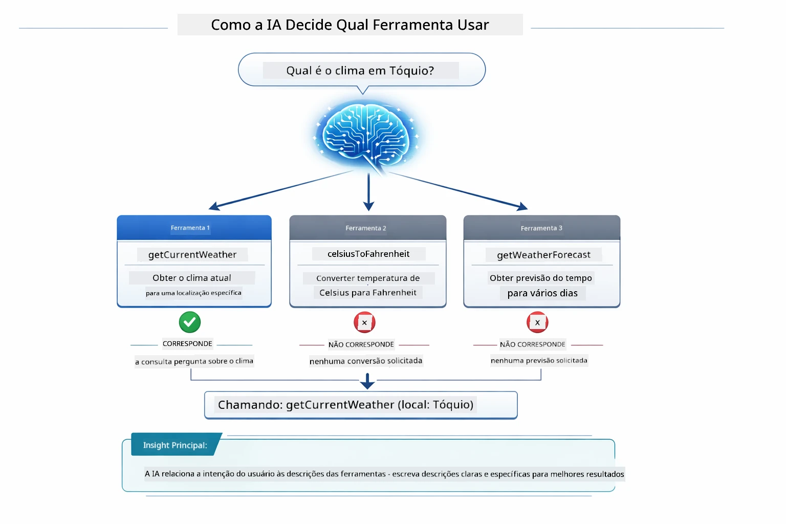

*O modelo avalia toda ferramenta disponível contra a intenção do usuário e seleciona a melhor correspondência — por isso é importante escrever descrições de ferramentas claras e específicas.*

### Execução

[AgentService.java](../../../04-tools/src/main/java/com/example/langchain4j/agents/service/AgentService.java)

O Spring Boot conecta automaticamente a interface declarativa `@AiService` com todas as ferramentas registradas, e o LangChain4j executa as chamadas de ferramentas automaticamente. Nos bastidores, uma chamada completa passa por seis etapas — da pergunta em linguagem natural do usuário até a resposta em linguagem natural:

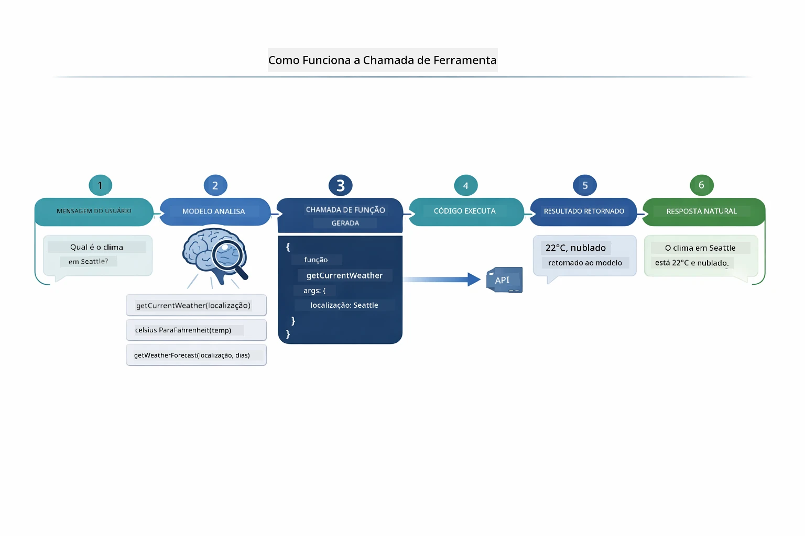

*Fluxo completo — o usuário faz uma pergunta, o modelo seleciona uma ferramenta, o LangChain4j a executa, e o modelo incorpora o resultado numa resposta natural.*

> **🤖 Experimente com o Chat [GitHub Copilot](https://github.com/features/copilot):** Abra [`AgentService.java`](../../../04-tools/src/main/java/com/example/langchain4j/agents/service/AgentService.java) e pergunte:
> - "Como funciona o padrão ReAct e por que é eficaz para agentes de IA?"
> - "Como o agente decide qual ferramenta usar e em que ordem?"
> - "O que acontece se a execução de uma ferramenta falhar - como tratar erros de forma robusta?"

### Geração de Resposta

O modelo recebe os dados do clima e os formata numa resposta em linguagem natural para o usuário.

### Arquitetura: Auto-Fiação Spring Boot

Este módulo usa a integração do LangChain4j com Spring Boot por meio de interfaces declarativas `@AiService`. Na inicialização, o Spring Boot descobre cada `@Component` que contém métodos `@Tool`, seu bean `ChatModel`, e o `ChatMemoryProvider` — então conecta tudo numa única interface `Assistant` sem nenhum código boilerplate.

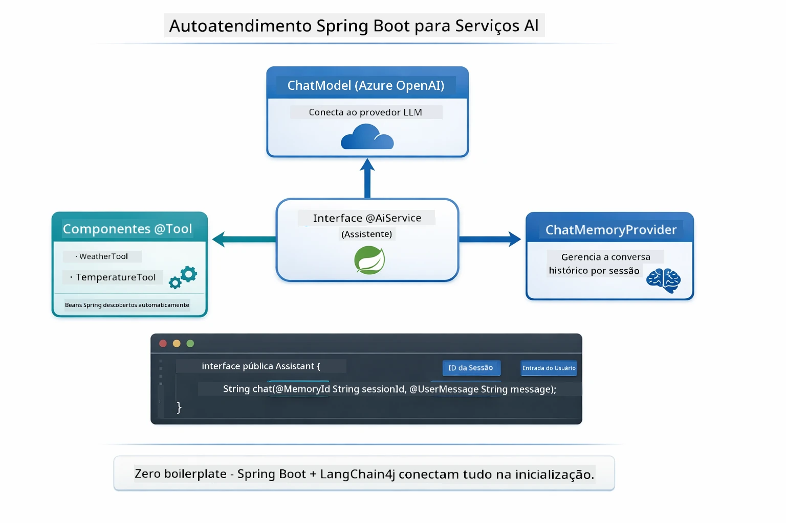

*A interface @AiService junta o ChatModel, componentes de ferramentas e o provedor de memória — o Spring Boot faz toda a conexão automaticamente.*

Benefícios principais deste método:

- **Auto-fiação Spring Boot** — ChatModel e ferramentas injetados automaticamente
- **Padrão @MemoryId** — Gerenciamento automático da memória baseado em sessão
- **Instância única** — Assistente criado uma vez e reutilizado para melhor desempenho
- **Execução com segurança de tipos** — métodos Java chamados diretamente com conversão de tipos
- **Orquestração de múltiplas interações** — Gerencia encadeamento de ferramentas automaticamente
- **Zero boilerplate** — nenhuma chamada manual `AiServices.builder()` ou gerenciamento manual de HashMap de memória

Abordagens alternativas (com `AiServices.builder()` manual) requerem mais código e não aproveitam a integração Spring Boot.

## Encadeamento de Ferramentas

**Encadeamento de Ferramentas** — O verdadeiro poder dos agentes baseados em ferramentas aparece quando uma só pergunta exige múltiplas ferramentas. Pergunte "Qual a temperatura em Seattle em Fahrenheit?" e o agente encadeia automaticamente duas ferramentas: primeiro chama `getCurrentWeather` para obter a temperatura em Celsius, depois passa esse valor para `celsiusToFahrenheit` para conversão — tudo em uma única rodada de conversa.

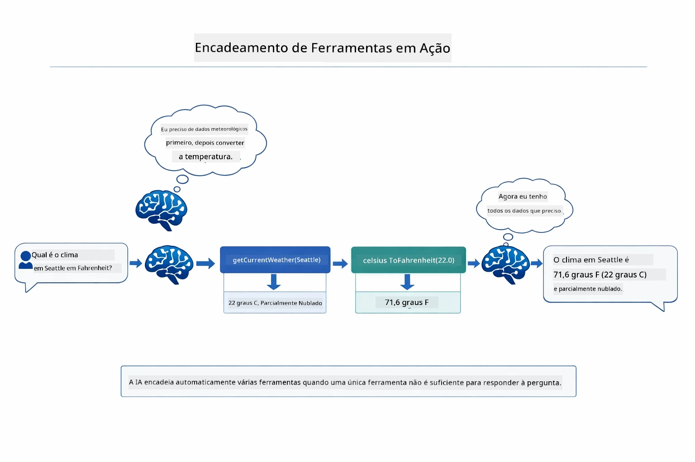

*Encadeamento de ferramentas em ação — o agente chama getCurrentWeather primeiro, depois direciona o resultado em Celsius para celsiusToFahrenheit, e entrega uma resposta combinada.*

**Falhas Elegantes** — Peça o clima de uma cidade que não está nos dados simulados. A ferramenta retorna uma mensagem de erro, e a IA explica que não pode ajudar em vez de travar. As ferramentas falham de forma segura. O diagrama abaixo contrasta as duas abordagens — com tratamento adequado de erro, o agente captura a exceção e responde de forma útil, enquanto sem ele a aplicação inteira trava:

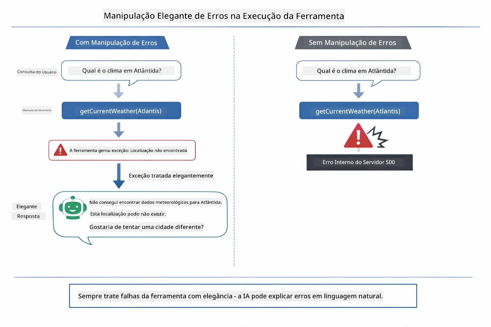

*Quando uma ferramenta falha, o agente captura o erro e responde com uma explicação útil ao invés de travar.*

Isso acontece em uma única rodada de conversa. O agente orquestra múltiplas chamadas de ferramentas autonomamente.

## Executar a Aplicação

**Verificar implantação:**

Confirme que o arquivo `.env` existe no diretório raiz com as credenciais Azure (criado no Módulo 01). Execute isso a partir do diretório do módulo (`04-tools/`):

**Bash:**
```bash
cat ../.env  # Deve mostrar AZURE_OPENAI_ENDPOINT, API_KEY, DEPLOYMENT
```

**PowerShell:**
```powershell
Get-Content ..\.env  # Deve mostrar AZURE_OPENAI_ENDPOINT, API_KEY, DEPLOYMENT
```

**Iniciar a aplicação:**

> **Nota:** Se você já iniciou todas as aplicações usando `./start-all.sh` a partir do diretório raiz (como descrito no Módulo 01), este módulo já está rodando na porta 8084. Você pode pular os comandos de início abaixo e ir diretamente para http://localhost:8084.

**Opção 1: Usando o Spring Boot Dashboard (Recomendado para usuários VS Code)**

O contêiner de desenvolvimento inclui a extensão Spring Boot Dashboard, que fornece uma interface visual para gerenciar todas as aplicações Spring Boot. Você a encontra na Barra de Atividades no lado esquerdo do VS Code (procure o ícone Spring Boot).

No Spring Boot Dashboard você pode:
- Ver todas as aplicações Spring Boot disponíveis no workspace
- Iniciar/parar aplicações com um clique
- Visualizar logs em tempo real
- Monitorar o status das aplicações

Basta clicar no botão de play ao lado de "tools" para iniciar este módulo, ou iniciar todos os módulos de uma vez.

Veja como o Spring Boot Dashboard aparece no VS Code:


*O Spring Boot Dashboard no VS Code — inicie, pare e monitore todos os módulos em um só lugar*

**Opção 2: Usando scripts shell**

Inicie todas as aplicações web (módulos 01-04):

**Bash:**
```bash
cd ..  # Do diretório raiz
./start-all.sh
```

**PowerShell:**
```powershell
cd ..  # Do diretório raiz
.\start-all.ps1
```

Ou inicie só este módulo:

**Bash:**
```bash
cd 04-tools
./start.sh
```

**PowerShell:**
```powershell
cd 04-tools
.\start.ps1
```

Ambos os scripts carregam automaticamente variáveis de ambiente do arquivo `.env` da raiz e constroem os JARs se eles não existirem.

> **Nota:** Se preferir construir manualmente todos os módulos antes de iniciar:
>
> **Bash:**
> ```bash
> cd ..  # Go to root directory
> mvn clean package -DskipTests
> ```
>
> **PowerShell:**
> ```powershell
> cd ..  # Go to root directory
> mvn clean package -DskipTests
> ```

Abra http://localhost:8084 no seu navegador.

**Para parar:**

**Bash:**
```bash
./stop.sh  # Apenas este módulo
# Ou
cd .. && ./stop-all.sh  # Todos os módulos
```

**PowerShell:**
```powershell
.\stop.ps1  # Apenas este módulo
# Ou
cd ..; .\stop-all.ps1  # Todos os módulos
```

## Usando a Aplicação

A aplicação oferece uma interface web onde você pode interagir com um agente de IA que tem acesso a ferramentas de clima e conversão de temperatura. Veja como a interface é — inclui exemplos para começar rapidamente e um painel de chat para enviar pedidos:
<a href="images/tools-homepage.png"></a>

*A interface Ferramentas do Agente de IA - exemplos rápidos e interface de chat para interagir com ferramentas*

### Experimente o Uso Simples de Ferramentas

Comece com uma solicitação simples: "Converta 100 graus Fahrenheit para Celsius". O agente reconhece que precisa da ferramenta de conversão de temperatura, chama-a com os parâmetros corretos e retorna o resultado. Note como isso parece natural - você não especificou qual ferramenta usar nem como chamá-la.

### Teste a Conexão de Ferramentas

Agora tente algo mais complexo: "Qual é o clima em Seattle e converta para Fahrenheit?" Observe o agente trabalhando por etapas. Ele primeiro obtém o clima (que retorna em Celsius), reconhece que precisa converter para Fahrenheit, chama a ferramenta de conversão e combina ambos os resultados em uma resposta única.

### Veja o Fluxo da Conversa

A interface de chat mantém o histórico da conversa, permitindo interações de múltiplas trocas. Você pode ver todas as consultas e respostas anteriores, facilitando o acompanhamento da conversa e o entendimento de como o agente constrói o contexto ao longo de vários intercâmbios.

<a href="images/tools-conversation-demo.png"></a>

*Conversa em múltiplas trocas mostrando conversões simples, consultas meteorológicas e encadeamento de ferramentas*

### Experimente com Diferentes Solicitações

Tente várias combinações:
- Consultas meteorológicas: "Qual é o clima em Tóquio?"
- Conversões de temperatura: "Quanto é 25°C em Kelvin?"
- Consultas combinadas: "Verifique o clima em Paris e me diga se está acima de 20°C"

Note como o agente interpreta a linguagem natural e a mapeia para chamadas apropriadas às ferramentas.

## Conceitos-chave

### Padrão ReAct (Raciocínio e Ação)

O agente alterna entre raciocinar (decidir o que fazer) e agir (usar ferramentas). Esse padrão permite a resolução autônoma de problemas ao invés de apenas responder a instruções.

### Descrições de Ferramentas Importam

A qualidade das suas descrições de ferramentas afeta diretamente como bem o agente as utiliza. Descrições claras e específicas ajudam o modelo a entender quando e como chamar cada ferramenta.

### Gerenciamento de Sessão

A anotação `@MemoryId` permite o gerenciamento automático de memória baseado em sessão. Cada ID de sessão recebe sua própria instância `ChatMemory` gerenciada pelo bean `ChatMemoryProvider`, assim múltiplos usuários podem interagir com o agente simultaneamente sem que suas conversas se misturem. O diagrama a seguir mostra como vários usuários são direcionados a armazenamentos de memória isolados baseados em seus IDs de sessão:

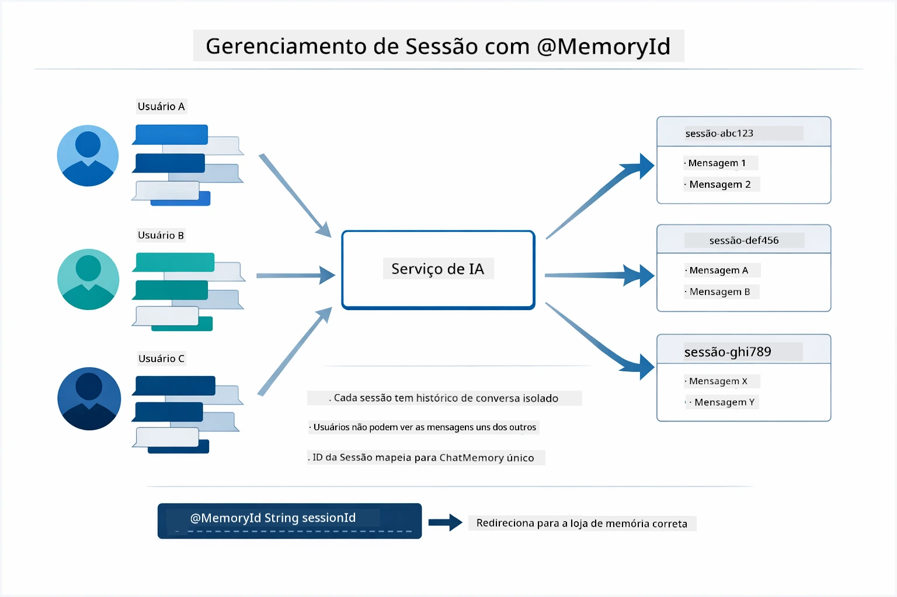

*Cada ID de sessão corresponde a um histórico de conversa isolado — os usuários nunca veem as mensagens uns dos outros.*

### Tratamento de Erros

Ferramentas podem falhar — APIs podem expirar, parâmetros podem ser inválidos, serviços externos podem ficar indisponíveis. Agentes em produção precisam de tratamento de erros para que o modelo possa explicar problemas ou tentar alternativas ao invés de travar toda a aplicação. Quando uma ferramenta lança uma exceção, LangChain4j a captura e retorna a mensagem de erro para o modelo, que então pode explicar o problema em linguagem natural.

## Ferramentas Disponíveis

O diagrama abaixo mostra o amplo ecossistema de ferramentas que você pode construir. Este módulo demonstra ferramentas de clima e temperatura, mas o mesmo padrão `@Tool` funciona para qualquer método Java — desde consultas em banco de dados até processamento de pagamentos.

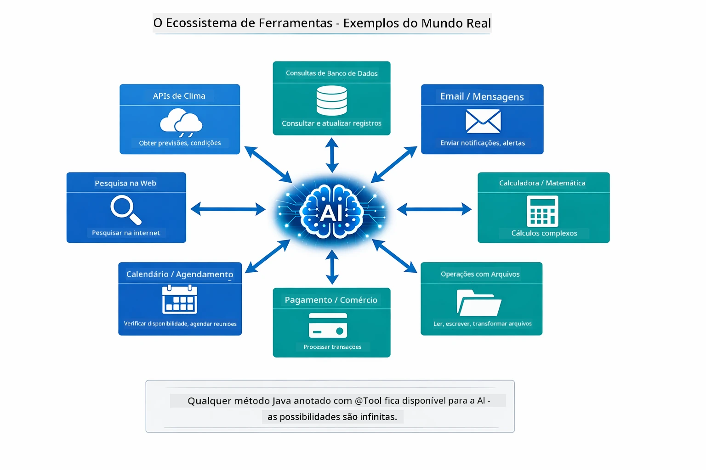

*Qualquer método Java anotado com @Tool torna-se disponível para a IA — o padrão se estende para bancos de dados, APIs, email, operações de arquivos e muito mais.*

## Quando Usar Agentes Baseados em Ferramentas

Nem toda solicitação precisa de ferramentas. A decisão depende se a IA precisa interagir com sistemas externos ou pode responder com seu próprio conhecimento. O guia a seguir resume quando as ferramentas agregam valor e quando são desnecessárias:

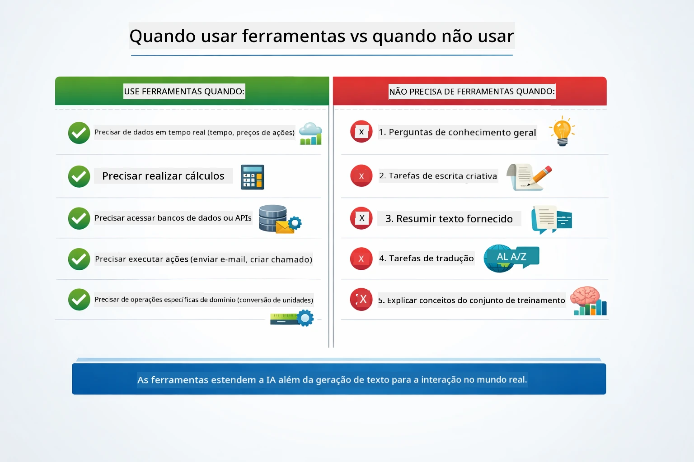

*Um guia rápido de decisão — ferramentas são para dados em tempo real, cálculos e ações; conhecimento geral e tarefas criativas não precisam delas.*

## Ferramentas vs RAG

Os módulos 03 e 04 estendem o que a IA pode fazer, mas de formas fundamentalmente diferentes. RAG dá ao modelo acesso a **conhecimento** ao recuperar documentos. Ferramentas dão ao modelo a capacidade de tomar **ações** ao chamar funções. O diagrama abaixo compara essas duas abordagens lado a lado — desde como cada fluxo de trabalho opera até as compensações entre eles:

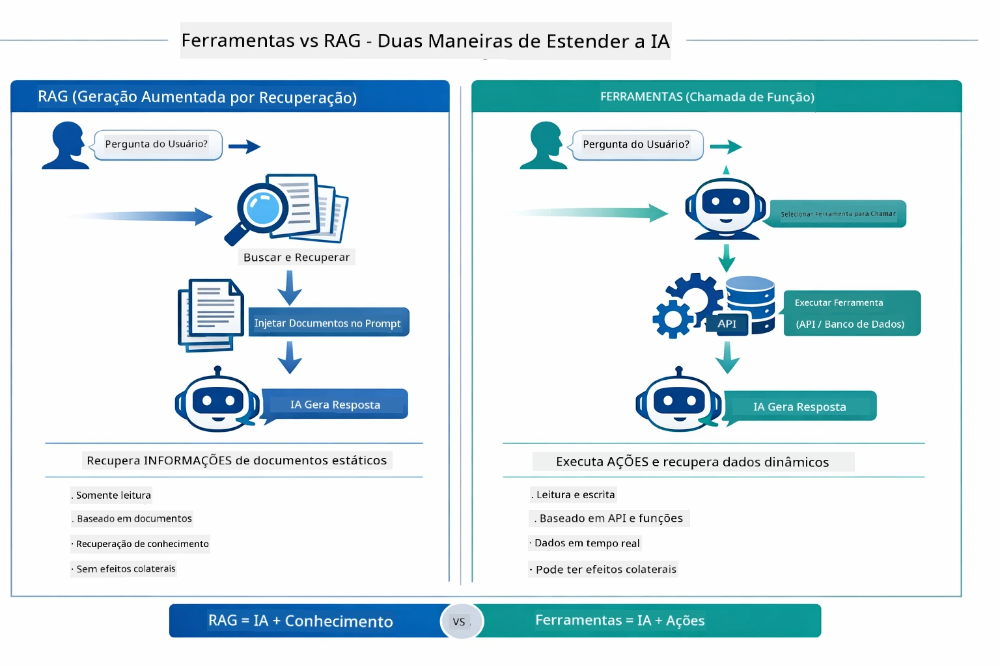

*RAG recupera informações de documentos estáticos — Ferramentas executam ações e obtêm dados dinâmicos em tempo real. Muitos sistemas de produção combinam ambos.*

Na prática, muitos sistemas de produção combinam ambas as abordagens: RAG para fundamentar respostas em sua documentação e Ferramentas para obter dados ao vivo ou realizar operações.

## Próximos Passos

**Próximo Módulo:** [05-mcp - Protocolo de Contexto do Modelo (MCP)](../05-mcp/README.md)

---

**Navegação:** [← Anterior: Módulo 03 - RAG](../03-rag/README.md) | [Voltar ao Início](../README.md) | [Próximo: Módulo 05 - MCP →](../05-mcp/README.md)

---

<!-- CO-OP TRANSLATOR DISCLAIMER START -->
**Aviso Legal**:
Este documento foi traduzido utilizando o serviço de tradução automática [Co-op Translator](https://github.com/Azure/co-op-translator). Embora nos esforcemos para garantir a precisão, esteja ciente de que traduções automáticas podem conter erros ou imprecisões. O documento original em seu idioma nativo deve ser considerado a fonte autorizada. Para informações críticas, recomenda-se a tradução profissional humana. Não nos responsabilizamos por quaisquer mal-entendidos ou interpretações incorretas decorrentes do uso desta tradução.
<!-- CO-OP TRANSLATOR DISCLAIMER END -->