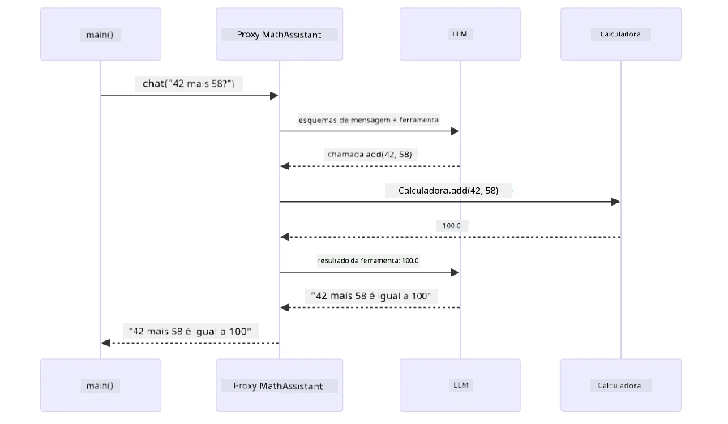
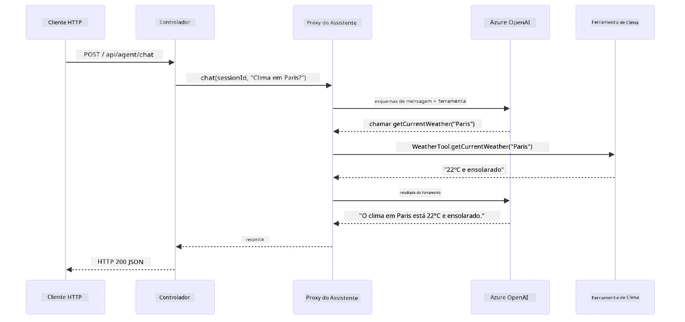

# Módulo 04: Agentes de IA com Ferramentas

## Índice

- [O Que Você Vai Aprender](../../../04-tools)
- [Pré-requisitos](../../../04-tools)
- [Entendendo Agentes de IA com Ferramentas](../../../04-tools)
- [Como o Chamado de Ferramentas Funciona](../../../04-tools)
  - [Definições de Ferramentas](../../../04-tools)
  - [Tomada de Decisão](../../../04-tools)
  - [Execução](../../../04-tools)
  - [Geração de Resposta](../../../04-tools)
  - [Arquitetura: Auto-Injeção do Spring Boot](../../../04-tools)
- [Encadeamento de Ferramentas](../../../04-tools)
- [Executar a Aplicação](../../../04-tools)
- [Usando a Aplicação](../../../04-tools)
  - [Teste Uso Simples de Ferramentas](../../../04-tools)
  - [Teste Encadeamento de Ferramentas](../../../04-tools)
  - [Veja o Fluxo da Conversa](../../../04-tools)
  - [Experimente Diferentes Solicitações](../../../04-tools)
- [Conceitos-Chave](../../../04-tools)
  - [Padrão ReAct (Raciocínio e Ação)](../../../04-tools)
  - [Descrições de Ferramentas Importam](../../../04-tools)
  - [Gerenciamento de Sessão](../../../04-tools)
  - [Tratamento de Erros](../../../04-tools)
- [Ferramentas Disponíveis](../../../04-tools)
- [Quando Usar Agentes Baseados em Ferramentas](../../../04-tools)
- [Ferramentas vs RAG](../../../04-tools)
- [Próximos Passos](../../../04-tools)

## O Que Você Vai Aprender

Até agora, você aprendeu como ter conversas com IA, estruturar prompts efetivamente e basear respostas em seus documentos. Mas ainda existe uma limitação fundamental: modelos de linguagem só podem gerar texto. Eles não podem consultar o clima, realizar cálculos, consultar bancos de dados ou interagir com sistemas externos.

Ferramentas mudam isso. Dando ao modelo acesso a funções que ele pode chamar, você o transforma de um gerador de texto em um agente que pode tomar ações. O modelo decide quando precisa de uma ferramenta, qual ferramenta usar e quais parâmetros passar. Seu código executa a função e retorna o resultado. O modelo incorpora esse resultado em sua resposta.

## Pré-requisitos

- Ter completado o [Módulo 01 - Introdução](../01-introduction/README.md) (recursos Azure OpenAI implantados)
- Recomenda-se ter completado módulos anteriores (este módulo referencia [conceitos RAG do Módulo 03](../03-rag/README.md) na comparação Ferramentas vs RAG)
- Arquivo `.env` na raiz com credenciais Azure (criado pelo `azd up` no Módulo 01)

> **Nota:** Se você não completou o Módulo 01, siga as instruções de implantação lá primeiro.

## Entendendo Agentes de IA com Ferramentas

> **📝 Nota:** O termo "agentes" neste módulo refere-se a assistentes de IA aprimorados com capacidades de chamada de ferramentas. Isso é diferente dos padrões **Agentic AI** (agentes autônomos com planejamento, memória e raciocínio multi-etapa) que veremos no [Módulo 05: MCP](../05-mcp/README.md).

Sem ferramentas, um modelo de linguagem só pode gerar texto a partir dos seus dados de treino. Pergunte sobre o clima atual, ele precisa chutar. Dê ferramentas a ele, e ele pode chamar uma API de clima, fazer cálculos ou consultar banco de dados — depois tecer esses resultados reais na resposta.


*Sem ferramentas o modelo só pode chutar — com ferramentas ele pode chamar APIs, fazer cálculos e retornar dados em tempo real.*

Um agente de IA com ferramentas segue um padrão **Raciocínio e Ação (ReAct)**. O modelo não responde só — ele pensa no que precisa, age chamando uma ferramenta, observa o resultado e decide se age novamente ou entrega a resposta final:

1. **Raciocina** — O agente analisa a pergunta do usuário e determina qual informação precisa
2. **Age** — O agente escolhe a ferramenta certa, gera os parâmetros corretos e chama ela
3. **Observa** — O agente recebe a saída da ferramenta e avalia o resultado
4. **Repete ou Responde** — Se precisar de mais dados, o agente repete; caso contrário, compõe uma resposta em linguagem natural


*O ciclo ReAct — o agente raciocina o que fazer, age chamando ferramenta, observa o resultado e repete até entregar a resposta final.*

Isso acontece automaticamente. Você define as ferramentas e suas descrições. O modelo cuida da decisão de quando e como usá-las.

## Como o Chamado de Ferramentas Funciona

### Definições de Ferramentas

[WeatherTool.java](../../../04-tools/src/main/java/com/example/langchain4j/agents/tools/WeatherTool.java) | [TemperatureTool.java](../../../04-tools/src/main/java/com/example/langchain4j/agents/tools/TemperatureTool.java)

Você define funções com descrições claras e especificações dos parâmetros. O modelo vê essas descrições no prompt do sistema e entende o que cada ferramenta faz.

```java
@Component
public class WeatherTool {
    
    @Tool("Get the current weather for a location")
    public String getCurrentWeather(@P("Location name") String location) {
        // Sua lógica de consulta do clima
        return "Weather in " + location + ": 22°C, cloudy";
    }
}

@AiService
public interface Assistant {
    String chat(@MemoryId String sessionId, @UserMessage String message);
}

// Assistente é conectado automaticamente pelo Spring Boot com:
// - Bean ChatModel
// - Todos os métodos @Tool de classes @Component
// - Provedor ChatMemory para gerenciamento de sessão
```

O diagrama abaixo detalha cada anotação e mostra como cada peça ajuda a IA a entender quando chamar a ferramenta e quais argumentos passar:


*Anatomia de uma definição de ferramenta — @Tool diz à IA quando usá-la, @P descreve cada parâmetro, e @AiService conecta tudo na inicialização.*

> **🤖 Experimente com o [GitHub Copilot](https://github.com/features/copilot) Chat:** Abra [`WeatherTool.java`](../../../04-tools/src/main/java/com/example/langchain4j/agents/tools/WeatherTool.java) e pergunte:
> - "Como eu integraria uma API de clima real como OpenWeatherMap em vez de dados simulados?"
> - "O que faz uma boa descrição de ferramenta que ajuda a IA a usá-la corretamente?"
> - "Como eu trato erros de API e limites de taxa nas implementações das ferramentas?"

### Tomada de Decisão

Quando um usuário pergunta "Qual é o clima em Seattle?", o modelo não escolhe uma ferramenta aleatoriamente. Ele compara a intenção do usuário com cada descrição de ferramenta que tem acesso, pontua cada uma para relevância e escolhe a melhor correspondência. Depois gera uma chamada de função estruturada com os parâmetros certos — neste caso, definindo `location` como `"Seattle"`.

Se nenhuma ferramenta corresponder à solicitação do usuário, o modelo responde a partir do seu próprio conhecimento. Se várias ferramentas corresponderem, ele escolhe a mais específica.


*O modelo avalia todas as ferramentas disponíveis contra a intenção do usuário e seleciona a melhor — por isso descrições claras e específicas são importantes.*

### Execução

[AgentService.java](../../../04-tools/src/main/java/com/example/langchain4j/agents/service/AgentService.java)

O Spring Boot faz a injeção automática da interface declarativa `@AiService` com todas as ferramentas registradas, e o LangChain4j executa as chamadas de ferramentas automaticamente. Nos bastidores, uma chamada completa a uma ferramenta passa por seis etapas — desde a pergunta em linguagem natural do usuário até a resposta em linguagem natural:


*O fluxo ponta a ponta — o usuário faz uma pergunta, o modelo seleciona uma ferramenta, LangChain4j a executa, e o modelo incorpora o resultado em resposta natural.*

Se você executou o [ToolIntegrationDemo](../../../00-quick-start/src/main/java/com/example/langchain4j/quickstart/ToolIntegrationDemo.java) no Módulo 00, já viu esse padrão em ação — as ferramentas `Calculator` foram chamadas do mesmo jeito. O diagrama de sequência abaixo mostra exatamente o que aconteceu durante essa demo:



*O laço de chamado de ferramenta do demo Quick Start — `AiServices` envia sua mensagem e esquema das ferramentas para o LLM, o LLM responde com uma chamada de função como `add(42, 58)`, LangChain4j executa o método `Calculator` localmente e alimenta o resultado de volta para a resposta final.*

> **🤖 Experimente com o [GitHub Copilot](https://github.com/features/copilot) Chat:** Abra [`AgentService.java`](../../../04-tools/src/main/java/com/example/langchain4j/agents/service/AgentService.java) e pergunte:
> - "Como funciona o padrão ReAct e por que ele é eficaz para agentes de IA?"
> - "Como o agente decide qual ferramenta usar e em que ordem?"
> - "O que acontece se a execução de uma ferramenta falhar — como devo tratar erros de forma robusta?"

### Geração de Resposta

O modelo recebe os dados do clima e os formata em uma resposta em linguagem natural para o usuário.

### Arquitetura: Auto-Injeção do Spring Boot

Este módulo usa a integração do LangChain4j com o Spring Boot via interfaces declarativas `@AiService`. Na inicialização, o Spring Boot descobre cada `@Component` que contém métodos `@Tool`, seu bean `ChatModel` e o `ChatMemoryProvider` — então conecta tudo em uma única interface `Assistant` sem código repetitivo.


*A interface @AiService conecta o ChatModel, componentes de ferramentas e provedor de memória — Spring Boot faz toda a injeção automaticamente.*

Aqui está o ciclo completo de um pedido em diagrama de sequência — da requisição HTTP pelo controller, serviço e proxy auto-injetado, até a execução da ferramenta e retorno:



*O ciclo completo da requisição Spring Boot — a requisição HTTP passa pelo controller e serviço até o proxy Assistant auto-injetado, que orquestra as chamadas ao LLM e ferramentas automaticamente.*

Principais benefícios desse método:

- **Auto-injeção Spring Boot** — ChatModel e ferramentas injetados automaticamente
- **Padrão @MemoryId** — Gerenciamento automático de memória por sessão
- **Instância única** — Assistant criado uma vez e reutilizado para melhor desempenho
- **Execução com segurança de tipos** — Métodos Java chamados diretamente com conversão de tipos
- **Orquestração multi-turno** — Encadeamento de ferramentas tratado automaticamente
- **Zero código repetitivo** — Sem chamadas manuais para `AiServices.builder()` ou HashMap de memória

Abordagens alternativas (builder manual do `AiServices`) exigem mais código e perdem os benefícios da integração Spring Boot.

## Encadeamento de Ferramentas

**Encadeamento de Ferramentas** — O verdadeiro poder dos agentes baseados em ferramentas aparece quando uma única pergunta precisa de várias ferramentas. Pergunte "Qual o clima em Seattle em Fahrenheit?" e o agente encadeia automaticamente duas ferramentas: primeiro chama `getCurrentWeather` para obter a temperatura em Celsius, depois passa esse valor para `celsiusToFahrenheit` para conversão — tudo em uma única interação.


*Encadeamento de ferramentas em ação — o agente chama getCurrentWeather primeiro, então passa o resultado em Celsius para celsiusToFahrenheit, entregando uma resposta combinada.*

**Falhas Graciosas** — Peça o clima de uma cidade que não está nos dados simulados. A ferramenta retorna uma mensagem de erro, e a IA explica que não pode ajudar ao invés de travar. Ferramentas falham com segurança. O diagrama abaixo contrasta as duas abordagens — com tratamento cuidadoso de erros, o agente captura a exceção e responde com uma explicação útil, enquanto sem ele a aplicação inteira trava:


*Quando uma ferramenta falha, o agente captura o erro e responde com explicação útil em vez de travar.*

Isso ocorre em uma única interação. O agente orquestra múltiplas chamadas a ferramentas autonomamente.

## Executar a Aplicação

**Verifique a implantação:**

Certifique-se de que o arquivo `.env` existe na raiz com as credenciais Azure (criado durante o Módulo 01). Rode isso a partir do diretório do módulo (`04-tools/`):

**Bash:**
```bash
cat ../.env  # Deve mostrar AZURE_OPENAI_ENDPOINT, API_KEY, DEPLOYMENT
```

**PowerShell:**
```powershell
Get-Content ..\.env  # Deve mostrar AZURE_OPENAI_ENDPOINT, API_KEY, DEPLOYMENT
```

**Inicie a aplicação:**

> **Nota:** Se você já iniciou todas as aplicações usando `./start-all.sh` da raiz (conforme descrito no Módulo 01), este módulo já está rodando na porta 8084. Você pode pular os comandos de inicialização abaixo e ir direto para http://localhost:8084.

**Opção 1: Usando Spring Boot Dashboard (Recomendado para usuários VS Code)**

O contêiner de desenvolvimento inclui a extensão Spring Boot Dashboard, que oferece uma interface visual para gerenciar todas as aplicações Spring Boot. Você pode encontrá-la na Barra de Atividades à esquerda no VS Code (ícone do Spring Boot).

No Spring Boot Dashboard você pode:
- Ver todas as aplicações Spring Boot disponíveis no workspace
- Iniciar/parar aplicações com um clique
- Visualizar logs da aplicação em tempo real
- Monitorar o status da aplicação

Basta clicar no botão play ao lado de "tools" para iniciar este módulo, ou iniciar todos os módulos de uma vez.

Veja como o Spring Boot Dashboard aparece no VS Code:


*O Spring Boot Dashboard no VS Code — iniciar, parar e monitorar todos os módulos em um só lugar*

**Opção 2: Usando scripts shell**

Inicie todas as aplicações web (módulos 01-04):

**Bash:**
```bash
cd ..  # A partir do diretório raiz
./start-all.sh
```

**PowerShell:**
```powershell
cd ..  # A partir do diretório raiz
.\start-all.ps1
```

Ou inicie apenas este módulo:

**Bash:**
```bash
cd 04-tools
./start.sh
```

**PowerShell:**
```powershell
cd 04-tools
.\start.ps1
```

Ambos os scripts carregam automaticamente as variáveis de ambiente do arquivo `.env` raiz e vão compilar os JARs se eles não existirem.

> **Nota:** Se preferir compilar todos os módulos manualmente antes de iniciar:
>
> **Bash:**
> ```bash
> cd ..  # Go to root directory
> mvn clean package -DskipTests
> ```
>
> **PowerShell:**
> ```powershell
> cd ..  # Go to root directory
> mvn clean package -DskipTests
> ```

Abra http://localhost:8084 no seu navegador.

**Para parar:**

**Bash:**
```bash
./stop.sh  # Apenas este módulo
# Ou
cd .. && ./stop-all.sh  # Todos os módulos
```

**PowerShell:**
```powershell
.\stop.ps1  # Este módulo apenas
# Ou
cd ..; .\stop-all.ps1  # Todos os módulos
```

## Usando a Aplicação

A aplicação oferece uma interface web onde você pode interagir com um agente de IA que tem acesso a ferramentas de clima e conversão de temperatura. Veja como a interface se apresenta — ela inclui exemplos rápidos e um painel de chat para enviar solicitações:

<a href="images/tools-homepage.png"></a>

*A interface de Ferramentas do Agente de IA - exemplos rápidos e interface de chat para interação com ferramentas*

### Experimente o Uso Simples de Ferramentas

Comece com uma solicitação simples: "Converter 100 graus Fahrenheit para Celsius". O agente reconhece que precisa da ferramenta de conversão de temperatura, chama-a com os parâmetros corretos e retorna o resultado. Observe como isso parece natural - você não especificou qual ferramenta usar ou como chamá-la.

### Teste Encadeamento de Ferramentas

Agora tente algo mais complexo: "Qual é o clima em Seattle e converta para Fahrenheit?" Veja o agente trabalhar isso em etapas. Primeiro obtém o clima (que retorna em Celsius), identifica que precisa converter para Fahrenheit, chama a ferramenta de conversão e combina ambos os resultados em uma única resposta.

### Veja o Fluxo da Conversa

A interface de chat mantém o histórico da conversa, permitindo interações em múltiplas etapas. Você pode ver todas as consultas e respostas anteriores, facilitando o acompanhamento da conversa e compreendendo como o agente constrói o contexto ao longo de várias trocas.

<a href="images/tools-conversation-demo.png"></a>

*Conversa de múltiplas etapas mostrando conversões simples, consultas de clima e encadeamento de ferramentas*

### Experimente Diversas Solicitações

Teste várias combinações:
- Consultas de clima: "Qual é o clima em Tóquio?"
- Conversões de temperatura: "Quanto é 25°C em Kelvin?"
- Consultas combinadas: "Verifique o clima em Paris e diga se está acima de 20°C"

Note como o agente interpreta a linguagem natural e a mapeia para chamadas de ferramentas apropriadas.

## Conceitos Principais

### Padrão ReAct (Raciocínio e Ação)

O agente alterna entre raciocinar (decidir o que fazer) e agir (usar ferramentas). Esse padrão possibilita a resolução autônoma de problemas ao invés de apenas responder a instruções.

### Descrições de Ferramentas Importam

A qualidade da descrição das suas ferramentas afeta diretamente o quão bem o agente as usa. Descrições claras e específicas ajudam o modelo a entender quando e como chamar cada ferramenta.

### Gerenciamento de Sessão

A anotação `@MemoryId` permite gerenciamento automático de memória baseado em sessão. Cada ID de sessão recebe sua própria instância de `ChatMemory` gerenciada pelo bean `ChatMemoryProvider`, permitindo que múltiplos usuários interajam simultaneamente com o agente sem que as conversas se misturem. O diagrama a seguir mostra como múltiplos usuários são encaminhados para memórias isoladas com base em seus IDs de sessão:


*Cada ID de sessão corresponde a um histórico de conversa isolado — usuários nunca veem as mensagens uns dos outros.*

### Tratamento de Erros

Ferramentas podem falhar — APIs podem expirar, parâmetros podem ser inválidos, serviços externos podem ficar indisponíveis. Agentes em produção precisam de tratamento de erros para que o modelo possa explicar problemas ou tentar alternativas ao invés de travar toda a aplicação. Quando uma ferramenta lança uma exceção, o LangChain4j a captura e envia a mensagem de erro de volta ao modelo, que pode então explicar o problema em linguagem natural.

## Ferramentas Disponíveis

O diagrama abaixo mostra o amplo ecossistema de ferramentas que você pode construir. Este módulo demonstra ferramentas de clima e temperatura, mas o mesmo padrão `@Tool` funciona para qualquer método Java — desde consultas a banco de dados até processamento de pagamentos.


*Qualquer método Java anotado com @Tool torna-se disponível para a IA — o padrão se estende a bancos de dados, APIs, e-mails, operações de arquivos e mais.*

## Quando Usar Agentes Baseados em Ferramentas

Nem toda solicitação precisa de ferramentas. A decisão depende se a IA precisa interagir com sistemas externos ou pode responder a partir do seu próprio conhecimento. O guia a seguir resume quando as ferramentas agregam valor e quando são desnecessárias:


*Um guia rápido de decisão — ferramentas são para dados em tempo real, cálculos e ações; conhecimento geral e tarefas criativas não precisam delas.*

## Ferramentas vs RAG

Os módulos 03 e 04 expandem o que a IA pode fazer, mas de formas fundamentalmente diferentes. RAG dá ao modelo acesso ao **conhecimento** ao recuperar documentos. Ferramentas dão ao modelo a capacidade de tomar **ações** ao chamar funções. O diagrama abaixo compara essas duas abordagens lado a lado — desde como cada fluxo de trabalho opera até as trocas entre eles:


*RAG recupera informações de documentos estáticos — Ferramentas executam ações e obtêm dados dinâmicos em tempo real. Muitos sistemas em produção combinam ambos.*

Na prática, muitos sistemas em produção combinam ambas as abordagens: RAG para fundamentar respostas na sua documentação e Ferramentas para buscar dados ao vivo ou realizar operações.

## Próximos Passos

**Próximo Módulo:** [05-mcp - Protocolo de Contexto de Modelo (MCP)](../05-mcp/README.md)

---

**Navegação:** [← Anterior: Módulo 03 - RAG](../03-rag/README.md) | [Voltar ao Início](../README.md) | [Próximo: Módulo 05 - MCP →](../05-mcp/README.md)

---

<!-- CO-OP TRANSLATOR DISCLAIMER START -->
**Aviso Legal**:
Este documento foi traduzido utilizando o serviço de tradução automática [Co-op Translator](https://github.com/Azure/co-op-translator). Embora nos esforcemos para garantir a precisão, esteja ciente de que traduções automáticas podem conter erros ou imprecisões. O documento original em seu idioma nativo deve ser considerado a fonte autorizada. Para informações críticas, recomenda-se tradução profissional feita por humanos. Não nos responsabilizamos por quaisquer mal-entendidos ou interpretações equivocadas decorrentes do uso desta tradução.
<!-- CO-OP TRANSLATOR DISCLAIMER END -->