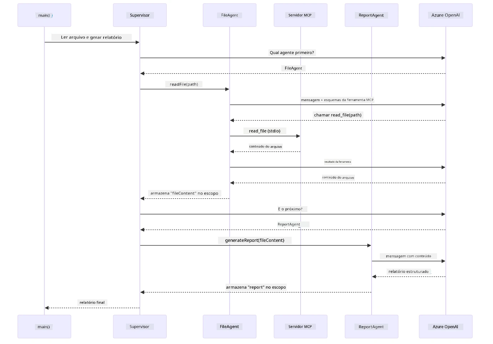

# Módulo 05: Protocolo de Contexto de Modelo (MCP)

## Índice

- [O que Você Vai Aprender](../../../05-mcp)
- [O que é MCP?](../../../05-mcp)
- [Como o MCP Funciona](../../../05-mcp)
- [O Módulo Agentic](../../../05-mcp)
- [Executando os Exemplos](../../../05-mcp)
  - [Pré-requisitos](../../../05-mcp)
- [Início Rápido](../../../05-mcp)
  - [Operações de Arquivo (Stdio)](../../../05-mcp)
  - [Agente Supervisor](../../../05-mcp)
    - [Executando a Demonstração](../../../05-mcp)
    - [Como o Supervisor Funciona](../../../05-mcp)
    - [Como o FileAgent Descobre as Ferramentas MCP em Tempo de Execução](../../../05-mcp)
    - [Estratégias de Resposta](../../../05-mcp)
    - [Entendendo a Saída](../../../05-mcp)
    - [Explicação dos Recursos do Módulo Agentic](../../../05-mcp)
- [Conceitos-Chave](../../../05-mcp)
- [Parabéns!](../../../05-mcp)
  - [E Agora?](../../../05-mcp)

## O que Você Vai Aprender

Você já construiu IA conversacional, dominou prompts, fundamentou respostas em documentos e criou agentes com ferramentas. Mas todas essas ferramentas foram construídas sob medida para sua aplicação específica. E se você pudesse dar à sua IA acesso a um ecossistema padronizado de ferramentas que qualquer pessoa pode criar e compartilhar? Neste módulo, você aprenderá exatamente isso com o Protocolo de Contexto de Modelo (MCP) e o módulo agentic do LangChain4j. Primeiro mostramos um leitor de arquivos MCP simples e depois mostramos como ele se integra facilmente em fluxos de trabalho agentic avançados usando o padrão de Agente Supervisor.

## O que é MCP?

O Protocolo de Contexto de Modelo (MCP) oferece exatamente isso — uma maneira padrão para aplicações de IA descobrirem e usarem ferramentas externas. Em vez de escrever integrações personalizadas para cada fonte de dados ou serviço, você se conecta a servidores MCP que expõem suas funcionalidades em um formato consistente. Seu agente de IA pode então descobrir e usar essas ferramentas automaticamente.

O diagrama abaixo mostra a diferença — sem MCP, cada integração requer conexão ponto a ponto personalizada; com MCP, um único protocolo conecta seu app a qualquer ferramenta:


*Antes do MCP: Integrações ponto a ponto complexas. Depois do MCP: Um protocolo, possibilidades infinitas.*

O MCP resolve um problema fundamental no desenvolvimento de IA: toda integração é personalizada. Quer acessar o GitHub? Código customizado. Quer ler arquivos? Código customizado. Quer consultar um banco de dados? Código customizado. E nenhuma dessas integrações funciona com outras aplicações de IA.

MCP padroniza isso. Um servidor MCP expõe ferramentas com descrições claras e esquemas. Qualquer cliente MCP pode conectar-se, descobrir as ferramentas disponíveis e usá-las. Construa uma vez, use em todo lugar.

O diagrama abaixo ilustra essa arquitetura — um único cliente MCP (sua aplicação de IA) conecta-se a múltiplos servidores MCP, cada um expondo seu próprio conjunto de ferramentas através do protocolo padrão:


*Arquitetura do Protocolo de Contexto de Modelo - descoberta e execução de ferramentas padronizadas*

## Como o MCP Funciona

Por trás das cenas, o MCP usa uma arquitetura em camadas. Sua aplicação Java (o cliente MCP) descobre as ferramentas disponíveis, envia requisições JSON-RPC através de uma camada de transporte (Stdio ou HTTP), e o servidor MCP executa operações e retorna resultados. O diagrama a seguir detalha cada camada desse protocolo:


*Como o MCP funciona por trás — clientes descobrem ferramentas, trocam mensagens JSON-RPC e executam operações através de uma camada de transporte.*

**Arquitetura Cliente-Servidor**

O MCP usa um modelo cliente-servidor. Os servidores fornecem ferramentas — leitura de arquivos, consultas a bancos de dados, chamadas API. Os clientes (sua aplicação de IA) conectam-se aos servidores e usam suas ferramentas.

Para usar MCP com LangChain4j, adicione esta dependência Maven:

```xml
<dependency>
    <groupId>dev.langchain4j</groupId>
    <artifactId>langchain4j-mcp</artifactId>
    <version>${langchain4j.version}</version>
</dependency>
```

**Descoberta de Ferramentas**

Quando seu cliente conecta a um servidor MCP, ele pergunta "Quais ferramentas você tem?" O servidor responde com uma lista de ferramentas disponíveis, cada uma com descrições e esquemas de parâmetros. Seu agente de IA então decide quais ferramentas usar baseado nas solicitações do usuário. O diagrama abaixo mostra esse aperto de mãos — o cliente envia uma requisição `tools/list` e o servidor retorna suas ferramentas disponíveis com descrições e esquemas de parâmetros:


*A IA descobre as ferramentas disponíveis na inicialização — agora sabe quais capacidades estão disponíveis e pode decidir quais usar.*

**Mecanismos de Transporte**

O MCP suporta diferentes mecanismos de transporte. As duas opções são Stdio (para comunicação local com subprocessos) e HTTP Streaming (para servidores remotos). Este módulo demonstra o transporte Stdio:


*Mecanismos de transporte MCP: HTTP para servidores remotos, Stdio para processos locais*

**Stdio** - [StdioTransportDemo.java](../../../05-mcp/src/main/java/com/example/langchain4j/mcp/StdioTransportDemo.java)

Para processos locais. Sua aplicação inicia um servidor como subprocesso e comunica através da entrada/saída padrão. Útil para acesso ao sistema de arquivos ou ferramentas de linha de comando.

```java
McpTransport stdioTransport = new StdioMcpTransport.Builder()
    .command(List.of(
        npmCmd, "exec",
        "@modelcontextprotocol/server-filesystem@2025.12.18",
        resourcesDir
    ))
    .logEvents(false)
    .build();
```

O servidor `@modelcontextprotocol/server-filesystem` expõe as seguintes ferramentas, todas isoladas aos diretórios que você especificar:

| Ferramenta | Descrição |
|------|-------------|
| `read_file` | Ler o conteúdo de um único arquivo |
| `read_multiple_files` | Ler vários arquivos em uma única chamada |
| `write_file` | Criar ou sobrescrever um arquivo |
| `edit_file` | Realizar edições específicas de localizar e substituir |
| `list_directory` | Listar arquivos e diretórios em um caminho |
| `search_files` | Buscar recursivamente arquivos que correspondem a um padrão |
| `get_file_info` | Obter metadados do arquivo (tamanho, timestamps, permissões) |
| `create_directory` | Criar um diretório (incluindo diretórios pai) |
| `move_file` | Mover ou renomear um arquivo ou diretório |

O diagrama a seguir mostra como o transporte Stdio funciona em tempo de execução — sua aplicação Java inicia o servidor MCP como um processo filho e eles se comunicam por pipes stdin/stdout, sem rede ou HTTP envolvidos:


*Transporte Stdio em ação — sua aplicação inicia o servidor MCP como processo filho e comunica através dos pipes stdin/stdout.*

> **🤖 Experimente com o [GitHub Copilot](https://github.com/features/copilot) Chat:** Abra [`StdioTransportDemo.java`](../../../05-mcp/src/main/java/com/example/langchain4j/mcp/StdioTransportDemo.java) e pergunte:
> - "Como funciona o transporte Stdio e quando devo usá-lo em vez de HTTP?"
> - "Como o LangChain4j gerencia o ciclo de vida dos processos do servidor MCP iniciados?"
> - "Quais são as implicações de segurança de dar acesso do AI ao sistema de arquivos?"

## O Módulo Agentic

Enquanto o MCP fornece ferramentas padronizadas, o **módulo agentic** do LangChain4j oferece uma forma declarativa de construir agentes que orquestram essas ferramentas. A anotação `@Agent` e o `AgenticServices` permitem definir o comportamento do agente através de interfaces em vez de código imperativo.

Neste módulo, você irá explorar o padrão **Agente Supervisor** — uma abordagem agentic avançada onde um agente "supervisor" decide dinamicamente quais subagentes invocar com base nas solicitações do usuário. Vamos combinar ambos os conceitos dando a um de nossos subagentes capacidades de acesso a arquivos alimentadas por MCP.

Para usar o módulo agentic, adicione esta dependência Maven:

```xml
<dependency>
    <groupId>dev.langchain4j</groupId>
    <artifactId>langchain4j-agentic</artifactId>
    <version>${langchain4j.mcp.version}</version>
</dependency>
```
> **Nota:** O módulo `langchain4j-agentic` usa uma propriedade de versão separada (`langchain4j.mcp.version`) pois é lançado em um cronograma diferente das bibliotecas principais do LangChain4j.

> **⚠️ Experimental:** O módulo `langchain4j-agentic` é **experimental** e sujeito a mudanças. A forma estável de construir assistentes de IA continua sendo `langchain4j-core` com ferramentas personalizadas (Módulo 04).

## Executando os Exemplos

### Pré-requisitos

- Completar o [Módulo 04 - Ferramentas](../04-tools/README.md) (este módulo baseia-se no conceito de ferramentas personalizadas e as compara com ferramentas MCP)
- Arquivo `.env` no diretório raiz com credenciais Azure (criado pelo `azd up` no Módulo 01)
- Java 21+, Maven 3.9+
- Node.js 16+ e npm (para servidores MCP)

> **Nota:** Se você ainda não configurou suas variáveis de ambiente, veja [Módulo 01 - Introdução](../01-introduction/README.md) para instruções de implantação (`azd up` cria o arquivo `.env` automaticamente) ou copie `.env.example` para `.env` no diretório raiz e preencha seus valores.

## Início Rápido

**Usando VS Code:** Simplesmente clique com o botão direito no arquivo de demonstração no Explorer e selecione **"Run Java"**, ou use as configurações de inicialização no painel de Run and Debug (certifique-se de que seu arquivo `.env` está configurado com as credenciais Azure antes).

**Usando Maven:** Alternativamente, você pode rodar pela linha de comando com os exemplos abaixo.

### Operações de Arquivo (Stdio)

Isso demonstra ferramentas locais baseadas em subprocessos.

**✅ Nenhum pré-requisito necessário** — o servidor MCP é iniciado automaticamente.

**Usando os Scripts de Inicialização (Recomendado):**

Os scripts de inicialização carregam automaticamente as variáveis de ambiente do arquivo `.env` na raiz:

**Bash:**
```bash
cd 05-mcp
chmod +x start-stdio.sh
./start-stdio.sh
```

**PowerShell:**
```powershell
cd 05-mcp
.\start-stdio.ps1
```

**Usando VS Code:** Clique com o botão direito em `StdioTransportDemo.java` e selecione **"Run Java"** (certifique-se de que seu arquivo `.env` está configurado).

A aplicação inicia automaticamente um servidor MCP de sistema de arquivos e lê um arquivo local. Repare como o gerenciamento do subprocesso é feito para você.

**Saída esperada:**
```
Assistant response: The file provides an overview of LangChain4j, an open-source Java library
for integrating Large Language Models (LLMs) into Java applications...
```

### Agente Supervisor

O **padrão Agente Supervisor** é uma forma **flexível** de IA agentic. Um Supervisor usa um LLM para decidir autonomamente quais agentes invocar com base na solicitação do usuário. No próximo exemplo, combinamos o acesso a arquivos com MCP com um agente LLM para criar um fluxo supervisionado de leitura de arquivo → relatório.

Na demonstração, `FileAgent` lê um arquivo usando as ferramentas do sistema de arquivos MCP, e `ReportAgent` gera um relatório estruturado com resumo executivo (1 frase), 3 pontos-chave e recomendações. O Supervisor orquestra esse fluxo automaticamente:


*O Supervisor usa seu LLM para decidir quais agentes invocar e em qual ordem — sem necessidade de roteamento codificado.*

Veja como fica o fluxo concreto para nosso pipeline de arquivo para relatório:


*FileAgent lê o arquivo via ferramentas MCP, depois ReportAgent transforma o conteúdo bruto em um relatório estruturado.*

O diagrama de sequência a seguir mostra a orquestração completa do Supervisor — desde a criação do servidor MCP, passando pela seleção autônoma de agentes do Supervisor, até as chamadas de ferramentas via stdio e o relatório final:



*O Supervisor invoca autonomamente o FileAgent (que chama o servidor MCP via stdio para ler o arquivo), e depois invoca o ReportAgent para gerar um relatório estruturado — cada agente armazena sua saída no Escopo Agentic compartilhado.*

Cada agente armazena sua saída no **Escopo Agentic** (memória compartilhada), permitindo que agentes subsequentes acessem resultados anteriores. Isso demonstra como ferramentas MCP se integram perfeitamente em fluxos agentic — o Supervisor não precisa saber *como* os arquivos são lidos, apenas que o `FileAgent` pode fazer isso.

#### Executando a Demonstração

Os scripts de inicialização carregam automaticamente as variáveis de ambiente do arquivo `.env` na raiz:

**Bash:**
```bash
cd 05-mcp
chmod +x start-supervisor.sh
./start-supervisor.sh
```

**PowerShell:**
```powershell
cd 05-mcp
.\start-supervisor.ps1
```

**Usando VS Code:** Clique com o botão direito em `SupervisorAgentDemo.java` e selecione **"Run Java"** (certifique-se de que seu arquivo `.env` está configurado).

#### Como o Supervisor Funciona

Antes de construir agentes, você precisa conectar o transporte MCP a um cliente e encapsulá-lo como um `ToolProvider`. É assim que as ferramentas do servidor MCP ficam disponíveis para seus agentes:

```java
// Crie um cliente MCP a partir do transporte
McpClient mcpClient = new DefaultMcpClient.Builder()
        .transport(stdioTransport)
        .build();

// Envolva o cliente como um ToolProvider — isso conecta as ferramentas MCP ao LangChain4j
ToolProvider mcpToolProvider = McpToolProvider.builder()
        .mcpClients(List.of(mcpClient))
        .build();
```

Agora você pode injetar `mcpToolProvider` em qualquer agente que precise de ferramentas MCP:

```java
// Passo 1: FileAgent lê arquivos usando ferramentas MCP
FileAgent fileAgent = AgenticServices.agentBuilder(FileAgent.class)
        .chatModel(model)
        .toolProvider(mcpToolProvider)  // Possui ferramentas MCP para operações de arquivo
        .build();

// Passo 2: ReportAgent gera relatórios estruturados
ReportAgent reportAgent = AgenticServices.agentBuilder(ReportAgent.class)
        .chatModel(model)
        .build();

// Supervisor orquestra o fluxo de trabalho arquivo → relatório
SupervisorAgent supervisor = AgenticServices.supervisorBuilder()
        .chatModel(model)
        .subAgents(fileAgent, reportAgent)
        .responseStrategy(SupervisorResponseStrategy.LAST)  // Retorna o relatório final
        .build();

// O Supervisor decide quais agentes invocar com base na solicitação
String response = supervisor.invoke("Read the file at /path/file.txt and generate a report");
```

#### Como o FileAgent Descobre as Ferramentas MCP em Tempo de Execução

Você deve estar se perguntando: **como o `FileAgent` sabe como usar as ferramentas do sistema de arquivos npm?** A resposta é que ele não sabe — o **LLM** descobre isso em tempo de execução por meio dos esquemas das ferramentas.

A interface `FileAgent` é apenas uma **definição de prompt**. Ela não contém conhecimento codificado sobre `read_file`, `list_directory` ou qualquer outra ferramenta MCP. Veja o que acontece de ponta a ponta:
1. **Servidor inicia:** `StdioMcpTransport` lança o pacote npm `@modelcontextprotocol/server-filesystem` como um processo filho  
2. **Descoberta de ferramentas:** O `McpClient` envia uma requisição JSON-RPC `tools/list` para o servidor, que responde com nomes de ferramentas, descrições e esquemas de parâmetros (ex: `read_file` — *"Ler o conteúdo completo de um arquivo"* — `{ path: string }`)  
3. **Injeção de esquema:** `McpToolProvider` envolve esses esquemas descobertos e os torna disponíveis ao LangChain4j  
4. **Decisão do LLM:** Quando `FileAgent.readFile(path)` é chamado, LangChain4j envia a mensagem do sistema, a mensagem do usuário, **e a lista de esquemas das ferramentas** para o LLM. O LLM lê as descrições das ferramentas e gera uma chamada de ferramenta (ex: `read_file(path="/some/file.txt")`)  
5. **Execução:** LangChain4j intercepta a chamada da ferramenta, a encaminha pelo cliente MCP de volta ao subprocesso Node.js, obtém o resultado e o fornece de volta ao LLM  

Este é o mesmo mecanismo de [Descoberta de Ferramentas](../../../05-mcp) descrito acima, mas aplicado especificamente ao fluxo de trabalho do agente. As anotações `@SystemMessage` e `@UserMessage` guiam o comportamento do LLM, enquanto o `ToolProvider` injetado fornece as **capacidades** — o LLM faz a ponte entre os dois em tempo de execução.

> **🤖 Experimente com o Chat [GitHub Copilot](https://github.com/features/copilot):** Abra [`FileAgent.java`](../../../05-mcp/src/main/java/com/example/langchain4j/mcp/agents/FileAgent.java) e pergunte:  
> - "Como este agente sabe qual ferramenta MCP chamar?"  
> - "O que aconteceria se eu removesse o ToolProvider do construtor do agente?"  
> - "Como os esquemas das ferramentas são passados para o LLM?"

#### Estratégias de Resposta

Quando você configura um `SupervisorAgent`, especifica como ele deve formular sua resposta final ao usuário após os sub-agentes concluírem suas tarefas. O diagrama abaixo mostra as três estratégias disponíveis — LAST retorna diretamente a saída do agente final, SUMMARY sintetiza todas as saídas por meio de um LLM, e SCORED escolhe aquela que tirar a maior pontuação em relação à solicitação original:


*Três estratégias para como o Supervisor formula a resposta final — escolha com base se deseja a saída do último agente, um resumo sintetizado ou a opção de maior pontuação.*

As estratégias disponíveis são:

| Estratégia | Descrição |
|------------|-----------|
| **LAST** | O supervisor retorna a saída do último sub-agente ou ferramenta chamada. Útil quando o agente final do fluxo é projetado especificamente para produzir a resposta completa final (ex: um "Agente de Resumo" em um pipeline de pesquisa). |
| **SUMMARY** | O supervisor usa seu próprio Modelo de Linguagem (LLM) interno para sintetizar um resumo de toda a interação e de todas as saídas dos sub-agentes, retornando esse resumo como resposta final. Isso fornece uma resposta limpa e agregada ao usuário. |
| **SCORED** | O sistema usa um LLM interno para pontuar tanto a resposta LAST quanto o SUMMARY da interação em relação à solicitação original do usuário, retornando a saída que obtiver a maior pontuação. |

Veja [SupervisorAgentDemo.java](../../../05-mcp/src/main/java/com/example/langchain4j/mcp/SupervisorAgentDemo.java) para a implementação completa.

> **🤖 Experimente com o Chat [GitHub Copilot](https://github.com/features/copilot):** Abra [`SupervisorAgentDemo.java`](../../../05-mcp/src/main/java/com/example/langchain4j/mcp/SupervisorAgentDemo.java) e pergunte:  
> - "Como o Supervisor decide quais agentes invocar?"  
> - "Qual a diferença entre os padrões Supervisor e Sequential no fluxo de trabalho?"  
> - "Como posso personalizar o comportamento de planejamento do Supervisor?"

#### Entendendo a Saída

Ao executar o demo, você verá uma caminhada estruturada de como o Supervisor orquestra múltiplos agentes. Veja o que cada seção significa:

```
======================================================================
  FILE → REPORT WORKFLOW DEMO
======================================================================

This demo shows a clear 2-step workflow: read a file, then generate a report.
The Supervisor orchestrates the agents automatically based on the request.
```
  
**O cabeçalho** introduz o conceito de fluxo de trabalho: um pipeline focado desde a leitura de arquivos até a geração de relatórios.

```
--- WORKFLOW ---------------------------------------------------------
  ┌─────────────┐      ┌──────────────┐
  │  FileAgent  │ ───▶ │ ReportAgent  │
  │ (MCP tools) │      │  (pure LLM)  │
  └─────────────┘      └──────────────┘
   outputKey:           outputKey:
   'fileContent'        'report'

--- AVAILABLE AGENTS -------------------------------------------------
  [FILE]   FileAgent   - Reads files via MCP → stores in 'fileContent'
  [REPORT] ReportAgent - Generates structured report → stores in 'report'
```
  
**Diagrama do Fluxo de Trabalho** mostra o fluxo de dados entre os agentes. Cada agente tem um papel específico:  
- **FileAgent** lê arquivos utilizando ferramentas MCP e armazena o conteúdo bruto em `fileContent`  
- **ReportAgent** consome esse conteúdo e produz um relatório estruturado em `report`

```
--- USER REQUEST -----------------------------------------------------
  "Read the file at .../file.txt and generate a report on its contents"
```
  
**Solicitação do Usuário** mostra a tarefa. O Supervisor analisa isso e decide invocar FileAgent → ReportAgent.

```
--- SUPERVISOR ORCHESTRATION -----------------------------------------
  The Supervisor decides which agents to invoke and passes data between them...

  +-- STEP 1: Supervisor chose -> FileAgent (reading file via MCP)
  |
  |   Input: .../file.txt
  |
  |   Result: LangChain4j is an open-source, provider-agnostic Java framework for building LLM...
  +-- [OK] FileAgent (reading file via MCP) completed

  +-- STEP 2: Supervisor chose -> ReportAgent (generating structured report)
  |
  |   Input: LangChain4j is an open-source, provider-agnostic Java framew...
  |
  |   Result: Executive Summary...
  +-- [OK] ReportAgent (generating structured report) completed
```
  
**Orquestração do Supervisor** mostra o fluxo em 2 etapas na prática:  
1. **FileAgent** lê o arquivo via MCP e armazena o conteúdo  
2. **ReportAgent** recebe o conteúdo e gera um relatório estruturado  

O Supervisor tomou essas decisões **autonomamente** com base na solicitação do usuário.

```
--- FINAL RESPONSE ---------------------------------------------------
Executive Summary
...

Key Points
...

Recommendations
...

--- AGENTIC SCOPE (Data Flow) ----------------------------------------
  Each agent stores its output for downstream agents to consume:
  * fileContent: LangChain4j is an open-source, provider-agnostic Java framework...
  * report: Executive Summary...
```
  
#### Explicação dos Recursos do Módulo Agentic

O exemplo demonstra vários recursos avançados do módulo agentic. Vamos dar uma olhada mais próxima no Agentic Scope e nos Agent Listeners.

**Agentic Scope** mostra a memória compartilhada onde os agentes armazenaram seus resultados usando `@Agent(outputKey="...")`. Isso permite:  
- Que agentes posteriores acessem as saídas dos agentes anteriores  
- Que o Supervisor sintetize uma resposta final  
- Que você inspecione o que cada agente produziu  

O diagrama abaixo mostra como o Agentic Scope funciona como memória compartilhada no fluxo de trabalho de arquivo para relatório — FileAgent escreve sua saída na chave `fileContent`, ReportAgent lê isso e escreve sua própria saída em `report`:


*Agentic Scope atua como memória compartilhada — FileAgent escreve `fileContent`, ReportAgent lê e escreve `report`, e seu código lê o resultado final.*

```java
ResultWithAgenticScope<String> result = supervisor.invokeWithAgenticScope(request);
AgenticScope scope = result.agenticScope();
String fileContent = scope.readState("fileContent");  // Dados brutos do arquivo do FileAgent
String report = scope.readState("report");            // Relatório estruturado do ReportAgent
```
  
**Agent Listeners** permitem monitorar e depurar a execução dos agentes. A saída passo a passo que você vê no demo vem de um AgentListener que se conecta a cada invocação de agente:  
- **beforeAgentInvocation** - Chamado quando o Supervisor seleciona um agente, permitindo que você veja qual agente foi escolhido e por quê  
- **afterAgentInvocation** - Chamado quando um agente termina, mostrando seu resultado  
- **inheritedBySubagents** - Quando verdadeiro, o listener monitora todos os agentes na hierarquia  

O diagrama a seguir mostra o ciclo de vida completo do Agent Listener, incluindo como `onError` trata falhas durante a execução do agente:


*Agent Listeners se conectam ao ciclo de vida da execução — monitore quando os agentes iniciam, completam ou encontram erros.*

```java
AgentListener monitor = new AgentListener() {
    private int step = 0;
    
    @Override
    public void beforeAgentInvocation(AgentRequest request) {
        step++;
        System.out.println("  +-- STEP " + step + ": " + request.agentName());
    }
    
    @Override
    public void afterAgentInvocation(AgentResponse response) {
        System.out.println("  +-- [OK] " + response.agentName() + " completed");
    }
    
    @Override
    public boolean inheritedBySubagents() {
        return true; // Propagar para todos os subagentes
    }
};
```
  
Além do padrão Supervisor, o módulo `langchain4j-agentic` provê vários padrões poderosos de fluxo de trabalho. O diagrama abaixo mostra os cinco — desde pipelines simples sequenciais até fluxos de aprovação com interação humana:


*Cinco padrões de fluxo de trabalho para orquestrar agentes — de pipelines simples sequenciais a fluxos de aprovação com interação humana.*

| Padrão | Descrição | Caso de Uso |
|---------|-------------|------------|
| **Sequential** | Executa agentes em ordem, saída flui para o próximo | Pipelines: pesquisa → análise → relatório |
| **Parallel** | Executa agentes simultaneamente | Tarefas independentes: clima + notícias + ações |
| **Loop** | Itera até a condição ser satisfeita | Pontuação de qualidade: refinar até pontuação ≥ 0.8 |
| **Conditional** | Encaminha baseado em condições | Classificar → direcionar para agente especialista |
| **Human-in-the-Loop** | Adiciona checkpoints humanos | Fluxos de aprovação, revisão de conteúdo |

## Conceitos Chave

Agora que você explorou MCP e o módulo agentic em ação, vamos resumir quando usar cada abordagem.

Uma das maiores vantagens do MCP é seu ecossistema crescente. O diagrama abaixo mostra como um protocolo universal conecta sua aplicação de IA a uma grande variedade de servidores MCP — desde acesso a sistema de arquivos e banco de dados até GitHub, email, web scraping e mais:


*MCP cria um ecossistema de protocolo universal — qualquer servidor compatível com MCP funciona com qualquer cliente compatível, permitindo compartilhamento de ferramentas entre aplicações.*

**MCP** é ideal quando você quer aproveitar ecossistemas de ferramentas existentes, construir ferramentas que múltiplas aplicações possam compartilhar, integrar serviços de terceiros com protocolos padrão ou trocar implementações de ferramentas sem mudar o código.

**O Módulo Agentic** funciona melhor quando você quer definições declarativas de agentes com anotações `@Agent`, precisa de orquestração de fluxo de trabalho (sequencial, loop, paralelo), prefere design de agente baseado em interfaces em vez de código imperativo, ou está combinando múltiplos agentes que compartilham saídas via `outputKey`.

**O padrão Supervisor Agent** brilha quando o fluxo de trabalho não é previsível antecipadamente e você quer que o LLM decida, quando tem vários agentes especializados que precisam de orquestração dinâmica, ao construir sistemas conversacionais que direcionam para diferentes capacidades, ou quando quer o comportamento de agente mais flexível e adaptativo.

Para ajudar você a decidir entre os métodos customizados `@Tool` do Módulo 04 e as ferramentas MCP deste módulo, a comparação a seguir destaca os principais trade-offs — ferramentas customizadas dão acoplamento forte e segurança de tipo total para lógica específica da aplicação, enquanto ferramentas MCP oferecem integrações padronizadas e reutilizáveis:


*Quando usar métodos customizados @Tool vs ferramentas MCP — ferramentas customizadas para lógica específica com segurança de tipo total, ferramentas MCP para integrações padronizadas que funcionam em várias aplicações.*

## Parabéns!

Você completou todos os cinco módulos do curso LangChain4j para Iniciantes! Aqui está a jornada de aprendizado completa que você concluiu — desde chat básico até sistemas agentic com MCP:


*Sua jornada de aprendizado através dos cinco módulos — de chat básico a sistemas agentic com MCP.*

Você aprendeu:  

- Como construir IA conversacional com memória (Módulo 01)  
- Padrões de engenharia de prompt para diferentes tarefas (Módulo 02)  
- Fundamentos de respostas baseadas em documentos com RAG (Módulo 03)  
- Criar agentes de IA básicos (assistentes) com ferramentas customizadas (Módulo 04)  
- Integrar ferramentas padronizadas com os módulos MCP e Agentic do LangChain4j (Módulo 05)  

### E Agora?

Após completar os módulos, explore o [Guia de Testes](../docs/TESTING.md) para ver conceitos de testes do LangChain4j na prática.

**Recursos Oficiais:**  
- [Documentação LangChain4j](https://docs.langchain4j.dev/) - Guias completos e referência da API  
- [LangChain4j no GitHub](https://github.com/langchain4j/langchain4j) - Código-fonte e exemplos  
- [Tutoriais LangChain4j](https://docs.langchain4j.dev/tutorials/) - Tutoriais passo a passo para vários casos de uso  

Obrigado por completar este curso!

---

**Navegação:** [← Anterior: Módulo 04 - Ferramentas](../04-tools/README.md) | [Voltar para o Início](../README.md)

---

<!-- CO-OP TRANSLATOR DISCLAIMER START -->
**Aviso Legal**:  
Este documento foi traduzido utilizando o serviço de tradução por IA [Co-op Translator](https://github.com/Azure/co-op-translator). Embora nos esforcemos para garantir a precisão, esteja ciente de que traduções automáticas podem conter erros ou imprecisões. O documento original em sua língua nativa deve ser considerado a fonte autorizada. Para informações críticas, recomenda-se tradução profissional realizada por humanos. Não nos responsabilizamos por quaisquer mal-entendidos ou interpretações equivocadas decorrentes do uso desta tradução.
<!-- CO-OP TRANSLATOR DISCLAIMER END -->