# Module 05: Protocolo de Contexto de Modelo (MCP)

## Table of Contents

- [O que Você Vai Aprender](../../../05-mcp)
- [O que é o MCP?](../../../05-mcp)
- [Como o MCP Funciona](../../../05-mcp)
- [O Módulo Agente](../../../05-mcp)
- [Executando os Exemplos](../../../05-mcp)
  - [Pré-requisitos](../../../05-mcp)
- [Início Rápido](../../../05-mcp)
  - [Operações de Arquivo (Stdio)](../../../05-mcp)
  - [Agente Supervisor](../../../05-mcp)
    - [Executando a Demonstração](../../../05-mcp)
    - [Como o Supervisor Funciona](../../../05-mcp)
    - [Estratégias de Resposta](../../../05-mcp)
    - [Entendendo a Saída](../../../05-mcp)
    - [Explicação das Funcionalidades do Módulo Agente](../../../05-mcp)
- [Conceitos-Chave](../../../05-mcp)
- [Parabéns!](../../../05-mcp)
  - [E o que vem a seguir?](../../../05-mcp)

## O que Você Vai Aprender

Você construiu IA conversacional, dominou prompts, fundamentou respostas em documentos e criou agentes com ferramentas. Mas todas essas ferramentas foram construídas sob medida para sua aplicação específica. E se você pudesse dar à sua IA acesso a um ecossistema padronizado de ferramentas que qualquer pessoa pode criar e compartilhar? Neste módulo, você aprenderá exatamente isso com o Protocolo de Contexto de Modelo (MCP) e o módulo agente do LangChain4j. Primeiro mostramos um simples leitor de arquivos MCP e depois mostramos como ele se integra facilmente em fluxos de trabalho agente avançados usando o padrão Agente Supervisor.

## O que é o MCP?

O Protocolo de Contexto de Modelo (MCP) fornece exatamente isso – uma maneira padrão para aplicações de IA descobrirem e usarem ferramentas externas. Em vez de escrever integrações personalizadas para cada fonte de dados ou serviço, você se conecta a servidores MCP que expõem suas capacidades em um formato consistente. Seu agente de IA pode então descobrir e usar essas ferramentas automaticamente.


*Antes do MCP: Integrações ponto a ponto complexas. Depois do MCP: Um protocolo, possibilidades infinitas.*

O MCP resolve um problema fundamental no desenvolvimento de IA: toda integração é personalizada. Quer acessar o GitHub? Código personalizado. Quer ler arquivos? Código personalizado. Quer consultar um banco de dados? Código personalizado. E nenhuma dessas integrações funciona com outras aplicações de IA.

O MCP padroniza isso. Um servidor MCP expõe ferramentas com descrições claras e esquemas. Qualquer cliente MCP pode conectar, descobrir ferramentas disponíveis e usá-las. Build once, use everywhere.


*Arquitetura do Protocolo de Contexto de Modelo – descoberta e execução de ferramentas padronizadas*

## Como o MCP Funciona

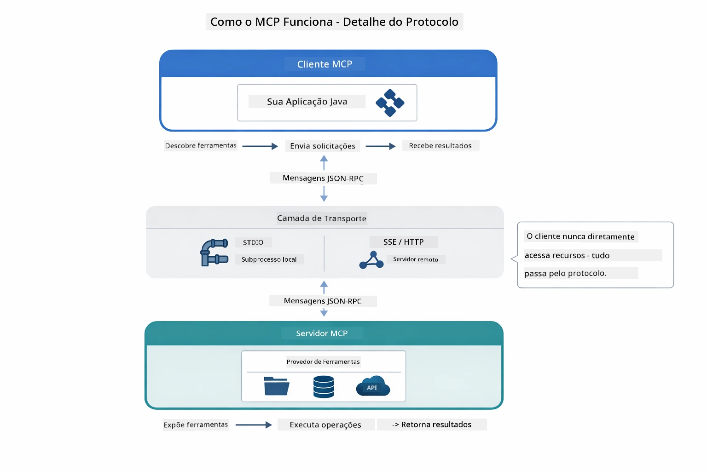

*Como o MCP funciona internamente — clientes descobrem ferramentas, trocam mensagens JSON-RPC e executam operações por meio de uma camada de transporte.*

**Arquitetura Servidor-Cliente**

O MCP utiliza um modelo cliente-servidor. Servidores fornecem ferramentas — leitura de arquivos, consultas a bancos de dados, chamadas a APIs. Clientes (sua aplicação de IA) se conectam aos servidores e usam suas ferramentas.

Para usar MCP com LangChain4j, adicione esta dependência Maven:

```xml
<dependency>
    <groupId>dev.langchain4j</groupId>
    <artifactId>langchain4j-mcp</artifactId>
    <version>${langchain4j.version}</version>
</dependency>
```

**Descoberta de Ferramentas**

Quando seu cliente se conecta a um servidor MCP, ele pergunta "Quais ferramentas você tem?" O servidor responde com uma lista de ferramentas disponíveis, cada uma com descrições e esquemas de parâmetros. Seu agente de IA pode então decidir quais ferramentas usar com base nos pedidos do usuário.

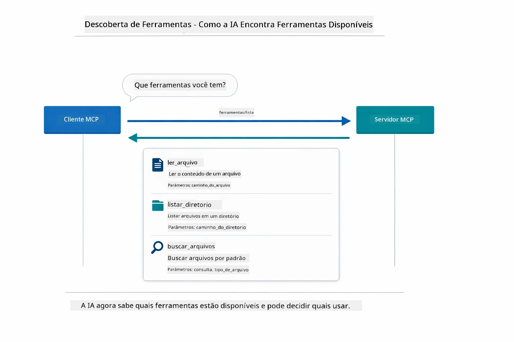

*A IA descobre as ferramentas disponíveis na inicialização — agora sabe quais capacidades estão disponíveis e pode decidir quais usar.*

**Mecanismos de Transporte**

O MCP suporta diferentes mecanismos de transporte. Este módulo demonstra o transporte Stdio para processos locais:


*Mecanismos de transporte MCP: HTTP para servidores remotos, Stdio para processos locais*

**Stdio** - [StdioTransportDemo.java](../../../05-mcp/src/main/java/com/example/langchain4j/mcp/StdioTransportDemo.java)

Para processos locais. Sua aplicação gera um servidor como subprocesso e se comunica por meio de entrada/saída padrão. Útil para acesso ao sistema de arquivos ou ferramentas de linha de comando.

```java
McpTransport stdioTransport = new StdioMcpTransport.Builder()
    .command(List.of(
        npmCmd, "exec",
        "@modelcontextprotocol/server-filesystem@2025.12.18",
        resourcesDir
    ))
    .logEvents(false)
    .build();
```

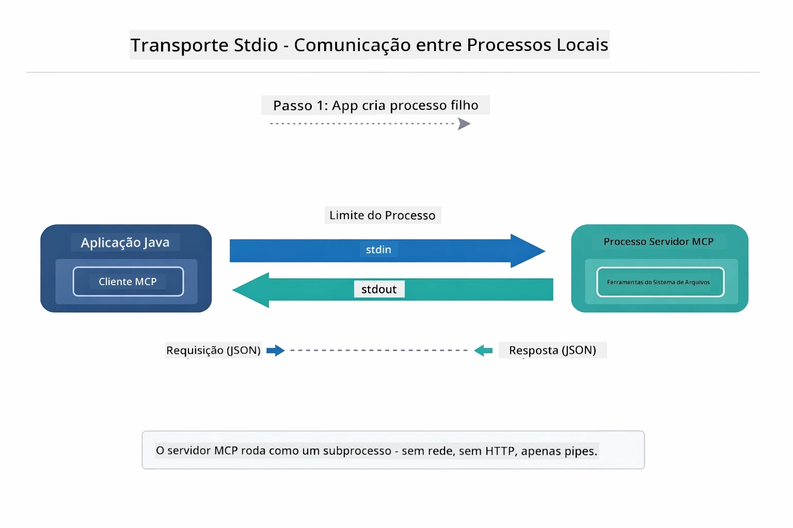

*Transporte stdio em ação — sua aplicação gera o servidor MCP como processo filho e se comunica através dos pipes stdin/stdout.*

> **🤖 Experimente com o Chat do [GitHub Copilot](https://github.com/features/copilot):** Abra [`StdioTransportDemo.java`](../../../05-mcp/src/main/java/com/example/langchain4j/mcp/StdioTransportDemo.java) e pergunte:
> - "Como funciona o transporte Stdio e quando devo usá-lo em vez de HTTP?"
> - "Como o LangChain4j gerencia o ciclo de vida dos processos do servidor MCP gerados?"
> - "Quais são as implicações de segurança ao dar acesso da IA ao sistema de arquivos?"

## O Módulo Agente

Enquanto o MCP fornece ferramentas padronizadas, o **módulo agente** do LangChain4j oferece uma forma declarativa de construir agentes que orquestram essas ferramentas. A anotação `@Agent` e o `AgenticServices` permitem definir o comportamento do agente por meio de interfaces, em vez de código imperativo.

Neste módulo, você explorará o padrão **Agente Supervisor** — uma abordagem agente avançada onde um agente "supervisor" decide dinamicamente quais subagentes invocar com base nos pedidos do usuário. Vamos combinar esses dois conceitos dando a um de nossos subagentes capacidades de acesso a arquivos alimentadas por MCP.

Para usar o módulo agente, adicione esta dependência Maven:

```xml
<dependency>
    <groupId>dev.langchain4j</groupId>
    <artifactId>langchain4j-agentic</artifactId>
    <version>${langchain4j.mcp.version}</version>
</dependency>
```

> **⚠️ Experimental:** O módulo `langchain4j-agentic` é **experimental** e sujeito a mudanças. A forma estável de construir assistentes de IA continua sendo o `langchain4j-core` com ferramentas personalizadas (Módulo 04).

## Executando os Exemplos

### Pré-requisitos

- Java 21+, Maven 3.9+
- Node.js 16+ e npm (para servidores MCP)
- Variáveis de ambiente configuradas no arquivo `.env` (a partir do diretório raiz):
  - `AZURE_OPENAI_ENDPOINT`, `AZURE_OPENAI_API_KEY`, `AZURE_OPENAI_DEPLOYMENT` (mesmo que nos Módulos 01-04)

> **Nota:** Se você ainda não configurou suas variáveis de ambiente, veja [Módulo 00 - Início Rápido](../00-quick-start/README.md) para instruções, ou copie `.env.example` para `.env` no diretório raiz e preencha seus valores.

## Início Rápido

**Usando VS Code:** Simplesmente clique com o botão direito em qualquer arquivo de demonstração no Explorador e selecione **"Run Java"**, ou use as configurações de lançamento no painel Run and Debug (certifique-se de que seu token foi adicionado ao arquivo `.env` primeiro).

**Usando Maven:** Alternativamente, você pode executar a partir da linha de comando com os exemplos abaixo.

### Operações de Arquivo (Stdio)

Isto demonstra ferramentas baseadas em subprocessos locais.

**✅ Nenhum pré-requisito necessário** — o servidor MCP é iniciado automaticamente.

**Usando os Scripts de Inicialização (Recomendado):**

Os scripts de inicialização carregam automaticamente as variáveis de ambiente do arquivo `.env` raiz:

**Bash:**
```bash
cd 05-mcp
chmod +x start-stdio.sh
./start-stdio.sh
```

**PowerShell:**
```powershell
cd 05-mcp
.\start-stdio.ps1
```

**Usando VS Code:** Clique com o botão direito em `StdioTransportDemo.java` e selecione **"Run Java"** (certifique-se de que seu arquivo `.env` está configurado).

A aplicação gera automaticamente um servidor MCP do sistema de arquivos e lê um arquivo local. Note como o gerenciamento do subprocesso é feito para você.

**Saída esperada:**
```
Assistant response: The file provides an overview of LangChain4j, an open-source Java library
for integrating Large Language Models (LLMs) into Java applications...
```

### Agente Supervisor

O **padrão Agente Supervisor** é uma forma **flexível** de IA agente. Um Supervisor usa um LLM para decidir autonomamente quais agentes invocar com base no pedido do usuário. No próximo exemplo, combinamos acesso a arquivos alimentado por MCP com um agente LLM para criar um fluxo supervisionado de leitura de arquivo → relatório.

Na demonstração, `FileAgent` lê um arquivo usando ferramentas MCP do sistema de arquivos, e `ReportAgent` gera um relatório estruturado com um resumo executivo (1 frase), 3 pontos-chave e recomendações. O Supervisor orquestra esse fluxo automaticamente:

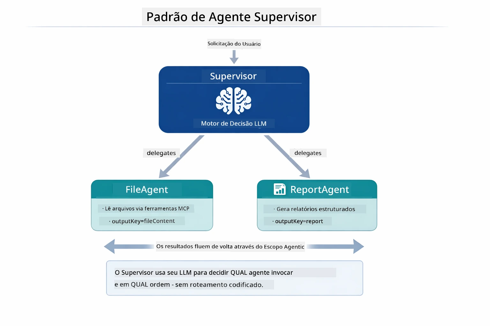

*O Supervisor usa seu LLM para decidir quais agentes invocar e em que ordem — sem necessidade de roteamento codificado.*

Aqui está como o fluxo concreto parece para nosso pipeline de arquivo para relatório:

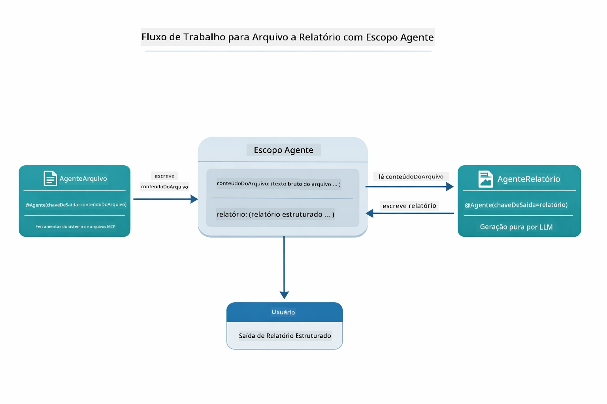

*FileAgent lê o arquivo via ferramentas MCP, depois ReportAgent transforma o conteúdo bruto em um relatório estruturado.*

Cada agente armazena sua saída no **Escopo Agente** (memória compartilhada), permitindo que agentes posteriores acessem resultados anteriores. Isso demonstra como as ferramentas MCP se integram perfeitamente em fluxos agentes — o Supervisor não precisa saber *como* os arquivos são lidos, apenas que `FileAgent` pode fazer isso.

#### Executando a Demonstração

Os scripts de inicialização carregam automaticamente as variáveis de ambiente do arquivo `.env` raiz:

**Bash:**
```bash
cd 05-mcp
chmod +x start-supervisor.sh
./start-supervisor.sh
```

**PowerShell:**
```powershell
cd 05-mcp
.\start-supervisor.ps1
```

**Usando VS Code:** Clique com o botão direito em `SupervisorAgentDemo.java` e selecione **"Run Java"** (certifique-se de que seu arquivo `.env` está configurado).

#### Como o Supervisor Funciona

```java
// Etapa 1: FileAgent lê arquivos usando ferramentas MCP
FileAgent fileAgent = AgenticServices.agentBuilder(FileAgent.class)
        .chatModel(model)
        .toolProvider(mcpToolProvider)  // Possui ferramentas MCP para operações de arquivos
        .build();

// Etapa 2: ReportAgent gera relatórios estruturados
ReportAgent reportAgent = AgenticServices.agentBuilder(ReportAgent.class)
        .chatModel(model)
        .build();

// O Supervisor orquestra o fluxo de trabalho arquivo → relatório
SupervisorAgent supervisor = AgenticServices.supervisorBuilder()
        .chatModel(model)
        .subAgents(fileAgent, reportAgent)
        .responseStrategy(SupervisorResponseStrategy.LAST)  // Retorna o relatório final
        .build();

// O Supervisor decide quais agentes invocar com base na solicitação
String response = supervisor.invoke("Read the file at /path/file.txt and generate a report");
```

#### Estratégias de Resposta

Quando você configura um `SupervisorAgent`, especifica como ele deve formular sua resposta final ao usuário após os subagentes completarem suas tarefas.

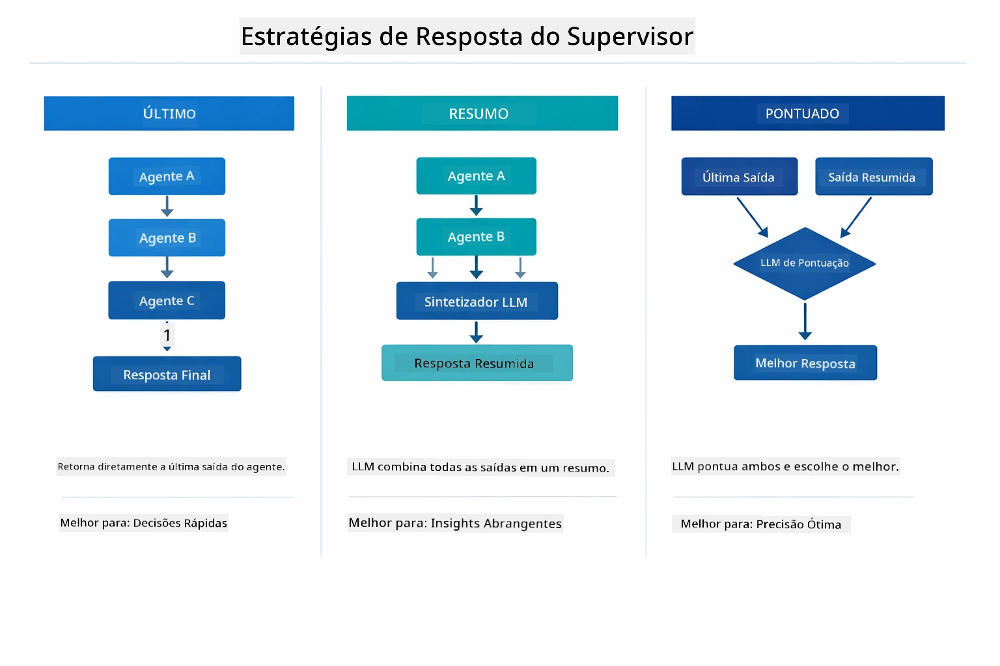

*Três estratégias para como o Supervisor formula sua resposta final — escolha com base em querer a saída do último agente, um resumo sintetizado, ou a opção com melhor pontuação.*

As estratégias disponíveis são:

| Estratégia | Descrição |
|------------|-----------|
| **LAST** | O supervisor retorna a saída do último subagente ou ferramenta chamada. Isso é útil quando o agente final no fluxo é especificamente projetado para produzir a resposta completa final (ex.: um "Agente Resumo" em um pipeline de pesquisa). |
| **SUMMARY** | O supervisor usa seu próprio Modelo de Linguagem Interno (LLM) para sintetizar um resumo de toda a interação e todas as saídas dos subagentes, retornando esse resumo como resposta final. Isso fornece uma resposta limpa e agregada ao usuário. |
| **SCORED** | O sistema usa um LLM interno para pontuar tanto a resposta LAST quanto o SUMMARY da interação em relação ao pedido original do usuário, retornando a saída que recebe a pontuação maior. |

Veja [SupervisorAgentDemo.java](../../../05-mcp/src/main/java/com/example/langchain4j/mcp/SupervisorAgentDemo.java) para a implementação completa.

> **🤖 Experimente com o Chat do [GitHub Copilot](https://github.com/features/copilot):** Abra [`SupervisorAgentDemo.java`](../../../05-mcp/src/main/java/com/example/langchain4j/mcp/SupervisorAgentDemo.java) e pergunte:
> - "Como o Supervisor decide quais agentes invocar?"
> - "Qual a diferença entre os padrões Supervisor e Fluxo Sequencial?"
> - "Como posso personalizar o comportamento de planejamento do Supervisor?"

#### Entendendo a Saída

Ao executar a demonstração, você verá um passo a passo estruturado de como o Supervisor orquestra múltiplos agentes. Aqui está o que cada seção significa:

```
======================================================================
  FILE → REPORT WORKFLOW DEMO
======================================================================

This demo shows a clear 2-step workflow: read a file, then generate a report.
The Supervisor orchestrates the agents automatically based on the request.
```

**O cabeçalho** introduz o conceito do fluxo de trabalho: um pipeline focado da leitura de arquivos até a geração do relatório.

```
--- WORKFLOW ---------------------------------------------------------
  ┌─────────────┐      ┌──────────────┐
  │  FileAgent  │ ───▶ │ ReportAgent  │
  │ (MCP tools) │      │  (pure LLM)  │
  └─────────────┘      └──────────────┘
   outputKey:           outputKey:
   'fileContent'        'report'

--- AVAILABLE AGENTS -------------------------------------------------
  [FILE]   FileAgent   - Reads files via MCP → stores in 'fileContent'
  [REPORT] ReportAgent - Generates structured report → stores in 'report'
```

**Diagrama do Fluxo** mostra o fluxo de dados entre os agentes. Cada agente tem um papel específico:
- **FileAgent** lê arquivos usando ferramentas MCP e armazena conteúdo bruto em `fileContent`
- **ReportAgent** consome esse conteúdo e produz um relatório estruturado em `report`

```
--- USER REQUEST -----------------------------------------------------
  "Read the file at .../file.txt and generate a report on its contents"
```

**Pedido do Usuário** mostra a tarefa. O Supervisor analisa isso e decide invocar FileAgent → ReportAgent.

```
--- SUPERVISOR ORCHESTRATION -----------------------------------------
  The Supervisor decides which agents to invoke and passes data between them...

  +-- STEP 1: Supervisor chose -> FileAgent (reading file via MCP)
  |
  |   Input: .../file.txt
  |
  |   Result: LangChain4j is an open-source, provider-agnostic Java framework for building LLM...
  +-- [OK] FileAgent (reading file via MCP) completed

  +-- STEP 2: Supervisor chose -> ReportAgent (generating structured report)
  |
  |   Input: LangChain4j is an open-source, provider-agnostic Java framew...
  |
  |   Result: Executive Summary...
  +-- [OK] ReportAgent (generating structured report) completed
```

**Orquestração do Supervisor** mostra o fluxo em 2 etapas em ação:
1. **FileAgent** lê o arquivo via MCP e armazena o conteúdo
2. **ReportAgent** recebe o conteúdo e gera um relatório estruturado

O Supervisor tomou essas decisões **autonomamente** com base no pedido do usuário.

```
--- FINAL RESPONSE ---------------------------------------------------
Executive Summary
...

Key Points
...

Recommendations
...

--- AGENTIC SCOPE (Data Flow) ----------------------------------------
  Each agent stores its output for downstream agents to consume:
  * fileContent: LangChain4j is an open-source, provider-agnostic Java framework...
  * report: Executive Summary...
```

#### Explicação das Funcionalidades do Módulo Agente

O exemplo demonstra várias funcionalidades avançadas do módulo agente. Vamos dar uma olhada mais próxima no Escopo Agente e nos Listeners de Agente.

**Escopo Agente** mostra a memória compartilhada onde os agentes armazenaram seus resultados usando `@Agent(outputKey="...")`. Isso permite:
- Agentes posteriores acessarem saídas dos agentes anteriores
- O Supervisor sintetizar a resposta final
- Você inspecionar o que cada agente produziu

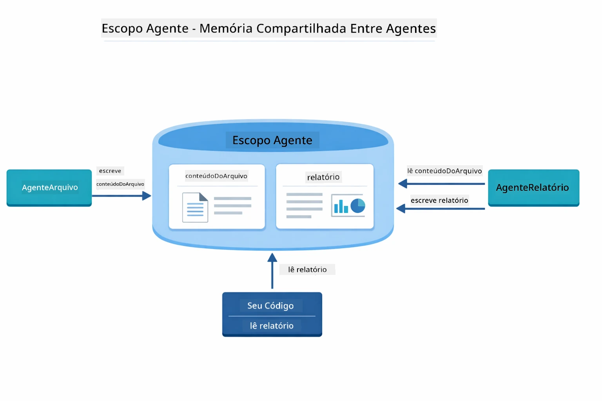

*O Escopo Agente atua como memória compartilhada — FileAgent escreve `fileContent`, ReportAgent lê e escreve `report`, e seu código lê o resultado final.*

```java
ResultWithAgenticScope<String> result = supervisor.invokeWithAgenticScope(request);
AgenticScope scope = result.agenticScope();
String fileContent = scope.readState("fileContent");  // Dados brutos do arquivo do FileAgent
String report = scope.readState("report");            // Relatório estruturado do ReportAgent
```

**Listeners de Agente** permitem monitorar e depurar a execução de agentes. A saída passo a passo que você vê na demonstração vem de um AgentListener que se conecta a cada invocação de agente:
- **beforeAgentInvocation** - Chamado quando o Supervisor seleciona um agente, permitindo que você veja qual agente foi escolhido e por quê  
- **afterAgentInvocation** - Chamado quando um agente é concluído, mostrando seu resultado  
- **inheritedBySubagents** - Quando verdadeiro, o listener monitora todos os agentes na hierarquia  

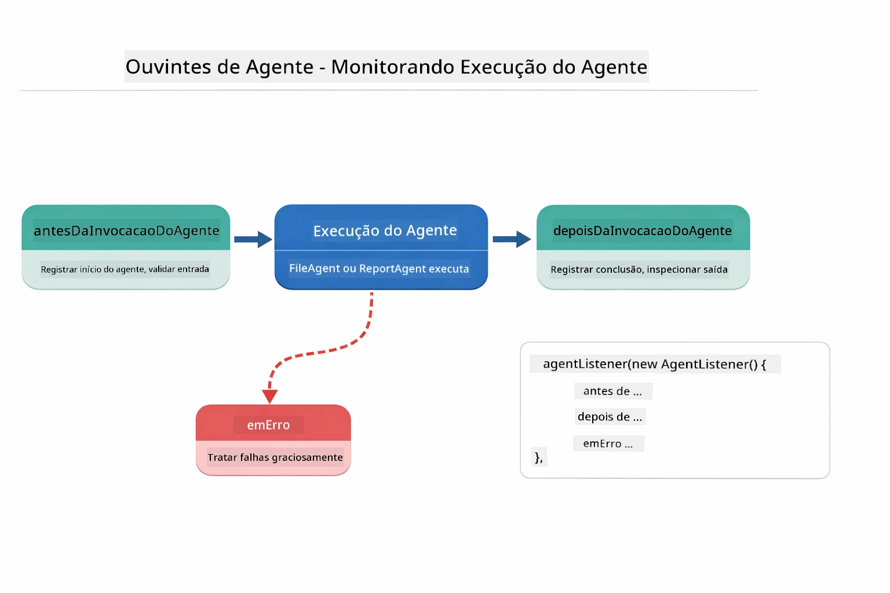

*Os Agent Listeners conectam-se ao ciclo de vida da execução — monitoram quando agentes começam, terminam ou encontram erros.*

```java
AgentListener monitor = new AgentListener() {
    private int step = 0;
    
    @Override
    public void beforeAgentInvocation(AgentRequest request) {
        step++;
        System.out.println("  +-- STEP " + step + ": " + request.agentName());
    }
    
    @Override
    public void afterAgentInvocation(AgentResponse response) {
        System.out.println("  +-- [OK] " + response.agentName() + " completed");
    }
    
    @Override
    public boolean inheritedBySubagents() {
        return true; // Propagar para todos os subagentes
    }
};
```
  
Além do padrão Supervisor, o módulo `langchain4j-agentic` fornece vários padrões e recursos poderosos de fluxo de trabalho:

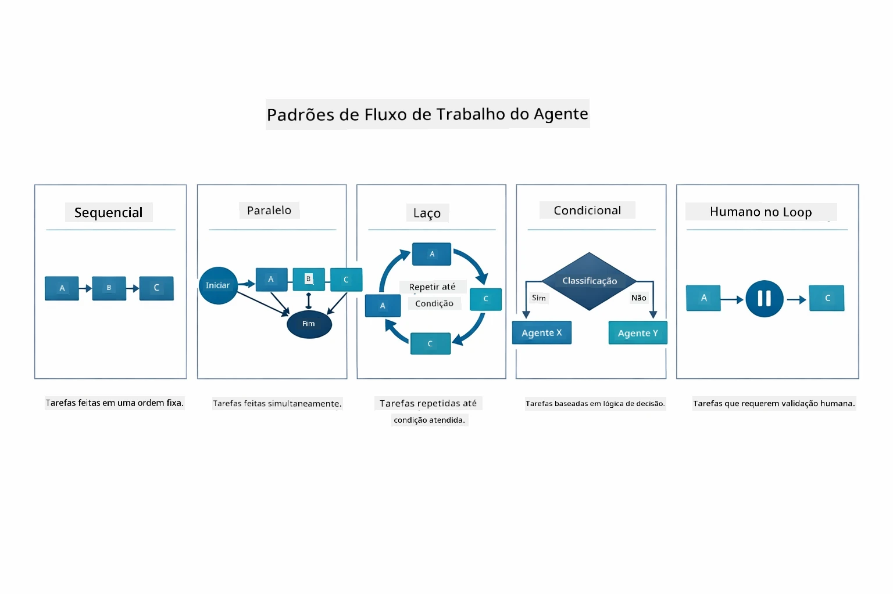

*Cinco padrões de fluxo de trabalho para orquestrar agentes — desde pipelines sequenciais simples até fluxos de aprovação com intervenção humana.*

| Pattern | Description | Use Case |
|---------|-------------|----------|
| **Sequential** | Executa agentes em ordem, saída flui para o próximo | Pipelines: pesquisa → análise → relatório |
| **Parallel** | Executa agentes simultaneamente | Tarefas independentes: clima + notícias + ações |
| **Loop** | Itera até condição ser satisfeita | Avaliação de qualidade: refina até pontuação ≥ 0,8 |
| **Conditional** | Roteia baseado em condições | Classifica → encaminha para agente especialista |
| **Human-in-the-Loop** | Adiciona pontos de verificação humana | Fluxos de aprovação, revisão de conteúdo |

## Conceitos Chave

Agora que você explorou MCP e o módulo agentic em ação, vamos resumir quando usar cada abordagem.

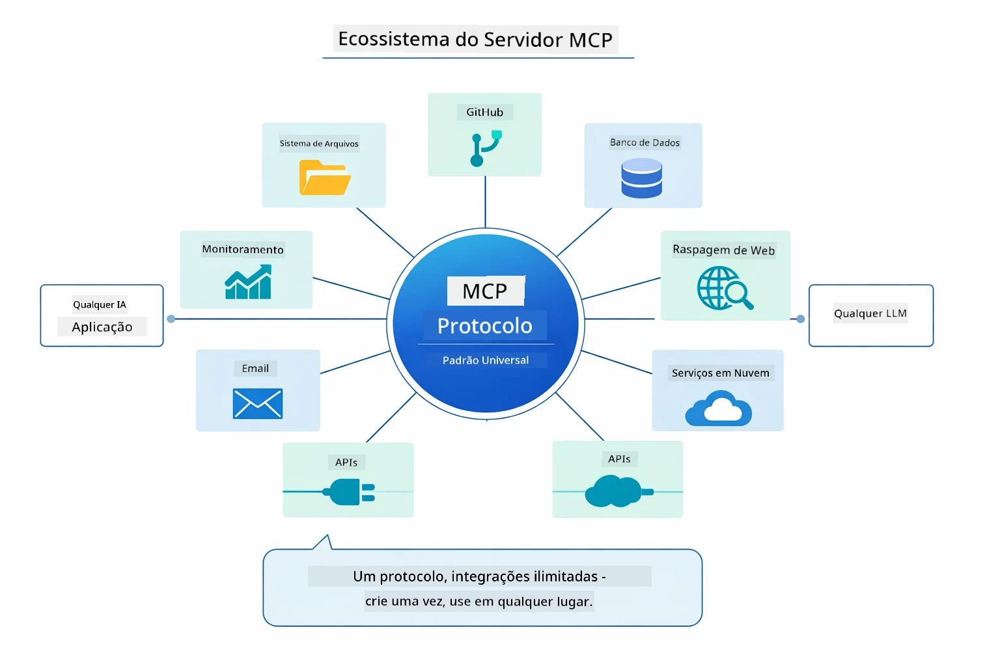

*MCP cria um ecossistema universal de protocolos — qualquer servidor compatível com MCP funciona com qualquer cliente compatível, permitindo compartilhamento de ferramentas entre aplicações.*

**MCP** é ideal quando você quer aproveitar ecossistemas de ferramentas existentes, construir ferramentas que várias aplicações possam compartilhar, integrar serviços de terceiros com protocolos padrão, ou trocar implementações de ferramentas sem mudar o código.

**O Módulo Agentic** funciona melhor quando você quer definições declarativas de agentes com anotações `@Agent`, precisa de orquestração de fluxo de trabalho (sequencial, loop, paralelo), prefere design de agente baseado em interface ao invés de código imperativo, ou está combinando múltiplos agentes que compartilham saídas via `outputKey`.

**O padrão Supervisor Agent** se destaca quando o fluxo de trabalho não é previsível antecipadamente e você quer que o LLM decida, quando há múltiplos agentes especializados que precisam de orquestração dinâmica, ao construir sistemas conversacionais que direcionam para diferentes capacidades, ou quando você quer o comportamento de agente mais flexível e adaptativo.

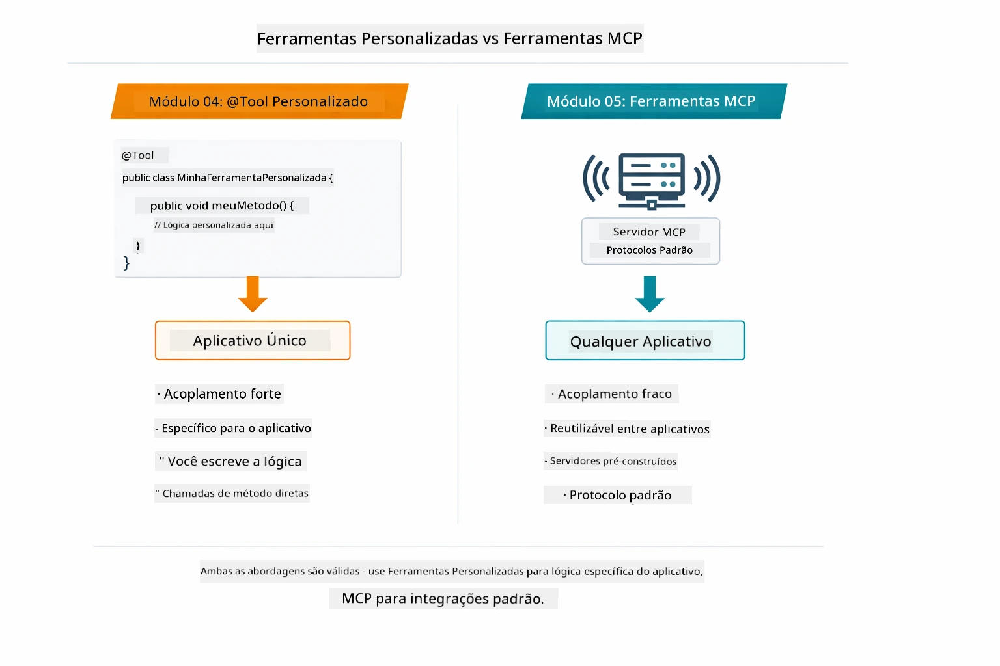

*Quando usar métodos personalizados @Tool vs ferramentas MCP — ferramentas personalizadas para lógica específica da aplicação com total segurança de tipo, ferramentas MCP para integrações padronizadas que funcionam entre aplicações.*

## Parabéns!

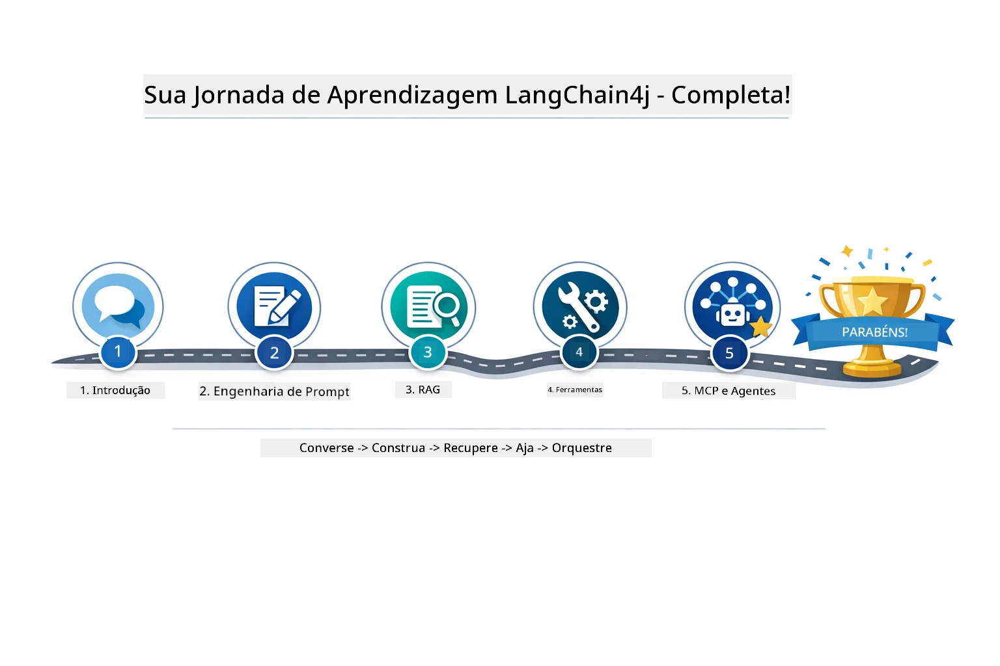

*Sua jornada de aprendizado através dos cinco módulos — do chat básico aos sistemas agentic alimentados por MCP.*

Você completou o curso LangChain4j para Iniciantes. Você aprendeu:

- Como construir IA conversacional com memória (Módulo 01)  
- Padrões de engenharia de prompt para diferentes tarefas (Módulo 02)  
- Fundamentar respostas em seus documentos com RAG (Módulo 03)  
- Criar agentes básicos de IA (assistentes) com ferramentas personalizadas (Módulo 04)  
- Integrar ferramentas padronizadas com os módulos LangChain4j MCP e Agentic (Módulo 05)  

### E Agora?

Após completar os módulos, explore o [Guia de Testes](../docs/TESTING.md) para ver conceitos de teste do LangChain4j em ação.

**Recursos Oficiais:**  
- [Documentação LangChain4j](https://docs.langchain4j.dev/) - Guias completos e referência de API  
- [LangChain4j GitHub](https://github.com/langchain4j/langchain4j) - Código-fonte e exemplos  
- [Tutoriais LangChain4j](https://docs.langchain4j.dev/tutorials/) - Tutoriais passo a passo para vários casos de uso  

Obrigado por completar este curso!

---

**Navegação:** [← Anterior: Módulo 04 - Ferramentas](../04-tools/README.md) | [Voltar à Página Principal](../README.md)

---

<!-- CO-OP TRANSLATOR DISCLAIMER START -->
**Aviso Legal**:
Este documento foi traduzido utilizando o serviço de tradução automática [Co-op Translator](https://github.com/Azure/co-op-translator). Embora nos esforcemos pela precisão, esteja ciente de que traduções automatizadas podem conter erros ou imprecisões. O documento original em seu idioma nativo deve ser considerado a fonte autoritativa. Para informações críticas, recomenda-se tradução profissional realizada por humanos. Não nos responsabilizamos por quaisquer mal-entendidos ou interpretações equivocadas decorrentes do uso desta tradução.
<!-- CO-OP TRANSLATOR DISCLAIMER END -->