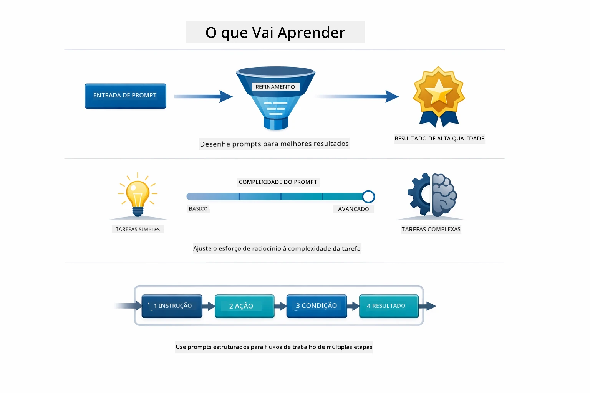
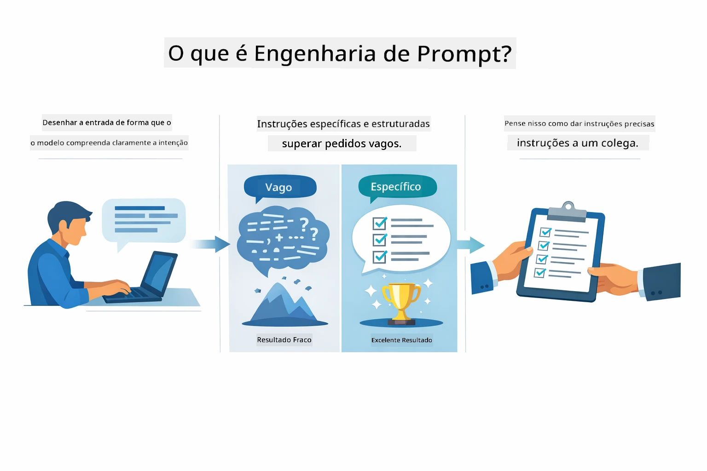
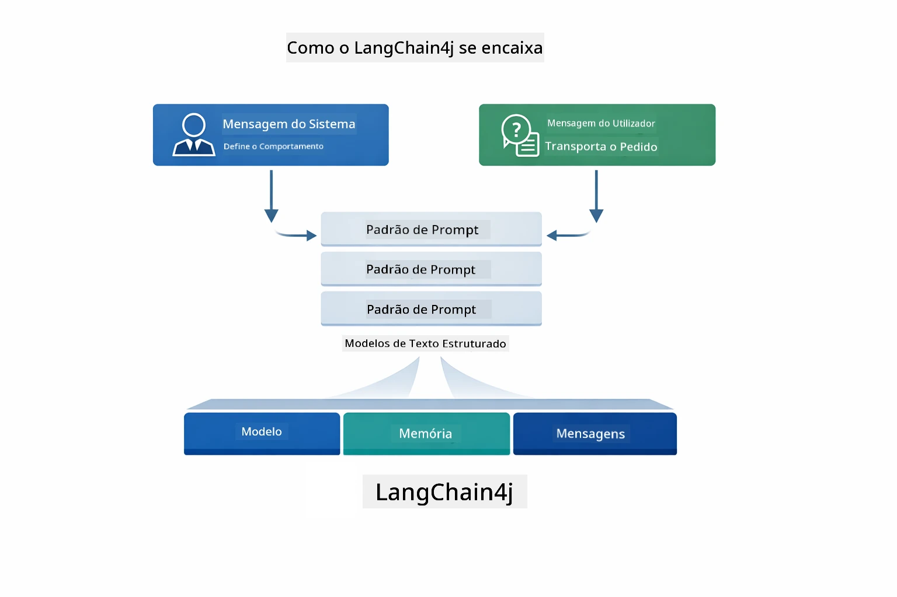
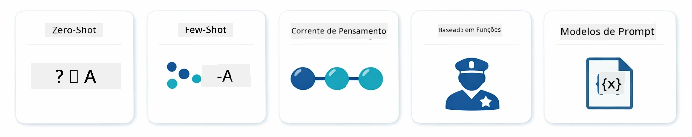
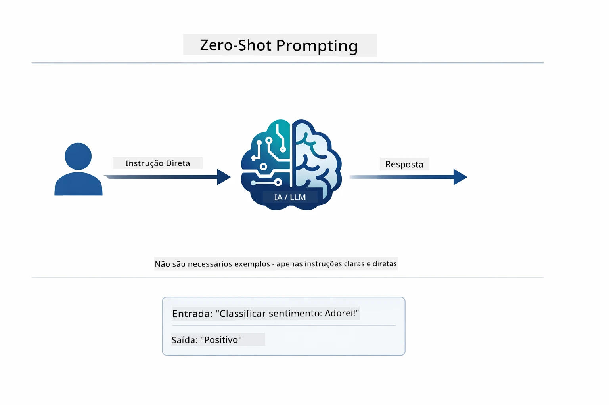
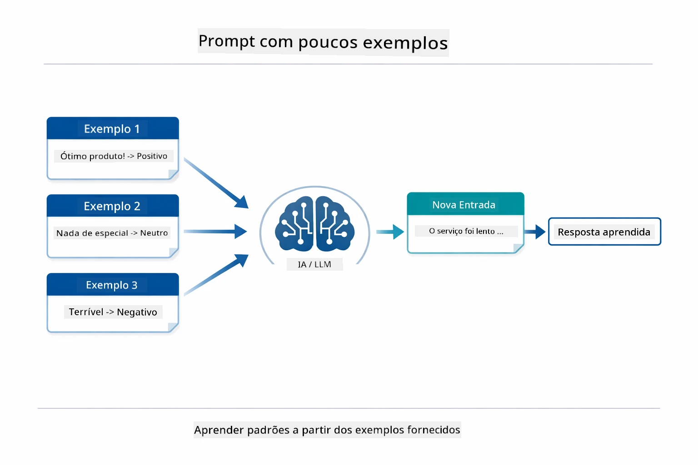
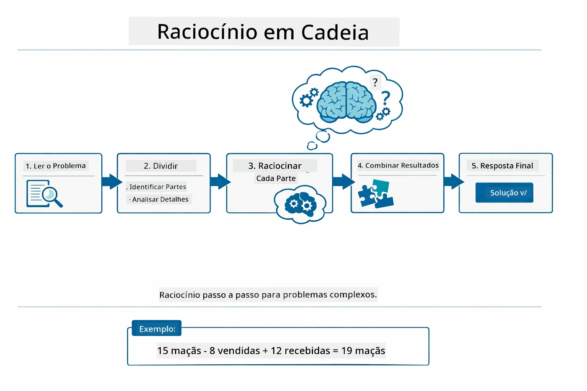
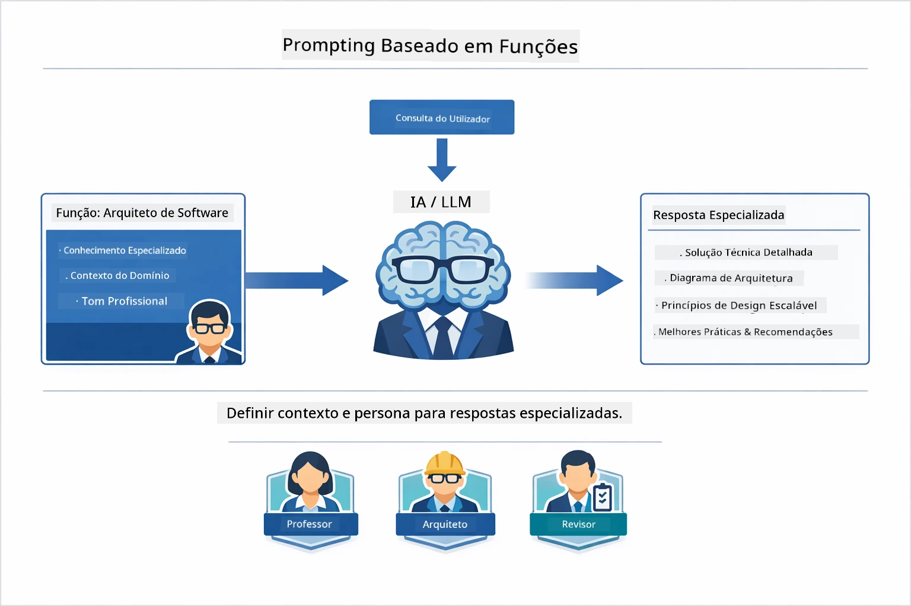
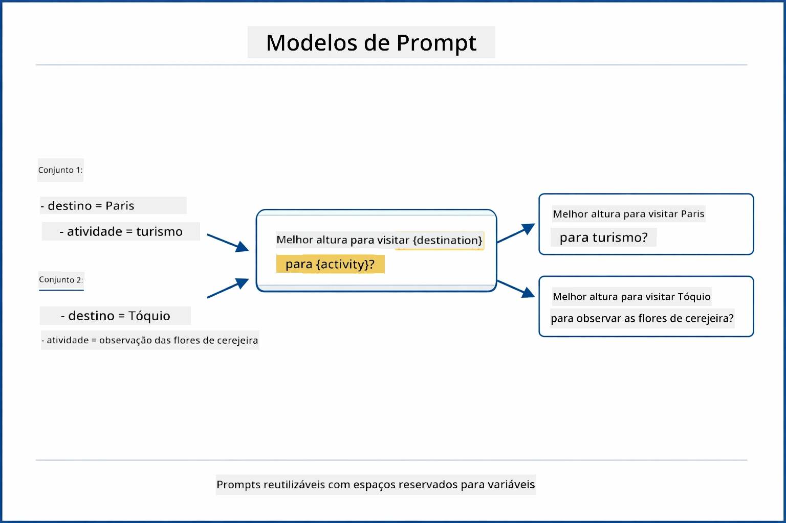
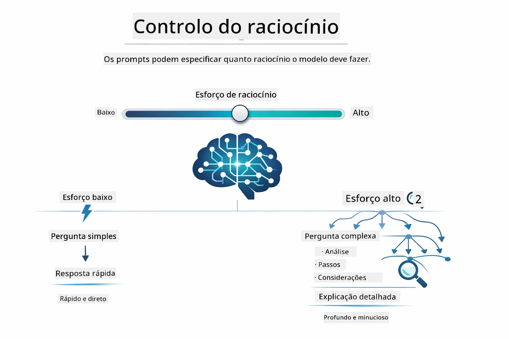

# Módulo 02: Engenharia de Prompts com GPT-5.2

## Índice

- [O que irá aprender](../../../02-prompt-engineering)
- [Pré-requisitos](../../../02-prompt-engineering)
- [Compreender Engenharia de Prompts](../../../02-prompt-engineering)
- [Fundamentos da Engenharia de Prompts](../../../02-prompt-engineering)
  - [Prompting Zero-Shot](../../../02-prompt-engineering)
  - [Prompting Few-Shot](../../../02-prompt-engineering)
  - [Cadeia de Pensamento](../../../02-prompt-engineering)
  - [Prompting Baseado em Papel](../../../02-prompt-engineering)
  - [Templates de Prompt](../../../02-prompt-engineering)
- [Padrões Avançados](../../../02-prompt-engineering)
- [Uso de Recursos Azure Existentes](../../../02-prompt-engineering)
- [Capturas de Ecrã da Aplicação](../../../02-prompt-engineering)
- [Explorando os Padrões](../../../02-prompt-engineering)
  - [Baixa vs Alta Vontade](../../../02-prompt-engineering)
  - [Execução de Tarefas (Preâmbulos de Ferramenta)](../../../02-prompt-engineering)
  - [Código Auto-Refletivo](../../../02-prompt-engineering)
  - [Análise Estruturada](../../../02-prompt-engineering)
  - [Chat Multi-Turno](../../../02-prompt-engineering)
  - [Raciocínio Passo a Passo](../../../02-prompt-engineering)
  - [Saída Constrangida](../../../02-prompt-engineering)
- [O que está realmente a aprender](../../../02-prompt-engineering)
- [Próximos Passos](../../../02-prompt-engineering)

## O que irá aprender



No módulo anterior, viu como a memória permite a IA conversacional e usou Modelos GitHub para interações básicas. Agora vamos focar em como faz as perguntas — os próprios prompts — usando o GPT-5.2 do Azure OpenAI. A forma como estrutura os seus prompts afeta dramaticamente a qualidade das respostas que obtém. Começamos com uma revisão das técnicas fundamentais de prompt, depois avançamos para oito padrões avançados que tiram pleno proveito das capacidades do GPT-5.2.

Usaremos o GPT-5.2 porque este introduz controlo de raciocínio — pode dizer ao modelo quanto deve pensar antes de responder. Isto torna as diferentes estratégias de prompting mais evidentes e ajuda a perceber quando usar cada abordagem. Também beneficiamos dos limites de taxa inferiores do Azure para o GPT-5.2 comparado aos Modelos GitHub.

## Pré-requisitos

- Módulo 01 concluído (recursos Azure OpenAI implantados)
- Ficheiro `.env` no diretório raiz com credenciais Azure (criado pelo `azd up` no Módulo 01)

> **Nota:** Se ainda não completou o Módulo 01, siga primeiro as instruções de implantação aí.

## Compreender Engenharia de Prompts



Engenharia de prompts trata-se de criar texto de entrada que consegue consistentemente os resultados de que necessita. Não é só fazer perguntas — é estruturar os pedidos para que o modelo compreenda exatamente o que quer e como o entregar.

Pense nisso como dar instruções a um colega. "Corrige o bug" é vago. "Corrige a exceção null pointer em UserService.java linha 45 adicionando uma verificação de null" é específico. Os modelos de linguagem funcionam da mesma forma — especificidade e estrutura importam.



O LangChain4j fornece a infraestrutura — ligações a modelos, memória e tipos de mensagens — enquanto os padrões de prompt são apenas texto cuidadosamente estruturado que envia por essa infraestrutura. Os blocos fundamentais são `SystemMessage` (que define o comportamento e papel da IA) e `UserMessage` (que transporta o seu pedido real).

## Fundamentos da Engenharia de Prompts



Antes de mergulharmos nos padrões avançados deste módulo, vamos rever cinco técnicas fundamentais de prompting. Estes são os blocos de construção que todo engenheiro de prompts deve conhecer. Se já trabalhou no [módulo Quick Start](../00-quick-start/README.md#2-prompt-patterns), já viu estes em ação — aqui está o quadro conceptual por detrás deles.

### Prompting Zero-Shot

A abordagem mais simples: dê ao modelo uma instrução direta sem exemplos. O modelo baseia-se inteiramente no seu treino para compreender e executar a tarefa. Isto funciona bem para pedidos diretos onde o comportamento esperado é óbvio.



*Instrução direta sem exemplos — o modelo deduz a tarefa só com a instrução*

```java
String prompt = "Classify this sentiment: 'I absolutely loved the movie!'";
String response = model.chat(prompt);
// Resposta: "Positivo"
```

**Quando usar:** Classificações simples, perguntas diretas, traduções ou qualquer tarefa que o modelo consiga fazer sem orientação adicional.

### Prompting Few-Shot

Forneça exemplos que demonstrem o padrão que deseja que o modelo siga. O modelo aprende o formato esperado input-output pelos seus exemplos e aplica-o a novas entradas. Isto melhora drasticamente a consistência para tarefas onde o formato ou comportamento desejado não é óbvio.



*Aprender com exemplos — o modelo identifica o padrão e utiliza-o em novas entradas*

```java
String prompt = """
    Classify the sentiment as positive, negative, or neutral.
    
    Examples:
    Text: "This product exceeded my expectations!" → Positive
    Text: "It's okay, nothing special." → Neutral
    Text: "Waste of money, very disappointed." → Negative
    
    Now classify this:
    Text: "Best purchase I've made all year!"
    """;
String response = model.chat(prompt);
```

**Quando usar:** Classificações personalizadas, formatação consistente, tarefas específicas de domínio, ou quando resultados zero-shot forem inconsistentes.

### Cadeia de Pensamento

Peça ao modelo para mostrar o seu raciocínio passo a passo. Em vez de saltar diretamente para a resposta, o modelo desconstrói o problema e trabalha cada parte explicitamente. Isto melhora a precisão em matemática, lógica e tarefas de raciocínio em múltiplos passos.



*Raciocínio passo a passo — quebrar problemas complexos em etapas lógicas explícitas*

```java
String prompt = """
    Problem: A store has 15 apples. They sell 8 apples and then 
    receive a shipment of 12 more apples. How many apples do they have now?
    
    Let's solve this step-by-step:
    """;
String response = model.chat(prompt);
// O modelo mostra: 15 - 8 = 7, depois 7 + 12 = 19 maçãs
```

**Quando usar:** Problemas de matemática, puzzles de lógica, debugging, ou qualquer tarefa onde mostrar o processo de raciocínio melhora a precisão e a confiança.

### Prompting Baseado em Papel

Defina uma persona ou papel para a IA antes de fazer a sua pergunta. Isto fornece contexto que molda o tom, profundidade e foco da resposta. Um "arquitecto de software" dá conselhos diferentes de um "desenvolvedor júnior" ou de um "auditor de segurança".



*Definir contexto e persona — a mesma pergunta recebe uma resposta diferente dependendo do papel atribuído*

```java
String prompt = """
    You are an experienced software architect reviewing code.
    Provide a brief code review for this function:
    
    def calculate_total(items):
        total = 0
        for item in items:
            total = total + item['price']
        return total
    """;
String response = model.chat(prompt);
```

**Quando usar:** Revisões de código, tutoria, análise específica de domínio, ou quando precisar de respostas ajustadas a um nível de especialização ou perspetiva particular.

### Templates de Prompt

Crie prompts reutilizáveis com espaços reservados para variáveis. Em vez de escrever um prompt novo sempre, defina um template uma vez e preencha valores diferentes. A classe `PromptTemplate` do LangChain4j facilita isto com a sintaxe `{{variable}}`.



*Prompts reutilizáveis com espaços variáveis — um template, muitos usos*

```java
PromptTemplate template = PromptTemplate.from(
    "What's the best time to visit {{destination}} for {{activity}}?"
);

Prompt prompt = template.apply(Map.of(
    "destination", "Paris",
    "activity", "sightseeing"
));

String response = model.chat(prompt.text());
```

**Quando usar:** Consultas repetidas com diferentes entradas, processamento em lote, construção de fluxos de trabalho IA reutilizáveis, ou qualquer cenário onde a estrutura do prompt se mantém mas os dados mudam.

---

Estes cinco fundamentos dão-lhe um conjunto sólido para a maioria das tarefas de prompting. O resto deste módulo baseia-se neles com **oito padrões avançados** que exploram o controlo de raciocínio, autoavaliação e capacidades de saída estruturada do GPT-5.2.

## Padrões Avançados

Com os fundamentos cobertos, avancemos para os oito padrões avançados que tornam este módulo único. Nem todos os problemas precisam da mesma abordagem. Algumas perguntas precisam de respostas rápidas, outras precisam de pensamento profundo. Algumas precisam de raciocínio visível, outras só de resultados. Cada padrão abaixo está otimizado para um cenário diferente — e o controlo de raciocínio do GPT-5.2 torna as diferenças ainda mais evidentes.


*Visão geral dos oito padrões de engenharia de prompt e seus casos de uso*



*O controlo de raciocínio do GPT-5.2 permite especificar quanto o modelo deve pensar — desde respostas rápidas e diretas a exploração profunda*

**Baixa Vontade (Rápido e Focado)** - Para perguntas simples onde quer respostas rápidas e diretas. O modelo faz raciocínio mínimo — máximo 2 passos. Use para cálculos, consultas rápidas ou perguntas diretas.

```java
String prompt = """
    <context_gathering>
    - Search depth: very low
    - Bias strongly towards providing a correct answer as quickly as possible
    - Usually, this means an absolute maximum of 2 reasoning steps
    - If you think you need more time, state what you know and what's uncertain
    </context_gathering>
    
    Problem: What is 15% of 200?
    
    Provide your answer:
    """;

String response = chatModel.chat(prompt);
```

> 💡 **Explore com GitHub Copilot:** Abra [`Gpt5PromptService.java`](../../../02-prompt-engineering/src/main/java/com/example/langchain4j/prompts/service/Gpt5PromptService.java) e pergunte:
> - "Qual é a diferença entre os padrões de prompting de baixa vontade e alta vontade?"
> - "Como as tags XML nos prompts ajudam a estruturar a resposta da IA?"
> - "Quando devo usar padrões de auto-reflexão vs instrução direta?"

**Alta Vontade (Profundo e Minucioso)** - Para problemas complexos onde quer análise exaustiva. O modelo explora detalhadamente e mostra raciocínio pormenorizado. Use para design de sistemas, decisões arquitetónicas ou pesquisa complexa.

```java
String prompt = """
    Analyze this problem thoroughly and provide a comprehensive solution.
    Consider multiple approaches, trade-offs, and important details.
    Show your analysis and reasoning in your response.
    
    Problem: Design a caching strategy for a high-traffic REST API.
    """;

String response = chatModel.chat(prompt);
```

**Execução de Tarefas (Progresso Passo a Passo)** - Para fluxos de trabalho em múltiplas etapas. O modelo fornece um plano inicial, narra cada passo enquanto executa, depois dá um resumo. Use para migrações, implementações, ou qualquer processo multi-etapas.

```java
String prompt = """
    <task_execution>
    1. First, briefly restate the user's goal in a friendly way
    
    2. Create a step-by-step plan:
       - List all steps needed
       - Identify potential challenges
       - Outline success criteria
    
    3. Execute each step:
       - Narrate what you're doing
       - Show progress clearly
       - Handle any issues that arise
    
    4. Summarize:
       - What was completed
       - Any important notes
       - Next steps if applicable
    </task_execution>
    
    <tool_preambles>
    - Always begin by rephrasing the user's goal clearly
    - Outline your plan before executing
    - Narrate each step as you go
    - Finish with a distinct summary
    </tool_preambles>
    
    Task: Create a REST endpoint for user registration
    
    Begin execution:
    """;

String response = chatModel.chat(prompt);
```

O prompting cadeia de pensamento pede explicitamente ao modelo que mostre o seu processo de raciocínio, melhorando a precisão para tarefas complexas. A decomposição passo a passo ajuda humanos e IA a compreender a lógica.

> **🤖 Experimente com o Chat do [GitHub Copilot](https://github.com/features/copilot):** Pergunte sobre este padrão:
> - "Como adaptar o padrão de execução de tarefas para operações de longa duração?"
> - "Quais as melhores práticas para estruturar preâmbulos de ferramenta em aplicações de produção?"
> - "Como captar e mostrar atualizações de progresso intermédias numa UI?"


*Plano → Executar → Resumir fluxo de trabalho para tarefas multi-etapas*

**Código Auto-Refletivo** - Para gerar código com qualidade de produção. O modelo gera código seguindo padrões de produção com tratamento adequado de erros. Use isto ao criar novas funcionalidades ou serviços.

```java
String prompt = """
    Generate Java code with production-quality standards: Create an email validation service
    Keep it simple and include basic error handling.
    """;

String response = chatModel.chat(prompt);
```


*Ciclo iterativo de melhoria - gerar, avaliar, identificar problemas, melhorar, repetir*

**Análise Estruturada** - Para avaliação consistente. O modelo revisa código usando uma estrutura fixa (correção, práticas, desempenho, segurança, manutenibilidade). Use para revisões de código ou avaliações de qualidade.

```java
String prompt = """
    <analysis_framework>
    You are an expert code reviewer. Analyze the code for:
    
    1. Correctness
       - Does it work as intended?
       - Are there logical errors?
    
    2. Best Practices
       - Follows language conventions?
       - Appropriate design patterns?
    
    3. Performance
       - Any inefficiencies?
       - Scalability concerns?
    
    4. Security
       - Potential vulnerabilities?
       - Input validation?
    
    5. Maintainability
       - Code clarity?
       - Documentation?
    
    <output_format>
    Provide your analysis in this structure:
    - Summary: One-sentence overall assessment
    - Strengths: 2-3 positive points
    - Issues: List any problems found with severity (High/Medium/Low)
    - Recommendations: Specific improvements
    </output_format>
    </analysis_framework>
    
    Code to analyze:
    ```
    public List getUsers() {
        return database.query("SELECT * FROM users");
    }
    ```
    Provide your structured analysis:
    """;

String response = chatModel.chat(prompt);
```

> **🤖 Experimente com o Chat do [GitHub Copilot](https://github.com/features/copilot):** Pergunte sobre análise estruturada:
> - "Como personalizar a estrutura de análise para diferentes tipos de revisão de código?"
> - "Qual é a melhor forma de analisar e agir em saídas estruturadas programaticamente?"
> - "Como garantir níveis de severidade consistentes em diferentes sessões de revisão?"


*Estrutura para revisões de código consistentes com níveis de severidade*

**Chat Multi-Turno** - Para conversas que necessitem de contexto. O modelo lembra mensagens anteriores e constrói a partir delas. Use para sessões de ajuda interativas ou perguntas complexas e respostas.

```java
ChatMemory memory = MessageWindowChatMemory.withMaxMessages(10);

memory.add(UserMessage.from("What is Spring Boot?"));
AiMessage aiMessage1 = chatModel.chat(memory.messages()).aiMessage();
memory.add(aiMessage1);

memory.add(UserMessage.from("Show me an example"));
AiMessage aiMessage2 = chatModel.chat(memory.messages()).aiMessage();
memory.add(aiMessage2);
```


*Como o contexto da conversa acumula ao longo de múltiplos turnos até atingir o limite de tokens*

**Raciocínio Passo a Passo** - Para problemas que requerem lógica visível. O modelo mostra raciocínio explícito para cada passo. Use para problemas de matemática, puzzles de lógica, ou quando precisa entender o processo de pensamento.

```java
String prompt = """
    <instruction>Show your reasoning step-by-step</instruction>
    
    If a train travels 120 km in 2 hours, then stops for 30 minutes,
    then travels another 90 km in 1.5 hours, what is the average speed
    for the entire journey including the stop?
    """;

String response = chatModel.chat(prompt);
```


*Quebrar problemas em etapas lógicas explícitas*

**Saída Constrangida** - Para respostas com requisitos específicos de formato. O modelo segue rigorosamente regras de formato e comprimento. Use para resumos ou quando precisa de estrutura de saída precisa.

```java
String prompt = """
    <constraints>
    - Exactly 100 words
    - Bullet point format
    - Technical terms only
    </constraints>
    
    Summarize the key concepts of machine learning.
    """;

String response = chatModel.chat(prompt);
```


*Imposição de requisitos específicos de formato, comprimento e estrutura*

## Uso de Recursos Azure Existentes

**Verifique a implantação:**

Certifique-se que o ficheiro `.env` existe no diretório raiz com credenciais Azure (criado durante o Módulo 01):
```bash
cat ../.env  # Deve mostrar AZURE_OPENAI_ENDPOINT, API_KEY, DEPLOYMENT
```

**Inicie a aplicação:**

> **Nota:** Se já iniciou todas as aplicações usando `./start-all.sh` do Módulo 01, este módulo já está a correr na porta 8083. Pode pular os comandos de arranque abaixo e ir diretamente para http://localhost:8083.

**Opção 1: Usar Spring Boot Dashboard (Recomendado para utilizadores VS Code)**

O container de desenvolvimento inclui a extensão Spring Boot Dashboard, que fornece uma interface visual para gerir todas as aplicações Spring Boot. Pode encontrá-la na Barra de Atividades à esquerda do VS Code (procure o ícone Spring Boot).

A partir do Spring Boot Dashboard, pode:
- Ver todas as aplicações Spring Boot disponíveis na workspace
- Iniciar/parar aplicações com um clique
- Ver logs das aplicações em tempo real
- Monitorizar o estado das aplicações
Basta clicar no botão de reprodução ao lado de "prompt-engineering" para iniciar este módulo, ou iniciar todos os módulos de uma vez.


**Opção 2: Usar scripts shell**

Iniciar todas as aplicações web (módulos 01-04):

**Bash:**
```bash
cd ..  # A partir do diretório raiz
./start-all.sh
```

**PowerShell:**
```powershell
cd ..  # A partir do diretório raiz
.\start-all.ps1
```

Ou iniciar apenas este módulo:

**Bash:**
```bash
cd 02-prompt-engineering
./start.sh
```

**PowerShell:**
```powershell
cd 02-prompt-engineering
.\start.ps1
```

Ambos os scripts carregam automaticamente as variáveis de ambiente do ficheiro `.env` na raiz e constroem os JARs se não existirem.

> **Nota:** Se preferir construir todos os módulos manualmente antes de começar:
>
> **Bash:**
> ```bash
> cd ..  # Go to root directory
> mvn clean package -DskipTests
> ```
>
> **PowerShell:**
> ```powershell
> cd ..  # Go to root directory
> mvn clean package -DskipTests
> ```

Abra http://localhost:8083 no seu navegador.

**Para parar:**

**Bash:**
```bash
./stop.sh  # Apenas este módulo
# Ou
cd .. && ./stop-all.sh  # Todos os módulos
```

**PowerShell:**
```powershell
.\stop.ps1  # Apenas este módulo
# Ou
cd ..; .\stop-all.ps1  # Todos os módulos
```

## Capturas de Ecrã da Aplicação


*O painel principal mostra todos os 8 padrões de engenharia de prompt com as suas características e casos de uso*

## Exploração dos Padrões

A interface web permite-lhe experimentar diferentes estratégias de prompting. Cada padrão resolve problemas diferentes - experimente-os para ver quando cada abordagem se destaca.

### Baixa vs Alta Disposição

Faça uma pergunta simples, como "Qual é 15% de 200?" usando Baixa Disposição. Receberá uma resposta imediata e direta. Agora faça algo complexo, como "Desenhe uma estratégia de cache para uma API com muito tráfego" usando Alta Disposição. Veja como o modelo desacelera e fornece um raciocínio detalhado. Mesmo modelo, mesma estrutura de pergunta - mas o prompt indica o quanto deve pensar.


*Cálculo rápido com raciocínio mínimo*


*Estratégia de cache abrangente (2.8MB)*

### Execução de Tarefas (Preâmbulos de Ferramenta)

Fluxos de trabalho em múltiplas etapas beneficiam de planeamento prévio e narração do progresso. O modelo descreve o que fará, narra cada passo e depois resume os resultados.


*Criação de um endpoint REST com narração passo a passo (3.9MB)*

### Código Auto-Reflexivo

Experimente "Crie um serviço de validação de e-mail". Em vez de simplesmente gerar código e parar, o modelo gera, avalia com base em critérios de qualidade, identifica fraquezas e melhora. Verá que ele itera até que o código cumpra os padrões de produção.


*Serviço de validação de e-mail completo (5.2MB)*

### Análise Estruturada

Revisões de código precisam de estruturas de avaliação consistentes. O modelo analisa o código usando categorias fixas (correção, práticas, desempenho, segurança) com níveis de severidade.


*Revisão de código baseada em framework*

### Chat Multi-Turno

Pergunte "O que é Spring Boot?" e depois imediatamente faça "Mostra um exemplo". O modelo lembra-se da sua primeira pergunta e dá-lhe um exemplo específico de Spring Boot. Sem memória, essa segunda pergunta seria demasiado vaga.


*Preservação de contexto entre perguntas*

### Raciocínio Passo a Passo

Escolha um problema de matemática e tente com Raciocínio Passo a Passo e Baixa Disposição. Baixa disposição dá apenas a resposta - rápido mas opaco. Passo a passo mostra-lhe cada cálculo e decisão.


*Problema matemático com passos explícitos*

### Saída Constrainada

Quando necessita de formatos específicos ou contagem de palavras, este padrão assegura o cumprimento rigoroso. Experimente gerar um resumo com exatamente 100 palavras em formato de pontos.


*Resumo de machine learning com controlo de formato*

## O Que Realmente Está a Aprender

**O Esforço de Raciocínio Muda Tudo**

O GPT-5.2 permite controlar o esforço computacional através dos seus prompts. Baixo esforço significa respostas rápidas com exploração mínima. Alto esforço significa que o modelo demora mais tempo a pensar profundamente. Está a aprender a ajustar o esforço à complexidade da tarefa - não perca tempo com perguntas simples, mas também não acelere decisões complexas.

**A Estrutura Orienta o Comportamento**

Reparou nas tags XML nos prompts? Não são decorativas. Os modelos seguem instruções estruturadas com mais fiabilidade do que texto livre. Quando precisa de processos em múltiplas etapas ou lógica complexa, a estrutura ajuda o modelo a acompanhar onde está e o que vem a seguir.


*Anatomia de um prompt bem estruturado com secções claras e organização ao estilo XML*

**Qualidade Através de Autoavaliação**

Os padrões auto-reflexivos funcionam tornando explícitos os critérios de qualidade. Em vez de esperar que o modelo "faça bem", diz-lhe exatamente o que "bem" significa: lógica correta, tratamento de erros, desempenho, segurança. O modelo pode então avaliar a sua própria saída e melhorar. Isto transforma a geração de código de uma lotaria num processo.

**O Contexto é Finito**

Conversas multi-turno funcionam incluindo o histórico de mensagens em cada pedido. Mas há um limite - cada modelo tem um máximo de tokens. À medida que as conversas crescem, precisará de estratégias para manter o contexto relevante sem atingir esse limite. Este módulo mostra-lhe como a memória funciona; mais tarde aprenderá quando resumir, quando esquecer e quando recuperar.

## Próximos Passos

**Próximo Módulo:** [03-rag - RAG (Retrieval-Augmented Generation)](../03-rag/README.md)

---

**Navegação:** [← Anterior: Módulo 01 - Introdução](../01-introduction/README.md) | [Voltar ao Início](../README.md) | [Seguinte: Módulo 03 - RAG →](../03-rag/README.md)

---

<!-- CO-OP TRANSLATOR DISCLAIMER START -->
**Aviso Legal**:  
Este documento foi traduzido utilizando o serviço de tradução automática [Co-op Translator](https://github.com/Azure/co-op-translator). Embora nos esforcemos por garantir a precisão, por favor tenha em conta que traduções automáticas podem conter erros ou imprecisões. O documento original na sua língua original deve ser considerado a fonte autoritativa. Para informações críticas, recomenda-se a tradução profissional feita por um ser humano. Não nos responsabilizamos por quaisquer mal-entendidos ou interpretações incorretas decorrentes da utilização desta tradução.
<!-- CO-OP TRANSLATOR DISCLAIMER END -->