# Módulo 03: RAG (Geração Aumentada por Recuperação)

## Índice

- [Passeio em Vídeo](../../../03-rag)
- [O Que Vai Aprender](../../../03-rag)
- [Pré-requisitos](../../../03-rag)
- [Compreender o RAG](../../../03-rag)
  - [Qual Abordagem RAG Este Tutorial Utiliza?](../../../03-rag)
- [Como Funciona](../../../03-rag)
  - [Processamento de Documentos](../../../03-rag)
  - [Criação de Embeddings](../../../03-rag)
  - [Pesquisa Semântica](../../../03-rag)
  - [Geração de Respostas](../../../03-rag)
- [Executar a Aplicação](../../../03-rag)
- [Usar a Aplicação](../../../03-rag)
  - [Carregar um Documento](../../../03-rag)
  - [Fazer Perguntas](../../../03-rag)
  - [Verificar Referências de Origem](../../../03-rag)
  - [Experimentar com Perguntas](../../../03-rag)
- [Conceitos-Chave](../../../03-rag)
  - [Estratégia de Segmentação](../../../03-rag)
  - [Pontuações de Similaridade](../../../03-rag)
  - [Armazenamento em Memória](../../../03-rag)
  - [Gestão da Janela de Contexto](../../../03-rag)
- [Quando o RAG é Importante](../../../03-rag)
- [Próximos Passos](../../../03-rag)

## Passeio em Vídeo

Assista a esta sessão ao vivo que explica como começar com este módulo:

<a href="https://www.youtube.com/watch?v=_olq75ZH_eY"></a>

## O Que Vai Aprender

Nos módulos anteriores, aprendeu como ter conversas com IA e estruturar os seus prompts de forma eficaz. Mas há uma limitação fundamental: os modelos de linguagem só sabem o que aprenderam durante o treino. Eles não conseguem responder a perguntas sobre as políticas da sua empresa, a documentação do seu projeto, ou qualquer informação em que não foram treinados.

O RAG (Geração Aumentada por Recuperação) resolve este problema. Em vez de tentar ensinar o modelo com a sua informação (o que é caro e impraticável), dá-lhe a capacidade de procurar nos seus documentos. Quando alguém faz uma pergunta, o sistema encontra informação relevante e a inclui no prompt. O modelo responde então com base nesse contexto recuperado.

Pense no RAG como dar ao modelo uma biblioteca de referência. Quando faz uma pergunta, o sistema:

1. **Consulta do utilizador** - Faz uma pergunta  
2. **Embedding** - Converte a pergunta num vetor  
3. **Pesquisa Vetorial** - Encontra segmentos de documentos semelhantes  
4. **Montagem do Contexto** - Adiciona segmentos relevantes ao prompt  
5. **Resposta** - O LLM gera uma resposta baseada no contexto  

Isto fundamenta as respostas do modelo nos seus dados reais, em vez de confiar apenas no conhecimento do treino ou inventar respostas.

## Pré-requisitos

- Ter concluído o [Módulo 00 - Arranque Rápido](../00-quick-start/README.md) (para o exemplo Easy RAG referido acima)  
- Ter concluído o [Módulo 01 - Introdução](../01-introduction/README.md) (recursos Azure OpenAI implementados, incluindo o modelo de embedding `text-embedding-3-small`)  
- Ficheiro `.env` no diretório raíz com as credenciais da Azure (criado pelo comando `azd up` no Módulo 01)  

> **Nota:** Se não tiver concluído o Módulo 01, siga primeiro as instruções de implementação aí. O comando `azd up` implementa tanto o modelo de chat GPT como o modelo de embedding utilizado neste módulo.

## Compreender o RAG

O diagrama abaixo ilustra o conceito central: em vez de depender apenas dos dados de treino do modelo, o RAG dá-lhe uma biblioteca de referência dos seus documentos para consultar antes de gerar cada resposta.

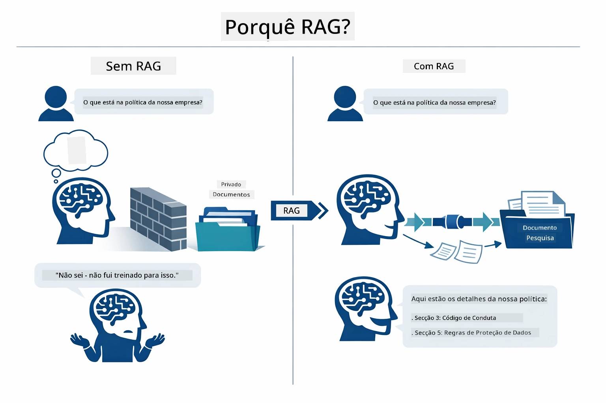

*Este diagrama mostra a diferença entre um LLM padrão (que adivinha a partir dos dados de treino) e um LLM com RAG (que consulta primeiro os seus documentos).*

Aqui está como as partes se ligam de ponta a ponta. A pergunta do utilizador passa por quatro etapas – embedding, pesquisa vetorial, montagem do contexto e geração da resposta – cada uma baseada na anterior:


*Este diagrama mostra a pipeline RAG de ponta a ponta — a pergunta do utilizador passa por embedding, pesquisa vetorial, montagem do contexto e geração da resposta.*

O resto deste módulo explica cada etapa em detalhe, com código que pode executar e modificar.

### Qual Abordagem RAG Este Tutorial Utiliza?

O LangChain4j oferece três formas de implementar o RAG, cada uma com um nível diferente de abstração. O diagrama abaixo compara-as lado a lado:

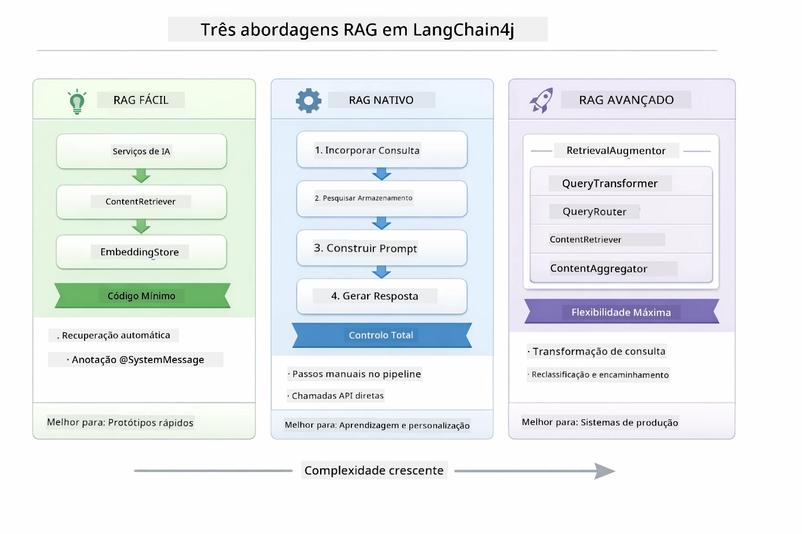

*Este diagrama compara as três abordagens RAG do LangChain4j – Easy, Native, e Advanced – mostrando os seus componentes chave e quando usar cada uma.*

| Abordagem | O Que Faz | Compromisso |
|---|---|---|
| **Easy RAG** | Liga tudo automaticamente através de `AiServices` e `ContentRetriever`. Anota uma interface, liga um retriever, e o LangChain4j trata embedding, pesquisa e montagem do prompt nos bastidores. | Código mínimo, mas não vê o que acontece em cada passo. |
| **Native RAG** | Chama o modelo de embedding, pesquisa na loja, constrói o prompt, e gera a resposta você mesmo — um passo explícito de cada vez. | Mais código, mas cada etapa é visível e modificável. |
| **Advanced RAG** | Usa o framework `RetrievalAugmentor` com transformadores de consulta pluggable, routers, re-rankers e injetores de conteúdo para pipelines de produção. | Máxima flexibilidade, mas com complexidade significativamente maior. |

**Este tutorial usa a abordagem Native.** Cada passo da pipeline RAG – embedding da consulta, pesquisa no vetor store, montagem do contexto, e geração da resposta – está explicitamente escrito em [`RagService.java`](../../../03-rag/src/main/java/com/example/langchain4j/rag/service/RagService.java). Isto é intencional: como recurso de aprendizagem, é mais importante que veja e compreenda cada etapa do que minimizar o código. Depois de se sentir confortável com como as peças se encaixam, pode passar para o Easy RAG para protótipos rápidos, ou para o Advanced RAG para sistemas de produção.

> **💡 Já viu o Easy RAG em ação?** O [módulo Arranque Rápido](../00-quick-start/README.md) inclui um exemplo de Q&A com documento ([`SimpleReaderDemo.java`](../../../00-quick-start/src/main/java/com/example/langchain4j/quickstart/SimpleReaderDemo.java)) que usa a abordagem Easy RAG — o LangChain4j trata embedding, procura e montagem do prompt automaticamente. Este módulo avança ao abrir essa pipeline para que possa ver e controlar cada etapa por si.

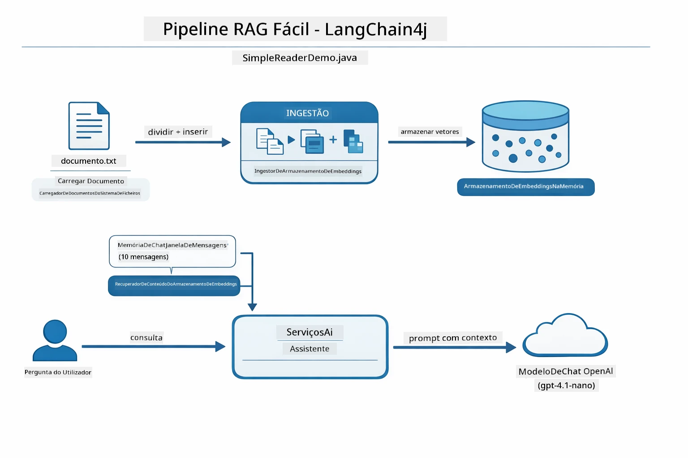

*Este diagrama mostra a pipeline Easy RAG de `SimpleReaderDemo.java`. Compare-o com a abordagem Native usada neste módulo: o Easy RAG esconde embedding, recuperação e montagem do prompt atrás do `AiServices` e `ContentRetriever` — carrega um documento, liga um retriever e obtém respostas. A abordagem Native deste módulo abre essa pipeline para que chame cada etapa (embed, pesquisa, monta contexto, gera resposta) você mesmo, dando-lhe visibilidade e controlo total.*

## Como Funciona

A pipeline RAG neste módulo divide-se em quatro etapas que correm em sequência sempre que um utilizador faz uma pergunta. Primeiro, um documento carregado é **analisado e segmentado** em pedaços manejáveis. Esses pedaços são então convertidos em **embeddings vetoriais** e armazenados para poderem ser comparados matematicamente. Quando chega uma consulta, o sistema realiza uma **pesquisa semântica** para encontrar os pedaços mais relevantes, e finalmente passa-os como contexto ao LLM para **geração da resposta**. As secções abaixo explicam cada etapa com o código real e diagramas. Vamos olhar para o primeiro passo.

### Processamento de Documentos

[DocumentService.java](../../../03-rag/src/main/java/com/example/langchain4j/rag/service/DocumentService.java)

Quando carrega um documento, o sistema analisa-o (PDF ou texto simples), adiciona metadados como o nome do ficheiro, e depois parte-o em pedaços — pedaços mais pequenos que cabem confortavelmente na janela de contexto do modelo. Esses pedaços sobrepõem-se ligeiramente para não perder contexto nas fronteiras.

```java
// Analisar o ficheiro carregado e encapsulá-lo num Documento LangChain4j
Document document = Document.from(content, metadata);

// Dividir em blocos de 300 tokens com sobreposição de 30 tokens
DocumentSplitter splitter = DocumentSplitters
    .recursive(300, 30);

List<TextSegment> segments = splitter.split(document);
```
  
O diagrama abaixo mostra como isto funciona visualmente. Note como cada pedaço partilha alguns tokens com os seus vizinhos — a sobreposição de 30 tokens assegura que nenhum contexto importante fica perdido entre as fissuras:

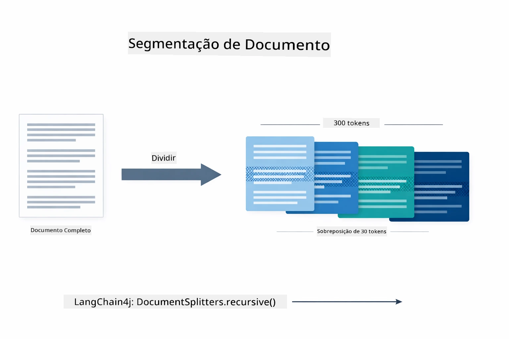

*Este diagrama mostra um documento a ser dividido em pedaços de 300 tokens com sobreposição de 30 tokens, preservando o contexto nas fronteiras dos pedaços.*

> **🤖 Experimente com o [GitHub Copilot](https://github.com/features/copilot) Chat:** Abra [`DocumentService.java`](../../../03-rag/src/main/java/com/example/langchain4j/rag/service/DocumentService.java) e pergunte:  
> - "Como é que o LangChain4j divide documentos em pedaços e porque é que a sobreposição é importante?"  
> - "Qual é o tamanho óptimo dos pedaços para diferentes tipos de documentos e porque?"  
> - "Como lidar com documentos em múltiplas línguas ou com formatação especial?"

### Criação de Embeddings

[LangChainRagConfig.java](../../../03-rag/src/main/java/com/example/langchain4j/rag/config/LangChainRagConfig.java)

Cada pedaço é convertido numa representação numérica chamada embedding — essencialmente um conversor de significado para números. O modelo de embedding não é "inteligente" como um modelo de chat; não consegue seguir instruções, raciocinar ou responder a perguntas. O que consegue é mapear texto num espaço matemático onde significados semelhantes ficam perto uns dos outros — "carro" perto de "automóvel", "política de reembolso" perto de "devolver o meu dinheiro". Pense no modelo de chat como uma pessoa com quem pode falar; o modelo de embedding é um sistema de arquivo ultra-eficaz.

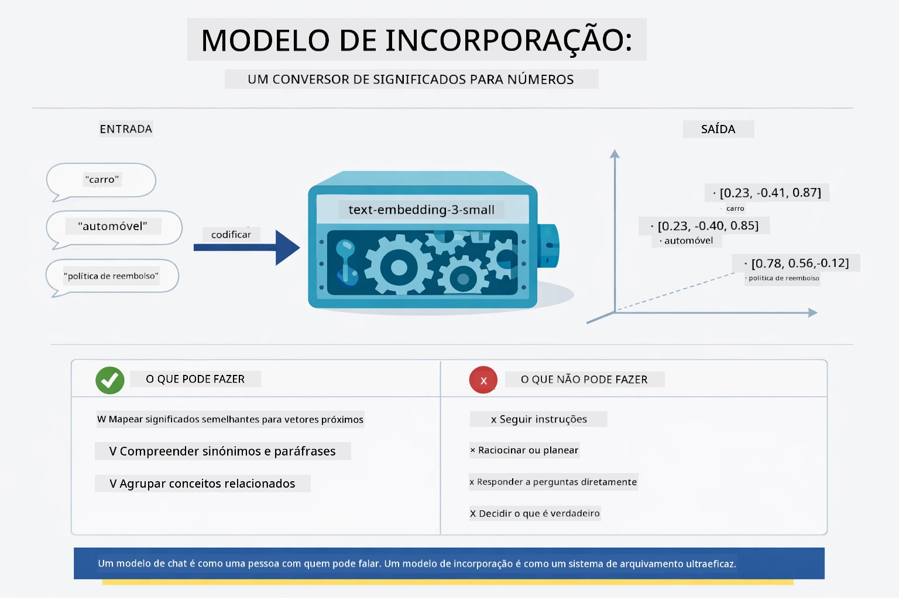

*Este diagrama mostra como um modelo de embedding converte texto em vetores numéricos, colocando significados similares — como "carro" e "automóvel" — próximos no espaço vetorial.*

```java
@Bean
public EmbeddingModel embeddingModel() {
    return OpenAiOfficialEmbeddingModel.builder()
        .baseUrl(azureOpenAiEndpoint)
        .apiKey(azureOpenAiKey)
        .modelName(azureEmbeddingDeploymentName)
        .build();
}

EmbeddingStore<TextSegment> embeddingStore = 
    new InMemoryEmbeddingStore<>();
```
  
O diagrama de classes abaixo mostra os dois fluxos separados numa pipeline RAG e as classes LangChain4j que os implementam. O **fluxo de ingestão** (corre uma vez no momento do carregamento) divide o documento, gera embeddings dos pedaços e armazena-os via `.addAll()`. O **fluxo de consulta** (executa cada vez que um utilizador pergunta) gera embedding da pergunta, pesquisa a loja via `.search()`, e passa o contexto correspondido ao modelo de chat. Ambos os fluxos encontram-se na interface compartilhada `EmbeddingStore<TextSegment>`:

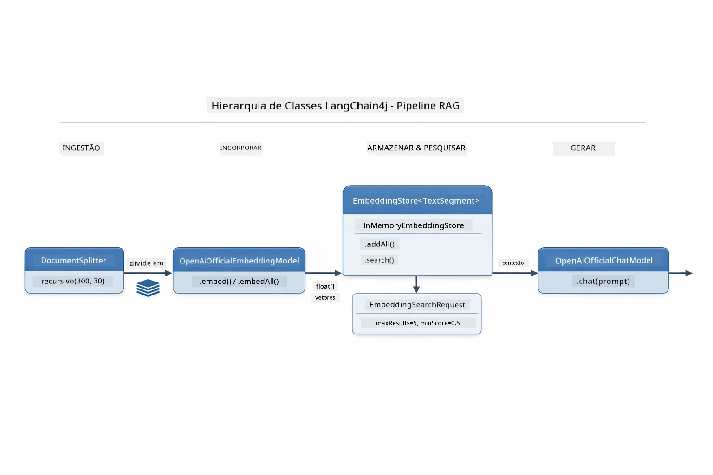

*Este diagrama mostra os dois fluxos numa pipeline RAG — ingestão e consulta — e como se ligam através de um `EmbeddingStore` partilhado.*

Uma vez que os embeddings estão armazenados, conteúdos similares agrupam-se naturalmente no espaço vetorial. A visualização abaixo mostra como documentos sobre tópicos relacionados ficam próximos, o que torna possível a pesquisa semântica:


*Esta visualização mostra como documentos relacionados se agrupam num espaço vetorial 3D, com tópicos como Documentação Técnica, Regras de Negócio e FAQs formando grupos distintos.*

Quando um utilizador pesquisa, o sistema segue quatro passos: gera embeddings dos documentos uma vez, gera embedding da consulta a cada pesquisa, compara o vetor da consulta contra todos os vetores armazenados usando similaridade cosseno, e devolve os melhores pedaços (top-K). O diagrama abaixo explica cada passo e as classes LangChain4j envolvidas:

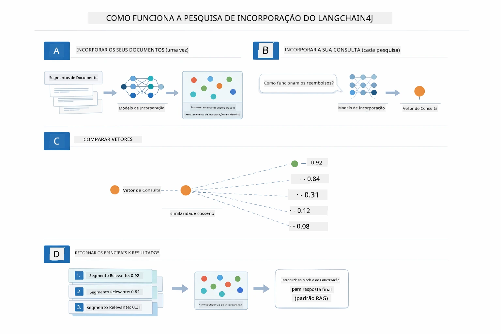

*Este diagrama mostra o processo de pesquisa em embedding em quatro passos: gerar embedding dos documentos, gerar embedding da consulta, comparar vetores usando similaridade cosseno, e devolver os top-K resultados.*

### Pesquisa Semântica

[RagService.java](../../../03-rag/src/main/java/com/example/langchain4j/rag/service/RagService.java)

Quando faz uma pergunta, a sua pergunta também é convertida num embedding. O sistema compara o embedding da sua pergunta contra os embeddings de todos os pedaços do documento. Encontra os pedaços com os significados mais semelhantes - não apenas palavras-chave coincidentes, mas similaridade semântica real.

```java
Embedding queryEmbedding = embeddingModel.embed(question).content();

EmbeddingSearchRequest searchRequest = EmbeddingSearchRequest.builder()
    .queryEmbedding(queryEmbedding)
    .maxResults(5)
    .minScore(0.5)
    .build();

EmbeddingSearchResult<TextSegment> searchResult = embeddingStore.search(searchRequest);
List<EmbeddingMatch<TextSegment>> matches = searchResult.matches();

for (EmbeddingMatch<TextSegment> match : matches) {
    String relevantText = match.embedded().text();
    double score = match.score();
}
```
  
O diagrama abaixo compara pesquisa semântica com a tradicional pesquisa por palavra-chave. Uma pesquisa por palavra-chave para "veículo" não encontra um pedaço sobre "carros e camiões", mas a pesquisa semântica entende que significam o mesmo e devolve-o como correspondência de alta pontuação:

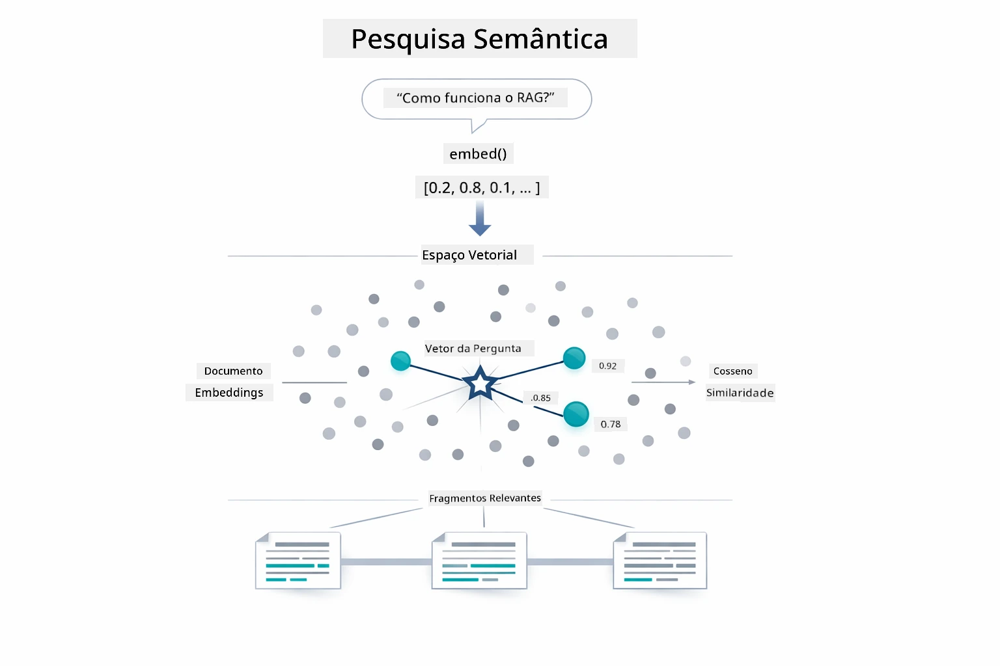

*Este diagrama compara pesquisa por palavra-chave com pesquisa semântica, mostrando como a pesquisa semântica recupera conteúdo conceitualmente relacionado mesmo quando as palavras exatas são diferentes.*

Por baixo, a similaridade é medida usando similaridade cosseno — basicamente perguntando "estes dois vetores apontam na mesma direção?" Dois pedaços podem usar palavras completamente diferentes, mas se significarem o mesmo, os seus vetores apontam na mesma direção e obtêm uma pontuação próxima de 1.0:

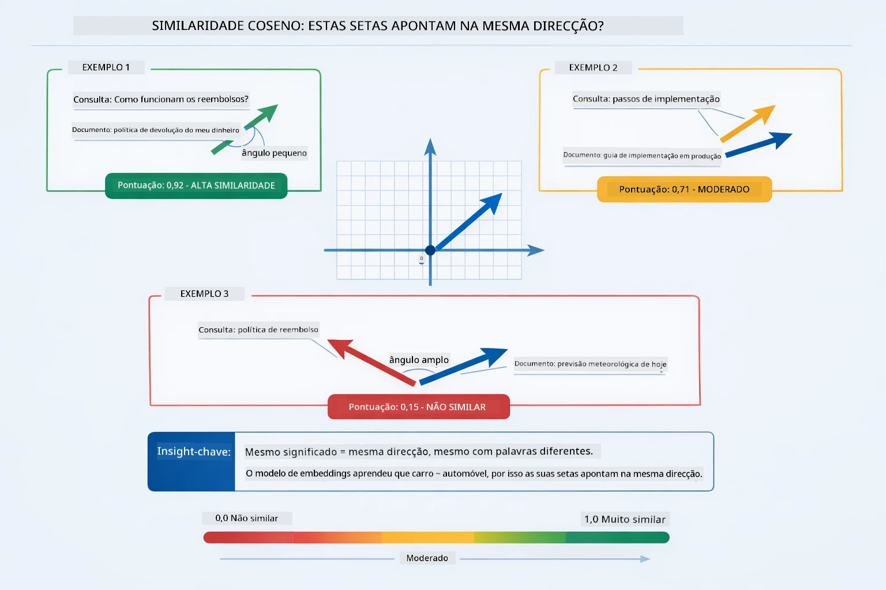
*Este diagrama ilustra a similaridade do cosseno como o ângulo entre vetores de embedding — vetores mais alinhados obtêm pontuações mais próximas de 1.0, indicando maior similaridade semântica.*

> **🤖 Experimente com o Chat do [GitHub Copilot](https://github.com/features/copilot):** Abra [`RagService.java`](../../../03-rag/src/main/java/com/example/langchain4j/rag/service/RagService.java) e pergunte:
> - "Como funciona a pesquisa por similaridade com embeddings e o que determina a pontuação?"
> - "Que limiar de similaridade devo usar e como isso afeta os resultados?"
> - "Como eu trato casos onde não são encontrados documentos relevantes?"

### Geração de Resposta

[RagService.java](../../../03-rag/src/main/java/com/example/langchain4j/rag/service/RagService.java)

Os fragmentos mais relevantes são montados num prompt estruturado que inclui instruções explícitas, o contexto recuperado e a questão do utilizador. O modelo lê esses fragmentos específicos e responde com base nessa informação — só pode usar o que está diante dele, o que evita alucinações.

```java
String context = matches.stream()
    .map(match -> match.embedded().text())
    .collect(Collectors.joining("\n\n"));

String prompt = String.format("""
    Answer the question based on the following context.
    If the answer cannot be found in the context, say so.

    Context:
    %s

    Question: %s

    Answer:""", context, request.question());

String answer = chatModel.chat(prompt);
```

O diagrama abaixo mostra esta montagem em ação — os fragmentos com maior pontuação da etapa de pesquisa são injetados no template do prompt, e o `OpenAiOfficialChatModel` gera uma resposta fundamentada:

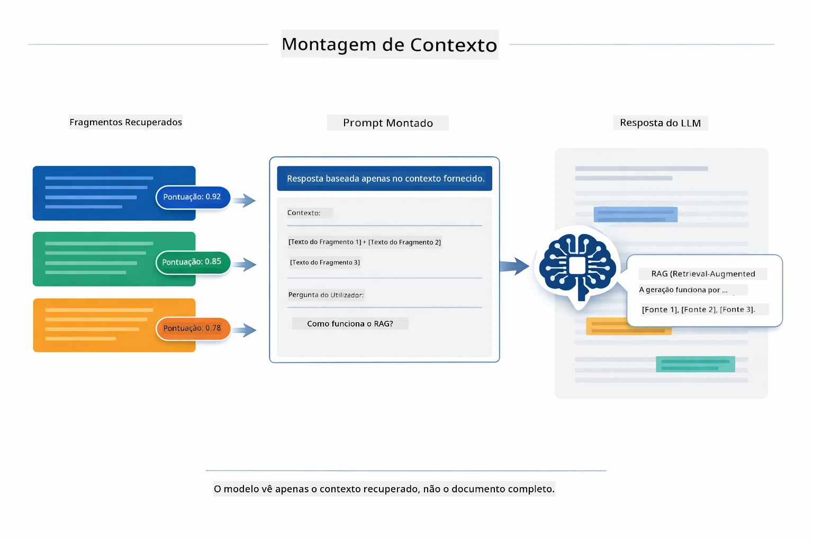

*Este diagrama mostra como os fragmentos com maior pontuação são montados num prompt estruturado, permitindo ao modelo gerar uma resposta fundamentada a partir dos seus dados.*

## Execute a Aplicação

**Verifique o deployment:**

Certifique-se de que o ficheiro `.env` existe no diretório raiz com as credenciais Azure (criado durante o Módulo 01):

**Bash:**
```bash
cat ../.env  # Deve mostrar AZURE_OPENAI_ENDPOINT, API_KEY, DEPLOYMENT
```

**PowerShell:**
```powershell
Get-Content ..\.env  # Deve mostrar AZURE_OPENAI_ENDPOINT, API_KEY, DEPLOYMENT
```

**Inicie a aplicação:**

> **Nota:** Se já iniciou todas as aplicações usando `./start-all.sh` no Módulo 01, este módulo já está a correr na porta 8081. Pode ignorar os comandos de início abaixo e ir diretamente para http://localhost:8081.

**Opção 1: Usando o Spring Boot Dashboard (Recomendado para utilizadores VS Code)**

O dev container inclui a extensão Spring Boot Dashboard, que fornece uma interface visual para gerir todas as aplicações Spring Boot. Pode encontrá-la na Barra de Atividades do lado esquerdo do VS Code (procure o ícone do Spring Boot).

A partir do Spring Boot Dashboard, pode:
- Ver todas as aplicações Spring Boot disponíveis no workspace
- Iniciar/parar aplicações com um clique
- Visualizar os logs das aplicações em tempo real
- Monitorizar o estado das aplicações

Basta clicar no botão de play ao lado de "rag" para começar este módulo, ou iniciar todos os módulos de uma vez.


*Esta captura de ecrã mostra o Spring Boot Dashboard no VS Code, onde pode iniciar, parar e monitorizar aplicações visualmente.*

**Opção 2: Usando scripts shell**

Inicie todas as aplicações web (módulos 01-04):

**Bash:**
```bash
cd ..  # A partir do diretório raiz
./start-all.sh
```

**PowerShell:**
```powershell
cd ..  # A partir do diretório raiz
.\start-all.ps1
```

Ou inicie apenas este módulo:

**Bash:**
```bash
cd 03-rag
./start.sh
```

**PowerShell:**
```powershell
cd 03-rag
.\start.ps1
```

Ambos os scripts carregam automaticamente as variáveis de ambiente do ficheiro `.env` da raiz e irão compilar os JARs se eles não existirem.

> **Nota:** Se preferir compilar todos os módulos manualmente antes de iniciar:
>
> **Bash:**
> ```bash
> cd ..  # Go to root directory
> mvn clean package -DskipTests
> ```
>
> **PowerShell:**
> ```powershell
> cd ..  # Go to root directory
> mvn clean package -DskipTests
> ```

Abra http://localhost:8081 no seu navegador.

**Para parar:**

**Bash:**
```bash
./stop.sh  # Este módulo apenas
# Ou
cd .. && ./stop-all.sh  # Todos os módulos
```

**PowerShell:**
```powershell
.\stop.ps1  # Apenas este módulo
# Ou
cd ..; .\stop-all.ps1  # Todos os módulos
```

## Usar a Aplicação

A aplicação fornece uma interface web para o carregamento de documentos e colocação de perguntas.

<a href="images/rag-homepage.png"></a>

*Esta captura de ecrã mostra a interface da aplicação RAG onde pode carregar documentos e fazer perguntas.*

### Carregar um Documento

Comece por carregar um documento – ficheiros TXT funcionam melhor para testes. Está fornecido um `sample-document.txt` neste diretório que contém informação sobre funcionalidades do LangChain4j, implementação RAG e boas práticas – perfeito para testar o sistema.

O sistema processa o seu documento, divide-o em fragmentos e cria embeddings para cada fragmento. Isto acontece automaticamente quando carrega o ficheiro.

### Fazer Perguntas

Agora faça perguntas específicas sobre o conteúdo do documento. Tente algo factual que esteja claramente indicado no documento. O sistema pesquisa fragmentos relevantes, inclui-os no prompt e gera uma resposta.

### Verificar Referências

Note que cada resposta inclui referências às fontes com pontuações de similaridade. Essas pontuações (0 a 1) mostram o quão relevante foi cada fragmento para a sua pergunta. Pontuações mais altas significam correspondências melhores. Isto permite verificar a resposta contra o material fonte.

<a href="images/rag-query-results.png"></a>

*Esta captura de ecrã mostra os resultados da consulta com a resposta gerada, referências das fontes e pontuações de relevância para cada fragmento recuperado.*

### Experimente com Perguntas

Tente diferentes tipos de perguntas:
- Factos específicos: "Qual é o tema principal?"
- Comparações: "Qual é a diferença entre X e Y?"
- Resumos: "Resuma os pontos-chave sobre Z"

Observe como as pontuações de relevância mudam dependendo de quão bem a sua pergunta corresponde ao conteúdo do documento.

## Conceitos-Chave

### Estratégia de Fragmentação

Os documentos são divididos em fragmentos de 300 tokens com 30 tokens de sobreposição. Este equilíbrio garante que cada fragmento tem contexto suficiente para ser significativo, mantendo-os pequenos o suficiente para incluir múltiplos fragmentos num prompt.

### Pontuações de Similaridade

Cada fragmento recuperado vem com uma pontuação de similaridade entre 0 e 1 que indica o quão próximo está da pergunta do utilizador. O diagrama abaixo visualiza os intervalos de pontuação e como o sistema os usa para filtrar os resultados:

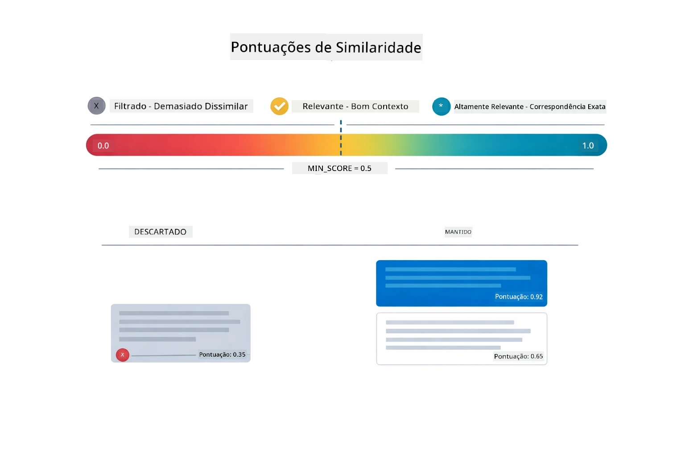

*Este diagrama mostra os intervalos de pontuação de 0 a 1, com um limiar mínimo de 0.5 que filtra fragmentos irrelevantes.*

As pontuações variam de 0 a 1:
- 0.7-1.0: Altamente relevante, correspondência exata
- 0.5-0.7: Relevante, bom contexto
- Abaixo de 0.5: Filtrado, demasiado dissimilar

O sistema apenas recupera fragmentos acima do limiar mínimo para garantir qualidade.

Embeddings funcionam bem quando os significados formam clusters claros, mas têm pontos cegos. O diagrama abaixo mostra os modos comuns de falha — fragmentos muito grandes produzem vetores confusos, fragmentos muito pequenos carecem de contexto, termos ambíguos apontam para múltiplos clusters, e pesquisas de correspondência exata (IDs, números de peça) não funcionam com embeddings:

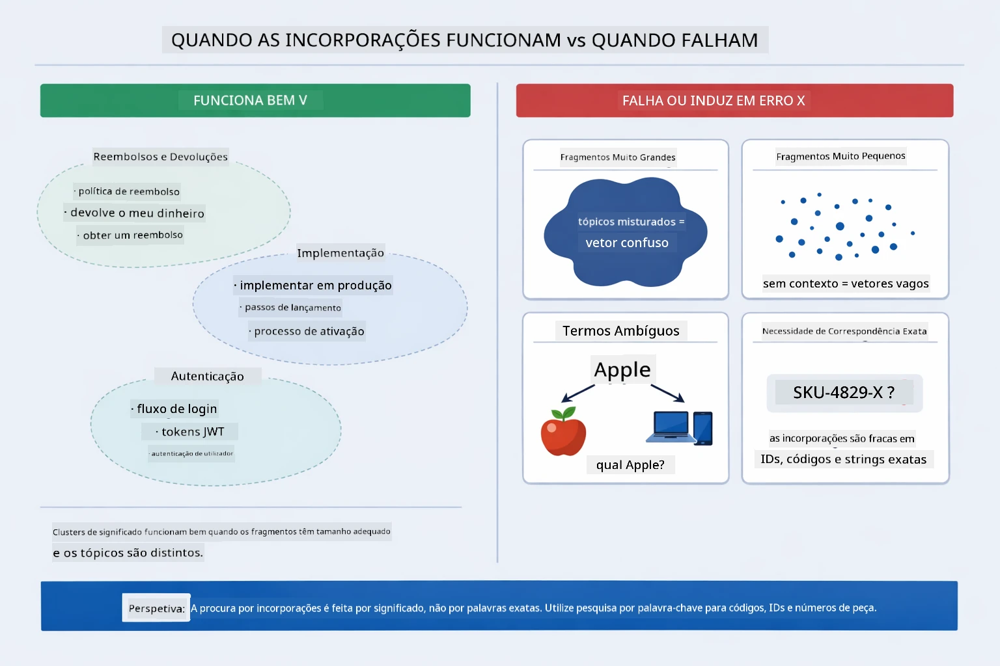

*Este diagrama mostra modos comuns de falha do embedding: fragmentos demasiado grandes, demasiado pequenos, termos ambíguos que apontam para múltiplos clusters, e pesquisas por correspondência exata como IDs.*

### Armazenamento em Memória

Este módulo usa armazenamento em memória para simplicidade. Quando reinicia a aplicação, os documentos carregados são perdidos. Sistemas de produção usam bases de dados vetoriais persistentes como Qdrant ou Azure AI Search.

### Gestão da Janela de Contexto

Cada modelo tem uma janela máxima de contexto. Não pode incluir todos os fragmentos de um documento grande. O sistema recupera os N fragmentos mais relevantes (por defeito 5) para manter os limites enquanto fornece contexto suficiente para respostas precisas.

## Quando o RAG é Importante

O RAG nem sempre é a abordagem correta. O guia de decisão abaixo ajuda a determinar quando o RAG acrescenta valor versus quando abordagens mais simples — como incluir conteúdo diretamente no prompt ou confiar no conhecimento incorporado do modelo — são suficientes:

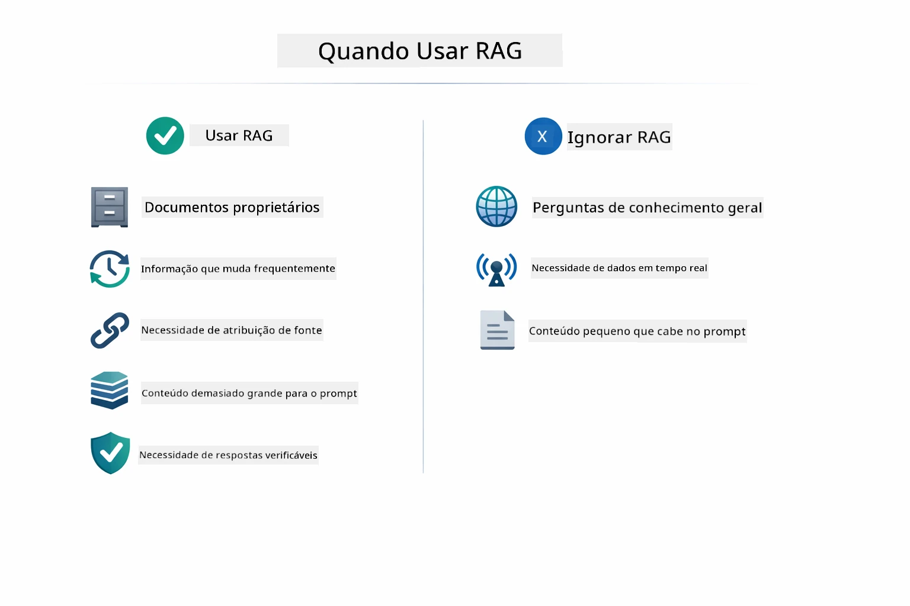

*Este diagrama mostra um guia de decisão para quando o RAG acrescenta valor versus quando abordagens mais simples são suficientes.*

**Use RAG quando:**
- Responder a perguntas sobre documentos proprietários
- Informação muda frequentemente (políticas, preços, especificações)
- A precisão requer atribuição de fonte
- O conteúdo é demasiado extenso para caber num único prompt
- Precisa de respostas verificáveis e fundamentadas

**Não use RAG quando:**
- Perguntas requerem conhecimento geral que o modelo já tem
- É necessário dados em tempo real (RAG funciona com documentos carregados)
- O conteúdo é pequeno o suficiente para incluir diretamente nos prompts

## Próximos Passos

**Próximo Módulo:** [04-tools - Agentes de IA com Ferramentas](../04-tools/README.md)

---

**Navegação:** [← Anterior: Módulo 02 - Engenharia de Prompt](../02-prompt-engineering/README.md) | [Voltar ao Principal](../README.md) | [Seguinte: Módulo 04 - Ferramentas →](../04-tools/README.md)

---

<!-- CO-OP TRANSLATOR DISCLAIMER START -->
**Aviso Legal**:
Este documento foi traduzido utilizando o serviço de tradução por IA [Co-op Translator](https://github.com/Azure/co-op-translator). Embora nos esforcemos para garantir a precisão, por favor, tenha em atenção que traduções automáticas podem conter erros ou imprecisões. O documento original na sua língua nativa deve ser considerado a fonte autoritativa. Para informações críticas, recomenda-se a tradução profissional por humanos. Não nos responsabilizamos por quaisquer mal-entendidos ou interpretações incorretas decorrentes do uso desta tradução.
<!-- CO-OP TRANSLATOR DISCLAIMER END -->