# Módulo 04: Agentes de IA com Ferramentas

## Índice

- [Passeio em Vídeo](../../../04-tools)
- [O Que Vai Aprender](../../../04-tools)
- [Pré-requisitos](../../../04-tools)
- [Compreender Agentes de IA com Ferramentas](../../../04-tools)
- [Como Funciona a Chamada de Ferramentas](../../../04-tools)
  - [Definições de Ferramentas](../../../04-tools)
  - [Tomada de Decisão](../../../04-tools)
  - [Execução](../../../04-tools)
  - [Geração de Resposta](../../../04-tools)
  - [Arquitetura: Auto-Wiring Spring Boot](../../../04-tools)
- [Encadeamento de Ferramentas](../../../04-tools)
- [Executar a Aplicação](../../../04-tools)
- [Utilizar a Aplicação](../../../04-tools)
  - [Experimente o Uso Simples de Ferramentas](../../../04-tools)
  - [Teste o Encadeamento de Ferramentas](../../../04-tools)
  - [Veja o Fluxo da Conversa](../../../04-tools)
  - [Experimente Diferentes Pedidos](../../../04-tools)
- [Conceitos-Chave](../../../04-tools)
  - [Padrão ReAct (Raciocinar e Agir)](../../../04-tools)
  - [As Descrições das Ferramentas São Importantes](../../../04-tools)
  - [Gestão de Sessões](../../../04-tools)
  - [Tratamento de Erros](../../../04-tools)
- [Ferramentas Disponíveis](../../../04-tools)
- [Quando Usar Agentes Baseados em Ferramentas](../../../04-tools)
- [Ferramentas vs RAG](../../../04-tools)
- [Próximos Passos](../../../04-tools)

## Passeio em Vídeo

Assista a esta sessão ao vivo que explica como começar com este módulo:

<a href="https://www.youtube.com/watch?v=O_J30kZc0rw"></a>

## O Que Vai Aprender

Até agora, aprendeu como ter conversas com IA, estruturar prompts de forma eficaz e fundamentar respostas nos seus documentos. Mas há ainda uma limitação fundamental: os modelos de linguagem só conseguem gerar texto. Não podem verificar o tempo, fazer cálculos, consultar bases de dados nem interagir com sistemas externos.

As ferramentas mudam isso. Ao dar ao modelo acesso a funções que pode chamar, transforma-o de gerador de texto num agente que pode tomar ações. O modelo decide quando precisa de uma ferramenta, qual deve usar e que parâmetros deve passar. O seu código executa a função e devolve o resultado. O modelo incorpora esse resultado na sua resposta.

## Pré-requisitos

- Completar o [Módulo 01 - Introdução](../01-introduction/README.md) (recursos Azure OpenAI implementados)
- Recomenda-se ter completado os módulos anteriores (este módulo referencia [conceitos RAG do Módulo 03](../03-rag/README.md) na comparação Ferramentas vs RAG)
- Ficheiro `.env` no diretório raiz com credenciais do Azure (criado pelo `azd up` no Módulo 01)

> **Nota:** Se não completou o Módulo 01, siga primeiro as instruções de implementação aí indicadas.

## Compreender Agentes de IA com Ferramentas

> **📝 Nota:** O termo "agentes" neste módulo refere-se a assistentes de IA melhorados com capacidades de chamada de ferramentas. Isto é diferente dos padrões **Agentic AI** (agentes autónomos com planeamento, memória e raciocínio multi-etapas) que abordaremos no [Módulo 05: MCP](../05-mcp/README.md).

Sem ferramentas, um modelo de linguagem só pode gerar texto a partir dos seus dados de treino. Pergunte-lhe qual o tempo atual e ele tem de adivinhar. Dê-lhe ferramentas, e pode chamar uma API meteorológica, fazer cálculos, ou consultar uma base de dados — depois entrelaça esses resultados reais na sua resposta.

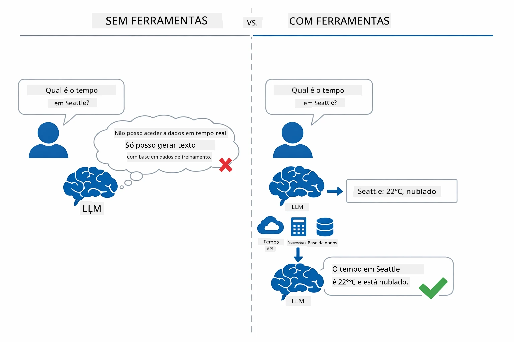

*Sem ferramentas, o modelo só pode adivinhar — com ferramentas, pode chamar APIs, fazer cálculos e devolver dados em tempo real.*

Um agente de IA com ferramentas segue um padrão de **Raciocinar e Agir (ReAct)**. O modelo não só responde — pensa no que precisa, age chamando uma ferramenta, observa o resultado e depois decide se volta a agir ou entrega a resposta final:

1. **Raciocinar** — O agente analisa a questão do utilizador e determina que informação precisa
2. **Agir** — O agente seleciona a ferramenta certa, gera os parâmetros corretos e chama a função
3. **Observar** — O agente recebe o resultado da ferramenta e avalia
4. **Repetir ou Responder** — Se precisar de mais dados, repete o ciclo; caso contrário, compõe a resposta em linguagem natural

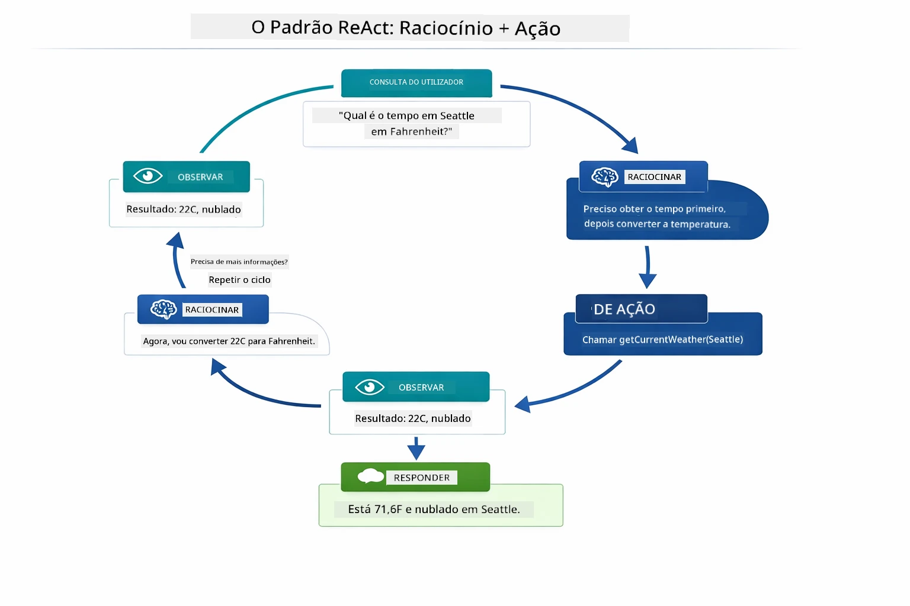

*O ciclo ReAct — o agente raciocina sobre o que fazer, age chamando uma ferramenta, observa o resultado e repete até poder fornecer a resposta final.*

Isto acontece automaticamente. Você define as ferramentas e as suas descrições. O modelo gere a tomada de decisão sobre quando e como usá-las.

## Como Funciona a Chamada de Ferramentas

### Definições de Ferramentas

[WeatherTool.java](../../../04-tools/src/main/java/com/example/langchain4j/agents/tools/WeatherTool.java) | [TemperatureTool.java](../../../04-tools/src/main/java/com/example/langchain4j/agents/tools/TemperatureTool.java)

Define funções com descrições claras e especificações de parâmetros. O modelo vê essas descrições no seu prompt de sistema e compreende o que cada ferramenta faz.

```java
@Component
public class WeatherTool {
    
    @Tool("Get the current weather for a location")
    public String getCurrentWeather(@P("Location name") String location) {
        // A sua lógica de consulta meteorológica
        return "Weather in " + location + ": 22°C, cloudy";
    }
}

@AiService
public interface Assistant {
    String chat(@MemoryId String sessionId, @UserMessage String message);
}

// O Assistente é automaticamente configurado pelo Spring Boot com:
// - Bean ChatModel
// - Todos os métodos @Tool das classes @Component
// - ChatMemoryProvider para gestão de sessões
```

O diagrama abaixo detalha cada anotação e mostra como cada parte ajuda a IA a perceber quando chamar a ferramenta e que argumentos passar:

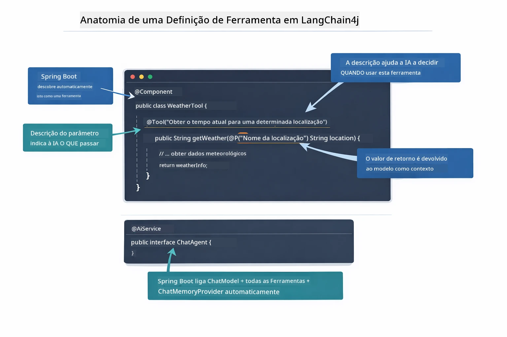

*Anatomia de uma definição de ferramenta — @Tool indica à IA quando usar, @P descreve cada parâmetro, e @AiService liga tudo no arranque.*

> **🤖 Experimente com o Chat [GitHub Copilot](https://github.com/features/copilot):** Abra [`WeatherTool.java`](../../../04-tools/src/main/java/com/example/langchain4j/agents/tools/WeatherTool.java) e pergunte:
> - "Como integraria uma API real de meteorologia, como o OpenWeatherMap, em vez de dados simulados?"
> - "O que torna uma boa descrição de ferramenta que ajuda a IA a usá-la corretamente?"
> - "Como devo gerir erros de API e limites de taxa em implementações de ferramentas?"

### Tomada de Decisão

Quando um utilizador pergunta "Qual é o tempo em Seattle?", o modelo não escolhe uma ferramenta aleatoriamente. Compara a intenção do utilizador com cada descrição de ferramenta a que tem acesso, pontua cada uma pela relevância e seleciona a melhor correspondência. Depois gera uma chamada de função estruturada com os parâmetros corretos — neste caso, definiu `location` para `"Seattle"`.

Se nenhuma ferramenta corresponder ao pedido do utilizador, o modelo responde a partir do seu próprio conhecimento. Se várias ferramentas corresponderem, escolhe a mais específica.

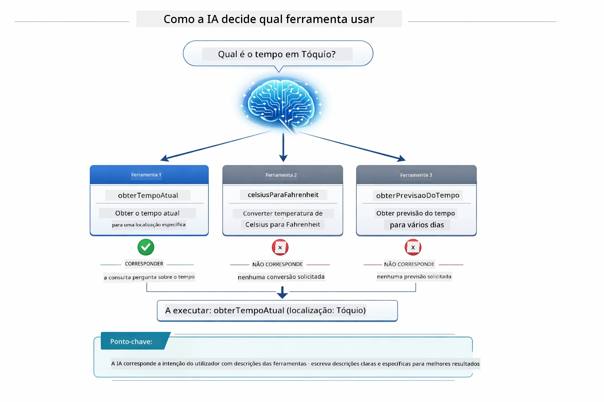

*O modelo avalia cada ferramenta disponível contra a intenção do utilizador e seleciona a melhor correspondência — por isso escrever descrições de ferramentas claras e específicas é fundamental.*

### Execução

[AgentService.java](../../../04-tools/src/main/java/com/example/langchain4j/agents/service/AgentService.java)

O Spring Boot injeta automaticamente a interface declarativa `@AiService` com todas as ferramentas registadas, e o LangChain4j executa as chamadas às ferramentas automaticamente. Nos bastidores, uma chamada completa a uma ferramenta passa por seis etapas — desde a pergunta em linguagem natural do utilizador até à resposta em linguagem natural:

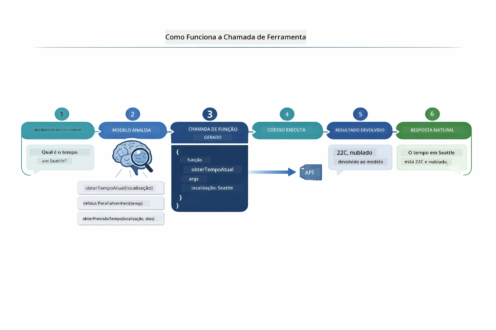

*O fluxo completo — o utilizador faz uma pergunta, o modelo seleciona uma ferramenta, o LangChain4j executa, e o modelo integra o resultado numa resposta natural.*

Se executou a [ToolIntegrationDemo](../../../00-quick-start/src/main/java/com/example/langchain4j/quickstart/ToolIntegrationDemo.java) no Módulo 00, já viu este padrão em ação — as ferramentas `Calculator` foram chamadas da mesma forma. O diagrama de sequência abaixo mostra exatamente o que aconteceu por trás das cenas durante essa demo:

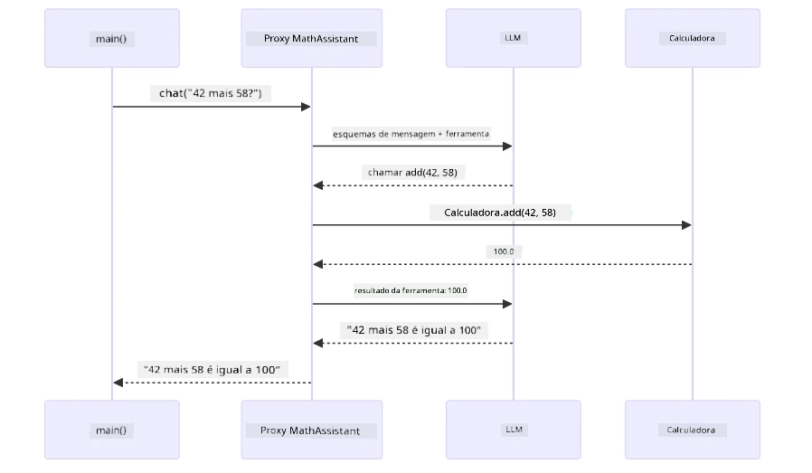

*O ciclo de chamada de ferramenta da demo Quick Start — `AiServices` envia a sua mensagem e esquemas de ferramentas ao LLM, o LLM responde com uma chamada de função como `add(42, 58)`, o LangChain4j executa o método `Calculator` localmente, e devolve o resultado para a resposta final.*

> **🤖 Experimente com o Chat [GitHub Copilot](https://github.com/features/copilot):** Abra [`AgentService.java`](../../../04-tools/src/main/java/com/example/langchain4j/agents/service/AgentService.java) e pergunte:
> - "Como funciona o padrão ReAct e por que é eficaz para agentes de IA?"
> - "Como o agente decide que ferramenta usar e em que ordem?"
> - "O que acontece se a execução de uma ferramenta falhar — como posso gerir erros de forma robusta?"

### Geração de Resposta

O modelo recebe os dados meteorológicos e formata-os numa resposta em linguagem natural para o utilizador.

### Arquitetura: Auto-Wiring Spring Boot

Este módulo utiliza a integração LangChain4j com Spring Boot e interfaces declarativas `@AiService`. No arranque, o Spring Boot descobre todos os `@Component` que contêm métodos com `@Tool`, o seu bean `ChatModel`, e o `ChatMemoryProvider` — depois liga tudo numa única interface `Assistant` sem código repetitivo.

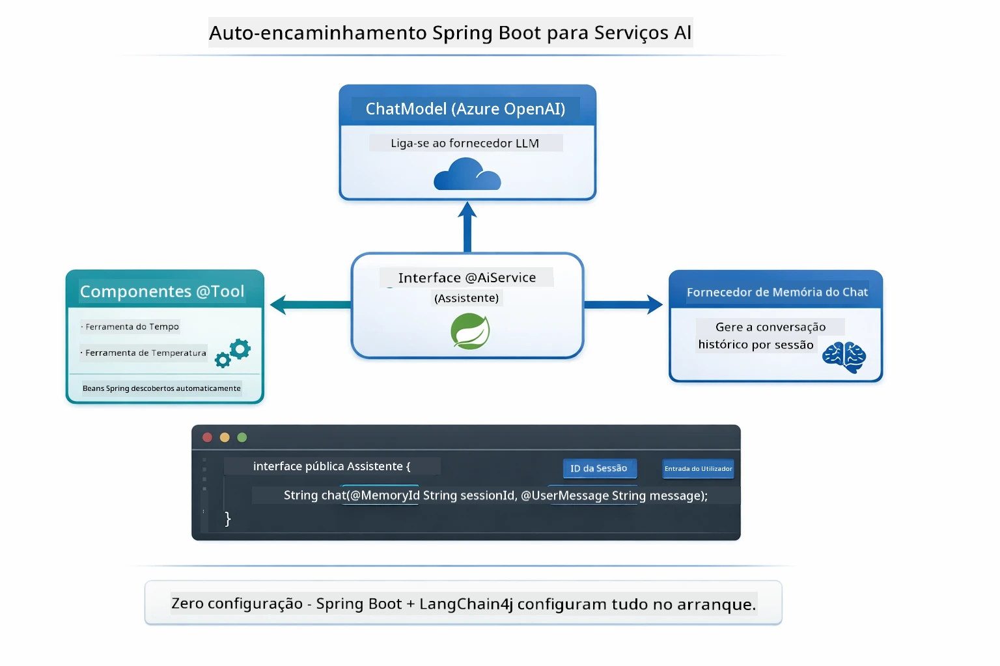

*A interface @AiService liga o ChatModel, componentes das ferramentas e o memory provider — o Spring Boot gere automaticamente todas as ligações.*

Aqui está o ciclo de vida completo do pedido como diagrama de sequência — desde a requisição HTTP, passando pelo controlador, serviço e proxy auto-injetado, até à execução da ferramenta e retorno:

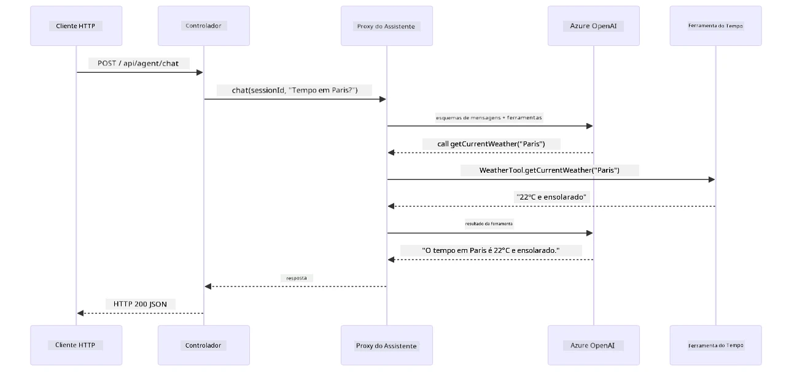

*O ciclo de vida completo da requisição Spring Boot — a requisição HTTP passa pelo controlador e serviço até ao proxy Assistant auto-injetado, que orquestra o LLM e as chamadas às ferramentas automaticamente.*

Principais vantagens desta abordagem:

- **Auto-wiring Spring Boot** — ChatModel e ferramentas injetadas automaticamente
- **Padrão @MemoryId** — Gestão automática de memória por sessão
- **Instância única** — Assistant criado apenas uma vez e reutilizado para melhor desempenho
- **Execução com segurança de tipos** — Métodos Java chamados diretamente com conversão de tipos
- **Orquestração multi-turno** — Gere encadeamento de ferramentas automaticamente
- **Zero código repetitivo** — Sem chamadas manuais a `AiServices.builder()` ou uso de HashMap de memória

Abordagens alternativas (com chamadas manuais a `AiServices.builder()`) requerem mais código e perdem os benefícios da integração Spring Boot.

## Encadeamento de Ferramentas

**Encadeamento de Ferramentas** — O verdadeiro poder dos agentes baseados em ferramentas mostra-se quando uma única pergunta requer várias ferramentas. Pergunte "Qual é o tempo em Seattle em Fahrenheit?" e o agente encadeia automaticamente duas ferramentas: primeiro chama `getCurrentWeather` para obter a temperatura em Celsius, depois passa esse valor para `celsiusToFahrenheit` para conversão — tudo numa só interação.

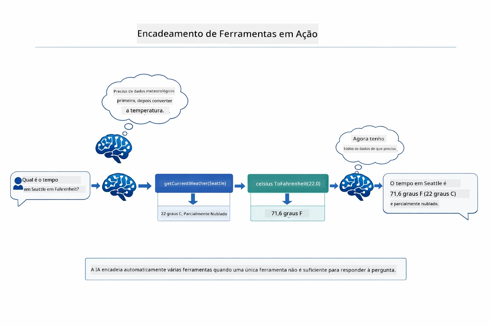

*Encadeamento de ferramentas em ação — o agente chama primeiro getCurrentWeather, depois passa o resultado em Celsius para celsiusToFahrenheit, e entrega uma resposta combinada.*

**Falhas Elegantes** — Peça o tempo numa cidade que não está nos dados simulados. A ferramenta devolve uma mensagem de erro, e a IA explica que não pode ajudar em vez de falhar. As ferramentas falham de forma segura. O diagrama abaixo contrasta as duas abordagens — com tratamento de erros adequado, o agente apanha a exceção e responde de forma útil, sem ele toda a aplicação falha:

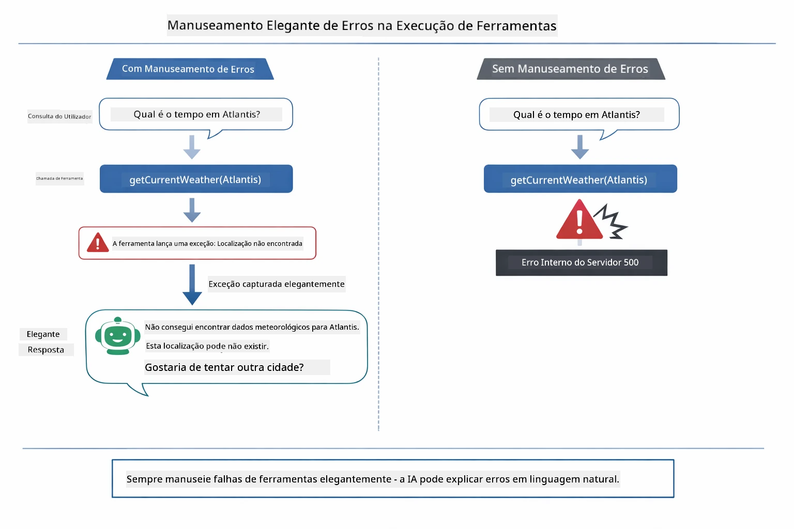

*Quando uma ferramenta falha, o agente apanha o erro e responde com uma explicação útil em vez de falhar.*

Isto acontece numa única interação. O agente orquestra múltiplas chamadas de ferramentas autonomamente.

## Executar a Aplicação

**Verificar a implementação:**

Assegure-se que o ficheiro `.env` existe no diretório raiz com as credenciais Azure (criado durante o Módulo 01). Execute este comando a partir do diretório do módulo (`04-tools/`):

**Bash:**
```bash
cat ../.env  # Deve mostrar AZURE_OPENAI_ENDPOINT, API_KEY, DEPLOYMENT
```

**PowerShell:**
```powershell
Get-Content ..\.env  # Deve mostrar AZURE_OPENAI_ENDPOINT, API_KEY, DEPLOYMENT
```

**Iniciar a aplicação:**

> **Nota:** Se já iniciou todas as aplicações usando `./start-all.sh` a partir do diretório raiz (como descrito no Módulo 01), este módulo já está a correr na porta 8084. Pode ignorar os comandos de início abaixo e ir diretamente para http://localhost:8084.

**Opção 1: Usar o Spring Boot Dashboard (Recomendado para utilizadores VS Code)**

O contentor de desenvolvimento inclui a extensão Spring Boot Dashboard, que fornece uma interface visual para gerir todas as aplicações Spring Boot. Pode encontrá-la na Barra de Atividades no lado esquerdo do VS Code (procure o ícone do Spring Boot).

A partir do Spring Boot Dashboard, pode:
- Ver todas as aplicações Spring Boot disponíveis no workspace
- Iniciar/parar aplicações com um clique
- Ver logs das aplicações em tempo real
- Monitorizar o estado das aplicações
Basta clicar no botão de reprodução junto a "tools" para iniciar este módulo, ou iniciar todos os módulos de uma só vez.

Aqui está a aparência do Spring Boot Dashboard no VS Code:


*O Painel Spring Boot no VS Code — iniciar, parar e monitorizar todos os módulos num só local*

**Opção 2: Usar scripts shell**

Iniciar todas as aplicações web (módulos 01-04):

**Bash:**
```bash
cd ..  # A partir do diretório raiz
./start-all.sh
```

**PowerShell:**
```powershell
cd ..  # Da diretoria raiz
.\start-all.ps1
```

Ou iniciar apenas este módulo:

**Bash:**
```bash
cd 04-tools
./start.sh
```

**PowerShell:**
```powershell
cd 04-tools
.\start.ps1
```

Ambos os scripts carregam automaticamente as variáveis de ambiente do ficheiro `.env` na raiz e irão construir os JARs se não existirem.

> **Nota:** Se preferir construir todos os módulos manualmente antes de iniciar:
>
> **Bash:**
> ```bash
> cd ..  # Go to root directory
> mvn clean package -DskipTests
> ```
>
> **PowerShell:**
> ```powershell
> cd ..  # Go to root directory
> mvn clean package -DskipTests
> ```

Abra http://localhost:8084 no seu navegador.

**Para parar:**

**Bash:**
```bash
./stop.sh  # Apenas este módulo
# Ou
cd .. && ./stop-all.sh  # Todos os módulos
```

**PowerShell:**
```powershell
.\stop.ps1  # Este módulo apenas
# Ou
cd ..; .\stop-all.ps1  # Todos os módulos
```

## Utilizar a Aplicação

A aplicação fornece uma interface web onde pode interagir com um agente de IA que tem acesso a ferramentas de tempo e conversão de temperatura. Aqui está a aparência da interface — inclui exemplos rápidos e um painel de chat para enviar pedidos:

<a href="images/tools-homepage.png"></a>

*Interface das Ferramentas do Agente de IA - exemplos rápidos e interface de chat para interagir com as ferramentas*

### Experimente Usar uma Ferramenta Simples

Comece com um pedido simples: "Converte 100 graus Fahrenheit para Celsius". O agente reconhece que precisa da ferramenta de conversão de temperatura, chama-a com os parâmetros corretos e devolve o resultado. Repare como é natural — não especificou qual ferramenta usar nem como a chamar.

### Testar Encadeamento de Ferramentas

Agora experimente algo mais complexo: "Qual é o tempo em Seattle e converte para Fahrenheit?" Observe o agente a trabalhar por passos. Primeiro obtém o tempo (que devolve em Celsius), reconhece que precisa converter para Fahrenheit, chama a ferramenta de conversão e combina ambos os resultados numa só resposta.

### Veja o Fluxo da Conversa

A interface de chat mantém o histórico da conversa, permitindo interações em múltiplas voltas. Pode ver todas as perguntas e respostas anteriores, tornando fácil seguir a conversa e compreender como o agente constrói o contexto ao longo de várias trocas.

<a href="images/tools-conversation-demo.png"></a>

*Conversa em múltiplas voltas mostrando conversões simples, consultas de tempo e encadeamento de ferramentas*

### Experimente Diferentes Pedidos

Teste várias combinações:
- Consultas meteorológicas: "Qual é o tempo em Tóquio?"
- Conversões de temperatura: "Quanto é 25°C em Kelvin?"
- Consultas combinadas: "Consulta o tempo em Paris e diz-me se está acima dos 20°C"

Repare como o agente interpreta linguagem natural e mapeia para chamadas adequadas às ferramentas.

## Conceitos-Chave

### Padrão ReAct (Raciocinar e Agir)

O agente alterna entre raciocinar (decidir o que fazer) e agir (usar ferramentas). Este padrão permite resolução autónoma de problemas em vez de apenas responder a instruções.

### A Descrição das Ferramentas é Importante

A qualidade das descrições das suas ferramentas afeta diretamente a eficácia do agente na sua utilização. Descrições claras e específicas ajudam o modelo a perceber quando e como chamar cada ferramenta.

### Gestão de Sessões

A anotação `@MemoryId` permite gestão automática de memória baseada em sessões. Cada ID de sessão obtém a sua própria instância `ChatMemory` gerida pelo bean `ChatMemoryProvider`, para que múltiplos utilizadores possam interagir com o agente simultaneamente sem misturar as conversas. O diagrama seguinte mostra como múltiplos utilizadores são direcionados para memórias isoladas com base nos IDs de sessão:

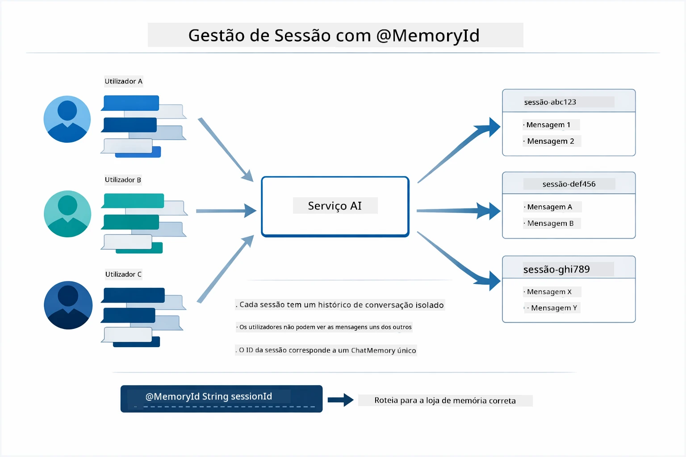

*Cada ID de sessão corresponde a um histórico de conversa isolado — os utilizadores nunca veem as mensagens uns dos outros.*

### Gestão de Erros

As ferramentas podem falhar — as APIs podem expirar, os parâmetros podem ser inválidos, serviços externos podem cair. Os agentes em produção precisam de tratamento de erros para que o modelo possa explicar problemas ou tentar alternativas em vez de falhar completamente. Quando uma ferramenta lança uma exceção, o LangChain4j captura-a e envia a mensagem de erro ao modelo, que pode então explicar o problema em linguagem natural.

## Ferramentas Disponíveis

O diagrama abaixo mostra o vasto ecossistema de ferramentas que pode construir. Este módulo demonstra ferramentas de tempo e temperatura, mas o mesmo padrão `@Tool` funciona para qualquer método Java — desde consultas a bases de dados a processamento de pagamentos.

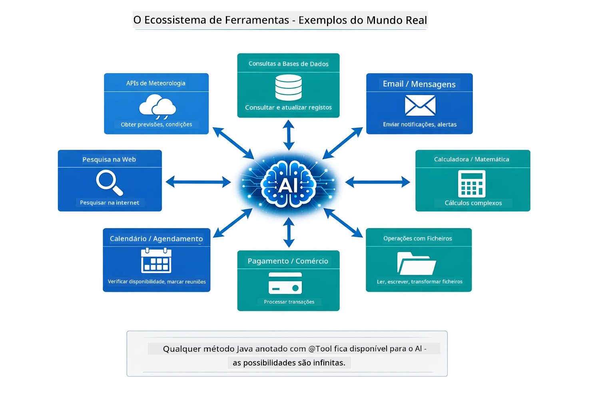

*Qualquer método Java anotado com @Tool fica disponível para a IA — o padrão estende-se a bases de dados, APIs, email, operações de ficheiros e mais.*

## Quando Usar Agentes Baseados em Ferramentas

Nem todos os pedidos precisam de ferramentas. A decisão depende de se a IA precisa interagir com sistemas externos ou pode responder com o seu próprio conhecimento. O guia seguinte resume quando as ferramentas acrescentam valor e quando são desnecessárias:

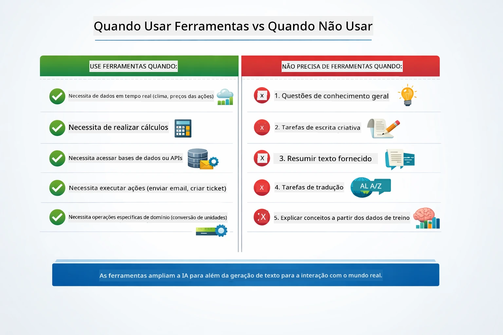

*Um guia rápido de decisão — as ferramentas são para dados em tempo real, cálculos e ações; conhecimento geral e tarefas criativas não precisam delas.*

## Ferramentas vs RAG

Os módulos 03 e 04 estendem o que a IA pode fazer, mas de formas fundamentalmente diferentes. RAG dá acesso ao modelo ao **conhecimento** recuperando documentos. Ferramentas dão ao modelo a capacidade de realizar **ações** chamando funções. O diagrama abaixo compara estas duas abordagens lado a lado — desde o funcionamento de cada fluxo de trabalho até às compensações entre eles:

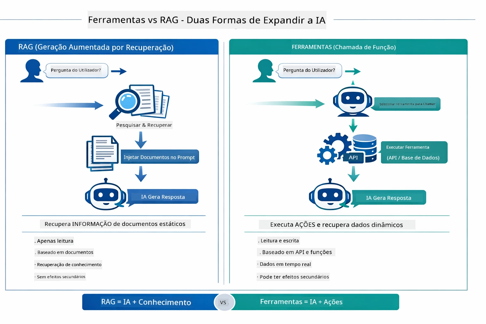

*RAG recupera informação de documentos estáticos — Ferramentas executam ações e obtêm dados dinâmicos em tempo real. Muitos sistemas de produção combinam ambos.*

Na prática, muitos sistemas de produção combinam ambas as abordagens: RAG para fundamentar respostas na sua documentação, e Ferramentas para obter dados ao vivo ou realizar operações.

## Próximos Passos

**Próximo Módulo:** [05-mcp - Protocolo de Contexto do Modelo (MCP)](../05-mcp/README.md)

---

**Navegação:** [← Anterior: Módulo 03 - RAG](../03-rag/README.md) | [Voltar ao Início](../README.md) | [Próximo: Módulo 05 - MCP →](../05-mcp/README.md)

---

<!-- CO-OP TRANSLATOR DISCLAIMER START -->
**Aviso Legal**:
Este documento foi traduzido utilizando o serviço de tradução automática [Co-op Translator](https://github.com/Azure/co-op-translator). Embora nos esforcemos por garantir a precisão, por favor tenha em conta que traduções automáticas podem conter erros ou imprecisões. O documento original no seu idioma nativo deve ser considerado a fonte autorizada. Para informações críticas, recomenda-se a tradução profissional por humanos. Não nos responsabilizamos por quaisquer mal-entendidos ou interpretações erradas resultantes do uso desta tradução.
<!-- CO-OP TRANSLATOR DISCLAIMER END -->