# Módulo 05: Protocolo de Contexto de Modelo (MCP)

## Índice

- [Vídeo Passo a Passo](../../../05-mcp)
- [O que Vai Aprender](../../../05-mcp)
- [O que é o MCP?](../../../05-mcp)
- [Como Funciona o MCP](../../../05-mcp)
- [O Módulo Agente](../../../05-mcp)
- [Executar os Exemplos](../../../05-mcp)
  - [Pré-requisitos](../../../05-mcp)
- [Início Rápido](../../../05-mcp)
  - [Operações com Ficheiros (Stdio)](../../../05-mcp)
  - [Agente Supervisor](../../../05-mcp)
    - [Executar a Demonstração](../../../05-mcp)
    - [Como Funciona o Supervisor](../../../05-mcp)
    - [Como o FileAgent Descobre Ferramentas MCP em Runtime](../../../05-mcp)
    - [Estratégias de Resposta](../../../05-mcp)
    - [Compreender a Saída](../../../05-mcp)
    - [Explicação das Funcionalidades do Módulo Agente](../../../05-mcp)
- [Conceitos-Chave](../../../05-mcp)
- [Parabéns!](../../../05-mcp)
  - [O que Vem a Seguir?](../../../05-mcp)

## Vídeo Passo a Passo

Assista a esta sessão ao vivo que explica como começar com este módulo:

<a href="https://www.youtube.com/watch?v=O_J30kZc0rw"></a>

## O que Vai Aprender

Já construiu IA conversacional, dominou prompts, fundamentou respostas em documentos e criou agentes com ferramentas. Mas todas essas ferramentas foram construídas à medida para a sua aplicação específica. E se pudesse dar ao seu IA acesso a um ecossistema padronizado de ferramentas que qualquer pessoa pode criar e partilhar? Neste módulo, vai aprender exatamente isso com o Protocolo de Contexto de Modelo (MCP) e o módulo agente do LangChain4j. Primeiro apresentamos um leitor de ficheiros MCP simples e depois mostramos como ele se integra facilmente em fluxos de trabalho agentes avançados usando o padrão de Agente Supervisor.

## O que é o MCP?

O Protocolo de Contexto de Modelo (MCP) oferece exatamente isso - uma forma padrão para aplicações de IA descobrirem e usarem ferramentas externas. Em vez de escrever integrações personalizadas para cada fonte de dados ou serviço, liga-se a servidores MCP que expõem as suas capacidades num formato consistente. O seu agente de IA pode depois descobrir e usar essas ferramentas automaticamente.

O diagrama abaixo mostra a diferença — sem MCP, cada integração exige ligações personalizadas ponto a ponto; com MCP, um único protocolo liga a sua app a qualquer ferramenta:


*Antes do MCP: Integrações complexas ponto a ponto. Depois do MCP: Um protocolo, possibilidades infinitas.*

O MCP resolve um problema fundamental no desenvolvimento de IA: cada integração é personalizada. Quer aceder ao GitHub? Código personalizado. Quer ler ficheiros? Código personalizado. Quer consultar uma base de dados? Código personalizado. E nenhuma dessas integrações funciona com outras aplicações de IA.

O MCP padroniza isto. Um servidor MCP expõe ferramentas com descrições claras e esquemas. Qualquer cliente MCP pode ligar-se, descobrir ferramentas disponíveis e usá-las. Construa uma vez, use em todo o lado.

O diagrama abaixo ilustra esta arquitetura — um único cliente MCP (a sua aplicação IA) liga-se a múltiplos servidores MCP, cada um expondo o seu próprio conjunto de ferramentas através do protocolo padrão:


*Arquitetura do Protocolo de Contexto de Modelo - descoberta e execução padronizada de ferramentas*

## Como Funciona o MCP

Nos bastidores, o MCP usa uma arquitetura em camadas. A sua aplicação Java (o cliente MCP) descobre ferramentas disponíveis, envia pedidos JSON-RPC através de uma camada de transporte (Stdio ou HTTP), e o servidor MCP executa operações e devolve resultados. O diagrama seguinte detalha cada camada deste protocolo:

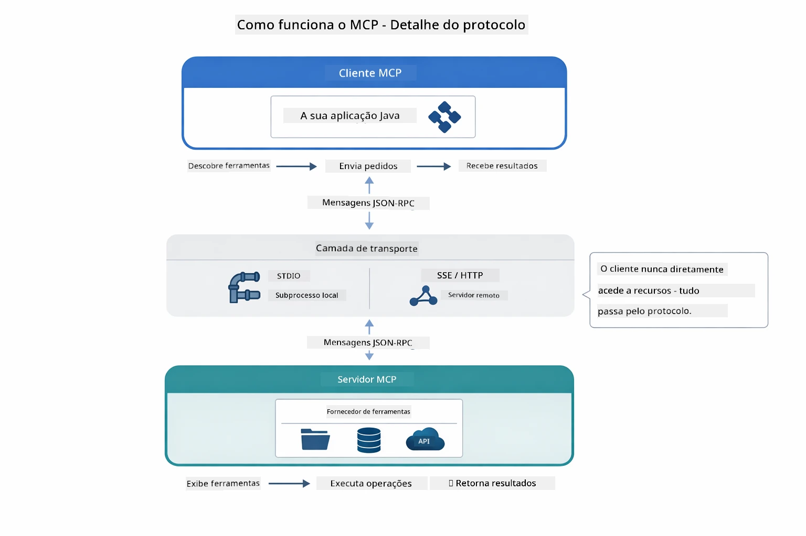

*Como o MCP funciona nos bastidores — clientes descobrem ferramentas, trocam mensagens JSON-RPC e executam operações através de uma camada de transporte.*

**Arquitetura Servidor-Cliente**

O MCP usa um modelo cliente-servidor. Os servidores fornecem ferramentas - ler ficheiros, consultar bases de dados, chamar APIs. Os clientes (a sua aplicação IA) ligam-se aos servidores e usam as suas ferramentas.

Para usar o MCP com LangChain4j, adicione esta dependência Maven:

```xml
<dependency>
    <groupId>dev.langchain4j</groupId>
    <artifactId>langchain4j-mcp</artifactId>
    <version>${langchain4j.version}</version>
</dependency>
```

**Descoberta de Ferramentas**

Quando o seu cliente se liga a um servidor MCP, pergunta "Que ferramentas tens?" O servidor responde com uma lista de ferramentas disponíveis, cada uma com descrições e esquemas de parâmetros. O seu agente de IA pode então decidir que ferramentas usar com base nos pedidos do utilizador. O diagrama abaixo mostra esta comunicação — o cliente envia um pedido `tools/list` e o servidor retorna as suas ferramentas disponíveis com descrições e esquemas:

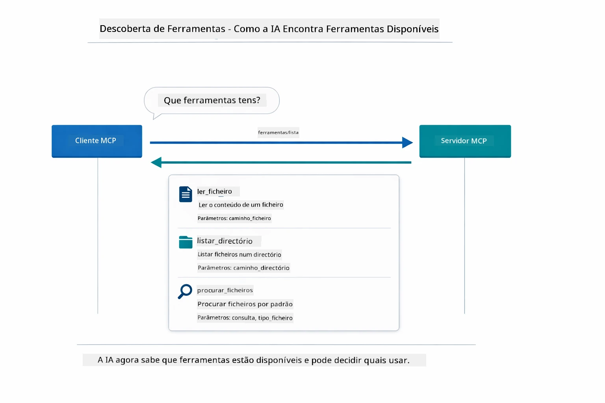

*A IA descobre as ferramentas disponíveis ao iniciar — agora sabe que capacidades existem e pode decidir quais usar.*

**Mecanismos de Transporte**

O MCP suporta diferentes mecanismos de transporte. As duas opções são Stdio (para comunicação com subprocessos locais) e HTTP transmissível (para servidores remotos). Este módulo demonstra o transporte Stdio:


*Mecanismos de transporte MCP: HTTP para servidores remotos, Stdio para processos locais*

**Stdio** - [StdioTransportDemo.java](../../../05-mcp/src/main/java/com/example/langchain4j/mcp/StdioTransportDemo.java)

Para processos locais. A sua aplicação cria um servidor como subprocesso e comunica através de entrada/saída padrão. Útil para acesso ao sistema de ficheiros ou ferramentas de linha de comando.

```java
McpTransport stdioTransport = new StdioMcpTransport.Builder()
    .command(List.of(
        npmCmd, "exec",
        "@modelcontextprotocol/server-filesystem@2025.12.18",
        resourcesDir
    ))
    .logEvents(false)
    .build();
```

O servidor `@modelcontextprotocol/server-filesystem` expõe as seguintes ferramentas, todas isoladas (sandboxed) para as pastas que especificar:

| Ferramenta | Descrição |
|------|-------------|
| `read_file` | Ler o conteúdo de um único ficheiro |
| `read_multiple_files` | Ler vários ficheiros numa só chamada |
| `write_file` | Criar ou sobrescrever um ficheiro |
| `edit_file` | Fazer edições específicas de encontrar-e-substituir |
| `list_directory` | Listar ficheiros e diretórios num caminho |
| `search_files` | Procurar recursivamente ficheiros que correspondem a um padrão |
| `get_file_info` | Obter metadata do ficheiro (tamanho, timestamps, permissões) |
| `create_directory` | Criar um diretório (incluindo diretórios pais) |
| `move_file` | Mover ou renomear um ficheiro ou diretório |

O diagrama seguinte mostra como o transporte Stdio funciona em runtime — a sua aplicação Java cria o servidor MCP como processo filho e comunicam através dos pipes stdin/stdout, sem rede ou HTTP envolvidos:

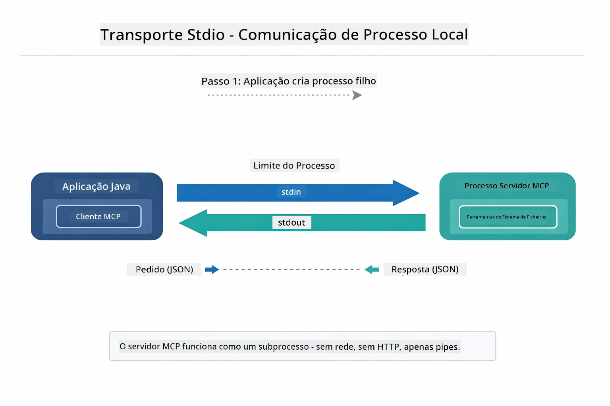

*Transporte Stdio em ação — a sua aplicação cria o servidor MCP como processo filho e comunica através dos pipes stdin/stdout.*

> **🤖 Experimente com o Chat [GitHub Copilot](https://github.com/features/copilot):** Abra [`StdioTransportDemo.java`](../../../05-mcp/src/main/java/com/example/langchain4j/mcp/StdioTransportDemo.java) e pergunte:
> - "Como funciona o transporte Stdio e quando devo usá-lo em vez de HTTP?"
> - "Como é que o LangChain4j gere o ciclo de vida dos processos do servidor MCP criados?"
> - "Quais as implicações de segurança de dar acesso ao sistema de ficheiros para a IA?"

## O Módulo Agente

Enquanto o MCP fornece ferramentas padronizadas, o módulo **agente** do LangChain4j oferece uma forma declarativa de construir agentes que orquestram essas ferramentas. A anotação `@Agent` e `AgenticServices` permitem definir comportamento do agente através de interfaces em vez de código imperativo.

Neste módulo, vai explorar o padrão do **Agente Supervisor** — uma abordagem agente de IA avançada onde um agente "supervisor" decide dinamicamente que subagentes invocar com base nos pedidos do utilizador. Vamos combinar ambos os conceitos dando a um dos nossos subagentes capacidades de acesso a ficheiros potenciadas por MCP.

Para usar o módulo agente, adicione esta dependência Maven:

```xml
<dependency>
    <groupId>dev.langchain4j</groupId>
    <artifactId>langchain4j-agentic</artifactId>
    <version>${langchain4j.mcp.version}</version>
</dependency>
```
> **Nota:** O módulo `langchain4j-agentic` usa uma propriedade de versão separada (`langchain4j.mcp.version`) pois é lançado em calendário diferente das bibliotecas principais LangChain4j.

> **⚠️ Experimental:** O módulo `langchain4j-agentic` é **experimental** e pode mudar. A forma estável de construir assistentes de IA continua a ser `langchain4j-core` com ferramentas personalizadas (Módulo 04).

## Executar os Exemplos

### Pré-requisitos

- Completar [Módulo 04 - Ferramentas](../04-tools/README.md) (este módulo baseia-se em conceitos de ferramentas personalizadas e os compara com as ferramentas MCP)
- Ficheiro `.env` na raiz com credenciais Azure (criado pelo `azd up` no Módulo 01)
- Java 21+, Maven 3.9+
- Node.js 16+ e npm (para servidores MCP)

> **Nota:** Se ainda não configurou as suas variáveis de ambiente, veja [Módulo 01 - Introdução](../01-introduction/README.md) para instruções de deployment (`azd up` cria automaticamente o ficheiro `.env`), ou copie `.env.example` para `.env` na raiz e preencha os seus valores.

## Início Rápido

**Usando VS Code:** Basta clicar com o botão direito num ficheiro de demo no Explorador e escolher **"Run Java"**, ou usar as configurações de lançamento no painel Executar e Depurar (certifique-se de que o ficheiro `.env` está configurado primeiro).

**Usando Maven:** Alternativamente, pode correr a partir da linha de comando com os exemplos abaixo.

### Operações com Ficheiros (Stdio)

Demonstra ferramentas baseadas em subprocessos locais.

**✅ Sem pré-requisitos necessários** - o servidor MCP é criado automaticamente.

**Usando os Scripts de Arranque (Recomendado):**

Os scripts de arranque carregam automaticamente as variáveis do ambiente do ficheiro `.env` da raiz:

**Bash:**
```bash
cd 05-mcp
chmod +x start-stdio.sh
./start-stdio.sh
```

**PowerShell:**
```powershell
cd 05-mcp
.\start-stdio.ps1
```

**Usando VS Code:** Clique com o botão direito em `StdioTransportDemo.java` e selecione **"Run Java"** (certifique-se que o ficheiro `.env` está configurado).

A aplicação cria automaticamente um servidor MCP do sistema de ficheiros e lê um ficheiro local. Note como a gestão do subprocesso é feita para si.

**Saída esperada:**
```
Assistant response: The file provides an overview of LangChain4j, an open-source Java library
for integrating Large Language Models (LLMs) into Java applications...
```

### Agente Supervisor

O padrão **Agente Supervisor** é uma forma **flexível** de IA agente. Um Supervisor usa um LLM para decidir autonomamente que agentes invocar com base no pedido do utilizador. No próximo exemplo, combinamos acesso a ficheiros com MCP com um agente LLM para criar um fluxo supervisionado de ler ficheiro → gerar relatório.

Na demonstração, o `FileAgent` lê um ficheiro usando ferramentas do sistema de ficheiros MCP, e o `ReportAgent` gera um relatório estruturado com um resumo executivo (1 frase), 3 pontos chave, e recomendações. O Supervisor orquestra este fluxo automaticamente:

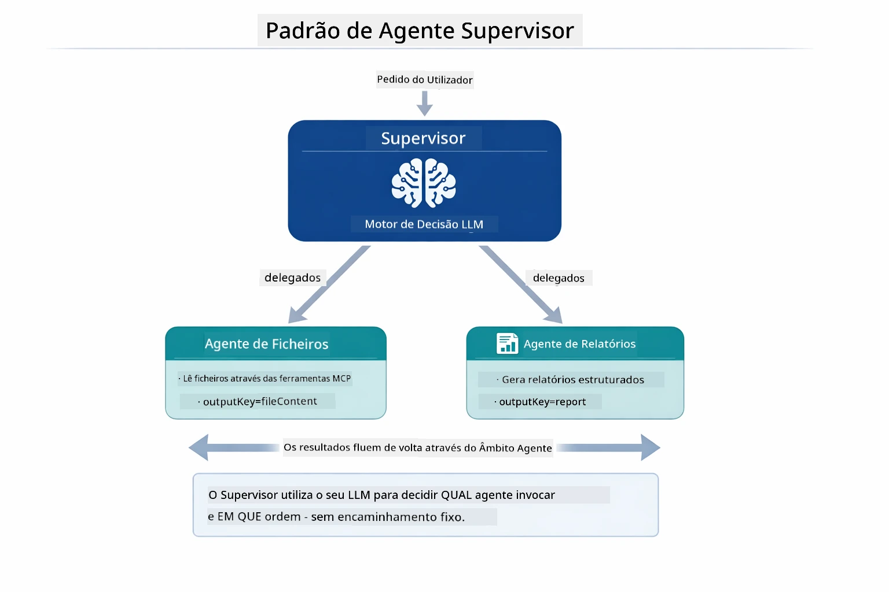

*O Supervisor usa o seu LLM para decidir que agentes invocar e em que ordem — sem necessidade de rotas codificadas.*

Aqui está o fluxo concreto para o nosso pipeline de ficheiro para relatório:

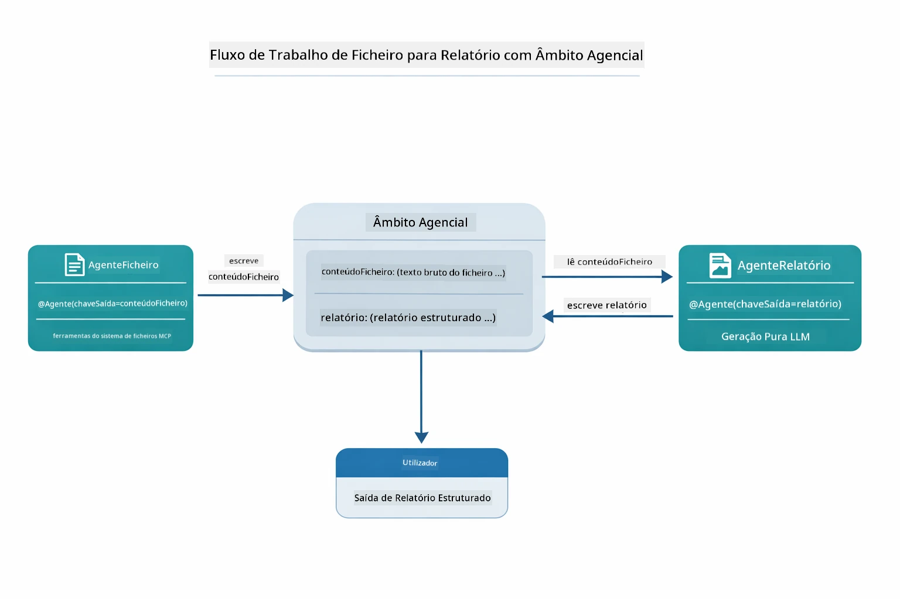

*O FileAgent lê o ficheiro através das ferramentas MCP, depois o ReportAgent transforma o conteúdo bruto num relatório estruturado.*

O diagrama de sequência seguinte traça toda a orquestração do Supervisor — desde a criação do servidor MCP, passando pela seleção autónoma dos agentes pelo Supervisor, às chamadas das ferramentas através de stdio e ao relatório final:

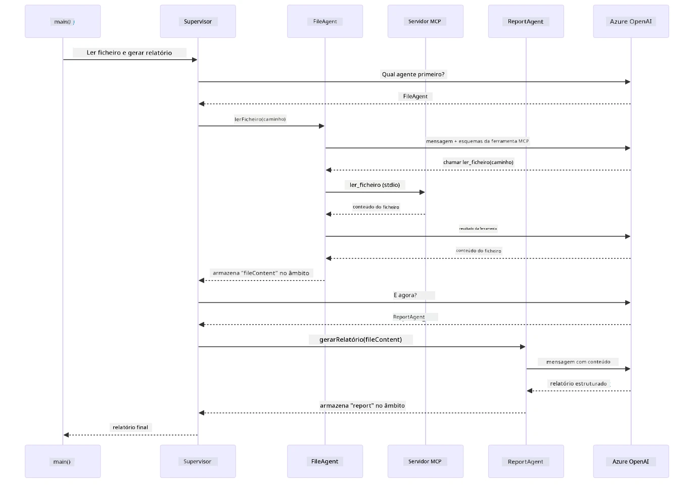

*O Supervisor invoca autonomamente o FileAgent (que chama o servidor MCP via stdio para ler o ficheiro), depois invoca o ReportAgent para gerar um relatório estruturado — cada agente guarda a sua saída no Escopo Agente compartilhado.*

Cada agente guarda a sua saída no **Escopo Agente** (memória partilhada), permitindo que agentes seguintes acedam a resultados anteriores. Isto demonstra como as ferramentas MCP integram-se perfeitamente em fluxos agentes — o Supervisor não precisa de saber *como* os ficheiros são lidos, apenas que o `FileAgent` o pode fazer.

#### Executar a Demonstração

Os scripts de arranque carregam automaticamente as variáveis do ambiente do ficheiro `.env` da raiz:

**Bash:**
```bash
cd 05-mcp
chmod +x start-supervisor.sh
./start-supervisor.sh
```

**PowerShell:**
```powershell
cd 05-mcp
.\start-supervisor.ps1
```

**Usando VS Code:** Clique com o botão direito em `SupervisorAgentDemo.java` e selecione **"Run Java"** (certifique-se que o ficheiro `.env` está configurado).

#### Como Funciona o Supervisor

Antes de construir agentes, precisa ligar o transporte MCP a um cliente e envolvê-lo como um `ToolProvider`. É assim que as ferramentas do servidor MCP ficam disponíveis para os seus agentes:

```java
// Criar um cliente MCP a partir do transporte
McpClient mcpClient = new DefaultMcpClient.Builder()
        .transport(stdioTransport)
        .build();

// Envolver o cliente como um ToolProvider — isto conecta as ferramentas MCP ao LangChain4j
ToolProvider mcpToolProvider = McpToolProvider.builder()
        .mcpClients(List.of(mcpClient))
        .build();
```

Agora pode injetar `mcpToolProvider` em qualquer agente que precise das ferramentas MCP:

```java
// Passo 1: FileAgent lê ficheiros usando ferramentas MCP
FileAgent fileAgent = AgenticServices.agentBuilder(FileAgent.class)
        .chatModel(model)
        .toolProvider(mcpToolProvider)  // Tem ferramentas MCP para operações de ficheiros
        .build();

// Passo 2: ReportAgent gera relatórios estruturados
ReportAgent reportAgent = AgenticServices.agentBuilder(ReportAgent.class)
        .chatModel(model)
        .build();

// O Supervisor orquestra o fluxo de trabalho ficheiro → relatório
SupervisorAgent supervisor = AgenticServices.supervisorBuilder()
        .chatModel(model)
        .subAgents(fileAgent, reportAgent)
        .responseStrategy(SupervisorResponseStrategy.LAST)  // Retorna o relatório final
        .build();

// O Supervisor decide quais agentes invocar com base no pedido
String response = supervisor.invoke("Read the file at /path/file.txt and generate a report");
```

#### Como o FileAgent Descobre Ferramentas MCP em Runtime

Pode perguntar-se: **como é que o `FileAgent` sabe como usar as ferramentas do sistema de ficheiros npm?** A resposta é que não sabe — o **LLM** descobre durante a execução através dos esquemas das ferramentas.
A interface `FileAgent` é apenas uma **definição de prompt**. Não tem conhecimento embutido de `read_file`, `list_directory` ou qualquer outra ferramenta MCP. Aqui está o que acontece de ponta a ponta:

1. **Servidor inicia:** `StdioMcpTransport` lança o pacote npm `@modelcontextprotocol/server-filesystem` como um processo filho
2. **Descoberta de ferramentas:** O `McpClient` envia um pedido JSON-RPC `tools/list` ao servidor, que responde com nomes de ferramentas, descrições e esquemas de parâmetros (por exemplo, `read_file` — *"Ler o conteúdo completo de um ficheiro"* — `{ path: string }`)
3. **Injeção de esquema:** `McpToolProvider` encapsula estes esquemas descobertos e torna-os disponíveis para o LangChain4j
4. **LLM decide:** Quando `FileAgent.readFile(path)` é chamado, o LangChain4j envia a mensagem do sistema, mensagem do utilizador, **e a lista de esquemas de ferramentas** para o LLM. O LLM lê as descrições da ferramenta e gera uma chamada de ferramenta (por exemplo, `read_file(path="/some/file.txt")`)
5. **Execução:** O LangChain4j intercepta a chamada da ferramenta, encaminha-a através do cliente MCP de volta ao subprocesso Node.js, obtém o resultado e alimenta-o de volta para o LLM

Este é o mesmo mecanismo de [Descoberta de Ferramentas](../../../05-mcp) descrito acima, mas aplicado especificamente ao fluxo de trabalho do agente. As anotações `@SystemMessage` e `@UserMessage` orientam o comportamento do LLM, enquanto o `ToolProvider` injetado fornece as **capacidades** — o LLM faz a ponte entre os dois em tempo de execução.

> **🤖 Experimente com [GitHub Copilot](https://github.com/features/copilot) Chat:** Abra [`FileAgent.java`](../../../05-mcp/src/main/java/com/example/langchain4j/mcp/agents/FileAgent.java) e pergunte:
> - "Como é que este agente sabe qual a ferramenta MCP a chamar?"
> - "O que aconteceria se eu removesse o ToolProvider do construtor do agente?"
> - "Como é que os esquemas das ferramentas são passados para o LLM?"

#### Estratégias de Resposta

Quando configura um `SupervisorAgent`, especifica como deve formular a sua resposta final ao utilizador depois dos sub-agentes terminarem as suas tarefas. O diagrama abaixo mostra as três estratégias disponíveis — LAST devolve diretamente a saída final do agente, SUMMARY sintetiza todas as saídas através de um LLM, e SCORED escolhe a que obtiver a melhor pontuação face ao pedido original:

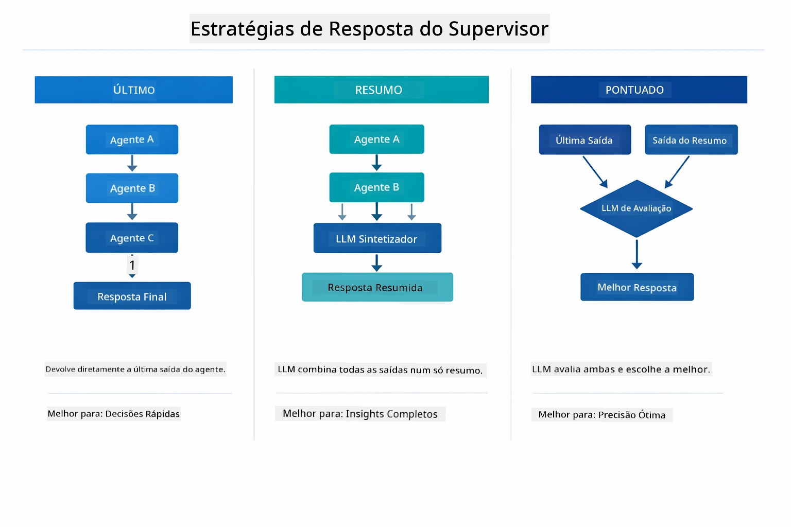

*Três estratégias para como o Supervisor formula a sua resposta final — escolha consoante queira a saída do último agente, um resumo sintetizado, ou a opção com melhor pontuação.*

As estratégias disponíveis são:

| Estratégia | Descrição |
|------------|-----------|
| **LAST** | O supervisor devolve a saída do último sub-agente ou ferramenta chamado. É útil quando o agente final no fluxo está especificamente desenhado para produzir a resposta completa e final (por exemplo, um "Agente de Resumo" numa pipeline de investigação). |
| **SUMMARY** | O supervisor utiliza o seu próprio Modelo de Linguagem (LLM) interno para sintetizar um resumo de toda a interação e de todas as saídas dos sub-agentes, devolvendo esse resumo como resposta final. Isto fornece uma resposta agregada e limpa ao utilizador. |
| **SCORED** | O sistema usa um LLM interno para pontuar tanto a resposta LAST como o SUMMARY da interação face ao pedido original do utilizador, devolvendo a saída que obtiver a pontuação mais alta. |

Veja [SupervisorAgentDemo.java](../../../05-mcp/src/main/java/com/example/langchain4j/mcp/SupervisorAgentDemo.java) para a implementação completa.

> **🤖 Experimente com [GitHub Copilot](https://github.com/features/copilot) Chat:** Abra [`SupervisorAgentDemo.java`](../../../05-mcp/src/main/java/com/example/langchain4j/mcp/SupervisorAgentDemo.java) e pergunte:
> - "Como é que o Supervisor decide quais agentes invocar?"
> - "Qual é a diferença entre os padrões de fluxo Supervisor e Sequencial?"
> - "Como posso personalizar o comportamento de planeamento do Supervisor?"

#### Entendendo a Saída

Quando executar a demo, verá uma explicação estruturada de como o Supervisor orquestra múltiplos agentes. Eis o que cada secção significa:

```
======================================================================
  FILE → REPORT WORKFLOW DEMO
======================================================================

This demo shows a clear 2-step workflow: read a file, then generate a report.
The Supervisor orchestrates the agents automatically based on the request.
```

**O cabeçalho** apresenta o conceito do fluxo de trabalho: uma pipeline focada desde a leitura de ficheiros até geração de relatórios.

```
--- WORKFLOW ---------------------------------------------------------
  ┌─────────────┐      ┌──────────────┐
  │  FileAgent  │ ───▶ │ ReportAgent  │
  │ (MCP tools) │      │  (pure LLM)  │
  └─────────────┘      └──────────────┘
   outputKey:           outputKey:
   'fileContent'        'report'

--- AVAILABLE AGENTS -------------------------------------------------
  [FILE]   FileAgent   - Reads files via MCP → stores in 'fileContent'
  [REPORT] ReportAgent - Generates structured report → stores in 'report'
```

**Diagrama do Fluxo de Trabalho** mostra o fluxo de dados entre agentes. Cada agente tem um papel específico:
- **FileAgent** lê ficheiros usando ferramentas MCP e guarda o conteúdo bruto em `fileContent`
- **ReportAgent** consome esse conteúdo e produz um relatório estruturado em `report`

```
--- USER REQUEST -----------------------------------------------------
  "Read the file at .../file.txt and generate a report on its contents"
```

**Pedido do Utilizador** mostra a tarefa. O Supervisor analisa isto e decide invocar FileAgent → ReportAgent.

```
--- SUPERVISOR ORCHESTRATION -----------------------------------------
  The Supervisor decides which agents to invoke and passes data between them...

  +-- STEP 1: Supervisor chose -> FileAgent (reading file via MCP)
  |
  |   Input: .../file.txt
  |
  |   Result: LangChain4j is an open-source, provider-agnostic Java framework for building LLM...
  +-- [OK] FileAgent (reading file via MCP) completed

  +-- STEP 2: Supervisor chose -> ReportAgent (generating structured report)
  |
  |   Input: LangChain4j is an open-source, provider-agnostic Java framew...
  |
  |   Result: Executive Summary...
  +-- [OK] ReportAgent (generating structured report) completed
```

**Orquestração do Supervisor** mostra o fluxo de 2 passos em ação:
1. **FileAgent** lê o ficheiro via MCP e guarda o conteúdo
2. **ReportAgent** recebe o conteúdo e gera um relatório estruturado

O Supervisor tomou estas decisões **autonomamente** com base no pedido do utilizador.

```
--- FINAL RESPONSE ---------------------------------------------------
Executive Summary
...

Key Points
...

Recommendations
...

--- AGENTIC SCOPE (Data Flow) ----------------------------------------
  Each agent stores its output for downstream agents to consume:
  * fileContent: LangChain4j is an open-source, provider-agnostic Java framework...
  * report: Executive Summary...
```

#### Explicação das Funcionalidades do Módulo Agentic

O exemplo demonstra várias funcionalidades avançadas do módulo agentic. Vamos analisar mais de perto o Agentic Scope e Agent Listeners.

**Agentic Scope** mostra a memória partilhada onde os agentes guardam os seus resultados usando `@Agent(outputKey="...")`. Isto permite:
- Agentes posteriores acederem às saídas dos agentes anteriores
- O Supervisor sintetizar uma resposta final
- Você inspecionar o que cada agente produziu

O diagrama abaixo mostra como o Agentic Scope funciona como memória partilhada no fluxo de ficheiro para relatório — FileAgent escreve a sua saída sob a chave `fileContent`, ReportAgent lê isso e escreve a sua própria saída sob `report`:

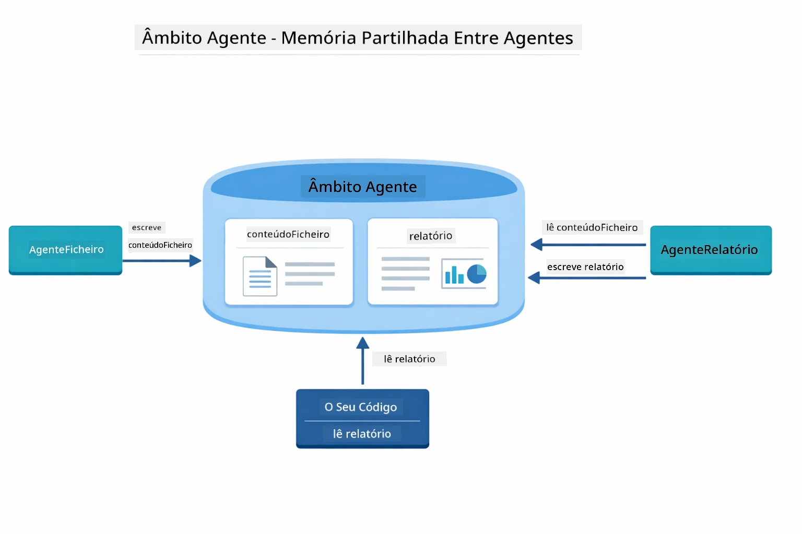

*Agentic Scope atua como memória partilhada — FileAgent escreve `fileContent`, ReportAgent lê e escreve `report`, e o seu código lê o resultado final.*

```java
ResultWithAgenticScope<String> result = supervisor.invokeWithAgenticScope(request);
AgenticScope scope = result.agenticScope();
String fileContent = scope.readState("fileContent");  // Dados brutos do ficheiro do FileAgent
String report = scope.readState("report");            // Relatório estruturado do ReportAgent
```

**Agent Listeners** permitem monitorizar e depurar a execução dos agentes. A saída passo a passo que vê na demo provém de um AgentListener que se liga a cada invocação de agente:
- **beforeAgentInvocation** - Chamado quando o Supervisor seleciona um agente, permitindo ver qual agente foi escolhido e porquê
- **afterAgentInvocation** - Chamado quando um agente termina, mostrando o seu resultado
- **inheritedBySubagents** - Quando verdadeiro, o listener monitoriza todos os agentes na hierarquia

O diagrama seguinte mostra o ciclo de vida completo do Agent Listener, incluindo como o `onError` trata falhas durante a execução do agente:

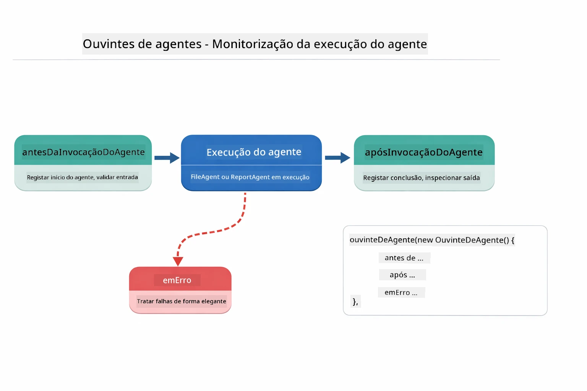

*Agent Listeners ligam-se ao ciclo de vida da execução — monitorizam quando agentes começam, terminam ou apresentam erros.*

```java
AgentListener monitor = new AgentListener() {
    private int step = 0;
    
    @Override
    public void beforeAgentInvocation(AgentRequest request) {
        step++;
        System.out.println("  +-- STEP " + step + ": " + request.agentName());
    }
    
    @Override
    public void afterAgentInvocation(AgentResponse response) {
        System.out.println("  +-- [OK] " + response.agentName() + " completed");
    }
    
    @Override
    public boolean inheritedBySubagents() {
        return true; // Propagar para todos os sub-agentes
    }
};
```

Para além do padrão Supervisor, o módulo `langchain4j-agentic` fornece vários padrões de fluxos poderosos. O diagrama abaixo mostra os cinco — desde pipelines sequenciais simples até fluxos de aprovação com intervenção humana:

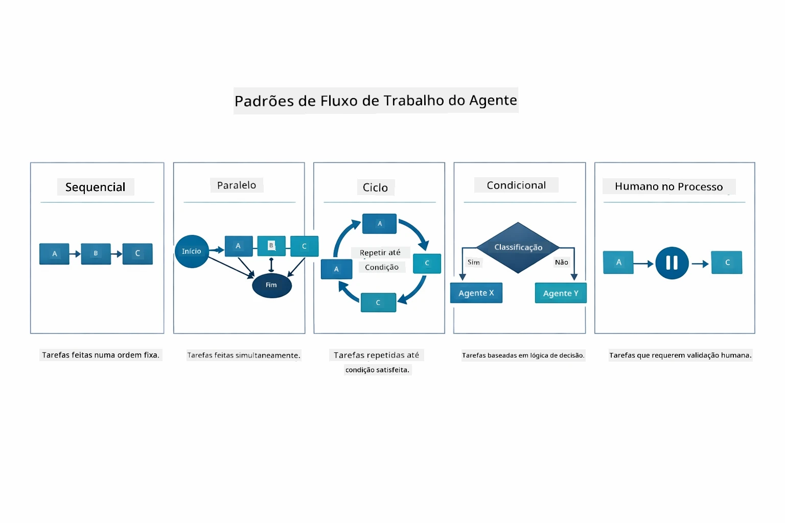

*Cinco padrões de fluxo para orquestrar agentes — desde pipelines sequenciais simples até fluxos de aprovação com intervenção humana.*

| Padrão | Descrição | Caso de Uso |
|--------|-----------|-------------|
| **Sequencial** | Executar agentes em ordem, saída flui para o próximo | Pipelines: pesquisa → análise → relatório |
| **Paralelo** | Executar agentes simultaneamente | Tarefas independentes: tempo + notícias + ações |
| **Loop** | Iterar até condição ser satisfeita | Avaliação de qualidade: refinar até pontuação ≥ 0.8 |
| **Condicional** | Roteamento baseado em condições | Classificar → enviar para agente especialista |
| **Intervenção Humana** | Adicionar pontos de controlo humanos | Fluxos de aprovação, revisão de conteúdos |

## Conceitos-Chave

Agora que explorou MCP e o módulo agentic em ação, vamos resumir quando usar cada abordagem.

Uma das maiores vantagens do MCP é o seu ecossistema em crescimento. O diagrama abaixo mostra como um protocolo universal único conecta a sua aplicação de IA a uma grande variedade de servidores MCP — desde acesso a sistemas de ficheiros e bases de dados até GitHub, email, scraping web e mais:

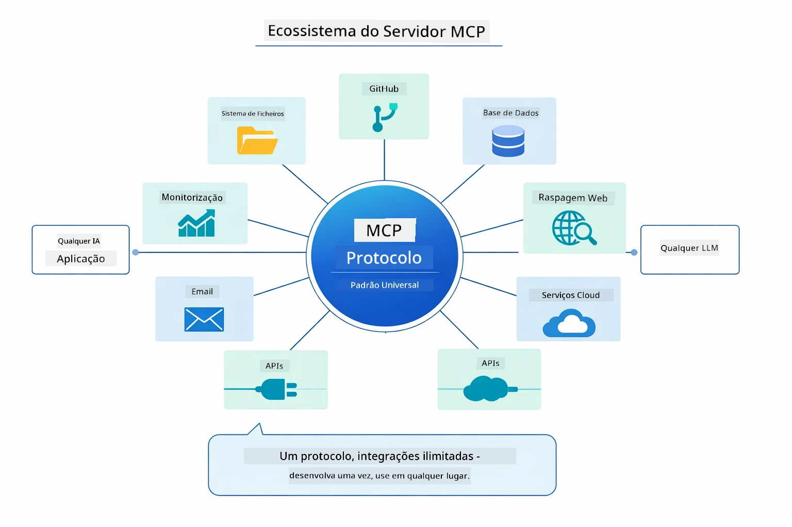

*MCP cria um ecossistema de protocolo universal — qualquer servidor compatível com MCP funciona com qualquer cliente compatível, possibilitando o partilhar de ferramentas entre aplicações.*

**MCP** é ideal quando quer aproveitar ecossistemas de ferramentas existentes, construir ferramentas que múltiplas aplicações possam partilhar, integrar serviços de terceiros com protocolos standard, ou trocar implementações de ferramentas sem alterar código.

**O Módulo Agentic** funciona melhor quando quer definições declarativas de agentes com anotações `@Agent`, necessita orquestração de fluxos (sequencial, loop, paralelo), prefere design de agentes baseado em interface em vez de código imperativo, ou está a combinar múltiplos agentes que partilham saídas via `outputKey`.

**O padrão Supervisor Agent** destaca-se quando o fluxo não é previsível com antecedência e quer que o LLM decida, quando tem múltiplos agentes especializados que precisam de orquestração dinâmica, ao construir sistemas conversacionais que encaminham para diferentes capacidades, ou quando quer o comportamento de agente mais flexível e adaptativo.

Para ajudar a decidir entre os métodos customizados `@Tool` do Módulo 04 e as ferramentas MCP deste módulo, a comparação seguinte destaca as principais compensações — ferramentas customizadas oferecem forte acoplamento e segurança total de tipo para lógica específica da aplicação, enquanto ferramentas MCP oferecem integrações padronizadas e reutilizáveis:

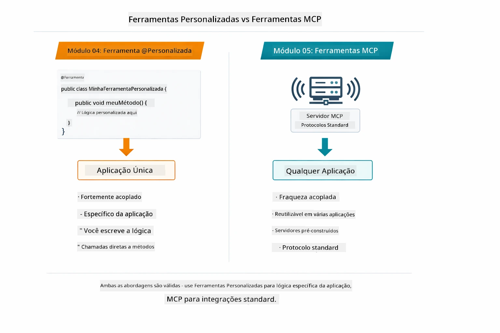

*Quando usar métodos customizados @Tool vs ferramentas MCP — ferramentas customizadas para lógica específica com segurança total de tipo, MCP para integrações padronizadas que funcionam entre aplicações.*

## Parabéns!

Conseguiu completar todos os cinco módulos do curso LangChain4j para Principiantes! Aqui está uma visão da jornada completa que realizou — desde chat básico até sistemas agentic potenciados por MCP:

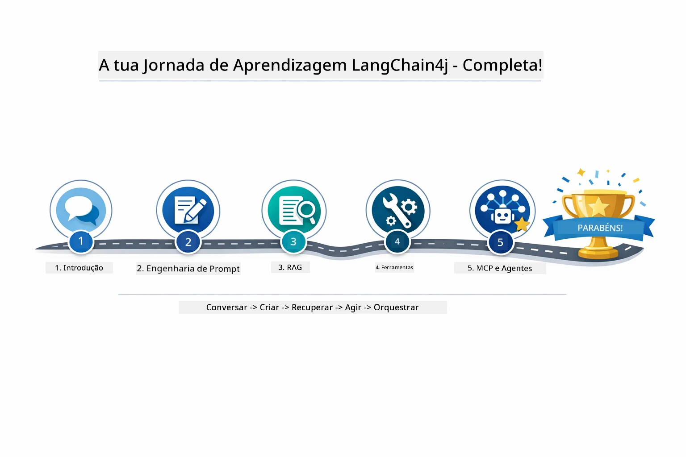

*A sua jornada de aprendizagem por todos os cinco módulos — desde chat básico até sistemas agentic potenciados por MCP.*

Terminou o curso LangChain4j para Principiantes. Aprendeu:

- Como construir IA conversacional com memória (Módulo 01)
- Padrões de engenharia de prompt para diferentes tarefas (Módulo 02)
- Basear respostas nos seus documentos com RAG (Módulo 03)
- Criar agentes básicos de IA (assistentes) com ferramentas personalizadas (Módulo 04)
- Integrar ferramentas padronizadas com os módulos LangChain4j MCP e Agentic (Módulo 05)

### O que vem a seguir?

Depois de concluir os módulos, explore o [Guia de Testes](../docs/TESTING.md) para ver conceitos de teste do LangChain4j em ação.

**Recursos Oficiais:**
- [Documentação LangChain4j](https://docs.langchain4j.dev/) - Guias completos e referência de API
- [LangChain4j GitHub](https://github.com/langchain4j/langchain4j) - Código-fonte e exemplos
- [Tutoriais LangChain4j](https://docs.langchain4j.dev/tutorials/) - Tutoriais passo a passo para vários casos de uso

Obrigado por completar este curso!

---

**Navegação:** [← Anterior: Módulo 04 - Ferramentas](../04-tools/README.md) | [Voltar ao Início](../README.md)

---

<!-- CO-OP TRANSLATOR DISCLAIMER START -->
**Aviso**:
Este documento foi traduzido utilizando o serviço de tradução automática [Co-op Translator](https://github.com/Azure/co-op-translator). Embora nos esforcemos por garantir a precisão, por favor tenha em conta que traduções automáticas podem conter erros ou incorreções. O documento original, na sua língua nativa, deverá ser considerado a fonte oficial. Para informações críticas, recomenda-se tradução profissional realizada por um humano. Não nos responsabilizamos por quaisquer mal-entendidos ou interpretações erradas decorrentes da utilização desta tradução.
<!-- CO-OP TRANSLATOR DISCLAIMER END -->