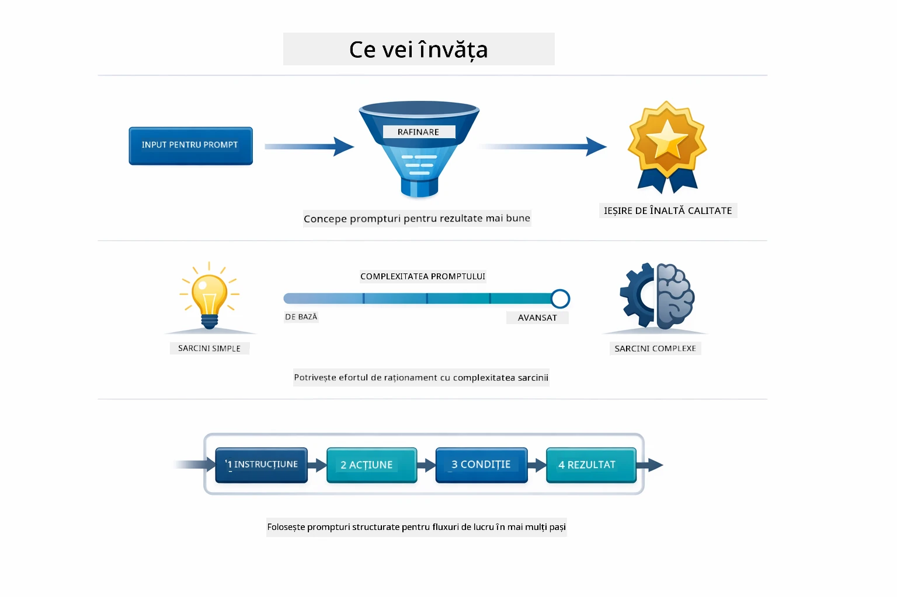
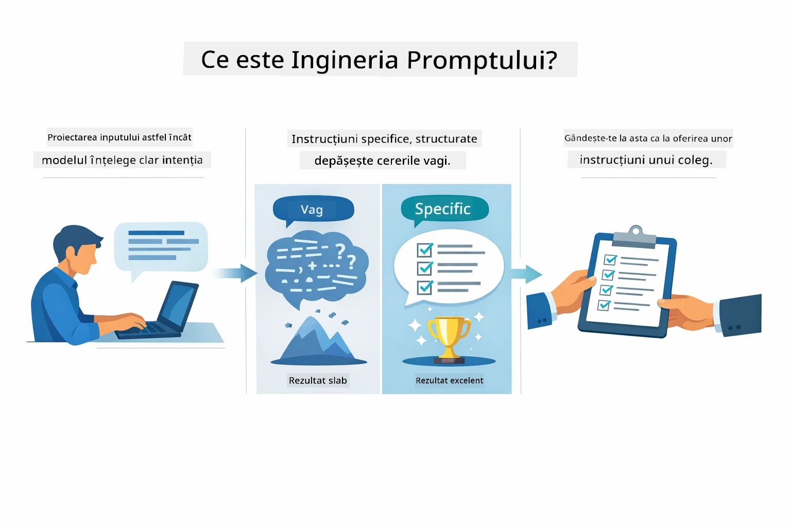
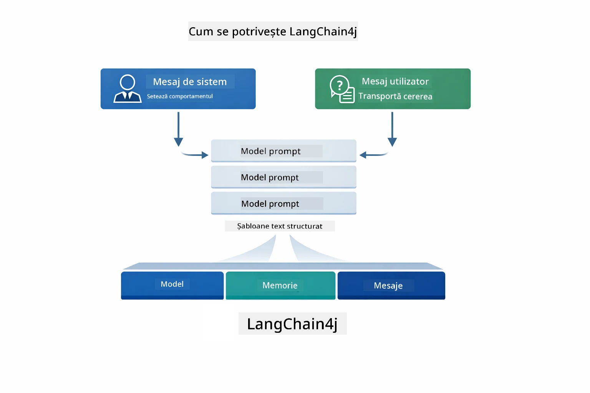
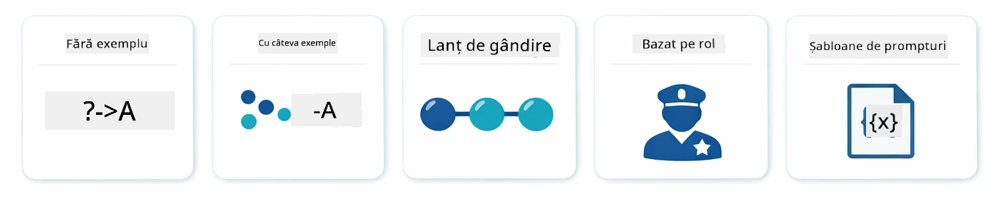
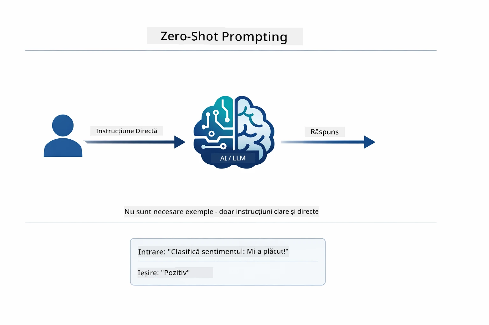
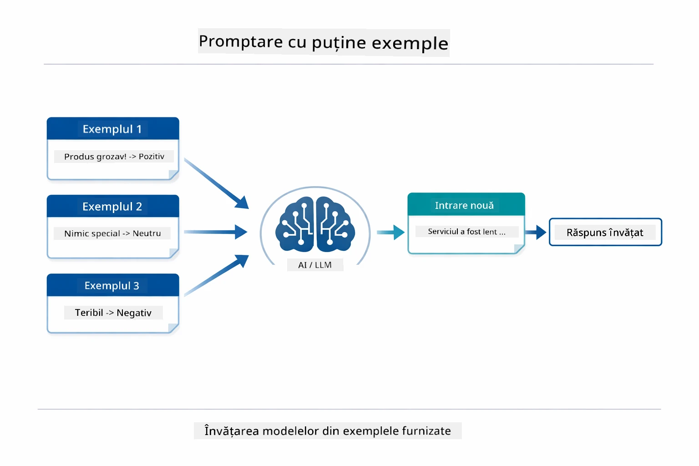
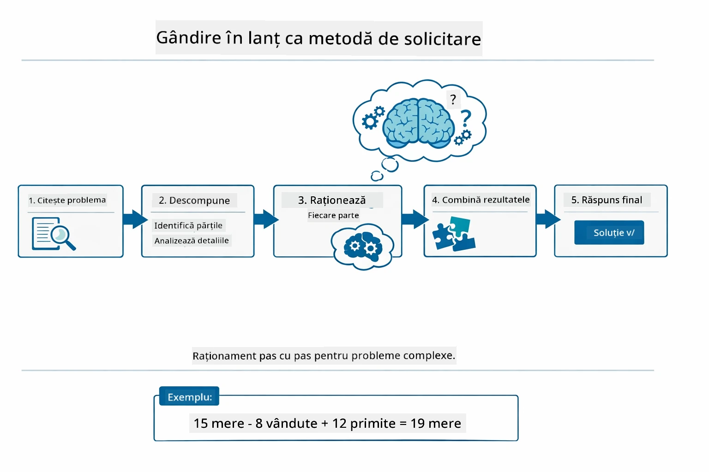
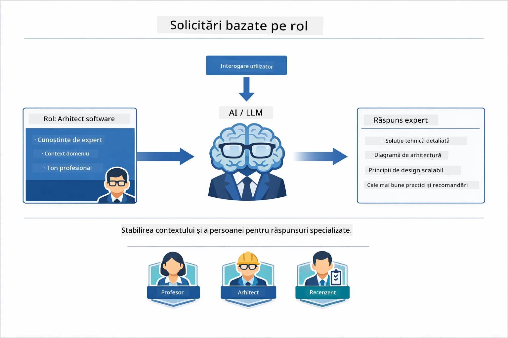
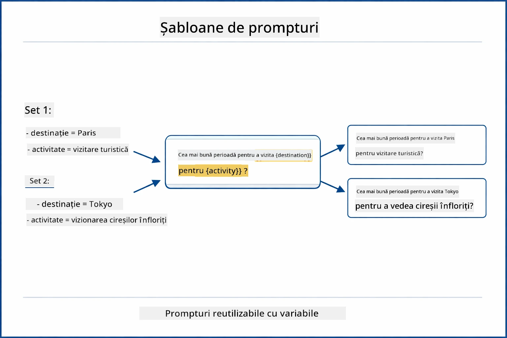
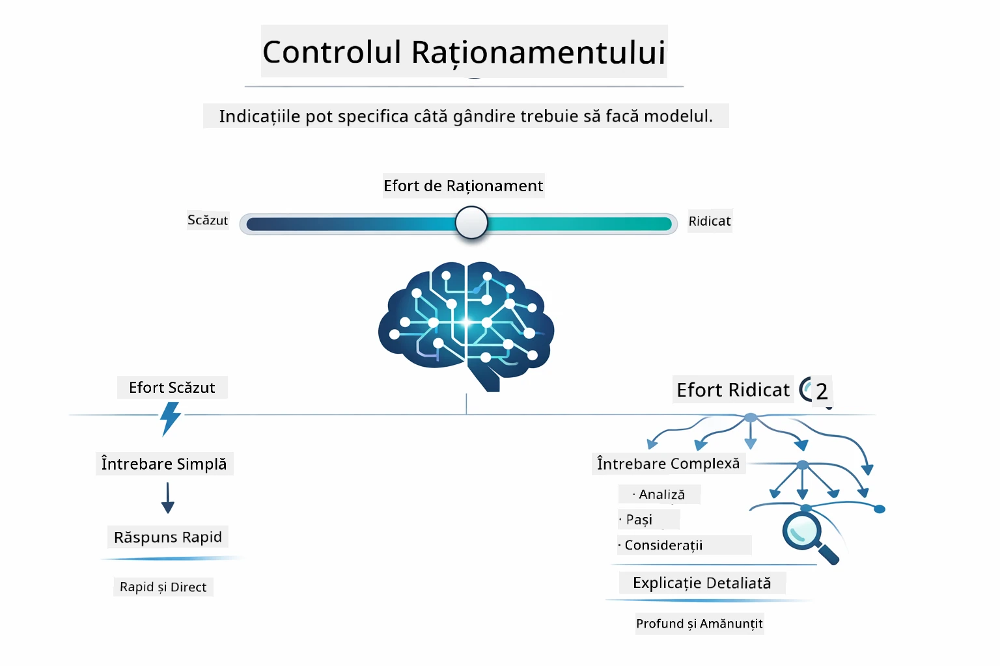

# Modulul 02: Ingineria Prompturilor cu GPT-5.2

## Cuprins

- [Ce Vei Învăța](../../../02-prompt-engineering)
- [Condiții Prealabile](../../../02-prompt-engineering)
- [Înțelegerea Ingineriei Prompturilor](../../../02-prompt-engineering)
- [Fundamentele Ingineriei Prompturilor](../../../02-prompt-engineering)
  - [Promptarea Zero-Shot](../../../02-prompt-engineering)
  - [Promptarea Few-Shot](../../../02-prompt-engineering)
  - [Lanțul de Gândire](../../../02-prompt-engineering)
  - [Promptarea Bazată pe Rol](../../../02-prompt-engineering)
  - [Șabloane de Prompturi](../../../02-prompt-engineering)
- [Modele Avansate](../../../02-prompt-engineering)
- [Utilizarea Resurselor Azure Existente](../../../02-prompt-engineering)
- [Capturi de Ecran ale Aplicației](../../../02-prompt-engineering)
- [Explorarea Modelelor](../../../02-prompt-engineering)
  - [Entuziasm Scăzut vs Ridicat](../../../02-prompt-engineering)
  - [Executarea Sarcinilor (Preludii pentru Unelte)](../../../02-prompt-engineering)
  - [Cod Auto-Reflectiv](../../../02-prompt-engineering)
  - [Analiză Structurată](../../../02-prompt-engineering)
  - [Chat Multi-Turn](../../../02-prompt-engineering)
  - [Raționament Pas cu Pas](../../../02-prompt-engineering)
  - [Ieșire Constrânsă](../../../02-prompt-engineering)
- [Ce Învăț De Fapt](../../../02-prompt-engineering)
- [Pașii Următori](../../../02-prompt-engineering)

## Ce Vei Învăța



În modulul precedent, ai văzut cum memoria permite AI conversațional și ai folosit Modelele GitHub pentru interacțiuni de bază. Acum ne vom concentra pe cum pui întrebări — prompturile în sine — folosind GPT-5.2 de la Azure OpenAI. Modul în care structurezi prompturile influențează dramatic calitatea răspunsurilor pe care le primești. Începem cu o revizuire a tehnicilor fundamentale de promptare, apoi trecem la opt modele avansate care valorifică pe deplin capabilitățile GPT-5.2.

Vom folosi GPT-5.2 deoarece introduce controlul raționamentului - poți spune modelului cât să gândească înainte de a răspunde. Aceasta face strategiile diferite de promptare mai evidente și te ajută să înțelegi când să folosești fiecare abordare. De asemenea, beneficiem de limite de rată mai puține în Azure pentru GPT-5.2 comparativ cu Modelele GitHub.

## Condiții Prealabile

- Modulul 01 finalizat (resurse Azure OpenAI implementate)
- Fișier `.env` în directorul rădăcină cu acreditări Azure (creat de `azd up` în Modulul 01)

> **Notă:** Dacă nu ai finalizat Modulul 01, parcurge mai întâi instrucțiunile de implementare de acolo.

## Înțelegerea Ingineriei Prompturilor



Ingineria prompturilor înseamnă să proiectezi un text de intrare care să-ți ofere constant rezultatele de care ai nevoie. Nu este doar despre a pune întrebări - este vorba despre structurarea cererilor astfel încât modelul să înțeleagă exact ce vrei și cum să livreze.

Gândește-te la asta ca la a da instrucțiuni unui coleg. „Remediază bug-ul” este vag. „Remediază excepția de referință nulă în UserService.java linia 45 prin adăugarea unei verificări nul” este specific. Modelele de limbaj funcționează la fel - specificitatea și structura contează.



LangChain4j oferă infrastructura — conexiunile cu modelele, memoria și tipurile de mesaje — în timp ce modelele de prompt sunt doar texte atent structurate pe care le trimiți prin acea infrastructură. Blocurile de bază importante sunt `SystemMessage` (care setează comportamentul și rolul AI) și `UserMessage` (care conține cererea ta efectivă).

## Fundamentele Ingineriei Prompturilor



Înainte de a intra în modelele avansate din acest modul, să revizuim cinci tehnici fundamentale de promptare. Acestea sunt blocurile de bază pe care orice inginer de prompturi ar trebui să le cunoască. Dacă ai parcurs deja [modulul Quick Start](../00-quick-start/README.md#2-prompt-patterns), le-ai văzut în acțiune — iată cadrul conceptual din spatele lor.

### Promptarea Zero-Shot

Cea mai simplă abordare: dă modelului o instrucțiune directă fără exemple. Modelul se bazează complet pe antrenamentul său pentru a înțelege și executa sarcina. Aceasta funcționează bine pentru cereri simple unde comportamentul așteptat este evident.



*Instrucțiune directă fără exemple — modelul deduce sarcina doar din instrucțiune*

```java
String prompt = "Classify this sentiment: 'I absolutely loved the movie!'";
String response = model.chat(prompt);
// Răspuns: „Pozitiv”
```
  
**Când să folosești:** Clasificări simple, întrebări directe, traduceri sau orice sarcină pe care modelul o poate gestiona fără ghidare suplimentară.

### Promptarea Few-Shot

Oferă exemple care demonstrează modelului tiparul pe care vrei să-l urmeze. Modelul învață formatul așteptat input-output din exemplele tale și îl aplică la intrări noi. Aceasta îmbunătățește dramatic consistența pentru sarcini unde formatul sau comportamentul dorit nu sunt evidente.



*Învățând din exemple — modelul identifică tiparul și îl aplică la intrări noi*

```java
String prompt = """
    Classify the sentiment as positive, negative, or neutral.
    
    Examples:
    Text: "This product exceeded my expectations!" → Positive
    Text: "It's okay, nothing special." → Neutral
    Text: "Waste of money, very disappointed." → Negative
    
    Now classify this:
    Text: "Best purchase I've made all year!"
    """;
String response = model.chat(prompt);
```
  
**Când să folosești:** Clasificări personalizate, formatare consecventă, sarcini specifice domeniului, sau când rezultatele zero-shot sunt inconsistente.

### Lanțul de Gândire

Cere modelului să-și arate raționamentul pas cu pas. În loc să sară direct la un răspuns, modelul descompune problema și parcurge fiecare parte explicit. Aceasta îmbunătățește acuratețea la sarcini matematice, logice și de raționament în mai mulți pași.



*Raționament pas cu pas — descompunerea problemelor complexe în pași logici expliciți*

```java
String prompt = """
    Problem: A store has 15 apples. They sell 8 apples and then 
    receive a shipment of 12 more apples. How many apples do they have now?
    
    Let's solve this step-by-step:
    """;
String response = model.chat(prompt);
// Modelul arată: 15 - 8 = 7, apoi 7 + 12 = 19 mere
```
  
**Când să folosești:** Probleme de matematică, puzzle-uri logice, depanare sau orice sarcină unde arătarea procesului de raționament îmbunătățește acuratețea și încrederea.

### Promptarea Bazată pe Rol

Setează o persoană sau un rol pentru AI înainte de a pune întrebarea. Aceasta oferă context care modelează tonul, profunzimea și focalizarea răspunsului. Un „arhitect software” oferă sfaturi diferite față de un „dezvoltator junior” sau un „auditor de securitate”.



*Setează context și persoană — aceeași întrebare primește un răspuns diferit în funcție de rolul atribuit*

```java
String prompt = """
    You are an experienced software architect reviewing code.
    Provide a brief code review for this function:
    
    def calculate_total(items):
        total = 0
        for item in items:
            total = total + item['price']
        return total
    """;
String response = model.chat(prompt);
```
  
**Când să folosești:** Reviste de cod, meditații, analize specifice domeniului, sau când ai nevoie de răspunsuri adaptate unui anumit nivel de expertiză sau perspectivă.

### Șabloane de Prompturi

Creează prompturi reutilizabile cu plasatoare variabile. În loc să scrii un prompt nou de fiecare dată, definește un șablon o dată și completează cu valori diferite. Clasa `PromptTemplate` din LangChain4j face asta ușor cu sintaxa `{{variable}}`.



*Prompturi reutilizabile cu plasatoare variabile — un șablon, multe utilizări*

```java
PromptTemplate template = PromptTemplate.from(
    "What's the best time to visit {{destination}} for {{activity}}?"
);

Prompt prompt = template.apply(Map.of(
    "destination", "Paris",
    "activity", "sightseeing"
));

String response = model.chat(prompt.text());
```
  
**Când să folosești:** Interogări repetitive cu intrări diferite, procesare în lot, construire de fluxuri AI reutilizabile, sau orice scenariu unde structura promptului rămâne aceeași dar datele se schimbă.

---

Aceste cinci fundamente îți oferă un set solid de instrumente pentru majoritatea sarcinilor de promptare. Restul acestui modul construiește pe ele cu **opt modele avansate** care valorifică controlul raționamentului GPT-5.2, auto-evaluarea și capacitățile de ieșire structurată.

## Modele Avansate

Odată acoperite fundamentele, să trecem la cele opt modele avansate care fac acest modul unic. Nu toate problemele au nevoie de aceeași abordare. Unele întrebări cer răspunsuri rapide, altele necesită gândire profundă. Unele cer raționament vizibil, altele doar rezultate. Fiecare model de mai jos este optimizat pentru un scenariu diferit — iar controlul raționamentului GPT-5.2 accentuează diferențele.


*Prezentare generală a celor opt modele de inginerie a prompturilor și cazurile lor de utilizare*



*Controlul raționamentului GPT-5.2 îți permite să specifici cât de mult să gândească modelul — de la răspunsuri rapide și directe la explorare profundă*


*Entuziasm scăzut (rapid, direct) vs entuziasm ridicat (temeinic, exploratoriu)*

**Entuziasm Scăzut (Rapid & Focalizat)** - Pentru întrebări simple unde vrei răspunsuri rapide, directe. Modelul face raționament minim - maxim 2 pași. Folosește-l pentru calcul, căutări sau întrebări simple.

```java
String prompt = """
    <reasoning_effort>low</reasoning_effort>
    <instruction>maximum 2 reasoning steps</instruction>
    
    What is 15% of 200?
    """;

String response = chatModel.chat(prompt);
```
  
> 💡 **Explorează cu GitHub Copilot:** Deschide [`Gpt5PromptService.java`](../../../02-prompt-engineering/src/main/java/com/example/langchain4j/prompts/service/Gpt5PromptService.java) și întreabă:
> - „Care este diferența dintre modelele de promptare cu entuziasm scăzut și cel cu entuziasm ridicat?”
> - „Cum ajută etichetele XML din prompturi la structurarea răspunsului AI?”
> - „Când ar trebui să folosesc modelele de auto-reflecție vs instrucțiunea directă?”

**Entuziasm Ridicat (Profund & Temeinic)** - Pentru probleme complexe unde vrei o analiză cuprinzătoare. Modelul explorează temeinic și arată raționamentul detaliat. Folosește-l pentru design de sistem, decizii arhitecturale sau cercetare complexă.

```java
String prompt = """
    <reasoning_effort>high</reasoning_effort>
    <instruction>explore thoroughly, show detailed reasoning</instruction>
    
    Design a caching strategy for a high-traffic REST API.
    """;

String response = chatModel.chat(prompt);
```
  
**Executarea Sarcinii (Progres Pas cu Pas)** - Pentru fluxuri multi-pas. Modelul oferă un plan inițial, povestește fiecare pas pe măsură ce lucrează, apoi dă un rezumat. Folosește-l pentru migrații, implementări sau orice proces multi-pas.

```java
String prompt = """
    <task>Create a REST endpoint for user registration</task>
    <preamble>Provide an upfront plan</preamble>
    <narration>Narrate each step as you work</narration>
    <summary>Summarize what was accomplished</summary>
    """;

String response = chatModel.chat(prompt);
```
  
Promptarea Lanț de Gândire cere explicit modelului să arate procesul său de raționament, îmbunătățind acuratețea pentru sarcini complexe. Descompunerea pas cu pas ajută atât oamenii, cât și AI să înțeleagă logica.

> **🤖 Încearcă cu Chat [GitHub Copilot](https://github.com/features/copilot):** Întreabă despre acest model:
> - „Cum aș adapta modelul de executare a sarcinii pentru operațiuni de lungă durată?”
> - „Care sunt cele mai bune practici pentru structurarea preludiilor pentru unelte în aplicațiile de producție?”
> - „Cum pot captura și afișa actualizări intermediare ale progresului într-o interfață UI?”


*Flux de lucru Planifică → Execută → Rezumă pentru sarcini multi-pas*

**Cod Auto-Reflectiv** - Pentru generarea de cod de calitate de producție. Modelul generează cod, îl verifică după criterii de calitate și îl îmbunătățește iterativ. Folosește-l când construiești funcționalități noi sau servicii.

```java
String prompt = """
    <task>Create an email validation service</task>
    <quality_criteria>
    - Correct logic and error handling
    - Best practices (clean code, proper naming)
    - Performance optimization
    - Security considerations
    </quality_criteria>
    <instruction>Generate code, evaluate against criteria, improve iteratively</instruction>
    """;

String response = chatModel.chat(prompt);
```
  


*Buclă iterativă de îmbunătățire - generează, evaluează, identifică probleme, îmbunătățește, repetă*

**Analiză Structurată** - Pentru evaluare consistentă. Modelul revizuiește codul folosind un cadru fix (corectitudine, practici, performanță, securitate). Folosește-l pentru revizii de cod sau evaluări de calitate.

```java
String prompt = """
    <code>
    public List getUsers() {
        return database.query("SELECT * FROM users");
    }
    </code>
    
    <framework>
    Evaluate using these categories:
    1. Correctness - Logic and functionality
    2. Best Practices - Code quality
    3. Performance - Efficiency concerns
    4. Security - Vulnerabilities
    </framework>
    """;

String response = chatModel.chat(prompt);
```
  
> **🤖 Încearcă cu Chat [GitHub Copilot](https://github.com/features/copilot):** Întreabă despre analiza structurată:
> - „Cum pot personaliza cadrul de analiză pentru diferite tipuri de revizii de cod?”
> - „Care este cea mai bună metodă de a parsa și acționa pe baza ieșirii structurate programatic?”
> - „Cum asigur consistența nivelurilor de severitate între sesiuni diferite de revizuire?”


*Cadrul în patru categorii pentru revizuiri consistente cu niveluri de severitate*

**Chat Multi-Turn** - Pentru conversații care au nevoie de context. Modelul își amintește mesajele anterioare și construiește pe baza lor. Folosește-l pentru sesiuni interactive de ajutor sau Q&A complexe.

```java
ChatMemory memory = MessageWindowChatMemory.withMaxMessages(10);

memory.add(UserMessage.from("What is Spring Boot?"));
AiMessage aiMessage1 = chatModel.chat(memory.messages()).aiMessage();
memory.add(aiMessage1);

memory.add(UserMessage.from("Show me an example"));
AiMessage aiMessage2 = chatModel.chat(memory.messages()).aiMessage();
memory.add(aiMessage2);
```
  


*Cum se acumulează contextul conversației pe mai multe runde până la atingerea limitei de tokeni*

**Raționament Pas cu Pas** - Pentru probleme care necesită logică vizibilă. Modelul arată raționamentul explicit pentru fiecare pas. Folosește-l pentru probleme de matematică, puzzle-uri logice sau când trebuie să înțelegi procesul de gândire.

```java
String prompt = """
    <instruction>Show your reasoning step-by-step</instruction>
    
    If a train travels 120 km in 2 hours, then stops for 30 minutes,
    then travels another 90 km in 1.5 hours, what is the average speed
    for the entire journey including the stop?
    """;

String response = chatModel.chat(prompt);
```
  


*Descompunerea problemelor în pași logici expliciți*

**Ieșire Constrânsă** - Pentru răspunsuri cu cerințe specifice de format. Modelul respectă strict regulile de format și lungime. Folosește-l pentru rezumate sau când ai nevoie de o structură exactă a ieșirii.

```java
String prompt = """
    <constraints>
    - Exactly 100 words
    - Bullet point format
    - Technical terms only
    </constraints>
    
    Summarize the key concepts of machine learning.
    """;

String response = chatModel.chat(prompt);
```
  


*Aplicarea cerințelor specifice de format, lungime și structură*

## Utilizarea Resurselor Azure Existente

**Verifică implementarea:**

Asigură-te că fișierul `.env` există în directorul rădăcină cu acreditările Azure (creat în timpul Modulului 01):  
```bash
cat ../.env  # Ar trebui să afișeze AZURE_OPENAI_ENDPOINT, API_KEY, DEPLOYMENT
```
  
**Pornește aplicația:**

> **Notă:** Dacă ai pornit deja toate aplicațiile folosind `./start-all.sh` din Modulul 01, acest modul rulează deja pe portul 8083. Poți sări peste comenzile de pornire de mai jos și să mergi direct la http://localhost:8083.

**Opțiunea 1: Folosind Spring Boot Dashboard (Recomandat pentru utilizatorii VS Code)**

Containerul de dezvoltare include extensia Spring Boot Dashboard, care oferă o interfață vizuală pentru gestionarea tuturor aplicațiilor Spring Boot. O poți găsi în Bara de Activități din partea stângă a VS Code (caută pictograma Spring Boot).
Din Spring Boot Dashboard, puteți:
- Vedea toate aplicațiile Spring Boot disponibile în spațiul de lucru
- Porni/opri aplicațiile cu un singur clic
- Vizualiza jurnalele aplicațiilor în timp real
- Monitoriza starea aplicațiilor

Pur și simplu faceți clic pe butonul de redare de lângă „prompt-engineering” pentru a porni acest modul, sau porniți toate modulele odată.


**Opțiunea 2: Utilizarea scripturilor shell**

Porniți toate aplicațiile web (modulele 01-04):

**Bash:**
```bash
cd ..  # Din directorul rădăcină
./start-all.sh
```

**PowerShell:**
```powershell
cd ..  # Din directorul rădăcină
.\start-all.ps1
```

Sau porniți doar acest modul:

**Bash:**
```bash
cd 02-prompt-engineering
./start.sh
```

**PowerShell:**
```powershell
cd 02-prompt-engineering
.\start.ps1
```

Ambele scripturi încarcă automat variabilele de mediu din fișierul `.env` din rădăcină și vor construi JAR-urile dacă nu există.

> **Notă:** Dacă preferați să construiți manual toate modulele înainte de pornire:
>
> **Bash:**
> ```bash
> cd ..  # Go to root directory
> mvn clean package -DskipTests
> ```
>
> **PowerShell:**
> ```powershell
> cd ..  # Go to root directory
> mvn clean package -DskipTests
> ```

Deschideți http://localhost:8083 în browser.

**Pentru a opri:**

**Bash:**
```bash
./stop.sh  # Doar acest modul
# Sau
cd .. && ./stop-all.sh  # Toate modulele
```

**PowerShell:**
```powershell
.\stop.ps1  # Numai acest modul
# Sau
cd ..; .\stop-all.ps1  # Toate modulele
```

## Capturi de ecran ale aplicației


*Dashboard-ul principal care arată toate cele 8 modele de inginerie a prompturilor cu caracteristicile și cazurile lor de utilizare*

## Explorarea modelelor

Interfața web vă permite să experimentați diferite strategii de prompting. Fiecare model rezolvă probleme diferite - încercați-le să vedeți când strălucește fiecare abordare.

### Efort scăzut vs ridicat

Puneți o întrebare simplă precum „Care este 15% din 200?” folosind Efort Scăzut. Veți primi un răspuns direct și instantaneu. Acum puneți ceva complex ca „Proiectați o strategie de caching pentru un API cu trafic intens” folosind Efort Ridicat. Observați cum modelul încetinește și oferă o raționare detaliată. Același model, aceeași structură a întrebării - dar promptul îi spune cât să gândească.


*Calcul rapid cu raționare minimă*


*Strategie de caching detaliată (2.8MB)*

### Executarea sarcinilor (Prefațele uneltelor)

Fluxurile de lucru cu mai mulți pași beneficiază de o planificare prealabilă și de o narațiune a progresului. Modelul conturează ce va face, povestește fiecare pas, apoi rezumă rezultatele.


*Crearea unui endpoint REST cu narațiune pas cu pas (3.9MB)*

### Cod cu auto-reflecție

Încercați „Creați un serviciu de validare a email-urilor”. În loc să genereze doar cod și să se oprească, modelul generează, evaluează pe baza criteriilor de calitate, identifică slăbiciuni și îmbunătățește. Veți vedea cum iterează până când codul îndeplinește standardele de producție.


*Serviciu complet de validare a emailului (5.2MB)*

### Analiză structurată

Review-urile de cod necesită cadre de evaluare consecvente. Modelul analizează codul folosind categorii fixe (corectitudine, practici, performanță, securitate) cu niveluri de severitate.


*Review de cod bazat pe cadrul de evaluare*

### Chat multi-turn

Întrebați „Ce este Spring Boot?” apoi imediat adăugați „Arată-mi un exemplu”. Modelul își amintește prima întrebare și vă oferă un exemplu de Spring Boot specific. Fără memorie, a doua întrebare ar fi prea vagă.


*Păstrarea contextului prin întrebări*

### Raționament pas cu pas

Alegeți o problemă matematică și încercați atât cu Raționament pas cu pas, cât și cu Efort scăzut. Efort scăzut vă oferă doar răspunsul - rapid, dar opac. Raționamentul pas cu pas vă arată fiecare calcul și decizie.


*Problemă matematică cu pași expliciți*

### Output constrâns

Când aveți nevoie de formate specifice sau număr fix de cuvinte, acest model impune o respectare strictă. Încercați să generați un rezumat cu exact 100 de cuvinte în format punctat.


*Rezumat de machine learning cu control al formatului*

## Ce învățați cu adevărat

**Efortul de raționare schimbă totul**

GPT-5.2 vă permite să controlați efortul computațional prin prompturile dvs. Efortul scăzut înseamnă răspunsuri rapide cu explorare minimă. Efortul ridicat înseamnă că modelul ia timp să gândească profund. Învațați să potriviți efortul cu complexitatea sarcinii - nu pierdeți timp cu întrebări simple, dar nici nu vă grăbiți la deciziile complexe.

**Structura ghidează comportamentul**

Observați etichetele XML din prompturi? Nu sunt decorative. Modelele urmează instrucțiuni structurate mult mai fiabil decât textul liber. Când aveți nevoie de procese cu mai mulți pași sau logică complexă, structura ajută modelul să știe unde este și ce urmează.


*Anatomia unui prompt bine structurat cu secțiuni clare și organizare în stil XML*

**Calitatea prin auto-evaluare**

Modelele cu auto-reflecție funcționează făcând criteriile de calitate explicite. În loc să sperați că modelul „face bine”, îi spuneți exact ce înseamnă „bine”: logică corectă, tratare erori, performanță, securitate. Modelul poate apoi să își evalueze propria ieșire și să se îmbunătățească. Astfel generarea de cod devine un proces, nu o loterie.

**Contextul este finit**

Conversațiile multi-turn funcționează prin includerea istoricului mesajelor cu fiecare cerere. Dar există o limită - fiecare model are un număr maxim de tokeni. Pe măsură ce conversațiile cresc, veți avea nevoie de strategii pentru a păstra contextul relevant fără să atingeți această limită. Acest modul vă arată cum funcționează memoria; mai târziu veți învăța când să rezumați, când să uitați și când să recuperați.

## Pașii următori

**Următorul modul:** [03-rag - RAG (Generare augmentată cu recuperare)](../03-rag/README.md)

---

**Navigare:** [← Anterior: Modul 01 - Introducere](../01-introduction/README.md) | [Înapoi la principal](../README.md) | [Următor: Modul 03 - RAG →](../03-rag/README.md)

---

<!-- CO-OP TRANSLATOR DISCLAIMER START -->
**Declinare de responsabilitate**:
Acest document a fost tradus folosind serviciul de traducere AI [Co-op Translator](https://github.com/Azure/co-op-translator). Deși ne străduim pentru acuratețe, vă rugăm să rețineți că traducerile automate pot conține erori sau inexactități. Documentul original în limba sa nativă trebuie considerat sursa autorizată. Pentru informații critice, se recomandă traducerea profesională realizată de un specialist uman. Nu ne asumăm responsabilitatea pentru eventualele neînțelegeri sau interpretări greșite care pot rezulta din utilizarea acestei traduceri.
<!-- CO-OP TRANSLATOR DISCLAIMER END -->