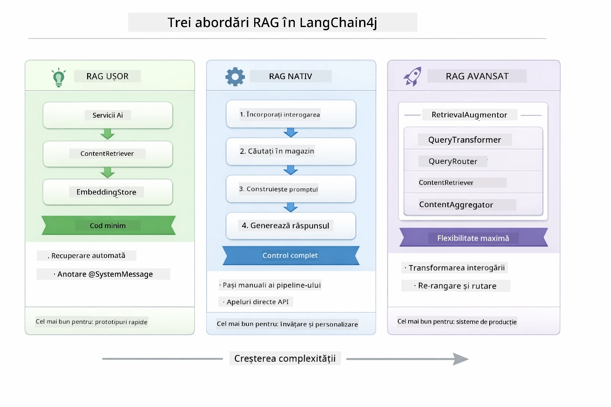
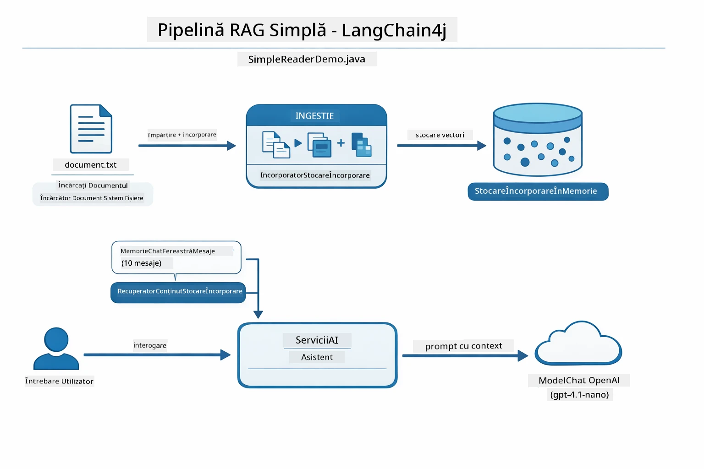
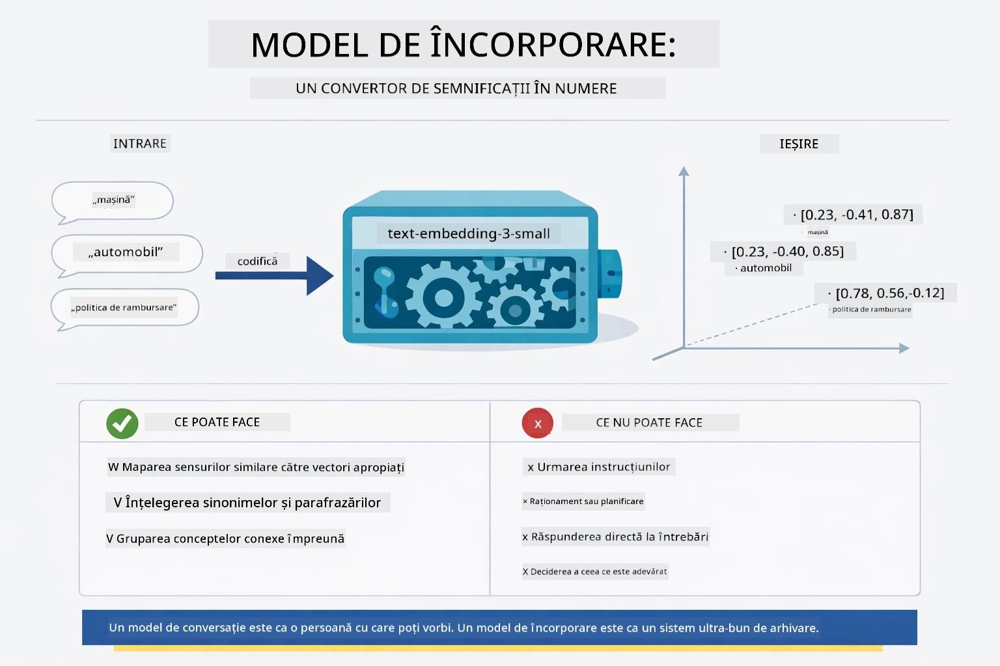
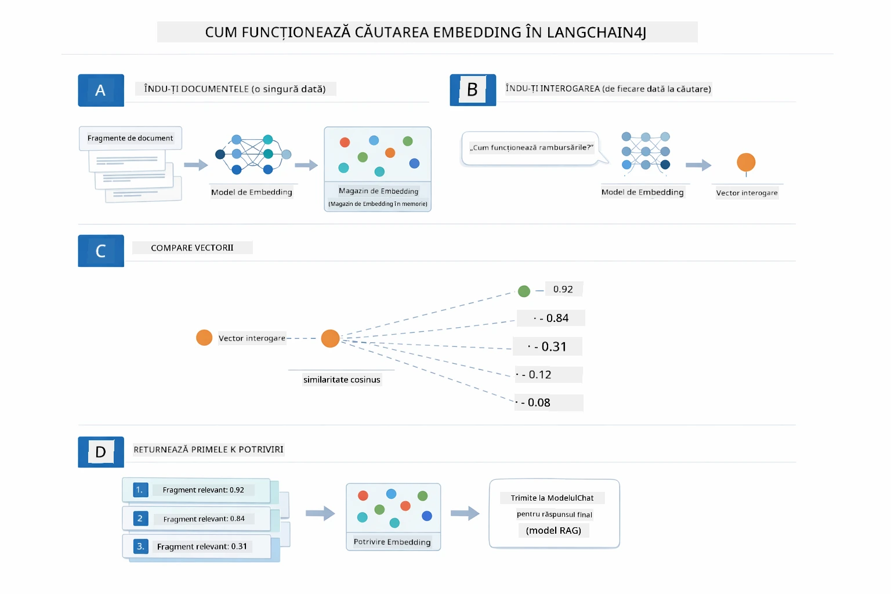
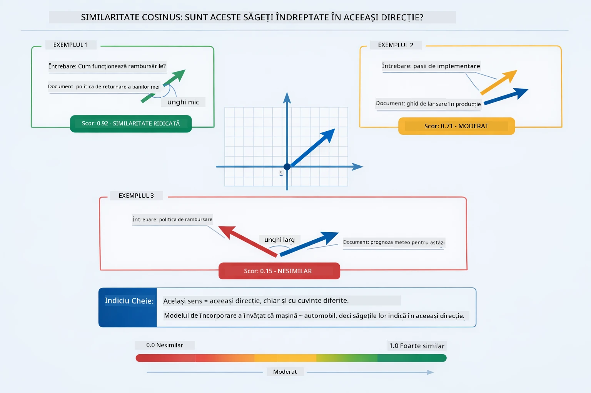
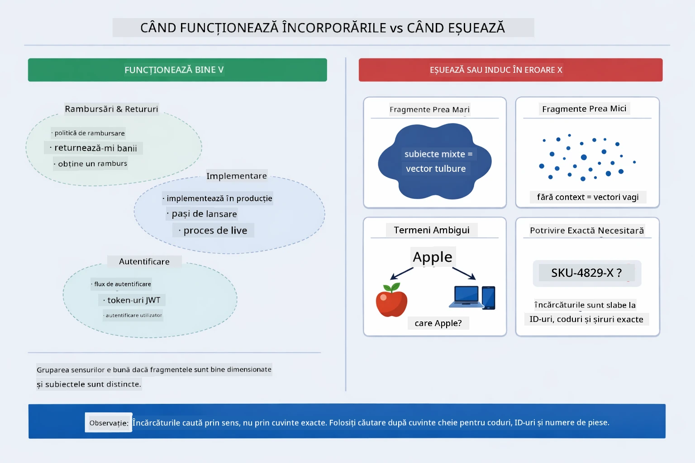

# Modul 03: RAG (Generare îmbunătățită prin căutare)

## Cuprins

- [Parcurgere video](../../../03-rag)
- [Ce vei învăța](../../../03-rag)
- [Prerechizite](../../../03-rag)
- [Înțelegerea RAG](../../../03-rag)
  - [Ce abordare RAG folosește acest tutorial?](../../../03-rag)
- [Cum funcționează](../../../03-rag)
  - [Procesarea documentelor](../../../03-rag)
  - [Crearea embedding-urilor](../../../03-rag)
  - [Căutare semantică](../../../03-rag)
  - [Generarea răspunsului](../../../03-rag)
- [Rulează aplicația](../../../03-rag)
- [Folosirea aplicației](../../../03-rag)
  - [Încarcă un document](../../../03-rag)
  - [Pune întrebări](../../../03-rag)
  - [Verifică referințele sursă](../../../03-rag)
  - [Experimentează cu întrebările](../../../03-rag)
- [Concepte cheie](../../../03-rag)
  - [Strategia de fragmentare](../../../03-rag)
  - [Scoruri de similaritate](../../../03-rag)
  - [Stocare în memorie](../../../03-rag)
  - [Gestionarea ferestrei de context](../../../03-rag)
- [Când contează RAG](../../../03-rag)
- [Următorii pași](../../../03-rag)

## Parcurgere video

Urmărește această sesiune live care explică cum să începi cu acest modul:

<a href="https://www.youtube.com/watch?v=_olq75ZH_eY"></a>

## Ce vei învăța

În modulele anterioare, ai învățat cum să porți conversații cu AI-ul și să-ți structurezi prompturile eficient. Dar există o limitare fundamentală: modelele de limbaj știu doar ce au învățat în timpul antrenamentului. Nu pot răspunde la întrebări despre politicile companiei tale, documentația proiectului sau orice informație pe care nu au fost antrenate să o cunoască.

RAG (Generare îmbunătățită prin căutare) rezolvă această problemă. În loc să încerci să înveți modelul despre informațiile tale (ceea ce este costisitor și impractic), îi dai abilitatea de a căuta prin documentele tale. Când cineva pune o întrebare, sistemul găsește informații relevante și le include în prompt. Modelul apoi răspunde bazându-se pe acest context obținut.

Gândește-te la RAG ca la oferirea modelului unei biblioteci de referință. Când pui o întrebare, sistemul:

1. **Interogare utilizator** - Pui o întrebare  
2. **Embedding** - Transformă întrebarea ta într-un vector  
3. **Căutare vectorială** - Găsește fragmente document relevante similare  
4. **Asamblarea contextului** - Adaugă fragmente relevante în prompt  
5. **Răspuns** - LLM generează un răspuns bazat pe context  

Aceasta fundamentează răspunsurile modelului în datele tale reale în loc să se bazeze pe cunoștințele din antrenament sau să inventeze răspunsuri.

## Prerechizite

- Completat [Modulul 00 - Start rapid](../00-quick-start/README.md) (pentru exemplul Easy RAG menționat anterior)  
- Completat [Modulul 01 - Introducere](../01-introduction/README.md) (resurse Azure OpenAI implementate, inclusiv modelul de embedding `text-embedding-3-small`)  
- Fișier `.env` în directorul rădăcină cu acreditările Azure (creat prin `azd up` în Modulul 01)  

> **Notă:** Dacă nu ai completat Modulul 01, urmează mai întâi instrucțiunile de implementare de acolo. Comanda `azd up` implementează atât modelul GPT chat, cât și modelul de embedding folosit în acest modul.

## Înțelegerea RAG

Diagrama de mai jos ilustrează conceptul de bază: în loc să se bazeze doar pe datele de antrenament ale modelului, RAG îi oferă o bibliotecă de referință cu documentele tale pe care le poate consulta înainte de a genera fiecare răspuns.


*Această diagramă arată diferența dintre un LLM standard (care ghicește din datele de antrenament) și un LLM îmbunătățit cu RAG (care consultă mai întâi documentele tale).*

Iată cum se conectează componentele de la un capăt la altul. Întrebarea unui utilizator trece prin patru etape — embedding, căutare vectorială, asamblarea contextului și generarea răspunsului — fiecare pe baza celei precedente:


*Această diagramă arată fluxul complet RAG — o interogare a utilizatorului trece prin embedding, căutare vectorială, asamblarea contextului și generarea răspunsului.*

Restul acestui modul detaliază fiecare etapă, cu cod pe care îl poți rula și modifica.

### Ce abordare RAG folosește acest tutorial?

LangChain4j oferă trei modalități de a implementa RAG, fiecare cu un nivel diferit de abstractizare. Diagrama de mai jos le compară alăturat:



*Această diagramă compară cele trei abordări RAG în LangChain4j — Easy, Native și Advanced — arătând componentele cheie și când să folosești fiecare.*

| Abordare | Ce face | Compromis |
|---|---|---|
| **Easy RAG** | Leagă automat tot prin `AiServices` și `ContentRetriever`. Marchezi o interfață, atașezi un retriever și LangChain4j se ocupă de embedding, căutare și asamblarea promptului în fundal. | Minim de cod, dar nu vezi ce se întâmplă la fiecare pas. |
| **Native RAG** | Tu apelezi modelul de embedding, cauți în stocare, construiești promptul și generezi răspunsul — câte un pas explicit pe rând. | Mai mult cod, dar fiecare etapă este vizibilă și modificabilă. |
| **Advanced RAG** | Folosește framework-ul `RetrievalAugmentor` cu transformatoare de interogare plugabile, rutere, re-rankere și injectoare de conținut pentru fluxuri de lucru de nivel producție. | Flexibilitate maximă, dar complexitate mult mai mare. |

**Acest tutorial folosește abordarea Native.** Fiecare pas al fluxului RAG — embedding-ul interogării, căutarea în vector store, asamblarea contextului și generarea răspunsului — este scris explicit în [`RagService.java`](../../../03-rag/src/main/java/com/example/langchain4j/rag/service/RagService.java). Acest lucru e intenționat: ca resursă de învățare, este mai important să vezi și să înțelegi fiecare etapă decât ca codul să fie minimal. Odată ce te simți confortabil cu legătura pieselor, poți trece la Easy RAG pentru prototipuri rapide sau Advanced RAG pentru sisteme de producție.

> **💡 Ai văzut deja Easy RAG în acțiune?** Modulul [Start rapid](../00-quick-start/README.md) include un exemplu Document Q&A ([`SimpleReaderDemo.java`](../../../00-quick-start/src/main/java/com/example/langchain4j/quickstart/SimpleReaderDemo.java)) care folosește abordarea Easy RAG — LangChain4j se ocupă automat de embedding, căutare și asamblarea promptului. Acest modul face următorul pas, deschizând fluxul astfel încât să poți vedea și controla fiecare etapă personal.



*Această diagramă arată fluxul Easy RAG din `SimpleReaderDemo.java`. Compară cu abordarea Native folosită în acest modul: Easy RAG ascunde embedding-ul, căutarea și asamblarea promptului în spatele lui `AiServices` și `ContentRetriever` — încarci un document, atașezi un retriever și primești răspunsuri. Abordarea Native din acest modul deschide fluxul astfel încât să apelezi fiecare etapă (embed, search, assemble context, generate) tu însuți, oferind vizibilitate și control complet.*

## Cum funcționează

Fluxul RAG din acest modul se împarte în patru etape rulate în secvență de fiecare dată când un utilizator pune o întrebare. Mai întâi, un document încărcat este **parsat și fragmentat** în bucăți gestionabile. Aceste fragmente sunt apoi convertite în **embedding-uri vectoriale** și stocate pentru a fi comparate matematic. Când sosește o interogare, sistemul efectuează o **căutare semantică** pentru a găsi cele mai relevante fragmente, iar în final le transmite ca context către LLM pentru **generare răspuns**. Secțiunile de mai jos parcurg fiecare etapă cu codul și diagramele asociate. Să vedem primul pas.

### Procesarea documentelor

[DocumentService.java](../../../03-rag/src/main/java/com/example/langchain4j/rag/service/DocumentService.java)

Când încarci un document, sistemul îl parsează (PDF sau text simplu), atașează metadate cum ar fi numele fișierului, apoi îl împarte în fragmente — bucăți mai mici care încap confortabil în fereastra de context a modelului. Aceste fragmente se suprapun ușor pentru a nu pierde context la margini.

```java
// Analizează fișierul încărcat și încapsulează-l într-un Document LangChain4j
Document document = Document.from(content, metadata);

// Împarte în bucăți de 300 de tokeni cu o suprapunere de 30 de tokeni
DocumentSplitter splitter = DocumentSplitters
    .recursive(300, 30);

List<TextSegment> segments = splitter.split(document);
```
  
Diagrama de mai jos arată cum funcționează vizual această fragmentare. Observă cum fiecare fragment împarte câțiva tokeni cu vecinii săi — suprapunerea de 30 de tokeni asigură că nu se pierde context important în spațiul dintre fragmente:


*Această diagramă arată un document împărțit în fragmente de câte 300 de tokeni cu o suprapunere de 30 de tokeni, păstrând contextul la marginile fragmentelor.*

> **🤖 Încearcă cu chat-ul [GitHub Copilot](https://github.com/features/copilot):** Deschide [`DocumentService.java`](../../../03-rag/src/main/java/com/example/langchain4j/rag/service/DocumentService.java) și întreabă:  
> - "Cum împarte LangChain4j documentele în fragmente și de ce este importantă suprapunerea?"  
> - "Care este dimensiunea optimă a fragmentelor pentru diferite tipuri de documente și de ce?"  
> - "Cum gestionez documentele în mai multe limbi sau cu formatare specială?"

### Crearea embedding-urilor

[LangChainRagConfig.java](../../../03-rag/src/main/java/com/example/langchain4j/rag/config/LangChainRagConfig.java)

Fiecare fragment este transformat într-o reprezentare numerică numită embedding — practic un convertor de semnificații în numere. Modelul de embedding nu este "inteligent" precum un model de chat; nu poate urma instrucțiuni, raționa sau răspunde la întrebări. Ce poate face este să mapeze textul într-un spațiu matematic unde sensurile asemănătoare sunt aproape una de cealaltă — "mașină" aproape de "automobil", "politica de rambursare" aproape de "returnează-mi banii". Gândește-te la un model de chat ca la o persoană cu care poți vorbi; un model de embedding este un sistem de arhivare ultra-bun.



*Această diagramă arată cum un model de embedding convertește textul în vectori numerici, plasând sensuri similare — ca „mașină” și „automobil” — aproape unul de altul în spațiul vectorial.*

```java
@Bean
public EmbeddingModel embeddingModel() {
    return OpenAiOfficialEmbeddingModel.builder()
        .baseUrl(azureOpenAiEndpoint)
        .apiKey(azureOpenAiKey)
        .modelName(azureEmbeddingDeploymentName)
        .build();
}

EmbeddingStore<TextSegment> embeddingStore = 
    new InMemoryEmbeddingStore<>();
```
  
Diagrama claselor de mai jos arată cele două fluxuri separate dintr-un pipeline RAG și clasele LangChain4j care le implementează. Fluxul de **încărcare** (rulează o singură dată la încărcare) împarte documentul, embeddează fragmentele și le stochează prin `.addAll()`. Fluxul de **interogare** (rulează de fiecare dată când un utilizator întreabă) embeddează întrebarea, caută în stocare prin `.search()` și transmite contextul găsit modelului de chat. Ambele fluxuri se întâlnesc la interfața comună `EmbeddingStore<TextSegment>`:


*Această diagramă arată cele două fluxuri într-un pipeline RAG — încărcare și interogare — și cum se conectează printr-un EmbeddingStore comun.*

Odată ce embedding-urile sunt stocate, conținutul asemănător se grupează natural în spațiul vectorial. Vizualizarea de mai jos arată cum documentele despre subiecte conexe ajung ca puncte apropiate, iar asta face posibilă căutarea semantică:


*Această vizualizare arată cum documentele conexe formează grupuri în spațiul vectorial 3D, cu subiecte precum Documentații Tehnice, Reguli de Afaceri și FAQ-uri formând grupuri distincte.*

Când un utilizator caută, sistemul urmează patru pași: embeddează documentele o dată, embeddează întrebarea la fiecare căutare, compară vectorul întrebării cu toate vectorurile stocate folosind similaritatea cosinus, și returnează cele mai bune fragmente (top-K). Diagrama de mai jos parcurge fiecare pas și clasele LangChain4j implicate:



*Această diagramă arată procesul în patru pași al căutării embedding: embeddează documentele, embeddează interogarea, compară vectorii cu similaritate cosinus și returnează cele mai bune rezultate (top-K).*

### Căutare semantică

[RagService.java](../../../03-rag/src/main/java/com/example/langchain4j/rag/service/RagService.java)

Când pui o întrebare, și întrebarea ta devine un embedding. Sistemul compară embedding-ul întrebării tale cu embedding-urile tuturor fragmentelor documentului. Găsește fragmentele cu cele mai similare sensuri — nu doar cuvintele cheie potrivite, ci asemănarea semantică reală.

```java
Embedding queryEmbedding = embeddingModel.embed(question).content();

EmbeddingSearchRequest searchRequest = EmbeddingSearchRequest.builder()
    .queryEmbedding(queryEmbedding)
    .maxResults(5)
    .minScore(0.5)
    .build();

EmbeddingSearchResult<TextSegment> searchResult = embeddingStore.search(searchRequest);
List<EmbeddingMatch<TextSegment>> matches = searchResult.matches();

for (EmbeddingMatch<TextSegment> match : matches) {
    String relevantText = match.embedded().text();
    double score = match.score();
}
```
  
Diagrama de mai jos compară căutarea semantică cu căutarea tradițională pe cuvinte cheie. O căutare după cuvântul „vehicul” ratează un fragment despre „mașini și camioane”, dar căutarea semantică înțelege că au același sens și îl returnează ca potrivire de top:


*Această diagramă compară căutarea bazată pe cuvinte cheie cu căutarea semantică, arătând cum căutarea semantică returnează conținut conceptually legat chiar dacă cuvintele exacte diferă.*

În interior, similaritatea este măsurată prin similaritatea cosinusului — practic întrebând „arată acești doi vectori în aceeași direcție?” Două fragmente pot folosi cuvinte complet diferite, dar dacă au același sens vectorii indică în aceași direcție și au scor aproape de 1.0:


*Acest diagramă ilustrează similaritatea cosinusului ca un unghi între vectorii de embeddings — vectorii mai aliniați obțin un scor mai apropiat de 1.0, indicând o similaritate semantică mai mare.*

> **🤖 Încearcă cu [GitHub Copilot](https://github.com/features/copilot) Chat:** Deschide [`RagService.java`](../../../03-rag/src/main/java/com/example/langchain4j/rag/service/RagService.java) și întreabă:
> - "Cum funcționează căutarea similarității cu embeddings și ce determină scorul?"
> - "Ce prag de similaritate ar trebui să folosesc și cum afectează rezultatele?"
> - "Cum gestionez cazurile în care nu se găsesc documente relevante?"

### Generarea răspunsului

[RagService.java](../../../03-rag/src/main/java/com/example/langchain4j/rag/service/RagService.java)

Cele mai relevante fragmente sunt asamblate într-un prompt structurat care include instrucțiuni explicite, contextul recuperat și întrebarea utilizatorului. Modelul citește acele fragmente specifice și răspunde pe baza acelei informații — poate folosi doar ce are în față, ceea ce previne halucinația.

```java
String context = matches.stream()
    .map(match -> match.embedded().text())
    .collect(Collectors.joining("\n\n"));

String prompt = String.format("""
    Answer the question based on the following context.
    If the answer cannot be found in the context, say so.

    Context:
    %s

    Question: %s

    Answer:""", context, request.question());

String answer = chatModel.chat(prompt);
```
  
Diagrama de mai jos arată această asamblare în acțiune — fragmentele cu cel mai mare scor din pasul de căutare sunt injectate în șablonul promptului, iar `OpenAiOfficialChatModel` generează un răspuns fundamentat:


*Această diagramă arată cum fragmentele cu cel mai mare scor sunt asamblate într-un prompt structurat, permițând modelului să genereze un răspuns fundamentat din datele tale.*

## Rulează aplicația

**Verifică implementarea:**

Asigură-te că fișierul `.env` există în directorul rădăcină cu credențiale Azure (creat în Modulul 01):

**Bash:**  
```bash
cat ../.env  # Ar trebui să afișeze AZURE_OPENAI_ENDPOINT, API_KEY, DEPLOYMENT
```
  
**PowerShell:**  
```powershell
Get-Content ..\.env  # Ar trebui să afișeze AZURE_OPENAI_ENDPOINT, API_KEY, DEPLOYMENT
```
  
**Pornește aplicația:**

> **Notă:** Dacă ai pornit deja toate aplicațiile folosind `./start-all.sh` din Modulul 01, acest modul rulează deja pe portul 8081. Poți sări peste comenzile de pornire de mai jos și să accesezi direct http://localhost:8081.

**Opțiunea 1: Folosind Spring Boot Dashboard (Recomandat pentru utilizatorii VS Code)**

Containerul de dezvoltare include extensia Spring Boot Dashboard, care oferă o interfață vizuală pentru gestionarea tuturor aplicațiilor Spring Boot. O poți găsi în bara de activități din partea stângă a VS Code (caută iconița Spring Boot).

Din Spring Boot Dashboard poți:
- Vedeta toate aplicațiile Spring Boot disponibile în workspace
- Porni/opri aplicațiile cu un singur click
- Vizualiza logurile aplicațiilor în timp real
- Monitoriza starea aplicației

Pur și simplu apasă butonul de play de lângă "rag" pentru a porni acest modul, sau pornește toate modulele simultan.


*Această captură de ecran arată Spring Boot Dashboard în VS Code, unde poți porni, opri și monitoriza aplicațiile vizual.*

**Opțiunea 2: Folosind scripturi shell**

Pornește toate aplicațiile web (modulele 01-04):

**Bash:**  
```bash
cd ..  # Din directorul rădăcină
./start-all.sh
```
  
**PowerShell:**  
```powershell
cd ..  # Din directorul rădăcină
.\start-all.ps1
```
  
Sau pornește doar acest modul:

**Bash:**  
```bash
cd 03-rag
./start.sh
```
  
**PowerShell:**  
```powershell
cd 03-rag
.\start.ps1
```
  
Ambele scripturi încarcă automat variabilele de mediu din fișierul `.env` din rădăcină și vor construi JAR-urile dacă nu există.

> **Notă:** Dacă preferi să construiești manual toate modulele înainte de pornire:
>
> **Bash:**  
> ```bash
> cd ..  # Go to root directory
> mvn clean package -DskipTests
> ```
  
> **PowerShell:**  
> ```powershell
> cd ..  # Go to root directory
> mvn clean package -DskipTests
> ```
  
Deschide http://localhost:8081 în browser.

**Pentru oprire:**

**Bash:**  
```bash
./stop.sh  # Numai acest modul
# Sau
cd .. && ./stop-all.sh  # Toate modulele
```
  
**PowerShell:**  
```powershell
.\stop.ps1  # Numai acest modul
# Sau
cd ..; .\stop-all.ps1  # Toate modulele
```
  
## Utilizarea aplicației

Aplicația oferă o interfață web pentru încărcarea documentelor și adresarea întrebărilor.

<a href="images/rag-homepage.png"></a>

*Această captură arată interfața aplicației RAG unde încarci documente și pui întrebări.*

### Încarcă un document

Începe prin a încărca un document - fișierele TXT sunt cele mai bune pentru testare. În acest director este disponibil un `sample-document.txt` care conține informații despre caracteristicile LangChain4j, implementarea RAG și bune practici - perfect pentru a testa sistemul.

Sistemul procesează documentul tău, îl împarte în fragmente și creează embeddings pentru fiecare fragment. Acest lucru se întâmplă automat când încarci.

### Pune întrebări

Acum pune întrebări specifice despre conținutul documentului. Încearcă ceva factual care este clar menționat în document. Sistemul caută fragmente relevante, le include în prompt și generează un răspuns.

### Verifică referințele sursei

Observă că fiecare răspuns include referințe sursă cu scoruri de similaritate. Aceste scoruri (0 până la 1) arată cât de relevante au fost fragmentele pentru întrebarea ta. Scoruri mai mari înseamnă potriviri mai bune. Astfel poți verifica răspunsul față de materialul sursă.

<a href="images/rag-query-results.png"></a>

*Această captură arată rezultatele interogării cu răspunsul generat, referințele sursă și scorurile de relevanță pentru fiecare fragment recuperat.*

### Experimentează cu întrebări

Încearcă diferite tipuri de întrebări:
- Fapte specifice: "Care este subiectul principal?"
- Comparații: "Care este diferența dintre X și Y?"
- Rezumate: "Rezumați punctele cheie despre Z"

Urmărește cum se schimbă scorurile de relevanță în funcție de cât de bine întrebarea ta se potrivește cu conținutul documentului.

## Concepte cheie

### Strategia de fragmentare

Documentele sunt împărțite în fragmente de 300 de tokeni cu o suprapunere de 30 tokeni. Această balanță asigură că fiecare fragment are suficient context pentru a fi semnificativ, menținându-l suficient de mic pentru a include mai multe fragmente într-un prompt.

### Scorurile de similaritate

Fiecare fragment recuperat vine cu un scor de similaritate între 0 și 1 care indică cât de apropiat este de întrebarea utilizatorului. Diagrama de mai jos vizualizează intervalele scorurilor și modul în care sistemul le folosește pentru a filtra rezultatele:


*Această diagramă arată intervalele scorurilor de la 0 la 1, cu un prag minim de 0.5 care filtrează fragmentele irelevante.*

Scorurile variază între 0 și 1:  
- 0.7-1.0: Foarte relevante, potrivire exactă  
- 0.5-0.7: Relevante, context bun  
- Sub 0.5: Filtrate, prea diferite  

Sistemul recuperează doar fragmentele peste pragul minim pentru a asigura calitatea.

Embeddings funcționează bine când sensul este bine grupat, dar au puncte oarbe. Diagrama de mai jos arată modurile comune de eșec — fragmente prea mari produc vectori neclari, fragmente prea mici lipsesc de context, termeni ambigui indică mai multe grupuri, iar căutările exacte (ID-uri, numere piese) nu funcționează deloc cu embeddings:



*Această diagramă arată modurile comune de eșec ale embeddings: fragmente prea mari, prea mici, termeni ambigui care indică mai multe grupuri și căutări exacte precum ID-uri.*

### Stocarea în memorie

Acest modul folosește stocare în memorie pentru simplitate. Când repornești aplicația, documentele încărcate se pierd. Sistemele de producție folosesc baze de date vectoriale persistente precum Qdrant sau Azure AI Search.

### Gestionarea ferestrei de context

Fiecare model are o fereastră maximă de context. Nu poți include toate fragmentele dintr-un document mare. Sistemul recuperează cele mai relevante N fragmente (implicit 5) pentru a rămâne în limite și a asigura suficient context pentru răspunsuri exacte.

## Când contează RAG

RAG nu este întotdeauna abordarea potrivită. Ghidul decizional de mai jos te ajută să determini când RAG adaugă valoare versus când abordări mai simple — precum includerea conținutului direct în prompt sau folosirea cunoștințelor încorporate ale modelului — sunt suficiente:


*Această diagramă arată un ghid decizional pentru când RAG adaugă valoare versus când abordările mai simple sunt suficiente.*

**Folosește RAG când:**  
- Răspunzi la întrebări despre documente proprietare  
- Informațiile se schimbă frecvent (politici, prețuri, specificații)  
- Precizia necesită atribuirea sursei  
- Conținutul este prea mare pentru un singur prompt  
- Ai nevoie de răspunsuri verificabile, fundamentate  

**Nu folosi RAG când:**  
- Întrebările cer cunoștințe generale pe care modelul le are deja  
- Ai nevoie de date în timp real (RAG funcționează pe documente încărcate)  
- Conținutul este suficient de mic să fie inclus direct în prompturi  

## Pași următori

**Următorul modul:** [04-tools - Agenți AI cu unelte](../04-tools/README.md)

---

**Navigare:** [← Anterior: Modul 02 - Prompt Engineering](../02-prompt-engineering/README.md) | [Înapoi la Principal](../README.md) | [Următor: Modul 04 - Tools →](../04-tools/README.md)

---

<!-- CO-OP TRANSLATOR DISCLAIMER START -->
**Declinare de responsabilitate**:  
Acest document a fost tradus folosind serviciul de traducere automată AI [Co-op Translator](https://github.com/Azure/co-op-translator). Deși ne străduim să asigurăm acuratețea, vă rugăm să țineți cont că traducerile automate pot conține erori sau inexactități. Documentul original în limba sa nativă trebuie considerat sursa autoritară. Pentru informații critice, se recomandă traducerea profesională realizată de un specialist. Nu ne asumăm răspunderea pentru eventualele neînțelegeri sau interpretări greșite care pot apărea ca urmare a utilizării acestei traduceri.
<!-- CO-OP TRANSLATOR DISCLAIMER END -->