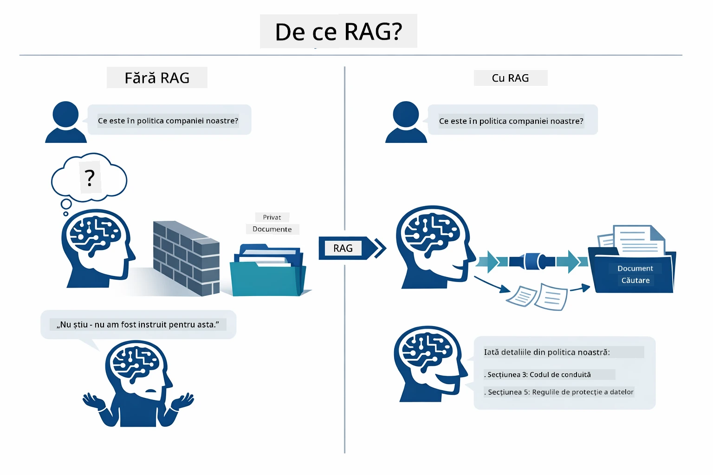
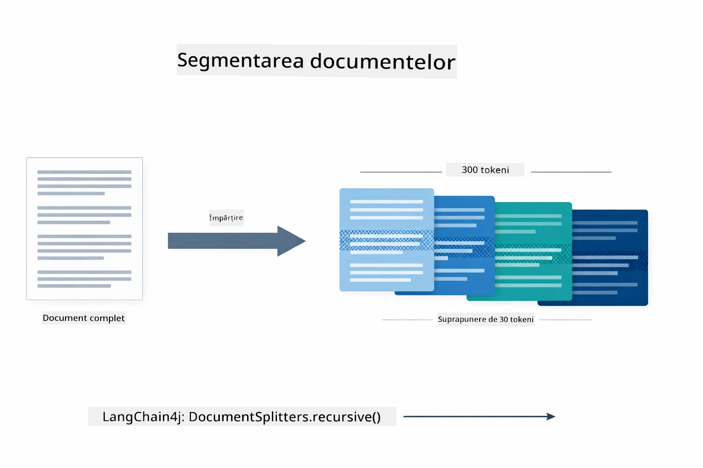
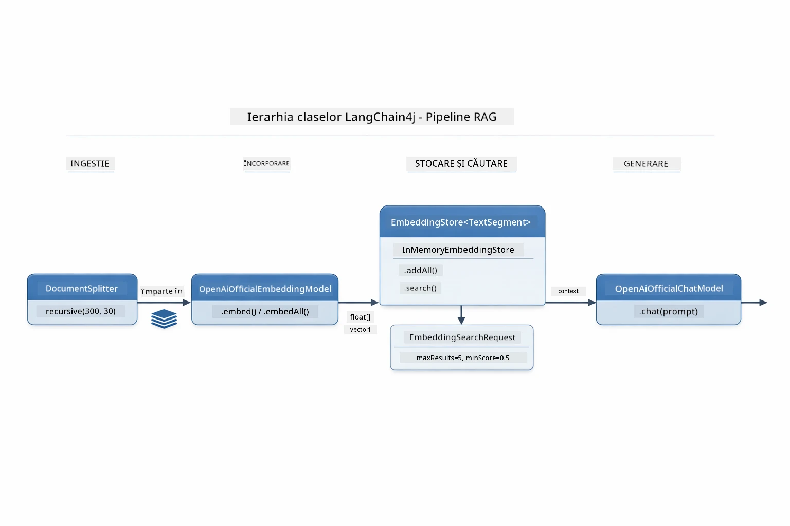
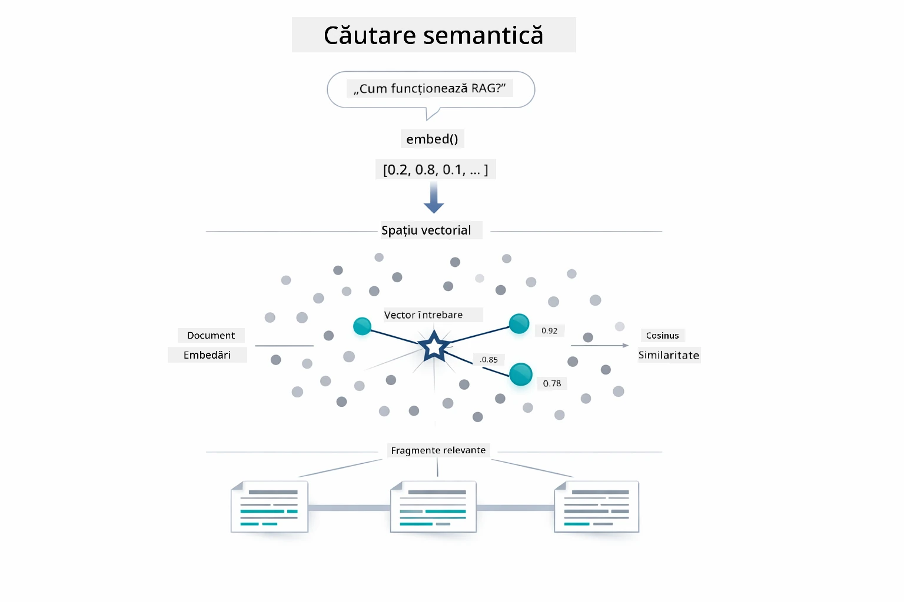
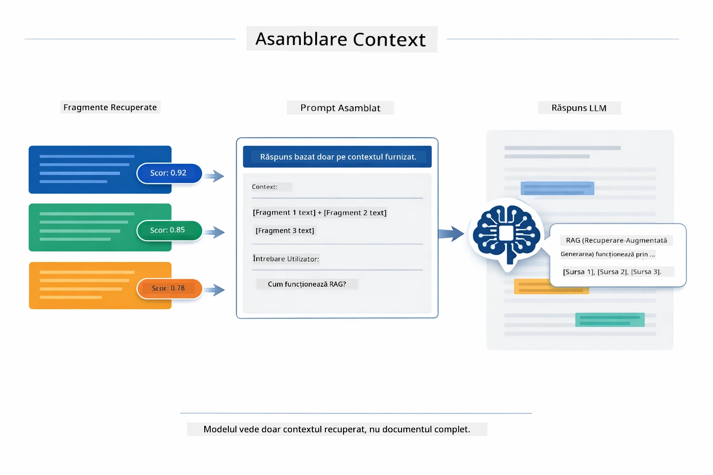
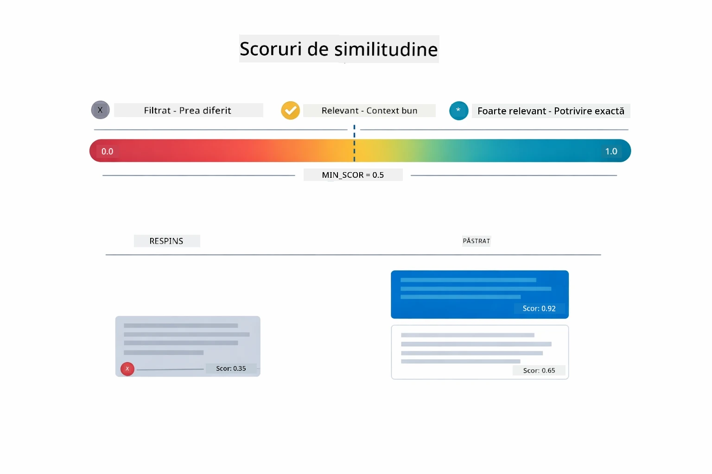
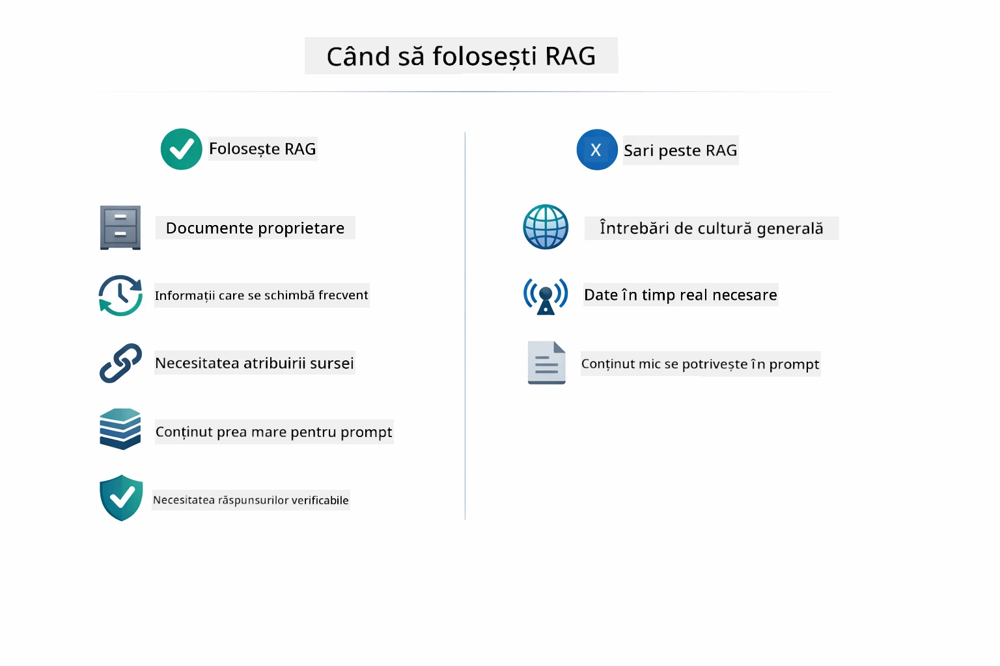

# Module 03: RAG (Generare augmentată prin recuperare)

## Cuprins

- [Ce vei învăța](../../../03-rag)
- [Înțelegerea RAG](../../../03-rag)
- [Prerechizite](../../../03-rag)
- [Cum funcționează](../../../03-rag)
  - [Procesarea documentelor](../../../03-rag)
  - [Crearea embedding-urilor](../../../03-rag)
  - [Căutare semantică](../../../03-rag)
  - [Generarea răspunsurilor](../../../03-rag)
- [Rulează aplicația](../../../03-rag)
- [Utilizarea aplicației](../../../03-rag)
  - [Încarcă un document](../../../03-rag)
  - [Pune întrebări](../../../03-rag)
  - [Verifică referințele sursă](../../../03-rag)
  - [Experimentează cu întrebările](../../../03-rag)
- [Concepte cheie](../../../03-rag)
  - [Strategia de divizare în bucăți](../../../03-rag)
  - [Scoruri de similitudine](../../../03-rag)
  - [Stocare în memorie](../../../03-rag)
  - [Gestionarea ferestrei de context](../../../03-rag)
- [Când contează RAG](../../../03-rag)
- [Pașii următori](../../../03-rag)

## Ce vei învăța

În modulele anterioare, ai învățat cum să ai conversații cu AI și cum să-ți structurezi prompturile eficient. Dar există o limitare fundamentală: modelele de limbaj cunosc doar ceea ce au învățat în timpul antrenamentului. Nu pot răspunde la întrebări despre politicile companiei tale, documentația proiectului tău sau orice informație pe care nu au fost antrenate să o cunoască.

RAG (Generare augmentată prin recuperare) rezolvă această problemă. În loc să încerci să înveți modelul cu informațiile tale (ceea ce este costisitor și nepractic), îi oferi abilitatea de a căuta prin documentele tale. Când cineva pune o întrebare, sistemul găsește informațiile relevante și le include în prompt. Modelul răspunde apoi pe baza contextului obținut.

Gândește-te la RAG ca la oferirea modelului unei biblioteci de referință. Când pui o întrebare, sistemul:

1. **Interogarea utilizatorului** - pui o întrebare  
2. **Embedding** - convertește întrebarea ta într-un vector  
3. **Căutare vectorială** - găsește bucăți de documente similare  
4. **Asamblarea contextului** - adaugă bucățile relevante în prompt  
5. **Răspuns** - LLM generează un răspuns bazat pe context  

Acest lucru face ca răspunsurile modelului să se bazeze pe datele tale reale, în loc să se bazeze pe cunoștințele din antrenament sau să inventeze răspunsuri.

## Înțelegerea RAG

Diagrama de mai jos ilustrează conceptul de bază: în loc să se bazeze doar pe datele din antrenament ale modelului, RAG îi oferă o bibliotecă de referință cu documentele tale pentru a consulta înainte de a genera fiecare răspuns.



Iată cum se conectează elementele de la un capăt la altul. Întrebarea utilizatorului trece prin patru etape — embedding, căutare vectorială, asamblarea contextului și generarea răspunsului — fiecare bazându-se pe precedenta:


Restul acestui modul parcurge fiecare etapă în detaliu, cu cod pe care îl poți rula și modifica.

## Prerechizite

- Modulul 01 finalizat (resurse Azure OpenAI implementate)  
- Fișier `.env` în directorul rădăcină cu credențiale Azure (creat de `azd up` în Modulul 01)  

> **Notă:** Dacă nu ai finalizat Modulul 01, urmează mai întâi instrucțiunile de implementare de acolo.

## Cum funcționează

### Procesarea documentelor

[DocumentService.java](../../../03-rag/src/main/java/com/example/langchain4j/rag/service/DocumentService.java)

Când încarci un document, sistemul îl analizează (PDF sau text simplu), atașează metadate precum numele fișierului și apoi îl împarte în bucăți — părți mai mici care se potrivesc confortabil în fereastra de context a modelului. Aceste bucăți se suprapun ușor pentru a nu pierde context la limite.

```java
// Analizează fișierul încărcat și înfășoară-l într-un Document LangChain4j
Document document = Document.from(content, metadata);

// împarte în fragmente de 300 de tokeni cu o suprapunere de 30 de tokeni
DocumentSplitter splitter = DocumentSplitters
    .recursive(300, 30);

List<TextSegment> segments = splitter.split(document);
```
  
Diagrama de mai jos arată vizual cum funcționează. Observă cum fiecare bucată împărtășește câțiva tokeni cu vecinii ei — suprapunerea de 30 de tokeni asigură că nu se pierde niciun context important între bucăți:



> **🤖 Încearcă cu [GitHub Copilot](https://github.com/features/copilot) Chat:** Deschide [`DocumentService.java`](../../../03-rag/src/main/java/com/example/langchain4j/rag/service/DocumentService.java) și întreabă:  
> - „Cum împarte LangChain4j documentele în bucăți și de ce este importantă suprapunerea?”  
> - „Care este dimensiunea optimă a bucății pentru diferite tipuri de documente și de ce?”  
> - „Cum gestionez documentele în mai multe limbi sau cu formatări speciale?”

### Crearea embedding-urilor

[LangChainRagConfig.java](../../../03-rag/src/main/java/com/example/langchain4j/rag/config/LangChainRagConfig.java)

Fiecare bucată este transformată într-o reprezentare numerică numită embedding - practic o amprentă matematică care surprinde sensul textului. Texte similare produc embedding-uri similare.

```java
@Bean
public EmbeddingModel embeddingModel() {
    return OpenAiOfficialEmbeddingModel.builder()
        .baseUrl(azureOpenAiEndpoint)
        .apiKey(azureOpenAiKey)
        .modelName(azureEmbeddingDeploymentName)
        .build();
}

EmbeddingStore<TextSegment> embeddingStore = 
    new InMemoryEmbeddingStore<>();
```
  
Diagrama claselor de mai jos arată cum se leagă aceste componente LangChain4j. `OpenAiOfficialEmbeddingModel` convertește textul în vectori, `InMemoryEmbeddingStore` păstrează vectorii alături de datele originale `TextSegment`, iar `EmbeddingSearchRequest` controlează parametrii de recuperare, cum ar fi `maxResults` și `minScore`:



Odată ce embedding-urile sunt stocate, conținutul similar se grupează natural în spațiul vectorial. Vizualizarea de mai jos arată cum documentele despre subiecte conexe se termină ca puncte apropiate, ceea ce face posibilă căutarea semantică:


### Căutare semantică

[RagService.java](../../../03-rag/src/main/java/com/example/langchain4j/rag/service/RagService.java)

Când pui o întrebare, întrebarea ta devine și ea un embedding. Sistemul compară embedding-ul întrebării tale cu toate embedding-urile bucăților de documente. Găsește bucățile cu cele mai asemănătoare sensuri — nu doar cele care conțin cuvinte cheie, ci asemănare semantică reală.

```java
Embedding queryEmbedding = embeddingModel.embed(question).content();

EmbeddingSearchRequest searchRequest = EmbeddingSearchRequest.builder()
    .queryEmbedding(queryEmbedding)
    .maxResults(5)
    .minScore(0.5)
    .build();

EmbeddingSearchResult<TextSegment> searchResult = embeddingStore.search(searchRequest);
List<EmbeddingMatch<TextSegment>> matches = searchResult.matches();

for (EmbeddingMatch<TextSegment> match : matches) {
    String relevantText = match.embedded().text();
    double score = match.score();
}
```
  
Diagrama de mai jos compară căutarea semantică cu căutarea tradițională pe baza cuvintelor cheie. O căutare cuvânt-cheie pentru „vehicul” ratează o bucată despre „mașini și camioane”, dar căutarea semantică înțelege că înseamnă același lucru și o returnează ca potrivire cu scor ridicat:



> **🤖 Încearcă cu [GitHub Copilot](https://github.com/features/copilot) Chat:** Deschide [`RagService.java`](../../../03-rag/src/main/java/com/example/langchain4j/rag/service/RagService.java) și întreabă:  
> - „Cum funcționează căutarea după similitudine cu embedding-uri și ce determină scorul?”  
> - „Ce prag de similitudine ar trebui să folosesc și cum afectează rezultatele?”  
> - „Cum gestionez cazurile când nu se găsesc documente relevante?”

### Generarea răspunsurilor

[RagService.java](../../../03-rag/src/main/java/com/example/langchain4j/rag/service/RagService.java)

Cele mai relevante bucăți sunt asamblate într-un prompt structurat care include instrucțiuni explicite, contextul recuperat și întrebarea utilizatorului. Modelul citește acele bucăți specifice și răspunde pe baza acelor informații — poate folosi doar ce are în față, ceea ce previne halucinațiile.

```java
String context = matches.stream()
    .map(match -> match.embedded().text())
    .collect(Collectors.joining("\n\n"));

String prompt = String.format("""
    Answer the question based on the following context.
    If the answer cannot be found in the context, say so.

    Context:
    %s

    Question: %s

    Answer:""", context, request.question());

String answer = chatModel.chat(prompt);
```
  
Diagrama de mai jos arată această asamblare în acțiune — bucățile cu cel mai mare scor din pasul de căutare sunt injectate în șablonul promptului, iar `OpenAiOfficialChatModel` generează un răspuns fundamentat:



## Rulează aplicația

**Verifică implementarea:**

Asigură-te că fișierul `.env` există în directorul rădăcină cu credențiale Azure (creat în timpul Modulului 01):  
```bash
cat ../.env  # Ar trebui să afișeze AZURE_OPENAI_ENDPOINT, API_KEY, DEPLOYMENT
```
  
**Pornește aplicația:**

> **Notă:** Dacă ai pornit deja toate aplicațiile utilizând `./start-all.sh` din Modulul 01, acest modul rulează deja pe portul 8081. Poți sări peste comenzile de start de mai jos și să mergi direct la http://localhost:8081.

**Opțiunea 1: Folosind Spring Boot Dashboard (recomandat pentru utilizatorii VS Code)**

Containerul de dezvoltare include extensia Spring Boot Dashboard, care oferă o interfață vizuală pentru a gestiona toate aplicațiile Spring Boot. O găsești în bara de activitate din partea stângă a VS Code (caută iconița Spring Boot).

Din Spring Boot Dashboard poți:  
- Vedea toate aplicațiile Spring Boot disponibile în workspace  
- Porni/opri aplicații cu un singur clic  
- Vizualiza jurnalele aplicațiilor în timp real  
- Monitoriza starea aplicațiilor

Dă clic pe butonul de play lângă „rag” pentru a porni acest modul sau pornește toate modulele simultan.


**Opțiunea 2: Folosind scripturi shell**

Pornește toate aplicațiile web (modulele 01-04):

**Bash:**  
```bash
cd ..  # Din directorul rădăcină
./start-all.sh
```
  
**PowerShell:**  
```powershell
cd ..  # Din directorul rădăcină
.\start-all.ps1
```
  
Sau pornește doar acest modul:

**Bash:**  
```bash
cd 03-rag
./start.sh
```
  
**PowerShell:**  
```powershell
cd 03-rag
.\start.ps1
```
  
Ambele scripturi încarcă automat variabilele de mediu din fișierul `.env` din rădăcină și construiesc JAR-urile dacă nu există.

> **Notă:** Dacă preferi să construiești manual toate modulele înainte de a porni:  
>
> **Bash:**  
> ```bash
> cd ..  # Go to root directory
> mvn clean package -DskipTests
> ```
  
> **PowerShell:**  
> ```powershell
> cd ..  # Go to root directory
> mvn clean package -DskipTests
> ```
  
Deschide http://localhost:8081 în browserul tău.

**Pentru a opri:**

**Bash:**  
```bash
./stop.sh  # Numai acest modul
# Sau
cd .. && ./stop-all.sh  # Toate modulele
```
  
**PowerShell:**  
```powershell
.\stop.ps1  # Doar acest modul
# Sau
cd ..; .\stop-all.ps1  # Toate modulele
```


## Utilizarea aplicației

Aplicația oferă o interfață web pentru încărcarea documentelor și adresarea întrebărilor.

<a href="images/rag-homepage.png"></a>

*Interfața aplicației RAG - încarcă documente și pune întrebări*

### Încarcă un document

Începe prin a încărca un document - fișierele TXT sunt cele mai bune pentru testare. Un `sample-document.txt` este oferit în acest director care conține informații despre funcționalitățile LangChain4j, implementarea RAG și bune practici - perfect pentru testarea sistemului.

Sistemul procesează documentul tău, îl împarte în bucăți și creează embedding-uri pentru fiecare bucată. Aceasta se întâmplă automat când încarci.

### Pune întrebări

Acum pune întrebări specifice despre conținutul documentului. Încearcă ceva factual care este clar menționat în document. Sistemul caută bucățile relevante, le include în prompt și generează un răspuns.

### Verifică referințele sursă

Observă că fiecare răspuns include referințe sursă cu scoruri de similitudine. Aceste scoruri (de la 0 la 1) arată cât de relevantă a fost fiecare bucată pentru întrebarea ta. Scoruri mai mari înseamnă potriviri mai bune. Acest lucru îți permite să verifici răspunsul față de materialul sursă.

<a href="images/rag-query-results.png"></a>

*Rezultatele interogării arătând răspunsul cu referințe sursă și scoruri de relevanță*

### Experimentează cu întrebările

Încearcă diferite tipuri de întrebări:  
- Fapte specifice: „Care este subiectul principal?”  
- Comparații: „Care este diferența dintre X și Y?”  
- Rezumate: „Rezumați punctele cheie despre Z”

Urmărește cum scorurile de relevanță se schimbă în funcție de cât de bine se potrivește întrebarea ta cu conținutul documentului.

## Concepte cheie

### Strategia de divizare în bucăți

Documentele sunt împărțite în bucăți de 300 de tokeni cu o suprapunere de 30 de tokeni. Acest echilibru asigură că fiecare bucată are suficient context pentru a fi semnificativă, rămânând totodată destul de mică pentru a include mai multe bucăți într-un prompt.

### Scoruri de similitudine

Fiecare bucată recuperată vine cu un scor de similitudine între 0 și 1 care indică cât de aproape se potrivește cu întrebarea utilizatorului. Diagrama de mai jos vizualizează intervalele de scor și cum le folosește sistemul pentru a filtra rezultatele:



Scorurile variază de la 0 la 1:  
- 0.7-1.0: Foarte relevant, potrivire exactă  
- 0.5-0.7: Relevant, context bun  
- Sub 0.5: Filtrat, prea disimilare

Sistemul recuperează doar bucățile ce depășesc pragul minim pentru a asigura calitatea.

### Stocare în memorie

Acest modul folosește stocare în memorie pentru simplitate. Când repornești aplicația, documentele încărcate se pierd. Sistemele de producție folosesc baze de date vectoriale persistente precum Qdrant sau Azure AI Search.

### Gestionarea ferestrei de context

Fiecare model are o fereastră maximă de context. Nu poți include fiecare bucată dintr-un document mare. Sistemul recuperează cele mai relevante N bucăți (implicit 5) pentru a rămâne în limite, oferind totodată suficient context pentru răspunsuri precise.

## Când contează RAG

RAG nu este întotdeauna abordarea potrivită. Ghidul decizional de mai jos te ajută să determini când RAG adaugă valoare, versus când abordările mai simple — cum ar fi includerea conținutului direct în prompt sau bazarea pe cunoștințele încorporate ale modelului — sunt suficiente:



**Folosește RAG când:**
- Răspunsul la întrebări despre documente proprietare  
- Informațiile se schimbă frecvent (politici, prețuri, specificații)  
- Acuratețea necesită atribuirea sursei  
- Conținutul este prea mare pentru a încăpea într-un singur prompt  
- Ai nevoie de răspunsuri verificabile, fundamentate  

**Nu folosi RAG când:**  
- Întrebările necesită cunoștințe generale pe care modelul le are deja  
- Sunt necesare date în timp real (RAG funcționează pe documente încărcate)  
- Conținutul este suficient de mic pentru a fi inclus direct în prompturi  

## Pașii următori

**Următorul modul:** [04-tools - AI Agents with Tools](../04-tools/README.md)

---

**Navigare:** [← Anterior: Modul 02 - Prompt Engineering](../02-prompt-engineering/README.md) | [Înapoi la Principal](../README.md) | [Următor: Modul 04 - Tools →](../04-tools/README.md)

---

<!-- CO-OP TRANSLATOR DISCLAIMER START -->
**Declinare de responsabilitate**:  
Acest document a fost tradus folosind serviciul de traducere AI [Co-op Translator](https://github.com/Azure/co-op-translator). Deși ne străduim pentru acuratețe, vă rugăm să fiți conștienți că traducerile automatizate pot conține erori sau inexactități. Documentul original, în limba sa nativă, trebuie considerat sursa autoritară. Pentru informații critice, se recomandă traducerea profesională realizată de un specialist uman. Nu ne asumăm răspunderea pentru eventualele neînțelegeri sau interpretări greșite rezultate din utilizarea acestei traduceri.
<!-- CO-OP TRANSLATOR DISCLAIMER END -->