# Modulul 04: Agenți AI cu unelte

## Cuprins

- [Ce Vei Învăța](../../../04-tools)
- [Precondiții](../../../04-tools)
- [Înțelegerea Agenților AI cu Unelte](../../../04-tools)
- [Cum Funcționează Apelarea Uneltelor](../../../04-tools)
  - [Definițiile Uneltelor](../../../04-tools)
  - [Luarea Deciziilor](../../../04-tools)
  - [Executare](../../../04-tools)
  - [Generarea Răspunsului](../../../04-tools)
  - [Arhitectură: Auto-configurare Spring Boot](../../../04-tools)
- [Lanțuirea Uneltelor](../../../04-tools)
- [Rulează Aplicația](../../../04-tools)
- [Utilizarea Aplicației](../../../04-tools)
  - [Încearcă Utilizarea Simplă a Uneitei](../../../04-tools)
  - [Testează Lanțuirea Uneilete](../../../04-tools)
  - [Vezi Fluxul Conversației](../../../04-tools)
  - [Experimentează cu Cereri Diferite](../../../04-tools)
- [Concepte Cheie](../../../04-tools)
  - [Pattern-ul ReAct (Raționament și Acțiune)](../../../04-tools)
  - [Descrierile Uneltelor Contează](../../../04-tools)
  - [Gestionarea Sesiunii](../../../04-tools)
  - [Gestionarea Erorilor](../../../04-tools)
- [Unelte Disponibile](../../../04-tools)
- [Când să Folosești Agenți Bazati pe Unelte](../../../04-tools)
- [Unelte vs RAG](../../../04-tools)
- [Pașii Următori](../../../04-tools)

## Ce Vei Învăța

Până acum, ai învățat cum să porți conversații cu AI, să structurezi eficient prompturi și să ancorezi răspunsurile în documentele tale. Dar există încă o limitare fundamentală: modelele de limbaj pot genera doar text. Nu pot verifica vremea, face calcule, interoga baze de date sau interacționa cu sisteme externe.

Uneltele schimbă acest lucru. Oferind modelului acces la funcții pe care le poate apela, îl transformi din generator de text într-un agent care poate lua acțiuni. Modelul decide când are nevoie de o unealtă, ce unealtă să folosească și ce parametri să transmită. Codul tău execută funcția și returnează rezultatul. Modelul încorporează acel rezultat în răspunsul său.

## Precondiții

- Modulul 01 finalizat (resurse Azure OpenAI implementate)
- Fișier `.env` în directorul rădăcină cu acreditările Azure (creat de `azd up` în Modulul 01)

> **Notă:** Dacă nu ai finalizat Modulul 01, urmează mai întâi instrucțiunile de implementare de acolo.

## Înțelegerea Agenților AI cu Unelte

> **📝 Notă:** Termenul „agenți” din acest modul se referă la asistenți AI îmbunătățiți cu capacități de apelare a uneltelor. Aceasta este diferit de modelele **Agentic AI** (agenți autonomi cu planificare, memorie și raționament pe mai mulți pași) pe care le vom aborda în [Modulul 05: MCP](../05-mcp/README.md).

Fără unelte, un model de limbaj poate doar să genereze text din datele sale de antrenament. Întreabă-l despre vremea actuală și trebuie să ghicească. Dă-i unelte și poate apela o API meteo, face calcule sau interoga o bază de date — apoi să introducă acele rezultate reale în răspuns.

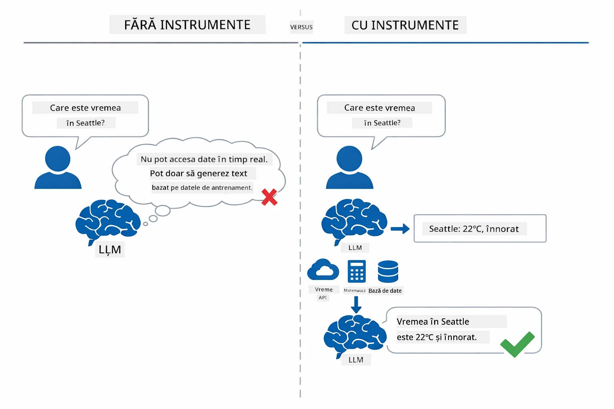

*Fără unelte modelul doar ghicește — cu unelte poate apela API-uri, calcula și returna date în timp real.*

Un agent AI cu unelte urmează un pattern **Raționare și Acțiune (ReAct)**. Modelul nu doar răspunde — gândește ce îi trebuie, acționează apelând o unealtă, observă rezultatul și apoi decide dacă să acționeze din nou sau să ofere răspunsul final:

1. **Raționează** — Agentul analizează întrebarea utilizatorului și determină ce informații are nevoie
2. **Acționează** — Agentul selectează unealta potrivită, generează parametrii corecți și o apelează
3. **Observă** — Agentul primește rezultatul uneltei și îl evaluează
4. **Repetă sau Răspunde** — Dacă sunt necesare mai multe date, agentul revine înapoi; altfel, compune un răspuns în limbaj natural

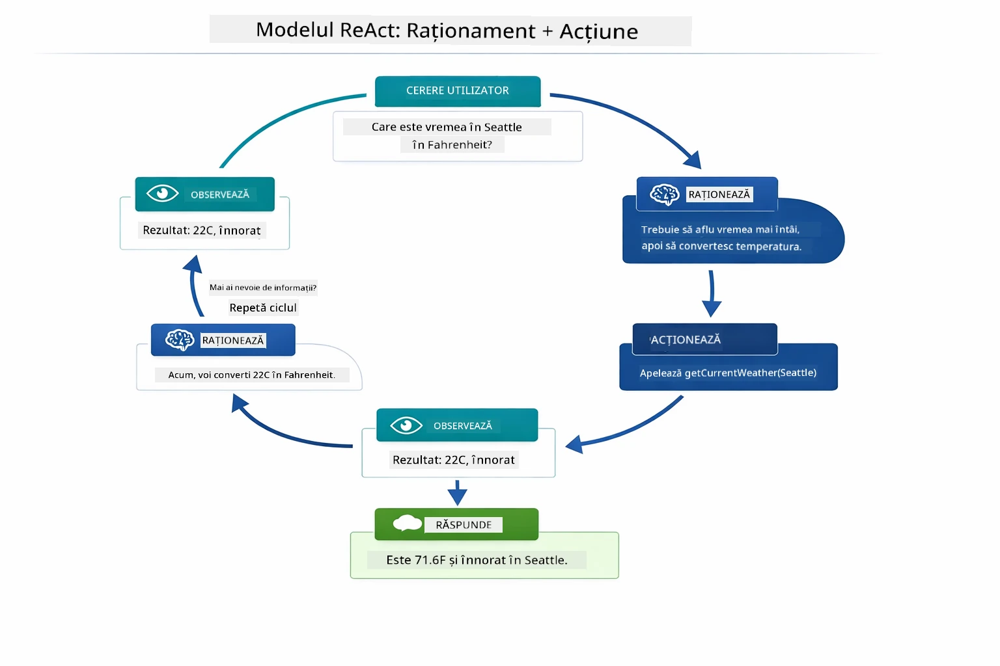

*Ciclul ReAct — agentul raționează ce să facă, acționează apelând o unealtă, observă rezultatul și repetă până poate livra răspunsul final.*

Acest lucru se întâmplă automat. Tu definești uneltele și descrierile lor. Modelul se ocupă de luarea deciziei când și cum să le folosească.

## Cum Funcționează Apelarea Uneltelor

### Definițiile Uneltelor

[WeatherTool.java](../../../04-tools/src/main/java/com/example/langchain4j/agents/tools/WeatherTool.java) | [TemperatureTool.java](../../../04-tools/src/main/java/com/example/langchain4j/agents/tools/TemperatureTool.java)

Definiți funcții cu descrieri clare și specificații pentru parametri. Modelul vede aceste descrieri în promptul de sistem și înțelege ce face fiecare unealtă.

```java
@Component
public class WeatherTool {
    
    @Tool("Get the current weather for a location")
    public String getCurrentWeather(@P("Location name") String location) {
        // Logica ta de căutare a vremii
        return "Weather in " + location + ": 22°C, cloudy";
    }
}

@AiService
public interface Assistant {
    String chat(@MemoryId String sessionId, @UserMessage String message);
}

// Asistentul este automat conectat de Spring Boot cu:
// - Bean-ul ChatModel
// - Toate metodele @Tool din clasele @Component
// - ChatMemoryProvider pentru gestionarea sesiunii
```

Diagrama de mai jos descompune fiecare adnotare și arată cum fiecare element ajută AI-ul să înțeleagă când să apeleze unealta și ce argumente să trimită:

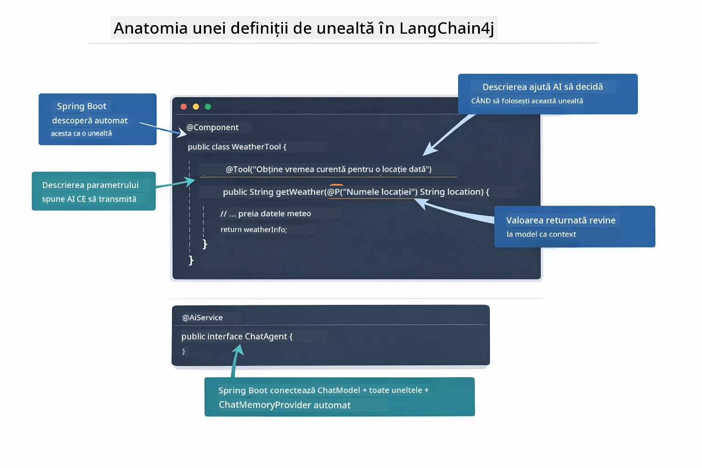

*Anatomia unei definiții de unealtă — @Tool spune AI-ului când să o folosească, @P descrie fiecare parametru, iar @AiService le conectează pe toate la pornire.*

> **🤖 Încearcă cu [GitHub Copilot](https://github.com/features/copilot) Chat:** Deschide [`WeatherTool.java`](../../../04-tools/src/main/java/com/example/langchain4j/agents/tools/WeatherTool.java) și întreabă:
> - "Cum aș integra o API reală de vreme ca OpenWeatherMap în loc de date simulate?"
> - "Ce face o descriere bună de unealtă care să ajute AI-ul să o folosească corect?"
> - "Cum gestionez erorile API și limitele de rată în implementările uneltelor?"

### Luarea Deciziilor

Când un utilizator întreabă „Cum e vremea în Seattle?”, modelul nu alege o unealtă aleatoriu. Compară intenția utilizatorului cu fiecare descriere de unealtă accesibilă, acordă un scor pentru relevanță și selectează cea mai bună potrivire. Apoi generează un apel de funcție structurat cu parametrii corecți — în acest caz, setând `location` la `"Seattle"`.

Dacă nicio unealtă nu se potrivește cererii, modelul răspunde din propria sa cunoaștere. Dacă mai multe unelte se potrivesc, alege pe cea mai specifică.

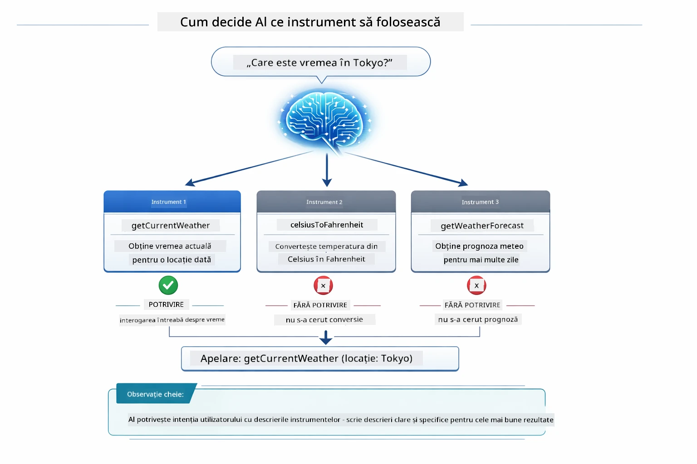

*Modelul evaluează fiecare unealtă disponibilă față de intenția utilizatorului și selectează cea mai bună potrivire — de aceea contează să scrii descrieri clare și specifice pentru unelte.*

### Executare

[AgentService.java](../../../04-tools/src/main/java/com/example/langchain4j/agents/service/AgentService.java)

Spring Boot configurează automat interfața declarativă `@AiService` cu toate uneltele înregistrate, iar LangChain4j execută apelurile uneltelor automat. În spate, un apel complet de unealtă parcurge șase etape — de la întrebarea în limbaj natural a utilizatorului până la răspunsul final în limbaj natural:

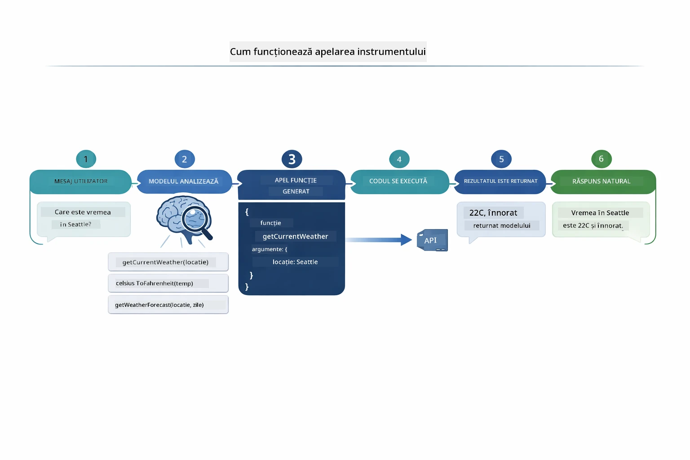

*Fluxul de la început la sfârșit — utilizatorul pune o întrebare, modelul selectează o unealtă, LangChain4j o execută, iar modelul integrează rezultatul într-un răspuns natural.*

> **🤖 Încearcă cu [GitHub Copilot](https://github.com/features/copilot) Chat:** Deschide [`AgentService.java`](../../../04-tools/src/main/java/com/example/langchain4j/agents/service/AgentService.java) și întreabă:
> - "Cum funcționează pattern-ul ReAct și de ce este eficient pentru agenții AI?"
> - "Cum decide agentul ce unealtă să folosească și în ce ordine?"
> - "Ce se întâmplă dacă execuția unei unelte eșuează — cum ar trebui să gestionez erorile în mod robust?"

### Generarea Răspunsului

Modelul primește datele despre vreme și le formatează într-un răspuns în limbaj natural pentru utilizator.

### Arhitectură: Auto-configurare Spring Boot

Acest modul folosește integrarea LangChain4j cu Spring Boot prin interfețe declarative `@AiService`. La pornire, Spring Boot detectează fiecare `@Component` care conține metode `@Tool`, bean-ul tău `ChatModel` și `ChatMemoryProvider` — apoi le leagă într-o singură interfață `Assistant` fără cod redundant.

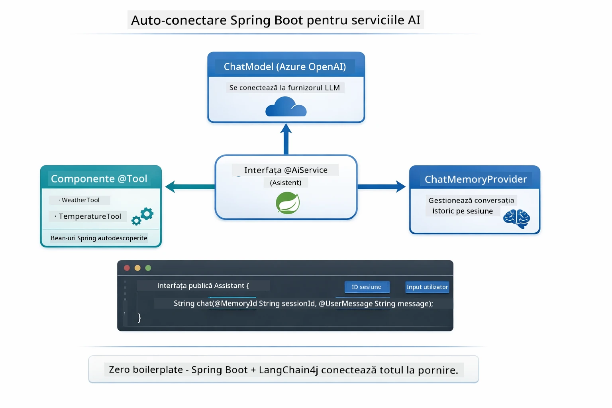

*Interfața @AiService leagă împreună ChatModel, componentele de unelte și providerul de memorie — Spring Boot se ocupă automat de configurare.*

Beneficii-cheie ale acestei abordări:

- **Auto-configurare Spring Boot** — ChatModel și uneltele injectate automat
- **Pattern @MemoryId** — Gestionare automată a memoriei pe sesiune
- **Instanță unică** — Assistant creat o singură dată și reutilizat pentru performanță mai bună
- **Executare tip-safe** — Metode Java apelate direct cu conversie de tip
- **Orchestrare multi-turn** — Gestionează lanțuirea uneltelor automat
- **Zero cod redundant** — Fără apeluri manuale `AiServices.builder()` sau memorie HashMap

Alternativele manuale (`AiServices.builder()`) necesită mai mult cod și pierd beneficiile integrării cu Spring Boot.

## Lanțuirea Uneltelor

**Lanțuirea uneltelor** — Puterea reală a agenților bazați pe unelte apare când o singură întrebare necesită mai multe unelte. Întreabă „Cum e vremea în Seattle în Fahrenheit?” și agentul lanțuiește automat două unelte: întâi apelează `getCurrentWeather` pentru temperatura în Celsius, apoi transmite acea valoare către `celsiusToFahrenheit` pentru conversie — toate într-un singur pas de conversație.

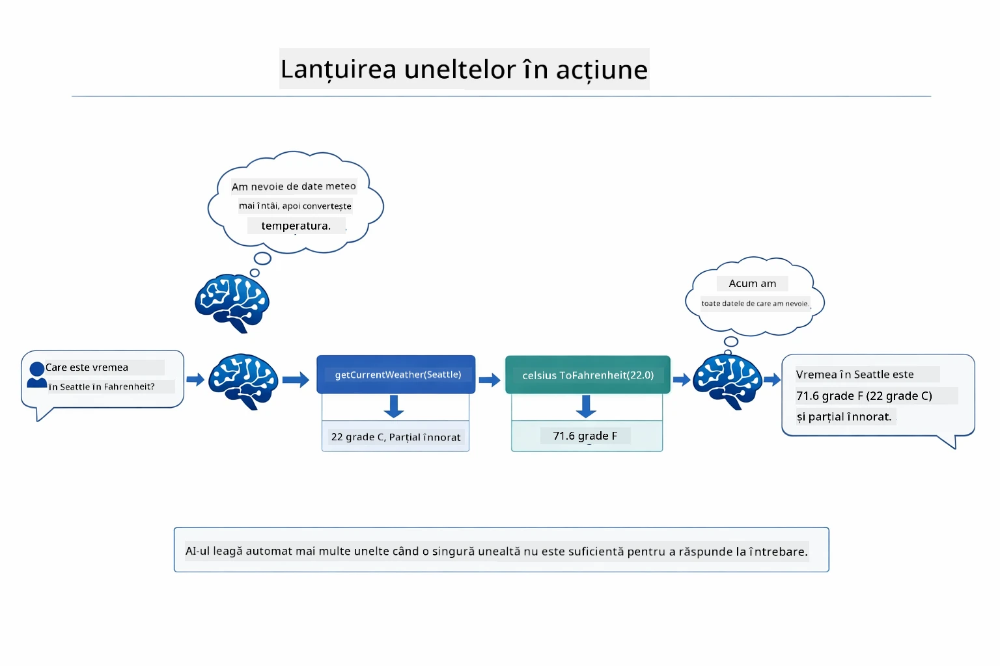

*Lanțuirea uneltelor în acțiune — agentul apelează mai întâi getCurrentWeather, apoi trece rezultatul Celsius la celsiusToFahrenheit și oferă un răspuns combinat.*

Iată cum arată în aplicația rulantă — agentul lanțuiește două apeluri de unealtă într-un singur pas de conversație:

<a href="images/tool-chaining.png"></a>

*Rezultatul efectiv al aplicației — agentul lanțuiește automat getCurrentWeather → celsiusToFahrenheit într-un singur pas.*

**Gestionarea Elegantă a Erorilor** — Cere vremea într-un oraș care nu există în datele simulate. Unealta returnează un mesaj de eroare, iar AI explică că nu poate ajuta în loc să se blocheze. Uneltele eșuează în siguranță.

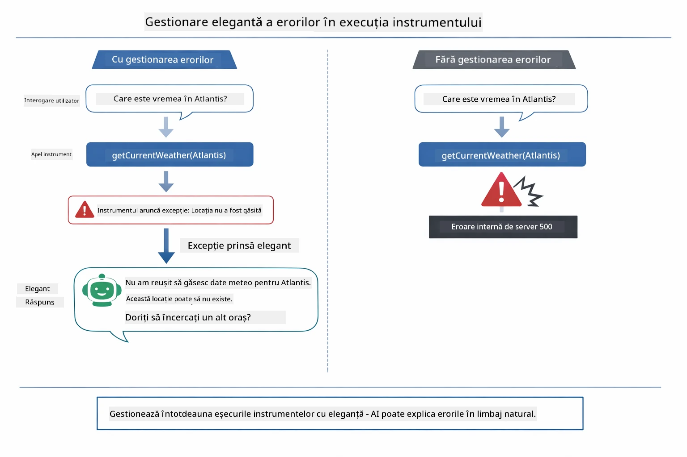

*Când o unealtă eșuează, agentul prinde eroarea și răspunde cu o explicație utilă în loc să se blocheze.*

Aceasta se întâmplă într-un singur pas de conversație. Agentul orchestrează automat apeluri multiple ale uneltelor.

## Rulează Aplicația

**Verifică implementarea:**

Asigură-te că fișierul `.env` există în directorul rădăcină cu acreditările Azure (creat în timpul Modulului 01):
```bash
cat ../.env  # Ar trebui să afișeze AZURE_OPENAI_ENDPOINT, API_KEY, DEPLOYMENT
```

**Pornește aplicația:**

> **Notă:** Dacă ai pornit deja toate aplicațiile folosind `./start-all.sh` din Modulul 01, acest modul rulează deja pe portul 8084. Poți sări peste comenzile de start de mai jos și să mergi direct la http://localhost:8084.

**Opțiunea 1: Folosind Spring Boot Dashboard (Recomandat pentru utilizatorii VS Code)**

Containerele de dezvoltare includ extensia Spring Boot Dashboard, care oferă o interfață vizuală pentru gestionarea tuturor aplicațiilor Spring Boot. O găsești în Bara de Activitate din partea stângă a VS Code (caută iconița Spring Boot).

Din Spring Boot Dashboard poți:
- Să vezi toate aplicațiile Spring Boot disponibile în workspace
- Să pornești/oprești aplicații cu un singur clic
- Să urmărești jurnalele aplicației în timp real
- Să monitorizezi starea aplicației

Pur și simplu apasă butonul de redare de lângă „tools” pentru a porni acest modul, sau pornește toate modulele simultan.


**Opțiunea 2: Folosind scripturi shell**

Pornește toate aplicațiile web (modulele 01-04):

**Bash:**
```bash
cd ..  # Din directorul rădăcină
./start-all.sh
```

**PowerShell:**
```powershell
cd ..  # Din directorul rădăcină
.\start-all.ps1
```

Sau pornește doar acest modul:

**Bash:**
```bash
cd 04-tools
./start.sh
```

**PowerShell:**
```powershell
cd 04-tools
.\start.ps1
```

Ambele scripturi încarcă automat variabilele de mediu din fișierul `.env` din rădăcină și vor construi JAR-urile dacă nu există.

> **Notă:** Dacă preferi să construiești manual toate modulele înainte de pornire:
>
> **Bash:**
> ```bash
> cd ..  # Go to root directory
> mvn clean package -DskipTests
> ```
>
> **PowerShell:**
> ```powershell
> cd ..  # Go to root directory
> mvn clean package -DskipTests
> ```

Deschide http://localhost:8084 în browser.

**Pentru oprire:**

**Bash:**
```bash
./stop.sh  # Doar acest modul
# Sau
cd .. && ./stop-all.sh  # Toate modulele
```

**PowerShell:**
```powershell
.\stop.ps1  # Numai acest modul
# Sau
cd ..; .\stop-all.ps1  # Toate modulele
```

## Utilizarea Aplicației

Aplicația oferă o interfață web unde poți interacționa cu un agent AI care are acces la unelte de vreme și conversie de temperatură.

<a href="images/tools-homepage.png"></a>

*Interfața Agent AI cu Unelte - exemple rapide și interfață de chat pentru interacțiunea cu uneltele*

### Încearcă Utilizarea Simplă a Uneitei
Începeți cu o cerere simplă: "Convertește 100 de grade Fahrenheit în Celsius". Agentul recunoaște că are nevoie de unealta pentru conversia temperaturii, o apelează cu parametrii corecți și returnează rezultatul. Observați cât de natural se simte acest lucru – nu ați specificat ce unealtă să folosească sau cum să o apeleze.

### Testarea înlănțuirii uneltelor

Acum încercați ceva mai complex: "Care este vremea în Seattle și convertește-o în Fahrenheit?" Urmăriți cum agentul parcurge pașii. Mai întâi obține vremea (care returnează în Celsius), recunoaște că trebuie să convertească în Fahrenheit, apelează unealta de conversie și combină ambele rezultate într-un singur răspuns.

### Vezi fluxul conversației

Interfața de chat păstrează istoricul conversației, permițându-vă să aveți interacțiuni pe mai multe runde. Puteți vedea toate întrebările și răspunsurile anterioare, facilitând urmărirea conversației și înțelegerea modului în care agentul construiește contextul pe parcursul schimburilor multiple.

<a href="images/tools-conversation-demo.png"></a>

*Conversație pe mai multe runde care arată conversii simple, căutări meteo și înlănțuiri de unelte*

### Experimentează cu cereri diferite

Încearcă diverse combinații:
- Căutări meteo: "Care este vremea în Tokyo?"
- Conversii de temperatură: "Cât este 25°C în Kelvin?"
- Întrebări combinate: "Verifică vremea în Paris și spune-mi dacă este peste 20°C"

Observă cum agentul interpretează limbajul natural și îl mapează la apelurile corecte ale uneltelor.

## Concepte cheie

### Modelul ReAct (Raționament și Acțiune)

Agentul alternează între raționament (deciderea ce să facă) și acțiune (folosirea uneltelor). Acest model permite rezolvarea autonomă a problemelor în loc să răspundă doar la instrucțiuni.

### Descrierile uneltelor contează

Calitatea descrierilor uneltelor tale afectează direct cât de bine le folosește agentul. Descrierile clare și specifice ajută modelul să înțeleagă când și cum să apeleze fiecare unealtă.

### Gestionarea sesiunilor

Anotația `@MemoryId` permite gestionarea automată a memoriei bazate pe sesiuni. Fiecare ID de sesiune primește propria instanță de `ChatMemory` gestionată de bean-ul `ChatMemoryProvider`, astfel încât mai mulți utilizatori pot interacționa simultan cu agentul fără ca conversațiile lor să se amestece.

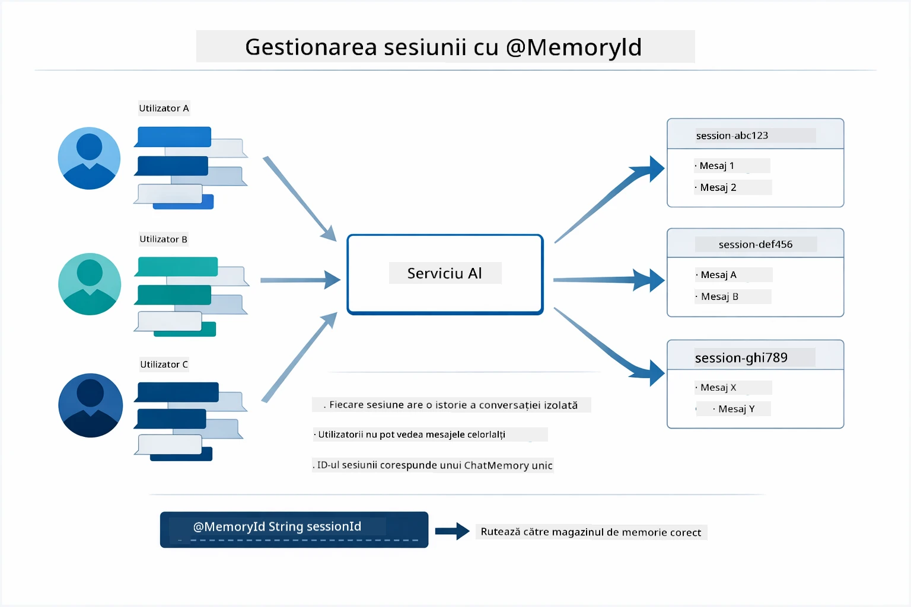

*Fiecare ID de sesiune corespunde unui istoric de conversație izolat — utilizatorii nu văd mesajele celorlalți.*

### Gestionarea erorilor

Uneltele pot eșua — API-urile pot întârzia, parametrii pot fi nevalizi, serviciile externe pot cădea. Agenții din producție au nevoie de gestionarea erorilor ca modelul să poată explica problemele sau să încerce alternative în loc să se prăbușească aplicația întreagă. Când o unealtă aruncă o excepție, LangChain4j o preia și transmite mesajul de eroare înapoi modelului, care apoi poate explica problema în limbaj natural.

## Uneltele disponibile

Diagrama de mai jos arată ecosistemul larg de unelte pe care le puteți construi. Acest modul demonstrează unelte pentru vreme și temperatură, însă același model `@Tool` funcționează pentru orice metodă Java — de la interogări de baze de date la procesarea plăților.

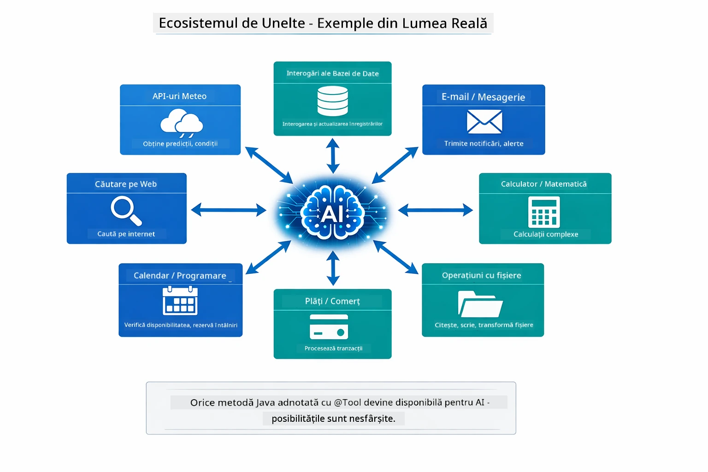

*Orice metodă Java anotată cu @Tool devine disponibilă AI-ului — modelul se extinde la baze de date, API-uri, email, operații pe fișiere și altele.*

## Când să folosești agenți bazat pe unelte

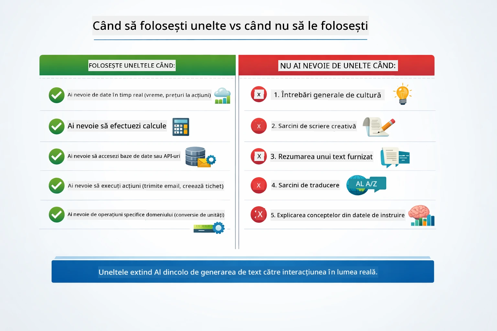

*Un ghid rapid de decizie — uneltele sunt pentru date în timp real, calcule și acțiuni; cunoștințele generale și sarcinile creative nu au nevoie de ele.*

**Folosește unelte când:**
- Răspunsul necesită date în timp real (vreme, prețuri la bursă, inventar)
- Trebuie să faci calcule mai complexe decât matematica simplă
- Accesezi baze de date sau API-uri
- Executi acțiuni (trimitere emailuri, creare tichete, actualizare înregistrări)
- Combinarea mai multor surse de date

**Nu folosi unelte când:**
- Întrebările pot fi răspunse din cunoștințe generale
- Răspunsul este pur conversațional
- Latența uneltelor ar face experiența prea lentă

## Unelte vs RAG

Modulele 03 și 04 extind ambele ce poate face AI-ul, dar în moduri fundamental diferite. RAG oferă modelului acces la **cunoștințe** prin recuperarea documentelor. Uneltele îi oferă modelului abilitatea de a lua **acțiuni** prin apelarea funcțiilor.

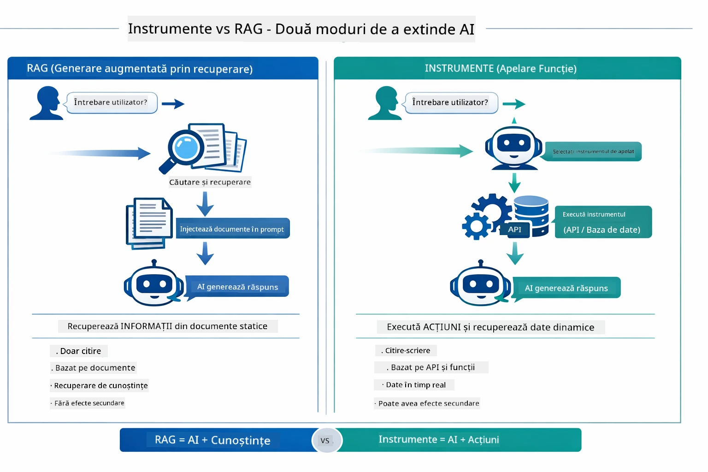

*RAG recuperează informații din documente statice — uneltele execută acțiuni și obțin date dinamice, în timp real. Multe sisteme de producție combină ambele.*

În practică, multe sisteme de producție combină ambele abordări: RAG pentru fundamentarea răspunsurilor în documentație și Uneltele pentru obținerea datelor live sau efectuarea de operațiuni.

## Pași următori

**Următorul Modul:** [05-mcp - Protocolul Contextului Modelului (MCP)](../05-mcp/README.md)

---

**Navigație:** [← Anterior: Modulul 03 - RAG](../03-rag/README.md) | [Înapoi la principal](../README.md) | [Următor: Modulul 05 - MCP →](../05-mcp/README.md)

---

<!-- CO-OP TRANSLATOR DISCLAIMER START -->
**Declinarea responsabilității**:  
Acest document a fost tradus folosind serviciul de traducere AI [Co-op Translator](https://github.com/Azure/co-op-translator). Deși ne străduim să asigurăm acuratețea, vă rugăm să rețineți că traducerile automate pot conține erori sau inexactități. Documentul original în limba sa nativă este considerat sursa autoritară. Pentru informații critice, se recomandă traducerea profesională realizată de un specialist uman. Nu ne asumăm răspunderea pentru eventuale neînțelegeri sau interpretări greșite care pot apărea în urma utilizării acestei traduceri.
<!-- CO-OP TRANSLATOR DISCLAIMER END -->