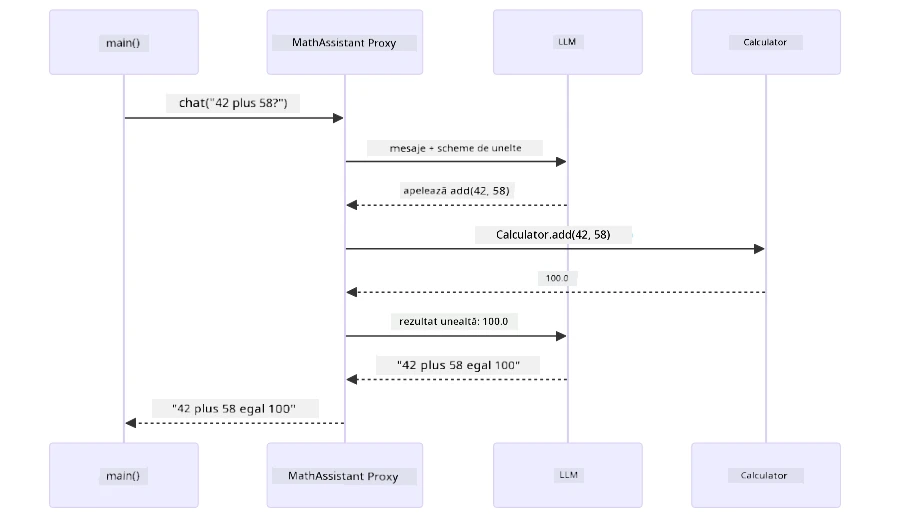
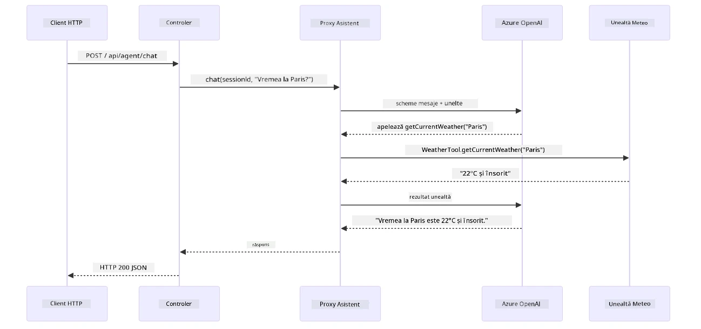

# Modulul 04: Agenți AI cu Unelte

## Cuprins

- [Parcurgere Video](../../../04-tools)
- [Ce Vei Învăța](../../../04-tools)
- [Precondiții](../../../04-tools)
- [Înțelegerea Agenților AI cu Unelte](../../../04-tools)
- [Cum Funcționează Apelarea Uneltelor](../../../04-tools)
  - [Definiții ale Uneltelor](../../../04-tools)
  - [Luarea Deciziilor](../../../04-tools)
  - [Execuție](../../../04-tools)
  - [Generarea Răspunsului](../../../04-tools)
  - [Arhitectură: Auto-Conectare Spring Boot](../../../04-tools)
- [Lanțuirea Uneltelor](../../../04-tools)
- [Rulați Aplicația](../../../04-tools)
- [Folosirea Aplicației](../../../04-tools)
  - [Încercați Utilizarea Simplă a Unei Unelte](../../../04-tools)
  - [Testați Lanțuirea Unei Unelte](../../../04-tools)
  - [Vezi Fluxul Conversației](../../../04-tools)
  - [Experimentați cu Cereri Diferite](../../../04-tools)
- [Concepte Cheie](../../../04-tools)
  - [Modelul ReAct (Raționament și Acțiune)](../../../04-tools)
  - [Importanța Descrierii Uneltelor](../../../04-tools)
  - [Gestionarea Sesiunii](../../../04-tools)
  - [Gestionarea Erorilor](../../../04-tools)
- [Unelte Disponibile](../../../04-tools)
- [Când Să Folosești Agenți Bazati pe Unelte](../../../04-tools)
- [Unelte vs RAG](../../../04-tools)
- [Pași Următori](../../../04-tools)

## Parcurgere Video

Urmărește această sesiune live care explică cum să începi cu acest modul:

<a href="https://www.youtube.com/watch?v=O_J30kZc0rw"></a>

## Ce Vei Învăța

Până acum, ai învățat cum să porți conversații cu AI, cum să structurezi prompturi eficient și cum să bazezi răspunsurile pe documentele tale. Dar există încă o limitare fundamentală: modelele de limbaj pot genera doar text. Nu pot verifica vremea, face calcule, interoga baze de date sau interacționa cu sisteme externe.

Uneltele schimbă acest lucru. Oferind modelului acces la funcții pe care le poate apela, îl transformi dintr-un generator de text într-un agent care poate lua acțiuni. Modelul decide când are nevoie de o unealtă, ce unealtă să folosească și ce parametri să transmită. Codul tău execută funcția și returnează rezultatul. Modelul încorporează acel rezultat în răspunsul său.

## Precondiții

- Modulul [01 - Introducere](../01-introduction/README.md) finalizat (resurse Azure OpenAI implementate)
- Modulele anterioare recomandate (acest modul face referire la [conceptele RAG din Modulul 03](../03-rag/README.md) în comparația Unelte vs RAG)
- Fișier `.env` în directorul principal cu acreditările Azure (creat de `azd up` în Modulul 01)

> **Notă:** Dacă nu ai finalizat Modulul 01, urmează mai întâi instrucțiunile de implementare de acolo.

## Înțelegerea Agenților AI cu Unelte

> **📝 Notă:** Termenul „agenți” în acest modul se referă la asistenți AI îmbunătățiți cu capabilități de apelare a uneltelor. Acest lucru este diferit față de modelele **Agentic AI** (agenți autonomi cu planificare, memorie și raționament în mai mulți pași) pe care le vom acoperi în [Modulul 05: MCP](../05-mcp/README.md).

Fără unelte, un model de limbaj poate doar să genereze text pe baza datelor sale de antrenament. Întreabă-l despre vremea actuală și va trebui să ghicească. Dă-i unelte și poate apela un API meteo, poate face calcule sau poate interoga o bază de date — apoi încorporează aceste rezultate reale în răspuns.


*Fără unelte modelul poate doar să ghicească — cu unelte poate apela API-uri, face calcule și returna date în timp real.*

Un agent AI cu unelte urmează un model de **Raționament și Acțiune (ReAct)**. Modelul nu răspunde doar — gândește ce are nevoie, acționează apelând o unealtă, observă rezultatul și apoi decide dacă acționează din nou sau oferă răspunsul final:

1. **Raționează** — Agentul analizează întrebarea utilizatorului și stabilește ce informații are nevoie
2. **Acționează** — Agentul selectează unealta potrivită, generează parametrii corecți și o apelează
3. **Observă** — Agentul primește ieșirea uneltei și evaluează rezultatul
4. **Repetă sau Răspunde** — Dacă sunt necesare mai multe date, agentul revine la pasul anterior; altfel formulează un răspuns în limbaj natural


*Ciclul ReAct — agentul raționează ce să facă, acționează apelând o unealtă, observă rezultatul și repetă până poate oferi răspunsul final.*

Acest proces se întâmplă automat. Definiți uneltele și descrierile lor. Modelul gestionează luarea deciziilor despre când și cum să le folosească.

## Cum Funcționează Apelarea Uneltelor

### Definiții ale Uneltelor

[WeatherTool.java](../../../04-tools/src/main/java/com/example/langchain4j/agents/tools/WeatherTool.java) | [TemperatureTool.java](../../../04-tools/src/main/java/com/example/langchain4j/agents/tools/TemperatureTool.java)

Definiți funcții cu descrieri clare și specificații pentru parametri. Modelul vede aceste descrieri în promptul său de sistem și înțelege ce face fiecare unealtă.

```java
@Component
public class WeatherTool {
    
    @Tool("Get the current weather for a location")
    public String getCurrentWeather(@P("Location name") String location) {
        // Logica ta pentru căutarea vremii
        return "Weather in " + location + ": 22°C, cloudy";
    }
}

@AiService
public interface Assistant {
    String chat(@MemoryId String sessionId, @UserMessage String message);
}

// Asistentul este conectat automat de Spring Boot cu:
// - Bean-ul ChatModel
// - Toate metodele @Tool din clasele @Component
// - ChatMemoryProvider pentru gestionarea sesiunilor
```

Diagrama de mai jos descompune fiecare adnotare și arată cum fiecare element ajută AI să înțeleagă când să apeleze unealta și ce argumente să transmită:


*Anatomia definiției unei unelte — @Tool spune AI când să o folosească, @P descrie fiecare parametru, iar @AiService le leagă pe toate automat la pornire.*

> **🤖 Încearcă cu [GitHub Copilot](https://github.com/features/copilot) Chat:** Deschide [`WeatherTool.java`](../../../04-tools/src/main/java/com/example/langchain4j/agents/tools/WeatherTool.java) și întreabă:
> - „Cum aș integra un API meteo real precum OpenWeatherMap în loc de date mock?”
> - „Ce face o descriere bună de unealtă care ajută AI să o folosească corect?”
> - „Cum gestionez erorile API și limitele de rată în implementările uneltelor?”

### Luarea Deciziilor

Când un utilizator întreabă „Cum este vremea în Seattle?”, modelul nu alege o unealtă aleator. Compară intenția utilizatorului cu fiecare descriere de unealtă la care are acces, le evaluează relevanța și selectează cea mai potrivită. Apoi generează un apel de funcție structurat cu parametrii potriviți — în acest caz, setează `location` la `"Seattle"`.

Dacă nicio unealtă nu corespunde cererii utilizatorului, modelul revine la a răspunde din propria sa cunoaștere. Dacă mai multe unelte se potrivesc, alege pe cea mai specifică.


*Modelul evaluează fiecare unealtă disponibilă în raport cu intenția utilizatorului și selectează cea mai potrivită — de aceea contează să scrii descrieri clare și specifice pentru unelte.*

### Execuție

[AgentService.java](../../../04-tools/src/main/java/com/example/langchain4j/agents/service/AgentService.java)

Spring Boot leagă automat interfața declarativă `@AiService` cu toate uneltele înregistrate, iar LangChain4j execută apelurile uneltelor automat. În spate, un apel complet al unei unelte trece prin șase etape — de la întrebarea în limbaj natural a utilizatorului până la răspunsul tot în limbaj natural:


*Fluxul cap-la-cap — utilizatorul pune o întrebare, modelul selectează o unealtă, LangChain4j o execută, iar modelul încorporează rezultatul într-un răspuns natural.*

Dacă ai rulat [ToolIntegrationDemo](../../../00-quick-start/src/main/java/com/example/langchain4j/quickstart/ToolIntegrationDemo.java) în Modulul 00, ai văzut deja acest model în acțiune — uneltele `Calculator` erau apelate în același mod. Diagrama de secvență de mai jos arată exact ce s-a întâmplat în spate în timpul acelui demo:



*Bucle de apelare a uneltei din demo-ul Quick Start — `AiServices` trimite mesajul și schemele uneltelor către LLM, LLM răspunde cu un apel de funcție precum `add(42, 58)`, LangChain4j execută metoda `Calculator` local și trimite rezultatul înapoi pentru răspunsul final.*

> **🤖 Încearcă cu [GitHub Copilot](https://github.com/features/copilot) Chat:** Deschide [`AgentService.java`](../../../04-tools/src/main/java/com/example/langchain4j/agents/service/AgentService.java) și întreabă:
> - „Cum funcționează modelul ReAct și de ce este eficient pentru agenții AI?”
> - „Cum decide agentul ce unealtă să folosească și în ce ordine?”
> - „Ce se întâmplă dacă execuția unei unelte eșuează — cum ar trebui să gestionez erorile robust?”

### Generarea Răspunsului

Modelul primește datele meteo și le formatează într-un răspuns în limbaj natural pentru utilizator.

### Arhitectură: Auto-Conectare Spring Boot

Acest modul folosește integrarea LangChain4j cu Spring Boot prin interfețe declarative `@AiService`. La pornire, Spring Boot detectează fiecare `@Component` care conține metode cu `@Tool`, bean-ul tău `ChatModel`, și `ChatMemoryProvider` — apoi le conectează pe toate într-o singură interfață `Assistant` fără niciun cod suplimentar.


*Interfața @AiService leagă ChatModel, componentele uneltelor și furnizorul de memorie — Spring Boot realizează conexiunile automat.*

Iată întregul ciclu al solicitării ca diagramă de secvență — de la cererea HTTP prin controller, service și proxy auto-conectat, până la execuția uneltei și înapoi:



*Ciclul complet al solicitării Spring Boot — cererea HTTP trece prin controller și service către proxy Assistant auto-conectat, care orchestrează LLM și apelurile uneltelor automat.*

Beneficii cheie ale acestei abordări:

- **Auto-conectare Spring Boot** — ChatModel și uneltele sunt injectate automat
- **Modelul @MemoryId** — Management automat al memoriei pe sesiune
- **Instanță unică** — Assistant creat o singură dată și reutilizat pentru performanță mai bună
- **Execuție tip-safe** — metode Java apelate direct cu conversie de tip
- **Orchestrare multi-turn** — gestionează lanțuirea uneltelor automat
- **Fără boilerplate** — fără apeluri manuale `AiServices.builder()` sau HashMap pentru memorie

Abordările alternative (manual `AiServices.builder()`) necesită mai mult cod și pierd beneficiile integrării Spring Boot.

## Lanțuirea Uneltelor

**Lanțuirea Uneltelor** — Puterea reală a agenților bazati pe unelte apare când o singură întrebare necesită mai multe unelte. Întreabă „Cum este vremea în Seattle în Fahrenheit?” și agentul leagă automat două unelte: mai întâi apelează `getCurrentWeather` pentru temperatura în Celsius, apoi transmite valoarea către `celsiusToFahrenheit` pentru conversie — toate într-un singur tur de conversație.


*Lanțuirea uneltelor în acțiune — agentul apelează mai întâi getCurrentWeather, apoi transmite rezultatul în Celsius către celsiusToFahrenheit și oferă un răspuns combinat.*

**Eșuări Grațioase** — Cere vremea într-un oraș care nu este în datele mock. Unealta returnează un mesaj de eroare, iar AI explică că nu poate ajuta în loc să se blocheze. Uneltele eșuează în siguranță. Diagrama de mai jos compară cele două abordări — cu gestionarea corectă a erorilor, agentul prinde excepția și răspunde util, pe când fără aceasta aplicația întreagă se blochează:


*Când o unealtă eșuează, agentul prinde eroarea și răspunde cu o explicație utilă în loc să se blocheze.*

Acest lucru se întâmplă într-un singur tur de conversație. Agentul orchestrează automat mai multe apeluri de unelte.

## Rulați Aplicația

**Verificați implementarea:**

Asigurați-vă că fișierul `.env` există în directorul principal cu acreditările Azure (creat în timpul Modulului 01). Rulați acest lucru din directorul modulului (`04-tools/`):

**Bash:**
```bash
cat ../.env  # Ar trebui să afișeze AZURE_OPENAI_ENDPOINT, API_KEY, DEPLOYMENT
```

**PowerShell:**
```powershell
Get-Content ..\.env  # Ar trebui să afișeze AZURE_OPENAI_ENDPOINT, API_KEY, DEPLOYMENT
```

**Porniți aplicația:**

> **Notă:** Dacă ați pornit deja toate aplicațiile folosind `./start-all.sh` din directorul principal (așa cum a fost descris în Modulul 01), acest modul este deja rulând pe portul 8084. Puteți sări peste comenzile de pornire de mai jos și să mergeți direct la http://localhost:8084.

**Opțiunea 1: Folosirea Spring Boot Dashboard (Recomandat pentru utilizatorii VS Code)**

Containerul de dezvoltare include extensia Spring Boot Dashboard, care oferă o interfață vizuală pentru gestionarea tuturor aplicațiilor Spring Boot. O puteți găsi în bara de activități din partea stângă a VS Code (căutați iconița Spring Boot).

Din Spring Boot Dashboard puteți:
- Vedea toate aplicațiile Spring Boot disponibile în spațiul de lucru
- Porni/opri aplicații cu un singur click
- Vizualiza jurnalele aplicației în timp real
- Monitoriza starea aplicației
Pur și simplu faceți clic pe butonul de redare de lângă „tools” pentru a porni acest modul sau porniți toate modulele odată.

Iată cum arată Spring Boot Dashboard în VS Code:


*Spring Boot Dashboard în VS Code — porniți, opriți și monitorizați toate modulele dintr-un singur loc*

**Opțiunea 2: Folosind scripturi shell**

Porniți toate aplicațiile web (modulele 01-04):

**Bash:**
```bash
cd ..  # Din directorul rădăcină
./start-all.sh
```

**PowerShell:**
```powershell
cd ..  # Din directorul rădăcină
.\start-all.ps1
```

Sau porniți doar acest modul:

**Bash:**
```bash
cd 04-tools
./start.sh
```

**PowerShell:**
```powershell
cd 04-tools
.\start.ps1
```

Ambele scripturi încarcă automat variabilele de mediu din fișierul `.env` de la rădăcină și vor construi JAR-urile dacă nu există.

> **Notă:** Dacă preferați să construiți manual toate modulele înainte de a porni:
>
> **Bash:**
> ```bash
> cd ..  # Go to root directory
> mvn clean package -DskipTests
> ```
>
> **PowerShell:**
> ```powershell
> cd ..  # Go to root directory
> mvn clean package -DskipTests
> ```

Deschideți http://localhost:8084 în browserul dvs.

**Pentru oprire:**

**Bash:**
```bash
./stop.sh  # Numai acest modul
# Sau
cd .. && ./stop-all.sh  # Toate modulele
```

**PowerShell:**
```powershell
.\stop.ps1  # Doar acest modul
# Sau
cd ..; .\stop-all.ps1  # Toate modulele
```

## Utilizarea aplicației

Aplicația oferă o interfață web unde puteți interacționa cu un agent AI care are acces la unelte pentru vreme și conversia temperaturii. Iată cum arată interfața — include exemple rapide și un panou de chat pentru trimiterea cererilor:

<a href="images/tools-homepage.png"></a>

*Interfața AI Agent Tools - exemple rapide și interfață de chat pentru interacțiunea cu uneltele*

### Încercați utilizarea simplă a unealtelor

Începeți cu o cerere simplă: „Convertește 100 de grade Fahrenheit în Celsius”. Agentul recunoaște că are nevoie de unealta de conversie a temperaturii, o apelează cu parametrii corecți și returnează rezultatul. Observați cât de natural se simte - nu ați specificat ce unealtă să folosească sau cum să o apeleze.

### Testați combinarea uneltelor

Acum încercați ceva mai complex: „Care este vremea în Seattle și convertește-o în Fahrenheit?” Urmăriți cum agentul parcurge aceasta în pași. Mai întâi obține vremea (care returnează Celsius), recunoaște că trebuie să convertească în Fahrenheit, apelează unealta de conversie și combină ambele rezultate într-un singur răspuns.

### Vedeți fluxul conversației

Interfața de chat păstrează istoricul conversației, permițând interacțiuni pe mai multe tururi. Puteți vedea toate întrebările și răspunsurile anterioare, facilitând urmărirea conversației și înțelegerea modului în care agentul construiește context pe mai multe schimburi.

<a href="images/tools-conversation-demo.png"></a>

*Conversație multi-tur care arată conversii simple, consultări meteo și combinarea uneltelor*

### Experimentează cu cereri diferite

Încearcă diverse combinații:
- Consultări meteo: „Care este vremea în Tokyo?”
- Conversii temperatură: „Cât înseamnă 25°C în Kelvin?”
- Cereri combinate: „Verifică vremea în Paris și spune-mi dacă este peste 20°C”

Observați cum agentul interpretează limbajul natural și îl mapează la apelurile corespunzătoare ale uneltelor.

## Concepte-cheie

### Pattern ReAct (Raționare și Acțiune)

Agentul alternează între raționare (decide ce să facă) și acțiune (folosește unelte). Acest pattern permite rezolvarea autonomă a problemelor, nu doar răspunsuri la instrucțiuni.

### Descrierile uneltelor contează

Calitatea descrierilor uneltelor influențează direct cum sunt ele folosite de agent. Descrierile clare și specifice ajută modelul să înțeleagă când și cum să apeleze fiecare unealtă.

### Gestionarea sesiunii

Anotația `@MemoryId` permite gestionarea automată a memoriei pe bază de sesiune. Fiecare ID de sesiune primește o instanță `ChatMemory` gestionată de bean-ul `ChatMemoryProvider`, astfel încât mai mulți utilizatori pot interacționa simultan cu agentul fără ca conversațiile să se amestece. Diagrama de mai jos ilustrează cum mai mulți utilizatori sunt direcționați către stocări de memorie izolate pe baza ID-urilor lor de sesiune:


*Fiecare ID de sesiune corespunde unui istoric de conversație izolat — utilizatorii nu văd niciodată mesajele celorlalți.*

### Gestionarea erorilor

Uneltele pot da greș — API-urile pot expira, parametrii pot fi invalizi, serviciile externe pot cădea. Agenții de producție au nevoie de gestionare a erorilor pentru ca modelul să poată explica problemele sau să încerce alternative, în loc să oprească întreaga aplicație. Când o unealtă aruncă o excepție, LangChain4j o prinde și trimite mesajul de eroare înapoi către model, care poate apoi explica problema în limbaj natural.

## Unelte disponibile

Diagrama de mai jos arată ecosistemul larg de unelte pe care le poți construi. Acest modul demonstrează unelte pentru vreme și temperatură, dar același pattern `@Tool` funcționează pentru orice metodă Java — de la interogări de baze de date la procesare de plăți.


*Orice metodă Java anotată cu @Tool devine disponibilă pentru AI — patternul se extinde la baze de date, API-uri, email, operații pe fișiere și multe altele.*

## Când să folosești agenți pe bază de unelte

Nu toate cererile necesită unelte. Decizia depinde de dacă AI trebuie să interacționeze cu sisteme externe sau poate răspunde din propria sa cunoaștere. Ghidul de mai jos rezumă când uneltele adaugă valoare și când nu sunt necesare:


*Un ghid rapid de decizie — uneltele sunt pentru date în timp real, calcule și acțiuni; cunoștințe generale și sarcini creative nu au nevoie de ele.*

## Unelte vs RAG

Modulele 03 și 04 extind ambele capabilitățile AI, dar în moduri fundamental diferite. RAG dă modelului acces la **cunoștințe** prin regăsirea documentelor. Uneltele îi oferă modelului abilitatea de a lua **acțiuni** prin apelarea funcțiilor. Diagrama de mai jos compară aceste două abordări — de la modul în care funcționează fluxul fiecăruia până la compromisurile dintre ele:


*RAG regăsește informații din documente statice — Uneltele execută acțiuni și obțin date dinamice, în timp real. Multe sisteme de producție combină ambele.*

În practică, multe sisteme de producție combină ambele abordări: RAG pentru fundamentarea răspunsurilor în documentație, și Unelte pentru a obține date live sau a executa operațiuni.

## Pașii următori

**Următorul modul:** [05-mcp - Model Context Protocol (MCP)](../05-mcp/README.md)

---

**Navigare:** [← Anterior: Modul 03 - RAG](../03-rag/README.md) | [Înapoi la Principal](../README.md) | [Următor: Modul 05 - MCP →](../05-mcp/README.md)

---

<!-- CO-OP TRANSLATOR DISCLAIMER START -->
**Declinare de responsabilitate**:  
Acest document a fost tradus folosind serviciul de traducere automată AI [Co-op Translator](https://github.com/Azure/co-op-translator). Deși ne străduim pentru acuratețe, vă rugăm să țineți cont că traducerile automate pot conține erori sau inexactități. Documentul original, în limba sa nativă, trebuie considerat sursa autorizată. Pentru informații critice, se recomandă traducerea profesională realizată de un specialist uman. Nu ne asumăm responsabilitatea pentru eventualele neînțelegeri sau interpretări greșite cauzate de utilizarea acestei traduceri.
<!-- CO-OP TRANSLATOR DISCLAIMER END -->