# Modulul 05: Protocolul Contextului Modelului (MCP)

## Cuprins

- [Prezentare video](../../../05-mcp)
- [Ce vei învăța](../../../05-mcp)
- [Ce este MCP?](../../../05-mcp)
- [Cum funcționează MCP](../../../05-mcp)
- [Modulul Agentic](../../../05-mcp)
- [Rularea exemplelor](../../../05-mcp)
  - [Prerechizite](../../../05-mcp)
- [Pornire rapidă](../../../05-mcp)
  - [Operațiuni cu fișiere (Stdio)](../../../05-mcp)
  - [Agentul Supervisor](../../../05-mcp)
    - [Rularea demo-ului](../../../05-mcp)
    - [Cum funcționează Supervisorul](../../../05-mcp)
    - [Cum descoperă FileAgent uneltele MCP în timpul execuției](../../../05-mcp)
    - [Strategii de răspuns](../../../05-mcp)
    - [Înțelegerea output-ului](../../../05-mcp)
    - [Explicație a caracteristicilor modulului agentic](../../../05-mcp)
- [Concepte cheie](../../../05-mcp)
- [Felicitări!](../../../05-mcp)
  - [Ce urmează?](../../../05-mcp)

## Prezentare video

Urmărește această sesiune live care explică cum să începi cu acest modul:

<a href="https://www.youtube.com/watch?v=O_J30kZc0rw"></a>

## Ce vei învăța

Ai construit AI conversațional, ai stăpânit prompturile, ai fundamentat răspunsurile în documente și ai creat agenți cu unelte. Dar toate acele unelte au fost construite personalizat pentru aplicația ta specifică. Dacă ai putea să oferi AI-ului tău acces la un ecosistem standardizat de unelte pe care oricine le poate crea și împărtăși? În acest modul, vei învăța cum să faci exact asta cu Protocolul Contextului Modelului (MCP) și modulul agentic al LangChain4j. Mai întâi prezentăm un cititor de fișiere MCP simplu, apoi arătăm cum se integrează ușor în fluxuri agentice avansate folosind modelul Agent Supervisor.

## Ce este MCP?

Protocolul Contextului Modelului (MCP) oferă exact asta - o modalitate standard pentru aplicațiile AI de a descoperi și utiliza unelte externe. În loc să scrii integrări personalizate pentru fiecare sursă de date sau serviciu, te conectezi la servere MCP care expun capabilitățile lor într-un format consistent. Agentul tău AI poate apoi descoperi și folosi aceste unelte automat.

Diagrama de mai jos arată diferența — fără MCP, fiecare integrare necesită conexiuni punct-la-punct personalizate; cu MCP, un singur protocol conectează aplicația ta la orice unealtă:


*Înainte de MCP: Integrări complexe punct-la-punct. După MCP: Un protocol, posibilități nelimitate.*

MCP rezolvă o problemă fundamentală în dezvoltarea AI: fiecare integrare este personalizată. Vrei să accesezi GitHub? Cod personalizat. Vrei să citești fișiere? Cod personalizat. Vrei să interoghezi o bază de date? Cod personalizat. Și niciuna dintre aceste integrări nu funcționează cu alte aplicații AI.

MCP standardizează acest lucru. Un server MCP expune unelte cu descrieri clare și scheme de parametri. Orice client MCP se poate conecta, descoperi uneltele disponibile și le poate folosi. Construiești o dată, folosești peste tot.

Diagrama de mai jos ilustrează această arhitectură — un singur client MCP (aplicația ta AI) se conectează la mai multe servere MCP, fiecare expunând propriul set de unelte prin protocolul standard:


*Arhitectura Protocolului Contextului Modelului - descoperire și execuție standardizată a uneltelor*

## Cum funcționează MCP

În esență, MCP folosește o arhitectură stratificată. Aplicația ta Java (clientul MCP) descoperă uneltele disponibile, trimite cereri JSON-RPC printr-un strat de transport (Stdio sau HTTP), iar serverul MCP execută operațiile și returnează rezultatele. Diagrama următoare descompune fiecare strat al acestui protocol:

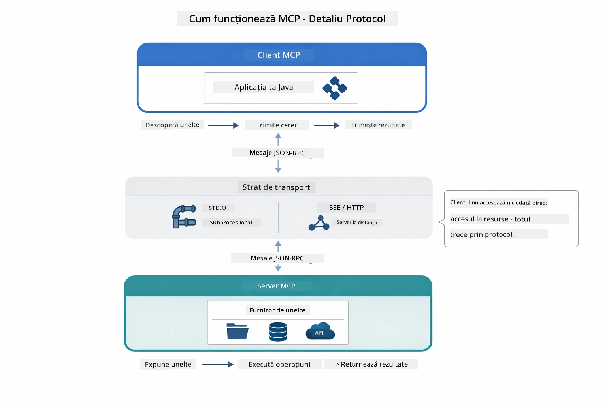

*Cum funcționează MCP în spate — clienții descoperă uneltele, schimbă mesaje JSON-RPC și execută operații printr-un strat de transport.*

**Arhitectură Server-Client**

MCP folosește un model client-server. Serverele oferă unelte - citirea fișierelor, interogarea bazelor de date, apelarea API-urilor. Clienții (aplicația ta AI) se conectează la servere și le folosesc uneltele.

Pentru a folosi MCP cu LangChain4j, adaugă această dependență Maven:

```xml
<dependency>
    <groupId>dev.langchain4j</groupId>
    <artifactId>langchain4j-mcp</artifactId>
    <version>${langchain4j.version}</version>
</dependency>
```

**Descoperirea uneltelor**

Când clientul tău se conectează la un server MCP, îl întreabă „Ce unelte ai?” Serverul răspunde cu o listă de unelte disponibile, fiecare cu descrieri și scheme de parametri. Agentul tău AI poate apoi decide ce unelte să folosească în funcție de cererile utilizatorului. Diagrama de mai jos arată acest schimb — clientul trimite o cerere `tools/list` și serverul returnează uneltele disponibile cu descrieri și scheme de parametri:

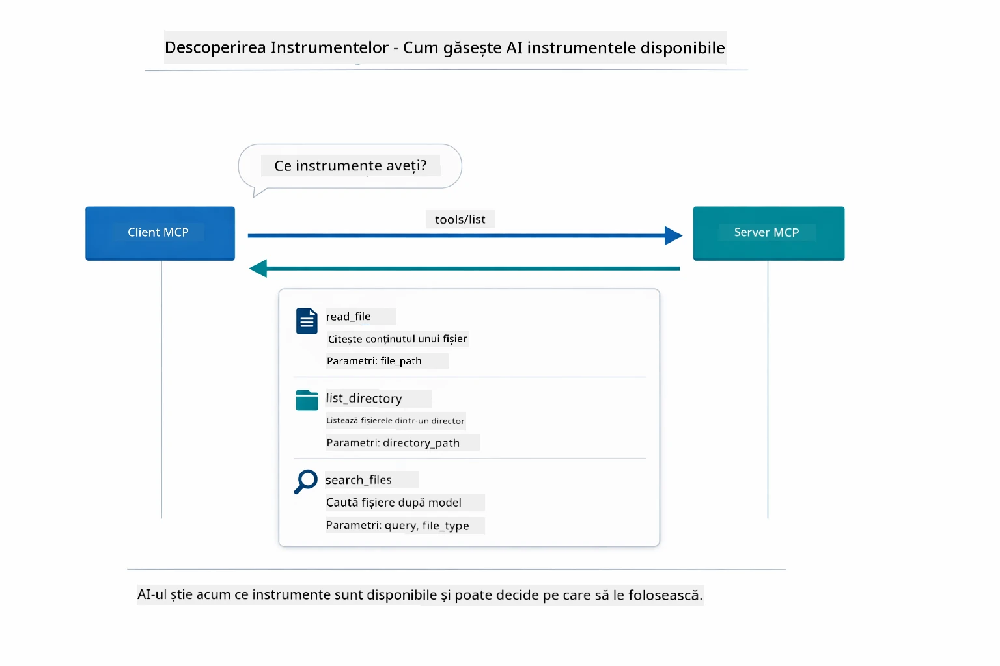

*AI descoperă uneltele disponibile la pornire — acum știe ce capabilități există și poate decide pe care să le folosească.*

**Mecanisme de Transport**

MCP suportă diferite mecanisme de transport. Cele două opțiuni sunt Stdio (pentru comunicarea cu subprocessuri locale) și Streamable HTTP (pentru servere remote). Acest modul demonstrează transportul Stdio:


*Mecanismele de transport MCP: HTTP pentru servere remote, Stdio pentru procese locale*

**Stdio** - [StdioTransportDemo.java](../../../05-mcp/src/main/java/com/example/langchain4j/mcp/StdioTransportDemo.java)

Pentru procese locale. Aplicația ta pornește un server ca subprocess și comunică prin intrare/ieșire standardă. Util pentru acces la filesystem sau unelte în linie de comandă.

```java
McpTransport stdioTransport = new StdioMcpTransport.Builder()
    .command(List.of(
        npmCmd, "exec",
        "@modelcontextprotocol/server-filesystem@2025.12.18",
        resourcesDir
    ))
    .logEvents(false)
    .build();
```

Serverul `@modelcontextprotocol/server-filesystem` expune următoarele unelte, toate izolate la directoarele specificate:

| Unealtă | Descriere |
|------|-------------|
| `read_file` | Citește conținutul unui singur fișier |
| `read_multiple_files` | Citește mai multe fișiere într-un singur apel |
| `write_file` | Creează sau suprascrie un fișier |
| `edit_file` | Efectuează editări țintite de găsire-înlocuire |
| `list_directory` | Listează fișierele și directoarele de la o cale |
| `search_files` | Caută recursiv fișiere ce corespund unui șablon |
| `get_file_info` | Obține metadatele fișierului (dimensiune, timestamp-uri, permisiuni) |
| `create_directory` | Creează un director (inclusiv directoarele părinte) |
| `move_file` | Mută sau redenumește un fișier sau director |

Diagrama următoare arată cum funcționează transportul Stdio în timpul execuției — aplicația ta Java pornește serverul MCP ca proces copil și comunică prin canale stdin/stdout, fără rețea sau HTTP implicat:

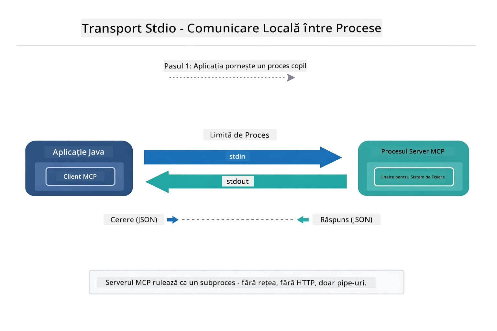

*Transport Stdio în acțiune — aplicația ta pornește serverul MCP ca proces copil și comunică prin canale stdin/stdout.*

> **🤖 Încearcă cu [GitHub Copilot](https://github.com/features/copilot) Chat:** Deschide [`StdioTransportDemo.java`](../../../05-mcp/src/main/java/com/example/langchain4j/mcp/StdioTransportDemo.java) și întreabă:
> - "Cum funcționează transportul Stdio și când ar trebui să-l folosesc față de HTTP?"
> - "Cum gestionează LangChain4j ciclul de viață al proceselor server MCP pornite?"
> - "Care sunt implicațiile de securitate ale oferirii AI-ului acces la sistemul de fișiere?"

## Modulul Agentic

În timp ce MCP oferă unelte standardizate, modulul **agentic** al LangChain4j oferă o modalitate declarativă de a construi agenți care orchestrează aceste unelte. Anotarea `@Agent` și `AgenticServices` îți permit să definești comportamentul agentului prin interfețe, nu prin cod imperativ.

În acest modul, vei explora modelul **Agent Supervisor** — o abordare avansată agentică AI în care un agent „supervizor” decide dinamic care sub-agenti să fie invocați în funcție de cererile utilizatorului. Vom combina ambele concepte oferind unuia dintre sub-agenti capabilități MCP de acces la fișiere.

Pentru a folosi modulul agentic, adaugă această dependență Maven:

```xml
<dependency>
    <groupId>dev.langchain4j</groupId>
    <artifactId>langchain4j-agentic</artifactId>
    <version>${langchain4j.mcp.version}</version>
</dependency>
```
> **Notă:** Modulul `langchain4j-agentic` folosește o proprietate de versiune separată (`langchain4j.mcp.version`) deoarece este lansat într-un ritm diferit față de bibliotecile principale LangChain4j.

> **⚠️ Experimental:** Modulul `langchain4j-agentic` este **experimental** și poate suferi modificări. Modalitatea stabilă de a construi asistenți AI rămâne `langchain4j-core` cu unelte personalizate (Modulul 04).

## Rularea exemplelor

### Prerechizite

- Finalizarea [Modulului 04 - Unelte](../04-tools/README.md) (acest modul construiește pe conceptele de unelte personalizate și le compară cu uneltele MCP)
- Fișier `.env` în directorul root cu credențiale Azure (creat de `azd up` în Modulul 01)
- Java 21+, Maven 3.9+
- Node.js 16+ și npm (pentru serverele MCP)

> **Notă:** Dacă nu ți-ai setat încă variabilele de mediu, vezi [Modulul 01 - Introducere](../01-introduction/README.md) pentru instrucțiuni de deployment (`azd up` creează automat fișierul `.env`), sau copiază `.env.example` în `.env` în directorul root și completează-ți valorile.

## Pornire rapidă

**Folosind VS Code:** Pur și simplu click dreapta pe orice fișier demo în Explorer și selectează **„Run Java”**, sau folosește configurațiile de lansare din panoul Run and Debug (asigură-te mai întâi că fișierul `.env` este configurat cu credențiale Azure).

**Folosind Maven:** Alternativ, poți rula din linia de comandă cu exemplele de mai jos.

### Operațiuni cu fișiere (Stdio)

Acesta demonstrează unelte bazate pe subprocessuri locale.

**✅ Nu sunt necesare prerechizite** - serverul MCP este pornit automat.

**Folosind scripturile de pornire (Recomandat):**

Scripturile de pornire încarcă automat variabilele de mediu din fișierul `.env` din root:

**Bash:**
```bash
cd 05-mcp
chmod +x start-stdio.sh
./start-stdio.sh
```

**PowerShell:**
```powershell
cd 05-mcp
.\start-stdio.ps1
```

**Folosind VS Code:** Click dreapta pe `StdioTransportDemo.java` și selectează **„Run Java”** (asigură-te că fișierul `.env` este configurat).

Aplicația pornește automat serverul MCP pentru filesystem și citește un fișier local. Observă cum este gestionată automat lansarea subprocessului.

**Output așteptat:**
```
Assistant response: The file provides an overview of LangChain4j, an open-source Java library
for integrating Large Language Models (LLMs) into Java applications...
```

### Agentul Supervisor

Modelul **Agent Supervisor** este o formă **flexibilă** de AI agentic. Un Supervisor folosește un LLM pentru a decide autonom ce agenți să invoce pe baza cererii utilizatorului. În următorul exemplu, combinăm accesul la fișiere MCP cu un agent LLM pentru a crea un flux supravegheat de citire fișier → raport.

În demo, `FileAgent` citește un fișier folosind uneltele filesystem MCP, iar `ReportAgent` generează un raport structurat cu un rezumat executiv (1 propoziție), 3 puncte cheie și recomandări. Supervisorul orchestrează acest flux automat:

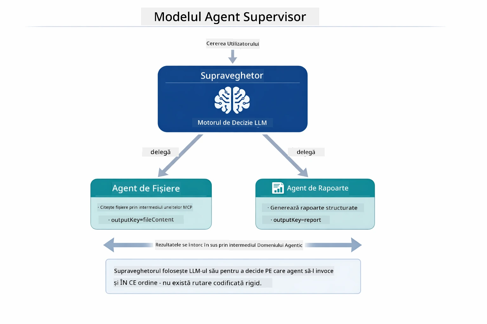

*Supervisorul folosește LLM-ul său pentru a decide ce agenți să invoce și în ce ordine — fără rutare hardcodata.*

Iată cum arată fluxul concret pentru pipeline-ul fișier → raport:

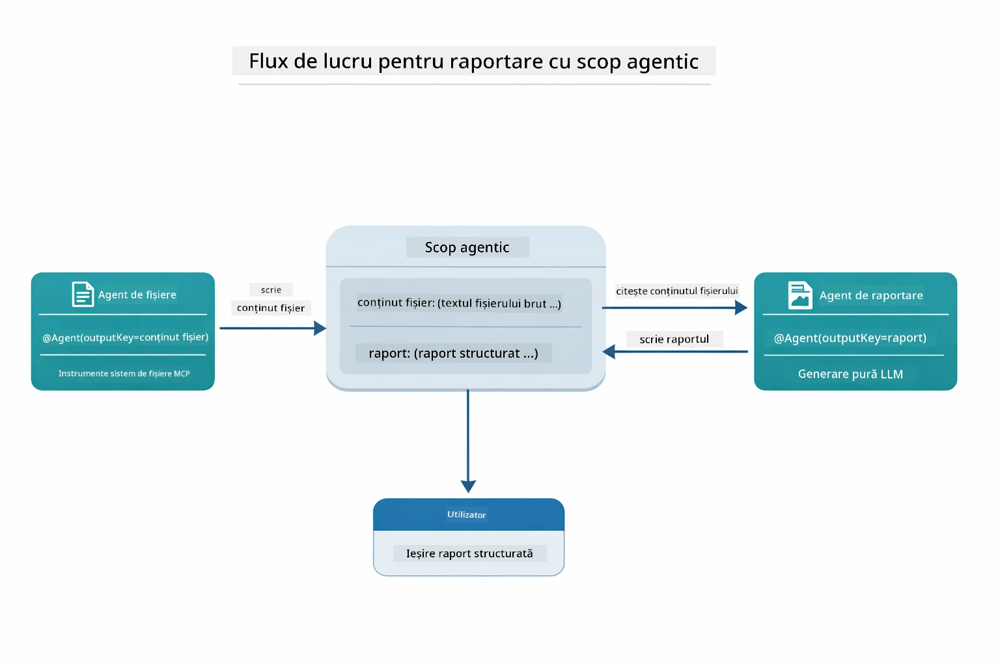

*FileAgent citește fișierul prin uneltele MCP, apoi ReportAgent transformă conținutul brut într-un raport structurat.*

Diagrama secvenței următoare urmărește orchestrarea completă a Supervisorului — de la pornirea serverului MCP, la selecția autonomă a agenților de către Supervisor, până la apelurile uneltelor peste stdio și raportul final:

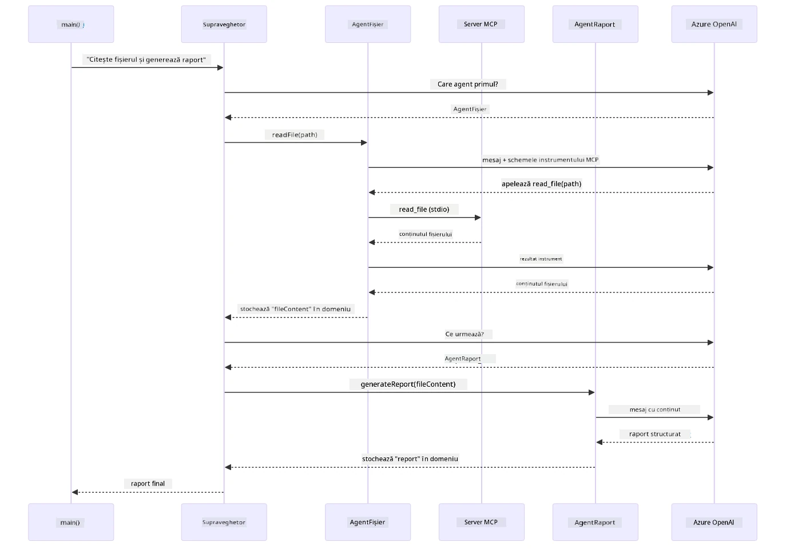

*Supervisorul invocă autonom FileAgent (care apelează serverul MCP peste stdio pentru a citi fișierul), apoi invocă ReportAgent pentru a genera raportul structurat — fiecare agent stochează output-ul în Agentic Scope partajat.*

Fiecare agent stochează output-ul în **Agentic Scope** (memorie partajată), permițând agenților următori să acceseze rezultatele precedente. Acest lucru demonstrează cum uneltele MCP se integrează transparent în fluxuri agentice — Supervisorul nu trebuie să știe *cum* sunt citite fișierele, doar că `FileAgent` poate face asta.

#### Rularea demo-ului

Scripturile de pornire încarcă automat variabilele de mediu din fișierul `.env` din root:

**Bash:**
```bash
cd 05-mcp
chmod +x start-supervisor.sh
./start-supervisor.sh
```

**PowerShell:**
```powershell
cd 05-mcp
.\start-supervisor.ps1
```

**Folosind VS Code:** Click dreapta pe `SupervisorAgentDemo.java` și selectează **„Run Java”** (asigură-te că fișierul `.env` este configurat).

#### Cum funcționează Supervisorul

Înainte de a construi agenți, trebuie să conectezi transportul MCP la un client și să-l înfășori ca un `ToolProvider`. Așa devin uneltele serverului MCP disponibile pentru agenții tăi:

```java
// Creează un client MCP din transport
McpClient mcpClient = new DefaultMcpClient.Builder()
        .transport(stdioTransport)
        .build();

// Învelește clientul ca un ToolProvider — aceasta realizează legătura între uneltele MCP și LangChain4j
ToolProvider mcpToolProvider = McpToolProvider.builder()
        .mcpClients(List.of(mcpClient))
        .build();
```

Acum poți injecta `mcpToolProvider` în orice agent care are nevoie de unelte MCP:

```java
// Pasul 1: FileAgent citește fișiere folosind instrumentele MCP
FileAgent fileAgent = AgenticServices.agentBuilder(FileAgent.class)
        .chatModel(model)
        .toolProvider(mcpToolProvider)  // Are instrumentele MCP pentru operațiuni cu fișiere
        .build();

// Pasul 2: ReportAgent generează rapoarte structurate
ReportAgent reportAgent = AgenticServices.agentBuilder(ReportAgent.class)
        .chatModel(model)
        .build();

// Supervisorul orchestrează fluxul de lucru fișier → raport
SupervisorAgent supervisor = AgenticServices.supervisorBuilder()
        .chatModel(model)
        .subAgents(fileAgent, reportAgent)
        .responseStrategy(SupervisorResponseStrategy.LAST)  // Returnează raportul final
        .build();

// Supervisorul decide ce agenți să invoce pe baza cererii
String response = supervisor.invoke("Read the file at /path/file.txt and generate a report");
```

#### Cum descoperă FileAgent uneltele MCP în timpul execuției

Te-ai putea întreba: **cum știe `FileAgent` să folosească uneltele npm pentru filesystem?** Răspunsul este că nu știe — **LLM-ul** descoperă asta la runtime prin schemele uneltelor.
Interfața `FileAgent` este doar o **definiție de prompt**. Nu are cunoștințe codificate despre `read_file`, `list_directory` sau orice alt instrument MCP. Iată ce se întâmplă de la un capăt la altul:

1. **Serverul pornește:** `StdioMcpTransport` lansează pachetul npm `@modelcontextprotocol/server-filesystem` ca proces copil
2. **Descoperirea instrumentelor:** `McpClient` trimite o cerere JSON-RPC `tools/list` către server, care răspunde cu numele instrumentelor, descrierile și schemele parametrilor (de exemplu, `read_file` — *"Citește conținutul complet al unui fișier"* — `{ path: string }`)
3. **Injecția schemei:** `McpToolProvider` înfășoară aceste scheme descoperite și le face disponibile pentru LangChain4j
4. **Decizia LLM:** Când este apelat `FileAgent.readFile(path)`, LangChain4j trimite mesajul sistemului, mesajul utilizatorului, **și lista schemelor instrumentelor** către LLM. LLM citește descrierile instrumentelor și generează un apel de instrument (de exemplu, `read_file(path="/some/file.txt")`)
5. **Execuția:** LangChain4j interceptează apelul instrumentului, îl redirecționează prin clientul MCP înapoi către procesul Node.js, obține rezultatul și îl trimite înapoi la LLM

Acesta este același mecanism de [Descoperire a Instrumentelor](../../../05-mcp) descris mai sus, dar aplicat în mod specific fluxului de lucru al agentului. Anotațiile `@SystemMessage` și `@UserMessage` ghidează comportamentul LLM, în timp ce `ToolProvider` injectat îi oferă **capabilitățile** — LLM realizează legătura între cele două în timpul rulării.

> **🤖 Încearcă cu [GitHub Copilot](https://github.com/features/copilot) Chat:** Deschide [`FileAgent.java`](../../../05-mcp/src/main/java/com/example/langchain4j/mcp/agents/FileAgent.java) și întreabă:
> - "Cum știe acest agent ce instrument MCP să apeleze?"
> - "Ce s-ar întâmpla dacă aș elimina ToolProvider din builder-ul agentului?"
> - "Cum ajung schemele instrumentelor la LLM?"

#### Strategii de Răspuns

Când configurezi un `SupervisorAgent`, specifici cum ar trebui să formuleze răspunsul final pentru utilizator după ce sub-agentele și-au terminat sarcinile. Diagrama de mai jos arată cele trei strategii disponibile — LAST returnează direct rezultatul ultimului agent, SUMMARY sintetizează toate rezultatele printr-un LLM, iar SCORED alege răspunsul care obține cel mai mare scor comparativ cu cererea inițială:

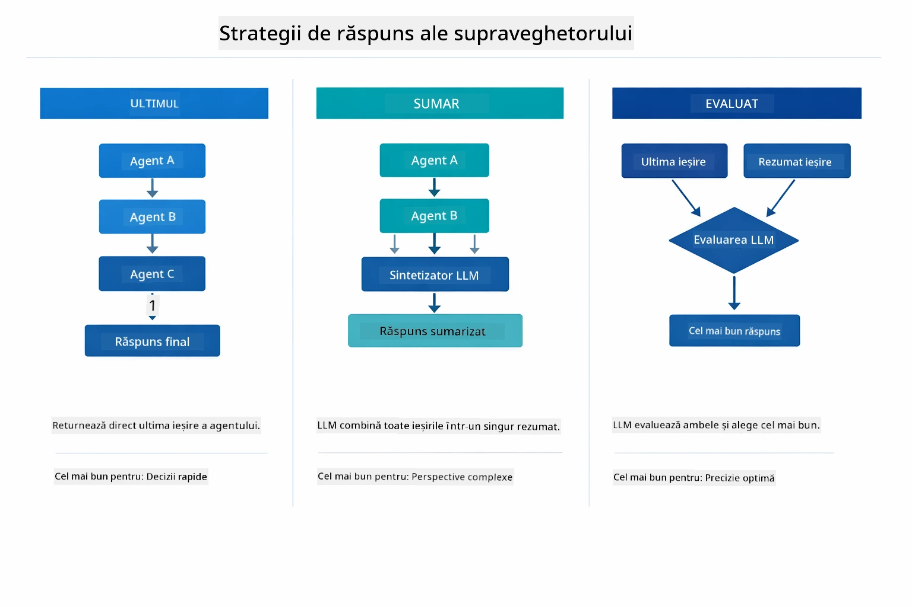

*Tre strategii pentru cum formulează Supervisor răspunsul final — alege în funcție de preferința ta pentru ultimul rezultat, un rezumat sintetizat sau cea mai bine notată opțiune.*

Strategiile disponibile sunt:

| Strategie | Descriere |
|----------|-------------|
| **LAST** | Supervisorul returnează rezultatul ultimului sub-agent sau instrument apelat. Este util când ultimul agent din flux este proiectat special să producă răspunsul complet, final (de exemplu, un "Agent Rezumat" într-un pipeline de cercetare). |
| **SUMMARY** | Supervisorul folosește propriul model lingvistic (LLM) intern pentru a sintetiza un rezumat al întregii interacțiuni și al tuturor rezultatelor sub-agente, apoi returnează rezumatul ca răspuns final. Acest lucru oferă un răspuns agregat și clar utilizatorului. |
| **SCORED** | Sistemul folosește un LLM intern pentru a nota atât răspunsul LAST, cât și rezumatul interacțiunii, comparativ cu cererea originală, returnând rezultatul care primește cel mai mare scor. |

Vezi [SupervisorAgentDemo.java](../../../05-mcp/src/main/java/com/example/langchain4j/mcp/SupervisorAgentDemo.java) pentru implementarea completă.

> **🤖 Încearcă cu [GitHub Copilot](https://github.com/features/copilot) Chat:** Deschide [`SupervisorAgentDemo.java`](../../../05-mcp/src/main/java/com/example/langchain4j/mcp/SupervisorAgentDemo.java) și întreabă:
> - "Cum decide Supervisor ce agenți să invoce?"
> - "Care este diferența între modelele Supervisor și workflow secvențial?"
> - "Cum pot personaliza comportamentul de planificare al Supervisorului?"

#### Înțelegerea Rezultatelor

Când rulezi demo-ul, vei vedea o prezentare structurată a modului în care Supervisor orchestrează mai mulți agenți. Iată ce înseamnă fiecare secțiune:

```
======================================================================
  FILE → REPORT WORKFLOW DEMO
======================================================================

This demo shows a clear 2-step workflow: read a file, then generate a report.
The Supervisor orchestrates the agents automatically based on the request.
```

**Antetul** introduce conceptul de workflow: un pipeline concentrat de la citirea fișierului la generarea raportului.

```
--- WORKFLOW ---------------------------------------------------------
  ┌─────────────┐      ┌──────────────┐
  │  FileAgent  │ ───▶ │ ReportAgent  │
  │ (MCP tools) │      │  (pure LLM)  │
  └─────────────┘      └──────────────┘
   outputKey:           outputKey:
   'fileContent'        'report'

--- AVAILABLE AGENTS -------------------------------------------------
  [FILE]   FileAgent   - Reads files via MCP → stores in 'fileContent'
  [REPORT] ReportAgent - Generates structured report → stores in 'report'
```

**Diagrama Workflow** arată fluxul de date între agenți. Fiecare agent are un rol specific:
- **FileAgent** citește fișiere folosind instrumentele MCP și stochează conținutul brut în `fileContent`
- **ReportAgent** consumă acel conținut și produce un raport structurat în `report`

```
--- USER REQUEST -----------------------------------------------------
  "Read the file at .../file.txt and generate a report on its contents"
```

**Cererea Utilizatorului** arată sarcina. Supervisorul o analizează și decide să invoce FileAgent → ReportAgent.

```
--- SUPERVISOR ORCHESTRATION -----------------------------------------
  The Supervisor decides which agents to invoke and passes data between them...

  +-- STEP 1: Supervisor chose -> FileAgent (reading file via MCP)
  |
  |   Input: .../file.txt
  |
  |   Result: LangChain4j is an open-source, provider-agnostic Java framework for building LLM...
  +-- [OK] FileAgent (reading file via MCP) completed

  +-- STEP 2: Supervisor chose -> ReportAgent (generating structured report)
  |
  |   Input: LangChain4j is an open-source, provider-agnostic Java framew...
  |
  |   Result: Executive Summary...
  +-- [OK] ReportAgent (generating structured report) completed
```

**Orchestrarea Supervisorului** arată fluxul în 2 pași în acțiune:
1. **FileAgent** citește fișierul prin MCP și stochează conținutul
2. **ReportAgent** primește conținutul și generează raportul structurat

Supervisorul a luat aceste decizii **autonom** bazându-se pe cererea utilizatorului.

```
--- FINAL RESPONSE ---------------------------------------------------
Executive Summary
...

Key Points
...

Recommendations
...

--- AGENTIC SCOPE (Data Flow) ----------------------------------------
  Each agent stores its output for downstream agents to consume:
  * fileContent: LangChain4j is an open-source, provider-agnostic Java framework...
  * report: Executive Summary...
```

#### Explicația Funcționalităților Modulului Agentic

Exemplul demonstrează mai multe funcționalități avansate ale modulului agentic. Să aruncăm o privire mai atentă asupra Agentic Scope și Agent Listeners.

**Agentic Scope** arată memoria partajată în care agenții stochează rezultatele folosind `@Agent(outputKey="...")`. Acest lucru permite:
- Agenților următori să acceseze rezultatele agenților anteriori
- Supervisorului să sintetizeze un răspuns final
- Ție să inspectezi ce a produs fiecare agent

Diagrama de mai jos arată cum Agentic Scope funcționează ca memorie partajată în workflow-ul file-to-report — FileAgent scrie rezultatul său sub cheia `fileContent`, ReportAgent citește acea valoare și scrie rezultatul său sub `report`:

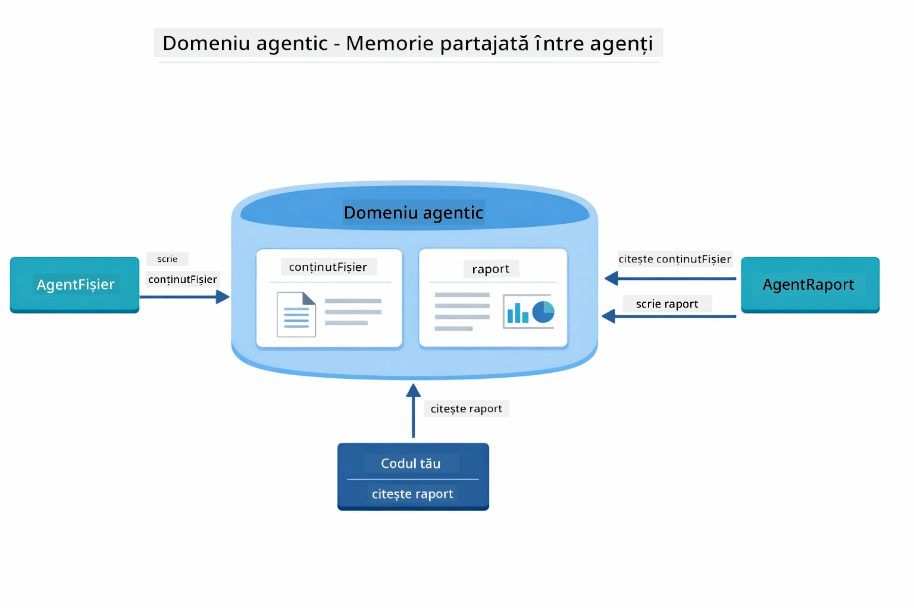

*Agentic Scope funcționează ca memorie partajată — FileAgent scrie `fileContent`, ReportAgent citește și scrie `report`, iar codul tău citește rezultatul final.*

```java
ResultWithAgenticScope<String> result = supervisor.invokeWithAgenticScope(request);
AgenticScope scope = result.agenticScope();
String fileContent = scope.readState("fileContent");  // Date brute din fișier de la FileAgent
String report = scope.readState("report");            // Raport structurat de la ReportAgent
```

**Agent Listeners** permit monitorizarea și depanarea execuției agenților. Ieșirea pas cu pas pe care o vezi în demo provine de la un AgentListener care se atașează fiecărei invocări a agentului:
- **beforeAgentInvocation** - Apelat când Supervisor selectează un agent, permițându-ți să vezi care agent a fost ales și de ce
- **afterAgentInvocation** - Apelat când un agent s-a terminat, afișând rezultatul său
- **inheritedBySubagents** - Când e true, listenerul monitorizează toți agenții din ierarhie

Diagrama următoare arată întregul ciclu de viață al Agent Listener, inclusiv cum `onError` gestionează erorile în timpul execuției agentului:

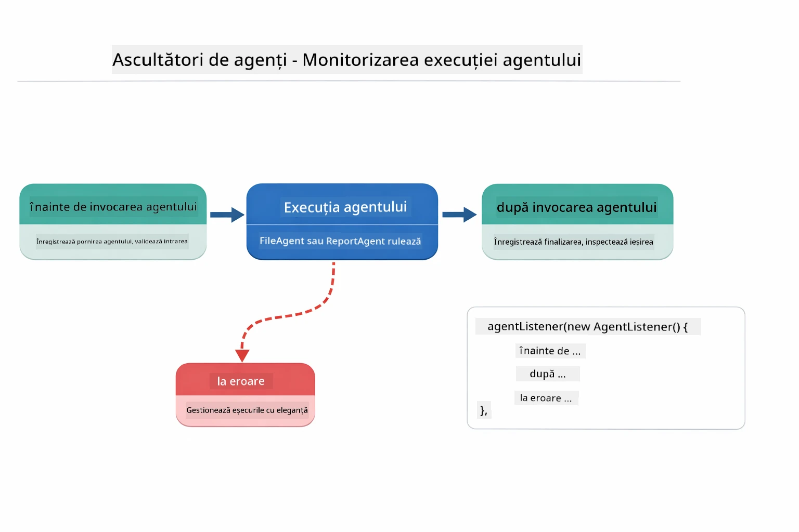

*Agent Listeners se leagă de ciclul de viață al execuției — monitorizează când agenții încep, se termină sau întâmpină erori.*

```java
AgentListener monitor = new AgentListener() {
    private int step = 0;
    
    @Override
    public void beforeAgentInvocation(AgentRequest request) {
        step++;
        System.out.println("  +-- STEP " + step + ": " + request.agentName());
    }
    
    @Override
    public void afterAgentInvocation(AgentResponse response) {
        System.out.println("  +-- [OK] " + response.agentName() + " completed");
    }
    
    @Override
    public boolean inheritedBySubagents() {
        return true; // Propagă către toți sub-agentele
    }
};
```

Dincolo de modelul Supervisor, modulul `langchain4j-agentic` oferă mai multe modele puternice de workflow. Diagrama de mai jos arată toate cele cinci — de la pipeline-uri simple secvențiale la fluxuri de aprobare cu intervenție umană:

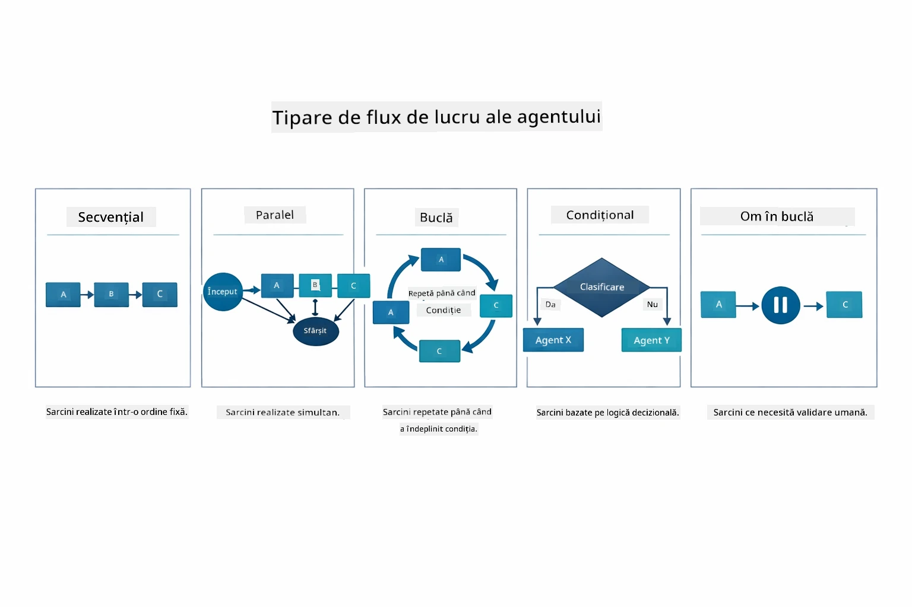

*Cin ci modele de workflow pentru orchestrarea agenților — de la pipeline-uri secvențiale simple la fluxuri de aprobare cu intervenție umană.*

| Model | Descriere | Cazuri de utilizare |
|---------|-------------|----------|
| **Sequential** | Execută agenții în ordine, rezultatul curge către următorul | Pipeline-uri: cercetare → analiză → raportare |
| **Parallel** | Rulează agenți simultan | Sarcini independente: vreme + știri + acțiuni |
| **Loop** | Repetă până se îndeplinește condiția | Evaluarea calității: rafinează până scor ≥ 0.8 |
| **Conditional** | Redirecționează bazat pe condiții | Clasifică → trimite către agent specialist |
| **Human-in-the-Loop** | Adaugă puncte de control umane | Fluxuri de aprobare, revizuire de conținut |

## Concepte Cheie

Acum că ai explorat MCP și modulul agentic în acțiune, să sumarizăm când să folosești fiecare abordare.

Unul dintre cele mai mari avantaje ale MCP este ecosistemul său în creștere. Diagrama de mai jos arată cum un protocol universal unic conectează aplicația ta AI la o varietate largă de servere MCP — de la acces filesystem și baze de date la GitHub, email, web scraping și altele:

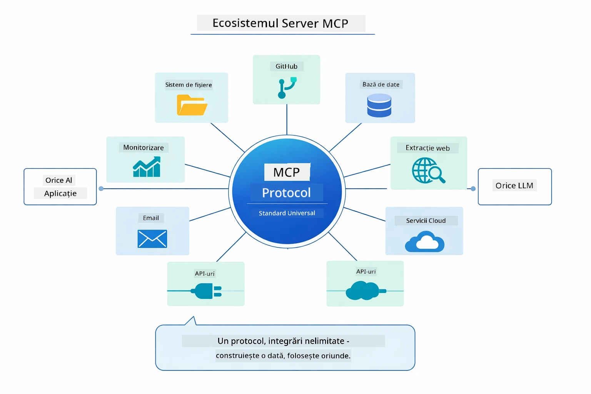

*MCP creează un ecosistem de protocol universal — orice server compatibil MCP funcționează cu orice client compatibil MCP, permițând partajarea instrumentelor între aplicații.*

**MCP** este ideal când vrei să profiți de ecosisteme existente de instrumente, să construiești instrumente pe care multiple aplicații le pot folosi, să integrezi servicii terțe cu protocoale standard sau să schimbi implementările instrumentelor fără a modifica codul.

**Modulul Agentic** funcționează cel mai bine când dorești definiții declarative de agenți cu anotații `@Agent`, ai nevoie de orchestrarea fluxului de lucru (secvențial, buclă, paralel), preferi designul de agent bazat pe interfețe în loc de cod imperativ sau combini mai mulți agenți care partajează outputuri prin `outputKey`.

**Modelul Supervisor Agent** este excelent când fluxul de lucru nu este predictibil dinainte și vrei ca LLM să decidă, când ai mai mulți agenți specializați care necesită orchestrare dinamică, când construiești sisteme conversaționale care redirecționează către capacități diferite sau când dorești cel mai flexibil și adaptiv comportament al agentului.

Pentru a te ajuta să decizi între metodele personalizate `@Tool` din Modulul 04 și instrumentele MCP din acest modul, comparația următoare evidențiază compromisurile cheie — uneltele personalizate îți oferă cuplare strânsă și siguranță completă a tipurilor pentru logica specifică aplicației, în timp ce instrumentele MCP oferă integrări standardizate, reutilizabile:

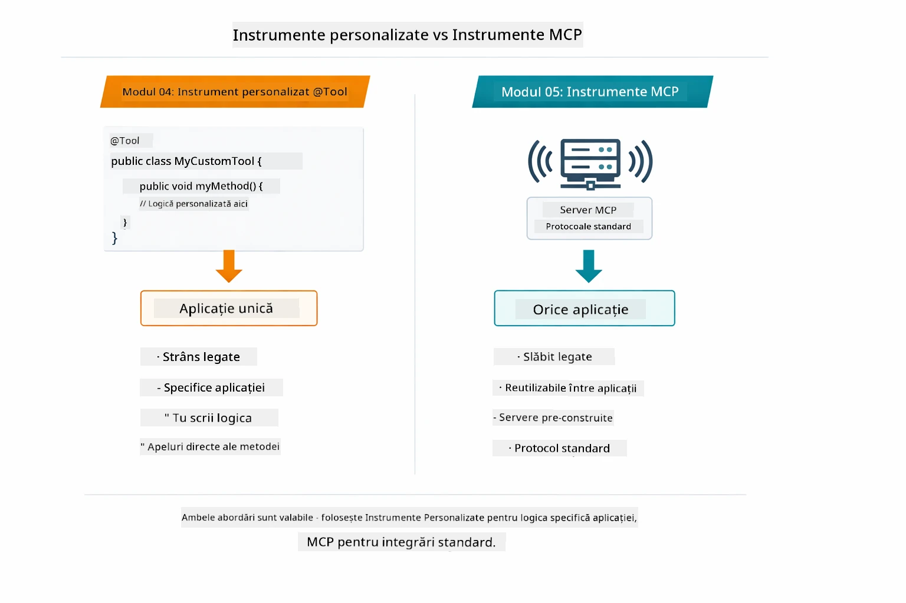

*Când să folosești metode personalizate @Tool vs instrumente MCP — unelte personalizate pentru logica specifică aplicației cu siguranță completă de tip, unelte MCP pentru integrări standardizate care funcționează peste aplicații.*

## Felicitări!

Ai parcurs toate cele cinci module ale cursului LangChain4j pentru începători! Iată o privire asupra întregii călătorii de învățare pe care ai finalizat-o — de la chat-ul de bază până la sistemele agentice puternice cu MCP:

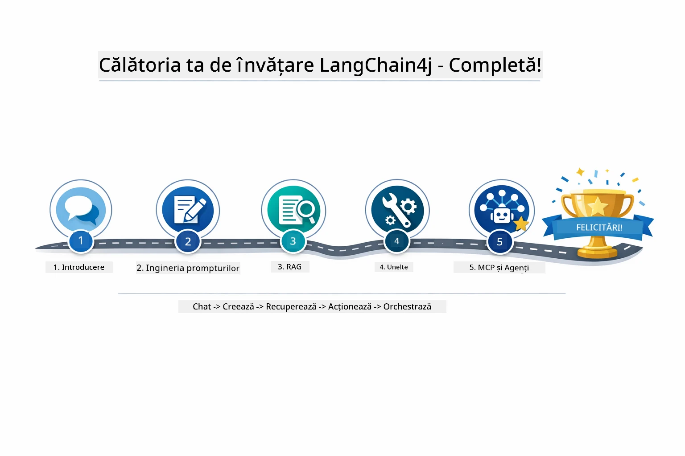

*Călătoria ta de învățare prin toate cele cinci module — de la chat de bază la sisteme agentice puternice cu MCP.*

Ai finalizat cursul LangChain4j pentru începători. Ai învățat:

- Cum să construiești AI conversațional cu memorie (Modul 01)
- Modele de inginerie a prompturilor pentru diverse sarcini (Modul 02)
- Fundamente pentru răspunsuri bazate pe documente cu RAG (Modul 03)
- Crearea agenților AI de bază (asistenți) cu unelte personalizate (Modul 04)
- Integrarea uneltelor standardizate cu modulele LangChain4j MCP și Agentic (Modul 05)

### Ce urmează?

După ce ai terminat modulele, explorează [Ghidul de Testare](../docs/TESTING.md) pentru a vedea conceptele de testare LangChain4j în acțiune.

**Resurse Oficiale:**
- [Documentația LangChain4j](https://docs.langchain4j.dev/) - Ghiduri cuprinzătoare și referință API
- [LangChain4j GitHub](https://github.com/langchain4j/langchain4j) - Cod sursă și exemple
- [Tutoriale LangChain4j](https://docs.langchain4j.dev/tutorials/) - Tutoriale pas cu pas pentru diverse cazuri de utilizare

Mulțumim că ai parcurs acest curs!

---

**Navigare:** [← Anterior: Modul 04 - Unelte](../04-tools/README.md) | [Înapoi la Principal](../README.md)

---

<!-- CO-OP TRANSLATOR DISCLAIMER START -->
**Declinare de responsabilitate**:  
Acest document a fost tradus folosind serviciul de traducere AI [Co-op Translator](https://github.com/Azure/co-op-translator). Deși ne străduim pentru acuratețe, vă rugăm să rețineți că traducerile automate pot conține erori sau inexactități. Documentul original în limba sa nativă trebuie considerat sursa autorizată. Pentru informații critice, se recomandă traducerea profesională realizată de un specialist uman. Nu ne asumăm responsabilitatea pentru eventuale neînțelegeri sau interpretări greșite ce pot apărea din utilizarea acestei traduceri.
<!-- CO-OP TRANSLATOR DISCLAIMER END -->