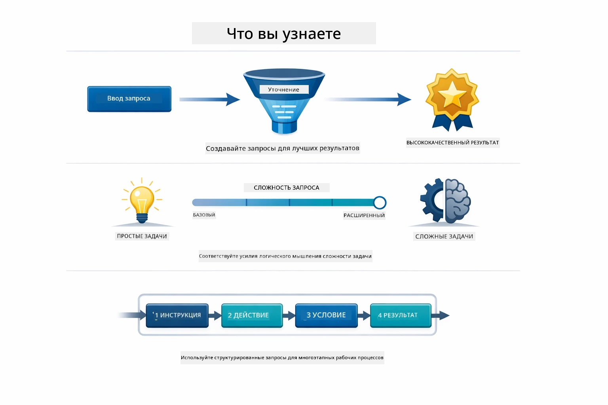
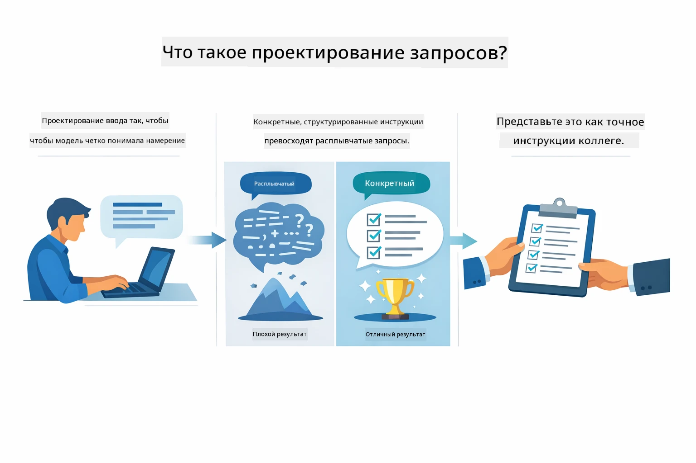
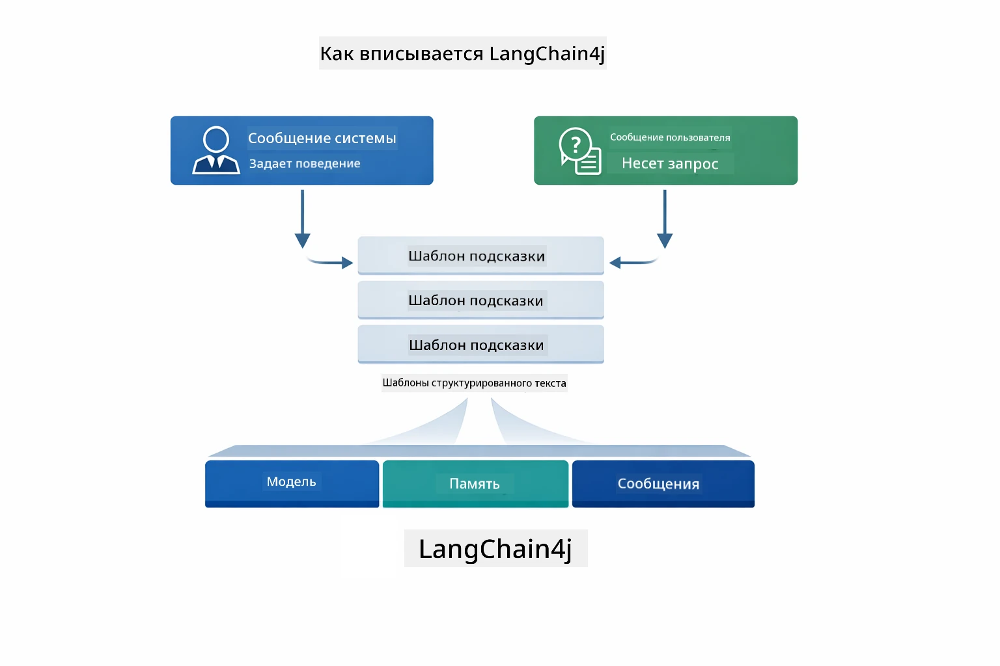
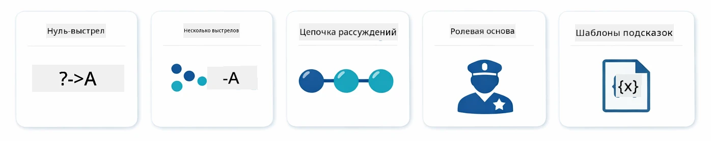
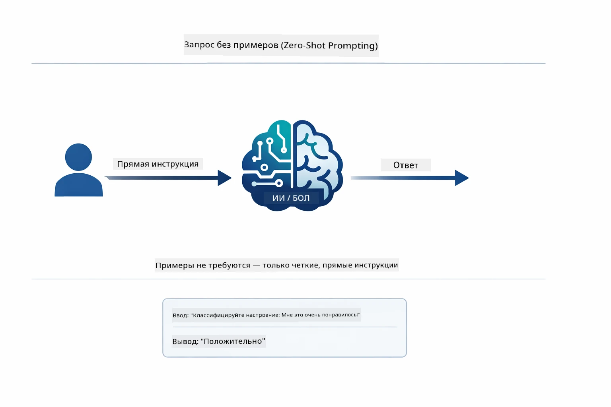
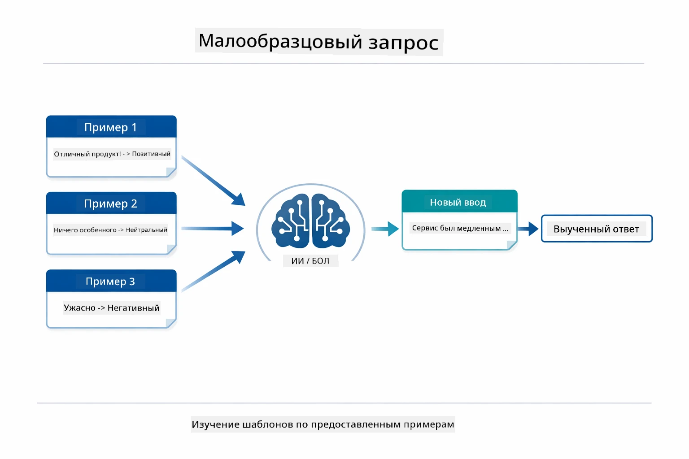
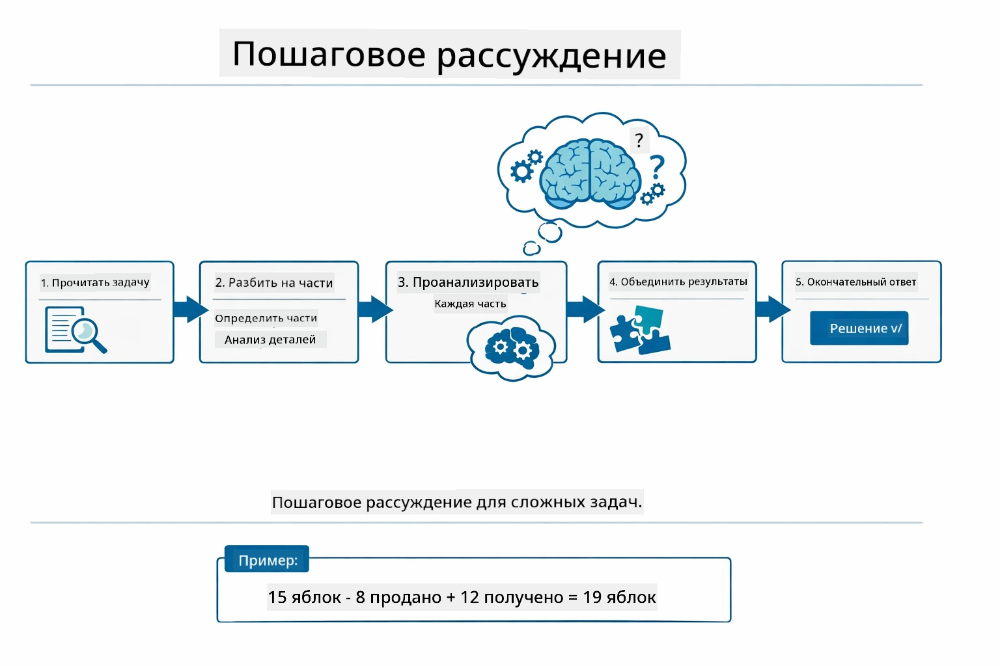
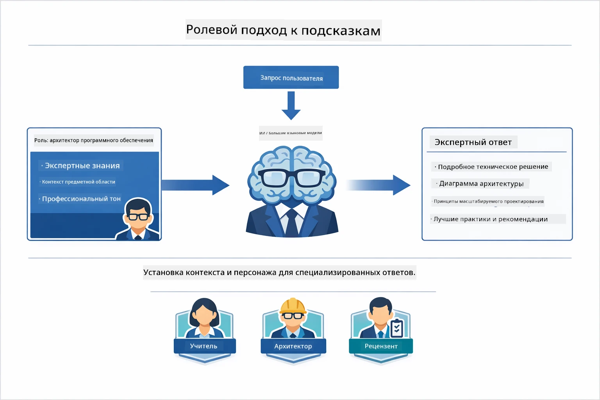
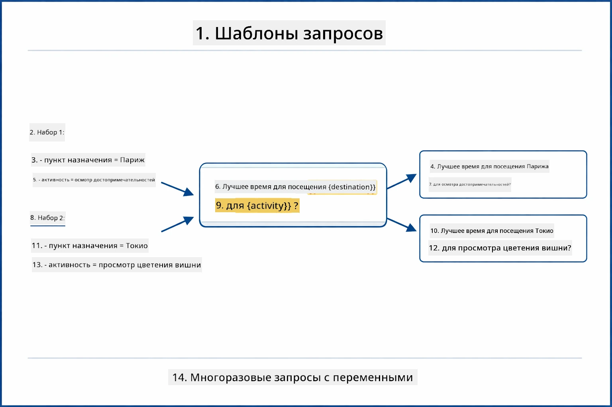
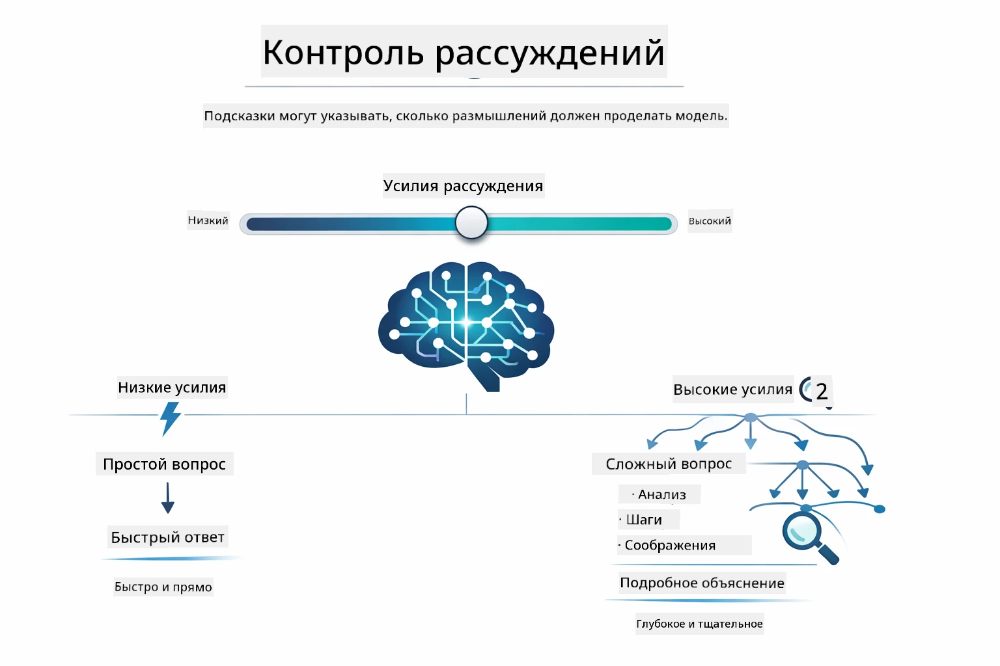

# Модуль 02: Инженерия Промптов с GPT-5.2

## Оглавление

- [Чему вы научитесь](../../../02-prompt-engineering)
- [Предварительные требования](../../../02-prompt-engineering)
- [Понимание инженерии промптов](../../../02-prompt-engineering)
- [Основы инженерии промптов](../../../02-prompt-engineering)
  - [Zero-Shot Prompting](../../../02-prompt-engineering)
  - [Few-Shot Prompting](../../../02-prompt-engineering)
  - [Chain of Thought](../../../02-prompt-engineering)
  - [Role-Based Prompting](../../../02-prompt-engineering)
  - [Шаблоны промптов](../../../02-prompt-engineering)
- [Продвинутые паттерны](../../../02-prompt-engineering)
- [Использование существующих ресурсов Azure](../../../02-prompt-engineering)
- [Скриншоты приложения](../../../02-prompt-engineering)
- [Изучение паттернов](../../../02-prompt-engineering)
  - [Низкая и высокая активность](../../../02-prompt-engineering)
  - [Выполнение задач (преамбулы инструментов)](../../../02-prompt-engineering)
  - [Саморефлексирующий код](../../../02-prompt-engineering)
  - [Структурированный анализ](../../../02-prompt-engineering)
  - [Многошаговый чат](../../../02-prompt-engineering)
  - [Пошаговое рассуждение](../../../02-prompt-engineering)
  - [Ограниченный вывод](../../../02-prompt-engineering)
- [Что вы действительно изучаете](../../../02-prompt-engineering)
- [Следующие шаги](../../../02-prompt-engineering)

## Чему вы научитесь



В предыдущем модуле вы узнали, как память обеспечивает работу разговорного ИИ и использовали GitHub Models для базовых взаимодействий. Теперь мы сосредоточимся на том, как вы задаёте вопросы — на самих промптах — используя GPT-5.2 в Azure OpenAI. То, как вы структурируете промпты, существенно влияет на качество получаемых ответов. Мы начнём с обзора основных техник промптинга, а затем перейдём к восьми продвинутым паттернам, которые полностью раскрывают возможности GPT-5.2.

Мы используем GPT-5.2, потому что он вводит управление размышлением — вы можете указать модели, сколько думать перед ответом. Это делает разные стратегии промптинга более заметными и помогает понять, когда использовать каждый подход. Также мы воспользуемся меньшими ограничениями по частоте запросов для GPT-5.2 в Azure по сравнению с GitHub Models.

## Предварительные требования

- Пройден модуль 01 (развёрнуты ресурсы Azure OpenAI)
- Файл `.env` в корневой директории с учётными данными Azure (созданный командой `azd up` в модуле 01)

> **Примечание:** Если вы не завершили модуль 01, сначала следуйте инструкциям по развёртыванию в нём.

## Понимание инженерии промптов



Инженерия промптов — это проектирование входного текста, который стабильно даёт вам нужные результаты. Это не просто задавание вопросов — это структурирование запросов так, чтобы модель точно понимала, чего вы хотите, и как это предоставить.

Представьте, что даёте инструкции коллеге. «Исправь баг» — это расплывчато. «Исправь исключение null pointer в UserService.java на строке 45, добавив проверку на null» — конкретно. Языковые модели работают так же — важна конкретика и структура.



LangChain4j предоставляет инфраструктуру — подключение к моделям, память и типы сообщений — тогда как паттерны промптов — это просто тщательно структурированный текст, который вы отправляете через эту инфраструктуру. Ключевыми строительными блоками являются `SystemMessage` (задаёт поведение и роль ИИ) и `UserMessage` (несёт ваш реальный запрос).

## Основы инженерии промптов



Прежде чем перейти к продвинутым паттернам этого модуля, давайте рассмотрим пять базовых техник промптинга. Это фундаментальные элементы, которые должен знать каждый инженер промптов. Если вы уже проходили [Быстрый старт](../00-quick-start/README.md#2-prompt-patterns), вы видели их в деле — здесь представлена концептуальная база.

### Zero-Shot Prompting

Самый простой подход: дать модели прямую инструкцию без примеров. Модель полностью полагается на своё обучение, чтобы понять и выполнить задачу. Это хорошо работает для простых запросов, где ожидаемое поведение очевидно.



*Прямая инструкция без примеров — модель выводит задачу из инструкции*

```java
String prompt = "Classify this sentiment: 'I absolutely loved the movie!'";
String response = model.chat(prompt);
// Ответ: "Положительный"
```

**Когда использовать:** Простая классификация, прямые вопросы, переводы или любые задачи, которые модель может выполнить без дополнительного руководства.

### Few-Shot Prompting

Предоставьте примеры, которые демонстрируют паттерн, который вы хотите, чтобы модель использовала. Модель учится ожидаемому формату ввода-вывода из ваших примеров и применяет его к новым данным. Это значительно повышает последовательность для задач, где желаемый формат или поведение неочевидны.



*Обучение на примерах — модель распознаёт паттерн и применяет его к новым входам*

```java
String prompt = """
    Classify the sentiment as positive, negative, or neutral.
    
    Examples:
    Text: "This product exceeded my expectations!" → Positive
    Text: "It's okay, nothing special." → Neutral
    Text: "Waste of money, very disappointed." → Negative
    
    Now classify this:
    Text: "Best purchase I've made all year!"
    """;
String response = model.chat(prompt);
```

**Когда использовать:** Пользовательская классификация, единообразное форматирование, задачи по конкретной области или когда результаты zero-shot нестабильны.

### Chain of Thought

Попросите модель показывать рассуждения шаг за шагом. Вместо того чтобы сразу давать ответ, модель разбивает проблему на части и последовательно решает каждую. Это улучшает точность в задачах по математике, логике и многоступенчатых рассуждениях.



*Пошаговое рассуждение — разбивка сложных задач на явные логические шаги*

```java
String prompt = """
    Problem: A store has 15 apples. They sell 8 apples and then 
    receive a shipment of 12 more apples. How many apples do they have now?
    
    Let's solve this step-by-step:
    """;
String response = model.chat(prompt);
// Модель показывает: 15 - 8 = 7, затем 7 + 12 = 19 яблок
```

**Когда использовать:** Математические задачи, логические головоломки, отладка или любые задачи, где показ процесса рассуждений улучшает точность и доверие.

### Role-Based Prompting

Задайте персону или роль ИИ перед тем, как задать вопрос. Это даёт контекст, который формирует тон, глубину и фокус ответа. «Архитектор ПО» даст советы, отличающиеся от «младшего разработчика» или «аудитора по безопасности».



*Задание контекста и роли — один и тот же вопрос получит разный ответ в зависимости от роли*

```java
String prompt = """
    You are an experienced software architect reviewing code.
    Provide a brief code review for this function:
    
    def calculate_total(items):
        total = 0
        for item in items:
            total = total + item['price']
        return total
    """;
String response = model.chat(prompt);
```

**Когда использовать:** Рецензирование кода, обучение, анализ в конкретной области или когда нужны ответы, адаптированные к уровню экспертизы или точке зрения.

### Шаблоны промптов

Создавайте повторно используемые промпты с переменными-заполнителями. Вместо того чтобы писать новый промпт каждый раз, определите шаблон один раз и подставляйте разные значения. Класс `PromptTemplate` LangChain4j упрощает это с помощью синтаксиса `{{variable}}`.



*Повторно используемые промпты с переменными — один шаблон, множество применений*

```java
PromptTemplate template = PromptTemplate.from(
    "What's the best time to visit {{destination}} for {{activity}}?"
);

Prompt prompt = template.apply(Map.of(
    "destination", "Paris",
    "activity", "sightseeing"
));

String response = model.chat(prompt.text());
```

**Когда использовать:** Повторяющиеся запросы с разными входными данными, пакетная обработка, построение повторно используемых рабочих процессов ИИ или любой случай, когда структура промпта остаётся той же, а данные меняются.

---

Эти пять основ дают вам надёжный набор инструментов для большинства задач промптинга. Остальная часть модуля строится на них с помощью **восьми продвинутых паттернов**, которые используют возможности GPT-5.2 для управления рассуждениями, самоконтроля и структурированного вывода.

## Продвинутые паттерны

После изучения основ перейдём к восьми продвинутым паттернам, которые делают этот модуль уникальным. Не все задачи требуют одного и того же подхода. Одни вопросы требуют быстрых ответов, другие — глубокого анализа. Одни требуют видимых рассуждений, другие — только результатов. Каждый паттерн оптимизирован для конкретного сценария — и управление рассуждениями в GPT-5.2 делает различия ещё более заметными.


*Обзор восьми паттернов инженерии промптов и их случаев применения*



*Управление рассуждениями GPT-5.2 позволяет указать, сколько модель должна думать — от быстрых прямых ответов до глубокого анализа*

**Низкая активность (быстро и лаконично)** — для простых вопросов, где нужны быстрые и прямые ответы. Модель выполняет минимум рассуждений — максимум 2 шага. Используйте для вычислений, запросов к базе или простых вопросов.

```java
String prompt = """
    <context_gathering>
    - Search depth: very low
    - Bias strongly towards providing a correct answer as quickly as possible
    - Usually, this means an absolute maximum of 2 reasoning steps
    - If you think you need more time, state what you know and what's uncertain
    </context_gathering>
    
    Problem: What is 15% of 200?
    
    Provide your answer:
    """;

String response = chatModel.chat(prompt);
```

> 💡 **Изучайте с GitHub Copilot:** Откройте [`Gpt5PromptService.java`](../../../02-prompt-engineering/src/main/java/com/example/langchain4j/prompts/service/Gpt5PromptService.java) и спросите:
> - "В чём разница между паттернами низкой и высокой активности?"
> - "Как теги XML в промптах помогают структурировать ответ ИИ?"
> - "Когда использовать паттерны саморефлексии, а когда прямые инструкции?"

**Высокая активность (глубоко и тщательно)** — для сложных задач, где нужен всесторонний анализ. Модель глубоко исследует проблему и показывает детальные рассуждения. Используйте для проектирования систем, архитектурных решений или сложных исследований.

```java
String prompt = """
    Analyze this problem thoroughly and provide a comprehensive solution.
    Consider multiple approaches, trade-offs, and important details.
    Show your analysis and reasoning in your response.
    
    Problem: Design a caching strategy for a high-traffic REST API.
    """;

String response = chatModel.chat(prompt);
```

**Выполнение задач (пошаговый прогресс)** — для многошаговых рабочих процессов. Модель даёт план заранее, описывает каждый шаг в процессе и в конце подводит итог. Используйте для миграций, внедрений или любых многошаговых процессов.

```java
String prompt = """
    <task_execution>
    1. First, briefly restate the user's goal in a friendly way
    
    2. Create a step-by-step plan:
       - List all steps needed
       - Identify potential challenges
       - Outline success criteria
    
    3. Execute each step:
       - Narrate what you're doing
       - Show progress clearly
       - Handle any issues that arise
    
    4. Summarize:
       - What was completed
       - Any important notes
       - Next steps if applicable
    </task_execution>
    
    <tool_preambles>
    - Always begin by rephrasing the user's goal clearly
    - Outline your plan before executing
    - Narrate each step as you go
    - Finish with a distinct summary
    </tool_preambles>
    
    Task: Create a REST endpoint for user registration
    
    Begin execution:
    """;

String response = chatModel.chat(prompt);
```

Chain-of-Thought (цепочка рассуждений) явно просит модель показать ход мыслей, улучшая точность в сложных задачах. Пошаговый разбор помогает и человеку, и ИИ понять логику.

> **🤖 Попробуйте с [GitHub Copilot](https://github.com/features/copilot) Chat:** Спросите про этот паттерн:
> - "Как адаптировать паттерн выполнения задачи для длительных операций?"
> - "Какие лучшие практики построения преамбул инструментов в продуктивных приложениях?"
> - "Как можно захватывать и отображать промежуточные обновления прогресса в UI?"


*План → Выполнение → Итог для многошаговых задач*

**Саморефлексирующий код** — для генерации кода производства. Модель генерирует код по стандартам продакшена с правильной обработкой ошибок. Используйте при создании новых функций или сервисов.

```java
String prompt = """
    Generate Java code with production-quality standards: Create an email validation service
    Keep it simple and include basic error handling.
    """;

String response = chatModel.chat(prompt);
```


*Итеративный цикл улучшений — генерировать, оценивать, выявлять проблемы, улучшать, повторять*

**Структурированный анализ** — для последовательной оценки. Модель проверяет код в рамках фиксированной схемы (корректность, практики, производительность, безопасность, поддерживаемость). Используйте для ревью кода или оценки качества.

```java
String prompt = """
    <analysis_framework>
    You are an expert code reviewer. Analyze the code for:
    
    1. Correctness
       - Does it work as intended?
       - Are there logical errors?
    
    2. Best Practices
       - Follows language conventions?
       - Appropriate design patterns?
    
    3. Performance
       - Any inefficiencies?
       - Scalability concerns?
    
    4. Security
       - Potential vulnerabilities?
       - Input validation?
    
    5. Maintainability
       - Code clarity?
       - Documentation?
    
    <output_format>
    Provide your analysis in this structure:
    - Summary: One-sentence overall assessment
    - Strengths: 2-3 positive points
    - Issues: List any problems found with severity (High/Medium/Low)
    - Recommendations: Specific improvements
    </output_format>
    </analysis_framework>
    
    Code to analyze:
    ```
    public List getUsers() {
        return database.query("SELECT * FROM users");
    }
    ```
    Provide your structured analysis:
    """;

String response = chatModel.chat(prompt);
```

> **🤖 Попробуйте с [GitHub Copilot](https://github.com/features/copilot) Chat:** Спросите про структурированный анализ:
> - "Как настроить рамки анализа для разных типов ревью?"
> - "Как программно разбирать и использовать структурированный вывод?"
> - "Как обеспечить согласованность уровней серьёзности в разных ревью?"


*Рамки для последовательных ревью кода с уровнями серьёзности*

**Многошаговый чат** — для диалогов с учётом контекста. Модель запоминает предыдущие сообщения и строит ответ, основываясь на них. Используйте для интерактивной поддержки или сложных Q&A.

```java
ChatMemory memory = MessageWindowChatMemory.withMaxMessages(10);

memory.add(UserMessage.from("What is Spring Boot?"));
AiMessage aiMessage1 = chatModel.chat(memory.messages()).aiMessage();
memory.add(aiMessage1);

memory.add(UserMessage.from("Show me an example"));
AiMessage aiMessage2 = chatModel.chat(memory.messages()).aiMessage();
memory.add(aiMessage2);
```


*Как контекст разговора накапливается с нескольких ходов до достижения лимита токенов*

**Пошаговое рассуждение** — для задач, требующих видимой логики. Модель показывает явное рассуждение на каждом шаге. Используйте для математики, логики или когда нужно понять ход мыслей.

```java
String prompt = """
    <instruction>Show your reasoning step-by-step</instruction>
    
    If a train travels 120 km in 2 hours, then stops for 30 minutes,
    then travels another 90 km in 1.5 hours, what is the average speed
    for the entire journey including the stop?
    """;

String response = chatModel.chat(prompt);
```


*Разбиение задач на явные логические шаги*

**Ограниченный вывод** — для ответов с конкретными форматами. Модель строго соблюдает правила формата и длины. Используйте для резюме или когда нужен точный формат вывода.

```java
String prompt = """
    <constraints>
    - Exactly 100 words
    - Bullet point format
    - Technical terms only
    </constraints>
    
    Summarize the key concepts of machine learning.
    """;

String response = chatModel.chat(prompt);
```


*Обеспечение конкретных требований к формату, длине и структуре*

## Использование существующих ресурсов Azure

**Проверьте развертывание:**

Убедитесь, что файл `.env` существует в корне с учётными данными Azure (создан в Модуле 01):
```bash
cat ../.env  # Должен показывать AZURE_OPENAI_ENDPOINT, API_KEY, DEPLOYMENT
```

**Запуск приложения:**

> **Примечание:** Если вы уже запускали все приложения с помощью `./start-all.sh` из Модуля 01, этот модуль уже работает на порту 8083. Можно пропустить команды запуска и перейти сразу на http://localhost:8083.

**Вариант 1: Использование Spring Boot Dashboard (Рекомендуется для пользователей VS Code)**

Dev контейнер включает расширение Spring Boot Dashboard, предоставляющее визуальный интерфейс для управления всеми приложениями Spring Boot. Его можно найти на панели активности слева в VS Code (значок Spring Boot).

Через Spring Boot Dashboard вы можете:
- Просматривать все доступные приложения Spring Boot в рабочей области
- Запускать/остановливать приложения одним кликом
- Просматривать логи приложений в реальном времени
- Отслеживать состояние приложений
Просто нажмите кнопку воспроизведения рядом с "prompt-engineering", чтобы запустить этот модуль, или запустите все модули одновременно.


**Вариант 2: Использование shell-скриптов**

Запустите все веб-приложения (модули 01-04):

**Bash:**
```bash
cd ..  # Из корневого каталога
./start-all.sh
```

**PowerShell:**
```powershell
cd ..  # Из корневого каталога
.\start-all.ps1
```

Или запустите только этот модуль:

**Bash:**
```bash
cd 02-prompt-engineering
./start.sh
```

**PowerShell:**
```powershell
cd 02-prompt-engineering
.\start.ps1
```

Оба скрипта автоматически загружают переменные окружения из корневого файла `.env` и соберут JAR-файлы, если они отсутствуют.

> **Примечание:** Если вы предпочитаете собрать все модули вручную перед запуском:
>
> **Bash:**
> ```bash
> cd ..  # Go to root directory
> mvn clean package -DskipTests
> ```
>
> **PowerShell:**
> ```powershell
> cd ..  # Go to root directory
> mvn clean package -DskipTests
> ```

Откройте http://localhost:8083 в вашем браузере.

**Для остановки:**

**Bash:**
```bash
./stop.sh  # Только этот модуль
# Или
cd .. && ./stop-all.sh  # Все модули
```

**PowerShell:**
```powershell
.\stop.ps1  # Только этот модуль
# Или
cd ..; .\stop-all.ps1  # Все модули
```

## Скриншоты приложения


*Основная панель управления, показывающая все 8 шаблонов prompt engineering с их характеристиками и случаями использования*

## Изучение шаблонов

Веб-интерфейс позволяет экспериментировать с различными стратегиями prompt’ов. Каждый шаблон решает разные задачи — попробуйте их, чтобы увидеть, когда какой подход проявляется лучше.

### Низкий vs высокий уровень усердия

Задайте простой вопрос, например, "Каково 15% от 200?" с Низким уровнем усердия. Вы получите мгновенный, прямой ответ. Теперь задайте что-то сложное, например, "Разработайте стратегию кеширования для API с высокой нагрузкой" с Высоким уровнем усердия. Обратите внимание, как модель замедляется и даёт детальное объяснение. Та же модель, та же структура вопроса — но prompt подсказывает, сколько мыслительного процесса делать.


*Быстрое вычисление с минимальным рассуждением*


*Подробная стратегия кеширования (2.8MB)*

### Выполнение задач (предварительные подсказки инструментов)

Многошаговые рабочие процессы выигрывают от предварительного планирования и ведения рассказа о прогрессе. Модель описывает, что она собирается делать, рассказывает о каждом шаге и затем подводит итоги.


*Создание REST-эндпоинта с поэтапным рассказом (3.9MB)*

### Саморефлексирующий код

Попробуйте "Создать сервис валидации email". Вместо простой генерации кода и остановки модель генерирует, оценивает качество, выявляет слабые места и улучшает. Вы увидите, как она повторяет цикл, пока код не достигнет производственных стандартов.


*Полный сервис валидации email (5.2MB)*

### Структурированный анализ

Код ревью требует последовательных критериев оценки. Модель анализирует код по фиксированным категориям (корректность, практики, производительность, безопасность) с уровнями серьёзности.


*Код ревью по заданной схеме*

### Многоходовой чат

Задайте вопрос "Что такое Spring Boot?", затем сразу следом "Покажи пример". Модель помнит ваш первый вопрос и даёт конкретный пример по Spring Boot. Без памяти второй вопрос был бы слишком расплывчатым.


*Сохранение контекста между вопросами*

### Пошаговое рассуждение

Выберите математическую задачу и попробуйте решить её с помощью Пошагового рассуждения и Низкого усердия. Низкий усердие просто даёт ответ — быстро, но непонятно. Пошаговое рассуждение показывает каждый расчёт и решение.


*Математическая задача с явными шагами*

### Ограниченный вывод

Когда нужны конкретные форматы или количество слов, этот шаблон строго соблюдает требования. Попробуйте сгенерировать резюме ровно из 100 слов в формате списка.


*Резюме по машинному обучению с контролем формата*

## Чему вы действительно учитесь

**Усилия при рассуждении меняют всё**

GPT-5.2 позволяет контролировать вычислительные усилия через ваши prompt’ы. Низкие усилия — быстрые ответы с минимальным поиском. Высокие — модель тратит время на глубокое обдумывание. Вы учитесь подбирать усилия под сложность задачи — не тратить время на простые вопросы, но и не спешить с комплексными решениями.

**Структура задаёт поведение**

Заметили XML-теги в prompt’ах? Это не украшение. Модели надёжнее следуют структурированным инструкциям, чем свободному тексту. Когда нужны многошаговые процессы или сложная логика, структура помогает модели отслеживать, на каком шаге она и что делать дальше.


*Анатомия хорошо структурированного prompt’а с понятными разделами и организацией в стиле XML*

**Качество через самооценку**

Саморефлексирующие шаблоны работают, делая критерии качества явными. Вместо того чтобы надеяться, что модель "сделает правильно", вы точно указываете, что значит "правильно": корректная логика, обработка ошибок, производительность, безопасность. Модель оценивает собственный вывод и улучшает его. Это превращает генерацию кода из лотереи в процесс.

**Контекст ограничен**

Многоходовые беседы работают, включая историю сообщений в каждый запрос. Но есть ограничение — у каждой модели есть максимальное количество токенов. По мере роста диалогов нужны стратегии, чтобы сохранять важный контекст без превышения лимита. Этот модуль показывает, как работает память; позже вы узнаете, когда нужно суммировать, когда забывать и когда извлекать.

## Следующие шаги

**Следующий модуль:** [03-rag - RAG (Retrieval-Augmented Generation)](../03-rag/README.md)

---

**Навигация:** [← Назад: Модуль 01 - Введение](../01-introduction/README.md) | [Вернуться на главную](../README.md) | [Вперёд: Модуль 03 - RAG →](../03-rag/README.md)

---

<!-- CO-OP TRANSLATOR DISCLAIMER START -->
**Отказ от ответственности**:  
Данный документ был переведен с помощью сервиса автоматического перевода [Co-op Translator](https://github.com/Azure/co-op-translator). Несмотря на наши усилия по обеспечению точности, обратите внимание, что автоматический перевод может содержать ошибки или неточности. Оригинальный документ на его исходном языке следует считать официальным и достоверным источником. Для получения критически важной информации рекомендуется обращаться к профессиональному переводу, выполненному человеком. Мы не несем ответственности за любые недоразумения или неправильные толкования, возникшие в результате использования данного перевода.
<!-- CO-OP TRANSLATOR DISCLAIMER END -->