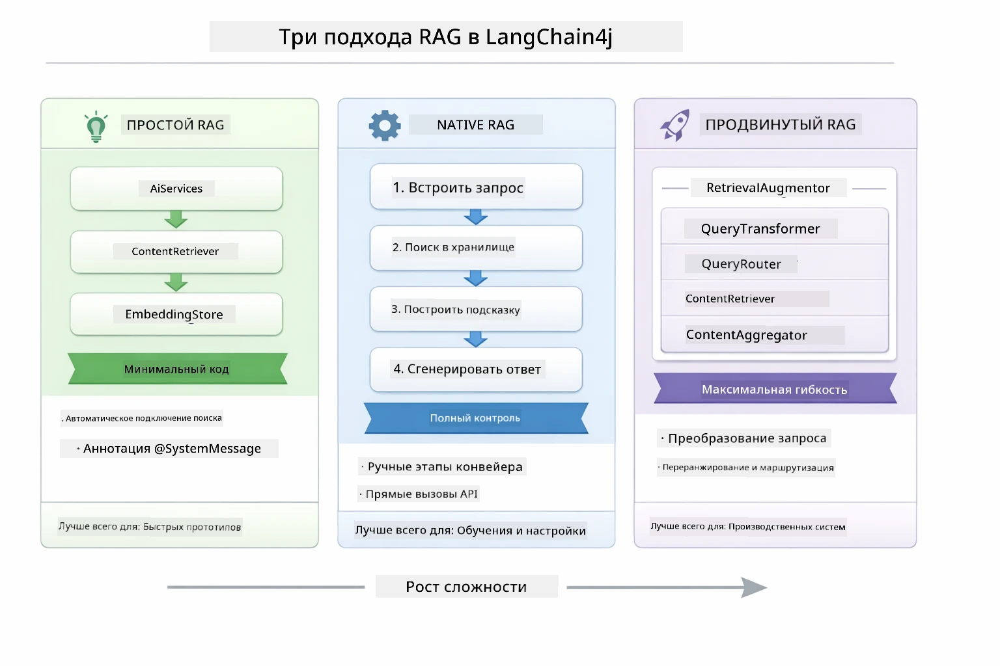
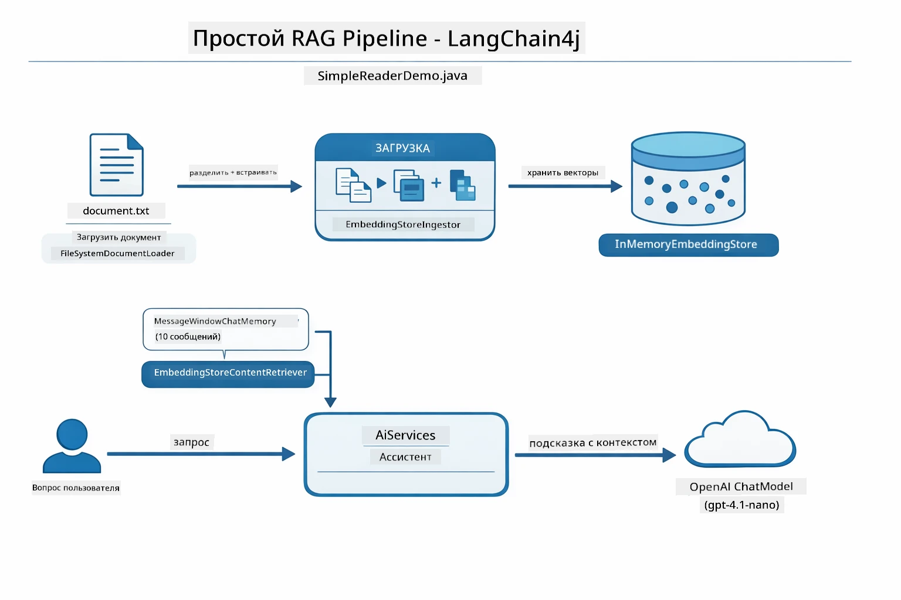
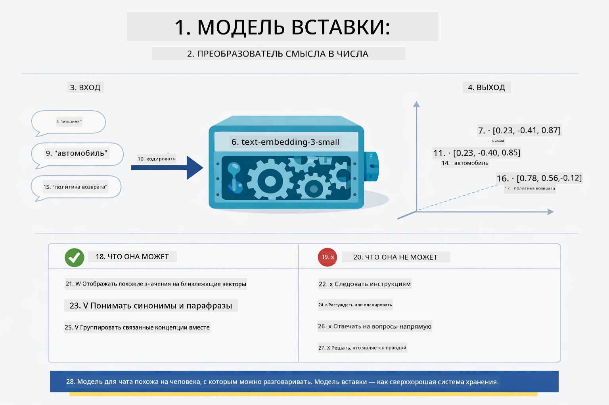
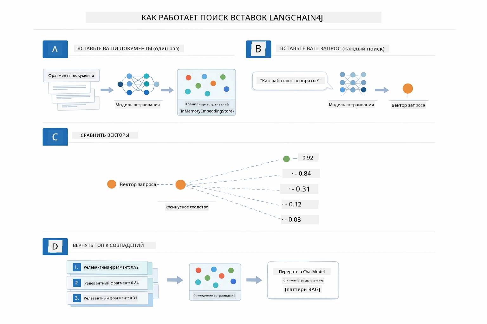
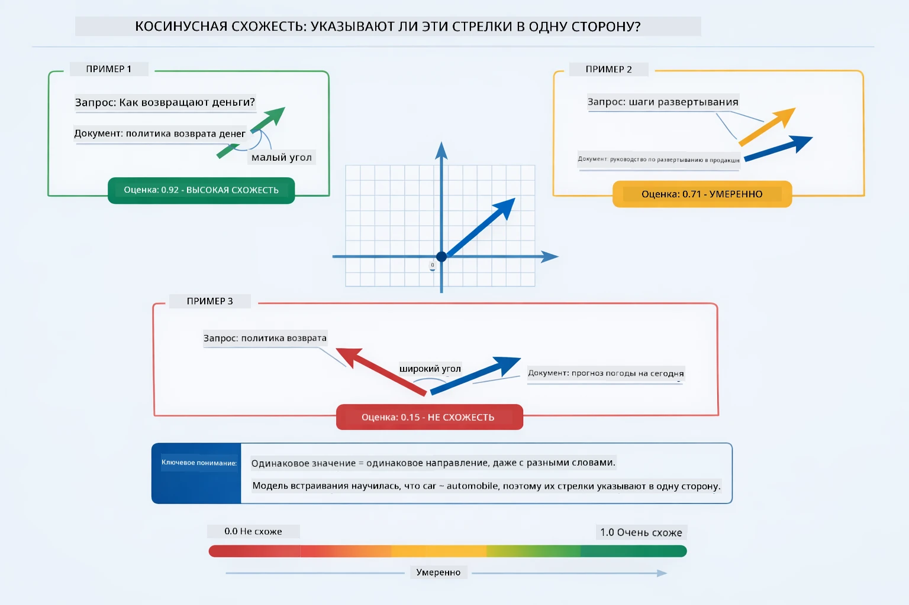
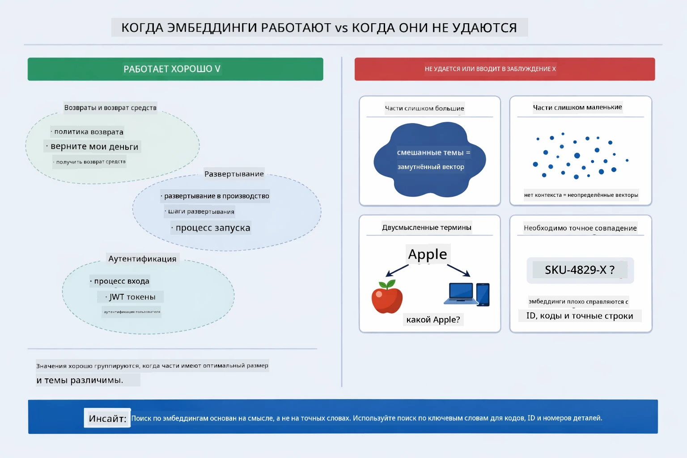

# Модуль 03: RAG (Генерация с использованием поиска)

## Содержание

- [Видео-обзор](../../../03-rag)
- [Чему вы научитесь](../../../03-rag)
- [Требования](../../../03-rag)
- [Понимание RAG](../../../03-rag)
  - [Какой подход RAG используется в этом руководстве?](../../../03-rag)
- [Как это работает](../../../03-rag)
  - [Обработка документов](../../../03-rag)
  - [Создание эмбеддингов](../../../03-rag)
  - [Семантический поиск](../../../03-rag)
  - [Генерация ответов](../../../03-rag)
- [Запуск приложения](../../../03-rag)
- [Использование приложения](../../../03-rag)
  - [Загрузка документа](../../../03-rag)
  - [Задавайте вопросы](../../../03-rag)
  - [Проверка источников](../../../03-rag)
  - [Эксперименты с вопросами](../../../03-rag)
- [Ключевые концепции](../../../03-rag)
  - [Стратегия разбиения на куски](../../../03-rag)
  - [Оценка сходства](../../../03-rag)
  - [Хранение в памяти](../../../03-rag)
  - [Управление контекстным окном](../../../03-rag)
- [Когда важен RAG](../../../03-rag)
- [Следующие шаги](../../../03-rag)

## Видео-обзор

Посмотрите эту живую сессию, которая объясняет, как начать работу с этим модулем:

<a href="https://www.youtube.com/watch?v=_olq75ZH_eY"></a>

## Чему вы научитесь

В предыдущих модулях вы узнали, как вести беседы с ИИ и эффективно структурировать подсказки. Но есть фундаментальное ограничение: языковые модели знают только то, чему их обучили. Они не могут отвечать на вопросы о политике вашей компании, документации ваших проектов или любую информацию, на которой их не обучали.

RAG (Генерация с использованием поиска) решает эту проблему. Вместо того чтобы пытаться обучить модель вашей информации (что дорого и непрактично), вы даёте ей возможность искать по вашим документам. Когда кто-то задаёт вопрос, система находит релевантную информацию и включает её в подсказку. Затем модель отвечает, опираясь на этот найденный контекст.

Подумайте о RAG как о предоставлении модели справочной библиотеки. Когда вы задаёте вопрос, система:

1. **Запрос пользователя** — вы задаёте вопрос
2. **Эмбеддинг** — преобразует ваш вопрос в вектор
3. **Поиск в векторном пространстве** — находит похожие куски документа
4. **Сбор контекста** — добавляет релевантные куски к подсказке
5. **Ответ** — LLM генерирует ответ на основе контекста

Это позволяет моделям давать ответы, основанные на ваших реальных данных, а не только на знаниях, полученных во время обучения, или на вымысле.

## Требования

- Завершённый [Модуль 00 – Быстрый старт](../00-quick-start/README.md) (для примера Easy RAG, упомянутого выше)
- Завершённый [Модуль 01 – Введение](../01-introduction/README.md) (развернуты ресурсы Azure OpenAI, включая модель эмбеддингов `text-embedding-3-small`)
- Файл `.env` в корне с учётными данными Azure (создаётся командой `azd up` в Модуле 01)

> **Примечание:** Если вы еще не прошли Модуль 01, сначала выполните инструкции по развертыванию там. Команда `azd up` развёртывает как модель GPT для чата, так и модель эмбеддингов, используемую в этом модуле.

## Понимание RAG

Ниже показана диаграмма, иллюстрирующая основную идею: вместо того чтобы полагаться только на обучающие данные модели, RAG предоставляет ей справочную библиотеку ваших документов, к которой она обращается перед генерацией каждого ответа.


*Эта диаграмма показывает разницу между стандартной LLM (которая основывается на предположениях из обучающих данных) и LLM с поддержкой RAG (которая сначала обращается к вашим документам).*

Вот как связаны все элементы от начала до конца. Вопрос пользователя проходит четыре этапа — эмбеддинг, поиск по векторам, сбор контекста и генерация ответа — каждый из которых строится на предыдущем:


*Диаграмма показывает полный конвейер RAG – запрос пользователя проходит через эмбеддинг, поиск по векторам, сбор контекста и генерацию ответа.*

Остальная часть модуля подробно рассматривает каждый этап с кодом, который вы можете запускать и модифицировать.

### Какой подход RAG используется в этом руководстве?

LangChain4j предлагает три способа реализации RAG, каждый с разным уровнем абстракции. Ниже диаграмма сравнивает их бок о бок:



*Диаграмма сравнивает три подхода RAG в LangChain4j — Easy, Native и Advanced — показывая их ключевые компоненты и когда использовать каждый.*

| Подход | Что делает | Компромисс |
|---|---|---|
| **Easy RAG** | Автоматически соединяет всё через `AiServices` и `ContentRetriever`. Вы аннотируете интерфейс, подключаете поисковик, а LangChain4j обрабатывает эмбеддинг, поиск и сбор подсказок за кулисами. | Минимум кода, но вы не видите, что происходит на каждом шаге. |
| **Native RAG** | Вы сами вызываете модель эмбеддингов, ищете в хранилище, строите подсказку и генерируете ответ — шаг за шагом и явно. | Больше кода, но каждый этап виден и может быть изменён. |
| **Advanced RAG** | Использует фреймворк `RetrievalAugmentor` с настраиваемыми трансформерами запросов, маршрутизаторами, переоценщиками и инжекторами контента для промышленного уровня. | Максимальная гибкость, но значительно повышенная сложность. |

**В этом руководстве используется Native подход.** Каждый этап конвейера RAG — эмбеддинг запроса, поиск в векторном хранилище, сбор контекста и генерация ответа — явно описан в [`RagService.java`](../../../03-rag/src/main/java/com/example/langchain4j/rag/service/RagService.java). Это сделано намеренно: как учебный ресурс, важнее видеть и понимать каждый шаг, чем минимизировать код. Когда вы освоитесь с механизмом, сможете перейти к Easy RAG для быстрых прототипов или к Advanced RAG для производственных систем.

> **💡 Уже видели Easy RAG в действии?** Модуль [Быстрого старта](../00-quick-start/README.md) содержит пример Q&A по документам ([`SimpleReaderDemo.java`](../../../00-quick-start/src/main/java/com/example/langchain4j/quickstart/SimpleReaderDemo.java)), использующий подход Easy RAG — LangChain4j автоматически обрабатывает эмбеддинг, поиск и сбор подсказок. Этот модуль идёт дальше, раскрывая конвейер, чтобы вы могли видеть и контролировать каждый этап.



*Эта диаграмма показывает конвейер Easy RAG из `SimpleReaderDemo.java`. Сравните с Native подходом этого модуля: Easy RAG скрывает эмбеддинг, поиск и сбор подсказок за `AiServices` и `ContentRetriever` — вы загружаете документ, подключаете поисковик и получаете ответы. Native подход раскрывает конвейер, чтобы вы сами вызывали каждый этап — эмбеддинг, поиск, сбор контекста, генерация, получая полный контроль и видимость.*

## Как это работает

Конвейер RAG в этом модуле разбит на четыре этапа, которые выполняются последовательно каждый раз, когда пользователь задаёт вопрос. Сначала загруженный документ **разбирается и разбивается на куски** — управляемые по размеру части. Затем эти куски преобразуются в **векторные эмбеддинги** и сохраняются для математического сравнения. При поступлении запроса система выполняет **семантический поиск**, чтобы найти самые релевантные куски и в итоге передать их в качестве контекста LLM для **генерации ответа**. Ниже разделы подробно рассматривают каждый этап с реальным кодом и диаграммами. Начнём с первого шага.

### Обработка документов

[DocumentService.java](../../../03-rag/src/main/java/com/example/langchain4j/rag/service/DocumentService.java)

Когда вы загружаете документ, система парсит его (PDF или простой текст), добавляет метаданные, такие как имя файла, а затем разбивает на куски — меньшие части, которые комфортно помещаются в контекстное окно модели. Куски перекрываются, чтобы не терять контекст на границах.

```java
// Разобрать загруженный файл и обернуть его в документ LangChain4j
Document document = Document.from(content, metadata);

// Разделить на фрагменты по 300 токенов с перекрытием в 30 токенов
DocumentSplitter splitter = DocumentSplitters
    .recursive(300, 30);

List<TextSegment> segments = splitter.split(document);
```


Ниже диаграмма показывает это наглядно. Обратите внимание, что каждый кусок перекрывается с соседними примерно на 30 токенов — это обеспечивает сохранность важного контекста между кусками:


*Диаграмма показывает разбиение документа на куски по 300 токенов с перекрытием в 30 токенов, что сохраняет контекст на границах.*

> **🤖 Попробуйте с помощью [GitHub Copilot](https://github.com/features/copilot) Chat:** Откройте [`DocumentService.java`](../../../03-rag/src/main/java/com/example/langchain4j/rag/service/DocumentService.java) и спросите:
> - «Как LangChain4j разбивает документы на куски и почему перекрытие важно?»
> - «Какой оптимальный размер кусков для разных типов документов и почему?»
> - «Как обрабатывать документы на нескольких языках или со специальным форматированием?»

### Создание эмбеддингов

[LangChainRagConfig.java](../../../03-rag/src/main/java/com/example/langchain4j/rag/config/LangChainRagConfig.java)

Каждый кусок преобразуется в числовое представление, называемое эмбеддингом — по сути, преобразователь смысла в числа. Модель эмбеддингов не "умная", как чат-модель; она не умеет следовать инструкциям, рассуждать или отвечать на вопросы. Она сопоставляет текст с математическим пространством, где похожие значения оказываются рядом — например, «машина» рядом с «автомобилем», «политика возврата» рядом с «верни мои деньги». Если чат-модель — это человек, с которым можно поговорить, то модель эмбеддингов — это очень хороший файловый каталог.



*Диаграмма показывает, как модель эмбеддингов преобразует текст в численные векторы, располагая схожие значения — например, «машина» и «автомобиль» — рядом в векторном пространстве.*

```java
@Bean
public EmbeddingModel embeddingModel() {
    return OpenAiOfficialEmbeddingModel.builder()
        .baseUrl(azureOpenAiEndpoint)
        .apiKey(azureOpenAiKey)
        .modelName(azureEmbeddingDeploymentName)
        .build();
}

EmbeddingStore<TextSegment> embeddingStore = 
    new InMemoryEmbeddingStore<>();
```


Ниже диаграмма классов показывает два основных потока в конвейере RAG и классы LangChain4j, которые их реализуют. Поток **загрузки** (выполняется при загрузке) разбивает документ, создаёт эмбеддинги кусков и сохраняет их через `.addAll()`. Поток **запроса** (выполняется при каждом вопросе) создаёт эмбеддинг вопроса, выполняет поиск через `.search()` и передаёт похожий контекст чату. Оба потока связаны общим интерфейсом `EmbeddingStore<TextSegment>`:


*Диаграмма показывает два потока в конвейере RAG — загрузки и запросов — и их связь через общий EmbeddingStore.*

После сохранения эмбеддингов похожий контент естественным образом группируется в векторном пространстве. Визуализация ниже показывает, как документы по смежным темам собираются рядом, что делает возможным семантический поиск:


*Визуализация показывает, как смежные документы группируются в 3D векторном пространстве, образуя кластеры на темы Техническая документация, Бизнес-правила и Часто задаваемые вопросы.*

Когда пользователь выполняет поиск, система проходит четыре шага: один раз создаёт эмбеддинги документов, для каждого поиска создаёт эмбеддинг запроса, сравнивает вектор запроса со всеми сохранёнными векторами с помощью косинусного сходства и возвращает топ-K самых релевантных кусков. Диаграмма ниже иллюстрирует каждый шаг и участвующие классы LangChain4j:



*Диаграмма показывает четырёхэтапный процесс поиска по эмбеддингам: создание эмбеддингов документов, создание эмбеддинга запроса, сравнение векторов с помощью косинусного сходства и возврат топ-K результатов.*

### Семантический поиск

[RagService.java](../../../03-rag/src/main/java/com/example/langchain4j/rag/service/RagService.java)

Когда вы задаёте вопрос, он также превращается в эмбеддинг. Система сравнивает эмбеддинг вашего вопроса со всеми эмбеддингами кусков документов. Она находит куски с наиболее похожими значениями — не просто совпадения ключевых слов, а реальную семантическую близость значений.

```java
Embedding queryEmbedding = embeddingModel.embed(question).content();

EmbeddingSearchRequest searchRequest = EmbeddingSearchRequest.builder()
    .queryEmbedding(queryEmbedding)
    .maxResults(5)
    .minScore(0.5)
    .build();

EmbeddingSearchResult<TextSegment> searchResult = embeddingStore.search(searchRequest);
List<EmbeddingMatch<TextSegment>> matches = searchResult.matches();

for (EmbeddingMatch<TextSegment> match : matches) {
    String relevantText = match.embedded().text();
    double score = match.score();
}
```


Ниже диаграмма сравнивает семантический поиск и традиционный поиск по ключевым словам. Поиск по ключевому слову «транспортное средство» пропускает кусок про «машины и грузовики», а семантический поиск понимает, что это одно и то же, и возвращает его с высоким рейтингом:


*Диаграмма сравнивает поиск по ключевым словам и семантический поиск, показывая, как семантический поиск находит концептуально связанные материалы, даже если ключевые слова отличаются.*

Внутри сходство измеряется с помощью косинусного сходства — это по сути вопрос «смотрят ли эти две стрелки в одном направлении?» Два куска могут использовать совершенно разные слова, но если они означают одно и то же, их векторы указывают в одну сторону и набирают близкое к 1.0 значение:


*Эта диаграмма иллюстрирует косинусное сходство как угол между векторными представлениями эмбеддингов — более согласованные векторы имеют оценку ближе к 1.0, что указывает на более высокую семантическую схожесть.*

> **🤖 Попробуйте с [GitHub Copilot](https://github.com/features/copilot) Chat:** Откройте [`RagService.java`](../../../03-rag/src/main/java/com/example/langchain4j/rag/service/RagService.java) и спросите:
> - "Как работает поиск по сходству с помощью эмбеддингов и что определяет оценку?"
> - "Какой порог сходства следует использовать и как он влияет на результаты?"
> - "Как обрабатывать случаи, когда не найдено релевантных документов?"

### Генерация ответа

[RagService.java](../../../03-rag/src/main/java/com/example/langchain4j/rag/service/RagService.java)

Наиболее релевантные фрагменты собираются в структурированный запрос, который включает явные инструкции, извлечённый контекст и вопрос пользователя. Модель читает именно эти фрагменты и отвечает, основываясь на этой информации — она может использовать только то, что перед ней, что предотвращает галлюцинации.

```java
String context = matches.stream()
    .map(match -> match.embedded().text())
    .collect(Collectors.joining("\n\n"));

String prompt = String.format("""
    Answer the question based on the following context.
    If the answer cannot be found in the context, say so.

    Context:
    %s

    Question: %s

    Answer:""", context, request.question());

String answer = chatModel.chat(prompt);
```

Ниже показано использование этого процесса — фрагменты с наивысшим баллом на этапе поиска внедряются в шаблон запроса, и `OpenAiOfficialChatModel` генерирует обоснованный ответ:


*Эта диаграмма показывает, как фрагменты с наивысшей оценкой собираются в структурированный запрос, позволяя модели генерировать обоснованный ответ на основе ваших данных.*

## Запуск приложения

**Проверьте развертывание:**

Убедитесь, что в корневом каталоге существует файл `.env` с учётными данными Azure (созданный во время Модуля 01):

**Bash:**
```bash
cat ../.env  # Должен показывать AZURE_OPENAI_ENDPOINT, API_KEY, DEPLOYMENT
```

**PowerShell:**
```powershell
Get-Content ..\.env  # Должно отображать AZURE_OPENAI_ENDPOINT, API_KEY, DEPLOYMENT
```

**Запустите приложение:**

> **Примечание:** Если вы уже запускали все приложения с помощью `./start-all.sh` из Модуля 01, этот модуль уже работает на порту 8081. Вы можете пропустить команды запуска ниже и сразу открыть http://localhost:8081.

**Вариант 1: Использование Spring Boot Dashboard (рекомендуется для пользователей VS Code)**

В dev-контейнере есть расширение Spring Boot Dashboard, которое предоставляет визуальный интерфейс для управления всеми приложениями Spring Boot. Вы найдете его на панели активности слева в VS Code (значок Spring Boot).

Из Spring Boot Dashboard вы можете:
- Просмотреть все доступные приложения Spring Boot в рабочей области
- Запускать/останавливать приложения одним щелчком
- Просматривать логи приложений в реальном времени
- Мониторить состояние приложений

Просто нажмите кнопку запуска рядом с "rag", чтобы запустить этот модуль, или запустите все модули сразу.


*На этом скриншоте показан Spring Boot Dashboard в VS Code, где можно визуально запускать, останавливать и мониторить приложения.*

**Вариант 2: Использование shell-скриптов**

Запустите все веб-приложения (модули 01-04):

**Bash:**
```bash
cd ..  # Из корневого каталога
./start-all.sh
```

**PowerShell:**
```powershell
cd ..  # Из корневого каталога
.\start-all.ps1
```

Или запустите только этот модуль:

**Bash:**
```bash
cd 03-rag
./start.sh
```

**PowerShell:**
```powershell
cd 03-rag
.\start.ps1
```

Оба скрипта автоматически загружают переменные окружения из корневого файла `.env` и соберут JAR-файлы, если их нет.

> **Примечание:** Если вы предпочитаете собирать все модули вручную перед запуском:
>
> **Bash:**
> ```bash
> cd ..  # Go to root directory
> mvn clean package -DskipTests
> ```
>
> **PowerShell:**
> ```powershell
> cd ..  # Go to root directory
> mvn clean package -DskipTests
> ```

Откройте http://localhost:8081 в браузере.

**Для остановки:**

**Bash:**
```bash
./stop.sh  # Только этот модуль
# Или
cd .. && ./stop-all.sh  # Все модули
```

**PowerShell:**
```powershell
.\stop.ps1  # Только этот модуль
# Или
cd ..; .\stop-all.ps1  # Все модули
```

## Использование приложения

Приложение предоставляет веб-интерфейс для загрузки документов и задавания вопросов.

<a href="images/rag-homepage.png"></a>

*Этот скриншот показывает интерфейс приложения RAG, где вы загружаете документы и задаёте вопросы.*

### Загрузка документа

Начните с загрузки документа — для тестирования лучше подходят файлы TXT. В этом каталоге есть файл `sample-document.txt` с информацией о возможностях LangChain4j, реализации RAG и лучших практиках — идеально для тестирования системы.

Система обрабатывает ваш документ, разбивает его на фрагменты и создаёт эмбеддинги для каждого. Это происходит автоматически при загрузке.

### Задавайте вопросы

Теперь задавайте конкретные вопросы о содержимом документа. Попробуйте что-то фактическое, чётко изложенное в документе. Система ищет релевантные фрагменты, включает их в запрос и генерирует ответ.

### Проверяйте ссылки на источники

Обратите внимание, что каждый ответ содержит ссылки на источники с оценками сходства. Эти оценки (от 0 до 1) показывают, насколько релевантен каждый фрагмент к вашему вопросу. Чем выше оценка — тем лучше совпадение. Это позволяет проверить ответ по исходным материалам.

<a href="images/rag-query-results.png"></a>

*Этот скриншот показывает результаты запроса с сгенерированным ответом, ссылками на источники и оценками релевантности каждого найденного фрагмента.*

### Экспериментируйте с вопросами

Пробуйте разные типы вопросов:
- Конкретные факты: "Какова основная тема?"
- Сравнения: "В чем разница между X и Y?"
- Резюме: "Подытожьте ключевые моменты о Z"

Наблюдайте, как меняются оценки релевантности в зависимости от того, насколько ваш вопрос соответствует содержанию документа.

## Ключевые концепции

### Стратегия разбиения на фрагменты

Документы разбиваются на фрагменты по 300 токенов с перекрытием в 30 токенов. Такой баланс обеспечивает достаточный контекст в каждом фрагменте, при этом размер остаётся небольшим, чтобы можно было включить несколько фрагментов в запрос.

### Оценки сходства

Каждый найденный фрагмент сопровождается оценкой сходства от 0 до 1, показывающей, насколько точно он соответствует вопросу пользователя. Ниже диаграмма визуализирует диапазоны оценок и как система использует их для фильтрации результатов:


*Эта диаграмма показывает диапазоны оценок от 0 до 1, с минимальным порогом 0.5, который исключает нерелевантные фрагменты.*

Оценки варьируются от 0 до 1:
- 0.7-1.0: Очень релевантно, точное совпадение
- 0.5-0.7: Релевантно, хороший контекст
- Ниже 0.5: Фильтруются, слишком несхожи

Система извлекает только фрагменты выше минимального порога для гарантии качества.

Эмбеддинги хорошо работают при чётком кластеризации смыслов, но имеют слабые места. Диаграмма ниже показывает типичные ошибки — слишком большие фрагменты создают размытые векторы, слишком маленькие — недостаток контекста, двусмысленные термины ссылаются на несколько кластеров, а точные совпадения (ID, номера деталей) вообще не работают с эмбеддингами:



*Эта диаграмма показывает типичные случаи ошибок эмбеддингов: слишком большие и слишком маленькие фрагменты, двусмысленные термины, а также точные совпадения (например, ID).*

### Хранение в памяти

В этом модуле хранение осуществляется в памяти для упрощения. При перезапуске приложения загруженные документы теряются. В продуктивных системах используются персистентные векторные базы данных, такие как Qdrant или Azure AI Search.

### Управление окном контекста

У каждой модели есть максимальный размер окна контекста. Нельзя включить все фрагменты большого документа. Система извлекает топ N наиболее релевантных фрагментов (по умолчанию 5), чтобы оставаться в пределах лимита и предоставить достаточный контекст для точных ответов.

## Когда RAG важен

RAG не всегда лучший подход. Далее приведён гид по решению, когда RAG добавляет ценность, а когда простые подходы — например, включение контента непосредственно в запрос или использование встроенных знаний модели — достаточно:


*Эта диаграмма показывает руководство по решению, когда RAG полезен, а когда достаточны более простые методы.*

**Используйте RAG, когда:**
- Нужно отвечать на вопросы по проприетарным документам
- Информация часто меняется (политики, цены, спецификации)
- Требуется точность с указанием источника
- Контент слишком велик для одного запроса
- Нужны проверяемые, обоснованные ответы

**Не используйте RAG, когда:**
- Вопросы требуют общих знаний, которыми уже обладает модель
- Нужны данные в реальном времени (RAG работает по загруженным документам)
- Контент достаточно мал, чтобы включить его напрямую в запросы

## Следующие шаги

**Следующий модуль:** [04-tools - AI Agents with Tools](../04-tools/README.md)

---

**Навигация:** [← Предыдущий: Модуль 02 - Prompt Engineering](../02-prompt-engineering/README.md) | [Назад к Главной](../README.md) | [Следующий: Модуль 04 - Tools →](../04-tools/README.md)

---

<!-- CO-OP TRANSLATOR DISCLAIMER START -->
**Отказ от ответственности**:  
Этот документ был переведён с помощью сервиса автоматического перевода [Co-op Translator](https://github.com/Azure/co-op-translator). Несмотря на наши усилия по обеспечению точности, просим учитывать, что автоматические переводы могут содержать ошибки или неточности. Оригинальный документ на исходном языке следует считать авторитетным источником. Для критически важной информации рекомендуется использовать профессиональный перевод, выполненный человеком. Мы не несем ответственности за любые недоразумения или искажения смысла, возникшие в результате использования данного перевода.
<!-- CO-OP TRANSLATOR DISCLAIMER END -->