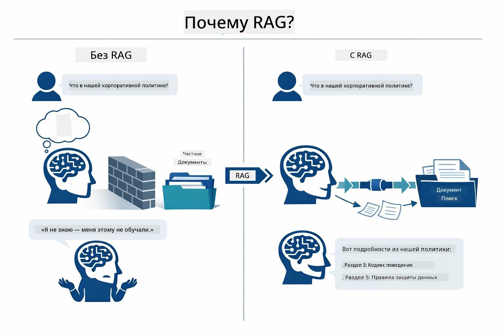
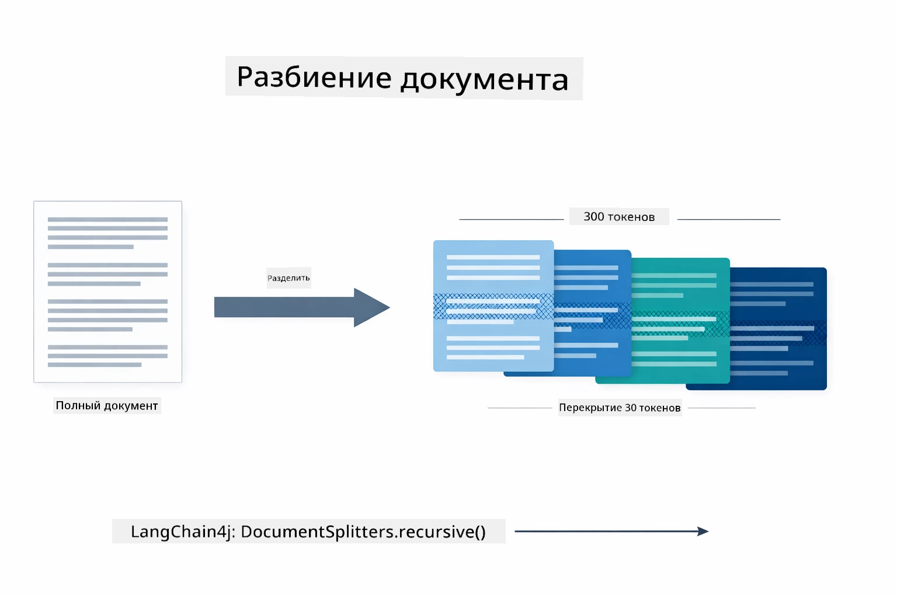
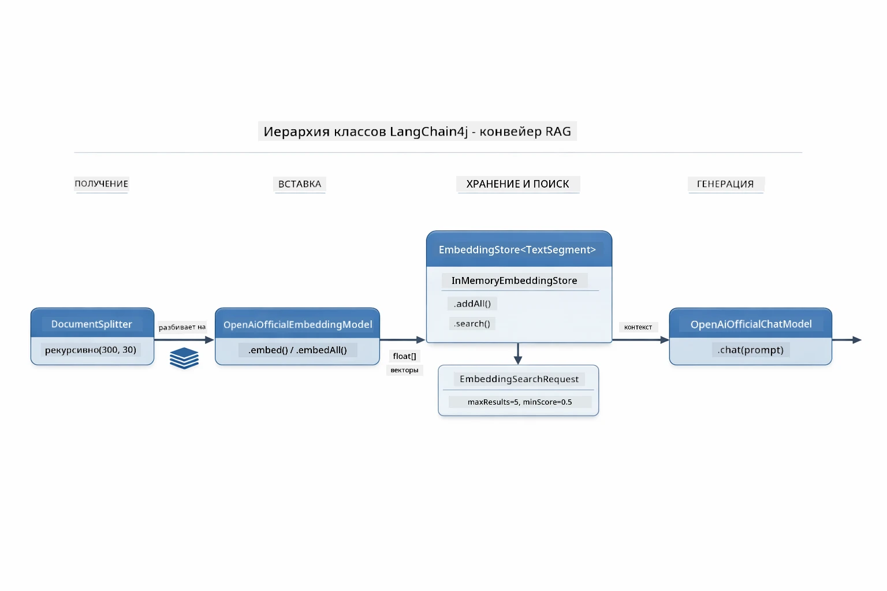
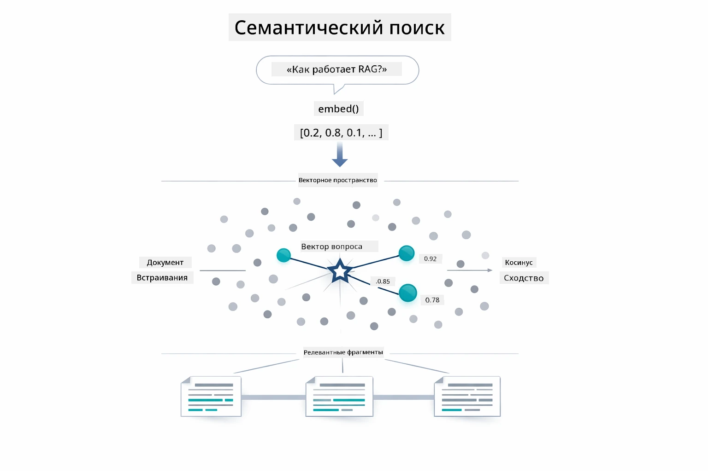
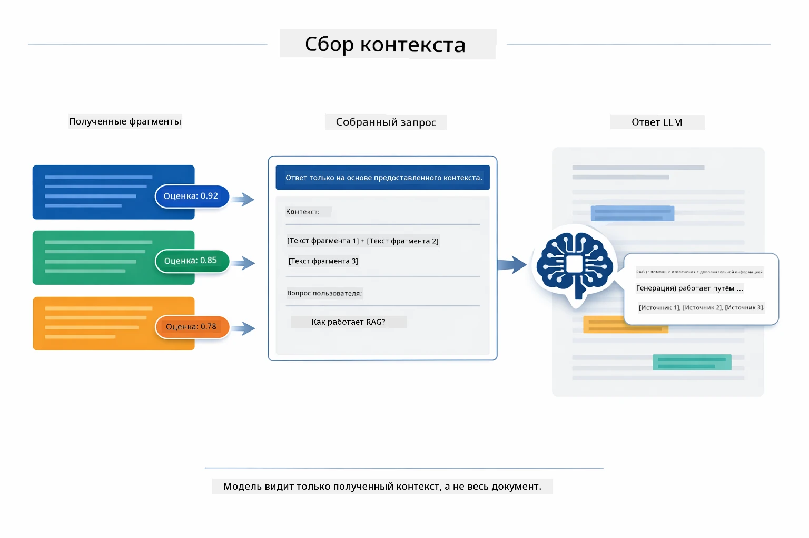
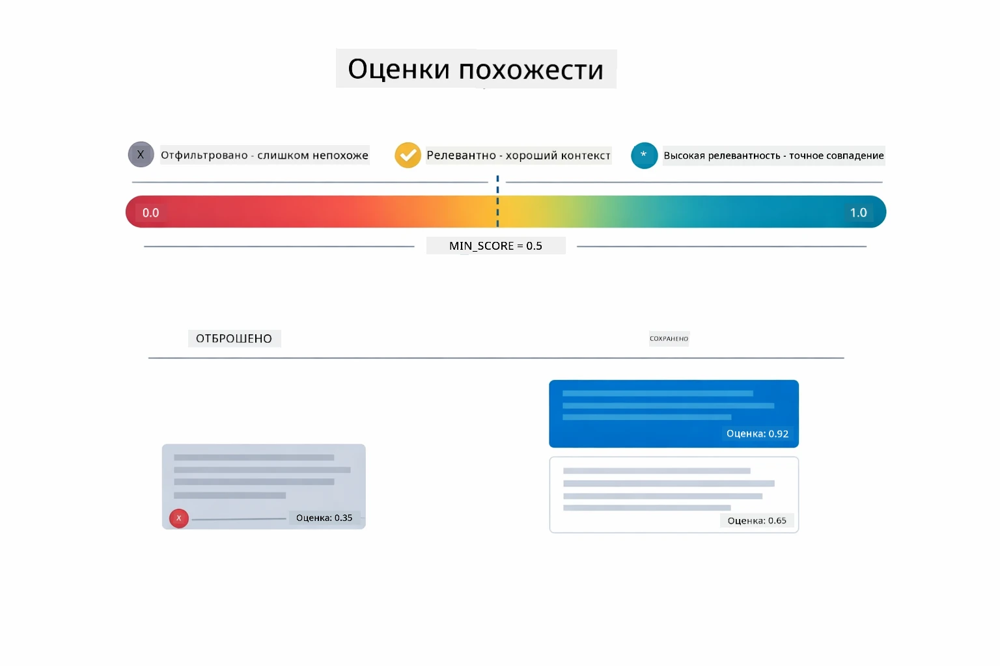
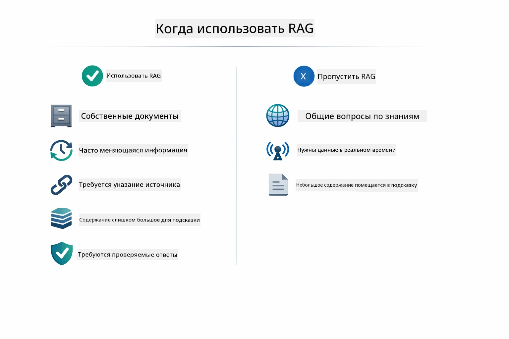

# Модуль 03: RAG (Генерация с использованием извлеченных данных)

## Содержание

- [Чему вы научитесь](../../../03-rag)
- [Понимание RAG](../../../03-rag)
- [Требования](../../../03-rag)
- [Как это работает](../../../03-rag)
  - [Обработка документов](../../../03-rag)
  - [Создание эмбеддингов](../../../03-rag)
  - [Семантический поиск](../../../03-rag)
  - [Генерация ответов](../../../03-rag)
- [Запуск приложения](../../../03-rag)
- [Использование приложения](../../../03-rag)
  - [Загрузка документа](../../../03-rag)
  - [Задавайте вопросы](../../../03-rag)
  - [Проверка ссылок на источники](../../../03-rag)
  - [Эксперименты с вопросами](../../../03-rag)
- [Ключевые концепции](../../../03-rag)
  - [Стратегия деления на фрагменты](../../../03-rag)
  - [Оценки сходства](../../../03-rag)
  - [Хранение в памяти](../../../03-rag)
  - [Управление окном контекста](../../../03-rag)
- [Когда RAG имеет значение](../../../03-rag)
- [Следующие шаги](../../../03-rag)

## Чему вы научитесь

В предыдущих модулях вы научились вести диалоги с ИИ и эффективно структурировать подсказки. Но у этого есть фундаментальное ограничение: языковые модели знают только то, чему их обучили. Они не могут отвечать на вопросы о политиках вашей компании, документации вашего проекта или любой информации, которой не обучались.

RAG (Генерация с использованием извлеченных данных) решает эту проблему. Вместо того чтобы пытаться обучить модель вашей информации (что дорого и непрактично), вы даёте ей возможность искать по вашим документам. Когда кто-то задаёт вопрос, система находит релевантную информацию и включает её в подсказку. Модель затем отвечает, основываясь на найденном контексте.

Считайте RAG библиотекой ссылок для модели. Когда вы задаёте вопрос, система:

1. **Запрос пользователя** — вы задаёте вопрос  
2. **Эмбеддинг** — преобразует вопрос в вектор  
3. **Векторный поиск** — находит похожие фрагменты документов  
4. **Сбор контекста** — добавляет релевантные фрагменты в подсказку  
5. **Ответ** — LLM генерирует ответ на основе контекста  

Это связывает ответы модели с вашими реальными данными, а не полагается на знания из обучения или придумывание ответов.

## Понимание RAG

Ниже представлена диаграмма, которая иллюстрирует основную идею: вместо того чтобы опираться только на данные обучения модели, RAG даёт ей справочную библиотеку ваших документов для консультации перед генерацией каждого ответа.



Вот как соединены все части от начала до конца. Вопрос пользователя проходит через четыре этапа — эмбеддинг, векторный поиск, сбор контекста и генерация ответа — каждый опирается на предыдущий:


Дальше в этом модуле подробно рассматривается каждый этап с примерами кода, которые вы можете запускать и модифицировать.

## Требования

- Завершённый Модуль 01 (развёрнуты ресурсы Azure OpenAI)  
- Файл `.env` в корневом каталоге с учётными данными Azure (созданный командой `azd up` в Модуле 01)  

> **Примечание:** Если вы не завершили Модуль 01, сначала следуйте инструкциям по развёртыванию там.

## Как это работает

### Обработка документов

[DocumentService.java](../../../03-rag/src/main/java/com/example/langchain4j/rag/service/DocumentService.java)

Когда вы загружаете документ, система парсит его (PDF или простой текст), добавляет метаданные, такие как имя файла, а затем разбивает документ на фрагменты — меньшие части, которые комфортно помещаются в окно контекста модели. Эти фрагменты частично перекрываются, чтобы не потерять контекст на границах.

```java
// Разберите загруженный файл и оберните его в документ LangChain4j
Document document = Document.from(content, metadata);

// Разбейте на части по 300 токенов с перекрытием в 30 токенов
DocumentSplitter splitter = DocumentSplitters
    .recursive(300, 30);

List<TextSegment> segments = splitter.split(document);
```
  
Ниже показано, как это выглядит визуально. Обратите внимание, что каждый фрагмент разделяет часть токенов с соседними — перекрытие в 30 токенов гарантирует, что важный контекст не будет утерян:



> **🤖 Попробуйте с [GitHub Copilot](https://github.com/features/copilot) Chat:** Откройте [`DocumentService.java`](../../../03-rag/src/main/java/com/example/langchain4j/rag/service/DocumentService.java) и спросите:
> - "Как LangChain4j делит документы на фрагменты и почему перекрытие важно?"
> - "Какой оптимальный размер фрагмента для разных типов документов и почему?"
> - "Как обрабатывать документы на нескольких языках или с особыми форматами?"

### Создание эмбеддингов

[LangChainRagConfig.java](../../../03-rag/src/main/java/com/example/langchain4j/rag/config/LangChainRagConfig.java)

Каждый фрагмент преобразуется в числовое представление, называемое эмбеддингом — математический отпечаток, который отображает смысл текста. Похожие по смыслу тексты дают похожие эмбеддинги.

```java
@Bean
public EmbeddingModel embeddingModel() {
    return OpenAiOfficialEmbeddingModel.builder()
        .baseUrl(azureOpenAiEndpoint)
        .apiKey(azureOpenAiKey)
        .modelName(azureEmbeddingDeploymentName)
        .build();
}

EmbeddingStore<TextSegment> embeddingStore = 
    new InMemoryEmbeddingStore<>();
```
  
Диаграмма классов ниже показывает, как связаны компоненты LangChain4j. `OpenAiOfficialEmbeddingModel` конвертирует текст в векторы, `InMemoryEmbeddingStore` хранит векторы и соответствующие им исходные данные `TextSegment`, а `EmbeddingSearchRequest` управляет параметрами поиска, такими как `maxResults` и `minScore`:



Когда эмбеддинги сохранены, похожий контент естественно группируется в пространстве векторов. Визуализация ниже показывает, как документы на связанные темы оказываются близко друг к другу, что делает возможным семантический поиск:


### Семантический поиск

[RagService.java](../../../03-rag/src/main/java/com/example/langchain4j/rag/service/RagService.java)

Когда вы задаёте вопрос, он тоже конвертируется в эмбеддинг. Система сравнивает вектор вопроса со всеми эмбеддингами фрагментов документа. Она ищет фрагменты с самым похожим смыслом — не просто совпадающие ключевые слова, а именно семантическое сходство.

```java
Embedding queryEmbedding = embeddingModel.embed(question).content();

EmbeddingSearchRequest searchRequest = EmbeddingSearchRequest.builder()
    .queryEmbedding(queryEmbedding)
    .maxResults(5)
    .minScore(0.5)
    .build();

EmbeddingSearchResult<TextSegment> searchResult = embeddingStore.search(searchRequest);
List<EmbeddingMatch<TextSegment>> matches = searchResult.matches();

for (EmbeddingMatch<TextSegment> match : matches) {
    String relevantText = match.embedded().text();
    double score = match.score();
}
```
  
Диаграмма ниже сравнивает семантический поиск и традиционный поиск по ключевым словам. Поиск по ключевому слову "транспортное средство" пропускает фрагмент о "машинах и грузовиках", но семантический поиск понимает, что это одно и то же, и возвращает этот фрагмент как релевантный:



> **🤖 Попробуйте с [GitHub Copilot](https://github.com/features/copilot) Chat:** Откройте [`RagService.java`](../../../03-rag/src/main/java/com/example/langchain4j/rag/service/RagService.java) и спросите:
> - "Как работает поиск по похожести с эмбеддингами и что определяет оценку?"
> - "Какой порог похожести использовать и как он влияет на результаты?"
> - "Что делать, если не найдены релевантные документы?"

### Генерация ответов

[RagService.java](../../../03-rag/src/main/java/com/example/langchain4j/rag/service/RagService.java)

Самые релевантные фрагменты собираются в структурированную подсказку, которая включает явные инструкции, найденный контекст и вопрос пользователя. Модель читает только эти конкретные фрагменты и отвечает на их основе — она может использовать только представленный контекст, что предотвращает галлюцинации.

```java
String context = matches.stream()
    .map(match -> match.embedded().text())
    .collect(Collectors.joining("\n\n"));

String prompt = String.format("""
    Answer the question based on the following context.
    If the answer cannot be found in the context, say so.

    Context:
    %s

    Question: %s

    Answer:""", context, request.question());

String answer = chatModel.chat(prompt);
```
  
Диаграмма ниже показывает этот процесс — лучшие по результатам поиска фрагменты вставляются в шаблон подсказки, а `OpenAiOfficialChatModel` генерирует обоснованный ответ:



## Запуск приложения

**Проверка развёртывания:**  

Убедитесь, что файл `.env` находится в корне с учётными данными Azure (созданный в Модуле 01):  
```bash
cat ../.env  # Должен показывать AZURE_OPENAI_ENDPOINT, API_KEY, DEPLOYMENT
```
  
**Запуск приложения:**  

> **Примечание:** Если вы уже запускали все приложения через `./start-all.sh` из Модуля 01, этот модуль уже работает на порту 8081. Можно пропустить команды запуска ниже и перейти прямо по адресу http://localhost:8081.

**Вариант 1: Использование панели Spring Boot (рекомендуется для пользователей VS Code)**  

Dev контейнер содержит расширение Spring Boot Dashboard, которое предоставляет визуальный интерфейс для управления всеми приложениями Spring Boot. Вы найдёте его на панели активности слева в VS Code (значок Spring Boot).

С помощью Spring Boot Dashboard вы можете:  
- Просматривать все доступные приложения Spring Boot в рабочей области  
- Запускать/останавливать приложения одним кликом  
- Смотреть логи приложения в реальном времени  
- Отслеживать состояние приложения  

Просто нажмите кнопку запуска рядом с "rag", чтобы начать этот модуль, или запустите все модули сразу.


**Вариант 2: Использование shell-скриптов**  

Запустите все веб-приложения (модули 01-04):  

**Bash:**  
```bash
cd ..  # Из корневого каталога
./start-all.sh
```
  
**PowerShell:**  
```powershell
cd ..  # Из корневого каталога
.\start-all.ps1
```
  
Или запустите только этот модуль:  

**Bash:**  
```bash
cd 03-rag
./start.sh
```
  
**PowerShell:**  
```powershell
cd 03-rag
.\start.ps1
```
  
Оба скрипта автоматически загружают переменные окружения из файла `.env` в корне и соберут JAR-файлы, если их нет.

> **Примечание:** Если хотите собрать все модули вручную перед запуском:  
>  
> **Bash:**  
> ```bash
> cd ..  # Go to root directory
> mvn clean package -DskipTests
> ```
>  
> **PowerShell:**  
> ```powershell
> cd ..  # Go to root directory
> mvn clean package -DskipTests
> ```
  

Откройте http://localhost:8081 в вашем браузере.

**Для остановки:**  

**Bash:**  
```bash
./stop.sh  # Только этот модуль
# Или
cd .. && ./stop-all.sh  # Все модули
```
  
**PowerShell:**  
```powershell
.\stop.ps1  # Только этот модуль
# Или
cd ..; .\stop-all.ps1  # Все модули
```
  

## Использование приложения

Приложение предоставляет веб-интерфейс для загрузки документов и задавания вопросов.

<a href="images/rag-homepage.png"></a>

*Интерфейс приложения RAG — загрузите документы и задавайте вопросы*

### Загрузка документа

Начните с загрузки документа — для тестирования лучше всего подходят файлы формата TXT. В этой директории есть `sample-document.txt`, который содержит информацию о функциях LangChain4j, реализации RAG и лучших практиках — идеально для тестирования системы.

Система обрабатывает ваш документ, разбивает его на фрагменты и создаёт эмбеддинги для каждого из них. Это происходит автоматически после загрузки.

### Задавайте вопросы

Теперь задайте конкретные вопросы о содержимом документа. Попробуйте что-то фактическое, что явно указано в документе. Система ищет релевантные фрагменты, включает их в подсказку и генерирует ответ.

### Проверка ссылок на источники

Обратите внимание, что каждый ответ содержит ссылки на источники с оценками сходства. Эти оценки (от 0 до 1) показывают, насколько фрагмент был релевантен вашему вопросу. Более высокие оценки означают лучшие совпадения. Это позволяет проверить ответ по исходным материалам.

<a href="images/rag-query-results.png"></a>

*Результаты запроса с ответом, ссылками на источники и оценками релевантности*

### Эксперименты с вопросами

Попробуйте разные типы вопросов:  
- Конкретные факты: "Какая основная тема?"  
- Сравнения: "В чём разница между X и Y?"  
- Резюме: "Подведите ключевые моменты о Z"  

Наблюдайте, как меняются оценки релевантности в зависимости от того, насколько хорошо ваш вопрос соответствует содержимому документа.

## Ключевые концепции

### Стратегия деления на фрагменты

Документы разбиваются на фрагменты по 300 токенов с перекрытием в 30 токенов. Такой баланс обеспечивает достаточно контекста для каждого фрагмента, но при этом фрагменты остаются небольшими, чтобы помещаться по несколько штук в подсказку.

### Оценки сходства

Каждый извлечённый фрагмент сопровождается оценкой сходства от 0 до 1, которая показывает, насколько точно он совпадает с вопросом пользователя. Ниже представлена визуализация диапазонов оценок и того, как система использует их для фильтрации результатов:



Оценки варьируются от 0 до 1:  
- 0.7–1.0: Очень релевантные, точное совпадение  
- 0.5–0.7: Релевантные, хорошее покрытие контекста  
- Ниже 0.5: Отфильтрованы, слишком непохожие  

Система извлекает только фрагменты, оцениваемые выше минимального порога для обеспечения качества.

### Хранение в памяти

Для простоты модуль использует хранение данных в памяти. При перезапуске приложения загруженные документы теряются. В продуктивных системах используют постоянные векторные базы данных, например Qdrant или Azure AI Search.

### Управление окном контекста

У каждой модели есть максимальный размер окна контекста. Нельзя вместить все фрагменты из большого документа. Система извлекает верхние N наиболее релевантных фрагментов (по умолчанию 5), чтобы уложиться в лимиты и предоставить достаточно контекста для точных ответов.

## Когда RAG имеет значение

RAG подходит не всегда. Схема ниже поможет вам определить, когда RAG приносит пользу, а когда достаточно более простых подходов — таких как включение контента прямо в подсказку или использование встроенных знаний модели:



**Используйте RAG, когда:**
- Ответы на вопросы по проприетарным документам  
- Информация часто меняется (политики, цены, спецификации)  
- Для точности требуется указание источника  
- Контент слишком большой, чтобы уместиться в одном запросе  
- Требуются проверяемые, обоснованные ответы  

**Не используйте RAG, когда:**  
- Вопросы требуют общих знаний, которыми модель уже обладает  
- Нужны данные в реальном времени (RAG работает с загруженными документами)  
- Контент достаточно мал, чтобы включить его прямо в запросы  

## Следующие шаги  

**Следующий модуль:** [04-tools - AI Agents with Tools](../04-tools/README.md)  

---  

**Навигация:** [← Предыдущий: Модуль 02 - Prompt Engineering](../02-prompt-engineering/README.md) | [Назад к главной](../README.md) | [Следующий: Модуль 04 - Tools →](../04-tools/README.md)

---

<!-- CO-OP TRANSLATOR DISCLAIMER START -->
**Отказ от ответственности**:  
Этот документ был переведен с помощью сервиса автоматического перевода [Co-op Translator](https://github.com/Azure/co-op-translator). Несмотря на наши усилия по обеспечению точности, следует иметь в виду, что автоматический перевод может содержать ошибки или неточности. Оригинальный документ на его родном языке следует считать авторитетным источником. Для получения критически важной информации рекомендуется обращаться к профессиональному человеческому переводу. Мы не несем ответственности за любые недоразумения или неправильные толкования, возникающие в результате использования данного перевода.
<!-- CO-OP TRANSLATOR DISCLAIMER END -->