# Модуль 04: AI-Агенты с Инструментами

## Содержание

- [Чему вы научитесь](../../../04-tools)
- [Требования](../../../04-tools)
- [Понимание AI-агентов с инструментами](../../../04-tools)
- [Как работает вызов инструментов](../../../04-tools)
  - [Определение инструментов](../../../04-tools)
  - [Принятие решений](../../../04-tools)
  - [Выполнение](../../../04-tools)
  - [Генерация ответа](../../../04-tools)
  - [Архитектура: Автоподключение Spring Boot](../../../04-tools)
- [Цепочки инструментов](../../../04-tools)
- [Запуск приложения](../../../04-tools)
- [Использование приложения](../../../04-tools)
  - [Попробовать простой вызов инструмента](../../../04-tools)
  - [Тестирование цепочек инструментов](../../../04-tools)
  - [Посмотреть ход разговора](../../../04-tools)
  - [Экспериментировать с разными запросами](../../../04-tools)
- [Ключевые концепции](../../../04-tools)
  - [Паттерн ReAct (Размышление и Действие)](../../../04-tools)
  - [Описание инструментов имеет значение](../../../04-tools)
  - [Управление сессиями](../../../04-tools)
  - [Обработка ошибок](../../../04-tools)
- [Доступные инструменты](../../../04-tools)
- [Когда использовать агентов на основе инструментов](../../../04-tools)
- [Инструменты vs RAG](../../../04-tools)
- [Следующие шаги](../../../04-tools)

## Чему вы научитесь

До сих пор вы узнали, как вести диалоги с ИИ, эффективно структурировать подсказки и обосновывать ответы на основе документов. Но существует фундаментальное ограничение: языковые модели могут только генерировать текст. Они не умеют проверять погоду, выполнять вычисления, обращаться к базам данных или взаимодействовать с внешними системами.

Инструменты меняют это. Давая модели доступ к функциям, которые она может вызвать, вы превращаете её из генератора текста в агента, способного совершать действия. Модель решает, когда ей нужен инструмент, какой именно, и какие параметры передать. Ваш код выполняет функцию и возвращает результат. Модель включает этот результат в свой ответ.

## Требования

- Завершён [Модуль 01 - Введение](../01-introduction/README.md) (Azure OpenAI ресурсы развернуты)
- Рекомендуется пройти предыдущие модули (этот модуль ссылается на [концепции RAG из Модуля 03](../03-rag/README.md) в сравнении Инструменты vs RAG)
- Файл `.env` в корневом каталоге с учётными данными Azure (создан при помощи `azd up` в Модуле 01)

> **Примечание:** Если вы не завершили Модуль 01, сначала следуйте инструкциям по развертыванию там.

## Понимание AI-агентов с инструментами

> **📝 Примечание:** Термин «агенты» в этом модуле относится к AI-помощникам с расширенной возможностью вызова инструментов. Это отличается от паттернов **Agentic AI** (автономные агенты с планированием, памятью и многошаговым рассуждением), которые мы рассмотрим в [Модуле 05: MCP](../05-mcp/README.md).

Без инструментов языковая модель может лишь генерировать текст на основе обучающих данных. Спросите её о текущей погоде — она будет лишь догадываться. Дайте ей инструменты, и она сможет вызвать API погоды, выполнить вычисления или запросить базу данных — а затем вплести реальные данные в свой ответ.

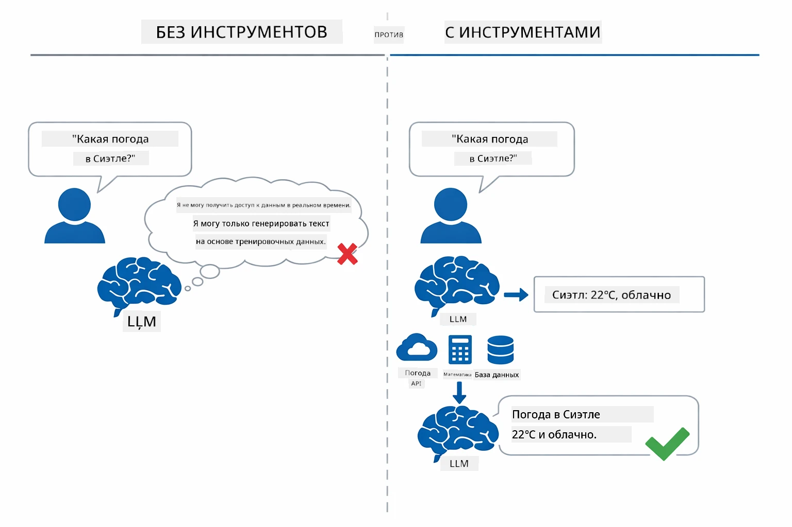

*Без инструментов модель может только догадываться — с инструментами она вызывает API, выполняет вычисления и возвращает актуальные данные.*

AI-агент с инструментами следует паттерну **Размышление и Действие (ReAct)**. Модель не просто отвечает — она обдумывает, что ей нужно, действует, вызывая инструмент, наблюдает результат, и затем решает, действовать дальше или дать окончательный ответ:

1. **Размышление** — агент анализирует вопрос пользователя и определяет, какую информацию нужно получить
2. **Действие** — агент выбирает подходящий инструмент, формирует правильные параметры и вызывает его
3. **Наблюдение** — агент получает результат инструмента и оценивает его
4. **Повторить или ответить** — если нужно больше данных, агент повторяет цикл; иначе выдаёт ответ

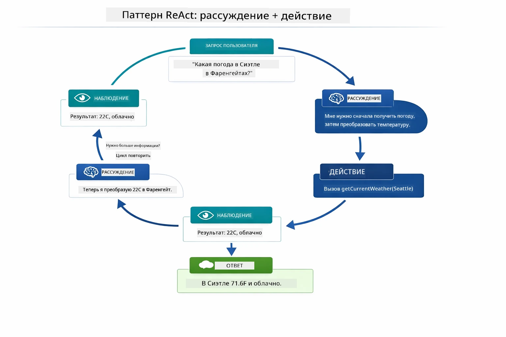

*Цикл ReAct — агент размышляет, что делать, действует, вызывая инструмент, наблюдает результат и повторяет, пока не может дать окончательный ответ.*

Это происходит автоматически. Вы определяете инструменты и их описания. Модель самостоятельно принимает решения о том, когда и как их использовать.

## Как работает вызов инструментов

### Определение инструментов

[WeatherTool.java](../../../04-tools/src/main/java/com/example/langchain4j/agents/tools/WeatherTool.java) | [TemperatureTool.java](../../../04-tools/src/main/java/com/example/langchain4j/agents/tools/TemperatureTool.java)

Вы определяете функции с понятными описаниями и спецификациями параметров. Модель видит эти описания в системном подсказе и понимает, что делает каждый инструмент.

```java
@Component
public class WeatherTool {
    
    @Tool("Get the current weather for a location")
    public String getCurrentWeather(@P("Location name") String location) {
        // Ваша логика поиска погоды
        return "Weather in " + location + ": 22°C, cloudy";
    }
}

@AiService
public interface Assistant {
    String chat(@MemoryId String sessionId, @UserMessage String message);
}

// Ассистент автоматически подключается Spring Boot с помощью:
// - бин ChatModel
// - Все методы @Tool из классов с аннотацией @Component
// - ChatMemoryProvider для управления сессиями
```

Схема ниже разбирает каждую аннотацию и показывает, как каждый элемент помогает ИИ понять, когда вызывать инструмент и какие аргументы передавать:

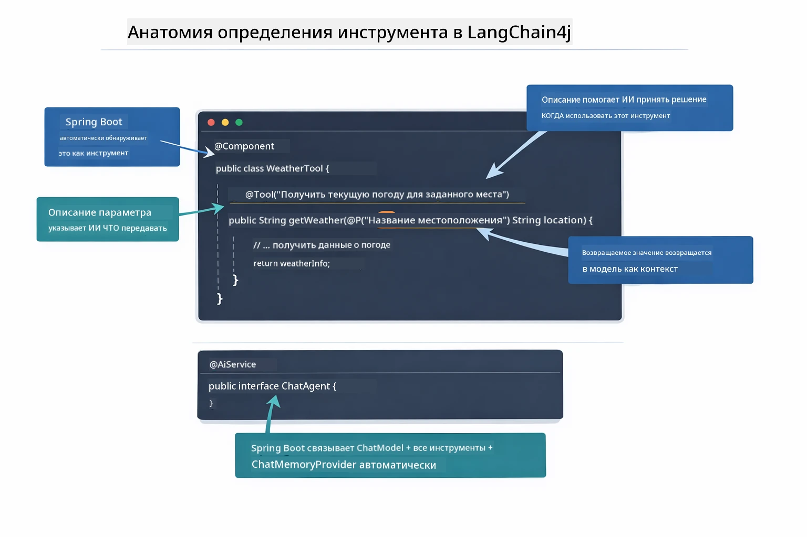

*Анатомия определения инструмента — @Tool сообщает ИИ, когда использовать его, @P описывает каждый параметр, а @AiService связывает всё вместе при запуске.*

> **🤖 Попробуйте с [GitHub Copilot](https://github.com/features/copilot) Chat:** Откройте [`WeatherTool.java`](../../../04-tools/src/main/java/com/example/langchain4j/agents/tools/WeatherTool.java) и спросите:
> - "Как интегрировать реальный API погоды, например OpenWeatherMap, вместо моковых данных?"
> - "Что делает хорошее описание инструмента, помогающее ИИ использовать его корректно?"
> - "Как обрабатывать ошибки API и ограничения по числу запросов в реализации инструментов?"

### Принятие решений

Когда пользователь спрашивает «Какая погода в Сиэтле?», модель не выбирает инструмент случайно. Она сравнивает намерение пользователя с каждым описанием инструмента, оценивает релевантность и выбирает лучший вариант. Затем генерирует структурированный вызов функции с правильными параметрами — в данном случае, указывая `location` как `"Seattle"`.

Если ни один инструмент не подходит, модель отвечает исходя из своих знаний. Если несколько инструментов подходят, выбирает самый конкретный.

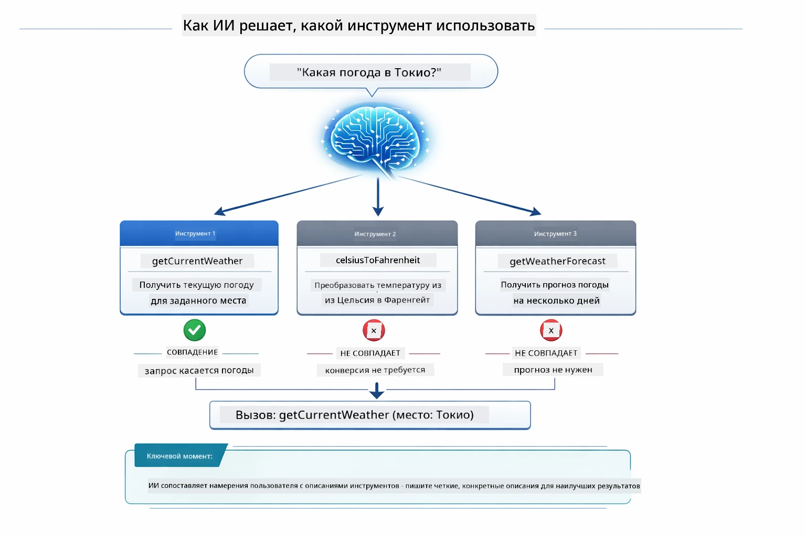

*Модель оценивает каждый доступный инструмент по смыслу запроса пользователя и выбирает лучший — поэтому важны чёткие, точные описания инструментов.*

### Выполнение

[AgentService.java](../../../04-tools/src/main/java/com/example/langchain4j/agents/service/AgentService.java)

Spring Boot автоматически подключает декларативный интерфейс `@AiService` со всеми зарегистрированными инструментами, а LangChain4j выполняет вызовы инструментов автоматически. За сценой вызов инструмента проходит шесть этапов — от естественного языка пользователя до ответа на естественном языке:

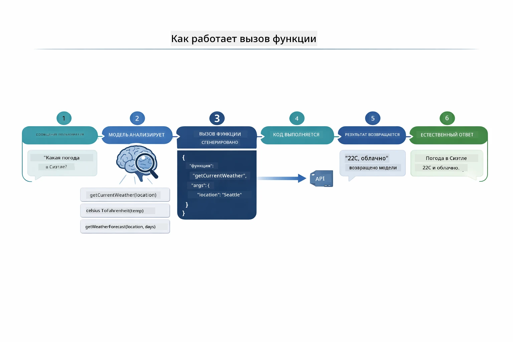

*Конечный поток — пользователь задаёт вопрос, модель выбирает инструмент, LangChain4j выполняет его, и модель помогает встроить результат в естественный ответ.*

Если вы запускали [ToolIntegrationDemo](../../../00-quick-start/src/main/java/com/example/langchain4j/quickstart/ToolIntegrationDemo.java) из Модуля 00, вы уже видели этот паттерн — инструменты `Calculator` вызывались так же. Диаграмма последовательности ниже показывает, что происходило „под капотом“ в том демо:

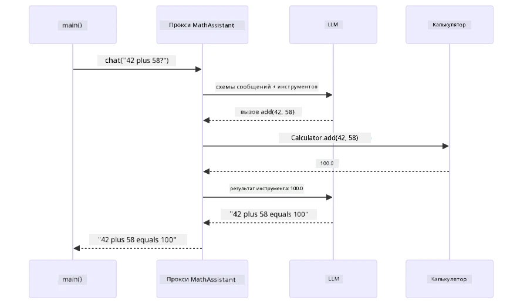

*Цикл вызова инструментов из Quick Start демо — `AiServices` отправляет ваше сообщение и схемы инструментов LLM, LLM отвечает вызовом функции, например `add(42, 58)`, LangChain4j локально выполняет метод `Calculator` и возвращает результат для окончательного ответа.*

> **🤖 Попробуйте с [GitHub Copilot](https://github.com/features/copilot) Chat:** Откройте [`AgentService.java`](../../../04-tools/src/main/java/com/example/langchain4j/agents/service/AgentService.java) и спросите:
> - "Как работает паттерн ReAct и почему он эффективен для AI-агентов?"
> - "Как агент решает, какой инструмент использовать и в каком порядке?"
> - "Что происходит при сбое выполнения инструмента — как грамотно обрабатывать ошибки?"

### Генерация ответа

Модель получает данные о погоде и форматирует их в ответ на естественном языке для пользователя.

### Архитектура: Автоподключение Spring Boot

Этот модуль использует интеграцию LangChain4j со Spring Boot с декларативными интерфейсами `@AiService`. При запуске Spring Boot обнаруживает каждый `@Component`, содержащий методы с `@Tool`, ваш bean `ChatModel` и `ChatMemoryProvider` — затем подключает их все в единый интерфейс `Assistant` без шаблонного кода.

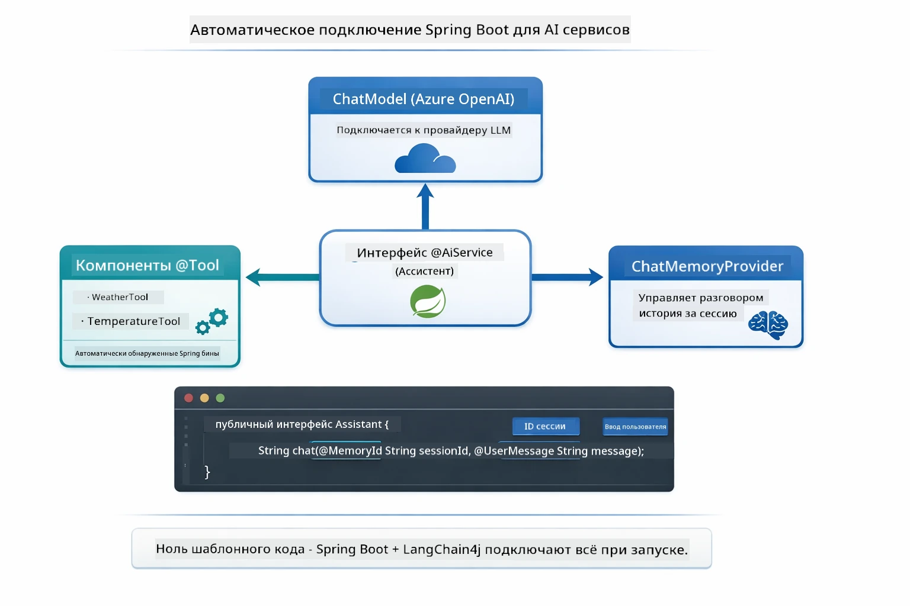

*Интерфейс @AiService объединяет ChatModel, компоненты инструментов и память — Spring Boot автоматически выполняет всю связку.*

Полный жизненный цикл запроса показан на диаграмме последовательности — от HTTP-запроса через контроллер, сервис и прокси с автоподключением до вызова инструмента и обратно:

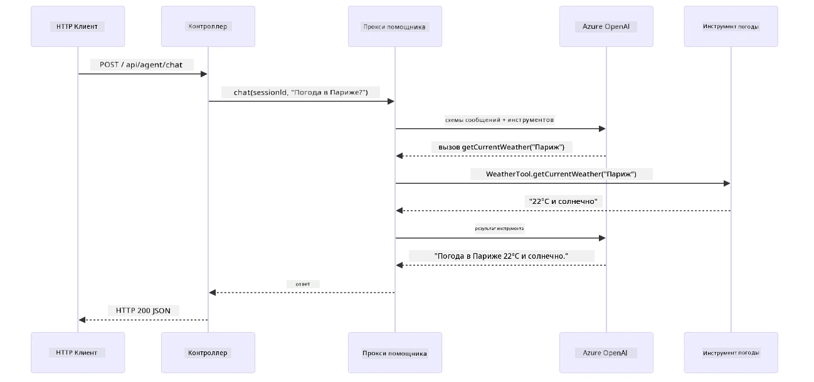

*Полный жизненный цикл запроса Spring Boot — HTTP-запрос проходит через контроллер и сервис к прокси Assistant с автоподключением, который автоматически управляет LLM и вызовами инструментов.*

Основные преимущества этого подхода:

- **Автоподключение Spring Boot** — ChatModel и инструменты внедряются автоматически
- **Паттерн @MemoryId** — Автоматическое управление памятью на основе сессий
- **Один экземпляр** — Assistant создаётся один раз и переиспользуется для повышения производительности
- **Типобезопасное выполнение** — Java методы вызываются напрямую с конверсией типов
- **Оркестровка нескольких ходов** — Автоматически обрабатывает цепочки инструментов
- **Ноль шаблонного кода** — Нет необходимости вручную вызывать `AiServices.builder()` или управлять памятью через HashMap

Альтернативные подходы (ручное `AiServices.builder()`) требуют больше кода и не используют преимущества интеграции с Spring Boot.

## Цепочки инструментов

**Цепочки инструментов** — настоящая сила агентов на основе инструментов проявляется, когда один вопрос требует несколько инструментов. Спросите «Какая погода в Сиэтле по Фаренгейту?» — агент автоматически объединит вызовы двух инструментов: сначала вызовет `getCurrentWeather` для получения температуры в Цельсиях, затем передаст это значение в `celsiusToFahrenheit` для конвертации — всё в одном ходе диалога.

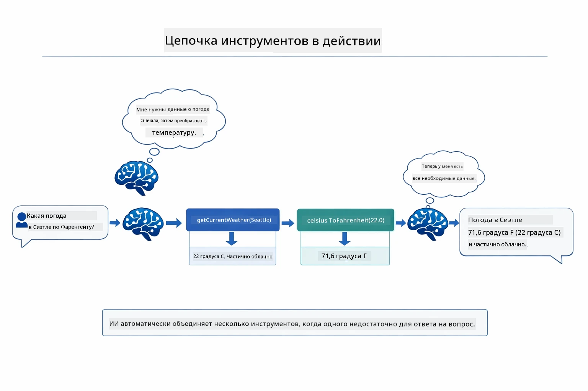

*Цепочка инструментов в действии — агент сначала вызывается getCurrentWeather, затем передаёт результат в celsiusToFahrenheit и выдаёт объединённый ответ.*

**Грациозные ошибки** — спросите погоду в городе, которого нет в моковых данных. Инструмент вернёт сообщение об ошибке, а ИИ объяснит, что не может помочь, вместо сбоя. Инструменты безопасно обрабатывают ошибки. Диаграмма ниже показывает два подхода — с правильной обработкой ошибок агент ловит исключение и даёт полезный ответ, а без неё всё приложение падает:

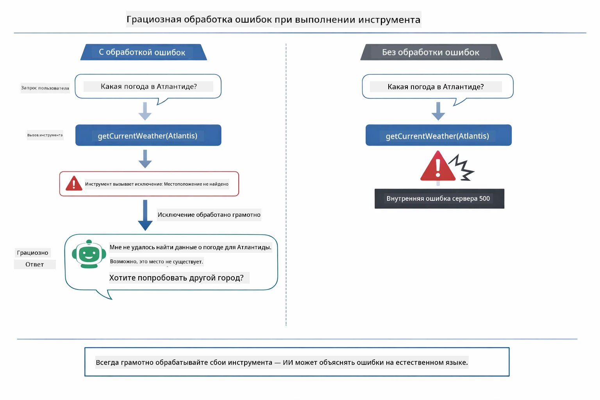

*Когда инструмент даёт сбой, агент ловит ошибку и отвечает понятным объяснением вместо краха.*

Это происходит в одном ходе диалога. Агент самостоятельно оркестрирует множественные вызовы инструментов.

## Запуск приложения

**Проверьте развертывание:**

Убедитесь, что файл `.env` существует в корневом каталоге с учётными данными Azure (создан при Модуле 01). Запустите это из каталога модуля (`04-tools/`):

**Bash:**
```bash
cat ../.env  # Должен показать AZURE_OPENAI_ENDPOINT, API_KEY, DEPLOYMENT
```

**PowerShell:**
```powershell
Get-Content ..\.env  # Должен отображать AZURE_OPENAI_ENDPOINT, API_KEY, DEPLOYMENT
```

**Запустите приложение:**

> **Примечание:** Если вы уже запускали все приложения с помощью `./start-all.sh` из корня (как описано в Модуле 01), этот модуль уже работает на порту 8084. Можете пропустить команды запуска ниже и сразу перейти по адресу http://localhost:8084.

**Вариант 1: Использование Spring Boot Dashboard (Рекомендуется для пользователей VS Code)**

В девконтейнер включено расширение Spring Boot Dashboard, которое предоставляет визуальный интерфейс управления всеми приложениями Spring Boot. Его можно найти на боковой панели Activity Bar слева в VS Code (значок Spring Boot).

Через Spring Boot Dashboard вы можете:
- Смотреть все доступные Spring Boot приложения в рабочей области
- Запускать и останавливать приложения одним кликом
- Просматривать логи приложений в реальном времени
- Контролировать состояние приложений

Просто нажмите кнопку плей рядом с "tools", чтобы запустить этот модуль, или запустите все модули сразу.

Вот как выглядит Spring Boot Dashboard в VS Code:


*Spring Boot Dashboard в VS Code — запуск, остановка и мониторинг всех модулей из одного места*

**Вариант 2: Использование shell-скриптов**

Запустите все веб-приложения (модули 01-04):

**Bash:**
```bash
cd ..  # Из корневой директории
./start-all.sh
```

**PowerShell:**
```powershell
cd ..  # Из корневого каталога
.\start-all.ps1
```

Или запустите только этот модуль:

**Bash:**
```bash
cd 04-tools
./start.sh
```

**PowerShell:**
```powershell
cd 04-tools
.\start.ps1
```

Оба скрипта автоматически загружают переменные окружения из корневого файла `.env` и соберут JAR-файлы, если они не существуют.

> **Примечание:** Если вы предпочитаете собрать все модули вручную перед запуском:
>
> **Bash:**
> ```bash
> cd ..  # Go to root directory
> mvn clean package -DskipTests
> ```
>
> **PowerShell:**
> ```powershell
> cd ..  # Go to root directory
> mvn clean package -DskipTests
> ```

Откройте http://localhost:8084 в вашем браузере.

**Для остановки:**

**Bash:**
```bash
./stop.sh  # Только этот модуль
# Или
cd .. && ./stop-all.sh  # Все модули
```

**PowerShell:**
```powershell
.\stop.ps1  # Только этот модуль
# Или
cd ..; .\stop-all.ps1  # Все модули
```

## Использование приложения

Приложение предоставляет веб-интерфейс, где вы можете взаимодействовать с AI-агентом, имеющим доступ к инструментам для работы с погодой и конверсии температур. Вот как выглядит интерфейс — в нем есть примеры быстрого старта и панель чата для отправки запросов:

<a href="images/tools-homepage.png"></a>

*Интерфейс инструментов AI-агента — быстрые примеры и чат для взаимодействия с инструментами*

### Попробуйте простой запрос к инструменту

Начните с простого запроса: «Преобразовать 100 градусов Фаренгейта в Цельсий». Агент понимает, что ему нужен инструмент для конверсии температуры, вызывает его с правильными параметрами и возвращает результат. Обратите внимание, как это естественно — вам не нужно было указывать, какой именно инструмент использовать и как его вызывать.

### Проверьте цепочку вызовов инструментов

Теперь попробуйте что-то более сложное: «Какая погода в Сиэтле и переведи ее в Фаренгейт?» Посмотрите, как агент выполняет это пошагово. Сначала он получает данные о погоде (в Цельсиях), понимает, что нужно перевести температуру в Фаренгейты, вызывает инструмент конверсии и объединяет оба результата в один ответ.

### Посмотрите последовательность диалога

Интерфейс чата сохраняет историю разговоров, позволяя вести многошаговые взаимодействия. Вы можете увидеть все предыдущие запросы и ответы, что облегчает отслеживание беседы и понимание, как агент строит контекст на протяжении нескольких обменов.

<a href="images/tools-conversation-demo.png"></a>

*Многошаговый диалог с простыми конверсиями, запросами погоды и цепочкой вызовов инструментов*

### Экспериментируйте с разными запросами

Попробуйте различные варианты:
- Запросы погоды: «Какая погода в Токио?»
- Конверсии температур: «Сколько будет 25°C в Кельвинах?»
- Комбинированные запросы: «Проверь погоду в Париже и скажи, выше ли она 20°C»

Обратите внимание, как агент интерпретирует естественный язык и сопоставляет его с правильными вызовами инструментов.

## Основные концепции

### Паттерн ReAct (Размышление и Действие)

Агент чередует размышления (решение, что делать) и действия (использование инструментов). Этот паттерн позволяет выполнять автономное решение задач, а не просто отвечать на инструкции.

### Важно описание инструментов

Качество описания инструментов напрямую влияет на то, насколько хорошо агент умеет их использовать. Чёткие и конкретные описания помогают модели понять, когда и как вызывать каждый инструмент.

### Управление сессией

Аннотация `@MemoryId` позволяет автоматически управлять памятью на основе сессий. Каждому идентификатору сессии соответствует свой экземпляр `ChatMemory`, управляемый бином `ChatMemoryProvider`, так что несколько пользователей могут взаимодействовать с агентом одновременно без смешивания диалогов. На следующей диаграмме показано, как пользователи распределяются по изолированным хранилищам памяти на основе ID сессий:

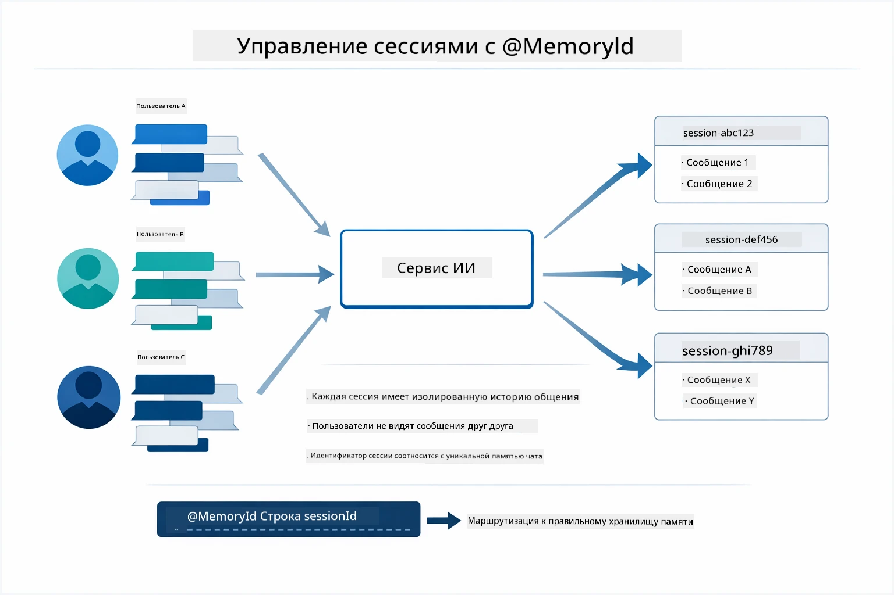

*Каждый ID сессии соответствует отдельной истории беседы — пользователи не видят сообщения друг друга.*

### Обработка ошибок

Инструменты могут давать сбои — таймауты API, неверные параметры, внешние сервисы могут не работать. В производственных системах необходима обработка ошибок, чтобы модель могла объяснять проблемы или пробовать альтернативы, а не приводить приложение к сбою. Если инструмент выбрасывает исключение, LangChain4j перехватывает его и передает сообщение об ошибке обратно модели, которая затем объясняет проблему на естественном языке.

## Доступные инструменты

Диаграмма ниже демонстрирует широкую экосистему инструментов, которые вы можете создавать. Этот модуль показывает инструменты погоды и конверсии температуры, но тот же паттерн `@Tool` работает с любым Java-методом — от запросов к базе данных до обработки платежей.

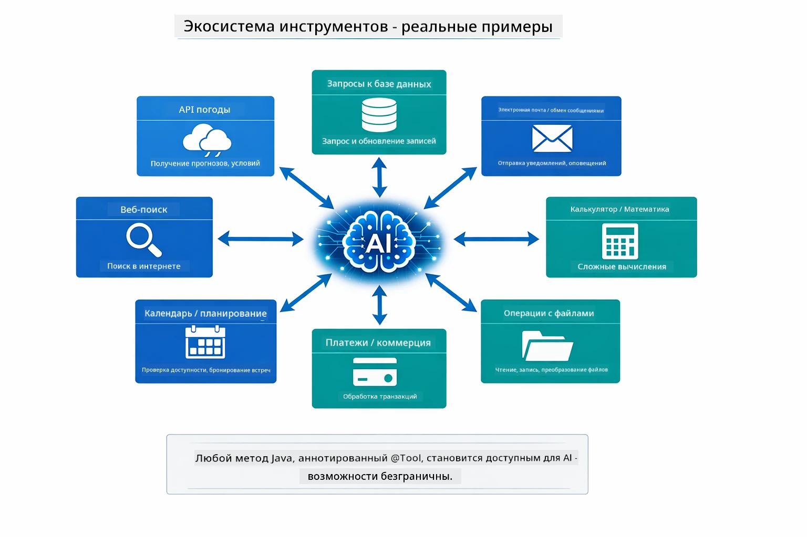

*Любой Java-метод с аннотацией @Tool становится доступным AI — паттерн расширяется на базы данных, API, электронную почту, операции с файлами и многое другое.*

## Когда использовать агентов с инструментами

Не каждый запрос требует инструментов. Решение сводится к тому, нужно ли AI взаимодействовать с внешними системами или он может ответить из собственных знаний. Ниже приведено руководство, когда инструменты приносят пользу, а когда они не нужны:

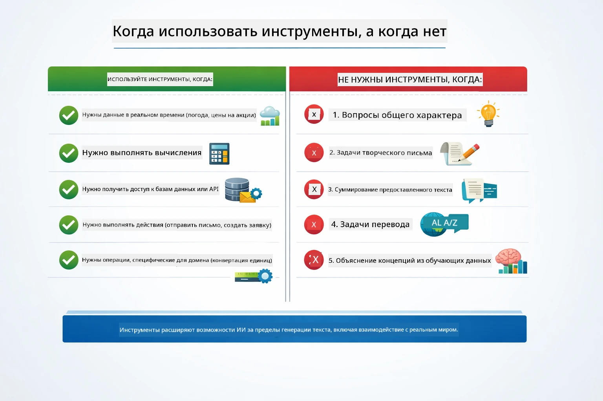

*Краткое руководство — инструменты нужны для данных в реальном времени, вычислений и действий; общие знания и творческие задачи обходятся без них.*

## Инструменты vs RAG

Модули 03 и 04 расширяют возможности AI, но принципиально по-разному. RAG даёт модели доступ к **знаниям** через поиск документов. Инструменты дают модели возможность выполнять **действия**, вызывая функции. Диаграмма ниже сравнивает эти два подхода — от процесса работы до компромиссов между ними:

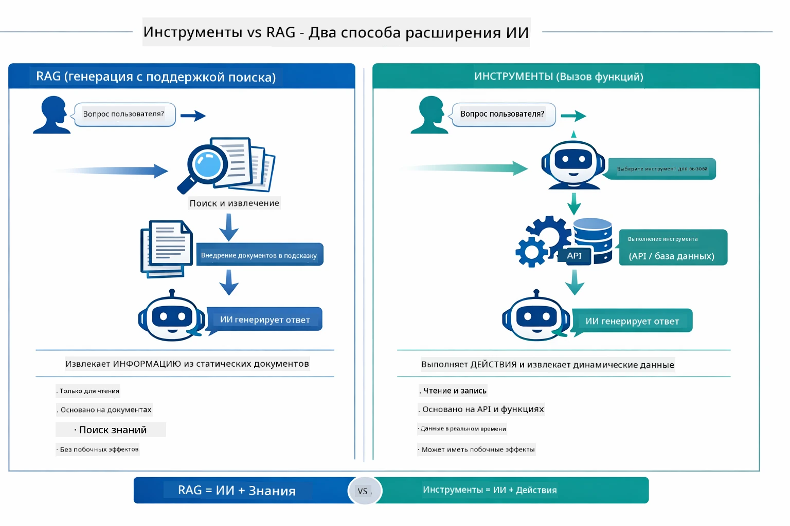

*RAG извлекает информацию из статичных документов — инструменты выполняют действия и получают динамичные данные в реальном времени. Многие производственные системы комбинируют оба подхода.*

На практике многие производственные системы используют оба подхода: RAG для обоснования ответов на основе документации и инструменты для получения актуальных данных и выполнения операций.

## Следующие шаги

**Следующий модуль:** [05-mcp - Model Context Protocol (MCP)](../05-mcp/README.md)

---

**Навигация:** [← Предыдущий: Модуль 03 - RAG](../03-rag/README.md) | [Назад к оглавлению](../README.md) | [Следующий: Модуль 05 - MCP →](../05-mcp/README.md)

---

<!-- CO-OP TRANSLATOR DISCLAIMER START -->
**Отказ от ответственности**:
Этот документ был переведен с помощью AI-сервиса перевода [Co-op Translator](https://github.com/Azure/co-op-translator). Несмотря на наши усилия обеспечить точность, обращаем ваше внимание, что автоматические переводы могут содержать ошибки или неточности. Оригинальный документ на родном языке следует считать авторитетным источником. Для критически важной информации рекомендуется использовать профессиональный перевод, выполненный человеком. Мы не несем ответственности за любые недоразумения или неправильные толкования, возникшие в результате использования данного перевода.
<!-- CO-OP TRANSLATOR DISCLAIMER END -->