# Модуль 05: Протокол контекста модели (MCP)

## Содержание

- [Чему вы научитесь](../../../05-mcp)
- [Что такое MCP?](../../../05-mcp)
- [Как работает MCP](../../../05-mcp)
- [Агентный модуль](../../../05-mcp)
- [Запуск примеров](../../../05-mcp)
  - [Предварительные требования](../../../05-mcp)
- [Быстрый старт](../../../05-mcp)
  - [Операции с файлами (Stdio)](../../../05-mcp)
  - [Агент надзора](../../../05-mcp)
    - [Запуск демонстрации](../../../05-mcp)
    - [Как работает Агент надзора](../../../05-mcp)
    - [Как FileAgent обнаруживает инструменты MCP во время выполнения](../../../05-mcp)
    - [Стратегии ответов](../../../05-mcp)
    - [Понимание вывода](../../../05-mcp)
    - [Объяснение возможностей агентного модуля](../../../05-mcp)
- [Ключевые концепции](../../../05-mcp)
- [Поздравляем!](../../../05-mcp)
  - [Что дальше?](../../../05-mcp)

## Чему вы научитесь

Вы создали разговорного ИИ, освоили подсказки, делали ответы на основе документов и создали агентов с инструментами. Но все эти инструменты были созданы специально для вашего приложения. А что, если вы сможете дать вашему ИИ доступ к стандартизованной экосистеме инструментов, которые любой может создать и распространить? В этом модуле вы узнаете, как сделать именно это с помощью Протокола контекста модели (MCP) и агентного модуля LangChain4j. Сначала мы покажем простой MCP-чтец файлов, а затем продемонстрируем, как легко его интегрировать в продвинутые агентные рабочие процессы с использованием паттерна Агент надзора.

## Что такое MCP?

Протокол контекста модели (MCP) предоставляет именно это — стандартный способ для AI-приложений обнаруживать и использовать внешние инструменты. Вместо написания индивидуальных интеграций для каждого источника данных или сервиса вы подключаетесь к MCP-серверам, которые открывают свои возможности в едином формате. Ваш AI-агент может автоматически находить и использовать эти инструменты.

Ниже диаграмма показывает разницу — без MCP каждая интеграция требует индивидуального подключения «точка-точка»; с MCP единый протокол связывает ваше приложение с любым инструментом:


*До MCP: сложные интеграции точка-точка. После MCP: один протокол, неограниченные возможности.*

MCP решает фундаментальную проблему в разработке AI: каждая интеграция индивидуальна. Хотите получить доступ к GitHub? Особый код. Хотите читать файлы? Особый код. Хотите запросить базу данных? Особый код. И ни одна из этих интеграций не работает с другими AI-приложениями.

MCP стандартизирует это. MCP-сервер открывает инструменты с ясными описаниями и схемами параметров. Любой MCP-клиент может подключиться, обнаружить доступные инструменты и использовать их. Написали один раз — используйте везде.

Ниже архитектурная диаграмма — один MCP-клиент (ваше AI-приложение) подключается к множеству MCP-серверов, каждый из которых открывает набор инструментов через стандартный протокол:


*Архитектура Протокола контекста модели — стандартизованное обнаружение и выполнение инструментов*

## Как работает MCP

В основе MCP лежит многоуровневая архитектура. Ваше Java-приложение (клиент MCP) обнаруживает доступные инструменты, отправляет JSON-RPC запросы через транспортный слой (Stdio или HTTP), а MCP-сервер выполняет операции и возвращает результаты. Следующая диаграмма разбирает каждый уровень протокола:

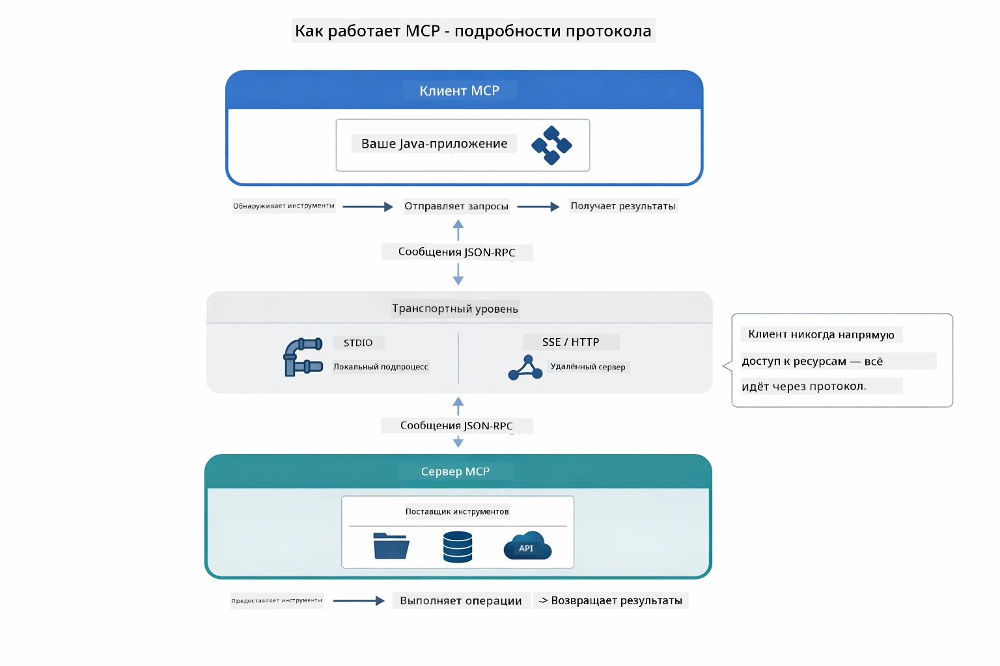

*Как MCP работает «под капотом»: клиенты обнаруживают инструменты, обмениваются сообщениями JSON-RPC и выполняют операции через транспортный слой.*

**Клиент-серверная архитектура**

MCP использует модель клиент-сервер. Сервера предоставляют инструменты — чтение файлов, запросы к базам данных, вызовы API. Клиенты (ваше AI-приложение) подключаются к серверам и используют их инструменты.

Чтобы использовать MCP с LangChain4j, добавьте эту зависимость Maven:

```xml
<dependency>
    <groupId>dev.langchain4j</groupId>
    <artifactId>langchain4j-mcp</artifactId>
    <version>${langchain4j.version}</version>
</dependency>
```

**Обнаружение инструментов**

При подключении вашего клиента к MCP-серверу он спрашивает: «Какие у тебя есть инструменты?» Сервер отвечает списком доступных инструментов с описаниями и схемами параметров. Ваш AI-агент решает, какие инструменты использовать, исходя из пользовательских запросов. Ниже диаграмма рукопожатия — клиент посылает запрос `tools/list`, а сервер возвращает свои инструменты с описаниями и схемами:

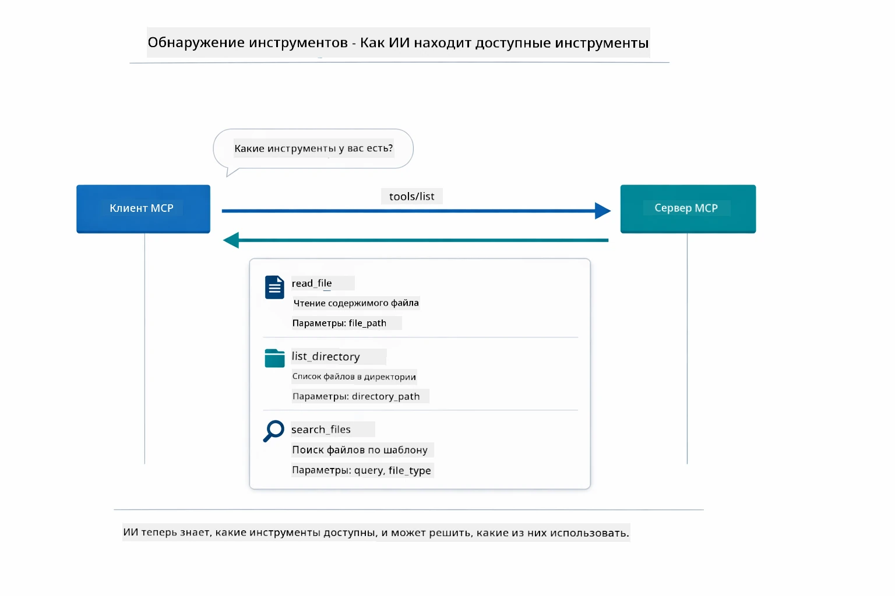

*ИИ обнаруживает доступные инструменты при запуске — теперь он знает, какие возможности есть и может решать, какие использовать.*

**Транспортные механизмы**

MCP поддерживает различные транспортные механизмы. Два варианта: Stdio (для локального общения с подпроцессами) и Streamable HTTP (для удалённых серверов). В этом модуле показан транспорт Stdio:


*Транспорт MCP: HTTP для удалённых серверов, Stdio для локальных процессов*

**Stdio** - [StdioTransportDemo.java](../../../05-mcp/src/main/java/com/example/langchain4j/mcp/StdioTransportDemo.java)

Для локальных процессов. Ваше приложение запускает сервер как подпроцесс и общается через стандартный ввод/вывод. Полезно для доступа к файловой системе или командным инструментам.

```java
McpTransport stdioTransport = new StdioMcpTransport.Builder()
    .command(List.of(
        npmCmd, "exec",
        "@modelcontextprotocol/server-filesystem@2025.12.18",
        resourcesDir
    ))
    .logEvents(false)
    .build();
```

Сервер `@modelcontextprotocol/server-filesystem` предоставляет следующие инструменты, все ограничены указанными вами директориями:

| Инструмент             | Описание                                       |
|-----------------------|------------------------------------------------|
| `read_file`           | Чтение содержимого одного файла                |
| `read_multiple_files` | Чтение нескольких файлов за один вызов          |
| `write_file`          | Создание или перезапись файла                    |
| `edit_file`           | Целевое редактирование find-and-replace         |
| `list_directory`      | Список файлов и директорий по пути                |
| `search_files`        | Рекурсивный поиск файлов по шаблону               |
| `get_file_info`       | Получение метаданных файла (размер, время, права)|
| `create_directory`    | Создание директории (включая родительские каталоги)|
| `move_file`           | Перемещение или переименование файла/директории  |

Ниже показано, как работает транспорт Stdio во время выполнения — ваше Java-приложение запускает MCP-сервер как дочерний процесс и они общаются через каналы stdin/stdout, без сети или HTTP:

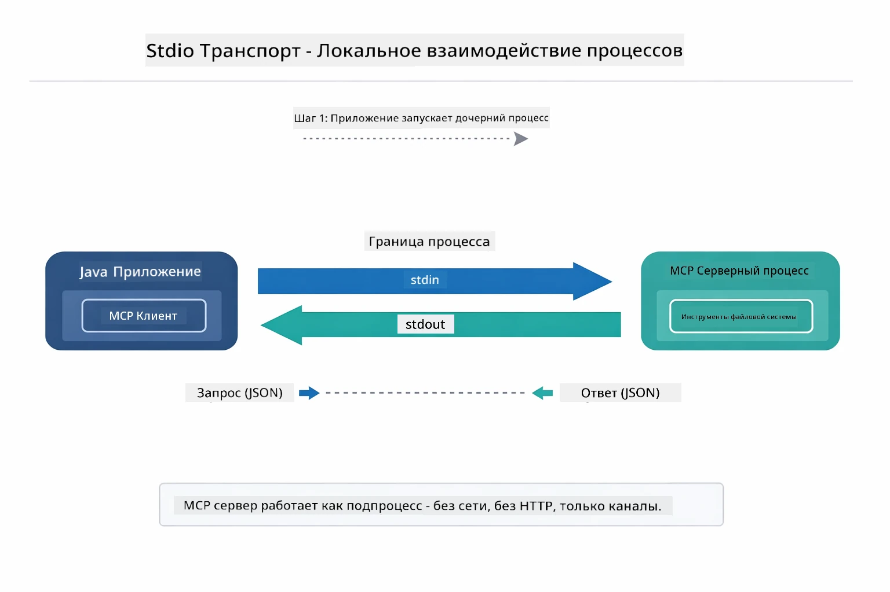

*Stdio транспорт в работе — приложение запускает MCP-сервер как дочерний процесс и общается через каналы stdin/stdout.*

> **🤖 Попробуйте с [GitHub Copilot](https://github.com/features/copilot) Chat:** Откройте [`StdioTransportDemo.java`](../../../05-mcp/src/main/java/com/example/langchain4j/mcp/StdioTransportDemo.java) и спросите:  
> - "Как работает транспорт Stdio и когда его использовать вместо HTTP?"  
> - "Как LangChain4j управляет жизненным циклом запущенных MCP-серверов?"  
> - "Какие есть вопросы безопасности при предоставлении ИИ доступа к файловой системе?"

## Агентный модуль

Хотя MCP предоставляет стандартизованные инструменты, агентный модуль LangChain4j позволяет декларативно создавать агентов, которые оркестрируют эти инструменты. Аннотация `@Agent` и `AgenticServices` позволяют определять поведение агента через интерфейсы, а не императивный код.

В этом модуле вы познакомитесь с паттерном **Агент надзора** — продвинутым агентным подходом, где «надзорный» агент динамически решает, каких подагентов вызвать в зависимости от запросов пользователя. Мы объединим обе концепции, предоставив одному из наших подагентов MCP-инструменты для работы с файлами.

Для использования агентного модуля добавьте эту зависимость Maven:

```xml
<dependency>
    <groupId>dev.langchain4j</groupId>
    <artifactId>langchain4j-agentic</artifactId>
    <version>${langchain4j.mcp.version}</version>
</dependency>
```
> **Примечание:** Модуль `langchain4j-agentic` использует отдельное свойство версии (`langchain4j.mcp.version`), так как выпускается по другому графику, чем основные библиотеки LangChain4j.

> **⚠️ Экспериментальный:** Модуль `langchain4j-agentic` является **экспериментальным** и может изменяться. Стабильным способом создания AI-ассистентов остаётся `langchain4j-core` с пользовательскими инструментами (Модуль 04).

## Запуск примеров

### Предварительные требования

- Пройден [Модуль 04 - Инструменты](../04-tools/README.md) (этот модуль строится на концепциях кастомных инструментов и сравнивает их с MCP-инструментами)
- Файл `.env` в корне с учетными данными Azure (создаётся `azd up` в Модуле 01)
- Java 21+, Maven 3.9+
- Node.js 16+ и npm (для MCP-серверов)

> **Примечание:** Если вы ещё не настроили переменные окружения, смотрите [Модуль 01 - Введение](../01-introduction/README.md) для инструкций по развертыванию (`azd up` создаст `.env` автоматически), либо скопируйте `.env.example` в `.env` в корне и заполните значениями.

## Быстрый старт

**В VS Code:** Просто кликните правой кнопкой по любому демонстрационному файлу в Проводнике и выберите **"Run Java"**, либо используйте конфигурации из панели Запуск и Отладка (сначала убедитесь, что файл `.env` настроен с учетными данными Azure).

**В Maven:** Также можно запускать с командной строки по примерам ниже.

### Операции с файлами (Stdio)

Демонстрирует инструменты на базе локальных подпроцессов.

**✅ Нет требований к предварительной настройке** — MCP-сервер запускается автоматически.

**Использование стартовых скриптов (рекомендуется):**

Стартовые скрипты автоматически загружают переменные окружения из корневого файла `.env`:

**Bash:**
```bash
cd 05-mcp
chmod +x start-stdio.sh
./start-stdio.sh
```

**PowerShell:**
```powershell
cd 05-mcp
.\start-stdio.ps1
```

**В VS Code:** Кликните правой кнопкой на `StdioTransportDemo.java` и выберите **"Run Java"** (проверьте, что `.env` настроен).

Приложение автоматически запускает MCP-сервер файловой системы и читает локальный файл. Обратите внимание, как управление подпроцессами выполнено за вас.

**Ожидаемый вывод:**
```
Assistant response: The file provides an overview of LangChain4j, an open-source Java library
for integrating Large Language Models (LLMs) into Java applications...
```

### Агент надзора

Паттерн **Агент надзора** — это **гибкая** форма агентного ИИ. Надзорный агент использует LLM, чтобы автономно решить, каких агентов вызвать для обработки запроса пользователя. В следующем примере мы комбинируем MCP-инструменты доступа к файлам с LLM-агентом, чтобы создать контролируемый рабочий процесс чтения файла → создания отчёта.

В демо `FileAgent` читает файл с использованием MCP-инструментов файловой системы, а `ReportAgent` формирует структурированный отчёт с исполнительным резюме (1 предложение), 3 ключевыми моментами и рекомендациями. Надзорный агент автоматически управляет этим потоком:

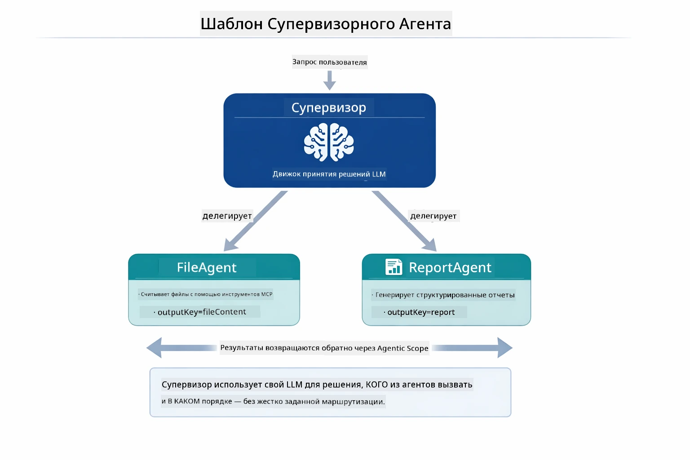

*Надзорный агент использует свой LLM, чтобы решать, каких агентов вызывать и в каком порядке — жёстко зашитая маршрутизация не нужна.*

Вот конкретный рабочий процесс для нашего потока от файла к отчёту:

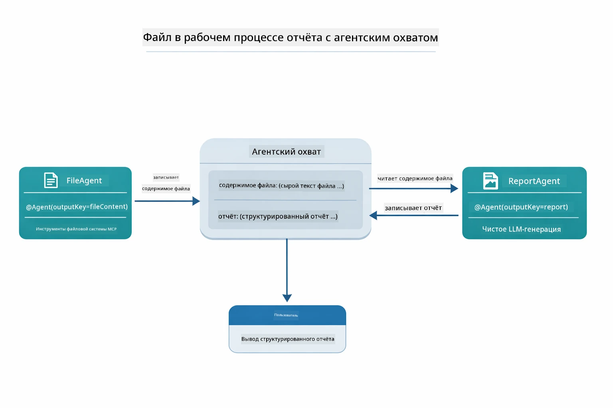

*FileAgent читает файл через инструменты MCP, затем ReportAgent преобразует исходный контент в структурированный отчёт.*

Следующая диаграмма последовательности показывает полный процесс работы надзорного агента — от запуска MCP-сервера, через автономный выбор агентов надзорным агентом, до вызовов инструментов через stdio и финального отчёта:

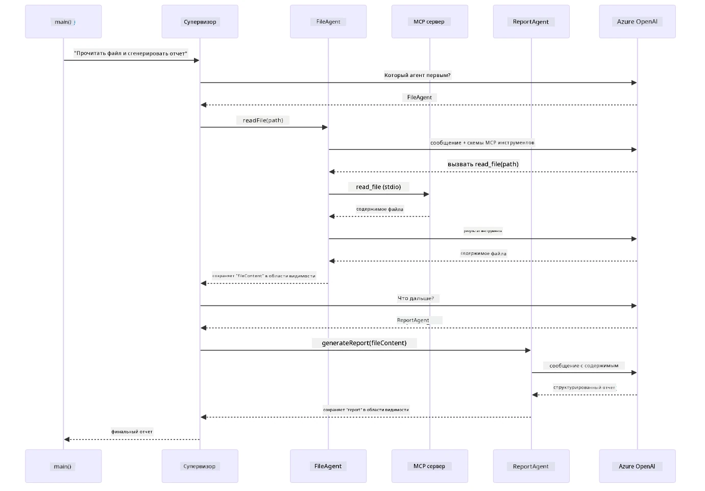

*Надзорный агент автономно вызывает FileAgent (который через stdio вызывает MCP-сервер для чтения файла), затем вызывает ReportAgent для генерации структурированного отчёта — каждый агент сохраняет результаты в общем Agentic Scope.*

Каждый агент сохраняет свои результаты в **Agentic Scope** (совместная память), позволяя последующим агентам получать доступ к предыдущим данным. Это демонстрирует, как инструменты MCP плавно интегрируются в агентные рабочие процессы — Надзорному агенту не важно, *как* читаются файлы, достаточно знать, что `FileAgent` это умеет.

#### Запуск демонстрации

Стартовые скрипты автоматически загружают переменные окружения из корневого `.env` файла:

**Bash:**
```bash
cd 05-mcp
chmod +x start-supervisor.sh
./start-supervisor.sh
```

**PowerShell:**
```powershell
cd 05-mcp
.\start-supervisor.ps1
```

**В VS Code:** Кликните правой кнопкой на `SupervisorAgentDemo.java` и выберите **"Run Java"** (проверьте что `.env` настроен).

#### Как работает Надзорный Агент

Перед созданием агентов нужно подключить MCP-транспорт к клиенту и обернуть его в `ToolProvider`. Так инструменты MCP-сервера становятся доступны вашим агентам:

```java
// Создайте MCP клиент из транспорта
McpClient mcpClient = new DefaultMcpClient.Builder()
        .transport(stdioTransport)
        .build();

// Оберните клиент в ToolProvider — это связывает MCP инструменты с LangChain4j
ToolProvider mcpToolProvider = McpToolProvider.builder()
        .mcpClients(List.of(mcpClient))
        .build();
```

Теперь вы можете инжектировать `mcpToolProvider` в любого агента, которому нужны MCP-инструменты:

```java
// Шаг 1: FileAgent читает файлы с помощью инструментов MCP
FileAgent fileAgent = AgenticServices.agentBuilder(FileAgent.class)
        .chatModel(model)
        .toolProvider(mcpToolProvider)  // Имеет инструменты MCP для работы с файлами
        .build();

// Шаг 2: ReportAgent генерирует структурированные отчёты
ReportAgent reportAgent = AgenticServices.agentBuilder(ReportAgent.class)
        .chatModel(model)
        .build();

// Supervisor координирует рабочий процесс файл → отчёт
SupervisorAgent supervisor = AgenticServices.supervisorBuilder()
        .chatModel(model)
        .subAgents(fileAgent, reportAgent)
        .responseStrategy(SupervisorResponseStrategy.LAST)  // Возвращает итоговый отчёт
        .build();

// Supervisor решает, каких агентов вызвать в зависимости от запроса
String response = supervisor.invoke("Read the file at /path/file.txt and generate a report");
```

#### Как FileAgent обнаруживает инструменты MCP во время выполнения

Вы, возможно, спросите: **как `FileAgent` знает, как использовать npm-инструменты файловой системы?** Ответ: он этого не знает — **LLM** определяет это во время выполнения через схемы инструментов.

Интерфейс `FileAgent` — это всего лишь **определение подсказки**. В нём нет жёсткой привязки к `read_file`, `list_directory` или другим MCP-инструментам. Вот что происходит от начала до конца:
1. **Сервер запускается:** `StdioMcpTransport` запускает npm-пакет `@modelcontextprotocol/server-filesystem` как дочерний процесс  
2. **Обнаружение инструментов:** `McpClient` отправляет JSON-RPC запрос `tools/list` серверу, который отвечает именами инструментов, описаниями и схемами параметров (например, `read_file` — *"Считать полное содержимое файла"* — `{ path: string }`)  
3. **Внедрение схем:** `McpToolProvider` оборачивает эти обнаруженные схемы и делает их доступными для LangChain4j  
4. **Решение LLM:** Когда вызывается `FileAgent.readFile(path)`, LangChain4j отправляет системное сообщение, сообщение пользователя **и список схем инструментов** в LLM. LLM читает описания инструментов и генерирует вызов инструмента (например, `read_file(path="/some/file.txt")`)  
5. **Выполнение:** LangChain4j перехватывает вызов инструмента, направляет его через MCP клиент обратно в подпроцесс Node.js, получает результат и передает его обратно в LLM  

Это тот же самый механизм [Обнаружения инструментов](../../../05-mcp), описанный выше, но примененный конкретно к рабочему процессу агента. Аннотации `@SystemMessage` и `@UserMessage` направляют поведение LLM, а внедренный `ToolProvider` дает ему **возможности** — LLM связывает два аспекта во время выполнения.

> **🤖 Попробуйте с помощью [GitHub Copilot](https://github.com/features/copilot) Chat:** Откройте [`FileAgent.java`](../../../05-mcp/src/main/java/com/example/langchain4j/mcp/agents/FileAgent.java) и задайте вопросы:  
> - "Как этот агент узнает, какой MCP-инструмент вызвать?"  
> - "Что произойдет, если я удалю ToolProvider из билдера агента?"  
> - "Как схемы инструментов передаются в LLM?"  

#### Стратегии ответа

При настройке `SupervisorAgent` вы определяете, как он должен формулировать итоговый ответ пользователю после того, как субагенты завершат свои задачи. Ниже представлена диаграмма с тремя доступными стратегиями — LAST возвращает выход последнего агента напрямую, SUMMARY синтезирует все выходы через LLM, а SCORED выбирает тот, что получил более высокий балл по сравнению с исходным запросом:

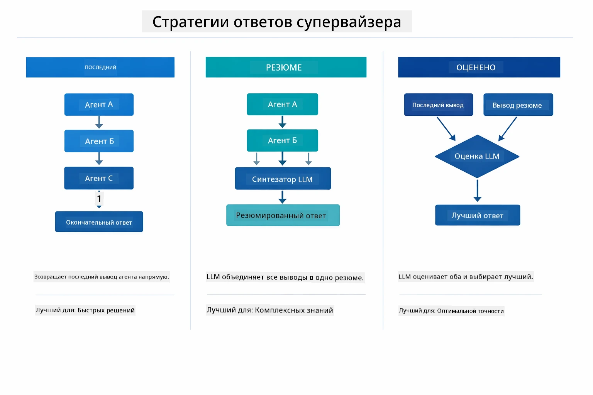

*Три стратегии того, как Supervisor формирует итоговый ответ — выберите в зависимости от того, хотите ли вы вывести результат последнего агента, сгенерировать сводку или получить лучший по оценке вариант.*

Доступные стратегии:

| Стратегия | Описание |
|-----------|----------|
| **LAST**  | Супервизор возвращает результат последнего вызванного субагента или инструмента. Полезно, когда последний агент в цепочке специально создан для выдачи полного финального ответа (например, "Агент-сводка" в исследовательском процессе). |
| **SUMMARY** | Супервизор использует собственную внутреннюю языковую модель (LLM) для синтеза сводки всего взаимодействия и всех выходных данных субагентов, затем возвращает эту сводку как итоговый ответ. Это дает чистый агрегированный ответ пользователю. |
| **SCORED** | Система применяет внутренний LLM для оценки как ответа LAST, так и сводки SUMMARY относительно исходного запроса пользователя, возвращая тот выход, который получил более высокий балл. |

Смотрите полный пример в [SupervisorAgentDemo.java](../../../05-mcp/src/main/java/com/example/langchain4j/mcp/SupervisorAgentDemo.java).

> **🤖 Попробуйте с помощью [GitHub Copilot](https://github.com/features/copilot) Chat:** Откройте [`SupervisorAgentDemo.java`](../../../05-mcp/src/main/java/com/example/langchain4j/mcp/SupervisorAgentDemo.java) и задайте вопросы:  
> - "Как Супервизор решает, каких агентов вызывать?"  
> - "В чем разница между паттернами Supervisor и Sequential workflows?"  
> - "Как я могу настроить поведение планирования Супервизора?"  

#### Понимание вывода

Когда вы запустите демо, увидите структурированное поэтапное руководство, как Супервизор координирует работу нескольких агентов. Вот что означает каждая секция:

```
======================================================================
  FILE → REPORT WORKFLOW DEMO
======================================================================

This demo shows a clear 2-step workflow: read a file, then generate a report.
The Supervisor orchestrates the agents automatically based on the request.
```
  
**Заголовок** вводит концепцию рабочего процесса: сфокусированная цепочка от чтения файла до генерации отчета.

```
--- WORKFLOW ---------------------------------------------------------
  ┌─────────────┐      ┌──────────────┐
  │  FileAgent  │ ───▶ │ ReportAgent  │
  │ (MCP tools) │      │  (pure LLM)  │
  └─────────────┘      └──────────────┘
   outputKey:           outputKey:
   'fileContent'        'report'

--- AVAILABLE AGENTS -------------------------------------------------
  [FILE]   FileAgent   - Reads files via MCP → stores in 'fileContent'
  [REPORT] ReportAgent - Generates structured report → stores in 'report'
```
  
**Диаграмма Workflow** показывает поток данных между агентами. Каждый агент выполняет свою роль:  
- **FileAgent** читает файлы с помощью MCP-инструментов и сохраняет необработанное содержимое в `fileContent`  
- **ReportAgent** использует это содержимое и создает структурированный отчет в `report`

```
--- USER REQUEST -----------------------------------------------------
  "Read the file at .../file.txt and generate a report on its contents"
```
  
**Запрос пользователя** показывает задачу. Супервизор анализирует её и решает вызвать FileAgent → ReportAgent.

```
--- SUPERVISOR ORCHESTRATION -----------------------------------------
  The Supervisor decides which agents to invoke and passes data between them...

  +-- STEP 1: Supervisor chose -> FileAgent (reading file via MCP)
  |
  |   Input: .../file.txt
  |
  |   Result: LangChain4j is an open-source, provider-agnostic Java framework for building LLM...
  +-- [OK] FileAgent (reading file via MCP) completed

  +-- STEP 2: Supervisor chose -> ReportAgent (generating structured report)
  |
  |   Input: LangChain4j is an open-source, provider-agnostic Java framew...
  |
  |   Result: Executive Summary...
  +-- [OK] ReportAgent (generating structured report) completed
```
  
**Оркестровка Супервизором** показывает, как работает поток из двух шагов:  
1. **FileAgent** считывает файл через MCP и сохраняет содержимое  
2. **ReportAgent** получает содержимое и генерирует структурированный отчет  

Супервизор принял эти решения **автономно**, основываясь на запросе пользователя.

```
--- FINAL RESPONSE ---------------------------------------------------
Executive Summary
...

Key Points
...

Recommendations
...

--- AGENTIC SCOPE (Data Flow) ----------------------------------------
  Each agent stores its output for downstream agents to consume:
  * fileContent: LangChain4j is an open-source, provider-agnostic Java framework...
  * report: Executive Summary...
```
  
#### Объяснение функций модуля Agentic

Пример демонстрирует несколько продвинутых функций модуля Agentic. Рассмотрим подробнее Agentic Scope и Agent Listeners.

**Agentic Scope** — это общая память, куда агенты сохраняют свои результаты с помощью `@Agent(outputKey="...")`. Это позволяет:  
- Поздним агентам обращаться к выходам предыдущих  
- Супервизору синтезировать итоговый ответ  
- Вам инспектировать, что сгенерировал каждый агент  

Ниже диаграмма показывает, как Agentic Scope работает как общая память в цепочке от файла до отчета — FileAgent записывает выход под ключом `fileContent`, ReportAgent читает это и записывает свой выход под `report`:

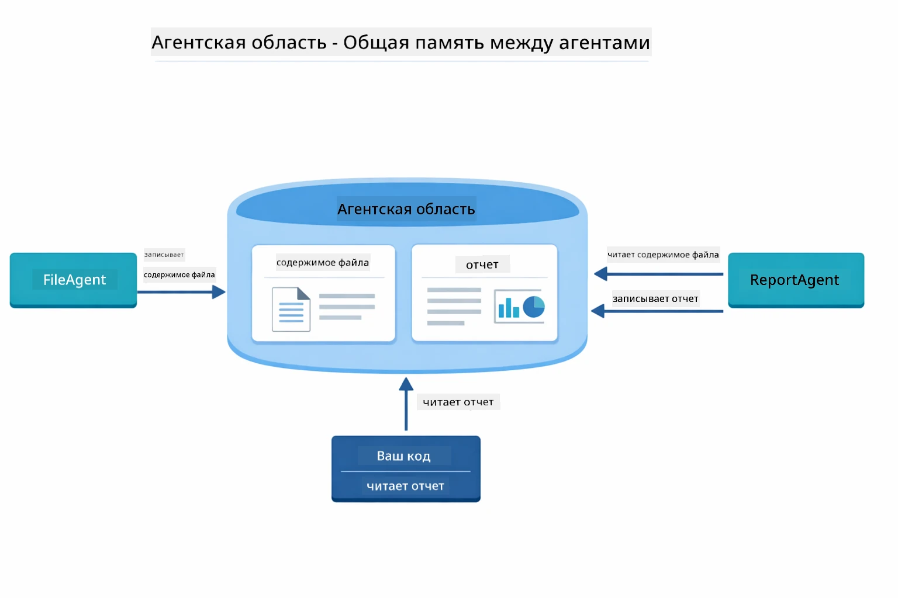

*Agentic Scope служит общей памятью — FileAgent записывает `fileContent`, ReportAgent читает его и записывает `report`, а ваш код читает итоговый результат.*

```java
ResultWithAgenticScope<String> result = supervisor.invokeWithAgenticScope(request);
AgenticScope scope = result.agenticScope();
String fileContent = scope.readState("fileContent");  // Исходные данные файла от FileAgent
String report = scope.readState("report");            // Структурированный отчет от ReportAgent
```
  
**Agent Listeners** позволяют мониторить и отлаживать выполнение агентов. Пошаговый вывод в демо исходит от AgentListener, который подключается к каждому вызову агента:  
- **beforeAgentInvocation** — вызывается, когда Супервизор выбирает агента, показывая, какой агент выбран и почему  
- **afterAgentInvocation** — вызывается после завершения агента, показывая его результат  
- **inheritedBySubagents** — если true, слушатель отслеживает всех агентов в иерархии  

Следующая диаграмма показывает полный жизненный цикл Agent Listener, включая обработку ошибок через `onError` во время исполнения агента:

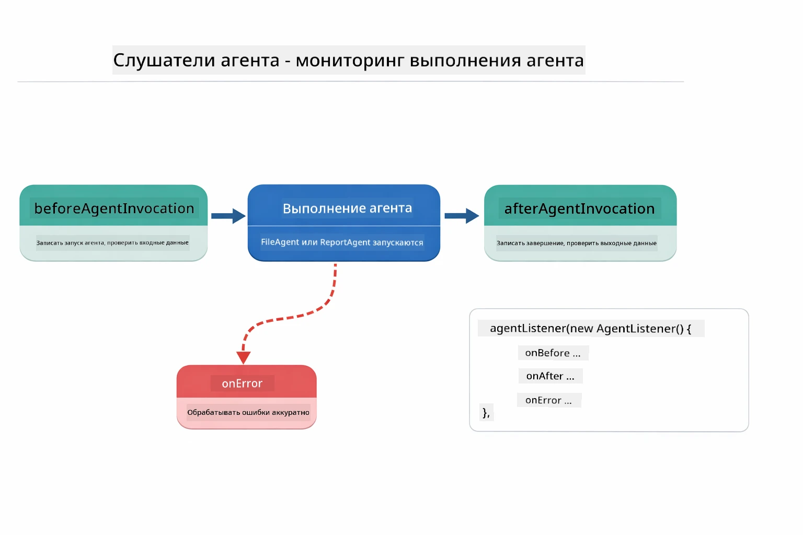

*Agent Listeners подключаются к жизненному циклу исполнения — отслеживают запуск, завершение или ошибки агентного кода.*

```java
AgentListener monitor = new AgentListener() {
    private int step = 0;
    
    @Override
    public void beforeAgentInvocation(AgentRequest request) {
        step++;
        System.out.println("  +-- STEP " + step + ": " + request.agentName());
    }
    
    @Override
    public void afterAgentInvocation(AgentResponse response) {
        System.out.println("  +-- [OK] " + response.agentName() + " completed");
    }
    
    @Override
    public boolean inheritedBySubagents() {
        return true; // Распространить на всех подагентов
    }
};
```
  
Помимо паттерна Supervisor, модуль `langchain4j-agentic` предлагает несколько мощных рабочих паттернов. Ниже показаны все пять — от простых последовательных конвейеров до рабочих процессов с человеком в цикле утверждения:

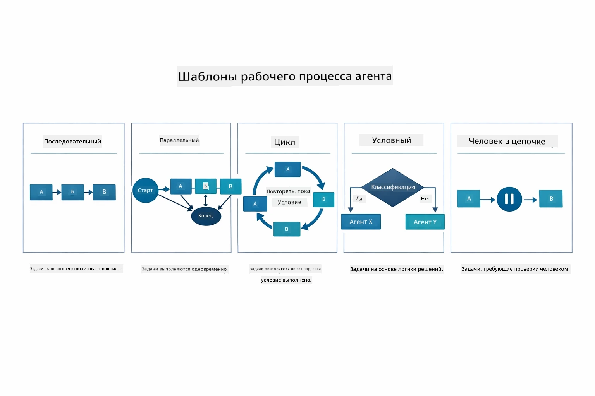

*Пять паттернов для оркестрации агентов — от простых последовательных конвейеров до рабочих процессов с человеком в цикле.*

| Паттерн                | Описание                                  | Случай использования                    |
|------------------------|-------------------------------------------|----------------------------------------|
| **Sequential**          | Выполнение агентов по порядку, вывод передается дальше | Конвейеры: исследование → анализ → отчет |
| **Parallel**            | Параллельный запуск агентов               | Независимые задачи: погода + новости + акции |
| **Loop**                | Итерации до выполнения условия            | Оценка качества: уточнение, пока оценка < 0.8 |
| **Conditional**         | Маршрутизация по условиям                  | Классификация → передача спецагенту     |
| **Human-in-the-Loop**   | Добавление человеко-контроля               | Рабочие процессы утверждения, обзора контента |

## Ключевые понятия

Теперь, когда вы ознакомились с MCP и модулем agentic в действии, подведем итоги, когда использовать каждый подход.

Одно из главных преимуществ MCP — его растущая экосистема. Ниже диаграмма показывает, как единый универсальный протокол связывает ваше AI-приложение с широким спектром MCP-серверов — от доступа к файловой системе и базам данных до GitHub, электронной почты, веб-скрапинга и многого другого:

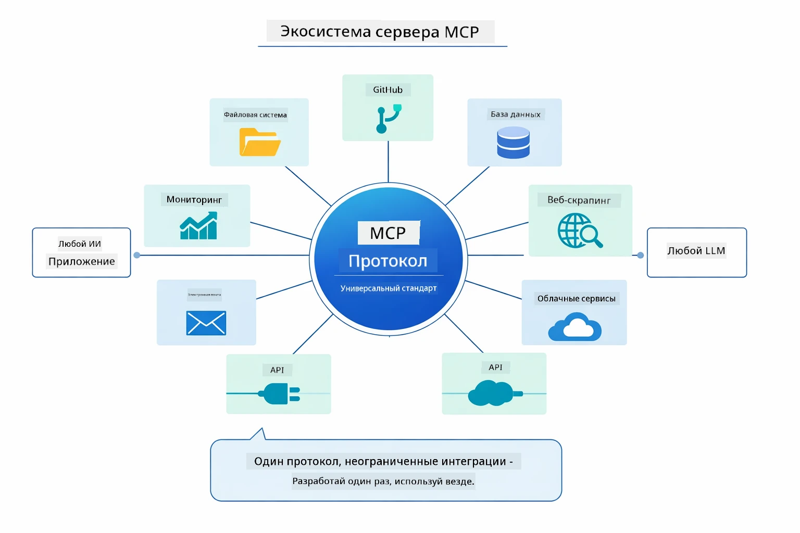

*MCP создает экосистему универсального протокола — любой MCP-совместимый сервер работает с любым MCP-совместимым клиентом, обеспечивая совместное использование инструментов между приложениями.*

**MCP** идеально подходит, если вы хотите использовать существующую экосистему инструментов, создавать инструменты, которыми могут пользоваться различные приложения, интегрировать сторонние сервисы с помощью стандартных протоколов или менять реализацию инструментов без изменений кода.

**Модуль Agentic** лучше всего подходит, если вам нужны декларативные определения агентов с помощью аннотаций `@Agent`, требуется оркестровка рабочих процессов (последовательное, циклы, параллельно), предпочтительнее дизайн агентов через интерфейсы, а не императивный код, или вы комбинируете несколько агентов, совместно использующих выходы через `outputKey`.

**Паттерн Supervisor Agent** выделяется, когда рабочий процесс трудно предсказать заранее и вы хотите, чтобы LLM решала, когда у вас есть несколько специализированных агентов с динамической оркестровкой, при построении разговорных систем с маршрутизацией к разным возможностям или когда вам нужна максимально гибкая, адаптивная поведенческая модель агента.

Чтобы помочь выбрать между пользовательскими методами `@Tool` из Модуля 04 и MCP-инструментами из этого модуля, приведено сравнение ключевых компромиссов — пользовательские инструменты дают тесную связь и полную типовую безопасность для специфической логики приложения, а MCP-инструменты обеспечивают стандартизированные, многоразовые интеграции:

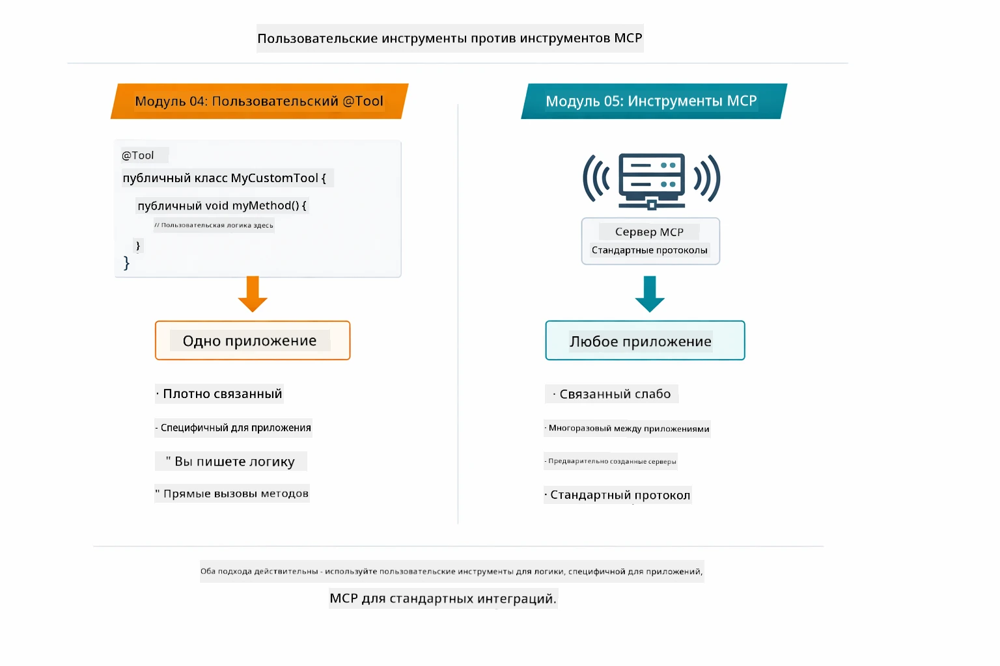

*Когда использовать пользовательские методы @Tool и когда MCP-инструменты — пользовательские для логики конкретных приложений с полной типобезопасностью, MCP — для стандартизированных интеграций между приложениями.*

## Поздравляем!

Вы завершили все пять модулей курса LangChain4j для начинающих! Вот общий путь обучения, который вы прошли — от базового чата до агентных систем на базе MCP:

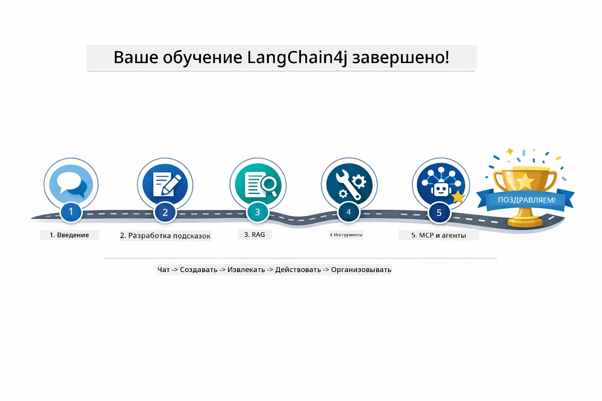

*Ваш путь обучения через все пять модулей — от базового чата до агентных систем на базе MCP.*

Вы освоили LangChain4j для начинающих. Вы научились:

- Создавать разговорный ИИ с памятью (Модуль 01)  
- Использовать паттерны проектирования подсказок для различных задач (Модуль 02)  
- Подкреплять ответы информацией из ваших документов с помощью RAG (Модуль 03)  
- Создавать базовых AI-агентов (ассистентов) с пользовательскими инструментами (Модуль 04)  
- Интегрировать стандартизированные инструменты с LangChain4j MCP и модулями Agentic (Модуль 05)  

### Что дальше?

После прохождения модулей ознакомьтесь с [руководством по тестированию](../docs/TESTING.md), чтобы увидеть концепции тестирования LangChain4j в действии.

**Официальные ресурсы:**  
- [Документация LangChain4j](https://docs.langchain4j.dev/) — подробные руководства и справочник API  
- [GitHub LangChain4j](https://github.com/langchain4j/langchain4j) — исходный код и примеры  
- [Учебники LangChain4j](https://docs.langchain4j.dev/tutorials/) — пошаговые инструкции для различных сценариев  

Спасибо за прохождение этого курса!

---

**Навигация:** [← Предыдущий: Модуль 04 - Инструменты](../04-tools/README.md) | [Назад к содержанию](../README.md)

---

<!-- CO-OP TRANSLATOR DISCLAIMER START -->
**Отказ от ответственности**:  
Этот документ был переведен с помощью сервиса автоматического перевода [Co-op Translator](https://github.com/Azure/co-op-translator). Несмотря на наши усилия по обеспечению точности, пожалуйста, учитывайте, что автоматический перевод может содержать ошибки или неточности. Оригинальный документ на его родном языке следует считать авторитетным источником. Для критически важной информации рекомендуется обратиться к профессиональному переводу, выполненному человеком. Мы не несем ответственности за любые недоразумения или неправильное толкование, возникающие при использовании этого перевода.
<!-- CO-OP TRANSLATOR DISCLAIMER END -->