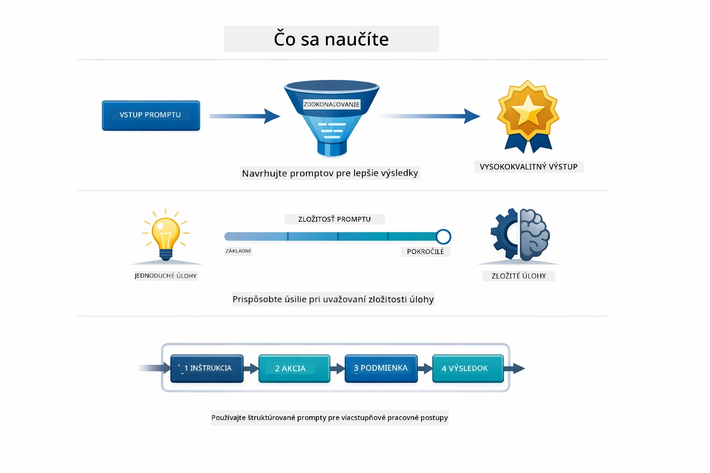
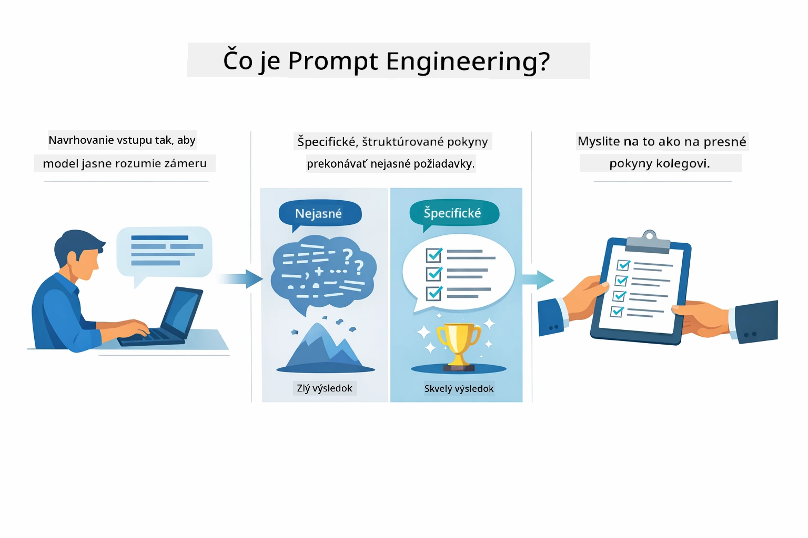
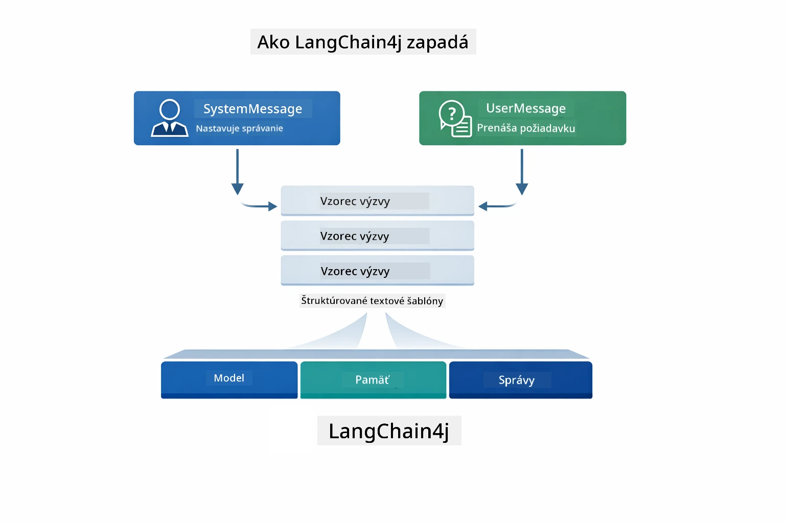
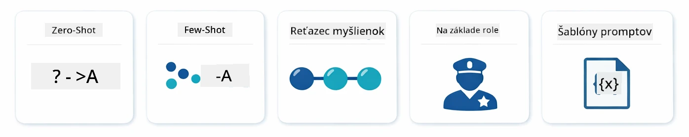
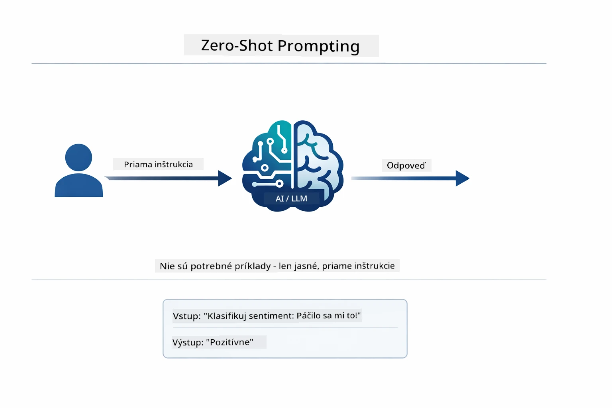
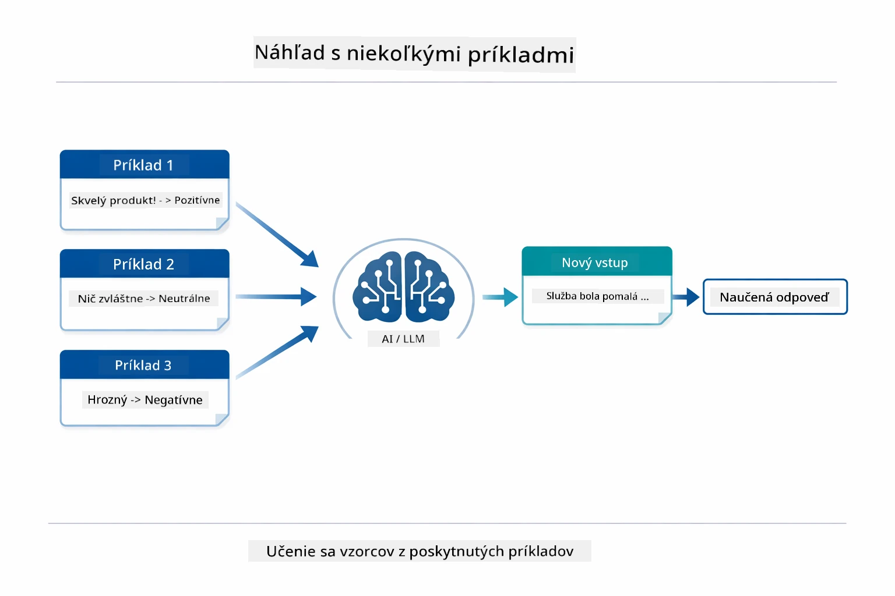
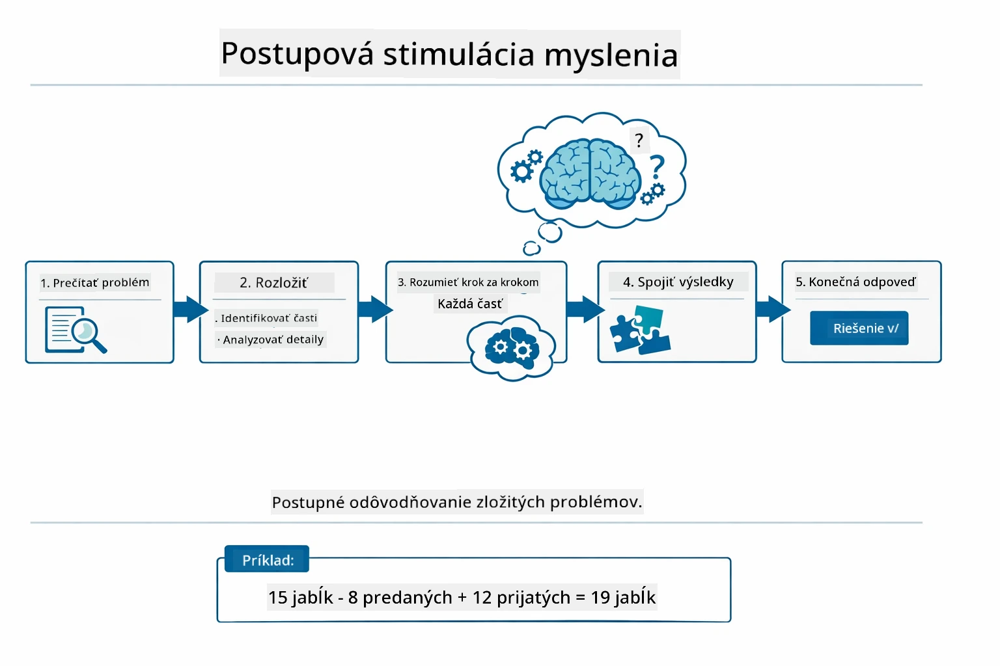
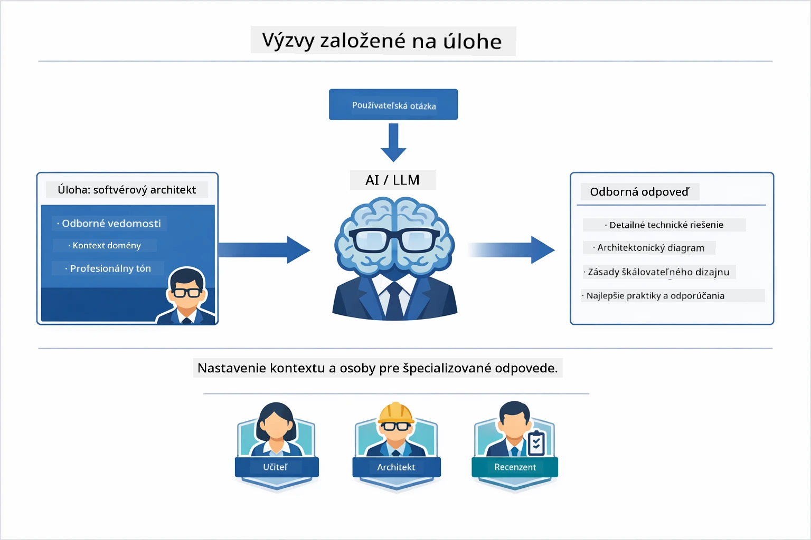
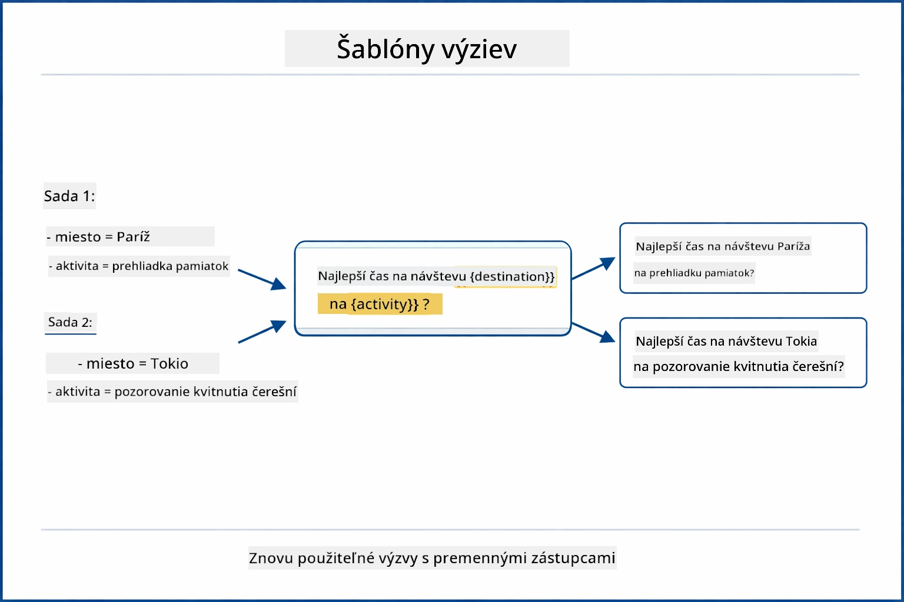
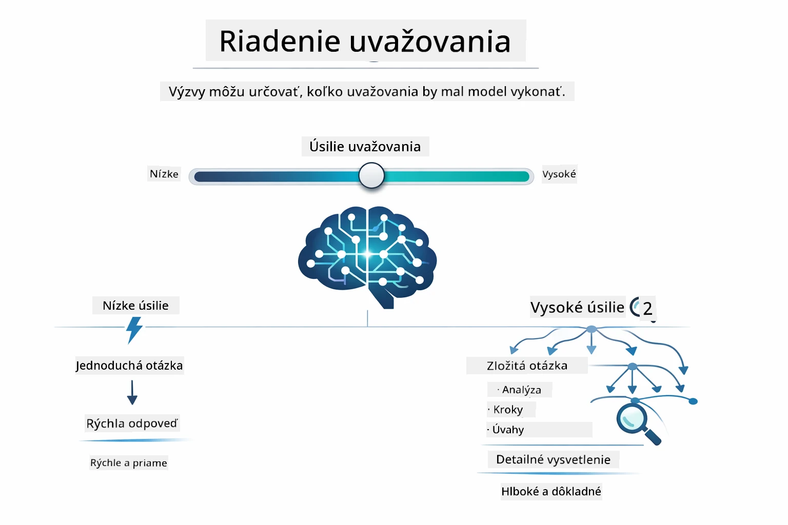

# Modul 02: Inžinierstvo výziev s GPT-5.2

## Obsah

- [Video prehliadka](../../../02-prompt-engineering)
- [Čo sa naučíte](../../../02-prompt-engineering)
- [Predpoklady](../../../02-prompt-engineering)
- [Pochopenie inžinierstva výziev](../../../02-prompt-engineering)
- [Základy inžinierstva výziev](../../../02-prompt-engineering)
  - [Zero-Shot Prompting](../../../02-prompt-engineering)
  - [Few-Shot Prompting](../../../02-prompt-engineering)
  - [Chain of Thought](../../../02-prompt-engineering)
  - [Role-Based Prompting](../../../02-prompt-engineering)
  - [Šablóny výziev](../../../02-prompt-engineering)
- [Pokročilé vzory](../../../02-prompt-engineering)
- [Používanie existujúcich Azure zdrojov](../../../02-prompt-engineering)
- [Snímky obrazovky aplikácie](../../../02-prompt-engineering)
- [Preskúmanie vzorov](../../../02-prompt-engineering)
  - [Nízke verzus vysoko motivované](../../../02-prompt-engineering)
  - [Vykonávanie úloh (Úvodné texty nástrojov)](../../../02-prompt-engineering)
  - [Sebareflexívny kód](../../../02-prompt-engineering)
  - [Štruktúrovaná analýza](../../../02-prompt-engineering)
  - [Viaczásahový chat](../../../02-prompt-engineering)
  - [Krok za krokom uvažovanie](../../../02-prompt-engineering)
  - [Obmedzený výstup](../../../02-prompt-engineering)
- [Čo sa skutočne učíte](../../../02-prompt-engineering)
- [Ďalšie kroky](../../../02-prompt-engineering)

## Video prehliadka

Pozrite si túto živú reláciu, ktorá vysvetľuje, ako začať s týmto modulom: [Inžinierstvo výziev s LangChain4j - živá relácia](https://www.youtube.com/live/PJ6aBaE6bog?si=LDshyBrTRodP-wke)

## Čo sa naučíte



V predchádzajúcom module ste videli, ako pamäť umožňuje konverzačné AI a použili ste GitHub Models pre základné interakcie. Teraz sa zameriame na to, ako klásť otázky – samotné výzvy – pomocou GPT-5.2 od Azure OpenAI. Spôsob, akým štruktúrujete svoje výzvy, zásadne ovplyvňuje kvalitu odpovedí, ktoré dostanete. Začíname prehľadom základných techník výzvových otázok, potom prejdeme k ôsmim pokročilým vzorom, ktoré plne využívajú schopnosti GPT-5.2.

Použijeme GPT-5.2, pretože zavádza kontrolu uvažovania – môžete modelu povedať, koľko má pred odpoveďou premýšľať. To robí rôzne stratégie výziev výraznejšími a pomáha vám pochopiť, kedy použiť ktorý prístup. Tiež budeme benefitovať z menej obmedzení pre GPT-5.2 na Azure v porovnaní s GitHub Models.

## Predpoklady

- Dokončený Modul 01 (nasadené Azure OpenAI zdroje)
- Súbor `.env` v koreňovom adresári s Azure povereniami (vytvorený príkazom `azd up` v Module 01)

> **Poznámka:** Ak ste ešte neukončili Modul 01, najskôr postupujte podľa tamojších pokynov na nasadenie.

## Pochopenie inžinierstva výziev



Inžinierstvo výziev sa týka navrhovania vstupného textu, ktorý vám konzistentne prinesie požadované výsledky. Nejde len o kladenie otázok – ide o štruktúrovanie požiadaviek tak, aby model presne rozumel, čo chcete a ako to má dodať.

Predstavte si to ako dávanie pokynov kolegovi. „Oprav chybu“ je nejasné. „Oprav výnimku null pointer v UserService.java na riadku 45 pridaním kontroly null“ je konkrétne. Jazykové modely fungujú rovnako – dôležitá je špecifickosť a štruktúra.



LangChain4j poskytuje infraštruktúru — pripojenia k modelom, pamäť a typy správ — zatiaľ čo vzory výziev sú iba starostlivo štruktúrovaný text, ktorý posielate cez túto infraštruktúru. Kľúčovými stavebnými prvkami sú `SystemMessage` (ktorý nastavuje správanie AI a úlohu) a `UserMessage` (ktorý nesie vašu skutočnú požiadavku).

## Základy inžinierstva výziev



Skôr než sa pustíme do pokročilých vzorov v tomto module, pozrime sa na päť základných techník tvorby výziev. Tieto tvoria stavebné kamene, ktoré by mal každý inžinier výziev poznať. Ak ste už pracovali cez [rýchly štart](../00-quick-start/README.md#2-prompt-patterns), videli ste ich v akcii — tu je konceptuálny rámec za nimi.

### Zero-Shot Prompting

Najjednoduchší prístup: dať modelu priamy pokyn bez príkladov. Model sa naplno spolieha na svoje trénovanie, aby úlohu pochopil a vykonal. Funguje to dobre pre priame požiadavky, kde je očakávané správanie zrejmé.



*Priamy pokyn bez príkladov — model odvádza úlohu iba podľa pokynu*

```java
String prompt = "Classify this sentiment: 'I absolutely loved the movie!'";
String response = model.chat(prompt);
// Odpoveď: "Pozitívne"
```

**Kedy použiť:** Jednoduché klasifikácie, priame otázky, preklady alebo akákoľvek úloha, ktorú model môže zvládnuť bez ďalších pokynov.

### Few-Shot Prompting

Poskytnite príklady, ktoré ukazujú vzor, ktorý chcete, aby model sledoval. Model sa naučí očakávaný formát vstupu a výstupu z vašich príkladov a aplikuje ho na nové vstupy. To dramaticky zlepšuje konzistenciu pre úlohy, kde očakávaný formát alebo správanie nie je zrejmé.



*Učenie sa z príkladov — model identifikuje vzor a aplikuje ho na nové vstupy*

```java
String prompt = """
    Classify the sentiment as positive, negative, or neutral.
    
    Examples:
    Text: "This product exceeded my expectations!" → Positive
    Text: "It's okay, nothing special." → Neutral
    Text: "Waste of money, very disappointed." → Negative
    
    Now classify this:
    Text: "Best purchase I've made all year!"
    """;
String response = model.chat(prompt);
```

**Kedy použiť:** Vlastné klasifikácie, konzistentné formátovanie, doménovo špecifické úlohy alebo keď sú výsledky zero-shot nevyrovnané.

### Chain of Thought

Požiadajte model, aby ukázal svoje uvažovanie krok za krokom. Namiesto okamžitej odpovede model rozoberie problém a explicitne prejde každou časťou. To zlepšuje presnosť pri matematikách, logike a viacstupňovom uvažovaní.



*Krok za krokom uvažovanie — rozdelenie zložitých problémov na explicitné logické kroky*

```java
String prompt = """
    Problem: A store has 15 apples. They sell 8 apples and then 
    receive a shipment of 12 more apples. How many apples do they have now?
    
    Let's solve this step-by-step:
    """;
String response = model.chat(prompt);
// Model ukazuje: 15 - 8 = 7, potom 7 + 12 = 19 jabĺk
```

**Kedy použiť:** Matematické problémy, logické hlavolamy, ladenie alebo akákoľvek úloha, kde ukázanie uvažovacieho procesu zvyšuje presnosť a dôveru.

### Role-Based Prompting

Nastavte AI personu alebo rolu pred položením otázky. To poskytuje kontext, ktorý formuje tón, hĺbku a zameranie odpovede. „Softvérový architekt“ dáva iné rady než „junior vývojár“ alebo „auditor bezpečnosti“.



*Nastavenie kontextu a persony — tá istá otázka dostane rôznu odpoveď podľa priradenej roly*

```java
String prompt = """
    You are an experienced software architect reviewing code.
    Provide a brief code review for this function:
    
    def calculate_total(items):
        total = 0
        for item in items:
            total = total + item['price']
        return total
    """;
String response = model.chat(prompt);
```

**Kedy použiť:** Kontroly kódu, doučovanie, doménovo špecifické analýzy alebo keď potrebujete odpovede prispôsobené konkrétnej úrovni odbornosti či perspektíve.

### Šablóny výziev

Vytvorte znovupoužiteľné výzvy s premennými zástupcami. Namiesto písania novej výzvy pre každú situáciu definujte šablónu raz a dopĺňajte ju rôznymi hodnotami. Trieda `PromptTemplate` v LangChain4j to uľahčuje pomocou syntaxe `{{variable}}`.



*Znovupoužiteľné výzvy s premennými zástupcami — jedna šablóna, veľa použitia*

```java
PromptTemplate template = PromptTemplate.from(
    "What's the best time to visit {{destination}} for {{activity}}?"
);

Prompt prompt = template.apply(Map.of(
    "destination", "Paris",
    "activity", "sightseeing"
));

String response = model.chat(prompt.text());
```

**Kedy použiť:** Opakované otázky s rôznymi vstupmi, dávkové spracovanie, budovanie znovupoužiteľných AI pracovných tokov alebo akýkoľvek scenár, kde štruktúra výzvy zostáva rovnaká, ale dáta sa menia.

---

Tieto päť základov vám poskytuje pevný nástrojový arzenál pre väčšinu úloh tvorby výziev. Zvyšok tohto modulu na nich stavia s **osem pokročilými vzormi**, ktoré využívajú kontrolu uvažovania, seba-hodnotenie a schopnosti štruktúrovaného výstupu GPT-5.2.

## Pokročilé vzory

Keď máme základy, poďme k ôsmim pokročilým vzorom, ktoré robia tento modul unikátnym. Nie všetky problémy vyžadujú rovnaký prístup. Niektoré otázky potrebujú rýchle odpovede, iné hlboké premýšľanie. Niektoré potrebujú viditeľné uvažovanie, iné len výsledky. Každý z nasledujúcich vzorov je optimalizovaný pre iný scenár — a kontrola uvažovania GPT-5.2 tieto rozdiely ešte viac zvýrazňuje.


*Prehľad ôsmich vzorov inžinierstva výziev a ich použitia*



*Kontrola uvažovania GPT-5.2 vám umožňuje určiť, koľko má model premýšľať — od rýchlych priamych odpovedí po hlboké skúmanie*

**Nízka motivácia (Rýchle a zamerané)** - Pre jednoduché otázky, kde chcete rýchle, priame odpovede. Model uvažuje minimálne – najviac 2 kroky. Použite to na výpočty, vyhľadávania alebo priame otázky.

```java
String prompt = """
    <context_gathering>
    - Search depth: very low
    - Bias strongly towards providing a correct answer as quickly as possible
    - Usually, this means an absolute maximum of 2 reasoning steps
    - If you think you need more time, state what you know and what's uncertain
    </context_gathering>
    
    Problem: What is 15% of 200?
    
    Provide your answer:
    """;

String response = chatModel.chat(prompt);
```

> 💡 **Preskúmajte s GitHub Copilot:** Otvorte [`Gpt5PromptService.java`](../../../02-prompt-engineering/src/main/java/com/example/langchain4j/prompts/service/Gpt5PromptService.java) a spýtajte sa:
> - „Aký je rozdiel medzi nízkou a vysokou motiváciou vzorov výziev?“
> - „Ako tagy XML vo výzvach pomáhajú štruktúrovať odpoveď AI?“
> - „Kedy použiť vzory sebareflexie oproti priamym pokynom?“

**Vysoká motivácia (Hĺbkové a dôkladné)** - Pre zložité problémy, kde chcete komplexnú analýzu. Model dôkladne skúma a ukazuje podrobné uvažovanie. Použite to pre návrh systémov, architektonické rozhodnutia alebo komplexný výskum.

```java
String prompt = """
    Analyze this problem thoroughly and provide a comprehensive solution.
    Consider multiple approaches, trade-offs, and important details.
    Show your analysis and reasoning in your response.
    
    Problem: Design a caching strategy for a high-traffic REST API.
    """;

String response = chatModel.chat(prompt);
```

**Vykonávanie úloh (Pokrok krok za krokom)** - Pre viacstupňové pracovné toky. Model poskytne vopred plán, komentuje každý krok počas práce a potom zhrnie. Použite to na migrácie, implementácie alebo akýkoľvek proces pozostávajúci z viacerých krokov.

```java
String prompt = """
    <task_execution>
    1. First, briefly restate the user's goal in a friendly way
    
    2. Create a step-by-step plan:
       - List all steps needed
       - Identify potential challenges
       - Outline success criteria
    
    3. Execute each step:
       - Narrate what you're doing
       - Show progress clearly
       - Handle any issues that arise
    
    4. Summarize:
       - What was completed
       - Any important notes
       - Next steps if applicable
    </task_execution>
    
    <tool_preambles>
    - Always begin by rephrasing the user's goal clearly
    - Outline your plan before executing
    - Narrate each step as you go
    - Finish with a distinct summary
    </tool_preambles>
    
    Task: Create a REST endpoint for user registration
    
    Begin execution:
    """;

String response = chatModel.chat(prompt);
```

Prompt Chain-of-Thought explicitne žiada model, aby ukázal svoj proces uvažovania, čo zvyšuje presnosť pri zložitých úlohách. Postupné rozdelenie pomáha ľuďom aj AI pochopiť logiku.

> **🤖 Vyskúšajte s [GitHub Copilot](https://github.com/features/copilot) chatom:** Spýtajte sa o tomto vzore:
> - „Ako by som prispôsobil vzor vykonávania úlohy pre dlhodobé operácie?“
> - „Aké sú najlepšie postupy pre štruktúrovanie úvodných textov nástrojov v produkčných aplikáciách?“
> - „Ako zachytávať a zobrazovať medzistavy pokroku v používateľskom rozhraní?“


*Pracovný tok Plánuj → Vykonaj → Zhrň pre viacstupňové úlohy*

**Sebareflexívny kód** - Na generovanie kódu produkčnej kvality. Model generuje kód podľa produkčných štandardov s riadnym spracovaním chýb. Použite to pri budovaní nových funkcií alebo služieb.

```java
String prompt = """
    Generate Java code with production-quality standards: Create an email validation service
    Keep it simple and include basic error handling.
    """;

String response = chatModel.chat(prompt);
```


*Iteratívna slučka zlepšovania - generuj, vyhodnoť, identifikuj problémy, zlepši, opakuj*

**Štruktúrovaná analýza** - Pre konzistentné hodnotenie. Model recenzuje kód podľa pevného rámca (správnosť, prax, výkon, bezpečnosť, udržiavateľnosť). Použite to na revízie kódu alebo hodnotenie kvality.

```java
String prompt = """
    <analysis_framework>
    You are an expert code reviewer. Analyze the code for:
    
    1. Correctness
       - Does it work as intended?
       - Are there logical errors?
    
    2. Best Practices
       - Follows language conventions?
       - Appropriate design patterns?
    
    3. Performance
       - Any inefficiencies?
       - Scalability concerns?
    
    4. Security
       - Potential vulnerabilities?
       - Input validation?
    
    5. Maintainability
       - Code clarity?
       - Documentation?
    
    <output_format>
    Provide your analysis in this structure:
    - Summary: One-sentence overall assessment
    - Strengths: 2-3 positive points
    - Issues: List any problems found with severity (High/Medium/Low)
    - Recommendations: Specific improvements
    </output_format>
    </analysis_framework>
    
    Code to analyze:
    ```
    public List getUsers() {
        return database.query("SELECT * FROM users");
    }
    ```
    Provide your structured analysis:
    """;

String response = chatModel.chat(prompt);
```

> **🤖 Vyskúšajte s [GitHub Copilot](https://github.com/features/copilot) chatom:** Spýtajte sa o štruktúrovanej analýze:
> - „Ako prispôsobiť analytický rámec pre rôzne typy revízií kódu?“
> - „Aký je najlepší spôsob na programatické spracovanie a reakciu na štruktúrovaný výstup?“
> - „Ako zabezpečiť konzistentné úrovne závažnosti v rôznych kontrolných sedeniach?“


*Rámec pre konzistentné revízie kódu s úrovňami závažnosti*

**Viaczásahový chat** - Pre konverzácie, ktoré potrebujú kontext. Model si pamätá predchádzajúce správy a nadväzuje na ne. Použite to pre interaktívne pomocné relácie alebo komplexné Q&A.

```java
ChatMemory memory = MessageWindowChatMemory.withMaxMessages(10);

memory.add(UserMessage.from("What is Spring Boot?"));
AiMessage aiMessage1 = chatModel.chat(memory.messages()).aiMessage();
memory.add(aiMessage1);

memory.add(UserMessage.from("Show me an example"));
AiMessage aiMessage2 = chatModel.chat(memory.messages()).aiMessage();
memory.add(aiMessage2);
```


*Ako sa kontext konverzácie kumuluje cez viacero zásahov až do limitu tokenov*

**Krok za krokom uvažovanie** - Pre problémy vyžadujúce viditeľnú logiku. Model ukazuje explicitné uvažovanie pre každý krok. Použite to pri matematických problémoch, logických hádankách, alebo keď potrebujete pochopiť proces uvažovania.

```java
String prompt = """
    <instruction>Show your reasoning step-by-step</instruction>
    
    If a train travels 120 km in 2 hours, then stops for 30 minutes,
    then travels another 90 km in 1.5 hours, what is the average speed
    for the entire journey including the stop?
    """;

String response = chatModel.chat(prompt);
```


*Rozkladanie problémov na explicitné logické kroky*

**Obmedzený výstup** - Pre odpovede so špecifickými požiadavkami na formát. Model prísne dodržiava pravidlá formátu a dĺžky. Použite to na zhrnutia alebo keď potrebujete presnú štruktúru výstupu.

```java
String prompt = """
    <constraints>
    - Exactly 100 words
    - Bullet point format
    - Technical terms only
    </constraints>
    
    Summarize the key concepts of machine learning.
    """;

String response = chatModel.chat(prompt);
```


*Nútenie dodržiavať špecifické požiadavky na formát, dĺžku a štruktúru*

## Používanie existujúcich Azure zdrojov

**Overenie nasadenia:**

Uistite sa, že súbor `.env` je v koreňovom adresári s Azure povereniami (vytvorený počas Modulu 01):
```bash
cat ../.env  # Malo by zobraziť AZURE_OPENAI_ENDPOINT, API_KEY, DEPLOYMENT
```

**Spustenie aplikácie:**

> **Poznámka:** Ak ste už spustili všetky aplikácie pomocou `./start-all.sh` v Module 01, tento modul už beží na porte 8083. Príkazy na spustenie nižšie môžete preskočiť a ísť priamo na http://localhost:8083.

**Možnosť 1: Použitie Spring Boot Dashboard (Odporúčané pre používateľov VS Code)**
Vývojové kontajnerové prostredie obsahuje rozšírenie Spring Boot Dashboard, ktoré poskytuje vizuálne rozhranie na správu všetkých aplikácií Spring Boot. Nájdete ho v Activity Bar na ľavej strane VS Code (hľadajte ikonu Spring Boot).

Zo Spring Boot Dashboard môžete:
- Vidieť všetky dostupné aplikácie Spring Boot v pracovnom priestore
- Spúšťať/zastavovať aplikácie jedným kliknutím
- Zobraziť logy aplikácie v reálnom čase
- Monitorovať stav aplikácie

Jednoducho kliknite na tlačidlo pre spustenie vedľa "prompt-engineering", aby ste spustili tento modul, alebo spustite všetky moduly naraz.


**Možnosť 2: Použitie shell skriptov**

Spustenie všetkých webových aplikácií (moduly 01-04):

**Bash:**
```bash
cd ..  # Z koreňového adresára
./start-all.sh
```

**PowerShell:**
```powershell
cd ..  # Z koreňového adresára
.\start-all.ps1
```

Alebo spustite len tento modul:

**Bash:**
```bash
cd 02-prompt-engineering
./start.sh
```

**PowerShell:**
```powershell
cd 02-prompt-engineering
.\start.ps1
```

Oba skripty automaticky načítajú premenné prostredia z koreňového `.env` súboru a zostavia JAR súbory, ak neexistujú.

> **Poznámka:** Ak uprednostňujete manuálne zostavenie všetkých modulov pred spustením:
>
> **Bash:**
> ```bash
> cd ..  # Go to root directory
> mvn clean package -DskipTests
> ```
>
> **PowerShell:**
> ```powershell
> cd ..  # Go to root directory
> mvn clean package -DskipTests
> ```

Otvorte http://localhost:8083 vo vašom prehliadači.

**Na zastavenie:**

**Bash:**
```bash
./stop.sh  # Len tento modul
# Alebo
cd .. && ./stop-all.sh  # Všetky moduly
```

**PowerShell:**
```powershell
.\stop.ps1  # Tento modul iba
# Alebo
cd ..; .\stop-all.ps1  # Všetky moduly
```

## Snímky obrazovky aplikácie


*Hlavné dashboard zobrazuje všetkých 8 vzorov prompt engineering s ich charakteristikami a prípadmi použitia*

## Preskúmanie vzorov

Webové rozhranie vám umožní experimentovať s rôznymi stratégiami promptovania. Každý vzor rieši iné problémy – vyskúšajte ich, aby ste videli, kedy ktorý prístup vyniká.

> **Poznámka: Streaming vs Ne-streaming** — Každá stránka vzoru obsahuje dve tlačidlá: **🔴 Stream Response (Live)** a možnosť **Ne-streaming**. Streaming používa Server-Sent Events (SSE) na zobrazovanie tokenov v reálnom čase počas generovania modelom, takže okamžite vidíte priebeh. Ne-streaming možnosť počká na celú odpoveď pred jej zobrazením. Pri promptoch, ktoré spúšťajú hlboké uvažovanie (napr. High Eagerness, Self-Reflecting Code), môže ne-streaming volanie trvať veľmi dlho – niekedy minúty – bez viditeľnej spätnej väzby. **Používajte streaming pri experimentovaní s komplexnými promptmi**, aby ste videli prácu modelu a predišli dojmu, že požiadavka vypršala.
>
> **Poznámka: Požiadavka na prehliadač** — Streaming funkcia využíva Fetch Streams API (`response.body.getReader()`), ktoré vyžaduje plnohodnotný prehliadač (Chrome, Edge, Firefox, Safari). Nepracuje vo vstavanej jednoduchej prehliadači VS Code, keďže jeho webview nepodporuje ReadableStream API. Ak používate Jednoduchý prehliadač, tlačidlá pre ne-streaming stále fungujú normálne – ovplyvnené sú len tlačidlá streaming. Pre kompletný zážitok otvorte `http://localhost:8083` v externom prehliadači.

### Nízka vs Vysoká ochota (Eagerness)

Opýtajte sa jednoduchú otázku ako „Koľko je 15 % z 200?“ s Nízkou ochotou. Dostanete okamžitú, priamu odpoveď. Teraz sa opýtajte niečo zložitejšie ako „Navrhnite stratégiu kešovania pre API s vysokou návštevnosťou“ s Vysokou ochotou. Kliknite na **🔴 Stream Response (Live)** a sledujte podrobné uvažovanie modelu, ktoré sa objavuje token po tokene. Rovnaký model, rovnaká štruktúra otázky – ale prompt hovorí, koľko uvažovania má vykonať.

### Vykonávanie úloh (Nástroje v preambule)

Viackrokové postupy využívajú predbežné plánovanie a popis priebehu. Model načrtne, čo urobí, popíše každý krok a potom zhrnie výsledky.

### Sebareflektujúci kód

Vyskúšajte „Vytvor službu na validáciu e-mailov“. Namiesto jednoduchého generovania kódu a zastavenia model generuje, hodnotí kvalitu podľa kritérií, identifikuje slabiny a zlepšuje výsledok. Uvidíte opakovanie, kým kód nespĺňa produkčné štandardy.

### Štruktúrovaná analýza

Kontrola kódu vyžaduje konzistentné hodnotiace rámce. Model analyzuje kód podľa pevných kategórií (správnosť, postupy, výkonnosť, bezpečnosť) s rôznymi úrovňami závažnosti.

### Viackrokový chat

Opýtajte sa „Čo je Spring Boot?“ a hneď pokračujte otázkou „Ukáž mi príklad“. Model si pamätá prvú otázku a poskytne vám konkrétny príklad pre Spring Boot. Bez pamäti by druhá otázka bola príliš všeobecná.

### Krok za krokom uvažovanie

Vyberte matematický problém a vyskúšajte ho s Krok za krokom uvažovaním a Nízkou ochotou. Nízka ochota vám dá len odpoveď – rýchlo, ale nejasne. Krok za krokom ukazuje každý výpočet a rozhodnutie.

### Obmedzený výstup

Keď potrebujete konkrétne formáty alebo počet slov, tento vzor striktne dodržiava pravidlá. Vyskúšajte vygenerovať zhrnutie s presne 100 slovami v bodoch.

## Čo sa naozaj učíte

**Úsilie pri uvažovaní mení všetko**

GPT-5.2 umožňuje riadiť výpočtovú náročnosť cez vaše promptovanie. Nízka náročnosť znamená rýchle odpovede s minimálnym skúmaním. Vysoká náročnosť znamená, že model si dá na čas a uvažuje dôkladne. Učíte sa prispôsobiť úsilie komplexnosti úlohy – nestrácajte čas na jednoduché otázky, ale ani neponáhľajte komplexné rozhodnutia.

**Štruktúra vedie správanie**

Všímajte si XML značky v promptoch? Nie sú na ozdobu. Modely lepšie sledujú štruktúrované inštrukcie ako voľný text. Keď potrebujete viackrokové procesy alebo zložitú logiku, štruktúra pomáha modelu sledovať, kde je a čo nasledovať.


*Anatómia dobre štruktúrovaného promptu s jasnými sekciami a organizáciou v štýle XML*

**Kvalita cez sebahodnotenie**

Sebareflektujúce vzory fungujú tak, že explicitne stanovujú kritériá kvality. Namiesto nádeje, že model „to spraví správne“, presne mu poviete, čo znamená „správne“: korektná logika, spracovanie chýb, výkonnosť, bezpečnosť. Model potom môže vyhodnocovať vlastný výstup a zlepšovať sa. To mení generovanie kódu z lotérie na proces.

**Kontext je konečný**

Viackrokové konverzácie fungujú tak, že každému požiadavku je pripojená história správ. Ale existuje limit – každý model má maximálny počet tokenov. Ako konverzácie rastú, budete potrebovať stratégie, ako udržať relevantný kontext bez prekročenia limitu. Tento modul ukáže, ako pamäť funguje; neskôr sa naučíte, kedy zhrnúť, kedy zabudnúť a kedy načítať.

## Ďalšie kroky

**Ďalší modul:** [03-rag - RAG (Retrieval-Augmented Generation)](../03-rag/README.md)

---

**Navigácia:** [← Predošlý: Modul 01 - Úvod](../01-introduction/README.md) | [Späť na hlavné](../README.md) | [Ďalší: Modul 03 - RAG →](../03-rag/README.md)

---

<!-- CO-OP TRANSLATOR DISCLAIMER START -->
**Upozornenie**:  
Tento dokument bol preložený pomocou AI prekladateľskej služby [Co-op Translator](https://github.com/Azure/co-op-translator). Aj keď sa snažíme o presnosť, majte prosím na pamäti, že automatizované preklady môžu obsahovať chyby alebo nepresnosti. Originálny dokument v jeho pôvodnom jazyku by mal byť považovaný za autoritatívny zdroj. Pre kritické informácie je odporúčaný profesionálny ľudský preklad. Nie sme zodpovední za žiadne nedorozumenia alebo nesprávne interpretácie vyplývajúce z použitia tohto prekladu.
<!-- CO-OP TRANSLATOR DISCLAIMER END -->