# Modul 03: RAG (Retrieval-Augmented Generation)

## Obsah

- [Video prehliadka](../../../03-rag)
- [Čo sa naučíte](../../../03-rag)
- [Požiadavky](../../../03-rag)
- [Pochopenie RAG](../../../03-rag)
  - [Ktorý prístup RAG tento tutoriál používa?](../../../03-rag)
- [Ako to funguje](../../../03-rag)
  - [Spracovanie dokumentov](../../../03-rag)
  - [Vytváranie embeddingov](../../../03-rag)
  - [Sémantické vyhľadávanie](../../../03-rag)
  - [Generovanie odpovedí](../../../03-rag)
- [Spustenie aplikácie](../../../03-rag)
- [Používanie aplikácie](../../../03-rag)
  - [Nahrať dokument](../../../03-rag)
  - [Pýtať sa otázky](../../../03-rag)
  - [Skontrolovať zdrojové odkazy](../../../03-rag)
  - [Experimentovať s otázkami](../../../03-rag)
- [Kľúčové koncepty](../../../03-rag)
  - [Stratégia rozdelenia na kúsky](../../../03-rag)
  - [Skóre podobnosti](../../../03-rag)
  - [Ukladanie v pamäti](../../../03-rag)
  - [Správa okna kontextu](../../../03-rag)
- [Kedy je RAG dôležité](../../../03-rag)
- [Ďalšie kroky](../../../03-rag)

## Video prehliadka

Pozrite si túto živú sesiu, ktorá vysvetľuje, ako začať s týmto modulom:

<a href="https://www.youtube.com/watch?v=_olq75ZH_eY"></a>

## Čo sa naučíte

V predchádzajúcich moduloch ste sa naučili, ako viesť rozhovory s AI a efektívne štruktúrovať svoje výzvy. Ale existuje zásadné obmedzenie: jazykové modely vedia len to, čo sa naučili počas tréningu. Nevedia odpovedať na otázky o politikách vašej spoločnosti, dokumentácii vašich projektov alebo o informáciách, na ktorých neboli trénované.

RAG (Retrieval-Augmented Generation) tento problém rieši. Namiesto pokusu naučiť model vaše informácie (čo je nákladné a nepraktické), mu umožníte vyhľadávať vo vašich dokumentoch. Keď niekto položí otázku, systém nájde relevantné informácie a zahrnie ich do výzvy. Model potom odpovie na základe tohto získaného kontextu.

Predstavte si RAG ako poskytnutie referenčnej knižnice modelu. Keď sa pýtate otázku, systém:

1. **Používateľská otázka** - Položíte otázku  
2. **Embedding** - Prevedie vašu otázku na vektor  
3. **Vyhľadávanie vo vektore** - Nájde podobné kúsky dokumentu  
4. **Zostavenie kontextu** - Pridá relevantné kúsky do výzvy  
5. **Odpoveď** - LLM vygeneruje odpoveď na základe kontextu  

Toto zakladá odpovede modelu na vašich skutočných dátach namiesto spoliehania sa na jeho tréningové znalosti alebo vymýšľanie odpovedí.

## Požiadavky

- Dokončený [Modul 00 - Rýchly štart](../00-quick-start/README.md) (pre príklad Easy RAG zmienený vyššie)  
- Dokončený [Modul 01 - Úvod](../01-introduction/README.md) (nasadené Azure OpenAI zdroje vrátane embedding modelu `text-embedding-3-small`)  
- Súbor `.env` v koreňovom adresári s Azure povereniami (vytvorený príkazom `azd up` v Module 01)  

> **Poznámka:** Ak ste ešte nedokončili Modul 01, najprv postupujte podľa tamojších inštrukcií na nasadenie. Príkaz `azd up` nasadí GPT chat model aj embedding model používaný v tomto module.

## Pochopenie RAG

Nižšie uvedený diagram ilustruje základný koncept: namiesto spoliehania sa len na tréningové dáta modelu mu RAG poskytuje referenčnú knižnicu vašich dokumentov, ktoré si môže pred generovaním každej odpovede prezrieť.

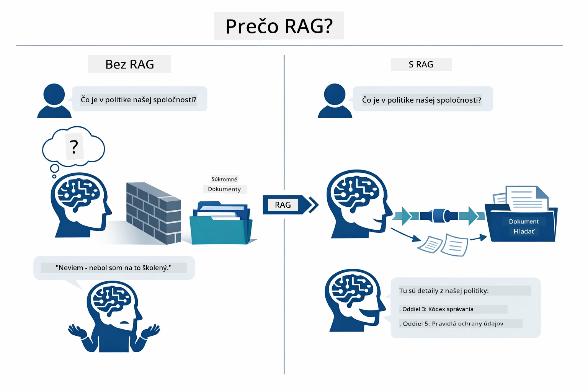

*Tento diagram ukazuje rozdiel medzi štandardným LLM (ktorý odhaduje podľa tréningových dát) a RAG-enhanced LLM (ktorý sa najskôr konzultuje s vašimi dokumentmi).*

Tu je, ako sú jednotlivé časti prepojené end-to-end. Otázka používateľa prechádza štyrmi fázami — embedding, vyhľadávanie vo vektore, zostavenie kontextu a generovanie odpovede — pričom každá nadväzuje na predchádzajúcu:


*Tento diagram ukazuje end-to-end pipeline RAG — otázka používateľa prechádza embeddingom, vyhľadávaním vo vektore, zostavením kontextu a generovaním odpovede.*

Zvyšok tohto modulu prechádza každou fázou podrobne, s kódom, ktorý môžete spustiť a upravovať.

### Ktorý prístup RAG tento tutoriál používa?

LangChain4j ponúka tri spôsoby implementácie RAG, každý s inou úrovňou abstrakcie. Nižšie uvedený diagram ich porovnáva vedľa seba:

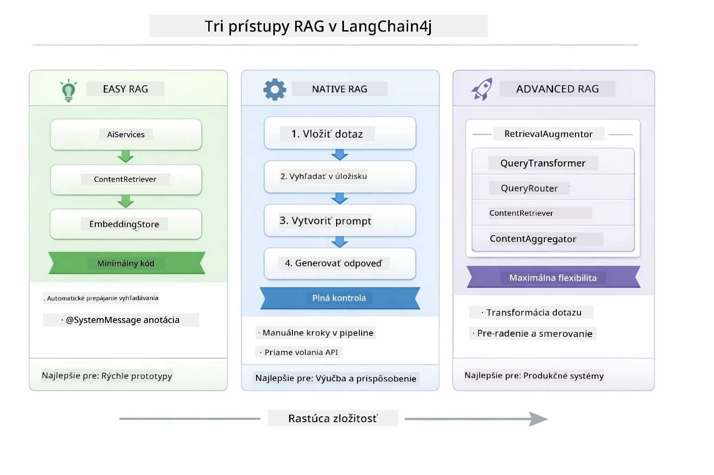

*Tento diagram porovnáva tri prístupy RAG v LangChain4j — Easy, Native a Advanced — zobrazujúci ich kľúčové komponenty a kedy ktorý použiť.*

| Prístup | Čo robí | Kompromis |
|---|---|---|
| **Easy RAG** | Všetko prepája automaticky cez `AiServices` a `ContentRetriever`. Oznámite rozhranie, pripojíte retriever a LangChain4j za vás spraví embedding, vyhľadávanie a zostavenie výzvy v pozadí. | Minimálny kód, no nevidíte, čo sa deje v každom kroku. |
| **Native RAG** | Sami voláte embedding model, vyhľadávate v úložisku, staviate výzvu a generujete odpoveď — jasný krok za krokom. | Viac kódu, ale každý stupeň je viditeľný a upraviteľný. |
| **Advanced RAG** | Používa framework `RetrievalAugmentor` s modulárnymi transformátormi dotazov, routermi, opätovným radením a injektormi obsahu pre produkčné pipeline. | Maximálna flexibilita, ale podstatne vyššia zložitosť. |

**Tento tutoriál používa Native prístup.** Každý krok v pipeline RAG — embedding otázky, vyhľadávanie v vektorovom úložisku, zostavenie kontextu a generovanie odpovede — je explicitne zapísaný v [`RagService.java`](../../../03-rag/src/main/java/com/example/langchain4j/rag/service/RagService.java). Toto je zámerné: ako výukový zdroj je dôležitejšie, aby ste videli a pochopili každý krok než minimalizovali kód. Akonáhle budete pohodlní s fungovaním jednotlivých častí, môžete prejsť na Easy RAG pre rýchle prototypy alebo Advanced RAG pre produkčné systémy.

> **💡 Už ste videli Easy RAG v akcii?** Modul [Rýchly štart](../00-quick-start/README.md) obsahuje príklad Document Q&A ([`SimpleReaderDemo.java`](../../../00-quick-start/src/main/java/com/example/langchain4j/quickstart/SimpleReaderDemo.java)) používajúci Easy RAG prístup — LangChain4j automaticky spracuje embedding, vyhľadávanie a zostavenie výzvy. Tento modul ide o krok ďalej a rozoberá túto pipeline tak, aby ste si mohli každý krok pozrieť a kontrolovať sami.

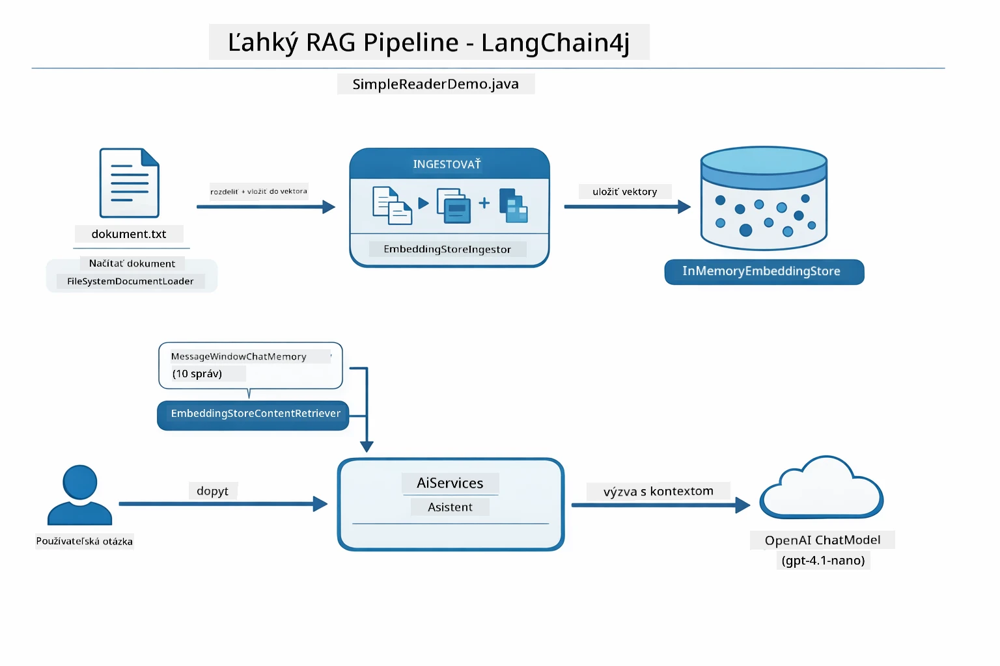

*Tento diagram ukazuje pipeline Easy RAG zo `SimpleReaderDemo.java`. Porovnajte ho s Native prístupom použitým v tomto module: Easy RAG skrýva embedding, vyhľadávanie a zostavenie výzvy za `AiServices` a `ContentRetriever` — načítate dokument, pripojíte retriever a dostanete odpovede. Native prístup v tomto module túto pipeline rozlúšti, takže voláte každý krok (embed, vyhľadávanie, zostavenie kontextu, generovanie) sami, čo vám dáva úplnú viditeľnosť a kontrolu.*

## Ako to funguje

Pipeline RAG v tomto module je rozdelená na štyri fázy, ktoré sa vykonávajú po sebe zakaždým, keď používateľ položí otázku. Najskôr sa nahratý dokument **parsuje a rozdeľuje na kúsky (chunky)**, aby boli zvládnuteľné. Tieto kúsky sa potom prevedú na **vektorové embeddingy** a uložia sa, aby sa dali matematicky porovnávať. Keď príde dotaz, systém vykoná **sémantické vyhľadávanie**, aby našiel najrelevantnejšie kúsky, a nakoniec im ako kontext poskytnutý LLM na **generovanie odpovede**. Nižšie sú uvedené podrobné popisy a kód každej fázy. Pozrime sa na prvý krok.

### Spracovanie dokumentov

[DocumentService.java](../../../03-rag/src/main/java/com/example/langchain4j/rag/service/DocumentService.java)

Keď nahráte dokument, systém ho parsuje (PDF alebo čistý text), priraďuje metadata ako názov súboru a potom ho rozdeľuje na kúsky — menšie časti, ktoré sa pohodlne zmestia do kontextového okna modelu. Tieto kúsky majú mierne prekrytie, aby sa neztratil kontext na hraniciach.

```java
// Analyzujte nahraný súbor a zabaľte ho do dokumentu LangChain4j
Document document = Document.from(content, metadata);

// Rozdeľte na časti po 300 tokenoch s prekrytím 30 tokenov
DocumentSplitter splitter = DocumentSplitters
    .recursive(300, 30);

List<TextSegment> segments = splitter.split(document);
```
  
Nižšie uvedený diagram znázorňuje, ako to vizuálne funguje. Všimnite si, ako každý kúsok zdieľa časť tokenov so susednými — prekrytie 30 tokenov zabezpečuje, že sa žiadny dôležitý kontext nestratí medzi hranicami:

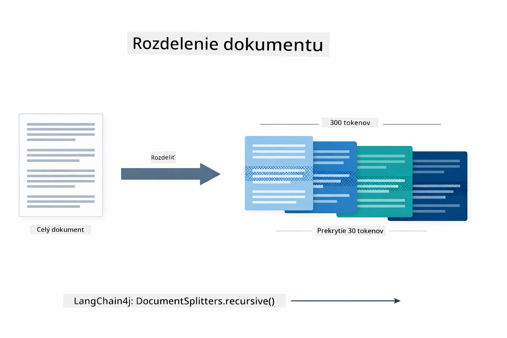

*Tento diagram znázorňuje rozdelenie dokumentu na 300 tokenové kúsky s 30 tokenovým prekrytím, čím sa zachováva kontext na hraniciach kúskov.*

> **🤖 Vyskúšajte s [GitHub Copilot](https://github.com/features/copilot) chatom:** Otvorte [`DocumentService.java`](../../../03-rag/src/main/java/com/example/langchain4j/rag/service/DocumentService.java) a opýtajte sa:  
> - "Ako LangChain4j rozdeľuje dokumenty na kúsky a prečo je prekrytie dôležité?"  
> - "Aká je optimálna veľkosť kúskov pre rôzne typy dokumentov a prečo?"  
> - "Ako zvládam dokumenty vo viacerých jazykoch alebo so špeciálnym formátovaním?"

### Vytváranie embeddingov

[LangChainRagConfig.java](../../../03-rag/src/main/java/com/example/langchain4j/rag/config/LangChainRagConfig.java)

Každý kúsok sa prevedie do číselného vyjadrenia nazývaného embedding — v podstate prevodník významu na čísla. Embedding model nie je „inteligentný“ ako chat model; nedokáže vykonať príkazy, rozumieť alebo odpovedať na otázky. Vie však mapovať text do matematického priestoru, kde sú podobné významy blízko seba — napríklad „auto“ blízko „automobil,“ „refund policy“ blízko „vráťte mi peniaze.“ Chat model si predstavte ako osobu, s ktorou môžete komunikovať; embedding model je veľmi dobre organizovaný súbor na archiváciu.

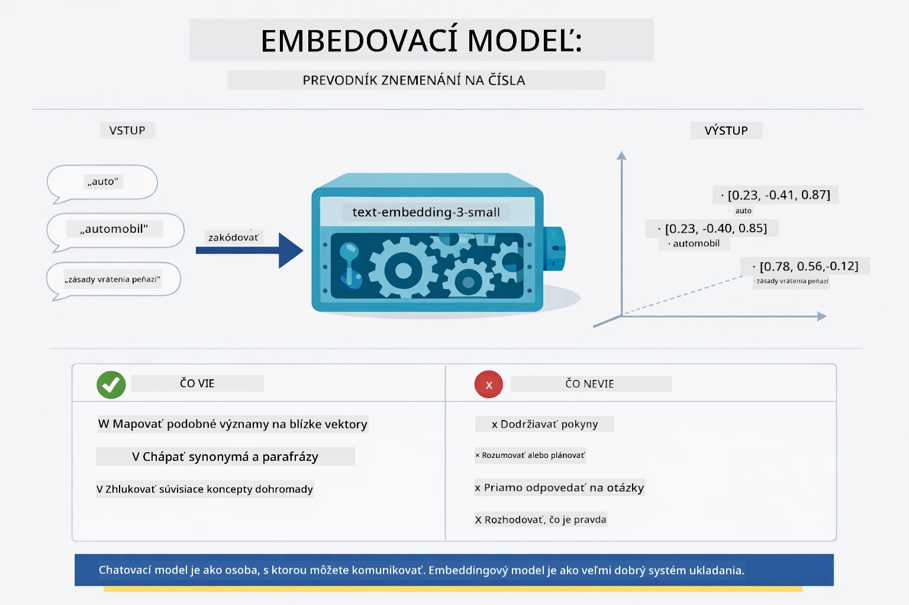

*Tento diagram zobrazuje, ako embedding model prevádza text na číselné vektory, pričom podobné významy — ako „auto“ a „automobil“ — sú blízko seba vo vektorovom priestore.*

```java
@Bean
public EmbeddingModel embeddingModel() {
    return OpenAiOfficialEmbeddingModel.builder()
        .baseUrl(azureOpenAiEndpoint)
        .apiKey(azureOpenAiKey)
        .modelName(azureEmbeddingDeploymentName)
        .build();
}

EmbeddingStore<TextSegment> embeddingStore = 
    new InMemoryEmbeddingStore<>();
```
  
Nižšie uvedený diagram tried znázorňuje dva samostatné toky v pipeline RAG a triedy LangChain4j, ktoré ich implementujú. **Ingestný tok** (beží raz pri nahrávaní) rozdeľuje dokument, vytvára embeddingy kúskov a ukladá ich cez `.addAll()`. **Dotazový tok** (beží pri každom položenom dotaze) embedduje otázku, vyhľadáva v úložisku cez `.search()` a posiela nájdený kontext modelu na rozhovor. Obe cesty sa spájajú na spoločnom rozhraní `EmbeddingStore<TextSegment>`:

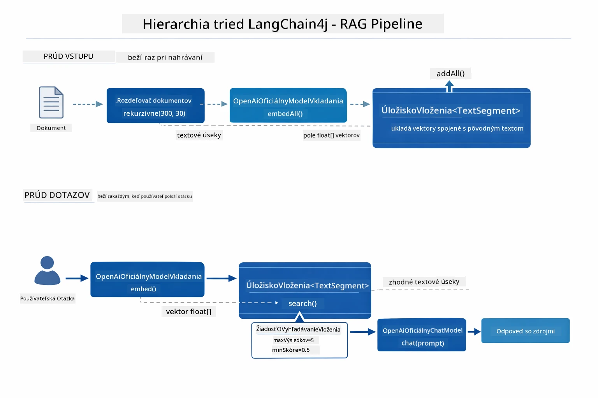

*Tento diagram ukazuje dva toky v pipeline RAG — ingestný a dotazový — a ich spojenie cez spoločné rozhranie EmbeddingStore.*

Keď sú embeddingy uložené, podobný obsah sa prirodzene združuje vo vektorovom priestore. Nižšie zobrazená vizualizácia ukazuje, ako sa dokumenty s príbuznou témou skončia blízko seba, čo umožňuje sémantické vyhľadávanie:


*Táto vizualizácia ukazuje, ako sa príbuzné dokumenty zoskupujú v 3D vektorovom priestore, pričom témy ako technická dokumentácia, obchodné pravidlá a FAQ tvoria samostatné skupiny.*

Keď používateľ vyhľadáva, systém sleduje štyri kroky: embedduje dokumenty raz, pri každom vyhľadávaní embedduje dotaz, porovnáva vektor dotazu so všetkými uloženými vektormi pomocou kosínovej podobnosti a vráti top-K najlepšie skórujúce kúsky. Nižšie uvedený diagram prechádza každý krok a príslušné triedy LangChain4j:

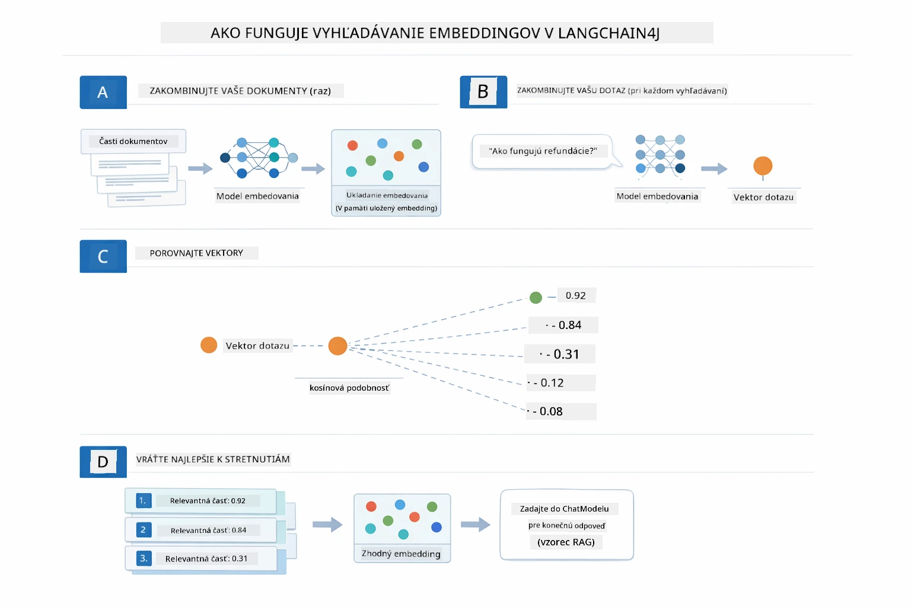

*Tento diagram ukazuje štyri kroky vyhľadávania embeddingov: embednuť dokumenty, embednuť dotaz, porovnať vektory pomocou kosínovej podobnosti a vrátiť top-K výsledky.*

### Sémantické vyhľadávanie

[RagService.java](../../../03-rag/src/main/java/com/example/langchain4j/rag/service/RagService.java)

Keď položíte otázku, aj vaša otázka sa prevedie na embedding. Systém porovná embedding vašej otázky so všetkými embeddingmi kúskov dokumentu. Nájde kúsky s najpodobnejším významom — nielen podľa kľúčových slov, ale podľa skutočnej sémantickej podobnosti.

```java
Embedding queryEmbedding = embeddingModel.embed(question).content();

EmbeddingSearchRequest searchRequest = EmbeddingSearchRequest.builder()
    .queryEmbedding(queryEmbedding)
    .maxResults(5)
    .minScore(0.5)
    .build();

EmbeddingSearchResult<TextSegment> searchResult = embeddingStore.search(searchRequest);
List<EmbeddingMatch<TextSegment>> matches = searchResult.matches();

for (EmbeddingMatch<TextSegment> match : matches) {
    String relevantText = match.embedded().text();
    double score = match.score();
}
```
  
Nižšie uvedený diagram kontrastuje sémantické vyhľadávanie s tradičným vyhľadávaním podľa kľúčových slov. Vyhľadávanie kľúčového slova „vozidlo“ by nenašlo kus týkajúci sa „áut a nákladných vozidiel“, ale sémantické vyhľadávanie rozumie, že to znamená to isté a vráti ho ako vysoko hodnotenú zhoda:

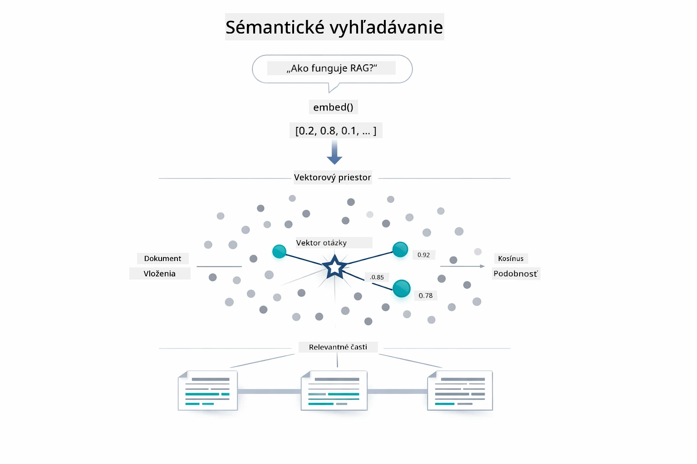

*Tento diagram porovnáva vyhľadávanie podľa kľúčových slov s sémantickým vyhľadávaním, ukazujúc, ako sémantické vyhľadávanie získava konceptuálne súvisiaci obsah aj keď sa presné kľúčové slová líšia.*

Pod kapotou sa podobnosť meria pomocou kosínovej podobnosti — v podstate otázka „ukazujú tieto dve šípky rovnakým smerom?“ Dva kúsky môžu používať úplne odlišné slová, ale ak znamenajú to isté, ich vektory ukazujú rovnakým smerom a skórujú blízko 1,0:

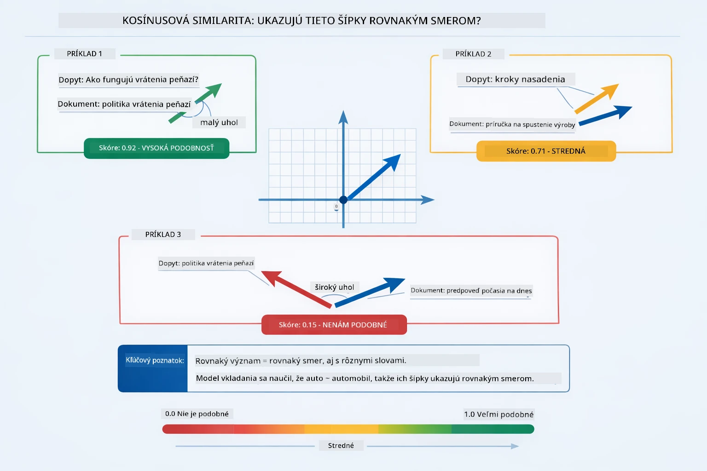
*Táto schéma zobrazuje kosínusovú podobnosť ako uhol medzi vektormi embeddingu — viac zosúladené vektory dosahujú skóre bližšie k 1,0, čo naznačuje vyššiu sémantickú podobnosť.*

> **🤖 Vyskúšajte s [GitHub Copilot](https://github.com/features/copilot) Chat:** Otvorte [`RagService.java`](../../../03-rag/src/main/java/com/example/langchain4j/rag/service/RagService.java) a spýtajte sa:
> - "Ako funguje vyhľadávanie podobnosti s embeddingmi a čo určuje skóre?"
> - "Aký prah podobnosti by som mal použiť a ako to ovplyvňuje výsledky?"
> - "Ako riešim prípady, keď sa nenájdu relevantné dokumenty?"

### Generovanie odpovede

[RagService.java](../../../03-rag/src/main/java/com/example/langchain4j/rag/service/RagService.java)

Najrelevantnejšie časti sú zostavené do štruktúrovaného promptu, ktorý obsahuje explicitné inštrukcie, získaný kontext a používateľovu otázku. Model číta tie konkrétne časti a odpovedá na základe týchto informácií — môže použiť len to, čo má pred sebou, čo zabraňuje halucináciám.

```java
String context = matches.stream()
    .map(match -> match.embedded().text())
    .collect(Collectors.joining("\n\n"));

String prompt = String.format("""
    Answer the question based on the following context.
    If the answer cannot be found in the context, say so.

    Context:
    %s

    Question: %s

    Answer:""", context, request.question());

String answer = chatModel.chat(prompt);
```

Schéma nižšie ukazuje túto zostavu v akcii — najlepšie skórujúce časti z vyhľadávania sú vložené do šablóny promptu a `OpenAiOfficialChatModel` generuje podloženú odpoveď:

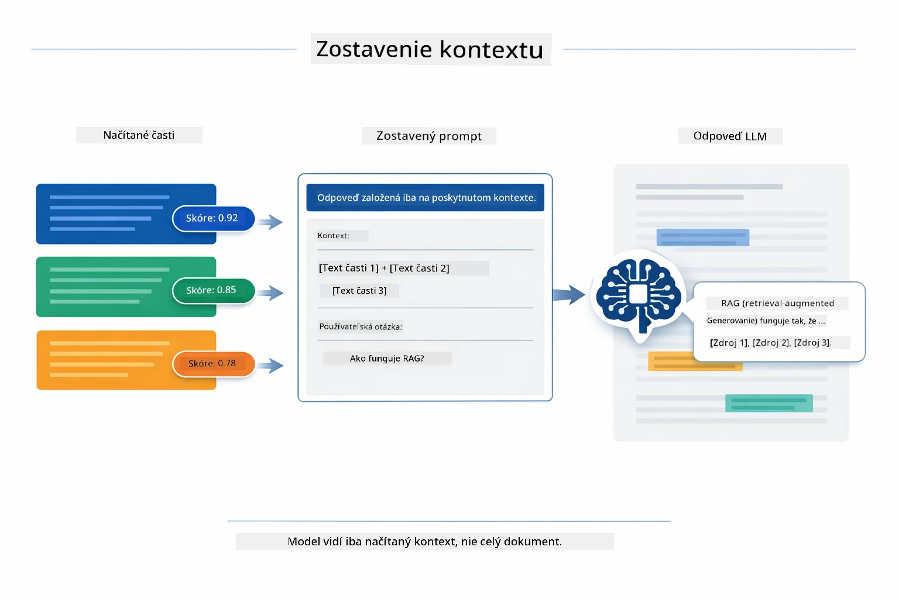

*Táto schéma ukazuje, ako sa najlepšie skórujúce časti zostavujú do štruktúrovaného promptu, čo umožňuje modelu generovať podloženú odpoveď z vašich dát.*

## Spustenie aplikácie

**Overenie nasadenia:**

Uistite sa, že súbor `.env` existuje v koreňovom adresári s prihlasovacími údajmi pre Azure (vytvorený počas modulu 01):

**Bash:**
```bash
cat ../.env  # Malo by zobraziť AZURE_OPENAI_ENDPOINT, API_KEY, DEPLOYMENT
```

**PowerShell:**
```powershell
Get-Content ..\.env  # Malo by zobraziť AZURE_OPENAI_ENDPOINT, API_KEY, DEPLOYMENT
```

**Spustenie aplikácie:**

> **Poznámka:** Ak ste už spustili všetky aplikácie pomocou `./start-all.sh` z modulu 01, tento modul už beží na porte 8081. Môžete preskočiť spúšťacie príkazy nižšie a ísť priamo na http://localhost:8081.

**Možnosť 1: Použitie Spring Boot Dashboard (odporúčané pre používateľov VS Code)**

Vývojárske kontajner obsahuje rozšírenie Spring Boot Dashboard, ktoré poskytuje vizuálne rozhranie na správu všetkých aplikácií Spring Boot. Nájdete ho v paneli aktivít na ľavej strane VS Code (hľadajte ikonu Spring Boot).

Zo Spring Boot Dashboard môžete:
- Vidieť všetky dostupné aplikácie Spring Boot v pracovnom priestore
- Spúšťať/zastavovať aplikácie jedným kliknutím
- Sledovať logy aplikácií v reálnom čase
- Monitorovať stav aplikácií

Jednoducho kliknite na tlačidlo pre spustenie vedľa "rag" na spustenie tohto modulu alebo spustite všetky moduly naraz.


*Táto snímka obrazovky zobrazuje Spring Boot Dashboard vo VS Code, kde môžete vizuálne spúšťať, zastavovať a monitorovať aplikácie.*

**Možnosť 2: Použitie shell skriptov**

Spustenie všetkých webových aplikácií (moduly 01-04):

**Bash:**
```bash
cd ..  # Z koreňového adresára
./start-all.sh
```

**PowerShell:**
```powershell
cd ..  # Z koreňového adresára
.\start-all.ps1
```

Alebo spustite len tento modul:

**Bash:**
```bash
cd 03-rag
./start.sh
```

**PowerShell:**
```powershell
cd 03-rag
.\start.ps1
```

Oba skripty automaticky načítajú premenné prostredia z koreňového súboru `.env` a postavia JAR, ak ešte neexistuje.

> **Poznámka:** Ak chcete pred spustením manuálne zostaviť všetky moduly:
>
> **Bash:**
> ```bash
> cd ..  # Go to root directory
> mvn clean package -DskipTests
> ```
>
> **PowerShell:**
> ```powershell
> cd ..  # Go to root directory
> mvn clean package -DskipTests
> ```

Otvorte v prehliadači http://localhost:8081.

**Na zastavenie:**

**Bash:**
```bash
./stop.sh  # Len tento modul
# Alebo
cd .. && ./stop-all.sh  # Všetky moduly
```

**PowerShell:**
```powershell
.\stop.ps1  # Len tento modul
# Alebo
cd ..; .\stop-all.ps1  # Všetky moduly
```

## Použitie aplikácie

Aplikácia poskytuje webové rozhranie na nahrávanie dokumentov a kladenie otázok.

<a href="images/rag-homepage.png"></a>

*Táto snímka obrazovky zobrazuje rozhranie aplikácie RAG, kde nahrávate dokumenty a kladiete otázky.*

### Nahranie dokumentu

Začnite nahraním dokumentu — pre testovanie najlepšie fungujú TXT súbory. V tomto adresári je k dispozícii súbor `sample-document.txt`, ktorý obsahuje informácie o funkciách LangChain4j, implementácii RAG a najlepších praktikách — ideálny na testovanie systému.

Systém váš dokument spracuje, rozdelí ho na časti a vytvorí embeddingy pre každú časť. Toto sa deje automaticky po nahraní.

### Kladenie otázok

Teraz kladiete konkrétne otázky ohľadom obsahu dokumentu. Vyskúšajte niečo faktografické, čo je jasne uvedené v dokumente. Systém vyhľadá relevantné časti, pridá ich do promptu a vygeneruje odpoveď.

### Kontrola zdrojových referenciach

Všímajte si, že každá odpoveď obsahuje zdrojové odkazy s podobnostnými skóre. Tieto skóre (od 0 do 1) ukazujú, ako relevantná bola každá časť pre vašu otázku. Vyššie skóre znamená lepšie zhodu. To vám umožňuje overiť odpoveď oproti zdrojovému materiálu.

<a href="images/rag-query-results.png"></a>

*Táto snímka obrazovky zobrazuje výsledky dotazu s vygenerovanou odpoveďou, zdrojovými odkazmi a skóre relevantnosti pre každú získanú časť.*

### Experimentovanie s otázkami

Vyskúšajte rôzne typy otázok:
- Konkrétne fakty: „Aká je hlavná téma?“
- Porovnania: „Aký je rozdiel medzi X a Y?“
- Zhrnutia: „Zhrňte kľúčové body o Z“

Sledujte, ako sa skóre relevantnosti mení podľa toho, ako dobre vaša otázka zodpovedá obsahu dokumentu.

## Kľúčové koncepty

### Stratégia delenia na časti

Dokumenty sa delia na časti po 300 tokenoch s prekrytím 30 tokenov. Tento pomer zabezpečuje, že každá časť má dostatok kontextu, aby bola zmysluplná, pričom zostáva dostatočne malá na to, aby sa do promptu zmestilo viac častí naraz.

### Skóre podobnosti

Každá získaná časť je doplnená o skóre podobnosti od 0 do 1, ktoré indikuje, ako veľmi sa zhoduje s otázkou používateľa. Nižšie uvedená schéma vizualizuje rozsahy skóre a ako ich systém používa na filtrovanie výsledkov:

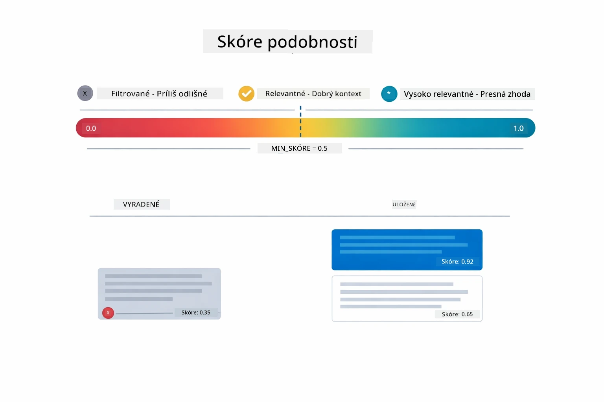

*Táto schéma zobrazuje rozsahy skóre od 0 do 1 s minimálnym prahom 0,5, ktorý filtruje nerelevantné časti.*

Skóre sa pohybujú od 0 do 1:
- 0,7–1,0: Vysoko relevantné, presná zhoda
- 0,5–0,7: Relevantné, dobrý kontext
- Pod 0,5: Filtrované, príliš rozdielne

Systém získava len časti nad minimálnym prahom na zabezpečenie kvality.

Embeddingy dobre fungujú, keď sa význam zoskupuje jasne, ale majú svoje slabiny. Schéma nižšie ukazuje bežné zlyhania — príliš veľké časti generujú nejasné vektory, príliš malé časti postrádajú kontext, nejednoznačné pojmy smerujú do viacerých zhlukov a presné vyhľadávanie (ID, čísla dielov) embeddingy vôbec nepodporuje:

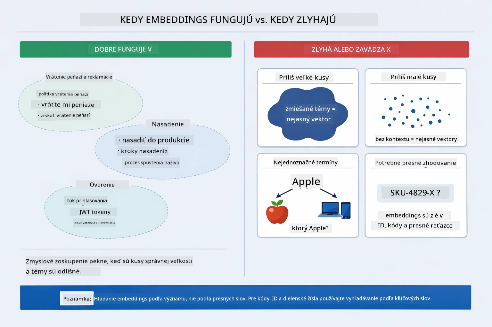

*Táto schéma zobrazuje bežné spôsoby zlyhania embeddingov: príliš veľké časti, príliš malé časti, nejednoznačné pojmy ukazujúce na viacero zhlukov a presné vyhľadávanie ako ID.*

### Ukladanie v pamäti

Tento modul používa ukladanie v pamäti pre jednoduchosť. Po reštarte aplikácie sa nahrané dokumenty stratia. Produkčné systémy používajú perzistentné vektorové databázy ako Qdrant alebo Azure AI Search.

### Správa kontextového okna

Každý model má maximálne kontextové okno. Nemôžete zahrnúť všetky časti z veľkého dokumentu. Systém načíta najrelevantnejších N častí (štandardne 5), aby zostal v limitoch a zároveň poskytol dostatok kontextu pre presné odpovede.

## Kedy sa oplatí RAG

RAG nie je vždy správny prístup. Nasledujúci rozhodovací návod vám pomôže určiť, kedy RAG prináša pridanú hodnotu oproti jednoduchším prístupom — ako zahrnutie obsahu priamo do promptu alebo spoliehanie sa na vstavané vedomosti modelu:

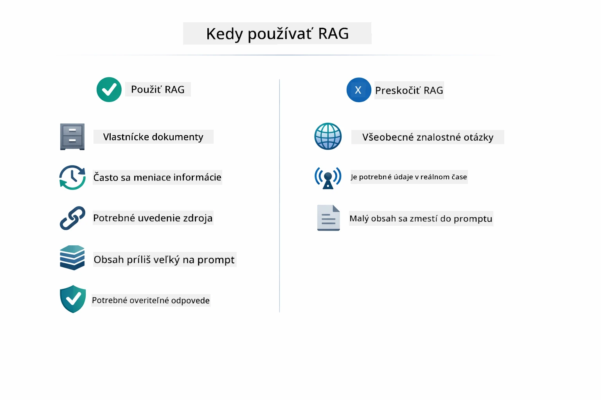

*Táto schéma zobrazuje rozhodovací návod, kedy RAG prináša pridanú hodnotu a kedy stačia jednoduchšie prístupy.*

**Používajte RAG, keď:**
- Odpovedáte na otázky ohľadom proprietárnych dokumentov
- Informácie sa často menia (politiky, ceny, špecifikácie)
- Presnosť vyžaduje uvedenie zdroja
- Obsah je príliš veľký na zahrnutie do jedného promptu
- Potrebujete overiteľné, podložené odpovede

**Nepoužívajte RAG, keď:**
- Otázky vyžadujú všeobecné znalosti, ktoré model už má
- Potrebujete dáta v reálnom čase (RAG pracuje s nahranými dokumentmi)
- Obsah je dostatočne malý na zahrnutie priamo do promptov

## Ďalšie kroky

**Ďalší modul:** [04-tools - AI Agents with Tools](../04-tools/README.md)

---

**Navigácia:** [← Predchádzajúci: Modul 02 - Prompt Engineering](../02-prompt-engineering/README.md) | [Späť na hlavné](../README.md) | [Ďalší: Modul 04 - Tools →](../04-tools/README.md)

---

<!-- CO-OP TRANSLATOR DISCLAIMER START -->
**Zrieknutie sa zodpovednosti**:
Tento dokument bol preložený pomocou AI prekladateľskej služby [Co-op Translator](https://github.com/Azure/co-op-translator). Hoci sa snažíme o presnosť, berte prosím na vedomie, že automatizované preklady môžu obsahovať chyby alebo nepresnosti. Pôvodný dokument v jeho rodnom jazyku by sa mal považovať za autoritatívny zdroj. Pre kritické informácie sa odporúča profesionálny ľudský preklad. Nie sme zodpovední za žiadne nedorozumenia alebo nesprávne interpretácie vyplývajúce z používania tohto prekladu.
<!-- CO-OP TRANSLATOR DISCLAIMER END -->