# Modul 04: AI agenti s nástrojmi

## Obsah

- [Čo sa naučíte](../../../04-tools)
- [Predpoklady](../../../04-tools)
- [Pochopenie AI agentov s nástrojmi](../../../04-tools)
- [Ako funguje volanie nástrojov](../../../04-tools)
  - [Definície nástrojov](../../../04-tools)
  - [Rozhodovanie](../../../04-tools)
  - [Vykonanie](../../../04-tools)
  - [Generovanie odpovede](../../../04-tools)
  - [Architektúra: Spring Boot automatické zapojenie](../../../04-tools)
- [Reťazenie nástrojov](../../../04-tools)
- [Spustenie aplikácie](../../../04-tools)
- [Používanie aplikácie](../../../04-tools)
  - [Vyskúšajte jednoduché použitie nástrojov](../../../04-tools)
  - [Testovanie reťazenia nástrojov](../../../04-tools)
  - [Zobrazenie toku konverzácie](../../../04-tools)
  - [Experimentovanie s rôznymi požiadavkami](../../../04-tools)
- [Kľúčové pojmy](../../../04-tools)
  - [ReAct vzor (Reasoning and Acting)](../../../04-tools)
  - [Opis nástrojov je dôležitý](../../../04-tools)
  - [Správa relácií](../../../04-tools)
  - [Spracovanie chýb](../../../04-tools)
- [Dostupné nástroje](../../../04-tools)
- [Kedy použiť agentov založených na nástrojoch](../../../04-tools)
- [Nástroje verzus RAG](../../../04-tools)
- [Ďalšie kroky](../../../04-tools)

## Čo sa naučíte

Doteraz ste sa naučili viesť rozhovory s AI, efektívne štruktúrovať výzvy a zakladať odpovede na vašich dokumentoch. Ale stále tu je základné obmedzenie: jazykové modely môžu generovať iba text. Nedokážu skontrolovať počasie, vykonávať výpočty, dopytovať databázy alebo komunikovať s externými systémami.

Nástroje to menia. Tým, že modelu poskytnete prístup k funkciám, ktoré môže volať, transformujete ho z generátora textu na agenta, ktorý dokáže konať. Model rozhoduje, kedy potrebuje nástroj, ktorý nástroj použiť a aké parametre odovzdať. Váš kód vykoná funkciu a vráti výsledok. Model zapracuje tento výsledok do svojej odpovede.

## Predpoklady

- Dokončený [Modul 01 - Úvod](../01-introduction/README.md) (nasadené Azure OpenAI zdroje)
- Odporúča sa dokončiť predchádzajúce moduly (tento modul odkazuje na [RAG koncepty z Modulu 03](../03-rag/README.md) v porovnaní Nástrojov vs RAG)
- Súbor `.env` v koreňovom adresári s prihlasovacími údajmi Azure (vytvorený pomocou `azd up` v Module 01)

> **Poznámka:** Ak ste Modul 01 nedokončili, najprv postupujte podľa pokynov na nasadenie tam.

## Pochopenie AI agentov s nástrojmi

> **📝 Poznámka:** Termín "agenti" v tomto module označuje AI asistentov rozšírených o schopnosti volania nástrojov. Toto sa líši od **Agentic AI** vzorov (autonómni agenti s plánovaním, pamäťou a viacstupňovým uvažovaním), ktoré pokryjeme v [Module 05: MCP](../05-mcp/README.md).

Bez nástrojov môže jazykový model iba generovať text z tréningových dát. Opýtajte sa ho na aktuálne počasie a musí hádať. Dajte mu nástroje a môže volať API počasia, robiť výpočty alebo dopytovať databázu — a potom tieto skutočné výsledky začleniť do svojej odpovede.

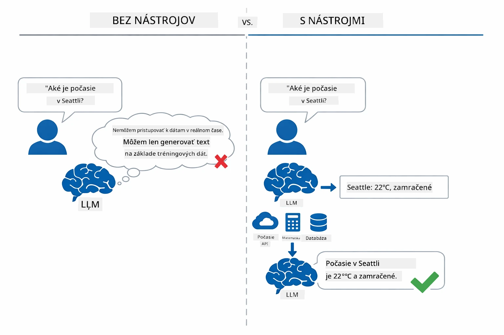

*Bez nástrojov model môže len hádať — s nástrojmi môže volať API, robiť výpočty a vracať dáta v reálnom čase.*

AI agent s nástrojmi nasleduje **Reasoning and Acting (ReAct)** vzor. Model nielen odpovedá — rozmýšľa o tom, čo potrebuje, koná volaním nástroja, pozoruje výsledok a potom sa rozhoduje, či konať znova alebo dodať finálnu odpoveď:

1. **Rozmýšľaj** — Agent analyzuje otázku používateľa a určí, aké informácie potrebuje
2. **Konaj** — Agent vyberie správny nástroj, vygeneruje správne parametre a zavolá ho
3. **Pozoruj** — Agent dostane výstup nástroja a vyhodnotí výsledok
4. **Opakuj alebo odpovedz** — Ak je potrebných viac dát, agent sa vracia späť; inak vytvorí prirodzenú odpoveď

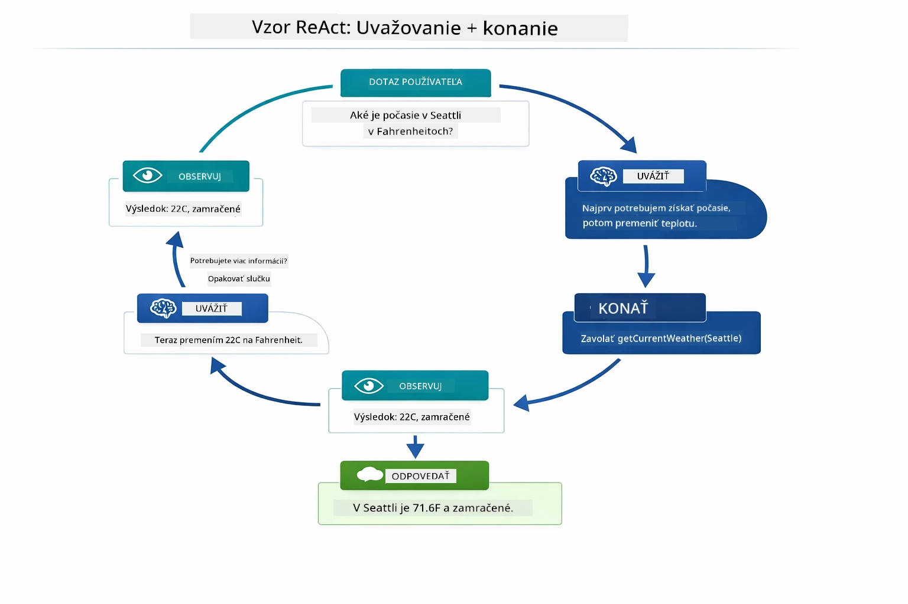

*Cyklus ReAct — agent uvažuje, čo má robiť, koná volaním nástroja, pozoruje výsledok a cykluje, kým nedodá finálnu odpoveď.*

Toto prebieha automaticky. Definujete nástroje a ich popisy. Model riadi rozhodovanie, kedy a ako ich používať.

## Ako funguje volanie nástrojov

### Definície nástrojov

[WeatherTool.java](../../../04-tools/src/main/java/com/example/langchain4j/agents/tools/WeatherTool.java) | [TemperatureTool.java](../../../04-tools/src/main/java/com/example/langchain4j/agents/tools/TemperatureTool.java)

Definujete funkcie s jasnými popismi a špecifikáciami parametrov. Model vidí tieto popisy vo svojom systémovom promptu a rozumie, čo každý nástroj robí.

```java
@Component
public class WeatherTool {
    
    @Tool("Get the current weather for a location")
    public String getCurrentWeather(@P("Location name") String location) {
        // Vaša logika vyhľadávania počasia
        return "Weather in " + location + ": 22°C, cloudy";
    }
}

@AiService
public interface Assistant {
    String chat(@MemoryId String sessionId, @UserMessage String message);
}

// Asistent je automaticky prepojený Spring Bootom s:
// - ChatModel bean
// - Všetky metódy @Tool z tried @Component
// - ChatMemoryProvider pre správu relácií
```

Nižšie uvedený diagram rozoberá každú anotáciu a ukazuje, ako každý prvok pomáha AI pochopiť, kedy nástroj volať a aké argumenty použiť:

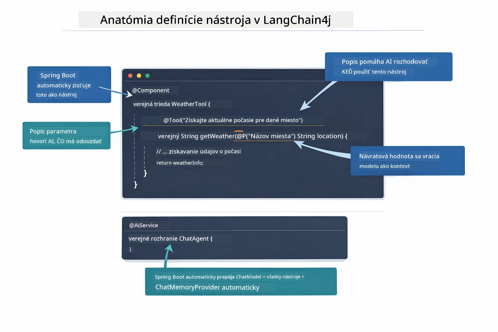

*Anatómia definície nástroja — @Tool hovorí AI, kedy ho použiť, @P opisuje každý parameter a @AiService všetko spojí pri spustení.*

> **🤖 Vyskúšajte s [GitHub Copilot](https://github.com/features/copilot) Chat:** Otvorte [`WeatherTool.java`](../../../04-tools/src/main/java/com/example/langchain4j/agents/tools/WeatherTool.java) a spýtajte sa:
> - "Ako by som integroval reálne API počasia ako OpenWeatherMap namiesto simulovaných dát?"
> - "Čo robí dobrý popis nástroja, ktorý pomáha AI správne ho používať?"
> - "Ako zvládam chyby API a limity volaní v implementáciách nástrojov?"

### Rozhodovanie

Keď sa používateľ opýta "Aké je počasie v Seattli?", model náhodne nevyberie nástroj. Porovná používateľský zámer so všetkými opismi nástrojov, ktoré má k dispozícii, ohodnotí ich relevantnosť a vyberie ten najlepší. Potom vygeneruje štruktúrované volanie funkcie so správnymi parametrami — v tomto prípade nastaví `location` na `"Seattle"`.

Ak žiaden nástroj nezodpovedá používateľovej požiadavke, model zvolí odpoveď zo svojich vlastných znalostí. Ak sa nájde viac nástrojov, vyberie ten najkonkrétnejší.

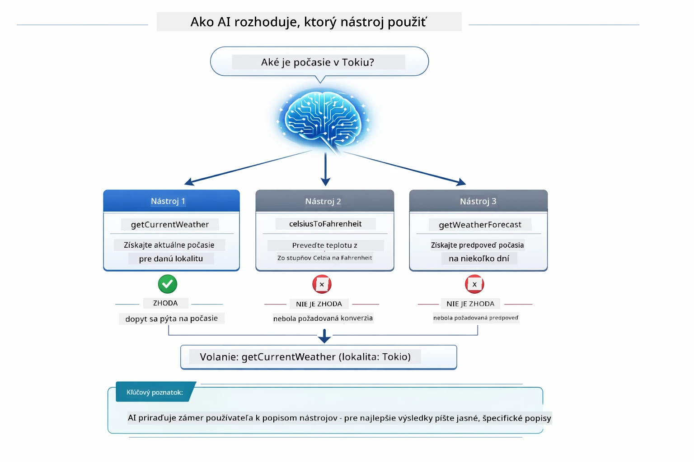

*Model vyhodnocuje každý dostupný nástroj voči používateľskému zámeru a vyberá najvhodnejší — preto je dôležité písať jasné a špecifické popisy nástrojov.*

### Vykonanie

[AgentService.java](../../../04-tools/src/main/java/com/example/langchain4j/agents/service/AgentService.java)

Spring Boot automaticky zapája deklaratívne rozhranie `@AiService` so všetkými registrovanými nástrojmi a LangChain4j vykonáva volania nástrojov automaticky. Za scénou prechádza kompletné volanie nástroja šiestimi fázami — od prirodzenej používateľskej otázky cez spätnú prirodzenú odpoveď:

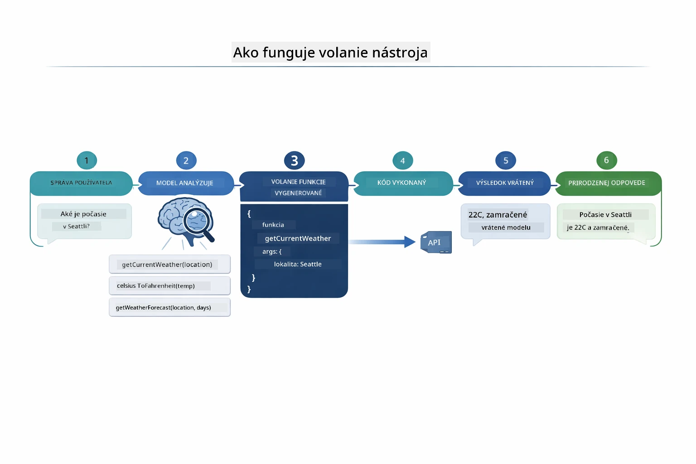

*End-to-end tok — používateľ položí otázku, model vyberie nástroj, LangChain4j ho vykoná a model zakomponuje výsledok do odpovede.*

Ak ste spustili [ToolIntegrationDemo](../../../00-quick-start/src/main/java/com/example/langchain4j/quickstart/ToolIntegrationDemo.java) v Module 00, už ste videli tento vzor v praxi — nástroje `Calculator` sa volali rovnako. Nasledujúci sekvenčný diagram presne ukazuje, čo sa dialo pod kapotou počas toho demo:

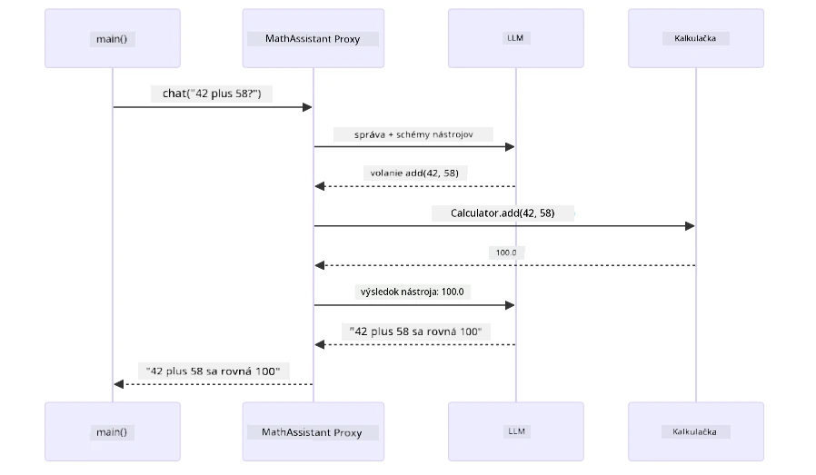

*Cyklus volania nástroja z Quick Start demo — `AiServices` posiela správu a schémy nástrojov LLM, LLM odpovedá volaním funkcie ako `add(42, 58)`, LangChain4j lokálne vykoná metódu `Calculator` a výsledok pošle späť pre finálnu odpoveď.*

> **🤖 Vyskúšajte s [GitHub Copilot](https://github.com/features/copilot) Chat:** Otvorte [`AgentService.java`](../../../04-tools/src/main/java/com/example/langchain4j/agents/service/AgentService.java) a spýtajte sa:
> - "Ako funguje ReAct vzor a prečo je efektívny pre AI agentov?"
> - "Ako agent rozhoduje, ktorý nástroj použiť a v akom poradí?"
> - "Čo sa stane, keď vykonanie nástroja zlyhá - ako robustne spracovať chyby?"

### Generovanie odpovede

Model dostane dáta o počasí a sformátuje ich do prirodzenej jazykovej odpovede pre používateľa.

### Architektúra: Spring Boot automatické zapojenie

Tento modul používa Spring Boot integráciu LangChain4j s deklaratívnymi rozhraniami `@AiService`. Pri spustení Spring Boot nájde každý `@Component`, ktorý obsahuje metódy `@Tool`, váš `ChatModel` bean a `ChatMemoryProvider` — a všetko ich prepojí do jediného rozhrania `Assistant` bez potreby boilerplatu.

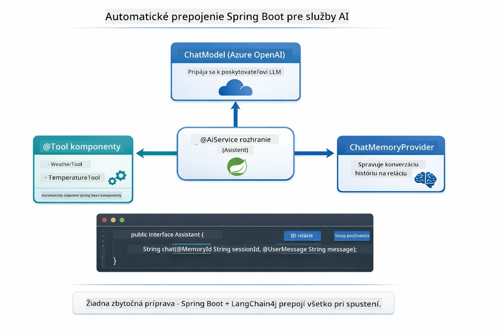

*Rozhranie @AiService spája ChatModel, komponenty nástrojov a poskytovateľa pamäte — Spring Boot všetko automaticky zapája.*

Tu je celý životný cyklus požiadavky ako sekvenčný diagram — od HTTP požiadavky cez kontrolér, službu až po automatický proxy Assistant a späť po vykonaní nástroja:

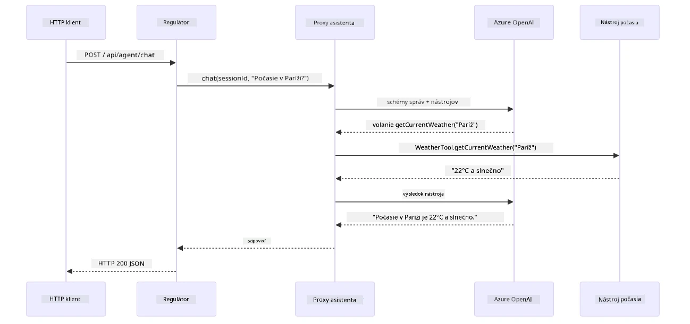

*Kompletný životný cyklus požiadavky Spring Boot — HTTP požiadavka prechádza cez kontrolér a službu k automaticky zapojenému proxy Assistant, ktorý automaticky orchestruje LLM a volania nástrojov.*

Kľúčové výhody tohto prístupu:

- **Spring Boot automatické zapojenie** — ChatModel a nástroje automaticky vložené
- **@MemoryId vzor** — Automatická správa pamäte na úrovni relácie
- **Jediná inštancia** — Assistant vytvorený raz a znovu použitý pre lepší výkon
- **Typovo bezpečné vykonávanie** — Java metódy volané priamo s konverziou typov
- **Viackroková orchestrácia** — Automaticky rieši reťazenie nástrojov
- **Žiadny boilerplate** — Žiadne manuálne volania `AiServices.builder()` alebo pamäťové HashMapy

Alternatívne prístupy (manuálne `AiServices.builder()`) vyžadujú viac kódu a postrádajú výhody Spring Boot integrácie.

## Reťazenie nástrojov

**Reťazenie nástrojov** — Skutočná sila agentov založených na nástrojoch sa prejaví, keď jediná otázka vyžaduje použitie viacerých nástrojov naraz. Opýtajte sa "Aké je počasie v Seattli vo Fahrenheitách?" a agent automaticky zreťazí dva nástroje: najprv zavolá `getCurrentWeather` pre teplotu v Celziách, potom túto hodnotu odovzdá do `celsiusToFahrenheit` na prevod — všetko v jednom kroku konverzácie.

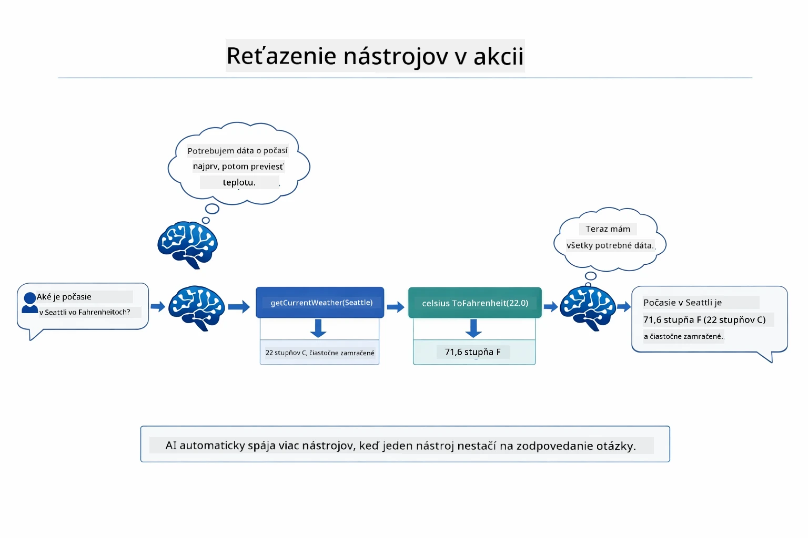

*Reťazenie nástrojov v praxi — agent najprv zavolá getCurrentWeather, potom výsledok v Celziách pošle do celsiusToFahrenheit a doručí zloženú odpoveď.*

**Ladené zlyhania** — Opýtajte sa na počasie v meste, ktoré nie je v simulovaných dátach. Nástroj vráti chybové hlásenie a AI vysvetlí, že nemôže pomôcť, namiesto zrútenia aplikácie. Nástroje bezpečne zlyhávajú. Nižšie uvedený diagram porovnáva oba prístupy — s riadnym spracovaním chýb agent zachytí výnimku a odpovie nápomocne, zatiaľ čo bez nej sa celá aplikácia zrúti:

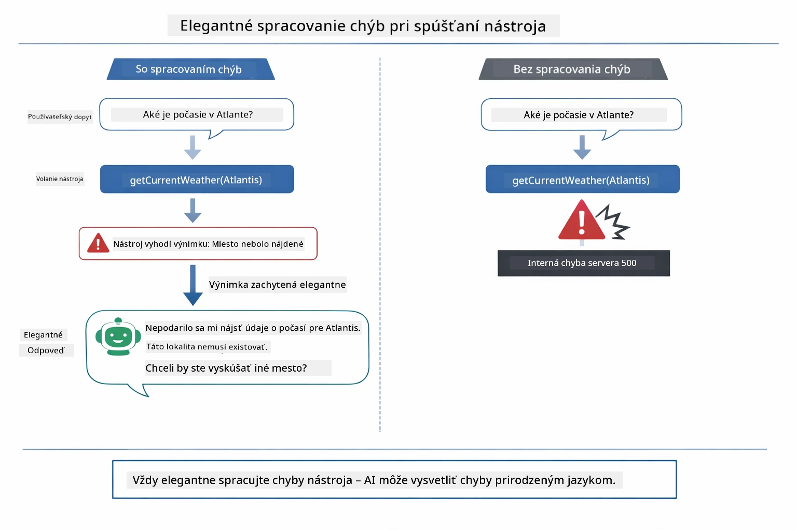

*Keď nástroj zlyhá, agent zachytí chybu a odpovie s nápomocným vysvetlením namiesto pádu.*

Toto prebieha v jednom kroku konverzácie. Agent autonómne orchestruje viac volaní nástrojov.

## Spustenie aplikácie

**Overenie nasadenia:**

Uistite sa, že `.env` súbor existuje v koreňovom adresári s prihlasovacími údajmi Azure (vytvorený počas Modulu 01). Spustite to z adresára modulu (`04-tools/`):

**Bash:**
```bash
cat ../.env  # Malo by zobraziť AZURE_OPENAI_ENDPOINT, API_KEY, DEPLOYMENT
```

**PowerShell:**
```powershell
Get-Content ..\.env  # Malo by zobraziť AZURE_OPENAI_ENDPOINT, API_KEY, DEPLOYMENT
```

**Spustite aplikáciu:**

> **Poznámka:** Ak ste už spustili všetky aplikácie pomocou `./start-all.sh` z koreňového adresára (ako je popísané v Module 01), tento modul už beží na porte 8084. Môžete preskočiť spúšťacie príkazy nižšie a ísť priamo na http://localhost:8084.

**Možnosť 1: Použitie Spring Boot Dashboard (odporúčané pre používateľov VS Code)**

Vývojársky kontajner obsahuje rozšírenie Spring Boot Dashboard, ktoré poskytuje vizuálne rozhranie na správu všetkých Spring Boot aplikácií. Nájdete ho v Activity Bar na ľavej strane VS Code (ikonka Spring Boot).

Zo Spring Boot Dashboard môžete:
- Vidieť všetky dostupné Spring Boot aplikácie v pracovnom priestore
- Jedným klikom aplikácie spúšťať/zastavovať
- Zobrazovať logy aplikácie v reálnom čase
- Monitorovať stav aplikácie

Stačí kliknúť na tlačidlo pre spustenie vedľa "tools" a spustiť tento modul alebo spustiť všetky moduly naraz.

Takto vyzerá Spring Boot Dashboard vo VS Code:


*Spring Boot Dashboard vo VS Code — spúšťajte, zastavujte a monitorujte všetky moduly z jedného miesta*

**Možnosť 2: Použitie shell skriptov**

Spustite všetky webové aplikácie (moduly 01-04):

**Bash:**
```bash
cd ..  # Z koreňového adresára
./start-all.sh
```

**PowerShell:**
```powershell
cd ..  # Z koreňového adresára
.\start-all.ps1
```

Alebo spustite len tento modul:

**Bash:**
```bash
cd 04-tools
./start.sh
```

**PowerShell:**
```powershell
cd 04-tools
.\start.ps1
```

Oba skripty automaticky načítajú premenné prostredia zo súboru `.env` v koreňovom adresári a zostavia JAR súbory, ak ešte neexistujú.

> **Poznámka:** Ak chcete pred spustením manuálne zostaviť všetky moduly:
>
> **Bash:**
> ```bash
> cd ..  # Go to root directory
> mvn clean package -DskipTests
> ```
>
> **PowerShell:**
> ```powershell
> cd ..  # Go to root directory
> mvn clean package -DskipTests
> ```

Otvorte v prehliadači http://localhost:8084.

**Na zastavenie:**

**Bash:**
```bash
./stop.sh  # Len tento modul
# Alebo
cd .. && ./stop-all.sh  # Všetky moduly
```

**PowerShell:**
```powershell
.\stop.ps1  # Tento modul iba
# Alebo
cd ..; .\stop-all.ps1  # Všetky moduly
```

## Použitie aplikácie

Aplikácia poskytuje webové rozhranie, kde môžete komunikovať s AI agentom, ktorý má prístup k nástrojom na počasie a prevod teplôt. Takto vyzerá rozhranie — obsahuje rýchle ukážky a chatovací panel na odosielanie požiadaviek:

<a href="images/tools-homepage.png"></a>

*Rozhranie nástrojov AI agenta - rýchle príklady a chat na interakciu s nástrojmi*

### Vyskúšajte jednoduché použitie nástroja

Začnite jednoduchou požiadavkou: "Preveď 100 stupňov Fahrenheita na Celsius". Agent vie, že potrebuje nástroj na prevod teploty, zavolá ho s vhodnými parametrami a vráti výsledok. Všimnite si, ako to pôsobí prirodzene – nemuseli ste špecifikovať, ktorý nástroj použiť ani ako ho zavolať.

### Otestujte reťazenie nástrojov

Teraz vyskúšajte niečo zložitejšie: "Aké je počasie v Seattli a preveď to na Fahrenheit?" Sledujte, ako agent postupne rieši úlohu. Najprv získa počasie (ktoré je v Celziových stupňoch), uvedomí si, že potrebuje previesť na Fahrenheit, zavolá nástroj na prevod a skombinuje oba výsledky do jedinej odpovede.

### Pozrite si priebeh rozhovoru

Chatové rozhranie uchováva históriu rozhovoru, takže môžete viesť viacstupňové interakcie. Vidíte všetky predchádzajúce otázky a odpovede, vďaka čomu je jednoduché sledovať kontext a pochopiť, ako agent buduje kontext v priebehu viacerých výmen.

<a href="images/tools-conversation-demo.png"></a>

*Viacstupňový rozhovor ukazujúci jednoduché prevody, vyhľadávanie počasia a reťazenie nástrojov*

### Experimentujte s rôznymi požiadavkami

Vyskúšajte rôzne kombinácie:
- Vyhľadávanie počasia: "Aké je počasie v Tokiu?"
- Prevod teplôt: "Koľko je 25 °C v Kelvinoch?"
- Kombinované otázky: "Skontroluj počasie v Paríži a povedz mi, či je nad 20 °C"

Všimnite si, ako agent interpretuje prirodzený jazyk a mapuje ho na príslušné volania nástrojov.

## Kľúčové koncepty

### ReAct vzor (uvažovanie a konanie)

Agent strieda uvažovanie (rozhodovanie, čo robiť) a konanie (používanie nástrojov). Tento vzor umožňuje autonómne riešenie problémov namiesto iba reagovania na inštrukcie.

### Popisy nástrojov sú dôležité

Kvalita popisov vašich nástrojov priamo ovplyvňuje, ako dobre ich agent používa. Jasné a špecifické popisy pomáhajú modelu pochopiť, kedy a ako každý nástroj volať.

### Správa relácií

Anotácia `@MemoryId` umožňuje automatickú správu pamäti na základe relácií. Každej relácii je priradená vlastná inštancia `ChatMemory` spravovaná beanom `ChatMemoryProvider`, takže viacerí používatelia môžu súčasne komunikovať s agentom bez miešania konverzácií. Nasledujúci diagram ukazuje, ako sú viacerí používatelia smerovaní do izolovaných pamäťových úložísk podľa ich ID relácie:

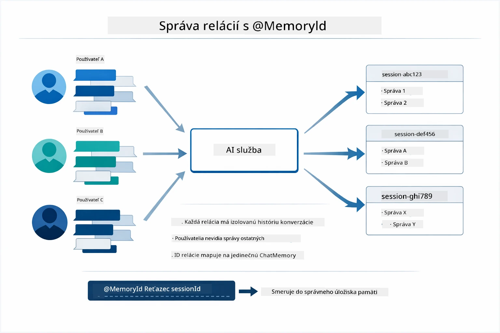

*Každé ID relácie je priradené k izolovanej histórii konverzácií — používatelia nikdy nevidia správy druhých.*

### Riešenie chýb

Nástroje môžu zlyhať — API môže vypršať, parametre môžu byť neplatné, externé služby môžu prestať fungovať. Produkčné agenti potrebujú spracovanie chýb, aby model mohol vysvetliť problémy alebo skúsiť alternatívy namiesto pádu celej aplikácie. Keď nástroj vyhodí výnimku, LangChain4j ju zachytí a vráti chybovú správu modelu, ktorý potom môže problém vysvetliť prirodzeným jazykom.

## Dostupné nástroje

Nasledujúci diagram ukazuje široký ekosystém nástrojov, ktoré môžete vytvoriť. Tento modul demonštruje nástroje pre počasie a teplotu, ale rovnaký vzor `@Tool` funguje pre akúkoľvek Java metódu — od dopytov do databáz až po spracovanie platieb.

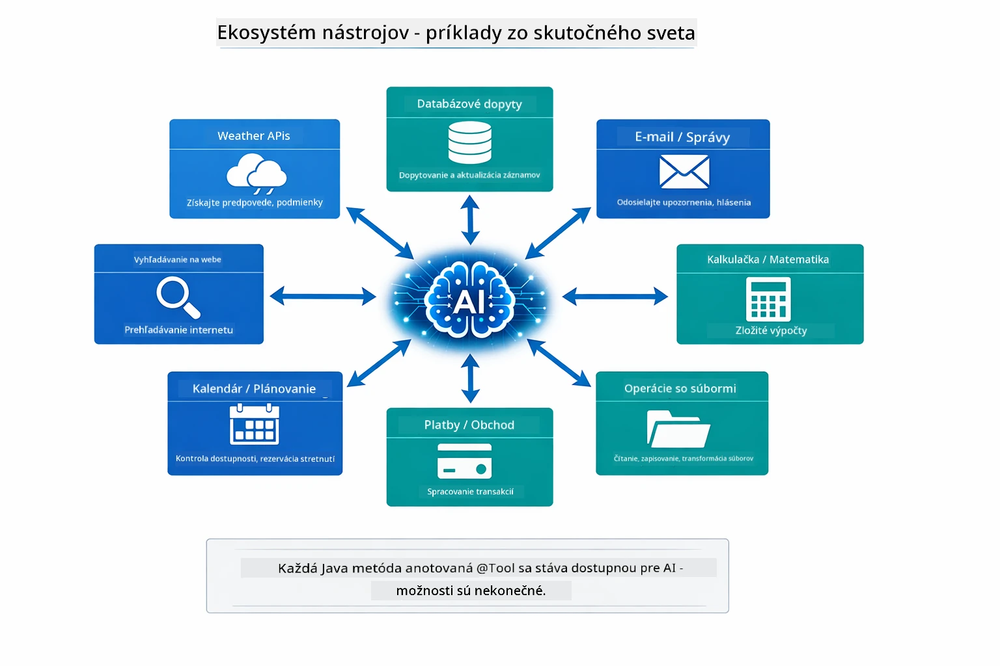

*Akákoľvek Java metóda anotovaná @Tool je dostupná pre AI — vzor sa rozširuje na databázy, API, email, prácu so súbormi a ďalšie.*

## Kedy používať agentov založených na nástrojoch

Nie každá požiadavka potrebuje nástroje. Rozhodnutie záleží od toho, či AI potrebuje komunikovať s externými systémami alebo dokáže odpovedať zo svojich znalostí. Nasledujúci sprievodca zhrňuje, kedy nástroje pridávajú hodnotu a kedy sú zbytočné:

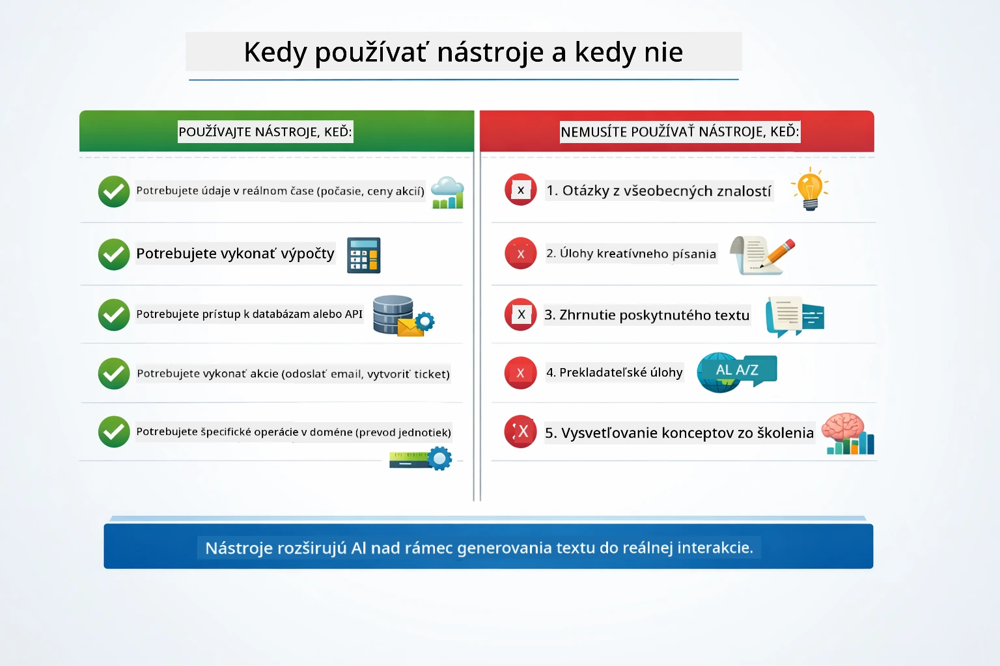

*Rýchly rozhodovací sprievodca — nástroje sú pre dáta v reálnom čase, výpočty a akcie; všeobecné znalosti a tvorivé úlohy ich nevyžadujú.*

## Nástroje vs RAG

Moduly 03 a 04 oba rozširujú možnosti AI, ale zásadne odlišnými spôsobmi. RAG poskytuje modelu prístup k **znalostiam** vyhľadávaním dokumentov. Nástroje dávajú modelu schopnosť vykonávať **akcie** volaním funkcií. Nasledujúci diagram porovnáva tieto dva prístupy vedľa seba — od spôsobu, ako každé workflow funguje, až po kompromisy medzi nimi:

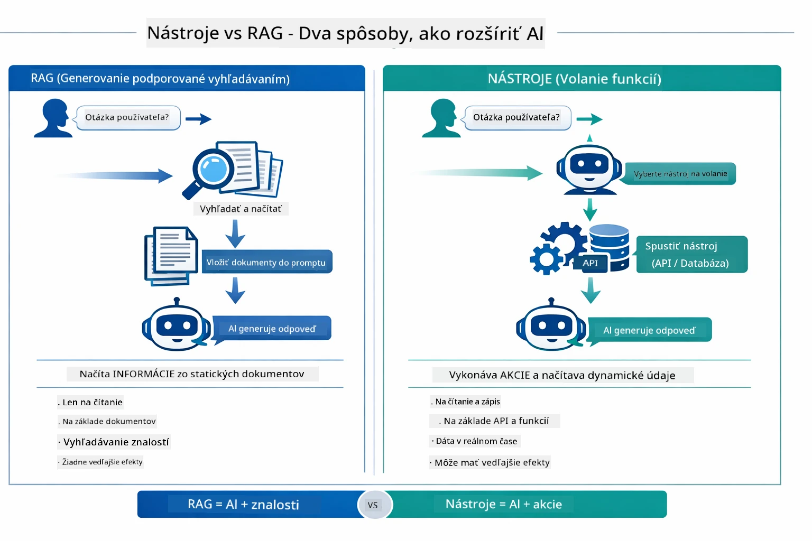

*RAG získava informácie zo statických dokumentov — Nástroje vykonávajú akcie a získavajú dynamické dáta v reálnom čase. Mnohé produkčné systémy kombinujú oba prístupy.*

V praxi mnohé produkčné systémy kombinujú oba prístupy: RAG na zakotvenie odpovedí vo vašej dokumentácii a Nástroje na získavanie živých dát alebo vykonávanie operácií.

## Ďalšie kroky

**Ďalší modul:** [05-mcp - Model Context Protocol (MCP)](../05-mcp/README.md)

---

**Navigácia:** [← Predchádzajúci: Modul 03 - RAG](../03-rag/README.md) | [Späť na hlavnú stránku](../README.md) | [Ďalší: Modul 05 - MCP →](../05-mcp/README.md)

---

<!-- CO-OP TRANSLATOR DISCLAIMER START -->
**Upozornenie**:  
Tento dokument bol preložený pomocou AI prekladateľskej služby [Co-op Translator](https://github.com/Azure/co-op-translator). Hoci sa snažíme o presnosť, majte prosím na pamäti, že automatické preklady môžu obsahovať chyby alebo nepresnosti. Originálny dokument v jeho pôvodnom jazyku by mal byť považovaný za autoritatívny zdroj. Pre dôležité informácie sa odporúča profesionálny ľudský preklad. Nie sme zodpovední za žiadne nedorozumenia alebo nesprávne výklady vyplývajúce z použitia tohto prekladu.
<!-- CO-OP TRANSLATOR DISCLAIMER END -->