# Modul 05: Protokol kontextu modelu (MCP)

## Obsah

- [Video prechádzka](../../../05-mcp)
- [Čo sa naučíte](../../../05-mcp)
- [Čo je MCP?](../../../05-mcp)
- [Ako MCP funguje](../../../05-mcp)
- [Agentický modul](../../../05-mcp)
- [Spustenie príkladov](../../../05-mcp)
  - [Požiadavky](../../../05-mcp)
- [Rýchly štart](../../../05-mcp)
  - [Operácie so súbormi (Stdio)](../../../05-mcp)
  - [Supervízny agent](../../../05-mcp)
    - [Spustenie demo](../../../05-mcp)
    - [Ako funguje supervízor](../../../05-mcp)
    - [Ako FileAgent zistí MCP nástroje za behu](../../../05-mcp)
    - [Stratégie odpovedí](../../../05-mcp)
    - [Porozumenie výstupu](../../../05-mcp)
    - [Vysvetlenie funkcií agentického modulu](../../../05-mcp)
- [Kľúčové koncepty](../../../05-mcp)
- [Gratulujeme!](../../../05-mcp)
  - [Čo ďalej?](../../../05-mcp)

## Video prechádzka

Pozrite si túto živú reláciu, ktorá vysvetľuje, ako začať s týmto modulom:

<a href="https://www.youtube.com/watch?v=O_J30kZc0rw"></a>

## Čo sa naučíte

Vybudovali ste konverzačné AI, zvládli ste prompty, zakorenili odpovede v dokumentoch a vytvorili ste agentov s nástrojmi. Ale všetky tie nástroje boli špeciálne vytvorené pre vašu konkrétnu aplikáciu. Čo ak by ste mohli svojej AI dať prístup k štandardizovanému ekosystému nástrojov, ktoré môže ktokoľvek vytvoriť a zdieľať? V tomto module sa naučíte, ako to spraviť pomocou protokolu Model Context Protocol (MCP) a agentického modulu LangChain4j. Najprv predstavíme jednoduchý MCP čítač súborov a potom ukážeme, ako sa ľahko integruje do pokročilých agentických pracovných tokov pomocou vzoru Supervisor Agent.

## Čo je MCP?

Protokol Model Context Protocol (MCP) presne toto poskytuje - štandardný spôsob, ako AI aplikácie môžu objavovať a používať externé nástroje. Namiesto písania vlastných integrácií pre každý zdroj dát alebo službu sa pripojíte k MCP serverom, ktoré vystavujú svoje schopnosti v konzistentnom formáte. Váš AI agent potom môže tieto nástroje automaticky zistiť a použiť.

Nižšie uvedený diagram ukazuje rozdiel — bez MCP si každá integrácia vyžaduje vlastné bodové zapojenie; s MCP jediný protokol pripája vašu aplikáciu ku ktorémukoľvek nástroju:


*Pred MCP: komplexné bodové integrácie. Po MCP: jeden protokol, nekonečné možnosti.*

MCP rieši zásadný problém vo vývoji AI: každá integrácia je na mieru. Chcete pristupovať k GitHub? Vlastný kód. Chcete čítať súbory? Vlastný kód. Chcete dopytovať databázu? Vlastný kód. A žiadna z týchto integrácií nefunguje s inými AI aplikáciami.

MCP to štandardizuje. MCP server vystavuje nástroje s jasnými popismi a schémami parametrov. Každý MCP klient sa môže pripojiť, zistiť dostupné nástroje a použiť ich. Vyrobíte raz, používate všade.

Nižšie uvedený diagram ilustruje túto architektúru — jediný MCP klient (vaša AI aplikácia) sa pripája k viacerým MCP serverom, z ktorých každý vystavuje vlastnú sadu nástrojov cez štandardný protokol:


*Architektúra Model Context Protocol - štandardizované zisťovanie a vykonávanie nástrojov*

## Ako MCP funguje

Pod kapotou MCP používa vrstvenú architektúru. Vaša Java aplikácia (MCP klient) zisťuje dostupné nástroje, posiela JSON-RPC požiadavky cez prenosovú vrstvu (Stdio alebo HTTP) a MCP server vykonáva operácie a vracia výsledky. Nasledujúci diagram rozkladá každú vrstvu tohto protokolu:

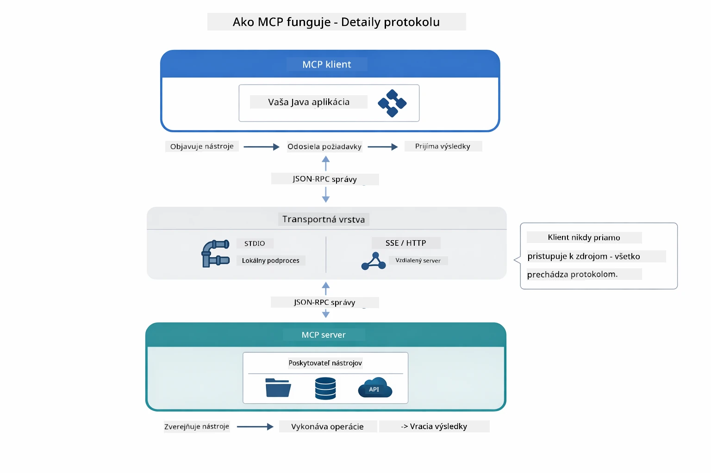

*Ako MCP funguje pod kapotou — klienti zisťujú nástroje, vymieňajú si JSON-RPC správy a vykonávajú operácie cez prenosovú vrstvu.*

**Architektúra Server-Klient**

MCP používa model klient-server. Servery poskytujú nástroje - čítanie súborov, dopytovanie databáz, volanie API. Klienti (vaša AI aplikácia) sa pripájajú k serverom a používajú ich nástroje.

Ak chcete používať MCP s LangChain4j, pridajte túto závislosť Maven:

```xml
<dependency>
    <groupId>dev.langchain4j</groupId>
    <artifactId>langchain4j-mcp</artifactId>
    <version>${langchain4j.version}</version>
</dependency>
```

**Zisťovanie nástrojov**

Keď sa váš klient pripojí k MCP serveru, pýta sa "Aké nástroje máte?" Server odpovie zoznamom dostupných nástrojov, každý s popismi a schémami parametrov. Váš AI agent potom môže rozhodnúť, ktoré nástroje použiť na základe používateľských požiadaviek. Nižšie uvedený diagram ukazuje tento dohovor — klient pošle požiadavku `tools/list` a server vráti svoje dostupné nástroje s popismi a schémami parametrov:

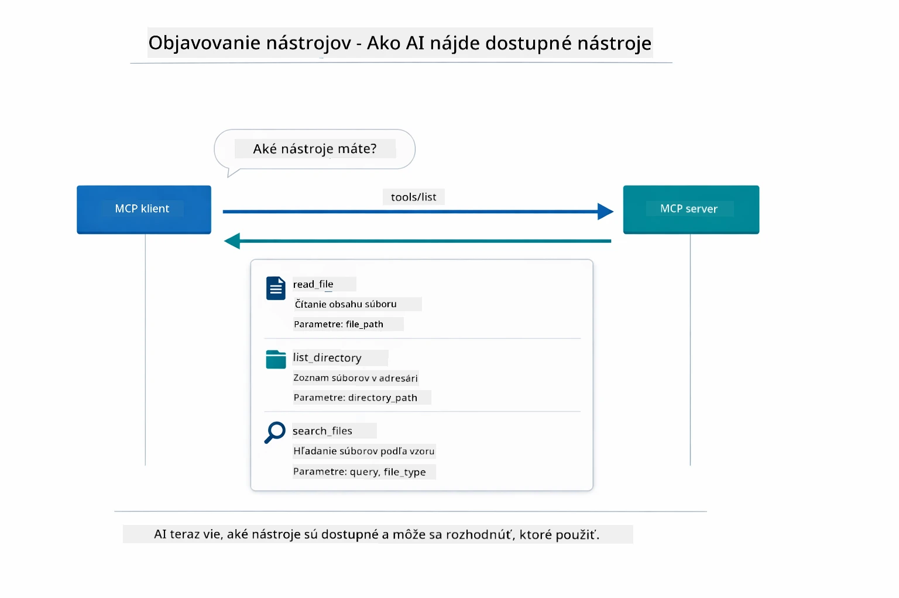

*AI zisťuje dostupné nástroje pri štarte — teraz vie, aké schopnosti sú k dispozícii a môže rozhodnúť, ktoré použiť.*

**Prenosové mechanizmy**

MCP podporuje rôzne prenosové mechanizmy. Dve možnosti sú Stdio (pre lokálnu komunikáciu medzi procesmi) a Streamable HTTP (pre vzdialené servery). Tento modul demonštruje prenos Stdio:


*Prenosové mechanizmy MCP: HTTP pre vzdialené servery, Stdio pre lokálne procesy*

**Stdio** - [StdioTransportDemo.java](../../../05-mcp/src/main/java/com/example/langchain4j/mcp/StdioTransportDemo.java)

Pre lokálne procesy. Vaša aplikácia spustí server ako podproces a komunikuje cez štandardný vstup/výstup. Užitočné pre prístup k súborovému systému alebo príkazovým nástrojom.

```java
McpTransport stdioTransport = new StdioMcpTransport.Builder()
    .command(List.of(
        npmCmd, "exec",
        "@modelcontextprotocol/server-filesystem@2025.12.18",
        resourcesDir
    ))
    .logEvents(false)
    .build();
```

Server `@modelcontextprotocol/server-filesystem` poskytuje tieto nástroje, všetky sandboxované do adresárov, ktoré určíte:

| Nástroj | Popis |
|---------|--------|
| `read_file` | Čita obsah jedného súboru |
| `read_multiple_files` | Čita viacero súborov naraz |
| `write_file` | Vytvorí alebo prepíše súbor |
| `edit_file` | Vykoná cielené nájdi-a-nahraď úpravy |
| `list_directory` | Vypíše súbory a adresáre na ceste |
| `search_files` | Rekurzívne vyhľadáva súbory podľa vzoru |
| `get_file_info` | Získa metadáta súboru (veľkosť, čas, povolenia) |
| `create_directory` | Vytvorí adresár (vrátane nadradených) |
| `move_file` | Presunie alebo premenuje súbor alebo adresár |

Nasledujúci diagram ukazuje, ako prenos Stdio funguje za behu — vaša Java aplikácia spustí MCP server ako podriadený proces a komunikujú cez stdin/stdout potrubia, bez siete alebo HTTP:

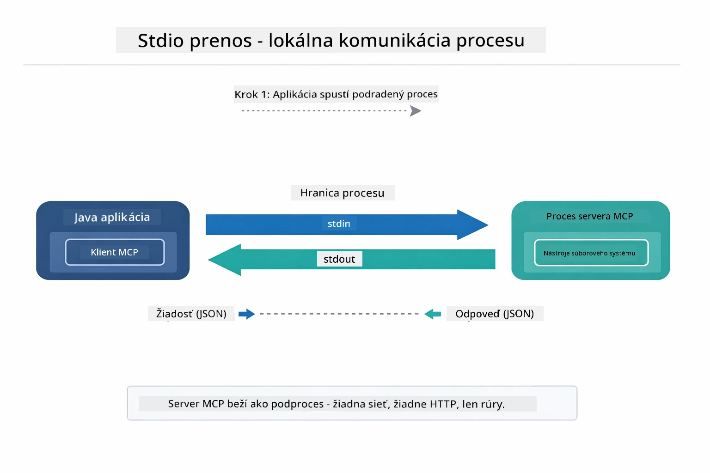

*Prenos Stdio v akcii — vaša aplikácia spustí MCP server ako podriadený proces a komunikuje cez stdin/stdout potrubia.*

> **🤖 Vyskúšajte s [GitHub Copilot](https://github.com/features/copilot) Chat:** Otvorte [`StdioTransportDemo.java`](../../../05-mcp/src/main/java/com/example/langchain4j/mcp/StdioTransportDemo.java) a spýtajte sa:
> - "Ako funguje prenos Stdio a kedy ho mám používať namiesto HTTP?"
> - "Ako LangChain4j riadi životný cyklus spustených MCP serverových procesov?"
> - "Aké sú bezpečnostné dôsledky poskytnutia AI prístupu k súborovému systému?"

## Agentický modul

Zatiaľ čo MCP poskytuje štandardizované nástroje, agentický modul LangChain4j poskytuje deklaratívny spôsob, ako vytvárať agentov, ktorí tieto nástroje zosynchronizujú. Anotácia `@Agent` a `AgenticServices` vám umožňujú definovať správanie agentov pomocou rozhraní, nie pomocou imperatívneho kódu.

V tomto module preskúmate vzor **Supervisor Agent** — pokročilý agentický AI prístup, kde "supervízor" agent dynamicky rozhoduje, ktorých podagentov vyvolať na základe požiadaviek používateľa. Kombinujeme oba koncepty tým, že jednému z našich podagentov dáme MCP-silné schopnosti prístupu k súborom.

Ak chcete použiť agentický modul, pridajte túto závislosť Maven:

```xml
<dependency>
    <groupId>dev.langchain4j</groupId>
    <artifactId>langchain4j-agentic</artifactId>
    <version>${langchain4j.mcp.version}</version>
</dependency>
```
> **Poznámka:** Modul `langchain4j-agentic` používa samostatnú vlastnosť verzie (`langchain4j.mcp.version`), pretože vychádza podľa iného harmonogramu než jadro LangChain4j knižnice.

> **⚠️ Experimentálne:** Modul `langchain4j-agentic` je **experimentálny** a podlieha zmenám. Stabilný spôsob vytvárania AI asistentov zostáva `langchain4j-core` s vlastnými nástrojmi (Modul 04).

## Spustenie príkladov

### Požiadavky

- Dokončený [Modul 04 - Nástroje](../04-tools/README.md) (tento modul nadväzuje na koncepty vlastných nástrojov a porovnáva ich s MCP nástrojmi)
- Súbor `.env` v koreňovom adresári s Azure povereniami (vytvorený príkazom `azd up` v Module 01)
- Java 21+, Maven 3.9+
- Node.js 16+ a npm (pre MCP servery)

> **Poznámka:** Ak ste ešte nenastavili svoje premenné prostredia, pozrite si [Modul 01 - Úvod](../01-introduction/README.md) pre inštrukcie nasadenia (`azd up` automaticky vytvára súbor `.env`), alebo skopírujte `.env.example` do `.env` v koreňovom adresári a vyplňte vaše hodnoty.

## Rýchly štart

**Používanie VS Code:** Jednoducho kliknite pravým tlačidlom myši na ľubovoľný ukážkový súbor v Prieskumníkovi a vyberte **"Run Java"**, alebo použite spúšťacie konfigurácie zo záložky Spustenie a ladenie (najskôr skontrolujte, či je váš súbor `.env` nakonfigurovaný s Azure povereniami).

**Používanie Maven:** Alternatívne môžete spustiť z príkazového riadku s nižšie uvedenými príkladmi.

### Operácie so súbormi (Stdio)

Toto demonštruje lokálne nástroje založené na podprocesoch.

**✅ Nie sú potrebné žiadne predpoklady** - MCP server sa spustí automaticky.

**Použitie spúšťacích skriptov (odporúčané):**

Spúšťacie skripty automaticky načítajú premenné prostredia zo súboru `.env` v koreňovom adresári:

**Bash:**
```bash
cd 05-mcp
chmod +x start-stdio.sh
./start-stdio.sh
```

**PowerShell:**
```powershell
cd 05-mcp
.\start-stdio.ps1
```

**Použitie VS Code:** Kliknite pravým tlačidlom na `StdioTransportDemo.java` a vyberte **"Run Java"** (skontrolujte, že `.env` je nakonfigurovaný).

Aplikácia automaticky spustí MCP súborový systém server a prečíta lokálny súbor. Všimnite si, ako je správa podprocesu za vás zariadená.

**Očakávaný výstup:**
```
Assistant response: The file provides an overview of LangChain4j, an open-source Java library
for integrating Large Language Models (LLMs) into Java applications...
```

### Supervízny agent

Vzor **Supervisor Agent** je **flexibilná** forma agentického AI. Supervízor používa LLM na autonómne rozhodnutie, ktorých agentov vyvolať na základe požiadavky používateľa. V ďalšom príklade kombinujeme MCP-silný prístup k súborom s LLM agentom, aby sme vytvorili riadený pracovný tok čítania súboru → správa.

V deme `FileAgent` číta súbor pomocou MCP nástrojov súborového systému a `ReportAgent` generuje štruktúrovanú správu so zhrnutím pre výkonných riaditeľov (1 veta), 3 kľúčovými bodmi a odporúčaniami. Supervízor tento tok automaticky riadi:

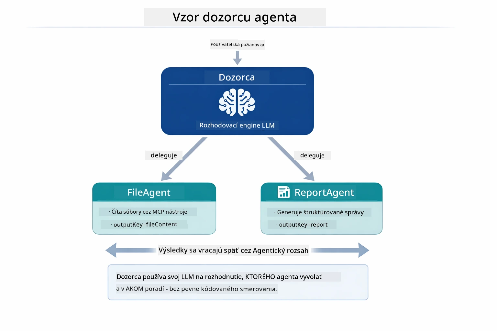

*Supervízor používa svoj LLM na rozhodnutie, ktorých agentov a v akom poradí vyvolať — nie je potrebné pevné smerovanie.*

Takto vyzerá konkrétny pracovný tok nášho procesu zo súboru do správy:

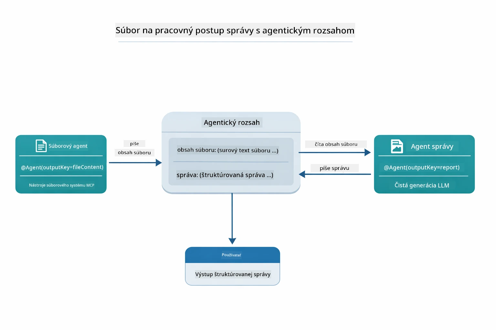

*FileAgent číta súbor cez MCP nástroje, potom ReportAgent transformuje surový obsah na štruktúrovanú správu.*

Nasledujúci sekvenčný diagram sleduje úplnú supervíznu orchestráciu — od spustenia MCP servera, cez autonómny výber agentov supervízorom, až po volania nástrojov cez stdio a finálnu správu:

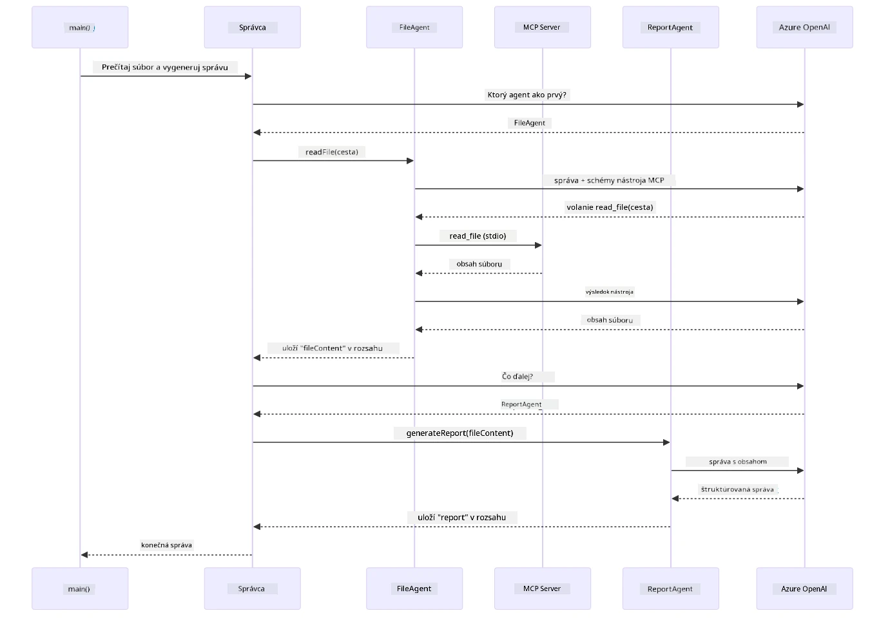

*Supervízor autonómne vyvolá FileAgent (ktorý volá MCP server cez stdio na čítanie súboru), potom vyvolá ReportAgent na generovanie štruktúrovanej správy — každý agent ukladá svoj výstup v zdieľanej agentickej pamäti.*

Každý agent ukladá svoj výstup do **Agentic Scope** (zdieľaná pamäť), čo umožňuje podpory agenty pristupovať k predchádzajúcim výsledkom. To demonštruje, ako MCP nástroje plynulo zapadajú do agentických pracovných tokov — supervízor nemusí vedieť *ako* sa súbory čítajú, iba že `FileAgent` to dokáže.

#### Spustenie demo

Spúšťacie skripty automaticky načítajú premenné prostredia zo súboru `.env` v koreňovom adresári:

**Bash:**
```bash
cd 05-mcp
chmod +x start-supervisor.sh
./start-supervisor.sh
```

**PowerShell:**
```powershell
cd 05-mcp
.\start-supervisor.ps1
```

**Použitie VS Code:** Kliknite pravým tlačidlom na `SupervisorAgentDemo.java` a vyberte **"Run Java"** (skontrolujte, že `.env` je nakonfigurovaný).

#### Ako funguje supervízor

Pred vytváraním agentov musíte pripojiť MCP prenos dopravy ku klientovi a zabaliť ho ako `ToolProvider`. Takto sa nástroje MCP servera sprístupnia vašim agentom:

```java
// Vytvorte MCP klienta z transportu
McpClient mcpClient = new DefaultMcpClient.Builder()
        .transport(stdioTransport)
        .build();

// Zabaľte klienta ako ToolProvider — toto prepojí MCP nástroje s LangChain4j
ToolProvider mcpToolProvider = McpToolProvider.builder()
        .mcpClients(List.of(mcpClient))
        .build();
```

Teraz môžete injektovať `mcpToolProvider` do akéhokoľvek agenta, ktorý potrebuje MCP nástroje:

```java
// Krok 1: FileAgent číta súbory pomocou nástrojov MCP
FileAgent fileAgent = AgenticServices.agentBuilder(FileAgent.class)
        .chatModel(model)
        .toolProvider(mcpToolProvider)  // Má nástroje MCP na operácie so súbormi
        .build();

// Krok 2: ReportAgent generuje štruktúrované správy
ReportAgent reportAgent = AgenticServices.agentBuilder(ReportAgent.class)
        .chatModel(model)
        .build();

// Supervisor riadi pracovný tok súbor → správa
SupervisorAgent supervisor = AgenticServices.supervisorBuilder()
        .chatModel(model)
        .subAgents(fileAgent, reportAgent)
        .responseStrategy(SupervisorResponseStrategy.LAST)  // Vrátiť konečnú správu
        .build();

// Supervisor rozhoduje, ktorých agentov vyvolať na základe požiadavky
String response = supervisor.invoke("Read the file at /path/file.txt and generate a report");
```

#### Ako FileAgent zistí MCP nástroje za behu

Možno sa pýtate: **ako `FileAgent` vie používať npm nástroje súborového systému?** Odpoveď je, že nevie — **LLM** to zistí za behu cez schémy nástrojov.
Rozhranie `FileAgent` je iba **definícia promptu**. Nemá zabudované žiadne znalosti o `read_file`, `list_directory` ani o žiadnom inom MCP nástroji. Tu je, čo sa deje od začiatku do konca:

1. **Spustenie servera:** `StdioMcpTransport` spustí npm balík `@modelcontextprotocol/server-filesystem` ako podproces
2. **Objavovanie nástrojov:** `McpClient` odošle JSON-RPC požiadavku `tools/list` serveru, ktorý odpovie menami nástrojov, popismi a schémami parametrov (napr. `read_file` — *"Prečítať celý obsah súboru"* — `{ path: string }`)
3. **Injektovanie schém:** `McpToolProvider` zabalí tieto objavené schémy a sprístupní ich LangChain4j
4. **Rozhodnutie LLM:** Keď sa zavolá `FileAgent.readFile(path)`, LangChain4j odošle systémovú správu, používateľskú správu a **zoznam schém nástrojov** do LLM. LLM si prečíta popisy nástrojov a vygeneruje volanie nástroja (napr. `read_file(path="/some/file.txt")`)
5. **Vykonanie:** LangChain4j zachytí volanie nástroja, presmeruje ho cez MCP klienta späť do Node.js podprocesu, získa výsledok a poskytne ho späť LLM

Toto je rovnaký mechanizmus [objavovania nástrojov](../../../05-mcp), ako bolo popísané vyššie, ale aplikovaný špeciálne na pracovný tok agenta. Anotácie `@SystemMessage` a `@UserMessage` usmerňujú správanie LLM, zatiaľ čo injektovaný `ToolProvider` mu dáva **schopnosti** — LLM počas behu ich prepája dohromady.

> **🤖 Vyskúšajte s [GitHub Copilot](https://github.com/features/copilot) Chat:** Otvorte [`FileAgent.java`](../../../05-mcp/src/main/java/com/example/langchain4j/mcp/agents/FileAgent.java) a opýtajte sa:
> - "Ako tento agent vie, ktorý MCP nástroj volať?"
> - "Čo by sa stalo, keby som z agenta odstránil ToolProvider?"
> - "Ako sa schémy nástrojov posielajú do LLM?"

#### Strategie odpovedí

Keď konfigurujete `SupervisorAgent`, určujete, ako by mal formulovať svoju konečnú odpoveď používateľovi po tom, čo podagent splnia svoje úlohy. Nižšie uvedený diagram ukazuje tri dostupné stratégie — LAST vracia priamo výstup posledného agenta, SUMMARY syntetizuje všetky výstupy pomocou LLM a SCORED vyberá ten, ktorý dosiahne vyššie skóre voči pôvodnej požiadavke:

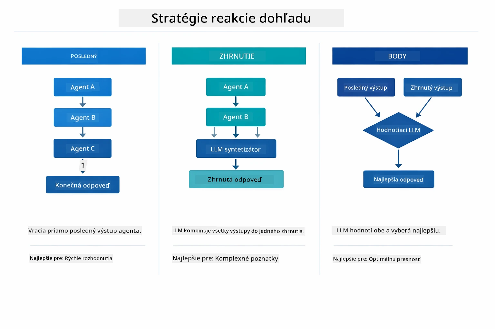

*Tri stratégie, ako Supervisor formuluje svoju konečnú odpoveď — vyberte podľa toho, či chcete výstup posledného agenta, syntetizované zhrnutie, alebo najlepšie ohodnotenú možnosť.*

Dostupné stratégie sú:

| Stratégia | Popis |
|----------|-------------|
| **LAST** | Supervisor vracia výstup posledného pod-agenta alebo volaného nástroja. Je to užitočné, ak je záverečný agent v pracovnom toku navrhnutý na vytvorenie kompletného, konečného výsledku (napr. "Summary Agent" v výskumnom reťazci). |
| **SUMMARY** | Supervisor použije svoj vlastný interný jazykový model (LLM) na syntézu zhrnutia celej interakcie a všetkých výstupov pod-agentov, a toto zhrnutie vráti ako finálnu odpoveď. Zabezpečuje čistú, agregovanú odpoveď pre používateľa. |
| **SCORED** | Systém použije interný LLM na ohodnotenie odpovedí LAST a SUMMARY voči pôvodnej požiadavke používateľa a vráti tú odpoveď, ktorá dosiahne vyššie skóre. |

Kompletnú implementáciu nájdete v [SupervisorAgentDemo.java](../../../05-mcp/src/main/java/com/example/langchain4j/mcp/SupervisorAgentDemo.java).

> **🤖 Vyskúšajte s [GitHub Copilot](https://github.com/features/copilot) Chat:** Otvorte [`SupervisorAgentDemo.java`](../../../05-mcp/src/main/java/com/example/langchain4j/mcp/SupervisorAgentDemo.java) a opýtajte sa:
> - "Ako Supervisor rozhoduje, ktorých agentov vyvolať?"
> - "Aký je rozdiel medzi Supervisor a Sequential workflow vzormi?"
> - "Ako môžem prispôsobiť plánovacie správanie Supervisora?"

#### Pochopenie výstupu

Keď spustíte demo, uvidíte štruktúrovaný prehľad, ako Supervisor orchestruje viacerých agentov. Tu je, čo znamená každá časť:

```
======================================================================
  FILE → REPORT WORKFLOW DEMO
======================================================================

This demo shows a clear 2-step workflow: read a file, then generate a report.
The Supervisor orchestrates the agents automatically based on the request.
```
  
**Nadpis** predstavuje koncepciu pracovného toku: zameraný reťazec od čítania súborov až po generovanie reportu.

```
--- WORKFLOW ---------------------------------------------------------
  ┌─────────────┐      ┌──────────────┐
  │  FileAgent  │ ───▶ │ ReportAgent  │
  │ (MCP tools) │      │  (pure LLM)  │
  └─────────────┘      └──────────────┘
   outputKey:           outputKey:
   'fileContent'        'report'

--- AVAILABLE AGENTS -------------------------------------------------
  [FILE]   FileAgent   - Reads files via MCP → stores in 'fileContent'
  [REPORT] ReportAgent - Generates structured report → stores in 'report'
```
  
**Diagram workflow** ukazuje tok dát medzi agentmi. Každý agent má špecifickú úlohu:  
- **FileAgent** číta súbory pomocou MCP nástrojov a ukladá surový obsah do `fileContent`  
- **ReportAgent** využíva tento obsah a vytvára štruktúrovaný report v `report`

```
--- USER REQUEST -----------------------------------------------------
  "Read the file at .../file.txt and generate a report on its contents"
```
  
**Požiadavka používateľa** ukazuje úlohu. Supervisor ju spracuje a rozhodne sa vyvolať FileAgent → ReportAgent.

```
--- SUPERVISOR ORCHESTRATION -----------------------------------------
  The Supervisor decides which agents to invoke and passes data between them...

  +-- STEP 1: Supervisor chose -> FileAgent (reading file via MCP)
  |
  |   Input: .../file.txt
  |
  |   Result: LangChain4j is an open-source, provider-agnostic Java framework for building LLM...
  +-- [OK] FileAgent (reading file via MCP) completed

  +-- STEP 2: Supervisor chose -> ReportAgent (generating structured report)
  |
  |   Input: LangChain4j is an open-source, provider-agnostic Java framew...
  |
  |   Result: Executive Summary...
  +-- [OK] ReportAgent (generating structured report) completed
```
  
**Supervisor orchestration** ukazuje 2-krokový tok v praxi:  
1. **FileAgent** číta súbor cez MCP a ukladá obsah  
2. **ReportAgent** dostane obsah a generuje štruktúrovaný report

Supervisor tieto rozhodnutia urobil **autonómne** na základe požiadavky používateľa.

```
--- FINAL RESPONSE ---------------------------------------------------
Executive Summary
...

Key Points
...

Recommendations
...

--- AGENTIC SCOPE (Data Flow) ----------------------------------------
  Each agent stores its output for downstream agents to consume:
  * fileContent: LangChain4j is an open-source, provider-agnostic Java framework...
  * report: Executive Summary...
```
  
#### Vysvetlenie funkcií agentického modulu

Príklad ilustruje niekoľko pokročilých funkcií agentického modulu. Pozrime sa bližšie na Agentic Scope a Agent Listeners.

**Agentic Scope** predstavuje zdieľanú pamäť, kde agenti ukladali svoje výsledky pomocou `@Agent(outputKey="...")`. To umožňuje:  
- neskorším agentom pristupovať k výstupom predchádzajúcich agentov  
- Supervisorovi syntetizovať konečnú odpoveď  
- vám prezerať, čo každý agent vytvoril

Nižšie uvedený diagram ukazuje, ako Agentic Scope funguje ako zdieľaná pamäť v pracovnom toku súbor → report — FileAgent zapíše výstup pod kľúč `fileContent`, ReportAgent ho prečíta a zapíše svoj výstup pod `report`:

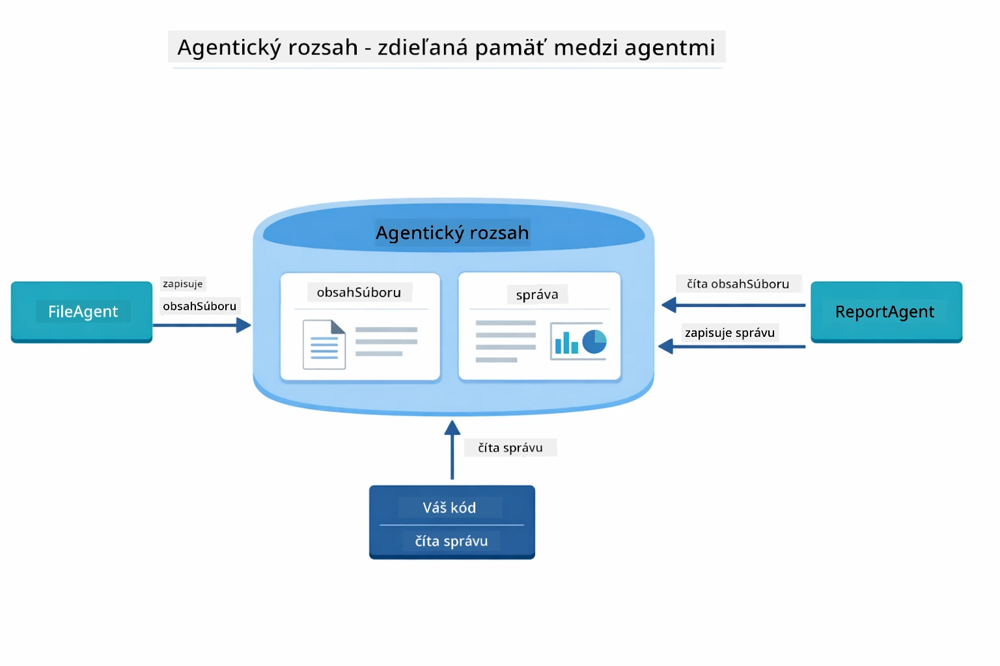

*Agentic Scope slúži ako zdieľaná pamäť — FileAgent zapisuje `fileContent`, ReportAgent ho číta a ukladá `report`, váš kód číta finálny výsledok.*

```java
ResultWithAgenticScope<String> result = supervisor.invokeWithAgenticScope(request);
AgenticScope scope = result.agenticScope();
String fileContent = scope.readState("fileContent");  // Surové údaje súboru od FileAgent
String report = scope.readState("report");            // Štruktúrovaná správa od ReportAgent
```
  
**Agent Listeners** umožňujú sledovanie a ladenie vykonania agentov. Krok za krokom výstup z dema pochádza z AgentListener, ktorý sa pripája ku každej invokácii agenta:  
- **beforeAgentInvocation** – volané, keď Supervisor vyberie agenta, chcete vidieť, ktorý agent bol vybraný a prečo  
- **afterAgentInvocation** – volané po dokončení agenta, ukazuje jeho výsledok  
- **inheritedBySubagents** – ak je true, poslucháč monitoruje všetkých agentov v hierarchii

Nasledujúci diagram ukazuje celý životný cyklus Agent Listener vrátane spracovania chýb funkciou `onError` počas vykonávania agenta:

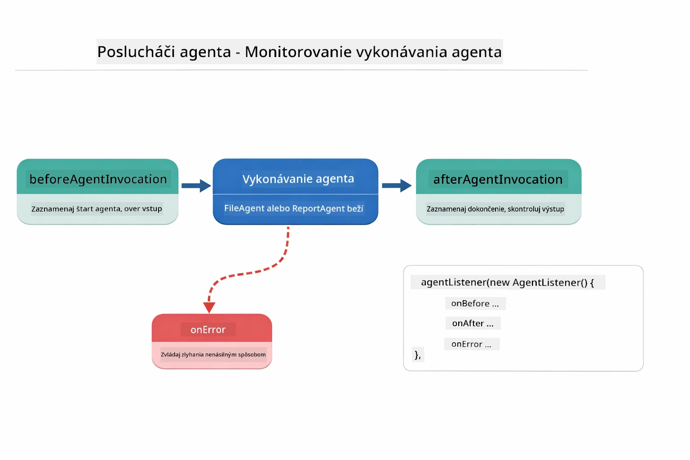

*Agent Listeners sa pripájajú k životnému cyklu vykonávania — sledujú, kedy agent začína, končí alebo narazí na chybu.*

```java
AgentListener monitor = new AgentListener() {
    private int step = 0;
    
    @Override
    public void beforeAgentInvocation(AgentRequest request) {
        step++;
        System.out.println("  +-- STEP " + step + ": " + request.agentName());
    }
    
    @Override
    public void afterAgentInvocation(AgentResponse response) {
        System.out.println("  +-- [OK] " + response.agentName() + " completed");
    }
    
    @Override
    public boolean inheritedBySubagents() {
        return true; // Šíriť na všetkých podagentov
    }
};
```
  
Okrem vzoru Supervisor modul `langchain4j-agentic` poskytuje niekoľko výkonných vzorov workflow. Nasledujúci diagram ukazuje všetkých päť — od jednoduchých sekvenčných pipeline až po schvaľovacie workflow s človekom v slučke:

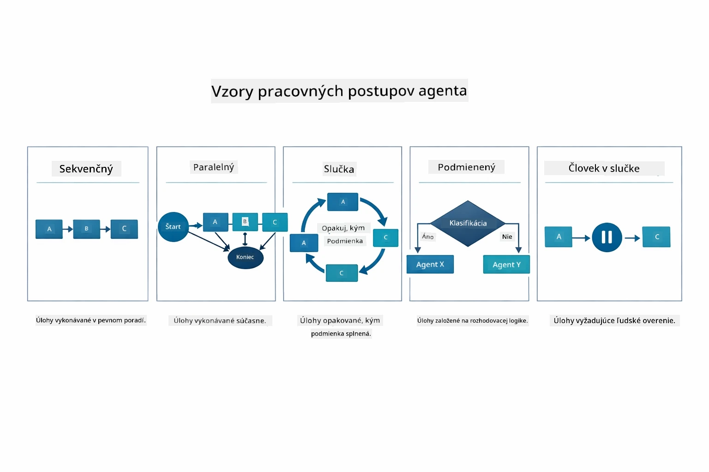

*Päť vzorov workflow pre orchestráciu agentov — od jednoduchých sekvenčných pipeline až po schvaľovacie workflow s človekom v slučke.*

| Vzor | Popis | Prípad použitia |
|---------|-------------|----------|
| **Sequential** | Spúšťa agentov postupne, výstup ide do ďalšieho | Pipeline: výskum → analýza → report |
| **Parallel** | Spúšťa agentov súčasne | Nezávislé úlohy: počasie + správy + akcie |
| **Loop** | Iteruje, kým nie je splnená podmienka | Skórovanie kvality: zlepšovať až do skóre ≥ 0.8 |
| **Conditional** | Smeruje podľa podmienok | Klasifikovať → smerovať špecialistickému agentovi |
| **Human-in-the-Loop** | Pridáva ľudské kontrolné body | Schvaľovacie workflow, kontrola obsahu |

## Kľúčové koncepty

Teraz, keď ste preskúmali MCP a agentický modul v praxi, zhrňme, kedy použiť ktorý prístup.

Jednou z najväčších výhod MCP je jeho rastúca ekosystém. Nasledujúci diagram ukazuje, ako jeden univerzálny protokol prepája vašu AI aplikáciu s širokou škálou MCP serverov — od prístupu k súborovému systému a databázam až po GitHub, email, web scraping a ďalšie:

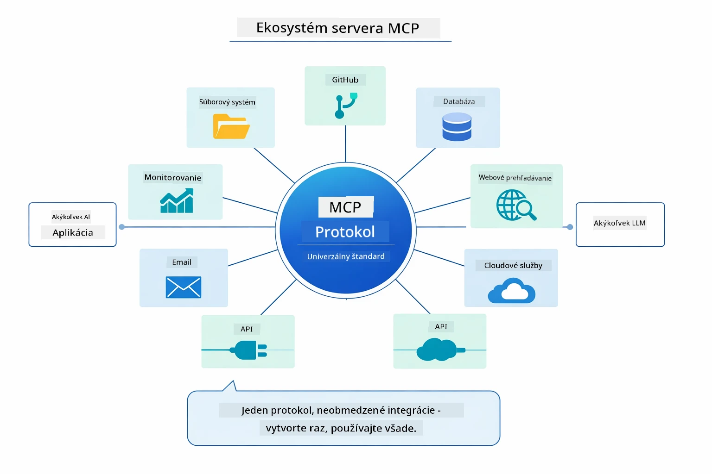

*MCP vytvára ekosystém univerzálneho protokolu — akýkoľvek MCP-kompatibilný server funguje s akýmkoľvek MCP-kompatibilným klientom, umožňujúc zdieľanie nástrojov v aplikáciách.*

**MCP** je ideálny, keď chcete využiť existujúce ekosystémy nástrojov, vytvárať nástroje, ktoré môžu používať viaceré aplikácie, integrovať služby tretích strán so štandardnými protokolmi alebo meniť implementácie nástrojov bez zmeny kódu.

**Agentic modul** funguje najlepšie, keď chcete deklaratívne definície agentov pomocou anotácií `@Agent`, potrebujete orchestráciu pracovného toku (sekvenčný, slučka, paralelný), preferujete návrh agentov založený na rozhraní namiesto imperatívneho kódu alebo kombinujete viacerých agentov, ktorí zdieľajú výstupy cez `outputKey`.

**Vzorec Supervisor Agent** vyniká, keď pracovný tok nie je vopred predvídateľný a chcete, aby o ňom rozhodoval LLM, keď máte viacerých špecializovaných agentov, ktorí potrebujú dynamickú orchestráciu, pri budovaní konverzačných systémov so smerovaním na rôzne schopnosti, alebo keď chcete najflexibilnejšie a adaptívne správanie agenta.

Na pomoc s rozhodovaním medzi vlastnými metódami `@Tool` z Modulu 04 a MCP nástrojmi z tohto modulu, nasledujúce porovnanie zdôrazňuje kľúčové kompromisy — vlastné nástroje vám dávajú tesné prepojenie a plnú typovú bezpečnosť pre logiku konkrétnej aplikácie, zatiaľ čo MCP nástroje ponúkajú štandardizované, znovupoužiteľné integrácie:

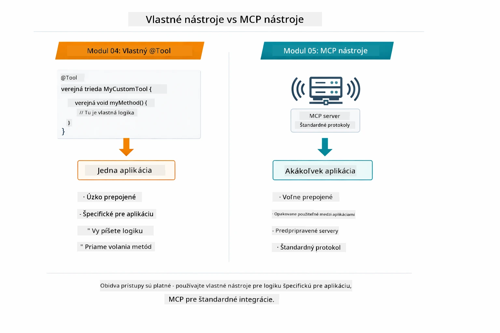

*Kedy použiť vlastné metódy @Tool verzus MCP nástroje — vlastné nástroje pre logiku špecifickú pre aplikáciu s plnou typovou bezpečnosťou, MCP nástroje pre štandardizované integrácie fungujúce naprieč aplikáciami.*

## Gratulujeme!

Prešli ste všetkými piatimi modulmi kurzu LangChain4j pre začiatočníkov! Tu je pohľad na celú vzdelávaciu cestu, ktorú ste absolvovali — od základného chatu až po agentické systémy poháňané MCP:

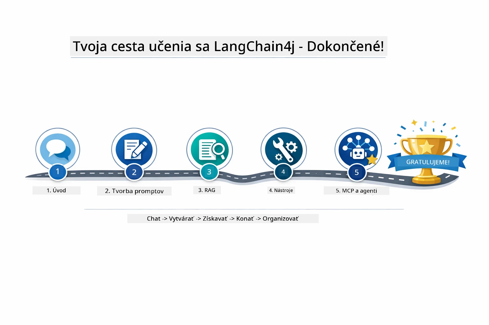

*Vaša vzdelávacia cesta cez všetkých päť modulov — od základného chatu po agentické systémy s MCP.*

Dokončili ste kurz LangChain4j pre začiatočníkov. Naučili ste sa:

- Ako vytvárať konverzačné AI s pamäťou (Modul 01)  
- Vzory prompt inžinierstva pre rôzne úlohy (Modul 02)  
- Spojiť odpovede s vašimi dokumentmi pomocou RAG (Modul 03)  
- Vytvárať základných AI agentov (asistentov) s vlastnými nástrojmi (Modul 04)  
- Integrácia štandardizovaných nástrojov s LangChain4j MCP a agentickými modulmi (Modul 05)

### Čo ďalej?

Po dokončení modulov preskúmajte [Testovací sprievodca](../docs/TESTING.md), kde uvidíte koncepty testovania LangChain4j v praxi.

**Oficiálne zdroje:**  
- [LangChain4j Dokumentácia](https://docs.langchain4j.dev/) – komplexné návody a API referencie  
- [LangChain4j GitHub](https://github.com/langchain4j/langchain4j) – zdrojový kód a príklady  
- [LangChain4j Tutoriály](https://docs.langchain4j.dev/tutorials/) – krok za krokom návody pre rôzne prípady použitia

Ďakujeme, že ste absolvovali tento kurz!

---

**Navigácia:** [← Predchádzajúce: Modul 04 - Nástroje](../04-tools/README.md) | [Späť na Hlavnú stránku](../README.md)

---

<!-- CO-OP TRANSLATOR DISCLAIMER START -->
**Vylúčenie zodpovednosti**:
Tento dokument bol preložený pomocou AI prekladateľskej služby [Co-op Translator](https://github.com/Azure/co-op-translator). Hoci sa snažíme o presnosť, vezmite prosím na vedomie, že automatické preklady môžu obsahovať chyby alebo nepresnosti. Originálny dokument v jeho pôvodnom jazyku by mal byť považovaný za autoritatívny zdroj. Pre kritické informácie sa odporúča profesionálny ľudský preklad. Nie sme zodpovední za žiadne nedorozumenia alebo nesprávne interpretácie vzniknuté použitím tohto prekladu.
<!-- CO-OP TRANSLATOR DISCLAIMER END -->