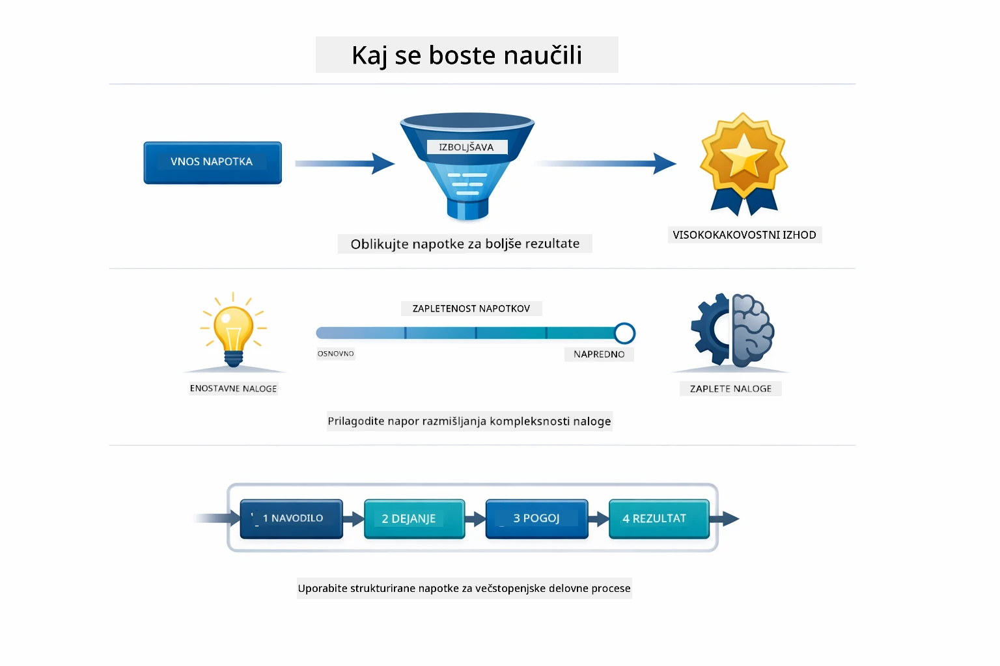
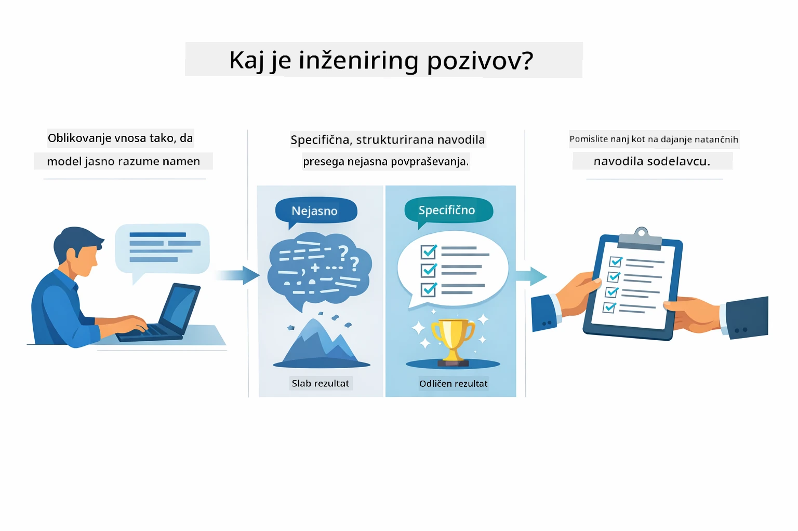
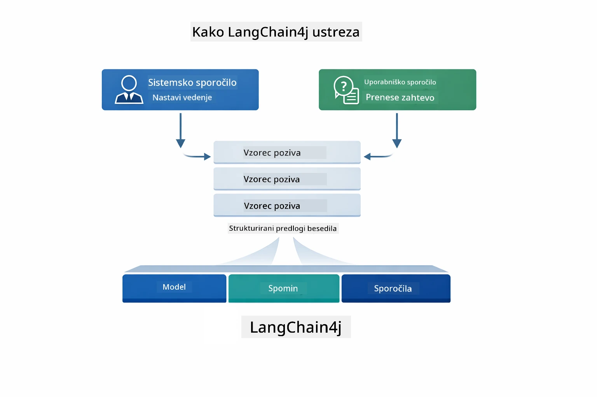
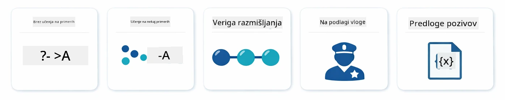
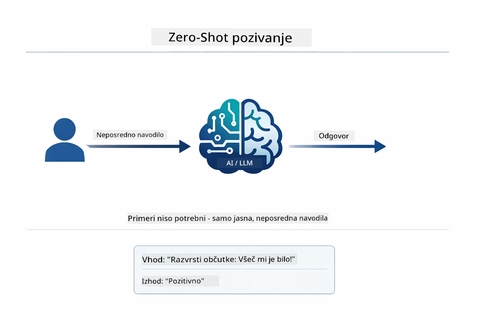
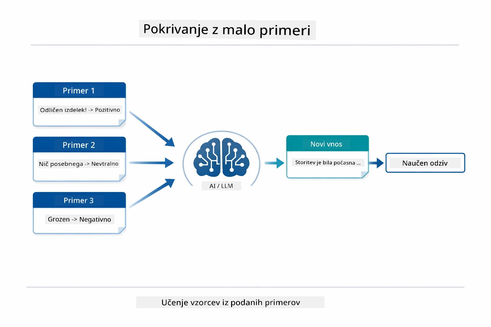
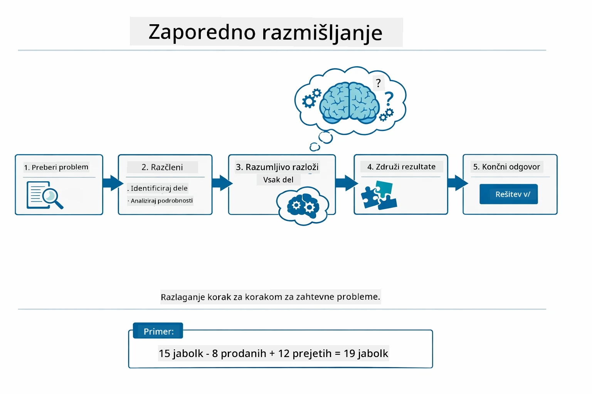
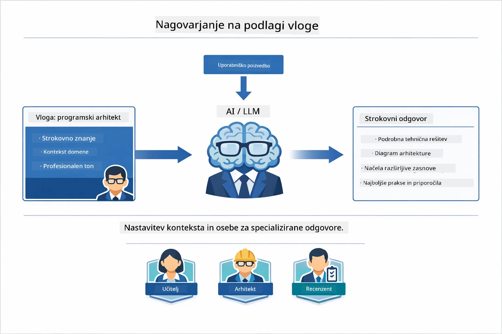
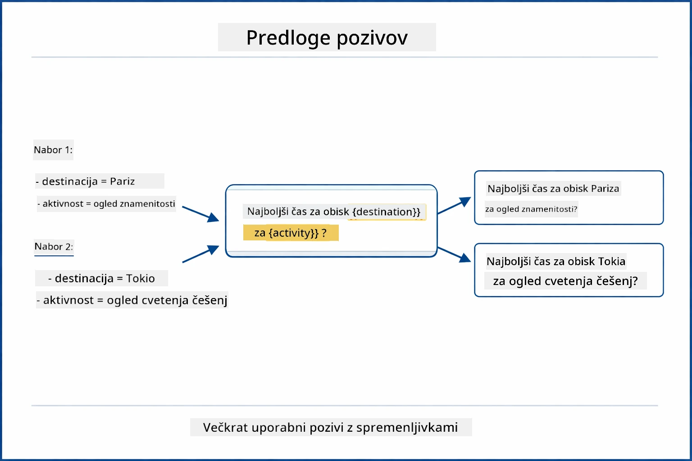
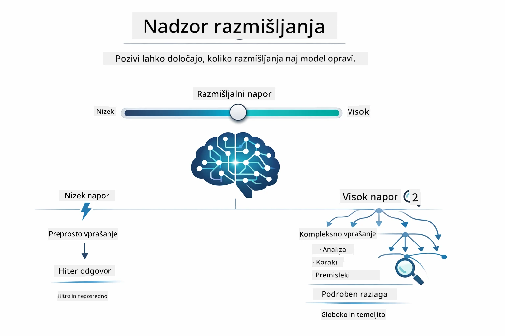

# Modul 02: Inženiring pozivov z GPT-5.2

## Kazalo

- [Video predstavitev](../../../02-prompt-engineering)
- [Kaj se boste naučili](../../../02-prompt-engineering)
- [Pogojna znanja](../../../02-prompt-engineering)
- [Razumevanje inženiringa pozivov](../../../02-prompt-engineering)
- [Osnove inženiringa pozivov](../../../02-prompt-engineering)
  - [Zero-Shot poziv](../../../02-prompt-engineering)
  - [Few-Shot poziv](../../../02-prompt-engineering)
  - [Veriga misli](../../../02-prompt-engineering)
  - [Pozivanje na osnovi vloge](../../../02-prompt-engineering)
  - [Predloge pozivov](../../../02-prompt-engineering)
- [Napredni vzorci](../../../02-prompt-engineering)
- [Uporaba obstoječih Azure virov](../../../02-prompt-engineering)
- [Posnetki zaslona aplikacije](../../../02-prompt-engineering)
- [Raziskovanje vzorcev](../../../02-prompt-engineering)
  - [Nizka proti visoki vnemi](../../../02-prompt-engineering)
  - [Izvajanje nalog (uvodi orodij)](../../../02-prompt-engineering)
  - [Samoreflektirajoča koda](../../../02-prompt-engineering)
  - [Strukturirana analiza](../../../02-prompt-engineering)
  - [Večkratni pogovori](../../../02-prompt-engineering)
  - [Razlogovanje korak za korakom](../../../02-prompt-engineering)
  - [Omejen izhod](../../../02-prompt-engineering)
- [Kaj se dejansko učite](../../../02-prompt-engineering)
- [Naslednji koraki](../../../02-prompt-engineering)

## Video predstavitev

Ogledate si lahko to v živo sejo, ki razlaga, kako začeti s tem modulom: [Prompt Engineering with LangChain4j - Live Session](https://www.youtube.com/live/PJ6aBaE6bog?si=LDshyBrTRodP-wke)

## Kaj se boste naučili



V prejšnjem modulu ste videli, kako pomnilnik omogoča konverzacijski AI in uporabili modele GitHub za osnovne interakcije. Zdaj se bomo osredotočili na to, kako zastavljate vprašanja — same pozive — z uporabo GPT-5.2 platforme Azure OpenAI. Način, kako strukturirate svoje pozive, drastično vpliva na kakovost odgovorov, ki jih dobite. Začnemo z pregledom osnovnih tehnik pozivanja, nato pa nadaljujemo z osmimi naprednimi vzorci, ki v celoti izkoristijo zmogljivosti GPT-5.2.

Uporabljali bomo GPT-5.2, ker uvaja nadzor razmišljanja – modelu lahko poveste, koliko razmišljanja naj opravi pred odgovorom. To naredi različne strategije pozivanja bolj očitne in pomaga razumeti, kdaj uporabiti kateri pristop. Prav tako bomo imeli koristi od manj omejitev hitrosti na platformi Azure za GPT-5.2 v primerjavi z modeli GitHub.

## Pogojna znanja

- Dokončan Modul 01 (Azure OpenAI viri nameščeni)
- `.env` datoteka v osnovni mapi z Azure poverilnicami (ustvarjena z `azd up` v Modulu 01)

> **Opomba:** Če niste dokončali Modula 01, najprej sledite navodilom za namestitev tam.

## Razumevanje inženiringa pozivov



Inženiring pozivov je o oblikovanju vhodnega besedila, ki dosledno prinaša želene rezultate. Ni samo postavljanje vprašanj – gre za strukturiranje zahtev tako, da model natančno razume, kaj želite in kako to dostaviti.

Predstavljajte si, da dajete navodila sodelavcu. "Popravi napako" je nejasno. "Popravi izjemo null pointer v UserService.java vrstica 45 z dodajanjem preverjanja null vrednosti" je specifično. Jezikovni modeli delujejo enako – specifičnost in struktura sta pomembni.



LangChain4j zagotavlja infrastrukturo — povezave modelov, pomnilnik in vrste sporočil — medtem ko so vzorci pozivov samo skrbno strukturirano besedilo, ki ga pošljete skozi to infrastrukturo. Ključni gradniki so `SystemMessage` (ki nastavi vedenje in vlogo AI) in `UserMessage` (ki nosi vašo dejansko zahtevo).

## Osnove inženiringa pozivov



Preden se poglobimo v napredne vzorce tega modula, si poglejmo pet osnovnih tehnik pozivanja. To so gradniki, ki jih mora poznati vsak inženir pozivov. Če ste že delali skozi [modul Hiter začetek](../00-quick-start/README.md#2-prompt-patterns), ste jih že videli v praksi — tukaj je konceptualni okvir zadaj.

### Zero-Shot poziv

Najpreprostejši pristop: modelu daste neposredno navodilo brez primerov. Model se v celoti zanaša na svoje usposabljanje, da razume in izvede nalogo. To dobro deluje za neposredne zahteve, kjer je pričakovano vedenje očitno.



*Neposredno navodilo brez primerov — model sklepa nalogo samo iz navodila*

```java
String prompt = "Classify this sentiment: 'I absolutely loved the movie!'";
String response = model.chat(prompt);
// Odgovor: "Pozitivno"
```

**Kdaj uporabiti:** Enostavne klasifikacije, neposredna vprašanja, prevajanja ali katero koli nalogo, ki jo model lahko opravi brez dodatnih usmeritev.

### Few-Shot poziv

Podajte primere, ki pokažejo vzorec, ki ga želite, da model sledi. Model se nauči pričakovanega formata vhod-izhod iz vaših primerov in ga uporabi na novih vhodih. To močno izboljša doslednost za naloge, kjer želeni format ali vedenje nista očitna.



*Učenje iz primerov — model prepozna vzorec in ga uporabi na novih vhodih*

```java
String prompt = """
    Classify the sentiment as positive, negative, or neutral.
    
    Examples:
    Text: "This product exceeded my expectations!" → Positive
    Text: "It's okay, nothing special." → Neutral
    Text: "Waste of money, very disappointed." → Negative
    
    Now classify this:
    Text: "Best purchase I've made all year!"
    """;
String response = model.chat(prompt);
```

**Kdaj uporabiti:** Prilagojene klasifikacije, dosledno oblikovanje, naloge specifične za domeno ali kadar so rezultati zero-shot neenotni.

### Veriga misli

Zahtevajte od modela, da pokaže svoje razmišljanje korak za korakom. Namesto da bi skočil neposredno do odgovora, model razbije problem in deluje skozi vsak del eksplicitno. To izboljša natančnost pri matematičnih, logičnih in večkoraknih nalogah.



*Razlogovanje korak za korakom — razbijanje kompleksnih problemov v jasne logične korake*

```java
String prompt = """
    Problem: A store has 15 apples. They sell 8 apples and then 
    receive a shipment of 12 more apples. How many apples do they have now?
    
    Let's solve this step-by-step:
    """;
String response = model.chat(prompt);
// Model prikazuje: 15 - 8 = 7, nato 7 + 12 = 19 jabolk
```

**Kdaj uporabiti:** Matematične naloge, logične uganke, odpravljanje napak ali katero koli nalogo, kjer prikaz procesa razmišljanja izboljša natančnost in zaupanje.

### Pozivanje na osnovi vloge

Nastavite osebnost ali vlogo AI, preden zastavite vprašanje. To zagotavlja kontekst, ki oblikuje ton, globino in poudarek odgovora. "Software architect" daje drugačen nasvet kot "junior developer" ali "security auditor".



*Nastavljanje konteksta in osebe — isto vprašanje dobi drugačen odgovor glede na dodeljeno vlogo*

```java
String prompt = """
    You are an experienced software architect reviewing code.
    Provide a brief code review for this function:
    
    def calculate_total(items):
        total = 0
        for item in items:
            total = total + item['price']
        return total
    """;
String response = model.chat(prompt);
```

**Kdaj uporabiti:** Pregledi kode, poučevanje, domensko specifične analize ali kadar potrebujete odgovore prilagojene določeni ravni strokovnosti ali perspektivi.

### Predloge pozivov

Ustvarjajte ponovno uporabne pozive z spremenljivkami. Namesto da bi vsakič pisali nov poziv, definirajte predlogo enkrat in vstavite različne vrednosti. Razred `PromptTemplate` LangChain4j to omogoča z uporabo sintakse `{{variable}}`.



*Ponovno uporabni pozivi s spremenljivkami — ena predloga, več uporab*

```java
PromptTemplate template = PromptTemplate.from(
    "What's the best time to visit {{destination}} for {{activity}}?"
);

Prompt prompt = template.apply(Map.of(
    "destination", "Paris",
    "activity", "sightseeing"
));

String response = model.chat(prompt.text());
```

**Kdaj uporabiti:** Ponovljeni pozivi z različnimi vhodi, paketno obdelavo, gradnja ponovno uporabnih AI delovnih procesov ali kadar se struktura poziva ne spreminja, samo podatki.

---

Ti pet osnovnih tehnik vam nudi trden nabor orodij za večino nalog pozivanja. Preostanek tega modula gradi na njih z **osmimi naprednimi vzorci**, ki izkoriščajo nadzor razmišljanja GPT-5.2, samoevalvacijo in zmožnosti strukturiranih izhodov.

## Napredni vzorci

Ko so osnove pokrite, se pomaknimo k osmim naprednim vzorcem, ki ta modul naredijo edinstven. Ne vse težave zahtevajo isti pristop. Nekatera vprašanja potrebujejo hitre odgovore, druga globoko razmišljanje. Nekatera zahtevajo vidno razlogovanje, druga samo rezultate. Vsak spodnji vzorec je optimiziran za drugačen scenarij — in nadzor razmišljanja GPT-5.2 naredi razlike še bolj izrazite.


*Pregled osmih vzorcev inženiringa pozivov in njihovih primerov uporabe*



*Nadzor razmišljanja GPT-5.2 vam omogoča, da določite, koliko razmišljanja naj model opravi — od hitrih neposrednih odgovorov do globinskih raziskav*

**Nizka vnema (hitro in osredotočeno)** - Za enostavna vprašanja, kjer želite hitre, neposredne odgovore. Model opravi minimalno razmišljanje – največ 2 koraka. Uporabite za izračune, poizvedbe ali preprosta vprašanja.

```java
String prompt = """
    <context_gathering>
    - Search depth: very low
    - Bias strongly towards providing a correct answer as quickly as possible
    - Usually, this means an absolute maximum of 2 reasoning steps
    - If you think you need more time, state what you know and what's uncertain
    </context_gathering>
    
    Problem: What is 15% of 200?
    
    Provide your answer:
    """;

String response = chatModel.chat(prompt);
```

> 💡 **Raziskujte z GitHub Copilot:** Odprite [`Gpt5PromptService.java`](../../../02-prompt-engineering/src/main/java/com/example/langchain4j/prompts/service/Gpt5PromptService.java) in vprašajte:
> - "Kakšna je razlika med nizko in visoko vnemo pri vzorcih pozivov?"
> - "Kako XML oznake v pozivih pomagajo strukturirati AI odgovor?"
> - "Kdaj naj uporabim vzorce samorefleksije in kdaj neposredna navodila?"

**Visoka vnema (globoko in temeljito)** - Za kompleksne probleme, kjer želite celovito analizo. Model raziskuje temeljito in pokaže podrobno razlogovanje. Uporabite za sistemski dizajn, arhitekturne odločitve ali kompleksne raziskave.

```java
String prompt = """
    Analyze this problem thoroughly and provide a comprehensive solution.
    Consider multiple approaches, trade-offs, and important details.
    Show your analysis and reasoning in your response.
    
    Problem: Design a caching strategy for a high-traffic REST API.
    """;

String response = chatModel.chat(prompt);
```

**Izvajanje nalog (napredek korak za korakom)** - Za večkorakne delovne procese. Model zagotovi načrt vnaprej, pripoveduje vsak korak med izvajanjem in na koncu povzame. Uporabite za migracije, implementacije ali kateri koli večkorakni proces.

```java
String prompt = """
    <task_execution>
    1. First, briefly restate the user's goal in a friendly way
    
    2. Create a step-by-step plan:
       - List all steps needed
       - Identify potential challenges
       - Outline success criteria
    
    3. Execute each step:
       - Narrate what you're doing
       - Show progress clearly
       - Handle any issues that arise
    
    4. Summarize:
       - What was completed
       - Any important notes
       - Next steps if applicable
    </task_execution>
    
    <tool_preambles>
    - Always begin by rephrasing the user's goal clearly
    - Outline your plan before executing
    - Narrate each step as you go
    - Finish with a distinct summary
    </tool_preambles>
    
    Task: Create a REST endpoint for user registration
    
    Begin execution:
    """;

String response = chatModel.chat(prompt);
```

Veriga-misli pozivanje izrecno zahteva od modela, da pokaže svoj proces razmišljanja, kar izboljša natančnost pri zahtevnih nalogah. Razbijanje korak za korakom pomaga tako ljudem kot AI razumeti logiko.

> **🤖 Poskusite z [GitHub Copilot](https://github.com/features/copilot) Chat:** Vprašajte o tem vzorcu:
> - "Kako bi prilagodil vzorec izvajanja naloge za daljše operacije?"
> - "Kakšne so najboljše prakse za strukturiranje uvodov orodij v proizvodnih aplikacijah?"
> - "Kako ujeti in prikazati vmesne posodobitve napredka v uporabniškem vmesniku?"


*Načrtuj → Izvedi → Povzemi delovni proces za večkorajne naloge*

**Samoreflektirajoča koda** - Za generiranje kode proizvodne kakovosti. Model generira kodo po proizvodnih standardih z ustreznim ravnanjem z napakami. Uporabite to pri gradnji novih funkcionalnosti ali storitev.

```java
String prompt = """
    Generate Java code with production-quality standards: Create an email validation service
    Keep it simple and include basic error handling.
    """;

String response = chatModel.chat(prompt);
```


*Iterativen cikel izboljšav - generiraj, ocenjuj, identificiraj težave, izboljšuj, ponavljaj*

**Strukturirana analiza** - Za dosledno ocenjevanje. Model pregleda kodo z uporabo fiksnega okvira (pravilnost, prakse, zmogljivost, varnost, vzdržljivost). Uporabite za preglede kode ali ocenjevanje kakovosti.

```java
String prompt = """
    <analysis_framework>
    You are an expert code reviewer. Analyze the code for:
    
    1. Correctness
       - Does it work as intended?
       - Are there logical errors?
    
    2. Best Practices
       - Follows language conventions?
       - Appropriate design patterns?
    
    3. Performance
       - Any inefficiencies?
       - Scalability concerns?
    
    4. Security
       - Potential vulnerabilities?
       - Input validation?
    
    5. Maintainability
       - Code clarity?
       - Documentation?
    
    <output_format>
    Provide your analysis in this structure:
    - Summary: One-sentence overall assessment
    - Strengths: 2-3 positive points
    - Issues: List any problems found with severity (High/Medium/Low)
    - Recommendations: Specific improvements
    </output_format>
    </analysis_framework>
    
    Code to analyze:
    ```
    public List getUsers() {
        return database.query("SELECT * FROM users");
    }
    ```
    Provide your structured analysis:
    """;

String response = chatModel.chat(prompt);
```

> **🤖 Poskusite z [GitHub Copilot](https://github.com/features/copilot) Chat:** Vprašajte o strukturirani analizi:
> - "Kako prilagoditi analitični okvir za različne vrste pregledov kode?"
> - "Kateri je najboljši način za programatično obdelavo in ukrepanje glede na strukturiran izhod?"
> - "Kako zagotoviti dosledne nivoje resnosti v različnih sejah pregledov?"


*Okvir za dosledno pregledovanje kode z nivoji resnosti*

**Večkratni pogovori** - Za pogovore, ki potrebujejo kontekst. Model si zapomni prejšnja sporočila in gradi na njih. Uporabite za interaktivne seje pomoči ali kompleksna vprašanja in odgovore.

```java
ChatMemory memory = MessageWindowChatMemory.withMaxMessages(10);

memory.add(UserMessage.from("What is Spring Boot?"));
AiMessage aiMessage1 = chatModel.chat(memory.messages()).aiMessage();
memory.add(aiMessage1);

memory.add(UserMessage.from("Show me an example"));
AiMessage aiMessage2 = chatModel.chat(memory.messages()).aiMessage();
memory.add(aiMessage2);
```


*Kako se kontekst pogovora kopičí skozi več krogov dokler ne doseže omejitve tokenov*

**Razlogovanje korak za korakom** - Za probleme, ki zahtevajo vidno logiko. Model pokaže eksplicitno razlogovanje za vsak korak. Uporabite pri matematičnih problemih, logičnih ugankah ali kadar želite razumeti proces razmišljanja.

```java
String prompt = """
    <instruction>Show your reasoning step-by-step</instruction>
    
    If a train travels 120 km in 2 hours, then stops for 30 minutes,
    then travels another 90 km in 1.5 hours, what is the average speed
    for the entire journey including the stop?
    """;

String response = chatModel.chat(prompt);
```


*Razbijanje problemov v jasne logične korake*

**Omejen izhod** - Za odgovore s specifičnimi zahtevami glede formata. Model strogo sledi pravilom formata in dolžine. Uporabite za povzetke ali kadar potrebujete natančno strukturo izhoda.

```java
String prompt = """
    <constraints>
    - Exactly 100 words
    - Bullet point format
    - Technical terms only
    </constraints>
    
    Summarize the key concepts of machine learning.
    """;

String response = chatModel.chat(prompt);
```


*Uveljavljanje specifik formata, dolžine in strukture*

## Uporaba obstoječih Azure virov

**Preverite namestitev:**

Prepričajte se, da `.env` datoteka obstaja v osnovni mapi z Azure poverilnicami (ustvarjena med Modulom 01):
```bash
cat ../.env  # Naj pokaže AZURE_OPENAI_ENDPOINT, API_KEY, DEPLOYMENT
```

**Zaženite aplikacijo:**

> **Opomba:** Če ste že zagnali vse aplikacije z `./start-all.sh` iz Modula 01, ta modul že teče na vratih 8083. Zaženete lahko neposredno http://localhost:8083 in se izognete spodnjim ukazom.

**Možnost 1: Uporaba Spring Boot nadzorne plošče (priporočeno za uporabnike VS Code)**
Razvojni kontejner vključuje razširitev Spring Boot Dashboard, ki zagotavlja vizualni vmesnik za upravljanje vseh aplikacij Spring Boot. Najdete jo lahko v vrstici z aktivnostmi na levi strani VS Code (poiščite ikono Spring Boot).

Iz Spring Boot nadzorne plošče lahko:
- Vidite vse razpoložljive aplikacije Spring Boot v delovnem prostoru
- Zaženete/ustavite aplikacije z enim klikom
- V realnem času si ogledate dnevniške zapise aplikacij
- Spremljate stanje aplikacij

Preprosto kliknite gumb za predvajanje poleg »prompt-engineering«, da zaženete ta modul, ali pa zaženete vse module hkrati.


**Možnost 2: Uporaba shell skript**

Zaženite vse spletne aplikacije (moduli 01-04):

**Bash:**
```bash
cd ..  # Iz korenskega imenika
./start-all.sh
```

**PowerShell:**
```powershell
cd ..  # Iz korenske mape
.\start-all.ps1
```

Ali zaženite samo ta modul:

**Bash:**
```bash
cd 02-prompt-engineering
./start.sh
```

**PowerShell:**
```powershell
cd 02-prompt-engineering
.\start.ps1
```

Obe skripti samodejno naložita okoljske spremenljivke iz korenske datoteke `.env` in bosta zgradili JAR-je, če ne obstajajo.

> **Opomba:** Če želite pred zagonom ročno zgraditi vse module:
>
> **Bash:**
> ```bash
> cd ..  # Go to root directory
> mvn clean package -DskipTests
> ```
>
> **PowerShell:**
> ```powershell
> cd ..  # Go to root directory
> mvn clean package -DskipTests
> ```

Odprite http://localhost:8083 v svojem brskalniku.

**Za ustavitev:**

**Bash:**
```bash
./stop.sh  # Samo ta modul
# Ali
cd .. && ./stop-all.sh  # Vsi moduli
```

**PowerShell:**
```powershell
.\stop.ps1  # Samo ta modul
# Ali
cd ..; .\stop-all.ps1  # Vsi moduli
```

## Posnetki zaslona aplikacije


*Glavni nadzorni zaslon prikazuje vseh 8 vzorcev prompt inženiringa z njihovimi značilnostmi in primeri uporabe*

## Raziskovanje vzorcev

Spletni vmesnik vam omogoča eksperimentiranje z različnimi strategijami promptanja. Vsak vzorec rešuje različne probleme – preizkusite jih in ugotovite, kdaj se kateri pristop izkaže.

> **Opomba: Pretakanje proti nepretakanju** — Vsaka stran vzorca ponuja dva gumba: **🔴 Stream Response (v živo)** in možnost **Ne-streamanja**. Pretakanje uporablja Server-Sent Events (SSE) za prikazovanje tokenov v realnem času, ko jih model generira, zato takoj vidite napredek. Ne-streaming počaka, da je celoten odziv pripravljen, preden ga prikaže. Za zahteve, ki sprožijo globoko razmišljanje (npr. High Eagerness, Self-Reflecting Code), klic brez pretakanja lahko traja zelo dolgo – včasih tudi minute – brez vidne povratne informacije. **Uporabite pretakanje, ko eksperimentirate s kompleksnimi prompti**, da boste videli delo modela in se izognili vtisu, da je zahteva potekla.
>
> **Opomba: Zahteve brskalnika** — Funkcija pretakanja uporablja Fetch Streams API (`response.body.getReader()`), ki zahteva poln brskalnik (Chrome, Edge, Firefox, Safari). Ne deluje v vgrajenem preprostem brskalniku VS Code, saj njegov spletni prikazovalnik ne podpira ReadableStream API. Če uporabljate Simple Browser, gumba za ne-streamanje še vedno delujeta normalno – vpliva samo pretakanje. Za polno izkušnjo odprite `http://localhost:8083` v zunanjem brskalniku.

### Nizka proti visoki vnemi

Postavite preprosto vprašanje, kot je »Koliko je 15 % od 200?« z nizko vnemo. Dobili boste takojšen, neposreden odgovor. Zdaj postavite nekaj kompleksnejšega, npr. »Naredi strategijo predpomnjenja za API z visokim prometom« z visoko vnemo. Kliknite **🔴 Stream Response (v živo)** in opazujte, kako se pojavi podroben razmislek modela token po token. Enak model, ista struktura vprašanja – vendar prompt določa, koliko razmišljanja naj bo.

### Izvajanje nalog (orodja za uvode)

Večstopenjski delovni tokovi imajo koristi od predhodnega načrtovanja in pripovedovanja napredka. Model na začetku opiše, kaj bo naredil, pripoveduje vsak korak, nato pa povzame rezultate.

### Samoreflektirajoča koda

Preizkusite »Ustvari storitev za preverjanje e-pošte«. Namesto da bi le generiral kodo in ustavil, model generira, ocenjuje glede na merila kakovosti, ugotovi slabosti in izboljšuje. Videli boste, kako iterira, dokler koda ne ustreza proizvodnim standardom.

### Strukturirana analiza

Pregledi kode potrebujejo dosledne okvirje vrednotenja. Model analizira kodo z uporabo fiksnih kategorij (pravilnost, praksa, zmogljivost, varnost) z različnimi stopnjami resnosti.

### Večkrožni klepet

Vprašajte »Kaj je Spring Boot?« in takoj nadaljujte z »Pokaži mi primer«. Model si zapomni vaše prvo vprašanje in vam predloži prav poseben primer za Spring Boot. Brez pomnilnika bi bilo drugo vprašanje preveč nejasno.

### Korak-po-korak razmišljanje

Izberite matematični problem in ga preizkusite z obema pristopoma: korak-po-korak razmišljanjem in nizko vnemo. Nizka vnema vam samo poda odgovor – hitro, a nejasno. Korak-po-korak vam pokaže vsak izračun in odločitev.

### Omejen izhod

Ko potrebujete specifične formate ali število besed, ta vzorec zagotavlja strogo pravilo. Preizkusite, kako generirati povzetek z natanko 100 besedami v obliki alinej.

## Kaj se resnično učite

**Razmislek spremeni vse**

GPT-5.2 vam omogoča nadzor nad računalniško zahtevnostjo preko vaših promptov. Nizek napor pomeni hitre odgovore z minimalnim raziskovanjem. Visok napor pomeni, da model vzame čas za globoko razmišljanje. Učite se uskladiti napor z zahtevnostjo naloge – ne izgubljajte časa z enostavnimi vprašanji, a tudi ne hitite z zapletenimi odločitvami.

**Struktura usmerja vedenje**

Opazili ste XML oznake v promptih? Niso okras. Modeli bolj zanesljivo sledijo strukturiranim navodilom kot prostemu besedilu. Ko potrebujete večstopenjske postopke ali kompleksno logiko, struktura pomaga modelu slediti, kje je in kaj sledi.


*Anatomija dobro strukturiranega prompta z jasnimi odseki in XML-slogovno organizacijo*

**Kakovost skozi samooceno**

Samoreflektirajoči vzorci delujejo tako, da naredijo merila kakovosti eksplicitna. Namesto da bi upali, da model »naredi prav«, mu poveste natanko, kaj pomeni »pravilno«: pravilna logika, obravnava napak, zmogljivost in varnost. Model lahko nato oceni svoj izhod in izboljša. To spremeni generiranje kode iz loterije v proces.

**Kontekst je omejen**

Večkrožni pogovori delujejo tako, da vključujejo zgodovino sporočil z vsakim zahtevkom. Vendar obstaja omejitev – vsak model ima največje število tokenov. Ko pogovori rastejo, boste potrebovali strategije za ohranjanje relevantnega konteksta, ne da bi dosegli ta limit. Ta modul vam pokaže, kako deluje pomnilnik; kasneje boste spoznali, kdaj povzeti, kdaj pozabiti in kdaj priklicati.

## Naslednji koraki

**Naslednji modul:** [03-rag - RAG (generiranje z iskanjem)](../03-rag/README.md)

---

**Navigacija:** [← Prejšnji: Modul 01 - Uvod](../01-introduction/README.md) | [Nazaj na glavno](../README.md) | [Naslednji: Modul 03 - RAG →](../03-rag/README.md)

---

<!-- CO-OP TRANSLATOR DISCLAIMER START -->
**Opozorilo**:
Ta dokument je bil preveden z uporabo storitve za strojno prevajanje [Co-op Translator](https://github.com/Azure/co-op-translator). Kljub prizadevanjem za natančnost imejte v mislih, da lahko avtomatizirani prevodi vsebujejo napake ali netočnosti. Izvirni dokument v njegovem izvirnem jeziku velja za avtoritativni vir. Za kritične informacije priporočamo strokovni človeški prevod. Ne odgovarjamo za morebitne nesporazume ali napačne interpretacije, ki izhajajo iz uporabe tega prevoda.
<!-- CO-OP TRANSLATOR DISCLAIMER END -->