# Modul 03: RAG (generiranje z iskanjem po virov)

## Kazalo

- [Video predstavitev](../../../03-rag)
- [Kaj se boste naučili](../../../03-rag)
- [Predpogoji](../../../03-rag)
- [Razumevanje RAG](../../../03-rag)
  - [Kateri pristop RAG ta vodič uporablja?](../../../03-rag)
- [Kako deluje](../../../03-rag)
  - [Obdelava dokumentov](../../../03-rag)
  - [Ustvarjanje vdelav](../../../03-rag)
  - [Semantično iskanje](../../../03-rag)
  - [Generiranje odgovorov](../../../03-rag)
- [Zaženi aplikacijo](../../../03-rag)
- [Uporaba aplikacije](../../../03-rag)
  - [Naloži dokument](../../../03-rag)
  - [Postavljaj vprašanja](../../../03-rag)
  - [Preveri reference virov](../../../03-rag)
  - [Eksperimentiraj z vprašanji](../../../03-rag)
- [Ključni pojmi](../../../03-rag)
  - [Strategija razdeljevanja na dele](../../../03-rag)
  - [Ocene podobnosti](../../../03-rag)
  - [Shranjevanje v pomnilniku](../../../03-rag)
  - [Upravljanje kontekstnega okna](../../../03-rag)
- [Kdaj je RAG pomemben](../../../03-rag)
- [Naslednji koraki](../../../03-rag)

## Video predstavitev

Oglejte si to neposredno predstavitev, ki razlaga, kako začeti s tem modulom:

<a href="https://www.youtube.com/watch?v=_olq75ZH_eY"></a>

## Kaj se boste naučili

V prejšnjih modulih ste se naučili, kako imeti pogovore z AI in učinkovito strukturirati svoja poziva. Toda obstaja temeljna omejitev: jezikovni modeli poznajo le tisto, kar so se naučili med usposabljanjem. Ne morejo odgovarjati na vprašanja o politikah vašega podjetja, dokumentaciji vašega projekta ali katerikoli informaciji, na kateri niso bili usposobljeni.

RAG (generiranje z iskanjem po virov) rešuje ta problem. Namesto da bi modelu poskušali "naučiti" vaše informacije (kar je drago in nepraktično), mu daste sposobnost, da išče po vaših dokumentih. Ko nekdo postavi vprašanje, sistem najde ustrezne informacije in jih vključi v poziv. Model nato odgovori na podlagi tega pridobljenega konteksta.

RAG si predstavljajte kot modelu podarjeno referenčno knjižnico. Ko postavite vprašanje, sistem:

1. **Uporabniški poizvedba** – vi postavite vprašanje  
2. **Vdelava** – vaše vprašanje prevede v vektor  
3. **Iskanje po vektorjih** – najde podobne dele dokumentov  
4. **Sestavljanje konteksta** – doda ustrezne dele v poziv  
5. **Odgovor** – LLM (velik jezikovni model) generira odgovor na podlagi konteksta

Tako so odgovori modela zasidrani v vaših dejanskih podatkih namesto da bi temeljili le na usposabljanju ali si jih izmislili.

## Predpogoji

- Zaključen [Modul 00 - Hitri začetek](../00-quick-start/README.md) (za primer Easy RAG, na katerega se sklicuje ta modul)  
- Zaključen [Modul 01 - Uvod](../01-introduction/README.md) (Azure OpenAI viri so nameščeni, vključno z modelom `text-embedding-3-small`)  
- Datoteka `.env` v korenski mapi z Azure poverilnicami (ustvarjena z `azd up` v Modulu 01)

> **Opomba:** Če Modul 01 še niste zaključili, najprej sledite navodilom za namestitev tam. Ukaz `azd up` namesti tako GPT klepetalni model kot tudi model za vdelave, ki ga ta modul uporablja.

## Razumevanje RAG

Spodnja shema ponazarja osnovni koncept: namesto da bi se zanašali izključno na podatke usposabljanja modela, RAG modelu omogoča referenčno knjižnico vaših dokumentov, ki jih pregleduje pred generiranjem vsakega odgovora.

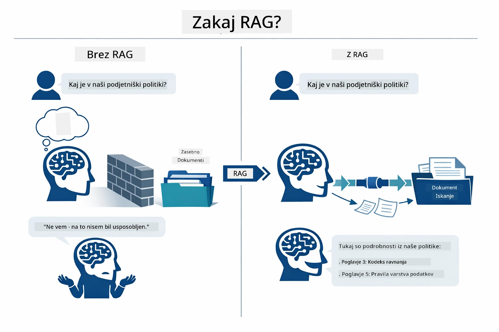

*Ta shema kaže razliko med običajnim LLM (ki ugiba iz podatkov usposabljanja) in LLM, izboljšanim z RAG (ki najprej pregleduje vaše dokumente).*

Poglejmo, kako so deli povezani od začetka do konca. Uporabnikovo vprašanje poteka skozi štiri faze — vdelava, iskanje po vektorjih, sestavljanje konteksta in generiranje odgovora — vsaka temelji na prejšnji:


*Ta shema kaže celoten RAG potek — uporabniška poizvedba poteka skozi vdelavo, iskanje, sestavljanje konteksta in generiranje odgovora.*

Preostali del tega modula podrobno razlaga vsako fazo s kodo, ki jo lahko zaženete in prilagodite.

### Kateri pristop RAG ta vodič uporablja?

LangChain4j ponuja tri načine za implementacijo RAG, vsak z različnim nivojem abstrakcije. Spodnja shema jih primerja vzporedno:

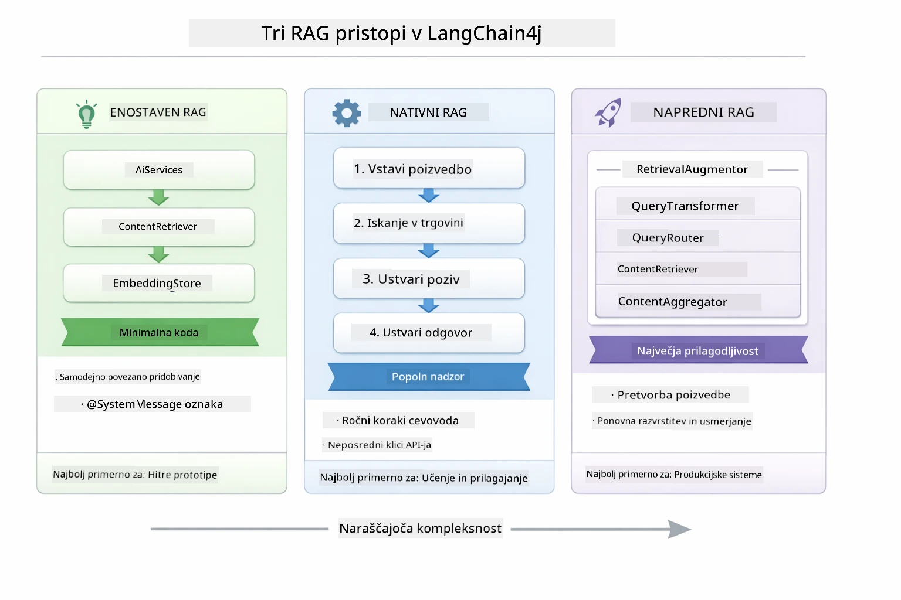

*Ta shema primerja tri RAG pristope v LangChain4j — Easy, Native in Advanced — ter prikazuje njihove ključne komponente in kdaj jih uporabiti.*

| Pristop | Kaj počne | Kompromis |
|---|---|---|
| **Easy RAG** | Vse samodejno poveže preko `AiServices` in `ContentRetriever`. Obeležite vmesnik, dodate pridobivalca, LangChain4j pa za vas upravlja vdelave, iskanje in sestavljanje poziva. | Minimalna koda, a ne vidite, kaj se dogaja v vsakem koraku. |
| **Native RAG** | Sami pokličete model za vdelave, iščete v shrambi, sestavite poziv in generirate odgovor — vse korake izrecno. | Več kode, a vsak korak je viden in spreminjiv. |
| **Advanced RAG** | Uporablja ogrodje `RetrievalAugmentor` z vtičnimi transformatorji poizvedb, usmerjevalniki, ponovnim razvrščanjem in vstavljalniki vsebine za produkcijske cevovode. | Največja fleksibilnost, a precej več kompleksnosti. |

**Ta vodič uporablja Native pristop.** Vsak korak RAG poteka — vdelava poizvedbe, iskanje v vektorski shrambi, združevanje konteksta in generiranje odgovora — je jasno zapisan v [`RagService.java`](../../../03-rag/src/main/java/com/example/langchain4j/rag/service/RagService.java). To je namerno: kot učni vir je pomembnejše, da vidite in razumete vsak korak, kot da je koda čim bolj zgoščena. Ko boste obvladali, kako se deli povezujejo, se lahko premaknete na Easy RAG za hitre prototipe ali Advanced RAG za produkcijske sisteme.

> **💡 Ste že videli Easy RAG v praksi?** Modul [Hitri začetek](../00-quick-start/README.md) vključuje primer vprašanj in odgovorov na dokument ([`SimpleReaderDemo.java`](../../../00-quick-start/src/main/java/com/example/langchain4j/quickstart/SimpleReaderDemo.java)) z uporabo Easy RAG pristopa — LangChain4j samodejno upravlja vdelave, iskanje in sestavljanje poziva. Ta modul naredi naslednji korak tako, da odpre ta cevovod, da vidite in kontrolirate vsak korak.

Spodnja shema prikazuje Easy RAG cevovod iz primera Hitrega začetka. Opazite, kako `AiServices` in `EmbeddingStoreContentRetriever` skrijeta vso kompleksnost — naložite dokument, dodate pridobivalca in prejmete odgovore. Native pristop tega modula razkrije vse te skrite korake:

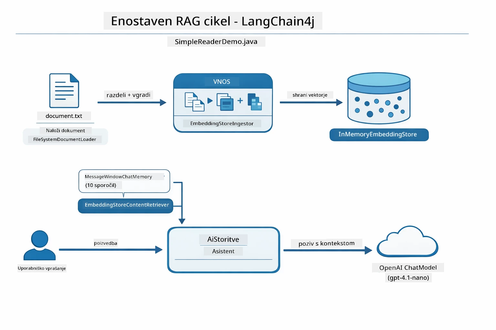

*Ta shema prikazuje Easy RAG cevovod iz `SimpleReaderDemo.java`. Primerjajte z Native pristopom, uporabljenim v tem modulu: Easy RAG skriva vdelave, iskanje in sestavljanje poziva za `AiServices` in `ContentRetriever` — naložite dokument, dodate pridobivalca, in dobite odgovore. Native pristop tega modula odpre ta cevovod, da sami pokličete posamezne faze (vdelava, iskanje, sestavljanje konteksta, generiranje), kar vam omogoča popoln vpogled in nadzor.*

## Kako deluje

RAG cevovod v tem modulu je razdeljen na štiri faze, ki se izvajajo zaporedno vsakič, ko uporabnik postavi vprašanje. Najprej se naloženi dokument **razčleni in razdeli na dele** v obvladljive koščke. Ti deli se nato pretvorijo v **vektorske vdelave** in shranijo za matematično primerjavo. Ko pride poizvedba, sistem opravi **semantično iskanje**, da najde najbolj relevantne dele, in jih nato kot kontekst posreduje LLM-ju za **generiranje odgovora**. Spodnji razdelki podrobno razložijo vsak korak z dejansko kodo in diagrami. Poglejmo najprej prvi korak.

### Obdelava dokumentov

[DocumentService.java](../../../03-rag/src/main/java/com/example/langchain4j/rag/service/DocumentService.java)

Ko naložite dokument, ga sistem prebere (PDF ali navaden tekst), mu doda metapodatke, kot je ime datoteke, in ga razdeli na dele — manjše koščke, ki udobno ustrezajo modelovemu kontekstnemu oknu. Ti deli se nekoliko prekrivajo, da ne izgubite konteksta na mejah.

```java
// Analizirajte naloženo datoteko in jo ovijte v LangChain4j dokument
Document document = Document.from(content, metadata);

// Razdelite na dele po 300 žetonov z 30-žetonskim prekrivanjem
DocumentSplitter splitter = DocumentSplitters
    .recursive(300, 30);

List<TextSegment> segments = splitter.split(document);
```
  
Spodnja shema prikazuje to na vizualni način. Opazite, kako vsak del deli nekaj tokenov s sosednjimi — 30-tokensko prekrivanje zagotavlja, da noben pomemben kontekst ne pade med reže:

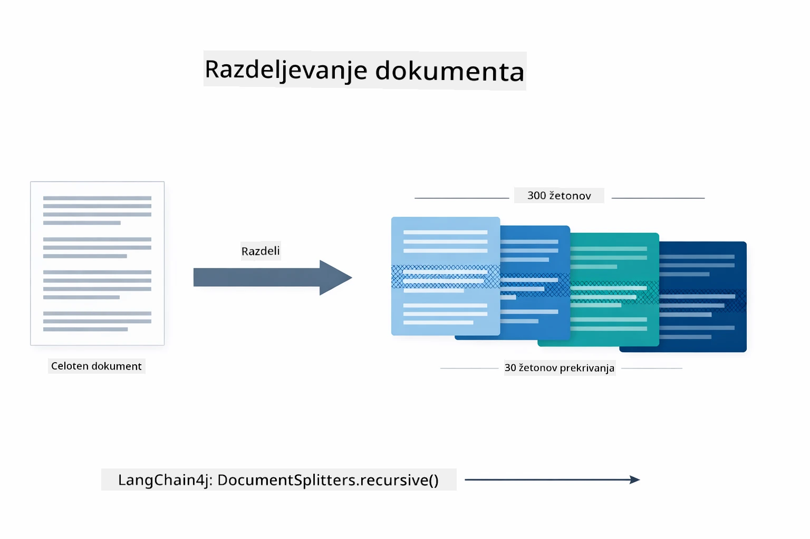

*Ta shema prikazuje, kako je dokument razdeljen na 300-token dele s 30-token prekrivanjem, kar ohranja kontekst na mejah delov.*

> **🤖 Poskusite z [GitHub Copilot](https://github.com/features/copilot) Chat:** Odprite [`DocumentService.java`](../../../03-rag/src/main/java/com/example/langchain4j/rag/service/DocumentService.java) in vprašajte:  
> - "Kako LangChain4j razdeli dokumente na dele in zakaj je pomembno prekrivanje?"  
> - "Kakšna je optimalna velikost delov za različne vrste dokumentov in zakaj?"  
> - "Kako obravnavati dokumente v več jezikih ali s posebno obliko?"

### Ustvarjanje vdelav

[LangChainRagConfig.java](../../../03-rag/src/main/java/com/example/langchain4j/rag/config/LangChainRagConfig.java)

Vsak del je pretvorjen v številčno predstavo, imenovano vdelava — v bistvu pretvornik pomena v številke. Model za vdelave ni "pameten" kot klepetalni model; ne more slediti navodilom, sklepati ali odgovarjati na vprašanja. Lahko pa tekst preslika v matematični prostor, kjer so podobni pomeni blizu drug drugemu — "avto" blizu "vozilo", "politika vračil" blizu "vrnite denar". Klepetalni model si predstavljajte kot osebo, s katero govorite; model za vdelave je izjemno dober sistem arhiviranja.

Spodnja shema vizualizira ta koncept — vstopi tekst, izstopijo številčni vektorji, podobni pomeni imajo bližnje vektorje:

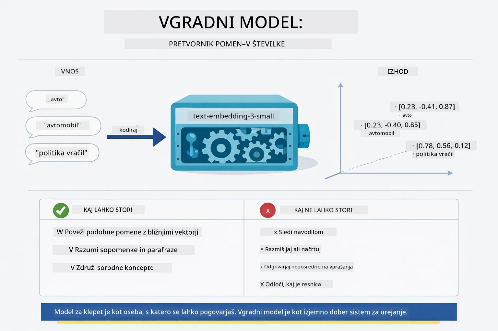

*Ta shema prikazuje, kako model za vdelave pretvori tekst v številčne vektorje, pri čemer so podobni pomeni — kot "avto" in "vozilo" — umeščeni blizu v vektorskem prostoru.*

```java
@Bean
public EmbeddingModel embeddingModel() {
    return OpenAiOfficialEmbeddingModel.builder()
        .baseUrl(azureOpenAiEndpoint)
        .apiKey(azureOpenAiKey)
        .modelName(azureEmbeddingDeploymentName)
        .build();
}

EmbeddingStore<TextSegment> embeddingStore = 
    new InMemoryEmbeddingStore<>();
```
  
Spodnja razredna shema prikazuje dva ločena poteka v RAG cevovodu in LangChain4j razrede, ki jih implementirajo. **Tok vnosa** (izvaja se ob nalaganju) razdeli dokument, vdeluje dele in jih shrani preko `.addAll()`. **Tok poizvedbe** (izvaja se vsakič, ko uporabnik vpraša) vdeluje vprašanje, išče v shrambi preko `.search()`, in posreduje najden kontekst klepetalnemu modelu. Oba toka se združita na skupnem vmesniku `EmbeddingStore<TextSegment>`:

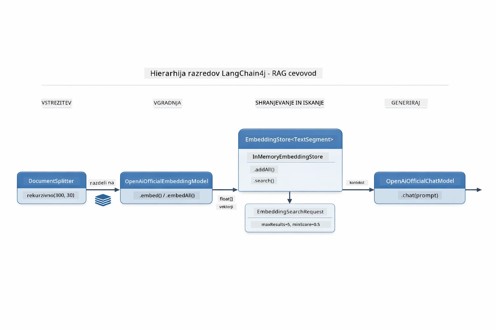

*Ta shema prikazuje dva poteka v RAG cevovodu — vnos in poizvedbo — ter kako sta povezana skozi skupni EmbeddingStore.*

Ko so vdelave shranjene, se podobne vsebine naravno združujejo v vektorskem prostoru. Spodnja vizualizacija kaže, kako se dokumenti o sorodnih temah združujejo v bližnje točke, kar omogoča semantično iskanje:


*Ta vizualizacija prikazuje, kako sorodni dokumenti tvorijo skupine v tridimenzionalnem vektorskem prostoru, s področji kot tehnični dokumenti, poslovna pravila in pogosta vprašanja.*

Ko uporabnik išče, sistem sledi štirim korakom: enkrat vdelava dokumentov, vdelava poizvedbe vsakič ob iskanju, primerjava vektorja poizvedbe z vsemi shranjenimi vektorji s pomočjo kosinusne podobnosti in vrnitev najboljših top-K rezultatov. Spodnja shema vodi skozi vsak korak in LangChain4j razrede, ki se pri tem uporabljajo:

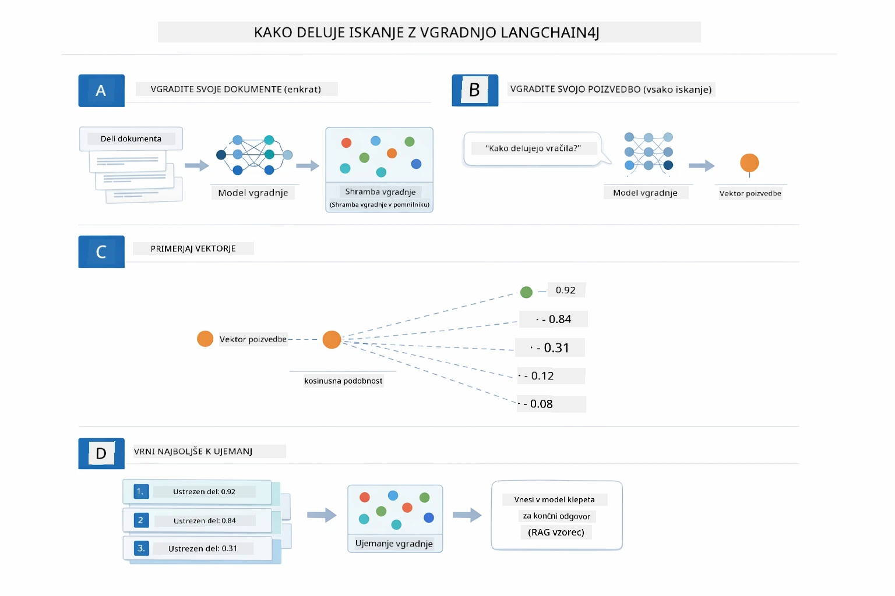

*Ta shema prikazuje štiristopenjski postopek iskanja po vdelavah: vdelava dokumentov, vdelava poizvedbe, primerjava vektorjev s kosinusno podobnostjo in vrnitev najboljših rezultatov.*

### Semantično iskanje

[RagService.java](../../../03-rag/src/main/java/com/example/langchain4j/rag/service/RagService.java)

Ko postavite vprašanje, vaše vprašanje postane tudi vdelava. Sistem primerja vdelavo vašega vprašanja z vdelavami vseh dokumentnih delov. Najde dele z najbolj podobnimi pomeni — ne le ujemanje ključnih besed, temveč dejansko semantično podobnost.

```java
Embedding queryEmbedding = embeddingModel.embed(question).content();

EmbeddingSearchRequest searchRequest = EmbeddingSearchRequest.builder()
    .queryEmbedding(queryEmbedding)
    .maxResults(5)
    .minScore(0.5)
    .build();

EmbeddingSearchResult<TextSegment> searchResult = embeddingStore.search(searchRequest);
List<EmbeddingMatch<TextSegment>> matches = searchResult.matches();

for (EmbeddingMatch<TextSegment> match : matches) {
    String relevantText = match.embedded().text();
    double score = match.score();
}
```
  
Spodnja shema primerja semantično iskanje s tradicionalnim iskanjem po ključnih besedah. Iskanje po ključni besedi "vozilo" zamudi del o "avtih in tovornjakih", medtem ko semantično iskanje razume, da to pomeni enako in ga vrne kot visoko ocenjen rezultat:

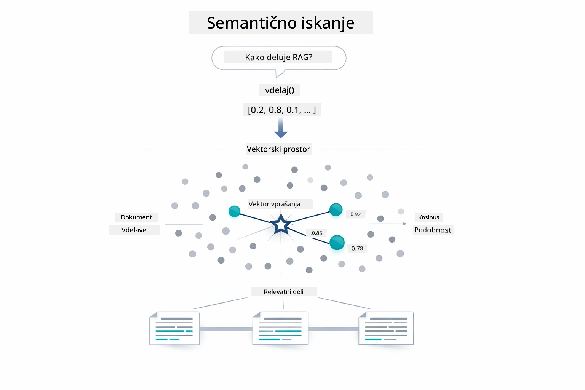

*Ta shema primerja iskanje na podlagi ključnih besed z semantičnim iskanjem, ki najde konceptualno sorodno vsebino tudi, če se natančne ključne besede razlikujejo.*
Pod pokrovom se podobnost meri z uporabo kosinusne podobnosti — kar v bistvu pomeni vprašanje "ali ti dve puščici kažeta v isto smer?" Dva kosa lahko uporabita popolnoma različne besede, vendar če pomenita isto stvar, njihovi vektorji kažejo v isto smer in dosežejo rezultat blizu 1.0:

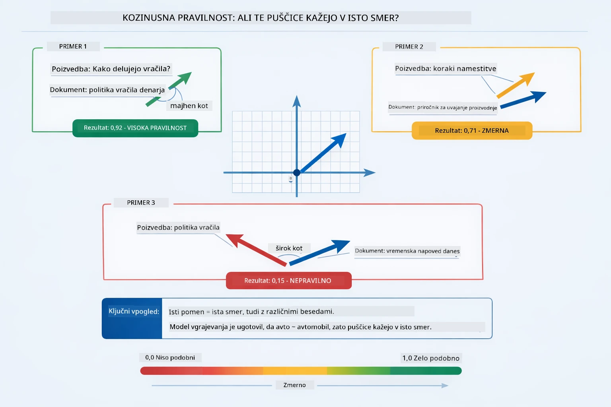

*Ta diagram prikazuje kosinusno podobnost kot kot med vektorji vdelave — bolj poravnani vektorji dosegajo rezultat bližje 1.0, kar kaže na višjo semantično podobnost.*

> **🤖 Preizkusi z [GitHub Copilot](https://github.com/features/copilot) Chat:** Odpri [`RagService.java`](../../../03-rag/src/main/java/com/example/langchain4j/rag/service/RagService.java) in vprašaj:
> - "Kako deluje iskanje podobnosti z vdelavami in kaj določa rezultat?"
> - "Katero mejo podobnosti naj uporabim in kako to vpliva na rezultate?"
> - "Kako ravnam v primerih, ko niso najdeni relevantni dokumenti?"

### Generiranje Odgovora

[RagService.java](../../../03-rag/src/main/java/com/example/langchain4j/rag/service/RagService.java)

Najbolj relevantni kosi so sestavljeni v strukturirano poziv, ki vključuje eksplicitna navodila, pridobljen kontekst in vprašanje uporabnika. Model prebere te specifične koščke in odgovori na podlagi teh informacij — lahko uporabi le to, kar je pred njim, kar preprečuje halucinacije.

```java
String context = matches.stream()
    .map(match -> match.embedded().text())
    .collect(Collectors.joining("\n\n"));

String prompt = String.format("""
    Answer the question based on the following context.
    If the answer cannot be found in the context, say so.

    Context:
    %s

    Question: %s

    Answer:""", context, request.question());

String answer = chatModel.chat(prompt);
```

Diagram spodaj prikazuje ta postopek sestavljanja v akciji — najboljše ocenjeni kosi iz koraka iskanja so vstavljeni v predlogo poziva, `OpenAiOfficialChatModel` pa ustvari utemeljen odgovor:

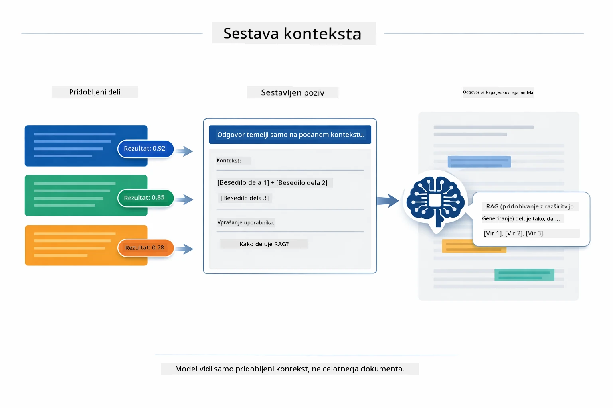

*Ta diagram prikazuje, kako so najboljši ocenjeni kosi sestavljeni v strukturirano poziv, kar omogoča modelu, da iz vaših podatkov ustvari utemeljen odgovor.*

## Zaženi Aplikacijo

**Preveri namestitev:**

Prepričaj se, da datoteka `.env` obstaja v korenskem imeniku z Azure poverilnicami (ustvarjeno med Modulom 01). Zaženi to iz imenika modula (`03-rag/`):

**Bash:**
```bash
cat ../.env  # Prikazati mora AZURE_OPENAI_ENDPOINT, API_KEY, DEPLOYMENT
```

**PowerShell:**
```powershell
Get-Content ..\.env  # Mora prikazati AZURE_OPENAI_ENDPOINT, API_KEY, DEPLOYMENT
```

**Zaženi aplikacijo:**

> **Opomba:** Če ste že zagnali vse aplikacije z `./start-all.sh` iz korenskega imenika (kot je opisano v Modulu 01), je ta modul že zagnan na vratih 8081. Spodnje ukaze za zagon lahko preskočite in pojdite neposredno na http://localhost:8081.

**Možnost 1: Uporaba Spring Boot nadzorne plošče (Priporočeno za uporabnike VS Code)**

Dev container vključuje razširitev Spring Boot Dashboard, ki ponuja vizualni vmesnik za upravljanje vseh Spring Boot aplikacij. Najdete ga na vrstici aktivnosti na levi strani VS Code (poiščite ikono Spring Boot).

Iz Spring Boot nadzorne plošče lahko:
- Vidite vse razpoložljive Spring Boot aplikacije v delovnem prostoru
- Enostavno zaženete/ustavite aplikacije z enim klikom
- V realnem času spremljate dnevnike aplikacij
- Nadzorujete stanje aplikacije

Preprosto kliknite gumb za predvajanje poleg "rag" za zagon tega modula ali zaženite vse module naenkrat.


*Ta posnetek zaslona prikazuje Spring Boot Dashboard v VS Code, kjer lahko vizualno zaženete, ustavite in spremljate aplikacije.*

**Možnost 2: Uporaba shell skript**

Zaženi vse spletne aplikacije (moduli 01-04):

**Bash:**
```bash
cd ..  # Iz korenskega imenika
./start-all.sh
```

**PowerShell:**
```powershell
cd ..  # Iz korenske mape
.\start-all.ps1
```

Ali zaženi samo ta modul:

**Bash:**
```bash
cd 03-rag
./start.sh
```

**PowerShell:**
```powershell
cd 03-rag
.\start.ps1
```

Oba skripta samodejno naložita spremenljivke okolja iz korenske `.env` datoteke in bodo sestavila JAR-je, če ti še ne obstajajo.

> **Opomba:** Če želite najprej ročno sestaviti vse module pred zagonom:
>
> **Bash:**
> ```bash
> cd ..  # Go to root directory
> mvn clean package -DskipTests
> ```
>
> **PowerShell:**
> ```powershell
> cd ..  # Go to root directory
> mvn clean package -DskipTests
> ```

Odprite http://localhost:8081 v vašem brskalniku.

**Za zaustavitev:**

**Bash:**
```bash
./stop.sh  # Samo ta modul
# Ali
cd .. && ./stop-all.sh  # Vsi moduli
```

**PowerShell:**
```powershell
.\stop.ps1  # Samo ta modul
# Ali
cd ..; .\stop-all.ps1  # Vsi moduli
```

## Uporaba Aplikacije

Aplikacija nudi spletni vmesnik za nalaganje dokumentov in postavljanje vprašanj.

<a href="images/rag-homepage.png"></a>

*Ta posnetek zaslona prikazuje vmesnik RAG aplikacije, kjer nalagate dokumente in postavljate vprašanja.*

### Naloži Dokument

Začni z nalaganjem dokumenta – za testiranje so najbolj primerni TXT datoteki. V tem imeniku je na voljo `sample-document.txt`, ki vsebuje informacije o funkcijah LangChain4j, implementaciji RAG in najboljših praksah – idealno za preizkus sistema.

Sistem obdela vaš dokument, ga razdeli na koščke in ustvarja vdelave za vsak košček. To se zgodi samodejno ob nalaganju.

### Postavljaj Vprašanja

Zdaj postavite specifična vprašanja o vsebini dokumenta. Poskusite s kakšno dejansko trditvijo, ki je jasno navedena v dokumentu. Sistem poišče relevantne koščke, jih vključi v poziv in ustvari odgovor.

### Preveri Vire

Opazili boste, da vsak odgovor vključuje reference virov z ocenami podobnosti. Te ocene (od 0 do 1) kažejo, kako relevanten je bil vsak košček za vaše vprašanje. Višje ocene pomenijo boljše ujemanje. To vam omogoča preverjanje odgovora glede na izvirni material.

<a href="images/rag-query-results.png"></a>

*Ta posnetek zaslona prikazuje rezultate poizvedbe z ustvarjenim odgovorom, referencami virov in ocenami relevantnosti za vsak pridobljeni košček.*

### Eksperimentiraj z vprašanji

Poskusi različne vrste vprašanj:
- Specifična dejstva: "Kakšna je glavna tema?"
- Primerjave: "Kakšna je razlika med X in Y?"
- Povzetki: "Povzemi ključne točke o Z"

Opazuj, kako se ocene relevantnosti spreminjajo glede na to, kako dobro se tvoje vprašanje ujema z vsebino dokumenta.

## Ključni Koncepti

### Strategija razdelitve (Chunking)

Dokumenti so razdeljeni na koščke po 300 tokenov z 30 tokeni prekrivanja. Ta uravnoteženost zagotavlja, da ima vsak kos dovolj konteksta, da je smiseln, hkrati pa je dovolj majhen, da je lahko vključen več koščkov v poziv.

### Ocene podobnosti

Vsak pridobljeni kos ima oceno podobnosti med 0 in 1, ki kaže, kako tesno se ujema z vprašanjem uporabnika. Diagram spodaj vizualizira razpone ocen in način, kako jih sistem uporablja za filtriranje rezultatov:

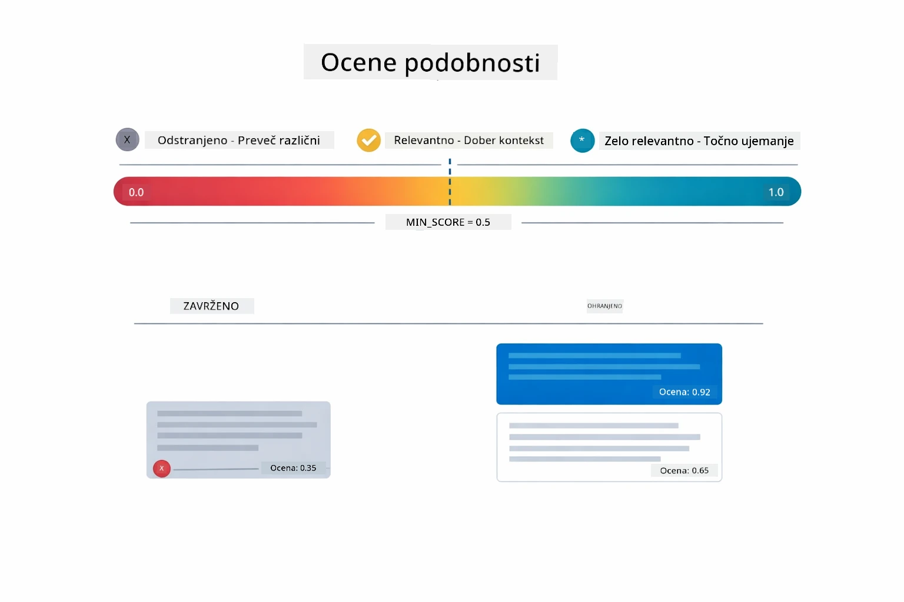

*Ta diagram prikazuje razpone ocen od 0 do 1, z minimalno mejo 0.5, ki filtrira irelevantne koščke.*

Ocene se gibljejo od 0 do 1:
- 0.7-1.0: Zelo relevantno, točno ujemanje
- 0.5-0.7: Relevantno, dober kontekst
- Pod 0.5: Filtrirano, preveč različno

Sistem pridobi le koščke nad minimalno mejo za zagotavljanje kakovosti.

Vdelave delujejo dobro, kadar se pomen jasno združuje, a imajo tudi slepe točke. Diagram spodaj prikazuje pogoste načine neuspeha — preveliki kosi ustvarjajo nejasne vektorje, premajhni kosi nimajo konteksta, dvoumni izrazi kažejo na več grozdov, in natančna iskanja (ID-ji, številke delov) sploh ne delujejo z vdelavami:

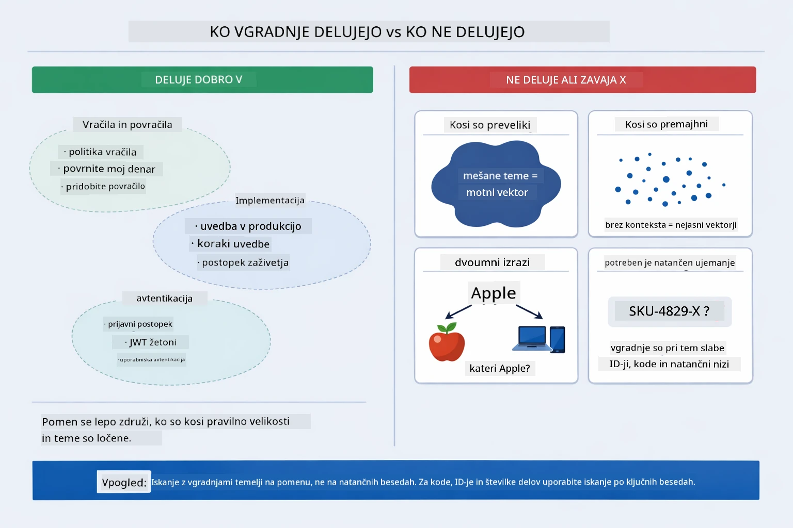

*Ta diagram prikazuje pogoste načine neuspeha vdelav: preveliki kosi, premajhni kosi, dvoumni izrazi, in natančna iskanja kot ID-ji.*

### Shranjevanje v pomnilniku

Ta modul uporablja shranjevanje v pomnilniku za preprostost. Ko ponovno zaženete aplikacijo, so naloženi dokumenti izgubljeni. Produkcijski sistemi uporabljajo trajne vektorske baze podatkov, kot so Qdrant ali Azure AI Search.

### Upravljanje kontekstnega okna

Vsak model ima največjo velikost kontekstnega okna. Ne morete vključiti vseh kosov iz velikega dokumenta. Sistem pridobi prvih N najbolj relevantnih kosov (privzeto 5), da ostane znotraj omejitev in hkrati zagotovi dovolj konteksta za točne odgovore.

## Kdaj je RAG pomemben

RAG ni vedno prava izbira. Spodnji vodnik za odločanje vam pomaga ugotoviti, kdaj RAG prinese dodano vrednost in kdaj so preprostejši pristopi — kot vključevanje vsebine neposredno v poziv ali zanašanje na vgrajeno znanje modela — zadostni:

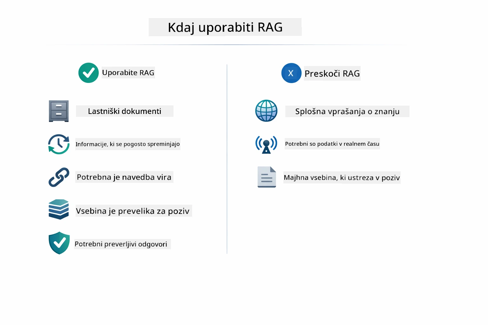

*Ta diagram prikazuje vodnik za odločanje o tem, kdaj RAG prinaša dodano vrednost in kdaj so zadostni preprostejši pristopi.*

## Naslednji Koraki

**Naslednji modul:** [04-tools - AI Agents with Tools](../04-tools/README.md)

---

**Navigacija:** [← Prejšnji: Modul 02 - Prompt Engineering](../02-prompt-engineering/README.md) | [Nazaj na glavno](../README.md) | [Naslednji: Modul 04 - Tools →](../04-tools/README.md)

---

<!-- CO-OP TRANSLATOR DISCLAIMER START -->
**Opozorilo**:
Ta dokument je bil preveden z uporabo storitve za prevajanje z umetno inteligenco [Co-op Translator](https://github.com/Azure/co-op-translator). Čeprav si prizadevamo za natančnost, vas prosimo, da upoštevate, da avtomatizirani prevodi lahko vsebujejo napake ali netočnosti. Izvirni dokument v njegovem izvor nem jeziku velja za avtoritativni vir. Za pomembne informacije priporočamo strokovni človeški prevod. Ne odgovarjamo za morebitne nesporazume ali napačne razlage, ki izhajajo iz uporabe tega prevoda.
<!-- CO-OP TRANSLATOR DISCLAIMER END -->