# Modul 04: AI agenti z orodji

## Vsebina

- [Kaj se boste naučili](../../../04-tools)
- [Predpogoji](../../../04-tools)
- [Razumevanje AI agentov z orodji](../../../04-tools)
- [Kako deluje klic orodij](../../../04-tools)
  - [Definicije orodij](../../../04-tools)
  - [Sprejemanje odločitev](../../../04-tools)
  - [Izvedba](../../../04-tools)
  - [Generiranje odziva](../../../04-tools)
  - [Arhitektura: Spring Boot samodejno povezovanje](../../../04-tools)
- [Povezovanje orodij](../../../04-tools)
- [Zagon aplikacije](../../../04-tools)
- [Uporaba aplikacije](../../../04-tools)
  - [Preizkusi preprosto uporabo orodja](../../../04-tools)
  - [Preizkusi povezovanje orodij](../../../04-tools)
  - [Oglej si potek pogovora](../../../04-tools)
  - [Eksperimentiraj z različnimi zahtevami](../../../04-tools)
- [Ključni koncepti](../../../04-tools)
  - [Vzorec ReAct (razmišljanje in ukrepanje)](../../../04-tools)
  - [Pomen opisov orodij](../../../04-tools)
  - [Upravljanje sej](../../../04-tools)
  - [Obdelava napak](../../../04-tools)
- [Razpoložljiva orodja](../../../04-tools)
- [Kdaj uporabljati agente na osnovi orodij](../../../04-tools)
- [Orodja proti RAG](../../../04-tools)
- [Naslednji koraki](../../../04-tools)

## Kaj se boste naučili

Do zdaj ste se naučili, kako voditi pogovore z AI, učinkovito strukturirati pozive in usmerjati odgovore v vaše dokumente. A še vedno obstaja temeljna omejitev: jezikovni modeli lahko ustvarjajo le besedilo. Ne morejo preveriti vremenske napovedi, izvajati izračunov, poizvedovati po podatkovnih bazah ali se povezovati z zunanjimi sistemi.

Orodja to spremenijo. Z zagotavljanjem dostopa do funkcij, ki jih lahko model pokliče, ga preoblikujete iz generatorja besedila v agenta, ki lahko izvaja dejanja. Model odloča, kdaj potrebuje orodje, katero orodje uporabiti in katere parametre posredovati. Vaša koda izvede funkcijo in vrne rezultat. Model ta rezultat vključi v svoj odgovor.

## Predpogoji

- Zaključen [Modul 01 - Uvod](../01-introduction/README.md) (nameščeni Azure OpenAI viri)
- Priporočeni so zaključeni prejšnji moduli (ta modul se sklicuje na [RAG koncepte iz Modula 03](../03-rag/README.md) v primerjavi Orodja proti RAG)
- `.env` datoteka v korenski mapi z Azure poverilnicami (ustvarjena z `azd up` v Modulu 01)

> **Opomba:** Če modula 01 niste zaključili, najprej upoštevajte navodila za namestitev tam.

## Razumevanje AI agentov z orodji

> **📝 Opomba:** Izraz "agenti" v tem modulu se nanaša na AI pomočnike, ki so nadgrajeni z možnostmi klica orodij. To se razlikuje od vzorcev **Agentic AI** (avtonomni agenti z načrtovanjem, spominom in večstopenjskim razmišljanjem), ki jih bomo obravnavali v [Modulu 05: MCP](../05-mcp/README.md).

Brez orodij lahko jezikovni model ustvarja le besedilo na podlagi svojega učnega gradiva. Vprašajte ga za trenutno vreme in mora ugibati. Če mu zagotovite orodja, lahko pokliče vremenski API, izvede izračune ali poizve za podatke v bazi — nato te resnične rezultate vključi v svoj odgovor.

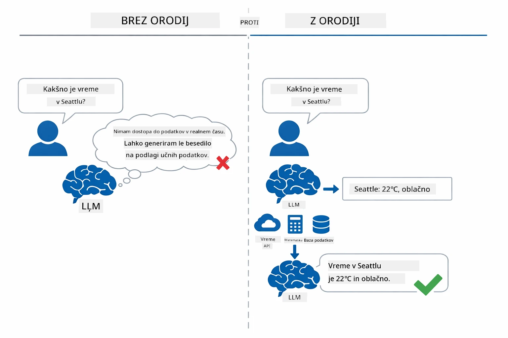

*Brez orodij model le ugiba — z orodji lahko kliče API-je, izvaja izračune in vrača podatke v realnem času.*

AI agent z orodji sledi vzorcu **Razmišljanje in Ukrepanje (ReAct)**. Model ne samo odgovarja — razmišlja, kaj potrebuje, ukrepa z uporabo orodja, opazuje rezultat in nato odloča, ali bo še naprej ukrepal ali podal končni odgovor:

1. **Razmišljanje** — agent analizira uporabnikovo vprašanje in ugotovi, katere informacije potrebuje
2. **Ukrepanje** — agent izbere pravo orodje, ustvari pravilne parametre in ga pokliče
3. **Opazovanje** — agent prejme izhod orodja in oceni rezultat
4. **Ponavljanje ali odgovor** — če je potrebnih več podatkov, agent ponovi zanko; sicer sestavi odgovor v naravnem jeziku

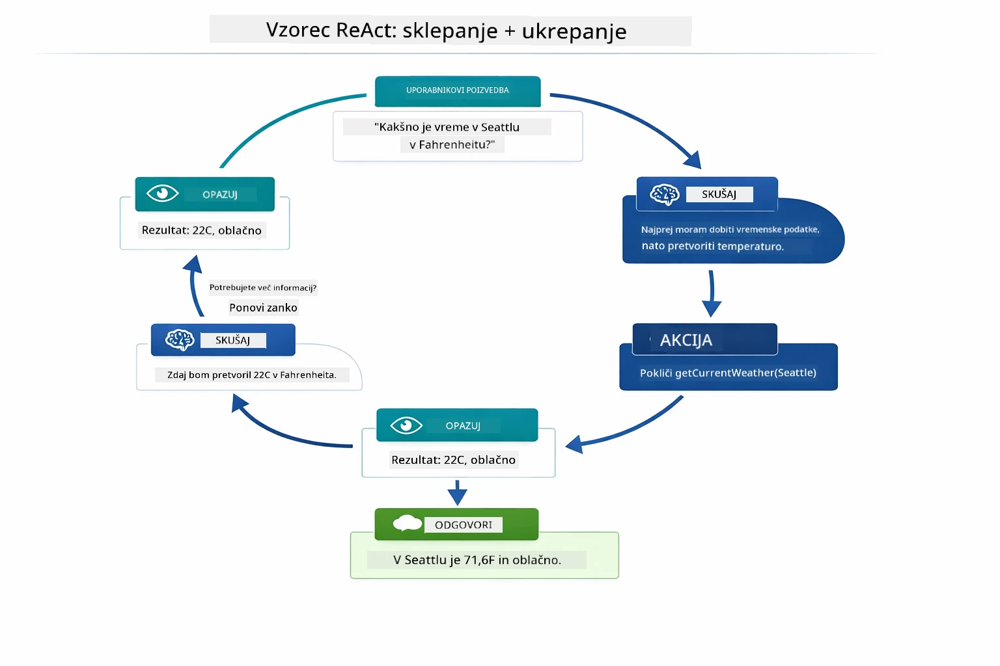

*Cikel ReAct — agent razmišlja, kaj storiti, ukrepa z uporabo orodja, opazuje rezultat in ponavlja, dokler ne poda končnega odgovora.*

To se zgodi samodejno. Definirate orodja in njihove opise. Model sam sprejema odločitve, kdaj in kako jih uporabiti.

## Kako deluje klic orodij

### Definicije orodij

[WeatherTool.java](../../../04-tools/src/main/java/com/example/langchain4j/agents/tools/WeatherTool.java) | [TemperatureTool.java](../../../04-tools/src/main/java/com/example/langchain4j/agents/tools/TemperatureTool.java)

Definirate funkcije z jasnimi opisi in specifikacijami parametrov. Model vidi te opise v sistemskem pozivu in razume, kaj vsako orodje počne.

```java
@Component
public class WeatherTool {
    
    @Tool("Get the current weather for a location")
    public String getCurrentWeather(@P("Location name") String location) {
        // Vaša logika iskanja vremena
        return "Weather in " + location + ": 22°C, cloudy";
    }
}

@AiService
public interface Assistant {
    String chat(@MemoryId String sessionId, @UserMessage String message);
}

// Pomočnik je samodejno povezan s Spring Boot z:
// - ChatModel bean
// - Vse metode @Tool iz razredov @Component
// - ChatMemoryProvider za upravljanje sej
```

Shema spodaj razčleni vsako anotacijo in pokaže, kako vsak element pomaga AI razumeti, kdaj klicati orodje in katere argumente posredovati:

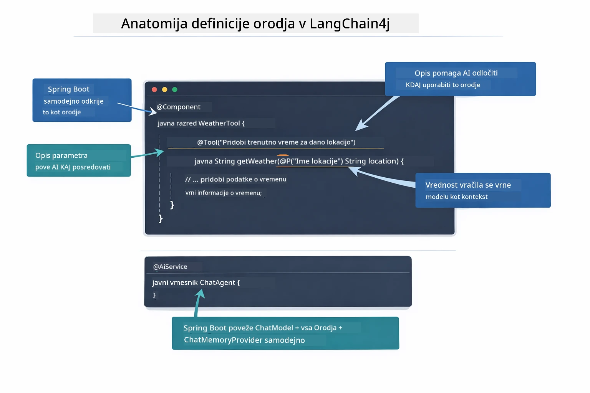

*Anatomija definicije orodja — @Tool pove AI, kdaj ga uporabiti, @P opiše vsak parameter, @AiService pa ob zagonu poveže vse skupaj.*

> **🤖 Preizkusi z [GitHub Copilot](https://github.com/features/copilot) Chat:** Odpri [`WeatherTool.java`](../../../04-tools/src/main/java/com/example/langchain4j/agents/tools/WeatherTool.java) in vprašaj:
> - "Kako bi integriral pravi vremenski API, kot je OpenWeatherMap, namesto ponarejenih podatkov?"
> - "Kaj naredi dober opis orodja, ki AI pomaga uporabljati ga pravilno?"
> - "Kako obravnavam napake API-ja in omejitve pogostosti v implementacijah orodij?"

### Sprejemanje odločitev

Ko uporabnik vpraša "Kakšno je vreme v Seattlu?", model ne izbere orodja po naključju. Primerja uporabnikov cilj z vsakim opisom orodja, ki mu je na voljo, oceni relevantnost in izbere najbolj ustrezno orodje. Nato generira strukturiran klic funkcije z ustreznimi parametri — v tem primeru nastavi `location` na `"Seattle"`.

Če nobeno orodje ne ustreza uporabnikovi zahtevi, model odgovori na podlagi lastnega znanja. Če ustreza več orodij, izbere najbolj specifično.

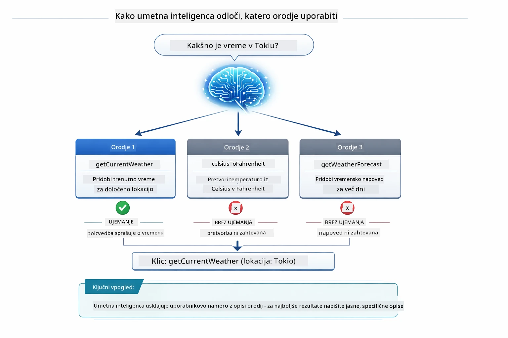

*Model ovrednoti vsako razpoložljivo orodje glede na uporabnikov namen in izbere najboljši ujem; zato je pomembno pisati jasne in specifične opise orodij.*

### Izvedba

[AgentService.java](../../../04-tools/src/main/java/com/example/langchain4j/agents/service/AgentService.java)

Spring Boot samodejno povezuje deklarativni vmesnik `@AiService` z vsemi registriranimi orodji, LangChain4j pa samodejno izvaja klice orodij. V ozadju celoten klic orodja poteka skozi šest faz — od uporabnikovega vprašanja v naravnem jeziku vse do odgovora v naravnem jeziku:

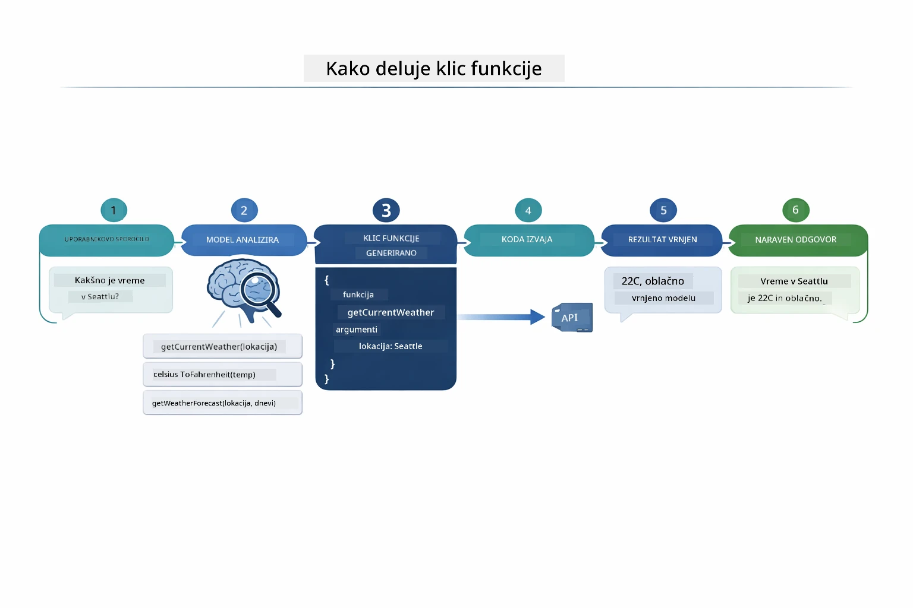

*Celoten potek — uporabnik postavi vprašanje, model izbere orodje, LangChain4j ga izvede, model pa rezultat vključi v naraven odgovor.*

Če ste zagnali [ToolIntegrationDemo](../../../00-quick-start/src/main/java/com/example/langchain4j/quickstart/ToolIntegrationDemo.java) v Modulu 00, ste ta vzorec že videli v akciji — orodje `Calculator` je bilo poklicano na enak način. Zaporedni diagram spodaj točno pokaže, kaj se je dogajalo v ozadju med tem demonstracijskim primerom:

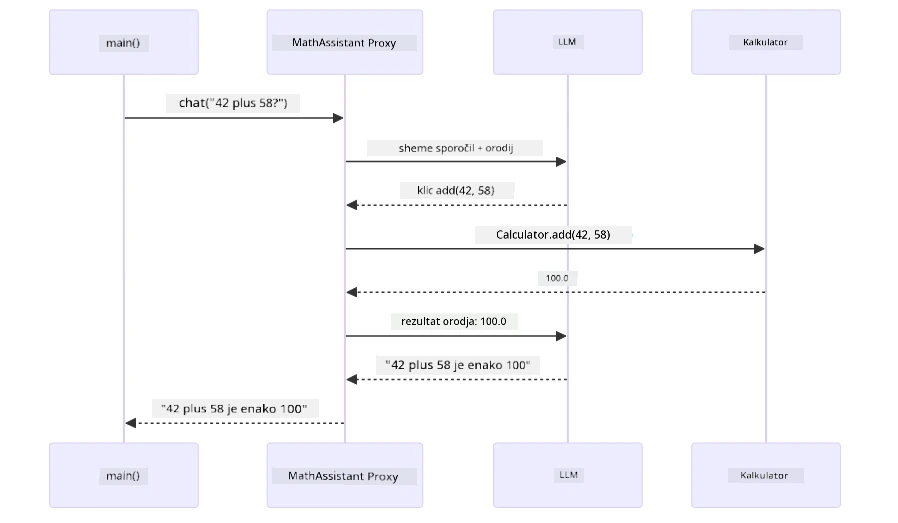

*Cikel klica orodja iz demonstracije Hitrega začetka — `AiServices` pošlje vaše sporočilo in sheme orodij LLM-ju, LLM odgovori s klicem funkcije, npr. `add(42, 58)`, LangChain4j lokalno izvede metodo `Calculator`, rezultat pa vrne nazaj za končni odgovor.*

> **🤖 Preizkusi z [GitHub Copilot](https://github.com/features/copilot) Chat:** Odpri [`AgentService.java`](../../../04-tools/src/main/java/com/example/langchain4j/agents/service/AgentService.java) in vprašaj:
> - "Kako deluje vzorec ReAct in zakaj je učinkovit za AI agente?"
> - "Kako agent odloči, katero orodje uporabiti in v kakšnem vrstnem redu?"
> - "Kaj se zgodi, če izvedba orodja ne uspe - kako naj robustno obravnavam napake?"

### Generiranje odziva

Model prejme vremenske podatke in jih oblikuje v naravno jezikovni odgovor za uporabnika.

### Arhitektura: Spring Boot samodejno povezovanje

Ta modul uporablja LangChain4j integracijo s Spring Boot z deklarativnimi vmesniki `@AiService`. Ob zagonu Spring Boot odkrije vsak `@Component`, ki vsebuje metode `@Tool`, vaš `ChatModel` bean in `ChatMemoryProvider` — nato jih vse poveže v en sam vmesnik `Assistant` brez kakršnegakoli dodatnega kodiranja.

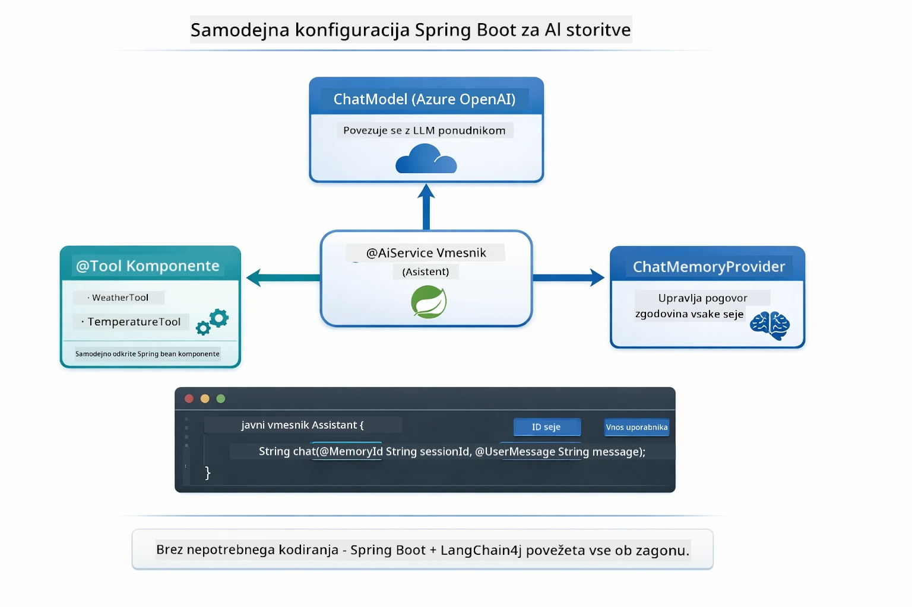

*Vmesnik @AiService povezuje ChatModel, komponente orodij in ponudnika pomnilnika — Spring Boot samodejno skrbi za povezovanje.*

Celoten življenjski cikel zahteve je prikazan kot zaporedni diagram — od HTTP zahteve preko kontrolerja, storitve in samodejno povezanega proxy-ja do izvedbe orodja in nazaj:

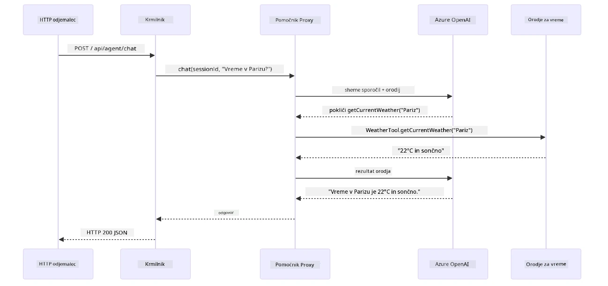

*Popoln življenjski cikel zahteve Spring Boot — HTTP zahteva teče preko kontrolerja in storitve do samodejno povezanega proxy-ja Assistant, ki samodejno orkestrira klice LLM in orodij.*

Ključne prednosti tega pristopa:

- **Spring Boot samodejno povezovanje** — ChatModel in orodja samodejno vbrizgani
- **Vzorec @MemoryId** — samodejno upravljanje pomnilnika na osnovi seje
- **Enojna instanca** — Assistant ustvarjen enkrat in ponovno uporabljen za boljšo zmogljivost
- **Varna izvedba po tipu** — klici Java metod neposredno s pretvorbo tipov
- **Orkestracija več korakov** — samodejno upravlja povezovanje orodij
- **Brez nepotrebne kode** — ni ročnih klicev `AiServices.builder()` ali HashMap pomnilnika

Alternativni pristopi (ročni `AiServices.builder()`) zahtevajo več kode in ne prinašajo prednosti integracije Spring Boot.

## Povezovanje orodij

**Povezovanje orodij** — prava moč agentov na osnovi orodij pride do izraza, ko eno vprašanje zahteva več orodij. Vprašajte "Kakšno je vreme v Seattlu v Fahrenheitu?" in agent samodejno poveže dve orodji: najprej pokliče `getCurrentWeather`, da dobi temperaturo v Celziju, nato ta rezultat poda `celsiusToFahrenheit` za pretvorbo — vse v enem pogovornem obratu.

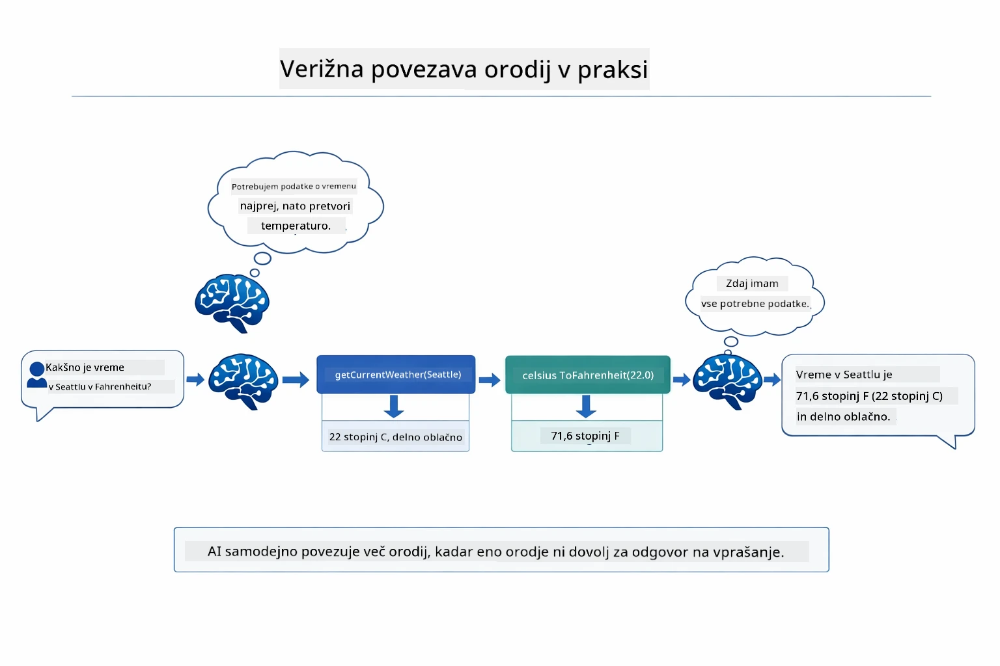

*Povezovanje orodij v akciji — agent najprej pokliče getCurrentWeather, nato rezultat v Celzijih preusmeri v celsiusToFahrenheit in poda združen odgovor.*

**Elegantne napake** — zahtevajte vreme v mestu, ki ni v vzorčnih podatkih. Orodje vrne sporočilo o napaki, AI pa razloži, da ne more pomagati, namesto da se aplikacija zruši. Orodja varno zakrijejo napake. Spodnja shema primerja oba pristopa — ob pravilni obdelavi napak agent ujame izjemo in prijazno odgovori, sicer se aplikacija zruši:

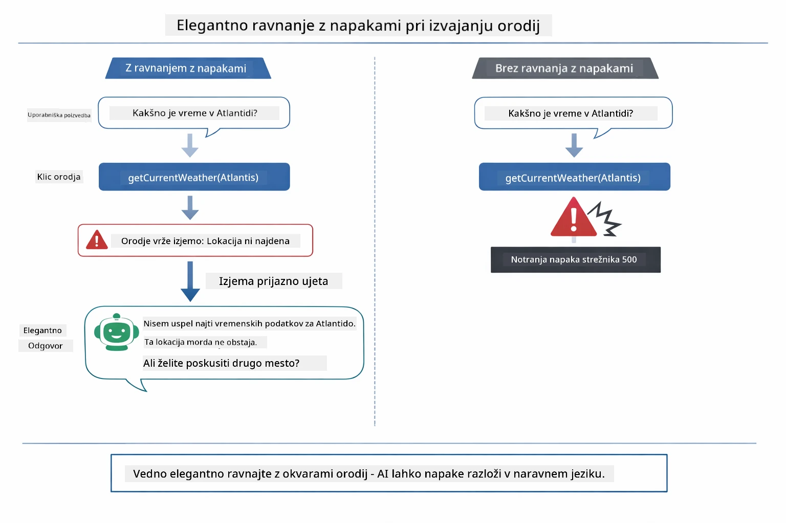

*Ko orodje ne uspe, agent ujame napako in poda v pomoč namenjen odgovor namesto zrušitve.*

To se zgodi v enem pogovornem obratu. Agent samostojno orkestrira več klicev orodij.

## Zagon aplikacije

**Preverite namestitev:**

Prepričajte se, da `.env` datoteka obstaja v korenski mapi z Azure poverilnicami (ustvarjena med Modulom 01). Zaženite to iz mape modula (`04-tools/`):

**Bash:**
```bash
cat ../.env  # Prikazati mora AZURE_OPENAI_ENDPOINT, API_KEY, DEPLOYMENT
```

**PowerShell:**
```powershell
Get-Content ..\.env  # Naj pokaže AZURE_OPENAI_ENDPOINT, API_KEY, DEPLOYMENT
```

**Zaženite aplikacijo:**

> **Opomba:** Če ste že zagnali vse aplikacije z uporabo `./start-all.sh` iz korenske mape (kot je opisano v Modulu 01), ta modul že teče na vratih 8084. Lahko preskočite ukaze za zagon in greste neposredno na http://localhost:8084.

**Možnost 1: Uporaba Spring Boot Dashboard (Priporočeno za uporabnike VS Code)**

Razvojno okolje vsebuje razširitev Spring Boot Dashboard, ki nudi vizualni vmesnik za upravljanje vseh Spring Boot aplikacij. Nahaja se v Aktivnostni vrstici na levi strani VS Code (ikona Spring Boot).

Iz Spring Boot Dashboard lahko:
- Vidite vse razpoložljive Spring Boot aplikacije v delovnem prostoru
- Zaženete/ustavite aplikacije z enim klikom
- Ogledate dnevniške zapise aplikacij v realnem času
- Spremljate stanje aplikacij

Preprosto kliknite ikono pred "tools" za zagon tega modula ali zaženite vse module hkrati.

Tako izgleda Spring Boot Dashboard v VS Code:


*Spring Boot Dashboard v VS Code — zaženite, ustavite in spremljajte vse module na enem mestu*

**Možnost 2: Uporaba ukaznih skript**

Zaženite vse spletne aplikacije (moduli 01-04):

**Bash:**
```bash
cd ..  # Iz korenskega imenika
./start-all.sh
```

**PowerShell:**
```powershell
cd ..  # Iz korenske mape
.\start-all.ps1
```

Ali zaženite samo ta modul:

**Bash:**
```bash
cd 04-tools
./start.sh
```

**PowerShell:**
```powershell
cd 04-tools
.\start.ps1
```

Oba skripta samodejno naložita spremenljivke okolja iz glavne datoteke `.env` in bosta zgradila JAR-je, če ti ne obstajajo.

> **Opomba:** Če želite pred začetkom ročno zgraditi vse module:
>
> **Bash:**
> ```bash
> cd ..  # Go to root directory
> mvn clean package -DskipTests
> ```
>
> **PowerShell:**
> ```powershell
> cd ..  # Go to root directory
> mvn clean package -DskipTests
> ```

Odprite http://localhost:8084 v svojem brskalniku.

**Zaustavitev:**

**Bash:**
```bash
./stop.sh  # Samo ta modul
# Ali
cd .. && ./stop-all.sh  # Vsi moduli
```

**PowerShell:**
```powershell
.\stop.ps1  # Samo ta modul
# Ali
cd ..; .\stop-all.ps1  # Vsi moduli
```

## Uporaba aplikacije

Aplikacija ponuja spletni vmesnik, preko katerega lahko komunicirate z AI agentom, ki ima dostop do orodij za vremensko napoved in pretvorbo temperature. Tako izgleda vmesnik — vključuje hitre primere in klepetalno ploščo za pošiljanje zahtev:

<a href="images/tools-homepage.png"></a>

*Vmesnik orodij AI agenta - hitri primeri in klepetalni vmesnik za interakcijo z orodji*

### Poskusite preprosto uporabo orodja

Začnite z enostavno zahtevo: "Pretvori 100 stopinj Fahrenheita v Celzija". Agent prepozna, da potrebuje orodje za pretvorbo temperature, ga pokliče z ustreznimi parametri in vrne rezultat. Opazite, kako naravno deluje – niste določili, katero orodje uporabiti ali kako ga poklicati.

### Preizkusite verižni klic orodij

Zdaj poskusite nekaj bolj zapletenega: "Kakšno je vreme v Seattlu in pretvori ga v Fahrenheite?" Opazujte, kako agent to obdela po korakih. Najprej pridobi vreme (ki vrne Celzije), prepozna potrebo po pretvorbi v Fahrenheite, pokliče pretvorbeno orodje in združi oba rezultata v en odgovor.

### Oglejte si potek pogovora

Klepetalni vmesnik shranjuje zgodovino pogovora, kar omogoča večkratne interakcije. Vidite lahko vse prejšnje poizvedbe in odgovore, kar olajša sledenje pogovoru in razumevanje, kako agent gradi kontekst skozi več izmenjav.

<a href="images/tools-conversation-demo.png"></a>

*Večkratni pogovor prikazuje preproste pretvorbe, vremenske poizvedbe in povezovanje orodij*

### Eksperimentirajte z različnimi zahtevami

Preizkusite različne kombinacije:
- Vremenske poizvedbe: "Kakšno je vreme v Tokiu?"
- Pretvorbe temperatur: "Koliko je 25°C v Kelvinih?"
- Združene poizvedbe: "Preveri vreme v Parizu in mi povej, ali je nad 20°C"

Opazite, kako agent razume naravni jezik in ga preslika v ustrezne klice orodij.

## Ključni koncepti

### ReAct vzorec (razmišljanje in delovanje)

Agent izmenično razmišlja (odloča, kaj storiti) in deluje (uporablja orodja). Ta vzorec omogoča avtonomno reševanje problemov, ne zgolj odzivanje na ukaze.

### Pomen opisa orodij

Kakovost opisov vaših orodij neposredno vpliva na to, kako dobro jih agent uporablja. Jasni, specifični opisi pomagajo modelu razumeti, kdaj in kako poklicati posamezno orodje.

### Upravljanje sej

Oznaka `@MemoryId` omogoča samodejno upravljanje pomnilnika na podlagi sej. Vsaka ID seja dobi svojo instanco `ChatMemory`, ki jo upravlja primerek `ChatMemoryProvider`, tako da lahko več uporabnikov hkrati komunicira z agentom brez prekrivanja pogovorov. Spodnji diagram prikazuje, kako se več uporabnikov usmeri v izolirane pomnilniške shrambe glede na njihove ID-je sej:

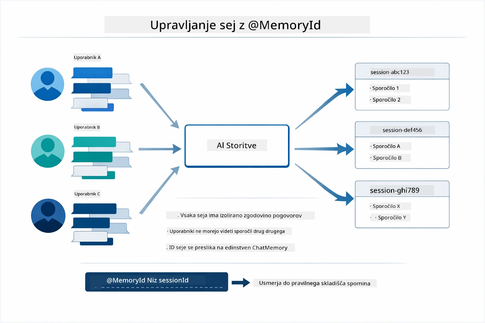

*Vsak ID seja preslika zgodovino pogovora v ločeno shrambo — uporabniki nikoli ne vidijo sporočil drug drugega.*

### Ravnanje z napakami

Orodja lahko odpovejo — API-ji potečejo, parametri so lahko neveljavni, zunanje storitve odpovedo. Produkcijski agenti potrebujejo obravnavo napak, da lahko model pojasni težave ali poskusi alternative namesto da bi sesul celotno aplikacijo. Ko orodje vrže izjemo, jo LangChain4j ujamem in sporoči napako nazaj modelu, ki lahko potem razloži težavo v naravnem jeziku.

## Razpoložljiva orodja

Spodnji diagram prikazuje širok ekosistem orodij, ki jih lahko zgradite. Ta modul prikazuje orodja za vreme in temperature, vendar enak vzorec `@Tool` deluje za katerokoli Java metodo — od poizvedb v bazo podatkov do obdelave plačil.

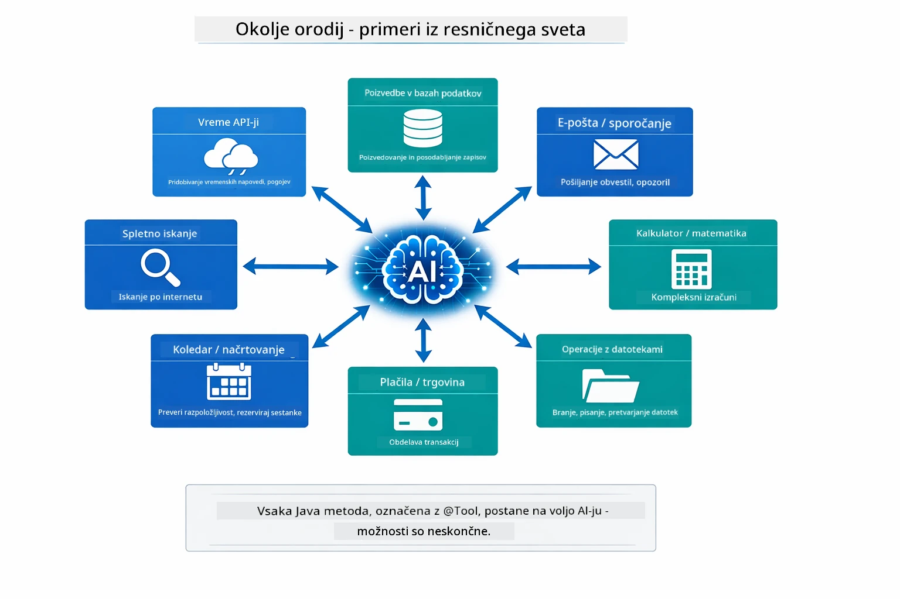

*Vsaka Java metoda z oznako @Tool postane dostopna AI-ju — vzorec se razteza na baze podatkov, API-je, e-pošto, datotečne operacije in več.*

## Kdaj uporabljati agente, ki temeljijo na orodjih

Za vsako zahtevo orodja niso potrebna. Odločitev temelji na tem, ali AI potrebuje interakcijo z zunanjimi sistemi ali lahko odgovori na podlagi lastnega znanja. Spodaj je povzetek, kdaj orodja dodajo vrednost in kdaj niso potrebna:

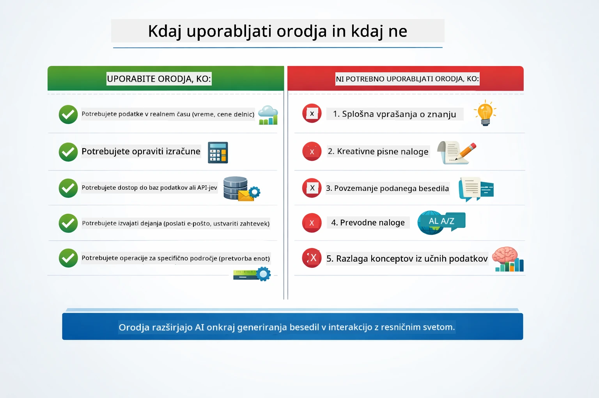

*Hitri vodič za odločanje — orodja so za podatke v realnem času, izračune in dejanja; splošno znanje in ustvarjalne naloge jih ne potrebujejo.*

## Orodja proti RAG

Modula 03 in 04 razširjata možnosti AI-ja, a na povsem različne načine. RAG omogoča modelu dostop do **znanja** z iskanjem dokumentov. Orodja omogočajo modelu izvajanje **dejanj** z klicanjem funkcij. Diagram spodaj primerja oba pristopa vzporedno — od delovanja posameznega poteka do kompromisov med njima:

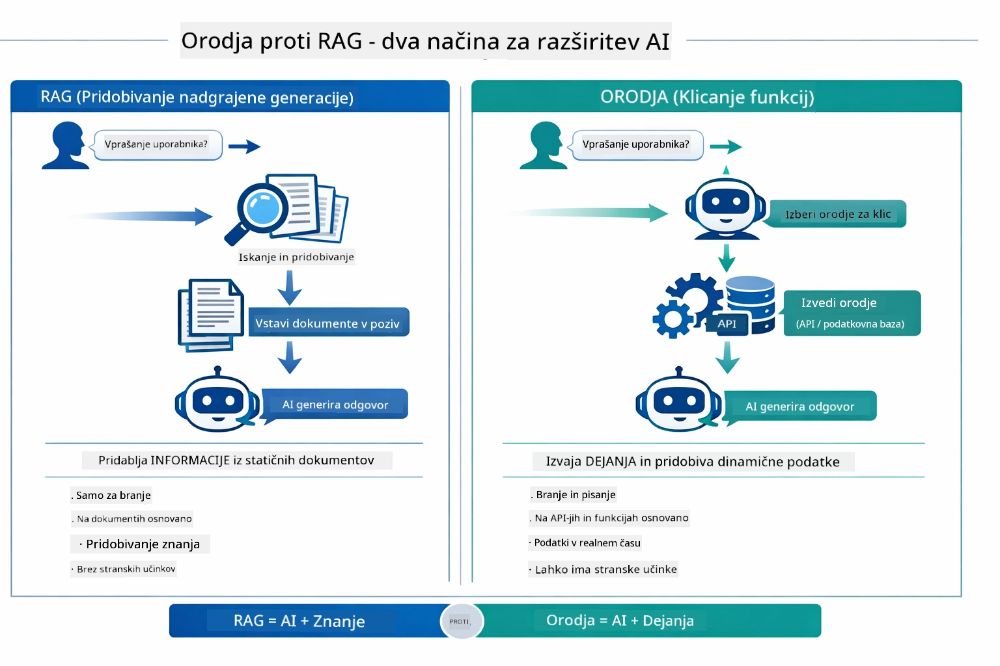

*RAG išče informacije v statičnih dokumentih — orodja izvajajo dejanja in pridobivajo dinamične, aktualne podatke. Veliko produkcijskih sistemov uporablja oba.*

V praksi veliko produkcijskih sistemov uporablja oba pristopa: RAG za utemeljevanje odgovorov z vašo dokumentacijo in Orodja za pridobivanje živih podatkov ali izvajanje operacij.

## Naslednji koraki

**Naslednji modul:** [05-mcp - Protokol konteksta modela (MCP)](../05-mcp/README.md)

---

**Navigacija:** [← Prejšnji: Modul 03 - RAG](../03-rag/README.md) | [Nazaj na glavno](../README.md) | [Naslednji: Modul 05 - MCP →](../05-mcp/README.md)

---

<!-- CO-OP TRANSLATOR DISCLAIMER START -->
**Opozorilo**:
Ta dokument je bil preveden z uporabo AI prevajalske storitve [Co-op Translator](https://github.com/Azure/co-op-translator). Čeprav si prizadevamo za natančnost, upoštevajte, da lahko avtomatizirani prevodi vsebujejo napake ali netočnosti. Izvirni dokument v izvorni jezik je treba šteti za avtoritativni vir. Za ključne informacije priporočamo strokovni človeški prevod. Ne odgovarjamo za morebitne nesporazume ali napačne razlage, ki izhajajo iz uporabe tega prevoda.
<!-- CO-OP TRANSLATOR DISCLAIMER END -->