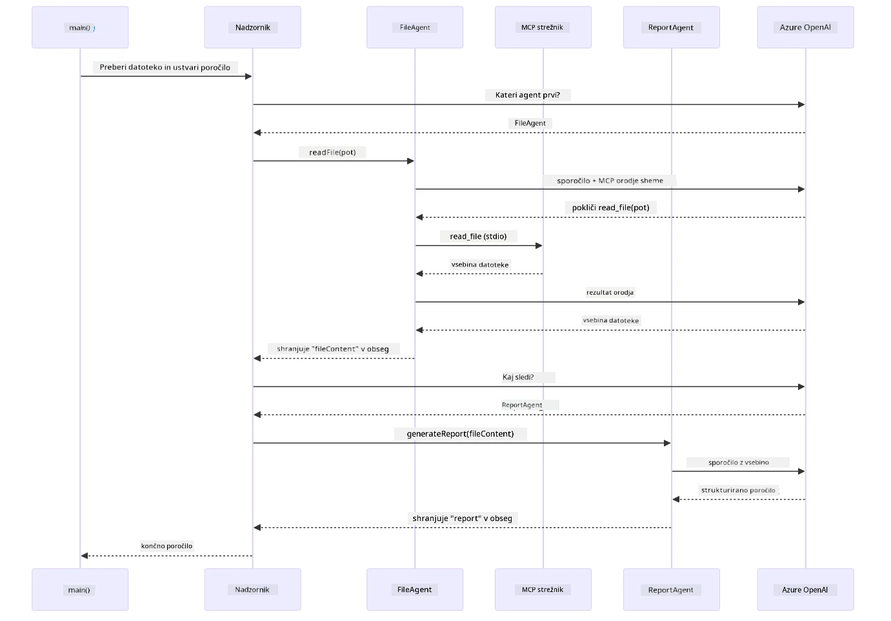

# Modul 05: Protokol konteksta modela (MCP)

## Kazalo

- [Video vodič](../../../05-mcp)
- [Kaj se boste naučili](../../../05-mcp)
- [Kaj je MCP?](../../../05-mcp)
- [Kako MCP deluje](../../../05-mcp)
- [Agentni modul](../../../05-mcp)
- [Zagon primerov](../../../05-mcp)
  - [Predpogoji](../../../05-mcp)
- [Hiter začetek](../../../05-mcp)
  - [Operacije z datotekami (Stdio)](../../../05-mcp)
  - [Nadzorni agent](../../../05-mcp)
    - [Zagon demonstracije](../../../05-mcp)
    - [Kako deluje nadzornik](../../../05-mcp)
    - [Kako FileAgent odkrije MCP orodja med izvajanjem](../../../05-mcp)
    - [Strategije odziva](../../../05-mcp)
    - [Razumevanje izhoda](../../../05-mcp)
    - [Razlaga funkcij agentnega modula](../../../05-mcp)
- [Ključni pojmi](../../../05-mcp)
- [Čestitke!](../../../05-mcp)
  - [Kaj sledi?](../../../05-mcp)

## Video vodič

Oglejte si ta v živo prenos, ki razlaga, kako začeti z modulom:

<a href="https://www.youtube.com/watch?v=O_J30kZc0rw"></a>

## Kaj se boste naučili

Zgradili ste pogovorni AI, osvojili pozive, utemeljili odgovore v dokumentih in ustvarili agente z orodji. Vse te orodje so bile prilagojene vaši specifični aplikaciji. Kaj pa, če lahko svojemu AI omogočite dostop do standardiziranega ekosistema orodij, ki jih lahko kdorkoli ustvari in deli? V tem modulu se boste naučili ravno tega z Model Context Protocol (MCP) in agentnim modulom LangChain4j. Najprej predstavimo enostaven MCP bralnik datotek, nato pa pokažemo, kako ga zlahka vključiti v napredne agentne delovne tokove z vzorcem Supervisor Agent.

## Kaj je MCP?

Model Context Protocol (MCP) nudi prav to – standardiziran način, da AI aplikacije odkrijejo in uporabljajo zunanja orodja. Namesto da prepisujete lastne integracije za vsak vir podatkov ali storitev, se povežete s MCP strežniki, ki na dosleden način razkrivajo svoje zmogljivosti. Vaš AI agent potem samodejno odkrije in uporablja ta orodja.

Spodnja shema kaže razliko — brez MCP je vsaka integracija posebna povezava od točke do točke; z MCP pa en sam protokol poveže vašo aplikacijo s katerimkoli orodjem:


*Pred MCP: Kompleksne integracije od točke do točke. Po MCP: En protokol, neskončne možnosti.*

MCP rešuje temeljni problem razvoja AI: vsaka integracija je prilagojena. Želite dostop do GitHuba? Posebna koda. Želite brati datoteke? Posebna koda. Želite poizvedovati bazo podatkov? Posebna koda. Nobena od teh integracij ne deluje z drugimi AI aplikacijami.

MCP to standardizira. MCP strežnik razkrije orodja s jasnimi opisi in shemami parametrov. Vsak MCP odjemalec se lahko poveže, odkrije razpoložljiva orodja in jih uporablja. Zgradite enkrat, uporabite povsod.

Spodnja shema prikazuje to arhitekturo — en MCP odjemalec (vaša AI aplikacija) se poveže z več MCP strežniki, vsak razkriva svoj nabor orodij preko standardnega protokola:


*Arhitektura Model Context Protocol - standardizirano odkrivanje in izvajanje orodij*

## Kako MCP deluje

Pod pokrovom MCP uporablja plastično arhitekturo. Vaša Java aplikacija (MCP odjemalec) odkrije razpoložljiva orodja, pošlje JSON-RPC zahteve preko transportne plasti (Stdio ali HTTP), MCP strežnik izvede operacije in vrne rezultate. Naslednja shema razčleni vsako plast protokola:


*Kako MCP deluje pod pokrovom — odjemalci odkrivajo orodja, izmenjujejo JSON-RPC sporočila in izvajajo operacije prek transportne plasti.*

**Arhitektura strežnik-odjemalec**

MCP uporablja model strežnik-odjemalec. Strežniki zagotavljajo orodja - branje datotek, poizvedbe v bazah, klice API-jev. Odjemalci (vaša AI aplikacija) se povezujejo s strežniki in uporabljajo njihova orodja.

Za uporabo MCP z LangChain4j dodajte to Maven odvisnost:

```xml
<dependency>
    <groupId>dev.langchain4j</groupId>
    <artifactId>langchain4j-mcp</artifactId>
    <version>${langchain4j.version}</version>
</dependency>
```

**Odkritje orodij**

Ko se vaš odjemalec poveže z MCP strežnikom, vpraša "Katera orodja imate?" Strežnik odgovori z seznamom razpoložljivih orodij, vsak ima opise in parametne sheme. Vaš AI agent lahko potem na podlagi uporabniških zahtev odloči, katera orodja bo uporabil. Spodnja shema prikazuje to rokovanje — odjemalec pošlje zahtevek `tools/list`, strežnik pa vrne svoja razpoložljiva orodja z opisi in parametnimi shemami:


*AI odkrije razpoložljiva orodja ob zagonu - zdaj ve, katere zmožnosti so na voljo in lahko odloči, katera bo uporabil.*

**Transportni mehanizmi**

MCP podpira različne transportne mehanizme. Dve možnosti sta Stdio (za lokalno komunikacijo podprocesov) in Streamable HTTP (za oddaljene strežnike). Ta modul prikazuje transport Stdio:


*Transportni mehanizmi MCP: HTTP za oddaljene strežnike, Stdio za lokalne procese*

**Stdio** - [StdioTransportDemo.java](../../../05-mcp/src/main/java/com/example/langchain4j/mcp/StdioTransportDemo.java)

Za lokalne procese. Vaša aplikacija zažene strežnik kot podproces in komunicira preko standardnega vhoda/izhoda. Uporabno za dostop do datotečnega sistema ali orodij v ukazni vrstici.

```java
McpTransport stdioTransport = new StdioMcpTransport.Builder()
    .command(List.of(
        npmCmd, "exec",
        "@modelcontextprotocol/server-filesystem@2025.12.18",
        resourcesDir
    ))
    .logEvents(false)
    .build();
```

Strežnik `@modelcontextprotocol/server-filesystem` razkrije naslednja orodja, vsa omejena na imenike, ki jih določite:

| Orodje | Opis |
|------|-------------|
| `read_file` | Preberi vsebino ene datoteke |
| `read_multiple_files` | Preberi več datotek v enem klicu |
| `write_file` | Ustvari ali prepiši datoteko |
| `edit_file` | Naredi ciljno najdi-in-zameni popravke |
| `list_directory` | Navedite datoteke in imenike na poti |
| `search_files` | Rekurzivno išči datoteke, ki ustrezajo vzorcu |
| `get_file_info` | Pridobi metapodatke datoteke (velikost, časovne žige, dovoljenja) |
| `create_directory` | Ustvari imenik (vključno s starševskimi imeniki) |
| `move_file` | Premakni ali preimenuj datoteko ali imenik |

Naslednja shema prikazuje, kako transport Stdio deluje med izvajanjem — vaša Java aplikacija zažene MCP strežnik kot podproces in komunicirata prek pip stdin/stdout, brez mreže ali HTTP:


*Transport Stdio v akciji — vaša aplikacija zažene MCP strežnik kot podproces in komunicira prek pip stdin/stdout.*

> **🤖 Poskusi z [GitHub Copilot](https://github.com/features/copilot) Klepet:** Odpri [`StdioTransportDemo.java`](../../../05-mcp/src/main/java/com/example/langchain4j/mcp/StdioTransportDemo.java) in vprašaj:
> - "Kako deluje transport Stdio in kdaj ga naj uporabim namesto HTTP?"
> - "Kako LangChain4j upravlja življenjski cikel zagona MCP strežniških procesov?"
> - "Kakšni so varnostni pomisleki pri dajanju AI dostopa do datotečnega sistema?"

## Agentni modul

Medtem ko MCP zagotavlja standardizirana orodja, LangChain4j-ev **agentni modul** nudi deklarativen način za gradnjo agentov, ki orkestrirajo ta orodja. Oznaka `@Agent` in `AgenticServices` omogočata definiranje vedenja agenta prek vmesnikov namesto imperativne kode.

V tem modulu boste raziskali vzorec **Supervisor Agent** — napreden agentni pristop AI, kjer “nadzornik” agent dinamično odloča, katere pod-agente bo sprožil na podlagi zahtev uporabnika. Združili bomo oba koncepta tako, da enemu od naših pod-agentov damo MCP-poganjane zmogljivosti dostopa do datotek.

Za uporabo agentnega modula dodajte to Maven odvisnost:

```xml
<dependency>
    <groupId>dev.langchain4j</groupId>
    <artifactId>langchain4j-agentic</artifactId>
    <version>${langchain4j.mcp.version}</version>
</dependency>
```
> **Opomba:** Modul `langchain4j-agentic` uporablja ločeno lastnost različice (`langchain4j.mcp.version`), ker je izdan po drugačnem urniku kot osnovne knjižnice LangChain4j.

> **⚠️ Eksperimentalno:** Modul `langchain4j-agentic` je **eksperimentalen** in lahko se spremeni. Stabilen način za gradnjo AI pomočnikov ostaja `langchain4j-core` z lastnimi orodji (Modul 04).

## Zagon primerov

### Predpogoji

- Dokončan [Modul 04 - Orodja](../04-tools/README.md) (ta modul gradi na konceptih lastnih orodij in jih primerja z MCP)
- `.env` datoteka v korenski mapi z Azure poverilnicami (ustvarjena z `azd up` v Modulu 01)
- Java 21+, Maven 3.9+
- Node.js 16+ in npm (za MCP strežnike)

> **Opomba:** Če še niste nastavili svojih okoljskih spremenljivk, si oglejte [Modul 01 - Uvod](../01-introduction/README.md) za navodila za namestitev (`azd up` ustvari `.env` datoteko samodejno), ali kopirajte `.env.example` v `.env` v korenski mapi in izpolnite svoje vrednosti.

## Hiter začetek

**Uporaba VS Code:** Preprosto kliknite z desno tipko na katerokoli datoteko demonstracije v Explorer-ju in izberite **"Run Java"**, ali uporabite možnosti zagona iz panela Zaženi in odpravi napake (preverite, da je vaša `.env` datoteka najprej pravilno nastavljen z Azure poverilnicami).

**Uporaba Mavena:** Alternativno lahko zaženete iz ukazne vrstice z naslednjimi primeri.

### Operacije z datotekami (Stdio)

To prikazuje orodja, ki temeljijo na lokalnih podprocesih.

**✅ Nobenih predpogojev ni treba izpolniti** - MCP strežnik se zažene samodejno.

**Uporaba zagonskih skript (priporočeno):**

Zagonske skripte samodejno naložijo okoljske spremenljivke iz korenske `.env` datoteke:

**Bash:**
```bash
cd 05-mcp
chmod +x start-stdio.sh
./start-stdio.sh
```

**PowerShell:**
```powershell
cd 05-mcp
.\start-stdio.ps1
```

**Uporaba VS Code:** Kliknite z desno na `StdioTransportDemo.java` in izberite **"Run Java"** (poskrbite, da je vaša `.env` datoteka pravilno nastavljena).

Aplikacija samodejno zažene MCP strežnik za datotečni sistem in prebere lokalno datoteko. Opazite, kako je upravljanje podprocesov samodejno.

**Pričakovan izhod:**
```
Assistant response: The file provides an overview of LangChain4j, an open-source Java library
for integrating Large Language Models (LLMs) into Java applications...
```

### Nadzorni agent

Vzorec **Supervisor Agent** je **prilagodljiva** oblika agentnega AI. Nadzornik uporablja LLM, da samostojno odloči, katere agente bo sprožil na podlagi uporabniške zahteve. V naslednjem primeru združimo MCP-poganjan dostop do datotek z LLM agentom za ustvarjanje nadzorovanega poteka branja datoteke → poročila.

V demoju `FileAgent` prebere datoteko z uporabo MCP orodij za datotečni sistem, `ReportAgent` pa generira strukturirano poročilo z izvršnim povzetkom (1 stavek), 3 ključnimi točkami in priporočili. Nadzornik to zaporedje avtomatsko orkestrira:


*Nadzornik uporablja svoj LLM, da odloči, katere agente sproži in v kakšnem vrstnem redu — ni potrebe po trdo kodiranem usmerjanju.*

Tako izgleda konkreten potek za naš potok datoteka-poročilo:


*FileAgent prebere datoteko preko MCP orodij, nato ReportAgent spremeni surovo vsebino v strukturirano poročilo.*

Naslednji sekvenčni diagram sledi celotni orkestraciji Supervisorja — od zagona MCP strežnika, preko samostojne izbire agentov Supervisorja, do klicev orodij preko stdio in končnega poročila:



*Nadzornik samostojno kliče FileAgent (ki preko stdio kliče MCP strežnik za branje datoteke), nato kliče ReportAgent za generiranje strukturiranega poročila — vsak agent shrani svoj izhod v skupni Agentni obseg.*

Vsak agent shrani svoj izhod v **Agentni obseg** (deljeni pomnilnik), kar omogoča naslednjim agentom dostop do prejšnjih rezultatov. To prikazuje, kako se MCP orodja brezhibno vključujejo v agentne delovne tokove — Supervisorju ni treba vedeti, *kako* se datoteke berejo, samo da jih lahko `FileAgent` prebere.

#### Zagon demonstracije

Zagonske skripte samodejno naložijo okoljske spremenljivke iz korenske `.env` datoteke:

**Bash:**
```bash
cd 05-mcp
chmod +x start-supervisor.sh
./start-supervisor.sh
```

**PowerShell:**
```powershell
cd 05-mcp
.\start-supervisor.ps1
```

**Uporaba VS Code:** Kliknite z desno na `SupervisorAgentDemo.java` in izberite **"Run Java"** (poskrbite, da je vaša `.env` datoteka nastavljena).

#### Kako deluje nadzornik

Pred gradnjo agentov morate MCP transport povezati z odjemalcem in ga zaviti kot `ToolProvider`. Tako orodja MCP strežnika postanejo na voljo vašim agentom:

```java
// Ustvari MCP odjemalca iz transporta
McpClient mcpClient = new DefaultMcpClient.Builder()
        .transport(stdioTransport)
        .build();

// Ovij odjemalca kot ToolProvider — to povezuje MCP orodja v LangChain4j
ToolProvider mcpToolProvider = McpToolProvider.builder()
        .mcpClients(List.of(mcpClient))
        .build();
```

Sedaj lahko `mcpToolProvider` vbrizgate v kateregakoli agenta, ki potrebuje MCP orodja:

```java
// Korak 1: FileAgent bere datoteke z uporabo orodij MCP
FileAgent fileAgent = AgenticServices.agentBuilder(FileAgent.class)
        .chatModel(model)
        .toolProvider(mcpToolProvider)  // Ima orodja MCP za datotečne operacije
        .build();

// Korak 2: ReportAgent ustvarja strukturirane poročila
ReportAgent reportAgent = AgenticServices.agentBuilder(ReportAgent.class)
        .chatModel(model)
        .build();

// Supervisor usklajuje potek dela datoteka → poročilo
SupervisorAgent supervisor = AgenticServices.supervisorBuilder()
        .chatModel(model)
        .subAgents(fileAgent, reportAgent)
        .responseStrategy(SupervisorResponseStrategy.LAST)  // Vrni končno poročilo
        .build();

// Supervisor odloči, katere agente bo poklical glede na zahtevo
String response = supervisor.invoke("Read the file at /path/file.txt and generate a report");
```

#### Kako FileAgent odkrije MCP orodja med izvajanjem

Morda se sprašujete: **kako `FileAgent` ve, kako uporabljati npm orodja za datotečni sistem?** Odgovor je, da ne ve — **LLM** to ugotovi med izvajanjem preko shem orodij.
Vmesnik `FileAgent` je le **definicija poziva**. Nima vnaprej kodiranega znanja o `read_file`, `list_directory` ali katerem koli drugem orodju MCP. Tako poteka celoten proces:

1. **Zagon strežnika:** `StdioMcpTransport` zažene npm paket `@modelcontextprotocol/server-filesystem` kot podproces
2. **Odkritje orodij:** `McpClient` pošlje JSON-RPC zahtevek `tools/list` strežniku, ki odgovori z imeni orodij, opisi in shemami parametrov (npr. `read_file` — *"Preberi celotno vsebino datoteke"* — `{ path: string }`)
3. **Vbrizg shem:** `McpToolProvider` obdela te odkrite sheme in jih naredi dostopne za LangChain4j
4. **Odločitev LLM:** Ko se pokliče `FileAgent.readFile(path)`, LangChain4j pošlje sistemsko sporočilo, uporabniško sporočilo in **seznam shem orodij** LLM. LLM prebere opise orodij in generira klic orodja (npr. `read_file(path="/some/file.txt")`)
5. **Izvedba:** LangChain4j prestreže klic orodja, ga usmeri nazaj prek MCP klienta na Node.js podproces, pridobi rezultat in ga posreduje nazaj LLM

To je isti mehanizem [Odkritja orodij](../../../05-mcp), opisan zgoraj, vendar uporabljen specifično za agentni potek dela. Oznake `@SystemMessage` in `@UserMessage` usmerjajo vedenje LLM, medtem ko vbrizgani `ToolProvider` daje **zmožnosti** — LLM združi obe na računanju v času zagona.

> **🤖 Preizkusi z [GitHub Copilot](https://github.com/features/copilot) Chat:** Odpri [`FileAgent.java`](../../../05-mcp/src/main/java/com/example/langchain4j/mcp/agents/FileAgent.java) in vprašaj:
> - "Kako ta agent ve, kateri MCP orodje poklicati?"
> - "Kaj bi se zgodilo, če bi odstranil ToolProvider iz graditelja agenta?"
> - "Kako se sheme orodij prenesejo do LLM?"

#### Strategije odgovora

Ko konfiguriraš `SupervisorAgent`, določiš, kako naj oblikuje končni odgovor uporabniku po opravljenih opravilih podagentov. Spodnja shema prikazuje tri razpoložljive strategije — LAST vrne neposredno izhod zadnjega agenta, SUMMARY sintetizira vse izhode preko LLM, SCORED pa izbere tistega z višjo oceno glede na izvirno zahtevo:


*Tri strategije, kako nadzornik oblikuje svoj končni odgovor — izberi glede na to, ali želiš izhod zadnjega agenta, sintetiziran povzetek ali najbolj ocenjen izhod.*

Razpoložljive strategije so:

| Strategija | Opis |
|------------|-------|
| **LAST** | Nadzornik vrne izhod zadnjega podagneta ali orodja, ki je bilo poklicano. To je uporabno, ko je zadnji agent v poteku posebej zasnovan za izdelavo popolnega, končnega odgovora (npr. "Povzetek agenta" v raziskovalni verigi). |
| **SUMMARY** | Nadzornik uporabi svoj notranji jezikovni model (LLM) za sintetiziranje povzetka celotne interakcije in vseh izhodov podagentov, nato ta povzetek vrne kot končni odgovor. To zagotavlja čisti, združeni odgovor uporabniku. |
| **SCORED** | Sistem uporabi notranji LLM za ocenjevanje tako LAST kot SUMMARY odgovora glede na izvirno uporabniško zahtevo in vrne tistega, ki prejme višjo oceno. |

Celotno implementacijo si oglej v [SupervisorAgentDemo.java](../../../05-mcp/src/main/java/com/example/langchain4j/mcp/SupervisorAgentDemo.java).

> **🤖 Preizkusi z [GitHub Copilot](https://github.com/features/copilot) Chat:** Odpri [`SupervisorAgentDemo.java`](../../../05-mcp/src/main/java/com/example/langchain4j/mcp/SupervisorAgentDemo.java) in vprašaj:
> - "Kako nadzornik odloči, katere agente poklicati?"
> - "Kaj je razlika med vzorcem nadzornika in zaporednim delovnim tokom?"
> - "Kako lahko prilagodim vedenje načrtovanja nadzornika?"

#### Razumevanje izhoda

Ko zaženeš demo, boš videl strukturiran potek, kako nadzornik orkestrira več agentov. Tukaj je pomen posameznih delov:

```
======================================================================
  FILE → REPORT WORKFLOW DEMO
======================================================================

This demo shows a clear 2-step workflow: read a file, then generate a report.
The Supervisor orchestrates the agents automatically based on the request.
```
  
**Glava** uvaja koncept poteka dela: osredotočena veriga od branja datotek do generiranja poročila.

```
--- WORKFLOW ---------------------------------------------------------
  ┌─────────────┐      ┌──────────────┐
  │  FileAgent  │ ───▶ │ ReportAgent  │
  │ (MCP tools) │      │  (pure LLM)  │
  └─────────────┘      └──────────────┘
   outputKey:           outputKey:
   'fileContent'        'report'

--- AVAILABLE AGENTS -------------------------------------------------
  [FILE]   FileAgent   - Reads files via MCP → stores in 'fileContent'
  [REPORT] ReportAgent - Generates structured report → stores in 'report'
```
  
**Diagram poteka** prikazuje pretok podatkov med agenti. Vsak agent ima specifično vlogo:  
- **FileAgent** bere datoteke z MCP orodji in shrani surovo vsebino v `fileContent`  
- **ReportAgent** uporablja to vsebino in ustvari strukturirano poročilo v `report`

```
--- USER REQUEST -----------------------------------------------------
  "Read the file at .../file.txt and generate a report on its contents"
```
  
**Uporabniška zahteva** prikazuje nalogo. Nadzornik razčleni to in odloči, da sproži FileAgent → ReportAgent.

```
--- SUPERVISOR ORCHESTRATION -----------------------------------------
  The Supervisor decides which agents to invoke and passes data between them...

  +-- STEP 1: Supervisor chose -> FileAgent (reading file via MCP)
  |
  |   Input: .../file.txt
  |
  |   Result: LangChain4j is an open-source, provider-agnostic Java framework for building LLM...
  +-- [OK] FileAgent (reading file via MCP) completed

  +-- STEP 2: Supervisor chose -> ReportAgent (generating structured report)
  |
  |   Input: LangChain4j is an open-source, provider-agnostic Java framew...
  |
  |   Result: Executive Summary...
  +-- [OK] ReportAgent (generating structured report) completed
```
  
**Orkestracija nadzornika** prikazuje 2-kornično izvajanje:  
1. **FileAgent** prebere datoteko prek MCP in shrani vsebino  
2. **ReportAgent** prejme vsebino in generira strukturirano poročilo

Nadzornik je te odločitve sprejel **samostojno** glede na uporabniško zahtevo.

```
--- FINAL RESPONSE ---------------------------------------------------
Executive Summary
...

Key Points
...

Recommendations
...

--- AGENTIC SCOPE (Data Flow) ----------------------------------------
  Each agent stores its output for downstream agents to consume:
  * fileContent: LangChain4j is an open-source, provider-agnostic Java framework...
  * report: Executive Summary...
```
  
#### Razlaga lastnosti agentskega modula

Primer prikazuje več naprednih funkcij agentskega modula. Poglejmo si podrobneje Agentic Scope in Agent Listeners.

**Agentic Scope** prikazuje deljeni pomnilnik, kamor so agenti shranjevali rezultate z uporabo `@Agent(outputKey="...")`. To omogoča:  
- kasnejšim agentom dostop do izhodov prejšnjih agentov  
- nadzorniku sintetizacijo končnega odgovora  
- tebi ogled, kaj je posamezen agent proizvedel

Spodnji diagram prikazuje, kako Agentic Scope deluje kot deljeni pomnilnik v datoteka-do-poročila poteku — FileAgent vpiše izhod pod ključ `fileContent`, ReportAgent prebere to in zapiše svoj izhod pod `report`:


*Agentic Scope deluje kot deljeni pomnilnik — FileAgent zapiše `fileContent`, ReportAgent prebere to in zapiše `report`, tvoja koda prebere končni rezultat.*

```java
ResultWithAgenticScope<String> result = supervisor.invokeWithAgenticScope(request);
AgenticScope scope = result.agenticScope();
String fileContent = scope.readState("fileContent");  // Neobdelani podatki datoteke iz FileAgent
String report = scope.readState("report");            // Strukturirano poročilo iz ReportAgent
```
  
**Agent Listeners** omogočajo spremljanje in odpravljanje napak pri izvajanju agentov. Korak-po-korak izhod, ki ga vidiš v demo, prihaja iz AgentListenerja, ki se vključuje v vsak klic agenta:  
- **beforeAgentInvocation** – poklican, ko nadzornik izbere agenta, da vidiš, kateri agent je bil izbran in zakaj  
- **afterAgentInvocation** – poklican, ko agent konča, prikazuje njegov rezultat  
- **inheritedBySubagents** – če je resničen, poslušalec spremlja vse agente v hierarhiji

Naslednji diagram prikazuje celoten življenjski cikel Agent Listenerja, vključno z načinom, kako `onError` obravnava napake med izvajanjem agenta:


*Agent Listeners se povežejo z življenjskim ciklom izvajanja — spremljajo začetek, zaključek ali napake agentov.*

```java
AgentListener monitor = new AgentListener() {
    private int step = 0;
    
    @Override
    public void beforeAgentInvocation(AgentRequest request) {
        step++;
        System.out.println("  +-- STEP " + step + ": " + request.agentName());
    }
    
    @Override
    public void afterAgentInvocation(AgentResponse response) {
        System.out.println("  +-- [OK] " + response.agentName() + " completed");
    }
    
    @Override
    public boolean inheritedBySubagents() {
        return true; // Razširi na vse pod-agente
    }
};
```
  
Poleg nadzornikovega vzorca nudi modul `langchain4j-agentic` več močnih vzorcev poteka dela. Spodnji diagram prikazuje vseh pet — od enostavnih zaporednih verig do odobritvenih tokov z vključenim človekom:


*Pet vzorcev poteka dela za orkestracijo agentov — od preprostih zaporednih cevi do odobrtvenih tokov, kjer sodeluje človek.*

| Vzorec | Opis | Primer uporabe |
|--------|-------|----------------|
| **Sekvenčni** | Izvedba agentov zaporedno, izhod teče naprej | Verige: raziskava → analiza → poročilo |
| **Vzporeden** | Izvedba agentov hkrati | Neodvisne naloge: vreme + novice + delnice |
| **Zanka** | Ponavljanje, dokler ni izpolnjen pogoj | Ocena kakovosti: izboljševanje dokler ocena ≥ 0.8 |
| **Pogojni** | Usmerjanje po pogojih | Klasifikacija → napotitev specialističnemu agentu |
| **Človek-v-zanki** | Dodajanje človeških kontrolnih točk | Odobritve, pregled vsebine |

## Ključni koncepti

Zdaj, ko si si ogledal MCP in agentski modul v akciji, povzamemo, kdaj uporabiti kateri pristop.

Ena največjih prednosti MCP je njegova rastoča ekosistem. Spodnji diagram prikazuje, kako enotni univerzalni protokol povezuje tvojo AI aplikacijo z veliko različnimi MCP strežniki — od dostopa do datotečnih sistemov in baz podatkov do GitHub, elektronske pošte, spletnemu strganju in še več:


*MCP vzpostavlja univerzalni protokolni ekosistem — vsak MCP-kompatibilni strežnik deluje z vsakim MCP-kompatibilnim klientom, kar omogoča skupno rabo orodij med aplikacijami.*

**MCP** je idealen, ko želiš izkoristiti obstoječi ekosistem orodij, ustvariti orodja, ki jih lahko uporablja več aplikacij, integrirati storitve tretjih oseb s standardiziranimi protokoli ali zamenjati implementacije orodij brez spreminjanja kode.

**Agentski modul** najbolje deluje, ko želiš deklarativne definicije agentov z oznakami `@Agent`, potrebuješ orkestracijo poteka dela (zaporedno, zanka, vzporedno), raje zasnovo agentov na osnovi vmesnikov namesto imperativne kode ali združuješ več agentov, ki delijo izhode prek `outputKey`.

**Vzorec nadzornika** pride prav, ko potek dela ni vnaprej predvidljiv in želiš, da odloča LLM, ko imaš več specializiranih agentov, ki potrebujejo dinamično orkestracijo, pri gradnji pogovornih sistemov, ki usmerjajo različne zmožnosti, ali kadar želiš najfleksibilnejše, prilagodljive vedenje agentov.

Da ti pomagamo izbrati med lastnimi `@Tool` metodami iz Modula 04 in MCP orodji iz tega modula, spodnja primerjava izpostavlja ključne kompromisne točke — lastna orodja nudijo tesno povezavo in polno tipno varnost za aplikacijsko logiko, MCP orodja pa standardizirane, ponovno uporabne integracije:


*Kdaj uporabiti lastne @Tool metode proti MCP orodjem — lastna orodja za aplikacijsko logiko s polno tipno varnostjo, MCP orodja za standardizirane integracije, ki delujejo skozi aplikacije.*

## Čestitke!

Preko vseh pet modulov tečaja LangChain4j za začetnike si prišel! Tukaj je pogled na celotno učno pot, ki si jo zaključil — od osnovnega pogovora do agentskih sistemov, ki jih poganja MCP:


*Tvoja učna pot skozi vseh pet modulov — od osnovnega pogovora do agentskih sistemov, ki jih poganja MCP.*

Zaključil si tečaj LangChain4j za začetnike. Naučil si se:

- Kako ustvariti pogovorni AI z pomnilnikom (Modul 01)  
- Vzorce inženiringa pozivov za različne naloge (Modul 02)  
- Uporabo RAG za utemeljitev odgovorov v dokumentih (Modul 03)  
- Ustvarjanje osnovnih AI agentov (asistentov) z lastnimi orodji (Modul 04)  
- Integracijo standardiziranih orodij z LangChain4j MCP in Agentic moduli (Modul 05)

### Kaj sledi?

Po zaključku modulov preglej [Vodnik za testiranje](../docs/TESTING.md), da vidiš koncepte testiranja LangChain4j v akciji.

**Uradni viri:**
- [LangChain4j Dokumentacija](https://docs.langchain4j.dev/) – celoviti vodiči in API referenca  
- [LangChain4j GitHub](https://github.com/langchain4j/langchain4j) – izvorna koda in primeri  
- [LangChain4j Tutorials](https://docs.langchain4j.dev/tutorials/) – korak za korakom vodiči za različne primere uporabe

Hvala, ker si zaključil ta tečaj!

---

**Navigacija:** [← Prejšnji: Modul 04 - Orodja](../04-tools/README.md) | [Nazaj na glavno](../README.md)

---

<!-- CO-OP TRANSLATOR DISCLAIMER START -->
**Omejitev odgovornosti**:
Ta dokument je bil preveden z uporabo AI prevajalske storitve [Co-op Translator](https://github.com/Azure/co-op-translator). Čeprav si prizadevamo za natančnost, upoštevajte, da lahko avtomatizirani prevodi vsebujejo napake ali netočnosti. Izvirni dokument v izvirnem jeziku velja za avtoritativni vir. Za ključne informacije priporočamo profesionalni človeški prevod. Ne odgovarjamo za morebitna nesporazume ali napačne interpretacije, ki izhajajo iz uporabe tega prevoda.
<!-- CO-OP TRANSLATOR DISCLAIMER END -->