# Modul 05: Protokol modelnega konteksta (MCP)

## Kazalo vsebine

- [Kaj se boste naučili](../../../05-mcp)
- [Kaj je MCP?](../../../05-mcp)
- [Kako deluje MCP](../../../05-mcp)
- [Agentni modul](../../../05-mcp)
- [Zagon primerov](../../../05-mcp)
  - [Zahteve](../../../05-mcp)
- [Hiter začetek](../../../05-mcp)
  - [Operacije z datotekami (Stdio)](../../../05-mcp)
  - [Nadzorni agent](../../../05-mcp)
    - [Zagon demonstracije](../../../05-mcp)
    - [Kako nadzornik deluje](../../../05-mcp)
    - [Strategije odziva](../../../05-mcp)
    - [Razumevanje izhoda](../../../05-mcp)
    - [Pojasnilo funkcij agentnega modula](../../../05-mcp)
- [Ključni pojmi](../../../05-mcp)
- [Čestitamo!](../../../05-mcp)
  - [Kaj sledi?](../../../05-mcp)

## Kaj se boste naučili

Zgradili ste pogovorno AI, obvladali pozive, utemeljili odgovore v dokumentih in ustvarili agente z orodji. A vsa ta orodja so bila prilagojena za vašo specifično aplikacijo. Kaj, če bi svoji AI lahko dali dostop do standardiziranega ekosistema orodij, ki jih lahko kdorkoli ustvari in deli? V tem modulu se boste naučili prav tega z Model Context Protocol (MCP) in agentnim modulom LangChain4j. Najprej bomo prikazali enostavnega bralca datotek MCP, nato pa pokazali, kako se zlahka integrira v napredne agentne delovne tokove z vzorcem nadzornega agenta.

## Kaj je MCP?

Model Context Protocol (MCP) nudi prav to - standardiziran način za AI aplikacije, da odkrijejo in uporabljajo zunanja orodja. Namesto da pišete prilagojene integracije za vsak vir podatkov ali storitev, se povežete z MCP strežniki, ki svoje zmogljivosti izpostavijo v dosledni obliki. Vaš AI agent jih lahko nato samodejno odkrije in uporabi.


*Pred MCP: Kompleksne povezave točka do točke. Po MCP: En protokol, neskončne možnosti.*

MCP rešuje temeljni problem razvoja AI: vsaka integracija je prilagojena. Želite dostop do GitHub? Prilagojena koda. Želite brati datoteke? Prilagojena koda. Želite poizvedovati po podatkovni bazi? Prilagojena koda. Nobena od teh integracij ne deluje z drugimi AI aplikacijami.

MCP to standardizira. MCP strežnik izpostavi orodja z jasnimi opisi in shemami. Vsak MCP odjemalec se lahko poveže, odkrije na voljo orodja in jih uporablja. Zgradi enkrat, uporabi povsod.


*Arhitektura Model Context Protocol - standardizirano odkrivanje in izvajanje orodij*

## Kako deluje MCP

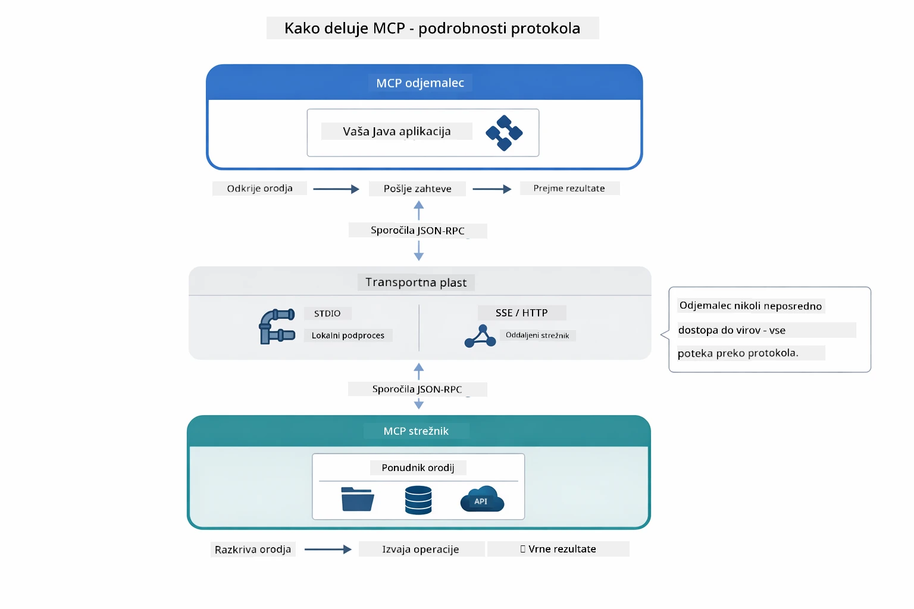

*Kako MCP deluje "pod pokrovom" — odjemalci odkrijejo orodja, izmenjujejo JSON-RPC sporočila in izvedejo operacije prek transportne plasti.*

**Arhitektura strežnik-odjemalec**

MCP uporablja model strežnik-odjemalec. Strežniki nudijo orodja - branje datotek, poizvedbe baz, klicanje API-jev. Odjemalci (vaša AI aplikacija) se povežejo s strežniki in uporabljajo njihova orodja.

Za uporabo MCP z LangChain4j dodajte to Maven odvisnost:

```xml
<dependency>
    <groupId>dev.langchain4j</groupId>
    <artifactId>langchain4j-mcp</artifactId>
    <version>${langchain4j.version}</version>
</dependency>
```

**Odkritje orodij**

Ko se vaš odjemalec poveže z MCP strežnikom, vpraša "Katera orodja imate?" Strežnik odgovori z seznamom razpoložljivih orodij, vsak z opisi in shemami parametrov. Vaš AI agent se lahko nato odloči, katera orodja bo uporabil glede na uporabniške zahteve.

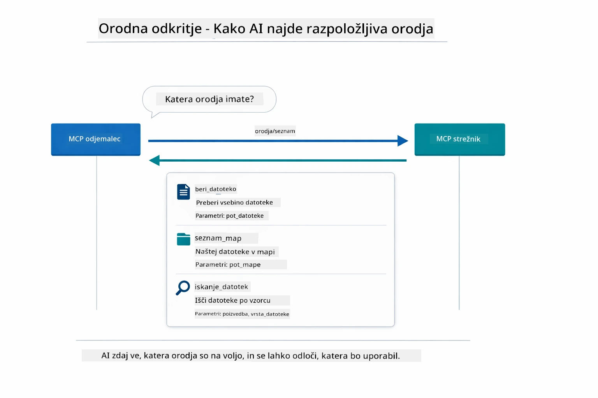

*AI odkrije razpoložljiva orodja ob zagonu — zdaj ve, katere zmogljivosti so na voljo in se odloči, katera bo uporabil.*

**Transportni mehanizmi**

MCP podpira različne transportne mehanizme. Ta modul prikazuje Stdio transport za lokalne procese:


*Transportni mehanizmi MCP: HTTP za oddaljene strežnike, Stdio za lokalne procese*

**Stdio** - [StdioTransportDemo.java](../../../05-mcp/src/main/java/com/example/langchain4j/mcp/StdioTransportDemo.java)

Za lokalne procese. Vaša aplikacija zažene strežnik kot podproces in komunicira preko standardnega vhoda/izhoda. Uporabno za dostop do datotečnega sistema ali orodji ukazne vrstice.

```java
McpTransport stdioTransport = new StdioMcpTransport.Builder()
    .command(List.of(
        npmCmd, "exec",
        "@modelcontextprotocol/server-filesystem@2025.12.18",
        resourcesDir
    ))
    .logEvents(false)
    .build();
```

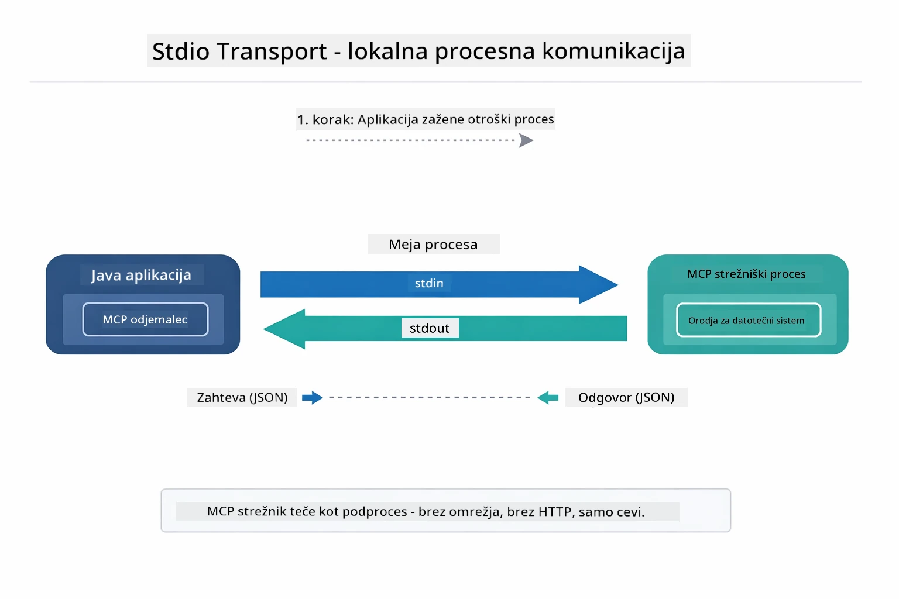

*Stdio transport v akciji — vaša aplikacija zažene MCP strežnik kot otroški proces in komunicira prek каналов stdin/stdout.*

> **🤖 Preizkusite z [GitHub Copilot](https://github.com/features/copilot) Chat:** Odprite [`StdioTransportDemo.java`](../../../05-mcp/src/main/java/com/example/langchain4j/mcp/StdioTransportDemo.java) in vprašajte:
> - "Kako deluje Stdio transport in kdaj naj ga uporabim v primerjavi z HTTP?"
> - "Kako LangChain4j upravlja življenjski cikel zagona MCP strežnikov?"
> - "Kakšne so varnostne posledice, če AI dajemo dostop do datotečnega sistema?"

## Agentni modul

Medtem ko MCP zagotavlja standardizirana orodja, LangChain4j-jeven **agentni modul** nudi deklarativen način za gradnjo agentov, ki orkestrirajo ta orodja. Anotacija `@Agent` in `AgenticServices` omogočata definiranje vedenja agenta prek vmesnikov namesto imperativne kode.

V tem modulu boste raziskali vzorec **nadzornega agenta** — napredni agentni pristop, kjer "nadzornik" dinamično odloča, katere pod-agente poklicati na podlagi uporabniške zahteve. Kombinirali bomo oba koncepta in enemu od naših pod-agentov dali dostop do datotek prek MCP-ja.

Za uporabo agentnega modula dodajte to Maven odvisnost:

```xml
<dependency>
    <groupId>dev.langchain4j</groupId>
    <artifactId>langchain4j-agentic</artifactId>
    <version>${langchain4j.mcp.version}</version>
</dependency>
```

> **⚠️ Eksperimentalno:** Modul `langchain4j-agentic` je **eksperimentalni** in se lahko spreminja. Stabilen način za izdelavo AI pomočnikov ostaja `langchain4j-core` s prilagojenimi orodji (Modul 04).

## Zagon primerov

### Zahteve

- Java 21+, Maven 3.9+
- Node.js 16+ in npm (za MCP strežnike)
- Okoljske spremenljivke nastavljene v `.env` datoteki (iz korenske mape):
  - `AZURE_OPENAI_ENDPOINT`, `AZURE_OPENAI_API_KEY`, `AZURE_OPENAI_DEPLOYMENT` (kot pri modulih 01-04)

> **Opomba:** Če okoljskih spremenljivk še niste nastavili, glejte [Modul 00 - Hiter začetek](../00-quick-start/README.md) za navodila ali kopirajte `.env.example` v `.env` v korenski mapi in izpolnite svoje vrednosti.

## Hiter začetek

**Uporaba VS Code:** Preprosto kliknite z desnim gumbom na katerokoli datoteko demonstracije v Raziskovalcu in izberite **"Run Java"**, ali uporabite začetne konfiguracije iz panela za zagon in odpravljanje napak (prepričajte se, da ste najprej dodali svoj žeton v `.env` datoteko).

**Uporaba Maven:** Alternativno lahko zaženete iz ukazne vrstice z naslednjimi primeri.

### Operacije z datotekami (Stdio)

To prikazuje orodja na osnovi lokalnih podprocesov.

**✅ Ni zahtev** - MCP strežnik se samodejno zažene.

**Uporaba zagonskih skript (priporočeno):**

Zagonske skripte samodejno naložijo okoljske spremenljivke iz korenske `.env` datoteke:

**Bash:**
```bash
cd 05-mcp
chmod +x start-stdio.sh
./start-stdio.sh
```

**PowerShell:**
```powershell
cd 05-mcp
.\start-stdio.ps1
```

**Uporaba VS Code:** Z desnim klikom na `StdioTransportDemo.java` izberite **"Run Java"** (poskrbite, da je `.env` pravilno konfiguriran).

Aplikacija samodejno zažene MCP strežnik za datotečni sistem in prebere lokalno datoteko. Opazujte, kako se upravljanje podprocesov izvede za vas.

**Pričakovani izhod:**
```
Assistant response: The file provides an overview of LangChain4j, an open-source Java library
for integrating Large Language Models (LLMs) into Java applications...
```

### Nadzorni agent

Vzorcu **nadzornega agenta** gre za **prilagodljiv** način agentne AI. Nadzornik uporablja velik jezikovni model (LLM), da avtonomno odloči, katere agente poklicati glede na uporabniško zahtevo. V naslednjem primeru kombiniramo MCP-podprti dostop do datotek z LLM agentom, da ustvarimo nadzorovani delovni tok branja datoteke → poročila.

V demo različici `FileAgent` prebere datoteko z MCP orodji za datotečni sistem, `ReportAgent` pa ustvari strukturirano poročilo z izvršnim povzetkom (ena poved), 3 ključnimi točkami in priporočili. Nadzornik to pot orkestrira samodejno:

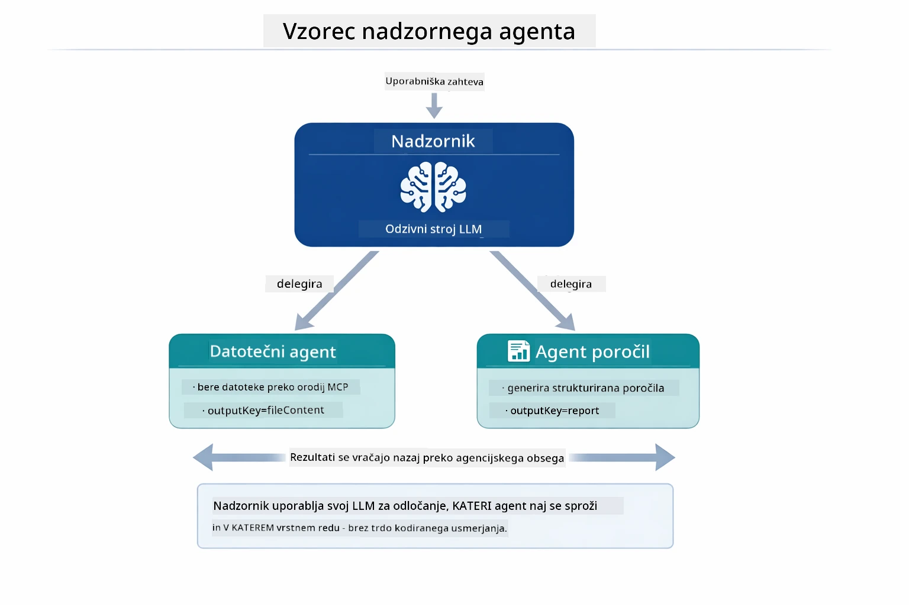

*Nadzornik uporablja svoj LLM, da se odloči, katere agente poklicati in v kakšnem vrstnem redu — ni potrebna ročno določena pot.*

Tako izgleda konkreten delovni tok za našo cevovod od datoteke do poročila:

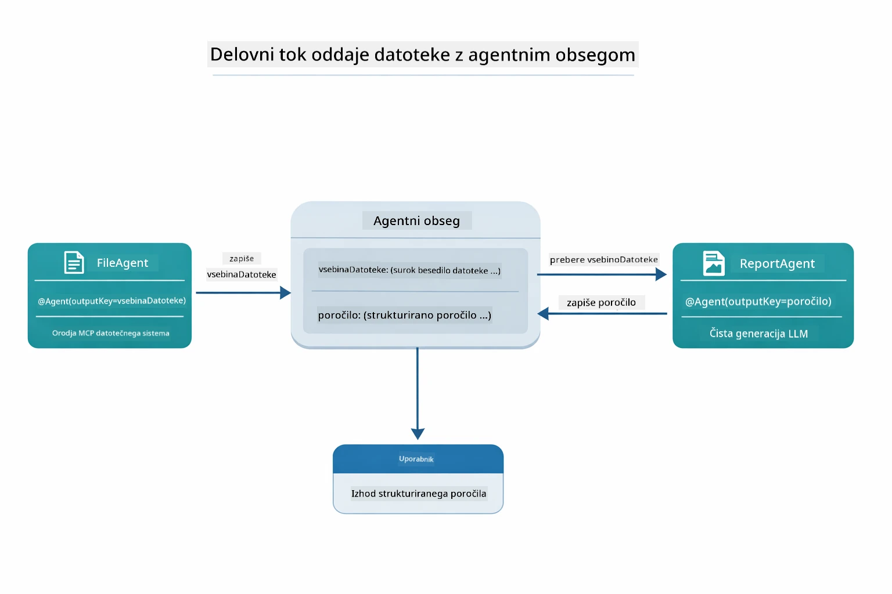

*FileAgent prebere datoteko prek MCP orodij, nato ReportAgent pretvori surovo vsebino v strukturirano poročilo.*

Vsak agent shrani svoj izhod v **Agentni obseg** (deljeni pomnilnik), kar omogoča agentom v nadaljnjih korakih dostop do prej shranjenih rezultatov. To prikazuje, kako se MCP orodja brez težav integrirajo v agentne delovne tokove — nadzornik ne potrebuje poznati *kako* se datoteke berejo, le da to `FileAgent` lahko izvede.

#### Zagon demonstracije

Zagonske skripte samodejno naložijo okoljske spremenljivke iz korenske `.env` datoteke:

**Bash:**
```bash
cd 05-mcp
chmod +x start-supervisor.sh
./start-supervisor.sh
```

**PowerShell:**
```powershell
cd 05-mcp
.\start-supervisor.ps1
```

**Uporaba VS Code:** Z desnim klikom na `SupervisorAgentDemo.java` izberite **"Run Java"** (poskrbite, da je `.env` pravilno konfiguriran).

#### Kako nadzornik deluje

```java
// Korak 1: FileAgent bere datoteke z uporabo orodij MCP
FileAgent fileAgent = AgenticServices.agentBuilder(FileAgent.class)
        .chatModel(model)
        .toolProvider(mcpToolProvider)  // Ima orodja MCP za operacije z datotekami
        .build();

// Korak 2: ReportAgent ustvarja strukturirane poročila
ReportAgent reportAgent = AgenticServices.agentBuilder(ReportAgent.class)
        .chatModel(model)
        .build();

// Nadzornik usklajuje potek dela datoteka → poročilo
SupervisorAgent supervisor = AgenticServices.supervisorBuilder()
        .chatModel(model)
        .subAgents(fileAgent, reportAgent)
        .responseStrategy(SupervisorResponseStrategy.LAST)  // Vrni končno poročilo
        .build();

// Nadzornik odloči, katere agente sprožiti na podlagi zahteve
String response = supervisor.invoke("Read the file at /path/file.txt and generate a report");
```

#### Strategije odziva

Ko konfigurirate `SupervisorAgent`, določite, kako naj oblikuje svoj končni odgovor uporabniku po tem, ko so pod-agenti zaključili svoje naloge.

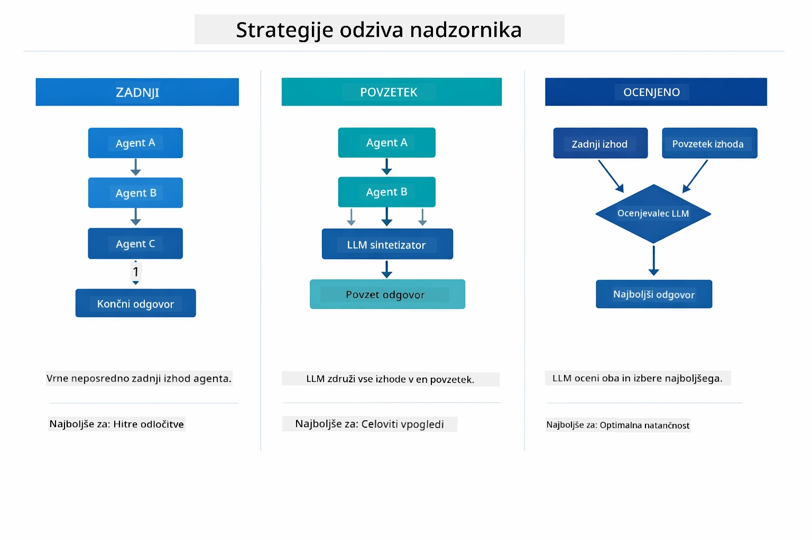

*Tri strategije glede na to, kako nadzornik oblikuje dokončni odgovor — izberite glede na to, ali želite izhod zadnjega agenta, sintetiziran povzetek ali najbolj ocenjen odgovor.*

Na voljo so naslednje strategije:

| Strategija | Opis |
|------------|------|
| **LAST**   | Nadzornik vrne izhod zadnjega priklicanega pod-agenta ali orodja. Uporabno, kadar je zadnji agent v delovnem toku posebej zasnovan za izdelavo celovitega, dokončnega odgovora (npr. "Povzetek agenta" v raziskovalnem procesu). |
| **SUMMARY**| Nadzornik uporabi svoj notranji jezikovni model (LLM), da sintetizira povzetek celotne interakcije in vseh izhodov pod-agentov, nato ta povzetek vrne kot končni odgovor. To omogoča čist, združen odgovor uporabniku. |
| **SCORED** | Sistem uporabi notranji LLM, da oceni tako **LAST** kot **SUMMARY** odziv glede na prvotno zahtevo uporabnika in vrne tistega z višjo oceno. |

Celotno implementacijo si oglejte v [SupervisorAgentDemo.java](../../../05-mcp/src/main/java/com/example/langchain4j/mcp/SupervisorAgentDemo.java).

> **🤖 Preizkusite z [GitHub Copilot](https://github.com/features/copilot) Chat:** Odprite [`SupervisorAgentDemo.java`](../../../05-mcp/src/main/java/com/example/langchain4j/mcp/SupervisorAgentDemo.java) in vprašajte:
> - "Kako nadzornik odloča, katere agente priklicati?"
> - "Kakšna je razlika med vzorcem nadzornik in vzorcem zaporednega delovnega toka?"
> - "Kako lahko prilagodim načrtovalno vedenje nadzornika?"

#### Razumevanje izhoda

Ko zaženete demo, boste videli strukturiran pregled, kako nadzornik orkestrira več agentov. Tukaj je pomen posameznega dela:

```
======================================================================
  FILE → REPORT WORKFLOW DEMO
======================================================================

This demo shows a clear 2-step workflow: read a file, then generate a report.
The Supervisor orchestrates the agents automatically based on the request.
```

**Naslov** uvaja koncept delovnega toka: osredotočena cevovodna pot od branja datoteke do izdelave poročila.

```
--- WORKFLOW ---------------------------------------------------------
  ┌─────────────┐      ┌──────────────┐
  │  FileAgent  │ ───▶ │ ReportAgent  │
  │ (MCP tools) │      │  (pure LLM)  │
  └─────────────┘      └──────────────┘
   outputKey:           outputKey:
   'fileContent'        'report'

--- AVAILABLE AGENTS -------------------------------------------------
  [FILE]   FileAgent   - Reads files via MCP → stores in 'fileContent'
  [REPORT] ReportAgent - Generates structured report → stores in 'report'
```

**Diagram delovnega toka** prikazuje pretok podatkov med agenti. Vsak agent ima specifično vlogo:
- **FileAgent** bere datoteke z MCP orodji in shrani surovo vsebino v `fileContent`
- **ReportAgent** uporablja to vsebino ter ustvari strukturirano poročilo v `report`

```
--- USER REQUEST -----------------------------------------------------
  "Read the file at .../file.txt and generate a report on its contents"
```

**Uporabniška zahteva** prikazuje nalogo. Nadzornik jo analizira in odloči se za zaporedje FileAgent → ReportAgent.

```
--- SUPERVISOR ORCHESTRATION -----------------------------------------
  The Supervisor decides which agents to invoke and passes data between them...

  +-- STEP 1: Supervisor chose -> FileAgent (reading file via MCP)
  |
  |   Input: .../file.txt
  |
  |   Result: LangChain4j is an open-source, provider-agnostic Java framework for building LLM...
  +-- [OK] FileAgent (reading file via MCP) completed

  +-- STEP 2: Supervisor chose -> ReportAgent (generating structured report)
  |
  |   Input: LangChain4j is an open-source, provider-agnostic Java framew...
  |
  |   Result: Executive Summary...
  +-- [OK] ReportAgent (generating structured report) completed
```

**Orkestracija nadzornika** prikazuje dvorazsežni tok v akciji:
1. **FileAgent** prebere datoteko prek MCP in shrani vsebino
2. **ReportAgent** prejme vsebino in ustvari strukturirano poročilo

Nadzornik je te odločitve sprejel **avtonomno** na podlagi uporabnikove zahteve.

```
--- FINAL RESPONSE ---------------------------------------------------
Executive Summary
...

Key Points
...

Recommendations
...

--- AGENTIC SCOPE (Data Flow) ----------------------------------------
  Each agent stores its output for downstream agents to consume:
  * fileContent: LangChain4j is an open-source, provider-agnostic Java framework...
  * report: Executive Summary...
```

#### Pojasnilo funkcij agentnega modula

Primer prikazuje več naprednih funkcij agentnega modula. Podrobneje si poglejmo Agentni obseg in poslušalce agentov.

**Agentni obseg** prikazuje deljeni pomnilnik, kjer so agenti shranili svoje rezultate z uporabo `@Agent(outputKey="...")`. To omogoča:
- Kasnejšim agentom dostop do izhodov prejšnjih agentov
- Nadzorniku sintetizirati končni odgovor
- Preverjanje, kaj je kateri agent ustvaril

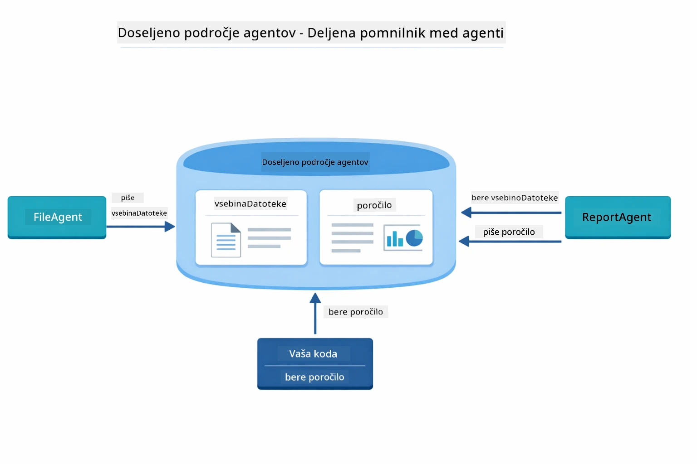

*Agentni obseg deluje kot deljeni pomnilnik — FileAgent zapisuje `fileContent`, ReportAgent ga bere in piše `report`, vaša koda prebere končni rezultat.*

```java
ResultWithAgenticScope<String> result = supervisor.invokeWithAgenticScope(request);
AgenticScope scope = result.agenticScope();
String fileContent = scope.readState("fileContent");  // Surovi podatki datoteke iz FileAgent
String report = scope.readState("report");            // Strukturirano poročilo iz ReportAgent
```

**Poslušalci agentov** omogočajo spremljanje in odpravljanje napak izvrševanja agentov. Korak-po-korak izhod, ki ga vidite v demonstraciji, prihaja iz AgentListenerja, ki je povezan z vsakim priklicem agenta:
- **beforeAgentInvocation** - Kliče se, ko nadzornik izbere agenta, kar omogoča vpogled, kateri agent je bil izbran in zakaj
- **afterAgentInvocation** - Kliče se, ko agent konča, prikazuje rezultat
- **inheritedBySubagents** - Ko je nastavljeno na true, poslušalec spremlja vse agente v hierarhiji

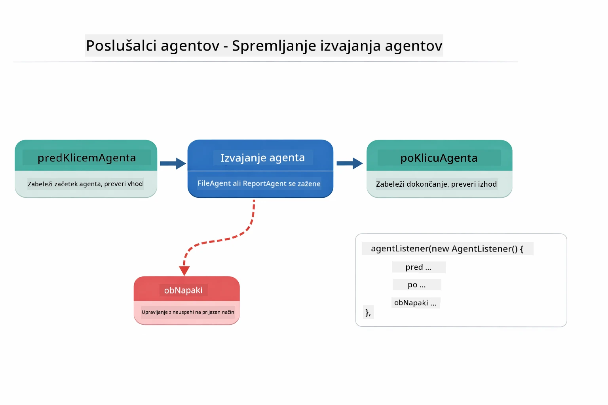

*Poslušalci agentov se priključijo v življenjski cikel izvajanja — spremljajo začnejo, končajo ali naletijo na napake.*

```java
AgentListener monitor = new AgentListener() {
    private int step = 0;
    
    @Override
    public void beforeAgentInvocation(AgentRequest request) {
        step++;
        System.out.println("  +-- STEP " + step + ": " + request.agentName());
    }
    
    @Override
    public void afterAgentInvocation(AgentResponse response) {
        System.out.println("  +-- [OK] " + response.agentName() + " completed");
    }
    
    @Override
    public boolean inheritedBySubagents() {
        return true; // Širi na vse podagentje
    }
};
```

Poleg vzorca nadzornika modul `langchain4j-agentic` ponuja več zmogljivih vzorcev delovnih tokov in funkcij:

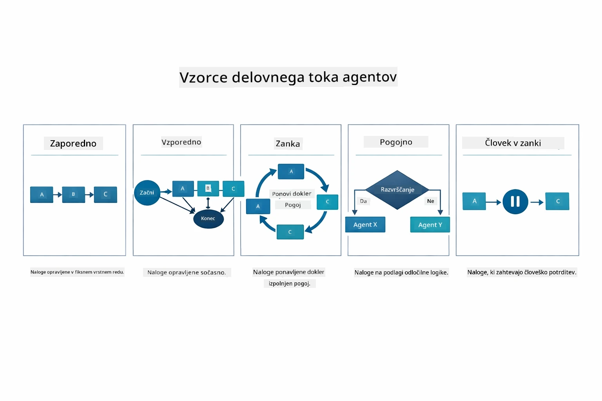

*Pet vzorcev delovnih tokov za orkestracijo agentov — od preprostih zaporednih cevovodov do odobritev z vključenim človekom.*

| Vzorec | Opis | Primer uporabe |
|---------|-------------|----------|
| **Zaporedni** | Izvajaj agente v vrstnem redu, izhod teče naprej | Cevovodi: raziskava → analiza → poročilo |
| **Vzporedni** | Izvajaj agente hkrati | Neodvisne naloge: vreme + novice + delnice |
| **Zanka** | Ponavljaj do izpolnitve pogoja | Ocena kakovosti: izboljšuj, dokler je ocena ≥ 0.8 |
| **Pogojni** | Usmeri glede na pogoje | Razvrsti → usmeri k specializiranemu agentu |
| **Človek v zanki** | Dodaj človeške kontrolne točke | Delovni tokovi odobritev, pregled vsebine |

## Ključni koncepti

Zdaj, ko ste raziskali MCP in modul agentic v praksi, povzemimo, kdaj uporabiti kateri pristop.

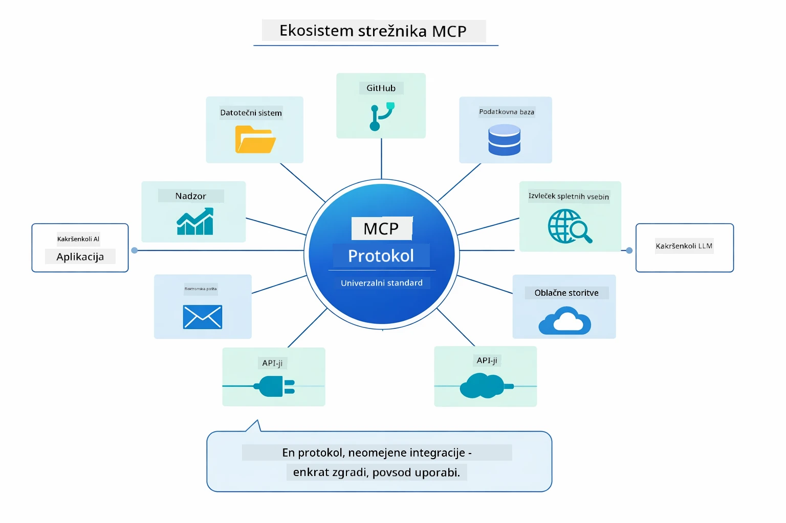

*MCP ustvari univerzalni protokolni ekosistem — kateri koli MCP-kompatibilen strežnik deluje z MCP-kompatibilnim odjemalcem, omogoča deljenje orodij med aplikacijami.*

**MCP** je idealen, če želite izkoristiti obstoječe ekosisteme orodij, graditi orodja, ki jih lahko deli več aplikacij, integrirati storitve tretjih oseb s standardnimi protokoli ali zamenjati implementacije orodij brez spreminjanja kode.

**Modul Agentic** deluje najbolje, ko želite deklarativne definicije agentov z anotacijami `@Agent`, potrebujete orkestracijo delovnih tokov (zaporedno, zanko, vzporedno), raje oblikujete agente prek vmesnikov kot z ukazno kodo, ali združujete več agentov, ki si delijo izhode preko `outputKey`.

**Vzorec nadzornika agenta** izstopa, kadar delovni tok ni vnaprej predvidljiv in želite, da odloča LLM, kadar imate več specializiranih agentov, ki potrebujejo dinamično orkestracijo, pri gradnji pogovornih sistemov, ki usmerjajo k različnim zmožnostim, ali kadar želite najbolj prilagodljivo in prilagodljivo vedenje agentov.

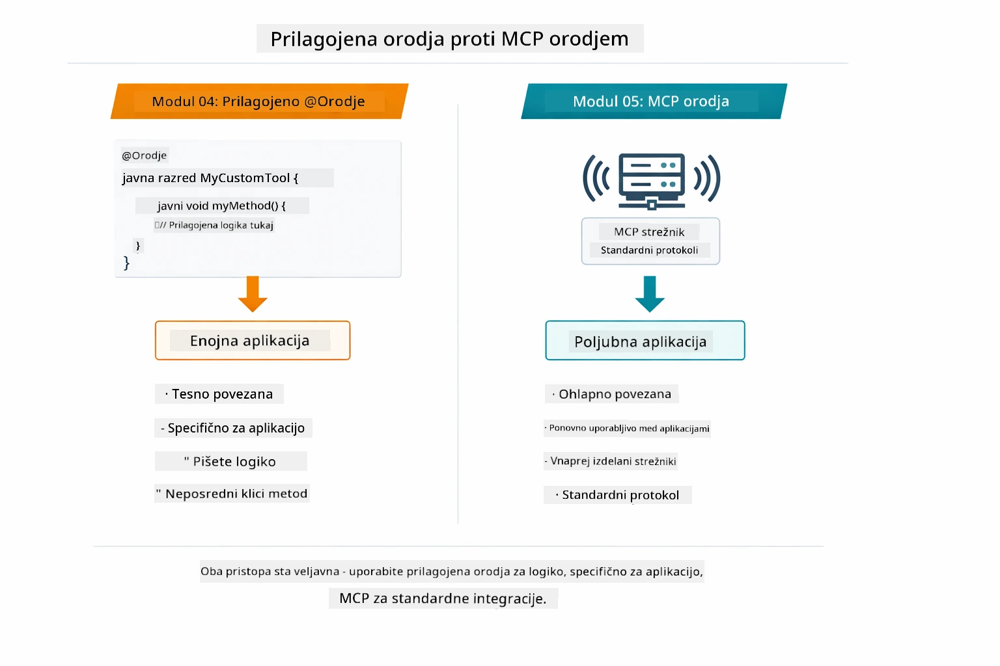

*Kdaj uporabljati prilagojene metode @Tool proti MCP orodjem — prilagojena orodja za aplikacijsko logiko s popolno tipno varnostjo, MCP orodja za standardizirane integracije, ki delujejo med aplikacijami.*

## Čestitke!

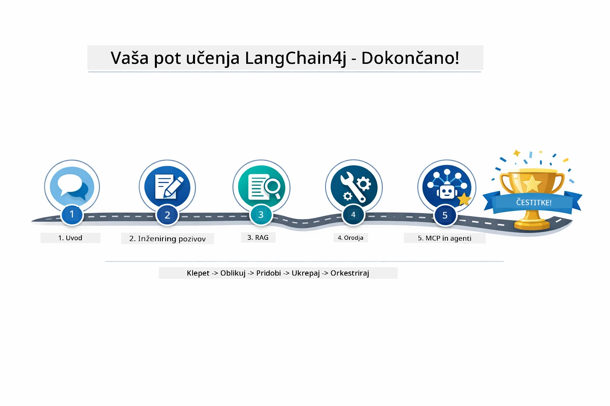

*Vaša učna pot skozi vseh pet modulov — od osnovnega klepeta do agentic sistemov, ki poganjajo MCP.*

Zaključili ste tečaj LangChain4j za začetnike. Naučili ste se:

- Kako zgraditi pogovorni AI s pomnilnikom (Modul 01)
- Vzorce ustvarjanja pozivov za različne naloge (Modul 02)
- Utemeljitev odgovorov v vaših dokumentih z RAG (Modul 03)
- Ustvarjanje osnovnih AI agentov (asistentov) s prilagojenimi orodji (Modul 04)
- Integracijo standardiziranih orodij z LangChain4j MCP in Agentic moduli (Modul 05)

### Kaj sledi?

Po zaključku modulov si oglejte [Vodnik za testiranje](../docs/TESTING.md), da vidite koncepte testiranja LangChain4j v praksi.

**Uradni viri:**
- [LangChain4j Dokumentacija](https://docs.langchain4j.dev/) - Celoviti vodiči in API referenca
- [LangChain4j GitHub](https://github.com/langchain4j/langchain4j) - Izvorna koda in primeri
- [LangChain4j Tutorials](https://docs.langchain4j.dev/tutorials/) - Korak za korakom vodiči za različne primere uporabe

Hvala, ker ste zaključili ta tečaj!

---

**Navigacija:** [← Prejšnji: Modul 04 - Orodja](../04-tools/README.md) | [Nazaj na glavno](../README.md)

---

<!-- CO-OP TRANSLATOR DISCLAIMER START -->
**Omejitev odgovornosti**:  
Ta dokument je bil preveden z uporabo AI prevajalske storitve [Co-op Translator](https://github.com/Azure/co-op-translator). Čeprav si prizadevamo za natančnost, upoštevajte, da lahko avtomatski prevodi vsebujejo napake ali nepravilnosti. Izvirni dokument v njegovem izvorni jezik naj velja za verodostojen vir. Za ključne informacije priporočamo strokovni človeški prevod. Ne prevzemamo odgovornosti za morebitna nesporazume ali napačne interpretacije, ki izhajajo iz uporabe tega prevoda.
<!-- CO-OP TRANSLATOR DISCLAIMER END -->